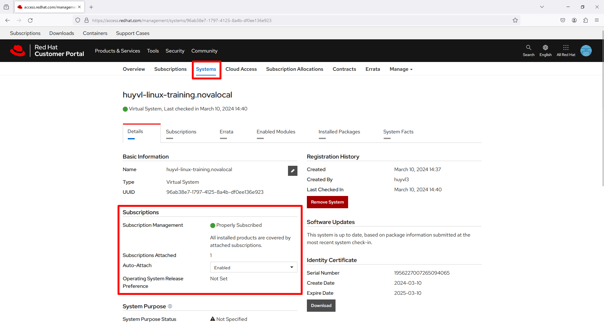

[Phần 3 - Tự động hóa quản trị Linux với Ansible](#)

- [3.1 - Tổng quan Ansible (UPDATED 05/09/2024)]
(#ansible_overview)
    - [3.1.1 - Giới thiệu về tự động hóa (UPDATED 05/09/2024)]
(#automation_intro)
    - [3.1.2 - Giới thiệu về Ansible (UPDATED 05/09/2024)]
(#ansible_intro)
    - [3.1.3 - Tổng quan thành phần Ansible (UPDATED 05/09/2024)]
(#ansible_components)
    - [3.1.4 - Giới thiệu Ansible Navigator (UPDATED 05/09/2024)]
(#ansible_navigator)
- [3.2 - Triển khai Ansible Playbook (UPDATED 05/09/2024)]
(#implementing_ansible_playbook)
    - [3.2.1 - Độ ưu tiên của cấu hình ansible và ansible-navigator (UPDATED 05/09/2024)]
(#ansible_config_priority)
    - [3.2.2 - Quản lý cài đặt ansible-navigator (UPDATED 05/09/2024)]
(#managing_ansible_nav_settings)
    - [3.2.3 - Quản lý cài đặt ansible (UPDATED 05/09/2024)]
(#managing_ansible_settings)

# <a name=""></a>Tự động hóa quản trị Linux với Ansible

## <a name="ansible_overview"></a>Tổng quan Ansible

### <a name="automation_intro"></a>Giới thiệu về tự động hóa

Trong khoảng một thời gian rất dài trong quá khứ, hầu hết các quản trị viên hệ thống và quản lý hạ tầng đều dựa vào việc thực hiện thủ công thông qua giao diện hoặc dòng lệnh. Quản trị viên thường thường thực hiện dựa trên trí nhớ, thói quen và danh sách các đầu mục mà tự bản thân mình đúc kết. Cách tiếp cận này rất dễ tạo ra lỗi, ví dụ như quản trị viên vô tình bỏ qua một bước nào đó và nhận thông báo lỗi xuất hiện ở bước tiếp theo. Việc xác minh các bước đã được thực hiện đúng cách hoặc kết quả có được như mong đợi, ... rất mất thời gian.

Hơn thế nữa, trong hoàn cảnh quản lý nhiều thiết bị bằng thủ công thường sẽ xảy ra trường hợp tuy chúng có cùng cấu hình nhưng lại khác nhau ở những điểm rất nhỏ. Điều này làm cho việc quản trị trở nên khó khăn và mất tính ổn định. Tự động hóa giúp giảm lượng thao tác thủ công trên máy chủ từ quản trị viên. Tự động hóa có thể đảm bảo rằng tất cả hệ thống đều được cấu hình một cách nhanh chóng, chính xác.

Một hệ thống tự động hóa cho phép quản trị viên triển khai quản lý ở dạng `Infrastructure as Code`, có nghĩa là ngôn ngữ tự động hóa hoàn toàn dễ đọc dễ tiếp cận. Điều này sẽ giúp lưu trữ ở hệ thống kiểm soát phiên bản như `github`, `gitlab`, ... quản trị viên có thể nhìn thấy sự khác nhau giữa những lần thay đổi.

### <a name="ansible_intro"></a>Giới thiệu về Ansible

`Ansible` là một nền tảng tự động hóa mã nguồn mở. Nó có ngôn ngữ đơn giản và được mô tả trong `Ansible Playbooks`, nó còn được dùng để chạy `Ansible Playbooks`.

`Ansible Playbooks` cung cấp khả năng tự động hóa mà con người có thể đọc được, hoàn toàn không chứa những kỹ thuật lập trình đặc biệt nào. `Ansible` được định hướng là Agentless tức là quản trị không cần cài đặt bất kỳ chương trình nào có nhiệm vụ nhận lệnh và thực hiện.

`Ansible` có những điểm nhấn mạnh sau:

- Hỗ trợ đa nền tảng: không cần cài chương trình đặc biệt nào trên thiết bị Linux, Windows, ...
- Ngôn ngữ đơn giản: viết `ansible playbooks` dựa trên ngôn ngữ YAML.
- Khả năng tích hợp dễ dàng với các hệ thống khác như Jenkins, Puppet, HP SA hoặc sản phẩm đặc thù Red Hat Satellite.

Kiến trúc `Ansible` bao gồm 2 loại thiết bị:

- Control node: `ansible` sẽ được cài đặt trên đây.
- Managed hosts: các thiết bị được liệt kê trong `inventory`, là cái tổ chức hệ thống thành các nhóm để dễ dàng quản lý. Quản trị viên hoàn toàn có thể định nghĩa chúng ở dạng tĩnh hoặc động lấy dữ liệu từ một nguồn khác.

Để thực hiện một mục tiêu `play` nào đó thì ansible sẽ thực hiện một chuỗi các nhiệm vụ được mô tả ở định dạng YAML. Một tệp có thể chứa nhiều `play` được gọi là `playbook`. 

Mỗi `task` tương đương với một mô-đun, cũng là phần nhỏ nhất của mã được viết bằng ngôn ngữ Python, Powershell, ... Ansible cung cấp hàng trăm mô-đun hữu ích để có thể hỗ trợ các nhu cầu tự động hóa khác nhau, những mô-đun này có thể thao tác trên tệp hệ thống, cài đặt phần mềm hoặc gọi API.

`Ansible` hướng đến việc agentless. Cụ thể, khi quản trị viên chạy `Ansible Playbook` thì máy chủ control sẽ kết nối đến các managed host qua giao thức SSH (mặc định) hoặc WinRM. Điều này có nghĩa là quản trị viên không cần một chương trình đặc thù nào của ansible được cài đặt trên managed hosts.

Những tư tưởng được áp dụng khi thiết kế Ansible như sau:

- Sự phức tạp kìm hãm năng suất: càng đơn giản càng tốt vì thế Ansible được thiết kế thành một công cụ đơn giản để sử dụng và ngôn ngữ hỗ trợ tự động hóa rất dễ viết và đọc. Quản trị viên nên thừa kế và tận dụng điều này để đơn giản hóa việc làm thế nào để tạo ra hệ thống tự động hóa.
- Ưu tiên việc dễ đọc: ngôn ngữ tự động hóa Ansible được xây dụng xung quanh sự đơn giản, hoàn toàn dựa trên văn bản mà con người có thể đọc được. `Ansible Playbooks` mô tả rất rõ ràng quá trình tự động hóa.
- Suy nghĩ dứt khoát: nếu suy nghĩ rằng Ansible giống như các ngôn ngữ kịch bản Python, Bash script, ... thì đây không phải là hướng tiếp cận đúng.

### <a name="ansible_components"></a>Tổng quan thành phần Ansible

Nền tảng tự động hóa Ansible bao gồm các thành phần riêng biệt cùng nhau cung cấp một bộ công cụ, tài nguyên tự động hóa hoàn chỉnh.

- `Ansible Core`: cung cấp các chức năng cơ bản để chạy `Ansible Playbooks`. Nó được thiết kế để hiểu và viết `Ansible Playbooks` theo định dạng các tệp YAML. Các chức năng chính bao gồm vòng lặp, điều kiện so sánh, ...
- `Ansible Content Collections`: về mặt lịch sử, ansible cung cấp một số lượng rất lớn mô-đun và được nằm sẵn trong gói cài đặt `Ansible Core`. Kèm theo đó với sự thành công và phát triển nhanh như vũ bảo của ansible thì số lượng mô-đun tăng lên theo cấp số nhân. Chính lúc này đã tạo ra một vấn đề, các nhà phát triển đã tổ chức lại, tách lượng lớn các mô-đun thành `Ansible Content Collection` và lúc này `Ansible Core` chỉ còn tập mô-đun nhỏ được cung cấp mặc định bởi `ansible.builtin`. Như vậy nếu một mô-đun mới được tạo ra hoặc cập nhật thì người dùng hoàn toàn sử dụng được mà không cần cập nhật `Ansible Core`.
- `Automation Content Navigator`: đây là một công cụ tên `ansible-navigator`, được sử dụng để thay thế và mở rộng vì nó đã bao gồm: `ansible-playbook`, `anssible-inventory`, `ansible-config`, ...
- `Automation Execution Environments` là một container chứa Ansible Core, Ansible Content Collections và các thư viện Python cần thiết, ... một môi trường mà có thể chạy được playbook.
- `Automation Hub`: dịch vụ công cộng [console.redhat.com](console.redhat.com) để truy cập vào `Ansible Content Collection` của RedHat, người dùng có thể tải xuống và sử dụng `ansible-galaxy` (dành cho `ansible-navigator`).

Để chạy được Ansible Playbooks thì control node cần cài đặt `ansible-navigator` và tải về môi trường thực thi. Như đã mô tả, những managed host được quản lý bởi Ansible không cần cài đặt chương trình đặc biệt. Vì Ansible chạy trực tiếp dựa trên ngôn ngữ Python (không giống với các chương trình được "compile" từ C/C++) nên cần cài đặt Python trước để có thể sử dụng được Ansible, điều này tương tự như các lập trình viên Java cần cài đặt JRE/JDK trước khi sử dụng Eclipse.

Đối với người dùng đang kích hoạt `Simple Content Access` thì có thể kích hoạt repo trực tiếp mà không cần `subscription-manager attach --auto` như sau:

<div style="text-align:center"></div>

<div style="text-align:center"></div>

```shell
[root@huyvl-linux-training ~]# subscription-manager register
Registering to: subscription.rhsm.redhat.com:443/subscription
Username: huyvl3
Password:
The system has been registered with ID: 6423e102-3601-4f76-a0aa-e864f4c34802
The registered system name is: huyvl-linux-training.novalocal

WARNING

The yum/dnf plugins: /etc/dnf/plugins/subscription-manager.conf, /etc/dnf/plugins/product-id.conf were automatically enabled for the benefit of Red Hat Subscription Management. If not desired, use "subscription-manager config --rhsm.auto_enable_yum_plugins=0" to block this behavior.

[root@huyvl-linux-training ~]#
[root@huyvl-linux-training ~]# subscription-manager repos --list-enabled
+----------------------------------------------------------+
    Available Repositories in /etc/yum.repos.d/redhat.repo
+----------------------------------------------------------+
Repo ID:   rhel-9-for-x86_64-baseos-rpms
Repo Name: Red Hat Enterprise Linux 9 for x86_64 - BaseOS (RPMs)
Repo URL:  https://cdn.redhat.com/content/dist/rhel9/$releasever/x86_64/baseos/os
Enabled:   1

Repo ID:   rhel-9-for-x86_64-appstream-rpms
Repo Name: Red Hat Enterprise Linux 9 for x86_64 - AppStream (RPMs)
Repo URL:  https://cdn.redhat.com/content/dist/rhel9/$releasever/x86_64/appstream/os
Enabled:   1

[root@huyvl-linux-training ~]#
[root@huyvl-linux-training ~]# subscription-manager repos --enable ansible-automation-platform-2.4-for-rhel-9-x86_64-rpms
Repository 'ansible-automation-platform-2.4-for-rhel-9-x86_64-rpms' is enabled for this system.
[root@huyvl-linux-training ~]# subscription-manager repos --list-enabled
+----------------------------------------------------------+
    Available Repositories in /etc/yum.repos.d/redhat.repo
+----------------------------------------------------------+
Repo ID:   rhel-9-for-x86_64-baseos-rpms
Repo Name: Red Hat Enterprise Linux 9 for x86_64 - BaseOS (RPMs)
Repo URL:  https://cdn.redhat.com/content/dist/rhel9/$releasever/x86_64/baseos/os
Enabled:   1

Repo ID:   rhel-9-for-x86_64-appstream-rpms
Repo Name: Red Hat Enterprise Linux 9 for x86_64 - AppStream (RPMs)
Repo URL:  https://cdn.redhat.com/content/dist/rhel9/$releasever/x86_64/appstream/os
Enabled:   1

Repo ID:   ansible-automation-platform-2.4-for-rhel-9-x86_64-rpms
Repo Name: Red Hat Ansible Automation Platform 2.4 for RHEL 9 x86_64 (RPMs)
Repo URL:  https://cdn.redhat.com/content/dist/layered/rhel9/x86_64/ansible-automation-platform/2.4/os
Enabled:   1

[root@huyvl-linux-training ~]#
[root@huyvl-linux-training ~]# dnf install ansible-navigator
Updating Subscription Management repositories.
Red Hat Ansible Automation Platform 2.4 for RHEL 9 x86_64 (RPMs)                                                                                                              1.5 MB/s | 2.7 MB     00:01
Last metadata expiration check: 0:00:01 ago on Sun Mar 10 03:29:19 2024.
Dependencies resolved.
==============================================================================================================================================================================================================
 Package                                            Architecture                  Version                                 Repository                                                                     Size
==============================================================================================================================================================================================================
Installing:
 ansible-navigator                                  noarch                        3.4.1-1.el9ap                           ansible-automation-platform-2.4-for-rhel-9-x86_64-rpms                        381 k
Installing dependencies:
 ansible-builder                                    noarch                        3.0.1-1.el9ap                           ansible-automation-platform-2.4-for-rhel-9-x86_64-rpms                         64 k
 ansible-runner                                     noarch                        2.3.5-1.el9ap                           ansible-automation-platform-2.4-for-rhel-9-x86_64-rpms                        8.0 k
 conmon                                             x86_64                        2:2.1.8-1.el9                           rhel-9-for-x86_64-appstream-rpms                                               54 k
 container-selinux                                  noarch                        3:2.221.0-1.el9                         rhel-9-for-x86_64-appstream-rpms                                               60 k
 containers-common                                  x86_64                        2:1-55.el9                              rhel-9-for-x86_64-appstream-rpms                                              138 k
 criu                                               x86_64                        3.18-1.el9                              rhel-9-for-x86_64-appstream-rpms                                              555 k
 crun                                               x86_64                        1.8.7-1.el9                             rhel-9-for-x86_64-appstream-rpms                                              208 k
 fuse-common                                        x86_64                        3.10.2-6.el9                            rhel-9-for-x86_64-baseos-rpms                                                 8.5 k
 fuse-overlayfs                                     x86_64                        1.12-1.el9                              rhel-9-for-x86_64-appstream-rpms                                               69 k
 fuse3                                              x86_64                        3.10.2-6.el9                            rhel-9-for-x86_64-appstream-rpms                                               57 k
 fuse3-libs                                         x86_64                        3.10.2-6.el9                            rhel-9-for-x86_64-appstream-rpms                                               93 k
 git-core                                           x86_64                        2.39.3-1.el9_2                          rhel-9-for-x86_64-appstream-rpms                                              4.3 M
 iptables-nft                                       x86_64                        1.8.8-6.el9_1                           rhel-9-for-x86_64-baseos-rpms                                                 207 k
 libnet                                             x86_64                        1.2-6.el9                               rhel-9-for-x86_64-appstream-rpms                                               61 k
 libnftnl                                           x86_64                        1.2.2-1.el9                             rhel-9-for-x86_64-baseos-rpms                                                  85 k
 libslirp                                           x86_64                        4.4.0-7.el9                             rhel-9-for-x86_64-appstream-rpms                                               72 k
 netavark                                           x86_64                        2:1.7.0-2.el9_3                         rhel-9-for-x86_64-appstream-rpms                                              3.6 M
 nftables                                           x86_64                        1:1.0.4-11.el9_3                        rhel-9-for-x86_64-baseos-rpms                                                 404 k
 oniguruma                                          x86_64                        6.9.6-1.el9.5                           rhel-9-for-x86_64-appstream-rpms                                              221 k
 podman                                             x86_64                        2:4.6.1-8.el9_3                         rhel-9-for-x86_64-appstream-rpms                                               15 M
 protobuf-c                                         x86_64                        1.3.3-13.el9                            rhel-9-for-x86_64-baseos-rpms                                                  37 k
 python3-ansible-runner                             noarch                        2.3.5-1.el9ap                           ansible-automation-platform-2.4-for-rhel-9-x86_64-rpms                        124 k
 python3-bindep                                     noarch                        2.10.2-3.el9ap                          ansible-automation-platform-2.4-for-rhel-9-x86_64-rpms                         58 k
 python3-cffi                                       x86_64                        1.15.0-3.el9ap                          ansible-automation-platform-2.4-for-rhel-9-x86_64-rpms                        241 k
 python3-daemon                                     noarch                        2.3.0-4.el9ap                           ansible-automation-platform-2.4-for-rhel-9-x86_64-rpms                         38 k
 python3-docutils                                   noarch                        0.16-4.el9ap                            ansible-automation-platform-2.4-for-rhel-9-x86_64-rpms                        1.5 M
 python3-importlib-metadata                         noarch                        6.0.1-1.el9ap                           ansible-automation-platform-2.4-for-rhel-9-x86_64-rpms                         43 k
 python3-lockfile                                   noarch                        1:0.12.2-1.el9ap                        ansible-automation-platform-2.4-for-rhel-9-x86_64-rpms                         34 k
 python3-onigurumacffi                              x86_64                        1.1.0-3.el9ap                           ansible-automation-platform-2.4-for-rhel-9-x86_64-rpms                         25 k
 python3-packaging                                  noarch                        21.3-2.el9ap                            ansible-automation-platform-2.4-for-rhel-9-x86_64-rpms                         72 k
 python3-parsley                                    noarch                        1.3-2.el9pc                             ansible-automation-platform-2.4-for-rhel-9-x86_64-rpms                        169 k
 python3-pbr                                        noarch                        5.8.1-2.el9ap                           ansible-automation-platform-2.4-for-rhel-9-x86_64-rpms                        137 k
 python3-pycparser                                  noarch                        2.21-2.el9pc                            ansible-automation-platform-2.4-for-rhel-9-x86_64-rpms                        195 k
 python3-pyparsing                                  noarch                        3.0.9-1.el9ap                           ansible-automation-platform-2.4-for-rhel-9-x86_64-rpms                        202 k
 python3-requirements-parser                        noarch                        0.2.0-4.el9ap                           ansible-automation-platform-2.4-for-rhel-9-x86_64-rpms                         21 k
 python3-zipp                                       noarch                        3.4.0-4.el9pc                           ansible-automation-platform-2.4-for-rhel-9-x86_64-rpms                         17 k
 shadow-utils-subid                                 x86_64                        2:4.9-8.el9                             rhel-9-for-x86_64-baseos-rpms                                                  89 k
 slirp4netns                                        x86_64                        1.2.1-1.el9                             rhel-9-for-x86_64-appstream-rpms                                               49 k
 yajl                                               x86_64                        2.1.0-22.el9                            rhel-9-for-x86_64-appstream-rpms                                               42 k
Installing weak dependencies:
 aardvark-dns                                       x86_64                        2:1.7.0-1.el9                           rhel-9-for-x86_64-appstream-rpms                                              1.0 M
 criu-libs                                          x86_64                        3.18-1.el9                              rhel-9-for-x86_64-appstream-rpms                                               32 k

Transaction Summary
==============================================================================================================================================================================================================
Install  42 Packages

Total download size: 30 M
Installed size: 109 M
Is this ok [y/N]:
```

Đối với người dùng đã vô hiệu hóa `Simple Content Access` thì cần thực hiện lệnh `subscription-manager attach --auto` trước khi kích hoạt repo như sau:

<div style="text-align:center"></div>

<div style="text-align:center"></div>

```shell
[root@huyvl-linux-training ~]# subscription-manager register
Registering to: subscription.rhsm.redhat.com:443/subscription
Username: huyvl3
Password:
The system has been registered with ID: e48f0d98-3c5e-4459-82c4-9f6eba907889
The registered system name is: huyvl-linux-training.novalocal

WARNING

The yum/dnf plugins: /etc/dnf/plugins/subscription-manager.conf, /etc/dnf/plugins/product-id.conf were automatically enabled for the benefit of Red Hat Subscription Management. If not desired, use "subscription-manager config --rhsm.auto_enable_yum_plugins=0" to block this behavior.

[root@huyvl-linux-training ~]#
[root@huyvl-linux-training ~]#
[root@huyvl-linux-training ~]#
[root@huyvl-linux-training ~]# subscription-manager repos --enable ansible-automation-platform-2.4-for-rhel-9-x86_64-rpms
This system has no repositories available through subscriptions.
[root@huyvl-linux-training ~]# dnf install ansible-navigator
Updating Subscription Management repositories.
Last metadata expiration check: 0:00:10 ago on Sun Mar 10 03:40:51 2024.
No match for argument: ansible-navigator
Error: Unable to find a match: ansible-navigator
[root@huyvl-linux-training ~]# dnf whatprovides ansible-navigator
Updating Subscription Management repositories.
Last metadata expiration check: 0:00:21 ago on Sun Mar 10 03:40:51 2024.
Error: No matches found. If searching for a file, try specifying the full path or using a wildcard prefix ("*/") at the beginning.
[root@huyvl-linux-training ~]#
[root@huyvl-linux-training ~]# subscription-manager attach --auto
Installed Product Current Status:
Product Name: Red Hat Enterprise Linux for x86_64
Status:       Subscribed

[root@huyvl-linux-training ~]#
[root@huyvl-linux-training ~]#
[root@huyvl-linux-training ~]# subscription-manager repos --list-enabled
+----------------------------------------------------------+
    Available Repositories in /etc/yum.repos.d/redhat.repo
+----------------------------------------------------------+
Repo ID:   rhel-9-for-x86_64-appstream-rpms
Repo Name: Red Hat Enterprise Linux 9 for x86_64 - AppStream (RPMs)
Repo URL:  https://cdn.redhat.com/content/dist/rhel9/$releasever/x86_64/appstream/os
Enabled:   1

Repo ID:   rhel-9-for-x86_64-baseos-rpms
Repo Name: Red Hat Enterprise Linux 9 for x86_64 - BaseOS (RPMs)
Repo URL:  https://cdn.redhat.com/content/dist/rhel9/$releasever/x86_64/baseos/os
Enabled:   1

[root@huyvl-linux-training ~]# subscription-manager repos --enable ansible-automation-platform-2.4-for-rhel-9-x86_64-rpms
Repository 'ansible-automation-platform-2.4-for-rhel-9-x86_64-rpms' is enabled for this system.
[root@huyvl-linux-training ~]# subscription-manager repos --list-enabled
+----------------------------------------------------------+
    Available Repositories in /etc/yum.repos.d/redhat.repo
+----------------------------------------------------------+
Repo ID:   rhel-9-for-x86_64-baseos-rpms
Repo Name: Red Hat Enterprise Linux 9 for x86_64 - BaseOS (RPMs)
Repo URL:  https://cdn.redhat.com/content/dist/rhel9/$releasever/x86_64/baseos/os
Enabled:   1

Repo ID:   ansible-automation-platform-2.4-for-rhel-9-x86_64-rpms
Repo Name: Red Hat Ansible Automation Platform 2.4 for RHEL 9 x86_64 (RPMs)
Repo URL:  https://cdn.redhat.com/content/dist/layered/rhel9/x86_64/ansible-automation-platform/2.4/os
Enabled:   1

Repo ID:   rhel-9-for-x86_64-appstream-rpms
Repo Name: Red Hat Enterprise Linux 9 for x86_64 - AppStream (RPMs)
Repo URL:  https://cdn.redhat.com/content/dist/rhel9/$releasever/x86_64/appstream/os
Enabled:   1

[root@huyvl-linux-training ~]#
[root@huyvl-linux-training ~]# dnf whatprovides ansible-navigator
Updating Subscription Management repositories.
Last metadata expiration check: 0:00:13 ago on Sun Mar 10 03:46:38 2024.
ansible-navigator-3.3.1-1.el9ap.noarch : A text-based user interface (TUI) for the Red Hat Ansible Automation Platform
Repo        : ansible-automation-platform-2.4-for-rhel-9-x86_64-rpms
Matched from:
Provide    : ansible-navigator = 3.3.1-1.el9ap

ansible-navigator-3.4.1-1.el9ap.noarch : A text-based user interface (TUI) for the Red Hat Ansible Automation Platform
Repo        : ansible-automation-platform-2.4-for-rhel-9-x86_64-rpms
Matched from:
Provide    : ansible-navigator = 3.4.1-1.el9ap

[root@huyvl-linux-training ~]#
```

Sau khi cài đặt thực hiện đăng nhập và tải về môi trường thực thi `ee-supported-rhel8`, quá trình này diễn ra tự động nên có thể sẽ có tên khác:

```shell
[root@huyvl-linux-training ~]# podman login -u huyvl3 registry.redhat.io
Password:
Login Succeeded!
[root@huyvl-linux-training ~]# ansible-navigator images
--------------------------------------------------------------------------------------------------------------
Execution environment image and pull policy overview
--------------------------------------------------------------------------------------------------------------
Execution environment image name:     registry.redhat.io/ansible-automation-platform-24/ee-supported-rhel8:latest
Execution environment image tag:      latest
Execution environment pull arguments: None
Execution environment pull policy:    tag
Execution environment pull needed:    True
--------------------------------------------------------------------------------------------------------------
Updating the execution environment
--------------------------------------------------------------------------------------------------------------
Running the command: podman pull registry.redhat.io/ansible-automation-platform-24/ee-supported-rhel8:latest
Trying to pull registry.redhat.io/ansible-automation-platform-24/ee-supported-rhel8:latest...
Getting image source signatures
Checking if image destination supports signatures
Copying blob 87e3ab05d9a4 done
Copying blob 08c375495313 done
Copying blob 1de299fb0d50 done
Copying blob dc9b17c0a14e done
Copying config 80a02196e3 done
Writing manifest to image destination
Storing signatures
80a02196e30edffdb7b41aa7ac37628559fdf6aebe066f53c0e68a49450b4917
[root@huyvl-linux-training ~]#
```

Cài đặt `ansible-core` như sau:

```shell
[root@huyvl-linux-training ~]# dnf install ansible-core -y
Updating Subscription Management repositories.
Last metadata expiration check: 2:45:25 ago on Mon Mar 11 13:17:45 2024.
Dependencies resolved.
==============================================================================================================================================================================================================
 Package                                            Architecture                  Version                                 Repository                                                                     Size
==============================================================================================================================================================================================================
Installing:
 ansible-core                                       noarch                        1:2.15.9-1.el9ap                        ansible-automation-platform-2.4-for-rhel-9-x86_64-rpms                        2.0 M
Upgrading:
 python3-jinja2                                     noarch                        3.1.3-1.el9ap                           ansible-automation-platform-2.4-for-rhel-9-x86_64-rpms                        244 k
 python3-markupsafe                                 x86_64                        2.1.0-3.el9ap                           ansible-automation-platform-2.4-for-rhel-9-x86_64-rpms                         28 k
Installing dependencies:
 python3-cryptography                               x86_64                        38.0.4-2.el9ap                          ansible-automation-platform-2.4-for-rhel-9-x86_64-rpms                        3.8 M
 python3-importlib-resources                        noarch                        5.0.7-1.el9ap                           ansible-automation-platform-2.4-for-rhel-9-x86_64-rpms                         54 k
 python3-resolvelib                                 noarch                        0.5.4-5.el9                             rhel-9-for-x86_64-appstream-rpms                                               38 k
 sshpass                                            x86_64                        1.09-5.el9ap                            ansible-automation-platform-2.4-for-rhel-9-x86_64-rpms                         27 k

Transaction Summary
==============================================================================================================================================================================================================
Install  5 Packages
Upgrade  2 Packages

Total download size: 6.2 M
Downloading Packages:
(1/7): python3-resolvelib-0.5.4-5.el9.noarch.rpm                                                                                                                               73 kB/s |  38 kB     00:00
(2/7): python3-importlib-resources-5.0.7-1.el9ap.noarch.rpm                                                                                                                    86 kB/s |  54 kB     00:00
(3/7): sshpass-1.09-5.el9ap.x86_64.rpm                                                                                                                                         92 kB/s |  27 kB     00:00
(4/7): python3-cryptography-38.0.4-2.el9ap.x86_64.rpm                                                                                                                         4.2 MB/s | 3.8 MB     00:00
(5/7): python3-markupsafe-2.1.0-3.el9ap.x86_64.rpm                                                                                                                             92 kB/s |  28 kB     00:00
(6/7): ansible-core-2.15.9-1.el9ap.noarch.rpm                                                                                                                                 3.5 MB/s | 2.0 MB     00:00
(7/7): python3-jinja2-3.1.3-1.el9ap.noarch.rpm                                                                                                                                700 kB/s | 244 kB     00:00
--------------------------------------------------------------------------------------------------------------------------------------------------------------------------------------------------------------
Total                                                                                                                                                                         4.9 MB/s | 6.2 MB     00:01
Running transaction check
Transaction check succeeded.
Running transaction test
Transaction test succeeded.
Running transaction
  Preparing        :                                                                                                                                                                                      1/1
  Upgrading        : python3-markupsafe-2.1.0-3.el9ap.x86_64                                                                                                                                              1/9
  Upgrading        : python3-jinja2-3.1.3-1.el9ap.noarch                                                                                                                                                  2/9
  Installing       : sshpass-1.09-5.el9ap.x86_64                                                                                                                                                          3/9
  Installing       : python3-importlib-resources-5.0.7-1.el9ap.noarch                                                                                                                                     4/9
  Installing       : python3-cryptography-38.0.4-2.el9ap.x86_64                                                                                                                                           5/9
  Installing       : python3-resolvelib-0.5.4-5.el9.noarch                                                                                                                                                6/9
  Installing       : ansible-core-1:2.15.9-1.el9ap.noarch                                                                                                                                                 7/9
  Cleanup          : python3-jinja2-2.11.3-4.el9.noarch                                                                                                                                                   8/9
  Cleanup          : python3-markupsafe-1.1.1-12.el9.x86_64                                                                                                                                               9/9
  Running scriptlet: python3-markupsafe-1.1.1-12.el9.x86_64                                                                                                                                               9/9
  Verifying        : python3-resolvelib-0.5.4-5.el9.noarch                                                                                                                                                1/9
  Verifying        : python3-cryptography-38.0.4-2.el9ap.x86_64                                                                                                                                           2/9
  Verifying        : python3-importlib-resources-5.0.7-1.el9ap.noarch                                                                                                                                     3/9
  Verifying        : sshpass-1.09-5.el9ap.x86_64                                                                                                                                                          4/9
  Verifying        : ansible-core-1:2.15.9-1.el9ap.noarch                                                                                                                                                 5/9
  Verifying        : python3-markupsafe-2.1.0-3.el9ap.x86_64                                                                                                                                              6/9
  Verifying        : python3-markupsafe-1.1.1-12.el9.x86_64                                                                                                                                               7/9
  Verifying        : python3-jinja2-3.1.3-1.el9ap.noarch                                                                                                                                                  8/9
  Verifying        : python3-jinja2-2.11.3-4.el9.noarch                                                                                                                                                   9/9
Installed products updated.

Upgraded:
  python3-jinja2-3.1.3-1.el9ap.noarch                                                                 python3-markupsafe-2.1.0-3.el9ap.x86_64
Installed:
  ansible-core-1:2.15.9-1.el9ap.noarch   python3-cryptography-38.0.4-2.el9ap.x86_64   python3-importlib-resources-5.0.7-1.el9ap.noarch   python3-resolvelib-0.5.4-5.el9.noarch   sshpass-1.09-5.el9ap.x86_64

Complete!
[root@huyvl-linux-training ~]#
```

### <a name="ansible_navigator"></a>Giới thiệu Ansible Navigator

Đăng nhập để có thể tải về môi trường như sau:

```shell
[root@huyvl-linux-training ~]# podman login -u huyvl3 registry.redhat.io
Password:
Login Succeeded!
[root@huyvl-linux-training ~]# ansible-navigator images
--------------------------------------------------------------------------------------------------------------
Execution environment image and pull policy overview
--------------------------------------------------------------------------------------------------------------
Execution environment image name:     registry.redhat.io/ansible-automation-platform-24/ee-supported-rhel8:latest
Execution environment image tag:      latest
Execution environment pull arguments: None
Execution environment pull policy:    missing
Execution environment pull needed:    True
--------------------------------------------------------------------------------------------------------------
Updating the execution environment
--------------------------------------------------------------------------------------------------------------
Running the command: podman pull registry.redhat.io/ansible-automation-platform-24/ee-supported-rhel8:latest
Trying to pull registry.redhat.io/ansible-automation-platform-24/ee-supported-rhel8:latest...
Getting image source signatures
Checking if image destination supports signatures
Copying blob 1de299fb0d50 done
Copying blob 87e3ab05d9a4 done
Copying blob dc9b17c0a14e done
Copying blob 08c375495313 done
Copying config 80a02196e3 done
Writing manifest to image destination
Storing signatures
80a02196e30edffdb7b41aa7ac37628559fdf6aebe066f53c0e68a49450b4917
[root@huyvl-linux-training ~]#
```

Thiết lập môi trường thực thi để `ansible-navigator`. Lưu ý nếu không cài đặt thì mỗi lần gọi lệnh `ansible-navigator` thì sẽ tự động tải về để cập nhật môi trường `ee-supported-rhel8` mới nhất, điều này sẽ kéo dài thời gian nhận kết quả theo cách không mong muốn.

```shell
[root@huyvl-linux-training ~]# vi .ansible-navigator.yml
[root@huyvl-linux-training ~]# cat .ansible-navigator.yml
---
ansible-navigator:
  execution-environment:
    image: registry.redhat.io/ansible-automation-platform-24/ee-supported-rhel8:latest
    pull:
      policy: missing
[root@huyvl-linux-training ~]#
```

Liệt kê các `managed host` thông qua tùy chọn `--list` như sau:

```shell
[root@huyvl-linux-training ~]# mkdir -pv my_inventory
mkdir: created directory 'my_inventory'
[root@huyvl-linux-training ~]# vi my_inventory/linux
[root@huyvl-linux-training ~]# cat my_inventory/linux
[rhel8]
rhela.lab.example.com

[rhel9]
rhel[b:d].lab.example.com

[rhel:children]
rhel8
rhel9
[root@huyvl-linux-training ~]# ansible-navigator inventory -i my_inventory/ -m stdout --list
{
    "_meta": {
        "hostvars": {}
    },
    "all": {
        "children": [
            "ungrouped",
            "rhel"
        ]
    },
    "rhel": {
        "children": [
            "rhel8",
            "rhel9"
        ]
    },
    "rhel8": {
        "hosts": [
            "rhela.lab.example.com"
        ]
    },
    "rhel9": {
        "hosts": [
            "rhelb.lab.example.com",
            "rhelc.lab.example.com",
            "rheld.lab.example.com"
        ]
    }
}
[root@huyvl-linux-training ~]#
```

Hoặc ngắn gọn hơn với `--graph` như sau:

```shell
[root@huyvl-linux-training ~]# ansible-navigator inventory -i my_inventory/ -m stdout --graph
@all:
  |--@ungrouped:
  |--@rhel:
  |  |--@rhel8:
  |  |  |--rhela.lab.example.com
  |  |--@rhel9:
  |  |  |--rhelb.lab.example.com
  |  |  |--rhelc.lab.example.com
  |  |  |--rheld.lab.example.com
[root@huyvl-linux-training ~]# ansible-navigator inventory -i my_inventory/ -m stdout --graph rhel8
@rhel8:
  |--rhela.lab.example.com
[root@huyvl-linux-training ~]# ansible-navigator inventory -i my_inventory/ -m stdout --graph rhel9
@rhel9:
  |--rhelb.lab.example.com
  |--rhelc.lab.example.com
  |--rheld.lab.example.com
[root@huyvl-linux-training ~]# ansible-navigator inventory -i my_inventory/ -m stdout --graph rhel
@rhel:
  |--@rhel8:
  |  |--rhela.lab.example.com
  |--@rhel9:
  |  |--rhelb.lab.example.com
  |  |--rhelc.lab.example.com
  |  |--rheld.lab.example.com
[root@huyvl-linux-training ~]#
```