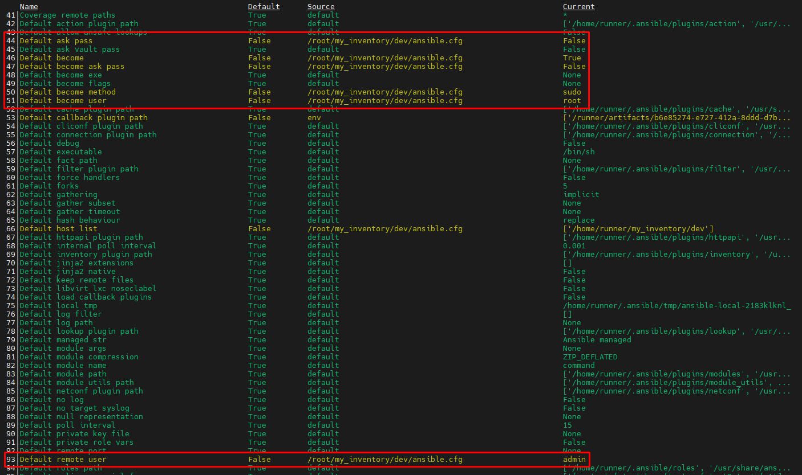

[Phần 3 - Tự động hóa quản trị Linux với Ansible](#)

- [3.1 - Tổng quan Ansible (UPDATED 05/09/2024)]
(#ansible_overview)
    - [3.1.1 - Giới thiệu về tự động hóa (UPDATED 05/09/2024)]
(#automation_intro)
    - [3.1.2 - Giới thiệu về Ansible (UPDATED 05/09/2024)]
(#ansible_intro)
    - [3.1.3 - Tổng quan thành phần Ansible (UPDATED 05/09/2024)]
(#ansible_components)
    - [3.1.4 - Giới thiệu Ansible Navigator (UPDATED 05/09/2024)]
(#ansible_navigator)
- [3.2 - Triển khai Ansible Playbook (UPDATED 05/09/2024)]
(#implementing_ansible_playbook)
    - [3.2.1 - Độ ưu tiên của cấu hình ansible và ansible-navigator (UPDATED 05/09/2024)]
(#ansible_config_priority)
    - [3.2.2 - Quản lý cài đặt ansible-navigator (UPDATED 05/09/2024)]
(#managing_ansible_nav_settings)
    - [3.2.3 - Quản lý cài đặt ansible (UPDATED 05/09/2024)]
(#managing_ansible_settings)

## <a name="ansible_configuration"></a>Triển khai Ansible Playbook

### <a name="ansible_config_priority"></a>Độ ưu tiên của cấu hình ansible và ansible-navigator

Tệp cấu hình `ansible.cfg` có độ ưu tiên giảm dần như sau:

- Biến môi trường `ANSIBLE_CONFIG`
- Thư mục người dùng `~/ansible.cfg`
- Thư mục hiện hành `./ansible.cfg`
- Mặc định tại `/etc/ansible/ansible.cfg`

```shell
[test@huyvl-linux-training new_ansible_cfg]$ ansible --version
ansible [core 2.15.9]
  config file = /etc/ansible/ansible.cfg
  configured module search path = ['/home/test/.ansible/plugins/modules', '/usr/share/ansible/plugins/modules']
  ansible python module location = /usr/lib/python3.9/site-packages/ansible
  ansible collection location = /home/test/.ansible/collections:/usr/share/ansible/collections
  executable location = /usr/bin/ansible
  python version = 3.9.10 (main, Feb  9 2022, 00:00:00) [GCC 11.2.1 20220127 (Red Hat 11.2.1-9)] (/usr/bin/python3)
  jinja version = 3.1.3
  libyaml = True
[test@huyvl-linux-training new_ansible_cfg]$ touch ~/.ansible.cfg
[test@huyvl-linux-training new_ansible_cfg]$ ansible --version
ansible [core 2.15.9]
  config file = /home/test/.ansible.cfg
  configured module search path = ['/home/test/.ansible/plugins/modules', '/usr/share/ansible/plugins/modules']
  ansible python module location = /usr/lib/python3.9/site-packages/ansible
  ansible collection location = /home/test/.ansible/collections:/usr/share/ansible/collections
  executable location = /usr/bin/ansible
  python version = 3.9.10 (main, Feb  9 2022, 00:00:00) [GCC 11.2.1 20220127 (Red Hat 11.2.1-9)] (/usr/bin/python3)
  jinja version = 3.1.3
  libyaml = True
[test@huyvl-linux-training new_ansible_cfg]$ touch ansible.cfg
[test@huyvl-linux-training new_ansible_cfg]$ ansible --version
ansible [core 2.15.9]
  config file = /home/test/new_ansible_cfg/ansible.cfg
  configured module search path = ['/home/test/.ansible/plugins/modules', '/usr/share/ansible/plugins/modules']
  ansible python module location = /usr/lib/python3.9/site-packages/ansible
  ansible collection location = /home/test/.ansible/collections:/usr/share/ansible/collections
  executable location = /usr/bin/ansible
  python version = 3.9.10 (main, Feb  9 2022, 00:00:00) [GCC 11.2.1 20220127 (Red Hat 11.2.1-9)] (/usr/bin/python3)
  jinja version = 3.1.3
  libyaml = True
[test@huyvl-linux-training new_ansible_cfg]$ export ANSIBLE_CONFIG=~/.ansible.cfg
[test@huyvl-linux-training new_ansible_cfg]$ ansible --version
ansible [core 2.15.9]
  config file = /home/test/.ansible.cfg
  configured module search path = ['/home/test/.ansible/plugins/modules', '/usr/share/ansible/plugins/modules']
  ansible python module location = /usr/lib/python3.9/site-packages/ansible
  ansible collection location = /home/test/.ansible/collections:/usr/share/ansible/collections
  executable location = /usr/bin/ansible
  python version = 3.9.10 (main, Feb  9 2022, 00:00:00) [GCC 11.2.1 20220127 (Red Hat 11.2.1-9)] (/usr/bin/python3)
  jinja version = 3.1.3
  libyaml = True
[test@huyvl-linux-training new_ansible_cfg]$
```

Tệp cấu hình `ansible-navigator.yml` có những vị trí tương tự như `ansible.cfg`:

- Biến môi trường `ANSIBLE_NAVIGATOR_CONFIG`
- Thư mục hiện hành `./ansible-navigator.cfg`
- Thư mục người dùng `~/ansible-navigator.cfg`

```shell
[test@huyvl-linux-training new_ansible_navigator_yml]$ cat ~/.ansible-navigator.yml
ansible-navigator:
  execution-environment:
    image: registry.redhat.io/ansible-automation-platform-24/ee-supported-rhel8:latest
    pull:
      policy: missing
[test@huyvl-linux-training new_ansible_navigator_yml]$ cat ansible-navigator.yml
ansible-navigator:
  execution-environment:
    image: registry.redhat.io/ansible-automation-platform-24/ee-supported-rhel8:latest
    pull:
      policy: always
[test@huyvl-linux-training new_ansible_navigator_yml]$ cat $ANSIBLE_NAVIGATOR_CONFIG
ansible-navigator:
  execution-environment:
    image: registry.redhat.io/ansible-automation-platform-24/ee-supported-rhel8:latest
    pull:
      policy: missing
[test@huyvl-linux-training new_ansible_navigator_yml]$ echo $ANSIBLE_NAVIGATOR_CONFIG
/home/test/env_ansible_navigator_yml/ansible-navigator.yml
[test@huyvl-linux-training new_ansible_navigator_yml]$
[test@huyvl-linux-training new_ansible_navigator_yml]$ ansible-navigator inventory -i . -m stdout --list
[WARNING]:  * Failed to parse /home/test/new_ansible_navigator_yml/ansible-navigator.log with ini plugin: /home/test/new_ansible_navigator_yml/ansible-navigator.log:1: Expected key=value host variable
assignment, got: WARNING
[WARNING]: Unable to parse /home/test/new_ansible_navigator_yml/ansible-navigator.log as an inventory source
[WARNING]: Invalid characters were found in group names but not replaced, use -vvvv to see details
[WARNING]: Skipping unexpected key (execution-environment) in group (ansible-navigator), only "vars", "children" and "hosts" are valid
{
    "_meta": {
        "hostvars": {}
    },
    "all": {
        "children": [
            "ungrouped",
            "ansible-navigator"
        ]
    }
}
[test@huyvl-linux-training new_ansible_navigator_yml]$ unset ANSIBLE_NAVIGATOR_CONFIG
[test@huyvl-linux-training new_ansible_navigator_yml]$ echo $ANSIBLE_NAVIGATOR_CONFIG

[test@huyvl-linux-training new_ansible_navigator_yml]$ ansible-navigator inventory -i . -m stdout --list
--------------------------------------------------------------------------------------------------------------
Execution environment image and pull policy overview
--------------------------------------------------------------------------------------------------------------
Execution environment image name:     registry.redhat.io/ansible-automation-platform-24/ee-supported-rhel8:latest
Execution environment image tag:      latest
Execution environment pull arguments: None
Execution environment pull policy:    always
Execution environment pull needed:    True
--------------------------------------------------------------------------------------------------------------
Updating the execution environment
--------------------------------------------------------------------------------------------------------------
Running the command: podman pull registry.redhat.io/ansible-automation-platform-24/ee-supported-rhel8:latest
Trying to pull registry.redhat.io/ansible-automation-platform-24/ee-supported-rhel8:latest...
Getting image source signatures
Checking if image destination supports signatures
Copying blob 08c375495313 skipped: already exists
Copying blob 87e3ab05d9a4 skipped: already exists
Copying blob 1de299fb0d50 skipped: already exists
Copying blob dc9b17c0a14e skipped: already exists
Copying config 80a02196e3 done
Writing manifest to image destination
Storing signatures
80a02196e30edffdb7b41aa7ac37628559fdf6aebe066f53c0e68a49450b4917
[WARNING]:  * Failed to parse /home/test/new_ansible_navigator_yml/ansible-navigator.log with ini plugin: /home/test/new_ansible_navigator_yml/ansible-navigator.log:1: Expected key=value host variable
assignment, got: WARNING
[WARNING]: Unable to parse /home/test/new_ansible_navigator_yml/ansible-navigator.log as an inventory source
[WARNING]: Invalid characters were found in group names but not replaced, use -vvvv to see details
[WARNING]: Skipping unexpected key (execution-environment) in group (ansible-navigator), only "vars", "children" and "hosts" are valid
{
    "_meta": {
        "hostvars": {}
    },
    "all": {
        "children": [
            "ungrouped",
            "ansible-navigator"
        ]
    }
}
[test@huyvl-linux-training new_ansible_navigator_yml]$ rm ansible-navigator.yml
[test@huyvl-linux-training new_ansible_navigator_yml]$ ansible-navigator inventory -i . -m stdout --list
[WARNING]:  * Failed to parse /home/test/new_ansible_navigator_yml/ansible-navigator.log with ini plugin: /home/test/new_ansible_navigator_yml/ansible-navigator.log:1: Expected key=value host variable
assignment, got: WARNING
[WARNING]: Unable to parse /home/test/new_ansible_navigator_yml/ansible-navigator.log as an inventory source
[WARNING]: Unable to parse /home/test/new_ansible_navigator_yml as an inventory source
[WARNING]: No inventory was parsed, only implicit localhost is available
{
    "_meta": {
        "hostvars": {}
    },
    "all": {
        "children": [
            "ungrouped"
        ]
    }
}
[test@huyvl-linux-training new_ansible_navigator_yml]$
```

### <a name="managing_ansible_settings"></a>Quản lý cài đặt ansible

Tạo tệp `ansible.cfg` để áp dụng cho tất cả lệnh Ansible. Tệp cấu hình này bao gồm các thông tin được mô tả giống dạng `*.ini`. Các mục đặc trưng như sau:

- `[defaults]`: cài đặt sự vận hành mặc định của Ansible.
- `[priviledge_escalation]`: leo thang đặc quyền trên các managed host.

Bảng thông tin khái niệm:

| Khóa | Mô tả |
| --- | --- |
| `inventory` | Chỉ định đường dẫn tệp hoặc thư mục. |
| `remote_user` | Chỉ định tên tài khoản sẽ thực thi trên các managed hosts. Nếu không chỉ định thì tài khoản hiện hành thực thi sẽ được sử dụng. Vì lý do bảo mật và kiểm thử bảo mật thì nên sử dụng tài khoản thường trước khi đổi sang tài khoản có đặc quyền. |
| `ask_pass` | Mặc định là `true` để xác thực SSH Public Key. Ngược lại sẽ hỏi mật khẩu, người dùng nên cấu hình đồng thời vô hiệu hóa `playbook-artifact` để chắc chắn rằng không sinh ra `*.json` - cái mà chứa những thông tin nhạy cảm này. |
| `become` | Loại giá trị giống `ask_pass`, ý nghĩa đổi người dùng sau khi kết nối. |
| `become_method` | Mặc định là `sudo`, cách thức đổi người dùng. |
| `become_user` | Tên cụ thể người dùng muốn đổi. |
| `become_ask_pass` | Mặc định là `false`, sẽ hỏi mật khẩu trước khi đổi. Thường đucợ sử dụng kèm với `become_method` và khuyến nghị vô hiệu hóa `playbook-artifact` như `ask_pass`. |

Ví dụ cấu hình `ansible.cfg` như sau:

```shell
[defaults]
inventory = ~/my_inventory/dev/
remote_user = admin
ask_pass = false

[privilege_escalation]
become = true
become_method = sudo
become_user = root
become_ask_pass = false
```

```shell
[root@huyvl-linux-training dev]# ansible-navigator config
```

ansible_become_settings
<div style="text-align:center"></div>


### <a name="managing_ansible_nav_settings"></a>Quản lý cài đặt ansible-navigator

Lệnh `ansible-navigator config` cũng cung cấp phương thức sơ lược cấu hình hiện hành của hệ thống:

```shell
[root@huyvl-linux-training test]# ansible-navigator config
--------------------------------------------------------------------------------------------------------------
Execution environment image and pull policy overview
--------------------------------------------------------------------------------------------------------------
Execution environment image name:     registry.redhat.io/ansible-automation-platform-24/ee-supported-rhel8:latest
Execution environment image tag:      latest
Execution environment pull arguments: None
Execution environment pull policy:    tag
Execution environment pull needed:    True
--------------------------------------------------------------------------------------------------------------
Updating the execution environment
--------------------------------------------------------------------------------------------------------------
Running the command: podman pull registry.redhat.io/ansible-automation-platform-24/ee-supported-rhel8:latest
Trying to pull registry.redhat.io/ansible-automation-platform-24/ee-supported-rhel8:latest...
Error: initializing source docker://registry.redhat.io/ansible-automation-platform-24/ee-supported-rhel8:latest: unable to retrieve auth token: invalid username/password: unauthorized: Please login to the Red Hat Registry using your Customer Portal credentials. Further instructions can be found here: https://access.redhat.com/RegistryAuthentication
[root@huyvl-linux-training test]#
```

Sử dụng tùy chọn `-m stdout` để hiển thị chi tiết cấu hình của hệ thống. Màu <span style="color:green">xanh lá cây</span> thể hiện cấu hình mặc định, màu <span style="color:yellow">vàng</span> là cấu hình đã thay thế mặc định.

```shell
[root@huyvl-linux-training ~]# ansible-navigator config dump -m stdout
```

<div style="text-align:center"></div>

Thử xác minh khi cấu hình `ansible-navigator` như sau:

```shell
[root@huyvl-linux-training ~]# vi ansible.cfg
[root@huyvl-linux-training ~]# cat ansible.cfg
[defaults]
inventory = ~/my_inventory/dev
[root@huyvl-linux-training ~]#
[root@huyvl-linux-training ~]# ansible-navigator config dump -m stdout
```

<div style="text-align:center"></div>

Tạo cấu hình mặc định `ansible-navigator.yml` để quản lý tập trung thông qua từ khóa `entries` như sau:

```shell
[root@huyvl-linux-training dev]# cat ansible-navigator.yml
ansible-navigator:
  ansible:
    inventory:
      entries:
        - ~/my_inventory/dev/linux
  execution-environment:
    image: registry.redhat.io/ansible-automation-platform-24/ee-supported-rhel8:latest
    pull:
      policy: missing
  playbook-artifact:
    enable: false
[root@huyvl-linux-training dev]# ansible-navigator inventory -m stdout --graph
@all:
  |--@ungrouped:
  |--@rhel8:
  |  |--web1.example.com
[root@huyvl-linux-training dev]# cat ~/my_inventory/dev/network
[switches]
192.168.[0:3].1

[routers]
192.168.[0:2].254
[root@huyvl-linux-training dev]# vi ansible-navigator.yml
[root@huyvl-linux-training dev]# cat ansible-navigator.yml
ansible-navigator:
  ansible:
    inventory:
      entries:
        - ~/my_inventory/dev/linux
        - ~/my_inventory/dev/network
  execution-environment:
    image: registry.redhat.io/ansible-automation-platform-24/ee-supported-rhel8:latest
    pull:
      policy: missing
  playbook-artifact:
    enable: false
[root@huyvl-linux-training dev]# ansible-navigator inventory -m stdout --graph
@all:
  |--@ungrouped:
  |--@rhel8:
  |  |--web1.example.com
  |--@switches:
  |  |--192.168.0.1
  |  |--192.168.1.1
  |  |--192.168.2.1
  |  |--192.168.3.1
  |--@routers:
  |  |--192.168.0.254
  |  |--192.168.1.254
  |  |--192.168.2.254
[root@huyvl-linux-training dev]#
```