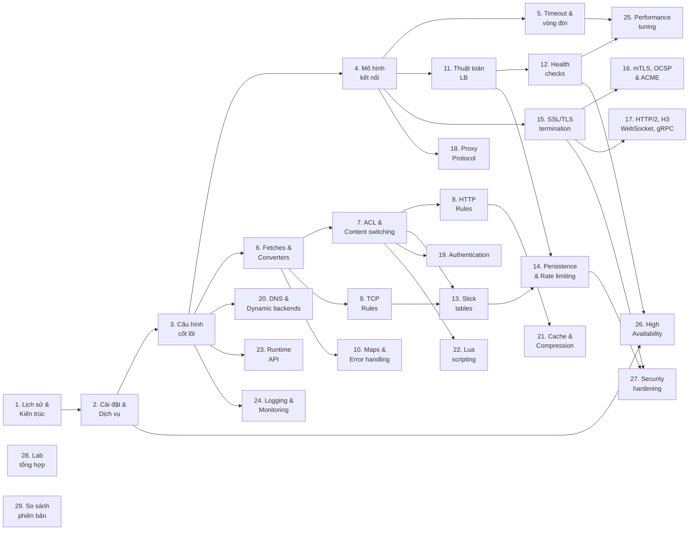

# HAProxy — Cân bằng tải chuyên sâu

Chuỗi tài liệu này trình bày kiến trúc, cấu hình, và vận hành HAProxy từ nền tảng đến production-grade, hướng đến kỹ sư hạ tầng đã có nền Linux (RHCSA) và Network (CCNA). Lộ trình giảng dạy xây dựng trên nền **phiên bản HAProxy chính thức từ Canonical repository** cho mỗi Ubuntu LTS — bắt đầu với HAProxy 2.0 trên Ubuntu Server 20.04, sau đó phân tích những thay đổi ở HAProxy 2.4 (Ubuntu 22.04) và HAProxy 2.8 (Ubuntu 24.04). Cách tiếp cận này phản ánh đúng thực tế vận hành: mỗi lần upgrade Ubuntu LTS, kỹ sư cần hiểu rõ phiên bản HAProxy mới thay đổi gì, cải tiến gì, và loại bỏ gì so với bản trước.

Môi trường thực hành chính: Ubuntu Server 20.04 LTS, HAProxy 2.0.x (Canonical official repository, cài đặt qua `apt install haproxy`). Tài liệu tham khảo chính thống: [HAProxy Configuration Manual 2.0](https://www.haproxy.org/download/2.0/doc/configuration.txt), [HAProxy Starter Guide 2.0](https://www.haproxy.org/download/2.0/doc/intro.txt), và [HAProxy Management Guide 2.0](https://www.haproxy.org/download/2.0/doc/management.txt).

> **Lưu ý về phiên bản:** Ubuntu 20.04 chỉ cung cấp HAProxy 2.0.x từ Canonical official repo. Ubuntu 22.04 cung cấp HAProxy 2.4.x, Ubuntu 24.04 cung cấp HAProxy 2.8.x. Cài đặt phiên bản cao hơn (ví dụ: 3.2) yêu cầu PPA hoặc biên dịch từ mã nguồn — nằm ngoài hệ sinh thái chính thức của Canonical và không được khuyến nghị cho production. Phần 29 so sánh chi tiết các phiên bản.

Kiến thức tiên quyết cho toàn bộ series:

- Linux process management, systemd, file descriptors, socket (linux-onboard, phần 2.4)
- TCP/IP model, TCP 3-way handshake, TCP flags, flow control (network-onboard, INE 9-10)
- Quản lý mạng Linux: `ss`, `ip`, `nmcli`, network interface (linux-onboard, phần 2.6)

## Sơ đồ phụ thuộc kiến thức (Knowledge Dependency Map)

Sơ đồ dưới đây thể hiện mối quan hệ phụ thuộc giữa các phần. Mũi tên `A → B` nghĩa là kiến thức phần A là tiên quyết trực tiếp cho phần B. Các phần không có mũi tên đến có thể đọc độc lập sau khi hoàn thành Khối I.

Lộ trình đọc khuyến nghị: đọc tuần tự từ Phần 1 đến Phần 29 là lộ trình an toàn nhất. Tuy nhiên, nếu cần ưu tiên theo vai trò, có thể chọn nhánh phù hợp — ví dụ: kỹ sư chỉ cần SSL/TLS có thể đọc Khối I (1-5) rồi nhảy sang Phần 15-16-17-18; kỹ sư cần rate limiting đọc Khối I → Phần 6-7 → Phần 9 → Phần 13-14. Sơ đồ trên giúp xác minh rằng mọi phụ thuộc đã được thỏa mãn trước khi đọc phần bất kỳ.

---

## Mục lục

### Khối I — Nền tảng kiến trúc và vận hành

Khối này xây dựng mô hình mental về cách HAProxy hoạt động từ bên trong: kiến trúc event-driven, cách nó quản lý hai kết nối TCP riêng biệt cho mỗi session, và vai trò quyết định của timeout trong việc bảo vệ hệ thống khỏi resource exhaustion. Hoàn thành Khối I là điều kiện bắt buộc trước khi đọc bất kỳ khối nào phía sau.

- [Phần 1 - Lịch sử hình thành và kiến trúc HAProxy](1.0%20-%20haproxy-history-and-architecture.md)
  - Tóm tắt: Bối cảnh bài toán C10K, sự ra đời của HAProxy dưới tay Willy Tarreau, kiến trúc event-driven dựa trên epoll, và so sánh kiến trúc với Nginx và LVS.
- Phần 2 - Cài đặt và quản lý dịch vụ HAProxy *(chưa viết)*
  - Tóm tắt: Cài đặt HAProxy 2.0 từ Canonical repo trên Ubuntu 20.04 (`apt install haproxy`), phân tích daemon mode và master-worker mode (kích hoạt bằng `-W` hoặc directive `master-worker`), tệp systemd unit, seamless reload với `-sf`, và cấu trúc thư mục với chroot.
- Phần 3 - Cấu trúc cấu hình và các khái niệm cốt lõi *(chưa viết)*
  - Tóm tắt: Năm section cấu hình (global, defaults, frontend, backend, listen), directive `bind` và `server`, sự khác biệt giữa mode tcp và mode http, biến môi trường và conditional blocks.
- Phần 4 - Mô hình kết nối và connection management *(chưa viết)*
  - Tóm tắt: Hai kết nối TCP riêng biệt client-side và server-side, HTTP keep-alive, connection pooling, HTTP/2 multiplexing, và tác động của mô hình kết nối đến logging và troubleshooting.
- Phần 5 - Timeout và vòng đời kết nối *(chưa viết)*
  - Tóm tắt: Phân tích từng loại timeout (connect, client, server, http-request, http-keep-alive, tunnel, queue), mối quan hệ giữa chúng, và hiệu ứng domino khi cấu hình sai.

### Khối II — Ngôn ngữ xử lý traffic

Khối này dạy "ngôn ngữ" mà HAProxy sử dụng để ra quyết định về traffic: cách trích xuất dữ liệu từ request/response (fetches), biến đổi dữ liệu đó (converters), đặt điều kiện (ACL), và thực thi hành động (HTTP/TCP rules, maps). Bốn phần đầu (6-9) xây dựng từ vựng và ngữ pháp, phần 10 bổ sung công cụ tra cứu và xử lý lỗi.

- Phần 6 - Fetches và Converters — hệ thống truy vấn dữ liệu của HAProxy *(chưa viết)*
  - Tóm tắt: Sample fetches trích xuất dữ liệu từ request, response, và connection; converters biến đổi dữ liệu; chuỗi fetch-convert và danh mục fetches quan trọng cho ACL và rules.
- Phần 7 - ACL và content switching *(chưa viết)*
  - Tóm tắt: Cú pháp ACL, các matching types (boolean, string, IP, integer, regex), routing traffic với `use_backend`, kết hợp ACL bằng AND/OR/NOT, và quản lý ACL files quy mô lớn.
- Phần 8 - HTTP request/response rules *(chưa viết)*
  - Tóm tắt: Vòng đời xử lý request trong HAProxy, các action của `http-request` và `http-response`, `http-after-response`, và kỹ thuật HTTP rewriting (path, query string, redirect).
- Phần 9 - TCP request/response rules *(chưa viết)*
  - Tóm tắt: Ba giai đoạn TCP rules (connection, content, response), payload inspection ở tầng 4, SNI-based routing, và kết hợp TCP rules với stick tables cho rate limiting.
- Phần 10 - Map files, pattern matching, và error handling *(chưa viết)*
  - Tóm tắt: Tra cứu key-value bằng map files, cập nhật map tại runtime qua Runtime API, cấu hình error pages với `errorfile` và `http-errors`, và retry mechanism.

### Khối III — Cân bằng tải và session management

Khối này trình bày nghiệp vụ cốt lõi của HAProxy: phân phối traffic đến backend, giám sát sức khỏe backend, duy trì session cho client, và giới hạn tốc độ truy cập. Stick tables — cấu trúc dữ liệu in-memory đặc trưng của HAProxy — là trung tâm liên kết giữa session persistence và rate limiting.

- Phần 11 - Thuật toán cân bằng tải *(chưa viết)*
  - Tóm tắt: Các thuật toán roundrobin, static-rr, leastconn, hash-based (source, uri, hdr), random và first; consistent hashing, dynamic weight adjustment tại runtime.
- Phần 12 - Health checks *(chưa viết)*
  - Tóm tắt: L4 health check (TCP SYN với fall/rise/inter), L7 health check (HTTP status code và body), agent-check điều khiển từ backend, passive health check từ traffic thực tế, và email alerts.
- Phần 13 - Stick tables: cấu trúc, tracking counters, và peers *(chưa viết)*
  - Tóm tắt: Cấu trúc stick table (type, size, expire, store), key types, tracking counters (gpc0, http_req_rate, conn_rate), tương tác với ACL, và peers protocol đồng bộ multi-node.
- Phần 14 - Session persistence và rate limiting *(chưa viết)*
  - Tóm tắt: Cookie-based persistence (insert, prefix, rewrite), stick table-based persistence, rate limiting theo IP bằng stick table, tarpit và silent-drop, so sánh trade-off giữa hai cơ chế persistence.

### Khối IV — Giao thức và mã hóa

Khối này đi sâu vào các giao thức mà HAProxy hỗ trợ ở cả hai phía kết nối: SSL/TLS (termination, mTLS, OCSP, ACME), HTTP/2 và HTTP/3 (QUIC), WebSocket, gRPC, Proxy Protocol, và authentication. Kiến thức ở đây yêu cầu nắm vững mô hình hai kết nối từ Khối I và ngôn ngữ ACL/rules từ Khối II.

- Phần 15 - SSL/TLS termination và certificate management *(chưa viết)*
  - Tóm tắt: SSL offloading, cấu hình certificate (`crt`, `ca-file`, `crt-list`, `crt-store`), cipher suites cho TLS 1.2 và 1.3, SNI/ALPN, certificate hot-reload, và kTLS kernel offload.
- Phần 16 - Mutual TLS, OCSP, CRL, và tự động hóa certificate *(chưa viết)*
  - Tóm tắt: mTLS với `verify required`, CRL management, và giới thiệu OCSP Stapling (có từ 2.0, auto-update cải tiến ở 2.8+). ACME protocol (HTTP-01 challenge, tự động xin/renew certificate) chỉ khả dụng từ HAProxy 3.2 — phần này ghi nhận tính năng nhưng không thực hành trên 2.0.
- Phần 17 - HTTP/2, HTTP/3, WebSocket và gRPC *(chưa viết)*
  - Tóm tắt: HTTP/2 multiplexing ở frontend và backend (có từ HAProxy 2.0 qua HTX engine), WebSocket upgrade mechanism, gRPC bidirectional streaming. HTTP/3 trên QUIC transport (`bind quic4@`/`quic6@`) chỉ khả dụng từ HAProxy 2.6+ — phần này ghi nhận kiến trúc nhưng thực hành HTTP/2 và WebSocket trên 2.0.
- Phần 18 - Proxy Protocol *(chưa viết)*
  - Tóm tắt: Vấn đề mất IP client sau proxy, Proxy Protocol v1 (text) và v2 (binary), directives `send-proxy`/`accept-proxy`, TLV extensions, và tích hợp với Nginx và Apache.
- Phần 19 - Authentication: HTTP Basic Auth và JWT validation *(chưa viết)*
  - Tóm tắt: HTTP Basic Auth với `userlist`, JWT validation với `jwt_verify()`, kết hợp authentication với ACL, và so sánh xác thực tại HAProxy vs tại application.

### Khối V — Tính năng nâng cao và mở rộng

Khối này trình bày các tính năng mở rộng khả năng của HAProxy vượt ra ngoài proxy và cân bằng tải thuần túy: DNS-based service discovery, HTTP caching, Lua scripting, Runtime API cho quản trị động, và hệ thống logging/monitoring. Mỗi tính năng có thể học độc lập sau khi hoàn thành Khối I và các phần tiên quyết tương ứng trên sơ đồ phụ thuộc.

- Phần 20 - DNS resolvers và dynamic backends *(chưa viết)*
  - Tóm tắt: Section `resolvers`, `server-template` với DNS SRV records, `init-addr` cho khởi động trước DNS, dynamic server qua Runtime API, và tích hợp Consul/Kubernetes DNS.
- Phần 21 - HTTP cache và compression *(chưa viết)*
  - Tóm tắt: HTTP cache tích hợp (section `cache`, `cache-use`, `cache-store` — có từ HAProxy 2.0), cache tuning, HTTP compression với filter architecture. Bandwidth limiting (`filter bwlim-in`/`bwlim-out`) chỉ khả dụng từ HAProxy 2.7+ — phần này ghi nhận tính năng cho lộ trình upgrade.
- Phần 22 - Lua scripting và mở rộng HAProxy *(chưa viết)*
  - Tóm tắt: Bốn điểm mở rộng Lua (actions, fetches, converters, services — có từ HAProxy 2.0), coroutine model, ví dụ thực tế (custom health check, dynamic routing), SPOE/SPOP cho tác vụ nặng (có từ 2.0, `mode spop` backend cải tiến ở 3.1+), và traffic mirroring.
- Phần 23 - Runtime API và quản trị động *(chưa viết)*
  - Tóm tắt: Stats socket với permission levels, các lệnh quản trị (`show stat`, `show info`, `set server`), cập nhật map/ACL tại runtime, và Master CLI quản lý workers.
- Phần 24 - Logging, monitoring, và observability *(chưa viết)*
  - Tóm tắt: Cấu hình rsyslog cho HAProxy, log format (`httplog`, `tcplog`, `log-format` tùy chỉnh), ring buffer logging, stats page, và Prometheus exporter tích hợp Grafana.

### Khối VI — Production operations

Khối này chuyển từ kiến thức sang kỹ năng vận hành: tối ưu hiệu năng (kernel tuning, thread binding, zero-copy), triển khai high availability (Keepalived, VRRP, seamless reload), bảo mật (hardening, DDoS mitigation), lab tổng hợp kết nối tất cả kiến thức, và so sánh hành vi HAProxy trên các phiên bản Ubuntu LTS khác nhau.

- Phần 25 - Performance tuning và kernel optimization *(chưa viết)*
  - Tóm tắt: `nbthread` và CPU affinity, `nbproc` multi-process (còn tồn tại ở 2.0, bị xóa ở 2.5 — giải thích tại sao multi-thread thay thế), `maxconn` và mối quan hệ với `LimitNOFILE`, kernel sysctl tuning cho TCP stack, `splice()` zero-copy, buffer tuning, và phương pháp benchmark.
- Phần 26 - High availability: Keepalived, VRRP, và seamless reload *(chưa viết)*
  - Tóm tắt: Keepalived với VRRP protocol cho VIP failover, seamless reload qua cờ `-sf` (daemon mode) và `-x` + fd passing (master-worker mode), hitless upgrade không downtime, và connection draining.
- Phần 27 - Security hardening và DDoS mitigation *(chưa viết)*
  - Tóm tắt: Defense in depth (chroot, drop privileges, AppArmor), HTTP Request Smuggling (CL/TE desync), Slowloris/slow POST, DDoS mitigation bằng stick tables, và HTTP/2 Rapid Reset (CVE-2023-44487).
- Phần 28 - Lab thực hành tổng hợp *(chưa viết)*
  - Tóm tắt: Năm bài lab end-to-end kết hợp kiến thức từ toàn bộ series — web application multi-tier, TCP proxy cho database cluster, API Gateway, HTTP/2 với gRPC và Prometheus, HA với Keepalived dưới tải.
- Phần 29 - So sánh phiên bản HAProxy trên các Ubuntu LTS *(chưa viết)*
  - Tóm tắt: So sánh tiến hóa theo lộ trình Canonical: HAProxy 2.0 (Ubuntu 20.04) → 2.4 (Ubuntu 22.04) → 2.8 (Ubuntu 24.04). Mỗi bước: tính năng mới, directives deprecated/removed, thay đổi default behavior, và benchmark so sánh định lượng trên cùng workload. Ghi chú thêm HAProxy 3.0+ cho lộ trình tương lai.

---

## Quy ước ký hiệu trong series

Toàn bộ series sử dụng các quy ước sau trong code blocks và ví dụ:

| Ký hiệu | Ý nghĩa |
|---|---|
| `[haproxy-node]$` | Lệnh chạy với quyền user trên host HAProxy |
| `[haproxy-node]#` | Lệnh chạy với quyền root trên host HAProxy |
| `[client]$` | Lệnh chạy trên máy client |
| `[backend-node]$` | Lệnh chạy trên backend server |
| **Boldface** trong command syntax | Lệnh hoặc keyword gõ nguyên văn |
| *Italic* trong command syntax | Tham số thay thế bằng giá trị thực tế |
| `[x]` trong command syntax | Thành phần tùy chọn, có thể bỏ qua |
| `{x}` trong command syntax | Thành phần bắt buộc |
| `x \| y` trong command syntax | Chọn một trong các lựa chọn |