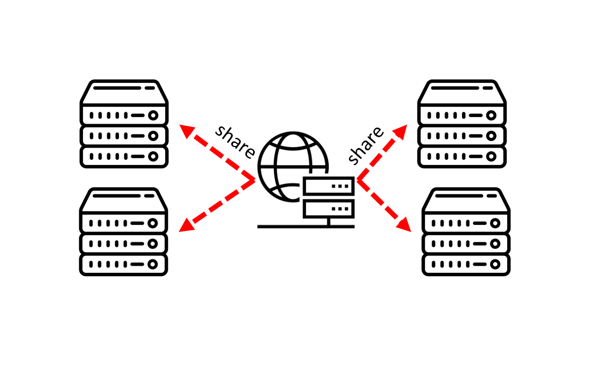
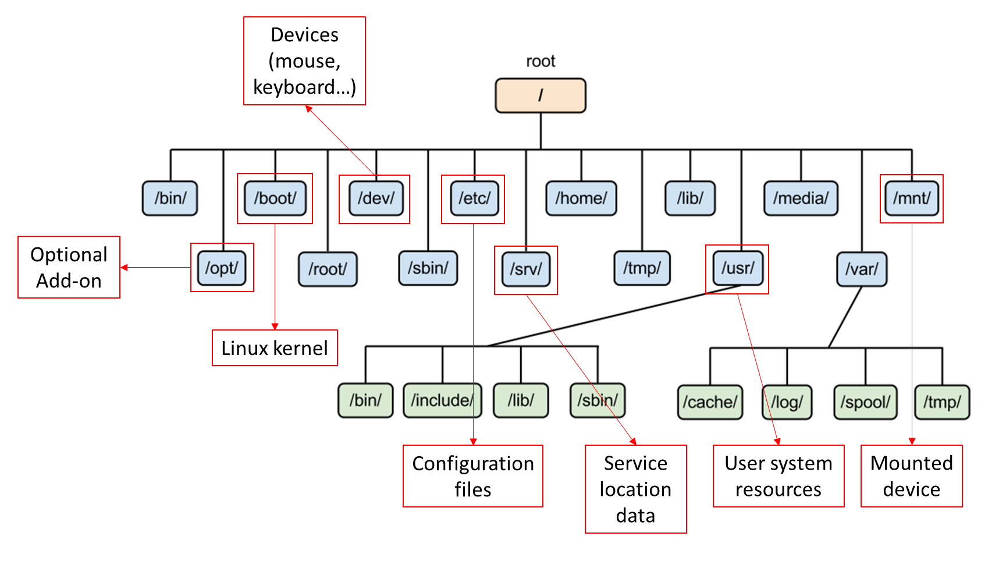

- [Tổng quan về kiến trúc Linux (:sparkles:UPDATED 24/08/2023)](#linux_arch)
    - [1 - Linux Kernel (:sparkles:UPDATED 24/08/2023)](#linux_kernel)
    - [2 - Vai trò của Linux Kernel (:sparkles:UPDATED 24/08/2023)](#linux_kernel_job)
    - [3 - Quản lý quyền tệp tin (:sparkles:UPDATED 24/08/2023)](#file_permission_management)
    - [4 - RPM Package và phân loại (:sparkles:UPDATED 24/08/2023)](#rpm_package)
    - [5 - Kernel RPM Package (:sparkles:UPDATED 24/08/2023)](#kernel_rpm_package)
    - [6 - Trạng thái của tiến trình Linux (:sparkles:UPDATED 24/08/2023)](#linux_process)

# <a name="linux_arch"></a>Tổng quan về kiến trúc Linux
## <a name="linux_kernel"></a>Tổng quan `Linux kernel`
`Linux Kernel` là thành phần chính của hệ điều hành `Linux`, thành phần cốt lõi giữa phần cứng máy tính và các tiến trình bên trong nó. Nó giao tiếp giữa 2 thực thể , quản lý tài nguyên một cách tốt nhất.

Đặt tên là `kernel` vì nó được coi là hát gióng nằm bên trong lớp vỏ - nó tồn tại ở ngay bên trong `OS` và điều khiển các chức năng của phần cứng.
## <a name="linux_kernel_job"></a>Vai trò `Linux kernel`
- `Kernel` gồm có 4 công việc:
    - `Memory management` -quản lý bộ nhớ: liên tục theo dõi lượng tài nguyên nơi bộ nhớ đã được sử dụng, bao gồm cả việc nó lưu trữ những gì và nơi nó được lưu trữ.
    - `Process management` - quản lý tiến trình: xác định được những tiến trình nào có thể sử dụng CPU, khi nào và bao lâu.
    - `Device drivers`: đóng vai trò trung gian trong việc liên lạc giữa phần cứng và tiến trình.
    - `System Calls and Security`: nhận những yêu cầu từ `service` và `process`.

Khi `kernel` được triển khai đúng cách thì nó phải nằm trong trạng thái `invisible` với người dùng thông thường, nó chỉ làm việc bên trong không gian `kernel space`, nơi nó phân bổ bộ nhớ và theo dõi nơi mọi thứ được lưu giữ. Giống như người dùng sử dụng truy cập `web` thì trình duyệt là không gian của người dùng hay `user space`. Các ứng dụng tương tác với `kernel` thông qua `System Call Interface(SCI)`.

- `Red Hat` ví dụ về `kernel` như một trợ lý bận rộn của một nhà điều hành quyền lực `hardware`. Công việc của trợ lý là chuyển tiếp các tin nhắn và yêu cầu của các tiến trình `processes` từ nhân viên `users` tới nhà điều hành. Ghi nhớ vị trí của chúng vào tủ hồ sơ `memory` và xác định ai là người có quyền truy cập.

    - `Hardware`: máy tính vât lý nhìn theo hướng logic nó nằm ở đáy hệ thống, tạo nên bộ nhớ `memory`, `CPU` tính toán đọc ghi vào bộ nhớ, ...
    - `Linux kernel`: lõi của `OS`, nằm ở giữa phần cứng và tiến trình về mặt `logic`, đương nhiên `kernel` vẫn là phần mềm với vai trò sẽ cho `CPU` biết phải làm gì.
    - `User processes`: trên đây có những chương trình đang chạy được quản lý bởi `kernel`. Các tiến trình của `user` tạo nên `user space`. Các tiến trình này được biết đến đơn thuần là `process`. `Kernel` sẽ cho phép các tiến trình này và phần cứng giao tiếp lẫn nhau, cái mà được gọi là `Inter-process communication(IPC)`.

Đoạn mã được thực thi trên hệ thống chạy trên `CPU` ở `1` trong `2` chế độ: `kernel` hoặc `user`. Đoạn mã chạy trong `kernel mode` không bị hạn chế quyền truy cập tới phần cứng trong khi ngược lại với `user mode`, ... Những chi tiết nhỏ này góp phần tạo nên cơ sở phân tách lớp bảo mật, xây dựng nên những thứ phức tạp như `container`, `Virtual Machine`.

Điều này cũng đồng nghĩa rằng nếu tiến trình chạy ở `user mode` có thiệt hại hạn chế hơn, ngược lại với `kernel mode` khi có sự cố sẽ làm sập hệ thống. Vì `user mode` có sẵn các biện pháp bảo vệ và chỉ các quyền cần thiết nên sự cố thường không thể gây ra quá nhiều vấn đề.

Ví dụ: khi người dùng `Windows` mở một tệp bất kỳ trên ứng dụng `File Explorer` - dĩ nhiên đây là ứng dụng nằm ở phía `user mode`, ứng dụng này sẽ gửi một yêu cầu `I/O` đến ứng dụng loại `File System Filter Driver` được chạy ở phía `kernel mode`, tại đây `File System Filter Driver` sẽ là một bộ lọc cho phép `File Explorer` lấy dữ liệu từ ổ cứng, ngược lại cũng có quyền từ chối nếu như nội dung hoặc một phần nhỏ trong nội dung nằm trong danh sách không thỏa được bị lập trình viên `driver` thiết kế. Đây là một chức năng nằm trong sản phẩm `File Defender` của tập đoàn chuyên làm phần mềm bảo mật `Plott Ltd` Nhật Bản.

<i>Tham khỏa thêm tại https://access.redhat.com/documentation/en-us/red_hat_enterprise_linux/8/html-single/managing_monitoring_and_updating_the_kernel/index#what-the-kernel-is_assembly_the-linux-kernel</i>
## <a name="fhs"></a>Phân cấp hệ thống tệp tin
Cấu trúc của hệ thống tệp tin `File System Hierarchy Standard(FHS)` được định nghĩa tên, nơi chốn và các quyền cho tất cả các loại tệp, thư mục. Tài liệu `FHS` là tài liệu chính thức cho bất kỳ hệ thống tệp tin nào tuân thủ `FHS` nhưng cấu trúc này để lại nhiều mảng không thể định nghĩa hoặc mở rộng.

- Hai điểm quan trọng nhất để đảm bảo rằng hệ thống tuân thủ `FHS` như sau:
    - Khả năng tương thích giữa các hệ thống tuân thủ `FHS`.
    - Phân vùng `/usr` chỉ ở dạng `readonly`, điều này rất quan trọng vì `/usr` chứa các tệp thực thi phổ biến và người dùng không nên thay đổi. Ngoài ra vì `/usr` ở quyền `readonly` nên nó có thể được `mount` từ `CD-ROM` hoặc từ một máy khác thông qua `NFS`.
- Tiêu chuẩn này yêu cầu rằng tất cả hệ thống tuân thủ `FHS` đều hỗ trợ tính năng bảo mật cơ bản tương tự được tìm thấy hầu hết các ở `UNIX`. Có thể phân biệt sự khác biệt giữa các tệp:
    - Có thể chia sẻ `shareable` / không thể chia sẻ `unshareable`.
    - Có thể biến đổi `variable` / không biến đổi `static`.

Ý nghĩa khai sinh của `shareable` chỉ định những tệp có thể được lưu trữ trên máy chủ và được sử dụng trên các máy chủ khác, ngược lại các tệp `unshareable` là những tệp đó không thể chia sẻ với máy chủ khác. Cụ thể hơn, các tệp trong thư mục của người dùng có thể chia sẻ trong khi thiết bị chứa tệp đó thì không. Đối với các tệp `static` bao gồm tệp `binary`, `lib`, tài liệu, ... không `"thay đổi"` nếu không có sự can thiệp của quản trị viên hệ thống, ngược lại sẽ là `variable`.

Lý do: thông thường không phải tất cả các tệp trong hệ thống phân cấp đều chia sẻ được và do đó mỗi hệ thống có nơi chứa cục bộ, các tệp không thể chia sẻ của nó. Phát sinh từ nhu cầu sẽ thuận tiện nếu tất cả tệp mà hệ thống người dùng yêu cầu được lưu trữ trên máy chủ quốc tế, từ đó người dùng có thể được cung cấp bằng cách `mount` một vài thư mục từ máy chủ quốc tế đó.

<div style="text-align:center"></div>

Về lịch sử, cũng giống như hệ thống phân cấp `UNIX` đều chứa cả tệp `static` và `variable` trong cả `/usr` và `/etc`. Để nhận ra được những lợi ích đề cập ở trên thì `/var` được tạo ra và tất cả các tệp `variable` được thay đổi nơi ở, tức chuyển từ `/usr` sang `/var`, do đó hiện giờ  `/usr` chỉ ở chế độ `readonly`. Đối với những tệp `variable` trong `/etc` thì được chuyển sang `/var` sau một thời gian dài chờ đợi công nghệ kỹ thuật phát triển. Sau đây là ví dụ về một hệ thống tuân thủ `FHS`.
| 			| shareable 		| unshareable|
| ----------| ---- 				| ---- 		 |
| static	| /usr 				| /etc		 |
| static    | /opt 				| /boot		 |
| variable	| /var/mail 		| /var/run	 |
| variable  | /var/spool/news 	| /var/lock  |

Hệ thống tệp tin `Linux` được xây dựng theo kiến trúc phân nhánh, khởi đầu và khuynh hướng luôn là `/` - còn được gọi là `forward slash`, cái mà ngược lại với `\` hay `back slash` của `Microsoft Windows`. Sau đây mô hình sơ lược về hệ thống phân cấp.

<div style="text-align:center"></div>

- Các thư mục thông dụng trong `Linux`:
    - `/bin`: các chương trình cơ bản
    - `/boot`: chứa các tệp `Linux kernel`
    - `/etc`: chuyên về cấu hình
    - `/dev`: chứa các thông tin liên quan đến thiết bị như: chuột, bàn phím, ...
    - `/home`: dữ liệu riêng của mỗi `user`
    - `/lib`: thư viện được sử dụng bởi các `program`
    - `/usr`: chứa ứng dụng của `user`
## <a name="file_permission_management"></a>Quản lý quyền truy cập tệp tin
## <a name="rpm_package"></a>RPM package và phân loại
- `RPM package` là một tệp chứa nhiều tệp con và `metadata` của chúng(thông tin về các tệp kéo theo/cần thiết bởi hệ thống). Cụ thể thì mỗi gói `RPM` đã bao gồm tệp nén `cpio`, trong tệp nén này chứa:
    - Những tệp tin.
    - Tiêu đề `RPM` hay `RPM header`, `metadata` của gói chứa tại đây.
    - Người quản lý gói `RPM` sử dụng `metadata` để xác định những thành phần phụ thuộc, nơi chứa các tệp cài đặt và các thông tin khác.
- Có 2 loại `RPM package`, tất cả chúng đều chia sẻ định dạng và công cụ nhưng có những nội dung khác nhau để phục vụ các mục đích khác nhau:
    - Nguồn của `RPM package` viết tắt `SRPM`, thông tin này chứa mã nguồn và cấu hình tệp nơi mà mô tả làm thế nào để xây dựng được gói `RPM binary`. Thêm vào đó `SRPM` có thông tin các bản vá lỗi cho đoạn mã được bao gồm.
    - Tệp `RPM binary` chứa tệp `binary` được xây dựng từ mã nguồn.
## <a name="kernel_rpm_package"></a>Tổng quan về `RPM package` của `Linux kernel`
`Kernel RPM` là loại `RPM` đặc biệt, nó không chứa bất kỳ tệp nào nhưng nó bắt buộc các gói phụ thuộc phải được cài đặt đúng cách. `Kernel core` chứa các mẫu `binary` hay `binary image` của `kernel`, tất cả các đối tượng liên quan đến `initramfs` khởi động cùng hệ thống, số lượng `kernel-module` tối thiểu để đảm bảo chức năng cốt lõi. `Kernel modules` chứa những `kernel modules` còn lại không nằm trong `kernel core`.

- Một nhóm nhỏ các gói phụ thuộc của `kernel` bên trên nhằm mục đích cung cấp công cụ, môi trường để quản trị viên bảo trì, đặc biệt trong môi trường ảo hóa. Các `kernel package` được tùy chọn thêm gồm có:
    - `kernel-modules-extra` chứa các `kernel module` dành cho các loại phần cứng đặc biệt, hiếm gặp hoặc các `module` bị vô hiệu hóa theo mặc định.
    - `kernel-debug` chứa các chức năng `debug` được kích hoạt để chuẩn đoán lỗi nhưng điều này làm giảm hiệu suất.
    - `kernel-tools` chứa các công cụ để thao tác với `Linux kernel` và hỗ trợ tài liệu.
    - `kernel-devel` chứa các `kernel header` và `makefiles` dành cho các lập trình viên phát triển xây dựng `module` dựa trên `kernel package`.
    - `kernel-abi-stablelists` chứa các thông tin liên quan đến `ABI kernel` dành riêng cho `RHEL`.
    - `kernel-headers` chứa các `header` của ngôn ngữ C mô tả cách thức giao tiếp giữa `Linux kernel` và thư viện dành cho `user space`. Các tệp `header` này đã được định nghĩa nhiều cấu trúc `struct` và các hằng số `const` cần thiết để lập trình viên phát triển các ứng dụng.

Cài đặt `vim` để liệt kê các `rpm` phụ thuộc như sau:
```shell
[root@huyvl-linux-training ~]# yum install --downloadonly --downloaddir=/tmp/vim-rpm/ vim
Loaded plugins: fastestmirror
Loading mirror speeds from cached hostfile
 * base: mirror.bizflycloud.vn
 * extras: mirror.bizflycloud.vn
 * updates: mirror.bizflycloud.vn
Resolving Dependencies
--> Running transaction check
---> Package vim-enhanced.x86_64 2:7.4.629-8.el7_9 will be installed
...
...
(28/31): vim-enhanced-7.4.629-8.el7_9.x86_64.rpm    | 1.1 MB  00:00:00
(29/31): vim-filesystem-7.4.629-8.el7_9.x86_64.rpm  |  11 kB  00:00:00
(30/31): vim-common-7.4.629-8.el7_9.x86_64.rpm      | 5.9 MB  00:00:00
(31/31): perl-Carp-1.26-244.el7.noarch.rpm          |  19 kB  00:00:01
----------------------------------------------------------------------
Total                                       16 MB/s |  18 MB  00:00:01
exiting because "Download Only" specified
[root@huyvl-linux-training ~]#
[root@huyvl-linux-training ~]#
[root@huyvl-linux-training ~]#
[root@huyvl-linux-training ~]# ls -al /tmp/vim-rpm/
total 19036
drwxr-xr-x  2 root root    4096 Aug 23 10:29 .
drwxrwxrwt. 9 root root    4096 Aug 23 10:29 ..
-rw-r--r--  1 root root   33120 Aug 23  2019 gpm-libs-1.20.7-6.el7.x86_64.rpm
-rw-r--r--  1 root root 8360316 Feb  3  2021 perl-5.16.3-299.el7_9.x86_64.rpm
-rw-r--r--  1 root root   19672 Jul  4  2014 perl-Carp-1.26-244.el7.noarch.rpm
-rw-r--r--  1 root root   19244 Jul  4  2014 perl-constant-1.27-2.el7.noarch.rpm
-rw-r--r--  1 root root 1545440 Jul  4  2014 perl-Encode-2.51-7.el7.x86_64.rpm
-rw-r--r--  1 root root   29092 Jul  4  2014 perl-Exporter-5.68-3.el7.noarch.rpm
...
...
```
Tiến hành phân tích tệp `rpm` đã được tải về của `vim` như sau:
```shell
[root@huyvl-linux-training vim-rpm]# rpm -qlp gpm-libs-1.20.7-6.el7.x86_64.rpm
/usr/lib64/libgpm.so.2
/usr/lib64/libgpm.so.2.1.0
[root@huyvl-linux-training vim-rpm]#
```
Thường thì lệnh `update` sẽ cập nhật những `kernel` như sau:
```shell
[root@huyvl-linux-training ~]# yum update --downloadonly --downloaddir=/tmp/update/
Loaded plugins: fastestmirror
Loading mirror speeds from cached hostfile
 * base: mirror.bizflycloud.vn
 * extras: mirror.bizflycloud.vn
 * updates: mirror.bizflycloud.vn
Resolving Dependencies
--> Running transaction check
...
...
```
Phân tích `kernel rpm` thấy được như sau:
```shell
[root@huyvl-linux-training ~]# cd /tmp/update/
[root@huyvl-linux-training update]# ls -al | grep kernel
-rw-r--r--   1 root root 54180012 Jul 28 21:53 kernel-3.10.0-1160.95.1.el7.x86_64.rpm
-rw-r--r--   1 root root  8579092 Jul 28 21:54 kernel-tools-3.10.0-1160.95.1.el7.x86_64.rpm
-rw-r--r--   1 root root  8469692 Jul 28 21:54 kernel-tools-libs-3.10.0-1160.95.1.el7.x86_64.rpm
[root@huyvl-linux-training update]# rpm -qlp kernel-3.10.0-1160.95.1.el7.x86_64.rpm
/boot/.vmlinuz-3.10.0-1160.95.1.el7.x86_64.hmac
/boot/System.map-3.10.0-1160.95.1.el7.x86_64
/boot/config-3.10.0-1160.95.1.el7.x86_64
/boot/initramfs-3.10.0-1160.95.1.el7.x86_64.img
/boot/symvers-3.10.0-1160.95.1.el7.x86_64.gz
/boot/vmlinuz-3.10.0-1160.95.1.el7.x86_64
/etc/ld.so.conf.d/kernel-3.10.0-1160.95.1.el7.x86_64.conf
/etc/modprobe.d/dccp-blacklist.conf
/lib/modules/3.10.0-1160.95.1.el7.x86_64
/lib/modules/3.10.0-1160.95.1.el7.x86_64/build
/lib/modules/3.10.0-1160.95.1.el7.x86_64/extra
/lib/modules/3.10.0-1160.95.1.el7.x86_64/kernel
/lib/modules/3.10.0-1160.95.1.el7.x86_64/kernel/arch
/lib/modules/3.10.0-1160.95.1.el7.x86_64/kernel/arch/x86
/lib/modules/3.10.0-1160.95.1.el7.x86_64/kernel/arch/x86/crypto
/lib/modules/3.10.0-1160.95.1.el7.x86_64/kernel/arch/x86/crypto/ablk_helper.ko.xz
/lib/modules/3.10.0-1160.95.1.el7.x86_64/kernel/arch/x86/crypto/aesni-intel.ko.xz
/lib/modules/3.10.0-1160.95.1.el7.x86_64/kernel/arch/x86/crypto/blowfish-x86_64.ko.xz
/lib/modules/3.10.0-1160.95.1.el7.x86_64/kernel/arch/x86/crypto/camellia-aesni-avx-x86_64.ko.xz
/lib/modules/3.10.0-1160.95.1.el7.x86_64/kernel/arch/x86/crypto/camellia-aesni-avx2.ko.xz
/lib/modules/3.10.0-1160.95.1.el7.x86_64/kernel/arch/x86/crypto/camellia-x86_64.ko.xz
...
...
```
## <a name="linux_process"></a>Các trạng thái của `Linux process`

<div style="text-align:center"></div>

- Gồm có 5 trạng thái:
    - Đạng chạy `Running` hoặc có thể chạy `Runnable`.
    - `Uninterruptible Sleep`: không thể gián đoạn việc ngủ đông, nó sẽ chỉ `wake up` khi tài nguyên yêu cầu được cấp phát hoặc hêt thời gian `timeout` nếu được chỉ định. Trạng thái này chủ yếu được sử dụng bởi `device drivers` chờ `I/O` từ `disk` hoặc `network`. Từ `interrupt` được sử dụng rất nhiều trong các môn học về vi xử lý, lập trình với phần cứng, ví dụ như khi người dùng gõ phím thì một lệnh ngắt `interrupt` mã `hexa` là `21h` được gửi tới hệ thống, tương tự đối với tệp tin, ... Trạng thái này còn được biết đến như `D-State`, ký hiệu `D` bắt nguồn từ lịch sử `UNIX` khi định nghĩa nó là từ `Disk Wait` nhưng hiện tại như `lock` của `network` được tách ra khỏi `Disk IO` vì nó có thể rơi vào trạng thái chờ không giới hạn.
    - `Interruptable Sleep`: có thể gián đoạn việc ngủ đông, trạng thái này nói rằng nó đang chờ một khoảng thời gian cụ thể hoặc một sự kiện `signal` xảy ra để `wake up` nó.
    - `Stopped` hay `Terminated`: tiến trình có thể kết thúc vòng đời khi chúng gọi `exit` hoặc nhận được một `SIGTERM` - termination signal. Khi tiến trình gọi `exit`, nó sẽ giải phóng tất cả `data struct` trong ngôn ngữ `C` cụ thể là `task_struct`, ... mà nó đang sử dụng, nhưng nó không bị mất khỏi bảng tiến trình vì đây là trách nhiệm của `parent process`, lý do cho điều này là vì vị trí trong bảng tiến trình được sử dụng làm `ID` để kết thúc tiến trình và chúng được thiết kế để tiến trình cha kiểm tra được nó có thực sự hiện những gì nó phải làm hay không hoặc liệu nó có đang gặp sự cố. Tiến trình con sẽ gửi một tín hiệu là `SIGCHLD` đến tiến trình cha, trong khoảng thời gian chờ nó kết thúc thì nó được gắn mác trạng thái `ZOMBIE` và không nhận `signal`, mọi chuyện sẽ ổn nếu như tiến trình cha không chết trước khi giải phóng nó và khi đó, nó sẽ trở thành `ZOMBIE` mãi mãi chỉ có thể kết thúc nó bằng cách khởi động lại hệ thống.

<div style="text-align:center"></div>