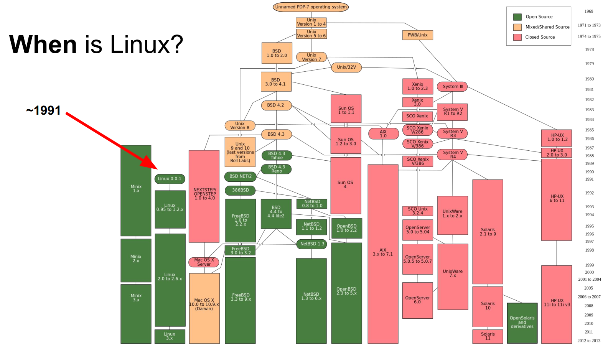
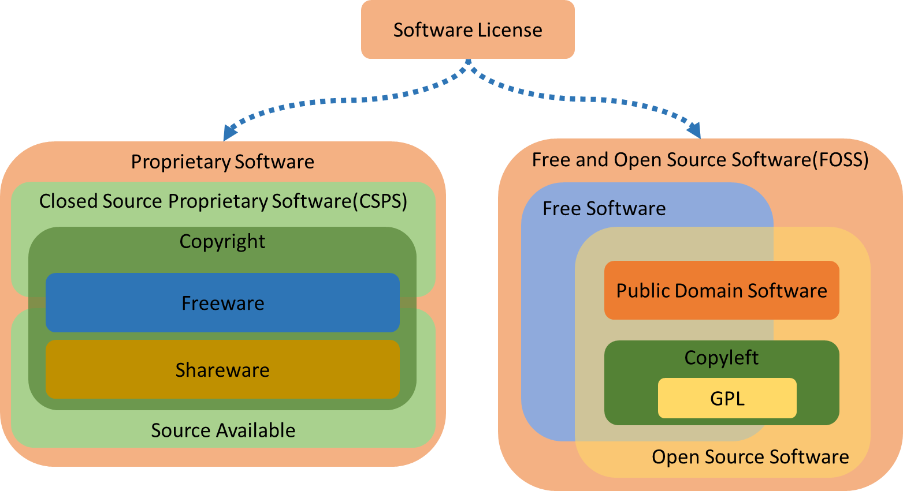
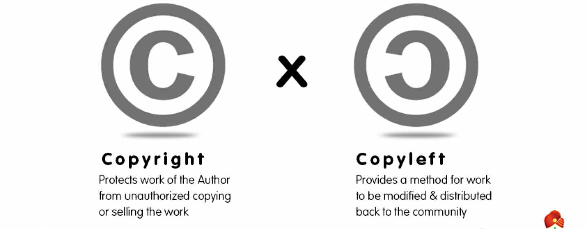

# Worklog 19/08/2023 - Lịch sử hình thành và phát triển Linux
## Năm 1969

Hiện tại các hệ điều hành ngày nay đều có nguồn gốc vào năm 1969 khi `Dennis Richie` và `Ken Thomson` phát triển ngôn ngữ C và hệ điều hành `Unix` tại phòng thí nghiệm `Bell AT&T`, họ đã chia sẻ mã nguồn với thế giới. Vào năm 1975, khi `AT&T` bắt đầu thương mại hóa `Unix` và trong đó có hơn một nửa được phát triển bởi người khác vì vậy `AT&T` đã gặp rất nhiều những phản ứng gay gắt, kết quả của sự đấu tranh này đã tạo ra 2 phiên bản: `AT&T Unix` và `BSD Unix` miễn phí.

Sau đó `BSD` đã cho ra đời các thế hệ như: FreeBSD, OpenBSD, NetBSD, Dragon Fly BSD và PC-BSD vẫn còn hiện hành cho tới ngày nay.
## Năm 1980
Những thập niên 1980, các công ty nở rộ lên xu hướng phát triển `Unix` cho riêng mình: `IBM` phát minh `AIX`, `Sun` có `SunOS`, `HP` hay `Hewlett Packard` thì có `HP-UX`, ... Kết quả là tạo ra một thứ rất hỗn loạn với hàng chục cách thức khác nhau để cùng có một kết quả. Sau đó một ý tưởng về `Linux` thật sự đã được tạo ra để kết thúc sự hỗn loạn này bởi `Richard Stallman` và mọi người cùng bắt đầu xây dựng lại với dự án mang tên là `GNU`, viết tắt của cái tên đệ quy `GNU Not Unix`, ngày nay khái niệm đệ quy trong tên vẫn là xu hướng như cách `Google` đặt tên `gRPC` viết tắt của `gRPC Remote Procedure Call`. Mục đích của ông là phát minh ra một hệ điều hành hoàn toàn miễn phí dành cho tất cả mọi người, nơi mà tất cả họ có thể làm việc cùng nhau. Các câu lệnh được sử dụng ngày nay trên `Linux` đại đa số đến từ `GNU Tools` và phần còn lại từ hệ điều hành `BSD` của `Berkeley`, hệ thống `X Windows` của MIT, ...
## Năm 1990
Đây là những năm mà `Linus Torvarlds` hoạt động rất sôi nổi, ông là một sinh viên Phần Lan nói tiếng Thụy Điển đã mua một chiếc máy tính mã `386` và viết ra `POSIX kernel` - một loại tiêu chuẩn giúp duy trì tính tương thích của các hệ điều hành. `Linus Torvarlds` đã công khai nó nhưng không có hy vọng lớn nào ngoài việc nó hỗ trợ tốt cho phần cứng `386` của ông, tuy nhiên rất nhiều người đã thích thú với `kernel` này và bắt đầu tích hợp với các `GNU Tools`.

- Phiên bản `0.01` đầu tiên vào tháng 5/1991 không hỗ trợ mạng, chỉ chạy trên nền tảng vi xử lý `Intel 80386` và một số phần cứng được chỉ định, được nhận xét là rất hạn chế về việc giao tiếp với các thiết bị lưu trữ và chỉ hỗ trợ hệ thống tệp tin `Minix`.
- Phiên bản `1.0` được phát hành vào tháng 3/1994 với một số tính năng mới:  
    - Hỗ trợ mô hình mạng `TCP/IP` theo chuẩn của `UNIX`.
    - Cổng giao tiếp tương thích với `BSD` để lập trình mạng.
    - Hệ thống tệp tin nâng cao.
    - Hỗ trợ nhiều hơn về mặt giao tiếp `SCSI` với các thiết bị lưu trữ với hiệu suất cao.
    - Hỗ trợ nhiều phần cứng hơn.
- Phiên bản `1.2` vào tháng 3/1995, `Linux kernel` không cho ra nhiều các tính năng nổi bật.
- Phiên bản `2.0` vào tháng 6/1996 chủ yếu vào việc tương thích:
    - Hỗ trợ kiến trúc máy tính sử dụng `multiprocessor` - nhiều vi xử lý cùng lúc.
    - Cải tiến thuật toán quản lý bộ nhớ.
    - Tăng hiệu xuất mô hình `TCP/IP`.
    - Chuẩn hóa thêm cấu hình.

Các công cụ quản trị mạng trên `Linux` được lấy từ mã nguồn `BSD v4.3`, sau đó các công cụ phát sinh trên `BSD` hay gần đây trên `FreeBSD` đều lấy từ `Linux`.

## Năm 2015
Hơn `97%` các siêu máy tính trên thế giới bao gồm `top 10`, hơn `80%` các thiết bị thông minh và hơn `70%` tất cả các máy chủ web, ... đều chạy trên nền tảng `Linux`. Vì thế nó là hệ điều hành được sử dụng phổ biến nhất thế giới.

`Linux kernel` phiên bản `4.0` được phát hành vào tháng 4 năm 2015. Mã nguồn của nó tăng thêm vài trăm nghìn dòng(so với `3.19` đã được phát hành tháng 2/2015) nhờ sự đóng góp của rất nhiều lập trình viên, đa số họ nhận được thù lao rất hậu hĩnh từ các công ty thương mại như: Red Hat, Intel, Samsung, Broadcom, IBM, Nokia, Google, AMD ... và thậm chí cả Microsoft.
## Phân phối
Bản phân phối `Linux` hay `Linux distribution` là một tập các phần mềm(thường là mã nguồn mở) chạy trên nền tảng `Linux kernel`. Một bản phân phối hay `distro` đã đóng gói bao gồm các phần mềm máy chủ, công cụ quản lý hệ thống, tài liệu và rất nhiều ứng dụng `desktop` nằm trong `Central Secure Software Repository` - kho phần mềm bảo mật trung tâm. Mỗi một `distro` cung cấp một cách nhìn chung, cảm nhận, bảo mật, phần mềm quản lý dễ sử dụng và thường nó cũng nhắm tới các mục đích sử dụng cụ thể. Định dạng gói `RPM` cho phép tương thích giữa các `distro` với nhau.

`SLS` và `Slackware` - bản phân phối `SLS` được phát hành sớm nhất vào tháng 8/1992, nó rất phổ biến vào thời điểm đó nhưng được người dùng nhận xét là có quá nhiều lỗi. Sau đó `SLS` sớm được thay thế bởi `Slackware` vào tháng 7/1993 bởi `Patrick Volkerding`, về mặt nhìn chung thì `Slackware` hoàn toàn dựa trên `SLS`.

`Red Hat` - công ty thương mại hóa `Linux` trị giá hàng tỷ đô, họ đã tập trung rất nhiêu nỗ lực trong việc trong việc phát triển `Linux`. Công ty `Red Hat` có hàng trăm chuyên gia về `Linux` và mọi người đều biết đến sự hỗ trợ xuất sắc từ kiến thức của họ. `Red Hat` cung cấp miễn phí các sản phẩm như `RHEL(Red Hat Enterprise Linux)` và `Fedora`. Việc phát hành các phiên bản `RHEL` đều theo thứ tự sau để đảm bảo chất lượng: cập nhật liên tục tất cả những thứ mới của cộng đồng vào `Fedora`; chọn lọc và sắp xếp lại một cách tối ưu tất cả những cập nhật tốt nhất của `Fedora` vào `CentOS`; kiểm tra kỹ lưỡng để đưa vào `RHEL` để phát hành - trích bài giảng `1.1 What is Linux?` của `Red Hat System Administrator I`.

`Ubuntu` - vào năm 2004, `Canonical Ltd` bắt đầu gửi những `disc` gọn nhẹ miễn phí với tên `Ubuntu` và nhanh chóng được phổ biến bởi người dùng, thậm chí đại đa số việc thay đổi đến từ những người sử dụng `Microsoft Windows`. `Canoncial` hướng đến việc sử dụng dễ dàng hơn bởi giao diện đồ họa mà không cần sử dụng `command line`. Việc tìm kiếm lợi nhuận của họ đến từ việc bán sự hỗ trợ về `Ubuntu`.

`Debian` -  đây là `distro` phi thương mại, không có bất kỳ công ty nào đứng sau bản phân phối này. Thay vào đó có hàng ngàn lập trình viên giàu kinh nghiệm và đã bầu ra một Trưởng dự án `Debian` cứ mỗi 2 năm. `Debian` được biết đến là một trong những bản phân phối ổn định nhất, nó cũng là cơ sở của mỗi bản phát hành `Ubuntu`. Bản phân phối này có 3 phiên bản phát hành: `stable`, `testing` và `unstable`. Cứ mỗi bản phát hành `Debian` sẽ được theo một nhân vật trong phim `Toy Story`.

`Other` - ngoài 3 `distro` phổ biến kể trên còn có `CentOS`, `Oracle Enterprise Linux` và `Scientific Linux` đều dựa trên `RHEL`, chúng chia sẻ các nguyên tắc, cuối cùng là thư mục và các kỹ thuật quản trị hệ thống đều giống nhau. Ví dụ như `LinuxMint`, `Edubuntu` hay rất nhiều `distro` khác hậu tố `*buntu` đều dựa trên `Ubuntu`. Ngoài ra còn có hàng trăm `Linux distro` khác như Arch, Kali, ...

## Giấy phép lưu hành

Có 2 loại giấy phép lưu hành chiếm đa số là `Free and Opens Source Software(FOSS)` và `Proprietary Software` - phần mềm độc quyền nói chung và `Closed Source Proprietary Software(CSPS)` độc quyền mã nguồn đóng nói riêng. Tiêu chí để phân biệt sự tiếp cận này dựa trên sự kiểm soát đối với phần mềm. Với phần mềm độc quyền thì sự kiểm soát có xu hướng phần nhiều nằm ở phía nhà cung cấp trong khi `FOSS` có xu hướng được coi trọng góp ý từ cộng đồng người dùng. Mặc dù có các mô hình khác nhau nhưng đều sử dụng chung luật `copyright`(luật bản quyền hay diễn giải chủ yếu về quyền của hành vi sao chép) giống nhau để vừa đạt được vừa thực thi được mục đích riêng của mình. Từ góc độ pháp lý thì `FOSS` có thể được coi là phần mềm mà người dùng được nhiều quyền lợi hơn so với phần mềm độc quyền.

Lý thuyết pháp lý nói rằng tác giả của `FOSS` trái ngược so với tác giả của phần mềm `public domain` - cộng đồng, vì họ không được phép từ bỏ quyền của mình đối với sản phẩm của mình. Trở lại với phần mềm độc quyền như `AIX` từ `IBM`, `HP-UX` từ `Hewlett Packard` và `Oracle Database 11g`, rằng người dùng không được phép cài đặt sử dụng mà không trả phí, không được phép chỉnh sửa và phân phối bản sao.

`Original Software` - phần mềm nguyên bản là một sáng tạo trí tuệ của tác giả sẽ có lợi trong việc bảo vệ bản quyền. Trái ngược với nó là `Non-original software` không được xem xét để bảo vệ và về nguyên tắc nó có thể được sử dụng tự do.

`Public Domain Software` - phần mềm cộng đồng được coi là phần mềm mà tác giả có thể từ bỏ tất cả các quyền và không ai có thể thực thi bất kỳ quyền nào trên phần mềm đó. Phần mềm này có thể sử dụng, sao chép, chỉnh sửa tự do mà không cần xin phép hay trả phí. Thậm chí có thể sửa đổi từ nguyên bản và sau đó tách nó ra khỏi phần mềm cộng đồng để nhập vào loại giấy phép khác.

`Freeware` - không giống như phần mềm cộng đồng hay `FOSS`. Đây là phần mềm độc quyền nhưng có thể sử dụng mà không cần trả phí bản quyền. Ví dụ như Adobe Reader, Microsoft Skype và trò chơi Red Alert 2: Command and Conquer...

`Shareware` - giống như `Freeware` nhưng nhà cung cấp sẽ phân phối phần mềm đến người dùng khi trả phí hoặc miễn phí với bản dùng thử với các chức năng bị hạn chế trong khoảng thời gian cụ thể. Ví dụ như Microsoft Word/Powerpoint, ...

`Free Software(FS)` được định nghĩa từ năm 1984 và `Open Source Software(OSS)` vào năm 1998, chúng phần lớn theo đuổi các mục tiêu giống nhau. Nhưng về mặt lịch sử có một số sự khác biệt cụ thể. Phong trào `Free software` tập trung vào các lợi ích cung cấp phần mềm đến người dùng của nó trong khi `Open Source` định nghĩa về những lợi thế của lập trình viên trong việc phát triển phần mềm một cách ngang hàng. Ví dụ về `Free Software` là gcc, MySQL và gimp...

Hiện tại các thuật ngữ `free`, `open` hay `FOSS` thường bị người dùng đánh đồng, hiểu lầm. Một biến thể phần mềm lai giữa các thuật ngữ này là `libre` đã làm rõ ý nghĩa của chúng.

`GNU GPL` - viết tắt của `GNU Generic Public License`, ngày càng nhiều phần mềm được phát hành dựa trên giấy phép ngày, như Java năm 2006... Giấy phép lưu hành này được tổ chức `Free Software Foundation` xác nhận, đặc điểm chính của nó là `copyleft`. Đặc tính `copyleft` là yêu cầu chấp nhận mã nguồn sẽ được phân phối cho người khác, cho phép họ sửa đổi và phân phối bản sửa đổi, miễn là mọi sự sửa đổi sau đó vẫn kế thừa điều khoản này. Mọi sự cải tiến hay sửa lỗi đều phải cung cấp cho người dùng khác. Nói cách khác, phần mềm được tích hợp `GNU GPL` sẽ được phân phối lại lần lượt dưới dạng `GNU GPL`, không được phép tích hợp các phần được bảo vệ bản quyền trong phần mềm `GNU GPL` vào phần mềm độc quyền. `Linux kernel` được phân phối trên giấy phép này, bất kỳ ai sử dụng `Linux` hoặc tạo ra những sản phẩm phát sinh trên `Linux` đều không được phép biến chúng thành phần mềm độc quyền.

`GNU GPL v3` - người dùng có thể sử dụng phần mềm với giấy phép này mà không cần thỏa bất kỳ điều kiện nào, thậm chí nếu chỉ đơn thuần là `run` phần mềm bạn cũng không cần phải chấp nhận các điều khoản, ngược lại nếu người dùng muốn sửa đổi mã nguồn hoặc phân phối lại chúng thì bắt buộc chấp nhận điều khoản. Phiên bản giấy phép này mô tả thêm trường hợp người dùng sử dụng phần mềm trong nội bộ, họ có thể sửa đổi phần mềm mà không bị bắt buộc phải phân phối lại cho người khác, nếu như sử dụng ngoài mục đích nội bộ thì hành động này được gọi là phân phối.

`BSD License` - viết tắt của `Berkeley Software Distribution`. Loại `license` này đặt trọng tâm vào những hạn chế tối thiểu ở việc phân phối phần mềm, điều này làm trái ngược lại với `GNU GPL`. Sự khác biệt này ít quan trọng khi người dùng chỉ sử dụng phần mềm một cách đơn thuần.

# Worklog 21/08/2023 - Tổng quan về kiến trúc Linux
## Tổng quan `Linux kernel`
`Linux Kernel` là thành phần chính của hệ điều hành `Linux`, thành phần cốt lõi giữa phần cứng máy tính và các tiến trình bên trong nó. Nó giao tiếp giữa 2 thực thể , quản lý tài nguyên một cách tốt nhất.

Đặt tên là `kernel` vì nó được coi là hát gióng nằm bên trong lớp vỏ - nó tồn tại ở ngay bên trong `OS` và điều khiển các chức năng của phần cứng.
## Vai trò `Linux kernel`
- `Kernel` gồm có 4 công việc:
    - `Memory management` -quản lý bộ nhớ: liên tục theo dõi lượng tài nguyên nơi bộ nhớ đã được sử dụng, bao gồm cả việc nó lưu trữ những gì và nơi nó được lưu trữ.
    - `Process management` - quản lý tiến trình: xác định được những tiến trình nào có thể sử dụng CPU, khi nào và bao lâu.
    - `Device drivers`: đóng vai trò trung gian trong việc liên lạc giữa phần cứng và tiến trình.
    - `System Calls and Security`: nhận những yêu cầu từ `service` và `process`.

Khi `kernel` được triển khai đúng cách thì nó phải nằm trong trạng thái `invisible` với người dùng thông thường, nó chỉ làm việc bên trong không gian `kernel space`, nơi nó phân bổ bộ nhớ và theo dõi nơi mọi thứ được lưu giữ. Giống như người dùng sử dụng truy cập `web` thì trình duyệt là không gian của người dùng hay `user space`. Các ứng dụng tương tác với `kernel` thông qua `System Call Interface(SCI)`.

`Red Hat` ví dụ về `kernel` như một trợ lý bận rộn của một nhà điều hành quyền lực `hardware`. Công việc của trợ lý là chuyển tiếp các tin nhắn và yêu cầu của các tiến trình `processes` từ nhân viên `users` tới nhà điều hành. Ghi nhớ vị trí của chúng vào tủ hồ sơ `memory` và xác định ai là người có quyền truy cập.

`Hardware`: máy tính vât lý nhìn theo hướng logic nó nằm ở đáy hệ thống, tạo nên bộ nhớ `memory`, `CPU` tính toán đọc ghi vào bộ nhớ, ...

`Linux kernel`: lõi của `OS`, nằm ở giữa phần cứng và tiến trình về mặt `logic`, đương nhiên `kernel` vẫn là phần mềm với vai trò sẽ cho `CPU` biết phải làm gì.

`User processes`: trên đây có những chương trình đang chạy được quản lý bởi `kernel`. Các tiến trình của `user` tạo nên `user space`. Các tiến trình này được biết đến đơn thuần là `process`. `Kernel` sẽ cho phép các tiến trình này và phần cứng giao tiếp lẫn nhau, cái mà được gọi là `Inter-process communication(IPC)`.

Đoạn mã được thực thi trên hệ thống chạy trên `CPU` ở `1` trong `2` chế độ: `kernel` hoặc `user`. Đoạn mã chạy trong `kernel mode` không bị hạn chế quyền truy cập tới phần cứng trong khi ngược lại với `user mode`, ... Những chi tiết nhỏ này góp phần tạo nên cơ sở phân tách lớp bảo mật, xây dựng nên những thứ phức tạp như `container`, `Virtual Machine`.

Điều này cũng đồng nghĩa rằng nếu tiến trình chạy ở `user mode` có thiệt hại hạn chế hơn, ngược lại với `kernel mode` sự cố xử lý làm sập hệ thống. Vì có sẵn các biện pháp bảo vệ và chỉ các quyền cần thiết nên sự cố thường không thể gây ra quá nhiều vấn đề.

Ví dụ: khi người dùng `Windows` mở một tệp bất kỳ trên ứng dụng `File Explorer` - dĩ nhiên đây là ứng dụng nằm ở phía `user mode`, ứng dụng này sẽ gửi một yêu cầu `I/O` đến ứng dụng loại `File System Filter Driver` được chạy ở phía `kernel mode`, tại đây `File System Filter Driver` sẽ là một bộ lọc cho phép `File Explorer` lấy dữ liệu từ ổ cứng, ngược lại có quyền không cho phép nếu như nội dung hoặc một phần nhỏ trong nội dung nằm trong danh sách không thỏa được bị lập trình viên `driver` thiết kế. Đây là một chức năng nằm trong sản phẩm `File Defender` của tập đoàn chuyên làm phần mềm bảo mật `Plott Ltd` Nhật Bản.

## Hệ thống tệp tin
Hệ thống tệp tin `Linux` được xây dựng theo kiến trúc phân nhánh, khởi đầu và khuynh hướng luôn là `/` - còn được gọi là `forward slash`, cái mà ngược lại với `\` hay `back slash` của `Microsoft Windows`.

## Gói RPM
`RPM package` là một tệp chứa nhiều tệp con và `metadata` của chúng(thông tin về các tệp kéo theo/cần thiết bởi hệ thống).