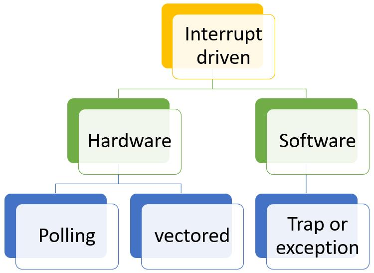
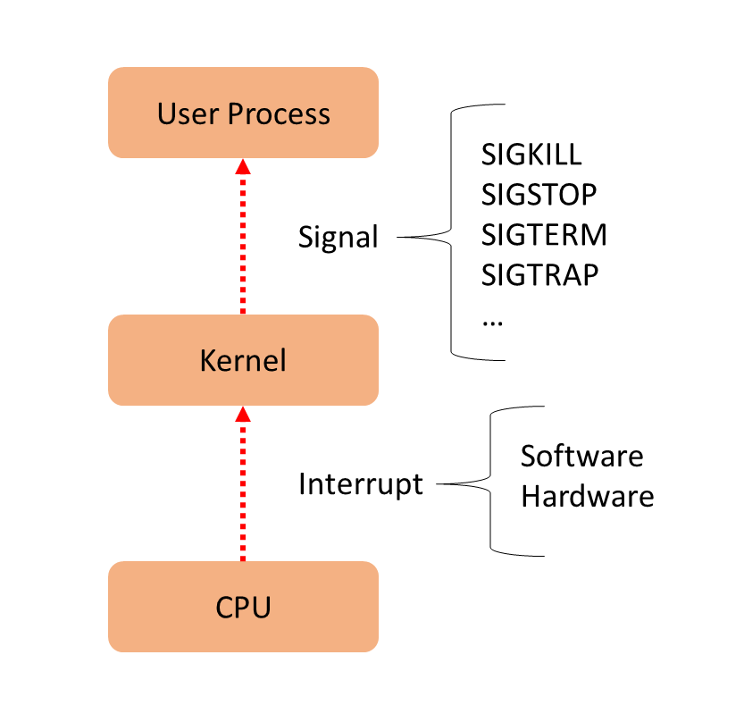
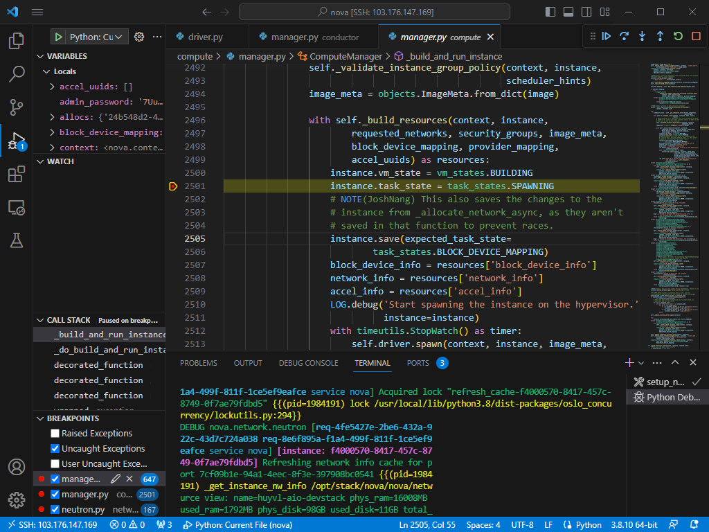
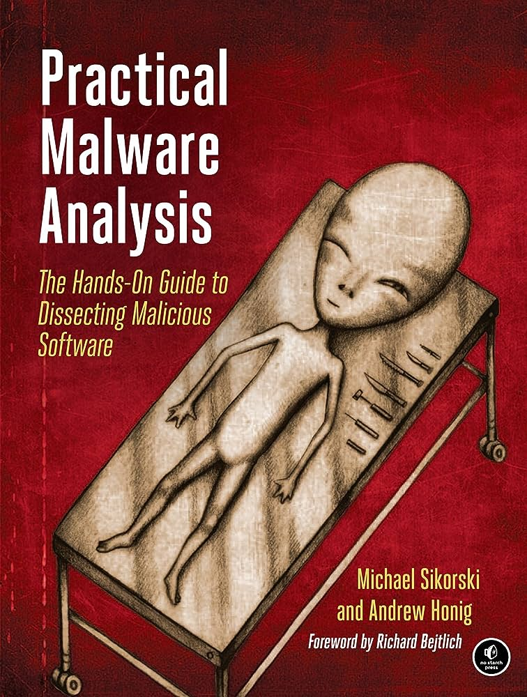

[Phần 2 - Tổng quan về kiến trúc Linux](https://github.com/volehuy1998/network-onboard/blob/master/README.md)

- [2.1 - Linux Kernel (UPDATED 27/08/2023)](https://github.com/volehuy1998/network-onboard/blob/master/linux-onboard/2.1%20-%20linux-arch-onboard.md#linux_kernel)
  - 2.1.1 - Vai trò của Linux Kernel (UPDATED 24/08/2023)
  - 2.1.2 - Tổng quan về Interrupt - Ngắt (UPDATED 05/09/2023)
- [2.2 - Quản lý người dùng và nhóm (UPDATED 17/09/2023)](https://github.com/volehuy1998/network-onboard/blob/master/linux-onboard/2.2%20-%20linux-user-management.md#user_and_group)
  - 2.2.1 - Khái niệm `User` (UPDATED 17/09/2023)
  - 2.2.2 - Khái niệm về nhóm, chính và phụ (UPDATED 12/09/2023)
  - 2.2.3 - Thay đổi tài khoản người dùng (UPDATED 13/09/2023)
  - 2.2.4 - Các thao tác quản lý trên người dùng và nhóm(UPDATED 11/09/2023)
  - 2.2.5 - Hạn chế quyền truy cập người dùng (UPDATED 13/09/2023)
  - 2.2.6 - Cấp quyền `sudo` tự do (UPDATED 11/09/2023)
  - 2.2.7 - Cấp quyền `sudo` với lệnh cụ thể (UPDATED 11/09/2023)
- [2.3 - Hệ thống tệp tin (UPDATED 07/11/2023)](https://github.com/volehuy1998/network-onboard/blob/master/linux-onboard/2.3%20-%20linux-file-system-overview.md#fs)
  - 2.3.1 - Phân cấp hệ thống tệp tin (UPDATED 26/08/2023)
  - 2.3.2 - RPM Package và phân loại (UPDATED 24/08/2023)
  - 2.3.3 - Kernel RPM Package (UPDATED 24/08/2023)
  - 2.3.4 - Tổng quan về quyền trên tệp tin (UPDATED 04/10/2023)
    - 2.3.4.1 - Quản lý quyền tệp tin (UPDATED 13/09/2023)
    - 2.3.4.2 - Quyền đặc biệt dành cho chủ sở hữu (SUID) và lỗ hổng leo thang đặc quyền (UPDATED 10/09/2023)
    - 2.3.4.3 - Quyền đặc biệt dành cho nhóm (UPDATED 10/09/2023)
    - 2.3.4.4 - Quyền đặc biệt Sticky bit (UPDATED 04/09/2023)
  - 2.3.5 - Xác định hệ thống tệp tin và thiết bị (UPDATED 07/11/2023)
- [2.4 - Tổng quan tiến trình Linux (UPDATED 04/10/2023)](https://github.com/volehuy1998/network-onboard/blob/master/linux-onboard/2.4%20-%20linux-process-overview.md#linux_process)
  - 2.4.1 - Trạng thái của tiến trình Linux (UPDATED 17/09/2023)
  - 2.4.2 - Kiểm soát các `Job` (UPDATED 04/10/2023)
  - 2.4.3 - Kết thúc tiến trình (UPDATED 18/09/2023)
  - 2.4.4 - Dịch vụ hạ tầng (UPDATED 21/09/2023)
  - 2.4.5 - Tổng quan về `systemd` (UPDATED 30/09/2023)
  - 2.4.6 - Kiểm soát dịch vụ hệ thống (UPDATED 04/10/2023)
  - 2.4.7 - Mẫu `unit` với ký hiệu `@` (UPDATED 04/10/2023)
  - 2.4.8 - Chi tiết tệp `unit` (UPDATED 04/10/2023)
    - 2.4.8.1 - Loại `unit` phổ biến `*.service` (UPDATED 03/10/2023)
    - 2.4.8.2 - Loại `unit` về `*.socket` (UPDATED 30/09/2023)
    - 2.4.8.3 - Loại `unit` về `*.path` (UPDATED 30/09/2023)
- [2.5 - Điều khiển an toàn từ xa (UPDATED 31/12/2023)](https://github.com/volehuy1998/network-onboard/blob/master/linux-onboard/2.5%20-%20linux-secure-remote-overview.md#remote_connection)
  - 2.5.1 - Tổng quan về kiến trúc giao thức `SSH` (UPDATED 31/12/2023)
    - 2.5.1.1 - Kiến trúc giao thức `SSH` (UPDATED 22/10/2023)
    - 2.5.1.2 - Những xem xét bảo mật về khía cạnh truyền dẫn (UPDATED 19/10/2023)
    - 2.5.1.3 - Những xem xét bảo mật về khía cạnh xác thực (UPDATED 19/10/2023)
    - 2.5.1.4 - Giao thức `SSH-1`, `SSH-2` và sự cải tiến (UPDATED 22/10/2023)
  - 2.5.2 - Cài đặt `OpenSSH`, kết nối và cấu hình (UPDATED 23/10/2023)
    - 2.5.2.1 - Sử dụng công cụ cơ bản (UPDATED 19/10/2023)
    - 2.5.2.2 - Thông tin về `finger print` tại máy khách và máy chủ (UPDATED 19/10/2023)
    - 2.5.2.3 - Hành vi xử lý chuẩn kết nối đến máy chủ (UPDATED 19/10/2023)
    - 2.5.2.4 - Cấu hình `ssh client` (UPDATED 21/10/2023)
    - 2.5.2.5 - Sử dụng `X11 Forwarding` và `Port Forwarding` (UPDATED 23/10/2023)
- [2.6 - Tổng quan về quản lý mạng (UPDATED 05/11/2023)](https://github.com/volehuy1998/network-onboard/blob/master/linux-onboard/2.6%20-%20linux-network-overview.md#network_manage)
  - 2.6.1 - Mô hình `TCP/IP` (UPDATED 25/10/2023)
  - 2.6.2 - Mô tả về `Network Interface` (UPDATED 01/11/2023)
  - 2.6.3 - Địa chỉ `v4` (UPDATED 25/10/2023)
  - 2.6.4 - Địa chỉ `v6` (UPDATED 25/10/2023)
  - 2.6.5 - Thông tin về `network interface`(UPDATED 25/10/2023)
  - 2.6.6 - Công cụ quản lý `nmcli`(UPDATED 05/11/2023)
  - 2.6.7 - Cấu hình và quản lý `hostname`(UPDATED 05/11/2023)
- [2.7 - Kiến trúc nhật ký hệ thống ( :arrow_up: UPDATED 17/12/2023)](https://github.com/volehuy1998/network-onboard/blob/master/linux-onboard/2.7%20-%20linux-system-log-architecture-overview.md#sys_log_arch)
  - 2.7.1 - Tổng quan (UPDATED 03/12/2023)
  - 2.7.2 - Cách sử dụng `rsyslog` (UPDATED 06/12/2023)
  - 2.7.3 - Cách sử dụng `systemd-journald` (UPDATED 10/12/2023)
  - 2.7.4 - Đồng bộ thời gian ( :arrow_up: UPDATED 17/12/2023)
    - 2.7.4.1 - Tổng quan `Network Time Protocol` (UPDATED 17/12/2023)
    - 2.7.4.2 - Công cụ `datetimectl` (UPDATED 10/12/2023)
    - 2.7.4.3 - Cấu hình `NTP` sử dụng `chrony` (UPDATED 17/12/2023)
    - 2.7.4.4 - Cấu hình `NTP` sử dụng `ntpd` (UPDATED 10/12/2023)
- [2.8 - Lập lịch chạy cho tác vụ tương lai ( :arrow_up: UPDATED 01/01/2023)](https://github.com/volehuy1998/network-onboard/blob/master/linux-onboard/2.8%20-%20linux-job-scheduler.md#schedule_job)
  - 2.8.1 - Tổng quan ( :heavy_plus_sign: UPDATED 24/12/2023)
  - 2.8.2 - Cách sử dụng công cụ `at` ( :heavy_plus_sign: UPDATED 24/12/2023)
  - 2.8.3 - Cách sử dụng công cụ `cron` ( :heavy_plus_sign: UPDATED 24/12/2023)
  - 2.8.4 - Ứng dụng `systemd timer` ( :heavy_plus_sign: UPDATED 01/01/2023)
    - 2.8.4.1 - Cách sử dụng công cụ `systemd timer` ( :heavy_plus_sign: UPDATED 01/01/2023)
    - 2.8.4.2 - Quản lý loại tệp tạm thời ( :heavy_plus_sign: UPDATED 01/01/2023)
      - 2.8.4.2.1 - Cách sử dụng `systemd-tmpfiles --create` ( :heavy_plus_sign: UPDATED 01/01/2023)
      - 2.8.4.2.2 - Cách sử dụng `systemd-tmpfiles --clean` ( :heavy_plus_sign: UPDATED 01/01/2023)
      - 2.8.4.2.3 - Cách sử dụng `systemd-tmpfiles --remove` ( :heavy_plus_sign: UPDATED 01/01/2023)

# Tổng quan về kiến trúc Linux
## Tổng quan `Linux kernel`
`Linux kernel` được đánh giá là mã nguồn mở lớn nhất thế giới với hàng ngàn lập trình viên đang đóng góp và hàng triệu dòng code thay đổi cho mỗi lần phát hành phiên bản mới. `Linux kernel` được phát hành với giấy phép `GPL v2`, cụ thế giấy phép này yêu cầu mọi sự sửa đổi/cập nhật sẽ được chuyển đến cho khách hàng. Lịch trình hiện tại của các bản phát hành thường sẽ rơi vào tháng 3 hoặc 4. `Linux kernel` là thành phần chính của hệ điều hành `Linux`, thành phần cốt lõi giữa phần cứng máy tính và các tiến trình bên trong nó. Nó giao tiếp giữa 2 thực thể , quản lý tài nguyên một cách tốt nhất. Đặt tên là `kernel` vì nó được coi là hát gióng nằm bên trong lớp vỏ - nó tồn tại ở ngay bên trong `OS` và điều khiển các chức năng của phần cứng.

## Vai trò `Linux kernel`
`Kernel` gồm có 4 công việc:

- `Memory management` -quản lý bộ nhớ: liên tục theo dõi lượng tài nguyên nơi bộ nhớ đã được sử dụng, bao gồm cả việc nó lưu trữ những gì và nơi nó được lưu trữ.
- `Process management` - quản lý tiến trình: xác định được những tiến trình nào có thể sử dụng CPU, khi nào và bao lâu.
- `Device drivers`: đóng vai trò trung gian trong việc liên lạc giữa phần cứng và tiến trình.
- `System Calls and Security`: nhận những yêu cầu từ `service` và `process`.

Khi `kernel` được triển khai đúng cách thì nó phải nằm trong trạng thái `invisible` với người dùng thông thường, nó chỉ làm việc bên trong không gian `kernel space`, nơi nó phân bổ bộ nhớ và theo dõi nơi mọi thứ được lưu giữ. Giống như người dùng sử dụng truy cập `web` thì trình duyệt là không gian của người dùng hay `user space`. Các ứng dụng tương tác với `kernel` thông qua `System Call Interface(SCI)`.

`Red Hat` ví dụ về `kernel` như một trợ lý bận rộn của một nhà điều hành quyền lực `hardware`. Công việc của trợ lý là chuyển tiếp các tin nhắn và yêu cầu của các tiến trình `processes` từ nhân viên `users` tới nhà điều hành. Ghi nhớ vị trí của chúng vào tủ hồ sơ `memory` và xác định ai là người có quyền truy cập.

- `Hardware`: máy tính vât lý nhìn theo hướng logic nó nằm ở đáy hệ thống, tạo nên bộ nhớ `memory`, `CPU` tính toán đọc ghi vào bộ nhớ, ...
- `Linux kernel`: lõi của `OS`, nằm ở giữa phần cứng và tiến trình về mặt `logic`, đương nhiên `kernel` vẫn là phần mềm với vai trò sẽ cho `CPU` biết phải làm gì.
- `User processes`: trên đây có những chương trình đang chạy được quản lý bởi `kernel`. Các tiến trình của `user` tạo nên `user space`. Các tiến trình này được biết đến đơn thuần là `process`. `Kernel` sẽ cho phép các tiến trình này và phần cứng giao tiếp lẫn nhau, cái mà được gọi là `Inter-process communication(IPC)`.

Đoạn mã được thực thi trên hệ thống chạy trên `CPU` ở `1` trong `2` chế độ: `kernel` hoặc `user`. Đoạn mã chạy trong `kernel mode` không bị hạn chế quyền truy cập tới phần cứng trong khi ngược lại với `user mode`, ... Những chi tiết nhỏ này góp phần tạo nên cơ sở phân tách lớp bảo mật, xây dựng nên những thứ phức tạp như `container`, `Virtual Machine`.

Điều này cũng đồng nghĩa rằng nếu tiến trình chạy ở `user mode` có thiệt hại hạn chế hơn, ngược lại với `kernel mode` khi có sự cố sẽ làm sập hệ thống. Vì `user mode` có sẵn các biện pháp bảo vệ và chỉ các quyền cần thiết nên sự cố thường không thể gây ra quá nhiều vấn đề.

Ví dụ: khi người dùng `Windows` mở một tệp bất kỳ trên ứng dụng `File Explorer` - dĩ nhiên đây là ứng dụng nằm ở phía `user mode`, ứng dụng này sẽ gửi một yêu cầu `I/O` đến ứng dụng loại `File System Filter Driver` được chạy ở phía `kernel mode`, tại đây `File System Filter Driver` sẽ là một bộ lọc cho phép `File Explorer` lấy dữ liệu từ ổ cứng, ngược lại cũng có quyền từ chối nếu như nội dung hoặc một phần nhỏ trong nội dung nằm trong danh sách không thỏa được bị lập trình viên `driver` thiết kế. Đây là một chức năng nằm trong sản phẩm `File Defender` của tập đoàn chuyên làm phần mềm bảo mật `Plott Ltd` Nhật Bản.

<i>Tham khỏa thêm tại https://access.redhat.com/documentation/en-us/red_hat_enterprise_linux/8/html-single/managing_monitoring_and_updating_the_kernel/index#what-the-kernel-is_assembly_the-linux-kernel</i>
## Tổng quan về Interrupt - Ngắt
`Interrupt` là một sự kiện nhìn về ở phía vi xử lý thì nó có độ ưu tiên rất cao, nó xảy ra để thay đổi luồng thực thi của chương trình và nó có thể được tạo ra từ thiết bị phần cứng hoặc phần mềm nói chung, từ chính CPU của nó nói riêng. Khi `interrupt` xảy ra thì mã thực thi hiện tại bị dừng lại nhường chỗ cho việc xử lý `interrupt` bởi một chương trình tên `interrupt handler` được biết với tên khác là `interrupt service routine (ISR)`, tức với một `interrupt vector` trong <a href="https://en.wikipedia.org/wiki/Interrupt_vector_table">`interrupt vector table (IVT)`</a> sẽ có tương ứng một `handler` đảm nhận xử lý, ví dụ như `trap hanlder` hay `page fault handler`, ... luồng thực thi hiện tại sẽ tái khởi động từ trạng thái cũ khi `interrupt` hoàn tất xử lý. Các loại ngắt được nhóm thành 2 thể loại chính dựa trên nguồn khởi tạo của nó: khả năng trì hoãn hoặc vô hiệu tóa tạm thời:

- `synchronous`: đồng bộ, được tạo từ việc thực thi `instruction`.
- `asynchronous`: bất đồng bộ, được tạo ra từ `external event`.
- `maskable`: ngắt này có thể bỏ qua, được báo hiệu qua chân `INT`.
- `non-maskable`: ngắt thuộc loại này không thể bị bỏ qua, được báo hiệu qua chân `NMI`.

`Interrupt` được tạo nên bởi 2 thực thể là phần cứng và phần mềm:

-  `Hardware interrupt` hay ngắt cứng được báo hiệu từ thiết bị ngoại vi, ví dụ như một phím được nhấn hoặc di chuyển chuột sẽ tạo ra các ngắt cứng khiến vi xử lý chú ý và xử lý dữ liệu. Các ngắt cứng có thể đến một cách không đồng bộ `asynchronous` hoặc bất kỳ lúc nào trong quá trình thực hiện lệnh của vi xử lý, do đó tất cả tín hiệu ngắt cứng đều phải được đồng bộ hóa với đồng hồ của bộ vi xử lý. Trong hầu hết các hệ thống, mỗi tín hiệu <a href="https://en.wikipedia.org/wiki/Interrupt_request">`interrupt request (IRQ)`</a> đều được gắn mác với một thiết bị cụ thể vì điều này hữu ích trong việc nhanh chóng xác định thiết bị phần cứng nào đang yêu cầu dịch vụ. Về mặt lịch sử thì `interrupt handler` chính là `hardware interrupt handler`, ngắt cứng phát sinh từ các tín hiệu điện hoặc một số các cách thức cấp thấp, các tín hiệu này được chuyển đi sau khi được chuyển đổi thành mã số trong `interrupt vector table`. Tóm lại các ngắt cứng được sử dụng ở mức ưu tiên cao vì yêu cầu dừng việc thực thi hiện tại.
- Về mặt lịch sử sau khi nhận thấy rằng sẽ thuận tiện hơn nếu phần mềm cũng có thể tạo ra các ngắt tương tự như phần cứng. `Software interrupt` hay ngắt mềm thuộc loại đồng bộ `synchronous` gây ra bởi chính vi xử lý hoặc phần mềm, trường hợp này gọi tắt là `trap` hoặc `exception` như bên dưới mô tả. Số lượng tín hiệu được tạo ra bởi ngắt mềm gần như là vô hạn vì kỹ thuật của nó không phụ thuộc vào số lượng thanh ghi `register` nói riêng hay phần cứng nói chung.

`Interrupt` và `signal` đều đóng vai trò là một tín hiệu nhưng khác nhau ở ngữ cảnh sử dụng. `Interrupt` là một phương tiện trung chuyển giữa vi xử lý và `kernel` trong khi `signal` được sử dụng giữa `kernel`  và tiến trình người dùng. Khởi nguồn của `interrupt` đến từ vi xử lý hoặc nội tại của vi xử lý đó như phần trên `software interrupt` đã đề cập, đối với `signal` thí nó được khởi tạo từ `kernel` của hệ điều hành.

Ngắt `sync` thường xuyên được nhắc đến qua từ `exception`, nó được vi xử lý phát hiện ngay trong chính quá trình thực thi. Ví dụ phép toán chia cho `x:0` sẽ tạo ra một `exception`. Ngược lại, ngắt `async` được tạo ra từ các thiết bị `I/O`, ví dụ `NIC` tạo ra một ngắt để báo hiệu rằng gói tin được gửi đến, bàn phím gửi tín hiệu đến vi xử lý để tạo ra ngắt `INT 21H` khi người dùng gõ phím. Hầu hết các loại ngắt đều là `maskable`, tức là hoàn toàn có khả năng tạm thời vô hiệu hóa hoặc trì hoãn nó, tuy nhiên có một số ngắt không thể vô hiệu hóa hoặc trì hoãn.

Có 2 nguồn dẫn đến `exception` là được vi xử lý phát hiện hoặc được lập trình sẵn như sau:

- `faults` là một ngoại lệ được báo trước khi việc thực thi của vi xử lý, ví dụ như phép toán chia cho mẫu số giá trị `0`. `Extended Instruction Pointer(EIP)` lưu địa chỉ lệnh gây lỗi và sau khi xử lý, chương trình có thể thực hiện lại, ví dụ như khi chương trình sử dụng nhiều bộ nhớ hơn bộ nhớ vật lý `RAM` thì `page fault hanlder` sẽ thực hiện việc chuyển đổi giữa `RAM` và `DISK` để giúp hệ thống hoạt động ổn định. Về cái nhìn khắc khe có thể coi `fault` không hoàn toàn là một lỗi.
- `traps` là một loại ngoại lệ diễn ra ở tiến trình người dùng, việc xử lý `traps` có độ ưu tiên rất cao và mã có thể tiếp tục chạy sau khi `traps` được xử lý xong, tức là cần đồng bộ giữa 2 luồng thực thi. Hầu hết `traps` được xem là một kỳ vọng xảy ra đối với trường hợp nào đó. `traps` được báo sau khi việc thực thi của lệnh `instruction`; ví dụ người dùng đầu tiên tạo một lệnh ngắt `INT 3` tương đương với đặt một `breakpoint` vào trong mã nguồn, sau đó `kernel` gửi một tín hiệu `SIGTRAP` đến chương trình `debug` để thực hiện kích hoạt dòng code đã đặt `breakpoint`.
- `aborts` được sử dụng để dừng luồng thực thi, trong đa số các trường hợp thì nó được xem xét là một lỗi thực sự ví dụ như lỗi phần cứng, ... Tín hiệu ngắt được gửi tới `Control Unit(CU)` là tín hiệu khẩn cấp để điều hướng sang `abort exception handler`, đối với loại `handler` này được thiết kế một hành động duy nhất là buộc chấm dứt tiến trình.

Có một ngoại lệ dành cho phần mềm là `kernel`, nó không được phép gây ra `traps`, `faults`. Nếu `kernel` gây ra lỗi thì tình hình như vậy được xem xét là nghiêm trọng đối với hệ thống, `trap handler` gọi trường hợp này là `panic`, tên gọi cho việc dừng hệ thống một cách bất ngờ và không mong muốn.

Ví dụ về `software interrupt` thực hiện nhiệm vụ đặt `trap` với `interrupt 3` hay viết tắt là `INT 3` thông qua phần mềm `Visual Studio Code` chạy ở phía người dùng, phần mềm đang cố gắng theo đuổi chi tiết chức năng tạo máy ảo của `nova-compute` nói riêng và `Openstack` nói chung dựa trên mã nguồn mở. Ngoài ra đối với trường hợp sử dụng `docker container` thông qua `Kolla` thì người dùng cũng có thể đặt `breakpoint` dựa trên `console` theo hướng dẫn sau: https://docs.openstack.org/kolla-ansible/latest/contributor/kolla-for-openstack-development.html (lưu ý rằng thay thế `socat` trong hướng dẫn bằng chương trình `netcat` cụ thể là `"nc <ip>:<port>"`)

Giải thích:

- Một `breakpoint` màu đỏ đã được đặt tại dòng `2501` trước khi sử dụng chức năng tạo máy ảo.
- Ngay khi bấm tạo máy ảo, dòng `2501` đã được kích hoạt bằng màu vàng và dừng luồng thực thi lại, chờ đợi lệnh tiếp đến: đi đến dòng kế tiếp; thực thi hết các đoạn mã trong hàm này và dừng lại ở hàm đã gọi nó; ...
- Dòng `2501` thực hiện gán giá trị `SPAWNING` để mô tả giai đoạn công việc đang thực hiện trên máy ảo này.

Đặt `breakpoint` giúp lập trình viên theo dõi chi tiết cách thức hoạt động của một chức năng, sẽ dễ dàng hơn nếu đối tượng của họ là mã đã có sẵn, ngược lại sẽ rất khó khăn nếu đối tượng là một chương trình đã được đóng gói lúc này họ sẽ được gọi là kiểm thử viên hộp đen hoặc kỹ sư dịch ngược `reverse engineer`. Câu hỏi đặt ra rằng:

- Khi không có mã sẵn thì làm thế nào để đặt `breakpoint` tương tự như ví dụ trên?
- Tầm quan trọng về `INT 3` có lợi như thế nào đối với người viết ra chương trình và người dịch ngược mã nguồn của chương trình đó?
- Đối tượng chương trình là gì hoặc chứa nội dung quan trọng gì mà cần kỹ sư dịch ngược phẫu thuật chúng?

Kỹ sư dịch ngược sử dụng phần mềm `OllyDbg` để đặt `breakpoint` vào chương trình, đồng nghĩa với việc cho chạy chúng với chế độ `debug`, phần mềm `OllyDbg` sẽ tự động triển khai một `software breakpoint` vào mã `assembly` bằng cách ghi đè `0xCC` vào byte đầu tiên của lệnh vi xử lý. Một khi lệnh `0xCC` được thực thi, hệ điều hành sẽ tạo ra một `exception` loại `trap` và trả quyền điều khiển về cho chương trình `debugger` được tích hợp trong phần mềm `OllyDbg`. Về mặt lịch sử, đại diện cho chương trình được phân tích là mã độc, việc nghiên cứu lẫn nhau giữa người viết mã độc và kỹ sư dịch ngược là chuyện xảy ra thường xuyên, để chống lại việc này thì người viết mã độc sẽ dựa vào thói quen sử dụng `software execution breakpoint` của các kỹ sư để vô hiệu hóa cuộc phẩu thuật, ngăn chặn việc mã độc rơi vào trạng thái bị nghiên cứu và phanh phui các hành vi. Ngay khi khởi chạy chương trình thì người viết mã độc có một số cách để phát hiện ra chương trình của mình đang bị phẩu thuật:

- Quét thanh ghi `EDI` để kiểm tra sự tồn tại của byte `0xCC`, nếu có lập tức dừng chương trình.
- Tính `checksum` vì trong lúc phần mềm `OllyDbg` chỉnh sửa nội dung bởi `0xCC` nên nếu tính toán lại `checksum` trong lúc chạy và trước lúc phát hành mã độc sẽ có sự sai lệch. Cách này không thông dụng như `INT Scanning` trên nhưng cũng là một lựa chọn mang lại hiệu quả tương đương.
- Tất cả chúng ta đều biết rằng khoảng cách thời gian giữa 2 câu lệnh mà chính chúng ta viết ra đều có giá trị tối thiểu và tối đa. Sẽ thật vô lý nếu thời gian thực thi câu lệnh lâu hơn bình thường, khả năng cao rằng trước đó câu lệnh đang `stop` bởi hành vi `debug` và `resume` trở lại khi ai đó vừa dành thời gian nghiên cứu xong. Đánh dấu thời gian cũng là một cách để phát hiện hoặc `anti-debug` mặc dù không mang lại chính xác tuyệt đối.

`Debug` là một kỹ thuật để phân tích hành vi mã độc, ngoài kỹ thuật này ra còn có `disassembly` tức đọc và hiểu dưới dạng `assembly` thông qua phần mềm `IDA Pro`; chạy chương trình trong môi trường ảo hóa `virtualization`. Tương đương với các kỹ thuật phân tích này thì người viết chương trình sẽ có các kỹ thuật chống lại được gọi là `anti-disassembly` và `anti-virtual machine`. Tất có kỹ thuật đều được mô tả chi tiết trong cuốn `Practical Malware Analysis`.

