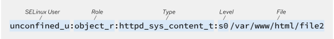
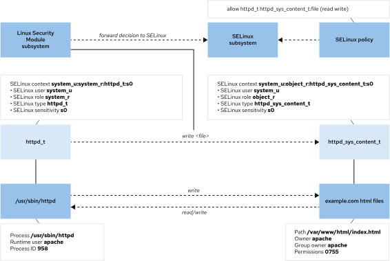

[Phần 2 - Tổng quan về kiến trúc Linux](https://github.com/volehuy1998/network-onboard/blob/master/README.md)

- [2.1 - Linux Kernel ( :arrow_up: UPDATED 21/01/2024)](https://github.com/volehuy1998/network-onboard/blob/master/linux-onboard/2.1%20-%20linux-arch-onboard.md#linux_kernel)
  - 2.1.1 - Vai trò của Linux Kernel ( :arrow_up: UPDATED 21/01/2024)
  - 2.1.2 - Tổng quan về Interrupt - Ngắt (UPDATED 05/09/2023)
- [2.2 - Quản lý người dùng và nhóm (UPDATED 17/09/2023)](https://github.com/volehuy1998/network-onboard/blob/master/linux-onboard/2.2%20-%20linux-user-management.md#user_and_group)
  - 2.2.1 - Khái niệm `User` (UPDATED 17/09/2023)
  - 2.2.2 - Khái niệm về nhóm, chính và phụ (UPDATED 12/09/2023)
  - 2.2.3 - Thay đổi tài khoản người dùng (UPDATED 13/09/2023)
  - 2.2.4 - Các thao tác quản lý trên người dùng và nhóm(UPDATED 11/09/2023)
  - 2.2.5 - Hạn chế quyền truy cập người dùng (UPDATED 13/09/2023)
  - 2.2.6 - Cấp quyền `sudo` tự do (UPDATED 11/09/2023)
  - 2.2.7 - Cấp quyền `sudo` với lệnh cụ thể (UPDATED 11/09/2023)
- [2.3 - Hệ thống tệp tin ( :arrow_up: UPDATED 07/01/2024)](https://github.com/volehuy1998/network-onboard/blob/master/linux-onboard/2.3%20-%20linux-file-system-overview.md#fs)
  - 2.3.1 - Phân cấp hệ thống tệp tin (UPDATED 26/08/2023)
  - 2.3.2 - RPM Package và phân loại (UPDATED 24/08/2023)
  - 2.3.3 - Kernel RPM Package (UPDATED 24/08/2023)
  - 2.3.4 - Tổng quan về quyền trên tệp tin ( :arrow_up: UPDATED 07/01/2024)
    - 2.3.4.1 - Quản lý quyền tệp tin (UPDATED 13/09/2023)
    - 2.3.4.2 - Quyền đặc biệt dành cho chủ sở hữu (SUID) và lỗ hổng leo thang đặc quyền (UPDATED 10/09/2023)
    - 2.3.4.3 - Quyền đặc biệt dành cho nhóm (UPDATED 10/09/2023)
    - 2.3.4.4 - Quyền đặc biệt Sticky bit (UPDATED 04/09/2023)
  - 2.3.5 - Xác định hệ thống tệp tin và thiết bị (UPDATED 07/11/2023)
- [2.4 - Tổng quan tiến trình Linux (UPDATED 04/10/2023)](https://github.com/volehuy1998/network-onboard/blob/master/linux-onboard/2.4%20-%20linux-process-overview.md#linux_process)
  - 2.4.1 - Trạng thái của tiến trình Linux (UPDATED 17/09/2023)
  - 2.4.2 - Kiểm soát các `Job` (UPDATED 04/10/2023)
  - 2.4.3 - Kết thúc tiến trình (UPDATED 18/09/2023)
  - 2.4.4 - Dịch vụ hạ tầng (UPDATED 21/09/2023)
  - 2.4.5 - Tổng quan về `systemd` (UPDATED 30/09/2023)
  - 2.4.6 - Kiểm soát dịch vụ hệ thống (UPDATED 04/10/2023)
  - 2.4.7 - Mẫu `unit` với ký hiệu `@` (UPDATED 04/10/2023)
  - 2.4.8 - Chi tiết tệp `unit` (UPDATED 04/10/2023)
    - 2.4.8.1 - Loại `unit` phổ biến `*.service` (UPDATED 03/10/2023)
    - 2.4.8.2 - Loại `unit` về `*.socket` (UPDATED 30/09/2023)
    - 2.4.8.3 - Loại `unit` về `*.path` (UPDATED 30/09/2023)
- [2.5 - Điều khiển an toàn từ xa (UPDATED 31/12/2023)](https://github.com/volehuy1998/network-onboard/blob/master/linux-onboard/2.5%20-%20linux-secure-remote-overview.md#remote_connection)
  - 2.5.1 - Tổng quan về kiến trúc giao thức `SSH` (UPDATED 31/12/2023)
    - 2.5.1.1 - Kiến trúc giao thức `SSH` (UPDATED 22/10/2023)
    - 2.5.1.2 - Những xem xét bảo mật về khía cạnh truyền dẫn (UPDATED 19/10/2023)
    - 2.5.1.3 - Những xem xét bảo mật về khía cạnh xác thực (UPDATED 19/10/2023)
    - 2.5.1.4 - Giao thức `SSH-1`, `SSH-2` và sự cải tiến (UPDATED 22/10/2023)
  - 2.5.2 - Cài đặt `OpenSSH`, kết nối và cấu hình (UPDATED 23/10/2023)
    - 2.5.2.1 - Sử dụng công cụ cơ bản (UPDATED 19/10/2023)
    - 2.5.2.2 - Thông tin về `finger print` tại máy khách và máy chủ (UPDATED 19/10/2023)
    - 2.5.2.3 - Hành vi xử lý chuẩn kết nối đến máy chủ (UPDATED 19/10/2023)
    - 2.5.2.4 - Cấu hình `ssh client` (UPDATED 21/10/2023)
    - 2.5.2.5 - Sử dụng `X11 Forwarding` và `Port Forwarding` (UPDATED 23/10/2023)
- [2.6 - Tổng quan về quản lý mạng (UPDATED 05/11/2023)](https://github.com/volehuy1998/network-onboard/blob/master/linux-onboard/2.6%20-%20linux-network-overview.md#network_manage)
  - 2.6.1 - Mô hình `TCP/IP` (UPDATED 25/10/2023)
  - 2.6.2 - Mô tả về `Network Interface` (UPDATED 01/11/2023)
  - 2.6.3 - Địa chỉ `v4` (UPDATED 25/10/2023)
  - 2.6.4 - Địa chỉ `v6` (UPDATED 25/10/2023)
  - 2.6.5 - Thông tin về `network interface`(UPDATED 25/10/2023)
  - 2.6.6 - Công cụ quản lý `nmcli`(UPDATED 05/11/2023)
  - 2.6.7 - Cấu hình và quản lý `hostname`(UPDATED 05/11/2023)
- [2.7 - Kiến trúc nhật ký hệ thống (UPDATED 17/12/2023)](https://github.com/volehuy1998/network-onboard/blob/master/linux-onboard/2.7%20-%20linux-system-log-architecture-overview.md#sys_log_arch)
  - 2.7.1 - Tổng quan (UPDATED 03/12/2023)
  - 2.7.2 - Cách sử dụng `rsyslog` (UPDATED 06/12/2023)
  - 2.7.3 - Cách sử dụng `systemd-journald` (UPDATED 10/12/2023)
  - 2.7.4 - Đồng bộ thời gian (UPDATED 17/12/2023)
    - 2.7.4.1 - Tổng quan `Network Time Protocol` (UPDATED 17/12/2023)
    - 2.7.4.2 - Công cụ `datetimectl` (UPDATED 10/12/2023)
    - 2.7.4.3 - Cấu hình `NTP` sử dụng `chrony` (UPDATED 17/12/2023)
    - 2.7.4.4 - Cấu hình `NTP` sử dụng `ntpd` (UPDATED 10/12/2023)
- [2.8 - Lập lịch chạy cho tác vụ tương lai (UPDATED 01/01/2024)](https://github.com/volehuy1998/network-onboard/blob/master/linux-onboard/2.8%20-%20linux-job-scheduler.md#schedule_job)
  - 2.8.1 - Tổng quan (UPDATED 24/12/2023)
  - 2.8.2 - Cách sử dụng công cụ `at` (UPDATED 24/12/2023)
  - 2.8.3 - Cách sử dụng công cụ `cron` (UPDATED 24/12/2023)
  - 2.8.4 - Ứng dụng `systemd timer` (UPDATED 01/01/2024)
    - 2.8.4.1 - Cách sử dụng công cụ `systemd timer` (UPDATED 01/01/2024)
    - 2.8.4.2 - Quản lý loại tệp tạm thời (UPDATED 01/01/2024)
      - 2.8.4.2.1 - Cách sử dụng `systemd-tmpfiles --create` (UPDATED 01/01/2024)
      - 2.8.4.2.2 - Cách sử dụng `systemd-tmpfiles --clean` (UPDATED 01/01/2024)
      - 2.8.4.2.3 - Cách sử dụng `systemd-tmpfiles --remove` (UPDATED 01/01/2024)
- [2.9 - Quản lý tệp đóng gói và nén với công cụ `tar` ( :arrow_up: UPDATED 15/01/2024)](https://github.com/volehuy1998/network-onboard/blob/master/linux-onboard/2.9%20-%20linux-manage-compressed-tar-archives.md#manage_compress_tar_archive)
    - 2.9.1 - Tạo và quản lý tệp đóng gói ( :arrow_up: UPDATED 13/01/2024)
    - 2.9.2 - Tạo và quản lý tệp nén đóng gói ( :arrow_up: UPDATED 15/01/2024)
    - 2.9.3 - Quản lý tệp sao lưu gia tăng `incremental backup` ( :arrow_up: UPDATED 15/01/2024)
    - 2.9.4 - Chuyển tệp giữa các hệ thống một cách an toàn ( :arrow_up: UPDATED 15/01/2024)
    - 2.9.5 - Đồng bộ giữa các hệ thống một cách an toàn ( :arrow_up: UPDATED 15/01/2024)
- [2.10 - Quản lý `SELinux` ( :arrow_up: UPDATED 28/01/2024)](#selinux_manage)
    - [2.10.1 - Kiến trúc `SELinux` ( :arrow_up: UPDATED 27/01/2024)](#selinux_arch)
    - [2.10.2 - Sử dụng `SELinux` cơ bản với chính sách `targeted` ( :arrow_up: UPDATED 28/01/2024)](#basic_selinux)
      - [2.10.2.1 - Xem nhãn, kích hoạt và vô hiệu hóa `SELinux` ( :arrow_up: UPDATED 28/01/2024)](#selinux_activation)
      - [2.10.2.2 - Xem định nghĩa chính sách `SELinux` ( :heavy_plus_sign: UPDATED 27/01/2024)](#selinux_policy_searching)
      - [2.10.2.3 - Auditing hành vi hệ thống ( :heavy_plus_sign: UPDATED 28/01/2024)](#basic_policy_audit)
      - [2.10.2.4 - Kiểm soát `fcontext` với nhãn sẵn có ( :arrow_up: UPDATED 27/01/2024)](#basic_file_context)
      - [2.10.2.5 - Kiểm soát `port` với nhãn sẵn có ( :arrow_up: UPDATED 27/01/2024)](#basic_port)
      - [2.10.2.6 - Kiểm soát chính sách với  `boolean` ( :arrow_up: UPDATED 27/01/2024)](#basic_boolean)
- [2.11 - Quản lý lưu trữ cơ bản ( :arrow_up: UPDATED 07/02/2024)](https://github.com/volehuy1998/network-onboard/blob/master/linux-onboard/2.11%20-%20linux-manage-basic-storage.md#manage_basic_storage)
    - 2.11.1 - Khái niệm phân vùng ổ cứng ( :heavy_plus_sign: UPDATED 05/01/2024)
    - 2.11.2 - Quản lý phân vùng theo định dạng ( :heavy_plus_sign: UPDATED 05/01/2024)
      - 2.11.2.1 - Quản lý phân vùng định dạng MBR ( :arrow_up: UPDATED 07/02/2024)
      - 2.11.2.2 - Quản lý phân vùng định dạng GPT ( :heavy_plus_sign: UPDATED 05/01/2024)
    - 2.10.3 - Tạo tệp hệ thống ( :heavy_plus_sign: UPDATED 05/01/2024)
    - 2.10.4 - Mount tệp hệ thống ( :heavy_plus_sign: UPDATED 05/01/2024)
      - 2.10.4.1 - Mount thủ công tệp hệ thống ( :heavy_plus_sign: UPDATED 05/01/2024)
      - 2.10.4.2 - Mount tự vĩnh viễn tệp hệ thống ( :heavy_plus_sign: UPDATED 05/01/2024)
    - 2.10.5 - Quản lý không gian `Swap` ( :heavy_plus_sign: UPDATED 05/01/2024)
      - 2.10.5.1 - Khái niệm không gian `Swap` ( :heavy_plus_sign: UPDATED 05/01/2024)
      - 2.10.5.2 - Tạo phân vùng `swap` ( :heavy_plus_sign: UPDATED 05/01/2024)

## <a name="selinux_manage">Quản lý `SELinux`</a>
### <a name="selinux_arch">Kiến trúc `SELinux`</a>

`Security Enhanced Linux (SELinux)` là kiến trúc bảo mật cho hệ thống Linux, vào những năm 1990 được đồng phát triển để vá nhân Linux giữa `Secure Computing Corporation (SCC)`, `MITRE`, Đại học Utah và `Flux Advanced Security Kernel (FLASK)` dưới sự định hướng của [United States National Security Agency (NSA)](https://www.nsa.gov/) - Cơ quan An ninh Quốc gia Hoa Kỳ. Tháng 12/2000 được phát hành cho cộng đồng [mã nguồn mở](https://github.com/volehuy1998/network-onboard/blob/master/linux-onboard/1.0%20-%20linux-history-onboard.md#license) và đến năm 2003 được tích tợp hoàn toàn vào nhân Linux. Cuối cùng vào năm 2005 được tích hợp vào `Red Hat Enterprise Linux 4`.

Chính sách tiêu chuẩn thông thường gọi là `Discretionary Access Control (DAC)` mô tả sự cho phép truy cập dựa trên người dùng, nhóm, hành động truy cập. `DAC` không cung cấp cho quản trị viên tạo các chính sách bảo mật toàn diện và chi tiết mà ngược lại mô tả một không gian quyền hạn tương đối rộng lớn, mơ hồ và đây chính là điểm yếu, `DAC` vô tình trợ giúp cho những người dùng được ủy quyền sử dụng với mục đích khác. `SELinux` là một tính năng quan trọng bù đắp khuyết điểm của `DAC` và chính sách tiêu chuẩn khác. Việc truy cập vào tệp, cổng hay tài nguyên khác sẽ được `SELinux` kiểm soát ở mức độ chi tiết. 

Một số ví vụ về quyền truy cập:

- Ví dụ về quyền cho phép viết, vấn đề xảy ra khi dữ liệu được tổ chức theo cấu trúc đặc biệt, thay vì chỉ chỉnh sửa phần dữ liệu mong muốn một cách an toàn dựa trên phần mềm được chỉ định thì người dùng hoàn toàn có khả năng thay đổi cấu trúc dữ liệu bằng mọi trình soạn thảo mà họ muốn, việc này dẫn đến hư hỏng dữ liệu hoặc các vấn đề liên quan đến bảo mật. Quyền trên tệp không ngăn chặn được hành vi như vậy.
- Ví dụ về quyền thực thi, cụ thể hơn là truy cập thư mục. Người tấn công có thể làm dụng `../` trong máy chủ web để truy cập dữ liệu khác trong hệ thống. Mặc dù `SELinux` không thể ngăn chặn hoàn toàn nhưng cũng góp phần giảm thiếu tối đa rủi ro.

`SELinux` thực hiện một bộ quy tắc truy cập rõ ràng về hành động giữa tiến trình và tài nguyên hệ thống. `SELinux` triển khai dựa trên lý thuyết `Mandantory Access Control (MAC)`, các ứng dụng `Apparmor`, `GrSecurity`, `PARSEC`, ... cũng được triển khai trên lý thuyết này. Những hành động chưa được định nghĩa trong quy tắc truy cập sẽ không được cho phép vì thế những ứng dụng chưa được thiết kế bảo mật vẫn sẽ được bảo vệ. Có thể thiết lập chính sách một cách đơn lẻ để dễ dàng trọng việc phát triển ứng dụng, các ứng dụng hoặc dịch vụ nằm trong chính sách sẽ được chạy trong khu vực an toàn và ngược lại có thể chạy không giới hạn mà không có sự bảo vệ của `SELinux`. Tuy vậy nhưng `SELinux` không phải là phần mềm chống virus hay giải pháp bảo mật tích hợp gồm tường lửa, mật khẩu, ... `SELinux` chỉ giúp nâng cao những giải pháp đã tồn tại, không phải thay thế.

`SELinux` có 3 chế độ:

- `Enforcing`: thực thi các chính sách định nghĩa. Chế độ mặc định.
- `Permissive`: hữu ích cho việc kiểm tra, giống như `enforcing` nhưng thay vì chặn thì nó sẽ ghi nhớ lại những vi phạm.
- `Disabled`: vô hiệu hóa `SELinux`, không khuyến khích sử dụng chế độ này.

<i><u>Lưu ý: đối với `RHEL9` thì mặc định `enforcing` bị vô hiệu hóa hoàn toàn và có sự thay đổi nhỏ, quản trị viên có thể thấy `selinux=0` thay vì `selinux=DISABLED` trong tệp cấu hình `/etc/selinux/config`. Việc vô hiệu hóa trong tệp cấu hình vẫn sẽ làm cho `SELinux` hoạt động nhưng không thực hiện chính sách bảo mật nào, đồng nghĩa với việc tất cả hành động sẽ bị từ chối.</u></i>

Chính sách mặc định của `SELinux` là `targeted`, trọng tâm của chính sách này nhằm bảo vệ các tiến trình. Ví dụ tiến trình `httpd` sẽ được chạy trong miền `httpd_t` và khi nó bị tấn công thì dựa vào các quy tắc được định nghĩa trong chính sách mà ngăn chặn hành động vào tài nguyên, thiệt hại sẽ bị hạn chế. Ngoài chính sách `targeted` còn có `MCS (Multi Level Security)` và `MCS (Multi Category Security)`. Nếu muốn đổi sang `MLS` hoặc `MCS` cần cài đặt thêm gói.

### <a name="basic_selinux">Sử dụng `SELinux` cơ bản với chính sách `targeted`</a>

#### <a name="selinux_activation">Xem nhãn, kích hoạt và vô hiệu hóa `SELinux`</a>

Chính sách `SELinux` là những quy tắc bảo mật định nghĩa thủ tục cụ thể về việc truy cập vào tài nguyên. Mỗi thực thể tài nguyên như tệp tin, tiến trình, thư mục và cổng đều được đánh nhãn hay còn gọi là cài đặt bối cảnh `SELinux`. Khi nhãn khớp với quy định nào đó có trong chính sách `SELinux` thì cho phép truy cập vào tài nguyên được đánh nhãn. Mặc định, `SELinux` sẽ không cho phép truy cập tài nguyên nếu không định nghĩa rõ ràng. Nếu không cú quy tắc nào được định nghĩa thì mọi truy cập sẽ bị từ chối.

<div style="text-align:center"></div>

Nhãn `SELinux` bao gồm 4: `user`, `role`, `type` và `security level`. Chính sách `targeted` được cài đặt mặc định ở `RHEL`. Quy tắc với tên `type` luôn kết thúc bằng `_t`.

<div style="text-align:center"></div>

Ví dụ, một tiến trình máy chủ Apache có nhãn là `httpd_t`. Tài nguyên mà tiến trình muốn truy cập là tệp tin và thư mục bên trong `/var/www/html` sẽ nhãn là `httpd_sys_content_t`. Chính sách sẽ cho phép Apache truy cập vào tệp và thư mục có nhãn là `httpd_sys_content_t`. Mặc dù các tệp tạm thời trong `/tmp` và `/var/tmp` (nhãn `tmp_t`) đều cho phép tất cả người dùng có thể truy cập nhưng khi kích hoạt `SELinux` thì Apache sẽ không thể truy cập.

<div style="text-align:center"></div>

Rất nhiều lệnh có thể hiển thị tài nguyên với nhãn `SELinux` thông qua tùy chọn `-Z`, ví dụ như `ps`, `ls`, `cp`, `mkdir`, ...

```shell
[root@huyvl-linux-training ~]# id
uid=0(root) gid=0(root) groups=0(root) context=unconfined_u:unconfined_r:unconfined_t:s0-s0:c0.c1023
[root@huyvl-linux-training ~]# id -Z
unconfined_u:unconfined_r:unconfined_t:s0-s0:c0.c1023
[root@huyvl-linux-training ~]# ls -lZ /etc/shadow
----------. root root system_u:object_r:shadow_t:s0    /etc/shadow
[root@huyvl-linux-training ~]# 
[root@huyvl-linux-training ~]# ps -Z 
LABEL                             PID TTY          TIME CMD
unconfined_u:unconfined_r:unconfined_t:s0-s0:c0.c1023 3849 pts/0 00:00:00 bash
unconfined_u:unconfined_r:unconfined_t:s0-s0:c0.c1023 4319 pts/0 00:00:00 ps
[root@huyvl-linux-training ~]# 
[root@huyvl-linux-training ~]# semanage port --list | grep ssh
ssh_port_t                     tcp      22
[root@huyvl-linux-training ~]# 
[root@huyvl-linux-training ~]# semanage port --list | grep http
http_cache_port_t              tcp      8080, 8118, 8123, 10001-10010
http_cache_port_t              udp      3130
http_port_t                    tcp      80, 81, 443, 488, 8008, 8009, 8443, 9000
pegasus_http_port_t            tcp      5988
pegasus_https_port_t           tcp      5989
[root@huyvl-linux-training ~]# 
[root@huyvl-linux-training ~]# ls -Z /usr/bin/passwd 
system_u:object_r:passwd_exec_t:s0 /usr/bin/passwd
[root@huyvl-linux-training ~]# which httpd
/usr/sbin/httpd
[root@huyvl-linux-training ~]# ls -Z /usr/sbin/httpd
system_u:object_r:httpd_exec_t:s0 /usr/sbin/httpd
[root@huyvl-linux-training ~]# 
```

Có 2 tệp lưu trữ cấu hình mặc định của `SELinux` là `/etc/sysconfig/selinux` và `/etc/selinux/config` nhưng tệp chính được đánh dấu ở `SELinux root directory`:

```shell
[root@huyvl-linux-training ~]# sestatus
SELinux status:                 enabled
SELinuxfs mount:                /sys/fs/selinux
SELinux root directory:         /etc/selinux
Loaded policy name:             targeted
Current mode:                   enforcing
Mode from config file:          enforcing
Policy MLS status:              enabled
Policy deny_unknown status:     allowed
Memory protection checking:     actual (secure)
Max kernel policy version:      33
[root@huyvl-linux-training ~]# ls -l /etc/sysconfig/selinux 
lrwxrwxrwx. 1 root root 17 Oct 31 21:34 /etc/sysconfig/selinux -> ../selinux/config
[root@huyvl-linux-training ~]# 
```

Chế độ mặc định `SELinux` tại `/etc/selinux/config` được sử dụng mỗi khi hệ thống khởi động. Sử dụng lệnh `setenforce` và `getenforce` để thay đổi chế độ tạm thời. Tuy nhiên khuyến nghị khởi động lại hệ thống khi chuyển từ `Permissive` sang `Enforcing`.

```shell
[root@huyvl-linux-training ~]# cat /etc/selinux/config 

# This file controls the state of SELinux on the system.
# SELINUX= can take one of these three values:
#     enforcing - SELinux security policy is enforced.
#     permissive - SELinux prints warnings instead of enforcing.
#     disabled - No SELinux policy is loaded.
SELINUX=enforcing
# SELINUXTYPE= can take one of these two values:
#     targeted - Targeted processes are protected,
#     minimum - Modification of targeted policy. Only selected processes are protected. 
#     mls - Multi Level Security protection.
SELINUXTYPE=targeted


[root@huyvl-linux-training ~]# getenforce
Enforcing
[root@huyvl-linux-training ~]# setenforce 0
[root@huyvl-linux-training ~]# getenforce
Permissive
[root@huyvl-linux-training ~]# setenforce 1
[root@huyvl-linux-training ~]# getenforce
Enforcing
[root@huyvl-linux-training ~]# 
```

Tạm thời vô hiệu hóa `SELinux` trên `httpd_t`, không ảnh hưởng toàn cục.

```shell
[root@huyvl-linux-training ~]# curl localhost --head
HTTP/1.1 403 Forbidden
Date: Mon, 29 Jan 2024 03:11:59 GMT
Server: Apache/2.4.57 (Red Hat Enterprise Linux)
Content-Type: text/html; charset=iso-8859-1

[root@huyvl-linux-training ~]# sestatus
SELinux status:                 enabled
SELinuxfs mount:                /sys/fs/selinux
SELinux root directory:         /etc/selinux
Loaded policy name:             targeted
Current mode:                   enforcing
Mode from config file:          enforcing
Policy MLS status:              enabled
Policy deny_unknown status:     allowed
Memory protection checking:     actual (secure)
Max kernel policy version:      33
[root@huyvl-linux-training ~]# semanage permissive --add httpd_t
[root@huyvl-linux-training ~]# curl localhost --head
HTTP/1.1 200 OK
Date: Mon, 29 Jan 2024 03:12:31 GMT
Server: Apache/2.4.57 (Red Hat Enterprise Linux)
Last-Modified: Sat, 27 Jan 2024 17:03:05 GMT
ETag: "6-60ff062e3843e"
Accept-Ranges: bytes
Content-Length: 6
Content-Type: text/html; charset=UTF-8

[root@huyvl-linux-training ~]# sestatus
SELinux status:                 enabled
SELinuxfs mount:                /sys/fs/selinux
SELinux root directory:         /etc/selinux
Loaded policy name:             targeted
Current mode:                   enforcing
Mode from config file:          enforcing
Policy MLS status:              enabled
Policy deny_unknown status:     allowed
Memory protection checking:     actual (secure)
Max kernel policy version:      33
[root@huyvl-linux-training ~]# 
[root@huyvl-linux-training ~]# semanage permissive --list

Builtin Permissive Types 

mptcpd_t
rshim_t

Customized Permissive Types

httpd_t
[root@huyvl-linux-training ~]# 
[root@huyvl-linux-training ~]# semanage permissive --delete httpd_t
libsemanage.semanage_direct_remove_key: Removing last permissive_httpd_t module (no other permissive_httpd_t module exists at another priority).
[root@huyvl-linux-training ~]# curl localhost --head
HTTP/1.1 403 Forbidden
Date: Mon, 29 Jan 2024 03:21:54 GMT
Server: Apache/2.4.57 (Red Hat Enterprise Linux)
Content-Type: text/html; charset=iso-8859-1
```

Để tái đánh nhãn cho tệp `data` sau khi bị thay đổi nhãn bởi lệnh `chcon` thì cần tạo tệp `/.autorelabel` rỗng. Cần đảm bảo chế độ mặc định `enforcing` đã được cài đặt trước khi khởi động lại hệ thống.

```shell
[root@huyvl-linux-training ~]# grep ^[^#] /etc/sysconfig/selinux 
SELINUX=enforcing
SELINUXTYPE=targeted
[root@huyvl-linux-training ~]# 
[root@huyvl-linux-training ~]# touch data
[root@huyvl-linux-training ~]# ls -Z
-rw-r--r--. root root unconfined_u:object_r:admin_home_t:s0 data
[root@huyvl-linux-training ~]# chcon --verbose -t httpd_sys_content_t data
changing security context of ‘data’
[root@huyvl-linux-training ~]# ls -Z
-rw-r--r--. root root unconfined_u:object_r:httpd_sys_content_t:s0 data
[root@huyvl-linux-training ~]# reboot
Connection to train closed by remote host.
Connection to train closed.
root@sgn-la-huyvl3:~# ssh train
Last login: Tue Jan 23 12:22:48 2024 from 171.250.162.131
[root@huyvl-linux-training ~]# ls -Z
-rw-r--r--. root root unconfined_u:object_r:httpd_sys_content_t:s0 data
[root@huyvl-linux-training ~]# 
[root@huyvl-linux-training ~]# touch /.autorelabel
[root@huyvl-linux-training ~]# reboot
Connection to train closed by remote host.
Connection to train closed.
root@sgn-la-huyvl3:~# ssh train
Last login: Tue Jan 23 12:24:55 2024 from 171.250.162.131
[root@huyvl-linux-training ~]# ls -Z
-rw-r--r--. root root unconfined_u:object_r:admin_home_t:s0 data
[root@huyvl-linux-training ~]# 
```

Khi dùng lệnh `mv` thì thuộc tính `SELinux` vẫn được giữ nguyên nhưng nếu dùng lệnh `cp` thì thuộc tính sẽ bị thay đổi tùy theo chính sách định nghĩa nhãn tại nơi cục bộ đó.

```shell
[root@huyvl-linux-training ~]# touch boot.log
[root@huyvl-linux-training ~]# ls -Z boot.log 
-rw-r--r--. root root unconfined_u:object_r:admin_home_t:s0 boot.log
[root@huyvl-linux-training ~]# cp boot.log /home/hnoperator/
[root@huyvl-linux-training ~]# ls -Z /home/hnoperator/boot.log 
-rw-r--r--. root root unconfined_u:object_r:user_home_t:s0 /home/hnoperator/boot.log
[root@huyvl-linux-training ~]# mv boot.log /home/hnoperator/
mv: overwrite ‘/home/hnoperator/boot.log’? y
[root@huyvl-linux-training ~]# ls -Z /home/hnoperator/boot.log 
-rw-r--r--. root root unconfined_u:object_r:admin_home_t:s0 /home/hnoperator/boot.log
[root@huyvl-linux-training ~]#
```


#### <a name="selinux_policy_searching">Xem định nghĩa chính sách `SELinux`</a>

Sử dụng công cụ `sesearch` để tìm kiếm cụ thể các quy định được định nghĩa trong chính sách bảo mật. Công cụ này thuộc gói `setools-console`.

```shell
[root@huyvl-linux-training ~]# yum whatprovides */setools-console
Last metadata expiration check: 2:32:58 ago on Sat Jan 27 02:17:56 2024.
setools-console-4.4.3-1.el9.x86_64 : Policy analysis command-line tools for SELinux
Repo        : centos9-dvd
Matched from:
Filename    : /usr/share/licenses/setools-console

[root@huyvl-linux-training ~]# yum install setools-console -y
Last metadata expiration check: 2:33:04 ago on Sat Jan 27 02:17:56 2024.
Dependencies resolved.
=====================================================================================================
 Package               Architecture               Version               Repository               Size
=====================================================================================================
Installing:
 setools-console       x86_64                     4.4.3-1.el9           centos9-dvd              50 k

Transaction Summary
=====================================================================================================
Install  1 Package

Total size: 50 k
Installed size: 144 k
Downloading Packages:
Running transaction check
Transaction check succeeded.
Running transaction test
Transaction test succeeded.
Running transaction
  Preparing        :                                                                              1/1 
  Installing       : setools-console-4.4.3-1.el9.x86_64                                           1/1
  Running scriptlet: setools-console-4.4.3-1.el9.x86_64                                           1/1 
  Verifying        : setools-console-4.4.3-1.el9.x86_64                                           1/1 

Installed:
  setools-console-4.4.3-1.el9.x86_64                      

Complete!
[root@huyvl-linux-training ~]# 
```

Công cụ `sesearch` lọc ra những quy tắc cho phép tiến trình thuộc miền có nhãn `httpd_t` truy cập vào tài nguyên có nhãn `httpd_sys_content_t`, đồng thời `-ds` và `-dt` tìm chính xác tên chính xác `httpd_t` và `httpd_sys_content_t` như sau:

```shell
[root@huyvl-linux-training ~]# sesearch --allow --source httpd_t --target httpd_sys_content_t -c dir -ds -dt
allow httpd_t httpd_sys_content_t:dir { ioctl lock read };
[root@huyvl-linux-training ~]# 
```

Ngoài ra `sesearch` còn tìm được nhãn miền. Từ nhãn `httpd_exec_t` có thể biết được nó thuộc nhãn miền `httpd_t` như sau:

```shell
[root@huyvl-linux-training ~]# ls -Z /usr/sbin/httpd
system_u:object_r:httpd_exec_t:s0 /usr/sbin/httpd
[root@huyvl-linux-training ~]# sesearch --type_trans --source initrc_t --target httpd_exec_t
type_transition initrc_t httpd_exec_t:process httpd_t;
[root@huyvl-linux-training ~]# 
```

Tìm những quy tắc nói về  `UserDir` của Apache:

```shell
[root@huyvl-linux-training ~]# sesearch --allow --source httpd_t --bool httpd_enable_homedirs -ds -eb
allow httpd_t home_root_t:dir { ioctl lock read }; [ httpd_enable_homedirs ]:True
allow httpd_t httpd_user_content_type:dir { ioctl lock read }; [ httpd_enable_homedirs ]:True
allow httpd_t httpd_user_content_type:file map; [ httpd_enable_homedirs ]:True
allow httpd_t httpd_user_content_type:file { getattr ioctl lock open read }; [ httpd_enable_homedirs ]:True
allow httpd_t httpd_user_content_type:lnk_file { getattr read }; [ httpd_enable_homedirs ]:True
allow httpd_t user_home_dir_t:lnk_file { getattr read }; [ httpd_enable_homedirs ]:True
allow httpd_t user_home_type:lnk_file { getattr read }; [ httpd_enable_homedirs ]:True
[root@huyvl-linux-training ~]# 
```

<i>Chú thích: tiến trình Apache sẽ truy cập được tất cả những tệp nhãn `httpd_user_content_type` chỉ khi được kích hoạt `httpd_enable_homedirs` thông qua lệnh `setbool`. Xem thêm kiểm soát chính sách SELinux với Boolean [tại mục 2.10.2.6](#basic_boolean).</i>


#### <a name="basic_policy_audit">Auditing hành vi hệ thống</a>

Một cách tiếp cận khác để theo dõi hoạt động của ứng dụng là kiểm tra hệ thống. Khi các nhà phát triển không rõ cần đặc quyền nào để thỏa mãn `SELinux`. Việc đánh nhãn đúng dựa trên quy tắc của chính sách về mức độ cơ bản phụ thuộc vào phán đoán sơ lược của quản trị viên, nhưng để biết chính xác thì cần kiểm tra thêm thông qua công cụ `auditctl`, `ausearch`. Nhật ký `/var/log/audit/audit.log` hiển thị mọi thông tin mà `SELinux` ghi nhận về sự cho phép hoặc từ chối truy cập.

```shell
[root@huyvl-linux-training ~]# tail -n 21 /var/log/audit/audit.log 
type=AVC msg=audit(1706417814.959:1438): avc:  denied  { read } for  pid=26736 comm="httpd" name="index.html" dev="vda4" ino=62351984 scontext=system_u:system_r:httpd_t:s0 tcontext=unconfined_u:object_r:default_t:s0 tclass=file permissive=0
type=SYSCALL msg=audit(1706417814.959:1438): arch=c000003e syscall=257 success=no exit=-13 a0=ffffff9c a1=7f7368041920 a2=80000 a3=0 items=1 ppid=26731 pid=26736 auid=4294967295 uid=48 gid=48 euid=48 suid=48 fsuid=48 egid=48 sgid=48 fsgid=48 tty=(none) ses=4294967295 comm="httpd" exe="/usr/sbin/httpd" subj=system_u:system_r:httpd_t:s0 key="dev"ARCH=x86_64 SYSCALL=openat AUID="unset" UID="apache" GID="apache" EUID="apache" SUID="apache" FSUID="apache" EGID="apache" SGID="apache" FSGID="apache"
type=CWD msg=audit(1706417814.959:1438): cwd="/"
type=PATH msg=audit(1706417814.959:1438): item=0 name="/web/index.html" inode=62351984 dev=fc:04 mode=0100644 ouid=0 ogid=0 rdev=00:00 obj=unconfined_u:object_r:default_t:s0 nametype=NORMAL cap_fp=0 cap_fi=0 cap_fe=0 cap_fver=0 cap_frootid=0OUID="root" OGID="root"
type=PROCTITLE msg=audit(1706417814.959:1438): proctitle=2F7573722F7362696E2F6874747064002D44464F524547524F554E44
type=SERVICE_START msg=audit(1706417815.225:1439): pid=1 uid=0 auid=4294967295 ses=4294967295 subj=system_u:system_r:init_t:s0 msg='unit=setroubleshootd comm="systemd" exe="/usr/lib/systemd/systemd" hostname=? addr=? terminal=? res=success'UID="root" AUID="unset"
type=SERVICE_START msg=audit(1706417815.464:1440): pid=1 uid=0 auid=4294967295 ses=4294967295 subj=system_u:system_r:init_t:s0 msg='unit=dbus-:1.1-org.fedoraproject.SetroubleshootPrivileged@35 comm="systemd" exe="/usr/lib/systemd/systemd" hostname=? addr=? terminal=? res=success'UID="root" AUID="unset"
type=SYSCALL msg=audit(1706417818.421:1441): arch=c000003e syscall=89 success=no exit=-22 a0=7f63ce380fd0 a1=7f63ce380b70 a2=3ff a3=dc0 items=1 ppid=1 pid=27356 auid=4294967295 uid=997 gid=994 euid=997 suid=997 fsuid=997 egid=994 sgid=994 fsgid=994 tty=(none) ses=4294967295 comm="setroubleshootd" exe="/usr/bin/python3.9" subj=system_u:system_r:setroubleshootd_t:s0 key="dev"ARCH=x86_64 SYSCALL=readlink AUID="unset" UID="setroubleshoot" GID="setroubleshoot" EUID="setroubleshoot" SUID="setroubleshoot" FSUID="setroubleshoot" EGID="setroubleshoot" SGID="setroubleshoot" FSGID="setroubleshoot"
type=CWD msg=audit(1706417818.421:1441): cwd="/"
type=PATH msg=audit(1706417818.421:1441): item=0 name="/web" inode=62351983 dev=fc:04 mode=040755 ouid=0 ogid=0 rdev=00:00 obj=unconfined_u:object_r:default_t:s0 nametype=NORMAL cap_fp=0 cap_fi=0 cap_fe=0 cap_fver=0 cap_frootid=0OUID="root" OGID="root"
type=PROCTITLE msg=audit(1706417818.421:1441): proctitle=2F7573722F62696E2F707974686F6E33002D4573002F7573722F7362696E2F736574726F75626C6573686F6F7464002D66
type=SYSCALL msg=audit(1706417818.421:1442): arch=c000003e syscall=89 success=no exit=-22 a0=7f63ce380fd0 a1=7f63ce380b70 a2=3ff a3=dc0 items=1 ppid=1 pid=27356 auid=4294967295 uid=997 gid=994 euid=997 suid=997 fsuid=997 egid=994 sgid=994 fsgid=994 tty=(none) ses=4294967295 comm="setroubleshootd" exe="/usr/bin/python3.9" subj=system_u:system_r:setroubleshootd_t:s0 key="dev"ARCH=x86_64 SYSCALL=readlink AUID="unset" UID="setroubleshoot" GID="setroubleshoot" EUID="setroubleshoot" SUID="setroubleshoot" FSUID="setroubleshoot" EGID="setroubleshoot" SGID="setroubleshoot" FSGID="setroubleshoot"
type=CWD msg=audit(1706417818.421:1442): cwd="/"
type=PATH msg=audit(1706417818.421:1442): item=0 name="/web/index.html" inode=62351984 dev=fc:04 mode=0100644 ouid=0 ogid=0 rdev=00:00 obj=unconfined_u:object_r:default_t:s0 nametype=NORMAL cap_fp=0 cap_fi=0 cap_fe=0 cap_fver=0 cap_frootid=0OUID="root" OGID="root"
type=PROCTITLE msg=audit(1706417818.421:1442): proctitle=2F7573722F62696E2F707974686F6E33002D4573002F7573722F7362696E2F736574726F75626C6573686F6F7464002D66
type=SERVICE_STOP msg=audit(1706417825.742:1443): pid=1 uid=0 auid=4294967295 ses=4294967295 subj=system_u:system_r:init_t:s0 msg='unit=dbus-:1.1-org.fedoraproject.SetroubleshootPrivileged@35 comm="systemd" exe="/usr/lib/systemd/systemd" hostname=? addr=? terminal=? res=success'UID="root" AUID="unset"
type=SERVICE_STOP msg=audit(1706417828.500:1444): pid=1 uid=0 auid=4294967295 ses=4294967295 subj=system_u:system_r:init_t:s0 msg='unit=setroubleshootd comm="systemd" exe="/usr/lib/systemd/systemd" hostname=? addr=? terminal=? res=success'UID="root" AUID="unset"
type=BPF msg=audit(1706418006.056:1445): prog-id=138 op=LOAD
type=SERVICE_START msg=audit(1706418006.243:1446): pid=1 uid=0 auid=4294967295 ses=4294967295 subj=system_u:system_r:init_t:s0 msg='unit=logrotate comm="systemd" exe="/usr/lib/systemd/systemd" hostname=? addr=? terminal=? res=success'UID="root" AUID="unset"
type=SERVICE_STOP msg=audit(1706418006.243:1447): pid=1 uid=0 auid=4294967295 ses=4294967295 subj=system_u:system_r:init_t:s0 msg='unit=logrotate comm="systemd" exe="/usr/lib/systemd/systemd" hostname=? addr=? terminal=? res=success'UID="root" AUID="unset"
type=BPF msg=audit(1706418006.246:1448): prog-id=138 op=UNLOAD
[root@huyvl-linux-training ~]# 
```

Chú thích nhật ký auditing:

| Khóa | Mô tả |
| --- | --- |
| avc denied | Hành động của ứng dụng đã bị chặn. |
| { read } | Hành động cụ thể mà ứng dụng bị chặn. | 
| pid=26736 | Định danh tiến trình của ứng dụng. |
| comm="httpd" | Tên ứng dụng. | 
| name="index.html" | Tên tài nguyên mà ứng dụng `httpd` truy cập. |
| scontext=system_u:system_r:httpd_t:s0 | Ứng dụng `httpd` có nhãn `httpd_exec_t` thuộc miền nhãn `httpd_t`. | 
| tcontext=unconfined_u:object_r:default_t:s0 | Tài nguyên `index.html` có nhãn `default_t` |
| tclass=file | Loại tài nguyên là tệp tin. |
| permissive=0 | `SELinux` đang ở chế  độ `enforcing`, tức chặn truy cập. Khi `permissive=1` thì việc chặn không xảy ra nhưng nhật ký vẫn ghi nhận. |

Nhật ký trên là kết quả tổng hợp của rất nhiều ứng dụng, để việc tìm kiếm diễn ra nhanh hơn quản trị viên cần tìm kiếm một cách cụ thể thông qua công cụ `ausearch`. Công cụ này cho phép lọc dựa trên quyền `DAC` hoặc từ khóa `key`, ... Có thể xem công cụ `auditctl` là nơi kích hoạt việc kiểm tra. Một số ví dụ mẫu khi sử dụng công cụ `auditctl`:

- Tùy chọn `-k`: đặt khóa để lọc, phân biệt dễ dàng hơn.
- Tùy chọn `-w`: nơi được giám sát. `-W` kết hợp với `-k` để xóa quy tắc audit.
- Tùy chọn `-p`: giám sát đặc biệt quyền `DAC`. Mặc định không khai báo sẽ đầy đủ quyền: đọc, viết, thực thi, truy cập.
- Tùy chọn `-l`: để liệt kê các quy tắc audit đã được định nghĩa.
- Tùy chọn `-D`: xóa toàn bộ quy tắc audit.


```shell
[root@huyvl-linux-training ~]# ls -Z /web/
unconfined_u:object_r:default_t:s0 index.html
[root@huyvl-linux-training ~]# auditctl -w /web -p r -k audit_dev_web
[root@huyvl-linux-training ~]# curl localhost --head
HTTP/1.1 403 Forbidden
Date: Sun, 28 Jan 2024 05:48:07 GMT
Server: Apache/2.4.57 (Red Hat Enterprise Linux)
Content-Type: text/html; charset=iso-8859-1

[root@huyvl-linux-training ~]# ausearch -k audit_dev_web
----
time->Sun Jan 28 00:48:05 2024
type=PROCTITLE msg=audit(1706420885.129:1473): proctitle=617564697463746C002D77002F776562002D700072002D6B0061756469745F6465765F776562
type=SYSCALL msg=audit(1706420885.129:1473): arch=c000003e syscall=44 success=yes exit=1076 a0=4 a1=7ffed0233c20 a2=434 a3=0 items=0 ppid=21141 pid=27839 auid=0 uid=0 gid=0 euid=0 suid=0 fsuid=0 egid=0 sgid=0 fsgid=0 tty=pts0 ses=21 comm="auditctl" exe="/usr/sbin/auditctl" subj=unconfined_u:unconfined_r:unconfined_t:s0-s0:c0.c1023 key=(null)
type=CONFIG_CHANGE msg=audit(1706420885.129:1473): auid=0 ses=21 subj=unconfined_u:unconfined_r:unconfined_t:s0-s0:c0.c1023 op=add_rule key="audit_dev_web" list=4 res=1
----
time->Sun Jan 28 00:48:07 2024
type=PROCTITLE msg=audit(1706420887.046:1474): proctitle=2F7573722F7362696E2F6874747064002D44464F524547524F554E44
type=PATH msg=audit(1706420887.046:1474): item=0 name="/web/index.html" inode=62351984 dev=fc:04 mode=0100644 ouid=0 ogid=0 rdev=00:00 obj=unconfined_u:object_r:default_t:s0 nametype=NORMAL cap_fp=0 cap_fi=0 cap_fe=0 cap_fver=0 cap_frootid=0
type=CWD msg=audit(1706420887.046:1474): cwd="/"
type=SYSCALL msg=audit(1706420887.046:1474): arch=c000003e syscall=257 success=no exit=-13 a0=ffffff9c a1=7f7368041920 a2=80000 a3=0 items=1 ppid=26731 pid=27410 auid=4294967295 uid=48 gid=48 euid=48 suid=48 fsuid=48 egid=48 sgid=48 fsgid=48 tty=(none) ses=4294967295 comm="httpd" exe="/usr/sbin/httpd" subj=system_u:system_r:httpd_t:s0 key="audit_dev_web"
type=AVC msg=audit(1706420887.046:1474): avc:  denied  { read } for  pid=27410 comm="httpd" name="index.html" dev="vda4" ino=62351984 scontext=system_u:system_r:httpd_t:s0 tcontext=unconfined_u:object_r:default_t:s0 tclass=file permissive=0
----
time->Sun Jan 28 00:48:10 2024
type=PROCTITLE msg=audit(1706420890.444:1477): proctitle=2F7573722F62696E2F707974686F6E33002D4573002F7573722F7362696E2F736574726F75626C6573686F6F7464002D66
type=PATH msg=audit(1706420890.444:1477): item=0 name="/web" inode=62351983 dev=fc:04 mode=040755 ouid=0 ogid=0 rdev=00:00 obj=unconfined_u:object_r:default_t:s0 nametype=NORMAL cap_fp=0 cap_fi=0 cap_fe=0 cap_fver=0 cap_frootid=0
type=CWD msg=audit(1706420890.444:1477): cwd="/"
type=SYSCALL msg=audit(1706420890.444:1477): arch=c000003e syscall=89 success=no exit=-22 a0=7f41eb900fd0 a1=7f41eb900b70 a2=3ff a3=dc0 items=1 ppid=1 pid=27843 auid=4294967295 uid=997 gid=994 euid=997 suid=997 fsuid=997 egid=994 sgid=994 fsgid=994 tty=(none) ses=4294967295 comm="setroubleshootd" exe="/usr/bin/python3.9" subj=system_u:system_r:setroubleshootd_t:s0 key="audit_dev_web"
----
time->Sun Jan 28 00:48:10 2024
type=PROCTITLE msg=audit(1706420890.445:1478): proctitle=2F7573722F62696E2F707974686F6E33002D4573002F7573722F7362696E2F736574726F75626C6573686F6F7464002D66
type=PATH msg=audit(1706420890.445:1478): item=0 name="/web/index.html" inode=62351984 dev=fc:04 mode=0100644 ouid=0 ogid=0 rdev=00:00 obj=unconfined_u:object_r:default_t:s0 nametype=NORMAL cap_fp=0 cap_fi=0 cap_fe=0 cap_fver=0 cap_frootid=0
type=CWD msg=audit(1706420890.445:1478): cwd="/"
type=SYSCALL msg=audit(1706420890.445:1478): arch=c000003e syscall=89 success=no exit=-22 a0=7f41eb900fd0 a1=7f41eb900b70 a2=3ff a3=dc0 items=1 ppid=1 pid=27843 auid=4294967295 uid=997 gid=994 euid=997 suid=997 fsuid=997 egid=994 sgid=994 fsgid=994 tty=(none) ses=4294967295 comm="setroubleshootd" exe="/usr/bin/python3.9" subj=system_u:system_r:setroubleshootd_t:s0 key="audit_dev_web"
[root@huyvl-linux-training ~]# auditctl -l
-w /web -p r -k audit_dev_web
[root@huyvl-linux-training ~]# auditctl -W /web -p r -k audit_dev_web
[root@huyvl-linux-training ~]# auditctl -l
No rules
[root@huyvl-linux-training ~]# 
```

<i>Lưu ý: đối với những phiên bản thấp hơn như `RHEL7` cần thêm lệnh `auditctl -a always,exit -S all -k audit_dev_web` và `ausearch -m AVC -k audit_dev_web`.</i>

Sử dụng công cụ `audit2allow` để nhận sự hướng dẫn về thiết lập chính sách sao cho thỏa mãn truy cập không bị từ chối:

```shell
[root@huyvl-linux-training ~]# ausearch -k audit_dev_web | audit2why
type=AVC msg=audit(1706423112.923:1504): avc:  denied  { read } for  pid=27410 comm="httpd" name="index.html" dev="vda4" ino=62351984 scontext=system_u:system_r:httpd_t:s0 tcontext=unconfined_u:object_r:default_t:s0 tclass=file permissive=0

	Was caused by:
		Missing type enforcement (TE) allow rule.

		You can use audit2allow to generate a loadable module to allow this access.

[root@huyvl-linux-training ~]# ausearch -k audit_dev_web | audit2allow


#============= httpd_t ==============
allow httpd_t default_t:file read;
[root@huyvl-linux-training ~]# 
```

, ở hầu hết các trường hợp thì lời đề nghị giải pháp từ công cụ `sealert` được đánh giá tốt hơn `audit2allow`. Quản trị viên chỉ nên làm theo hướng dẫn của `audit2allow` trong môi trường kiểm thử vì nó cần thực hiện thêm một số thao tác để xây dựng thêm mô đun chính sách mới vào hệ thống hiện tại.

```shell
[root@huyvl-linux-training ~]# ausearch -k audit_dev_web > audit_web.log
[root@huyvl-linux-training ~]# sealert -a audit_web.log 
100% done
found 1 alerts in audit_web.log
--------------------------------------------------------------------------------

SELinux is preventing /usr/sbin/httpd from read access on the file /web/index.html.

*****  Plugin catchall_labels (83.8 confidence) suggests   *******************

If you want to allow httpd to have read access on the index.html file
Then you need to change the label on /web/index.html
Do
# semanage fcontext -a -t FILE_TYPE '/web/index.html'
where FILE_TYPE is one of the following: NetworkManager_dispatcher_chronyc_script_t, NetworkManager_dispatcher_cloud_script_t, NetworkManager_dispatcher_console_script_t, NetworkManager_dispatcher_ddclient_script_t, NetworkManager_dispatcher_dhclient_script_t, NetworkManager_dispatcher_dnssec_script_t, NetworkManager_dispatcher_exec_t, NetworkManager_dispatcher_iscsid_script_t, NetworkManager_dispatcher_script_t, NetworkManager_dispatcher_sendmail_script_t, NetworkManager_dispatcher_tlp_script_t, NetworkManager_dispatcher_winbind_script_t, NetworkManager_exec_t, NetworkManager_priv_helper_exec_t, NetworkManager_tmp_t, abrt_dump_oops_exec_t, abrt_etc_t, abrt_exec_t, abrt_handle_event_exec_t, abrt_helper_exec_t, abrt_retrace_coredump_exec_t, abrt_retrace_spool_t, abrt_retrace_worker_exec_t, abrt_tmp_t, abrt_upload_watch_tmp_t, abrt_var_cache_t, abrt_var_run_t, accountsd_exec_t, acct_exec_t, admin_crontab_tmp_t, admin_passwd_exec_t, afs_cache_t, aide_exec_t, alsa_exec_t, alsa_tmp_t, amanda_exec_t, amanda_recover_exec_t, amanda_tmp_t, amtu_exec_t, anacron_exec_t, antivirus_exec_t, antivirus_tmp_t, apcupsd_cgi_content_t, apcupsd_cgi_htaccess_t, apcupsd_cgi_ra_content_t, apcupsd_cgi_rw_content_t, apcupsd_cgi_script_exec_t, apcupsd_tmp_t, apm_exec_t, apmd_tmp_t, arpwatch_tmp_t, asterisk_tmp_t, audisp_exec_t, auditadm_sudo_tmp_t, auditctl_exec_t, auditd_tmp_t, authconfig_exec_t, automount_tmp_t, avahi_exec_t, awstats_content_t, awstats_htaccess_t, awstats_ra_content_t, awstats_rw_content_t, awstats_script_exec_t, awstats_tmp_t, bacula_admin_exec_t, bacula_tmp_t, bacula_unconfined_script_exec_t, bin_t, bitlbee_tmp_t, blueman_exec_t, blueman_tmp_t, bluetooth_helper_exec_t, bluetooth_helper_tmp_t, bluetooth_helper_tmpfs_t, bluetooth_tmp_t, boinc_project_tmp_t, boinc_tmp_t, boot_t, bootloader_exec_t, bootloader_tmp_t, brctl_exec_t, bugzilla_content_t, bugzilla_htaccess_t, bugzilla_ra_content_t, bugzilla_rw_content_t, bugzilla_script_exec_t, bugzilla_tmp_t, calamaris_exec_t, calamaris_www_t, cardctl_exec_t, cardmgr_dev_t, ccs_tmp_t, cdcc_exec_t, cdcc_tmp_t, cdrecord_exec_t, cert_t, certmonger_tmp_t, certmonger_unconfined_exec_t, certwatch_exec_t, cgroup_t, checkpc_exec_t, checkpolicy_exec_t, chfn_exec_t, chkpwd_exec_t, chrome_sandbox_exec_t, chrome_sandbox_nacl_exec_t, chrome_sandbox_tmp_t, chronyc_exec_t, chronyd_tmp_t, cinder_api_tmp_t, cinder_backup_tmp_t, cinder_scheduler_tmp_t, cinder_volume_tmp_t, cloud_init_tmp_t, cluster_conf_t, cluster_tmp_t, cluster_var_lib_t, cluster_var_run_t, cobbler_etc_t, cobbler_tmp_t, cobbler_var_lib_t, cockpit_tmp_t, cockpit_tmpfs_t, collectd_content_t, collectd_htaccess_t, collectd_ra_content_t, collectd_rw_content_t, collectd_script_exec_t, collectd_script_tmp_t, colord_exec_t, colord_tmp_t, comsat_tmp_t, condor_master_tmp_t, condor_schedd_tmp_t, condor_startd_tmp_t, conman_tmp_t, conman_unconfined_script_exec_t, consolehelper_exec_t, consolekit_exec_t, couchdb_tmp_t, courier_exec_t, cpu_online_t, cpucontrol_exec_t, cpufreqselector_exec_t, cpuspeed_exec_t, crack_exec_t, crack_tmp_t, crond_tmp_t, crontab_exec_t, crontab_tmp_t, ctdbd_tmp_t, cups_pdf_tmp_t, cupsd_config_exec_t, cupsd_lpd_tmp_t, cupsd_tmp_t, cvs_content_t, cvs_data_t, cvs_exec_t, cvs_htaccess_t, cvs_ra_content_t, cvs_rw_content_t, cvs_script_exec_t, cvs_tmp_t, cyphesis_exec_t, cyphesis_tmp_t, cyrus_tmp_t, dbadm_sudo_tmp_t, dbskkd_tmp_t, dbusd_etc_t, dbusd_exec_t, dcc_client_exec_t, dcc_client_tmp_t, dcc_dbclean_exec_t, dcc_dbclean_tmp_t, dccd_tmp_t, dccifd_tmp_t, dccm_tmp_t, ddclient_tmp_t, debuginfo_exec_t, deltacloudd_tmp_t, devicekit_disk_exec_t, devicekit_exec_t, devicekit_power_exec_t, devicekit_tmp_t, dhcpc_exec_t, dhcpc_tmp_t, dhcpd_tmp_t, dirsrv_config_t, dirsrv_share_t, dirsrv_tmp_t, dirsrv_var_log_t, dirsrv_var_run_t, dirsrvadmin_config_t, dirsrvadmin_content_t, dirsrvadmin_htaccess_t, dirsrvadmin_ra_content_t, dirsrvadmin_rw_content_t, dirsrvadmin_script_exec_t, dirsrvadmin_tmp_t, dirsrvadmin_unconfined_script_exec_t, disk_munin_plugin_exec_t, disk_munin_plugin_tmp_t, dkim_milter_tmp_t, dmesg_exec_t, dmidecode_exec_t, dnsmasq_tmp_t, dnssec_trigger_tmp_t, dovecot_auth_tmp_t, dovecot_deliver_tmp_t, dovecot_tmp_t, drbd_tmp_t, dspam_content_t, dspam_htaccess_t, dspam_ra_content_t, dspam_rw_content_t, dspam_script_exec_t, efivarfs_t, etc_runtime_t, etc_t, exim_exec_t, exim_tmp_t, fail2ban_client_exec_t, fail2ban_tmp_t, fail2ban_var_lib_t, fdo_tmp_t, fenced_tmp_t, fetchmail_exec_t, file_context_t, firewalld_exec_t, firewalld_tmp_t, firewallgui_exec_t, firewallgui_tmp_t, firstboot_exec_t, fonts_cache_t, fonts_t, fprintd_exec_t, fprintd_tmp_t, freqset_exec_t, fsadm_exec_t, fsadm_tmp_t, fsdaemon_tmp_t, ftpd_tmp_t, ftpdctl_exec_t, ftpdctl_tmp_t, fwupd_exec_t, games_exec_t, games_tmp_t, games_tmpfs_t, gconf_tmp_t, gconfd_exec_t, gconfdefaultsm_exec_t, geoclue_exec_t, geoclue_tmp_t, getty_exec_t, getty_tmp_t, git_content_t, git_htaccess_t, git_ra_content_t, git_rw_content_t, git_script_exec_t, git_script_tmp_t, git_sys_content_t, gitd_exec_t, gitosis_exec_t, gitosis_var_lib_t, gkeyringd_exec_t, gkeyringd_tmp_t, glance_registry_tmp_t, glance_tmp_t, glusterd_tmp_t, gnomesystemmm_exec_t, gpg_agent_exec_t, gpg_agent_tmp_t, gpg_agent_tmpfs_t, gpg_exec_t, gpg_helper_exec_t, gpg_pinentry_tmp_t, gpg_pinentry_tmpfs_t, gpm_tmp_t, gpsd_exec_t, groupadd_exec_t, gssd_tmp_t, hostname_etc_t, hostname_exec_t, hsqldb_tmp_t, httpd_cache_t, httpd_config_t, httpd_exec_t, httpd_helper_exec_t, httpd_keytab_t, httpd_lock_t, httpd_log_t, httpd_modules_t, httpd_passwd_exec_t, httpd_php_exec_t, httpd_php_tmp_t, httpd_rotatelogs_exec_t, httpd_squirrelmail_t, httpd_suexec_exec_t, httpd_suexec_tmp_t, httpd_sys_content_t, httpd_sys_htaccess_t, httpd_sys_ra_content_t, httpd_sys_rw_content_t, httpd_sys_script_exec_t, httpd_tmp_t, httpd_tmpfs_t, httpd_unconfined_script_exec_t, httpd_user_htaccess_t, httpd_user_ra_content_t, httpd_user_rw_content_t, httpd_user_script_exec_t, httpd_var_lib_t, httpd_var_run_t, hugetlbfs_t, hwclock_exec_t, hwloc_dhwd_exec_t, ica_tmpfs_t, iceauth_exec_t, icecast_exec_t, ifconfig_exec_t, inetd_child_tmp_t, inetd_tmp_t, init_tmp_t, initrc_tmp_t, insights_client_tmp_t, install_exec_t, iotop_exec_t, ipsec_mgmt_exec_t, ipsec_tmp_t, iptables_exec_t, iptables_tmp_t, irc_exec_t, irssi_exec_t, iscsi_tmp_t, iso9660_t, jetty_cache_t, jetty_log_t, jetty_tmp_t, jetty_unit_file_t, jetty_var_lib_t, jetty_var_run_t, jockey_exec_t, journalctl_exec_t, kadmind_tmp_t, kdump_exec_t, kdumpctl_tmp_t, kdumpgui_exec_t, kdumpgui_tmp_t, keepalived_tmp_t, keepalived_unconfined_script_exec_t, keystone_cgi_content_t, keystone_cgi_htaccess_t, keystone_cgi_ra_content_t, keystone_cgi_rw_content_t, keystone_cgi_script_exec_t, keystone_tmp_t, kismet_exec_t, kismet_tmp_t, kismet_tmpfs_t, klogd_tmp_t, kmod_exec_t, kmod_tmp_t, kpatch_exec_t, krb5_conf_t, krb5_host_rcache_t, krb5_keytab_t, krb5kdc_conf_t, krb5kdc_tmp_t, ktalkd_tmp_t, l2tpd_tmp_t, ld_so_cache_t, ld_so_t, ldconfig_exec_t, ldconfig_tmp_t, lib_t, livecd_exec_t, livecd_tmp_t, load_policy_exec_t, loadkeys_exec_t, locale_t, locate_exec_t, lockdev_exec_t, login_exec_t, logrotate_mail_tmp_t, logrotate_tmp_t, logwatch_exec_t, logwatch_mail_tmp_t, logwatch_tmp_t, lpd_tmp_t, lpr_exec_t, lpr_tmp_t, lsassd_tmp_t, lsmd_plugin_exec_t, lsmd_plugin_tmp_t, lvm_exec_t, lvm_tmp_t, machineid_t, mail_munin_plugin_exec_t, mail_munin_plugin_tmp_t, mailman_archive_t, mailman_cgi_exec_t, mailman_cgi_tmp_t, mailman_data_t, mailman_mail_tmp_t, mailman_queue_tmp_t, man2html_content_t, man2html_htaccess_t, man2html_ra_content_t, man2html_rw_content_t, man2html_script_exec_t, man_cache_t, man_t, mandb_cache_t, mcelog_exec_t, mdadm_tmp_t, mediawiki_content_t, mediawiki_htaccess_t, mediawiki_ra_content_t, mediawiki_rw_content_t, mediawiki_script_exec_t, mediawiki_tmp_t, mencoder_exec_t, mirrormanager_exec_t, mirrormanager_log_t, mirrormanager_var_lib_t, mirrormanager_var_run_t, mock_build_exec_t, mock_exec_t, mock_tmp_t, modemmanager_exec_t, mojomojo_content_t, mojomojo_htaccess_t, mojomojo_ra_content_t, mojomojo_rw_content_t, mojomojo_script_exec_t, mojomojo_tmp_t, mongod_tmp_t, mount_ecryptfs_exec_t, mount_exec_t, mount_tmp_t, mozilla_exec_t, mozilla_plugin_config_exec_t, mozilla_plugin_exec_t, mozilla_plugin_tmp_t, mozilla_plugin_tmpfs_t, mozilla_tmp_t, mozilla_tmpfs_t, mpd_exec_t, mpd_tmp_t, mplayer_exec_t, mplayer_tmpfs_t, mrtg_exec_t, mrtg_tmp_t, mscan_tmp_t, munin_content_t, munin_etc_t, munin_htaccess_t, munin_ra_content_t, munin_rw_content_t, munin_script_exec_t, munin_script_tmp_t, munin_tmp_t, mysqld_etc_t, mysqld_tmp_t, mythtv_content_t, mythtv_htaccess_t, mythtv_ra_content_t, mythtv_rw_content_t, mythtv_script_exec_t, nagios_admin_plugin_exec_t, nagios_checkdisk_plugin_exec_t, nagios_content_t, nagios_etc_t, nagios_eventhandler_plugin_exec_t, nagios_eventhandler_plugin_tmp_t, nagios_htaccess_t, nagios_log_t, nagios_mail_plugin_exec_t, nagios_openshift_plugin_exec_t, nagios_openshift_plugin_tmp_t, nagios_ra_content_t, nagios_rw_content_t, nagios_script_exec_t, nagios_services_plugin_exec_t, nagios_system_plugin_exec_t, nagios_system_plugin_tmp_t, nagios_tmp_t, nagios_unconfined_plugin_exec_t, nagios_var_lib_t, named_cache_t, named_checkconf_exec_t, named_exec_t, named_tmp_t, namespace_init_exec_t, ncftool_exec_t, ndc_exec_t, net_conf_t, netlabel_mgmt_exec_t, netutils_exec_t, netutils_tmp_t, neutron_tmp_t, newrole_exec_t, nfsd_tmp_t, nova_tmp_t, nsd_tmp_t, ntop_tmp_t, ntpd_tmp_t, ntpdate_exec_t, nut_upsd_tmp_t, nut_upsdrvctl_tmp_t, nut_upsmon_tmp_t, nutups_cgi_content_t, nutups_cgi_htaccess_t, nutups_cgi_ra_content_t, nutups_cgi_rw_content_t, nutups_cgi_script_exec_t, nx_server_tmp_t, obex_exec_t, oddjob_mkhomedir_exec_t, opendnssec_tmp_t, openshift_app_tmp_t, openshift_cgroup_read_exec_t, openshift_cgroup_read_tmp_t, openshift_content_t, openshift_cron_tmp_t, openshift_htaccess_t, openshift_initrc_tmp_t, openshift_net_read_exec_t, openshift_ra_content_t, openshift_rw_content_t, openshift_script_exec_t, openshift_tmp_t, openvpn_tmp_t, openvswitch_tmp_t, openwsman_tmp_t, oracleasm_tmp_t, pads_exec_t, pam_console_exec_t, pam_timestamp_tmp_t, passenger_exec_t, passenger_tmp_t, passenger_var_lib_t, passenger_var_run_t, passwd_exec_t, passwd_file_t, pcp_tmp_t, pcscd_var_run_t, pdns_control_exec_t, pegasus_openlmi_storage_tmp_t, pegasus_tmp_t, pesign_tmp_t, pinentry_exec_t, ping_exec_t, piranha_web_tmp_t, pkcs11_modules_conf_t, pkcs_slotd_tmp_t, pki_ra_etc_rw_t, pki_ra_log_t, pki_ra_var_lib_t, pki_ra_var_run_t, pki_tomcat_cert_t, pki_tomcat_tmp_t, pki_tps_etc_rw_t, pki_tps_log_t, pki_tps_var_lib_t, pki_tps_var_run_t, plymouth_exec_t, podsleuth_exec_t, podsleuth_tmp_t, podsleuth_tmpfs_t, policykit_auth_exec_t, policykit_exec_t, policykit_grant_exec_t, policykit_resolve_exec_t, policykit_tmp_t, polipo_exec_t, portmap_helper_exec_t, portmap_tmp_t, postfix_bounce_tmp_t, postfix_cleanup_tmp_t, postfix_exec_t, postfix_local_tmp_t, postfix_map_exec_t, postfix_map_tmp_t, postfix_pickup_tmp_t, postfix_pipe_tmp_t, postfix_postdrop_exec_t, postfix_postdrop_t, postfix_postqueue_exec_t, postfix_qmgr_tmp_t, postfix_showq_exec_t, postfix_smtp_tmp_t, postfix_smtpd_tmp_t, postfix_virtual_tmp_t, postgresql_tmp_t, pppd_exec_t, pppd_tmp_t, prelink_exec_t, prelink_tmp_t, prelude_lml_tmp_t, preupgrade_data_t, preupgrade_exec_t, prewikka_content_t, prewikka_htaccess_t, prewikka_ra_content_t, prewikka_rw_content_t, prewikka_script_exec_t, proc_t, procmail_exec_t, procmail_tmp_t, prosody_tmp_t, psad_tmp_t, ptchown_exec_t, public_content_rw_t, public_content_t, pulseaudio_exec_t, pulseaudio_tmpfs_t, puppet_tmp_t, puppet_var_lib_t, puppetca_exec_t, puppetmaster_tmp_t, pwauth_exec_t, qemu_exec_t, qmail_tcp_env_exec_t, qpidd_tmp_t, quota_exec_t, rabbitmq_tmp_t, racoon_tmp_t, readahead_exec_t, realmd_exec_t, realmd_tmp_t, realmd_var_lib_t, redis_tmp_t, rhcd_tmp_t, rhev_agentd_tmp_t, rhsmcertd_exec_t, rhsmcertd_tmp_t, ricci_tmp_t, rlogind_tmp_t, rolekit_tmp_t, rpcbind_tmp_t, rpm_exec_t, rpm_script_tmp_t, rpm_tmp_t, rpmdb_exec_t, rpmdb_tmp_t, rrdcached_tmp_t, rssh_chroot_helper_exec_t, rssh_exec_t, rsync_exec_t, rsync_tmp_t, rtas_errd_tmp_t, rtkit_daemon_exec_t, run_init_exec_t, samba_etc_t, samba_net_exec_t, samba_net_tmp_t, samba_var_t, sambagui_exec_t, sbd_tmpfs_t, sblim_tmp_t, screen_exec_t, secadm_sudo_tmp_t, sectool_tmp_t, sectoolm_exec_t, security_t, selinux_munin_plugin_exec_t, selinux_munin_plugin_tmp_t, semanage_exec_t, semanage_tmp_t, sendmail_exec_t, sendmail_tmp_t, services_munin_plugin_exec_t, services_munin_plugin_tmp_t, session_dbusd_tmp_t, setfiles_exec_t, setkey_exec_t, setroubleshoot_fixit_exec_t, setroubleshoot_fixit_tmp_t, setroubleshoot_tmp_t, setroubleshootd_exec_t, setsebool_exec_t, seunshare_exec_t, sge_job_exec_t, sge_shepherd_exec_t, sge_tmp_t, shell_exec_t, shorewall_tmp_t, showmount_exec_t, slapd_cert_t, slapd_tmp_t, smbcontrol_exec_t, smbd_tmp_t, smokeping_cgi_content_t, smokeping_cgi_htaccess_t, smokeping_cgi_ra_content_t, smokeping_cgi_rw_content_t, smokeping_cgi_script_exec_t, smokeping_var_lib_t, smokeping_var_run_t, smoltclient_exec_t, smoltclient_tmp_t, smsd_tmp_t, snapperd_exec_t, snort_tmp_t, sosreport_exec_t, sosreport_tmp_t, soundd_tmp_t, spamc_exec_t, spamc_tmp_t, spamd_tmp_t, spamd_update_exec_t, speech_dispatcher_exec_t, speech_dispatcher_tmp_t, squid_content_t, squid_cron_exec_t, squid_htaccess_t, squid_ra_content_t, squid_rw_content_t, squid_script_exec_t, squid_tmp_t, squirrelmail_spool_t, src_t, ssh_agent_exec_t, ssh_agent_tmp_t, ssh_exec_t, ssh_keygen_exec_t, ssh_keygen_tmp_t, ssh_keysign_exec_t, ssh_tmpfs_t, sssd_public_t, sssd_selinux_manager_exec_t, sssd_var_lib_t, staff_sudo_tmp_t, stapserver_tmp_t, stapserver_tmpfs_t, stunnel_tmp_t, su_exec_t, sudo_exec_t, sulogin_exec_t, svc_multilog_exec_t, svc_run_exec_t, svc_start_exec_t, svirt_tmp_t, svnserve_tmp_t, swat_tmp_t, swift_tmp_t, sysadm_passwd_tmp_t, sysadm_sudo_tmp_t, sysfs_t, syslogd_tmp_t, sysstat_exec_t, system_conf_t, system_cronjob_tmp_t, system_db_t, system_dbusd_tmp_t, system_dbusd_var_lib_t, system_mail_tmp_t, system_munin_plugin_exec_t, system_munin_plugin_tmp_t, systemd_importd_tmp_t, systemd_logind_var_run_t, systemd_notify_exec_t, systemd_passwd_agent_exec_t, systemd_passwd_var_run_t, systemd_systemctl_exec_t, targetclid_tmp_t, targetd_tmp_t, tcpd_tmp_t, telepathy_gabble_exec_t, telepathy_gabble_tmp_t, telepathy_idle_exec_t, telepathy_idle_tmp_t, telepathy_logger_exec_t, telepathy_logger_tmp_t, telepathy_mission_control_exec_t, telepathy_mission_control_tmp_t, telepathy_msn_exec_t, telepathy_msn_tmp_t, telepathy_salut_exec_t, telepathy_salut_tmp_t, telepathy_sofiasip_exec_t, telepathy_sofiasip_tmp_t, telepathy_stream_engine_exec_t, telepathy_stream_engine_tmp_t, telepathy_sunshine_exec_t, telepathy_sunshine_tmp_t, telnetd_tmp_t, tetex_data_t, textrel_shlib_t, tgtd_tmp_t, thumb_exec_t, thumb_tmp_t, tmp_t, tmpreaper_exec_t, tomcat_tmp_t, traceroute_exec_t, tuned_tmp_t, tvtime_exec_t, tvtime_tmp_t, tvtime_tmpfs_t, udev_tmp_t, udev_var_run_t, uml_exec_t, uml_tmp_t, uml_tmpfs_t, unconfined_exec_t, unconfined_munin_plugin_exec_t, unconfined_munin_plugin_tmp_t, updfstab_exec_t, usbmodules_exec_t, user_cron_spool_t, user_fonts_t, user_mail_tmp_t, user_tmp_t, useradd_exec_t, userhelper_exec_t, usernetctl_exec_t, usr_t, utempter_exec_t, uucpd_tmp_t, uux_exec_t, var_lib_t, var_spool_t, varnishd_tmp_t, virsh_exec_t, virt_qemu_ga_tmp_t, virt_qemu_ga_unconfined_exec_t, virt_tmp_t, virt_var_lib_t, virtd_lxc_exec_t, vlock_exec_t, vmtools_helper_exec_t, vmtools_tmp_t, vmtools_unconfined_exec_t, vmware_exec_t, vmware_host_tmp_t, vmware_tmp_t, vmware_tmpfs_t, vnstat_exec_t, vpnc_exec_t, vpnc_tmp_t, w3c_validator_content_t, w3c_validator_htaccess_t, w3c_validator_ra_content_t, w3c_validator_rw_content_t, w3c_validator_script_exec_t, w3c_validator_tmp_t, watchdog_unconfined_exec_t, webadm_tmp_t, webalizer_content_t, webalizer_exec_t, webalizer_htaccess_t, webalizer_ra_content_t, webalizer_rw_content_t, webalizer_script_exec_t, webalizer_tmp_t, winbind_rpcd_exec_t, winbind_rpcd_tmp_t, wine_exec_t, wireshark_exec_t, wireshark_tmp_t, wireshark_tmpfs_t, wpa_cli_exec_t, xauth_exec_t, xauth_tmp_t, xdm_exec_t, xdm_unconfined_exec_t, xend_tmp_t, xenstored_tmp_t, xserver_exec_t, xserver_tmpfs_t, ypbind_tmp_t, ypserv_tmp_t, zabbix_script_exec_t, zabbix_tmp_t, zarafa_deliver_tmp_t, zarafa_indexer_tmp_t, zarafa_server_tmp_t, zarafa_var_lib_t, zebra_tmp_t, zoneminder_content_t, zoneminder_exec_t, zoneminder_htaccess_t, zoneminder_ra_content_t, zoneminder_rw_content_t, zoneminder_script_exec_t, zoneminder_var_lib_t, zos_remote_exec_t.
Then execute:
restorecon -v '/web/index.html'


*****  Plugin catchall (17.1 confidence) suggests   **************************

If you believe that httpd should be allowed read access on the index.html file by default.
Then you should report this as a bug.
You can generate a local policy module to allow this access.
Do
allow this access for now by executing:
# ausearch -c 'httpd' --raw | audit2allow -M my-httpd
# semodule -X 300 -i my-httpd.pp


Additional Information:
Source Context                system_u:system_r:httpd_t:s0
Target Context                unconfined_u:object_r:default_t:s0
Target Objects                /web/index.html [ file ]
Source                        httpd
Source Path                   /usr/sbin/httpd
Port                          <Unknown>
Host                          <Unknown>
Source RPM Packages           httpd-core-2.4.57-5.el9.x86_64
Target RPM Packages           
SELinux Policy RPM            selinux-policy-targeted-38.1.23-1.el9.noarch
Local Policy RPM              selinux-policy-targeted-38.1.23-1.el9.noarch
Selinux Enabled               True
Policy Type                   targeted
Enforcing Mode                Enforcing
Host Name                     huyvl-linux-training.novalocal
Platform                      Linux huyvl-linux-training.novalocal
                              5.14.0-362.8.1.el9_3.x86_64 #1 SMP PREEMPT_DYNAMIC
                              Tue Oct 3 11:12:36 EDT 2023 x86_64 x86_64
Alert Count                   1
First Seen                    2024-01-28 01:35:15 EST
Last Seen                     2024-01-28 01:35:15 EST
Local ID                      e7048a9f-17b4-47a7-b6c4-c2cb8002770e

Raw Audit Messages
type=PATH msg=audit(1706423715.724:1515): item=0 name=/web/index.html inode=62351984 dev=fc:04 mode=0100644 ouid=0 ogid=0 rdev=00:00 obj=unconfined_u:object_r:default_t:s0 nametype=NORMAL cap_fp=0 cap_fi=0 cap_fe=0 cap_fver=0 cap_frootid=0

type=CWD msg=audit(1706423715.724:1515): cwd=/

type=SYSCALL msg=audit(1706423715.724:1515): arch=x86_64 syscall=openat success=no exit=EACCES a0=ffffff9c a1=7f7368041920 a2=80000 a3=0 items=1 ppid=26731 pid=27410 auid=4294967295 uid=48 gid=48 euid=48 suid=48 fsuid=48 egid=48 sgid=48 fsgid=48 tty=(none) ses=4294967295 comm=httpd exe=/usr/sbin/httpd subj=system_u:system_r:httpd_t:s0 key=audit_dev_web

type=AVC msg=audit(1706423715.724:1515): avc:  denied  { read } for  pid=27410 comm="httpd" name="index.html" dev="vda4" ino=62351984 scontext=system_u:system_r:httpd_t:s0 tcontext=unconfined_u:object_r:default_t:s0 tclass=file permissive=0


Hash: httpd,httpd_t,default_t,file,read

[root@huyvl-linux-training ~]# 
```

#### <a name="basic_file_context">Kiểm soát `fcontext` với nhãn sẵn có</a>

Một số tùy chọn sẽ được sử dụng là:

- `-l` hoặc `--list`: liệt kê tất cả định nghĩa nhãn của hệ thống và người dùng.
- `-a` hoặc `-add`: thêm định nghĩa nhãn.
- `-d` hoặc `--delete`: xóa định nghĩa nhãn, sẽ có thông báo nếu nhãn không tồn tại.
- `-D` hoặc `--deleteall`: xóa tất cả định nghĩa nhãn của riêng người dùng.
- `-C` hoặc `--locallist`: tùy chọn dùng kèm với `--list`, liệt kê các định nghĩa nhãn của người dùng.
- `-f` hoặc `--ftype`: kết hợp với các chữ cái `d` để mô tả đối tượng đánh nhãn là thư mục hoặc `a` là tất cả, ngoài ra còn có các `symbolic link`, ...
- `-v` hoặc `--verbose`: hiển thị chi tiết, hữu ích cho phân tích quá trình.

Sử dụng công cụ `semanage fcontext` để xem nhãn liên quan đến đối tượng tệp tin. Tất cả tệp tin được tạo trong `/root` đều được gắn nhãn vì chính sách `/root(/.*)?` được thiết lập mặc định.

```shell
[root@huyvl-linux-training ~]# semanage fcontext --list | grep ^"/root(/.*)?"
/root(/.*)?                                        all files          system_u:object_r:admin_home_t:s0 
[root@huyvl-linux-training ~]# touch data.sql
[root@huyvl-linux-training ~]# ls -lZ data.sql 
-rw-r--r--. root root unconfined_u:object_r:admin_home_t:s0 data.sql
[root@huyvl-linux-training ~]# 
[root@huyvl-linux-training ~]# ls -dZ /etc/
drwxr-xr-x. root root system_u:object_r:etc_t:s0       /etc/
[root@huyvl-linux-training ~]# 
[root@huyvl-linux-training ~]# mkdir -v log
mkdir: created directory ‘log’
[root@huyvl-linux-training ~]# touch log/boot.log
[root@huyvl-linux-training ~]# ls -Z log
-rw-r--r--. root root unconfined_u:object_r:admin_home_t:s0 boot.log
[root@huyvl-linux-training ~]# ls -lRZ log
```

Sử dụng tùy chọn `--add` để định nghĩa nhãn với loại `httpd_sys_content_t`. Cả hai chương trình `restorecon` và `chcon` cho phép thay đổi nhãn nhưng `restorecon` sẽ không thay đổi nếu nhãn mong muốn đã có sẵn trong khi `chcon` sẽ đánh nhãn tất cả, ngoài ra `restore` thường được sử dụng sau khi định nghĩa nhãn còn `chcon` để thay đổi nhãn cụ thể. Ví dụ sau mô tả các tệp trong thư mục `data` được tạo trước khi định nghĩa nhãn nên sử dụng `restorecon` để thay đổi sang nhãn đã định nghĩa. 

```shell
[root@huyvl-linux-training ~]# 
[root@huyvl-linux-training ~]# mkdir -v data
mkdir: created directory ‘data’
[root@huyvl-linux-training ~]# touch data/a data/b data/c
[root@huyvl-linux-training ~]# semanage fcontext -a -t httpd_sys_content_t "/root/data(/.*)?"
[root@huyvl-linux-training ~]# semanage fcontext --list | grep "/root/data(/.*)?"
/root/data(/.*)?                                   all files          system_u:object_r:httpd_sys_content_t:s0 
[root@huyvl-linux-training ~]# ls -lZ data/
-rw-r--r--. root root unconfined_u:object_r:admin_home_t:s0 a
-rw-r--r--. root root unconfined_u:object_r:admin_home_t:s0 b
-rw-r--r--. root root unconfined_u:object_r:admin_home_t:s0 c
[root@huyvl-linux-training ~]# restorecon -v data/a
restorecon reset /root/data/a context unconfined_u:object_r:admin_home_t:s0->unconfined_u:object_r:httpd_sys_content_t:s0
[root@huyvl-linux-training ~]# ls -lZ data/
-rw-r--r--. root root unconfined_u:object_r:httpd_sys_content_t:s0 a
-rw-r--r--. root root unconfined_u:object_r:admin_home_t:s0 b
-rw-r--r--. root root unconfined_u:object_r:admin_home_t:s0 c
[root@huyvl-linux-training ~]# restorecon -vR data
restorecon reset /root/data/b context unconfined_u:object_r:admin_home_t:s0->unconfined_u:object_r:httpd_sys_content_t:s0
restorecon reset /root/data/c context unconfined_u:object_r:admin_home_t:s0->unconfined_u:object_r:httpd_sys_content_t:s0
[root@huyvl-linux-training ~]# ls -lZ data/
-rw-r--r--. root root unconfined_u:object_r:httpd_sys_content_t:s0 a
-rw-r--r--. root root unconfined_u:object_r:httpd_sys_content_t:s0 b
-rw-r--r--. root root unconfined_u:object_r:httpd_sys_content_t:s0 c
[root@huyvl-linux-training ~]# 
```

Để áp dụng nhãn chỉ cho đối tượng thư mục cần thêm tùy chọn `-f` hoặc `--ftype`, mặc định nếu không khai báo sẽ hiểu là `-f a` tương đương với tất cả mọi thứ:

```shell
[root@huyvl-linux-training ~]# ls -lZ parent
drwxr-xr-x. root root unconfined_u:object_r:admin_home_t:s0 child
-rw-r--r--. root root unconfined_u:object_r:admin_home_t:s0 upgrade.sql
[root@huyvl-linux-training ~]# semanage fcontext --ftype d -a -t httpd_sys_content_t '/root/parent(/.*)'
[root@huyvl-linux-training ~]# semanage fcontext --list | grep '/root/parent(/.*)'
/root/parent(/.*)                                  directory          system_u:object_r:httpd_sys_content_t:s0 
[root@huyvl-linux-training ~]# 
[root@huyvl-linux-training ~]# restorecon -vR parent/
restorecon reset /root/parent/child context unconfined_u:object_r:admin_home_t:s0->unconfined_u:object_r:httpd_sys_content_t:s0
[root@huyvl-linux-training ~]# ls -lZ parent
drwxr-xr-x. root root unconfined_u:object_r:httpd_sys_content_t:s0 child
-rw-r--r--. root root unconfined_u:object_r:admin_home_t:s0 upgrade.sql
[root@huyvl-linux-training ~]# 
```

Sử dụng tùy chọn `-C` hoặc `--locallist` để liệt kê các định nghĩa nhãn của người dùng và `-D` hoặc `--deleteall` để xóa tất cả các định nghĩa đó:

```shell
[root@huyvl-linux-training ~]# semanage fcontext --list -C 
SELinux fcontext                                   type               Context

/root/parent(/.*)                                  directory          system_u:object_r:httpd_sys_content_t:s0 
[root@huyvl-linux-training ~]# 
[root@huyvl-linux-training ~]# ls -lZ parent/
drwxr-xr-x. root root unconfined_u:object_r:httpd_sys_content_t:s0 child
-rw-r--r--. root root unconfined_u:object_r:admin_home_t:s0 upgrade.sql
[root@huyvl-linux-training ~]# semanage fcontext --deleteall
[root@huyvl-linux-training ~]# semanage fcontext --list -C 
[root@huyvl-linux-training ~]# 
[root@huyvl-linux-training ~]# restorecon -vR parent/
restorecon reset /root/parent/child context unconfined_u:object_r:httpd_sys_content_t:s0->unconfined_u:object_r:admin_home_t:s0
[root@huyvl-linux-training ~]# ls -lZ parent/
drwxr-xr-x. root root unconfined_u:object_r:admin_home_t:s0 child
-rw-r--r--. root root unconfined_u:object_r:admin_home_t:s0 upgrade.sql
[root@huyvl-linux-training ~]# 
```

Ví dụ thực hiện đánh nhãn cho thư mục web `/web/projecta/` mới tạo, kiểm tra kết quả trước khi đánh nhãn `httpd_sys_content_t` sẽ thấy bị từ chối quyền truy cập của tiến trình `httpd`.

```shell
[root@huyvl-linux-training ~]# getenforce 
Enforcing
[root@huyvl-linux-training ~]# mkdir -pv /web/projecta 
mkdir: created directory ‘/web’
mkdir: created directory ‘/web/projecta’
[root@huyvl-linux-training ~]# echo "welcome project A" > /web/projecta/index.html
[root@huyvl-linux-training ~]# vi /etc/httpd/conf.d/projecta.conf
[root@huyvl-linux-training ~]# cat /etc/httpd/conf.d/projecta.conf
<Directory /web/projecta>
	AllowOverride None
	Require all granted
</Directory>

Alias /projecta /web/projecta
[root@huyvl-linux-training ~]# systemctl restart httpd
[root@huyvl-linux-training ~]# curl localhost
hello
[root@huyvl-linux-training ~]# curl localhost/projecta/
<!DOCTYPE HTML PUBLIC "-//IETF//DTD HTML 2.0//EN">
<html><head>
<title>403 Forbidden</title>
</head><body>
<h1>Forbidden</h1>
<p>You dont have permission to access /projecta/
on this server.</p>
</body></html>
[root@huyvl-linux-training ~]# semanage fcontext -a -t httpd_sys_content_t "/web(/.*)?"
[root@huyvl-linux-training ~]# semanage fcontext --list | grep httpd | grep ^"/web"
/web(/.*)?                                         all files          system_u:object_r:httpd_sys_content_t:s0 
[root@huyvl-linux-training ~]# ls -lZ /web/
drwxr-xr-x. root root unconfined_u:object_r:default_t:s0 projecta
[root@huyvl-linux-training ~]# chcon --verbose --recursive -t httpd_sys_content_t /web/
changing security context of ‘/web/projecta/index.html’
changing security context of ‘/web/projecta’
changing security context of ‘/web/’
[root@huyvl-linux-training ~]#
[root@huyvl-linux-training ~]# ls -RlZ /web/
/web/:
drwxr-xr-x. root root unconfined_u:object_r:httpd_sys_content_t:s0 projecta

/web/projecta:
-rw-r--r--. root root unconfined_u:object_r:httpd_sys_content_t:s0 index.html
[root@huyvl-linux-training ~]# curl localhost/projecta/
welcome project A
[root@huyvl-linux-training ~]# 
```

#### <a name="basic_boolean">Kiểm soát `port` với nhãn sẵn có</a>

Tùy thuộc vào cấu hình chính sách mà dịch vụ chỉ có thể chạy trên một số cổng nhất định. Vì thế thay đổi cổng khởi động mà không điều chỉnh chính sách `SELinux` sẽ khiến dịch vụ không thể khởi động.

Liệt kê các cổng dịch vụ `http` như sau:

```shell
[root@huyvl-linux-training ~]# semanage port --list | grep http
http_cache_port_t              tcp      8080, 8118, 8123, 10001-10010
http_cache_port_t              udp      3130
http_port_t                    tcp      80, 81, 443, 488, 8008, 8009, 8443, 9000
pegasus_http_port_t            tcp      5988
pegasus_https_port_t           tcp      5989
[root@huyvl-linux-training ~]# 
```

`http_port_t` chỉ cho phép dịch vụ chạy trên các cổng như đã liệt kê. Nếu quản trị viên thay đổi cấu hình dịch vụ `httpd` chạy trên cổng khác thì dịch vụ sẽ không hoạt động được:

```shell
[root@huyvl-linux-training ~]# cd /etc/httpd/conf
[root@huyvl-linux-training conf]# vi httpd.conf 
[root@huyvl-linux-training conf]# grep ^Listen httpd.conf 
Listen 12345
[root@huyvl-linux-training conf]# systemctl restart httpd
Job for httpd.service failed because the control process exited with error code.
See "systemctl status httpd.service" and "journalctl -xeu httpd.service" for details.
[root@huyvl-linux-training conf]# systemctl status -l httpd
× httpd.service - The Apache HTTP Server
     Loaded: loaded (/usr/lib/systemd/system/httpd.service; enabled; preset: disabled)
     Active: failed (Result: exit-code) since Sat 2024-01-27 03:21:00 EST; 3s ago
   Duration: 2h 19min 57.091s
       Docs: man:httpd.service(8)
    Process: 18638 ExecStart=/usr/sbin/httpd $OPTIONS -DFOREGROUND (code=exited, status=1/FAILURE)
   Main PID: 18638 (code=exited, status=1/FAILURE)
     Status: "Reading configuration..."
        CPU: 22ms

Jan 27 03:21:00 huyvl-linux-training.novalocal systemd[1]: Stopped The Apache HTTP Server.
Jan 27 03:21:00 huyvl-linux-training.novalocal systemd[1]: httpd.service: Consumed 3.528s CPU time.
Jan 27 03:21:00 huyvl-linux-training.novalocal systemd[1]: Starting The Apache HTTP Server...
Jan 27 03:21:00 huyvl-linux-training.novalocal httpd[18638]: (13)Permission denied: AH00072: make_sock: could not bind to address [::]:12345
Jan 27 03:21:00 huyvl-linux-training.novalocal httpd[18638]: (13)Permission denied: AH00072: make_sock: could not bind to address 0.0.0.0:12345
Jan 27 03:21:00 huyvl-linux-training.novalocal httpd[18638]: no listening sockets available, shutting down
Jan 27 03:21:00 huyvl-linux-training.novalocal httpd[18638]: AH00015: Unable to open logs
Jan 27 03:21:00 huyvl-linux-training.novalocal systemd[1]: httpd.service: Main process exited, code=exited, status=1/FAILURE
Jan 27 03:21:00 huyvl-linux-training.novalocal systemd[1]: httpd.service: Failed with result 'exit-code'.
Jan 27 03:21:00 huyvl-linux-training.novalocal systemd[1]: Failed to start The Apache HTTP Server.
[root@huyvl-linux-training conf]# cat /var/log/messages | grep SELinux | tail -n 2
Jan 27 03:21:05 huyvl-linux-training setroubleshoot[18640]: SELinux is preventing /usr/sbin/httpd from name_bind access on the tcp_socket port 12345. For complete SELinux messages run: sealert -l 28e470c6-89b1-4961-b081-5f53fbd1ae7b
Jan 27 03:21:05 huyvl-linux-training setroubleshoot[18640]: SELinux is preventing /usr/sbin/httpd from name_bind access on the tcp_socket port 12345.#012#012*****  Plugin bind_ports (92.2 confidence) suggests   ************************#012#012If you want to allow /usr/sbin/httpd to bind to network port 12345#012Then you need to modify the port type.#012Do#012# semanage port -a -t PORT_TYPE -p tcp 12345#012    where PORT_TYPE is one of the following: http_cache_port_t, http_port_t, jboss_management_port_t, jboss_messaging_port_t, ntop_port_t, puppet_port_t.#012#012*****  Plugin catchall_boolean (7.83 confidence) suggests   ******************#012#012If you want to allow nis to enabled#012Then you must tell SELinux about this by enabling the 'nis_enabled' boolean.#012#012Do#012setsebool -P nis_enabled 1#012#012*****  Plugin catchall (1.41 confidence) suggests   **************************#012#012If you believe that httpd should be allowed name_bind access on the port 12345 tcp_socket by default.#012Then you should report this as a bug.#012You can generate a local policy module to allow this access.#012Do#012allow this access for now by executing:#012# ausearch -c 'httpd' --raw | audit2allow -M my-httpd#012# semodule -X 300 -i my-httpd.pp#012
[root@huyvl-linux-training conf]# 
```

, sau khi kiểm tra nhật ký `/var/log/messages` nhận thấy gợi ý chi tiết hơn về cách thức giải quyết vấn đề từ `sealert -l 28e470c6-89b1-4961-b081-5f53fbd1ae7b` như sau:

```shell
[root@huyvl-linux-training conf]# sealert -l 28e470c6-89b1-4961-b081-5f53fbd1ae7b
SELinux is preventing /usr/sbin/httpd from name_bind access on the tcp_socket port 12345.

*****  Plugin bind_ports (92.2 confidence) suggests   ************************

If you want to allow /usr/sbin/httpd to bind to network port 12345
Then you need to modify the port type.
Do
# semanage port -a -t PORT_TYPE -p tcp 12345
    where PORT_TYPE is one of the following: http_cache_port_t, http_port_t, jboss_management_port_t, jboss_messaging_port_t, ntop_port_t, puppet_port_t.

*****  Plugin catchall_boolean (7.83 confidence) suggests   ******************

If you want to allow nis to enabled
Then you must tell SELinux about this by enabling the 'nis_enabled' boolean.

Do
setsebool -P nis_enabled 1

*****  Plugin catchall (1.41 confidence) suggests   **************************

If you believe that httpd should be allowed name_bind access on the port 12345 tcp_socket by default.
Then you should report this as a bug.
You can generate a local policy module to allow this access.
Do
allow this access for now by executing:
# ausearch -c 'httpd' --raw | audit2allow -M my-httpd
# semodule -X 300 -i my-httpd.pp


Additional Information:
Source Context                system_u:system_r:httpd_t:s0
Target Context                system_u:object_r:unreserved_port_t:s0
Target Objects                port 12345 [ tcp_socket ]
Source                        httpd
Source Path                   /usr/sbin/httpd
Port                          12345
Host                          huyvl-linux-training.novalocal
Source RPM Packages           httpd-core-2.4.57-5.el9.x86_64
Target RPM Packages           
SELinux Policy RPM            selinux-policy-targeted-38.1.23-1.el9.noarch
Local Policy RPM              selinux-policy-targeted-38.1.23-1.el9.noarch
Selinux Enabled               True
Policy Type                   targeted
Enforcing Mode                Enforcing
Host Name                     huyvl-linux-training.novalocal
Platform                      Linux huyvl-linux-training.novalocal
                              5.14.0-362.8.1.el9_3.x86_64 #1 SMP PREEMPT_DYNAMIC
                              Tue Oct 3 11:12:36 EDT 2023 x86_64 x86_64
Alert Count                   2
First Seen                    2024-01-27 03:21:00 EST
Last Seen                     2024-01-27 03:21:00 EST
Local ID                      28e470c6-89b1-4961-b081-5f53fbd1ae7b

Raw Audit Messages
type=AVC msg=audit(1706343660.313:934): avc:  denied  { name_bind } for  pid=18638 comm="httpd" src=12345 scontext=system_u:system_r:httpd_t:s0 tcontext=system_u:object_r:unreserved_port_t:s0 tclass=tcp_socket permissive=0


type=SYSCALL msg=audit(1706343660.313:934): arch=x86_64 syscall=bind success=no exit=EACCES a0=3 a1=55d38bb63378 a2=10 a3=7ffd6fecfdac items=0 ppid=1 pid=18638 auid=4294967295 uid=0 gid=0 euid=0 suid=0 fsuid=0 egid=0 sgid=0 fsgid=0 tty=(none) ses=4294967295 comm=httpd exe=/usr/sbin/httpd subj=system_u:system_r:httpd_t:s0 key=(null)

Hash: httpd,httpd_t,unreserved_port_t,tcp_socket,name_bind

[root@huyvl-linux-training conf]# 
```

, sử dụng `--add` và `--ftype` để cấu hình thêm cổng `12345` như sau:

```shell
[root@huyvl-linux-training conf]# semanage port -a -t http_port_t -p tcp 12345
[root@huyvl-linux-training conf]# semanage port --list | grep http
http_cache_port_t              tcp      8080, 8118, 8123, 10001-10010
http_cache_port_t              udp      3130
http_port_t                    tcp      12345, 80, 81, 443, 488, 8008, 8009, 8443, 9000
pegasus_http_port_t            tcp      5988
pegasus_https_port_t           tcp      5989
[root@huyvl-linux-training conf]# 
[root@huyvl-linux-training conf]# systemctl restart httpd
[root@huyvl-linux-training conf]# systemctl statushttpd
Unknown command verb statushttpd.
[root@huyvl-linux-training conf]# systemctl status httpd
● httpd.service - The Apache HTTP Server
     Loaded: loaded (/usr/lib/systemd/system/httpd.service; enabled; preset: disabled)
     Active: active (running) since Sat 2024-01-27 03:27:49 EST; 7s ago
       Docs: man:httpd.service(8)
   Main PID: 18690 (httpd)
     Status: "Started, listening on: port 12345"
      Tasks: 213 (limit: 4335)
     Memory: 35.3M
        CPU: 56ms
     CGroup: /system.slice/httpd.service
             ├─18690 /usr/sbin/httpd -DFOREGROUND
             ├─18691 /usr/sbin/httpd -DFOREGROUND
             ├─18692 /usr/sbin/httpd -DFOREGROUND
             ├─18693 /usr/sbin/httpd -DFOREGROUND
             └─18694 /usr/sbin/httpd -DFOREGROUND

Jan 27 03:27:48 huyvl-linux-training.novalocal systemd[1]: Starting The Apache HTTP Server...
Jan 27 03:27:49 huyvl-linux-training.novalocal systemd[1]: Started The Apache HTTP Server.
Jan 27 03:27:49 huyvl-linux-training.novalocal httpd[18690]: Server configured, listening on: port 12345
[root@huyvl-linux-training conf]# 
[root@huyvl-linux-training conf]# curl localhost:12345
hello
[root@huyvl-linux-training conf]# 
```

#### <a name="basic_boolean">Kiểm soát chính sách với  `boolean`</a>

Xem xét `boolean` như một công tắc, việc sử dụng công tắc là cách tốt nhất để kích hoạt hoặc vô hiệu hóa chính sách ngay lập tức mà không cần khởi động lại máy hoặc thay đổi định nghĩa.

Liệt kê các công tắc sẵn có. Từ khóa `off` đầu tiên mô tả trạng thái hiện tại, `off` phía sau mô tả mặc định mỗi khi khởi động hệ thống.

```shell
[root@huyvl-linux-training ~]# semanage boolean --list | grep httpd
httpd_can_network_relay        (off  ,  off)  Allow httpd to can network relay
httpd_can_connect_mythtv       (off  ,  off)  Allow httpd to can connect mythtv
httpd_can_network_connect_db   (off  ,  off)  Allow httpd to can network connect db
httpd_use_gpg                  (off  ,  off)  Allow httpd to use gpg
httpd_dbus_sssd                (off  ,  off)  Allow httpd to dbus sssd
httpd_enable_cgi               (on   ,   on)  Allow httpd to enable cgi
httpd_verify_dns               (off  ,  off)  Allow httpd to verify dns
httpd_dontaudit_search_dirs    (off  ,  off)  Allow httpd to dontaudit search dirs
httpd_anon_write               (off  ,  off)  Allow httpd to anon write
httpd_use_cifs                 (off  ,  off)  Allow httpd to use cifs
httpd_enable_homedirs          (off  ,  off)  Allow httpd to enable homedirs
httpd_unified                  (off  ,  off)  Allow httpd to unified
httpd_mod_auth_pam             (off  ,  off)  Allow httpd to mod auth pam
httpd_run_stickshift           (off  ,  off)  Allow httpd to run stickshift
httpd_use_fusefs               (off  ,  off)  Allow httpd to use fusefs
httpd_can_connect_ldap         (off  ,  off)  Allow httpd to can connect ldap
httpd_can_network_connect      (off  ,  off)  Allow httpd to can network connect
httpd_mod_auth_ntlm_winbind    (off  ,  off)  Allow httpd to mod auth ntlm winbind
httpd_use_sasl                 (off  ,  off)  Allow httpd to use sasl
httpd_tty_comm                 (off  ,  off)  Allow httpd to tty comm
httpd_sys_script_anon_write    (off  ,  off)  Allow httpd to sys script anon write
httpd_graceful_shutdown        (on   ,   on)  Allow httpd to graceful shutdown
httpd_can_connect_ftp          (off  ,  off)  Allow httpd to can connect ftp
httpd_read_user_content        (off  ,  off)  Allow httpd to read user content
httpd_use_nfs                  (off  ,  off)  Allow httpd to use nfs
httpd_can_connect_zabbix       (off  ,  off)  Allow httpd to can connect zabbix
httpd_tmp_exec                 (off  ,  off)  Allow httpd to tmp exec
httpd_manage_ipa               (off  ,  off)  Allow httpd to manage ipa
httpd_can_sendmail             (off  ,  off)  Allow httpd to can sendmail
httpd_builtin_scripting        (on   ,   on)  Allow httpd to builtin scripting
httpd_dbus_avahi               (off  ,  off)  Allow httpd to dbus avahi
httpd_can_check_spam           (off  ,  off)  Allow httpd to can check spam
httpd_can_network_memcache     (off  ,  off)  Allow httpd to can network memcache
httpd_can_network_connect_cobbler (off  ,  off)  Allow httpd to can network connect cobbler
httpd_serve_cobbler_files      (off  ,  off)  Allow httpd to serve cobbler files
httpd_execmem                  (off  ,  off)  Allow httpd to execmem
httpd_ssi_exec                 (off  ,  off)  Allow httpd to ssi exec
httpd_use_openstack            (off  ,  off)  Allow httpd to use openstack
httpd_enable_ftp_server        (off  ,  off)  Allow httpd to enable ftp server
httpd_setrlimit                (off  ,  off)  Allow httpd to setrlimit
[root@huyvl-linux-training ~]# 
```

Sử dụng lệnh `setsebool` để thay đổi vô hiệu hóa hoặc kích hoạt trạng thái hiện tại, có thể kết hợp với tùy chọn `-P` để lưu vào ổ cứng làm mặc định của chính sách cho lần khởi động sau.

```shell
[root@huyvl-linux-training ~]# semanage boolean --list | grep httpd_enable_homedirs
httpd_enable_homedirs          (on   ,   on)  Allow httpd to enable homedirs
[root@huyvl-linux-training ~]# setsebool -P httpd_enable_homedirs off
[root@huyvl-linux-training ~]# semanage boolean --list | grep httpd_enable_homedirs
httpd_enable_homedirs          (off  ,  off)  Allow httpd to enable homedirs
[root@huyvl-linux-training ~]# 
[root@huyvl-linux-training ~]# getsebool httpd_enable_homedirs
httpd_enable_homedirs --> off
[root@huyvl-linux-training ~]# setsebool httpd_enable_homedirs on
[root@huyvl-linux-training ~]# 
[root@huyvl-linux-training ~]# getsebool httpd_enable_homedirs
httpd_enable_homedirs --> on
[root@huyvl-linux-training ~]# semanage boolean --list | grep httpd_enable_homedirs
httpd_enable_homedirs          (on   ,  off)  Allow httpd to enable homedirs
[root@huyvl-linux-training ~]# 
```

Chính sách `deny_ptrace` đã được kích hoạt, cần vô hiệu hóa để sử dụng được công cụ `strace`.

```shell
[root@huyvl-linux-training ~]# yum -y install strace 1>/dev/null
[root@huyvl-linux-training ~]# 
[root@huyvl-linux-training ~]# getsebool deny_ptrace
deny_ptrace --> on
[root@huyvl-linux-training ~]# semanage boolean --list | grep deny_ptrace
deny_ptrace                    (on   ,  off)  Deny any process from ptracing or debugging any other processes.
[root@huyvl-linux-training ~]# strace /usr/sbin/sshd 
strace: test_ptrace_get_syscall_info: PTRACE_TRACEME: Permission denied
strace: ptrace(PTRACE_TRACEME, ...): Permission denied
+++ exited with 1 +++
[root@huyvl-linux-training ~]# setsebool deny_ptrace off
[root@huyvl-linux-training ~]# getsebool deny_ptrace 
deny_ptrace --> off
[root@huyvl-linux-training ~]# strace -o trace_sshd.log /usr/sbin/sshd 
[root@huyvl-linux-training ~]# 
```

Mặc định `SELinux` sẽ ngăn chặn việc `httpd` truy cập vào thư mục `UserDir` của người dùng.

```shell
[root@huyvl-linux-training ~]# useradd hcmoperator -m
[root@huyvl-linux-training ~]# su - hcmoperator
[hcmoperator@huyvl-linux-training ~]$ mkdir public_html -v
mkdir: created directory ‘public_html’
[hcmoperator@huyvl-linux-training ~]$ echo 'hcmoperator man page!' > public_html/index.html
[hcmoperator@huyvl-linux-training ~]$ ls -dZ public_html
drwxrwxr-x. hcmoperator hcmoperator unconfined_u:object_r:httpd_user_content_t:s0 public_html
[hcmoperator@huyvl-linux-training ~]$ ls -RZ public_html
public_html:
-rw-rw-r--. hcmoperator hcmoperator unconfined_u:object_r:httpd_user_content_t:s0 index.html
[hcmoperator@huyvl-linux-training ~]$ chmod 711 ~
[hcmoperator@huyvl-linux-training ~]$ ls -ld ~
drwx--x--x. 3 hcmoperator hcmoperator 102 Jan 25 01:19 /home/hcmoperator
[hcmoperator@huyvl-linux-training ~]$ 
[hcmoperator@huyvl-linux-training ~]$ exit
logout
[root@huyvl-linux-training ~]# 
[root@huyvl-linux-training ~]# ls -l /etc/httpd/conf.d/
total 16
-rw-r--r--. 1 root root 2926  1 Th10  2020 autoindex.conf
-rw-r--r--. 1 root root  366  1 Th10  2020 README
-rw-r--r--. 1 root root  313 12:29 24 Th01 userdir.conf
-rw-r--r--. 1 root root  824 30 Th09  2020 welcome.conf
[root@huyvl-linux-training ~]# vi /etc/httpd/conf.d/userdir.conf 
[root@huyvl-linux-training ~]# cat /etc/httpd/conf.d/userdir.conf 
<IfModule mod_userdir.c>
    UserDir public_html
</IfModule>

<Directory "/home/*/public_html">
    AllowOverride FileInfo AuthConfig Limit Indexes
    Options MultiViews Indexes SymLinksIfOwnerMatch IncludesNoExec
    Require method GET POST OPTIONS
</Directory>
[root@huyvl-linux-training ~]# 
[root@huyvl-linux-training ~]# systemctl restart httpd
[root@huyvl-linux-training ~]# curl localhost/~hcmoperator/
<!DOCTYPE HTML PUBLIC "-//IETF//DTD HTML 2.0//EN">
<html><head>
<title>403 Forbidden</title>
</head><body>
<h1>Forbidden</h1>
<p>You dont have permission to access /~hcmoperator/
on this server.</p>
</body></html>
[root@huyvl-linux-training ~]#
```

, kiểm tra nhật ký theo hướng dẫn [tại mục 2.10.2.3](#basic_policy_audit) nhận thấy `SELinux` đang chặn truy cập chức năng `UserDir` của `Apache`.

```shell
[root@huyvl-linux-training ~]# cat /var/log/messages | grep preventing | tail -n 2
Jan 25 01:20:20 huyvl-linux-training setroubleshoot[16041]: SELinux is preventing /usr/sbin/httpd from getattr access on the file /home/hcmoperator/public_html/index.html. For complete SELinux messages run: sealert -l 1b5c0171-64d0-427c-b0e4-464e481b423a
Jan 25 01:20:20 huyvl-linux-training setroubleshoot[16041]: SELinux is preventing /usr/sbin/httpd from getattr access on the file /home/hcmoperator/public_html/index.html.#012#012*****  Plugin catchall_boolean (32.5 confidence) suggests   ******************#012#012If you want to allow httpd to enable homedirs#012Then you must tell SELinux about this by enabling the 'httpd_enable_homedirs' boolean.#012#012Do#012setsebool -P httpd_enable_homedirs 1#012#012*****  Plugin catchall_boolean (32.5 confidence) suggests   ******************#012#012If you want to allow httpd to unified#012Then you must tell SELinux about this by enabling the 'httpd_unified' boolean.#012#012Do#012setsebool -P httpd_unified 1#012#012*****  Plugin public_content (32.5 confidence) suggests   ********************#012#012If you want to treat index.html as public content#012Then you need to change the label on index.html to public_content_t or public_content_rw_t.#012Do#012# semanage fcontext -a -t public_content_t '/home/hcmoperator/public_html/index.html'#012# restorecon -v '/home/hcmoperator/public_html/index.html'#012#012*****  Plugin catchall (4.5 confidence) suggests   ***************************#012#012If you believe that httpd should be allowed getattr access on the index.html file by default.#012Then you should report this as a bug.#012You can generate a local policy module to allow this access.#012Do#012allow this access for now by executing:#012# ausearch -c 'httpd' --raw | audit2allow -M my-httpd#012# semodule -X 300 -i my-httpd.pp#012
[root@huyvl-linux-training ~]# 
[root@huyvl-linux-training ~]# sealert -l 1b5c0171-64d0-427c-b0e4-464e481b423a
SELinux is preventing /usr/sbin/httpd from getattr access on the file /home/hcmoperator/public_html/index.html.

*****  Plugin catchall_boolean (32.5 confidence) suggests   ******************

If you want to allow httpd to enable homedirs
Then you must tell SELinux about this by enabling the 'httpd_enable_homedirs' boolean.

Do
setsebool -P httpd_enable_homedirs 1

*****  Plugin catchall_boolean (32.5 confidence) suggests   ******************

If you want to allow httpd to unified
Then you must tell SELinux about this by enabling the 'httpd_unified' boolean.

Do
setsebool -P httpd_unified 1

*****  Plugin public_content (32.5 confidence) suggests   ********************

If you want to treat index.html as public content
Then you need to change the label on index.html to public_content_t or public_content_rw_t.
Do
# semanage fcontext -a -t public_content_t '/home/hcmoperator/public_html/index.html'
# restorecon -v '/home/hcmoperator/public_html/index.html'

*****  Plugin catchall (4.5 confidence) suggests   ***************************

If you believe that httpd should be allowed getattr access on the index.html file by default.
Then you should report this as a bug.
You can generate a local policy module to allow this access.
Do
allow this access for now by executing:
# ausearch -c 'httpd' --raw | audit2allow -M my-httpd
# semodule -X 300 -i my-httpd.pp


Additional Information:
Source Context                system_u:system_r:httpd_t:s0
Target Context                unconfined_u:object_r:httpd_user_content_t:s0
Target Objects                /home/hcmoperator/public_html/index.html [ file ]
Source                        httpd
Source Path                   /usr/sbin/httpd
Port                          <Unknown>
Host                          huyvl-linux-training.novalocal
Source RPM Packages           httpd-core-2.4.57-5.el9.x86_64
Target RPM Packages           
SELinux Policy RPM            selinux-policy-targeted-38.1.23-1.el9.noarch
Local Policy RPM              selinux-policy-targeted-38.1.23-1.el9.noarch
Selinux Enabled               True
Policy Type                   targeted
Enforcing Mode                Enforcing
Host Name                     huyvl-linux-training.novalocal
Platform                      Linux huyvl-linux-training.novalocal
                              5.14.0-362.8.1.el9_3.x86_64 #1 SMP PREEMPT_DYNAMIC
                              Tue Oct 3 11:12:36 EDT 2023 x86_64 x86_64
Alert Count                   4
First Seen                    2024-01-25 01:20:16 EST
Last Seen                     2024-01-25 01:20:19 EST
Local ID                      1b5c0171-64d0-427c-b0e4-464e481b423a

Raw Audit Messages
type=AVC msg=audit(1706163619.297:379): avc:  denied  { getattr } for  pid=15822 comm="httpd" path="/home/hcmoperator/public_html/index.html" dev="vda4" ino=25963536 scontext=system_u:system_r:httpd_t:s0 tcontext=unconfined_u:object_r:httpd_user_content_t:s0 tclass=file permissive=0


type=SYSCALL msg=audit(1706163619.297:379): arch=x86_64 syscall=newfstatat success=no exit=EACCES a0=ffffff9c a1=7f0f1c043f60 a2=7f0f21de67c0 a3=100 items=0 ppid=15820 pid=15822 auid=4294967295 uid=48 gid=48 euid=48 suid=48 fsuid=48 egid=48 sgid=48 fsgid=48 tty=(none) ses=4294967295 comm=httpd exe=/usr/sbin/httpd subj=system_u:system_r:httpd_t:s0 key=(null)

Hash: httpd,httpd_t,httpd_user_content_t,file,getattr
[root@huyvl-linux-training ~]#
[root@huyvl-linux-training ~]#
[root@huyvl-linux-training ~]#
[root@huyvl-linux-training ~]# ausearch -m AVC -ts today | tail -n 4
time->Thu Jan 25 01:20:19 2024
type=PROCTITLE msg=audit(1706163619.297:379): proctitle=2F7573722F7362696E2F6874747064002D44464F524547524F554E44
type=SYSCALL msg=audit(1706163619.297:379): arch=c000003e syscall=262 success=no exit=-13 a0=ffffff9c a1=7f0f1c043f60 a2=7f0f21de67c0 a3=100 items=0 ppid=15820 pid=15822 auid=4294967295 uid=48 gid=48 euid=48 suid=48 fsuid=48 egid=48 sgid=48 fsgid=48 tty=(none) ses=4294967295 comm="httpd" exe="/usr/sbin/httpd" subj=system_u:system_r:httpd_t:s0 key=(null)
type=AVC msg=audit(1706163619.297:379): avc:  denied  { getattr } for  pid=15822 comm="httpd" path="/home/hcmoperator/public_html/index.html" dev="vda4" ino=25963536 scontext=system_u:system_r:httpd_t:s0 tcontext=unconfined_u:object_r:httpd_user_content_t:s0 tclass=file permissive=0
[root@huyvl-linux-training ~]#
```

, thông qua công cụ `sealert` thấy được `SELinux` gợi ý kích hoạt chính sách `httpd_enable_homedirs` để giải quyết vấn đề:

``` shell
[root@huyvl-linux-training ~]#
[root@huyvl-linux-training ~]# setsebool httpd_enable_homedirs on
[root@huyvl-linux-training ~]# curl localhost/~hcmoperator/
hcmoperator man page!
[root@huyvl-linux-training ~]# 
[root@huyvl-linux-training ~]# useradd hnoperator -m
[root@huyvl-linux-training ~]# cp -R /home/hcmoperator/public_html /home/hnoperator
[root@huyvl-linux-training ~]# chown -R hnoperator:hnoperator /home/hnoperator/public_html
[root@huyvl-linux-training ~]# su - hnoperator
[hnoperator@huyvl-linux-training ~]$ chmod 711 ~
[hnoperator@huyvl-linux-training ~]$ vi public_html/index.html 
[hnoperator@huyvl-linux-training ~]$ exit
logout
[root@huyvl-linux-training ~]# curl localhost/~hnoperator/
hnoperator man page!
[root@huyvl-linux-training ~]# 
```

<i>Lưu ý:

- Thư mục `public_html` khi tạo sẽ có sẵn nhãn `httpd_user_content_t` nên không cần đánh lại nhãn.
- Phiên bản `RHEL9` cho phép xem thông tin `SELinux` tại `/var/log/messages`, các bản thấp hơn chưa được hỗ trợ.
</i>