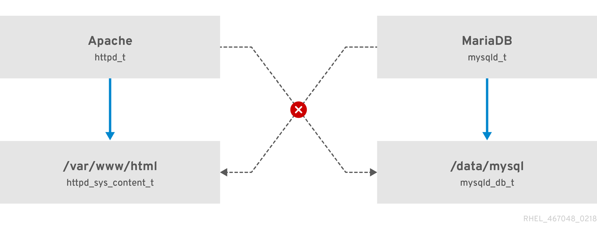

[Phần 2 - Tổng quan về kiến trúc Linux](https://github.com/volehuy1998/network-onboard/blob/master/README.md)

- [2.1 - Linux Kernel ( :arrow_up: UPDATED 21/01/2024)](https://github.com/volehuy1998/network-onboard/blob/master/linux-onboard/2.1%20-%20linux-arch-onboard.md#linux_kernel)
  - 2.1.1 - Vai trò của Linux Kernel ( :arrow_up: UPDATED 21/01/2024)
  - 2.1.2 - Tổng quan về Interrupt - Ngắt (UPDATED 05/09/2023)
- [2.2 - Quản lý người dùng và nhóm (UPDATED 17/09/2023)](https://github.com/volehuy1998/network-onboard/blob/master/linux-onboard/2.2%20-%20linux-user-management.md#user_and_group)
  - 2.2.1 - Khái niệm `User` (UPDATED 17/09/2023)
  - 2.2.2 - Khái niệm về nhóm, chính và phụ (UPDATED 12/09/2023)
  - 2.2.3 - Thay đổi tài khoản người dùng (UPDATED 13/09/2023)
  - 2.2.4 - Các thao tác quản lý trên người dùng và nhóm(UPDATED 11/09/2023)
  - 2.2.5 - Hạn chế quyền truy cập người dùng (UPDATED 13/09/2023)
  - 2.2.6 - Cấp quyền `sudo` tự do (UPDATED 11/09/2023)
  - 2.2.7 - Cấp quyền `sudo` với lệnh cụ thể (UPDATED 11/09/2023)
- [2.3 - Hệ thống tệp tin ( :arrow_up: UPDATED 07/01/2024)](https://github.com/volehuy1998/network-onboard/blob/master/linux-onboard/2.3%20-%20linux-file-system-overview.md#fs)
  - 2.3.1 - Phân cấp hệ thống tệp tin (UPDATED 26/08/2023)
  - 2.3.2 - RPM Package và phân loại (UPDATED 24/08/2023)
  - 2.3.3 - Kernel RPM Package (UPDATED 24/08/2023)
  - 2.3.4 - Tổng quan về quyền trên tệp tin ( :arrow_up: UPDATED 07/01/2024)
    - 2.3.4.1 - Quản lý quyền tệp tin (UPDATED 13/09/2023)
    - 2.3.4.2 - Quyền đặc biệt dành cho chủ sở hữu (SUID) và lỗ hổng leo thang đặc quyền (UPDATED 10/09/2023)
    - 2.3.4.3 - Quyền đặc biệt dành cho nhóm (UPDATED 10/09/2023)
    - 2.3.4.4 - Quyền đặc biệt Sticky bit (UPDATED 04/09/2023)
  - 2.3.5 - Xác định hệ thống tệp tin và thiết bị (UPDATED 07/11/2023)
- [2.4 - Tổng quan tiến trình Linux (UPDATED 04/10/2023)](https://github.com/volehuy1998/network-onboard/blob/master/linux-onboard/2.4%20-%20linux-process-overview.md#linux_process)
  - 2.4.1 - Trạng thái của tiến trình Linux (UPDATED 17/09/2023)
  - 2.4.2 - Kiểm soát các `Job` (UPDATED 04/10/2023)
  - 2.4.3 - Kết thúc tiến trình (UPDATED 18/09/2023)
  - 2.4.4 - Dịch vụ hạ tầng (UPDATED 21/09/2023)
  - 2.4.5 - Tổng quan về `systemd` (UPDATED 30/09/2023)
  - 2.4.6 - Kiểm soát dịch vụ hệ thống (UPDATED 04/10/2023)
  - 2.4.7 - Mẫu `unit` với ký hiệu `@` (UPDATED 04/10/2023)
  - 2.4.8 - Chi tiết tệp `unit` (UPDATED 04/10/2023)
    - 2.4.8.1 - Loại `unit` phổ biến `*.service` (UPDATED 03/10/2023)
    - 2.4.8.2 - Loại `unit` về `*.socket` (UPDATED 30/09/2023)
    - 2.4.8.3 - Loại `unit` về `*.path` (UPDATED 30/09/2023)
- [2.5 - Điều khiển an toàn từ xa (UPDATED 31/12/2023)](https://github.com/volehuy1998/network-onboard/blob/master/linux-onboard/2.5%20-%20linux-secure-remote-overview.md#remote_connection)
  - 2.5.1 - Tổng quan về kiến trúc giao thức `SSH` (UPDATED 31/12/2023)
    - 2.5.1.1 - Kiến trúc giao thức `SSH` (UPDATED 22/10/2023)
    - 2.5.1.2 - Những xem xét bảo mật về khía cạnh truyền dẫn (UPDATED 19/10/2023)
    - 2.5.1.3 - Những xem xét bảo mật về khía cạnh xác thực (UPDATED 19/10/2023)
    - 2.5.1.4 - Giao thức `SSH-1`, `SSH-2` và sự cải tiến (UPDATED 22/10/2023)
  - 2.5.2 - Cài đặt `OpenSSH`, kết nối và cấu hình (UPDATED 23/10/2023)
    - 2.5.2.1 - Sử dụng công cụ cơ bản (UPDATED 19/10/2023)
    - 2.5.2.2 - Thông tin về `finger print` tại máy khách và máy chủ (UPDATED 19/10/2023)
    - 2.5.2.3 - Hành vi xử lý chuẩn kết nối đến máy chủ (UPDATED 19/10/2023)
    - 2.5.2.4 - Cấu hình `ssh client` (UPDATED 21/10/2023)
    - 2.5.2.5 - Sử dụng `X11 Forwarding` và `Port Forwarding` (UPDATED 23/10/2023)
- [2.6 - Tổng quan về quản lý mạng (UPDATED 05/11/2023)](https://github.com/volehuy1998/network-onboard/blob/master/linux-onboard/2.6%20-%20linux-network-overview.md#network_manage)
  - 2.6.1 - Mô hình `TCP/IP` (UPDATED 25/10/2023)
  - 2.6.2 - Mô tả về `Network Interface` (UPDATED 01/11/2023)
  - 2.6.3 - Địa chỉ `v4` (UPDATED 25/10/2023)
  - 2.6.4 - Địa chỉ `v6` (UPDATED 25/10/2023)
  - 2.6.5 - Thông tin về `network interface`(UPDATED 25/10/2023)
  - 2.6.6 - Công cụ quản lý `nmcli`(UPDATED 05/11/2023)
  - 2.6.7 - Cấu hình và quản lý `hostname`(UPDATED 05/11/2023)
- [2.7 - Kiến trúc nhật ký hệ thống (UPDATED 17/12/2023)](https://github.com/volehuy1998/network-onboard/blob/master/linux-onboard/2.7%20-%20linux-system-log-architecture-overview.md#sys_log_arch)
  - 2.7.1 - Tổng quan (UPDATED 03/12/2023)
  - 2.7.2 - Cách sử dụng `rsyslog` (UPDATED 06/12/2023)
  - 2.7.3 - Cách sử dụng `systemd-journald` (UPDATED 10/12/2023)
  - 2.7.4 - Đồng bộ thời gian (UPDATED 17/12/2023)
    - 2.7.4.1 - Tổng quan `Network Time Protocol` (UPDATED 17/12/2023)
    - 2.7.4.2 - Công cụ `datetimectl` (UPDATED 10/12/2023)
    - 2.7.4.3 - Cấu hình `NTP` sử dụng `chrony` (UPDATED 17/12/2023)
    - 2.7.4.4 - Cấu hình `NTP` sử dụng `ntpd` (UPDATED 10/12/2023)
- [2.8 - Lập lịch chạy cho tác vụ tương lai (UPDATED 01/01/2024)](https://github.com/volehuy1998/network-onboard/blob/master/linux-onboard/2.8%20-%20linux-job-scheduler.md#schedule_job)
  - 2.8.1 - Tổng quan (UPDATED 24/12/2023)
  - 2.8.2 - Cách sử dụng công cụ `at` (UPDATED 24/12/2023)
  - 2.8.3 - Cách sử dụng công cụ `cron` (UPDATED 24/12/2023)
  - 2.8.4 - Ứng dụng `systemd timer` (UPDATED 01/01/2024)
    - 2.8.4.1 - Cách sử dụng công cụ `systemd timer` (UPDATED 01/01/2024)
    - 2.8.4.2 - Quản lý loại tệp tạm thời (UPDATED 01/01/2024)
      - 2.8.4.2.1 - Cách sử dụng `systemd-tmpfiles --create` (UPDATED 01/01/2024)
      - 2.8.4.2.2 - Cách sử dụng `systemd-tmpfiles --clean` (UPDATED 01/01/2024)
      - 2.8.4.2.3 - Cách sử dụng `systemd-tmpfiles --remove` (UPDATED 01/01/2024)
- [2.9 - Quản lý tệp đóng gói và nén với công cụ `tar` ( :arrow_up: UPDATED 15/01/2024)](https://github.com/volehuy1998/network-onboard/blob/master/linux-onboard/2.9%20-%20linux-manage-compressed-tar-archives.md#manage_compress_tar_archive)
    - 2.9.1 - Tạo và quản lý tệp đóng gói ( :arrow_up: UPDATED 13/01/2024)
    - 2.9.2 - Tạo và quản lý tệp nén đóng gói ( :arrow_up: UPDATED 15/01/2024)
    - 2.9.3 - Quản lý tệp sao lưu gia tăng `incremental backup` ( :arrow_up: UPDATED 15/01/2024)
    - 2.9.4 - Chuyển tệp giữa các hệ thống một cách an toàn ( :arrow_up: UPDATED 15/01/2024)
    - 2.9.5 - Đồng bộ giữa các hệ thống một cách an toàn ( :arrow_up: UPDATED 15/01/2024)
- [2.10 - Quản lý `SELinux` ( :heavy_plus_sign: UPDATED 25/01/2024)](#selinux_manage)
    - [2.10.1 - Kiến trúc `SELinux` ( :heavy_plus_sign: UPDATED 25/01/2024)](#selinux_arch)
    - [2.10.2 - Sử dụng `SELinux` cơ bản ( :heavy_plus_sign: UPDATED 25/01/2024)](#basic_selinux)
      - [2.10.2.1 - Xem nhãn, kích hoạt và vô hiệu hóa `SELinux` ( :heavy_plus_sign: UPDATED 25/01/2024)](#selinux_activation)
      - [2.10.2.2 - Kiểm soát `fcontext` với nhãn sẵn có ( :heavy_plus_sign: UPDATED 25/01/2024)](#basic_file_context)
      - [2.10.2.3 - Kiểm soát `boolean` ( :heavy_plus_sign: UPDATED 25/01/2024)](#basic_boolean)

## <a name="selinux_manage">Quản lý `SELinux`</a>
### <a name="selinux_arch">Kiến trúc `SELinux`</a>

`Security Enhanced Linux (SELinux)` là kiến trúc bảo mật cho hệ thống Linux, ban đầu được phát triển để vá nhân hệ điều hành bởi [United States National Security Agency (NSA)](https://www.nsa.gov/) - Cơ quan An ninh Quốc gia Hoa Kỳ. Năm 2000, `SELinux` được phát hành cho cộng đồng mã nguồn mở và đến năm 2003 được tích tợp hoàn toàn vào nhân Linux.

Chính sách tiêu chuẩn thông thường gọi là `Discretionary Access Control (DAC)` mô tả sự cho phép truy cập dựa trên người dùng, nhóm, hành động truy cập. `DAC` không cung cấp cho quản trị viên tạo các chính sách bảo mật toàn diện và chi tiết mà ngược lại mô tả một không gian quyền hạn tương đối rộng lớn, mơ hồ và đây chính là điểm yếu, `DAC` vô tình trợ giúp cho những người dùng được ủy quyền sử dụng với mục đích khác. `SELinux` là một tính năng quan trọng bù đắp khuyết điểm của `DAC` và chính sách tiêu chuẩn khác. Việc truy cập vào tệp, cổng hay tài nguyên khác sẽ được `SELinux` kiểm soát ở mức độ chi tiết. 

Một số ví vụ về quyền truy cập:

- Ví dụ về quyền cho phép viết, vấn đề xảy ra khi dữ liệu được tổ chức theo cấu trúc đặc biệt, thay vì chỉ chỉnh sửa phần dữ liệu mong muốn một cách an toàn dựa trên phần mềm được chỉ định thì người dùng hoàn toàn có khả năng thay đổi cấu trúc dữ liệu bằng mọi trình soạn thảo mà họ muốn, việc này dẫn đến hư hỏng dữ liệu hoặc các vấn đề liên quan đến bảo mật. Quyền trên tệp không ngăn chặn được hành vi như vậy.
- Ví dụ khác về quyền đọc dữ liệu từ tệp nhật ký, `SELinux` có thể chỉ định chương trình `less`, `cat` có thể đọc tệp dữ liệu thay vì `vi` hoặc `nano`, ... vì những chương trình soạn thảo có thể thay đổi dữ liệu dẫn đến sai lệch lịch sử trong việc phân tích.
- Ví dụ về quyền thực thi, cụ thể hơn là truy cập thư mục. Người tấn công có thể làm dụng `../` trong máy chủ web để truy cập dữ liệu khác trong hệ thống. Mặc dù `SELinux` không thể ngăn chặn hoàn toàn nhưng cũng góp phần giảm thiếu tối đa rủi ro.

`SELinux` thực hiện một bộ quy tắc truy cập rõ ràng về hành động giữa tiến trình và tài nguyên hệ thống. Những hành động chưa được định nghĩa trong quy tắc truy cập sẽ không được cho phép vì thế những ứng dụng chưa được thiết kế bảo mật vẫn sẽ được bảo vệ. Có thể thiết lập chính sách một cách đơn lẻ để dễ dàng trọng việc phát triển ứng dụng, các ứng dụng hoặc dịch vụ nằm trong chính sách sẽ được chạy trong khu vực an toàn và ngược lại có thể chạy không giới hạn mà không có sự bảo vệ của `SELinux`. Tuy vậy nhưng `SELinux` không phải là phần mềm chống virus hay giải pháp bảo mật tích hợp gồm tường lửa, mật khẩu, ... `SELinux` chỉ giúp nâng cao những giải pháp đã tồn tại, không phải thay thế.

`SELinux` có 3 chế độ:

- `Enforcing`: thực thi các chính sách định nghĩa. Chế độ mặc định.
- `Permissive`: hữu ích cho việc kiểm tra, giống như `enforcing` nhưng thay vì chặn thì nó sẽ ghi nhớ lại những vi phạm.
- `Disabled`: vô hiệu hóa `SELinux`, không khuyến khích sử dụng chế độ này.

<i><u>Lưu ý: đối với `RHEL9` thì mặc định `enforcing` bị vô hiệu hóa hoàn toàn và có sự thay đổi nhỏ, quản trị viên có thể thấy `selinux=0` thay vì `selinux=DISABLED` trong tệp cấu hình `/etc/selinux/config`. Việc vô hiệu hóa trong tệp cấu hình vẫn sẽ làm cho `SELinux` hoạt động nhưng không thực hiện chính sách bảo mật nào, đồng nghĩa với việc tất cả hành động sẽ bị từ chối.</u></i>

### <a name="basic_selinux">Sử dụng `SELinux` cơ bản</a>

#### <a name="selinux_activation">Xem nhãn, kích hoạt và vô hiệu hóa `SELinux`</a>

Chính sách `SELinux` là những quy tắc bảo mật định nghĩa thủ tục cụ thể về việc truy cập vào tài nguyên. Mỗi thực thể tài nguyên như tệp tin, tiến trình, thư mục và cổng đều được đánh nhãn hay còn gọi là cài đặt bối cảnh `SELinux`. Khi nhãn khớp với quy định nào đó có trong chính sách `SELinux` thì cho phép truy cập vào tài nguyên được đánh nhãn. Mặc định, `SELinux` sẽ không cho phép truy cập tài nguyên nếu không định nghĩa rõ ràng. Nếu không cú quy tắc nào được định nghĩa thì mọi truy cập sẽ bị từ chối.

<div style="text-align:center"></div>

Nhãn `SELinux` bao gồm 4: `user`, `role`, `type` và `security level`. Chính sách `targeted` được cài đặt mặc định ở `RHEL`. Quy tắc với tên `type` luôn kết thúc bằng `_t`.

<div style="text-align:center"></div>

Ví dụ, một tiến trình máy chủ Apache có nhãn là `httpd_t`. Tài nguyên mà tiến trình muốn truy cập là tệp tin và thư mục bên trong `/var/www/html` sẽ nhãn là `httpd_sys_content_t`. Chính sách sẽ cho phép Apache truy cập vào tệp và thư mục có nhãn là `httpd_sys_content_t`. Mặc dù các tệp tạm thời trong `/tmp` và `/var/tmp` (nhãn `tmp_t`) đều cho phép tất cả người dùng có thể truy cập nhưng khi kích hoạt `SELinux` thì Apache sẽ không thể truy cập.

<div style="text-align:center"></div>

Rất nhiều lệnh có thể hiển thị tài nguyên với nhãn `SELinux` thông qua tùy chọn `-Z`, ví dụ như `ps`, `ls`, `cp`, `mkdir`, ...

```shell
[root@huyvl-linux-training ~]# id
uid=0(root) gid=0(root) groups=0(root) context=unconfined_u:unconfined_r:unconfined_t:s0-s0:c0.c1023
[root@huyvl-linux-training ~]# id -Z
unconfined_u:unconfined_r:unconfined_t:s0-s0:c0.c1023
[root@huyvl-linux-training ~]# ls -lZ /etc/shadow
----------. root root system_u:object_r:shadow_t:s0    /etc/shadow
[root@huyvl-linux-training ~]# 
[root@huyvl-linux-training ~]# ps -Z 
LABEL                             PID TTY          TIME CMD
unconfined_u:unconfined_r:unconfined_t:s0-s0:c0.c1023 3849 pts/0 00:00:00 bash
unconfined_u:unconfined_r:unconfined_t:s0-s0:c0.c1023 4319 pts/0 00:00:00 ps
[root@huyvl-linux-training ~]# 
[root@huyvl-linux-training ~]# semanage port --list | grep ssh
ssh_port_t                     tcp      22
[root@huyvl-linux-training ~]# 
[root@huyvl-linux-training ~]# semanage port --list | grep http
http_cache_port_t              tcp      8080, 8118, 8123, 10001-10010
http_cache_port_t              udp      3130
http_port_t                    tcp      80, 81, 443, 488, 8008, 8009, 8443, 9000
pegasus_http_port_t            tcp      5988
pegasus_https_port_t           tcp      5989
[root@huyvl-linux-training ~]# 
```

Chế độ mặc định `SELinux` tại `/etc/selinux/config` được sử dụng mỗi khi hệ thống khởi động. Sử dụng lệnh `setenforce` và `getenforce` để thay đổi chế độ tạm thời. Tuy nhiên khuyến nghị khởi động lại hệ thống khi chuyển từ `Permissive` sang `Enforcing`.

```shell
[root@huyvl-linux-training ~]# cat /etc/selinux/config 

# This file controls the state of SELinux on the system.
# SELINUX= can take one of these three values:
#     enforcing - SELinux security policy is enforced.
#     permissive - SELinux prints warnings instead of enforcing.
#     disabled - No SELinux policy is loaded.
SELINUX=enforcing
# SELINUXTYPE= can take one of these two values:
#     targeted - Targeted processes are protected,
#     minimum - Modification of targeted policy. Only selected processes are protected. 
#     mls - Multi Level Security protection.
SELINUXTYPE=targeted


[root@huyvl-linux-training ~]# getenforce
Enforcing
[root@huyvl-linux-training ~]# setenforce 0
[root@huyvl-linux-training ~]# getenforce
Permissive
[root@huyvl-linux-training ~]# setenforce 1
[root@huyvl-linux-training ~]# getenforce
Enforcing
[root@huyvl-linux-training ~]# 
```

Để tái đánh nhãn cho tệp `data` sau khi bị thay đổi nhãn bởi lệnh `chcon` thì cần tạo tệp `/.autorelabel` rỗng. Cần đảm bảo chế độ mặc định `enforcing` đã được cài đặt trước khi khởi động lại hệ thống.

```shell
[root@huyvl-linux-training ~]# grep ^[^#] /etc/sysconfig/selinux 
SELINUX=enforcing
SELINUXTYPE=targeted
[root@huyvl-linux-training ~]# 
[root@huyvl-linux-training ~]# touch data
[root@huyvl-linux-training ~]# ls -Z
-rw-r--r--. root root unconfined_u:object_r:admin_home_t:s0 data
[root@huyvl-linux-training ~]# chcon --verbose -t httpd_sys_content_t data
changing security context of ‘data’
[root@huyvl-linux-training ~]# ls -Z
-rw-r--r--. root root unconfined_u:object_r:httpd_sys_content_t:s0 data
[root@huyvl-linux-training ~]# reboot
Connection to train closed by remote host.
Connection to train closed.
root@sgn-la-huyvl3:~# ssh train
Last login: Tue Jan 23 12:22:48 2024 from 171.250.162.131
[root@huyvl-linux-training ~]# ls -Z
-rw-r--r--. root root unconfined_u:object_r:httpd_sys_content_t:s0 data
[root@huyvl-linux-training ~]# 
[root@huyvl-linux-training ~]# touch /.autorelabel
[root@huyvl-linux-training ~]# reboot
Connection to train closed by remote host.
Connection to train closed.
root@sgn-la-huyvl3:~# ssh train
Last login: Tue Jan 23 12:24:55 2024 from 171.250.162.131
[root@huyvl-linux-training ~]# ls -Z
-rw-r--r--. root root unconfined_u:object_r:admin_home_t:s0 data
[root@huyvl-linux-training ~]# 
```

Khi dùng lệnh `mv` thì thuộc tính `SELinux` vẫn được giữ nguyên nhưng nếu dùng lệnh `cp` thì thuộc tính sẽ bị thay đổi tùy theo chính sách định nghĩa nhãn tại nơi cục bộ đó.

```shell
[root@huyvl-linux-training ~]# touch boot.log
[root@huyvl-linux-training ~]# ls -Z boot.log 
-rw-r--r--. root root unconfined_u:object_r:admin_home_t:s0 boot.log
[root@huyvl-linux-training ~]# cp boot.log /home/hnoperator/
[root@huyvl-linux-training ~]# ls -Z /home/hnoperator/boot.log 
-rw-r--r--. root root unconfined_u:object_r:user_home_t:s0 /home/hnoperator/boot.log
[root@huyvl-linux-training ~]# mv boot.log /home/hnoperator/
mv: overwrite ‘/home/hnoperator/boot.log’? y
[root@huyvl-linux-training ~]# ls -Z /home/hnoperator/boot.log 
-rw-r--r--. root root unconfined_u:object_r:admin_home_t:s0 /home/hnoperator/boot.log
[root@huyvl-linux-training ~]#
```

#### <a name="basic_file_context">Kiểm soát `fcontext` với nhãn sẵn có</a>

Một số tùy chọn sẽ được sử dụng là:

- `-l` hoặc `--list`: liệt kê tất cả định nghĩa nhãn của hệ thống và người dùng.
- `-a` hoặc `-add`: thêm định nghĩa nhãn.
- `-d` hoặc `--delete`: xóa định nghĩa nhãn, sẽ có thông báo nếu nhãn không tồn tại.
- `-D` hoặc `--deleteall`: xóa tất cả định nghĩa nhãn của riêng người dùng.
- `-C` hoặc `--locallist`: tùy chọn dùng kèm với `--list`, liệt kê các định nghĩa nhãn của người dùng.
- `-f` hoặc `--ftype`: kết hợp với các chữ cái `d` để mô tả đối tượng đánh nhãn là thư mục hoặc `a` là tất cả, ngoài ra còn có các `symbolic link`, ...
- `-v` hoặc `--verbose`: hiển thị chi tiết, hữu ích cho phân tích quá trình.

Sử dụng công cụ `semanage fcontext` để xem nhãn liên quan đến đối tượng tệp tin. Tất cả tệp tin được tạo trong `/root` đều được gắn nhãn vì chính sách `/root(/.*)?` được thiết lập mặc định.

```shell
[root@huyvl-linux-training ~]# semanage fcontext --list | grep ^"/root(/.*)?"
/root(/.*)?                                        all files          system_u:object_r:admin_home_t:s0 
[root@huyvl-linux-training ~]# touch data.sql
[root@huyvl-linux-training ~]# ls -lZ data.sql 
-rw-r--r--. root root unconfined_u:object_r:admin_home_t:s0 data.sql
[root@huyvl-linux-training ~]# 
[root@huyvl-linux-training ~]# ls -dZ /etc/
drwxr-xr-x. root root system_u:object_r:etc_t:s0       /etc/
[root@huyvl-linux-training ~]# 
[root@huyvl-linux-training ~]# mkdir -v log
mkdir: created directory ‘log’
[root@huyvl-linux-training ~]# touch log/boot.log
[root@huyvl-linux-training ~]# ls -Z log
-rw-r--r--. root root unconfined_u:object_r:admin_home_t:s0 boot.log
[root@huyvl-linux-training ~]# ls -lRZ log
```

Sử dụng tùy chọn `--add` để định nghĩa nhãn với loại `httpd_sys_content_t`. Cả hai chương trình `restorecon` và `chcon` cho phép thay đổi nhãn nhưng `restorecon` sẽ không thay đổi nếu nhãn mong muốn đã có sẵn trong khi `chcon` sẽ đánh nhãn tất cả, ngoài ra `restore` thường được sử dụng sau khi định nghĩa nhãn còn `chcon` để thay đổi nhãn cụ thể. Ví dụ sau mô tả các tệp trong thư mục `data` được tạo trước khi định nghĩa nhãn nên sử dụng `restorecon` để thay đổi sang nhãn đã định nghĩa. 

```shell
[root@huyvl-linux-training ~]# 
[root@huyvl-linux-training ~]# mkdir -v data
mkdir: created directory ‘data’
[root@huyvl-linux-training ~]# touch data/a data/b data/c
[root@huyvl-linux-training ~]# semanage fcontext -a -t httpd_sys_content_t "/root/data(/.*)?"
[root@huyvl-linux-training ~]# semanage fcontext --list | grep "/root/data(/.*)?"
/root/data(/.*)?                                   all files          system_u:object_r:httpd_sys_content_t:s0 
[root@huyvl-linux-training ~]# ls -lZ data/
-rw-r--r--. root root unconfined_u:object_r:admin_home_t:s0 a
-rw-r--r--. root root unconfined_u:object_r:admin_home_t:s0 b
-rw-r--r--. root root unconfined_u:object_r:admin_home_t:s0 c
[root@huyvl-linux-training ~]# restorecon -v data/a
restorecon reset /root/data/a context unconfined_u:object_r:admin_home_t:s0->unconfined_u:object_r:httpd_sys_content_t:s0
[root@huyvl-linux-training ~]# ls -lZ data/
-rw-r--r--. root root unconfined_u:object_r:httpd_sys_content_t:s0 a
-rw-r--r--. root root unconfined_u:object_r:admin_home_t:s0 b
-rw-r--r--. root root unconfined_u:object_r:admin_home_t:s0 c
[root@huyvl-linux-training ~]# restorecon -vR data
restorecon reset /root/data/b context unconfined_u:object_r:admin_home_t:s0->unconfined_u:object_r:httpd_sys_content_t:s0
restorecon reset /root/data/c context unconfined_u:object_r:admin_home_t:s0->unconfined_u:object_r:httpd_sys_content_t:s0
[root@huyvl-linux-training ~]# ls -lZ data/
-rw-r--r--. root root unconfined_u:object_r:httpd_sys_content_t:s0 a
-rw-r--r--. root root unconfined_u:object_r:httpd_sys_content_t:s0 b
-rw-r--r--. root root unconfined_u:object_r:httpd_sys_content_t:s0 c
[root@huyvl-linux-training ~]# 
```

Để áp dụng nhãn chỉ cho đối tượng thư mục cần thêm tùy chọn `-f` hoặc `--ftype`, mặc định nếu không khai báo sẽ hiểu là `-f a` tương đương với tất cả mọi thứ:

```shell
[root@huyvl-linux-training ~]# ls -lZ parent
drwxr-xr-x. root root unconfined_u:object_r:admin_home_t:s0 child
-rw-r--r--. root root unconfined_u:object_r:admin_home_t:s0 upgrade.sql
[root@huyvl-linux-training ~]# semanage fcontext --ftype d -a -t httpd_sys_content_t '/root/parent(/.*)'
[root@huyvl-linux-training ~]# semanage fcontext --list | grep '/root/parent(/.*)'
/root/parent(/.*)                                  directory          system_u:object_r:httpd_sys_content_t:s0 
[root@huyvl-linux-training ~]# 
[root@huyvl-linux-training ~]# restorecon -vR parent/
restorecon reset /root/parent/child context unconfined_u:object_r:admin_home_t:s0->unconfined_u:object_r:httpd_sys_content_t:s0
[root@huyvl-linux-training ~]# ls -lZ parent
drwxr-xr-x. root root unconfined_u:object_r:httpd_sys_content_t:s0 child
-rw-r--r--. root root unconfined_u:object_r:admin_home_t:s0 upgrade.sql
[root@huyvl-linux-training ~]# 
```

Sử dụng tùy chọn `-C` hoặc `--locallist` để liệt kê các định nghĩa nhãn của người dùng và `-D` hoặc `--deleteall` để xóa tất cả các định nghĩa đó:

```shell
[root@huyvl-linux-training ~]# semanage fcontext --list -C 
SELinux fcontext                                   type               Context

/root/parent(/.*)                                  directory          system_u:object_r:httpd_sys_content_t:s0 
[root@huyvl-linux-training ~]# 
[root@huyvl-linux-training ~]# ls -lZ parent/
drwxr-xr-x. root root unconfined_u:object_r:httpd_sys_content_t:s0 child
-rw-r--r--. root root unconfined_u:object_r:admin_home_t:s0 upgrade.sql
[root@huyvl-linux-training ~]# semanage fcontext --deleteall
[root@huyvl-linux-training ~]# semanage fcontext --list -C 
[root@huyvl-linux-training ~]# 
[root@huyvl-linux-training ~]# restorecon -vR parent/
restorecon reset /root/parent/child context unconfined_u:object_r:httpd_sys_content_t:s0->unconfined_u:object_r:admin_home_t:s0
[root@huyvl-linux-training ~]# ls -lZ parent/
drwxr-xr-x. root root unconfined_u:object_r:admin_home_t:s0 child
-rw-r--r--. root root unconfined_u:object_r:admin_home_t:s0 upgrade.sql
[root@huyvl-linux-training ~]# 
```

Ví dụ thực hiện đánh nhãn cho thư mục web `/web/projecta/` mới tạo, kiểm tra kết quả trước khi đánh nhãn `httpd_sys_content_t` sẽ thấy bị từ chối quyền truy cập của tiến trình `httpd`.

```shell
[root@huyvl-linux-training ~]# getenforce 
Enforcing
[root@huyvl-linux-training ~]# mkdir -pv /web/projecta 
mkdir: created directory ‘/web’
mkdir: created directory ‘/web/projecta’
[root@huyvl-linux-training ~]# echo "welcome project A" > /web/projecta/index.html
[root@huyvl-linux-training ~]# vi /etc/httpd/conf.d/projecta.conf
[root@huyvl-linux-training ~]# cat /etc/httpd/conf.d/projecta.conf
<Directory /web/projecta>
	AllowOverride None
	Require all granted
</Directory>

Alias /projecta /web/projecta
[root@huyvl-linux-training ~]# systemctl restart httpd
[root@huyvl-linux-training ~]# curl localhost
hello
[root@huyvl-linux-training ~]# curl localhost/projecta/
<!DOCTYPE HTML PUBLIC "-//IETF//DTD HTML 2.0//EN">
<html><head>
<title>403 Forbidden</title>
</head><body>
<h1>Forbidden</h1>
<p>You dont have permission to access /projecta/
on this server.</p>
</body></html>
[root@huyvl-linux-training ~]# semanage fcontext -a -t httpd_sys_content_t "/web(/.*)?"
[root@huyvl-linux-training ~]# semanage fcontext --list | grep httpd | grep ^"/web"
/web(/.*)?                                         all files          system_u:object_r:httpd_sys_content_t:s0 
[root@huyvl-linux-training ~]# ls -lZ /web/
drwxr-xr-x. root root unconfined_u:object_r:default_t:s0 projecta
[root@huyvl-linux-training ~]# chcon --verbose --recursive -t httpd_sys_content_t /web/
changing security context of ‘/web/projecta/index.html’
changing security context of ‘/web/projecta’
changing security context of ‘/web/’
[root@huyvl-linux-training ~]#
[root@huyvl-linux-training ~]# ls -RlZ /web/
/web/:
drwxr-xr-x. root root unconfined_u:object_r:httpd_sys_content_t:s0 projecta

/web/projecta:
-rw-r--r--. root root unconfined_u:object_r:httpd_sys_content_t:s0 index.html
[root@huyvl-linux-training ~]# curl localhost/projecta/
welcome project A
[root@huyvl-linux-training ~]# 
```

#### <a name="basic_boolean">Kiểm soát `boolean`</a>

Xem xét `boolean` như một công tắc, việc sử dụng công tắc là cách tốt nhất để kích hoạt hoặc vô hiệu hóa chính sách ngay lập tức mà không cần khởi động lại máy hoặc thay đổi định nghĩa.

Liệt kê các công tắc sẵn có. Từ khóa `off` đầu tiên mô tả trạng thái hiện tại, `off` phía sau mô tả mặc định mỗi khi khởi động hệ thống.

```shell
[root@huyvl-linux-training ~]# semanage boolean --list | grep httpd
httpd_can_network_relay        (off  ,  off)  Allow httpd to can network relay
httpd_can_connect_mythtv       (off  ,  off)  Allow httpd to can connect mythtv
httpd_can_network_connect_db   (off  ,  off)  Allow httpd to can network connect db
httpd_use_gpg                  (off  ,  off)  Allow httpd to use gpg
httpd_dbus_sssd                (off  ,  off)  Allow httpd to dbus sssd
httpd_enable_cgi               (on   ,   on)  Allow httpd to enable cgi
httpd_verify_dns               (off  ,  off)  Allow httpd to verify dns
httpd_dontaudit_search_dirs    (off  ,  off)  Allow httpd to dontaudit search dirs
httpd_anon_write               (off  ,  off)  Allow httpd to anon write
httpd_use_cifs                 (off  ,  off)  Allow httpd to use cifs
httpd_enable_homedirs          (off  ,  off)  Allow httpd to enable homedirs
httpd_unified                  (off  ,  off)  Allow httpd to unified
httpd_mod_auth_pam             (off  ,  off)  Allow httpd to mod auth pam
httpd_run_stickshift           (off  ,  off)  Allow httpd to run stickshift
httpd_use_fusefs               (off  ,  off)  Allow httpd to use fusefs
httpd_can_connect_ldap         (off  ,  off)  Allow httpd to can connect ldap
httpd_can_network_connect      (off  ,  off)  Allow httpd to can network connect
httpd_mod_auth_ntlm_winbind    (off  ,  off)  Allow httpd to mod auth ntlm winbind
httpd_use_sasl                 (off  ,  off)  Allow httpd to use sasl
httpd_tty_comm                 (off  ,  off)  Allow httpd to tty comm
httpd_sys_script_anon_write    (off  ,  off)  Allow httpd to sys script anon write
httpd_graceful_shutdown        (on   ,   on)  Allow httpd to graceful shutdown
httpd_can_connect_ftp          (off  ,  off)  Allow httpd to can connect ftp
httpd_read_user_content        (off  ,  off)  Allow httpd to read user content
httpd_use_nfs                  (off  ,  off)  Allow httpd to use nfs
httpd_can_connect_zabbix       (off  ,  off)  Allow httpd to can connect zabbix
httpd_tmp_exec                 (off  ,  off)  Allow httpd to tmp exec
httpd_manage_ipa               (off  ,  off)  Allow httpd to manage ipa
httpd_can_sendmail             (off  ,  off)  Allow httpd to can sendmail
httpd_builtin_scripting        (on   ,   on)  Allow httpd to builtin scripting
httpd_dbus_avahi               (off  ,  off)  Allow httpd to dbus avahi
httpd_can_check_spam           (off  ,  off)  Allow httpd to can check spam
httpd_can_network_memcache     (off  ,  off)  Allow httpd to can network memcache
httpd_can_network_connect_cobbler (off  ,  off)  Allow httpd to can network connect cobbler
httpd_serve_cobbler_files      (off  ,  off)  Allow httpd to serve cobbler files
httpd_execmem                  (off  ,  off)  Allow httpd to execmem
httpd_ssi_exec                 (off  ,  off)  Allow httpd to ssi exec
httpd_use_openstack            (off  ,  off)  Allow httpd to use openstack
httpd_enable_ftp_server        (off  ,  off)  Allow httpd to enable ftp server
httpd_setrlimit                (off  ,  off)  Allow httpd to setrlimit
[root@huyvl-linux-training ~]# 
```

Sử dụng lệnh `setsebool` để thay đổi vô hiệu hóa hoặc kích hoạt trạng thái hiện tại, có thể kết hợp với tùy chọn `-P` để lưu vào ổ cứng làm mặc định của chính sách cho lần khởi động sau.

```shell
[root@huyvl-linux-training ~]# semanage boolean --list | grep httpd_enable_homedirs
httpd_enable_homedirs          (on   ,   on)  Allow httpd to enable homedirs
[root@huyvl-linux-training ~]# setsebool -P httpd_enable_homedirs off
[root@huyvl-linux-training ~]# semanage boolean --list | grep httpd_enable_homedirs
httpd_enable_homedirs          (off  ,  off)  Allow httpd to enable homedirs
[root@huyvl-linux-training ~]# 
[root@huyvl-linux-training ~]# getsebool httpd_enable_homedirs
httpd_enable_homedirs --> off
[root@huyvl-linux-training ~]# setsebool httpd_enable_homedirs on
[root@huyvl-linux-training ~]# 
[root@huyvl-linux-training ~]# getsebool httpd_enable_homedirs
httpd_enable_homedirs --> on
[root@huyvl-linux-training ~]# semanage boolean --list | grep httpd_enable_homedirs
httpd_enable_homedirs          (on   ,  off)  Allow httpd to enable homedirs
[root@huyvl-linux-training ~]# 
```

Mặc định `SELinux` sẽ ngăn chặn việc `httpd` truy cập vào thư mục `UserDir` của người dùng.

```shell
[root@huyvl-linux-training ~]# useradd hcmoperator -m
[root@huyvl-linux-training ~]# su - hcmoperator
[hcmoperator@huyvl-linux-training ~]$ mkdir public_html -v
mkdir: created directory ‘public_html’
[hcmoperator@huyvl-linux-training ~]$ echo 'hcmoperator man page!' > public_html/index.html
[hcmoperator@huyvl-linux-training ~]$ ls -dZ public_html
drwxrwxr-x. hcmoperator hcmoperator unconfined_u:object_r:httpd_user_content_t:s0 public_html
[hcmoperator@huyvl-linux-training ~]$ ls -RZ public_html
public_html:
-rw-rw-r--. hcmoperator hcmoperator unconfined_u:object_r:httpd_user_content_t:s0 index.html
[hcmoperator@huyvl-linux-training ~]$ chmod 711 ~
[hcmoperator@huyvl-linux-training ~]$ ls -ld ~
drwx--x--x. 3 hcmoperator hcmoperator 102 Jan 25 01:19 /home/hcmoperator
[hcmoperator@huyvl-linux-training ~]$ 
[hcmoperator@huyvl-linux-training ~]$ exit
logout
[root@huyvl-linux-training ~]# 
[root@huyvl-linux-training ~]# ls -l /etc/httpd/conf.d/
total 16
-rw-r--r--. 1 root root 2926  1 Th10  2020 autoindex.conf
-rw-r--r--. 1 root root  366  1 Th10  2020 README
-rw-r--r--. 1 root root  313 12:29 24 Th01 userdir.conf
-rw-r--r--. 1 root root  824 30 Th09  2020 welcome.conf
[root@huyvl-linux-training ~]# vi /etc/httpd/conf.d/userdir.conf 
[root@huyvl-linux-training ~]# cat /etc/httpd/conf.d/userdir.conf 
<IfModule mod_userdir.c>
    UserDir public_html
</IfModule>

<Directory "/home/*/public_html">
    AllowOverride FileInfo AuthConfig Limit Indexes
    Options MultiViews Indexes SymLinksIfOwnerMatch IncludesNoExec
    Require method GET POST OPTIONS
</Directory>
[root@huyvl-linux-training ~]# 
[root@huyvl-linux-training ~]# systemctl restart httpd
[root@huyvl-linux-training ~]# curl localhost/~hcmoperator/
<!DOCTYPE HTML PUBLIC "-//IETF//DTD HTML 2.0//EN">
<html><head>
<title>403 Forbidden</title>
</head><body>
<h1>Forbidden</h1>
<p>You dont have permission to access /~hcmoperator/
on this server.</p>
</body></html>
[root@huyvl-linux-training ~]#
```

, kiểm tra nhật ký tổng hợp bao gồm `/var/log/messages` và công cụ `ausearch` nhận thấy `SELinux` đang chặn truy cập chức năng `UserDir` của `Apache`.

```shell
[root@huyvl-linux-training ~]# cat /var/log/messages | grep preventing | tail -n 2
Jan 25 01:20:20 huyvl-linux-training setroubleshoot[16041]: SELinux is preventing /usr/sbin/httpd from getattr access on the file /home/hcmoperator/public_html/index.html. For complete SELinux messages run: sealert -l 1b5c0171-64d0-427c-b0e4-464e481b423a
Jan 25 01:20:20 huyvl-linux-training setroubleshoot[16041]: SELinux is preventing /usr/sbin/httpd from getattr access on the file /home/hcmoperator/public_html/index.html.#012#012*****  Plugin catchall_boolean (32.5 confidence) suggests   ******************#012#012If you want to allow httpd to enable homedirs#012Then you must tell SELinux about this by enabling the 'httpd_enable_homedirs' boolean.#012#012Do#012setsebool -P httpd_enable_homedirs 1#012#012*****  Plugin catchall_boolean (32.5 confidence) suggests   ******************#012#012If you want to allow httpd to unified#012Then you must tell SELinux about this by enabling the 'httpd_unified' boolean.#012#012Do#012setsebool -P httpd_unified 1#012#012*****  Plugin public_content (32.5 confidence) suggests   ********************#012#012If you want to treat index.html as public content#012Then you need to change the label on index.html to public_content_t or public_content_rw_t.#012Do#012# semanage fcontext -a -t public_content_t '/home/hcmoperator/public_html/index.html'#012# restorecon -v '/home/hcmoperator/public_html/index.html'#012#012*****  Plugin catchall (4.5 confidence) suggests   ***************************#012#012If you believe that httpd should be allowed getattr access on the index.html file by default.#012Then you should report this as a bug.#012You can generate a local policy module to allow this access.#012Do#012allow this access for now by executing:#012# ausearch -c 'httpd' --raw | audit2allow -M my-httpd#012# semodule -X 300 -i my-httpd.pp#012
[root@huyvl-linux-training ~]# 
[root@huyvl-linux-training ~]# sealert -l 1b5c0171-64d0-427c-b0e4-464e481b423a
SELinux is preventing /usr/sbin/httpd from getattr access on the file /home/hcmoperator/public_html/index.html.

*****  Plugin catchall_boolean (32.5 confidence) suggests   ******************

If you want to allow httpd to enable homedirs
Then you must tell SELinux about this by enabling the 'httpd_enable_homedirs' boolean.

Do
setsebool -P httpd_enable_homedirs 1

*****  Plugin catchall_boolean (32.5 confidence) suggests   ******************

If you want to allow httpd to unified
Then you must tell SELinux about this by enabling the 'httpd_unified' boolean.

Do
setsebool -P httpd_unified 1

*****  Plugin public_content (32.5 confidence) suggests   ********************

If you want to treat index.html as public content
Then you need to change the label on index.html to public_content_t or public_content_rw_t.
Do
# semanage fcontext -a -t public_content_t '/home/hcmoperator/public_html/index.html'
# restorecon -v '/home/hcmoperator/public_html/index.html'

*****  Plugin catchall (4.5 confidence) suggests   ***************************

If you believe that httpd should be allowed getattr access on the index.html file by default.
Then you should report this as a bug.
You can generate a local policy module to allow this access.
Do
allow this access for now by executing:
# ausearch -c 'httpd' --raw | audit2allow -M my-httpd
# semodule -X 300 -i my-httpd.pp


Additional Information:
Source Context                system_u:system_r:httpd_t:s0
Target Context                unconfined_u:object_r:httpd_user_content_t:s0
Target Objects                /home/hcmoperator/public_html/index.html [ file ]
Source                        httpd
Source Path                   /usr/sbin/httpd
Port                          <Unknown>
Host                          huyvl-linux-training.novalocal
Source RPM Packages           httpd-core-2.4.57-5.el9.x86_64
Target RPM Packages           
SELinux Policy RPM            selinux-policy-targeted-38.1.23-1.el9.noarch
Local Policy RPM              selinux-policy-targeted-38.1.23-1.el9.noarch
Selinux Enabled               True
Policy Type                   targeted
Enforcing Mode                Enforcing
Host Name                     huyvl-linux-training.novalocal
Platform                      Linux huyvl-linux-training.novalocal
                              5.14.0-362.8.1.el9_3.x86_64 #1 SMP PREEMPT_DYNAMIC
                              Tue Oct 3 11:12:36 EDT 2023 x86_64 x86_64
Alert Count                   4
First Seen                    2024-01-25 01:20:16 EST
Last Seen                     2024-01-25 01:20:19 EST
Local ID                      1b5c0171-64d0-427c-b0e4-464e481b423a

Raw Audit Messages
type=AVC msg=audit(1706163619.297:379): avc:  denied  { getattr } for  pid=15822 comm="httpd" path="/home/hcmoperator/public_html/index.html" dev="vda4" ino=25963536 scontext=system_u:system_r:httpd_t:s0 tcontext=unconfined_u:object_r:httpd_user_content_t:s0 tclass=file permissive=0


type=SYSCALL msg=audit(1706163619.297:379): arch=x86_64 syscall=newfstatat success=no exit=EACCES a0=ffffff9c a1=7f0f1c043f60 a2=7f0f21de67c0 a3=100 items=0 ppid=15820 pid=15822 auid=4294967295 uid=48 gid=48 euid=48 suid=48 fsuid=48 egid=48 sgid=48 fsgid=48 tty=(none) ses=4294967295 comm=httpd exe=/usr/sbin/httpd subj=system_u:system_r:httpd_t:s0 key=(null)

Hash: httpd,httpd_t,httpd_user_content_t,file,getattr
[root@huyvl-linux-training ~]#
[root@huyvl-linux-training ~]#
[root@huyvl-linux-training ~]#
[root@huyvl-linux-training ~]# ausearch -m AVC -ts today | tail -n 4
time->Thu Jan 25 01:20:19 2024
type=PROCTITLE msg=audit(1706163619.297:379): proctitle=2F7573722F7362696E2F6874747064002D44464F524547524F554E44
type=SYSCALL msg=audit(1706163619.297:379): arch=c000003e syscall=262 success=no exit=-13 a0=ffffff9c a1=7f0f1c043f60 a2=7f0f21de67c0 a3=100 items=0 ppid=15820 pid=15822 auid=4294967295 uid=48 gid=48 euid=48 suid=48 fsuid=48 egid=48 sgid=48 fsgid=48 tty=(none) ses=4294967295 comm="httpd" exe="/usr/sbin/httpd" subj=system_u:system_r:httpd_t:s0 key=(null)
type=AVC msg=audit(1706163619.297:379): avc:  denied  { getattr } for  pid=15822 comm="httpd" path="/home/hcmoperator/public_html/index.html" dev="vda4" ino=25963536 scontext=system_u:system_r:httpd_t:s0 tcontext=unconfined_u:object_r:httpd_user_content_t:s0 tclass=file permissive=0
[root@huyvl-linux-training ~]#
```

, thông qua công cụ `sealert` thấy được `SELinux` gợi ý kích hoạt chính sách `httpd_enable_homedirs` để giải quyết vấn đề:

``` shell
[root@huyvl-linux-training ~]#
[root@huyvl-linux-training ~]# setsebool httpd_enable_homedirs on
[root@huyvl-linux-training ~]# curl localhost/~hcmoperator/
hcmoperator man page!
[root@huyvl-linux-training ~]# 
[root@huyvl-linux-training ~]# useradd hnoperator -m
[root@huyvl-linux-training ~]# cp -R /home/hcmoperator/public_html /home/hnoperator
[root@huyvl-linux-training ~]# chown -R hnoperator:hnoperator /home/hnoperator/public_html
[root@huyvl-linux-training ~]# su - hnoperator
[hnoperator@huyvl-linux-training ~]$ chmod 711 ~
[hnoperator@huyvl-linux-training ~]$ vi public_html/index.html 
[hnoperator@huyvl-linux-training ~]$ exit
logout
[root@huyvl-linux-training ~]# curl localhost/~hnoperator/
hnoperator man page!
[root@huyvl-linux-training ~]# 
```

<i>Lưu ý:

- Thư mục `public_html` khi tạo sẽ có sẵn nhãn `httpd_user_content_t` nên không cần đánh lại nhãn.
- Phiên bản `RHEL9` cho phép xem thông tin `SELinux` tại `/var/log/messages`, các bản thấp hơn chưa được hỗ trợ.
</i>