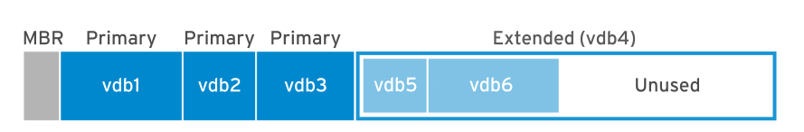
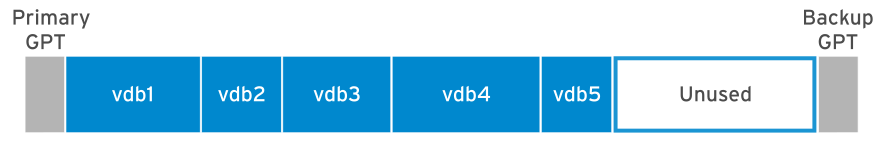

[Phần 2 - Tổng quan về kiến trúc Linux](https://github.com/volehuy1998/network-onboard/blob/master/README.md)

- [2.1 - Linux Kernel (UPDATED 21/01/2024)](https://github.com/volehuy1998/network-onboard/blob/master/linux-onboard/2.1%20-%20linux-arch-onboard.md#linux_kernel)
  - 2.1.1 - Vai trò của Linux Kernel (UPDATED 21/01/2024)
  - 2.1.2 - Tổng quan về Interrupt - Ngắt (UPDATED 05/09/2023)
- [2.2 - Quản lý người dùng và nhóm ( :arrow_up: UPDATED 15/04/2024)](https://github.com/volehuy1998/network-onboard/blob/master/linux-onboard/2.2%20-%20linux-user-management.md#user_and_group)
  - 2.2.1 - Khái niệm `User` (UPDATED 17/09/2023)
  - 2.2.2 - Khái niệm về nhóm, chính và phụ (UPDATED 12/09/2023)
  - 2.2.3 - Thay đổi tài khoản người dùng (UPDATED 13/09/2023)
  - 2.2.4 - Các thao tác quản lý trên người dùng và nhóm(UPDATED 11/09/2023)
  - 2.2.5 - Hạn chế quyền truy cập người dùng (UPDATED 13/09/2023)
  - 2.2.6 - Cấp quyền `sudo` cho nhóm `wheel` ( :arrow_up: UPDATED 15/04/2024)
  - 2.2.7 - Cấp quyền `sudo` cụ thể ( :arrow_up: UPDATED 15/04/2024)
- [2.3 - Hệ thống tệp tin (UPDATED 07/01/2024)](https://github.com/volehuy1998/network-onboard/blob/master/linux-onboard/2.3%20-%20linux-file-system-overview.md#fs)
  - 2.3.1 - Phân cấp hệ thống tệp tin (UPDATED 26/08/2023)
  - 2.3.2 - RPM Package và phân loại (UPDATED 24/08/2023)
  - 2.3.3 - Kernel RPM Package (UPDATED 24/08/2023)
  - 2.3.4 - Tổng quan về quyền trên tệp tin (UPDATED 07/01/2024)
    - 2.3.4.1 - Quản lý quyền tệp tin (UPDATED 13/09/2023)
    - 2.3.4.2 - Quyền đặc biệt dành cho chủ sở hữu (SUID) và lỗ hổng leo thang đặc quyền (UPDATED 10/09/2023)
    - 2.3.4.3 - Quyền đặc biệt dành cho nhóm (UPDATED 10/09/2023)
    - 2.3.4.4 - Quyền đặc biệt Sticky bit (UPDATED 04/09/2023)
  - 2.3.5 - Xác định hệ thống tệp tin và thiết bị (UPDATED 07/11/2023)
- [2.4 - Tổng quan tiến trình Linux (UPDATED 04/10/2023)](https://github.com/volehuy1998/network-onboard/blob/master/linux-onboard/2.4%20-%20linux-process-overview.md#linux_process)
  - 2.4.1 - Trạng thái của tiến trình Linux (UPDATED 17/09/2023)
  - 2.4.2 - Kiểm soát các `Job` (UPDATED 04/10/2023)
  - 2.4.3 - Kết thúc tiến trình (UPDATED 18/09/2023)
  - 2.4.4 - Dịch vụ hạ tầng (UPDATED 21/09/2023)
  - 2.4.5 - Tổng quan về `systemd` (UPDATED 30/09/2023)
  - 2.4.6 - Kiểm soát dịch vụ hệ thống (UPDATED 04/10/2023)
  - 2.4.7 - Mẫu `unit` với ký hiệu `@` (UPDATED 04/10/2023)
  - 2.4.8 - Chi tiết tệp `unit` (UPDATED 04/10/2023)
    - 2.4.8.1 - Loại `unit` phổ biến `*.service` (UPDATED 03/10/2023)
    - 2.4.8.2 - Loại `unit` về `*.socket` (UPDATED 30/09/2023)
    - 2.4.8.3 - Loại `unit` về `*.path` (UPDATED 30/09/2023)
- [2.5 - Điều khiển an toàn từ xa (UPDATED 31/12/2023)](https://github.com/volehuy1998/network-onboard/blob/master/linux-onboard/2.5%20-%20linux-secure-remote-overview.md#remote_connection)
  - 2.5.1 - Tổng quan về kiến trúc giao thức `SSH` (UPDATED 31/12/2023)
    - 2.5.1.1 - Kiến trúc giao thức `SSH` (UPDATED 22/10/2023)
    - 2.5.1.2 - Những xem xét bảo mật về khía cạnh truyền dẫn (UPDATED 19/10/2023)
    - 2.5.1.3 - Những xem xét bảo mật về khía cạnh xác thực (UPDATED 19/10/2023)
    - 2.5.1.4 - Giao thức `SSH-1`, `SSH-2` và sự cải tiến (UPDATED 22/10/2023)
  - 2.5.2 - Cài đặt `OpenSSH`, kết nối và cấu hình (UPDATED 23/10/2023)
    - 2.5.2.1 - Sử dụng công cụ cơ bản (UPDATED 19/10/2023)
    - 2.5.2.2 - Thông tin về `finger print` tại máy khách và máy chủ (UPDATED 19/10/2023)
    - 2.5.2.3 - Hành vi xử lý chuẩn kết nối đến máy chủ (UPDATED 19/10/2023)
    - 2.5.2.4 - Cấu hình `ssh client` (UPDATED 21/10/2023)
    - 2.5.2.5 - Sử dụng `X11 Forwarding` và `Port Forwarding` (UPDATED 23/10/2023)
- [2.6 - Tổng quan về quản lý mạng (UPDATED 05/11/2023)](https://github.com/volehuy1998/network-onboard/blob/master/linux-onboard/2.6%20-%20linux-network-overview.md#network_manage)
  - 2.6.1 - Mô hình `TCP/IP` (UPDATED 25/10/2023)
  - 2.6.2 - Mô tả về `Network Interface` (UPDATED 01/11/2023)
  - 2.6.3 - Địa chỉ `v4` (UPDATED 25/10/2023)
  - 2.6.4 - Địa chỉ `v6` (UPDATED 25/10/2023)
  - 2.6.5 - Thông tin về `network interface`(UPDATED 25/10/2023)
  - 2.6.6 - Công cụ quản lý `nmcli`(UPDATED 05/11/2023)
  - 2.6.7 - Cấu hình và quản lý `hostname`(UPDATED 05/11/2023)
- [2.7 - Kiến trúc nhật ký hệ thống (UPDATED 17/12/2023)](https://github.com/volehuy1998/network-onboard/blob/master/linux-onboard/2.7%20-%20linux-system-log-architecture-overview.md#sys_log_arch)
  - 2.7.1 - Tổng quan (UPDATED 03/12/2023)
  - 2.7.2 - Cách sử dụng `rsyslog` (UPDATED 06/12/2023)
  - 2.7.3 - Cách sử dụng `systemd-journald` (UPDATED 10/12/2023)
  - 2.7.4 - Đồng bộ thời gian (UPDATED 17/12/2023)
    - 2.7.4.1 - Tổng quan `Network Time Protocol` (UPDATED 17/12/2023)
    - 2.7.4.2 - Công cụ `datetimectl` (UPDATED 10/12/2023)
    - 2.7.4.3 - Cấu hình `NTP` sử dụng `chrony` (UPDATED 17/12/2023)
    - 2.7.4.4 - Cấu hình `NTP` sử dụng `ntpd` (UPDATED 10/12/2023)
- [2.8 - Lập lịch chạy cho tác vụ tương lai (UPDATED 01/01/2024)](https://github.com/volehuy1998/network-onboard/blob/master/linux-onboard/2.8%20-%20linux-job-scheduler.md#schedule_job)
  - 2.8.1 - Tổng quan (UPDATED 24/12/2023)
  - 2.8.2 - Cách sử dụng công cụ `at` (UPDATED 24/12/2023)
  - 2.8.3 - Cách sử dụng công cụ `cron` (UPDATED 24/12/2023)
  - 2.8.4 - Ứng dụng `systemd timer` (UPDATED 01/01/2024)
    - 2.8.4.1 - Cách sử dụng công cụ `systemd timer` (UPDATED 01/01/2024)
    - 2.8.4.2 - Quản lý loại tệp tạm thời (UPDATED 01/01/2024)
      - 2.8.4.2.1 - Cách sử dụng `systemd-tmpfiles --create` (UPDATED 01/01/2024)
      - 2.8.4.2.2 - Cách sử dụng `systemd-tmpfiles --clean` (UPDATED 01/01/2024)
      - 2.8.4.2.3 - Cách sử dụng `systemd-tmpfiles --remove` (UPDATED 01/01/2024)
- [2.9 - Quản lý tệp đóng gói và nén với công cụ `tar` (UPDATED 09/02/2024)](https://github.com/volehuy1998/network-onboard/blob/master/linux-onboard/2.9%20-%20linux-manage-compressed-tar-archives.md#manage_compress_tar_archive)
    - 2.9.1 - Tạo và quản lý tệp đóng gói (UPDATED 09/02/2024)
    - 2.9.2 - Tạo và quản lý tệp nén đóng gói (UPDATED 15/01/2024)
    - 2.9.3 - Quản lý tệp sao lưu gia tăng `incremental backup` (UPDATED 15/01/2024)
    - 2.9.4 - Chuyển tệp giữa các hệ thống một cách an toàn (UPDATED 15/01/2024)
    - 2.9.5 - Đồng bộ giữa các hệ thống một cách an toàn (UPDATED 15/01/2024)
- [2.10 - Quản lý `SELinux` (UPDATED 28/01/2024)](https://github.com/volehuy1998/network-onboard/blob/master/linux-onboard/2.10%20-%20linux-se-mode.md#selinux_manage)
    - 2.10.1 - Kiến trúc `SELinux` (UPDATED 27/01/2024)
    - 2.10.2 - Sử dụng `SELinux` cơ bản với chính sách `targeted` (UPDATED 28/01/2024)
      - 2.10.2.1 - Xem nhãn, kích hoạt và vô hiệu hóa `SELinux` (UPDATED 28/01/2024)
      - 2.10.2.2 - Xem định nghĩa chính sách `SELinux` (UPDATED 27/01/2024)
      - 2.10.2.3 - Auditing hành vi hệ thống (UPDATED 28/01/2024)
      - 2.10.2.4 - Kiểm soát `fcontext` với nhãn sẵn có (UPDATED 27/01/2024)
      - 2.10.2.5 - Kiểm soát `port` với nhãn sẵn có (UPDATED 27/01/2024)
      - 2.10.2.6 - Kiểm soát chính sách với  `boolean` (UPDATED 27/01/2024)
- [2.11 - Quản lý lưu trữ cơ bản ( :arrow_up: UPDATED 07/02/2024)](#manage_basic_storage)
    - [2.11.1 - Khái niệm phân vùng ổ cứng ( :heavy_plus_sign: UPDATED 05/01/2024)](#partitions_disk_overview)
    - [2.11.2 - Quản lý phân vùng theo định dạng ( :heavy_plus_sign: UPDATED 05/01/2024)](#manage_partitions)
      - [2.11.2.1 - Quản lý phân vùng định dạng MBR ( :arrow_up: UPDATED 07/02/2024)](#create_mbr_partition)
      - [2.11.2.2 - Quản lý phân vùng định dạng GPT ( :heavy_plus_sign: UPDATED 05/01/2024)](#create_gpt_partition)
      - [2.11.2.3 - So sanh giữa tạo phân vùng GPT và MBR ( :heavy_plus_sign: UPDATED 07/02/2024)](#mbr_gpt_compare)
    - [2.10.3 - Tạo tệp hệ thống ( :heavy_plus_sign: UPDATED 05/01/2024)](#create_fs)
    - [2.10.4 - Mount tệp hệ thống ( :heavy_plus_sign: UPDATED 05/01/2024)](#mount_fs)
      - [2.10.4.1 - Mount thủ công tệp hệ thống ( :heavy_plus_sign: UPDATED 05/01/2024)](#manual_mount_fs)
      - [2.10.4.2 - Mount tự vĩnh viễn tệp hệ thống ( :heavy_plus_sign: UPDATED 05/01/2024)](#persistently_mount_fs)
    - [2.10.5 - Quản lý không gian `Swap` ( :heavy_plus_sign: UPDATED 05/01/2024)](#manage_swap_space)
      - [2.10.5.1 - Khái niệm không gian `Swap` ( :heavy_plus_sign: UPDATED 05/01/2024)](#swap_space_overview)
      - [2.10.5.2 - Tạo phân vùng `swap` ( :heavy_plus_sign: UPDATED 05/01/2024)](#create_swap_partition)
    - [2.10.6 - Tăng giảm kích thước phân vùng ( :heavy_plus_sign: UPDATED 07/02/2024)](#resize_partition)
- [2.12 - Quản lý lưu trữ nâng cao ( :heavy_plus_sign: UPDATED 09/02/2024)](https://github.com/volehuy1998/network-onboard/blob/master/linux-onboard/2.12%20-%20linux-manage-advance-storage.md#manage_advance_storage)
  - 2.12.1 - Tổng quan Logical Volume Manager (LVM) ( :heavy_plus_sign: UPDATED 09/02/2024)
  - 2.12.2 - Xây dựng hệ thống lưu trữ LVM ( :heavy_plus_sign: UPDATED 09/02/2024)
  - 2.12.3 - Tạo Logical Volume tính năng nén và chống trùng lặp ( :heavy_plus_sign: UPDATED 09/02/2024)

## <a name="manage_basic_storage">Quản lý lưu trữ cơ bản</a>
### <a name="partitions_disk">Khái niệm phân vùng ổ cứng</a>

Phân vùng ở cứng là chia ổ cứng thành các vùng nhớ lô gíc. Quản trị viên có thể phân vùng dựa trên các lợi ích sau:

- Giới hạn không gian lưu trữ của ứng dụng hoặc các người dùng khác.
- Tách biệt tệp hệ thống và tệp người dùng.
- Giới hạn không gian sẽ giúp các công cụ phân tích nhanh hơn vì giảm một lượng đáng kể tài nguyên cần quét.

Phân vùng `Master Boot Record (MBR)` là một cơ chế tiêu chuẩn truyền thống của hệ thống chạy trên firmware BIOS. Ngày nay sơ đồ `MBR` đã lỗi thời và được thay thế bằng `GUID Partition Table (GPT)`. Cơ chế `MBR` hỗ trợ:

- Tối đa 4 phân vùng chính trong một ổ cứng
- Tối đa 15 phân vùng lô gíc cho mỗi ổ cứng.
- Kích thước ổ cứng tối đa có thể nhận là 2TiB.

<div style="text-align:center"></div>

Cơ chế `GPT` hỗ trợ hệ thống chạy trên firmware `Unified Extensible Interface (UEFI)`, cơ chế này là tiêu chuẩn phân vùng và giải quyết các hạn chế của `MBR`. `GPT` cung cấp tối đa 128 phân vùng cho mỗi ổ cứng và tất cả đều là phân vùng chính, kích thước được hỗ trợ đến 8TiB.

<div style="text-align:center"></div>

GPT cung cấp các tính năng của cơ chế MBR cũ. GPT sử dụng `Globally Unique Identifier (GUID)` để xác định từng ổ cứng và phân vùng. GPT sử dụng checksum để phát hiện lỗi.

Một ổ cứng hay phân vùng trong hệ thống được đều được gọi là `Block Device`.

### <a name="manage_partitions">Quản lý phân vùng theo định dạng</a>

Quản trị viên không bị hạn chế sử dụng những chương trình có thể thay đổi phân vùng ổ cứng như tạo, xóa hoặc thay đổi loại phân vùng. Có rất nhiều chương trình đáp ứng chức năng như: `fdisk`, `gdisk` thậm chí trên giao diện trình duyệt khi đã cài `cockpit`, ... nhưng Redhat khuyến nghị sử dụng chương trình dòng lệnh `parted` cho hầu hết các bài giảng và luyện thi. Chương trình `parted` cho phép thao tác với cả hai cơ chế MBR và GPT.

Tham số đầu tiên của `parted` là tên thiết bị lưu trữ. Ví dụ sau sử dụng tham số `print` để hiển thị bảng phân vùng của ổ cứng `/dev/vda`:

```shell
[root@huyvl-linux-training ~]# parted /dev/vda print
Model: Virtio Block Device (virtblk)
Disk /dev/vda: 21.5GB
Sector size (logical/physical): 512B/512B
Partition Table: gpt
Disk Flags: 

Number  Start   End     Size    File system  Name  Flags
 1      1049kB  2097kB  1049kB                     bios_grub
 2      2097kB  212MB   210MB   fat16              boot, esp
 3      212MB   841MB   629MB   xfs                bls_boot
 4      841MB   21.5GB  20.6GB  xfs

[root@huyvl-linux-training ~]#
```

Mặc định lệnh hiển thị đơn vị kích thước là lũy thừa của 10 ví dụ như KB, MB, GB. Quản trị viên có thể thay đổi đơn vị với các giá trị sau:

```shell
[root@huyvl-linux-training ~]# parted /dev/vda unit s print
Model: Virtio Block Device (virtblk)
Disk /dev/vda: 41943040s
Sector size (logical/physical): 512B/512B
Partition Table: gpt
Disk Flags: 

Number  Start     End        Size       File system  Name  Flags
 1      2048s     4095s      2048s                         bios_grub
 2      4096s     413695s    409600s    fat16              boot, esp
 3      413696s   1642495s   1228800s   xfs                bls_boot
 4      1642496s  41943006s  40300511s  xfs

[root@huyvl-linux-training ~]#
[root@huyvl-linux-training ~]# parted /dev/vda unit B print
Model: Virtio Block Device (virtblk)
Disk /dev/vda: 21474836480B
Sector size (logical/physical): 512B/512B
Partition Table: gpt
Disk Flags: 

Number  Start       End           Size          File system  Name  Flags
 1      1048576B    2097151B      1048576B                         bios_grub
 2      2097152B    211812351B    209715200B    fat16              boot, esp
 3      211812352B  840957951B    629145600B    xfs                bls_boot
 4      840957952B  21474819583B  20633861632B  xfs

[root@huyvl-linux-training ~]# parted /dev/vda unit KB print
Model: Virtio Block Device (virtblk)
Disk /dev/vda: 21474836kB
Sector size (logical/physical): 512B/512B
Partition Table: gpt
Disk Flags: 

Number  Start     End         Size        File system  Name  Flags
 1      1049kB    2097kB      1049kB                         bios_grub
 2      2097kB    211812kB    209715kB    fat16              boot, esp
 3      211812kB  840958kB    629146kB    xfs                bls_boot
 4      840958kB  21474820kB  20633862kB  xfs

[root@huyvl-linux-training ~]# parted /dev/vda unit KiB print
Model: Virtio Block Device (virtblk)
Disk /dev/vda: 20971520kiB
Sector size (logical/physical): 512B/512B
Partition Table: gpt
Disk Flags: 

Number  Start      End          Size         File system  Name  Flags
 1      1024kiB    2048kiB      1024kiB                         bios_grub
 2      2048kiB    206848kiB    204800kiB    fat16              boot, esp
 3      206848kiB  821248kiB    614400kiB    xfs                bls_boot
 4      821248kiB  20971503kiB  20150256kiB  xfs

[root@huyvl-linux-training ~]# parted /dev/vda unit GB print
Model: Virtio Block Device (virtblk)
Disk /dev/vda: 21.5GB
Sector size (logical/physical): 512B/512B
Partition Table: gpt
Disk Flags: 

Number  Start   End     Size    File system  Name  Flags
 1      0.00GB  0.00GB  0.00GB                     bios_grub
 2      0.00GB  0.21GB  0.21GB  fat16              boot, esp
 3      0.21GB  0.84GB  0.63GB  xfs                bls_boot
 4      0.84GB  21.5GB  20.6GB  xfs

[root@huyvl-linux-training ~]# 
```

Chú thích:

- Ký tự `s` là sector. Một sector bằng 1MB.
- Ký tự `B` là byte.
- Đơn vị MiB, GiB, TiB là lũy thừa của 2.

Thay đổi đơn vị hiển thị qua tùy chọn `unit` như sau:

```shell
[root@huyvl-linux-training ~]# parted /dev/vda
GNU Parted 3.5
Using /dev/vda
Welcome to GNU Parted! Type 'help' to view a list of commands.
(parted) print                                                            
Model: Virtio Block Device (virtblk)
Disk /dev/vda: 53.7GB
Sector size (logical/physical): 512B/512B
Partition Table: gpt
Disk Flags: 

Number  Start   End     Size    File system  Name  Flags
 1      1049kB  2097kB  1049kB                     bios_grub
 2      2097kB  212MB   210MB   fat16              boot, esp
 3      212MB   841MB   629MB   xfs                bls_boot
 4      841MB   53.7GB  52.8GB  xfs

(parted) unit s                                                           
(parted) print                                                           
Model: Virtio Block Device (virtblk)
Disk /dev/vda: 104857600s
Sector size (logical/physical): 512B/512B
Partition Table: gpt
Disk Flags: 

Number  Start     End         Size        File system  Name  Flags
 1      2048s     4095s       2048s                          bios_grub
 2      4096s     413695s     409600s     fat16              boot, esp
 3      413696s   1642495s    1228800s    xfs                bls_boot
 4      1642496s  104857566s  103215071s  xfs

(parted)                                                                  
(parted) unit KB
(parted) print                                                          
Model: Virtio Block Device (virtblk)
Disk /dev/vda: 53687091kB
Sector size (logical/physical): 512B/512B
Partition Table: gpt
Disk Flags: 

Number  Start     End         Size        File system  Name  Flags
 1      1049kB    2097kB      1049kB                         bios_grub
 2      2097kB    211812kB    209715kB    fat16              boot, esp
 3      211812kB  840958kB    629146kB    xfs                bls_boot
 4      840958kB  53687074kB  52846116kB  xfs

(parted) unit GB
(parted) print                                                          
Model: Virtio Block Device (virtblk)
Disk /dev/vda: 53.7GB
Sector size (logical/physical): 512B/512B
Partition Table: gpt
Disk Flags: 

Number  Start   End     Size    File system  Name  Flags
 1      0.00GB  0.00GB  0.00GB                     bios_grub
 2      0.00GB  0.21GB  0.21GB  fat16              boot, esp
 3      0.21GB  0.84GB  0.63GB  xfs                bls_boot
 4      0.84GB  53.7GB  52.8GB  xfs

(parted)                                                                  
```

Có thể sử dụng plugin `cockpit-storaged` để thao tác với ổ cứng dựa trên giao diện trình duyệt:

```shell
[root@huyvl-linux-training ~]# yum whatprovides cockpit
Last metadata expiration check: 3:55:50 ago on Sat Feb  3 00:15:12 2024.
cockpit-300.1-1.el9_3.x86_64 : Web Console for Linux servers
Repo        : centos9-dvd
Matched from:
Provide    : cockpit = 300.1-1.el9_3

[root@huyvl-linux-training ~]# yum install cockpit -y | tail -4
  python3-lxml-4.6.5-3.el9.x86_64     python3-psutil-5.8.0-12.el9.x86_64       
  python3-tracer-0.7.5-4.el9.noarch   tracer-common-0.7.5-4.el9.noarch         

Complete!
[root@huyvl-linux-training ~]# yum install cockpit-storaged -y | tail -4
  udisks2-iscsi-2.9.4-9.el9.x86_64                                              
  udisks2-lvm2-2.9.4-9.el9.x86_64                                               

Complete!
[root@huyvl-linux-training ~]# 
[root@huyvl-linux-training ~]# systemctl enable --now cockpit.socket
Created symlink /etc/systemd/system/sockets.target.wants/cockpit.socket → /usr/lib/systemd/system/cockpit.socket.
[root@huyvl-linux-training ~]# 
[root@huyvl-linux-training ~]# telnet localhost 9090
Trying ::1...
Connected to localhost.
Escape character is '^]'.

Connection closed by foreign host.
[root@huyvl-linux-training ~]# 
[root@huyvl-linux-training ~]# 
```

Để phân vùng một ổ cứng mới trên hệ thống, đầu tiên cần định dạng cho ổ cứng đó. Sử dụng công cụ `parted` để khai báo định dạng ổ cứng. Lưu ý định dạng `mbr` có ký hiệu là `msdos`.

```shell
[root@huyvl-linux-training ~]# lsblk 
NAME   MAJ:MIN RM  SIZE RO TYPE MOUNTPOINTS
vda    252:0    0   50G  0 disk 
├─vda1 252:1    0    1M  0 part 
├─vda2 252:2    0  200M  0 part /boot/efi
├─vda3 252:3    0  600M  0 part /boot
└─vda4 252:4    0 49.2G  0 part /
vdb    252:16   0   50G  0 disk 
[root@huyvl-linux-training ~]# parted /dev/vdb
GNU Parted 3.5
Using /dev/vdb
Welcome to GNU Parted! Type 'help' to view a list of commands.
(parted) help
  align-check TYPE N                       check partition N for TYPE(min|opt) alignment
  help [COMMAND]                           print general help, or help on COMMAND
  mklabel,mktable LABEL-TYPE               create a new disklabel (partition table)
  mkpart PART-TYPE [FS-TYPE] START END     make a partition
  name NUMBER NAME                         name partition NUMBER as NAME
  print [devices|free|list,all]            display the partition table, or available devices, or free space, or all found partitions
  quit                                     exit program
  rescue START END                         rescue a lost partition near START and END
  resizepart NUMBER END                    resize partition NUMBER
  rm NUMBER                                delete partition NUMBER
  select DEVICE                            choose the device to edit
  disk_set FLAG STATE                      change the FLAG on selected device
  disk_toggle [FLAG]                       toggle the state of FLAG on selected device
  set NUMBER FLAG STATE                    change the FLAG on partition NUMBER
  toggle [NUMBER [FLAG]]                   toggle the state of FLAG on partition NUMBER
  type NUMBER TYPE-ID or TYPE-UUID         type set TYPE-ID or TYPE-UUID of partition NUMBER
  unit UNIT                                set the default unit to UNIT
  version                                  display the version number and copyright information of GNU Parted
(parted) print
Error: /dev/vdb: unrecognised disk label
Model: Virtio Block Device (virtblk)
Disk /dev/vdb: 53.7GB
Sector size (logical/physical): 512B/512B
Partition Table: unknown
Disk Flags: 
(parted) mklabel msdos
(parted) print
Model: Virtio Block Device (virtblk)
Disk /dev/vdb: 53.7GB
Sector size (logical/physical): 512B/512B
Partition Table: msdos
Disk Flags: 

Number  Start  End  Size  Type  File system  Flags

(parted) mklabel gpt
Warning: The existing disk label on /dev/vdb will be destroyed and all data on this disk will be lost. Do you want to continue?
Yes/No? y
(parted) print
Model: Virtio Block Device (virtblk)
Disk /dev/vdb: 53.7GB
Sector size (logical/physical): 512B/512B
Partition Table: gpt
Disk Flags: 

Number  Start  End  Size  File system  Name  Flags

(parted)
```

Đối lập với `parted` thì công cụ `gdisk` có phần chi tiết hơn, cả `gdisk` và `fdisk` tương đồng với nhau:

```shell
[root@huyvl-linux-training ~]# gdisk /dev/vdc
GPT fdisk (gdisk) version 1.0.7

Partition table scan:
  MBR: not present
  BSD: not present
  APM: not present
  GPT: not present

Creating new GPT entries in memory.

Command (? for help): n
Partition number (1-128, default 1): 
First sector (34-104857566, default = 2048) or {+-}size{KMGTP}: 
Last sector (2048-104857566, default = 104857566) or {+-}size{KMGTP}: 
Current type is 8300 (Linux filesystem)
Hex code or GUID (L to show codes, Enter = 8300): 
Changed type of partition to 'Linux filesystem'

Command (? for help): w

Final checks complete. About to write GPT data. THIS WILL OVERWRITE EXISTING
PARTITIONS!!

Do you want to proceed? (Y/N): Y
OK; writing new GUID partition table (GPT) to /dev/vdc.
The operation has completed successfully.
[root@huyvl-linux-training ~]# 
```

Chú thích:

- Tùy chọn `n` để thông báo tạo phân vùng
- Mặc định một ổ cứng mới khi gọi `gdisk` sẽ định dạng GPT.
- Cơ chế GPT gồm có 128 phân vùng, nếu không chỉ định thì mặc định là 1.
- `gdisk` thông báo nếu không chỉ định thì phân vùng sẽ bắt đầu mặc định là 2048. Sector kết thúc nếu không chỉ định thì lấy toàn bộ phần còn lại, ví dụ nếu muốn tạo phân vùng kích thước `1G` thì giá trị sẽ là `+1G`.
- Tùy chọn `w` để tiến hành áp dụng cấu hình vào ổ cứng.

Sử dụng lệnh `blkid` để xem thông tin của thiết bị cụ thể, nếu thiết bị không tồn tại sẽ không có đầu ra. Với những thiết bị là phân vùng thì sẽ có ghi chú rõ ràng `PARTUUID`.

```shell
[root@huyvl-linux-training ~]# blkid /dev/vda
/dev/vda: PTUUID="d209c89e-ea5e-4fbd-b161-b461cce297e0" PTTYPE="gpt"
[root@huyvl-linux-training ~]# blkid /dev/vdc
/dev/vdc: PTUUID="89e154b7-7f2f-4814-9ce4-ead22d79f759" PTTYPE="gpt"
[root@huyvl-linux-training ~]# blkid /dev/vdc1
/dev/vdc1: PARTLABEL="Linux filesystem" PARTUUID="b672c7a5-839d-4155-84cd-8c0035317efd"
[root@huyvl-linux-training ~]# blkid /dev/vdd
[root@huyvl-linux-training ~]# 
```

#### <a name="create_mbr_partition">Quản lý phân vùng định dạng MBR</a>

Khi lệnh `parted` được gọi nó sẽ lấy thông tin cấu trúc từ ổ cứng, ví dụ như kích thước ổ cứng. Công cụ `parted` sẽ ánh xạ chính xác vị trí vào cấu trúc ổ cứng để tăng hiệu xuất, hầu hết ổ cứng thì vị trí bắt đầu luôn là bội của 2048s nên sẽ nhận cảnh báo nếu chọn giá trị khác. Ví dụ sau sử dụng chế độ tích hợp môi trường (interactive mode) của `parted` tạo 4 phân vùng chính loại `xfs` trên định dạng MBR, đơn vị mặc định là MB và hỗ trợ các loại đơn vị khác như s(sector) hoặc MiB,GiB,TiB hoặc MB,GB,TB.

```shell
[root@huyvl-linux-training ~]# parted /dev/vdb
GNU Parted 3.5
Using /dev/vdb
Welcome to GNU Parted! Type 'help' to view a list of commands.
(parted) mkpart primary xfs 2048s 4096s
(parted) mkpart primary xfs 6144s 8192s
(parted) mkpart primary xfs 10240s 12288s
(parted) mkpart primary xfs 14336s 16384s
(parted) print                                                            
Model: Virtio Block Device (virtblk)
Disk /dev/vdb: 53.7GB
Sector size (logical/physical): 512B/512B
Partition Table: msdos
Disk Flags: 

Number  Start   End     Size    Type     File system  Flags
 1      1049kB  2098kB  1049kB  primary  xfs
 2      3146kB  4195kB  1049kB  primary  xfs
 3      5243kB  6292kB  1049kB  primary  xfs
 4      7340kB  8389kB  1049kB  primary  xfs

(parted)                                                         
```

Cơ chế MBR chỉ cho phép tạo tối đa 4 phân vùng chính và `parted` sẽ báo lỗi nếu muốn tạo thêm. Ví dụ sau sử dụng chế độ phi tích hợp (non-interactive mode) để có kết quả nhanh.

```shell
[root@huyvl-linux-training ~]# parted /dev/vdb print
Model: Virtio Block Device (virtblk)
Disk /dev/vdb: 53.7GB
Sector size (logical/physical): 512B/512B
Partition Table: msdos
Disk Flags: 

Number  Start   End     Size    Type     File system  Flags
 1      1049kB  2098kB  1049kB  primary
 2      3146kB  4195kB  1049kB  primary
 3      5243kB  6292kB  1049kB  primary
 4      7340kB  8389kB  1049kB  primary

[root@huyvl-linux-training ~]# parted /dev/vdb mkpart primary
Error: Cant create any more partitions.
[root@huyvl-linux-training ~]#                                                                         
```

Quản trị có thể tạo các phân vùng liên tiếp nhau dựa vào vị trí kết thúc của phân vùng trước. Ví dụ sau mô tả tạo 3 phân vùng liên kề nhau và phân vùng cuối sử dụng toàn bộ phần còn lại của kích thước:

```shell
[root@huyvl-linux-training ~]# parted /dev/vdb 
GNU Parted 3.5
Using /dev/vdb
Welcome to GNU Parted! Type 'help' to view a list of commands.
(parted) help                                                             
  align-check TYPE N                       check partition N for TYPE(min|opt) alignment
  help [COMMAND]                           print general help, or help on COMMAND
  mklabel,mktable LABEL-TYPE               create a new disklabel (partition table)
  mkpart PART-TYPE [FS-TYPE] START END     make a partition
  name NUMBER NAME                         name partition NUMBER as NAME
  print [devices|free|list,all]            display the partition table, or available devices, or free space, or all found partitions
  quit                                     exit program
  rescue START END                         rescue a lost partition near START and END
  resizepart NUMBER END                    resize partition NUMBER
  rm NUMBER                                delete partition NUMBER
  select DEVICE                            choose the device to edit
  disk_set FLAG STATE                      change the FLAG on selected device
  disk_toggle [FLAG]                       toggle the state of FLAG on selected device
  set NUMBER FLAG STATE                    change the FLAG on partition NUMBER
  toggle [NUMBER [FLAG]]                   toggle the state of FLAG on partition NUMBER
  type NUMBER TYPE-ID or TYPE-UUID         type set TYPE-ID or TYPE-UUID of partition NUMBER
  unit UNIT                                set the default unit to UNIT
  version                                  display the version number and copyright information of GNU Parted
(parted) mkpart
Partition type?  primary/extended? primary                                
File system type?  [ext2]? xfs                                            
Start? 2048s                                                              
End? 1001MB                                                               
(parted) print                                                            
Model: Virtio Block Device (virtblk)
Disk /dev/vdb: 53.7GB
Sector size (logical/physical): 512B/512B
Partition Table: msdos
Disk Flags: 

Number  Start   End     Size    Type     File system  Flags
 1      1049kB  1001MB  1000MB  primary  xfs

(parted) mkpart primary
File system type?  [ext2]? xfs                                            
Start? 1001MB                                                             
End? 2002MB
(parted) print                                                            
Model: Virtio Block Device (virtblk)
Disk /dev/vdb: 53.7GB
Sector size (logical/physical): 512B/512B
Partition Table: msdos
Disk Flags: 

Number  Start   End     Size    Type     File system  Flags
 1      1049kB  1001MB  1000MB  primary  xfs
 2      1001MB  2002MB  1000MB  primary  xfs

(parted) mkpart primary xfs 2002MB 100%                                
(parted) print                                                            
Model: Virtio Block Device (virtblk)
Disk /dev/vdb: 53.7GB
Sector size (logical/physical): 512B/512B
Partition Table: msdos
Disk Flags: 

Number  Start   End     Size    Type     File system  Flags
 1      1049kB  1001MB  1000MB  primary  xfs
 2      1001MB  2002MB  1000MB  primary  xfs
 3      2002MB  53.7GB  51.7GB  primary  xfs

(parted)                                                                  
```

#### <a name="create_gpt_partition">Quản lý phân vùng định dạng GPT</a>

Cơ bản tạo phân vùng tên `huyvl3_part` cho định dạng GPT như sau:

```shell
[root@huyvl-linux-training ~]# parted /dev/vdb 
GNU Parted 3.5
Using /dev/vdb
Welcome to GNU Parted! Type 'help' to view a list of commands.
(parted) mklabel gpt                                                      
Warning: The existing disk label on /dev/vdb will be destroyed and all data on this disk will be lost. Do you want to continue?
Yes/No? yes                                                               
(parted) print                                                            
Model: Virtio Block Device (virtblk)
Disk /dev/vdb: 53.7GB
Sector size (logical/physical): 512B/512B
Partition Table: gpt
Disk Flags: 

Number  Start  End  Size  File system  Name  Flags

(parted) mkpart huyvl_part1 xfs 1G 1.5G
(parted) mkpart huyvl_part2 xfs 2G 2.5G                                  
(parted) mkpart huyvl_part3 xfs 3G 3.5G                                  
(parted) mkpart huyvl_part4 xfs 4G 4.5G                                  
(parted) mkpart huyvl_part5 xfs 5G 5.5G                                  
(parted) print                                                            
Model: Virtio Block Device (virtblk)
Disk /dev/vdb: 53.7GB
Sector size (logical/physical): 512B/512B
Partition Table: gpt
Disk Flags: 

Number  Start   End     Size    File system  Name         Flags
 1      1000MB  1501MB  500MB   xfs          huyvl_part1
 2      1501MB  2500MB  999MB   xfs          huyvl_part2
 3      3000MB  3500MB  500MB   xfs          huyvl_part3
 4      3500MB  4500MB  1000MB  xfs          huyvl_part4
 5      4500MB  5500MB  999MB   xfs          huyvl_part5

(parted)
```

Xóa phân dùng sử dụng `rm` và chỉ định số, việc xóa phân vùng không phụ thuộc vào thứ tứ:

```shell
[root@huyvl-linux-training ~]# parted /dev/vdb 
GNU Parted 3.5
Using /dev/vdb
Welcome to GNU Parted! Type 'help' to view a list of commands.
(parted) rm 1
(parted) rm 2
(parted) print                                                            
Model: Virtio Block Device (virtblk)
Disk /dev/vdb: 53.7GB
Sector size (logical/physical): 512B/512B
Partition Table: gpt
Disk Flags: 

Number  Start   End     Size    File system  Name         Flags
 3      3000MB  3500MB  500MB   xfs          huyvl_part3
 4      3500MB  4500MB  1000MB  xfs          huyvl_part4
 5      4500MB  5500MB  999MB   xfs          huyvl_part5

(parted)                                                                  
```

#### <a name="mbr_gpt_compare">So sanh giữa tạo phân vùng GPT và MBR</a>

Ngoài việc định dạng MBR không thể tạo hơn 4 phân vùng chính thì MBR còn có đặc điểm luôn bắt đầu với vị trí ít nhất là 512B, còn GPT là 17408B.

```shell
(parted) mklabel msdos                                                    
Warning: The existing disk label on /dev/vdb will be destroyed and all data on this disk will be lost. Do you want to continue?
Yes/No? yes                                                               
(parted)                                                                  
(parted) mkpart primary xfs 0 1000MB
Warning: The resulting partition is not properly aligned for best performance: 1s % 2048s != 0s
Ignore/Cancel? Ignore                                                     
(parted) print                                                            
Model: Virtio Block Device (virtblk)
Disk /dev/vdb: 53.7GB
Sector size (logical/physical): 512B/512B
Partition Table: msdos
Disk Flags: 

Number  Start  End     Size    Type     File system  Flags
 1      512B   1000MB  1000MB  primary  xfs

(parted) mklabel gpt                                                      
Warning: The existing disk label on /dev/vdb will be destroyed and all data on this disk will be lost. Do you want to continue?
Yes/No? yes                                                               
(parted) mkpart test xfs 0 1000MB                                         
Warning: The resulting partition is not properly aligned for best performance: 34s % 2048s != 0s
Ignore/Cancel? I
(parted) print                                                            
Model: Virtio Block Device (virtblk)
Disk /dev/vdb: 53.7GB
Sector size (logical/physical): 512B/512B
Partition Table: gpt
Disk Flags: 

Number  Start   End     Size    File system  Name  Flags
 1      17.4kB  1000MB  1000MB  xfs          test

(parted) unit s                                                           
(parted) print                                                           
Model: Virtio Block Device (virtblk)
Disk /dev/vdb: 104857600s
Sector size (logical/physical): 512B/512B
Partition Table: gpt
Disk Flags: 

Number  Start  End       Size      File system  Name  Flags
 1      34s    1953125s  1953092s  xfs          test

(parted) unit b
(parted) print                                                           
Model: Virtio Block Device (virtblk)
Disk /dev/vdb: 53687091200B
Sector size (logical/physical): 512B/512B
Partition Table: gpt
Disk Flags: 

Number  Start   End          Size        File system  Name  Flags
 1      17408B  1000000511B  999983104B  xfs          test

(parted)                                                                  
```

### <a name="create_fs">Tạo tệp hệ thống</a>

Công đoạn định nghĩa này là yêu cầu bắt buộc để có thể sử dụng phân vùng vì công cụ `parted` chỉ thiết lập tượng trưng, không thể thay thế cho `mkfs`.

```shell
[root@huyvl-linux-training ~]# parted /dev/vdb mkpart huyvl_part xfs 1G 2G
Information: You may need to update /etc/fstab.

[root@huyvl-linux-training ~]# parted /dev/vdb print
Model: Virtio Block Device (virtblk)
Disk /dev/vdb: 53.7GB
Sector size (logical/physical): 512B/512B
Partition Table: gpt
Disk Flags: 

Number  Start   End     Size   File system  Name        Flags
 1      1000MB  2000MB  999MB               huyvl_part

[root@huyvl-linux-training ~]# 
```

Sử dụng công cụ `mkfs.xfs` để tạo loại cấu trúc `xfs` cho phân vùng `/dev/vdb1` như sau:

```shell
[root@huyvl-linux-training ~]# mkfs
mkfs         mkfs.cramfs  mkfs.ext2    mkfs.ext3    mkfs.ext4    mkfs.fat     mkfs.minix   mkfs.msdos   mkfs.vfat    mkfs.xfs     
[root@huyvl-linux-training ~]# mkfs.xfs /dev/vdb1
meta-data=/dev/vdb1              isize=512    agcount=4, agsize=60992 blks
         =                       sectsz=512   attr=2, projid32bit=1
         =                       crc=1        finobt=1, sparse=1, rmapbt=0
         =                       reflink=1    bigtime=1 inobtcount=1 nrext64=0
data     =                       bsize=4096   blocks=243968, imaxpct=25
         =                       sunit=0      swidth=0 blks
naming   =version 2              bsize=4096   ascii-ci=0, ftype=1
log      =internal log           bsize=4096   blocks=16384, version=2
         =                       sectsz=512   sunit=0 blks, lazy-count=1
realtime =none                   extsz=4096   blocks=0, rtextents=0
Discarding blocks...Done.
[root@huyvl-linux-training ~]# parted /dev/vdb print
Model: Virtio Block Device (virtblk)
Disk /dev/vdb: 53.7GB
Sector size (logical/physical): 512B/512B
Partition Table: gpt
Disk Flags: 

Number  Start   End     Size   File system  Name        Flags
 1      1000MB  2000MB  999MB  xfs          huyvl_part

[root@huyvl-linux-training ~]# blkid /dev/vdb1
/dev/vdb1: UUID="e534ab55-1e01-4af9-b36e-209a710451db" TYPE="xfs" PARTLABEL="huyvl_part" PARTUUID="c30bbe85-e1c9-4577-b6c4-d21ef510d07c"
[root@huyvl-linux-training ~]# 
```

Ngoài ra `mkfs` sẽ thiết lập vĩnh viễn loại cấu trúc lên phân vùng. Ví dụ sau mô tả về loại cấu trúc được thiết lập bởi `mkfs.xfs` không thể bị xóa trên phân vùng `/dev/vdb1` cho dù người dùng đã cố gắng tái định dạng thiết bị `/dev/vdb` thậm chí khởi động lại hệ thống.

```shell
[root@huyvl-linux-training ~]# parted /dev/vdb rm 1
Information: You may need to update /etc/fstab.

[root@huyvl-linux-training ~]# parted /dev/vdb mkpart huyvl_part ext4 1G 2G
Information: You may need to update /etc/fstab.

[root@huyvl-linux-training ~]# parted /dev/vdb print
Model: Virtio Block Device (virtblk)
Disk /dev/vdb: 53.7GB
Sector size (logical/physical): 512B/512B
Partition Table: gpt
Disk Flags: 

Number  Start   End     Size   File system  Name        Flags
 1      1000MB  2000MB  999MB  xfs          huyvl_part

[root@huyvl-linux-training ~]# reboot
[root@huyvl-linux-training ~]# Connection to train closed by remote host.
Connection to train closed.
root@sgn-la-huyvl3:~# ssh train
Web console: https://huyvl-linux-training.novalocal:9090/ or https://10.10.0.110:9090/

Last login: Sun Feb  4 04:13:42 2024 from 171.252.154.199
[root@huyvl-linux-training ~]# parted /dev/vdb mklabel gpt
Warning: The existing disk label on /dev/vdb will be destroyed and all data on this disk will be lost. Do you want to continue?
Yes/No? yes                                                               
Information: You may need to update /etc/fstab.

[root@huyvl-linux-training ~]# parted /dev/vdb mkpart huyvl_part ext4 1G 2G
Information: You may need to update /etc/fstab.

[root@huyvl-linux-training ~]# parted /dev/vdb print
Model: Virtio Block Device (virtblk)
Disk /dev/vdb: 53.7GB
Sector size (logical/physical): 512B/512B
Partition Table: gpt
Disk Flags: 

Number  Start   End     Size   File system  Name        Flags
 1      1000MB  2000MB  999MB  xfs          huyvl_part

[root@huyvl-linux-training ~]# 
```
, để xóa được loại trúc ra khỏi phân vùng có 2 cách: 

- Sử dụng lại `mkfs` để cài đặt cấu trúc khác
- Sử dụng `wipefs` để xóa cấu trúc hiện tại

```shell
[root@huyvl-linux-training ~]# lsblk --fs
NAME   FSTYPE FSVER LABEL UUID                                 FSAVAIL FSUSE% MOUNTPOINTS
vda                                                                           
├─vda1                                                                        
├─vda2 vfat   FAT16       7B77-95E7                             192.8M     3% /efi
│                                                                             /boot/efi
├─vda3 xfs          boot  5af62dc6-8d15-40dc-b49e-eba93c305ae0  249.8M    53% /boot
└─vda4 xfs          root  aec1c1e8-3576-4eb2-ab62-f62984e655a2   47.1G     4% /
vdb                                                                           
└─vdb1 xfs                6ae6e8e0-8d63-47a8-a1c8-d6a89ac73347  850.5M     4% /root/iaas_home
[root@huyvl-linux-training ~]# umount /dev/vdb1
[root@huyvl-linux-training ~]# wipefs -a /dev/vdb1
/dev/vdb1: 4 bytes were erased at offset 0x00000000 (xfs): 58 46 53 42
[root@huyvl-linux-training ~]# parted /dev/vdb print
Model: Virtio Block Device (virtblk)
Disk /dev/vdb: 53.7GB
Sector size (logical/physical): 512B/512B
Partition Table: gpt
Disk Flags: 

Number  Start   End     Size   File system  Name        Flags
 1      1000MB  2000MB  999MB               huyvl_part

[root@huyvl-linux-training ~]# 
```

### <a name="mount_fs">Mount tệp hệ thống</a>

Sau khi thiết lập cấu trúc hệ thống tệp tin cho `block device`, bước cuối cùng là gắn `block device` này vào một thư mục thì các chương trình có thể truy cập dữ liệu bên trong thiết bị này.

#### <a name="manual_mount_fs">Mount thủ công tệp hệ thống</a>

Sử dụng lệnh `mount` để gắn thủ công thiết bị vào thư mục. Lệnh này yêu cầu hai tham số là thiết bị và thư mục gắn kết. Ví dụ sau mô tả gắn phân vùng `/dev/vdb1` vào thư mục `iaas_home`:

```shell
[root@huyvl-linux-training ~]# lsblk -f --path
NAME        FSTYPE FSVER LABEL UUID                                 FSAVAIL FSUSE% MOUNTPOINTS
/dev/vda                                                                           
├─/dev/vda1                                                                        
├─/dev/vda2 vfat   FAT16       7B77-95E7                             192.8M     3% /efi
│                                                                                  /boot/efi
├─/dev/vda3 xfs          boot  5af62dc6-8d15-40dc-b49e-eba93c305ae0  249.8M    53% /boot
└─/dev/vda4 xfs          root  aec1c1e8-3576-4eb2-ab62-f62984e655a2   47.1G     4% /
/dev/vdb                                                                           
└─/dev/vdb1 xfs                f0072313-d5f3-471e-9936-677ca89c6ba8                
[root@huyvl-linux-training ~]# mkdir iaas_home -v
mkdir: created directory 'iaas_home'
[root@huyvl-linux-training ~]# mount /dev/vdb1 iaas_home
[root@huyvl-linux-training ~]# lsblk -f --path
NAME        FSTYPE FSVER LABEL UUID                                 FSAVAIL FSUSE% MOUNTPOINTS
/dev/vda                                                                           
├─/dev/vda1                                                                        
├─/dev/vda2 vfat   FAT16       7B77-95E7                             192.8M     3% /efi
│                                                                                  /boot/efi
├─/dev/vda3 xfs          boot  5af62dc6-8d15-40dc-b49e-eba93c305ae0  249.8M    53% /boot
└─/dev/vda4 xfs          root  aec1c1e8-3576-4eb2-ab62-f62984e655a2   47.1G     4% /
/dev/vdb                                                                           
└─/dev/vdb1 xfs                f0072313-d5f3-471e-9936-677ca89c6ba8  850.5M     4% /root/iaas_home
[root@huyvl-linux-training ~]# 
```

Đặc điểm của phương thức gắn thủ công này là sẽ không có hiệu lực sau khi khởi động lại hệ thống:

```shell
[root@huyvl-linux-training ~]# mount | grep vdb
/dev/vdb1 on /root/iaas_home type xfs (rw,relatime,seclabel,attr2,inode64,logbufs=8,logbsize=32k,noquota)
[root@huyvl-linux-training ~]# reboot
[root@huyvl-linux-training ~]# Connection to train closed by remote host.
Connection to train closed.
root@sgn-la-huyvl3:~# ssh train
Web console: https://huyvl-linux-training.novalocal:9090/ or https://10.10.0.110:9090/

Last login: Mon Feb  5 00:52:39 2024 from ::ffff:171.252.154.199
[root@huyvl-linux-training ~]# mount | grep vdb
[root@huyvl-linux-training ~]# 
[root@huyvl-linux-training ~]# lsblk --fs
NAME   FSTYPE FSVER LABEL UUID                                 FSAVAIL FSUSE% MOUNTPOINTS
vda                                                                           
├─vda1                                                                        
├─vda2 vfat   FAT16       7B77-95E7                             192.8M     3% /efi
│                                                                             /boot/efi
├─vda3 xfs          boot  5af62dc6-8d15-40dc-b49e-eba93c305ae0  249.4M    53% /boot
└─vda4 xfs          root  aec1c1e8-3576-4eb2-ab62-f62984e655a2   47.1G     4% /
vdb                                                                           
└─vdb1 xfs                f0072313-d5f3-471e-9936-677ca89c6ba8                
[root@huyvl-linux-training ~]# 
```

#### <a name="persistently_mount_fs">Mount tự động/vĩnh viễn tệp hệ thống</a>

Để tự động gắn mỗi khi hệ thống khởi động thì cần cấu hình trong tệp `/etc/fstab`. Cấu hình sai trong `/etc/fstab` sẽ làm cho hệ thống không thể khởi động, quản trị viên cần xác minh cấu hình bằng cách gọi `mount --target mount_point` hoặc `mount --source device`, lệnh này sẽ đọc tệp `/etc/fstab` và thực hiện. Nếu lệnh `mount` trả về lỗi thì cần xử lý trước khi khởi động lại hệ thống.

```shell
[root@huyvl-linux-training ~]# cat /etc/fstab 
UUID=aec1c1e8-3576-4eb2-ab62-f62984e655a2	/	xfs	defaults	0	0
UUID=5af62dc6-8d15-40dc-b49e-eba93c305ae0	/boot	xfs	defaults	0	0
UUID=7B77-95E7	/boot/efi	vfat	defaults,uid=0,gid=0,umask=077,shortname=winnt	0	2
[root@huyvl-linux-training ~]# 
```

Chú thích: mỗi dòng có tổng cộng 6 trường.

- Trường đầu tiên: khai báo `LABEL=` hoặc `UUID=` có thể lấy từ lệnh `blkid`. Redhat khuyến nghị sử dụng `UUID=` thay vì `LABEL=` vì tên thiết bị có thể thay đổi ở một số trường hợp ví dụ như thay đổi thứ tự của ổ cứng, ...
- Trường thứ hai: thư mục gắn kết, là cầu nối để hệ thống truy cập thiết bị. Đảm bảo thư mục tồn tại trước khi khởi động.
- Trường thứ ba: chỉ định cấu trúc tệp tin hệ thống như xfs, ext4, swap ...
- Trường thứ tư: từ khóa `defaults` được sử dụng phổ biến nhất. Có thể chỉ định danh sách cách nhau bởi dấu `,`.
  - Từ khóa `noexec`: kiểm soát về việc thực thi các tệp trong phân vùng, được bao gồm mặc định trong `defaults`.
  - Từ khóa `exec`: trái ngược với `noexec`, chỉ có hiệu khi đi kèm với `user`.
  - Từ khóa `auto` và `noauto`: kiểm soát việc gắn tự động, `noauto` có thể hiểu là phiên bản thu nhỏ của gắn thủ công. Còn `auto` được bao gồm mặc định trong `defaults`. Có thể hình dung trong hoàn cảnh hệ thống luôn cố gắng hoàn thành nhiệm vụ đã đặt ra trước khi trả lại không gian làm việc cho người dùng, nhưng việc thiết bị lưu trữ được gắn thông qua mạng và nó hiện không có sẵn để thực hiện thì tùy chọn này sẽ rất hữu ích.
  - Từ khóa `ro` và `rw`: kiểm soát về quyền đọc và ghi dữ liệu bên trong phân vùng.
  - Từ khóa `user` : ủy quyền cho người dùng thực hiện.
  - Từ khóa `nofail`: không báo cáo lỗi khi phân vùng không tồn tại.
  - Sử dụng `man fstab` để tham khảo thêm.
- Trường thứ năm: giá trị 0 hoặc 1 để kiểm soát sao lưu thông qua công cụ `dump`. Ngày nay hiếm khi nó được sử dụng và kèm theo lệnh `dump` cần cài đặt thay vì có sẵn trong Linux, đối với `RHEL9` nó đã [bị xóa bỏ](https://access.redhat.com/solutions/6810131). Nếu người dùng cần sử dụng thì cài đặt [epel-release](https://www.redhat.com/sysadmin/install-epel-linux) trước khi cài đặt `dump`.
- Trường cuối cùng: chỉ định cho công cụ `fsck` tìm và sửa lỗi trước khi gắn. Giá trị 0 để vô hiệu hóa, giá trị 1 dành cho thư mục `/` và 2 dành cho phần còn lại. Thông qua giá trị này `fsck` sẽ ưu tiên xử lý trên `/` sau đó xác minh các ổ cứng còn lại một cách song song, các phần nằm trong cùng ổ cứng sẽ kiểm tra tuần tự. Lưu ý không có hiệu lực với XFS.

Sử dụng lệnh `mount` để kiểm tra cụ thể `/dev/vdb1` như sau:

```shell
[root@huyvl-linux-training ~]# lsblk --f
NAME   FSTYPE FSVER LABEL UUID                                 FSAVAIL FSUSE% MOUNTPOINTS
vda                                                                           
├─vda1                                                                        
├─vda2 vfat   FAT16       7B77-95E7                             192.8M     3% /boot/efi
├─vda3 xfs          boot  5af62dc6-8d15-40dc-b49e-eba93c305ae0  249.4M    53% /boot
└─vda4 xfs          root  aec1c1e8-3576-4eb2-ab62-f62984e655a2   47.1G     4% /
vdb                                                                           
└─vdb1 xfs                f0072313-d5f3-471e-9936-677ca89c6ba8                
[root@huyvl-linux-training ~]# vi /etc/fstab 
[root@huyvl-linux-training ~]# tail -2 /etc/fstab 
# customize operation
UUID=f0072313-d5f3-471e-9936-677ca89c6ba8	/doesnt_exists_mountpoint	xfs defaults	0	0
[root@huyvl-linux-training ~]#
[root@huyvl-linux-training ~]# mount --source /dev/vdb1
mount: /doesnt_exists_mountpoint: mount point does not exist.
mount: (hint) your fstab has been modified, but systemd still uses
       the old version; use 'systemctl daemon-reload' to reload.
[root@huyvl-linux-training ~]# systemctl daemon-reload
[root@huyvl-linux-training ~]# mount --source /dev/vdb1
mount: /doesnt_exists_mountpoint: mount point does not exist.
[root@huyvl-linux-training ~]# 
[root@huyvl-linux-training ~]# 
```

Sử dụng lệnh `findmnt --verify` để xác minh toàn bộ cấu hình `/etc/fstab`.

```shell
[root@huyvl-linux-training ~]# findmnt --verify
/doesnt_exists_mountpoint
   [E] unreachable on boot required target: No such file or directory

0 parse errors, 1 error, 0 warnings
[root@huyvl-linux-training ~]# 
```

Sử dụng lệnh `mount --all --verbose` để xác minh toàn bộ cấu hình `/etc/fstab`, nên phối hợp với `findmnt --verify` để xác định lỗi nhanh hơn:

```shell
[root@huyvl-linux-training ~]# tail -2 /etc/fstab 
# customize operation
UUID=f0072313-d5f3-471e-9936-677ca89c6ba8	/doesnt_exists_mountpoint	xfs	defaults	0	0
[root@huyvl-linux-training ~]# systemctl daemon-reload
[root@huyvl-linux-training ~]# mount -av
/                        : ignored
/boot                    : already mounted
/boot/efi                : already mounted
mount: /doesnt_exists_mountpoint: mount point does not exist.
[root@huyvl-linux-training ~]# vi /etc/fstab 
[root@huyvl-linux-training ~]# tail -2 /etc/fstab 
# customize operation
UUID=fake-uuid					/doesnt_exists_mountpoint	xfs	defaults	0	0
[root@huyvl-linux-training ~]# systemctl daemon-reload
[root@huyvl-linux-training ~]# mount -av
/                        : ignored
/boot                    : already mounted
/boot/efi                : already mounted
mount: /doesnt_exists_mountpoint: cant find UUID=fake-uuid.
[root@huyvl-linux-training ~]# vi /etc/fstab 
[root@huyvl-linux-training ~]# blkid /dev/vdb1
/dev/vdb1: UUID="f0072313-d5f3-471e-9936-677ca89c6ba8" TYPE="xfs" PARTLABEL="huyvl_part" PARTUUID="59e905b2-49e0-43fe-8574-fea8dde6d82b"
[root@huyvl-linux-training ~]# vi /etc/fstab 
[root@huyvl-linux-training ~]# tail -2 /etc/fstab 
# customize operation
UUID=f0072313-d5f3-471e-9936-677ca89c6ba8	/data	ext4	defaults	0	0
[root@huyvl-linux-training ~]# systemctl daemon-reload
[root@huyvl-linux-training ~]# mkdir -v /data
mkdir: created directory '/data'
[root@huyvl-linux-training ~]# mount -av
/                        : ignored
/boot                    : already mounted
/boot/efi                : already mounted
mount: /data: wrong fs type, bad option, bad superblock on /dev/vdb1, missing codepage or helper program, or other error.
[root@huyvl-linux-training ~]# findmnt --verify
/data
   [E] ext4 does not match with on-disk xfs

0 parse errors, 1 error, 0 warnings
[root@huyvl-linux-training ~]# 
```

Thực hiện gắn từ máy chủ NFS `huyvl-nfs-server` vào thư mục cục bộ `remotefs_data` thông qua systemd như sau:

```shell
[root@huyvl-linux-training ~]# mkdir -v /mnt/remotefs_data
mkdir: created directory '/mnt/remotefs_data'
[root@huyvl-linux-training ~]# mount huyvl-nfs-server:/data /mnt/remotefs_data --verbose
mount.nfs: timeout set for Mon Feb  5 14:10:54 2024
mount.nfs: trying text-based options 'vers=4.2,addr=10.10.3.28,clientaddr=10.10.0.110'
[root@huyvl-linux-training ~]# mount | tail -1
huyvl-nfs-server:/data on /mnt/remotefs_data type nfs4 (rw,relatime,vers=4.2,rsize=131072,wsize=131072,namlen=255,hard,proto=tcp,timeo=600,retrans=2,sec=sys,clientaddr=10.10.0.110,local_lock=none,addr=10.10.3.28)
[root@huyvl-linux-training ~]# ls /mnt/remotefs_data/
myfile.txt
[root@huyvl-linux-training ~]# cat /mnt/remotefs_data/myfile.txt 
Mon Feb 5 02:02:56 EST 2024
[root@huyvl-linux-training ~]# umount /mnt/remotefs_data/
[root@huyvl-linux-training ~]# mount | tail -1
nfsd on /proc/fs/nfsd type nfsd (rw,relatime)
[root@huyvl-linux-training ~]# echo 'huyvl-nfs-server:/data /mnt/remotefs_data nfs4 _netdev,x-systemd.automount 0 0' >> /etc/fstab
[root@huyvl-linux-training ~]# systemctl daemon-reload
[root@huyvl-linux-training ~]# systemctl restart remote-fs.target
[root@huyvl-linux-training ~]# mount | tail -1
systemd-1 on /root/remotefs_data type autofs (rw,relatime,fd=42,pgrp=1,timeout=0,minproto=5,maxproto=5,direct,pipe_ino=46198)
[root@huyvl-linux-training ~]# ls /mnt/remotefs_data/
myfile.txt
[root@huyvl-linux-training ~]# cat /mnt/remotefs_data/myfile.txt 
Mon Feb 5 02:02:56 EST 2024
[root@huyvl-linux-training ~]# 
```

### <a name="create_fs">Quản lý không gian `Swap`</a>
#### <a name="swap_space_overview">Khái niệm không gian `Swap`</a>

Không gian `swap` là một vùng trên đĩa cứng nằm dưới sự kiểm soát của hệ thống con chịu trách nhiệm quản lý bộ nhớ. Nhân hệ điều hành sẽ giữ một khoảng trống trên ổ cứng để bổ sung cho bộ nhớ hệ thống. Kernel sẽ chia bộ nhớ vật lý thành các trang bộ nhớ nhỏ, khi bộ nhớ vật lý chạm ngưỡng thì kernel sẽ nổ lực tìm kiếm những trang nhớ nhàn rỗi hoặc ít sử dụng đã được gắn cho tiến trình. Kernel viết những trang nhớ đó vào không gian `swap` và giải phóng trang nhớ vật lý đó sang cho tiến trình đang cần. Khi tiến trình cần truy cập các trang nhớ đã viết vào không gian `swap` thì kernel lặp lại hành động tương tự, tìm kiếm trang nhớ ít được sử dụng của các tiến trình để viết vào `swap` và tải trang nhớ cần thiết lên tiến trình cần truy xuất. 

So sánh giữa tốc độ ổ cứng và bộ nhớ vật lý thì rõ ràng ổ cứng chậm hơn rất nhiều. Mặc dù không gian `swap` giúp giải quyết vấn đề giới hạn của bộ nhớ vật lý nhưng Redhat khuyến nghị đây không phải là giải pháp bền vững khi bộ nhớ vật lý không đủ cho khối lượng tác vụ.

Quản trị viên có thể tính toán kích thước không gian `swap` cần thiết dựa trên khối lượng công việc hệ thống. Chức năng hibernation trên máy tính cá nhân sử dụng không gian `swap` để lưu nội dung trước khi tắt hệ thống, khi được khởi động lại thì kernel sẽ khôi phục bộ nhớ từ không gian `swap` mà không cần hoàn thành đầy đủ quy trình boot. Ở hầu hết các hệ thống thì không gian `swap` luôn lớn hơn bộ nhớ vật lý. Bảng tính toán sau đây sẽ cung cấp hướng dẫn cơ bản dựa trên tổng bộ nhớ vật lý:

| Bộ nhớ vật lý | Không gian swap | Không gian swap trong trường hợp hibernation |
| --- | --- | --- |
| Ít hơn 2GB | Cần gấp đôi | Cần gấp ba |
| Từ 2GB đến 8GB | Bằng | Gấp đôi |
| Từ 8GB đến 64GB | Ít nhất 4GB | Gấp rưỡi |
| Lớn hơn 64GB | Ít nhất 4GB | Không cần chức năng hibernation |

#### <a name="create_swap_partition">Tạo phân vùng `swap`</a>

Để tạo không gian `swap` thì từ khóa sẽ thiết lập cấu trúc cho phân vùng là `linux-swap`. Sử dụng lệnh `parted` để tạo phân vùng:

```shell
[root@huyvl-linux-training ~]# parted /dev/vdb
GNU Parted 3.5
Using /dev/vdb
Welcome to GNU Parted! Type 'help' to view a list of commands.
(parted) mkpart                                                           
Partition name?  []? myswap                                               
File system type?  [ext2]? linux-swap                                     
Start? 2048s                                                              
End? 1GB                                                                  
(parted) print                                                            
Model: Virtio Block Device (virtblk)
Disk /dev/vdb: 53.7GB
Sector size (logical/physical): 512B/512B
Partition Table: gpt
Disk Flags: 

Number  Start   End     Size   File system     Name    Flags
 1      1049kB  1000MB  999MB  linux-swap(v1)  myswap  swap

(parted) q                                                                
Information: You may need to update /etc/fstab.

[root@huyvl-linux-training ~]# lsblk -fp
NAME        FSTYPE FSVER LABEL UUID                                 FSAVAIL FSUSE% MOUNTPOINTS
/dev/vda                                                                           
├─/dev/vda1                                                                        
├─/dev/vda2 vfat   FAT16       7B77-95E7                             192.8M     3% /boot/efi
├─/dev/vda3 xfs          boot  5af62dc6-8d15-40dc-b49e-eba93c305ae0  249.4M    53% /boot
└─/dev/vda4 xfs          root  aec1c1e8-3576-4eb2-ab62-f62984e655a2   47.1G     4% /
/dev/vdb                                                                           
└─/dev/vdb1 xfs          test  910aeadb-b72f-4683-97cf-fff2abbf6673                
[root@huyvl-linux-training ~]# mkswap /dev/vdb1
mkswap: /dev/vdb1: warning: wiping old xfs signature.
Setting up swapspace version 1, size = 953 MiB (999288832 bytes)
no label, UUID=43cbbf39-818e-4e4c-9b60-8414a3b11200
[root@huyvl-linux-training ~]# free
               total        used        free      shared  buff/cache   available
Mem:         3732872      436548     3039328       11872      494328     3296324
Swap:              0           0           0
[root@huyvl-linux-training ~]# swapon /dev/vdb1
[root@huyvl-linux-training ~]# free
               total        used        free      shared  buff/cache   available
Mem:         3732872      436896     3038828       11872      494484     3295976
Swap:         975868           0      975868
[root@huyvl-linux-training ~]# vi /etc/fstab 
[root@huyvl-linux-training ~]# tail -2 /etc/fstab 
# customize operation
UUID=43cbbf39-818e-4e4c-9b60-8414a3b11200 swap swap defaults 0 0
[root@huyvl-linux-training ~]# systemctl daemon-reload
[root@huyvl-linux-training ~]# swapon --all
[root@huyvl-linux-training ~]# reboot
[root@huyvl-linux-training ~]# Connection to train closed by remote host.
Connection to train closed.
root@sgn-la-huyvl3:~# ssh train
Web console: https://huyvl-linux-training.novalocal:9090/ or https://10.10.0.110:9090/

Last login: Mon Feb  5 13:43:24 2024 from 14.241.225.232
[root@huyvl-linux-training ~]# lsblk -fp
NAME        FSTYPE FSVER LABEL UUID                                 FSAVAIL FSUSE% MOUNTPOINTS
/dev/vda                                                                           
├─/dev/vda1                                                                        
├─/dev/vda2 vfat   FAT16       7B77-95E7                             192.8M     3% /efi
│                                                                                  /boot/efi
├─/dev/vda3 xfs          boot  5af62dc6-8d15-40dc-b49e-eba93c305ae0  249.4M    53% /boot
└─/dev/vda4 xfs          root  aec1c1e8-3576-4eb2-ab62-f62984e655a2   47.1G     4% /
/dev/vdb                                                                           
└─/dev/vdb1 swap   1           43cbbf39-818e-4e4c-9b60-8414a3b11200                [SWAP]
[root@huyvl-linux-training ~]# 
```

Chú thích: đối với thư mục `swap` được gắn vào `/etc/vdb1` thì không được thiết kế để người dùng truy xuất vào, trong hướng dẫn `man fstab` gợi ý tùy chọn giá trị `none` thay cho thư mục gắn kết `swap`, tuy nhiên từ khóa `swap` này sẽ đưa ra nhiều thông tin hữu ích hơn nếu có sai phạm. Kernel sẽ sử dụng phân vùng `swap` có độ ưu tiên `pri=` cao nhất trong `/etc/fstab`, mặc định `pri=-2` và nếu độ ưu tiên bằng nhau thì kernel sẽ sử dụng xoay vòng.

### <a name="resize_partition">Tăng giảm kích thước phân vùng</a>

Việc tăng giảm kích thước phân vùng cần tuân theo một số quy tắc đề tránh mất dữ liệu:

- Phân vùng muốn điều chỉnh không nên ở trạng thái đang gắn kết.
- Tăng: cần tăng kích thước phân vùng trước rồi đến filesystem.
- Giảm: cần giảm kích thước filesystem trước rồi đến kích thước phân vùng.

<i>Lưu ý: `resizepart` không có sẵn trên RHEL7.</i>

Cũng giống như lúc tạo, một phân vùng được tạo ra hay tăng kích thước đều phải cập nhật lại filesytem. Ví dụ cách xử lý sau mô tả phân vùng XFS được nâng từ 20GB lên 30GB thì cần thay đổi kích thước phân vùng lẫn cập nhật kích thước filesystem thông qua `xfs_growfs` như sau:

```shell
[root@huyvl-linux-training ~]# df -Th /root/test
Filesystem     Type  Size  Used Avail Use% Mounted on
/dev/vdb2      xfs    14G  130M   14G   1% /root/test
[root@huyvl-linux-training ~]# lsblk
NAME   MAJ:MIN RM  SIZE RO TYPE MOUNTPOINTS
vda    252:0    0   65G  0 disk 
├─vda1 252:1    0    1M  0 part 
├─vda2 252:2    0  200M  0 part /efi
│                               /boot/efi
├─vda3 252:3    0  600M  0 part /boot
└─vda4 252:4    0 64.2G  0 part /
vdb    252:16   0   30G  0 disk 
├─vdb1 252:17   0  954M  0 part 
└─vdb2 252:18   0 13.7G  0 part /root/test
[root@huyvl-linux-training ~]# cat test/data 
Wed Feb 7 03:18:10 +07 2024
[root@huyvl-linux-training ~]# umount /dev/vdb2
[root@huyvl-linux-training ~]# parted /dev/vdb
GNU Parted 3.5
Using /dev/vdb
Welcome to GNU Parted! Type 'help' to view a list of commands.
(parted) print                                                            
Warning: Not all of the space available to /dev/vdb appears to be used, you can fix the GPT to use all of the space (an extra 20971520 blocks) or continue with the current setting? 
Fix/Ignore? fix
Model: Virtio Block Device (virtblk)
Disk /dev/vdb: 32.2GB
Sector size (logical/physical): 512B/512B
Partition Table: gpt
Disk Flags: 

Number  Start   End     Size    File system  Name     Flags
 1      1049kB  1001MB  1000MB               mypart1
 2      1001MB  15.7GB  14.7GB  xfs          mypart2

(parted) resizepart 2 20.7GB
(parted) print                                                            
Model: Virtio Block Device (virtblk)
Disk /dev/vdb: 32.2GB
Sector size (logical/physical): 512B/512B
Partition Table: gpt
Disk Flags: 

Number  Start   End     Size    File system  Name     Flags
 1      1049kB  1001MB  1000MB               mypart1
 2      1001MB  20.7GB  19.7GB  xfs          mypart2

(parted) q                                                                
Information: You may need to update /etc/fstab.

[root@huyvl-linux-training ~]# mount /dev/vdb2 test                       
[root@huyvl-linux-training ~]# df -Th /root/test
Filesystem     Type  Size  Used Avail Use% Mounted on
/dev/vdb2      xfs    14G  130M   14G   1% /root/test
[root@huyvl-linux-training ~]# xfs_growfs /dev/vdb2
meta-data=/dev/vdb2              isize=512    agcount=7, agsize=594176 blks
         =                       sectsz=512   attr=2, projid32bit=1
         =                       crc=1        finobt=1, sparse=1, rmapbt=0
         =                       reflink=1    bigtime=1 inobtcount=1 nrext64=0
data     =                       bsize=4096   blocks=3588527, imaxpct=25
         =                       sunit=0      swidth=0 blks
naming   =version 2              bsize=4096   ascii-ci=0, ftype=1
log      =internal log           bsize=4096   blocks=16384, version=2
         =                       sectsz=512   sunit=0 blks, lazy-count=1
realtime =none                   extsz=4096   blocks=0, rtextents=0
data blocks changed from 3588527 to 4809231
[root@huyvl-linux-training ~]# df -Th /root/test
Filesystem     Type  Size  Used Avail Use% Mounted on
/dev/vdb2      xfs    19G  164M   19G   1% /root/test
[root@huyvl-linux-training ~]# 
```

Sử dụng công cụ khác như `growpart` để thay thế `parted` trong việc Tăng giảm kích thước phân vùng, khác nhau ở điểm `growpart` yêu cầu phân vùng trong trạng thái gắn kết. Bước cuối vẫn sử dụng quy tắc cũ, trường hợp sau sử dụng `growpart` khi phân vùng `/dev/vdb2` được nâng từ 30GB lên 40GB:

```shell
[root@huyvl-linux-training ~]# lsblk --fs
NAME   FSTYPE FSVER LABEL UUID                                 FSAVAIL FSUSE% MOUNTPOINTS
vda                                                                           
├─vda1                                                                        
├─vda2 vfat   FAT16       7B77-95E7                             192.8M     3% /boot/efi
├─vda3 xfs          boot  5af62dc6-8d15-40dc-b49e-eba93c305ae0  249.4M    53% /boot
└─vda4 xfs          root  aec1c1e8-3576-4eb2-ab62-f62984e655a2   61.6G     4% /
vdb                                                                           
├─vdb1                                                                        
└─vdb2 xfs                b1914b19-daaf-433e-9983-12b466a5ea96   28.8G     1% /root/test
[root@huyvl-linux-training ~]# df -Th
Filesystem     Type      Size  Used Avail Use% Mounted on
devtmpfs       devtmpfs  4.0M     0  4.0M   0% /dev
tmpfs          tmpfs     1.8G     0  1.8G   0% /dev/shm
tmpfs          tmpfs     730M  8.6M  721M   2% /run
/dev/vda4      xfs        65G  2.6G   62G   4% /
/dev/vda3      xfs       536M  287M  250M  54% /boot
/dev/vda2      vfat      200M  7.0M  193M   4% /boot/efi
tmpfs          tmpfs     365M     0  365M   0% /run/user/0
/dev/vdb2      xfs        30G  240M   29G   1% /root/test
[root@huyvl-linux-training ~]# cat test/data 
Wed Feb 7 03:35:01 +07 2024
[root@huyvl-linux-training ~]# growpart /dev/vdb 2
CHANGED: partition=2 start=1955840 old: size=60956672 end=62912511 new: size=81930207 end=83886046
[root@huyvl-linux-training ~]# df -Th test
Filesystem     Type  Size  Used Avail Use% Mounted on
/dev/vdb2      xfs    30G  240M   29G   1% /root/test
[root@huyvl-linux-training ~]# xfs_growfs /dev/vdb2
meta-data=/dev/vdb2              isize=512    agcount=4, agsize=1904896 blks
         =                       sectsz=512   attr=2, projid32bit=1
         =                       crc=1        finobt=1, sparse=1, rmapbt=0
         =                       reflink=1    bigtime=1 inobtcount=1 nrext64=0
data     =                       bsize=4096   blocks=7619584, imaxpct=25
         =                       sunit=0      swidth=0 blks
naming   =version 2              bsize=4096   ascii-ci=0, ftype=1
log      =internal log           bsize=4096   blocks=16384, version=2
         =                       sectsz=512   sunit=0 blks, lazy-count=1
realtime =none                   extsz=4096   blocks=0, rtextents=0
data blocks changed from 7619584 to 10241275
[root@huyvl-linux-training ~]# df -Th test
Filesystem     Type  Size  Used Avail Use% Mounted on
/dev/vdb2      xfs    40G  311M   39G   1% /root/test
[root@huyvl-linux-training ~]# 
[root@huyvl-linux-training ~]# cat test/data 
Wed Feb 7 03:35:01 +07 2024
[root@huyvl-linux-training ~]# 
```

Tương tự đối với phân vùng ext4 khi nâng từ 20GB lên 30GB, ví dụ quản trị viên mở rộng thêm 3GB cho `/dev/vdc2` và sử dụng `resize2fs` thay thế `xfs_growfs` như sau:

```shell
[root@huyvl-linux-training ~]# df -Th /tmp
Filesystem     Type  Size  Used Avail Use% Mounted on
/dev/vdc2      ext4   19G   28K   18G   1% /tmp
[root@huyvl-linux-training ~]# cat /tmp/data 
Wed Feb 7 03:41:33 +07 2024
[root@huyvl-linux-training ~]# umount /dev/vdc2
[root@huyvl-linux-training ~]# parted /dev/vdc
GNU Parted 3.5
Using /dev/vdc
Welcome to GNU Parted! Type 'help' to view a list of commands.
(parted) print                                                            
Warning: Not all of the space available to /dev/vdc appears to be used, you can fix the GPT to use all of the space (an extra 20971520 blocks) or continue with the current setting? 
Fix/Ignore? fix                                                           
Model: Virtio Block Device (virtblk)
Disk /dev/vdc: 32.2GB
Sector size (logical/physical): 512B/512B
Partition Table: gpt
Disk Flags: 

Number  Start   End     Size    File system  Name     Flags
 1      1049kB  1001MB  1000MB               mypart1
 2      1001MB  21.5GB  20.5GB  ext4         mypart2

(parted) resizepart 2 25.5GB                                              
(parted) print                                                            
Model: Virtio Block Device (virtblk)
Disk /dev/vdc: 32.2GB
Sector size (logical/physical): 512B/512B
Partition Table: gpt
Disk Flags: 

Number  Start   End     Size    File system  Name     Flags
 1      1049kB  1001MB  1000MB               mypart1
 2      1001MB  25.5GB  24.5GB  ext4         mypart2

(parted) q                                                                
Information: You may need to update /etc/fstab.

[root@huyvl-linux-training ~]# mount /dev/vdc2 /tmp
[root@huyvl-linux-training ~]# df -Th /tmp
Filesystem     Type  Size  Used Avail Use% Mounted on
/dev/vdc2      ext4   19G   28K   18G   1% /tmp
[root@huyvl-linux-training ~]# resize2fs /dev/vdc2
resize2fs 1.46.5 (30-Dec-2021)
Filesystem at /dev/vdc2 is mounted on /tmp; on-line resizing required
old_desc_blocks = 3, new_desc_blocks = 3
The filesystem on /dev/vdc2 is now 5981106 (4k) blocks long.

[root@huyvl-linux-training ~]# df -Th /tmp
Filesystem     Type  Size  Used Avail Use% Mounted on
/dev/vdc2      ext4   23G   28K   22G   1% /tmp
[root@huyvl-linux-training ~]# 
```

<i>Lưu ý: ổ cứng được triển khai trên môi trường đám mây nên dễ dàng trong việc mở rộng kích thuớc nhưng vấn đề thực sự xảy ra ở môi trường thực tế khi ổ cứng vật lý hết dung lượng.</i>