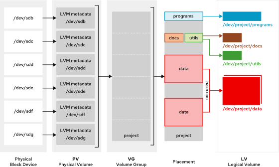
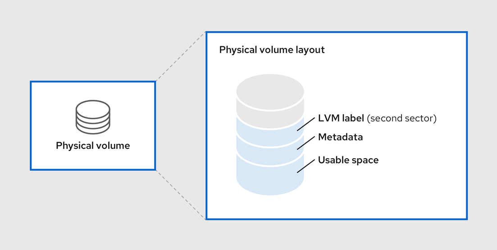

- [2.12 - Quản lý lưu trữ nâng cao ( :heavy_plus_sign: UPDATED 07/02/2024)](#manage_advance_storage)
  - [2.12.1 - Tổng quan Logical Volume Manager (LVM) ( :heavy_plus_sign: UPDATED 07/02/2024)](#lvm_overview)
  - [2.12.3 - Xây dựng hệ thống lưu trữ LVM ( :heavy_plus_sign: UPDATED 07/02/2024)](#lvm_build)
  - [2.12.4 - Tạo Logical Volume tính năng nén và chống trùng lặp ( :heavy_plus_sign: UPDATED 07/02/2024)](#lvm_vdo)
  - [2.12.5 - Hiển thị thông tin trạng thái thành phần LVM ( :heavy_plus_sign: UPDATED 07/02/2024)](#lvm_info)
  - [2.12.6 - Mở rộng kích thước Logical Volume ( :heavy_plus_sign: UPDATED 07/02/2024)](#lvm_extend)

## <a name="manage_advance_storage">Quản lý lưu trữ nâng cao</a>
### <a name="lvm_overview">Tổng quan Logical Volume Manager (LVM)</a>

Công nghệ Volume Manage (LVM) tạo ra một lớp trừu tượng trên trên ổ cứng vật lý, cho phép quản trị viên thao tác với ổ cứng lô ríc. Công nghệ này sẽ giúp việc quản lý dễ dàng, linh hoạt hơn là thao tác trực tiếp với thiết bị vật lý. Với ổ cứng lô ríc, quản trị viên không bị hạn chế bởi những rào cản tính toán kích thước vô cùng phức tạp của thiết bị vật lý. Thêm vào đó, việc cấu hình trực tiếp thiết bị sẽ bị ẩn bởi phần mềm vì thế kích thước có thể thay đổi mà không phải `umount` hay gián đoạn dịch vụ. LVM có những ưu diểm cụ thể sau so với việc thao tác trực tiếp thiết bị vật lý:

- Quản lý quy mô nhiều ổ cứng vật lý một cách linh hoạt.
- Phần mềm có thể dễ dàng kiểm soát kích thước ổ cứng lô ríc nói chung, ổ cứng lô ríc có thể thay đổi kích thước tùy ý nói riêng mà không bị ràng buộc bởi giới hạn của thiết bị vật lý.
- Cho phép đặt tên tùy ý.
- Ổ cứng lô ríc có thể được tạo trên nhiều ổ cứng vật lý, giúp tăng thông lượng.
- Hỗ trợ sao lưu thông qua snapshot.

<div style="text-align:center"></div>

Công nghệ này hiện đã có bản nâng cấp LVM2 tương thích ngược với LVM1, tính năng được thêm vào như hỗ trợ sao lưu thông qua snapshot. Quản trị viên có thể chuyển đổi từ LVM1 sang LVM2 thông qua lệnh `vgconvert`. Ổ cứng lô ríc có thể được tạo thành từ `block device`, cái mà bao gồm ổ cứng vật lý lẫn phân vùng của nó và sau đó được khởi tạo thành `Physical Volume (PV)`. Các `Physical Volume` phải được nhóm trong `Volume Group (VG)` và tạo thành một không gian lưu trữ để có thể phân bổ thành ổ cứng lô ríc. Quá trình này tương tự như cách thức phân vùng ổ cứng vật lý. Từ đó ổ cứng lô ríc `Logical Volume (LV)` có thể được sử dụng bởi ứng dụng, người dùng, hệ thống.

<div style="text-align:center"></div>

`Physical Volume (PV)` được khởi tạo từ `block device`, cái mà đại diện cho ổ cứng vật lý hoặc phân vùng của ổ cứng vật lý. Để `LVM` có thể quản lý được thì `block device` phải được khởi tạo thành `PV`, tóm tắt quy trình này thì `LVM` sẽ đánh nhãn vào thiết bị bao gồm thông tin định danh `UUID` và siêu dữ liệu chứa thông tin chi tiết về `Volume Group` mà nó thuộc về.

Lưu ý rằng mặc dù LVM hỗ trợ ổ cứng không phân vùng nhưng Redhat khuyến nghị quản trị viên nên tạo một phân vùng duy nhất trong ổ cứng vì việc tạo `PV` không có phân vùng sẽ gặp rủi ro trong môi trường hệ điều hành hỗn hợp. LVM cho phép thiết lập trên các phân vùng nằm trong cùng một ổ cứng vật lý nhưng khuyến nghị không nên triển khai vì có thể bị giảm thông lượng. 

<div style="text-align:center"></div>

`Logical Volume (LV)` là ổ cứng ảo hay ổ cứng lô ríc, nó được sử dụng bởi ứng dụng, hệ thống, người dùng, ... `LV` được phân bổ từ `Volume Group (VG)`, cái mà tổng hợp một hoặc nhiều `Physical Volume (PV)`. Quản trị viên có thể tăng hoặc giảm kích thước ổ cứng lô ríc mà không hủy hoại dữ liệu hoặc gián đoạn dịch vụ, đây là ưu diểm so với quản lý ổ cứng truyền thống. Dữ liệu có thể bị mất nếu thu nhỏ hơn kích thước đang tồn tại, thêm vào đó một số filesystem không thể thu nhỏ như XFS. Để đảm bảo tính linh hoạt tối đa, quản trị viên cần tạo vừa đủ đáp ứng nhu cầu hoặc hạn chế dung lượng dư thừa.

- `Linear Volume` tổng hợp dung lượng của các `PV`, là chức năng cơ bản của LVM. Ví dụ như có 2 ổ cứng 50GB thì có thể tạo thành một ổ cứng ảo dung lượng 100GB.
- `Striped Logical Volume` là một dạng của ổ cứng ảo nhắm đến mục đích tối ưu thông lượng. Quản trị viên có thể kiểm soát việc điều phối dữ liệu sang các `PV` nằm trên nhiều ổ cứng khác nhau, từ đó tăng hiệu suất.
- `RAID Logical Volume` - vì `LV` là một dạng ổ cứng nên cũng được LVM hỗ trợ chức năng RAID.
- `Thin-provisioned Logical Volume` là một dạng ổ cứng có dung lượng lớn hơn ổ cứng vật lý. Việc này có ý nghĩa trong kinh doanh Cloud, thay vì người dùng nhìn thấy dung lượng thật của hạ tầng thì họ chỉ quan tấm đến lượng tài nguyên "ảo" được cấp theo hợp đồng.
- `Snapshot Volume` để tạo bản sao lưu trước các tình huống tai nạn.
- `Cache Logical Volume` - lưu trữ các khối dữ liệu thường xuyên được sử dụng để  tăng hiệu suất cho các ổ cứng ảo hiện có.

Việc tạo kho lưu trữ LVM yêu cầu xây dựng cấu trúc theo luồng sau:

- Lệnh `pvcreate`: xác định ổ cứng sử dụng và tạo Physical Volume (PV).
- Lệnh `vgcreate`: tạo Volume Group (VG) từ một hoặc nhiều PV.
- Lệnh `lvcreate`: tạo Logical Volume (LV) đại diện cho không gian trống của VG.
- Lệnh `mkfs`: định dạng filesystem(xfs, ext4, ...) hoặc kích hoạt LV thành không gian `swap`, ...

, các lệnh khác như:

- Lệnh `pvdisplay` hiển thị thông tin phân vùng, ổ cứng. Hoặc `pvs` ở dạng tóm tắt.
- Lệnh `vgdisplay` hiển thị thông tin VG gồm: kích thước, số lượng PE và kích thước mỗi PE, ... Hoặc `vgs` ở dạng tóm tắt.
- Lệnh `lvdisplay` hiển thị thông tin LV hoặc `lvs` ở dạng tóm tắt.

### <a name="lvm_build">Xây dựng hệ thống lưu trữ LVM</a>

Tạo Physical Volume (PV) từ phân vùng `/dev/vdb1` và `/dev/vdb2` như sau:

```shell
[root@huyvl-linux-training ~]# lsblk --path
NAME        MAJ:MIN RM  SIZE RO TYPE MOUNTPOINTS
/dev/vda    252:0    0   70G  0 disk 
├─/dev/vda1 252:1    0    1M  0 part 
├─/dev/vda2 252:2    0  200M  0 part /boot/efi
├─/dev/vda3 252:3    0  600M  0 part /boot
└─/dev/vda4 252:4    0 69.2G  0 part /
/dev/vdb    252:16   0   10G  0 disk 
/dev/vdc    252:32   0   10G  0 disk 
/dev/vdd    252:48   0   10G  0 disk 
[root@huyvl-linux-training ~]# parted /dev/vdb mklabel gpt
Warning: The existing disk label on /dev/vdb will be destroyed and all data on this disk will be
lost. Do you want to continue?
Yes/No? yes                                                               
Information: You may need to update /etc/fstab.

[root@huyvl-linux-training ~]#                                            
[root@huyvl-linux-training ~]# parted /dev/vdb
GNU Parted 3.5
Using /dev/vdb
Welcome to GNU Parted! Type 'help' to view a list of commands.
(parted) print                                                            
Model: Virtio Block Device (virtblk)
Disk /dev/vdb: 10.7GB
Sector size (logical/physical): 512B/512B
Partition Table: gpt
Disk Flags: 

Number  Start  End  Size  File system  Name  Flags

(parted) mkpart mypart1 1MiB 50%
(parted) print
Model: Virtio Block Device (virtblk)
Disk /dev/vdb: 10.7GB
Sector size (logical/physical): 512B/512B
Partition Table: gpt
Disk Flags: 

Number  Start   End     Size    File system  Name     Flags
 1      1049kB  5369MB  5368MB               mypart1

(parted) mkpart mypart2 5369MB 100%
(parted) print                                                            
Model: Virtio Block Device (virtblk)
Disk /dev/vdb: 10.7GB
Sector size (logical/physical): 512B/512B
Partition Table: gpt
Disk Flags: 

Number  Start   End     Size    File system  Name     Flags
 1      1049kB  5369MB  5368MB               mypart1
 2      5369MB  10.7GB  5368MB               mypart2

(parted) set
Partition number? 1                                                       
Flag to Invert? lvm                                                       
New state?  [on]/off? on                                                  
(parted) set
Partition number? 2                                                       
Flag to Invert? lvm                                                       
New state?  [on]/off? on                                                  
(parted) print                                                            
Model: Virtio Block Device (virtblk)
Disk /dev/vdb: 10.7GB
Sector size (logical/physical): 512B/512B
Partition Table: gpt
Disk Flags: 

Number  Start   End     Size    File system  Name     Flags
 1      1049kB  5369MB  5368MB               mypart1  lvm
 2      5369MB  10.7GB  5368MB               mypart2  lvm

(parted) q                                                                
Information: You may need to update /etc/fstab.

[root@huyvl-linux-training ~]# lsblk --fs
NAME   FSTYPE      FSVER    LABEL UUID                                   FSAVAIL FSUSE% MOUNTPOINTS
vda                                                                                     
├─vda1                                                                                  
├─vda2 vfat        FAT16          7B77-95E7                               192.8M     3% /boot/efi
├─vda3 xfs                  boot  5af62dc6-8d15-40dc-b49e-eba93c305ae0    249.4M    53% /boot
└─vda4 xfs                  root  aec1c1e8-3576-4eb2-ab62-f62984e655a2     66.5G     4% /
vdb                                                                                     
├─vdb1 LVM2_member LVM2 001       95gHow-kE0S-btn4-PIlL-fFSW-fAAl-NME8TX                
└─vdb2 LVM2_member LVM2 001       gP4GbU-DsyE-BH5o-h5Y3-fo2D-N3sq-6tyeN9                
vdc                                                                                     
vdd                                                                                     
[root@huyvl-linux-training ~]#                             
```

Lệnh `vgcreate` tạo Volume Group (VG) từ một hoặc nhiều Physical Volume (PV), ví dụ sau mô tả tạo VG từ 2 phân vùng `/dev/vdb1` và `/dev/vdb2` vừa tạo như sau:

```shell
[root@huyvl-linux-training ~]# vgcreate vg_database /dev/vdb1 /dev/vdb2
  Devices file /dev/vdb is excluded: device is partitioned.
  WARNING: adding device /dev/vdb1 with idname d48a3be9-4583-4516-b which is already used for /dev/vdb.
  WARNING: adding device /dev/vdb2 with idname d48a3be9-4583-4516-b which is already used for /dev/vdb.
  Volume group "vg_database" successfully created
[root@huyvl-linux-training ~]# 
```

Lệnh `lvcreate` tạo Logical Volume (LV) từ lượng PE trống trong VG. Tùy chọn `-n` để đặt tên, `-L` khai báo kích thước và tên VG. Lệnh này có thể xảy ra lỗi nếu không đủ PE để đáp ứng. Kích thước LV sẽ được làm tròn lên nếu nó không chia hết cho kích thước PE. Lệnh `lvcreate` tùy chọn `-L` (hoặc `--size`) yêu cầu kích thước bytes, mebibytes(MiB), gibibyte(GiB), ... còn `-l` (hoặc `--extents`) yêu cầu kích thước PE.

Ví dụ sau mô tả tạo LV kích thước 7(GiB):

```shell
[root@huyvl-linux-training ~]# lvcreate vg_database --name lv_database --size 7G
  Logical volume "lv_database" created.
[root@huyvl-linux-training ~]# 
```

Ví dụ sau lấy 558(PE), mỗi PE có 4(MiB) tức bằng 2232(MiB):

```shell
[root@huyvl-linux-training ~]# vgdisplay vg_database
  --- Volume group ---
  VG Name               vg_database
  System ID             
  Format                lvm2
  Metadata Areas        2
  Metadata Sequence No  31
  VG Access             read/write
  VG Status             resizable
  MAX LV                0
  Cur LV                0
  Open LV               0
  Max PV                0
  Cur PV                2
  Act PV                2
  VG Size               9.99 GiB
  PE Size               4.00 MiB
  Total PE              2558
  Alloc PE / Size       0 / 0   
  Free  PE / Size       2558 / 9.99 GiB
  VG UUID               2VxMm2-WxHP-BXrV-Wg1C-XVp2-ZHrK-8mgKuo
   
[root@huyvl-linux-training ~]# lvcreate --name lv_database --extents 558 vg_database
  Logical volume "lv_database" created.
[root@huyvl-linux-training ~]# vgdisplay vg_database
  --- Volume group ---
  VG Name               vg_database
  System ID             
  Format                lvm2
  Metadata Areas        2
  Metadata Sequence No  32
  VG Access             read/write
  VG Status             resizable
  MAX LV                0
  Cur LV                1
  Open LV               0
  Max PV                0
  Cur PV                2
  Act PV                2
  VG Size               9.99 GiB
  PE Size               4.00 MiB
  Total PE              2558
  Alloc PE / Size       558 / <2.18 GiB
  Free  PE / Size       2000 / 7.81 GiB
  VG UUID               2VxMm2-WxHP-BXrV-Wg1C-XVp2-ZHrK-8mgKuo
   
[root@huyvl-linux-training ~]# 
```

Ví dụ sau chỉ định lấy theo tỉ lệ PE đơn vị `%FREE` như sau:

```shell
[root@huyvl-linux-training ~]# lvcreate vg_database --name lv_database -l 100%FREE
  Logical volume "lv_database" created.
[root@huyvl-linux-training ~]# vgdisplay vg_database
  --- Volume group ---
  VG Name               vg_database
  System ID             
  Format                lvm2
  Metadata Areas        2
  Metadata Sequence No  34
  VG Access             read/write
  VG Status             resizable
  MAX LV                0
  Cur LV                1
  Open LV               0
  Max PV                0
  Cur PV                2
  Act PV                2
  VG Size               9.99 GiB
  PE Size               4.00 MiB
  Total PE              2558
  Alloc PE / Size       2558 / 9.99 GiB
  Free  PE / Size       0 / 0   
  VG UUID               2VxMm2-WxHP-BXrV-Wg1C-XVp2-ZHrK-8mgKuo
   
[root@huyvl-linux-training ~]# 
```

, hoặc tỉ lệ theo `%PVS` như sau:

```shell
[root@huyvl-linux-training ~]# pvs
  PV         VG          Fmt  Attr PSize  PFree 
  /dev/vdb1  vg_database lvm2 a--  <5.00g <5.00g
  /dev/vdb2  vg_database lvm2 a--  <5.00g <5.00g
[root@huyvl-linux-training ~]# lvcreate vg_database --name lv_database --extents 50%PVS
  Logical volume "lv_database" created.
[root@huyvl-linux-training ~]# pvs
  PV         VG          Fmt  Attr PSize  PFree 
  /dev/vdb1  vg_database lvm2 a--  <5.00g     0 
  /dev/vdb2  vg_database lvm2 a--  <5.00g <5.00g
[root@huyvl-linux-training ~]# 
```

### <a name="lvm_vdo">Tạo Logical Volume tính năng nén và chống trùng lặp</a>


### <a name="lvm_info">iển thị thông tin trạng thái thành phần LVM</a>


### <a name="lvm_extend">Mở rộng kích thước Logical Volume</a>