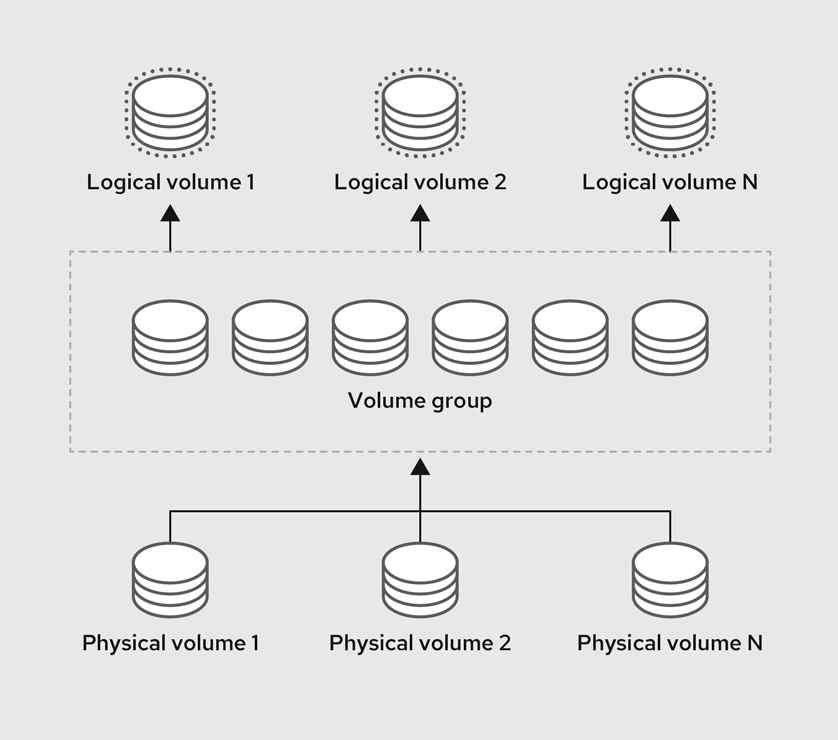

[Phần 2 - Tổng quan về kiến trúc Linux](https://github.com/volehuy1998/network-onboard/blob/master/README.md)

- [2.1 - Linux Kernel (UPDATED 21/01/2024)](https://github.com/volehuy1998/network-onboard/blob/master/linux-onboard/2.1%20-%20linux-arch-onboard.md#linux_kernel)
  - 2.1.1 - Vai trò của Linux Kernel (UPDATED 21/01/2024)
  - 2.1.2 - Tổng quan về Interrupt - Ngắt (UPDATED 05/09/2023)
- [2.2 - Quản lý người dùng và nhóm ( :arrow_up: UPDATED 15/04/2024)](https://github.com/volehuy1998/network-onboard/blob/master/linux-onboard/2.2%20-%20linux-user-management.md#user_and_group)
  - 2.2.1 - Khái niệm `User` (UPDATED 17/09/2023)
  - 2.2.2 - Khái niệm về nhóm, chính và phụ (UPDATED 12/09/2023)
  - 2.2.3 - Thay đổi tài khoản người dùng (UPDATED 13/09/2023)
  - 2.2.4 - Các thao tác quản lý trên người dùng và nhóm(UPDATED 11/09/2023)
  - 2.2.5 - Hạn chế quyền truy cập người dùng (UPDATED 13/09/2023)
  - 2.2.6 - Cấp quyền `sudo` cho nhóm `wheel` ( :arrow_up: UPDATED 15/04/2024)
  - 2.2.7 - Cấp quyền `sudo` cụ thể ( :arrow_up: UPDATED 15/04/2024)
- [2.3 - Hệ thống tệp tin (UPDATED 07/01/2024)](https://github.com/volehuy1998/network-onboard/blob/master/linux-onboard/2.3%20-%20linux-file-system-overview.md#fs)
  - 2.3.1 - Phân cấp hệ thống tệp tin (UPDATED 26/08/2023)
  - 2.3.2 - RPM Package và phân loại (UPDATED 24/08/2023)
  - 2.3.3 - Kernel RPM Package (UPDATED 24/08/2023)
  - 2.3.4 - Tổng quan về quyền trên tệp tin (UPDATED 07/01/2024)
    - 2.3.4.1 - Quản lý quyền tệp tin (UPDATED 13/09/2023)
    - 2.3.4.2 - Quyền đặc biệt dành cho chủ sở hữu (SUID) và lỗ hổng leo thang đặc quyền (UPDATED 10/09/2023)
    - 2.3.4.3 - Quyền đặc biệt dành cho nhóm (UPDATED 10/09/2023)
    - 2.3.4.4 - Quyền đặc biệt Sticky bit (UPDATED 04/09/2023)
  - 2.3.5 - Xác định hệ thống tệp tin và thiết bị (UPDATED 07/11/2023)
- [2.4 - Tổng quan tiến trình Linux (UPDATED 04/10/2023)](https://github.com/volehuy1998/network-onboard/blob/master/linux-onboard/2.4%20-%20linux-process-overview.md#linux_process)
  - 2.4.1 - Trạng thái của tiến trình Linux (UPDATED 17/09/2023)
  - 2.4.2 - Kiểm soát các `Job` (UPDATED 04/10/2023)
  - 2.4.3 - Kết thúc tiến trình (UPDATED 18/09/2023)
  - 2.4.4 - Dịch vụ hạ tầng (UPDATED 21/09/2023)
  - 2.4.5 - Tổng quan về `systemd` (UPDATED 30/09/2023)
  - 2.4.6 - Kiểm soát dịch vụ hệ thống (UPDATED 04/10/2023)
  - 2.4.7 - Mẫu `unit` với ký hiệu `@` (UPDATED 04/10/2023)
  - 2.4.8 - Chi tiết tệp `unit` (UPDATED 04/10/2023)
    - 2.4.8.1 - Loại `unit` phổ biến `*.service` (UPDATED 03/10/2023)
    - 2.4.8.2 - Loại `unit` về `*.socket` (UPDATED 30/09/2023)
    - 2.4.8.3 - Loại `unit` về `*.path` (UPDATED 30/09/2023)
- [2.5 - Điều khiển an toàn từ xa (UPDATED 31/12/2023)](https://github.com/volehuy1998/network-onboard/blob/master/linux-onboard/2.5%20-%20linux-secure-remote-overview.md#remote_connection)
  - 2.5.1 - Tổng quan về kiến trúc giao thức `SSH` (UPDATED 31/12/2023)
    - 2.5.1.1 - Kiến trúc giao thức `SSH` (UPDATED 22/10/2023)
    - 2.5.1.2 - Những xem xét bảo mật về khía cạnh truyền dẫn (UPDATED 19/10/2023)
    - 2.5.1.3 - Những xem xét bảo mật về khía cạnh xác thực (UPDATED 19/10/2023)
    - 2.5.1.4 - Giao thức `SSH-1`, `SSH-2` và sự cải tiến (UPDATED 22/10/2023)
  - 2.5.2 - Cài đặt `OpenSSH`, kết nối và cấu hình (UPDATED 23/10/2023)
    - 2.5.2.1 - Sử dụng công cụ cơ bản (UPDATED 19/10/2023)
    - 2.5.2.2 - Thông tin về `finger print` tại máy khách và máy chủ (UPDATED 19/10/2023)
    - 2.5.2.3 - Hành vi xử lý chuẩn kết nối đến máy chủ (UPDATED 19/10/2023)
    - 2.5.2.4 - Cấu hình `ssh client` (UPDATED 21/10/2023)
    - 2.5.2.5 - Sử dụng `X11 Forwarding` và `Port Forwarding` (UPDATED 23/10/2023)
- [2.6 - Tổng quan về quản lý mạng (UPDATED 05/11/2023)](https://github.com/volehuy1998/network-onboard/blob/master/linux-onboard/2.6%20-%20linux-network-overview.md#network_manage)
  - 2.6.1 - Mô hình `TCP/IP` (UPDATED 25/10/2023)
  - 2.6.2 - Mô tả về `Network Interface` (UPDATED 01/11/2023)
  - 2.6.3 - Địa chỉ `v4` (UPDATED 25/10/2023)
  - 2.6.4 - Địa chỉ `v6` (UPDATED 25/10/2023)
  - 2.6.5 - Thông tin về `network interface`(UPDATED 25/10/2023)
  - 2.6.6 - Công cụ quản lý `nmcli`(UPDATED 05/11/2023)
  - 2.6.7 - Cấu hình và quản lý `hostname`(UPDATED 05/11/2023)
- [2.7 - Kiến trúc nhật ký hệ thống (UPDATED 17/12/2023)](https://github.com/volehuy1998/network-onboard/blob/master/linux-onboard/2.7%20-%20linux-system-log-architecture-overview.md#sys_log_arch)
  - 2.7.1 - Tổng quan (UPDATED 03/12/2023)
  - 2.7.2 - Cách sử dụng `rsyslog` (UPDATED 06/12/2023)
  - 2.7.3 - Cách sử dụng `systemd-journald` (UPDATED 10/12/2023)
  - 2.7.4 - Đồng bộ thời gian (UPDATED 17/12/2023)
    - 2.7.4.1 - Tổng quan `Network Time Protocol` (UPDATED 17/12/2023)
    - 2.7.4.2 - Công cụ `datetimectl` (UPDATED 10/12/2023)
    - 2.7.4.3 - Cấu hình `NTP` sử dụng `chrony` (UPDATED 17/12/2023)
    - 2.7.4.4 - Cấu hình `NTP` sử dụng `ntpd` (UPDATED 10/12/2023)
- [2.8 - Lập lịch chạy cho tác vụ tương lai (UPDATED 01/01/2024)](https://github.com/volehuy1998/network-onboard/blob/master/linux-onboard/2.8%20-%20linux-job-scheduler.md#schedule_job)
  - 2.8.1 - Tổng quan (UPDATED 24/12/2023)
  - 2.8.2 - Cách sử dụng công cụ `at` (UPDATED 24/12/2023)
  - 2.8.3 - Cách sử dụng công cụ `cron` (UPDATED 24/12/2023)
  - 2.8.4 - Ứng dụng `systemd timer` (UPDATED 01/01/2024)
    - 2.8.4.1 - Cách sử dụng công cụ `systemd timer` (UPDATED 01/01/2024)
    - 2.8.4.2 - Quản lý loại tệp tạm thời (UPDATED 01/01/2024)
      - 2.8.4.2.1 - Cách sử dụng `systemd-tmpfiles --create` (UPDATED 01/01/2024)
      - 2.8.4.2.2 - Cách sử dụng `systemd-tmpfiles --clean` (UPDATED 01/01/2024)
      - 2.8.4.2.3 - Cách sử dụng `systemd-tmpfiles --remove` (UPDATED 01/01/2024)
- [2.9 - Quản lý tệp đóng gói và nén với công cụ `tar` (UPDATED 15/01/2024)](https://github.com/volehuy1998/network-onboard/blob/master/linux-onboard/2.9%20-%20linux-manage-compressed-tar-archives.md#manage_compress_tar_archive)
    - 2.9.1 - Tạo và quản lý tệp đóng gói (UPDATED 09/02/2024)
    - 2.9.2 - Tạo và quản lý tệp nén đóng gói (UPDATED 15/01/2024)
    - 2.9.3 - Quản lý tệp sao lưu gia tăng `incremental backup` (UPDATED 15/01/2024)
    - 2.9.4 - Chuyển tệp giữa các hệ thống một cách an toàn (UPDATED 15/01/2024)
    - 2.9.5 - Đồng bộ giữa các hệ thống một cách an toàn (UPDATED 15/01/2024)
- [2.10 - Quản lý `SELinux` (UPDATED 28/01/2024)](https://github.com/volehuy1998/network-onboard/blob/master/linux-onboard/2.10%20-%20linux-se-mode.md#selinux_manage)
    - 2.10.1 - Kiến trúc `SELinux` (UPDATED 27/01/2024)
    - 2.10.2 - Sử dụng `SELinux` cơ bản với chính sách `targeted` (UPDATED 28/01/2024)
      - 2.10.2.1 - Xem nhãn, kích hoạt và vô hiệu hóa `SELinux` (UPDATED 28/01/2024)
      - 2.10.2.2 - Xem định nghĩa chính sách `SELinux` (UPDATED 27/01/2024)
      - 2.10.2.3 - Auditing hành vi hệ thống (UPDATED 28/01/2024)
      - 2.10.2.4 - Kiểm soát `fcontext` với nhãn sẵn có (UPDATED 27/01/2024)
      - 2.10.2.5 - Kiểm soát `port` với nhãn sẵn có (UPDATED 27/01/2024)
      - 2.10.2.6 - Kiểm soát chính sách với  `boolean` (UPDATED 27/01/2024)
- [2.11 - Quản lý lưu trữ cơ bản ( :arrow_up: UPDATED 07/02/2024)](https://github.com/volehuy1998/network-onboard/blob/master/linux-onboard/2.11%20-%20linux-manage-basic-storage.md#manage_basic_storage)
    - 2.11.1 - Khái niệm phân vùng ổ cứng ( :heavy_plus_sign: UPDATED 05/01/2024)
    - 2.11.2 - Quản lý phân vùng theo định dạng ( :heavy_plus_sign: UPDATED 05/01/2024)
      - 2.11.2.1 - Quản lý phân vùng định dạng MBR ( :arrow_up: UPDATED 07/02/2024)
      - 2.11.2.2 - Quản lý phân vùng định dạng GPT ( :heavy_plus_sign: UPDATED 05/01/2024)
    - 2.10.3 - Tạo tệp hệ thống ( :heavy_plus_sign: UPDATED 05/01/2024)
    - 2.10.4 - Mount tệp hệ thống ( :heavy_plus_sign: UPDATED 05/01/2024)
      - 2.10.4.1 - Mount thủ công tệp hệ thống ( :heavy_plus_sign: UPDATED 05/01/2024)
      - 2.10.4.2 - Mount tự vĩnh viễn tệp hệ thống ( :heavy_plus_sign: UPDATED 05/01/2024)
    - 2.10.5 - Quản lý không gian `Swap` ( :heavy_plus_sign: UPDATED 05/01/2024)
      - 2.10.5.1 - Khái niệm không gian `Swap` ( :heavy_plus_sign: UPDATED 05/01/2024)
      - 2.10.5.2 - Tạo phân vùng `swap` ( :heavy_plus_sign: UPDATED 05/01/2024)
- [2.12 - Quản lý lưu trữ nâng cao ( :heavy_plus_sign: UPDATED 09/02/2024)](#manage_advance_storage)
  - [2.12.1 - Tổng quan Logical Volume Manager (LVM) ( :heavy_plus_sign: UPDATED 09/02/2024)](#lvm_overview)
  - [2.12.2 - Xây dựng hệ thống lưu trữ LVM ( :heavy_plus_sign: UPDATED 09/02/2024)](#lvm_build)
  - [2.12.3 - Tạo Logical Volume tính năng nén và chống trùng lặp ( :heavy_plus_sign: UPDATED 09/02/2024)](#lvm_vdo)

## <a name="manage_advance_storage">Quản lý lưu trữ nâng cao</a>
### <a name="lvm_overview">Tổng quan Logical Volume Manager (LVM)</a>

Công nghệ Volume Manage (LVM) tạo ra một lớp trừu tượng trên trên ổ cứng vật lý, cho phép quản trị viên thao tác với ổ cứng lô ríc. Công nghệ này sẽ giúp việc quản lý dễ dàng, linh hoạt hơn là thao tác trực tiếp với thiết bị vật lý. Với ổ cứng lô ríc, quản trị viên không bị hạn chế bởi những rào cản tính toán kích thước vô cùng phức tạp của thiết bị vật lý. Thêm vào đó, việc cấu hình trực tiếp thiết bị sẽ bị ẩn bởi phần mềm vì thế kích thước có thể thay đổi mà không phải `umount` hay gián đoạn dịch vụ. LVM có những ưu diểm cụ thể sau so với việc thao tác trực tiếp thiết bị vật lý:

- Quản lý quy mô nhiều ổ cứng vật lý một cách linh hoạt.
- Phần mềm có thể dễ dàng kiểm soát kích thước ổ cứng lô ríc nói chung, ổ cứng lô ríc có thể thay đổi kích thước tùy ý nói riêng mà không bị ràng buộc bởi giới hạn của thiết bị vật lý.
- Cho phép đặt tên tùy ý.
- Ổ cứng lô ríc có thể được tạo trên nhiều ổ cứng vật lý, giúp tăng thông lượng.
- Hỗ trợ sao lưu thông qua snapshot.

<div style="text-align:center"></div>

Công nghệ này hiện đã có bản nâng cấp LVM2 tương thích ngược với LVM1, tính năng được thêm vào như hỗ trợ sao lưu thông qua snapshot. Quản trị viên có thể chuyển đổi từ LVM1 sang LVM2 thông qua lệnh `vgconvert`. Ổ cứng lô ríc có thể được tạo thành từ `block device`, cái mà bao gồm ổ cứng vật lý lẫn phân vùng của nó và sau đó được khởi tạo thành `Physical Volume (PV)`. Các `Physical Volume` phải được nhóm trong `Volume Group (VG)` và tạo thành một không gian lưu trữ để có thể phân bổ thành ổ cứng lô ríc. Quá trình này tương tự như cách thức phân vùng ổ cứng vật lý. Từ đó ổ cứng lô ríc `Logical Volume (LV)` có thể được sử dụng bởi ứng dụng, người dùng, hệ thống.

<div style="text-align:center"></div>

`Physical Volume (PV)` được khởi tạo từ `block device`, cái mà đại diện cho ổ cứng vật lý hoặc phân vùng của ổ cứng vật lý. Để `LVM` có thể quản lý được thì `block device` phải được khởi tạo thành `PV`, tóm tắt quy trình này thì `LVM` sẽ đánh nhãn vào thiết bị bao gồm thông tin định danh `UUID` và siêu dữ liệu chứa thông tin chi tiết về `Volume Group` mà nó thuộc về.

Lưu ý rằng mặc dù LVM hỗ trợ ổ cứng không phân vùng nhưng Redhat khuyến nghị quản trị viên nên tạo một phân vùng duy nhất trong ổ cứng vì việc tạo `PV` không có phân vùng sẽ gặp rủi ro trong môi trường hệ điều hành hỗn hợp. LVM cho phép thiết lập trên các phân vùng nằm trong cùng một ổ cứng vật lý nhưng khuyến nghị không nên triển khai vì có thể bị giảm thông lượng. 

<div style="text-align:center"></div>

`Logical Volume (LV)` là ổ cứng ảo hay ổ cứng lô ríc, nó được sử dụng bởi ứng dụng, hệ thống, người dùng, ... `LV` được phân bổ từ `Volume Group (VG)`, cái mà tổng hợp một hoặc nhiều `Physical Volume (PV)`. Quản trị viên có thể tăng hoặc giảm kích thước ổ cứng lô ríc mà không hủy hoại dữ liệu hoặc gián đoạn dịch vụ, đây là ưu diểm so với quản lý ổ cứng truyền thống. Dữ liệu có thể bị mất nếu thu nhỏ hơn kích thước đang tồn tại, thêm vào đó một số filesystem không thể thu nhỏ như XFS. Để đảm bảo tính linh hoạt tối đa, quản trị viên cần tạo vừa đủ đáp ứng nhu cầu hoặc hạn chế dung lượng dư thừa.

- `Linear Volume` tổng hợp dung lượng của các `PV`, là chức năng cơ bản của LVM. Ví dụ như có 2 ổ cứng 50GB thì có thể tạo thành một ổ cứng ảo dung lượng 100GB.
- `Striped Logical Volume` là một dạng của ổ cứng ảo nhắm đến mục đích tối ưu thông lượng. Quản trị viên có thể kiểm soát việc điều phối dữ liệu sang các `PV` nằm trên nhiều ổ cứng khác nhau, từ đó tăng hiệu suất.
- `RAID Logical Volume` - vì `LV` là một dạng ổ cứng nên cũng được LVM hỗ trợ chức năng RAID.
- `Thin-provisioned Logical Volume` là một dạng ổ cứng có dung lượng lớn hơn ổ cứng vật lý. Việc này có ý nghĩa trong kinh doanh Cloud, thay vì người dùng nhìn thấy dung lượng thật của hạ tầng thì họ chỉ quan tấm đến lượng tài nguyên "ảo" được cấp theo hợp đồng.
- `Snapshot Volume` để tạo bản sao lưu trước các tình huống tai nạn.
- `Cache Logical Volume` - lưu trữ các khối dữ liệu thường xuyên được sử dụng để  tăng hiệu suất cho các ổ cứng ảo hiện có.

### <a name="lvm_build">Xây dựng hệ thống lưu trữ LVM</a>

Việc tạo kho lưu trữ LVM yêu cầu xây dựng cấu trúc theo luồng sau:

- Lệnh `pvcreate`: xác định ổ cứng sử dụng và tạo Physical Volume (PV).
- Lệnh `vgcreate`: tạo Volume Group (VG) từ một hoặc nhiều PV.
- Lệnh `lvcreate`: tạo Logical Volume (LV) đại diện cho không gian trống của VG.
- Lệnh `mkfs`: định dạng filesystem(xfs, ext4, ...) hoặc kích hoạt LV thành không gian `swap`, ...

, các lệnh xem thông tin như:

- Lệnh `pvdisplay` hiển thị thông tin chi tiết về `Physical Volume` hoặc `pvs` ở dạng tóm tắt.
- Lệnh `vgdisplay` hiển thị thông tin chi tiết về `Volume Group` hoặc `vgs` ở dạng tóm tắt.
- Lệnh `lvdisplay` hiển thị thông tin chi tiết về `Logical Volume` hoặc `lvs` ở dạng tóm tắt.

Các lệnh duy trì, hỗ trợ LVM như:

- Lệnh `lvrename`: thay đổi tên LV.
- Lệnh `lvresize`: thu nhỏ hoặc tăng kích thước LV. Cấu trúc XFS không được hỗ trợ thu nhỏ.
- Lệnh `lvextend`: chỉ hỗ trợ tăng kích thước LV.
- Lệnh `lvremove`: xóa LV, nếu chỉ định VG thì công cụ sẽ hỏi sự cho phép thao tác trên từng LV.
- Lệnh `lvchange`: thay đổi thuộc tính của LV, ví dụ như quyền truy cập, ...

<i>Lưu ý: thay đổi kích thước có thể chỉ định chính xác kích thước yêu cầu hoặc sử dụng phép toán `+` để mô tả bổ sung thêm, phép toán `-` để giảm kích thước.</i>

Các tùy chọn được sử dụng như:
- Tùy chọn `-n` hoặc `--name` sử dụng kèm `lvcreate`: mô tả tên LV.
- Tùy chọn `-L` hoặc `--size` sử dụng kèm `lvcreate` hoặc `lvresize` hoặc `lvextend`: khai báo kích thước KiB, MiB, GiB, TiB, EiB, ...
- Tùy chọn `-l` hoặc `--extents`: sử dụng như trên nhưng đơn vị là PE, mặc định PE có 4MiB có thể cấu hình kích thước khác thông qua `--physicalextentsize` hoặc `-s`, Cho phép sử dụng tỉ lệ, ví dụ cú pháp `100%FREE`, `40%PVS`. Tùy chọn có thể xảy ra lỗi nếu không đủ PE để đáp ứng. 
- Tùy chọn `-r` hoặc `--resizefs`: sử dụng trong việc thay đổi kích thước LV. Có thể thay thế bằng lệnh `fsadm` sau khi thay đổi kích thước.

Tạo Physical Volume (PV) từ phân vùng `/dev/vdb1` và `/dev/vdb2` như sau:

```shell
[root@huyvl-linux-training ~]# lsblk --path
NAME        MAJ:MIN RM  SIZE RO TYPE MOUNTPOINTS
/dev/vda    252:0    0   70G  0 disk 
├─/dev/vda1 252:1    0    1M  0 part 
├─/dev/vda2 252:2    0  200M  0 part /boot/efi
├─/dev/vda3 252:3    0  600M  0 part /boot
└─/dev/vda4 252:4    0 69.2G  0 part /
/dev/vdb    252:16   0   10G  0 disk 
/dev/vdc    252:32   0   10G  0 disk 
/dev/vdd    252:48   0   10G  0 disk 
[root@huyvl-linux-training ~]# parted /dev/vdb mklabel gpt
Warning: The existing disk label on /dev/vdb will be destroyed and all data on this disk will be
lost. Do you want to continue?
Yes/No? yes                                                               
Information: You may need to update /etc/fstab.

[root@huyvl-linux-training ~]#                                            
[root@huyvl-linux-training ~]# parted /dev/vdb
GNU Parted 3.5
Using /dev/vdb
Welcome to GNU Parted! Type 'help' to view a list of commands.
(parted) print                                                            
Model: Virtio Block Device (virtblk)
Disk /dev/vdb: 10.7GB
Sector size (logical/physical): 512B/512B
Partition Table: gpt
Disk Flags: 

Number  Start  End  Size  File system  Name  Flags

(parted) mkpart mypart1 1MiB 50%
(parted) print
Model: Virtio Block Device (virtblk)
Disk /dev/vdb: 10.7GB
Sector size (logical/physical): 512B/512B
Partition Table: gpt
Disk Flags: 

Number  Start   End     Size    File system  Name     Flags
 1      1049kB  5369MB  5368MB               mypart1

(parted) mkpart mypart2 5369MB 100%
(parted) print                                                            
Model: Virtio Block Device (virtblk)
Disk /dev/vdb: 10.7GB
Sector size (logical/physical): 512B/512B
Partition Table: gpt
Disk Flags: 

Number  Start   End     Size    File system  Name     Flags
 1      1049kB  5369MB  5368MB               mypart1
 2      5369MB  10.7GB  5368MB               mypart2

(parted) set
Partition number? 1                                                       
Flag to Invert? lvm                                                       
New state?  [on]/off? on                                                  
(parted) set
Partition number? 2                                                       
Flag to Invert? lvm                                                       
New state?  [on]/off? on                                                  
(parted) print                                                            
Model: Virtio Block Device (virtblk)
Disk /dev/vdb: 10.7GB
Sector size (logical/physical): 512B/512B
Partition Table: gpt
Disk Flags: 

Number  Start   End     Size    File system  Name     Flags
 1      1049kB  5369MB  5368MB               mypart1  lvm
 2      5369MB  10.7GB  5368MB               mypart2  lvm

(parted) q                                                                
Information: You may need to update /etc/fstab.

[root@huyvl-linux-training ~]# lsblk --fs
NAME   FSTYPE      FSVER    LABEL UUID                                   FSAVAIL FSUSE% MOUNTPOINTS
vda                                                                                     
├─vda1                                                                                  
├─vda2 vfat        FAT16          7B77-95E7                               192.8M     3% /boot/efi
├─vda3 xfs                  boot  5af62dc6-8d15-40dc-b49e-eba93c305ae0    249.4M    53% /boot
└─vda4 xfs                  root  aec1c1e8-3576-4eb2-ab62-f62984e655a2     66.5G     4% /
vdb                                                                                     
├─vdb1 LVM2_member LVM2 001       95gHow-kE0S-btn4-PIlL-fFSW-fAAl-NME8TX                
└─vdb2 LVM2_member LVM2 001       gP4GbU-DsyE-BH5o-h5Y3-fo2D-N3sq-6tyeN9                
vdc                                                                                     
vdd                                                                                     
[root@huyvl-linux-training ~]#                             
```

Lệnh `vgcreate` tạo Volume Group (VG) từ một hoặc nhiều Physical Volume (PV), ví dụ sau mô tả tạo VG từ 2 phân vùng `/dev/vdb1` và `/dev/vdb2` vừa tạo như sau:

```shell
[root@huyvl-linux-training ~]# vgcreate vg_database /dev/vdb1 /dev/vdb2
  Devices file /dev/vdb is excluded: device is partitioned.
  WARNING: adding device /dev/vdb1 with idname d48a3be9-4583-4516-b which is already used for /dev/vdb.
  WARNING: adding device /dev/vdb2 with idname d48a3be9-4583-4516-b which is already used for /dev/vdb.
  Volume group "vg_database" successfully created
[root@huyvl-linux-training ~]# 
```

Lệnh `lvcreate` tạo Logical Volume (LV) từ lượng PE trống trong VG. Kích thước LV sẽ được làm tròn lên nếu nó không chia hết cho kích thước PE.

Ví dụ sau mô tả tạo LV kích thước 7(GiB):

```shell
[root@huyvl-linux-training ~]# lvcreate vg_database --name lv_database --size 7G
  Logical volume "lv_database" created.
[root@huyvl-linux-training ~]# 
```

Ví dụ tạo LV bằng 558(PE), kích thước PE mặc đinh 4(MiB) tức bằng 2232(MiB):

```shell
[root@huyvl-linux-training ~]# vgdisplay vg_database
  --- Volume group ---
  VG Name               vg_database
  System ID             
  Format                lvm2
  Metadata Areas        2
  Metadata Sequence No  31
  VG Access             read/write
  VG Status             resizable
  MAX LV                0
  Cur LV                0
  Open LV               0
  Max PV                0
  Cur PV                2
  Act PV                2
  VG Size               9.99 GiB
  PE Size               4.00 MiB
  Total PE              2558
  Alloc PE / Size       0 / 0   
  Free  PE / Size       2558 / 9.99 GiB
  VG UUID               2VxMm2-WxHP-BXrV-Wg1C-XVp2-ZHrK-8mgKuo
   
[root@huyvl-linux-training ~]# lvcreate --name lv_database --extents 558 vg_database
  Logical volume "lv_database" created.
[root@huyvl-linux-training ~]# vgdisplay vg_database
  --- Volume group ---
  VG Name               vg_database
  System ID             
  Format                lvm2
  Metadata Areas        2
  Metadata Sequence No  32
  VG Access             read/write
  VG Status             resizable
  MAX LV                0
  Cur LV                1
  Open LV               0
  Max PV                0
  Cur PV                2
  Act PV                2
  VG Size               9.99 GiB
  PE Size               4.00 MiB
  Total PE              2558
  Alloc PE / Size       558 / <2.18 GiB
  Free  PE / Size       2000 / 7.81 GiB
  VG UUID               2VxMm2-WxHP-BXrV-Wg1C-XVp2-ZHrK-8mgKuo
   
[root@huyvl-linux-training ~]# 
```

Ví dụ tạo LV có kích thước tỉ lệ `%FREE` như sau:

```shell
[root@huyvl-linux-training ~]# lvcreate vg_database --name lv_database -l 100%FREE
  Logical volume "lv_database" created.
[root@huyvl-linux-training ~]# vgdisplay vg_database
  --- Volume group ---
  VG Name               vg_database
  System ID             
  Format                lvm2
  Metadata Areas        2
  Metadata Sequence No  34
  VG Access             read/write
  VG Status             resizable
  MAX LV                0
  Cur LV                1
  Open LV               0
  Max PV                0
  Cur PV                2
  Act PV                2
  VG Size               9.99 GiB
  PE Size               4.00 MiB
  Total PE              2558
  Alloc PE / Size       2558 / 9.99 GiB
  Free  PE / Size       0 / 0   
  VG UUID               2VxMm2-WxHP-BXrV-Wg1C-XVp2-ZHrK-8mgKuo
   
[root@huyvl-linux-training ~]# 
```

Ví dụ sử dụng lệnh `lvrename` để thay đổi tên LV:

```shell
[root@huyvl-linux-training ~]# lvrename lv_mysql lv_mysql_new
  Path required for Logical Volume "lv_mysql".
  Please provide a valid volume group name
  Run 'lvrename --help' for more information.
[root@huyvl-linux-training ~]# lvrename /dev/vg_database/lv_mysql lv_mysql_new
  Renamed "lv_mysql" to "lv_mysql_new" in volume group "vg_database"
[root@huyvl-linux-training ~]# lvdisplay
  --- Logical volume ---
  LV Path                /dev/vg_database/lv_mysql_new
  LV Name                lv_mysql_new
  VG Name                vg_database
  LV UUID                2izCG6-tDDw-X9Oe-YHVq-mxnQ-ju0N-4mTt2b
  LV Write Access        read/write
  LV Creation host, time huyvl-linux-training.novalocal, 2024-02-09 10:50:29 -0500
  LV Status              available
  # open                 0
  LV Size                <15.00 GiB
  Current LE             3839
  Segments               1
  Allocation             inherit
  Read ahead sectors     auto
  - currently set to     8192
  Block device           253:0
   
[root@huyvl-linux-training ~]# 
```

Ví dụ sau sử dụng lệnh `lvchange` chặn quyền viết vào LV như sau:

```shell
[root@huyvl-linux-training ~]# lvcreate --name lv_mysql --size 500MB vg_database
  Logical volume "lv_mysql" created.
[root@huyvl-linux-training ~]# lvs
  LV       VG          Attr       LSize   Pool Origin Data%  Meta%  Move Log Cpy%Sync Convert
  lv_mysql vg_database -wi-a----- 500.00m                                                    
[root@huyvl-linux-training ~]# lvchange -pr /dev/vg_database/lv_mysql 
  Logical volume vg_database/lv_mysql changed.
[root@huyvl-linux-training ~]# lvs
  LV       VG          Attr       LSize   Pool Origin Data%  Meta%  Move Log Cpy%Sync Convert
  lv_mysql vg_database -ri-a----- 500.00m                                                    
[root@huyvl-linux-training ~]# mkfs.xfs /dev/vg_database/lv_mysql
meta-data=/dev/vg_database/lv_mysql isize=512    agcount=4, agsize=32000 blks
         =                       sectsz=512   attr=2, projid32bit=1
         =                       crc=1        finobt=1, sparse=1, rmapbt=0
         =                       reflink=1    bigtime=1 inobtcount=1 nrext64=0
data     =                       bsize=4096   blocks=128000, imaxpct=25
         =                       sunit=0      swidth=0 blks
naming   =version 2              bsize=4096   ascii-ci=0, ftype=1
log      =internal log           bsize=4096   blocks=16384, version=2
         =                       sectsz=512   sunit=0 blks, lazy-count=1
realtime =none                   extsz=4096   blocks=0, rtextents=0
mkfs.xfs: pwrite failed: Operation not permitted
libxfs_bwrite: write failed on (unknown) bno 0xf9f00/0x100, err=1
mkfs.xfs: Releasing dirty buffer to free list!
found dirty buffer (bulk) on free list!
mkfs.xfs: pwrite failed: Operation not permitted
libxfs_bwrite: write failed on (unknown) bno 0x0/0x100, err=1
mkfs.xfs: Releasing dirty buffer to free list!
found dirty buffer (bulk) on free list!
mkfs.xfs: pwrite failed: Operation not permitted
libxfs_bwrite: write failed on xfs_sb bno 0x0/0x1, err=1
mkfs.xfs: Releasing dirty buffer to free list!
mkfs.xfs: libxfs_device_zero write failed: Operation not permitted
[root@huyvl-linux-training ~]# 
[root@huyvl-linux-training ~]# dd if=/dev/zero of=/dev/vg_database/lv_mysql bs=256MB status=progress
dd: error writing '/dev/vg_database/lv_mysql': Operation not permitted
1+0 records in
0+0 records out
0 bytes copied, 0.0545821 s, 0.0 kB/s
[root@huyvl-linux-training ~]# 
```

Ví dụ sau tạo LV từ 2 ổ cứng khác nhau `/dev/vdb` và `/dev/vdc` và thay đổi kích thước:

```shell
[root@huyvl-linux-training ~]# lsblk --fs
NAME   FSTYPE FSVER LABEL UUID                                 FSAVAIL FSUSE% MOUNTPOINTS
vda                                                                           
├─vda1                                                                        
├─vda2 vfat   FAT16       7B77-95E7                             192.8M     3% /boot/efi
├─vda3 xfs          boot  5af62dc6-8d15-40dc-b49e-eba93c305ae0  243.7M    55% /boot
└─vda4 xfs          root  aec1c1e8-3576-4eb2-ab62-f62984e655a2   47.1G     4% /
vdb                                                                           
vdc                                                                           
[root@huyvl-linux-training ~]# parted /dev/vdb mklabel gpt
Warning: The existing disk label on /dev/vdb will be destroyed and all data on this disk will be lost. Do you want to continue?
Yes/No? Yes                                                               
Information: You may need to update /etc/fstab.

[root@huyvl-linux-training ~]# parted /dev/vdc mklabel gpt                
Information: You may need to update /etc/fstab.

[root@huyvl-linux-training ~]# parted /dev/vdb mkpart labdb 2048s 100%
Information: You may need to update /etc/fstab.

[root@huyvl-linux-training ~]# parted /dev/vdc mkpart labdb 2048s 100%    
Information: You may need to update /etc/fstab.

[root@huyvl-linux-training ~]# parted /dev/vdb set 1 lvm on
Information: You may need to update /etc/fstab.

[root@huyvl-linux-training ~]# parted /dev/vdc set 1 lvm on               
Information: You may need to update /etc/fstab.

[root@huyvl-linux-training ~]# lsblk --fs
NAME   FSTYPE FSVER LABEL UUID                                 FSAVAIL FSUSE% MOUNTPOINTS
vda                                                                           
├─vda1                                                                        
├─vda2 vfat   FAT16       7B77-95E7                             192.8M     3% /boot/efi
├─vda3 xfs          boot  5af62dc6-8d15-40dc-b49e-eba93c305ae0  243.7M    55% /boot
└─vda4 xfs          root  aec1c1e8-3576-4eb2-ab62-f62984e655a2   47.1G     4% /
vdb                                                                           
└─vdb1                                                                        
vdc                                                                           
└─vdc1                                                                        
[root@huyvl-linux-training ~]# 
[root@huyvl-linux-training ~]# pvcreate /dev/vdb1 /dev/vdc1
  Physical volume "/dev/vdb1" successfully created.
  Physical volume "/dev/vdc1" successfully created.
[root@huyvl-linux-training ~]# vgcreate vg_database /dev/vdb1 /dev/vdc1
  Volume group "vg_database" successfully created
[root@huyvl-linux-training ~]# vgs
  VG          #PV #LV #SN Attr   VSize  VFree 
  vg_database   2   0   0 wz--n- 29.99g 29.99g
[root@huyvl-linux-training ~]# lvcreate --name lv_mysql -l 50%FREE vg_database
  Logical volume "lv_mysql" created.
[root@huyvl-linux-training ~]#
```

, xác minh thấy VG đã cấp 15GB tương đương 50% theo yêu cầu LV:

```shell
[root@huyvl-linux-training ~]# lvs
  LV       VG          Attr       LSize   Pool Origin Data%  Meta%  Move Log Cpy%Sync Convert
  lv_mysql vg_database -wi-a----- <15.00g                                                    
[root@huyvl-linux-training ~]# vgs
  VG          #PV #LV #SN Attr   VSize  VFree  
  vg_database   2   1   0 wz--n- 29.99g <15.00g
[root@huyvl-linux-training ~]# pvs
  PV         VG          Fmt  Attr PSize   PFree  
  /dev/vdb1  vg_database lvm2 a--  <10.00g <10.00g
  /dev/vdc1  vg_database lvm2 a--  <20.00g   5.00g
[root@huyvl-linux-training ~]# 
```

, tiến hành gắn kết ổ cứng ảo `lv_mysql` vào thư mục `data_mysql` như sau:

```shell
[root@huyvl-linux-training dev]# mkdir mysql_data -v
mkdir: created directory 'mysql_data'
[root@huyvl-linux-training dev]# mkfs.xfs /dev/vg_database/lv_mysql
meta-data=/dev/vg_database/lv_mysql isize=512    agcount=4, agsize=982784 blks
         =                       sectsz=512   attr=2, projid32bit=1
         =                       crc=1        finobt=1, sparse=1, rmapbt=0
         =                       reflink=1    bigtime=1 inobtcount=1 nrext64=0
data     =                       bsize=4096   blocks=3931136, imaxpct=25
         =                       sunit=0      swidth=0 blks
naming   =version 2              bsize=4096   ascii-ci=0, ftype=1
log      =internal log           bsize=4096   blocks=16384, version=2
         =                       sectsz=512   sunit=0 blks, lazy-count=1
realtime =none                   extsz=4096   blocks=0, rtextents=0
Discarding blocks...Done.
[root@huyvl-linux-training dev]# mount /dev/vg_database/lv_mysql mysql_data
[root@huyvl-linux-training dev]# lsblk --fs
NAME                     FSTYPE      FSVER    LABEL UUID                                   FSAVAIL FSUSE% MOUNTPOINTS
vda                                                                                                       
├─vda1                                                                                                    
├─vda2                   vfat        FAT16          7B77-95E7                               192.8M     3% /boot/efi
├─vda3                   xfs                  boot  5af62dc6-8d15-40dc-b49e-eba93c305ae0    243.7M    55% /boot
└─vda4                   xfs                  root  aec1c1e8-3576-4eb2-ab62-f62984e655a2     47.1G     4% /
vdb                                                                                                       
└─vdb1                   LVM2_member LVM2 001       LY3xGO-EtdO-OMqR-BsLP-VS6N-Vdwt-SJyXx0                
vdc                                                                                                       
└─vdc1                   LVM2_member LVM2 001       z5cN7o-rDNB-es7n-5iw5-N7wn-cLPQ-m8Weg1                
  └─vg_database-lv_mysql xfs                        a708bf1c-2a8b-4136-bfea-5182a6b58c5c     14.8G     1% /dev/mysql_data
[root@huyvl-linux-training dev]# 
```

, sử dụng lệnh `lvextend` để tiến hành mở rộng dựa trên dung lượng trống của `lv_mysql` kèm theo tùy chọn `-r` hoặc `--resizefs` để đồng thời thay đổi kích thước XFS, ví dụ sau mô tả tăng kích thước thêm 1(GB):

```shell
[root@huyvl-linux-training ~]# dd if=/dev/zero of=/dev/vg_database/lv_mysql bs=64MB status=progress
15872000000 bytes (16 GB, 15 GiB) copied, 59 s, 269 MB/s 
dd: error writing '/dev/vg_database/lv_mysql': No space left on device
252+0 records in
251+0 records out
16101933056 bytes (16 GB, 15 GiB) copied, 59.8654 s, 269 MB/s
[root@huyvl-linux-training ~]#
[root@huyvl-linux-training ~]# lvextend --resizefs --size +1GB /dev/vg_database/lv_mysql
  Size of logical volume vg_database/lv_mysql changed from <15.00 GiB (3839 extents) to <16.00 GiB (4095 extents).
  File system xfs found on vg_database/lv_mysql mounted at /root/mysql_data.
  Extending file system xfs to <16.00 GiB (17175674880 bytes) on vg_database/lv_mysql...
xfs_growfs /dev/vg_database/lv_mysql
meta-data=/dev/mapper/vg_database-lv_mysql isize=512    agcount=4, agsize=982784 blks
         =                       sectsz=512   attr=2, projid32bit=1
         =                       crc=1        finobt=1, sparse=1, rmapbt=0
         =                       reflink=1    bigtime=1 inobtcount=1 nrext64=0
data     =                       bsize=4096   blocks=3931136, imaxpct=25
         =                       sunit=0      swidth=0 blks
naming   =version 2              bsize=4096   ascii-ci=0, ftype=1
log      =internal log           bsize=4096   blocks=16384, version=2
         =                       sectsz=512   sunit=0 blks, lazy-count=1
realtime =none                   extsz=4096   blocks=0, rtextents=0
data blocks changed from 3931136 to 4193280
xfs_growfs done
  Extended file system xfs on vg_database/lv_mysql.
  Logical volume vg_database/lv_mysql successfully resized.
[root@huyvl-linux-training ~]# df -Th
Filesystem                       Type      Size  Used Avail Use% Mounted on
devtmpfs                         devtmpfs  4.0M     0  4.0M   0% /dev
tmpfs                            tmpfs     881M     0  881M   0% /dev/shm
tmpfs                            tmpfs     353M  9.4M  343M   3% /run
/dev/vda4                        xfs        50G  2.1G   48G   5% /
/dev/vda3                        xfs       536M  293M  244M  55% /boot
/dev/vda2                        vfat      200M  7.0M  193M   4% /efi
tmpfs                            tmpfs     177M     0  177M   0% /run/user/0
/dev/mapper/vg_database-lv_mysql xfs        16G  147M   16G   1% /root/mysql_data
[root@huyvl-linux-training ~]# 
```

Hướng dẫn `man lvresize` mô tả sử dụng cho cả thu hẹp hoặc mở rộng, giống như `lvextend` nó cũng hỗ trợ tùy chọn `--resizefs`. Ví dụ sau mô tả giảm kích thước 1(GB) sau khi tăng:

```shell
[root@huyvl-linux-training ~]# lvresize --resizefs --size +1G /dev/vg_database/lv_mysql
  Size of logical volume vg_database/lv_mysql changed from <16.00 GiB (4095 extents) to <17.00 GiB (4351 extents).
  File system ext4 found on vg_database/lv_mysql mounted at /root/mysql_data.
  Extending file system ext4 to <17.00 GiB (18249416704 bytes) on vg_database/lv_mysql...
resize2fs /dev/vg_database/lv_mysql
resize2fs 1.46.5 (30-Dec-2021)
Filesystem at /dev/vg_database/lv_mysql is mounted on /root/mysql_data; on-line resizing required
old_desc_blocks = 2, new_desc_blocks = 3
The filesystem on /dev/vg_database/lv_mysql is now 4455424 (4k) blocks long.

resize2fs done
  Extended file system ext4 on vg_database/lv_mysql.
  Logical volume vg_database/lv_mysql successfully resized.
[root@huyvl-linux-training ~]#
[root@huyvl-linux-training ~]# df -Th /dev/vg_database/lv_mysql
Filesystem                       Type  Size  Used Avail Use% Mounted on
/dev/mapper/vg_database-lv_mysql ext4   17G   24K   16G   1% /root/mysql_data
[root@huyvl-linux-training ~]#
[root@huyvl-linux-training ~]#
[root@huyvl-linux-training ~]# lvresize --resizefs --size -1G /dev/vg_database/lv_mysql
  File system ext4 found on vg_database/lv_mysql mounted at /root/mysql_data.
  File system size (<17.00 GiB) is larger than the requested size (<16.00 GiB).
  File system reduce is required using resize2fs.
  File system unmount is needed for reduce.
  File system fsck will be run before reduce.
Continue with ext4 file system reduce steps: unmount, fsck, resize2fs? [y/n]:y
  Reducing file system ext4 to <16.00 GiB (17175674880 bytes) on vg_database/lv_mysql...
unmount /root/mysql_data
unmount done
e2fsck /dev/vg_database/lv_mysql
/dev/vg_database/lv_mysql: 11/1114112 files (0.0% non-contiguous), 97591/4455424 blocks
e2fsck done
resize2fs /dev/vg_database/lv_mysql 16773120k
resize2fs 1.46.5 (30-Dec-2021)
Resizing the filesystem on /dev/vg_database/lv_mysql to 4193280 (4k) blocks.
The filesystem on /dev/vg_database/lv_mysql is now 4193280 (4k) blocks long.

resize2fs done
remount /dev/vg_database/lv_mysql /root/mysql_data
remount done
  Reduced file system ext4 on vg_database/lv_mysql.
  Size of logical volume vg_database/lv_mysql changed from <17.00 GiB (4351 extents) to <16.00 GiB (4095 extents).
  Logical volume vg_database/lv_mysql successfully resized.
[root@huyvl-linux-training ~]# df -Th /dev/vg_database/lv_mysql
Filesystem                       Type  Size  Used Avail Use% Mounted on
/dev/mapper/vg_database-lv_mysql ext4   16G   24K   15G   1% /root/mysql_data
[root@huyvl-linux-training ~]# 
```

Lưu ý `lvresize` không hỗ trợ giảm kích thước cho cấu trúc XFS, mọi nổ lức sẽ bị từ chối:

```shell
[root@huyvl-linux-training ~]# umount /dev/vg_database/lv_mysql 
[root@huyvl-linux-training ~]# mkfs.xfs /dev/vg_database/lv_mysql
mkfs.xfs: /dev/vg_database/lv_mysql appears to contain an existing filesystem (ext4).
mkfs.xfs: Use the -f option to force overwrite.
[root@huyvl-linux-training ~]# mkfs.xfs -f /dev/vg_database/lv_mysql 
meta-data=/dev/vg_database/lv_mysql isize=512    agcount=4, agsize=1048320 blks
         =                       sectsz=512   attr=2, projid32bit=1
         =                       crc=1        finobt=1, sparse=1, rmapbt=0
         =                       reflink=1    bigtime=1 inobtcount=1 nrext64=0
data     =                       bsize=4096   blocks=4193280, imaxpct=25
         =                       sunit=0      swidth=0 blks
naming   =version 2              bsize=4096   ascii-ci=0, ftype=1
log      =internal log           bsize=4096   blocks=16384, version=2
         =                       sectsz=512   sunit=0 blks, lazy-count=1
realtime =none                   extsz=4096   blocks=0, rtextents=0
Discarding blocks...Done.
[root@huyvl-linux-training ~]# mount /dev/vg_database/lv_mysql mysql_data/
[root@huyvl-linux-training ~]# lvresize --resizefs --size -1G /dev/vg_database/lv_mysql
  File system xfs found on vg_database/lv_mysql mounted at /root/mysql_data.
  File system size (<16.00 GiB) is larger than the requested size (<15.00 GiB).
  File system reduce is required and not supported (xfs).
[root@huyvl-linux-training ~]# 
```

Có thể sử dụng `fsadm` thay cho cả `resize2fs` và `xfs_growfs` sau khi thay đổi kích thước LV:

```shell
[root@huyvl-linux-training ~]# df -Th /dev/vg_database/lv_mysql
Filesystem                       Type  Size  Used Avail Use% Mounted on
/dev/mapper/vg_database-lv_mysql xfs    15G  139M   15G   1% /root/mysql_data
[root@huyvl-linux-training ~]# lvresize --size +1GB /dev/vg_database/lv_mysql
  Size of logical volume vg_database/lv_mysql changed from <15.00 GiB (3839 extents) to <16.00 GiB (4095 extents).
  Logical volume vg_database/lv_mysql successfully resized.
[root@huyvl-linux-training ~]# fsadm resize /dev/vg_database/lv_mysql
meta-data=/dev/mapper/vg_database-lv_mysql isize=512    agcount=4, agsize=982784 blks
         =                       sectsz=512   attr=2, projid32bit=1
         =                       crc=1        finobt=1, sparse=1, rmapbt=0
         =                       reflink=1    bigtime=1 inobtcount=1 nrext64=0
data     =                       bsize=4096   blocks=3931136, imaxpct=25
         =                       sunit=0      swidth=0 blks
naming   =version 2              bsize=4096   ascii-ci=0, ftype=1
log      =internal log           bsize=4096   blocks=16384, version=2
         =                       sectsz=512   sunit=0 blks, lazy-count=1
realtime =none                   extsz=4096   blocks=0, rtextents=0
data blocks changed from 3931136 to 4193280
[root@huyvl-linux-training ~]# df -Th /dev/vg_database/lv_mysql
Filesystem                       Type  Size  Used Avail Use% Mounted on
/dev/mapper/vg_database-lv_mysql xfs    16G  147M   16G   1% /root/mysql_data
[root@huyvl-linux-training ~]# 
```

### <a name="lvm_vdo">Tạo Logical Volume tính năng nén và chống trùng lặp</a>

<i>Lưu ý: Chức năng VDO LVM của RHEL9 được kiểm tra lần cuối vào ngày 01/2024 đã phát hiện sự cố. Chức năng không hoạt động. Xem thêm thảo luận tại [Red Hat](https://access.redhat.com/discussions/7055345).</i>