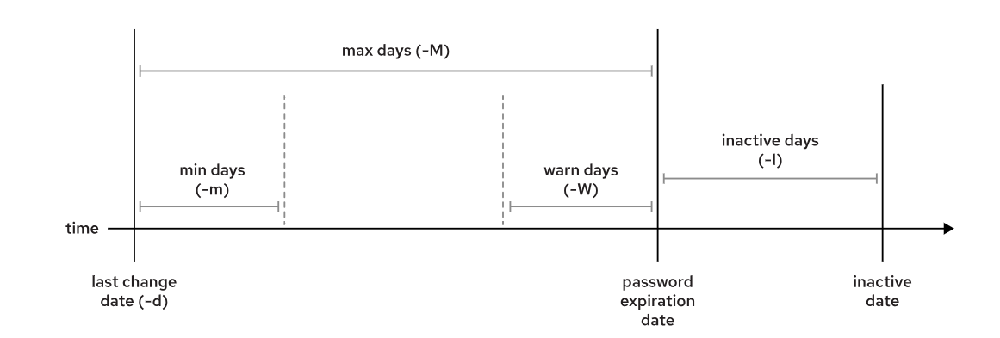

[Phần 2 - Tổng quan về kiến trúc Linux](https://github.com/volehuy1998/network-onboard/blob/master/README.md)

- [2.1 - Linux Kernel (UPDATED 27/08/2023)](https://github.com/volehuy1998/network-onboard/blob/master/linux-onboard/2.1%20-%20linux-arch-onboard.md#linux_kernel)
  - 2.1.1 - Vai trò của Linux Kernel (UPDATED 24/08/2023)
  - 2.1.2 - Tổng quan về Interrupt - Ngắt (UPDATED 05/09/2023)
- [2.2 - Quản lý người dùng và nhóm (UPDATED 17/09/2023)](#user_and_group)
  - [2.2.1 - Khái niệm `User` (UPDATED 17/09/2023)](#user)
  - [2.2.2 - Khái niệm về nhóm, chính và phụ (UPDATED 12/09/2023)](#group)
  - [2.2.3 - Thay đổi tài khoản người dùng (UPDATED 13/09/2023)](#switch_user)
  - [2.2.4 - Các thao tác quản lý trên người dùng và nhóm(UPDATED 11/09/2023)](#user_and_group_control)
  - [2.2.5 - Hạn chế quyền truy cập người dùng (UPDATED 13/09/2023)](#user_restrict_access)
  - [2.2.6 - Cấp quyền `sudo` tự do (UPDATED 11/09/2023)](#grant_free_sudo)
  - [2.2.7 - Cấp quyền `sudo` với lệnh cụ thể (UPDATED 11/09/2023)](#grant_command_sudo)
- [2.3 - Hệ thống tệp tin (UPDATED 07/11/2023)](https://github.com/volehuy1998/network-onboard/blob/master/linux-onboard/2.3%20-%20linux-file-system-overview.md#fs)
  - 2.3.1 - Phân cấp hệ thống tệp tin (UPDATED 26/08/2023)
  - 2.3.2 - RPM Package và phân loại (UPDATED 24/08/2023)
  - 2.3.3 - Kernel RPM Package (UPDATED 24/08/2023)
  - 2.3.4 - Tổng quan về quyền trên tệp tin (UPDATED 04/10/2023)
    - 2.3.4.1 - Quản lý quyền tệp tin (UPDATED 13/09/2023)
    - 2.3.4.2 - Quyền đặc biệt dành cho chủ sở hữu (SUID) và lỗ hổng leo thang đặc quyền (UPDATED 10/09/2023)
    - 2.3.4.3 - Quyền đặc biệt dành cho nhóm (UPDATED 10/09/2023)
    - 2.3.4.4 - Quyền đặc biệt Sticky bit (UPDATED 04/09/2023)
  - 2.3.5 - Xác định hệ thống tệp tin và thiết bị (UPDATED 07/11/2023)
- [2.4 - Tổng quan tiến trình Linux (UPDATED 04/10/2023)](https://github.com/volehuy1998/network-onboard/blob/master/linux-onboard/2.4%20-%20linux-process-overview.md#linux_process)
  - 2.4.1 - Trạng thái của tiến trình Linux (UPDATED 17/09/2023)
  - 2.4.2 - Kiểm soát các `Job` (UPDATED 04/10/2023)
  - 2.4.3 - Kết thúc tiến trình (UPDATED 18/09/2023)
  - 2.4.4 - Dịch vụ hạ tầng (UPDATED 21/09/2023)
  - 2.4.5 - Tổng quan về `systemd` (UPDATED 30/09/2023)
  - 2.4.6 - Kiểm soát dịch vụ hệ thống (UPDATED 04/10/2023)
  - 2.4.7 - Mẫu `unit` với ký hiệu `@` (UPDATED 04/10/2023)
  - 2.4.8 - Chi tiết tệp `unit` (UPDATED 04/10/2023)
    - 2.4.8.1 - Loại `unit` phổ biến `*.service` (UPDATED 03/10/2023)
    - 2.4.8.2 - Loại `unit` về `*.socket` (UPDATED 30/09/2023)
    - 2.4.8.3 - Loại `unit` về `*.path` (UPDATED 30/09/2023)
- [2.5 - Điều khiển an toàn từ xa (UPDATED 23/10/2023)](https://github.com/volehuy1998/network-onboard/blob/master/linux-onboard/2.5%20-%20linux-secure-remote-overview.md#remote_connection)
  - 2.5.1 - Tổng quan về kiến trúc giao thức `SSH` (UPDATED 22/10/2023)
    - 2.5.1.1 - Kiến trúc giao thức `SSH` (UPDATED 22/10/2023)
    - 2.5.1.2 - Những xem xét bảo mật về khía cạnh truyền dẫn (UPDATED 19/10/2023)
    - 2.5.1.3 - Những xem xét bảo mật về khía cạnh xác thực (UPDATED 19/10/2023)
    - 2.5.1.4 - Giao thức `SSH-1`, `SSH-2` và sự cải tiến (UPDATED 22/10/2023)
  - 2.5.2 - Cài đặt `OpenSSH`, kết nối và cấu hình (UPDATED 23/10/2023)
    - 2.5.2.1 - Sử dụng công cụ cơ bản (UPDATED 19/10/2023)
    - 2.5.2.2 - Thông tin về `finger print` tại máy khách và máy chủ (UPDATED 19/10/2023)
    - 2.5.2.3 - Hành vi xử lý chuẩn kết nối đến máy chủ (UPDATED 19/10/2023)
    - 2.5.2.4 - Cấu hình `ssh client` (UPDATED 21/10/2023)
    - 2.5.2.5 - Sử dụng `X11 Forwarding` và `Port Forwarding` (UPDATED 23/10/2023)
- [2.6 - Tổng quan về quản lý mạng (UPDATED 05/11/2023)](https://github.com/volehuy1998/network-onboard/blob/master/linux-onboard/2.6%20-%20linux-network-overview.md#network_manage)
  - 2.6.1 - Mô hình `TCP/IP` (UPDATED 25/10/2023)
  - 2.6.2 - Mô tả về `Network Interface` (UPDATED 01/11/2023)
  - 2.6.3 - Địa chỉ `v4` (UPDATED 25/10/2023)
  - 2.6.4 - Địa chỉ `v6` (UPDATED 25/10/2023)
  - 2.6.5 - Thông tin về `network interface`(UPDATED 25/10/2023)
  - 2.6.6 - Công cụ quản lý `nmcli`(UPDATED 05/11/2023)
  - 2.6.7 - Cấu hình và quản lý `hostname`(UPDATED 05/11/2023)
- [2.7 - Kiến trúc nhật ký hệ thống ( :arrow_up: UPDATED 17/12/2023)](https://github.com/volehuy1998/network-onboard/blob/master/linux-onboard/2.7%20-%20linux-system-log-architecture-overview.md#sys_log_arch)
  - 2.7.1 - Tổng quan (UPDATED 03/12/2023)
  - 2.7.2 - Cách sử dụng `rsyslog` (:heavy_plus_sign:UPDATED 06/12/2023)
  - 2.7.3 - Cách sử dụng `systemd-journald` (:heavy_plus_sign:UPDATED 10/12/2023)
  - 2.7.4 - Đồng bộ thời gian ( :arrow_up: UPDATED 17/12/2023)
    - 2.7.4.1 - Tổng quan `Network Time Protocol` ( :arrow_up: UPDATED 17/12/2023)
    - 2.7.4.2 - Công cụ `datetimectl` ( :heavy_plus_sign: UPDATED 10/12/2023)
    - 2.7.4.3 - Cấu hình `NTP` sử dụng `chrony` ( :heavy_plus_sign: UPDATED 17/12/2023)
    - 2.7.4.4 - Cấu hình `NTP` sử dụng `ntpd` ( :heavy_plus_sign: UPDATED 10/12/2023)

## <a name="user_and_group"></a>Quản lý người dùng và nhóm
Việc kiểm soát người dùng và nhóm là một trong những thành phần cốt lõi của quản trị hệ thống `Linux`. Người dùng tạo tệp tin là người sở hữu của tệp đó, tệp tin sẽ được gán mác các quyền đọc, ghi và thực thi cho chủ sở hữu, nhóm và những người ngoài khác. Chỉ có thể thay đổi chủ sở hữu tệp tin bởi người dùng `root`, quyền truy cập vào tệp tin chỉ có thể thay đổi bởi người dùng `root` hoặc chủ sở hữu, người dùng có thể thay đổi quyền sở hữu nhóm đối với tệp mà họ sở hữu thành một trong những nhóm mà họ là thành viên.
### <a name="user"></a>Khái niệm về `User`
Tài khoản người dùng cung cấp một ranh giới về quyền hạn của người dùng đó và chương trình có thể chạy. Tài khoản người dùng là nền tảng cho bảo mật hệ thống, mỗi tiến trình trên hệ thống đều chạy dựa trên tư cách một người dùng cụ thể, mỗi tệp tin đều có người dùng cụ thể đại diện cho chủ sở hữu. Với quyền sở hữu tệp, hệ thống sẽ thực thi quyền kiểm soát truy cập đối với người dùng tệp tin. Người dùng được liên kết với tiến trình để xác định các tệp và thư mục có thể được truy cập bởi tiến trình đó. Tài khoản gồm có các loại chính: `superuser`, `system user`, `regular user`.

- Tài khoản `superuser`: hầu hết các hệ điều hành đều có một tài khoản `superuser` có toàn quyền đối với hệ thống. Đối với `CentOS`, `Ubuntu`, `RHEL`, ... tên nó là `root` và có `UID` là `0`. Tài khoản này có quyền ghi đè lên các đặc quyền đã được định nghĩa. Đặc quyền của nó đi kèm với trách nhiệm rất lớn, người dùng `root` có đặc quyền vô hạn đến mức có thể làm hỏng hệ thống như: thêm `user`, cài `backdoor`, ... Người dùng chỉ nâng cấp lên đặc quyền `root` tạm thời khi cần, ngoài ra nên sử dụng tài khoản thông thường `regular user`. Tài khoản `root` tương tự như `Administrator` bên `Microsoft Windows`.
- Tài khoản `system user` được sử dụng bởi các tiến trình cung cấp `services` hỗ trợ. Những tiến trình thường hoặc `deamon` có thể không nhất thiết chạy với `superuser`, chúng được gắn bởi các tài khoản phi đặc quyền để bảo vệ các tệp tin và với những người dùng thông thường `regular user` trên hệ thống. Người dùng thường không đăng nhập bằng tài khoản `system user`.
- Hầu hét các `user` là người dùng thường cho công việc hằng ngày của họ, cũng giống với `system user`, người dùng thường có quyền truy cập hạn chế vào hệ thống.

Để hiển thị thông tin về người dùng đang đăng nhập cần lệnh:
```shell
[root@huyvl-linux-training ~]# id
uid=0(root) gid=0(root) groups=0(root)
[root@huyvl-linux-training ~]# id sysad
uid=1000(sysad) gid=1000(sysad) groups=1000(sysad)
[root@huyvl-linux-training ~]# su - sysad
Last login: Tue Sep 12 10:17:52 +07 2023 on pts/0
[sysad@huyvl-linux-training ~]$ id
uid=1000(sysad) gid=1000(sysad) groups=1000(sysad)
[sysad@huyvl-linux-training ~]$
```
Liệt kê chi tiết thông tin người dùng có trong hệ thống: đăng nhập khi nào, thông qua cách thức gì, ...
```shell
[root@huyvl-linux-training ~]# w
 21:58:31 up 5 days, 11:44,  2 users,  load average: 0.00, 0.06, 0.06
USER     TTY      FROM             LOGIN@   IDLE   JCPU   PCPU WHAT
root     pts/0    171.252.188.216  17:36    7.00s  0.40s  0.01s  -2 attach -t 1
hcmopera pts/1    171.252.188.216  21:58   22.00s  0.00s  0.00s -bash
[root@huyvl-linux-training ~]#
```
Mỗi người dùng được liên kết với một mã định danh duy nhất được gọi là `UID (User ID)`, tương tự đối với mỗi nhóm sẽ là `GID (Group ID)`. Những người dùng trong một nhóm sẽ chia sẻ với nhau về các quyền đọc, ghi và thực thi đối với tệp tin sở hữu. `Linux` dự trữ phạm vi `ID` từ `[0-1000]` dành cho người dùng và nhóm hệ thống, để liệt kê người dùng và nhóm trong phạm vi này cần lệnh:
```shell
[root@huyvl-linux-training ~]# cat /usr/share/doc/setup*/uidgid
NAME    UID     GID     HOME            SHELL   PACKAGES
root    0       0       /root           /bin/bash       setup
bin     1       1       /bin            /sbin/nologin   setup
daemon  2       2       /sbin           /sbin/nologin   setup
sys     -       3       -               -       setup
adm     3       4       /var/adm                /bin/bash       setup
tty     -       5       -               -       setup
disk    -       6       -               -       setup
lp      4       7       /var/spool/lpd          /sbin/nologin   setup
mem     -       8       -               -       setup
kmem    -       9       -               -       setup
wheel   -       10      -               -       setup
cdrom   -       11      -               -       setup
sync    5       (0)     /sbin           /bin/sync       setup
shutdown        6       (0)     /sbin           /sbin/shutdown  setup
halt    7       (0)     /sbin           /sbin/halt      setup
mail    8       12      /var/spool/mail         /sbin/nologin   setup
news    9       13      /var/spool/news         /sbin/nologin   setup
uucp    10      14      /var/spool/uucp         /sbin/nologin   uucp
operator        11      (0)     /root           /sbin/nologin   setup
games   12      (100)   /usr/games              /sbin/nologin   setup
gopher  13      30      /var/gopher             /sbin/nologin   -(not created by default)
ftp     14      50      /var/ftp                /sbin/nologin   setup
man     -       15      -               -       setup
oprofile        16      16      /var/lib/oprofile               /sbin/nologin   oprofile
pkiuser 17      17      /usr/share/pki          /sbin/nologin   pki-ca,rhpki-ca
dialout -       18      -               -       setup
floppy  -       19      -               -       setup
games   -       20      -               -       setup
slocate -       21      -               -       slocate
utmp    -       22      -               -       initscripts,libutempter
squid   23      23      /var/spool/squid                /dev/null       squid
pvm     24      24      /usr/share/pvm3         /bin/bash       pvm
named   25      25      /var/named              /bin/false      bind
postgres        26      26      /var/lib/pgsql          /bin/bash       postgresql-server
mysql   27      27      /var/lib/mysql          /bin/bash       mysql
nscd    28      28      /               /bin/false      nscd
rpcuser 29      29      /var/lib/nfs            /bin/false      nfs-utils
console -       31      -               -       dev
rpc     32      32      /               /bin/false      portmap
amandabackup    33      (6)     /var/lib/amanda         /bin/false      amanda
tape    -       33      -               -       setup
netdump 34      34      /var/crash              /bin/bash       netdump-client, netdump-server
utempter        -       35      -               -       libutempter
vdsm    36      -       /               /bin/bash       kvm, vdsm
kvm     -       36      -               -       kvm, vdsm, libvirt
rpm     37      37      /var/lib/rpm            /bin/bash       rpm
ntp     38      38      /etc/ntp                /sbin/nologin   ntp
video   -       39      -               -       setup
dip     -       40      -               -       ppp
mailman 41      41      /var/mailman            /bin/false      mailman
gdm     42      42      /var/gdm                /bin/bash       gdm
xfs     43      43      /etc/X11/fs             /bin/false      XFree86-xfs
exim    93      93      /var/spool/exim         /sbin/nologin   exim                                                                                                                                                            [0/850]
distcache       94      94      /               /sbin/nologin   distcache
radiusd 95      95      /               /bin/false      freeradius
hsqldb  96      96      /var/lib/hsqldb         /sbin/nologin   hsqldb
dovecot 97      97      /usr/libexec/dovecot            /sbin/nologin   dovecot
ident   98      98      /               /sbin/nologin   ident
nobody  99      99      /               /sbin/nologin   setup
users   -       100     -               -       setup
qemu    107     107     /               /sbin/nologin   libvirt
ovirt   108     108     /               /sbin/nologin   libvirt
rhevm   109     109     /home/rhevm             /sbin/nologin   vdsm-reg
jetty   110     110     /usr/share/jetty                /sbin/nologin   jetty
saned   111     111     /               /sbin/nologin   sane-backends
vhostmd 112     112     /usr/share/vhostmd              /sbin/nologin   vhostmd
usbmuxd 113     113     /               /sbin/nologin   usbmuxd
bacula  133     133     /var/spool/bacula               /sbin/nologin   bacula
cimsrvr 134     134     /               /sbin/nologin   tog-pegasus-libs
mock    -       135     /               -       mock
ricci   140     140     /var/lib/ricci          /sbin/nologin   ricci
luci    141     141     /var/lib/luci           /sbin/nologin   luci
activemq        142     142     /usr/share/activemq             /sbin/nologin   activemq
stap-server     155     155     /var/lib/stap-server            /sbin/nologin   systemtap
stapusr -       156     /               -       systemtap-runtime
stapsys -       157     /               -       systemtap-runtime
stapdev -       158     /               -       systemtap-runtime
swift   160     160     /var/lib/swift          /sbin/nologin   openstack-swift
glance  161     161     /var/lib/glance         /sbin/nologin   openstack-glance
nova    162     162     /var/lib/nova           /sbin/nologin   openstack-nova
keystone        163     163     /var/lib/keystone               /sbin/nologin   openstack-keystone
quantum 164     164     /var/lib/quantum                /sbin/nologin   openstack-quantum
cinder  165     165     /var/lib/cinder         /sbin/nologin   openstack-cinder
ceilometer      166     166     /var/lib/ceilometer             /sbin/nologin   openstack-ceilometer
ceph    167     167     /var/lib/ceph           /sbin/nologin   ceph-common
avahi-autoipd   170     170     /var/lib/avahi-autoipd          /sbin/nologin   avahi
pulse   171     171     /var/run/pulse          /sbin/nologin   pulseaudio
rtkit   172     172     /proc           /sbin/nologin   rtkit
abrt    173     173     /etc/abrt               /sbin/nologin   abrt
retrace 174     174     /usr/share/retrace-server               /sbin/nologin   retrace-server
ovirtagent      175     175     /               /sbin/nologin   ovirt-guest-agent
ats     176     176     /               /sbin/nologin   trafficserver
dhcpd   177     177     /               /sbin/nologin   dhcp
myproxy 178     178     /var/lib/myproxy                /sbin/nologin   myproxy-server
sanlock 179     179     /var/run/sanlock                /sbin/nologin   sanlock
aeolus  180     180     /var/aeolus             /sbin/nologin   aeolus-configure
wallaby 181     181     /var/lib/wallaby                /sbin/nologin   wallaby
katello 182     182     /usr/share/katello              /sbin/nologin   katello-common
elasticsearch   183     183     /usr/share/java/elasticsearch           /sbin/nologin   elasticsearch
mongodb 184     184     /var/lib/mongodb                /sbin/nologin   mongodb
jboss   185     185     /var/lib/jbossas                /sbin/nologin   jbossas-core    #was jboss-as and wildfly
jbosson-agent   186     -       /               /sbin/nologin   jboss-on-agent
jbosson -       186     -               -       jboss-on-agent
heat    187     187     /var/lib/heat           /sbin/nologin   heat
haproxy 188     188     /var/lib/haproxy                /sbin/nologin   haproxy
hacluster       189     -       /               /sbin/nologin   pacemaker
haclient        -       189     -               -       pacemaker
systemd-journal -       190     -               -       systemd
systemd-journal-gateway 191     191     /               /sbin/nologin   systemd
#systemd-journal-gateway dynamic on new systems (may have different uid/gid)
systemd-network 192     192     /               /sbin/nologin   systemd
systemd-resolve 193     193     /               /sbin/nologin   systemd
gnats   ?       ?       ?               ?       gnats, gnats-db
listar  ?       ?       ?               ?       listar
nfsnobody       65534   65534   /var/lib/nfs            /sbin/nologin   nfs-utils
[root@huyvl-linux-training ~]#
```
Và hệ thống sẽ thiết lập người dùng, nhóm mới mặc định bắt đầu với `ID` giá trị `1000`, để thay đổi cài đặt này cần chỉnh sửa `/etc/login.defs` như sau, lưu việc cập nhật sau chỉnh sửa sẽ được hệ thống tự động hóa:
```shell
[root@huyvl-linux-training ~]# cat /etc/login.defs | grep -i ^uid_min
UID_MIN                  2000
[root@huyvl-linux-training ~]# cat /etc/login.defs | grep -i ^gid_min
GID_MIN                  2000
[root@huyvl-linux-training ~]# groupadd intern
[root@huyvl-linux-training ~]# useradd -g intern -m intern1
[root@huyvl-linux-training ~]# id intern1
uid=2000(intern1) gid=2000(intern) groups=2000(intern)
[root@huyvl-linux-training ~]#
```
Liệt kê tất cả các tiến trình `-a` kèm theo tên `-u` của người dùng liên kết với nó như sau:
```shell
[sysad@huyvl-linux-training ~]$ ps -au
USER       PID %CPU %MEM    VSZ   RSS TTY      STAT START   TIME COMMAND
root      1245  0.0  0.0 110204   860 tty1     Ss+  10:14   0:00 /sbin/agetty --noclear tty1 linux
root      1246  0.0  0.0 110204   868 ttyS0    Ss+  10:14   0:00 /sbin/agetty --keep-baud 115200,38400,9600 ttyS0 vt220
root      1522  0.0  0.1 115544  2040 pts/0    Ss   10:15   0:00 -bash
root      2512  0.0  0.1 191876  2348 pts/0    S    10:17   0:00 su - sysad
sysad     2513  0.0  0.1 115544  2056 pts/0    S    10:17   0:00 -bash
root      5826  0.0  0.1 191984  2416 pts/0    S    10:26   0:00 su
root      5845  0.0  0.1 115544  2064 pts/0    S    10:27   0:00 bash
root     29060  0.0  0.1 191880  2360 pts/0    S    11:31   0:00 su - sysad
sysad    29061  0.0  0.1 115544  2052 pts/0    S    11:31   0:00 -bash
sysad    30290  0.0  0.0 155448  1860 pts/0    R+   11:34   0:00 ps -au
[sysad@huyvl-linux-training ~]$
```
, nội dung hiển thị người dùng theo tên nhưng bên trong hệ điều hành sử dụng `UID` để theo dõi, việc ánh xạ tên người dùng thành `UID` được định nghĩa trong cơ sở dữ liệu thông tin tài khoản. Mặc định thì hệ thống sử dụng tệp `/etc/passwd` để lưu trữ thông tin. Mỗi một dòng trong `/etc/passwd` chứa thông tin `1` người dùng như sau:
```shell
[sysad@huyvl-linux-training ~]$ grep sysad /etc/passwd
sysad:x:1000:1000::/home/sysad:/bin/bash
[sysad@huyvl-linux-training ~]$
```
Chú thích các thành phần được phân tách bởi dấu hai chấm `:` như sau:

- `sysad`: là tên người dùng.
- `x`: về mặt lịch sử thì mật khẩu được mã hóa tại đây, nhưng hiện tại nó đã được thay bằng dấu `x`.
- `1000`: định danh `UID`.
- `1000`: định danh nhóm `GID` theo `primary group`.
- `:<khoảng trống>:` không có mô tả nào về tài khoản.
- `/home/sysad`: thư mục khởi tạo mặc định của người dùng khi `shell` đăng nhập.
- `/bin/bash`: chương trình `shell` mặc định cho người dùng khi đăng nhập. Một số tài khoản sử dụng `shell` khác như `/sbin/nologin` để không cho phép đăng nhập tương tác bằng tài khoản đó (trường hợp này sẽ có ví dụ).
### <a name="group"></a>Khái niệm về nhóm, chính và phụ
`Group` là một tập người dùng có thể chia sẻ các tệp hoặc tài nguyên hệ thống với nhau. `Group` có thể cấp quyền lên tệp để áp dụng cho tập các người dùng thay vì đơn lẻ. Cũng giống với `user` thì nó cũng có tên để nhận biết, hệ thống phân biệt các nhóm dựa trên `GID`. Việc ánh xạ tên nhóm với định danh thì mặc định hệ thống sử dụng `/etc/group` để lưu trữ:
```shell
[root@huyvl-linux-training ~]# grep sysad /etc/group
sysad:x:1000:
[root@huyvl-linux-training ~]#
```
Chú thích:

- `sysad`: tên nhóm
- `x`: mật khẩu tuy nhiên đã lỗi thời ở thời điểm hiện tại và đã được thay thế bằng ký tự `x`.
- `1000`: định danh của nhóm `sysad`.

Mỗi một `user` đều chỉ thuộc duy nhất một nhóm chính hay `primary group`. Khi tệp được tạo thì `primary group` sẽ được gắn vào. Khi `regular user` được tạo thì một `group` cũng được tạo cùng tên. Những `user` cũng có những nhóm phụ hay `supplementary group`. Người dùng được cấp quyền truy cập tệp dựa trên những nhóm mà họ thuộc về mà không phân biệt nhóm chính hay phụ.

```shell
[root@huyvl-linux-training ~]# id sysad
uid=1000(sysad) gid=1000(sysad) groups=1000(sysad),1001(intern)
```
### <a name="switch_user"></a>Thay đổi tài khoản người dùng
Sử dụng lệnh `su` để thay đổi sang người dùng khác. Từ một `regular user` thay đổi sang một tài khoản người dùng khác cần cung cấp mật khẩu, ngược lại khi đang sử dụng `root` có thể thay đổi sang người dùng khác mà không cần cung cấp mật khẩu của tài khoản đó.
```shell
[sysad2@huyvl-linux-training ~]$ su - sysad
Password:
[sysad2@huyvl-linux-training ~]$
```
, sử dụng `su -` để chuyển sang `root`:
```shell
[sysad@huyvl-linux-training ~]$ su -
Password:
Last login: Tue Sep 12 10:27:02 +07 2023 on pts/0
[root@huyvl-linux-training ~]#
```
Trong khi lệnh `su` sẽ khởi chạy con `shell` loại `non-login`, thì `su -` khởi chạy con `shell` loại `login`. Sự khác biết chính là `su -` sẽ cài đặt môi trường như thể nó đăng nhập với tư cách người dùng đó, trong khi `su` vẫn giữ nguyên cài đặt môi trường của người dùng trước khi chuyển.
```shell
[sysad@huyvl-linux-training ~]$ export some_thing="sysad defined"
[sysad@huyvl-linux-training ~]$ echo $some_thing
sysad defined
[sysad@huyvl-linux-training ~]$ su sysad2
Password:
[sysad2@huyvl-linux-training sysad]$ echo $some_thing
sysad defined
[sysad2@huyvl-linux-training sysad]$ exit
exit
[sysad@huyvl-linux-training ~]$ su
Password:
[root@huyvl-linux-training sysad]# echo $some_thing
sysad defined
[root@huyvl-linux-training sysad]#
```
Vì lý do bảo mật, một số trường hợp quản trị viên cấu hình tài khoản `root` không có mật khẩu hợp lệ, điều này ngăn cản người dùng đăng nhập vào `root`. Không giống như `su`, lệnh `sudo` thường yêu cầu nhập mật khẩu của chính người yêu cầu để xác thực, tức là người dùng sử dụng `sudo` để chạy lệnh với quyền `root` mà không cần đăng nhập vào `root`. Nhưng không vì vậy mà không thể kiểm soát được gọi `sudo` từ người dùng, tất cả lệnh gọi `sudo` đều sẽ được ghi nhận lại:
```shell
[sysad@huyvl-linux-training ~]$ sudo reboot
[sudo] password for sysad:
sysad is not in the sudoers file.  This incident will be reported.
[sysad@huyvl-linux-training ~]$ exit
logout
[root@huyvl-linux-training ~]# tail -f /var/log/secure
...
...
Sep 12 17:44:27 huyvl-linux-training sudo:   sysad : user NOT in sudoers ; TTY=pts/1 ; PWD=/home/sysad ; USER=root ; COMMAND=/sbin/reboot
Sep 12 17:44:31 huyvl-linux-training su: pam_unix(su-l:session): session closed for user sysad
```
Tệp `/etc/sudoers` là tệp cấu hình chính của lệnh `sudo`. Để tránh các vấn đề khi nhiều quản trị viên chỉnh sửa tệp cùng lúc thì có thể sử dụng `visudo`, ngoài ra `visudo` còn có chức năng kiểm tra cú pháp của tệp.
```
[root@huyvl-linux-training ~]# grep wheel /etc/sudoers
## Allows people in group wheel to run all commands
%wheel  ALL=(ALL)       ALL
```
Chú thích:

- `%wheel` là người dùng hoặc nhóm sẽ được áp dụng `rule`. Ký tự `%` để chỉ định đối tượng là nhóm.
- `ALL` đầu tiên có thể thực hiện trên bất kỳ máy chủ nào tùy thích, `ALL` thứ hai là người dùng trong nhóm `wheel` có thể chạy lệnh với bất kỳ người dùng khác.
- `ALL` cuối cùng rằng người dùng nhóm `wheel` có thể áp dụng `sudo` với bất kỳ lệnh nào tùy thích.

Để xác định được tài khoản hiện đang sử dụng là con shell `login` hay `non-login` cần lệnh:
```shell
[sysad@huyvl-linux-training ~]$ sudo su
[sudo] password for sysad:
[root@huyvl-linux-training sysad]# echo $0
bash
[root@huyvl-linux-training sysad]# # this is non-login shell
[root@huyvl-linux-training sysad]# exit
exit
[sysad@huyvl-linux-training ~]$ sudo su -
Last login: Wed Sep 13 10:41:46 +07 2023 on pts/0
[root@huyvl-linux-training ~]# echo $0
-bash
[root@huyvl-linux-training ~]# # this is login shell
[root@huyvl-linux-training ~]#
```
### <a name="user_and_group_control"></a>Các thao tác quản lý trên người dùng và nhóm
Để chỉ định `ID` khi tạo người dùng cần thêm tùy chọn `-u` như sau:
```shell
[root@huyvl-linux-training ~]# useradd -u 2005 intern2
[root@huyvl-linux-training ~]# id intern2
uid=2005(intern2) gid=2005(intern2) groups=2005(intern2)
[root@huyvl-linux-training ~]#
```
, tương tự đối với nhóm cần thêm tùy chọn `-g` như sau:
```shell
[root@huyvl-linux-training ~]# groupadd -g 2010 sale
[root@huyvl-linux-training ~]# cat /etc/group | grep sale
sale:x:2010:
[root@huyvl-linux-training ~]#
```
Tạo nhóm khu vực hệ thống cần tùy chọn `-r` như sau:
```shell
[root@huyvl-linux-training ~]# groupadd -r sysgroup
[root@huyvl-linux-training ~]# grep sysgroup /etc/group
sysgroup:x:993:
```
Thay đổi tên nhóm với tùy chọn `-n` như sau:
```shell
[root@huyvl-linux-training ~]# groupmod -n systemgroup sysgroup
[root@huyvl-linux-training ~]# grep systemgroup /etc/group
systemgroup:x:993:
```
Hủy nhóm cần chắc chắn rằng không có người dùng nào thuộc nhóm chính đó:
```shell
[root@huyvl-linux-training ~]# id hcmoperator
uid=1003(hcmoperator) gid=1007(hcmsysad) groups=1007(hcmsysad),1006(sysad)
[root@huyvl-linux-training ~]# groupdel hcmsysad
groupdel: cannot remove the primary group of user 'hcmoperator'
[root@huyvl-linux-training ~]# userdel -r hcmoperator
[root@huyvl-linux-training ~]# groupdel hcmsysad
```
Để thêm người dùng vào nhóm mới ngoài nhóm chính `primary group` thì được gọi là `secondary group` hoặc `supplementary group` như sau:
```shell
[root@huyvl-linux-training ~]# id dev
uid=1001(dev) gid=1001(dev) groups=1001(dev)
[root@huyvl-linux-training ~]# usermod -a -G intern dev
[root@huyvl-linux-training ~]# id dev
uid=1001(dev) gid=1001(dev) groups=1001(dev),2000(intern)
[root@huyvl-linux-training ~]# groups dev
dev : dev intern
[root@huyvl-linux-training ~]#
```
Thay đổi `primary group` của người dùng như sau:
```shell
[root@huyvl-linux-training ~]# groups dev
dev : dev intern
[root@huyvl-linux-training ~]# usermod -g sysad dev
[root@huyvl-linux-training ~]# groups dev
dev : sysad intern
[root@huyvl-linux-training ~]#
```
Xóa người dùng khỏi nhóm phụ như sau:
```shell
[root@huyvl-linux-training ~]# gpasswd -d dev intern
Removing user dev from group intern
[root@huyvl-linux-training ~]# groups dev
dev : sysad
[root@huyvl-linux-training ~]#
```
Thay mới toàn bộ dánh sách nhóm phụ của người dùng như sau:
```shell
[root@huyvl-linux-training ~]# groups dev
dev : sysad intern
[root@huyvl-linux-training ~]# usermod -G wheel,dev dev
[root@huyvl-linux-training ~]# groups dev
dev : sysad wheel dev
[root@huyvl-linux-training ~]#
```
Thủ tục xóa người dùng khỏi hệ thống trước tiên phải ngắt kết nối để ngăn con `shell` của họ tiếp tục sử dụng:
```shell
[root@huyvl-linux-training ~]# loginctl terminate-user intern1
[root@huyvl-linux-training ~]#
```
```shell
[intern2@huyvl-linux-training ~]$
Session terminated, killing shell... ...killed.
[root@huyvl-linux-training ~]#
```
, xóa người dùng khỏi hệ thống như sau:
```shell
[root@huyvl-linux-training ~]# id intern2
uid=2005(intern2) gid=2005(intern2) groups=2005(intern2)
[root@huyvl-linux-training ~]# userdel -r intern2
[root@huyvl-linux-training ~]# id intern2
id: intern2: no such user
[root@huyvl-linux-training ~]#
```
Đặt mật khẩu cho người dùng qua lệnh `passwd` và kiểm tra tính hình mật khẩu như sau:
```shell
[root@huyvl-linux-training ~]# passwd -S hcmoperator
hcmoperator LK 2023-09-13 0 99999 7 -1 (Password locked.)
[root@huyvl-linux-training ~]# grep hcmoperator /etc/shadow
hcmoperator:!!:19613:0:99999:7:::
[root@huyvl-linux-training ~]# passwd hcmoperator
Changing password for user hcmoperator.
New password:
Retype new password:
passwd: all authentication tokens updated successfully.
[root@huyvl-linux-training ~]# passwd -S hcmoperator
hcmoperator PS 2023-09-13 0 99999 7 -1 (Password set, MD5 crypt.)
[root@huyvl-linux-training ~]# grep hcmoperator /etc/shadow
hcmoperator:$1$aI3nOxva$88mPNNN2vzq7MpsYwGgGH0:19613:0:99999:7:::
[root@huyvl-linux-training ~]#
```
Quy định về thời hạn mật khẩu được biểu diễn như sau:
<div style="text-align:center"></div>

Thay đổi thời hạn vô hiệu hóa mật khẩu thành `30 ngày` cho tài khoản như sau:
```shell
[root@huyvl-linux-training ~]# chage -l hcmoperator
Last password change                                    : Sep 13, 2023
Password expires                                        : never
Password inactive                                       : never
Account expires                                         : never
Minimum number of days between password change          : 0
Maximum number of days between password change          : 99999
Number of days of warning before password expires       : 7
[root@huyvl-linux-training ~]# chage -E $(date -d "+30 days" +%F) hcmoperator
[root@huyvl-linux-training ~]# chage -l hcmoperator
Last password change                                    : Sep 13, 2023
Password expires                                        : never
Password inactive                                       : never
Account expires                                         : Oct 13, 2023
Minimum number of days between password change          : 0
Maximum number of days between password change          : 99999
Number of days of warning before password expires       : 7
[root@huyvl-linux-training ~]# grep hcmoperator /etc/shadow
hcmoperator:$1$aI3nOxva$88mPNNN2vzq7MpsYwGgGH0:19613:0:99999:7::19643:
[root@huyvl-linux-training ~]#
```
Câu lệnh sau buộc người dùng phải thay đổi mật khẩu ở lần đăng nhập kế tiếp:
```shell
[root@huyvl-linux-training ~]# chage -d 0 hcmoperator
[root@huyvl-linux-training ~]# chage -l hcmoperator
Last password change                                    : password must be changed
Password expires                                        : password must be changed
Password inactive                                       : password must be changed
Account expires                                         : Oct 13, 2023
Minimum number of days between password change          : 0
Maximum number of days between password change          : 99999
Number of days of warning before password expires       : 7
[root@huyvl-linux-training ~]#
```
### <a name="user_restrict_access"></a>Hạn chế truy cập người dùng
Khóa và mở khóa tài khoản người dùng như sau:
```shell
[root@huyvl-linux-training ~]# passwd -S hcmoperator
hcmoperator PS 2023-09-13 0 99999 7 -1 (Password set, MD5 crypt.)
[root@huyvl-linux-training ~]# usermod -L hcmoperator
[root@huyvl-linux-training ~]# passwd -S hcmoperator
hcmoperator LK 2023-09-13 0 99999 7 -1 (Password locked.)
[root@huyvl-linux-training ~]#
```
Con shell `nologin` có những quyền như con shell `login` được thay thế nhưng sẽ không cung cấp phương thức đăng nhập. Đây là một phương pháp bảo mật tốt khi tài khoản đó không có nhu cầu đăng nhập. Ví dụ như một máy chủ `Mail` cần tạo tài khoản để người dùng xác thực qua ứng dụng khách như `Thunderbird`, `Outlook`, ... để truy xuất thư điện tử mà họ không cần đăng nhập trực tiếp vào máy chủ `Mail`. Giải pháp cho tình huống này là cài đặt con `shell` của tài khoản người dùng là `/sbin/nologin`.
```shell
[root@huyvl-linux-training ~]# su - sale
Last login: Wed Sep 13 11:42:31 +07 2023 on pts/0
[sale@huyvl-linux-training ~]$ exit
logout
[root@huyvl-linux-training ~]# usermod -s /sbin/nologin sale
[root@huyvl-linux-training ~]# su - sale
Last login: Wed Sep 13 14:19:03 +07 2023 on pts/0
This account is currently not available.
[root@huyvl-linux-training ~]#
```
### <a name="grant_free_sudo"></a>Cấp quyền `sudo` tự do
Quản trị viên có thể cấp quyền truy cập `sudo` để cho phép người dùng ngoài `root` có thể thực thi những lệnh tương đương với quản trị viên, những thứ mà được dành riêng cho người dùng `root`. Do đó những người dùng `non-root` có thể gọi lệnh quản trị mà không cần phải đăng nhập vào tài khoản `root`. Tệp `/etc/sudoers` chỉ định người dùng nào có thể sử dụng lệnh `sudo`, những luật trong đây có thể áp dụng lên những tài khoản riêng lẻ hoặc nhóm người dùng. Quản trị viên cũng có thể sử dụng bí danh `aliases` để có thể đơn giản hóa việc định nghĩa cho các nhóm thuộc `hosts`, lệnh cụ thể hoặc thậm chí nhiều tài khoản. Những bí danh mặc định được định nghĩa trong ở phần đầu tiên của `/etc/sudoers`.

Khi người dùng sử dụng đặc quyền `sudo` để chạy lệnh cái mà nó không được phép hoặc không được định nghĩa trong tệp `/etc/sudoers` sẽ nhận thông báo lỗi như sau:
```shell
[dev@huyvl-linux-training ~]$ sudo cat /etc/hosts
[sudo] password for dev:
dev is not in the sudoers file.  This incident will be reported.
[dev@huyvl-linux-training ~]$
```
, mặc định tệp `/etc/sudoers` sẽ cung cấp thông tin và các ví dụ về ủy quyền `authorization`. Quản trị viên có thể kích hoạt những `rule` bằng cách xóa bỏ ký tự `# (comment)`. Định dạng sau mô tả tổng quan về ủy quyền:
```shell
$ username hostname=path/to/command
```
Hệ thống sẽ đọc tệp `/etc/sudoers` theo thứ tự từ trên xuống dưới, vì vậy nếu có nhiều dòng ủy quyền dành cho cùng một người dùng thì nó sẽ lấy theo thứ tự, trong những trường hợp gặp xung đột về giá trị ủy quyền thì hệ thống sẽ lấy lần hợp lệ gần nhất. Cách thức được khuyến nghị nhất khi thêm `rule` vào `sudoers` là tạo một tệp mới nằm trong thư mục `/etc/sudoers.d/` thay vì định nghĩa trực tiếp vào tệp `/etc/sudoers`. Bởi vì cách thức này sẽ giữ nguyên nội dung khi quản trị cập nhật hệ thống, thêm vào đó mô-đun hóa là cách dễ dành truy và sửa lỗi với các tệp tách biệt trong `/etc/sudoers.d/` thay vì tệp tập trung để tránh vô tình ảnh hưởng tới các `rule` không liên quan. Để kích hoạt `/etc/sudoers.d/` hoặc hệ thống đọc được nội dung trong đó thì quản trị viên cần định nghĩa nội dung như sau trong tệp `/etc/sudoers`:
```shell
[root@huyvl-linux-training ~]# cat /etc/sudoers | grep ^#include
#includedir /etc/sudoers.d
[root@huyvl-linux-training ~]#
```
, lưu ý rằng ký tự `#` là cú pháp bắt buộc, các tệp nằm trong `/etc/sudoers.d/` không được chứa dấu `"."`.

Với cấu hình mặc định nói rằng mọi người dùng nằm trong nhóm `wheel` sẽ được cho phép sử dụng `sudo` với bất kỳ lệnh nào, bất kể `hosts` đó là gì.
```shell
[root@huyvl-linux-training ~]# cat /etc/sudoers | grep ^\%wheel
%wheel  ALL=(ALL)       ALL
[root@huyvl-linux-training ~]#
```
, ví dụ thêm tài khoản `dev` vào nhóm `wheel` như sau:
```shell
[dev@huyvl-linux-training ~]$ cat /etc/shadow
cat: /etc/shadow: Permission denied
[dev@huyvl-linux-training ~]$ sudo cat /etc/shadow
[sudo] password for dev:
dev is not in the sudoers file.  This incident will be reported.
[dev@huyvl-linux-training ~]$
```
```shell
[root@huyvl-linux-training ~]# usermod --append -G wheel dev
[root@huyvl-linux-training ~]# groups dev
dev : sysad wheel dev
```
```shell
[dev@huyvl-linux-training ~]$ sudo cat /etc/shadow
[sudo] password for dev:
root:$1$WIK4jiKy$zduQomlM7t93yBZ8gWLO5.:19610:0:99999:7:::
bin:*:18353:0:99999:7:::
daemon:*:18353:0:99999:7:::
adm:*:18353:0:99999:7:::
lp:*:18353:0:99999:7:::
sync:*:18353:0:99999:7:::
shutdown:*:18353:0:99999:7:::
halt:*:18353:0:99999:7:::
mail:*:18353:0:99999:7:::
operator:*:18353:0:99999:7:::
games:*:18353:0:99999:7:::
ftp:*:18353:0:99999:7:::
nobody:*:18353:0:99999:7:::
systemd-network:!!:18760::::::
dbus:!!:18760::::::
polkitd:!!:18760::::::
sshd:!!:18760::::::
postfix:!!:18760::::::
chrony:!!:18760::::::
gluster:!!:18760::::::
dev:$6$MSPq8owf$DPCLXYW1kZrA7Bnf6/cJe2FclE1VWBp4uak4ienAOU0cK3dF.nKX9mRnwqlLx4Di/AwU8cqWuKJUBewLV1Ty0.:19610:0:99999:7:::
sysad:!!:19610:0:99999:7:::
sysad2:!!:19610:0:99999:7:::
intern_sysad:$1$SqZgOZ2H$mo2UzyEF1hMiyTsg4juT80:19610:0:99999:7:::
[dev@huyvl-linux-training ~]$
```
### <a name="grant_command_sudo"></a>Cấp quyền `sudo` cụ thể
Quản trị viên có thể cấp quyền cho phép người dùng không có đặc quyền thực thi một lệnh có đặc quyền bằng cách mô-đun hóa và cấu hình chính sách trong thư mục `/etc/sudoers.d/`. Ví dụ quản trị viên có thể cho phép người dùng `dev` sử dụng lệnh `cat` trên máy chủ cụ thể `hosts` với đặc quyền `sudo`.
```shell
[dev@huyvl-linux-training ~]$ sudo reboot
Sorry, user dev is not allowed to execute '/sbin/reboot' as root on huyvl-linux-training.novalocal.
[dev@huyvl-linux-training ~]$ cat /etc/shadow
cat: /etc/shadow: Permission denied
[dev@huyvl-linux-training ~]$
```
```shell
[root@huyvl-linux-training ~]# visudo -f /etc/sudoers.d/dev
[root@huyvl-linux-training ~]# cat /etc/sudoers.d/dev
dev huyvl-linux-training = /usr/bin/cat
Defaults    mail_always
Defaults    mailto="huyvl3@fpt.com"
[root@huyvl-linux-training ~]#
```
```shell
[dev@huyvl-linux-training ~]$ cat /etc/shadow
root:$1$WIK4jiKy$zduQomlM7t93yBZ8gWLO5.:19610:0:99999:7:::
bin:*:18353:0:99999:7:::
daemon:*:18353:0:99999:7:::
adm:*:18353:0:99999:7:::
lp:*:18353:0:99999:7:::
sync:*:18353:0:99999:7:::
shutdown:*:18353:0:99999:7:::
halt:*:18353:0:99999:7:::
mail:*:18353:0:99999:7:::
operator:*:18353:0:99999:7:::
games:*:18353:0:99999:7:::
ftp:*:18353:0:99999:7:::
nobody:*:18353:0:99999:7:::
systemd-network:!!:18760::::::
dbus:!!:18760::::::
polkitd:!!:18760::::::
sshd:!!:18760::::::
postfix:!!:18760::::::
chrony:!!:18760::::::
gluster:!!:18760::::::
dev:$6$MSPq8owf$DPCLXYW1kZrA7Bnf6/cJe2FclE1VWBp4uak4ienAOU0cK3dF.nKX9mRnwqlLx4Di/AwU8cqWuKJUBewLV1Ty0.:19610:0:99999:7:::
sysad:!!:19610:0:99999:7:::
sysad2:!!:19610:0:99999:7:::
intern_sysad:$1$SqZgOZ2H$mo2UzyEF1hMiyTsg4juT80:19610:0:99999:7:::
[dev@huyvl-linux-training ~]$
```
, nhật ký ghi nhận thư điện tử đã được gửi tới `huyvl3@fpt.com`:
```shell
[root@huyvl-linux-training ~]# tail -f /var/log/maillog
Sep 11 03:30:57 huyvl-linux-training postfix/pickup[1383]: 5BBB918C6: uid=0 from=<root>
Sep 11 03:30:57 huyvl-linux-training postfix/cleanup[4375]: 5BBB918C6: message-id=<20230910203057.5BBB918C6@huyvl-linux-training.novalocal>
Sep 11 03:30:57 huyvl-linux-training postfix/qmgr[1116]: 5BBB918C6: from=<root@huyvl-linux-training.novalocal>, size=539, nrcpt=1 (queue active)
Sep 11 03:30:58 huyvl-linux-training postfix/smtp[4377]: 5BBB918C6: to=<huyvl3@fpt.com>, relay=fpt-com.mail.protection.outlook.com[52.101.132.28]:25, delay=1.3, delays=0.01/0/0.24/1.1, dsn=2.6.0, status=sent (250 2.6.0 <20230910203057.5BBB918C6@huyvl-linux-training.novalocal> [InternalId=38521561683110, Hostname=TYZPR06MB6239.apcprd06.prod.outlook.com] 8547 bytes in 0.132, 63.086 KB/sec Queued mail for delivery)
Sep 11 03:30:58 huyvl-linux-training postfix/qmgr[1116]: 5BBB918C6: removed
```