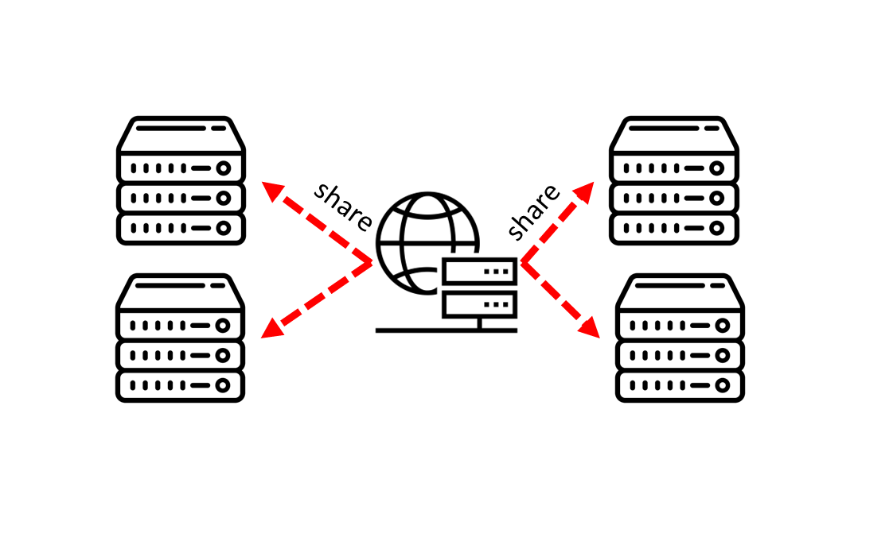
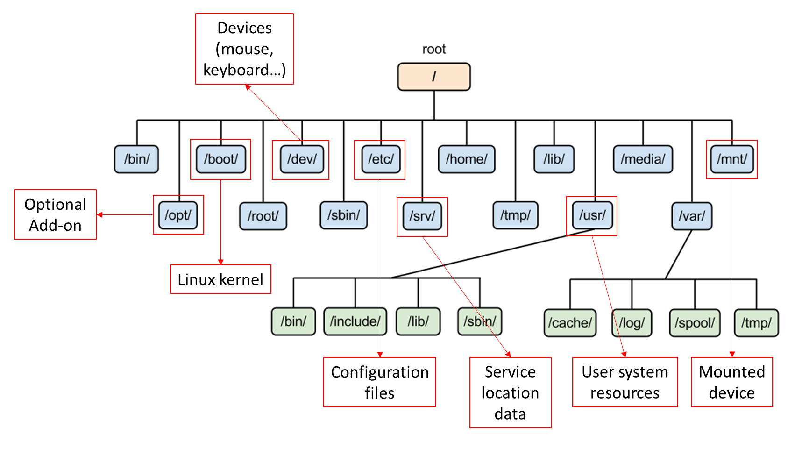
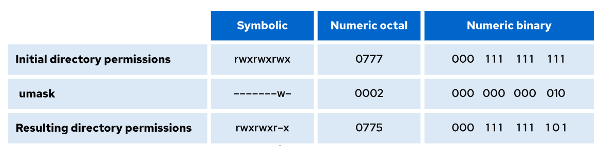
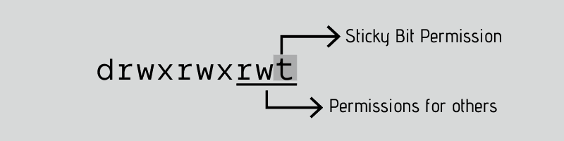

[Phần 2 - Tổng quan về kiến trúc Linux](https://github.com/volehuy1998/network-onboard/blob/master/README.md)

- [2.1 - Linux Kernel (UPDATED 27/08/2023)](https://github.com/volehuy1998/network-onboard/blob/master/linux-onboard/2.0%20-%20linux-arch-onboard.md#linux_kernel)
- [2.2 - Vai trò của Linux Kernel (UPDATED 24/08/2023)](https://github.com/volehuy1998/network-onboard/blob/master/linux-onboard/2.0%20-%20linux-arch-onboard.md#linux_kernel_job)
- [2.3 - Tổng quan về Interrupt - Ngắt (UPDATED 05/09/2023)](https://github.com/volehuy1998/network-onboard/blob/master/linux-onboard/2.0%20-%20linux-arch-onboard.md#interrupt)
- [2.4 - Quản lý người dùng và nhóm (UPDATED 17/09/2023)](https://github.com/volehuy1998/network-onboard/blob/master/linux-onboard/2.4%20-%20linux-user-management.md)
  - 2.4.1 - Khái niệm `User` (UPDATED 17/09/2023)
  - 2.4.2 - Khái niệm về nhóm, chính và phụ (UPDATED 12/09/2023)
  - 2.4.3 - Thay đổi tài khoản người dùng (UPDATED 13/09/2023)
  - 2.4.4 - Các thao tác quản lý trên người dùng và nhóm(UPDATED 11/09/2023)
  - 2.4.5 - Hạn chế quyền truy cập người dùng (UPDATED 13/09/2023)
  - 2.4.6 - Cấp quyền `sudo` tự do (UPDATED 11/09/2023)
  - 2.4.7 - Cấp quyền `sudo` với lệnh cụ thể (UPDATED 11/09/2023)
- [2.5 - Hệ thống tệp tin (UPDATED 07/11/2023)](#fs)
  - [2.5.1 - Phân cấp hệ thống tệp tin (UPDATED 26/08/2023)](#fhs)
  - [2.5.2 - RPM Package và phân loại (UPDATED 24/08/2023)](#rpm_package)
  - [2.5.3 - Kernel RPM Package (UPDATED 24/08/2023)](#kernel_rpm_package)
  - [2.5.4 - Tổng quan về quyền trên tệp tin (UPDATED 04/10/2023)](#file_permission)
    - [2.5.4.1 - Quản lý quyền tệp tin (UPDATED 13/09/2023)](#file_permission_management)
    - [2.5.4.2 - Quyền đặc biệt dành cho chủ sở hữu (SUID) và lỗ hổng leo thang đặc quyền (UPDATED 10/09/2023)](#suid_permission)
    - [2.5.4.3 - Quyền đặc biệt dành cho nhóm (UPDATED 10/09/2023)](#sgid_permission)
    - [2.5.4.4 - Quyền đặc biệt Sticky bit (UPDATED 04/09/2023)](#sticky_bit_permission)
  - [2.5.5 - Xác định hệ thống tệp tin và thiết bị (UPDATED 07/11/2023)](#fs_device)
- [2.6 - Tổng quan tiến trình Linux (UPDATED 04/10/2023)](https://github.com/volehuy1998/network-onboard/blob/master/linux-onboard/2.6%20-%20linux-process-overview.md)
  - 2.6.1 - Trạng thái của tiến trình Linux (UPDATED 17/09/2023)
  - 2.6.2 - Kiểm soát các `Job` (UPDATED 04/10/2023)
  - 2.6.3 - Kết thúc tiến trình (UPDATED 18/09/2023)
  - 2.6.4 - Dịch vụ hạ tầng (UPDATED 21/09/2023)
  - 2.6.5 - Tổng quan về `systemd` (UPDATED 30/09/2023)
  - 2.6.6 - Kiểm soát dịch vụ hệ thống (UPDATED 04/10/2023)
  - 2.6.7 - Mẫu `unit` với ký hiệu `@` (UPDATED 04/10/2023)
  - 2.6.8 - Chi tiết tệp `unit` (UPDATED 04/10/2023)
    - 2.6.8.1 - Loại `unit` phổ biến `*.service` (UPDATED 03/10/2023)
    - 2.6.8.2 - Loại `unit` về `*.socket` (UPDATED 30/09/2023)
    - 2.6.8.3 - Loại `unit` về `*.path` (UPDATED 30/09/2023)
- [2.7 - Điều khiển an toàn từ xa (UPDATED 23/10/2023)](https://github.com/volehuy1998/network-onboard/blob/master/linux-onboard/2.7%20-%20linux-secure-remote-overview.md)
  - 2.7.1 - Tổng quan về kiến trúc giao thức `SSH` (UPDATED 22/10/2023)
    - 2.7.1.1 - Kiến trúc giao thức `SSH` (UPDATED 22/10/2023)
    - 2.7.1.2 - Những xem xét bảo mật về khía cạnh truyền dẫn (UPDATED 19/10/2023)
    - 2.7.1.3 - Những xem xét bảo mật về khía cạnh xác thực (UPDATED 19/10/2023)
    - 2.7.1.4 - Giao thức `SSH-1`, `SSH-2` và sự cải tiến (UPDATED 22/10/2023)
  - 2.7.2 - Cài đặt `OpenSSH`, kết nối và cấu hình (UPDATED 23/10/2023)
    - 2.7.2.1 - Sử dụng công cụ cơ bản (UPDATED 19/10/2023)
    - 2.7.2.2 - Thông tin về `finger print` tại máy khách và máy chủ (UPDATED 19/10/2023)
    - 2.7.2.3 - Hành vi xử lý chuẩn kết nối đến máy chủ (UPDATED 19/10/2023)
    - 2.7.2.4 - Cấu hình `ssh client` (UPDATED 21/10/2023)
    - 2.7.2.5 - Sử dụng `X11 Forwarding` và `Port Forwarding` (UPDATED 23/10/2023)
- [2.8 - Tổng quan về quản lý mạng (UPDATED 05/11/2023)](https://github.com/volehuy1998/network-onboard/blob/master/linux-onboard/2.8%20-%20linux-network-overview.md)
  - 2.8.1 - Mô hình `TCP/IP` (UPDATED 25/10/2023)
  - 2.8.2 - Mô tả về `Network Interface` (UPDATED 01/11/2023)
  - 2.8.3 - Địa chỉ `v4` (UPDATED 25/10/2023)
  - 2.8.4 - Địa chỉ `v6` (UPDATED 25/10/2023)
  - 2.8.5 - Thông tin về `network interface`(UPDATED 25/10/2023)
  - 2.8.6 - Công cụ quản lý `nmcli`(UPDATED 05/11/2023)
  - 2.8.7 - Cấu hình và quản lý `hostname`(UPDATED 05/11/2023)
- [2.9 - Kiến trúc nhật ký hệ thống (UPDATED 03/12/2023)](https://github.com/volehuy1998/network-onboard/blob/master/linux-onboard/2.9%20-%20linux-system-log-architecture-overview.md)
  - [2.9.1 - Tổng quan (UPDATED 03/12/2023)]

  
## <a name="fs"></a>Hệ thống tệp tin
### <a name="fhs"></a>Phân cấp hệ thống tệp tin
Cấu trúc của hệ thống tệp tin `File System Hierarchy Standard(FHS)` được định nghĩa tên, nơi chốn và các quyền cho tất cả các loại tệp, thư mục. Tài liệu `FHS` là tài liệu chính thức cho bất kỳ hệ thống tệp tin nào tuân thủ `FHS` nhưng cấu trúc này để lại nhiều mảng không thể định nghĩa hoặc mở rộng.

Hai điểm quan trọng nhất để đảm bảo rằng hệ thống tuân thủ `FHS` như sau:

- Khả năng tương thích giữa các hệ thống tuân thủ `FHS`.
- Phân vùng `/usr` chỉ ở dạng `readonly`, điều này rất quan trọng vì `/usr` chứa các tệp thực thi phổ biến và người dùng không nên thay đổi. Ngoài ra vì `/usr` ở quyền `readonly` nên nó có thể được `mount` từ `CD-ROM` hoặc từ một máy khác thông qua `NFS`.

Tiêu chuẩn này yêu cầu rằng tất cả hệ thống tuân thủ `FHS` đều hỗ trợ tính năng bảo mật cơ bản tương tự được tìm thấy hầu hết các ở `UNIX`. Có thể phân biệt sự khác biệt giữa các tệp:

- Có thể chia sẻ `shareable` / không thể chia sẻ `unshareable`.
- Có thể biến đổi `variable` / không biến đổi `static`.

Ý nghĩa khai sinh của `shareable` chỉ định những tệp có thể được lưu trữ trên máy chủ và được sử dụng trên các máy chủ khác, ngược lại các tệp `unshareable` là những tệp đó không thể chia sẻ với máy chủ khác. Cụ thể hơn, các tệp trong thư mục của người dùng có thể chia sẻ trong khi thiết bị chứa tệp đó thì không. Đối với các tệp `static` bao gồm tệp `binary`, `lib`, tài liệu, ... không `"thay đổi"` nếu không có sự can thiệp của quản trị viên hệ thống, ngược lại sẽ là `variable`.

Lý do: thông thường không phải tất cả các tệp trong hệ thống phân cấp đều chia sẻ được và do đó mỗi hệ thống có nơi chứa cục bộ, các tệp không thể chia sẻ của nó. Phát sinh từ nhu cầu sẽ thuận tiện nếu tất cả tệp mà hệ thống người dùng yêu cầu được lưu trữ trên máy chủ quốc tế, từ đó người dùng có thể được cung cấp bằng cách `mount` một vài thư mục từ máy chủ quốc tế đó.

<div style="text-align:center"></div>

Về lịch sử, cũng giống như hệ thống phân cấp `UNIX` đều chứa cả tệp `static` và `variable` trong cả `/usr` và `/etc`. Để nhận ra được những lợi ích đề cập ở trên thì `/var` được tạo ra và tất cả các tệp `variable` được thay đổi nơi ở, tức chuyển từ `/usr` sang `/var`, do đó hiện giờ  `/usr` chỉ ở chế độ `readonly`. Đối với những tệp `variable` trong `/etc` thì được chuyển sang `/var` sau một thời gian dài chờ đợi công nghệ kỹ thuật phát triển. Sau đây là ví dụ về một hệ thống tuân thủ `FHS`.
| 			| shareable 		| unshareable|
| ----------| ---- 				| ---- 		 |
| static	| /usr 				| /etc		 |
| static    | /opt 				| /boot		 |
| variable	| /var/mail 		| /var/run	 |
| variable  | /var/spool/news 	| /var/lock  |

Hệ thống tệp tin `Linux` được xây dựng theo kiến trúc phân nhánh, khởi đầu và khuynh hướng luôn là `/` - còn được gọi là `forward slash`, cái mà ngược lại với `\` hay `back slash` của `Microsoft Windows`. Sau đây mô hình sơ lược về hệ thống phân cấp.

<div style="text-align:center"></div>

Chi tiết về `root filesystem` như sau:

- `boot` - để khởi động hệ thống thì cần đủ các phần mềm và dữ liệu nằm trên phân vùng `root` để có thể liên kết với hệ thống tệp tin. Tại đây bao gồm các công cụ tiện ích, cấu hình, ...
- `recovery` - để kích hoạt khôi phục về trạng thái ở thời điểm nào đó.
- `restore` - khi hệ thống bị lỗi cần khôi phục từ hệ thống dự phòng. 
- Các yêu cầu tối thiểu cho `/` phải càng nhỏ càng tốt vì một vài lý do: 
    - Đôi khi nó được `mount` từ các thiết bị rất nhỏ.
    - Nó chứa các cấu hình như `kernel`, ... vì thế nó thuộc vào loại tệp không thể chia sẻ nên nó sẽ nhưỡng khoảng trống dung lượng cho những loại `shareable`.
    - Lỗi trên `/` là một vấn đề lớn hơn bất kỳ lỗi nào trên phân vùng khác, nếu nó nhỏ càng giảm thiểu rủi ro cho toàn bộ hệ thống.

Tổng quan các thư mục sau hoặc các `symbolic` đều được yêu cầu trong `root filesystem` :
| Thư mục 	| Mô tả |
| ----      | ---- 		 |
| /bin      | Các chương trình cơ bản cho tất cả người dùng          |
| /boot     | Các tệp tĩnh dành cho `boot loader` hoặc `linux kernel`       |
| /dev      | Các tệp về thiết bị: chuột, bàn phím...           |
| /etc      | Các tệp dành riêng cho cấu hình hệ thống  |
| /lib      | Các thư viện và `kernel module`       	|
| /mnt      | Dành để `mount` thủ công bởi quản trị, nội dung này là cục bộ và không ảnh hưởng đến cách thức vận hành của bất kỳ chương trình nào |
| /media    | Dành cho các thiết bị di động để `mount` tự động như: đĩa mềm `floppy` hoặc CD-ROM, ... hoặc những thứ mà quản trị viên thực sự không muốn nó `mount` vào `root filesystem`. Trong lịch sử đã có một số vị trí `mount` như `/mnt`, `/cdrom` hoặc `/mnt/cdrom` điều nay vô tình là hành vi bổ sung vào `/`.  |
| /opt      | Được dành riêng nếu bổ sung các gói cài đặt, phần mềm dành cho quản trị viên sử dụng |
| /run      | Dữ liệu của phần mềm trong lúc hoạt động. Ví dụ: để kiểm tra các tài khoản đang hoạt động `ls -al /run/user` thông qua `ID` hoặc `DNS` của hệ thống đang dùng `ls -al /run/NetworkManager/resolv.conf`, ...	 |
| /sbin  	| Chương trình của hệ thống sử dụng, hầu hết liên quan đến `root`  |
| /srv      | Dữ liệu của dịch vụ được cung cấp bởi hệ thống  |
| /tmp      | Tệp tạm thời, sẽ mất sau khi khởi động.  |
| /usr      | Đây là phần chính sau `root filesystem` và có thể chia sẻ được nhưng `read only` giữa các máy chủ.  |
| /var      | Chứa những loại dữ liệu động, nó chứa các thành phần có thể chia sẻ như `/var/mail`, ... nhưng cũng có phần không thể chia sẻ `/var/log`, ... |

Chi tiết về `/bin`: các tệp nhị phân được sử dụng bởi tất cả người dùng. Các chương trình nằm trong `/bin` bao gồm:

- `cat`: công cụ hiển thị nội dung tệp.
- `cp`: công cụ sao chép tệp và thư mục.
- `ps`: công cụ báo cáo trạng thái tiến trình.
- `ls`: công cụ liệt kê nội dung thư mục.
- Và một số chương trình khác: `pwd`, `mkdir`, `chmod`, `chown`, `sed`, ... kể cả ký tự `[` hoặc `test`.

Chi tiết về `/boot`: chứa tất cả các yêu cầu cho quá trình `boot` ngoại trừ tệp cấu hình không cần thiết trong lúc khởi động, `/boot` chứa dữ liệu được sử dụng trước khi `kernel` thực hiện chuyển đổi sang `user-mode`. Các chương trình cần thiết để sắp xếp cho `boot loader` có thể khởi động phải được đặt trong `/sbin`, ngược lại các tệp cấu hình không bắt buộc sẽ đặt ở `/etc`. `Kernel` hệ điều hành được đặt ở `/` hoặc `/boot`.

Chi tiết về `/dev`: nơi vị trí của cấc tệp đặc biệt hoặc thiết bị. Khi cần thiết thì các thiết bị trong `/dev` có thể được tạo một cách thủ công, `/dev` chứa chương trình `MAKEDEV` dùng để phục vụ chuyện đó.

Chi tiết về `/etc`: các tệp cấu hình được chứa trong đây, chúng được sử dụng để điều khiển cách thức vận hành của chương trình, chúng bắt buộc là một tệp tĩnh và không thể thực thi. Một số tệp ví dụ như:

- `hosts`: thông tin về ánh xạ tên máy chủ.
- `hosts.allow`: danh sách được cho phép truy cập dựa trên `TCP`.
- `hosts.deny`: danh sách từ chối truy cập dựa trên `TCP`.
- `hosts.equiv`: danh sách các máy chủ và người dùng được tin tưởng hoặc từ chối khi sử dụng `r-command` như `rlogin`, `rsh` hoặc `rcp`... truy cập vào hệ thống mà không cần cung cấp mật khẩu - cơ chế xác thực người dùng cơ bản.
### <a name="rpm_package"></a>RPM package và phân loại
`RPM package` là một tệp chứa nhiều tệp con và `metadata` của chúng(thông tin về các tệp kéo theo/cần thiết bởi hệ thống). Cụ thể thì mỗi gói `RPM` đã bao gồm tệp nén `cpio`, trong tệp nén này chứa:

- Những tệp tin.
- Tiêu đề `RPM` hay `RPM header`, `metadata` của gói chứa tại đây.
- Người quản lý gói `RPM` sử dụng `metadata` để xác định những thành phần phụ thuộc, nơi chứa các tệp cài đặt và các thông tin khác.

Có 2 loại `RPM package`, tất cả chúng đều chia sẻ định dạng và công cụ nhưng có những nội dung khác nhau để phục vụ các mục đích khác nhau:

- Nguồn của `RPM package` viết tắt `SRPM`, thông tin này chứa mã nguồn và cấu hình tệp nơi mà mô tả làm thế nào để xây dựng được gói `RPM binary`. Thêm vào đó `SRPM` có thông tin các bản vá lỗi cho đoạn mã được bao gồm.
- Tệp `RPM binary` chứa tệp `binary` được xây dựng từ mã nguồn.
### <a name="kernel_rpm_package"></a>Tổng quan về `RPM package` của `Linux kernel`
`Kernel RPM` là loại `RPM` đặc biệt, nó không chứa bất kỳ tệp nào nhưng nó bắt buộc các gói phụ thuộc phải được cài đặt đúng cách. `Kernel core` chứa các mẫu `binary` hay `binary image` của `kernel`, tất cả các đối tượng liên quan đến `initramfs` khởi động cùng hệ thống, số lượng `kernel-module` tối thiểu để đảm bảo chức năng cốt lõi. `Kernel modules` chứa những `kernel modules` còn lại không nằm trong `kernel core`.

Một nhóm nhỏ các gói phụ thuộc của `kernel` bên trên nhằm mục đích cung cấp công cụ, môi trường để quản trị viên bảo trì, đặc biệt trong môi trường ảo hóa. Các `kernel package` được tùy chọn thêm gồm có:

- `kernel-modules-extra` chứa các `kernel module` dành cho các loại phần cứng đặc biệt, hiếm gặp hoặc các `module` bị vô hiệu hóa theo mặc định.
- `kernel-debug` chứa các chức năng `debug` được kích hoạt để chuẩn đoán lỗi nhưng điều này làm giảm hiệu suất.
- `kernel-tools` chứa các công cụ để thao tác với `Linux kernel` và hỗ trợ tài liệu.
- `kernel-devel` chứa các `kernel header` và `makefiles` dành cho các lập trình viên phát triển xây dựng `module` dựa trên `kernel package`.
- `kernel-abi-stablelists` chứa các thông tin liên quan đến `ABI kernel` dành riêng cho `RHEL`.
- `kernel-headers` chứa các `header` của ngôn ngữ C mô tả cách thức giao tiếp giữa `Linux kernel` và thư viện dành cho `user space`. Các tệp `header` này đã được định nghĩa nhiều cấu trúc `struct` và các hằng số `const` cần thiết để lập trình viên phát triển các ứng dụng.

Cài đặt `vim` để liệt kê các `rpm` phụ thuộc như sau:
```shell
[root@huyvl-linux-training ~]# yum install --downloadonly --downloaddir=/tmp/vim-rpm/ vim
Loaded plugins: fastestmirror
Loading mirror speeds from cached hostfile
 * base: mirror.bizflycloud.vn
 * extras: mirror.bizflycloud.vn
 * updates: mirror.bizflycloud.vn
Resolving Dependencies
--> Running transaction check
---> Package vim-enhanced.x86_64 2:7.4.629-8.el7_9 will be installed
...
...
(28/31): vim-enhanced-7.4.629-8.el7_9.x86_64.rpm    | 1.1 MB  00:00:00
(29/31): vim-filesystem-7.4.629-8.el7_9.x86_64.rpm  |  11 kB  00:00:00
(30/31): vim-common-7.4.629-8.el7_9.x86_64.rpm      | 5.9 MB  00:00:00
(31/31): perl-Carp-1.26-244.el7.noarch.rpm          |  19 kB  00:00:01
----------------------------------------------------------------------
Total                                       16 MB/s |  18 MB  00:00:01
exiting because "Download Only" specified
[root@huyvl-linux-training ~]#
[root@huyvl-linux-training ~]#
[root@huyvl-linux-training ~]#
[root@huyvl-linux-training ~]# ls -al /tmp/vim-rpm/
total 19036
drwxr-xr-x  2 root root    4096 Aug 23 10:29 .
drwxrwxrwt. 9 root root    4096 Aug 23 10:29 ..
-rw-r--r--  1 root root   33120 Aug 23  2019 gpm-libs-1.20.7-6.el7.x86_64.rpm
-rw-r--r--  1 root root 8360316 Feb  3  2021 perl-5.16.3-299.el7_9.x86_64.rpm
-rw-r--r--  1 root root   19672 Jul  4  2014 perl-Carp-1.26-244.el7.noarch.rpm
-rw-r--r--  1 root root   19244 Jul  4  2014 perl-constant-1.27-2.el7.noarch.rpm
-rw-r--r--  1 root root 1545440 Jul  4  2014 perl-Encode-2.51-7.el7.x86_64.rpm
-rw-r--r--  1 root root   29092 Jul  4  2014 perl-Exporter-5.68-3.el7.noarch.rpm
...
...
```
Tiến hành phân tích tệp `rpm` đã được tải về của `vim` như sau:
```shell
[root@huyvl-linux-training vim-rpm]# rpm -qlp gpm-libs-1.20.7-6.el7.x86_64.rpm
/usr/lib64/libgpm.so.2
/usr/lib64/libgpm.so.2.1.0
[root@huyvl-linux-training vim-rpm]#
```
Thường thì lệnh `update` sẽ cập nhật những `kernel` như sau:
```shell
[root@huyvl-linux-training ~]# yum update --downloadonly --downloaddir=/tmp/update/
Loaded plugins: fastestmirror
Loading mirror speeds from cached hostfile
 * base: mirror.bizflycloud.vn
 * extras: mirror.bizflycloud.vn
 * updates: mirror.bizflycloud.vn
Resolving Dependencies
--> Running transaction check
...
...
```
Phân tích `kernel rpm` thấy được như sau:
```shell
[root@huyvl-linux-training ~]# cd /tmp/update/
[root@huyvl-linux-training update]# ls -al | grep kernel
-rw-r--r--   1 root root 54180012 Jul 28 21:53 kernel-3.10.0-1160.95.1.el7.x86_64.rpm
-rw-r--r--   1 root root  8579092 Jul 28 21:54 kernel-tools-3.10.0-1160.95.1.el7.x86_64.rpm
-rw-r--r--   1 root root  8469692 Jul 28 21:54 kernel-tools-libs-3.10.0-1160.95.1.el7.x86_64.rpm
[root@huyvl-linux-training update]# rpm -qlp kernel-3.10.0-1160.95.1.el7.x86_64.rpm
/boot/.vmlinuz-3.10.0-1160.95.1.el7.x86_64.hmac
/boot/System.map-3.10.0-1160.95.1.el7.x86_64
/boot/config-3.10.0-1160.95.1.el7.x86_64
/boot/initramfs-3.10.0-1160.95.1.el7.x86_64.img
/boot/symvers-3.10.0-1160.95.1.el7.x86_64.gz
/boot/vmlinuz-3.10.0-1160.95.1.el7.x86_64
/etc/ld.so.conf.d/kernel-3.10.0-1160.95.1.el7.x86_64.conf
/etc/modprobe.d/dccp-blacklist.conf
/lib/modules/3.10.0-1160.95.1.el7.x86_64
/lib/modules/3.10.0-1160.95.1.el7.x86_64/build
/lib/modules/3.10.0-1160.95.1.el7.x86_64/extra
/lib/modules/3.10.0-1160.95.1.el7.x86_64/kernel
/lib/modules/3.10.0-1160.95.1.el7.x86_64/kernel/arch
/lib/modules/3.10.0-1160.95.1.el7.x86_64/kernel/arch/x86
/lib/modules/3.10.0-1160.95.1.el7.x86_64/kernel/arch/x86/crypto
/lib/modules/3.10.0-1160.95.1.el7.x86_64/kernel/arch/x86/crypto/ablk_helper.ko.xz
/lib/modules/3.10.0-1160.95.1.el7.x86_64/kernel/arch/x86/crypto/aesni-intel.ko.xz
/lib/modules/3.10.0-1160.95.1.el7.x86_64/kernel/arch/x86/crypto/blowfish-x86_64.ko.xz
/lib/modules/3.10.0-1160.95.1.el7.x86_64/kernel/arch/x86/crypto/camellia-aesni-avx-x86_64.ko.xz
/lib/modules/3.10.0-1160.95.1.el7.x86_64/kernel/arch/x86/crypto/camellia-aesni-avx2.ko.xz
/lib/modules/3.10.0-1160.95.1.el7.x86_64/kernel/arch/x86/crypto/camellia-x86_64.ko.xz
...
...
```
### <a name="file_permission"></a>Tổng quan về quyền trên tệp tin
Là khả năng về việc kiểm soát quyền hạn của trên tệp tin hoặc thư mục của người dùng hoặc nhóm các người dùng như:

- `View` - xem nội dung.
- `Modify` - chỉnh sửa nội dung.
- `Execute` - thực thi nội dung.
- `Access` - truy cập.

Mỗi tệp hoặc thư mục đều tồn tại 3 cấp độ sở hữu như:

- Người sở hữu - `u` (user).
- Nhóm người sở hữu - `g` (group).
- Ngoài ra những người còn lại - `o` (other).

Mỗi cấp độ sở hữu đều có khả năng gán 3 quyền như sau:

- Đọc dữ liệu - `r` (read).
- Ghi dữ liệu - `w` (write).
- Thực thi - `x` (execuate).

Khi một tệp hoặc thư mục được tạo thì một tập hợp các quyền mặc định sẽ tự động được gán vào chúng, lưu ý rằng quyền `x` dành cho tệp tin sẽ cho phép thực thi hay `run` tệp đó, ngược lại với thư mục chỉ cho phép truy cập vào nội dung của thư mục.

Ví dụ phân biệt giữa quyền `read` và `execute` trên thư mục:
```shell
[dev@huyvl-linux-training tmp]$ ll -d r_x_dir/
drwxrwxr-- 3 sysad sysad 4096 Sep 10 22:36 r_x_dir/
[dev@huyvl-linux-training tmp]$ ll r_x_dir/
ls: cannot access r_x_dir/abc: Permission denied
ls: cannot access r_x_dir/doc: Permission denied
total 0
d????????? ? ? ? ?            ? abc
-????????? ? ? ? ?            ? doc
[dev@huyvl-linux-training tmp]$
```
, ngược lại khi mất quyền `read` sẽ không thể tìm thấy nội dung trong thư mục:
```shell
[dev@huyvl-linux-training tmp]$ ll -d r_x_dir/
drwxrwx--- 3 sysad sysad 4096 Sep 10 22:36 r_x_dir/
[dev@huyvl-linux-training tmp]$ ll r_x_dir/
ls: cannot open directory r_x_dir/: Permission denied
[dev@huyvl-linux-training tmp]$
```
, khi có đầy đủ quyền `read` và `execute` trên thư mục:
```shell
[dev@huyvl-linux-training tmp]$ ll -d r_x_dir/
drwxrwxr-x 3 sysad sysad 4096 Sep 10 22:36 r_x_dir/
[dev@huyvl-linux-training tmp]$ ll r_x_dir/
total 4
drwxrwxr-x 2 sysad sysad 4096 Sep 10 22:36 abc
-rw-rw-r-- 1 sysad sysad    0 Sep 10 22:36 doc
```
Thông tin về các quyền cơ bản được thể hiện ở dạng `symbolic` hoặc giá trị hệ 8 `octal`.
| Quyền hạn | Giá trị `symbolic` | Giá trị hệ 8 |
| ---- | ---- | ---- |
| Không quyền      | --- | 0 |
| Chỉ thực thi     | --x | 1 |
| Chỉ viết         | -w- | 2 |
| Thực thi và viết | -wx | 3 |
| Chỉ đọc          | r-- | 4 |
| Đọc và thực thi  | r-x | 5 |
| Đọc và viết      | rw- | 6 |
| Đầy đủ quyền     | rwx | 7 |

Với quyền `777` dành cho thư mục có nghĩa là chủ sở hữu, nhóm và những người khác đều có thể xem nội dung bên trong thư mục, tạo, xóa, truy cập vào và chỉnh sửa các thư mục con ở bên trong nó. Lưu ý rằng các tệp tin trong thư mục có thể được cài đặt quyền riêng, điều này có thể ngăn chặn chỉnh sửa nội dung mặc dù trên thư mục chứa nó đang cho phép mọi quyền truy cập `unrestricted`.

Đối với chế độ `umask (user file-creation mode mask)` sẽ lật tất cả các `bit` sao cho ngược lại với chế độ `mask`. Nó được ứng dụng tự động hóa loại bỏ các quyền mặc định để tăng khả năng bảo mật cho hệ thống tệp tin `Linux`.

| Quyền hạn | Giá trị `symbolic` | Giá trị hệ 8 |
| ---- | ---- | ---- |
| Đầy đủ quyền     | rwx | 0 |
| Đọc và viết      | rw- | 1 |
| Đọc và thực thi  | r-x | 2 |
| Chỉ đọc          | r-- | 3 |
| Thực thi và viết | -wx | 4 |
| Chỉ viết         | -w- | 5 |
| Chỉ thực thi     | --x | 6 |
| Không quyền      | --- | 7 |

<div style="text-align:center"></div>

Quyền hạn cơ bản của thư mục được tạo bởi người dùng thường hay `standard user`.

| Loại quyền | Giá trị `symbolic` | Giá trị hệ 8 |
| ---- | ---- | ---- |
| Quyền mặc định       | rw-rw-r-- | 664 |
| `umask` của mặc định | rwxrwxr-x | 002 |
| Quyền cơ bản         | rw-rw-rw- | 666 |

Ví dụ như sau:
```shell
[sysad@huyvl-linux-training ~]$ ll
total 4
drwxrwxr-x 2 sysad sysad 4096 Sep  9 18:46 new-directory
-rw-rw-r-- 1 sysad sysad    0 Sep  9 18:46 new-file
[sysad@huyvl-linux-training ~]$
```
Chú thích:
- Ký tự `d` thể hiện đối tượng là thư mục.
- `rw-` trên thư mục cho phép người sở hữu có mọi quyền trên đó
- `rw-` chỉ cho phép đọc và thực thi của các tài khoản nằm trong nhóm `sysad`
- những người còn lại chỉ có quyền đọc `r--`.
- Tương tự đối với tệp `new-file`.

Quyền hạn cơ bản của thư mục được tạo bởi người dùng `root`.

| Loại quyền | Giá trị `symbolic` | Giá trị hệ 8 |
| ---- | ---- | ---- |
| Quyền mặc định       | rwxr-xr-x | 755 |
| `umask` của mặc định | rwxr-xr-x | 022 |
| Quyền cơ bản         | rwxrwxrwx | 777 |

Ví dụ như sau:
```shell
[root@huyvl-linux-training ~]# ll
total 4
drwxr-xr-x 2 root root 4096 Sep  9 17:47 new-directory
-rw-r--r-- 1 root root    0 Sep  9 17:47 new-file
[root@huyvl-linux-training ~]#
```
Đối với tệp tin có các quyền cơ bản sẽ giống nhau với cả người dùng thường lẫn `root`.
| Loại quyền | Giá trị `symbolic` | Giá trị hệ 8 |
| ---- | ---- | ---- |
| Quyền mặc định       | rw-r--​r-- | 644 |
| `umask` của mặc định | rwxr-xr-x | 022 |
| Quyền cơ bản         | rw-rw-rw- | 666 |
#### <a name="file_permission_management"></a>Quản lý quyền truy cập tệp tin
Người dùng có thể sử dụng công cụ `chmod` với `octal` hoặc các `symbolic` kèm phép toán sau để thay đổi quyền:

- `+`: thêm quyền dựa trên các quyền hiện hành.
- `-`: loại bỏ quyền từ các quyền hiện hành.
- `=`: loại bỏ tất cả quyền hiện tại và định nghĩa lại theo yêu cầu.

Để thay đổi quyền người dùng có thể sử dụng lệnh:
```shell
$ chmod <ownership><operation><permission> object-name
$ chmod <octal-value> object-name
```
Để có thể cài đặt quyền đồng thời cho 3 mức sở hữu thay vì từng lệnh, người dùng có thể sử dụng tùy chọn `a` như sau:
```shell
[root@huyvl-linux-training ~]# ll -d data/
drwxr-xr-x 2 root root 4096 Sep 13 15:42 data/
[root@huyvl-linux-training ~]# chmod a+w data/
[root@huyvl-linux-training ~]# ll -d data/
drwxrwxrwx 2 root root 4096 Sep 13 15:42 data/
[root@huyvl-linux-training ~]#
```
Để tránh khỏi việc tùy chọn đệ quy `-R` áp dụng quyền thực thi `x(execute)` lên những tệp tin một cách không mong muốn, người dùng có thể quy ước `X` như sau:
```shell
[root@huyvl-linux-training ~]# ll -d data/
d--------- 3 root root 4096 Sep 13 15:46 data/
[root@huyvl-linux-training ~]# ll data/
total 4
d--------- 2 root root 4096 Sep 13 15:46 data1
---------- 1 root root    0 Sep 13 15:42 regular_file
[root@huyvl-linux-training ~]# chmod -R a=rX data/
[root@huyvl-linux-training ~]# ll -d data
dr-xr-xr-x 3 root root 4096 Sep 13 15:46 data
[root@huyvl-linux-training ~]# ll data
total 4
dr-xr-xr-x 2 root root 4096 Sep 13 15:46 data1
-r--r--r-- 1 root root    0 Sep 13 15:42 regular_file
[root@huyvl-linux-training ~]#
```
Người dùng có thể sử dụng lệnh `umask` để hiển thị, cài đặt hoặc thay đổi giá trị hiện tại. Để hiện thị `umask` có thể gọi lệnh như sau với tùy chọn `-S` để hiện thị với dạng `symbolic`:
```shell
[root@huyvl-linux-training ~]# umask
0022
[root@huyvl-linux-training ~]# umask -S
u=rwx,g=rx,o=rx
[root@huyvl-linux-training ~]# su - sysad
Last login: Sat Sep  9 18:35:15 +07 2023 on pts/0
[sysad@huyvl-linux-training ~]$ umask
0002
[sysad@huyvl-linux-training ~]$ umask -S
u=rwx,g=rwx,o=rx
[sysad@huyvl-linux-training ~]$
```
<div style="text-align:center"></div>

Một loại quyền đặc biệt được mô tả người dùng khi hiển thị `umask`, loại đặc biệt này sẽ là quyền truy cập thứ `4` được thêm vào ngoài những thứ đã có sẵn `owner/user`, `group` và `other`. Giá trị `bit` đầu tiên thể hiện cho `sticky bit`, `SUID` hoặc `SGID`, khi giá trị `bit` là `0` tức chưa được kích hoạt chức năng này. Thay đổi `umask` với người dùng cụ thể và quy định chính sách bảo mật như sau:
```shell
[dev@huyvl-linux-training ~]$ mkdir my_dir
[dev@huyvl-linux-training ~]$ touch my_file
[dev@huyvl-linux-training ~]$ ll
total 4
drwxrwxr-x 2 dev dev 4096 Sep 11 03:49 my_dir
-rw-rw-r-- 1 dev dev    0 Sep 11 03:49 my_file
[dev@huyvl-linux-training ~]$
```
```shell
[root@huyvl-linux-training ~]# echo 'umask 022' >> /home/dev/.bashrc
```
, kiểm tra lại `umask` trên tài khoản `dev` như sau:
```shell
[dev@huyvl-linux-training ~]$ exit
logout
[root@huyvl-linux-training ~]# su - dev
Last login: Mon Sep 11 03:49:40 +07 2023 on pts/1
[dev@huyvl-linux-training ~]$ mkdir my_dir2
[dev@huyvl-linux-training ~]$ touch my_file2
[dev@huyvl-linux-training ~]$ ll
total 8
drwxrwxr-x 2 dev dev 4096 Sep 11 03:49 my_dir
drwxr-xr-x 2 dev dev 4096 Sep 11 03:50 my_dir2
-rw-rw-r-- 1 dev dev    0 Sep 11 03:49 my_file
-rw-r--r-- 1 dev dev    0 Sep 11 03:50 my_file2
[dev@huyvl-linux-training ~]$
```
Hoặc quản trị viên áp dụng chính sách bảo mật thông qua `umask` với tất cả người dùng bằng cách chỉnh sửa nội dung đã có sẵn trong tệp `/etc/profile` với `333` như sau:
```shell
[root@huyvl-linux-training ~]# vi /etc/profile
...
if [ $UID -gt 199 ] && [ "`/usr/bin/id -gn`" = "`/usr/bin/id -un`" ]; then
    umask 002
else
    umask 333
fi
...
[root@huyvl-linux-training ~]# su - dev2
[dev2@huyvl-linux-training ~]$ touch example
[dev2@huyvl-linux-training ~]$ ll
total 0
-r--r--r-- 1 dev2 dev 0 Sep 11 03:56 example
[dev2@huyvl-linux-training ~]$
```
, lưu ý rằng sửa đổi trên chỉ áp dụng với login-shell `-bash`, kiểm tra qua `"$ echo $0"`.

Thay đổi tạm thời ở tài khoản cục bộ như sau:
```shell
[hcmoperator@huyvl-linux-training ~]$ umask
0022
[hcmoperator@huyvl-linux-training ~]$ umask 0777
[hcmoperator@huyvl-linux-training ~]$ umask
0777
[hcmoperator@huyvl-linux-training ~]$ exit
logout
[root@huyvl-linux-training ~]# su - hcmoperator
Last login: Thu Sep 14 09:22:59 +07 2023 on pts/0
[hcmoperator@huyvl-linux-training ~]$ umask
0022
[hcmoperator@huyvl-linux-training ~]$
```
Thay đổi ở cục bộ tài khoản như sau:
```shell
[hcmoperator@huyvl-linux-training ~]$ umask
0022
[hcmoperator@huyvl-linux-training ~]$ echo "umask 0777" >> ~/.bashrc
[hcmoperator@huyvl-linux-training ~]$ umask
0022
[hcmoperator@huyvl-linux-training ~]$ exit
logout
[root@huyvl-linux-training ~]# su - hcmoperator
Last login: Thu Sep 14 09:23:09 +07 2023 on pts/0
[hcmoperator@huyvl-linux-training ~]$ umask
0777
[hcmoperator@huyvl-linux-training ~]$
```
Đối tượng hoạt động của `3` quyền đặc biệt nói trên là tệp tin và thư mục được phân chia như sau
| Quyền | Có thể áp dụng lên tệp tin | Có thể áp dụng lên thư mục
| --- | --- | --- |
| SUID | Có | Không |
| SGID | Có | Có |
| Sticky Bit | Không | Có |
#### <a name="suid_permission"></a>Quyền đặc biệt dành cho chủ sở hữu (SUID) và lỗ hổng leo thang đặc quyền
<div style="text-align:center"></div>

Mức truy cập `user+s(pecial)` gọi tắt là `SUID (Set User ID)` thường được ứng dụng cho các tệp `binary`, quyền này mô tả tệp sẽ chỉ được thực thi với quyền của chủ sở hữu tệp. Một ví dụ về lợi ích của áp dụng quyền `SUID` lên tệp `/usr/bin/passwd` một cách mặc định sẽ thấy quyền `x(execute)` bị thay thế bởi `s(pecial)` cho nên chương trình sẽ thực thi bởi `root` như sau:
```shell
[root@huyvl-linux-training ~]# ls -l /usr/bin/passwd
-rwsr-xr-x. 1 root root 27856 Apr  1  2020 /usr/bin/passwd
[root@huyvl-linux-training ~]#
```
, có thể chứng minh được chương trình `passwd` này chỉ có thể được sử dụng bởi `root` bằng cách tạo tài khoản `dev` khởi chạy chương trình `passwd` như sau:
```shell
[dev@huyvl-linux-training ~]$ passwd
Changing password for user dev.
Changing password for dev.
(current) UNIX password:
```
, kiểm tra thấy `bash shell` chạy tiến trình `passwd` với tài khoản `root` như sau:
```shell
[root@huyvl-linux-training ~]# ps auf
USER       PID %CPU %MEM    VSZ   RSS TTY      STAT START   TIME COMMAND
root     27864  0.0  0.2 115544  2048 pts/3    Ss   14:24   0:00 /bin/bash
root     28076  0.0  0.2 191880  2364 pts/3    S    14:24   0:00  \_ su - dev
dev      28077  0.0  0.2 115544  2080 pts/3    S    14:24   0:00      \_ -bash
root     20930  0.0  0.1 160400  1908 pts/3    S+   14:58   0:00          \_ passwd
...
...
```
, việc thay đổi diễn ra thành công tại tài khoản `dev` như sau:
```shell
[dev@huyvl-linux-training ~]$ passwd
Changing password for user dev.
Changing password for dev.
(current) UNIX password:
Enter new UNIX password:
Retype new UNIX password:
passwd: all authentication tokens updated successfully.
[dev@huyvl-linux-training ~]$
```
, kiểm tra nhật ký tại `root` như sau:
```shell
[root@huyvl-linux-training ~]# tail -f /var/log/secure
...
...
Sep 10 15:05:40 huyvl-linux-training passwd: pam_unix(passwd:chauthtok): password changed for dev
```
, loại bỏ quyền `SUID` và kiểm tra lại hoạt động của `passwd` tại người dùng `dev` như sau:
```shell
[root@huyvl-linux-training ~]# chmod u-s /usr/bin/passwd
```
, tại tài khoản `dev` nhận thấy không thể thay đổi mật khẩu:
```shell
[dev@huyvl-linux-training ~]$ passwd
Changing password for user dev.
Changing password for dev.
(current) UNIX password:
Enter new UNIX password:
Retype new UNIX password:
Enter new UNIX password:
Retype new UNIX password:
Enter new UNIX password:
Retype new UNIX password:
passwd: Authentication token manipulation error
[dev@huyvl-linux-training ~]$
```
, tại `root` thấy chương trình `passwd` đã được chuyển sang khởi chạy với chính người dùng `dev`, khác với trước khi chỉnh sửa quyền như sau:
```shell
[root@huyvl-linux-training ~]# ps auf
USER       PID %CPU %MEM    VSZ   RSS TTY      STAT START   TIME COMMAND
root     27864  0.0  0.2 115544  2048 pts/3    Ss   14:24   0:00 /bin/bash
root     28076  0.0  0.2 191880  2364 pts/3    S    14:24   0:00  \_ su - dev
dev      28077  0.0  0.2 115544  2080 pts/3    S    14:24   0:00      \_ -bash
dev      29300  0.0  0.1 160400  1888 pts/3    S+   15:09   0:00          \_ passwd
...
...
[root@huyvl-linux-training ~]# tail -f /var/log/secure
...
...
Sep 10 15:07:00 huyvl-linux-training passwd: pam_unix(passwd:chauthtok): can't open /etc/security/opasswd file to check old passwords
Sep 10 15:07:04 huyvl-linux-training passwd: pam_unix(passwd:chauthtok): can't open /etc/security/opasswd file to check old passwords
Sep 10 15:08:08 huyvl-linux-training passwd: pam_unix(passwd:chauthtok): can't open /etc/security/opasswd file to check old passwords
Sep 10 15:08:08 huyvl-linux-training passwd: pam_unix(passwd:chauthtok): new password not acceptable
Sep 10 15:08:51 huyvl-linux-training unix_chkpwd[28509]: password check failed for user (dev)
Sep 10 15:08:51 huyvl-linux-training passwd: pam_unix(passwd:chauthtok): authentication failure; logname= uid=1001 euid=1001 tty=pts/3 ruser= rhost=  user=dev
Sep 10 15:08:57 huyvl-linux-training passwd: pam_unix(passwd:chauthtok): can't open /etc/security/opasswd file to check old passwords
Sep 10 15:08:58 huyvl-linux-training passwd: pam_unix(passwd:chauthtok): can't open /etc/security/opasswd file to check old passwords
Sep 10 15:08:58 huyvl-linux-training passwd: pam_unix(passwd:chauthtok): can't open /etc/security/opasswd file to check old passwords
Sep 10 15:08:58 huyvl-linux-training passwd: pam_unix(passwd:chauthtok): new password not acceptable
...
...
[root@huyvl-linux-training ~]# ls -l /etc/security/opasswd
-rw------- 1 root root 94 Sep 10 15:16 /etc/security/opasswd
[root@huyvl-linux-training ~]#
```
Chương trình `/usr/bin/id` mô tả chính xác về thông của một tài khoản nhưng cũng có thể là một trong những ví dụ điển hình về cấp nhầm `SUID` dẫn tới một lỗ hổng tiềm tàng như sau:
```shell
[dev@huyvl-linux-training ~]$ id
uid=1001(dev) gid=1001(dev) groups=1001(dev)
[dev@huyvl-linux-training ~]$ ls -l /usr/bin/id
-rwxr-xr-x. 1 root root 37400 Nov 17  2020 /usr/bin/id
[dev@huyvl-linux-training ~]$
```
, giả lập thao tác trao nhầm quyền `SUID` bởi quản trị viên vào chương trình `/usr/bin/id`, sau đó tại tài khoản `dev` đã có được một đặc quyền `root` như sau:
```shell
[root@huyvl-linux-training ~]# cp /usr/bin/id /home/dev/
[root@huyvl-linux-training ~]# chmod u+s /home/dev/id
```
```shell
[dev@huyvl-linux-training ~]$ ./id
uid=1001(dev) gid=1001(dev) euid=0(root) groups=1001(dev)
[dev@huyvl-linux-training ~]$
```
, tương tự đối với chương trình `/usr/bin/cat` hoặc thậm chí với các công cụ `gparted`, `nano`, ... như sau:
```shell
[dev@huyvl-linux-training ~]$ cat /etc/shadow
cat: /etc/shadow: Permission denied
[dev@huyvl-linux-training ~]$
```
```shell
[root@huyvl-linux-training ~]# cp /usr/bin/cat /home/dev/
[root@huyvl-linux-training ~]# chmod u+s /home/dev/cat
```
, tài khoản `dev` đã có quyền để thể thấy được tất mật khẩu `root`, `sysad`, ... với dạng băm như sau:
```shell
[dev@huyvl-linux-training ~]$ ./cat /etc/shadow
root:$1$WIK4jiKy$zduQomlM7t93yBZ8gWLO5.:19610:0:99999:7:::
bin:*:18353:0:99999:7:::
daemon:*:18353:0:99999:7:::
adm:*:18353:0:99999:7:::
lp:*:18353:0:99999:7:::
sync:*:18353:0:99999:7:::
shutdown:*:18353:0:99999:7:::
halt:*:18353:0:99999:7:::
mail:*:18353:0:99999:7:::
operator:*:18353:0:99999:7:::
games:*:18353:0:99999:7:::
ftp:*:18353:0:99999:7:::
nobody:*:18353:0:99999:7:::
systemd-network:!!:18760::::::
dbus:!!:18760::::::
polkitd:!!:18760::::::
sshd:!!:18760::::::
postfix:!!:18760::::::
chrony:!!:18760::::::
gluster:!!:18760::::::
sysad:$6$5wkk19C0$HQHc9eCGwyE1cXcgsPnUXKZHp9.OLy9gWr95Sno8y1B8VrZut1NSjuMYTojEQ.AiQPgBidqp8u9qJtmB9Mszk.:19610:0:99999:7:::
dev:$6$MSPq8owf$DPCLXYW1kZrA7Bnf6/cJe2FclE1VWBp4uak4ienAOU0cK3dF.nKX9mRnwqlLx4Di/AwU8cqWuKJUBewLV1Ty0.:19610:0:99999:7:::
[dev@huyvl-linux-training ~]$
```
#### <a name="sgid_permission"></a>Quyền đặc biệt dành cho nhóm (SGID)
<div style="text-align:center"></div>

Quyền truy cập mức `group+s(pecial)` hay gọi là `SGID (Set Group ID)` mô tả về trường hợp khi một tệp được tạo trong thư mục được cài đặt quyền này thì nhóm sở hữu tệp đó sẽ là nhóm của tác giả tạo thư mục, bất kể người tạo tệp đang thuộc nhóm nào hay cụ thể là `primary group` nào. Quyền này đặc biệt hữu ích khi sử dụng trong trường hợp chia sẻ nội dung.
```shell
[root@huyvl-linux-training ~]# ll -d /run/log/journal
drwxr-sr-x 3 root systemd-journal 60 Sep 12 10:14 /run/log/journal
[root@huyvl-linux-training ~]# ll -d /usr/bin/ssh-agent
---x--s--x. 1 root nobody 382216 Aug  9  2019 /usr/bin/ssh-agent
[root@huyvl-linux-training ~]# find / -perm /2000 2>/dev/null
/run/log/journal
/run/log/journal/02703c0eb0f445a990d32af13a6d0e61
/usr/libexec/utempter/utempter
/usr/libexec/openssh/ssh-keysign
/usr/sbin/postdrop
/usr/sbin/postqueue
/usr/sbin/netreport
/usr/bin/wall
/usr/bin/ssh-agent
/usr/bin/write
[root@huyvl-linux-training ~]#
```
Ví dụ tài khoản `root` tạo thư mục dùng chung `/groupfolder` như sau:
```shell
[root@huyvl-linux-training ~]# mkdir /groupFolder
[root@huyvl-linux-training ~]# chown :dev /groupFolder/
[root@huyvl-linux-training ~]# ll -d /groupFolder/
drwxr-xr-x 2 root dev 4096 Sep 10 21:19 /groupFolder/
[root@huyvl-linux-training ~]# chmod g+w /groupFolder/
[root@huyvl-linux-training ~]# ll -d /groupFolder/
drwxrwxr-x 2 root dev 4096 Sep 10 22:05 /groupFolder/
[root@huyvl-linux-training ~]#
```
, tài khoản `dev` và `sysad` đều thuộc nhóm `dev` (tất nhiên là `secondary-group` với `sysad`):
```shell
[sysad@huyvl-linux-training groupFolder]$ id
uid=1003(sysad) gid=1000(sysad) groups=1000(sysad),1001(dev)
[sysad@huyvl-linux-training groupFolder]$
```
```shell
[dev@huyvl-linux-training groupFolder]$ id
uid=1001(dev) gid=1001(dev) groups=1001(dev)
[dev@huyvl-linux-training groupFolder]$
```
```shell
[sysad@huyvl-linux-training groupFolder]$ touch sysad_doc
[sysad@huyvl-linux-training groupFolder]$ ll
total 0
-rw-rw-r-- 1 dev   dev   0 Sep 10 21:20 dev_document
-rw-rw-r-- 1 sysad sysad 0 Sep 10 22:05 sysad_doc
```
, áp dụng `SGUI` vào thư mục `/groupFolder` bằng `symbolic` hoặc `octal`:
```shell
[root@huyvl-linux-training ~]# chmod g+s /groupFolder/
[root@huyvl-linux-training ~]# ll -d /groupFolder/
drwxrwsr-x 2 root dev 4096 Sep 10 22:05 /groupFolder/
[root@huyvl-linux-training ~]#
```
, tạo mới một tệp và thấy rằng tên nhóm `dev` như `chown` vừa cài đặt:
```shell
[sysad@huyvl-linux-training groupFolder]$ touch sysad_doc2
[sysad@huyvl-linux-training groupFolder]$ ll
total 0
-rw-rw-r-- 1 dev   dev   0 Sep 10 21:20 dev_document
-rw-rw-r-- 1 sysad sysad 0 Sep 10 22:05 sysad_doc
-rw-rw-r-- 1 sysad dev   0 Sep 10 22:10 sysad_doc2
[sysad@huyvl-linux-training groupFolder]$
```
#### <a name="sticky_bit_permission"></a>Quyền đặc biệt Sticky Bit
<div style="text-align:center"></div>

Quyền truy cập mức `other+t(sticky)` hay `Sticky Bit` mô tả về đặc quyền hữu dụng trên thư mục, ngược lại không gây ra ảnh hưởng nếu áp dụng nhầm lên tệp tin. Loại quyền này chỉ cho phép xóa nội dung bởi chủ sở hữu hoặc `root`, tức ngay cả khi một tài khoản có cùng nhóm với chủ sở hữu cũng không thể xóa nội dung.
Ví dụ:
```shell
[root@huyvl-linux-training ~]# id hcmoperator
uid=1003(hcmoperator) gid=1007(hcmsysad) groups=1007(hcmsysad),1006(sysad)
[root@huyvl-linux-training ~]# id hnoperator
uid=1004(hnoperator) gid=1005(hnsysad) groups=1005(hnsysad),1006(sysad)
[root@huyvl-linux-training ~]# ll -d data
drwxrwx--- 3 root root 4096 Sep 13 15:46 data
[root@huyvl-linux-training ~]# ll /data
total 0
-rw-r--r-- 1 hcmoperator hcmsysad 0 Sep 13 16:35 hcm
[root@huyvl-linux-training ~]#
```
, trước khi áp dụng `sticky bit` thì tài khoản `hnoperator` xóa tệp thành công hay nói cách khác `hcmoperator` và `hnoperator` đều xóa tệp chéo nhau được:
```shell
[hnoperator@huyvl-linux-training ~]$ cd /data
[hnoperator@huyvl-linux-training data]$ ll
total 0
-rw-r--r-- 1 hcmoperator hcmsysad 0 Sep 13 16:35 hcm
[hnoperator@huyvl-linux-training data]$ rm hcm
rm: remove write-protected regular empty file ‘hcm’? y
[hnoperator@huyvl-linux-training data]$ ll
total 0
[hnoperator@huyvl-linux-training data]$ touch hn
[hnoperator@huyvl-linux-training data]$ ll
total 0
-rw-r--r-- 1 hnoperator hnsysad 0 Sep 13 16:43 hn
[hnoperator@huyvl-linux-training data]$
```
, áp dụng `sticky bit` vào:
```shell
[root@huyvl-linux-training ~]# ll -d /data
drwxrwx--- 2 root sysad 4096 Sep 13 16:43 /data
[root@huyvl-linux-training ~]# chmod o+t /data
[root@huyvl-linux-training ~]# ll -d /data
drwxrwx--T 2 root sysad 4096 Sep 13 16:43 /data
[root@huyvl-linux-training ~]#
```
, xóa tệp không thành công ngay cả khi chung nhóm `sysad`:
```shell
[hcmoperator@huyvl-linux-training ~]$ cd /data
[hcmoperator@huyvl-linux-training data]$ ll
total 0
-rw-r--r-- 1 hnoperator hnsysad 0 Sep 13 16:43 hn
[hcmoperator@huyvl-linux-training data]$ rm hn
rm: remove write-protected regular empty file ‘hn’? y
rm: cannot remove ‘hn’: Operation not permitted
[hcmoperator@huyvl-linux-training data]$
```
Ký tự `T` lớn cho thấy `sticky bit` đã được kích hoạt và kèm theo những tài khoản ngoài chủ sở hữu và ngoài nhóm lớn `sysad` đều không có quyền truy cập vào thư mục này. Ngược lại khi ký tự là `t` nhỏ tức là `sticky bit` đã được kích hoạt và cho phép những tất cả các tài khoản nằm ngoài vùng phủ sóng có thể truy cập, dùng lệnh `cd` đến được.
```shell
[sale@huyvl-linux-training ~]$ ll -d /data
drwxrwx--T 2 root sysad 4096 Sep 13 16:49 /data
[sale@huyvl-linux-training ~]$ cd /data
-bash: cd: /data: Permission denied
[sale@huyvl-linux-training ~]$ cd /data
-bash: cd: /data: Permission denied
[sale@huyvl-linux-training ~]$ exit
logout
[root@huyvl-linux-training ~]# chmod o+x /data
[root@huyvl-linux-training ~]# id sale
uid=1002(sale) gid=1003(sale) groups=1003(sale)
[root@huyvl-linux-training ~]# su - sale
Last login: Wed Sep 13 16:55:41 +07 2023 on pts/0
[sale@huyvl-linux-training ~]$ cd /data
[sale@huyvl-linux-training data]$
```
### <a name="fs_device"></a>Xác định hệ thống tệp tin và thiết bị
`Storage device` còn được biết đến với cái tên thông dụng hơn là `block device`. Từ `block` được đặt là bởi vì thiết bị lưu trữ được tổ chức thành nhiều khối dữ liệu. Quản trị viên có thể chia nhỏ nó ra thành các đơn vị có thể quản lý, được gọi là `partition`. Kiến trúc sẽ giúp cho nhà quản trị phân biệt được giữa `main device` và `block device`, các tệp đại diện cho thiết bị sẽ được tạo bên trong thư mục đặc biệt đó gọi là `/dev`.

- `main device` được đặt tên ví dụ là `sda`, `sdb`, ... có thể được sử dụng cho thiết bị `USB` hoặc `SCSI`, ...

- `block device` được đặt với tên ví dụ là `sda1`, `sda2`, `sdb1`, ...

| Loại thiết bị | Mẫu đặt tên thiết bị |
| --- | --- |
| Bộ nhớ `SATA`, `SAS`, `USB` | `/dev/sda`, `/dev/sdb`, `/dev/sdc`, ... |
| Bộ nhớ ảo hóa `virtio-blk` | `/dev/vda`, `/dev/vdb`, `/dev/vdc`, ... |
| Bộ nhớ ảo hóa `virtio-scsi` | `/dev/sda`, `/dev/sdb`, `/dev/sdc`, ... |
| Bộ nhớ `NVME` | `/dev/nvme0`, `/dev/nvme1`, ... |
| Bộ nhớ `SD`, `MMC`, `eMMC` | `/dev/mmcblk0`, `/dev/mmcblk1`, ... |

Khi người dùng muốn lưu trữ dữ liệu vào `block device` thì bắt buộc cần có hệ thống tệp tin, quản trị hoàn toàn có thể cấu hình/cài đặt hệ thống tệp tin lên `main device` mà không cần phải phân vùng nhưng việc phân vùng sẽ giúp tổ chức dữ liệu tốt hơn. Ví dụ:

- Loại hệ thống tệp tin `xfs` được tạo trên `/dev/sda1` cũng có thể coi là loại `ext4`. Nó có chức năng `Read-Write-Once`, tức là một hệ thống có thể đọc và ghi tại cùng một thời điểm.

- Loại hệ thống tệp tin `gfs2` được tạo trên `/dev/sda2` có chức năng `Read-Write-Many`, giúp cho nhiều máy chủ có thể đọc và ghi vào cùng một thời điểm.

`mount` là cách dùng tạo nên `file system`. `mountpoint` là nơi trốn của `file system`, được biết đến như thư mục. Hay nói cách khác khi `file system` được kích hoạt. để có thể truy suất thì được gọi là `mountpoint`.

Hiện thị các `block device` trên hệ thống và tìm `UUID` dựa trên tên `block device` như sau:
```shell
[root@huyvl-linux-training ~]# lsblk --fs
NAME   FSTYPE LABEL UUID                                 MOUNTPOINT
vda
-vda1 ext4         6948487b-5a72-4ac8-833c-c02789ac1713 /
[root@huyvl-linux-training ~]#
[root@huyvl-linux-training ~]# blkid /dev/vda1
/dev/vda1: UUID="6948487b-5a72-4ac8-833c-c02789ac1713" TYPE="ext4"
[root@huyvl-linux-training ~]#
```
Chú thích:

- `/dev/vda1` là `file system` định dạng `ext4`.
- `UUID (Universally Unique Identifier)` là định danh của `file system`.
- `mountpoint` là nơi để truy cập vào nội dung `file system`.

Sử dụng công cụ phân tích dữ liệu `df`, với tùy chọn `-h (human-readable)` sẽ chuyển đổi ở hệ nhị phân như `KiB`, `MiB` hoặc `GiB`, ngược lại `-H` sẽ chuyển đổi ở hệ thập phân `KB`, `MB`, `GB` (đơn vị `SI` này thường được sử dụng để quảng cáo).
```shell
[root@huyvl-linux-training ~]# df /
Filesystem     1K-blocks    Used Available Use% Mounted on
/dev/vda1       10189076 2009564   7638892  21% /
[root@huyvl-linux-training ~]# df -h /
Filesystem      Size  Used Avail Use% Mounted on
/dev/vda1       9.8G  2.0G  7.3G  21% /
[root@huyvl-linux-training ~]# df -H /
Filesystem      Size  Used Avail Use% Mounted on
/dev/vda1        11G  2.1G  7.9G  21% /
[root@huyvl-linux-training ~]#
```

Tìm kiếm các thông tin về `mountpoint` hiện có:
```shell
[root@huyvl-linux-training ~]# findmnt -s
TARGET SOURCE                                    FSTYPE OPTIONS
/      UUID=6948487b-5a72-4ac8-833c-c02789ac1713 ext4   defaults
[root@huyvl-linux-training ~]#
```
Chú thích:
- `mountpoint` là `/`.
- Định danh `UUID` có loại `ext4`.
- Cách thức `default` được `mount` vào hệ thống là tự động.

Sử dụng công cụ `du` để kiểm tra vùng bộ nhớ đã sử dụng, thư mục `/usr` chiếm `1.3G` trong tổng số `2.0G` được sử dụng.
```shell
[root@huyvl-linux-training ~]# df -h /usr
Filesystem      Size  Used Avail Use% Mounted on
/dev/vda1       9.8G  2.0G  7.3G  21% /
[root@huyvl-linux-training ~]# du -sh /usr
1.3G    /usr
[root@huyvl-linux-training ~]#
```
