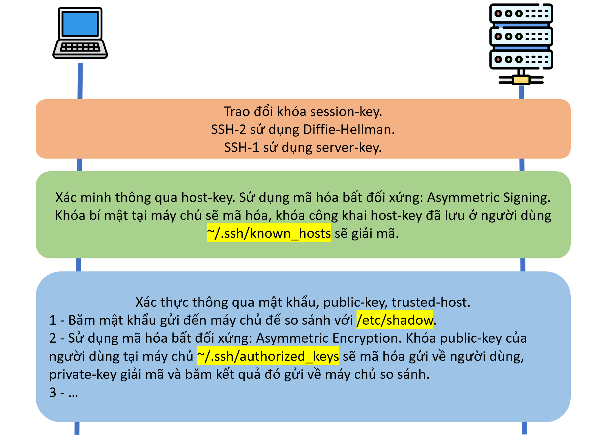
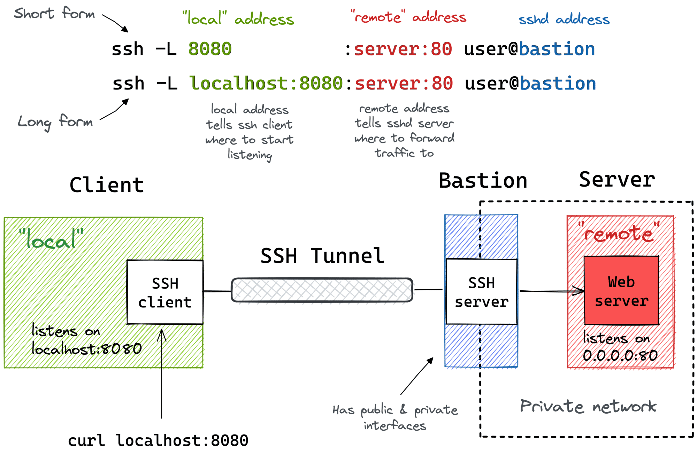

[Phần 2 - Tổng quan về kiến trúc Linux](https://github.com/volehuy1998/network-onboard/blob/master/README.md)

- [2.1 - Linux Kernel (UPDATED 21/01/2024)](https://github.com/volehuy1998/network-onboard/blob/master/linux-onboard/2.1%20-%20linux-arch-onboard.md#linux_kernel)
  - 2.1.1 - Vai trò của Linux Kernel (UPDATED 21/01/2024)
  - 2.1.2 - Tổng quan về Interrupt - Ngắt (UPDATED 05/09/2023)
- [2.2 - Quản lý người dùng và nhóm (UPDATED 17/09/2023)](https://github.com/volehuy1998/network-onboard/blob/master/linux-onboard/2.2%20-%20linux-user-management.md#user_and_group)
  - 2.2.1 - Khái niệm `User` (UPDATED 17/09/2023)
  - 2.2.2 - Khái niệm về nhóm, chính và phụ (UPDATED 12/09/2023)
  - 2.2.3 - Thay đổi tài khoản người dùng (UPDATED 13/09/2023)
  - 2.2.4 - Các thao tác quản lý trên người dùng và nhóm(UPDATED 11/09/2023)
  - 2.2.5 - Hạn chế quyền truy cập người dùng (UPDATED 13/09/2023)
  - 2.2.6 - Cấp quyền `sudo` tự do (UPDATED 11/09/2023)
  - 2.2.7 - Cấp quyền `sudo` với lệnh cụ thể (UPDATED 11/09/2023)
- [2.3 - Hệ thống tệp tin ( :arrow_up: UPDATED 07/01/2024)](https://github.com/volehuy1998/network-onboard/blob/master/linux-onboard/2.3%20-%20linux-file-system-overview.md#fs)
  - 2.3.1 - Phân cấp hệ thống tệp tin (UPDATED 26/08/2023)
  - 2.3.2 - RPM Package và phân loại (UPDATED 24/08/2023)
  - 2.3.3 - Kernel RPM Package (UPDATED 24/08/2023)
  - 2.3.4 - Tổng quan về quyền trên tệp tin (UPDATED 07/01/2024)
    - 2.3.4.1 - Quản lý quyền tệp tin (UPDATED 13/09/2023)
    - 2.3.4.2 - Quyền đặc biệt dành cho chủ sở hữu (SUID) và lỗ hổng leo thang đặc quyền (UPDATED 10/09/2023)
    - 2.3.4.3 - Quyền đặc biệt dành cho nhóm (UPDATED 10/09/2023)
    - 2.3.4.4 - Quyền đặc biệt Sticky bit (UPDATED 04/09/2023)
  - 2.3.5 - Xác định hệ thống tệp tin và thiết bị (UPDATED 07/11/2023)
- [2.4 - Tổng quan tiến trình Linux (UPDATED 04/10/2023)](https://github.com/volehuy1998/network-onboard/blob/master/linux-onboard/2.4%20-%20linux-process-overview.md#linux_process)
  - 2.4.1 - Trạng thái của tiến trình Linux (UPDATED 17/09/2023)
  - 2.4.2 - Kiểm soát các `Job` (UPDATED 04/10/2023)
  - 2.4.3 - Kết thúc tiến trình (UPDATED 18/09/2023)
  - 2.4.4 - Dịch vụ hạ tầng (UPDATED 21/09/2023)
  - 2.4.5 - Tổng quan về `systemd` (UPDATED 30/09/2023)
  - 2.4.6 - Kiểm soát dịch vụ hệ thống (UPDATED 04/10/2023)
  - 2.4.7 - Mẫu `unit` với ký hiệu `@` (UPDATED 04/10/2023)
  - 2.4.8 - Chi tiết tệp `unit` (UPDATED 04/10/2023)
    - 2.4.8.1 - Loại `unit` phổ biến `*.service` (UPDATED 03/10/2023)
    - 2.4.8.2 - Loại `unit` về `*.socket` (UPDATED 30/09/2023)
    - 2.4.8.3 - Loại `unit` về `*.path` (UPDATED 30/09/2023)
- [2.5 - Điều khiển an toàn từ xa (UPDATED 31/12/2023)](#remote_connection)
  - [2.5.1 - Tổng quan về kiến trúc giao thức `SSH` (UPDATED 31/12/2023)](#ssh_protocol)
    - [2.5.1.1 - Kiến trúc giao thức `SSH` (UPDATED 22/10/2023)](#ssh_arch)
    - [2.5.1.2 - Những xem xét bảo mật về khía cạnh truyền dẫn (UPDATED 19/10/2023)](#secu_in_transport)
    - [2.5.1.3 - Những xem xét bảo mật về khía cạnh xác thực (UPDATED 19/10/2023)](#secu_in_auth)
    - [2.5.1.4 - Giao thức `SSH-1`, `SSH-2` và sự cải tiến (UPDATED 22/10/2023)](#ssh1_2)
  - [2.5.2 - Cài đặt `OpenSSH`, kết nối và cấu hình (UPDATED 23/10/2023)](#openssh_overview)
    - [2.5.2.1 - Sử dụng công cụ cơ bản (UPDATED 19/10/2023)](#openssh_basic)
    - [2.5.2.2 - Thông tin về `finger print` tại máy khách và máy chủ (UPDATED 19/10/2023)](#show_finger_print)
    - [2.5.2.3 - Hành vi xử lý chuẩn kết nối đến máy chủ (UPDATED 19/10/2023)](#std_prac_ssh)
    - [2.5.2.4 - Cấu hình `ssh client` (UPDATED 21/10/2023)](#ssh_client_config)
    - [2.5.2.5 - Sử dụng `X11 Forwarding` và `Port Forwarding` (UPDATED 23/10/2023)](#x11_port_forwarding)
- [2.6 - Tổng quan về quản lý mạng (UPDATED 05/11/2023)](https://github.com/volehuy1998/network-onboard/blob/master/linux-onboard/2.6%20-%20linux-network-overview.md#network_manage)
  - 2.6.1 - Mô hình `TCP/IP` (UPDATED 25/10/2023)
  - 2.6.2 - Mô tả về `Network Interface` (UPDATED 01/11/2023)
  - 2.6.3 - Địa chỉ `v4` (UPDATED 25/10/2023)
  - 2.6.4 - Địa chỉ `v6` (UPDATED 25/10/2023)
  - 2.6.5 - Thông tin về `network interface`(UPDATED 25/10/2023)
  - 2.6.6 - Công cụ quản lý `nmcli`(UPDATED 05/11/2023)
  - 2.6.7 - Cấu hình và quản lý `hostname`(UPDATED 05/11/2023)
- [2.7 - Kiến trúc nhật ký hệ thống (UPDATED 17/12/2023)](https://github.com/volehuy1998/network-onboard/blob/master/linux-onboard/2.7%20-%20linux-system-log-architecture-overview.md#sys_log_arch)
  - 2.7.1 - Tổng quan (UPDATED 03/12/2023)
  - 2.7.2 - Cách sử dụng `rsyslog` (UPDATED 06/12/2023)
  - 2.7.3 - Cách sử dụng `systemd-journald` (UPDATED 10/12/2023)
  - 2.7.4 - Đồng bộ thời gian (UPDATED 17/12/2023)
    - 2.7.4.1 - Tổng quan `Network Time Protocol` (UPDATED 17/12/2023)
    - 2.7.4.2 - Công cụ `datetimectl` (UPDATED 10/12/2023)
    - 2.7.4.3 - Cấu hình `NTP` sử dụng `chrony` (UPDATED 17/12/2023)
    - 2.7.4.4 - Cấu hình `NTP` sử dụng `ntpd` (UPDATED 10/12/2023)
- [2.8 - Lập lịch chạy cho tác vụ tương lai (UPDATED 01/01/2024)](https://github.com/volehuy1998/network-onboard/blob/master/linux-onboard/2.8%20-%20linux-job-scheduler.md#schedule_job)
  - 2.8.1 - Tổng quan (UPDATED 24/12/2023)
  - 2.8.2 - Cách sử dụng công cụ `at` (UPDATED 24/12/2023)
  - 2.8.3 - Cách sử dụng công cụ `cron` (UPDATED 24/12/2023)
  - 2.8.4 - Ứng dụng `systemd timer` (UPDATED 01/01/2024)
    - 2.8.4.1 - Cách sử dụng công cụ `systemd timer` (UPDATED 01/01/2024)
    - 2.8.4.2 - Quản lý loại tệp tạm thời (UPDATED 01/01/2024)
      - 2.8.4.2.1 - Cách sử dụng `systemd-tmpfiles --create` (UPDATED 01/01/2024)
      - 2.8.4.2.2 - Cách sử dụng `systemd-tmpfiles --clean` (UPDATED 01/01/2024)
      - 2.8.4.2.3 - Cách sử dụng `systemd-tmpfiles --remove` (UPDATED 01/01/2024)
- [2.9 - Quản lý tệp đóng gói và nén với công cụ `tar` (UPDATED 09/02/2024)](https://github.com/volehuy1998/network-onboard/blob/master/linux-onboard/2.9%20-%20linux-manage-compressed-tar-archives.md#manage_compress_tar_archive)
    - 2.9.1 - Tạo và quản lý tệp đóng gói (UPDATED 09/02/2024)
    - 2.9.2 - Tạo và quản lý tệp nén đóng gói (UPDATED 15/01/2024)
    - 2.9.3 - Quản lý tệp sao lưu gia tăng `incremental backup` (UPDATED 15/01/2024)
    - 2.9.4 - Chuyển tệp giữa các hệ thống một cách an toàn (UPDATED 15/01/2024)
    - 2.9.5 - Đồng bộ giữa các hệ thống một cách an toàn (UPDATED 15/01/2024)
- [2.10 - Quản lý `SELinux` (UPDATED 28/01/2024)](https://github.com/volehuy1998/network-onboard/blob/master/linux-onboard/2.10%20-%20linux-se-mode.md#selinux_manage)
    - 2.10.1 - Kiến trúc `SELinux` (UPDATED 27/01/2024)
    - 2.10.2 - Sử dụng `SELinux` cơ bản với chính sách `targeted` (UPDATED 28/01/2024)
      - 2.10.2.1 - Xem nhãn, kích hoạt và vô hiệu hóa `SELinux` (UPDATED 28/01/2024)
      - 2.10.2.2 - Xem định nghĩa chính sách `SELinux` (UPDATED 27/01/2024)
      - 2.10.2.3 - Auditing hành vi hệ thống (UPDATED 28/01/2024)
      - 2.10.2.4 - Kiểm soát `fcontext` với nhãn sẵn có (UPDATED 27/01/2024)
      - 2.10.2.5 - Kiểm soát `port` với nhãn sẵn có (UPDATED 27/01/2024)
      - 2.10.2.6 - Kiểm soát chính sách với  `boolean` (UPDATED 27/01/2024)
- [2.11 - Quản lý lưu trữ cơ bản ( :arrow_up: UPDATED 07/02/2024)](https://github.com/volehuy1998/network-onboard/blob/master/linux-onboard/2.11%20-%20linux-manage-basic-storage.md#manage_basic_storage)
    - 2.11.1 - Khái niệm phân vùng ổ cứng ( :heavy_plus_sign: UPDATED 05/01/2024)
    - 2.11.2 - Quản lý phân vùng theo định dạng ( :heavy_plus_sign: UPDATED 05/01/2024)
      - 2.11.2.1 - Quản lý phân vùng định dạng MBR ( :arrow_up: UPDATED 07/02/2024)
      - 2.11.2.2 - Quản lý phân vùng định dạng GPT ( :heavy_plus_sign: UPDATED 05/01/2024)
    - 2.10.3 - Tạo tệp hệ thống ( :heavy_plus_sign: UPDATED 05/01/2024)
    - 2.10.4 - Mount tệp hệ thống ( :heavy_plus_sign: UPDATED 05/01/2024)
      - 2.10.4.1 - Mount thủ công tệp hệ thống ( :heavy_plus_sign: UPDATED 05/01/2024)
      - 2.10.4.2 - Mount tự vĩnh viễn tệp hệ thống ( :heavy_plus_sign: UPDATED 05/01/2024)
    - 2.10.5 - Quản lý không gian `Swap` ( :heavy_plus_sign: UPDATED 05/01/2024)
      - 2.10.5.1 - Khái niệm không gian `Swap` ( :heavy_plus_sign: UPDATED 05/01/2024)
      - 2.10.5.2 - Tạo phân vùng `swap` ( :heavy_plus_sign: UPDATED 05/01/2024)
- [2.12 - Quản lý lưu trữ nâng cao ( :heavy_plus_sign: UPDATED 09/02/2024)](https://github.com/volehuy1998/network-onboard/blob/master/linux-onboard/2.12%20-%20linux-manage-advance-storage.md#manage_advance_storage)
  - 2.12.1 - Tổng quan Logical Volume Manager (LVM) ( :heavy_plus_sign: UPDATED 09/02/2024)
  - 2.12.2 - Xây dựng hệ thống lưu trữ LVM ( :heavy_plus_sign: UPDATED 09/02/2024)
  - 2.12.3 - Tạo Logical Volume tính năng nén và chống trùng lặp ( :heavy_plus_sign: UPDATED 09/02/2024)
          
## <a name="remote_connection"></a>Điều khiển an toàn từ xa
Việc truy cập máy tính từ xa đã trở thành một sự cần thiết từ rất lâu bởi vì nhưng chính sách an toàn bảo mật áp dụng lên máy tính này. Có nhiều cách thiết lập kết nối từ xa tùy thuộc vào hiệu điều hành mà người dùng đang sử dụng, có `2` trong số các giao thức phổ biến nhất là:

- `SSH (Secure Shell)` dành cho `Linux`.
- `RDP (Remote Desktop Protocol)` dành cho `Windows`.

Một số điều kiện tiên quyết để thiết lập kết nối từ xa:

- Máy tính được kết nối phải luôn trong tình trạng đang chạy và có kết nối mạng.
- Phần mềm kết nối phải được cài đặt.
- Người dùng phải được cấp quyền để có thể kết nối.

### <a name="ssh_protocol"></a>Tổng quan về kiến trúc giao thức `SSH`

`SSH (Secure Shell)` là một giao thức cho phép truy cập từ xa một cách an toàn hoặc một số dịch vụ mạng khác như truyền dữ liệu tệp tin, ... được phát minh bởi nhà khoa học máy tính [Tatu Ylönen](https://ylonen.org/index.html) người Phần Lan tại [Trường Đại học Bách Khoa Helsinki](https://www.helsinki.fi/en).

Bối cảnh ý tưởng nảy sinh sau khi mạng lưới trường đại học là nạn nhân trong việc tấn công nghe lén mật khẩu vào đầu năm 1995, `Ylönen` đã tự mình lập trình nên `SSH-1`. Tháng 7 cùng năm ông đã phát hành `SSH-1` dưới dạng miễn phí có kèm mã nguồn. Vào cuối năm 1995 ước tính có hơn 20.000 người dùng trên 50 quốc gia đã sử dụng `SSH-1`, vào thời điểm này `Ylönen` đã quyết định thành lập công ty [SSH Communications Security, Ltd., (SCS)](https://www.ssh.com/) để duy trì, hỗ trợ, tiếp tục phát triển và thương mại hóa. Song song đó ông cũng đã viết bản thảo tài liệu giao thức `SSH-1`. 

Một số vấn đề và hạn chế đã được tìm thấy nhưng chúng không thể sửa chữa, vì thế năm 1996 công ty của ông đã giới thiệu phiên bản mới `SSH-2` với mô tả rằng hỗ trợ nhiều thuật toán hơn và điểm quan trọng là nó không tương thích với `SSH-1`. Đáp lại màn giới thiệu này, tổ chức `Internet Engineering Task Force (IETF)` đã thành lập nhóm `SECSH (Secure Shell)` để chuẩn hóa hơn cho giao thức. Vào tháng 2/1997 nhóm `SECSH` đã đệ trình bản thảo giao thức `SSH-2` để `IETF` xem xét, sau đó gửi đến biên tập viên `RFC` để xuất bản. 

Năm 1998, `SCS` phát hành sản phẩm phần mềm `SSH Secure Shell (SSH2)`. `SSH-2` chỉ miễn phí đối với tổ chức giáo dục. Cuối năm 2000, `SCS` đã mở rộng giấy phép sử dụng phần mềm để cho phép sử dụng miễn phí cho cá nhân, một số hệ điều hành như `Linux`, `NetBSD`, `FreeBSD`, ... Vào thời điểm đó, phần mềm [OpenSSH](https://www.openssh.com/) đã trở nên nổi bật khi triển khai nhánh chóng từ nhánh phiên bản cuối cùng của `SSH-1` là `v1.2.12`, nó được phát triển dựa trên sự bảo trợ của `OpenBSD` và miễn phí cho tất cả mọi người. Mặc dù có nhiều đóng góp vào `OpenSSH` nhưng phần lớn là của lập trình viên [Markus Friedl](https://wwwcip.informatik.uni-erlangen.de/~msfriedl/) người Đức.

Các mật mã được sử dụng:

- `Asymmetric cryptography`: hệ mật mã bất đối xứng, một cặp khóa công khai và bí mật tương thích với nhau. Nhược điểm, chỉ mã hóa có kích thước xác định. Ưu điểm, từ khóa công khai rất khó suy ra được khóa bí mật. Có `2` cách sử dụng:

  - `Asymmetric encryption`: sử dụng khóa công khai để mã hóa, khóa bí mật để giải mã.
  - `Asymmetric signing`: hoán đổi vai trò giữa 2 khóa, khóa bí mật để mã hóa còn khóa công khai giải mã.

- `Symmetric cryptography`: hệ mật mã đối xứng, chỉ có một khóa duy nhất để thực hiện 2 công việc mã hóa và giải mã. Ưu điểm, mã hóa nhanh với độ dài tùy ý. Nhược điểm, dễ bị đánh cắp nên thường được hộ tống bởi `asymmetric cryptography`.

- `Hash cryptography`: hàm băm, dữ liệu với độ dài tùy ý có đầu ra kích thước cố định. Ưu điểm, không thể tìm dữ liệu gốc từ kết quả băm. Nhược điểm, nhiều đầu vào có thể giống nhau về đầu ra nhưng xác suất là rất nhỏ.

Kiến trúc giao thức bao gồm `4` cấu tạo chính:

- `Security Properties`: sự minh bạch, mục đích của giao thức `SSH` là cải thiện tính bảo mật của tất cả dịch vụ mà nó có thể được áp dụng trên môi trường mạng kém an toàn ngày nay.
  
  - Tất cả thuật toán mã hóa, toàn vẹn, ... được sử dụng đều là các công trình khoa học nổi tiếng, phổ biến và được công nhận bởi tổ chức uy tín.
  - Tất cả thuật toán mật mã đều sử dụng kích thước khóa phù hợp và đủ dài được cho là có thể bảo vệ thậm chí chống lại những kẻ giỏi nhất trong các trường hợp tấn công trong nhiều thập kỷ qua.
  - Tất cả thuật toán đều được đàm phán để đi đến nhất trí giữa các bối cảnh khác nhau, vì trong một số trường hợp thuật toán được cho là lỗi thời, kém an toàn thì có thể dễ dàng chuyển sang thuật toán khác một cách tự động, đương nhiên nếu không có thuật toán nào phù hợp giữa gói phần mềm cài đặt trên máy chủ và người dùng thì không có kết nối nào được tạo.

- `Host key`: khóa công khai được sinh ra tại máy chủ, nhiều máy chủ có thể sử dụng chung khóa này. Về mục đích cơ bản để chắc chắn rằng sự kết nối đang diễn ra đúng nơi mong muốn, tránh khỏi tai nạn truyền dữ liệu đến sai chỗ, ví dụ như trường hợp `man in the middle` làm giả `DNS (Domain Name System)` và đứng giữa đánh lừa cả 2 bên để đọc tất cả lưu lượng truy cập, ... `Host key` sẽ thông qua quá trình băm tiêu chuẩn - `Secure Hash Standard (SHS)` để tạo thành `finger print` là cái rất khó giả mạo được sử dụng cho việc so sánh trước khi người dùng chấp nhận `host key`, quy trình băm này được công bố bởi Viện Tiêu chuẩn và Công nghệ Quốc gia Hoa Kỳ, viết tắt [NIST (US National Institute of Standards and Technology)](https://www.nist.gov/). `Host key` được gửi đến ở dạng xin cấp phép để lưu vào máy người dùng chỉ khi lần đầu kết nối, khi nhận được câu hỏi này người dùng cần tìm đến quản trị viên để xác nhận `finger print` đang hiện diện trên màn hình rằng nó có thuộc về máy chủ của tổ chức. Ở những lần kết nối sau thì ứng dụng `ssh` phía người dùng sẽ tự động sử dụng `host key` để giải mã thông điệp xác thực đã được mã hóa bởi `private key` trên máy chủ.

- `Extensibility`: khả năng mở rộng, tác giả tin rằng giao thức này cần được mở rộng vì một số tổ chức lớn muốn sử dụng riêng các thuật toán xác thực, mã hóa, phương pháp trao đổi khóa, ... của chính họ tạo ra.

- `Policy Issues`: các vấn đề về chính sách

  - Thuật toán mã hóa, toàn vẹn, nén phải được chỉ định sự ưu tiên, ví dụ mỗi danh mục mặc định sẽ ưu tiên thứ tự đầu tiên.
  - Phương pháp xác thực được yêu cầu bởi máy chủ trên tất cả các tài khoản người dùng. Chính sách trên máy chủ cho phép áp dụng nhiều phương pháp xác thực cho một hoặc tất cả người dùng.
  - Những việc vận hành mà người dùng được cho phép trên giao thức kết nối. Một số vấn đề liên quan đến bảo mật, ví dụ: không nên cho phép máy chủ thực thi lệnh ngược lại vào máy người dùng, ...

#### <a name="secu_in_transport"></a>Những xem xét bảo mật về khía cạnh truyền dẫn
- `Privacy`, `Confidentiality`: tính bí mật, dữ liệu thật sự được mã hóa thông qua mật mã đối xứng.

  - Tại thời điểm viết tài liệu tiêu chuẩn phiên bản đầu tiên `RFC-4251` thì các mật mã đối xứng thường được sử dụng là `Triple-DES (3DES)`, `DES`, `IDEA`, `Blowfish`, ... nhưng sau đó vào tháng 11/2001 thì `AES (Advanced Encryption Standard)` đã được công bố bởi `NIST` và cộng đồng mật mã đã chấp nhận `AES`. Như thường lệ thì người triển khai nên cập nhật tin tức thường xuyên để đảm bảo rằng gần đây không xảy ra lỗ hổng nào trong các mật mã, theo đặc tính mở rộng kể trên của giao thức `SSH` thì các tổ chức, doanh nghiệp có thể tùy chọn mật mã khác mà họ tin tưởng ngoài `AES`. Dữ liệu không được mã hóa chỉ xảy ra khi người triển khai không áp dụng loại mật mã nào `(none cipher)` trong lúc `debug` thông tin và tùy chọn này không nên được sử dụng ngoại trừ mục đích đó.
  - Chế độ mã hóa của mật mã đối xứng là `CBC (Cipher Block Chaining)` và `CTR (Short For Counter)`, đây là các loại mà chúng ưu việt hơn `ECB (Electronic Code Book)`. Có 2 tài liệu mô tả rõ ràng về điểm yếu trong cách vận hành của `CBC` của một số mật mã nhất định là [Applied Cryptography (Bruce Schneier)](https://github.com/volehuy1998/Crypto-Document/blob/master/Ti%E1%BA%BFng%20Anh%20-%20Bruce%20Schneier%20-%20Applied%20Cryptography.pdf) và [Network Security (Charlie Kaufman)](https://github.com/volehuy1998/Crypto-Document/blob/master/Ti%E1%BA%BFng%20Anh%20-%20Charlie%20Kaufman%20-%20Network%20Security%20Private%20Communication%20in%20a%20Public%20World.pdf), tuy nhiên nếu chọn kích thước khối hay độ dài khóa có giá trị lớn thì việc tấn công sẽ rất khó khăn nếu không muốn nói là bất khả thi. Thêm vào đó nếu các gói tin thuộc loại `SSH_MSG_IGNORE` được chèn vào sẽ giúp giảm thiểu các cuộc tấn công nhằm vào `CBC mode`, các gói này được biết đến như nhịp tim được sinh ra với tên gọi `null packet` để giữ cho phiên làm việc hoạt động xuyên suốt.

- `Data Integrity`: tính toàn vẹn dữ liệu để chắn chắn nó không bị thay đổi, khía cạnh dữ liệu được mô tả là gói tin hoặc những gói tin trong phiên làm việc. Mặc dù giao thức `SSH` dựa trên cơ sở `TCP` là giao thức được biết đến đã đính kèm tính năng thực hiện kiểm tra tính toàn vẹn trên "mỗi gói" để phát hiện thay đổi do sự cố mạng như: nhiễu tín hiệu điện làm thay đổi giá trị tín hiệu, mất gói tin do lưu lượng quá lớn, ... Nhưng những tính năng này của `TCP` không hiệu quả trước thủ đoạn giả mạo tinh vi như kỹ thuật `replay attack`, tức chèn thêm gói tin vào phiên. Kẻ tấn công không cần phải sửa đổi hay nổ lực giải mã lưu lượng dữ liệu mà chỉ cần sao chép lại tất cả các tín hiệu `bit` và phát lại chính xác chúng vào trong phiên làm việc hiện tại của nạn nhân (vì mỗi phiên sẽ có định danh riêng nên việc tấn công phát lại vào phiên mới sẽ không được chấp nhận), việc này là vấn đề nghiêm trọng nếu đó là lệnh xóa, ... Rõ ràng việc kiểm tra tính toàn vẹn nên được áp dụng ở quy mô lớn hơn, cụ thể là trên "toàn bộ gói" hay luồng dữ liệu và đảm bảo không được trùng lặp. Trong lịch sử `SSH-1` sử dụng phương pháp kiểm tra không được đánh giá cao là `CRC-32`, phiên bản sau `SSH-2` được thay thế bằng `SHA` kết hợp với `HMAC`.

- `Traffic Analysis`: phân tích lưu lượng, giám sát lưu lượng ở bất kỳ giao thức nào cũng có thể mang lại cho kẻ tấn công những thông tin hữu ích như phiên làm việc, giao thức cụ thể, ... Ví dụ tài liệu [SSH Traffic Analysis Attacks (Solar Designer)](https://www.slideshare.net/dugsong/ssh-traffic-analysis-attacks) và [Timing Analysis of Keystrokes and SSH Timing Attacks (Dawn Xiaodong Song)](https://sites.cs.ucsb.edu/~bultan/courses/595-F16/Week2.PDF) đã chứng minh được việc phân tích lưu lượng của phiên `SSH` có thể mang lại thông tin về độ dài mật khẩu.

<div style="text-align:center"></div>

#### <a name="secu_in_auth"></a>Những xem xét bảo mật về khía cạnh xác thực
Những xem xét bảo mật về khía cạnh xác thực `(authentication)` và ủy quyền `(authorization)`:

- Cách thức xác thực: mỗi kết nối `SSH` đều có chính xác `2` lần xác thực

  - Xác thực đầu: người dùng xác minh danh tính của máy chủ hay gọi là `server authentication` dựa trên `host key` như mô tả phía trên.
  - Xác thực cuối: máy chủ xác minh danh tính của người dùng đang gửi yêu cầu truy cập, gọi tắt là `user authentication`. Truyền thống xác thực thường sẽ là mật khẩu và bị đánh giá là kém an toàn vì thường dễ dàng ghi nhớ thì người dùng sẽ cài đặt nó có ý nghĩa theo cách nào đó và điểm quan trọng là nó ngắn gọn, tuy nhiên đây là tính năng vượt trội so với thế hệ `telnet` tiền nhiệm. Thay vì sử dụng mật khẩu, `SSH` cung cấp cơ chế khác mạnh mẻ và dễ quản lý hơn: chữ ký số. Ngoài ra `SSH` hỗ trợ thêm `PAM (Pluggable Authentication Modules)`, `Kerberos`, `S/Key one-time passwords`, ...

  , máy chủ có thể đặt ra giới hạn khi yêu cầu truy cập của người dùng liên tiếp thất bại.

- `Authorization`: chính sách này sẽ áp dụng ngay khi việc xác thực thành công vì đơn giản rằng hệ thống không thể cấp quyền khi chưa biết rõ chức vụ, danh tính người kết nối. Quản trị viên được khuyến khích triển khai các chính sách an ninh nói chung, dành cho cụ thể người dùng nói riêng. Thiết lập chính sách thắt chặt an ninh mô tả rằng những gì có thể làm hoặc không thể làm. `SSH` có nhiều cách khác nhau để hạn chế hành vi của người dùng như: chuyển tiếp khóa bí mật `(key agent forwarding)`, ... Việc kiểm soát có thể triển khai ở cấp độ toàn cục hoặc cụ thể người dùng, và chúng có liên quan đến cơ chế xác thực `(user authentication)`.

#### <a name="ssh1_2"></a>Giao thức `SSH-1`, `SSH-2` và sự cải tiến

Các khóa được sử dụng trong `SSH-1`:

| Tên | Vòng đời | Tạo bởi | Loại hình | Mục đích |
| --- | --- | --- | --- | --- |
| `User key` | Xuyên suốt quá trình sử dụng | Người dùng | `Public key` | Xác minh danh tính tài khoản truy cập máy chủ |
| `Session key` | Trong phiên kết nối | Người dùng và máy chủ | `Secret key` | Mã hóa dữ liệu trung chuyển |
| `Host key` | Xuyên suốt quá trình sử dụng | Quản trị viên | `Public key` | Xác minh danh tính máy chủ từ người dùng |
| `Server key` | Một tiếng | Máy chủ | `Public key` | Bảo vệ `session key` |

- `Server key` là một khóa tạm thời chỉ được sử dụng trong giao thức `SSH-1` và `OpenSSH/1`, . Nó được tái tạo tự động bởi máy chủ dựa trên chu kỳ, mặc định `1` tiếng và có thể điều chỉnh. `Server key` sẽ bảo vệ `session key` để thiết lập kênh liên lạc an toàn. Thông thường `server key` sẽ bị nhầm lẫn với `host key`, khóa này không được mô tả rõ ràng về việc nơi tồn tại trên ổ cứng.

- `Session key` được sinh ra tại người dùng, nó được mã hóa kép bởi `host key` và `server key` khi trung chuyển đến máy chủ. Cụ thể hơn là `Encrypt(ServerK,Encrypt(HostK, SessionK))`.

<u>Lưu ý</u>: `server key` và `Diffie-Hellman` được ứng dụng dựa trên thuật ngữ `Perfect Forward Secrecy` , tức việc yếu tố bí mật dài hạn (ví dụ khóa bí mật tại máy chủ) bị rò rỉ cũng không làm ảnh hưởng đến `session key`.

Sự cải tiến trong `SSH-2` so với `SSH-1`:

| `SSH-1` | `SSH-2` |
| --- | --- |
| Không `module` hóa | Đã chia ra thành các phần: `connection`, `transport` và `authentication`. |
| Kiểm tra tính toàn vẹn yếu vì sử dụng `CRC-32` | Sử dụng các thuật toán tốt hơn như `HMAC` kết hợp với `SHA` để bảo vệ dữ liệu trong phiên. |
| Ít thuật toán để đàm phán | Hỗ trợ nhiều thuật toán đàm phán hơn chia theo hạng mục: nén, trao đổi khóa, mã hóa, xác thực, băm. |
| Chỉ có phương pháp xác thực: `public-key (RSA only)` | Mở rộng thêm `DSA` và `PGP`. |
| Sử dụng `server key` để bảo vệ `session key` | Sử dụng `Diffie-Hellman`. |
| Không | Hỗ trợ xác thực qua chứng chỉ. |
| Không | Đổi `session key` theo chu kỳ. |

### <a name="openssh_overview"></a>Cài đặt `OpenSSH`, kết nối và cấu hình
#### <a name="openssh_basic"></a>Sử dụng công cụ cơ bản
Thực hiện cài đặt `OpenSSH` trên máy chủ:
```shell
[root@server ~]# yum install openssh-server -y
Loaded plugins: fastestmirror
Loading mirror speeds from cached hostfile
 * base: mirrors.nhanhoa.com
 * epel: mirror.01link.hk
 * extras: mirrors.nhanhoa.com
 * updates: mirrors.nhanhoa.com
Package openssh-server-7.4p1-23.el7_9.x86_64 already installed and latest version
Nothing to do
[root@server ~]#
```
Kiểm tra phiên bản hiện hành trên máy chủ:
```shell
[root@server ~]# sshd --help
unknown option -- -
OpenSSH_7.4p1, OpenSSL 1.0.2k-fips  26 Jan 2017
usage: sshd [-46DdeiqTt] [-C connection_spec] [-c host_cert_file]
            [-E log_file] [-f config_file] [-g login_grace_time]
            [-h host_key_file] [-o option] [-p port] [-u len]
[root@server ~]#
```
, hoặc có thể sử dụng `telnet` từ máy người dùng:
```shell
[root@huyvl-linux-training ~]# grep server /etc/hosts
10.10.1.168 server
[root@huyvl-linux-training ~]# telnet server 22
Trying 10.10.1.168...
Connected to server.
Escape character is '^]'.
SSH-2.0-OpenSSH_7.4

Protocol mismatch.
Connection closed by foreign host.
[root@huyvl-linux-training ~]#
```
Kiểm tra phiên bản hiện hành trên máy người dùng:
```shell
[root@huyvl-linux-training ~]# ssh
-bash: ssh: command not found
[root@huyvl-linux-training ~]# yum install openssh-clients -y
Loaded plugins: fastestmirror
Loading mirror speeds from cached hostfile
 * base: mirrors.nhanhoa.com
 * epel: mirror.01link.hk
 * extras: mirrors.nhanhoa.com
 * updates: mirrors.nhanhoa.com
Resolving Dependencies
--> Running transaction check
---> Package openssh-clients.x86_64 0:7.4p1-23.el7_9 will be installed
--> Finished Dependency Resolution

Dependencies Resolved

=================================================================================================
 Package                    Arch              Version                   Repository          Size
=================================================================================================
Installing:
 openssh-clients            x86_64            7.4p1-23.el7_9            updates            655 k

Transaction Summary
=================================================================================================
Install  1 Package

Total download size: 655 k
Installed size: 2.5 M
Downloading packages:
openssh-clients-7.4p1-23.el7_9.x86_64.rpm                                 | 655 kB  00:00:00
Running transaction check
Running transaction test
Transaction test succeeded
Running transaction
  Installing : openssh-clients-7.4p1-23.el7_9.x86_64                                         1/1
  Verifying  : openssh-clients-7.4p1-23.el7_9.x86_64                                         1/1

Installed:
  openssh-clients.x86_64 0:7.4p1-23.el7_9

Complete!
[root@huyvl-linux-training ~]# ssh -V
OpenSSH_7.4p1, OpenSSL 1.0.2k-fips  26 Jan 2017
[root@huyvl-linux-training ~]# echo ~ | nc localhost 22
SSH-2.0-OpenSSH_7.4
Protocol mismatch.
[root@huyvl-linux-training ~]#
```
Khi không chỉ định tài khoản thì mặc định sẽ kết nối với máy chủ có tài khoản tương ứng như sau:
```shell
[root@huyvl-linux-training ~]# ssh root@10.10.1.168
[root@huyvl-server ~]# exit
logout
Connection to 10.10.1.168 closed.
[root@huyvl-linux-training ~]# ssh 10.10.1.168
[root@huyvl-server ~]# useradd -m hcmoperator
[root@huyvl-server ~]# passwd hcmoperator
Changing password for user hcmoperator.
New password:
BAD PASSWORD: The password contains the user name in some form
Retype new password:
passwd: all authentication tokens updated successfully.
[root@huyvl-server ~]# exit
logout
Connection to 10.10.1.168 closed.
[root@huyvl-linux-training ~]# su - hcmoperator
Last login: Thu Oct 19 15:42:20 +07 2023 on pts/0
[hcmoperator@huyvl-linux-training ~]$ ssh 10.10.1.168
hcmoperator@10.10.1.168 password:
[hcmoperator@huyvl-server ~]$
```
Hoặc sử dụng tùy chọn `-l` để chỉ định tên tài khoản mà không cần sử dụng ký tự `@`:
```shell
[root@huyvl-linux-training ~]# ssh -l hcmoperator server
hcmoperator@server password:
[hcmoperator@huyvl-server ~]$ exit
logout
Connection to server closed.
[root@huyvl-linux-training ~]#
```
Thực thi lệnh từ xa mà không cần dấu nhắc `shell` như sau:
```shell
[root@huyvl-linux-training ~]# ssh server ls -al
total 44
dr-xr-x---.  4 root root 4096 Oct 19 15:13 .
dr-xr-xr-x. 18 root root 4096 Oct 22 10:44 ..
-rw-------   1 root root 4299 Oct 22 23:01 .bash_history
-rw-r--r--.  1 root root   18 Dec 29  2013 .bash_logout
-rw-r--r--.  1 root root  176 Dec 29  2013 .bash_profile
-rw-r--r--.  1 root root  387 May 17 16:53 .bashrc
-rw-r--r--.  1 root root  100 Dec 29  2013 .cshrc
drwxr-----.  3 root root 4096 May 17 16:11 .pki
drwx------   2 root root 4096 Oct 22 18:17 .ssh
-rw-r--r--.  1 root root  129 Dec 29  2013 .tcshrc
[root@huyvl-linux-training ~]#
```
Sử dụng `Single Sign-On (SSO)` như sau:
```shell
[root@huyvl-linux-training ~]# grep server /etc/hosts
10.10.1.168 server
[root@huyvl-linux-training ~]# ssh server
[root@huyvl-server ~]# ssh-add -L
Could not open a connection to your authentication agent.
[root@huyvl-server ~]# exit
logout
Connection to server closed.
[root@huyvl-linux-training ~]# ssh server -A
[root@huyvl-server ~]# ssh-add -L
ssh-rsa AAAAB3NzaC1yc2EAAAADAQABAAABgQClzuZw92uV872b1N7Rpa3J51xi/nUS+for49aEWvJnSN0X8eMWamib09adSe9ZE2NaTcykArG5wJr6VqkQ6etvTxC1Cd+sIQm1Wp0jIb9is6VwbkDYJQNqJqGl4yocLMw5ooEWj3FxhTb6zHkDwqP4zXzBr+IlbpYNI+BQZMdKeUc8PMQFn21ttDYqT+tAW7SM/9i4t7GKhAeo3IEhXFP8Y/sLzo0Tzb5kazxi/7sywZoQS7sES4fXrNPfCJ14dk4JfL4UDfg6zQ6RYKG6/hCDshMaeyp898FyF/MLNnG6oXuY2zJOROyQrzwnzg5sMy60DJaBqvFyyN/Fi4sQX8NQkFuVx8sXnMQa1HbNX17z4n2yRsNRIpz5CGbxqehZpV7xkjsye3TThsUgXDTqozYjYQyOymLHvijSaMaf9ExAZZMuVY6s8AshQxtiQB1/KSCGC+u0NcYPQdxWhSx1J+GPT3qoEKUuMeDtLYnKskA1cg0i97NzhQk1BPYxHZ2vSKc= admin@SNG-PC-HUYVL3
[root@huyvl-server ~]# exit
logout
Connection to server closed.
[root@huyvl-linux-training ~]# ssh server -o ForwardAgent=yes
[root@huyvl-server ~]# ssh-add -L
ssh-rsa AAAAB3NzaC1yc2EAAAADAQABAAABgQClzuZw92uV872b1N7Rpa3J51xi/nUS+for49aEWvJnSN0X8eMWamib09adSe9ZE2NaTcykArG5wJr6VqkQ6etvTxC1Cd+sIQm1Wp0jIb9is6VwbkDYJQNqJqGl4yocLMw5ooEWj3FxhTb6zHkDwqP4zXzBr+IlbpYNI+BQZMdKeUc8PMQFn21ttDYqT+tAW7SM/9i4t7GKhAeo3IEhXFP8Y/sLzo0Tzb5kazxi/7sywZoQS7sES4fXrNPfCJ14dk4JfL4UDfg6zQ6RYKG6/hCDshMaeyp898FyF/MLNnG6oXuY2zJOROyQrzwnzg5sMy60DJaBqvFyyN/Fi4sQX8NQkFuVx8sXnMQa1HbNX17z4n2yRsNRIpz5CGbxqehZpV7xkjsye3TThsUgXDTqozYjYQyOymLHvijSaMaf9ExAZZMuVY6s8AshQxtiQB1/KSCGC+u0NcYPQdxWhSx1J+GPT3qoEKUuMeDtLYnKskA1cg0i97NzhQk1BPYxHZ2vSKc= admin@SNG-PC-HUYVL3
[root@huyvl-server ~]# exit
logout
Connection to server closed.
[root@huyvl-linux-training ~]# ssh server -o ForwardAgent=no
[root@huyvl-server ~]# ssh-add -L
Could not open a connection to your authentication agent.
[root@huyvl-server ~]#
```

#### <a name="show_finger_print"></a>Thông tin về `finger print` tại máy khách và máy chủ
Chỉ định thuật toán băm cần hiện diện ngay khi lần đầu tiên kết nối như sau:
```shell
[root@huyvl-linux-training ~]# ll .ssh/
total 4
-rw------- 1 root root 573 Oct 18 20:33 authorized_keys
[root@huyvl-linux-training ~]#
[root@huyvl-linux-training ~]# ssh 10.10.1.168
The authenticity of host '10.10.1.168 (10.10.1.168)' cant be established.
ECDSA key fingerprint is SHA256:UxV0dM6l2AEUvylhXd7dKYcBKxLB0qvvKcEsM3Wm6+E.
ECDSA key fingerprint is MD5:43:7c:5b:03:90:c2:4f:db:93:bb:57:85:44:ab:2a:76.
Are you sure you want to continue connecting (yes/no)? yes
Warning: Permanently added '10.10.1.168' (ECDSA) to the list of known hosts.
[root@huyvl-server ~]# exit
logout
Connection to 10.10.1.168 closed.
[root@huyvl-linux-training ~]# rm -rf .ssh/known_hosts
[root@huyvl-linux-training ~]# ssh -o FingerprintHash=sha256 10.10.1.168
The authenticity of host '10.10.1.168 (10.10.1.168)' cant be established.
ECDSA key fingerprint is SHA256:UxV0dM6l2AEUvylhXd7dKYcBKxLB0qvvKcEsM3Wm6+E.
Are you sure you want to continue connecting (yes/no)? yes
Warning: Permanently added '10.10.1.168' (ECDSA) to the list of known hosts.
[root@huyvl-server ~]# exit
logout
Connection to 10.10.1.168 closed.
[root@huyvl-linux-training ~]# rm -rf .ssh/known_hosts
[root@huyvl-linux-training ~]# ssh -o FingerprintHash=md5 10.10.1.168
The authenticity of host '10.10.1.168 (10.10.1.168)' cant be established.
ECDSA key fingerprint is MD5:43:7c:5b:03:90:c2:4f:db:93:bb:57:85:44:ab:2a:76.
Are you sure you want to continue connecting (yes/no)? yes
Warning: Permanently added '10.10.1.168' (ECDSA) to the list of known hosts.
[root@huyvl-server ~]#
```
Đôi khi sử dụng hình ảnh biểu diễn dưới dạng `ASCII` sẽ dễ nhận biết hơn nhiều so với chuỗi băm:
```shell
[root@huyvl-linux-training ~]# ll .ssh/
total 4
-rw------- 1 root root 573 Oct 18 20:33 authorized_keys
[root@huyvl-linux-training ~]# ssh -o VisualHostkey=yes -o FingerprintHash=md5 10.10.1.168
The authenticity of host '10.10.1.168 (10.10.1.168)' cant be established.
ECDSA key fingerprint is MD5:43:7c:5b:03:90:c2:4f:db:93:bb:57:85:44:ab:2a:76.
+---[ECDSA 256]---+
|     .  .o.  ..  |
|      o.o  .  .. |
|       +oo..o... |
|       .o.+o o. .|
|        S .o.  . |
|         ...  .  |
|        o E. .   |
|       . o. .    |
|           .     |
+------[MD5]------+
Are you sure you want to continue connecting (yes/no)? yes
Warning: Permanently added '10.10.1.168' (ECDSA) to the list of known hosts.
[root@huyvl-server ~]# exit
logout
Connection to 10.10.1.168 closed.
[root@huyvl-linux-training ~]# rm -rf .ssh/known_hosts
[root@huyvl-linux-training ~]# ssh -o VisualHostkey=yes -o FingerprintHash=sha256 10.10.1.168
The authenticity of host '10.10.1.168 (10.10.1.168)' cant be established.
ECDSA key fingerprint is SHA256:UxV0dM6l2AEUvylhXd7dKYcBKxLB0qvvKcEsM3Wm6+E.
+---[ECDSA 256]---+
|      oo.  +O*+ +|
|     . o.  ..*oO*|
|      ......+o=oB|
|     . +.... .oo |
|    + = S   . o  |
|   + *   .   .   |
|    +.+          |
|    .o...        |
|    .Eoo         |
+----[SHA256]-----+
Are you sure you want to continue connecting (yes/no)? yes
Warning: Permanently added '10.10.1.168' (ECDSA) to the list of known hosts.
e[root@huyvl-server ~]# exit
logout
Connection to 10.10.1.168 closed.
[root@huyvl-linux-training ~]# rm -rf .ssh/known_hosts
[root@huyvl-linux-training ~]# ssh -o VisualHostkey=yes 10.10.1.168
The authenticity of host '10.10.1.168 (10.10.1.168)' cant be established.
ECDSA key fingerprint is SHA256:UxV0dM6l2AEUvylhXd7dKYcBKxLB0qvvKcEsM3Wm6+E.
+---[ECDSA 256]---+
|      oo.  +O*+ +|
|     . o.  ..*oO*|
|      ......+o=oB|
|     . +.... .oo |
|    + = S   . o  |
|   + *   .   .   |
|    +.+          |
|    .o...        |
|    .Eoo         |
+----[SHA256]-----+
ECDSA key fingerprint is MD5:43:7c:5b:03:90:c2:4f:db:93:bb:57:85:44:ab:2a:76.
+---[ECDSA 256]---+
|     .  .o.  ..  |
|      o.o  .  .. |
|       +oo..o... |
|       .o.+o o. .|
|        S .o.  . |
|         ...  .  |
|        o E. .   |
|       . o. .    |
|           .     |
+------[MD5]------+
Are you sure you want to continue connecting (yes/no)? yes
Warning: Permanently added '10.10.1.168' (ECDSA) to the list of known hosts.
[root@huyvl-server ~]#
```
Trích xuất thông tin `finger print` tại máy chủ để kiểm chứng với người dùng trước khi người dùng chấp nhận `finger print`, mặc định `sha256` nếu không chỉ định thuật toán như sau:
```shell
[root@huyvl-server ~]# cd /etc/ssh
[root@huyvl-server ssh]# ll
total 604
-rw-r--r--. 1 root root     581843 Nov 24  2021 moduli
-rw-r--r--. 1 root root       2276 Nov 24  2021 ssh_config
-rw-r-----  1 root ssh_keys    227 Oct 19 15:12 ssh_host_ecdsa_key
-rw-r--r--  1 root root        162 Oct 19 15:12 ssh_host_ecdsa_key.pub
-rw-r-----  1 root ssh_keys    387 Oct 19 15:12 ssh_host_ed25519_key
-rw-r--r--  1 root root         82 Oct 19 15:12 ssh_host_ed25519_key.pub
-rw-r-----  1 root ssh_keys   1675 Oct 19 15:12 ssh_host_rsa_key
-rw-r--r--  1 root root        382 Oct 19 15:12 ssh_host_rsa_key.pub
-rw-------. 1 root root       3904 Oct 19 15:12 sshd_config
[root@huyvl-server ssh]# ssh-keygen -l -f ssh_host_ecdsa_key
256 SHA256:UxV0dM6l2AEUvylhXd7dKYcBKxLB0qvvKcEsM3Wm6+E ssh_host_ecdsa_key.pub (ECDSA)
[root@huyvl-server ssh]# ssh-keygen -l -E sha256 -f ssh_host_ecdsa_key
256 SHA256:UxV0dM6l2AEUvylhXd7dKYcBKxLB0qvvKcEsM3Wm6+E ssh_host_ecdsa_key.pub (ECDSA)
[root@huyvl-server ssh]# ssh-keygen -l -E md5 -f ssh_host_ecdsa_key
256 MD5:43:7c:5b:03:90:c2:4f:db:93:bb:57:85:44:ab:2a:76 ssh_host_ecdsa_key.pub (ECDSA)
[root@huyvl-server ssh]# ssh-keygen -lv -E md5 -f ssh_host_ecdsa_key
256 MD5:43:7c:5b:03:90:c2:4f:db:93:bb:57:85:44:ab:2a:76 ssh_host_ecdsa_key.pub (ECDSA)
+---[ECDSA 256]---+
|     .  .o.  ..  |
|      o.o  .  .. |
|       +oo..o... |
|       .o.+o o. .|
|        S .o.  . |
|         ...  .  |
|        o E. .   |
|       . o. .    |
|           .     |
+------[MD5]------+
[root@huyvl-server ssh]#
```
#### <a name="std_prac_ssh"></a>Hành vi xử lý chuẩn kết nối đến máy chủ
Tại máy chủ cần có tài khoản để người dùng có thể kết nối từ xa:
```shell
[root@server ~]# useradd -m hcmoperator
[root@server ~]# id hcmoperator
uid=1000(hcmoperator) gid=1000(hcmoperator) groups=1000(hcmoperator)
[root@server ~]# passwd hcmoperator
Changing password for user hcmoperator.
New password:
BAD PASSWORD: The password contains the user name in some form
Retype new password:
passwd: all authentication tokens updated successfully.
[root@server ~]#
```
, thực hiện kết nối lần đầu tiên đến máy chủ thông qua mật khẩu với tài khoản vừa tạo:
```shell
[root@huyvl-linux-training ~]# ll .ssh/
total 4
-rw------- 1 root root 573 Oct 16 09:42 authorized_keys
[root@huyvl-linux-training ~]# grep server /etc/hosts
10.10.0.242 server
[root@huyvl-linux-training ~]# ssh hcmoperator@server
The authenticity of host 'server (10.10.0.242)' cant be established.
ECDSA key fingerprint is SHA256:IifmVciMeWdAqURa5/bUKUYEmEbasibHn0/1GJBATT8.
ECDSA key fingerprint is MD5:aa:49:3f:20:f1:62:90:5a:4b:2e:89:e3:32:85:bf:1a.
Are you sure you want to continue connecting (yes/no)?
```
, quản trị viên tại máy chủ có thể trích xuất được thông tin `finger print` từ khóa công khai hay còn gọi là `host key` hoặc khóa bí mật như sau:
```shell
[root@server ~]# cd /etc/ssh
[root@server ssh]# ll
total 608
-rw-r--r--  1 root root     581843 Aug  4 23:00 moduli
-rw-r--r--  1 root root       2276 Aug  4 23:00 ssh_config
-rw-r-----  1 root ssh_keys    227 Oct 15 12:18 ssh_host_ecdsa_key
-rw-r--r--  1 root root        162 Oct 15 12:18 ssh_host_ecdsa_key.pub
-rw-r-----  1 root ssh_keys    387 Oct 15 12:18 ssh_host_ed25519_key
-rw-r--r--  1 root root         82 Oct 15 12:18 ssh_host_ed25519_key.pub
-rw-r-----  1 root ssh_keys   1675 Oct 15 12:18 ssh_host_rsa_key
-rw-r--r--  1 root root        382 Oct 15 12:18 ssh_host_rsa_key.pub
-rw-------  1 root root       3907 Aug  4 23:00 sshd_config
-rw-------. 1 root root       3904 Oct 15 12:18 sshd_config.rpmsave
[root@server ssh]# cat ssh_host_ecdsa_key.pub
ecdsa-sha2-nistp256 AAAAE2VjZHNhLXNoYTItbmlzdHAyNTYAAAAIbmlzdHAyNTYAAABBBM6/a8dNRnv5B4qaErWmbgCNGjO4fEXiD5mmzO33SkC/TCgh3nPaH1fevMHJBolzf6ARNh95ITnesgfzB/2QFnE=
[root@server ssh]#
[root@server ssh]# ssh-keygen -lf ssh_host_ecdsa_key.pub
256 SHA256:IifmVciMeWdAqURa5/bUKUYEmEbasibHn0/1GJBATT8 no comment (ECDSA)
[root@server ssh]#
[root@server ssh]# ssh-keygen -lf ssh_host_ecdsa_key
256 SHA256:IifmVciMeWdAqURa5/bUKUYEmEbasibHn0/1GJBATT8 ssh_host_ecdsa_key.pub (ECDSA)
[root@server ssh]#
```
, thay vì vội vàng đồng ý `finger print` thì người dùng cần có thông tin `finger print` được gửi qua kênh chính thống (ví dụ như thư điện tử, ...) từ quản trị viên để đồng kiểm, giao thức `SSH` đã được thiết kế rất an toàn nhưng tất cả sẽ phí công nếu như người dùng chấp nhận `finger print` từ kẻ mạo danh, nội dung `SHA256:IifmVciMeWdAqURa5/bUKUYEmEbasibHn0/1GJBATT8` hiển thị ở máy người dùng đúng như trên máy chủ, chấp nhận `finger print` và tiến hành điền mật khẩu để đăng nhập như sau:
```shell
[root@huyvl-linux-training ~]# ssh hcmoperator@server
The authenticity of host 'server (10.10.0.242)' cant be established.
ECDSA key fingerprint is SHA256:IifmVciMeWdAqURa5/bUKUYEmEbasibHn0/1GJBATT8.
ECDSA key fingerprint is MD5:aa:49:3f:20:f1:62:90:5a:4b:2e:89:e3:32:85:bf:1a.
Are you sure you want to continue connecting (yes/no)? yes
Warning: Permanently added 'server,10.10.0.242' (ECDSA) to the list of known hosts.
hcmoperator@server password:
[hcmoperator@server ~]$
```
, nội dung khóa công khai đã được lưu trữ tại tệp `.ssh/known_hosts` trên máy người dùng, tệp không tồn tại sẽ tạo mới.
```shell
[hcmoperator@server ~]$ exit
logout
Connection to server closed.
[root@huyvl-linux-training ~]# ll .ssh/
total 8
-rw------- 1 root root 573 Oct 16 09:42 authorized_keys
-rw-r--r-- 1 root root 180 Oct 16 11:10 known_hosts
[root@huyvl-linux-training ~]# cat .ssh/known_hosts
server,10.10.0.242 ecdsa-sha2-nistp256 AAAAE2VjZHNhLXNoYTItbmlzdHAyNTYAAAAIbmlzdHAyNTYAAABBBM6/a8dNRnv5B4qaErWmbgCNGjO4fEXiD5mmzO33SkC/TCgh3nPaH1fevMHJBolzf6ARNh95ITnesgfzB/2QFnE=
[root@huyvl-linux-training ~]# ssh hcmoperator@server
hcmoperator@server password:
[hcmoperator@server ~]$
```
Khi người dùng bị chặn truy cập vì `host key` tại máy cục bộ không thể giải mã thông điệp xác thực từ máy chủ, tức là nó và `private key` tại máy chủ không tương thích với nhau. Trường hợp này xảy ra cũng có thể do quản trị viên không thực hiện lưu giữ bản sao khi bản chính bị mất tại thư mục `/etc/ssh/`,  các `host key` sẽ được `OpenSSH` tự sinh trở lại khi chúng không được tìm thấy. Sau khi xác minh được vấn đề không phải bị tấn công, người dùng có thể chấp nhận `host key` mới:
```shell
[root@server ssh]# ll
total 608
-rw-r--r--  1 root root     581843 Aug  4 23:00 moduli
-rw-r--r--  1 root root       2276 Aug  4 23:00 ssh_config
-rw-r-----  1 root ssh_keys    227 Oct 16 13:18 ssh_host_ecdsa_key
-rw-r--r--  1 root root        162 Oct 16 13:18 ssh_host_ecdsa_key.pub
-rw-r-----  1 root ssh_keys    387 Oct 16 13:18 ssh_host_ed25519_key
-rw-r--r--  1 root root         82 Oct 16 13:18 ssh_host_ed25519_key.pub
-rw-r-----  1 root ssh_keys   1675 Oct 16 13:18 ssh_host_rsa_key
-rw-r--r--  1 root root        382 Oct 16 13:18 ssh_host_rsa_key.pub
-rw-------  1 root root       3907 Aug  4 23:00 sshd_config
-rw-------. 1 root root       3904 Oct 15 12:18 sshd_config.rpmsave
[root@server ssh]# rm -f ssh_host_*
[root@server ssh]# ll
total 584
-rw-r--r--  1 root root 581843 Aug  4 23:00 moduli
-rw-r--r--  1 root root   2276 Aug  4 23:00 ssh_config
-rw-------  1 root root   3907 Aug  4 23:00 sshd_config
-rw-------. 1 root root   3904 Oct 15 12:18 sshd_config.rpmsave
[root@server ssh]# systemctl restart sshd
[root@server ssh]# ll
total 608
-rw-r--r--  1 root root     581843 Aug  4 23:00 moduli
-rw-r--r--  1 root root       2276 Aug  4 23:00 ssh_config
-rw-r-----  1 root ssh_keys    227 Oct 16 13:20 ssh_host_ecdsa_key
-rw-r--r--  1 root root        162 Oct 16 13:20 ssh_host_ecdsa_key.pub
-rw-r-----  1 root ssh_keys    387 Oct 16 13:20 ssh_host_ed25519_key
-rw-r--r--  1 root root         82 Oct 16 13:20 ssh_host_ed25519_key.pub
-rw-r-----  1 root ssh_keys   1679 Oct 16 13:20 ssh_host_rsa_key
-rw-r--r--  1 root root        382 Oct 16 13:20 ssh_host_rsa_key.pub
-rw-------  1 root root       3907 Aug  4 23:00 sshd_config
-rw-------. 1 root root       3904 Oct 15 12:18 sshd_config.rpmsave
[root@server ssh]#
[root@server ssh]# ssh-keygen -lf ssh_host_ecdsa_key.pub
256 SHA256:fL5naH38GF+tP0ofYRsMyzjVUGIQ+7kbiCLwZ7N04Qs no comment (ECDSA)
[root@server ssh]#
```
```shell
[root@huyvl-linux-training ~]# ssh hcmoperator@server
hcmoperator@server password:
[hcmoperator@server ~]$ exit
logout
Connection to server closed.
[root@huyvl-linux-training ~]# ssh hcmoperator@server
@@@@@@@@@@@@@@@@@@@@@@@@@@@@@@@@@@@@@@@@@@@@@@@@@@@@@@@@@@@
@    WARNING: REMOTE HOST IDENTIFICATION HAS CHANGED!     @
@@@@@@@@@@@@@@@@@@@@@@@@@@@@@@@@@@@@@@@@@@@@@@@@@@@@@@@@@@@
IT IS POSSIBLE THAT SOMEONE IS DOING SOMETHING NASTY!
Someone could be eavesdropping on you right now (man-in-the-middle attack)!
It is also possible that a host key has just been changed.
The fingerprint for the ECDSA key sent by the remote host is
SHA256:fL5naH38GF+tP0ofYRsMyzjVUGIQ+7kbiCLwZ7N04Qs.
Please contact your system administrator.
Add correct host key in /root/.ssh/known_hosts to get rid of this message.
Offending ECDSA key in /root/.ssh/known_hosts:1
ECDSA host key for server has changed and you have requested strict checking.
Host key verification failed.
[root@huyvl-linux-training ~]#
[root@huyvl-linux-training ~]# cat .ssh/known_hosts
server,10.10.0.242 ecdsa-sha2-nistp256 AAAAE2VjZHNhLXNoYTItbmlzdHAyNTYAAAAIbmlzdHAyNTYAAABBBJ2emQSy5e9aWjuPAxATljePPXxq+NPsFCjjffaYAfSBA+xAqvrcTbc2hMAJgdhdMp+OnHBGyKQ2AA909u0FZhk=
[root@huyvl-linux-training ~]# vi .ssh/known_hosts
[root@huyvl-linux-training ~]# cat .ssh/known_hosts
[root@huyvl-linux-training ~]# ll .ssh/known_hosts
-rw-r--r-- 1 root root 0 Oct 16 13:29 .ssh/known_hosts
[root@huyvl-linux-training ~]#
[root@huyvl-linux-training ~]# ssh hcmoperator@server
The authenticity of host 'server (10.10.0.242)' cant be established.
ECDSA key fingerprint is SHA256:fL5naH38GF+tP0ofYRsMyzjVUGIQ+7kbiCLwZ7N04Qs.
ECDSA key fingerprint is MD5:d2:7f:1e:13:d8:30:41:77:f4:97:61:85:30:77:37:55.
Are you sure you want to continue connecting (yes/no)? yes
Warning: Permanently added 'server,10.10.0.242' (ECDSA) to the list of known hosts.
hcmoperator@server password:
[hcmoperator@server ~]$
[hcmoperator@server ~]$
```
#### <a name="ssh_client_config"></a>Cấu hình `ssh client`
Sử dụng chế độ khắc khe tức ngăn chặn việc thêm `host key` vào `.ssh/known_hosts` và chỉ phép các máy chủ được hiện diện trong `.ssh/known_hosts`, mặc định `StrictHostKeyChecking=no` hoặc không cần khai báo trong câu lệnh
```shell
[root@huyvl-linux-training ~]# cat .ssh/known_hosts
[root@huyvl-linux-training ~]# ssh -o StrictHostKeyChecking=yes root@10.10.1.168
No ECDSA host key is known for 10.10.1.168 and you have requested strict checking.
Host key verification failed.
[root@huyvl-linux-training ~]# ssh -o StrictHostKeyChecking=no root@10.10.1.168
Warning: Permanently added '10.10.1.168' (ECDSA) to the list of known hosts.
[root@huyvl-server ~]# exit
logout
Connection to 10.10.1.168 closed.
[root@huyvl-linux-training ~]# ssh -o StrictHostKeyChecking=yes root@10.10.1.168
[root@huyvl-server ~]# exit
logout
Connection to 10.10.1.168 closed.
[root@huyvl-linux-training ~]# cat .ssh/known_hosts
10.10.1.168 ecdsa-sha2-nistp256 AAAAE2VjZHNhLXNoYTItbmlzdHAyNTYAAAAIbmlzdHAyNTYAAABBBCOQalf7UYJ3XSr4kdVv1IvDXHX78ldKbSWnF0IMOckYE2g0ux7prgxp9kcuATMMrYYdwLU7hYePaKcAas+9VJw=
[root@huyvl-linux-training ~]#
```
Cấu hình toàn cục tại `/etc/ssh/ssh_config` để áp dụng cho tất cả các tài khoản người dùng như sau:
```shell
[root@huyvl-linux-training ~]# grep ^[^#] /etc/ssh/ssh_config
Host *
        GSSAPIAuthentication yes
        #ForwardX11Trusted yes
        ForwardAgent no
        StrictHostKeyChecking yes
        SendEnv LANG LC_CTYPE LC_NUMERIC LC_TIME LC_COLLATE LC_MONETARY LC_MESSAGES
        SendEnv LC_PAPER LC_NAME LC_ADDRESS LC_TELEPHONE LC_MEASUREMENT
        SendEnv LC_IDENTIFICATION LC_ALL LANGUAGE
        SendEnv XMODIFIERS
[root@huyvl-linux-training ~]# rm -rf .ssh/known_hosts
[root@huyvl-linux-training ~]# ssh 10.10.1.168
No ECDSA host key is known for 10.10.1.168 and you have requested strict checking.
Host key verification failed.
[root@huyvl-linux-training ~]# ssh 10.10.1.168 -o StrictHostKeyChecking=no
Warning: Permanently added '10.10.1.168' (ECDSA) to the list of known hosts.
[root@huyvl-server ~]# ssh-add -L
Could not open a connection to your authentication agent.
[root@huyvl-server ~]# exit
logout
Connection to 10.10.1.168 closed.
[root@huyvl-linux-training ~]# ssh 10.10.1.168 -o ForwardAgent=yes
[root@huyvl-server ~]# ssh-add -L
ssh-rsa AAAAB3NzaC1yc2EAAAADAQABAAABgQClzuZw92uV872b1N7Rpa3J51xi/nUS+for49aEWvJnSN0X8eMWamib09adSe9ZE2NaTcykArG5wJr6VqkQ6etvTxC1Cd+sIQm1Wp0jIb9is6VwbkDYJQNqJqGl4yocLMw5ooEWj3FxhTb6zHkDwqP4zXzBr+IlbpYNI+BQZMdKeUc8PMQFn21ttDYqT+tAW7SM/9i4t7GKhAeo3IEhXFP8Y/sLzo0Tzb5kazxi/7sywZoQS7sES4fXrNPfCJ14dk4JfL4UDfg6zQ6RYKG6/hCDshMaeyp898FyF/MLNnG6oXuY2zJOROyQrzwnzg5sMy60DJaBqvFyyN/Fi4sQX8NQkFuVx8sXnMQa1HbNX17z4n2yRsNRIpz5CGbxqehZpV7xkjsye3TThsUgXDTqozYjYQyOymLHvijSaMaf9ExAZZMuVY6s8AshQxtiQB1/KSCGC+u0NcYPQdxWhSx1J+GPT3qoEKUuMeDtLYnKskA1cg0i97NzhQk1BPYxHZ2vSKc= admin@SNG-PC-HUYVL3
[root@huyvl-server ~]#
```
Cấu hình cục bộ `~/.ssh/config` ghi đè lên `/etc/ssh/sshd_config` như sau:
```shell
[root@huyvl-linux-training ~]# cat .ssh/config
Host server
        User hcmoperator
        ForwardAgent no
[root@huyvl-linux-training ~]# grep ^[^#] /etc/ssh/ssh_config
Host *
        GSSAPIAuthentication yes
        #ForwardX11Trusted yes
        ForwardAgent yes
        StrictHostKeyChecking yes
        SendEnv LANG LC_CTYPE LC_NUMERIC LC_TIME LC_COLLATE LC_MONETARY LC_MESSAGES
        SendEnv LC_PAPER LC_NAME LC_ADDRESS LC_TELEPHONE LC_MEASUREMENT
        SendEnv LC_IDENTIFICATION LC_ALL LANGUAGE
        SendEnv XMODIFIERS
[root@huyvl-linux-training ~]# grep server /etc/hosts
10.10.1.168 server
[root@huyvl-linux-training ~]# ssh server
hcmoperator@server password:
[hcmoperator@huyvl-server ~]$ ssh-add -L
Could not open a connection to your authentication agent.
[hcmoperator@huyvl-server ~]$ exit
logout
Connection to server closed.
[root@huyvl-linux-training ~]# vi .ssh/config
[root@huyvl-linux-training ~]# cat .ssh/config
Host server
        User hcmoperator
[root@huyvl-linux-training ~]#
[root@huyvl-linux-training ~]# ssh server
hcmoperator@server password:
[hcmoperator@huyvl-server ~]$ ssh-add -L
ssh-rsa AAAAB3NzaC1yc2EAAAADAQABAAABgQClzuZw92uV872b1N7Rpa3J51xi/nUS+for49aEWvJnSN0X8eMWamib09adSe9ZE2NaTcykArG5wJr6VqkQ6etvTxC1Cd+sIQm1Wp0jIb9is6VwbkDYJQNqJqGl4yocLMw5ooEWj3FxhTb6zHkDwqP4zXzBr+IlbpYNI+BQZMdKeUc8PMQFn21ttDYqT+tAW7SM/9i4t7GKhAeo3IEhXFP8Y/sLzo0Tzb5kazxi/7sywZoQS7sES4fXrNPfCJ14dk4JfL4UDfg6zQ6RYKG6/hCDshMaeyp898FyF/MLNnG6oXuY2zJOROyQrzwnzg5sMy60DJaBqvFyyN/Fi4sQX8NQkFuVx8sXnMQa1HbNX17z4n2yRsNRIpz5CGbxqehZpV7xkjsye3TThsUgXDTqozYjYQyOymLHvijSaMaf9ExAZZMuVY6s8AshQxtiQB1/KSCGC+u0NcYPQdxWhSx1J+GPT3qoEKUuMeDtLYnKskA1cg0i97NzhQk1BPYxHZ2vSKc= admin@SNG-PC-HUYVL3
[hcmoperator@huyvl-server ~]$
```
#### <a name="x11_port_forwarding"></a>Sử dụng `X11-Forwarding` và `Port-Forwarding`
Sử dụng `X11Forwarding` để hiển thị giao diện tại máy người dùng, đối với trường hợp người dùng sử dụng `Windows` thì cần cài đặt phần mềm [Xming X Server for Windows](https://sourceforge.net/projects/xming/) trước.
```shell
[root@huyvl-client ~]# grep X11For /etc/ssh/sshd_config
#X11Forwarding no
#       X11Forwarding no
[root@huyvl-client ~]# vi /etc/ssh/sshd_config
[root@huyvl-client ~]# grep X11For /etc/ssh/sshd_config
X11Forwarding yes
#       X11Forwarding no
[root@huyvl-client ~]# systemctl reload sshd
[root@huyvl-client ~]# exit
logout
Connection to 103.176.147.14 closed.
                                                                                                                                  ✔

 > 23/10/2023 > 00:37.02 > /home/mobaxterm > echo $DISPLAY
127.0.0.1:0.0
                                                                                                                                  ✔

 > 23/10/2023 > 00:37.05 > /home/mobaxterm > ssh root@103.176.147.14 -X
[root@huyvl-client ~]# gedit

(gedit:1697): GLib-GIO-CRITICAL **: 00:37:11.928: g_dbus_proxy_new_sync: assertion 'G_IS_DBUS_CONNECTION (connection)' failed

(gedit:1697): dconf-WARNING **: 00:37:11.938: failed to commit changes to dconf: Failed to execute child process ?dbus-launch? (No such file or directory)

(gedit:1697): dconf-WARNING **: 00:37:12.022: failed to commit changes to dconf: Failed to execute child process ?dbus-launch? (No such file or directory)
```

Sử dụng `Port Forwarding` ở trường hợp `Local Forwarding`, mọi lưu lượng truy cập vào máy cục bộ với cổng được chỉ định sẽ được chuyển hướng đến một cổng của hệ thống khác. 

<div style="text-align:center"></div>

```shell
[root@client ~]# grep web /etc/hosts
10.10.1.8   web
[root@client ~]# ssh -L 8080:localhost:80 root@web
[root@web ~]#
```
```shell
[root@client ~]# netstat -ntlp | grep 8080
tcp        0      0 127.0.0.1:8080          0.0.0.0:*               LISTEN      18931/ssh          
tcp6       0      0 ::1:8080                :::*                    LISTEN      18931/ssh          
[root@client ~]# curl localhost:8080
web lab
[root@client ~]#
```

Máy `bastion` như ảnh mô tả sau được thiết kế đặc biệt, nó vừa đại diện cho việc quản lý truy cập vào hệ thống nội bộ vừa chống lại các cuộc tấn công từ bên ngoài. Ngoài ra còn được gọi với các tên khác như `gateway`, `jump`, `proxy`, `load balancer`, ...

<div style="text-align:center"></div>

```shell
[root@client ~]# grep "10." /etc/hosts
10.10.1.228 jump
[root@client ~]# ssh jump
[root@jump ~]#
[root@jump ~]#
[root@jump ~]# grep web /etc/hosts
[root@jump ~]# exit
logout
Connection to jump closed.
[root@client ~]# ssh -L 8080:web:80 root@jump
[root@jump ~]#
```
```shell
[root@client ~]# curl localhost:8080
curl: (52) Empty reply from server
[root@client ~]# curl localhost:8080
curl: (52) Empty reply from server
[root@client ~]# curl localhost:8080
curl: (52) Empty reply from server
[root@client ~]#
```
, lý do lỗi vì `jump` sẽ làm trung gian nhưng trong `DNS` cục bộ không tìm thấy `web`. Cập nhật `DNS` cục bộ tại `jump` và tiến hành thử lại như sau:
```shell
[root@jump ~]# vi /etc/hosts
[root@jump ~]# grep web /etc/hosts
10.10.1.8 web
[root@jump ~]# exit
logout
Connection to jump closed.
[root@client ~]# ssh -L 8080:web:80 root@jump
[root@jump ~]#
```
```shell
[root@client ~]# netstat -ntlp | grep 8080
tcp        0      0 127.0.0.1:8080          0.0.0.0:*               LISTEN      11764/ssh          
tcp6       0      0 ::1:8080                :::*                    LISTEN      11764/ssh          
[root@client ~]#
[root@client ~]# curl localhost:8080
web lab
[root@client ~]# curl localhost:8080
web lab
[root@client ~]#
```