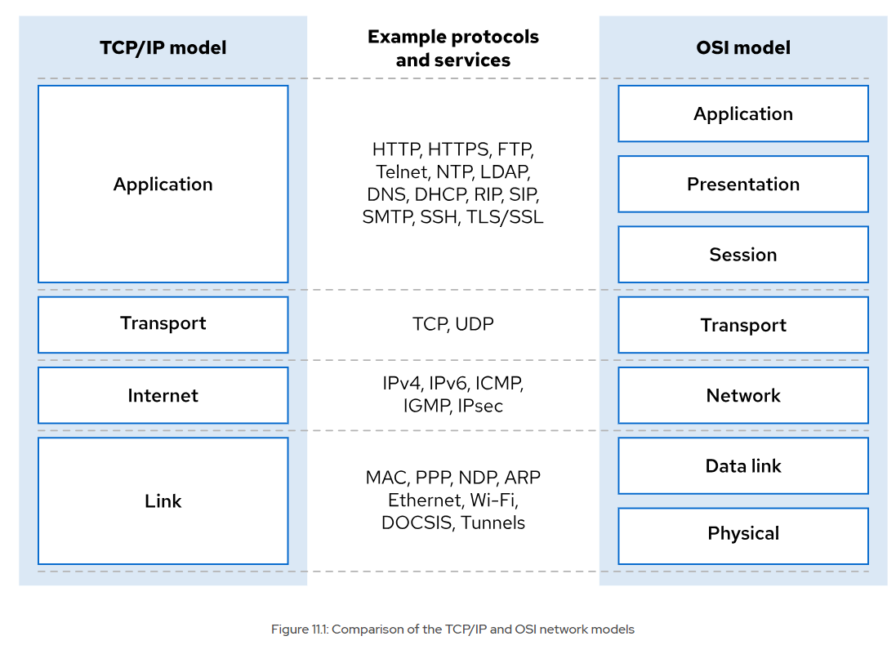
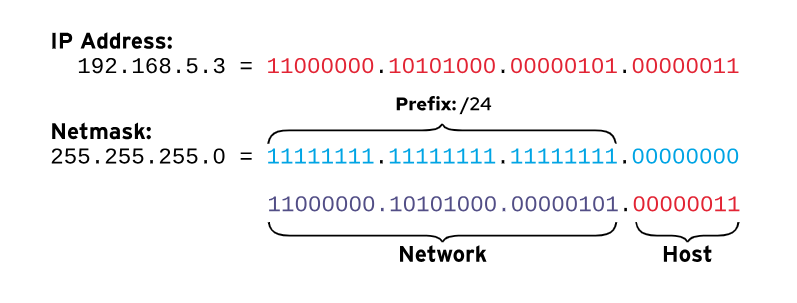
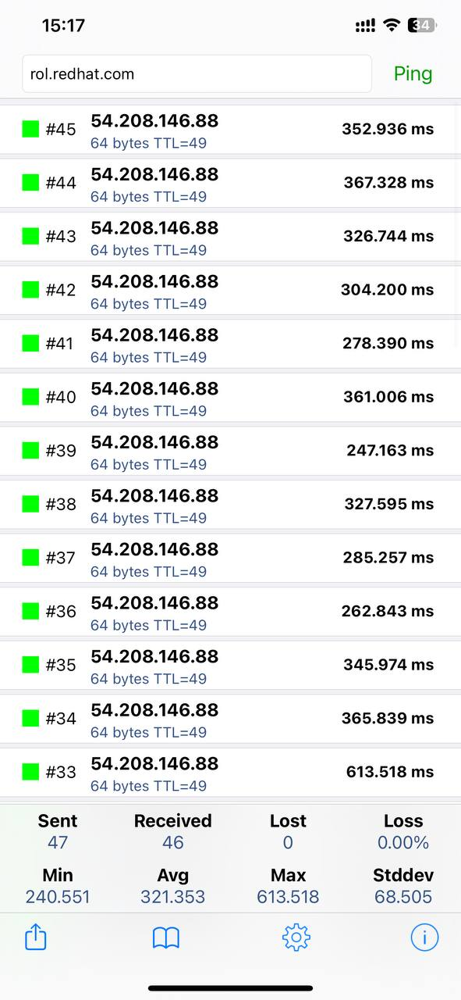
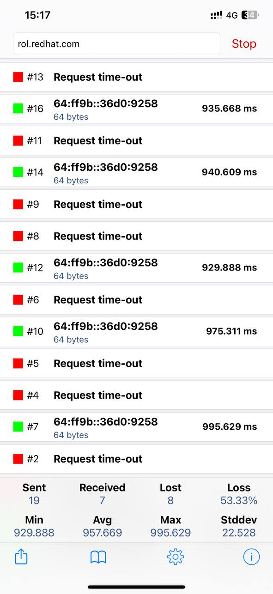
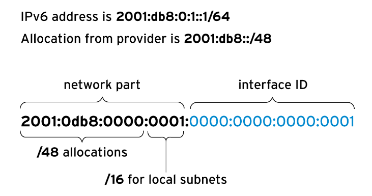

[Phần 2 - Tổng quan về kiến trúc Linux](https://github.com/volehuy1998/network-onboard/blob/master/README.md)

- [2.1 - Linux Kernel (UPDATED 21/01/2024)](https://github.com/volehuy1998/network-onboard/blob/master/linux-onboard/2.1%20-%20linux-arch-onboard.md#linux_kernel)
  - 2.1.1 - Vai trò của Linux Kernel (UPDATED 21/01/2024)
  - 2.1.2 - Tổng quan về Interrupt - Ngắt (UPDATED 05/09/2023)
- [2.2 - Quản lý người dùng và nhóm ( :arrow_up: UPDATED 15/04/2024)](https://github.com/volehuy1998/network-onboard/blob/master/linux-onboard/2.2%20-%20linux-user-management.md#user_and_group)
  - 2.2.1 - Khái niệm `User` (UPDATED 17/09/2023)
  - 2.2.2 - Khái niệm về nhóm, chính và phụ (UPDATED 12/09/2023)
  - 2.2.3 - Thay đổi tài khoản người dùng (UPDATED 13/09/2023)
  - 2.2.4 - Các thao tác quản lý trên người dùng và nhóm(UPDATED 11/09/2023)
  - 2.2.5 - Hạn chế quyền truy cập người dùng (UPDATED 13/09/2023)
  - 2.2.6 - Cấp quyền `sudo` cho nhóm `wheel` ( :arrow_up: UPDATED 15/04/2024)
  - 2.2.7 - Cấp quyền `sudo` cụ thể ( :arrow_up: UPDATED 15/04/2024)
- [2.3 - Hệ thống tệp tin (UPDATED 07/01/2024)](https://github.com/volehuy1998/network-onboard/blob/master/linux-onboard/2.3%20-%20linux-file-system-overview.md#fs)
  - 2.3.1 - Phân cấp hệ thống tệp tin (UPDATED 26/08/2023)
  - 2.3.2 - RPM Package và phân loại (UPDATED 24/08/2023)
  - 2.3.3 - Kernel RPM Package (UPDATED 24/08/2023)
  - 2.3.4 - Tổng quan về quyền trên tệp tin (UPDATED 07/01/2024)
    - 2.3.4.1 - Quản lý quyền tệp tin (UPDATED 13/09/2023)
    - 2.3.4.2 - Quyền đặc biệt dành cho chủ sở hữu (SUID) và lỗ hổng leo thang đặc quyền (UPDATED 10/09/2023)
    - 2.3.4.3 - Quyền đặc biệt dành cho nhóm (UPDATED 10/09/2023)
    - 2.3.4.4 - Quyền đặc biệt Sticky bit (UPDATED 04/09/2023)
  - 2.3.5 - Xác định hệ thống tệp tin và thiết bị (UPDATED 07/11/2023)
- [2.4 - Tổng quan tiến trình Linux (UPDATED 04/10/2023)](https://github.com/volehuy1998/network-onboard/blob/master/linux-onboard/2.4%20-%20linux-process-overview.md#linux_process)
  - 2.4.1 - Trạng thái của tiến trình Linux (UPDATED 17/09/2023)
  - 2.4.2 - Kiểm soát các `Job` (UPDATED 04/10/2023)
  - 2.4.3 - Kết thúc tiến trình (UPDATED 18/09/2023)
  - 2.4.4 - Dịch vụ hạ tầng (UPDATED 21/09/2023)
  - 2.4.5 - Tổng quan về `systemd` (UPDATED 30/09/2023)
  - 2.4.6 - Kiểm soát dịch vụ hệ thống (UPDATED 04/10/2023)
  - 2.4.7 - Mẫu `unit` với ký hiệu `@` (UPDATED 04/10/2023)
  - 2.4.8 - Chi tiết tệp `unit` (UPDATED 04/10/2023)
    - 2.4.8.1 - Loại `unit` phổ biến `*.service` (UPDATED 03/10/2023)
    - 2.4.8.2 - Loại `unit` về `*.socket` (UPDATED 30/09/2023)
    - 2.4.8.3 - Loại `unit` về `*.path` (UPDATED 30/09/2023)
- [2.5 - Điều khiển an toàn từ xa (UPDATED 31/12/2023)](https://github.com/volehuy1998/network-onboard/blob/master/linux-onboard/2.5%20-%20linux-secure-remote-overview.md#remote_connection)
  - 2.5.1 - Tổng quan về kiến trúc giao thức `SSH` (UPDATED 31/12/2023)
    - 2.5.1.1 - Kiến trúc giao thức `SSH` (UPDATED 22/10/2023)
    - 2.5.1.2 - Những xem xét bảo mật về khía cạnh truyền dẫn (UPDATED 19/10/2023)
    - 2.5.1.3 - Những xem xét bảo mật về khía cạnh xác thực (UPDATED 19/10/2023)
    - 2.5.1.4 - Giao thức `SSH-1`, `SSH-2` và sự cải tiến (UPDATED 22/10/2023)
  - 2.5.2 - Cài đặt `OpenSSH`, kết nối và cấu hình (UPDATED 23/10/2023)
    - 2.5.2.1 - Sử dụng công cụ cơ bản (UPDATED 19/10/2023)
    - 2.5.2.2 - Thông tin về `finger print` tại máy khách và máy chủ (UPDATED 19/10/2023)
    - 2.5.2.3 - Hành vi xử lý chuẩn kết nối đến máy chủ (UPDATED 19/10/2023)
    - 2.5.2.4 - Cấu hình `ssh client` (UPDATED 21/10/2023)
    - 2.5.2.5 - Sử dụng `X11 Forwarding` và `Port Forwarding` (UPDATED 23/10/2023)
- [2.6 - Tổng quan về quản lý mạng (UPDATED 05/11/2023)](#network_manage)
  - [2.6.1 - Mô hình `TCP/IP` (UPDATED 25/10/2023)](#tcp_ip)
  - [2.6.2 - Mô tả về `Network Interface` (UPDATED 01/11/2023)](#net_interface_overview)
  - [2.6.3 - Địa chỉ `v4` (UPDATED 25/10/2023)](#ipv4)
  - [2.6.4 - Địa chỉ `v6` (UPDATED 25/10/2023)](#ipv6)
  - [2.6.5 - Thông tin về `network interface`(UPDATED 25/10/2023)](#net_interface_info)
  - [2.6.6 - Công cụ quản lý `nmcli`(UPDATED 05/11/2023)](#nmcli)
  - [2.6.7 - Cấu hình và quản lý `hostname`(UPDATED 05/11/2023)](#hostname)
- [2.7 - Kiến trúc nhật ký hệ thống (UPDATED 17/12/2023)](https://github.com/volehuy1998/network-onboard/blob/master/linux-onboard/2.7%20-%20linux-system-log-architecture-overview.md#sys_log_arch)
  - 2.7.1 - Tổng quan (UPDATED 03/12/2023)
  - 2.7.2 - Cách sử dụng `rsyslog` (UPDATED 06/12/2023)
  - 2.7.3 - Cách sử dụng `systemd-journald` (UPDATED 10/12/2023)
  - 2.7.4 - Đồng bộ thời gian (UPDATED 17/12/2023)
    - 2.7.4.1 - Tổng quan `Network Time Protocol` (UPDATED 17/12/2023)
    - 2.7.4.2 - Công cụ `datetimectl` (UPDATED 10/12/2023)
    - 2.7.4.3 - Cấu hình `NTP` sử dụng `chrony` (UPDATED 17/12/2023)
    - 2.7.4.4 - Cấu hình `NTP` sử dụng `ntpd` (UPDATED 10/12/2023)
- [2.8 - Lập lịch chạy cho tác vụ tương lai (UPDATED 01/01/2024)](https://github.com/volehuy1998/network-onboard/blob/master/linux-onboard/2.8%20-%20linux-job-scheduler.md#schedule_job)
  - 2.8.1 - Tổng quan (UPDATED 24/12/2023)
  - 2.8.2 - Cách sử dụng công cụ `at` (UPDATED 24/12/2023)
  - 2.8.3 - Cách sử dụng công cụ `cron` (UPDATED 24/12/2023)
  - 2.8.4 - Ứng dụng `systemd timer` (UPDATED 01/01/2024)
    - 2.8.4.1 - Cách sử dụng công cụ `systemd timer` (UPDATED 01/01/2024)
    - 2.8.4.2 - Quản lý loại tệp tạm thời (UPDATED 01/01/2024)
      - 2.8.4.2.1 - Cách sử dụng `systemd-tmpfiles --create` (UPDATED 01/01/2024)
      - 2.8.4.2.2 - Cách sử dụng `systemd-tmpfiles --clean` (UPDATED 01/01/2024)
      - 2.8.4.2.3 - Cách sử dụng `systemd-tmpfiles --remove` (UPDATED 01/01/2024)
- [2.9 - Quản lý tệp đóng gói và nén với công cụ `tar` (UPDATED 09/02/2024)](https://github.com/volehuy1998/network-onboard/blob/master/linux-onboard/2.9%20-%20linux-manage-compressed-tar-archives.md#manage_compress_tar_archive)
    - 2.9.1 - Tạo và quản lý tệp đóng gói (UPDATED 09/02/2024)
    - 2.9.2 - Tạo và quản lý tệp nén đóng gói (UPDATED 15/01/2024)
    - 2.9.3 - Quản lý tệp sao lưu gia tăng `incremental backup` (UPDATED 15/01/2024)
    - 2.9.4 - Chuyển tệp giữa các hệ thống một cách an toàn (UPDATED 15/01/2024)
    - 2.9.5 - Đồng bộ giữa các hệ thống một cách an toàn (UPDATED 15/01/2024)
- [2.10 - Quản lý `SELinux` (UPDATED 28/01/2024)](https://github.com/volehuy1998/network-onboard/blob/master/linux-onboard/2.10%20-%20linux-se-mode.md#selinux_manage)
    - 2.10.1 - Kiến trúc `SELinux` (UPDATED 27/01/2024)
    - 2.10.2 - Sử dụng `SELinux` cơ bản với chính sách `targeted` (UPDATED 28/01/2024)
      - 2.10.2.1 - Xem nhãn, kích hoạt và vô hiệu hóa `SELinux` (UPDATED 28/01/2024)
      - 2.10.2.2 - Xem định nghĩa chính sách `SELinux` (UPDATED 27/01/2024)
      - 2.10.2.3 - Auditing hành vi hệ thống (UPDATED 28/01/2024)
      - 2.10.2.4 - Kiểm soát `fcontext` với nhãn sẵn có (UPDATED 27/01/2024)
      - 2.10.2.5 - Kiểm soát `port` với nhãn sẵn có (UPDATED 27/01/2024)
      - 2.10.2.6 - Kiểm soát chính sách với  `boolean` (UPDATED 27/01/2024)
- [2.11 - Quản lý lưu trữ cơ bản ( :arrow_up: UPDATED 07/02/2024)](https://github.com/volehuy1998/network-onboard/blob/master/linux-onboard/2.11%20-%20linux-manage-basic-storage.md#manage_basic_storage)
    - 2.11.1 - Khái niệm phân vùng ổ cứng ( :heavy_plus_sign: UPDATED 05/01/2024)
    - 2.11.2 - Quản lý phân vùng theo định dạng ( :heavy_plus_sign: UPDATED 05/01/2024)
      - 2.11.2.1 - Quản lý phân vùng định dạng MBR ( :arrow_up: UPDATED 07/02/2024)
      - 2.11.2.2 - Quản lý phân vùng định dạng GPT ( :heavy_plus_sign: UPDATED 05/01/2024)
    - 2.11.3 - Tạo tệp hệ thống (UPDATED 05/01/2024)
    - 2.10.4 - Mount tệp hệ thống ( :heavy_plus_sign: UPDATED 05/01/2024)
      - 2.11.4.1 - Mount thủ công tệp hệ thống (UPDATED 05/01/2024)
      - 2.11.4.2 - Mount tự vĩnh viễn tệp hệ thống (UPDATED 05/01/2024)
    - 2.11.5 - Quản lý không gian `Swap` (UPDATED 05/01/2024)
      - 2.11.5.1 - Khái niệm không gian `Swap` (UPDATED 05/01/2024)
      - 2.11.5.2 - Tạo phân vùng `swap` (UPDATED 05/01/2024)
- [2.12 - Quản lý lưu trữ nâng cao (UPDATED 09/02/2024)](https://github.com/volehuy1998/network-onboard/blob/master/linux-onboard/2.12%20-%20linux-manage-advance-storage.md#manage_advance_storage)
  - 2.12.1 - Tổng quan Logical Volume Manager (LVM) (UPDATED 09/02/2024)
  - 2.12.2 - Xây dựng hệ thống lưu trữ LVM (UPDATED 09/02/2024)
  - 2.12.3 - Tạo Logical Volume tính năng nén và chống trùng lặp (UPDATED 09/02/2024)
         
## <a name="network_manage"></a>Tổng quan về quản lý mạng
### <a name="tcp_ip"></a>Mô hình `TCP/IP`
Mô hình mạng `TCP/IP` là một giao thức liên lạc gồm 4 lớp để mô tả về việc làm cách nào để dữ liệu liên lạc được đóng gói, truyền tải, định tuyến, đánh địa chỉ và nhận giữa các máy tính trong mạng. Giao thức được định nghĩa tại `RFC 1122, Requirements for Internet Hosts - Communication Layers`.

- Lớp ứng dụng - `Application`: mỗi ứng dụng đều có những cấu hình cho việc giao tiếp vì vậy máy chủ và máy khách có thể liên lạc đa nền tảng. Các giao thức phổ biến bao gồm: `SSH`, `HTTPS`, `FTP` và `SMTP`.

- Lớp truyền dẫn - `Transport`: giao thức `TCP` và `UDP` đều là giao thức truyền dẫn. Với `TCP` hướng đến kết nối tin cậy còn `UDP` thì ngược lại. Các giao thức ứng dụng có thể chọn cổng `TCP` hoặc `UDP`. Danh sách các cổng phổ biến và đã đăng ký nằm trong `/etc/services`.
```shell
[root@huyvl-linux-training ~]# tail /etc/services
3gpp-cbsp       48049/tcp               # 3GPP Cell Broadcast Service Protocol
isnetserv       48128/tcp               # Image Systems Network Services
isnetserv       48128/udp               # Image Systems Network Services
blp5            48129/tcp               # Bloomberg locator
blp5            48129/udp               # Bloomberg locator
com-bardac-dw   48556/tcp               # com-bardac-dw
com-bardac-dw   48556/udp               # com-bardac-dw
iqobject        48619/tcp               # iqobject
iqobject        48619/udp               # iqobject
matahari        49000/tcp               # Matahari Broker
[root@huyvl-linux-training ~]#
```
, khi một gói tin được gửi ra mạng thì sự kết hợp giữa địa chỉ và cổng tạo thành `socket`. Mỗi gói tin đều có chứa `socket` nguồn và `socket` đích đến, những thông tin này được sử dụng để giám sát hoặc lọc gói tin.

- Lớp mạng - `Internet`: còn được gọi là lớp `internet` đảm nhận việc mang dữ liệu từ nguồn tới đích. Giao thức `IPv4` và `IPv6` đều là giao thức lớp `internet`.

- Lớp liên kết - `Link`: cung cấp kết nối thông qua thiết bị vật lý. Các loại phổ biến nhất là kết nối có dây `Ethernet (802.3)` và không dây `Wifi (802.11)`. Mỗi thiết bị vật lý đều cung cấp `1` địa chỉ `Media Access Control (MAC)`.

<div style="text-align:center"></div>

### <a name="net_interface_overview"></a>Mô tả về tên `Network Interface`
Mỗi một cổng mạng trên hệ thống đều có tên, những tên này sẽ được sử dụng để cấu hình và nhận biết. Những phiên bản trước của `Linux` sử dụng ký hiệu `eth` cho mỗi `network interface`, ví dụ như `eth0` là cổng đầu tiên, `eth1` là cổng thứ hai...tuy nhiên khi các thiết bị được thêm/tháo thì cơ chế phát hiện và đặt lại tên cho thiết bị sẽ thay đổi tên `interface` với `network interface`.

Ở những phiên bản cổ điển thì `interface` sẽ được đặt `eth`, ngày nay sơ đồ đặt tên cổ điển này đã được thay thế bởi định dạng khác kết hợp bởi nhiều thông tin `firmware`, công nghệ `PCI` và loại thiết bị mạng. Tên được bắt đầu:

- `Ethernet interface` bắt đầu với `en`. Nếu là cổng mạng được hàn sẵn trên thiết bị bo mạch chủ được đặt tên `eno (ethernet onboard)`, ngược lại với những cổng mạng có thể gắn/tháo được đặt tên `ens (ethernet slot)`, hoặc vị trí đầu nối thiết bị `enps`. Ví dụ:

  - `eno1`: cổng mạng được hàn trên bo mạch chủ vị trí `1`.
  - `ens1`: card mạng được mô-đun hóa có thể gắn/tháo dựa trên khe `PCI` vị trí `1`.
  - `enp2s0`: được gắn trên thiết bị `PCI` với tần số `bus=2` vị trí `slot=0`.

- `WLAN interface (Wireless LAN)` bắt đầu với `wl`. Có thể ghép nối như ví dụ trên: `wlp2s0`, ...

- `WWAN interface (Wireless WAN)` bắt đầu với `ww`.
### <a name="ipv4"></a>Địa chỉ `v4`
Là loại địa chỉ được triển khai phổ biến nhất hiện nay. Địa chỉ `IPv4` bao gồm `32` bit được chia đều mỗi 4 `octet`. Mỗi `octet` thể hiện bằng số thập phân giá trị từ `0` đến `255` và ngăn cách nhau bởi dấu `.`. Hậu tố `prefix` sau địa chỉ thể hiện cho số lượng `bit` dành cho quản lý mạng, còn lại để đặt cho thiết bị trên lớp mạng đó. Tất cả các `host` trong cùng mạng sẽ đều có cùng hậu tố `prefix` và chúng có thể liên lạc trực tiếp với nhau mà không cần thông qua thiết bị định tuyến, ví dụ như `router`, ... `Gateway` của mạng dùng để liên lạc giữa các mạng khác nhau.

<div style="text-align:center"></div>

Một số mạng được chia theo lớp A có 8 bit, B có 16 bit, C 24 bit. Hiện nay số lượng bit mạng thường biến động không cố định theo lớp cổ điển, số lượng bit mạng có thể là bất kỳ số nào nằm trong phạm vị được hỗ trợ và nó được gọi là `Classless Inter-Domain Routing (CIDR)`.

`Netmask` dùng để chỉ số lượng bit thuộc về phần mạng. Càng nhiều bit ở phần mạng thì có thể chia nhiều mạng con nhưng mỗi mạng con có ít địa chỉ đặt cho thiết bị và ngược lại. Có `2` cách biểu thị:

- Cách đầu tiên được biết đến là `CIDR`, thêm vào phần cuối địa chỉ với `/<prefix>`.

- Cách thứ hai, hiển thị số lượng bit ở dạng nhị phân với trạng thái `1` ở phần mạng và trạng thái `0` ở phần host.

`Network Address` là địa chỉ mà tất cả các bit ở phần host đều ở trạng thái `0`. `Broadcast address` là địa chỉ mà tất cả các bit ở phần host ở trạng thái `1`. `Gateway address` là địa chỉ bất kỳ trong phạm vi `host`, thông thường sẽ là địa chỉ đầu tiên.

Bảng định tuyến của `IPv4`: gói tin di chuyển từ `host` tới `host` trong cùng mạng hoặc khác mạng thông qua thiết bị chuyển mạch. Mỗi `host` đều có bảng định tuyến dùng để xác định chính xác `NIC` nào để gửi gói đi. Từng dòng trong bảng định tuyến liệt kê thông tin: mạng đích, `NIC` trên host, địa chỉ `gateway` của thiết bị định tuyến để chuyển tiếp gói tin. Nếu không khớp với bất kỳ dòng nào trong bảng thì `default route 0.0.0.0/0` sẽ được sử dụng. Khi thiết bị định tuyến nhận được gói mà địa chỉ không phải của nó thì nó sẽ chuyển tiếp dựa trên bảng định tuyến của chính nó. Việc chuyển tiếp có thể gửi trực tiếp đến nơi nhận nếu thiết bị định tuyến có liên kết với `gateway` của mạng đích, ngược lại gói tin sẽ tiếp tục được chuyển tiếp đến thiết bị định tuyến khác.

Máy tính có thể tự cấu hình `IPv4` bằng cách liên lạc đến máy chủ `DHCP`. `DHCP client` ở máy cục bộ sẽ truy vấn đến máy chủ `DHCP` để đàm phán về một địa chỉ `IPv4` chưa được sử dụng và thuê nó trong khoản thời gian nhất định. Ngoài ra người dùng có thể chỉ định `IPv4` từ tệp cục bộ, cách làm này phù hợp với quản trị viên vì có cái nhìn bao quát về không gian mạng mà họ quản lý để tránh xung đột bất ngờ.
### <a name="ipv6"></a>Địa chỉ `v6`
Trong tầm nhìn thấy được `IP Public` sẽ mau chóng cạn kiệt thì `IPv6` được phát minh để mở rộng. `IPv6` và `IPv4` không xung đột với nhau, người dùng có thể sử dụng song song cả 2 mặc dù `IPv6` vẫn được ưu tiên hơn.

<div style="text-align:center"></div>

`IPv6` bao gồm `128` bit được biểu diễn với dạng thập lục phân, chia đều theo 8 nhóm, mỗi nhóm cấu tạo bởi `4 nibble`, mỗi nhóm cách nhau bởi dấu `:` thay vì dấu `.` như trong `IPv4`. `IPv6` cho phép rút gọn nhóm như sau:

- Nguyên thể: `2001:0db8:0000:0010:0000:0000:0000:0001`.

- Rút gọn cách 1: `2001:db8:0:10:0:0:0:1`.

- Rút gọn cách 2: `2001:db8:0:10::1`.

Một số lời khuyên rút gọn `IPv6` tường minh:

- Loại bỏ các số nibble `0` đứng đầu trong mỗi nhóm.
- Sử dụng dấu `::` để rút ngắn nếu có nhiều nhóm `0` liền kề.

<div style="text-align:center"></div>

| Địa chỉ `IPv6` | Mục đích | Mô tả |
| --- | --- | --- |
| `::1/128` | `localhost` | `Loopback interface` tương đương với `127.0.0.1/8`. | 
| `::` | Địa chỉ không xác định | Tương đương với `0.0.0.0`, với dịch vụ mạng thì nó đang lắng nghe trên tất cả các địa chỉ. |
| `::/0` | `default route` | Tương đương với `0.0.0.0/0`.
| `2000::/3` | Địa chỉ `unicast` toàn cục | |
| `fd00::/8` | Địa chỉ cục bộ duy nhất theo `RFC4193` | |
| `fe80::/10` | Địa chỉ `link-local` | |
| `ff00::/8` | `Multicast` | Tương đương với `224.0.0.0/4`.

### <a name="net_interface_info"></a>Thông tin về `Network Interface`
Hiển thị tất cả thông tin về `NIC` như sau:
```shell
[root@huyvl-linux-training ~]# ip link show
1: lo: <LOOPBACK,UP,LOWER_UP> mtu 65536 qdisc noqueue state UNKNOWN mode DEFAULT group default qlen 1000
    link/loopback 00:00:00:00:00:00 brd 00:00:00:00:00:00
2: eth0: <BROADCAST,MULTICAST,UP,LOWER_UP> mtu 1500 qdisc pfifo_fast state UP mode DEFAULT group default qlen 1000
    link/ether fa:16:3e:60:3c:07 brd ff:ff:ff:ff:ff:ff
3: eth1: <BROADCAST,MULTICAST,UP,LOWER_UP> mtu 1500 qdisc pfifo_fast state UP mode DEFAULT group default qlen 1000
    link/ether fa:16:3e:e6:ea:f1 brd ff:ff:ff:ff:ff:ff
[root@huyvl-linux-training ~]#
```
Hiện thị thông tin địa chỉ của `eth0` như sau:
```shell
[root@huyvl-linux-training ~]# ip addr show eth0
2: eth0: <BROADCAST,MULTICAST,UP,LOWER_UP> mtu 1500 qdisc pfifo_fast state UP group default qlen 1000
    link/ether fa:16:3e:60:3c:07 brd ff:ff:ff:ff:ff:ff
    inet 10.10.1.161/16 brd 10.10.255.255 scope global noprefixroute dynamic eth0
       valid_lft 410677sec preferred_lft 410677sec
    inet6 fe80::f816:3eff:fe60:3c07/64 scope link
       valid_lft forever preferred_lft forever
[root@huyvl-linux-training ~]# ip addr show eth1
3: eth1: <BROADCAST,MULTICAST,UP,LOWER_UP> mtu 1500 qdisc pfifo_fast state UP group default qlen 1000
    link/ether fa:16:3e:e6:ea:f1 brd ff:ff:ff:ff:ff:ff
    inet 15.15.15.88/24 brd 15.15.15.255 scope global noprefixroute dynamic eth1
       valid_lft 604690sec preferred_lft 604690sec
    inet6 fe80::edbe:5f06:827:a89b/64 scope link noprefixroute
       valid_lft forever preferred_lft forever
```

Chú thích: 

- `interface` đang ở trạng thái hoạt động `state UP`
- `link/ether` thông báo địa chỉ `MAC` là `fa:16:3e:60:3c:07`.
- `inet` biểu diễn địa chỉ `IPv4`
- `inet6` biểu diễn địa chỉ `IPv6`.

Hiển thị thông tin hiệu suất của `eth0` với `RX` là nhận và `TX` là gửi đi như sau:
```shell
[root@huyvl-linux-training ~]# ip -s link show eth0
2: eth0: <BROADCAST,MULTICAST,UP,LOWER_UP> mtu 1500 qdisc pfifo_fast state UP mode DEFAULT group default qlen 1000
    link/ether fa:16:3e:60:3c:07 brd ff:ff:ff:ff:ff:ff
    RX: bytes  packets  errors  dropped overrun mcast
    2025331    33415    0       0       0       0
    TX: bytes  packets  errors  dropped carrier collsns
    8024088    53486    0       0       0       0
[root@huyvl-linux-training ~]#
```
Hiển thị thông tin ở dạng rút gọn `-br (brief)` hoặc đầy đủ như sau:
```shell
[root@huyvl-linux-training ~]# ip -br addr
lo               UNKNOWN        127.0.0.1/8 ::1/128
eth0             UP             10.10.1.161/16 fe80::f816:3eff:fe60:3c07/64
eth1             UP             15.15.15.88/24 fe80::edbe:5f06:827:a89b/64
[root@huyvl-linux-training ~]# ip addr
1: lo: <LOOPBACK,UP,LOWER_UP> mtu 65536 qdisc noqueue state UNKNOWN group default qlen 1000
    link/loopback 00:00:00:00:00:00 brd 00:00:00:00:00:00
    inet 127.0.0.1/8 scope host lo
       valid_lft forever preferred_lft forever
    inet6 ::1/128 scope host
       valid_lft forever preferred_lft forever
2: eth0: <BROADCAST,MULTICAST,UP,LOWER_UP> mtu 1500 qdisc pfifo_fast state UP group default qlen 1000
    link/ether fa:16:3e:60:3c:07 brd ff:ff:ff:ff:ff:ff
    inet 10.10.1.161/16 brd 10.10.255.255 scope global noprefixroute dynamic eth0
       valid_lft 409983sec preferred_lft 409983sec
    inet6 fe80::f816:3eff:fe60:3c07/64 scope link
       valid_lft forever preferred_lft forever
3: eth1: <BROADCAST,MULTICAST,UP,LOWER_UP> mtu 1500 qdisc pfifo_fast state UP group default qlen 1000
    link/ether fa:16:3e:e6:ea:f1 brd ff:ff:ff:ff:ff:ff
    inet 15.15.15.88/24 brd 15.15.15.255 scope global noprefixroute dynamic eth1
       valid_lft 603998sec preferred_lft 603998sec
    inet6 fe80::edbe:5f06:827:a89b/64 scope link noprefixroute
       valid_lft forever preferred_lft forever
[root@huyvl-linux-training ~]#
```
Thay đổi tên `interface` dựa trên `udev` như sau:
```shell
[root@huyvl-linux-training ~]# ip a
1: lo: <LOOPBACK,UP,LOWER_UP> mtu 65536 qdisc noqueue state UNKNOWN group default qlen 1000
    link/loopback 00:00:00:00:00:00 brd 00:00:00:00:00:00
    inet 127.0.0.1/8 scope host lo
       valid_lft forever preferred_lft forever
    inet6 ::1/128 scope host
       valid_lft forever preferred_lft forever
2: eth0: <BROADCAST,MULTICAST,UP,LOWER_UP> mtu 1500 qdisc pfifo_fast state UP group default qlen 1000
    link/ether fa:16:3e:fb:0e:a0 brd ff:ff:ff:ff:ff:ff
    inet 10.10.3.197/16 brd 10.10.255.255 scope global noprefixroute dynamic eth0
       valid_lft 604793sec preferred_lft 604793sec
    inet6 fe80::f816:3eff:fefb:ea0/64 scope link
       valid_lft forever preferred_lft forever
3: eth1: <BROADCAST,MULTICAST,UP,LOWER_UP> mtu 1500 qdisc pfifo_fast state UP group default qlen 1000
    link/ether fa:16:3e:4b:9c:3c brd ff:ff:ff:ff:ff:ff
    inet 15.15.15.50/24 brd 15.15.15.255 scope global noprefixroute dynamic eth1
       valid_lft 604793sec preferred_lft 604793sec
    inet6 fe80::3808:44aa:f88d:c322/64 scope link noprefixroute
       valid_lft forever preferred_lft forever
[root@huyvl-linux-training ~]# cat /sys/class/net/eth0/type
1
[root@huyvl-linux-training ~]# vi /etc/udev/rules.d/00-persistent-internal-instead-of-eth0.rules
[root@huyvl-linux-training ~]# cat /etc/udev/rules.d/00-persistent-internal-instead-of-eth0.rules
SUBSYSTEM=="net",ACTION=="add",ATTR{address}=="fa:16:3e:fb:0e:a0",ATTR{type}=="1",NAME="internal"
[root@huyvl-linux-training ~]# cd /etc/sysconfig/network-scripts/
[root@huyvl-linux-training network-scripts]# ll | grep route-
[root@huyvl-linux-training network-scripts]# vi route-internal
[root@huyvl-linux-training network-scripts]# cat route-internal
default via 10.10.3.197 dev internal
[root@huyvl-linux-training network-scripts]# systemctl enable network
network.service is not a native service, redirecting to /sbin/chkconfig.
Executing /sbin/chkconfig network on
[root@huyvl-linux-training network-scripts]# cd
[root@huyvl-linux-training ~]# reboot
...
[root@huyvl-linux-training ~]# ip a
1: lo: <LOOPBACK,UP,LOWER_UP> mtu 65536 qdisc noqueue state UNKNOWN group default qlen 1000
    link/loopback 00:00:00:00:00:00 brd 00:00:00:00:00:00
    inet 127.0.0.1/8 scope host lo
       valid_lft forever preferred_lft forever
    inet6 ::1/128 scope host
       valid_lft forever preferred_lft forever
2: internal: <BROADCAST,MULTICAST,UP,LOWER_UP> mtu 1500 qdisc pfifo_fast state UP group default qlen 1000
    link/ether fa:16:3e:6e:50:1c brd ff:ff:ff:ff:ff:ff
    inet 10.10.3.207/16 brd 10.10.255.255 scope global noprefixroute dynamic internal
       valid_lft 604780sec preferred_lft 604780sec
    inet6 fe80::1aae:5361:7d1b:23d7/64 scope link noprefixroute
       valid_lft forever preferred_lft forever
3: eth1: <BROADCAST,MULTICAST,UP,LOWER_UP> mtu 1500 qdisc pfifo_fast state UP group default qlen 1000
    link/ether fa:16:3e:ca:65:d1 brd ff:ff:ff:ff:ff:ff
    inet 15.15.15.214/24 brd 15.15.15.255 scope global noprefixroute dynamic eth1
       valid_lft 604780sec preferred_lft 604780sec
    inet6 fe80::f816:3eff:feca:65d1/64 scope link
       valid_lft forever preferred_lft forever
[root@huyvl-linux-training ~]#
```
, hoặc thay đổi dựa trên `/etc/systemd/network/*.link`, vì `udev` có độ ưu tiên cao hơn nên cần xóa cấu hình trước khi sử dụng phương pháp này
```shell
[root@huyvl-linux-training ~]# rm -f /etc/udev/rules.d/00-persistent-internal-instead-of-eth0.rules
[root@huyvl-linux-training ~]# mkdir -p /etc/systemd/network/
[root@huyvl-linux-training ~]# vi /etc/systemd/network/00-api.link
[root@huyvl-linux-training ~]# cat /etc/systemd/network/00-api.link
[Match]
MACAddress=fa:16:3e:6e:50:1c

[Link]
Name=api
[root@huyvl-linux-training ~]# reboot
...
[root@huyvl-linux-training ~]# ip link show
1: lo: <LOOPBACK,UP,LOWER_UP> mtu 65536 qdisc noqueue state UNKNOWN mode DEFAULT group default qlen 1000
    link/loopback 00:00:00:00:00:00 brd 00:00:00:00:00:00
2: api: <BROADCAST,MULTICAST,UP,LOWER_UP> mtu 1500 qdisc pfifo_fast state UP mode DEFAULT group default qlen 1000
    link/ether fa:16:3e:6e:50:1c brd ff:ff:ff:ff:ff:ff
3: eth1: <BROADCAST,MULTICAST,UP,LOWER_UP> mtu 1500 qdisc pfifo_fast state UP mode DEFAULT group default qlen 1000
    link/ether fa:16:3e:ca:65:d1 brd ff:ff:ff:ff:ff:ff
[root@huyvl-linux-training ~]#
```
### <a name="nmcli"></a>Công cụ quản lý `nmcli`
Liệt kê tất cả kết nối:
```shell
[root@huyvl-linux-training ~]# nmcli con show
NAME         UUID                                  TYPE      DEVICE
System eth0  5fb06bd0-0bb0-7ffb-45f1-d6edd65f3e03  ethernet  eth0
[root@huyvl-linux-training ~]#
```
Chi tiết hồ sơ `System eth0` như sau:
```shell
[root@huyvl-linux-training ~]# nmcli con show "System eth0"
connection.id:                          System eth0
connection.uuid:                        5fb06bd0-0bb0-7ffb-45f1-d6edd65f3e03
connection.stable-id:                   --
connection.type:                        802-3-ethernet
connection.interface-name:              eth0
connection.autoconnect:                 yes
connection.autoconnect-priority:        0
connection.autoconnect-retries:         -1 (default)
connection.multi-connect:               0 (default)
connection.auth-retries:                -1
connection.timestamp:                   1699189782
connection.read-only:                   no
connection.permissions:                 --
connection.zone:                        --
connection.master:                      --
connection.slave-type:                  --
connection.autoconnect-slaves:          -1 (default)
connection.secondaries:                 --
connection.gateway-ping-timeout:        0
connection.metered:                     unknown
connection.lldp:                        default
connection.mdns:                        -1 (default)
connection.llmnr:                       -1 (default)
802-3-ethernet.port:                    --
802-3-ethernet.speed:                   0
802-3-ethernet.duplex:                  --
802-3-ethernet.auto-negotiate:          no
802-3-ethernet.mac-address:             --
802-3-ethernet.cloned-mac-address:      --
802-3-ethernet.generate-mac-address-mask:--
802-3-ethernet.mac-address-blacklist:   --
802-3-ethernet.mtu:                     auto
802-3-ethernet.s390-subchannels:        --
802-3-ethernet.s390-nettype:            --
802-3-ethernet.s390-options:            --
802-3-ethernet.wake-on-lan:             default
802-3-ethernet.wake-on-lan-password:    --
ipv4.method:                            auto
ipv4.dns:                               --
ipv4.dns-search:                        --
ipv4.dns-options:                       ""
ipv4.dns-priority:                      0
ipv4.addresses:                         --
ipv4.gateway:                           --
ipv4.routes:                            --
ipv4.route-metric:                      -1
ipv4.route-table:                       0 (unspec)
ipv4.routing-rules:                     --
ipv4.ignore-auto-routes:                no
ipv4.ignore-auto-dns:                   no
ipv4.dhcp-client-id:                    --
ipv4.dhcp-timeout:                      0 (default)
ipv4.dhcp-send-hostname:                yes
ipv4.dhcp-hostname:                     --
ipv4.dhcp-fqdn:                         --
ipv4.never-default:                     no
ipv4.may-fail:                          yes
ipv4.dad-timeout:                       -1 (default)
ipv6.method:                            ignore
ipv6.dns:                               --
ipv6.dns-search:                        --
ipv6.dns-options:                       ""
ipv6.dns-priority:                      0
ipv6.addresses:                         --
ipv6.gateway:                           --
ipv6.routes:                            --
ipv6.route-metric:                      -1
ipv6.route-table:                       0 (unspec)
ipv6.routing-rules:                     --
ipv6.ignore-auto-routes:                no
ipv6.ignore-auto-dns:                   no
ipv6.never-default:                     no
ipv6.may-fail:                          yes
ipv6.ip6-privacy:                       -1 (unknown)
ipv6.addr-gen-mode:                     stable-privacy
ipv6.dhcp-duid:                         --
ipv6.dhcp-send-hostname:                yes
ipv6.dhcp-hostname:                     --
ipv6.token:                             --
proxy.method:                           none
proxy.browser-only:                     no
proxy.pac-url:                          --
proxy.pac-script:                       --
GENERAL.NAME:                           System eth0
GENERAL.UUID:                           5fb06bd0-0bb0-7ffb-45f1-d6edd65f3e03
GENERAL.DEVICES:                        eth0
GENERAL.STATE:                          activated
GENERAL.DEFAULT:                        yes
GENERAL.DEFAULT6:                       no
GENERAL.SPEC-OBJECT:                    --
GENERAL.VPN:                            no
GENERAL.DBUS-PATH:                      /org/freedesktop/NetworkManager/ActiveConnection/1
GENERAL.CON-PATH:                       /org/freedesktop/NetworkManager/Settings/1
GENERAL.ZONE:                           --
GENERAL.MASTER-PATH:                    --
IP4.ADDRESS[1]:                         10.10.1.162/16
IP4.GATEWAY:                            10.10.0.1
IP4.ROUTE[1]:                           dst = 169.254.169.254/32, nh = 10.10.0.2, mt = 100
IP4.ROUTE[2]:                           dst = 0.0.0.0/0, nh = 10.10.0.1, mt = 100
IP4.ROUTE[3]:                           dst = 10.10.0.0/16, nh = 0.0.0.0, mt = 100
IP4.DNS[1]:                             8.8.8.8
DHCP4.OPTION[1]:                        broadcast_address = 10.10.255.255
DHCP4.OPTION[2]:                        dhcp_lease_time = 604800
DHCP4.OPTION[3]:                        dhcp_message_type = 5
DHCP4.OPTION[4]:                        dhcp_server_identifier = 10.10.0.1
DHCP4.OPTION[5]:                        domain_name_servers = 8.8.8.8
DHCP4.OPTION[6]:                        expiry = 1699769982
DHCP4.OPTION[7]:                        interface_mtu = 1500
DHCP4.OPTION[8]:                        ip_address = 10.10.1.162
DHCP4.OPTION[9]:                        network_number = 10.10.0.0
DHCP4.OPTION[10]:                       next_server = 0.0.0.0
DHCP4.OPTION[11]:                       requested_broadcast_address = 1
DHCP4.OPTION[12]:                       requested_classless_static_routes = 1
DHCP4.OPTION[13]:                       requested_domain_name = 1
DHCP4.OPTION[14]:                       requested_domain_name_servers = 1
DHCP4.OPTION[15]:                       requested_domain_search = 1
DHCP4.OPTION[16]:                       requested_host_name = 1
DHCP4.OPTION[17]:                       requested_interface_mtu = 1
DHCP4.OPTION[18]:                       requested_ms_classless_static_routes = 1
DHCP4.OPTION[19]:                       requested_nis_domain = 1
DHCP4.OPTION[20]:                       requested_nis_servers = 1
DHCP4.OPTION[21]:                       requested_ntp_servers = 1
DHCP4.OPTION[22]:                       requested_rfc3442_classless_static_routes = 1
DHCP4.OPTION[23]:                       requested_root_path = 1
DHCP4.OPTION[24]:                       requested_routers = 1
DHCP4.OPTION[25]:                       requested_static_routes = 1
DHCP4.OPTION[26]:                       requested_subnet_mask = 1
DHCP4.OPTION[27]:                       requested_time_offset = 1
DHCP4.OPTION[28]:                       requested_wpad = 1
DHCP4.OPTION[29]:                       rfc3442_classless_static_routes = 32 169 254 169 254 10 10 0 2 0 10 10
DHCP4.OPTION[30]:                       routers = 10.10.0.1
DHCP4.OPTION[31]:                       subnet_mask = 255.255.0.0
IP6.ADDRESS[1]:                         fe80::f816:3eff:fe93:7683/64
IP6.GATEWAY:                            --
IP6.ROUTE[1]:                           dst = ff00::/8, nh = ::, mt = 256, table=255
IP6.ROUTE[2]:                           dst = fe80::/64, nh = ::, mt = 256
[root@huyvl-linux-training ~]#
```
Hiển thị trạng thái của các thiết bị như sau:
```shell
[root@huyvl-linux-training ~]# nmcli dev status
DEVICE  TYPE      STATE      CONNECTION
eth0    ethernet  connected  System eth0
lo      loopback  unmanaged  --
[root@huyvl-linux-training ~]#
```
Hiển thị cài đặt của thiết bị `eth0` như sau:
```shell
[root@huyvl-linux-training ~]# nmcli dev show eth0
GENERAL.DEVICE:                         eth0
GENERAL.TYPE:                           ethernet
GENERAL.HWADDR:                         FA:16:3E:28:CC:2D
GENERAL.MTU:                            1500
GENERAL.STATE:                          100 (connected)
GENERAL.CONNECTION:                     System eth0
GENERAL.CON-PATH:                       /org/freedesktop/NetworkManager/ActiveConnection/1
WIRED-PROPERTIES.CARRIER:               on
IP4.ADDRESS[1]:                         10.10.2.245/16
IP4.GATEWAY:                            10.10.0.1
IP4.ROUTE[1]:                           dst = 169.254.169.254/32, nh = 10.10.0.2, mt = 100
IP4.ROUTE[2]:                           dst = 0.0.0.0/0, nh = 10.10.0.1, mt = 100
IP4.ROUTE[3]:                           dst = 10.10.0.0/16, nh = 0.0.0.0, mt = 100
IP4.DNS[1]:                             8.8.8.8
IP6.ADDRESS[1]:                         fe80::f816:3eff:fe28:cc2d/64
IP6.GATEWAY:                            --
IP6.ROUTE[1]:                           dst = ff00::/8, nh = ::, mt = 256, table=255
IP6.ROUTE[2]:                           dst = fe80::/64, nh = ::, mt = 256
[root@huyvl-linux-training ~]#
```
Thay đổi sang dạng cấu hình tĩnh như sau:
```shell
[root@huyvl-linux-training ~]# nmcli con add con-name "Static eth0" \
> ifname eth0 type ethernet ipv4.method manual ipv4.dns 8.8.8.8 \
> ipv4.address 10.10.2.245/16 ipv4.gateway 10.10.0.1 \
> connection.autoconnect yes
Connection 'Static eth0' (7f1d36aa-a388-4f68-be97-255ab6877b3e) successfully added.
[root@huyvl-linux-training ~]# nmcli con show
NAME         UUID                                  TYPE      DEVICE
System eth0  5fb06bd0-0bb0-7ffb-45f1-d6edd65f3e03  ethernet  eth0
Static eth0  7f1d36aa-a388-4f68-be97-255ab6877b3e  ethernet  --
[root@huyvl-linux-training ~]# nmcli con modify "System eth0" connection.autoconnect no
[root@huyvl-linux-training ~]# systemctl reboot
```
```shell
[root@huyvl-linux-training ~]# nmcli con show --active
NAME         UUID                                  TYPE      DEVICE
Static eth0  7f1d36aa-a388-4f68-be97-255ab6877b3e  ethernet  eth0
[root@huyvl-linux-training ~]#
[root@huyvl-linux-training ~]# cd /etc/sysconfig/network-scripts/
[root@huyvl-linux-training network-scripts]# ll | grep eth0
-rw-r--r--  1 root root   347 Nov  5 20:31 ifcfg-Static_eth0
-rw-r--r--. 1 root root   193 Nov  5 20:31 ifcfg-eth0
[root@huyvl-linux-training network-scripts]# cat ifcfg-Static_eth0
TYPE=Ethernet
PROXY_METHOD=none
BROWSER_ONLY=no
BOOTPROTO=none
IPADDR=10.10.2.245
PREFIX=16
GATEWAY=10.10.0.1
DNS1=8.8.8.8
DEFROUTE=yes
IPV4_FAILURE_FATAL=no
IPV6INIT=yes
IPV6_AUTOCONF=yes
IPV6_DEFROUTE=yes
IPV6_FAILURE_FATAL=no
IPV6_ADDR_GEN_MODE=stable-privacy
NAME="Static eth0"
UUID=7f1d36aa-a388-4f68-be97-255ab6877b3e
DEVICE=eth0
ONBOOT=yes
[root@huyvl-linux-training network-scripts]#
```
### <a name="hostname"></a>Cấu hình và quản lý `hostname`
Xem thông tin `hostname` hiện tại và cấu hình thay đổi `hostname` như sau:
```shell
[root@huyvl-linux-training ~]# hostname
huyvl-linux-training.novalocal
[root@huyvl-linux-training ~]# hostnamectl status
   Static hostname: huyvl-linux-training.novalocal
         Icon name: computer-vm
           Chassis: vm
        Machine ID: 4627877ac600a902ac91b27042bbed2e
           Boot ID: 02f530a49a524ce3b24ba015bf731a0e
    Virtualization: kvm
  Operating System: CentOS Linux 7 (Core)
       CPE OS Name: cpe:/o:centos:centos:7
            Kernel: Linux 3.10.0-1160.90.1.el7.x86_64
      Architecture: x86-64
[root@huyvl-linux-training ~]# hostnamectl set-hostname huyvl3-linux-training
[root@huyvl-linux-training ~]# hostnamectl status
   Static hostname: huyvl3-linux-training
         Icon name: computer-vm
           Chassis: vm
        Machine ID: 4627877ac600a902ac91b27042bbed2e
           Boot ID: 02f530a49a524ce3b24ba015bf731a0e
    Virtualization: kvm
  Operating System: CentOS Linux 7 (Core)
       CPE OS Name: cpe:/o:centos:centos:7
            Kernel: Linux 3.10.0-1160.90.1.el7.x86_64
      Architecture: x86-64
[root@huyvl-linux-training ~]# cat /etc/hostname
huyvl3-linux-training
[root@huyvl-linux-training ~]# reboot
...
[root@huyvl3-linux-training ~]# hostname
huyvl3-linux-training
```
Thay đổi `hostname` tạm thời như sau:
```shell
[root@huyvl3-linux-training ~]# hostname huyvl-linux-training
[root@huyvl3-linux-training ~]# hostnamectl status
   Static hostname: huyvl3-linux-training
Transient hostname: huyvl-linux-training
         Icon name: computer-vm
           Chassis: vm
        Machine ID: 4627877ac600a902ac91b27042bbed2e
           Boot ID: 2d4ade358a274b01aa6f0310d8b804d0
    Virtualization: kvm
  Operating System: CentOS Linux 7 (Core)
       CPE OS Name: cpe:/o:centos:centos:7
            Kernel: Linux 3.10.0-1160.102.1.el7.x86_64
      Architecture: x86-64
[root@huyvl3-linux-training ~]# hostname
huyvl-linux-training
[root@huyvl3-linux-training ~]# reboot
...
[root@huyvl3-linux-training ~]# hostname
[root@huyvl3-linux-training ~]# hostnamectl status
   Static hostname: huyvl3-linux-training
         Icon name: computer-vm
           Chassis: vm
        Machine ID: 4627877ac600a902ac91b27042bbed2e
           Boot ID: 19159ee4191440ff9b312d9d724ba6b1
    Virtualization: kvm
  Operating System: CentOS Linux 7 (Core)
       CPE OS Name: cpe:/o:centos:centos:7
            Kernel: Linux 3.10.0-1160.102.1.el7.x86_64
      Architecture: x86-64
[root@huyvl3-linux-training ~]#
```