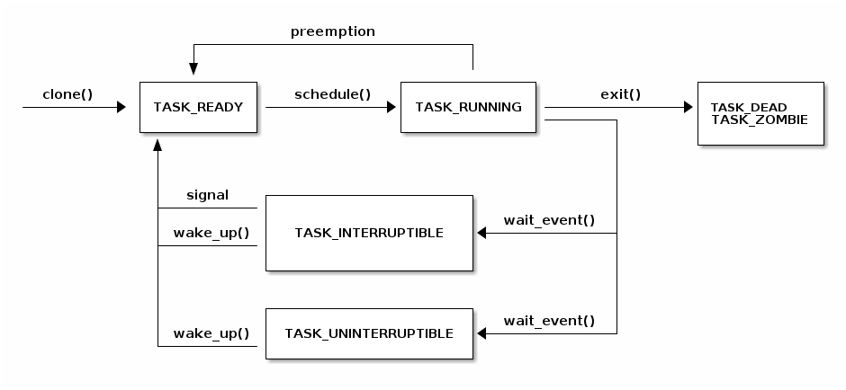
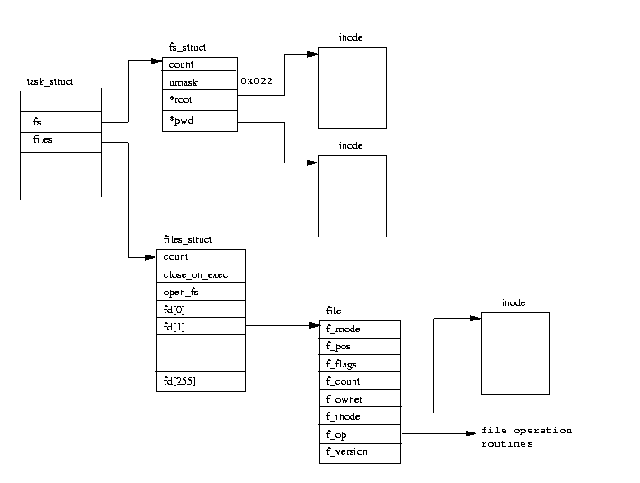
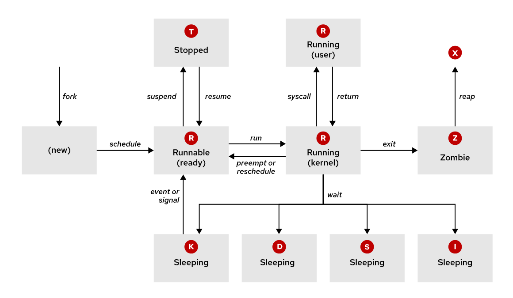
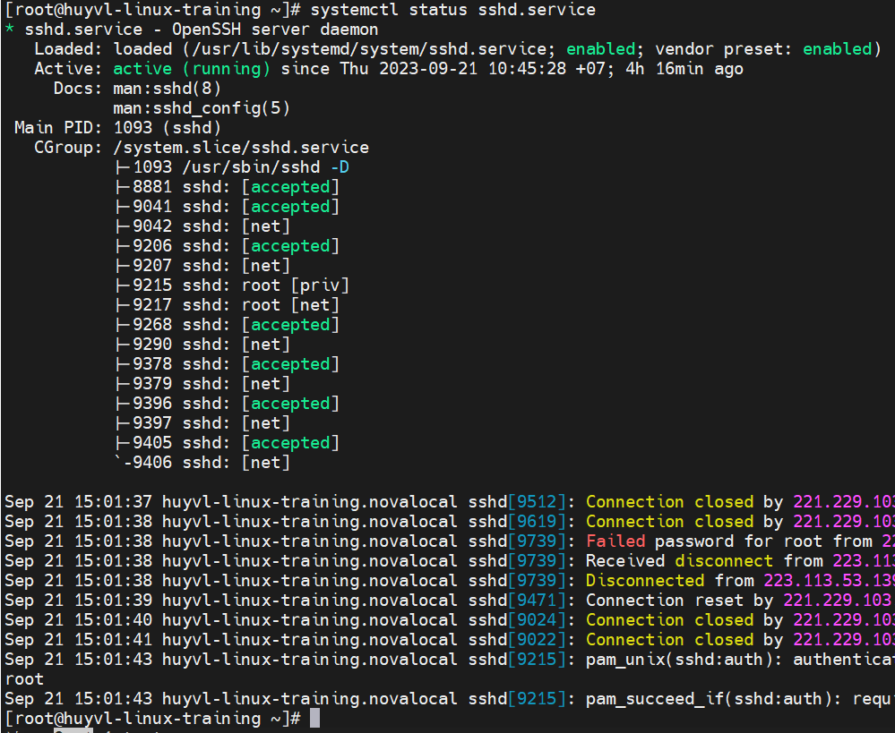
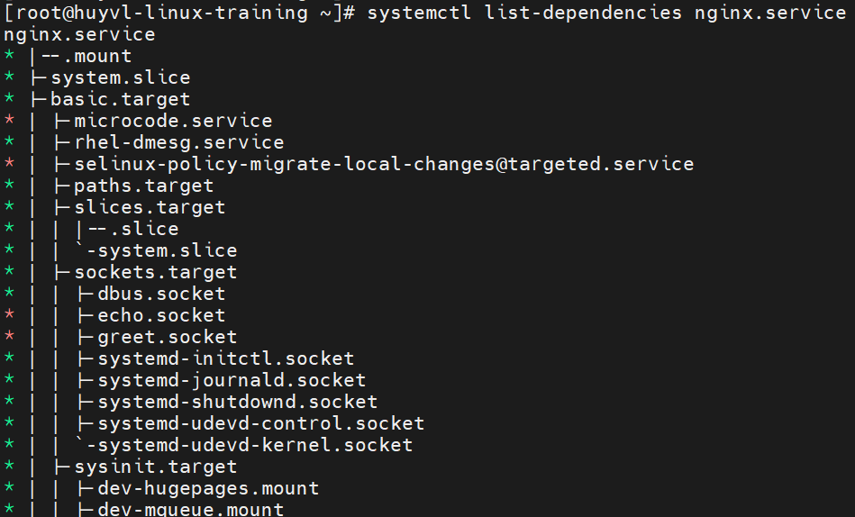

[Phần 2 - Tổng quan về kiến trúc Linux](#linux_arch)

- [2.1 - Linux Kernel (UPDATED 27/08/2023)](https://github.com/volehuy1998/network-onboard/blob/master/linux-onboard/2.0%20-%20linux-arch-onboard.md#linux_kernel)
- [2.2 - Vai trò của Linux Kernel (UPDATED 24/08/2023)](https://github.com/volehuy1998/network-onboard/blob/master/linux-onboard/2.0%20-%20linux-arch-onboard.md#linux_kernel_job)
- [2.3 - Tổng quan về Interrupt - Ngắt (UPDATED 05/09/2023)](https://github.com/volehuy1998/network-onboard/blob/master/linux-onboard/2.0%20-%20linux-arch-onboard.md#interrupt)- [2.1 - Linux Kernel (UPDATED 27/08/2023)](#linux_kernel)
- [2.4 - Quản lý người dùng và nhóm (UPDATED 17/09/2023)](https://github.com/volehuy1998/network-onboard/blob/master/linux-onboard/2.4%20-%20linux-user-management.md)
  - 2.4.1 - Khái niệm `User` (UPDATED 17/09/2023)
  - 2.4.2 - Khái niệm về nhóm, chính và phụ (UPDATED 12/09/2023)
  - 2.4.3 - Thay đổi tài khoản người dùng (UPDATED 13/09/2023)
  - 2.4.4 - Các thao tác quản lý trên người dùng và nhóm(UPDATED 11/09/2023)
  - 2.4.5 - Hạn chế quyền truy cập người dùng (UPDATED 13/09/2023)
  - 2.4.6 - Cấp quyền `sudo` tự do (UPDATED 11/09/2023)
  - 2.4.7 - Cấp quyền `sudo` với lệnh cụ thể (UPDATED 11/09/2023)
- [2.5 - Hệ thống tệp tin (UPDATED 07/11/2023)](https://github.com/volehuy1998/network-onboard/blob/master/linux-onboard/2.5%20-%20linux-file-system-overview.md)
  - 2.5.1 - Phân cấp hệ thống tệp tin (UPDATED 26/08/2023)
  - 2.5.2 - RPM Package và phân loại (UPDATED 24/08/2023)
  - 2.5.3 - Kernel RPM Package (UPDATED 24/08/2023)
  - 2.5.4 - Tổng quan về quyền trên tệp tin (UPDATED 04/10/2023)
    - 2.5.4.1 - Quản lý quyền tệp tin (UPDATED 13/09/2023)
    - 2.5.4.2 - Quyền đặc biệt dành cho chủ sở hữu (SUID) và lỗ hổng leo thang đặc quyền (UPDATED 10/09/2023)
    - 2.5.4.3 - Quyền đặc biệt dành cho nhóm (UPDATED 10/09/2023)
    - 2.5.4.4 - Quyền đặc biệt Sticky bit (UPDATED 04/09/2023)
  - 2.5.5 - Xác định hệ thống tệp tin và thiết bị (UPDATED 07/11/2023)
- [2.6 - Tổng quan tiến trình Linux (UPDATED 04/10/2023)](#linux_process)
  - [2.6.1 - Trạng thái của tiến trình Linux (UPDATED 17/09/2023)](#process_states)
  - [2.6.2 - Kiểm soát các `Job` (UPDATED 04/10/2023)](#control_job)
  - [2.6.3 - Kết thúc tiến trình (UPDATED 18/09/2023)](#kill_process)
  - [2.6.4 - Dịch vụ hạ tầng (UPDATED 21/09/2023)](#infra_service)
  - [2.6.5 - Tổng quan về `systemd` (UPDATED 30/09/2023)](#systemd)
  - [2.6.6 - Kiểm soát dịch vụ hệ thống (UPDATED 04/10/2023)](#ctl_sys_svc)
  - [2.6.7 - Mẫu `unit` với ký hiệu `@` (UPDATED 04/10/2023)](#instantiated_unit)
  - [2.6.8 - Chi tiết tệp `unit` (UPDATED 04/10/2023)](#unit)
    - [2.6.8.1 - Loại `unit` phổ biến `*.service` (UPDATED 03/10/2023)](#service_unit)
    - [2.6.8.2 - Loại `unit` về `*.socket` (UPDATED 30/09/2023)](#socket_unit)
    - [2.6.8.3 - Loại `unit` về `*.path` (UPDATED 30/09/2023)](#path_unit)
- [2.7 - Điều khiển an toàn từ xa (UPDATED 23/10/2023)](https://github.com/volehuy1998/network-onboard/blob/master/linux-onboard/2.7%20-%20linux-secure-remote-overview.md)
  - 2.7.1 - Tổng quan về kiến trúc giao thức `SSH` (UPDATED 22/10/2023)
    - 2.7.1.1 - Kiến trúc giao thức `SSH` (UPDATED 22/10/2023)
    - 2.7.1.2 - Những xem xét bảo mật về khía cạnh truyền dẫn (UPDATED 19/10/2023)
    - 2.7.1.3 - Những xem xét bảo mật về khía cạnh xác thực (UPDATED 19/10/2023)
    - 2.7.1.4 - Giao thức `SSH-1`, `SSH-2` và sự cải tiến (UPDATED 22/10/2023)
  - 2.7.2 - Cài đặt `OpenSSH`, kết nối và cấu hình (UPDATED 23/10/2023)
    - 2.7.2.1 - Sử dụng công cụ cơ bản (UPDATED 19/10/2023)
    - 2.7.2.2 - Thông tin về `finger print` tại máy khách và máy chủ (UPDATED 19/10/2023)
    - 2.7.2.3 - Hành vi xử lý chuẩn kết nối đến máy chủ (UPDATED 19/10/2023)
    - 2.7.2.4 - Cấu hình `ssh client` (UPDATED 21/10/2023)
    - 2.7.2.5 - Sử dụng `X11 Forwarding` và `Port Forwarding` (UPDATED 23/10/2023)
- [2.8 - Tổng quan về quản lý mạng (UPDATED 05/11/2023)](https://github.com/volehuy1998/network-onboard/blob/master/linux-onboard/2.8%20-%20linux-network-overview.md)
  - 2.8.1 - Mô hình `TCP/IP` (UPDATED 25/10/2023)
  - 2.8.2 - Mô tả về `Network Interface` (UPDATED 01/11/2023)
  - 2.8.3 - Địa chỉ `v4` (UPDATED 25/10/2023)
  - 2.8.4 - Địa chỉ `v6` (UPDATED 25/10/2023)
  - 2.8.5 - Thông tin về `network interface`(UPDATED 25/10/2023)
  - 2.8.6 - Công cụ quản lý `nmcli`(UPDATED 05/11/2023)
  - 2.8.7 - Cấu hình và quản lý `hostname`(UPDATED 05/11/2023)
- [2.9 - Kiến trúc nhật ký hệ thống (UPDATED 03/12/2023)](https://github.com/volehuy1998/network-onboard/blob/master/linux-onboard/2.9%20-%20linux-system-log-architecture-overview.md)
  - 2.9.1 - Tổng quan (UPDATED 03/12/2023)
    
## <a name="linux_process"></a>Tổng quan về tiến trình
Tiến trình là tên gọi đại diện cho sự trừu tượng hóa hay nhóm các tài nguyên sau:

- `address space`: không gian địa chỉ của bộ nhớ đã phân bổ.
- Các thuộc tính bảo mật bao gồm cả xác thực quyền sở hữu và phạm vi của quyền hạn. 
- `thread`: một hoặc nhiều luồng được thực thi trong mã nguồn chương trình.
- `timers`: đồng hồ.
- `socket`.
- `shared memory region`: khu vực bộ nhớ xài chung.
- ...

, trong mã `Linux` nó được gọi với tên nguyên bản là `task_struct` với nội dung hơn 800 dòng tại https://github.com/torvalds/linux/blob/master/include/linux/sched.h#L743-L1554.

<div style="text-align:center"></div>

Mọi tiến trình đều có thể tạo tiến trình con của riêng nó, tất cả tiến trình đều có chung một tiến trình cha đầu tiên là `systemd`. Tiến trình cha sao chép không gian địa chỉ bộ nhớ, hành động này được gọi là `fork` để tạo ra tiến trình con. Thông qua `fork`, tiến trình con kế thừa những đặc tính bảo mật, đặc quyền truy cập tài nguyên, biến môi trường, ... nhưng không kế thừa `lock`, `alarm` của tiến trình cha. Thông thường thì tiến trình cha sẽ rơi vào trạng thái ngủ đông `sleep` trong khi tiến trình con hoạt động và đặt một yêu cầu `wait` để chờ tiến trình con hoàn thành.

```shell
[root@huyvl-linux-training ~]# ps aux
USER       PID %CPU %MEM    VSZ   RSS TTY      STAT START   TIME COMMAND
root         1  0.0  0.2 125516  3964 ?        Ss   Oct03   0:14 /usr/lib/systemd/systemd --switched-root --system --deserialize 22
root         2  0.0  0.0      0     0 ?        S    Oct03   0:00 [kthreadd]
root         4  0.0  0.0      0     0 ?        S<   Oct03   0:00 [kworker/0:0H]
root         5  0.0  0.0      0     0 ?        S    Oct03   0:00 [kworker/u4:0]
root         6  0.0  0.0      0     0 ?        S    Oct03   0:00 [ksoftirqd/0]
root         7  0.0  0.0      0     0 ?        S    Oct03   0:00 [migration/0]
root         8  0.0  0.0      0     0 ?        S    Oct03   0:00 [rcu_bh]
root         9  0.0  0.0      0     0 ?        S    Oct03   0:03 [rcu_sched]
root        10  0.0  0.0      0     0 ?        S<   Oct03   0:00 [lru-add-drain]
root        11  0.0  0.0      0     0 ?        S    Oct03   0:00 [watchdog/0]
root        12  0.0  0.0      0     0 ?        S    Oct03   0:00 [watchdog/1]
root        13  0.0  0.0      0     0 ?        S    Oct03   0:00 [migration/1]
root        14  0.0  0.0      0     0 ?        S    Oct03   0:00 [ksoftirqd/1]
root        16  0.0  0.0      0     0 ?        S<   Oct03   0:00 [kworker/1:0H]
root        18  0.0  0.0      0     0 ?        S    Oct03   0:00 [kdevtmpfs]
root        19  0.0  0.0      0     0 ?        S<   Oct03   0:00 [netns]
root        20  0.0  0.0      0     0 ?        S    Oct03   0:00 [khungtaskd]
root        21  0.0  0.0      0     0 ?        S<   Oct03   0:00 [writeback]
root        22  0.0  0.0      0     0 ?        S<   Oct03   0:00 [kintegrityd]
root        23  0.0  0.0      0     0 ?        S<   Oct03   0:00 [bioset]
root        24  0.0  0.0      0     0 ?        S<   Oct03   0:00 [bioset]
root        25  0.0  0.0      0     0 ?        S<   Oct03   0:00 [bioset]
root        26  0.0  0.0      0     0 ?        S<   Oct03   0:00 [kblockd]
root        27  0.0  0.0      0     0 ?        S<   Oct03   0:00 [md]
root        28  0.0  0.0      0     0 ?        S<   Oct03   0:00 [edac-poller]
root        29  0.0  0.0      0     0 ?        S<   Oct03   0:00 [watchdogd]
root        35  0.0  0.0      0     0 ?        S    Oct03   0:00 [kswapd0]
root        36  0.0  0.0      0     0 ?        SN   Oct03   0:00 [ksmd]
root        37  0.0  0.0      0     0 ?        SN   Oct03   0:00 [khugepaged]
root        38  0.0  0.0      0     0 ?        S<   Oct03   0:00 [crypto]
root        46  0.0  0.0      0     0 ?        S<   Oct03   0:00 [kthrotld]
root        47  0.0  0.0      0     0 ?        S    Oct03   0:00 [kworker/u4:1]
root        48  0.0  0.0      0     0 ?        S<   Oct03   0:00 [kmpath_rdacd]
root        49  0.0  0.0      0     0 ?        S<   Oct03   0:00 [kaluad]
root        50  0.0  0.0      0     0 ?        S<   Oct03   0:00 [kpsmoused]
root        51  0.0  0.0      0     0 ?        S<   Oct03   0:00 [ipv6_addrconf]
root        64  0.0  0.0      0     0 ?        S<   Oct03   0:00 [deferwq]
root       100  0.0  0.0      0     0 ?        S    Oct03   0:00 [kauditd]
root       238  0.0  0.0      0     0 ?        S<   Oct03   0:00 [ata_sff]
root       242  0.0  0.0      0     0 ?        S    Oct03   0:00 [scsi_eh_0]
root       243  0.0  0.0      0     0 ?        S<   Oct03   0:00 [scsi_tmf_0]
root       244  0.0  0.0      0     0 ?        S    Oct03   0:00 [scsi_eh_1]
root       245  0.0  0.0      0     0 ?        S<   Oct03   0:00 [scsi_tmf_1]
root       250  0.0  0.0      0     0 ?        S<   Oct03   0:00 [kworker/1:1H]
root       261  0.0  0.0      0     0 ?        S<   Oct03   0:00 [kworker/0:1H]
root       262  0.0  0.0      0     0 ?        S    Oct03   0:01 [jbd2/vda1-8]
root       263  0.0  0.0      0     0 ?        S<   Oct03   0:00 [ext4-rsv-conver]
root       362  0.0  0.1  39060  3292 ?        Ss   Oct03   0:13 /usr/lib/systemd/systemd-journald
root       384  0.0  0.0  45352  1840 ?        Ss   Oct03   0:00 /usr/lib/systemd/systemd-udevd
root       421  0.0  0.0  55532  1088 ?        S<sl Oct03   0:02 /sbin/auditd
root       427  0.0  0.0      0     0 ?        S    Oct03   0:00 [hwrng]
root       477  0.0  0.0      0     0 ?        S<   Oct03   0:00 [ttm_swap]
root       485  0.0  0.0      0     0 ?        S<   Oct03   0:00 [kvm-irqfd-clean]
root       495  0.0  0.0      0     0 ?        S<   Oct03   0:00 [nfit]
root       500  0.0  0.1  44168  2068 ?        Ss   Oct03   0:00 /usr/bin/qemu-ga --method=virtio-serial --path=/dev/virtio-ports/org.qemu.guest_agent.0 --b
polkitd    503  0.0  0.6 612752 12876 ?        Ssl  Oct03   0:00 /usr/lib/polkit-1/polkitd --no-debug
dbus       504  0.0  0.1  58216  2520 ?        Ss   Oct03   0:00 /usr/bin/dbus-daemon --system --address=systemd: --nofork --nopidfile --systemd-activation
root       512  0.0  0.0  21540  1272 ?        Ss   Oct03   0:01 /usr/sbin/irqbalance --foreground
root       513  0.0  0.0  26384  1756 ?        Ss   Oct03   0:00 /usr/lib/systemd/systemd-logind
root       529  0.0  0.0   4388   548 ?        Ss   Oct03   0:00 /usr/sbin/acpid
root       580  0.0  0.5 550320 10908 ?        Ssl  Oct03   0:01 /usr/sbin/NetworkManager --no-daemon
root       603  0.0  0.2 103004  5544 ?        S    Oct03   0:00 /sbin/dhclient -d -q -sf /usr/libexec/nm-dhcp-helper -pf /var/run/dhclient-eth0.pid -lf /va
root       799  0.0  1.0 574284 19504 ?        Ssl  Oct03   0:07 /usr/bin/python2 -Es /usr/sbin/tuned -l -P
root      1041  0.0  0.1  89804  2224 ?        Ss   Oct03   0:00 /usr/libexec/postfix/master -w
postfix   1064  0.0  0.2  89976  4112 ?        S    Oct03   0:00 qmgr -l -t unix -u
root      1145  0.0  0.3 289468  7084 ?        Ssl  Oct03   0:09 /usr/sbin/rsyslogd -n
root      1169  0.0  0.0 110204   864 ttyS0    Ss+  Oct03   0:00 /sbin/agetty --keep-baud 115200,38400,9600 ttyS0 vt220
root      1170  0.0  0.0 110204   856 tty1     Ss+  Oct03   0:00 /sbin/agetty --noclear tty1 linux
root     18112  0.0  0.0 126388  1616 ?        Ss   Oct03   0:00 /usr/sbin/crond -n
root     18142  0.0  0.2 113000  4344 ?        Ss   Oct03   0:03 /usr/sbin/sshd -D
root     23893  0.0  0.0      0     0 ?        S    21:01   0:00 [kworker/0:2]
postfix  26678  0.0  0.2  89908  4092 ?        S    21:53   0:00 pickup -l -t unix -u
root     27116  0.0  0.0      0     0 ?        R    22:01   0:00 [kworker/0:0]
root     27119  0.0  0.0      0     0 ?        S    22:01   0:00 [kworker/1:2]
root     30570  0.0  0.2 113000  4268 ?        Ss   23:01   0:00 sshd: [accepted]
root     30590  0.0  0.2 113000  4268 ?        Ss   23:02   0:00 sshd: [accepted]
root     30622  0.0  0.3 157184  5804 ?        Ds   23:02   0:00 sshd: root@pts/0
root     30625  0.0  0.3 158992  5824 ?        Ss   23:02   0:00 sshd: root@notty
root     30627  0.0  0.0 113280  1580 pts/0    Ss   23:02   0:00 bash -c export LESS="-X"; $SHELL -i
root     30638  0.0  0.1  11824  1916 pts/0    S    23:02   0:00 /bin/bash -i
root     30654  0.0  0.1  72348  2888 ?        Ss   23:02   0:00 /usr/libexec/openssh/sftp-server
root     30679  0.0  0.0  51732  1728 pts/0    R+   23:03   0:00 ps aux
root     31811  0.0  0.0      0     0 ?        S    14:01   0:00 [kworker/1:1]
[root@huyvl-linux-training ~]#
```

Chú thích sơ lược

- Mọi tiến trình bên dưới đều là con của tiến trình đầu tiên `systemd` có định danh `PID` là 1.
- Các tiến trình được đóng trong ngoặc vuông là của `kernel`.

Lệnh `ps` của `Linux` hỗ trợ nhiều tùy chọn định dạng:

- `UNIX(POSIX)` có phong cách nhóm các tùy chọn lại với dấu trừ `- (dash)` thay vì rời rạc.
- `BSD` ngược lại với `UNIX(POSIX)` rằng cho phép nhóm các tùy chọn mà không cần `- (dash)`.
- `GNU` dài dòng hơn khi sử dụng tới 2 dấu `-- (dash dash)`.

Sử dụng tùy chọn `--forest` theo định dạng `GNU` để hiển thị danh sách tiến trình dạng cây hay mỗi liên hệ giữa các tiến trình con và tiến trình cha như sau:
```shell
[root@huyvl-linux-training ~]# ps --forest ax
  PID TTY      STAT   TIME COMMAND
    2 ?        S      0:00 [kthreadd]
    4 ?        S<     0:00  \_ [kworker/0:0H]
    5 ?        S      0:00  \_ [kworker/u4:0]
    6 ?        S      0:00  \_ [ksoftirqd/0]
    7 ?        S      0:00  \_ [migration/0]
    8 ?        S      0:00  \_ [rcu_bh]
    9 ?        S      0:03  \_ [rcu_sched]
   10 ?        S<     0:00  \_ [lru-add-drain]
   11 ?        S      0:00  \_ [watchdog/0]
   12 ?        S      0:00  \_ [watchdog/1]
   13 ?        S      0:00  \_ [migration/1]
   14 ?        S      0:00  \_ [ksoftirqd/1]
   16 ?        S<     0:00  \_ [kworker/1:0H]
   18 ?        S      0:00  \_ [kdevtmpfs]
   19 ?        S<     0:00  \_ [netns]
   20 ?        S      0:00  \_ [khungtaskd]
   21 ?        S<     0:00  \_ [writeback]
   22 ?        S<     0:00  \_ [kintegrityd]
   23 ?        S<     0:00  \_ [bioset]
   24 ?        S<     0:00  \_ [bioset]
   25 ?        S<     0:00  \_ [bioset]
   26 ?        S<     0:00  \_ [kblockd]
   27 ?        S<     0:00  \_ [md]
   28 ?        S<     0:00  \_ [edac-poller]
   29 ?        S<     0:00  \_ [watchdogd]
   35 ?        S      0:00  \_ [kswapd0]
   36 ?        SN     0:00  \_ [ksmd]
   37 ?        SN     0:00  \_ [khugepaged]
   38 ?        S<     0:00  \_ [crypto]
   46 ?        S<     0:00  \_ [kthrotld]
   47 ?        S      0:00  \_ [kworker/u4:1]
   48 ?        S<     0:00  \_ [kmpath_rdacd]
   49 ?        S<     0:00  \_ [kaluad]
   50 ?        S<     0:00  \_ [kpsmoused]
   51 ?        S<     0:00  \_ [ipv6_addrconf]
   64 ?        S<     0:00  \_ [deferwq]
  100 ?        S      0:00  \_ [kauditd]
  238 ?        S<     0:00  \_ [ata_sff]
  242 ?        S      0:00  \_ [scsi_eh_0]
  243 ?        S<     0:00  \_ [scsi_tmf_0]
  244 ?        S      0:00  \_ [scsi_eh_1]
  245 ?        S<     0:00  \_ [scsi_tmf_1]
  250 ?        S<     0:00  \_ [kworker/1:1H]
  261 ?        S<     0:00  \_ [kworker/0:1H]
  262 ?        S      0:01  \_ [jbd2/vda1-8]
  263 ?        S<     0:00  \_ [ext4-rsv-conver]
  427 ?        S      0:00  \_ [hwrng]
  477 ?        S<     0:00  \_ [ttm_swap]
  485 ?        S<     0:00  \_ [kvm-irqfd-clean]
  495 ?        S<     0:00  \_ [nfit]
31811 ?        S      0:00  \_ [kworker/1:1]
23893 ?        S      0:00  \_ [kworker/0:2]
27116 ?        R      0:00  \_ [kworker/0:0]
27119 ?        S      0:00  \_ [kworker/1:2]
    1 ?        Ss     0:14 /usr/lib/systemd/systemd --switched-root --system --deserialize 22
  362 ?        Ss     0:13 /usr/lib/systemd/systemd-journald
  384 ?        Ss     0:00 /usr/lib/systemd/systemd-udevd
  421 ?        S<sl   0:02 /sbin/auditd
  500 ?        Ss     0:00 /usr/bin/qemu-ga --method=virtio-serial --path=/dev/virtio-ports/org.qemu.guest_agent.0 --blacklist=guest-file-open,guest-file-cl
  503 ?        Ssl    0:00 /usr/lib/polkit-1/polkitd --no-debug
  504 ?        Ss     0:00 /usr/bin/dbus-daemon --system --address=systemd: --nofork --nopidfile --systemd-activation
  512 ?        Ss     0:01 /usr/sbin/irqbalance --foreground
  513 ?        Ss     0:00 /usr/lib/systemd/systemd-logind
  529 ?        Ss     0:00 /usr/sbin/acpid
  580 ?        Ssl    0:01 /usr/sbin/NetworkManager --no-daemon
  603 ?        S      0:00  \_ /sbin/dhclient -d -q -sf /usr/libexec/nm-dhcp-helper -pf /var/run/dhclient-eth0.pid -lf /var/lib/NetworkManager/dhclient-5fb0
  799 ?        Ssl    0:07 /usr/bin/python2 -Es /usr/sbin/tuned -l -P
 1041 ?        Ss     0:00 /usr/libexec/postfix/master -w
 1064 ?        S      0:00  \_ qmgr -l -t unix -u
26678 ?        S      0:00  \_ pickup -l -t unix -u
 1145 ?        Ssl    0:09 /usr/sbin/rsyslogd -n
 1169 ttyS0    Ss+    0:00 /sbin/agetty --keep-baud 115200,38400,9600 ttyS0 vt220
 1170 tty1     Ss+    0:00 /sbin/agetty --noclear tty1 linux
18112 ?        Ss     0:00 /usr/sbin/crond -n
18142 ?        Ss     0:03 /usr/sbin/sshd -D
30570 ?        Ss     0:00  \_ sshd: [accepted]
30622 ?        Ss     0:00  \_ sshd: root@pts/0
30627 pts/0    Ss     0:00  |   \_ bash -c export LESS="-X"; $SHELL -i
30638 pts/0    S      0:00  |       \_ /bin/bash -i
30743 pts/0    R+     0:00  |           \_ ps --forest ax
30625 ?        Ss     0:00  \_ sshd: root@notty
30654 ?        Ss     0:00      \_ /usr/libexec/openssh/sftp-server
[root@huyvl-linux-training ~]#
[root@huyvl-linux-training ~]#
[root@huyvl-linux-training ~]# ps fax
  PID TTY      STAT   TIME COMMAND
    2 ?        S      0:00 [kthreadd]
    4 ?        S<     0:00  \_ [kworker/0:0H]
    5 ?        S      0:00  \_ [kworker/u4:0]
    6 ?        S      0:00  \_ [ksoftirqd/0]
    7 ?        S      0:00  \_ [migration/0]
    8 ?        S      0:00  \_ [rcu_bh]
    9 ?        R      0:03  \_ [rcu_sched]
   10 ?        S<     0:00  \_ [lru-add-drain]
   11 ?        S      0:00  \_ [watchdog/0]
   12 ?        S      0:00  \_ [watchdog/1]
   13 ?        S      0:00  \_ [migration/1]
   14 ?        S      0:00  \_ [ksoftirqd/1]
   16 ?        S<     0:00  \_ [kworker/1:0H]
   18 ?        S      0:00  \_ [kdevtmpfs]
   19 ?        S<     0:00  \_ [netns]
   20 ?        S      0:00  \_ [khungtaskd]
   21 ?        S<     0:00  \_ [writeback]
   22 ?        S<     0:00  \_ [kintegrityd]
   23 ?        S<     0:00  \_ [bioset]
   24 ?        S<     0:00  \_ [bioset]
   25 ?        S<     0:00  \_ [bioset]
   26 ?        S<     0:00  \_ [kblockd]
   27 ?        S<     0:00  \_ [md]
   28 ?        S<     0:00  \_ [edac-poller]
   29 ?        S<     0:00  \_ [watchdogd]
   35 ?        S      0:00  \_ [kswapd0]
   36 ?        SN     0:00  \_ [ksmd]
   37 ?        SN     0:00  \_ [khugepaged]
   38 ?        S<     0:00  \_ [crypto]
   46 ?        S<     0:00  \_ [kthrotld]
   47 ?        S      0:00  \_ [kworker/u4:1]
   48 ?        S<     0:00  \_ [kmpath_rdacd]
   49 ?        S<     0:00  \_ [kaluad]
   50 ?        S<     0:00  \_ [kpsmoused]
   51 ?        S<     0:00  \_ [ipv6_addrconf]
   64 ?        S<     0:00  \_ [deferwq]
  100 ?        S      0:00  \_ [kauditd]
  238 ?        S<     0:00  \_ [ata_sff]
  242 ?        S      0:00  \_ [scsi_eh_0]
  243 ?        S<     0:00  \_ [scsi_tmf_0]
  244 ?        S      0:00  \_ [scsi_eh_1]
  245 ?        S<     0:00  \_ [scsi_tmf_1]
  250 ?        S<     0:00  \_ [kworker/1:1H]
  261 ?        S<     0:00  \_ [kworker/0:1H]
  262 ?        S      0:01  \_ [jbd2/vda1-8]
  263 ?        S<     0:00  \_ [ext4-rsv-conver]
  427 ?        S      0:00  \_ [hwrng]
  477 ?        S<     0:00  \_ [ttm_swap]
  485 ?        S<     0:00  \_ [kvm-irqfd-clean]
  495 ?        S<     0:00  \_ [nfit]
31811 ?        S      0:00  \_ [kworker/1:1]
23893 ?        S      0:00  \_ [kworker/0:2]
27116 ?        S      0:00  \_ [kworker/0:0]
27119 ?        S      0:00  \_ [kworker/1:2]
    1 ?        Ss     0:14 /usr/lib/systemd/systemd --switched-root --system --deserialize 22
  362 ?        Ss     0:13 /usr/lib/systemd/systemd-journald
  384 ?        Ss     0:00 /usr/lib/systemd/systemd-udevd
  421 ?        S<sl   0:02 /sbin/auditd
  500 ?        Ss     0:00 /usr/bin/qemu-ga --method=virtio-serial --path=/dev/virtio-ports/org.qemu.guest_agent.0 --blacklist=guest-file-open,guest-file-cl
  503 ?        Ssl    0:00 /usr/lib/polkit-1/polkitd --no-debug
  504 ?        Ss     0:00 /usr/bin/dbus-daemon --system --address=systemd: --nofork --nopidfile --systemd-activation
  512 ?        Ss     0:01 /usr/sbin/irqbalance --foreground
  513 ?        Ss     0:00 /usr/lib/systemd/systemd-logind
  529 ?        Ss     0:00 /usr/sbin/acpid
  580 ?        Ssl    0:01 /usr/sbin/NetworkManager --no-daemon
  603 ?        S      0:00  \_ /sbin/dhclient -d -q -sf /usr/libexec/nm-dhcp-helper -pf /var/run/dhclient-eth0.pid -lf /var/lib/NetworkManager/dhclient-5fb0
  799 ?        Ssl    0:07 /usr/bin/python2 -Es /usr/sbin/tuned -l -P
 1041 ?        Ss     0:00 /usr/libexec/postfix/master -w
 1064 ?        S      0:00  \_ qmgr -l -t unix -u
26678 ?        S      0:00  \_ pickup -l -t unix -u
 1145 ?        Ssl    0:09 /usr/sbin/rsyslogd -n
 1169 ttyS0    Ss+    0:00 /sbin/agetty --keep-baud 115200,38400,9600 ttyS0 vt220
 1170 tty1     Ss+    0:00 /sbin/agetty --noclear tty1 linux
18112 ?        Ss     0:00 /usr/sbin/crond -n
18142 ?        Ss     0:03 /usr/sbin/sshd -D
30622 ?        Ss     0:00  \_ sshd: root@pts/0
30627 pts/0    Ss     0:00  |   \_ bash -c export LESS="-X"; $SHELL -i
30638 pts/0    S      0:00  |       \_ /bin/bash -i
30780 pts/0    R+     0:00  |           \_ ps fax
30625 ?        Ss     0:00  \_ sshd: root@notty
30654 ?        Ss     0:00  |   \_ /usr/libexec/openssh/sftp-server
30775 ?        Ss     0:00  \_ sshd: unknown [priv]
30776 ?        S      0:00  |   \_ sshd: unknown [net]
30781 ?        Rs     0:00  \_ /usr/sbin/sshd -D -R
[root@huyvl-linux-training ~]#
```
### <a name="process_states"></a>Các trạng thái của tiến trình `Linux`

<div style="text-align:center"></div>

Gồm có 5 trạng thái:

- Đạng chạy `Running` hoặc có thể chạy `Runnable`.
- `Uninterruptible Sleep`: không thể gián đoạn việc ngủ đông, nó sẽ chỉ `wake up` khi tài nguyên yêu cầu được cấp phát hoặc hêt thời gian `timeout` nếu được chỉ định. Trạng thái này chủ yếu được sử dụng bởi `device drivers` chờ `I/O` từ `disk` hoặc `network`. Từ `interrupt` được sử dụng rất nhiều trong các môn học về vi xử lý, lập trình với phần cứng, ví dụ như khi người dùng gõ phím thì một lệnh ngắt `interrupt` mã `hexa` là `21h` được gửi tới hệ thống, tương tự đối với tệp tin, ... Trạng thái này còn được biết đến như `D-State`, ký hiệu `D` bắt nguồn từ lịch sử `UNIX` khi định nghĩa nó là từ `Disk Wait` nhưng hiện tại như `lock` của `network` được tách ra khỏi `Disk IO` vì nó có thể rơi vào trạng thái chờ không giới hạn.
- `Interruptable Sleep`: có thể gián đoạn việc ngủ đông, trạng thái này nói rằng nó đang chờ một khoảng thời gian cụ thể hoặc một sự kiện `signal` xảy ra để `wake up` nó.
- `Stopped` hay `Terminated`: tiến trình có thể kết thúc vòng đời khi chúng gọi `exit` hoặc nhận được một `SIGTERM` - termination signal. Khi tiến trình gọi `exit`, nó sẽ giải phóng tất cả `data struct` trong ngôn ngữ `C` cụ thể là `task_struct`, ... mà nó đang sử dụng, nhưng nó không bị mất khỏi bảng tiến trình vì đây là trách nhiệm của `parent process`, lý do cho điều này là vì vị trí trong bảng tiến trình được sử dụng làm `ID` để kết thúc tiến trình và chúng được thiết kế để tiến trình cha kiểm tra được nó có thực sự hiện những gì nó phải làm hay không hoặc liệu nó có đang gặp sự cố. Tiến trình con sẽ gửi một tín hiệu là `SIGCHLD` đến tiến trình cha, trong khoảng thời gian chờ nó kết thúc thì nó được gắn mác trạng thái `ZOMBIE` và không nhận `signal`, mọi chuyện sẽ ổn nếu như tiến trình cha không chết trước khi giải phóng nó và khi đó, nó sẽ trở thành `ZOMBIE` mãi mãi chỉ có thể kết thúc nó bằng cách khởi động lại hệ thống.

<div style="text-align:center"></div>

Một số quy tắc gửi tín hiệu đến tiến trình thông qua tổ hợp phím để có được trạng thái mong muốn như sau:

- `Ctrl C`: gửi tín hiệu và kết thúc tiến trình.
- `Ctrl Z`: gửi tín hiệu `SIGTSTP` sẽ đưa tiến trình vào trạng thái ngủ đông `sleep`.

Trong thực tế hệ thống thì các chữ cái ký hiệu trạng thái của tiến trình được biểu diễn như sau:

<div style="text-align:center"></div>

| Cờ | Tên | Mô tả |
| --- | --- | --- |
| R | Running | TASK_RUNNING: trạng thái đang chạy |
| S | Sleeping | TASK_INTERRUPTIBLE: tiến trình đang ngủ đông chờ một điều kiện thỏa mãn để có thể chạy tiếp, ví dụ như yêu cầu từ phần cứng hoặc một tín hiệu `SIGN` ...
| D | Sleeping| TASK_UNINTERRUPTIBLE: tiến trình đang ngủ nhưng khác với trạng thái `S` rằng nó không nhận tín hiệu.
| K | Sleeping | TASK_KILLABLE: khác với trạng thái `D` rằng nó cho phép phản hồi tín hiệu khi được yêu cầu kết thúc tiến trình, một số công cụ hiển thị các tiến trình `killable` là trạng thái `D`.
| I | Sleeping | TASK_REPORT_IDLE: trạng thái này chỉ được sử dụng cho các tiến trình chạy ở `kernel mode`. Là một trường hợp lai giữa trạng thái `D` và `K`.
| T | Stopped | TASK_STOPPED: dừng hoặc tạm hoãn, thường được gây ra bởi người dùng hoặc một tiến trình khác. Nó có thể tiếp tục hoạt động trở lại.
| T | Stopped | TASK_TRACED: tiến trình đang bị tác động bởi `debugger`, sử dụng chung cờ `T`.
| Z | Zombie | EXIT_ZOMBIE: tiến trình con thông báo với tiến trình cha rằng nó bị kết thúc trở thành một `Zombie`.
| Z | X | EXIT_DEAD: khi tiến trình cha giải phóng toàn bộ các tài nguyên của tiến trình con, trạng thái này sẽ không được hiển thị bởi các công cụ liệt kê tiến trình.

Lời khuyên khi làm việc với tiến trình rằng nên nghiên cứu về cách thức làm thế nào để liên hệ giữa `kernel` với tiến trình, làm thế nào để tiến trình này liên lạc với các tiến trình khác. Về mặt lịch sử hệ thống chỉ có một tiến trình duy nhất tại một thời điểm, ngày nay với sự phát triển của khoa học máy tính thì hệ thống có thể chạy tuần tự hoặc song song cùng lúc nhiều tiến trình. Một tiến trình được thiết kế có thể `catch` tín hiệu từ `kernel`, những tiến trình khác, ... 

### <a name="control_job"></a>Kiểm soát các `Job`
Việc kiểm soát `job` để quản lý nhiều tiến trình khi chúng đã khởi chạy trên một phiên `terminal` nào đó. Tiến trình chạy nền `background` không thể nhận `input` hay nhận các ngắt `interrupt` được tạo ra từ bàn phím, nếu tiến trình chạy nền được thiết kế để đọc dữ liệu từ `terminal` thì nó sẽ tự động bị `stop` như sau:
```shell
[root@huyvl-linux-training ~]# cat read_from_keyboard.sh
echo -n "Enter something: "
read something
echo "You just put: $something"
[root@huyvl-linux-training ~]# jobs
[root@huyvl-linux-training ~]# ./read_from_keyboard.sh &
[1] 17964
[root@huyvl-linux-training ~]# Enter something:

[1]+  Stopped                 ./read_from_keyboard.sh
[root@huyvl-linux-training ~]# jobs
[1]+  Stopped                 ./read_from_keyboard.sh
[root@huyvl-linux-training ~]#
```
. Mặc định khi khởi chạy một chương trình nó sẽ sử dụng chế độ `foreground`, người dùng có thể chuyển trạng thái giữa `foreground` sang `background`. Lệnh `fg` tức `foreground` sẽ chiếm quyền kiểm soát của `terminal`, ngược lại với lệnh `bg` tức `background` sẽ tách `job` ra khỏi `terminal` để tránh việc kiểm soát toàn bộ `terminal`. Lệnh `jobs` sẽ liệt kê ra tất cả các `job` hiện có, dấu `+` mô tả rằng `job` này sẽ được gọi nếu lệnh `fg` hoặc `bg` không chỉ định cụ thể định danh `%<number>`, ngược lại dấu `-` sẽ mô tả rằng `job` này sắp tới sẽ chuyển thành `+`.

Khi chạy lệnh `top` thì một `job` sẽ được sinh ra và chạy ở chế độ `foreground`. Sử dụng tổ hợp phím `Ctrl-Z` để đưa tiến trình đang chạy vào trạng thái `stopped` như sau:
```shell
[root@huyvl-linux-training ~]# top
top - 23:05:51 up 1 day, 34 min,  1 user,  load average: 0.00, 0.01, 0.05
Tasks:  85 total,   1 running,  84 sleeping,   0 stopped,   0 zombie
%Cpu(s):  0.0 us,  0.0 sy,  0.0 ni,100.0 id,  0.0 wa,  0.0 hi,  0.0 si,  0.0 st
KiB Mem :  1881632 total,   675620 free,   104372 used,  1101640 buff/cache
KiB Swap:        0 total,        0 free,        0 used.  1532156 avail Mem

  PID USER      PR  NI    VIRT    RES    SHR S  %CPU %MEM     TIME+ COMMAND
30824 root      20   0   58288   2148   1500 R   0.3  0.1   0:00.02 top
    1 root      20   0  125516   3964   2616 S   0.0  0.2   0:14.15 systemd
    2 root      20   0       0      0      0 S   0.0  0.0   0:00.00 kthreadd
    4 root       0 -20       0      0      0 S   0.0  0.0   0:00.00 kworker/0:0H
    5 root      20   0       0      0      0 S   0.0  0.0   0:00.42 kworker/u4:0
    6 root      20   0       0      0      0 S   0.0  0.0   0:00.05 ksoftirqd/0
    7 root      rt   0       0      0      0 S   0.0  0.0   0:00.15 migration/0
    8 root      20   0       0      0      0 S   0.0  0.0   0:00.00 rcu_bh
    9 root      20   0       0      0      0 S   0.0  0.0   0:03.01 rcu_sched
   10 root       0 -20       0      0      0 S   0.0  0.0   0:00.00 lru-add-drain
   11 root      rt   0       0      0      0 S   0.0  0.0   0:00.37 watchdog/0
   12 root      rt   0       0      0      0 S   0.0  0.0   0:00.31 watchdog/1
   13 root      rt   0       0      0      0 S   0.0  0.0   0:00.06 migration/1
   14 root      20   0       0      0      0 S   0.0  0.0   0:00.09 ksoftirqd/1
   16 root       0 -20       0      0      0 S   0.0  0.0   0:00.00 kworker/1:0H
   18 root      20   0       0      0      0 S   0.0  0.0   0:00.00 kdevtmpfs
   19 root       0 -20       0      0      0 S   0.0  0.0   0:00.00 netns
   20 root      20   0       0      0      0 S   0.0  0.0   0:00.01 khungtaskd
   21 root       0 -20       0      0      0 S   0.0  0.0   0:00.00 writeback
   22 root       0 -20       0      0      0 S   0.0  0.0   0:00.00 kintegrityd
   23 root       0 -20       0      0      0 S   0.0  0.0   0:00.00 bioset
   24 root       0 -20       0      0      0 S   0.0  0.0   0:00.00 bioset
   25 root       0 -20       0      0      0 S   0.0  0.0   0:00.00 bioset
   26 root       0 -20       0      0      0 S   0.0  0.0   0:00.00 kblockd
   27 root       0 -20       0      0      0 S   0.0  0.0   0:00.00 md
   28 root       0 -20       0      0      0 S   0.0  0.0   0:00.00 edac-poller
   29 root       0 -20       0      0      0 S   0.0  0.0   0:00.00 watchdogd
   35 root      20   0       0      0      0 S   0.0  0.0   0:00.00 kswapd0
   36 root      25   5       0      0      0 S   0.0  0.0   0:00.00 ksmd
   37 root      39  19       0      0      0 S   0.0  0.0   0:00.25 khugepaged
   38 root       0 -20       0      0      0 S   0.0  0.0   0:00.00 crypto
   46 root       0 -20       0      0      0 S   0.0  0.0   0:00.00 kthrotld
   47 root      20   0       0      0      0 S   0.0  0.0   0:00.45 kworker/u4:1
   48 root       0 -20       0      0      0 S   0.0  0.0   0:00.00 kmpath_rdacd
   49 root       0 -20       0      0      0 S   0.0  0.0   0:00.00 kaluad
   50 root       0 -20       0      0      0 S   0.0  0.0   0:00.00 kpsmoused
   51 root       0 -20       0      0      0 S   0.0  0.0   0:00.00 ipv6_addrconf
   64 root       0 -20       0      0      0 S   0.0  0.0   0:00.00 deferwq
  100 root      20   0       0      0      0 S   0.0  0.0   0:00.64 kauditd
[1]+  Stopped                 top
[root@huyvl-linux-training ~]#
```
, sau khi `Ctrl-Z` thì `ID` của `job` trả về là `2`, liệt kê các tiến trình hiện có để kiểm tra trạng thái của tiến trình `top` vừa được `stopped` với ký hiệu `T` như sau:
```shell
[root@huyvl-linux-training ~]# ps aux | grep top
root     10724  0.0  0.1 162104  2240 pts/0    T    10:35   0:00 top
root     11786  0.0  0.1 162104  2240 pts/0    T    10:49   0:00 top
root     11882  0.0  0.0 112808   968 pts/0    S+   10:50   0:00 grep --color=auto top
root     22812  0.1  0.1 162100  2296 pts/2    S+   Sep16   1:07 top
[root@huyvl-linux-training ~]# jobs
[1]-  Stopped                 top
[2]+  Stopped                 top
[root@huyvl-linux-training ~]#
```
, quay trở lại với chương trình `top` cần `foreground` giá trị `2` như sau:
```shell
[root@huyvl-linux-training ~]# fg %2
top - 12:25:58 up 5 days,  2:11,  1 user,  load average: 0.00, 0.01, 0.05
Tasks:  85 total,   3 running,  81 sleeping,   1 stopped,   0 zombie
%Cpu(s):  0.1 us,  0.1 sy,  0.0 ni, 99.7 id,  0.0 wa,  0.0 hi,  0.0 si,  0.0 st
KiB Mem :  1881832 total,   955244 free,   163424 used,   763164 buff/cache
KiB Swap:        0 total,        0 free,        0 used.  1513248 avail Mem

  PID USER      PR  NI    VIRT    RES    SHR S  %CPU %MEM     TIME+ COMMAND
22812 root      20   0  162100   2296   1608 S   0.2  0.1   1:15.95 top
  419 root      20   0       0      0      0 S   0.1  0.0   0:01.42 hwrng
16666 root      20   0  161968   2232   1604 R   0.1  0.1   0:00.02 top
    1 root      20   0  190920   3852   2596 S   0.0  0.2   2:07.06 systemd
    2 root      20   0       0      0      0 S   0.0  0.0   0:00.00 kthreadd
    4 root       0 -20       0      0      0 S   0.0  0.0   0:00.00 kworker/0:0H
```
Chạy tiến trình ở chế độ `background` bằng cách thêm ký tự `&` vào cuối lệnh:
```shell
[root@huyvl-linux-training ~]# sleep 5 &
[3] 16809
[root@huyvl-linux-training ~]# jobs
[1]-  Stopped                 top
[2]+  Stopped                 top
[3]   Running                 sleep 5 &
[root@huyvl-linux-training ~]# jobs
[1]-  Stopped                 top
[2]+  Stopped                 top
[3]   Done                    sleep 5
[root@huyvl-linux-training ~]#
```
Chuyển tiến trình đang chạy ở chế độ `backgound` sang `foreground` và ngược lại:
```shell
[root@huyvl-linux-training ~]# sleep 1000 &
[3] 16861
[root@huyvl-linux-training ~]# jobs
[1]-  Stopped                 top
[2]+  Stopped                 top
[3]   Running                 sleep 1000 &
[root@huyvl-linux-training ~]# fg %3
sleep 1000
^Z
[3]+  Stopped                 sleep 1000
[root@huyvl-linux-training ~]# jobs
[1]   Stopped                 top
[2]-  Stopped                 top
[3]+  Stopped                 sleep 1000
[root@huyvl-linux-training ~]# bg %3
[3]+ sleep 1000 &
[root@huyvl-linux-training ~]# jobs
[1]-  Stopped                 top
[2]+  Stopped                 top
[3]   Running                 sleep 1000 &
[root@huyvl-linux-training ~]#
```
Để kiểm tra thông tin `job` cần lệnh `ps j` như sau:
```shell
[root@huyvl-linux-training ~]# sleep 100 &
[1] 31312
[root@huyvl-linux-training ~]# ps j
 PPID   PID  PGID   SID TTY      TPGID STAT   UID   TIME COMMAND
    1  1169  1169  1169 ttyS0     1169 Ss+      0   0:00 /sbin/agetty --keep-baud 115200,38400,9600 ttyS0 vt220
    1  1170  1170  1170 tty1      1170 Ss+      0   0:00 /sbin/agetty --noclear tty1 linux
30622 30627 30627 30627 pts/0    31321 Ss       0   0:00 bash -c export LESS="-X"; $SHELL -i
30627 30638 30638 30627 pts/0    31321 S        0   0:00 /bin/bash -i
30638 31312 31312 30627 pts/0    31321 S        0   0:00 sleep 100
30638 31321 31321 30627 pts/0    31321 R+       0   0:00 ps j
[root@huyvl-linux-training ~]#
```
Liệt kê chính xác các tiến trình theo lệnh cụ thể thông qua lệnh `pidof` như sau:
```shell
[root@huyvl-linux-training ~]# watch -n 1 -e ls
[1]+  Stopped                 watch -n 1 -e ls
[root@huyvl-linux-training ~]# ps aux | grep watch
root        11  0.0  0.0      0     0 ?        S    Sep12   0:05 [watchdog/0]
root        12  0.0  0.0      0     0 ?        S    Sep12   0:03 [watchdog/1]
root        29  0.0  0.0      0     0 ?        S<   Sep12   0:00 [watchdogd]
root     19600  0.1  0.1 157604  2480 pts/3    T    19:49   0:00 watch -n 1 -e ls
root     19763  0.0  0.0 112812   972 pts/3    S+   19:49   0:00 grep --color=auto watch
[root@huyvl-linux-training ~]# pgrep watch
11
12
29
19600
[root@huyvl-linux-training ~]# pidof watch
19600
[root@huyvl-linux-training ~]#
```
Kiểm tra trung bình tải thông qua lệnh `uptime` như sau:
```shell
[root@huyvl-linux-training ~]# uptime
 19:52:20 up 5 days,  9:38,  1 user,  load average: 0.63, 0.21, 0.12
[root@huyvl-linux-training ~]# lscpu -p
# The following is the parsable format, which can be fed to other
# programs. Each different item in every column has an unique ID
# starting from zero.
# CPU,Core,Socket,Node,,L1d,L1i,L2,L3
0,0,0,0,,0,0,0,0
1,1,1,0,,1,1,1,1
[root@huyvl-linux-training ~]#
```
Chú thích:

- Lệnh `lscpu -p` hiển thị `2` dòng đồng nghĩa với số lượng `2` CPU hiện có, cột đầu tiên sẽ định danh cho CPU.
- Lệnh `uptime` cho thấy giờ hiện tại khi chạy lệnh là `7:52:20 PM`, hệ thống đã khởi động được `5` ngày, có `1` người dùng hiện tại đang đăng nhập hệ thống, tải trung bình `0.63/2(CPU)=31.5(%)` vào phút gần đây nhất, tải trung bình `0.21/2(CPU)=10.5(%)` vào 5 phút gần đây nhất, tải trung bình `0.12/2(CPU)=6(%)` vào 15 phút gần nhất. Việc tính toán trung bình tải dựa trên các tiến trình đang chạy với trạng thái `R (Running)` và những tiến trình trạng thái `D (Uninterruptible)` đang chờ tài nguyên. Một số hệ thống `UNIX` lạc hậu chỉ xem xét đến tài nguyên `CPU` sử dụng hoặc hàng đợi để biểu diễn tải hệ thống, nhưng với `Linux` bao gồm thêm tài nguyên ổ cứng, mạng bởi vì chúng sẽ ảnh hưởng đến hiệu suất của hệ thống. Vì vậy khi mức tải trung bình cao nhưng riêng tải `CPU` thấp thì hãy xem xét đến vấn đề ở ổ cứng và mạng.

Sơ đồ sử dụng chương trình `top` như sau:
```shell
[root@huyvl-linux-training ~]# top
Tasks:  84 total,   1 running,  83 sleeping,   0 stopped,   0 zombie
%Cpu(s):  2.0 us,  1.3 sy,  0.0 ni, 96.7 id,  0.0 wa,  0.0 hi,  0.0 si,  0.0 st
KiB Mem :  1881832 total,   152328 free,   167192 used,  1562312 buff/cache
KiB Swap:        0 total,        0 free,        0 used.  1493776 avail Mem

  PID USER      PR  NI    VIRT    RES    SHR S  %CPU %MEM     TIME+ COMMAND
22603 root      20   0   25044   4588   1332 S   0.7  0.2   2:16.21 tmux
    1 root      20   0  190920   3896   2620 S   0.0  0.2   2:18.60 systemd
...
...
```
, gõ phím `h` để nhận sự trợ giúp, các chữ cái mô tả sự hỗ trợ như sau:
```shell
Help for Interactive Commands - procps-ng version 3.3.10
Window 1:Def: Cumulative mode Off.  System: Delay 3.0 secs; Secure mode Off.

  Z,B,E,e   Global: 'Z' colors; 'B' bold; 'E'/'e' summary/task memory scale
  l,t,m     Toggle Summary: 'l' load avg; 't' task/cpu stats; 'm' memory info
  0,1,2,3,I Toggle: '0' zeros; '1/2/3' cpus or numa node views; 'I' Irix mode
  f,F,X     Fields: 'f'/'F' add/remove/order/sort; 'X' increase fixed-width

  L,&,<,> . Locate: 'L'/'&' find/again; Move sort column: '<'/'>' left/right
  R,H,V,J . Toggle: 'R' Sort; 'H' Threads; 'V' Forest view; 'J' Num justify
  c,i,S,j . Toggle: 'c' Cmd name/line; 'i' Idle; 'S' Time; 'j' Str justify
  x,y     . Toggle highlights: 'x' sort field; 'y' running tasks
  z,b     . Toggle: 'z' color/mono; 'b' bold/reverse (only if 'x' or 'y')
  u,U,o,O . Filter by: 'u'/'U' effective/any user; 'o'/'O' other criteria
  n,#,^O  . Set: 'n'/'#' max tasks displayed; Show: Ctrl+'O' other filter(s)
  C,...   . Toggle scroll coordinates msg for: up,down,left,right,home,end

  k,r       Manipulate tasks: 'k' kill; 'r' renice
  d or s    Set update interval
  W,Y       Write configuration file 'W'; Inspect other output 'Y'
  q         Quit
          ( commands shown with '.' require a visible task display window )
Press 'h' or '?' for help with Windows,
Type 'q' or <Esc> to continue

```
, gõ `O` lớn hiển thị tùy chọn tìm kiếm tiến trình bằng tên thông qua cột `COMMAND` như sau:
```shell
top - 20:48:39 up 5 days, 10:34,  1 user,  load average: 0.00, 0.06, 0.08
Tasks:  85 total,   1 running,  84 sleeping,   0 stopped,   0 zombie
%Cpu(s):  1.8 us,  1.7 sy,  0.0 ni, 96.5 id,  0.0 wa,  0.0 hi,  0.0 si,  0.0 st
KiB Mem :  1881832 total,   151960 free,   167540 used,  1562332 buff/cache
KiB Swap:        0 total,        0 free,        0 used.  1493428 avail Mem
add filter #2 (case sensitive) as: [!]FLD?VAL COMMAND=sleep
...
...
...
...
top - 20:49:28 up 5 days, 10:35,  1 user,  load average: 0.00, 0.05, 0.08
Tasks:  85 total,   1 running,  84 sleeping,   0 stopped,   0 zombie
%Cpu(s):  1.7 us,  1.0 sy,  0.0 ni, 97.3 id,  0.0 wa,  0.0 hi,  0.0 si,  0.0 st
KiB Mem :  1881832 total,   151980 free,   167512 used,  1562340 buff/cache
KiB Swap:        0 total,        0 free,        0 used.  1493456 avail Mem

  PID USER      PR  NI    VIRT    RES    SHR S  %CPU %MEM     TIME+ COMMAND
27630 root      20   0  108052    356    280 S   0.0  0.0   0:00.00 sleep
```
Liệt kê tất cả các tiến trình được chạy bởi người dùng cụ thể thông qua lệnh `pgrep` với tùy chọn `-u` để phân giải những `UID` thành tên và lọc theo người dùng `hcmoperator`:
```shell
[hcmoperator@huyvl-linux-training ~]$ vi &
[1] 5933
[hcmoperator@huyvl-linux-training ~]$

[1]+  Stopped                 vim
[hcmoperator@huyvl-linux-training ~]$ sleep 10000 &
[2] 5972
[hcmoperator@huyvl-linux-training ~]$
```
```shell
[root@huyvl-linux-training ~]# pgrep -l -u hcmoperator
5874 bash
5933 vim
5972 sleep
[root@huyvl-linux-training ~]#
```

### <a name="kill_process"></a>Kết thúc tiến trình
Kiểm soát tiến trình với `signal`, `signal` là một loại ngắt mềm `software interrupt` được chuyển đến tiến trình. 

| Số | Tên | Mô tả |
| --- | --- | --- |
| 1 | HUP | Tên đầy đủ là `hangup`, gửi tín hiệu kết thúc đến chương trình, về mặt lịch sử thì thường gây ra bởi người dùng ngắt kết nối thiết bị đầu cuối ví dụ như điện thoại bàn. Tín hiệu này cũng yêu cầu tiến trình tái khởi tạo để làm mới cấu hình mà không phải khởi động lại tiến trình với một `PID` khác.
| 2 | INT | `keyboard interrupt` sẽ làm cho chương trình kết thúc thông qua tổ hợp phím `Ctrl-C`, tín hiệu này có thể bị bắt và xử lý theo hướng khác. |
| 3 | QUIT | giống như `INT` nhưng được sử dụng khi người dùng phát hiện chương trình bị lỗi, có thể tạo bẳng tổ hợp phím `Ctr-\`. |
| 9 | KILL | giống như `INT` nhưng tín hiệu này một khi gửi đi thì không thể bị bắt, chặn và điều hướng xử lý. Tức kết thúc chương trình ngay lập tức. |
| 15 | TERM (default) | `terminate`: kết thúc chương trình nhưng khác với `KILL`, đây là cách tốt nhất để kết thúc chương trình vì nó cho phép dọn dẹp tài nguyên trước đó. |
| 18 | CONT | `continue`: gửi tín hiệu đến tiến trình đang bị tạm dừng để yêu cầu nó tiếp tục công việc. |
| 19 | STOP | `stop` hay `suspend` để tạm dừng chương trình, tín hiệu này có thể bị bắt, chặn và điều hướng xử lý. |
| 20 | TSTP | giống như `STOP` nhưng không thể bị bắt, chặn và điều hướng xử lý. Tín hiệu này được tạo bởi tổ hợp phím `Ctrl-Z`. |

Thường thói quen sử dụng `signal` đối với tiến trình `foreground` sẽ thông qua tổ hợp phím như `Ctrl-C`, `Ctrl-Z` hay `Ctrl-\`, ngược lại đối với các tiến trình chạy ở `background` sẽ sử dụng lệnh. Đối với tiến trình của người dùng khác yêu cầu cần quyền để có thể kết thúc tiến trình. Liệt kê các tùy chọn của lệnh `kill`, không phải tất cả các tùy chọn sau đều dùng để kết thúc tiến trình, chúng có thể dùng để làm việc khác:
```shell
[root@huyvl-linux-training ~]# kill -l
 1) SIGHUP       2) SIGINT       3) SIGQUIT      4) SIGILL       5) SIGTRAP
 6) SIGABRT      7) SIGBUS       8) SIGFPE       9) SIGKILL     10) SIGUSR1
11) SIGSEGV     12) SIGUSR2     13) SIGPIPE     14) SIGALRM     15) SIGTERM
16) SIGSTKFLT   17) SIGCHLD     18) SIGCONT     19) SIGSTOP     20) SIGTSTP
21) SIGTTIN     22) SIGTTOU     23) SIGURG      24) SIGXCPU     25) SIGXFSZ
26) SIGVTALRM   27) SIGPROF     28) SIGWINCH    29) SIGIO       30) SIGPWR
31) SIGSYS      34) SIGRTMIN    35) SIGRTMIN+1  36) SIGRTMIN+2  37) SIGRTMIN+3
38) SIGRTMIN+4  39) SIGRTMIN+5  40) SIGRTMIN+6  41) SIGRTMIN+7  42) SIGRTMIN+8
43) SIGRTMIN+9  44) SIGRTMIN+10 45) SIGRTMIN+11 46) SIGRTMIN+12 47) SIGRTMIN+13
48) SIGRTMIN+14 49) SIGRTMIN+15 50) SIGRTMAX-14 51) SIGRTMAX-13 52) SIGRTMAX-12
53) SIGRTMAX-11 54) SIGRTMAX-10 55) SIGRTMAX-9  56) SIGRTMAX-8  57) SIGRTMAX-7
58) SIGRTMAX-6  59) SIGRTMAX-5  60) SIGRTMAX-4  61) SIGRTMAX-3  62) SIGRTMAX-2
63) SIGRTMAX-1  64) SIGRTMAX
[root@huyvl-linux-training ~]#
```
Lệnh `kill` cho phép người dùng chỉ định gửi tín hiệu bằng số hoặc tên:
```shell
[root@huyvl-linux-training ~]# sleep 100 &
[1] 4479
[root@huyvl-linux-training ~]# kill -9 4479
[root@huyvl-linux-training ~]# jobs
[1]+  Killed                  sleep 100
[root@huyvl-linux-training ~]#
[root@huyvl-linux-training ~]# sleep 1000 &
[1] 4698
[root@huyvl-linux-training ~]# kill -TERM 4698
[1]+  Terminated              sleep 1000
```
Tải lại cấu hình `sshd`, thay vì mặc định có thể điều khiển thông qua tất cả các `ethX` thì chỉ cho phép điều khiển thông qua `eth0` để gia tăng bảo mật. Sau khi sử dụng tín hiệu `SIGHUP` thì sẽ bị từ chối khi kiểm tra kết nối đến `eth1` như sau:
```shell
[root@huyvl-linux-training ~]# ip -4 a
1: lo: <LOOPBACK,UP,LOWER_UP> mtu 65536 qdisc noqueue state UNKNOWN group default qlen 1000
    inet 127.0.0.1/8 scope host lo
2: eth0: <BROADCAST,MULTICAST,UP,LOWER_UP> mtu 1500 qdisc pfifo_fast state UP group default qlen 1000
    inet 10.10.1.119/16 brd 10.10.255.255 scope global noprefixroute dynamic eth0
       valid_lft 399557sec preferred_lft 399557sec
3: eth1: <BROADCAST,MULTICAST,UP,LOWER_UP> mtu 1500 qdisc pfifo_fast state UP group default qlen 1000
    inet 192.168.30.174/24 brd 192.168.30.255 scope global noprefixroute dynamic eth1
       valid_lft 604607sec preferred_lft 604607sec
[root@huyvl-linux-training ~]# telnet 192.168.30.174 22
Trying 192.168.30.174...
Connected to 192.168.30.174.
Escape character is '^]'.
SSH-2.0-OpenSSH_7.4
^]
telnet> quit
Connection closed.
[root@huyvl-linux-training ~]# telnet 10.10.1.119 22
Trying 10.10.1.119...
Connected to 10.10.1.119.
Escape character is '^]'.
SSH-2.0-OpenSSH_7.4
^]
telnet> quit
Connection closed.
[root@huyvl-linux-training ~]# vi /etc/ssh/sshd_config
[root@huyvl-linux-training ~]# cat /etc/ssh/sshd_config | grep ^Listen
ListenAddress 10.10.1.119
[root@huyvl-linux-training ~]# pidof sshd
1292 389
[root@huyvl-linux-training ~]# kill -HUP 1292
[root@huyvl-linux-training ~]# pidof sshd
1292 389
[root@huyvl-linux-training ~]# telnet 192.168.30.174 22
Trying 192.168.30.174...
telnet: connect to address 192.168.30.174: Connection refused
[root@huyvl-linux-training ~]# telnet 10.10.1.119 22
Trying 10.10.1.119...
Connected to 10.10.1.119.
Escape character is '^]'.
SSH-2.0-OpenSSH_7.4
^]
[root@huyvl-linux-training ~]#
```
Sử dụng chương trình `top` để gửi tín hiệu, chọn `k` để chỉ định tiến trình như sau:
```shell
top - 20:53:08 up 5 days, 10:39,  1 user,  load average: 0.00, 0.03, 0.05
Tasks:  85 total,   2 running,  83 sleeping,   0 stopped,   0 zombie
%Cpu(s):  1.9 us,  1.3 sy,  0.0 ni, 96.9 id,  0.0 wa,  0.0 hi,  0.0 si,  0.0 st
KiB Mem :  1881832 total,   151956 free,   167472 used,  1562404 buff/cache
KiB Swap:        0 total,        0 free,        0 used.  1493496 avail Mem
PID to signal/kill [default pid = 22603] 30164
  PID USER      PR  NI    VIRT    RES    SHR S  %CPU %MEM     TIME+ COMMAND
30164 root      20   0  108052    352    280 S   0.0  0.0   0:00.00 sleep
```
, nhấn phím `enter` và chỉ định số tín hiệu để tắt tiến trình, mặc định sẽ là `SIGTERM=15` như sau:
```shell
top - 20:53:08 up 5 days, 10:39,  1 user,  load average: 0.00, 0.03, 0.05
Tasks:  85 total,   2 running,  83 sleeping,   0 stopped,   0 zombie
%Cpu(s):  1.9 us,  1.3 sy,  0.0 ni, 96.9 id,  0.0 wa,  0.0 hi,  0.0 si,  0.0 st
KiB Mem :  1881832 total,   151956 free,   167472 used,  1562404 buff/cache
KiB Swap:        0 total,        0 free,        0 used.  1493496 avail Mem
Send pid 30164 signal [15/sigterm] 15
  PID USER      PR  NI    VIRT    RES    SHR S  %CPU %MEM     TIME+ COMMAND
30164 root      20   0  108052    352    280 S   0.0  0.0   0:00.00 sleep
```
Sử dụng lệnh mới `pkill` hoặc `killall` để tìm và kết thúc tất cả các chương trình có tên theo chỉ định:
```shell
[root@huyvl-linux-training ~]# sleep 100 &
[1] 2020
[root@huyvl-linux-training ~]# sleep 1000 &
[2] 2043
[root@huyvl-linux-training ~]# pidof sleep
2043 2020
[root@huyvl-linux-training ~]# pkill sleep
[1]-  Terminated              sleep 100
[2]+  Terminated              sleep 1000
[root@huyvl-linux-training ~]# pidof sleep
[root@huyvl-linux-training ~]# 
```
Đăng xuất và kết thúc tất cả chương trình của người dùng `hcmoperator` như sau:
```shell
[root@huyvl-linux-training ~]# pgrep -l -u hcmoperator
5874 bash
5933 vim
5972 sleep
10565 sshd
10568 sshd
10569 sftp-server
10593 bash
[root@huyvl-linux-training ~]# pkill -SIGKILL -u hcmoperator
[root@huyvl-linux-training ~]#
```
```shell
[hcmoperator@huyvl-linux-training ~]$ Killed
```
Đăng xuất chỉ định phiên đăng nhập khi tài khoản người dùng mở nhiều phiên đăng nhập cùng lúc thông qua nhiều thiết bị hoặc một `tab` khác:
```shell
[root@huyvl-linux-training ~]# w -u hcmoperator
 22:09:16 up 5 days, 11:55,  3 users,  load average: 0.06, 0.16, 0.12
USER     TTY      FROM             LOGIN@   IDLE   JCPU   PCPU WHAT
hcmopera pts/1    171.252.188.216  22:06    2:59   0.00s  0.00s -bash
hcmopera pts/4    171.252.188.216  22:06    2:58   0.00s  0.00s -bash
[root@huyvl-linux-training ~]# pkill -t pts/4 -SIGKILL
[root@huyvl-linux-training ~]# w -u hcmoperator
 22:10:42 up 5 days, 11:56,  2 users,  load average: 0.01, 0.12, 0.11
USER     TTY      FROM             LOGIN@   IDLE   JCPU   PCPU WHAT
hcmopera pts/1    171.252.188.216  22:06   50.00s  0.01s  0.01s -bash
[root@huyvl-linux-training ~]#
```
Kết thúc `job` đang chạy `background` như sau:
```shell
[root@huyvl-linux-training ~]# sleep 100 &
[1] 27276
[root@huyvl-linux-training ~]# sleep 1000 &
[2] 27304
[root@huyvl-linux-training ~]# jobs
[1]-  Running                 sleep 100 &
[2]+  Running                 sleep 1000 &
[root@huyvl-linux-training ~]# kill -TERM %2
[root@huyvl-linux-training ~]# jobs
[1]-  Running                 sleep 100 &
[2]+  Terminated              sleep 1000
[root@huyvl-linux-training ~]# jobs
[1]+  Running                 sleep 100 &
[root@huyvl-linux-training ~]#
```
### <a name="infra_service"></a>Dịch vụ hạ tầng
Một trong những thành phần quan trọng nhất của bất kỳ hệ điều hành nào kế thừa `UNIX` là tiến trình khởi tạo hệ thống. Đối với `Linux` nó được khởi chạy bên trong `kernel` và cũng là tiến trình được khởi tạo đầu tiên. Trong lịch sử phát triển `UNIX` và `Linux` có rất nhiều hệ thống khởi tạo được phát minh, chúng sau đó được nhanh chóng phổ biến và không may bị lụi tàn. Cụ thể để khởi chạy quá trình `Init` đã được nêu rất rõ trong mã nguồn của `Linux kernel`, trong những tệp thực thi mà `Linux kernel` yêu cầu gồm có:
```c
  // https://github.com/torvalds/linux/blob/master/init/main.c#L1493-L1500
  ...
	if (!try_to_run_init_process("/sbin/init") ||
	    !try_to_run_init_process("/etc/init") ||
	    !try_to_run_init_process("/bin/init") ||
	    !try_to_run_init_process("/bin/sh"))
		return 0;

	panic("No working init found.  Try passing init= option to kernel. "
	      "See Linux Documentation/admin-guide/init.rst for guidance.");
```
, nếu không khởi tạo thành công nhờ vào `1` trong `4` tệp thì sẽ quyết định hành động `kernel panic`. Tiến trình khởi tạo luôn có định danh `PID` là `1`. Tất cả tiến trình nằm trong `user mode` đều được `fork` từ tiến trình này.

Có rất nhiều sơ đồ về hệ điều hành được phát minh từ `UNIX` theo các mốc thời gian, trong số đó sơ đồ `Init` quan trọng nhất có tác động mang tính lịch sử, ảnh hướng mạnh mẻ đến các bản phân phối `Linux` sau này là sơ đồ khởi tạo `RC` được sử dụng trong `BSD 4.4` và sơ đồ `SysV (System V)` trong `SunOS` và `Solaris`. Hệ thống khởi tạo của `BSD 4.4` thuộc dạng sơ khai nhất với cấu trúc nguyên khối `monolithic` không mô-đun hóa, khi khởi động thì `kernel` sẽ chạy `/sbin/init` với kịch bản chứa trong tệp `/etc/rc`, đây một kịch bản gồm các tập lệnh đầu tiên sẽ kiểm tra tính toàn vẹn của phần cứng, nếu không phát hiện hỏng hóc sẽ tiến hành `mount`, thiết lập mạng, ... một danh sách các tập lệnh đơn lẻ xen kẻ nhau mặc dù các thành phần của chúng không liên quan đến nhau được chứa trong cùng một tệp tin khiến nó trở nên cồng kềnh và phức tạp. Dù sau đó đã có một số nổ lực phân tách phần quan trọng trong `/etc/rc`, ví dụ như `/etc/netstart`. Hiện nay các hệ điều hành kế thừa hệ thống khởi tạo `RC` gồm có `Free BSD`, `Net BSD` và `Slackware`. Còn lại các bản phân phối `Linux` khác đều sử dụng sơ đồ khởi tạo `SysV` đã được áp dụng vào `AT&T Unix`.

Có `3` sơ đồ chính triển khai khởi tạo hệ thống khởi tạo của `Linux`:

- Sơ đồ `System V Init (SysV)` là một tiến trình khởi tạo hệ thống vào những năm `1980` dành cho `UNIX`. Sau một số thay đổi nó đã được tích hợp vào `Linux`. Quy trình này hoạt động rất tốt trong nhiều năm đến mức phiên bản `RHEL5` đã đưa nó vào sử dụng. Nhược điểm của nó là không thể giải quyết trường hợp `hot-plug` các thiết bị, ví dụ khi hệ thống đang chạy, người dùng cắm thiết bị `USB` vào thì hệ thống không thể nhận biết được và hành xử với thiết bị này như thế nào. Thêm vào đó nó khởi chạy một cách tuần tự, điều này sẽ gây ra vấn đề nếu như kịch bản khởi tạo bị kẹt trong lúc thực thi thì tất cả những thành phần không liên quan sẽ phải chờ cho đến khi nó quá thời gian thực thi, điều này làm cho hệ thống bị chậm lại rất nhiều. Sử dụng `6` định mức để cung cấp việc kiểm soát. Trước `RHEL6` thì `SysV` được chọn bởi vì nó dễ sử dụng và có tính linh hoạt cao hơn sơ đồ khởi tạo truyền thống của `BSD`. Ví dụ khi quản trị viên cần vận hành hệ thống ở cấp độ thấp để thực hiện chuẩn đoán sửa lỗi ổ cứng thì cần khởi chạy với mức `1`; sử dụng mức `7` để khởi tạo giao diện thân thiện với người dùng.
- Sơ đồ `Upstart` được phát triển bởi tập đoàn `Canonical` vào những năm `2009`. Phiên bản `RHEL6` thì `SysV` đã được thay thế bởi `Upstart`. Sơ đồ khởi tạo hệ thống này tân tiến hơn so với `SysV` ở chỗ nó chia thành các tác vụ khác nhau thay vì tuần tự, ví dụ như cho phép khởi chạy các dịch vụ một cách bất đồng bộ, tự động khởi động lại các dịch vụ bị hư hỏng.
- Sơ đồ `systemd` là chương trình khởi tạo hệ thống hiện đại và ưu việt nhất tính đến thời điểm bây giờ. Các phiên bản `CentOS 7` và `RHEL7` trở đi đều sử dụng `systemd` làm mặc định. `systemd` phát triển nhiều loại công cụ để quản lý dịch vụ, thiết bị, ... hay cụ thể hơn là:
  - `*.service`: kiểm soát, các dịch vụ hệ thống. Người dùng thường biết đến loại này thông qua máy chủ web, `ssh`, ...
  - `*.target`: nhóm các đối tượng `unit` mà đã được định nghĩa trong hệ thống.
  - `*.device`: quản lý thiết bị.
  - `*.mount`: xử lý việc `mount`.
  - `*.timer`: lập lịch các tác vụ theo thời gian cụ thể.
  - `*.path`: theo dõi sự thay đổi của các tệp tin trong thư mục và đưa ra hướng xử lý.
  - `*.socket`: bất kể khi nào kết nối vào `socket` trên máy thì `systemd` sẽ truyền kết nối đó vào `unit`. Người dùng có thể trì hoãn hoặc xử lý khi có một kết nối được thiết lập đến `socket`.

, và vì `systemd` cũng thế thừa từ `Upstart` nên về tổng quan có thể tóm gọn lại nhiều lợi thế như sau:
  - `systemd` bảo vệ hệ thống một cách linh hoạt và nghiêm ngặt, không áp dụng điều này cho ứng dụng: giảm thiểu đặc quyền của ứng dụng, đảm bảo ứng dụng không thực hiện những hành vi chưa định nghĩa, kiểm soát việc liên lạc với ứng dụng.
  - `systemd` được thiết kế để không tự thực hiện bất kỳ kiểm tra bảo mật, cấu hình các cơ chế bảo mật cho không gian `kernel`.
  - `systemd` đảm bảo các `daemon` của người dùng có thể khởi chạy và kết thúc đúng cách.

Nhận biết tiến trình khởi tạo hệ thống `systemd` ở `CentOS 7`:
```shell
[root@huyvl-linux-training ~]# ls -l /sbin/init
lrwxrwxrwx. 1 root root 22 May 13  2021 /sbin/init -> ../lib/systemd/systemd
[root@huyvl-linux-training ~]# stat /proc/1/exe
  File: ‘/proc/1/exe’ -> ‘/usr/lib/systemd/systemd’
  Size: 0               Blocks: 0          IO Block: 1024   symbolic link
Device: 3h/3d   Inode: 1184979     Links: 1
Access: (0777/lrwxrwxrwx)  Uid: (    0/    root)   Gid: (    0/    root)
Access: 2023-09-18 20:01:01.616108121 +0700
Modify: 2023-09-17 19:01:01.208020104 +0700
Change: 2023-09-17 19:01:01.208020104 +0700
 Birth: -
[root@huyvl-linux-training ~]#
```

Nhận biết tiến trình khởi tạo hệ thống `SysV` ở `CentOS 6` và mức `3` mặc định khi khởi động và mức đang sử dụng:
```shell
[root@huyvl-centos6 ~]# stat /proc/1/exe
  File: `/proc/1/exe' -> `/sbin/init'
  Size: 0               Blocks: 0          IO Block: 1024   symbolic link
Device: 3h/3d   Inode: 6862        Links: 1
Access: (0777/lrwxrwxrwx)  Uid: (    0/    root)   Gid: (    0/    root)
Access: 2023-09-19 10:40:04.166999964 +0700
Modify: 2023-09-19 10:40:04.025999965 +0700
Change: 2023-09-19 10:40:04.025999965 +0700
[root@huyvl-centos6 ~]# cat /etc/inittab | grep ^id
id:3:initdefault:
[root@huyvl-centos6 ~]# runlevel
N 3
[root@huyvl-centos6 ~]# who -r
         run-level 3  2023-09-19 03:40
[root@huyvl-centos6 ~]#
```

Nhận biết tiến trình khởi tạo hệ thống `systemd` ở `Ubuntu 16`:
```shell
root@huyvl-ubuntu-16:~# stat /proc/1/exe
  File: '/proc/1/exe' -> '/lib/systemd/systemd'
  Size: 0               Blocks: 0          IO Block: 1024   symbolic link
Device: 4h/4d   Inode: 9627        Links: 1
Access: (0777/lrwxrwxrwx)  Uid: (    0/    root)   Gid: (    0/    root)
Access: 2023-09-19 10:42:21.908000000 +0700
Modify: 2023-09-19 10:42:21.888000000 +0700
Change: 2023-09-19 10:42:21.888000000 +0700
 Birth: -
root@huyvl-ubuntu-16:~#
```

### <a name="systemd"></a>Tổng quan về `systemd`
`systemd` giới thiệu các khái niệm liên quan đến `systemd units` hay còn được biết đến là tiến trình hệ thống tự khởi chạy. Những `unit` được đại diện bởi các tệp cấu hình nằm trong các thư mục:

- Thư mục `/usr/lib/systemd/system/` chứa các `systemd unit` được tạo cùng với các gói `RPM` đã được cài đặt.
- Thư mục `/run/systemd/system` chứa các `systemd unit` được sinh ra ngay trong lúc chạy, thư mục này có độ ưu tiên cao hơn `/usr/lib/systemd/system/`.
- Thư mục `/etc/systemd/system` hỗ trợ mở rộng thêm dịch vụ từ nhu cầu của người dùng, thư mục này được ưu tiên hơn `/run/systemd/system`.

`systemd unit` là một khái niệm trừu tượng để xác định các đối tượng mà hệ thống nhận biết và quản lý nó. Các `unit` đại diện bằng các tệp cấu hình, nó gói gọn thông tin về dịch vụ và các đối tượng liên quan khác cho hệ thống `systemd`. `systemd` quản lý nhiều loại `unit` khác nhau. Cấu hình mặc định của `systemd` được định nghĩa trong `/etc/systemd/system.conf`. Chỉnh sửa cấu hình tại đây sẽ ảnh hưởng toàn cục hệ thống ví dụ như:
```shell
[root@huyvl-linux-training system]# cat /etc/systemd/system.conf | grep -i timeout
#DefaultTimeoutStartSec=90s
#DefaultTimeoutStopSec=90s
[root@huyvl-linux-training system]#
```
Liệt kê các `unit` thuộc loại `service` với tùy chọn `-a` để hiển thị bất kể trạng thái của cột `LOAD` như sau:
```shell
[root@huyvl-linux-training ~]# systemctl list-units -t service -a
  UNIT                                                  LOAD      ACTIVE   SUB     DESCRIPTION
  acpid.service                                         loaded    active   running ACPI Event Daemon
  auditd.service                                        loaded    active   running Security Auditing Service
  cloud-config.service                                  loaded    active   exited  Apply the settings specified in cloud-config
  cloud-final.service                                   loaded    active   exited  Execute cloud user/final scripts
  cloud-init-local.service                              loaded    active   exited  Initial cloud-init job (pre-networking)
  cloud-init.service                                    loaded    active   exited  Initial cloud-init job (metadata service crawler)
  cpupower.service                                      loaded    inactive dead    Configure CPU power related settings
  crond.service                                         loaded    active   running Command Scheduler
  dbus.service                                          loaded    active   running D-Bus System Message Bus
* display-manager.service                               not-found inactive dead    display-manager.service
  dracut-cmdline.service                                loaded    inactive dead    dracut cmdline hook
  dracut-initqueue.service                              loaded    inactive dead    dracut initqueue hook
  dracut-mount.service                                  loaded    inactive dead    dracut mount hook
  dracut-pre-mount.service                              loaded    inactive dead    dracut pre-mount hook
  dracut-pre-pivot.service                              loaded    inactive dead    dracut pre-pivot and cleanup hook
  dracut-pre-trigger.service                            loaded    inactive dead    dracut pre-trigger hook
  dracut-pre-udev.service                               loaded    inactive dead    dracut pre-udev hook
  dracut-shutdown.service                               loaded    inactive dead    Restore /run/initramfs
  emergency.service                                     loaded    inactive dead    Emergency Shell
* exim.service                                          not-found inactive dead    exim.service
  getty@tty1.service                                    loaded    active   running Getty on tty1
  initrd-cleanup.service                                loaded    inactive dead    Cleaning Up and Shutting Down Daemons
  initrd-parse-etc.service                              loaded    inactive dead    Reload Configuration from the Real Root
  initrd-switch-root.service                            loaded    inactive dead    Switch Root
  initrd-udevadm-cleanup-db.service                     loaded    inactive dead    Cleanup udevd DB
* ip6tables.service                                     not-found inactive dead    ip6tables.service
* iptables.service                                      not-found inactive dead    iptables.service
  irqbalance.service                                    loaded    active   running irqbalance daemon
  kdump.service                                         loaded    active   exited  Crash recovery kernel arming
  ...
  ...
```

Chú thích: `systemd` không nhận biết được sự hiện diện của `display-manager.service` bởi vì tệp `unit` có mở rộng `*.service` không thể tìm thấy bởi `systemd`, nguyên nhân sâu xa hơn nữa là gói phần mềm `display-manager` không được cài đặt. Nếu như một phần mềm được cài đặt vào đúng cách thì nó sẽ đưa `unit` vào `systemd`. Tương tự như `iptables.service` thì nó được sử dụng từ `CentOS 6` trở về trước nhưng đến `CentOS 7` về sau thì nó bị thay thế bởi `firewalld`.

Người dùng có thể sử dụng công cụ `systemctl` để quản lý các dịch vụ của hệ thống. Công cụ cho phép khởi chạy, dừng, tái khởi động, kích hoạt hoặc vô hiệu hóa ở lần khởi động kế tiếp, liệt kê các dịch vụ hiện có và hiển thị trạng thái dịch vụ. Liệt kê các `unit` ở trạng thái `ACTIVE` với loại là `socket` như sau:
```shell
[root@huyvl-linux-training ~]# systemctl list-units -t socket
UNIT                         LOAD   ACTIVE SUB       DESCRIPTION
dbus.socket                  loaded active running   D-Bus System Message Bus Socket
greet.socket                 loaded active listening Welcome to port 5555
systemd-initctl.socket       loaded active listening /dev/initctl Compatibility Named Pipe
systemd-journald.socket      loaded active running   Journal Socket
systemd-shutdownd.socket     loaded active listening Delayed Shutdown Socket
systemd-udevd-control.socket loaded active running   udev Control Socket
systemd-udevd-kernel.socket  loaded active running   udev Kernel Socket

LOAD   = Reflects whether the unit definition was properly loaded.
ACTIVE = The high-level unit activation state, i.e. generalization of SUB.
SUB    = The low-level unit activation state, values depend on unit type.

7 loaded units listed. Pass --all to see loaded but inactive units, too.
To show all installed unit files use 'systemctl list-unit-files'.
[root@huyvl-linux-training ~]#
```
Liệt kê các `unit` bất kể trạng thái có phải là `active` hay không:
```shell
[root@huyvl-linux-training ~]# systemctl list-units --type socket --all
  UNIT                         LOAD      ACTIVE   SUB       DESCRIPTION
  dbus.socket                  loaded    active   running   D-Bus System Message Bus Socket
* echo.socket                  not-found inactive dead      echo.socket
  greet.socket                 loaded    active   listening Welcome to port 5555
  sshd.socket                  loaded    inactive dead      OpenSSH Server Socket
  syslog.socket                loaded    inactive dead      Syslog Socket
  systemd-initctl.socket       loaded    active   listening /dev/initctl Compatibility Named Pipe
  systemd-journald.socket      loaded    active   running   Journal Socket
  systemd-shutdownd.socket     loaded    active   listening Delayed Shutdown Socket
  systemd-udevd-control.socket loaded    active   running   udev Control Socket
  systemd-udevd-kernel.socket  loaded    active   running   udev Kernel Socket

LOAD   = Reflects whether the unit definition was properly loaded.
ACTIVE = The high-level unit activation state, i.e. generalization of SUB.
SUB    = The low-level unit activation state, values depend on unit type.

10 loaded units listed.
To show all installed unit files use 'systemctl list-unit-files'.
[root@huyvl-linux-training ~]#
```
Nếu chỉ sử dụng `systemctl` mà không có bất kỳ đối số nào kèm theo thì hệ thống sẽ liệt kê các `unit` thỏa mãn cả `loaded` và `active` như sau:
```shell
[root@huyvl-linux-training ~]# systemctl
UNIT                                                                        LOAD   ACTIVE SUB       DESCRIPTION
proc-sys-fs-binfmt_misc.automount                                           loaded active waiting   Arbitrary Executable File Formats File System Automount Point
sys-devices-pci0000:00-0000:00:03.0-virtio1-net-eth0.device                 loaded active plugged   Virtio network device
sys-devices-pci0000:00-0000:00:04.0-virtio2-virtio\x2dports-vport2p1.device loaded active plugged   /sys/devices/pci0000:00/0000:00:04.0/virtio2/virtio-ports/vport2p1
sys-devices-pci0000:00-0000:00:05.0-virtio3-block-vda-vda1.device           loaded active plugged   /sys/devices/pci0000:00/0000:00:05.0/virtio3/block/vda/vda1
sys-devices-pci0000:00-0000:00:05.0-virtio3-block-vda.device                loaded active plugged   /sys/devices/pci0000:00/0000:00:05.0/virtio3/block/vda
sys-devices-platform-serial8250-tty-ttyS1.device                            loaded active plugged   /sys/devices/platform/serial8250/tty/ttyS1
sys-devices-platform-serial8250-tty-ttyS2.device                            loaded active plugged   /sys/devices/platform/serial8250/tty/ttyS2
sys-devices-platform-serial8250-tty-ttyS3.device                            loaded active plugged   /sys/devices/platform/serial8250/tty/ttyS3
sys-devices-pnp0-00:04-tty-ttyS0.device                                     loaded active plugged   /sys/devices/pnp0/00:04/tty/ttyS0
sys-module-configfs.device                                                  loaded active plugged   /sys/module/configfs
sys-subsystem-net-devices-eth0.device                                       loaded active plugged   Virtio network device
-.mount                                                                     loaded active mounted   /
dev-hugepages.mount                                                         loaded active mounted   Huge Pages File System
dev-mqueue.mount                                                            loaded active mounted   POSIX Message Queue File System
run-user-0.mount                                                            loaded active mounted   /run/user/0
sys-kernel-config.mount                                                     loaded active mounted   Configuration File System
sys-kernel-debug.mount                                                      loaded active mounted   Debug File System
systemd-ask-password-plymouth.path                                          loaded active waiting   Forward Password Requests to Plymouth Directory Watch
systemd-ask-password-wall.path                                              loaded active waiting   Forward Password Requests to Wall Directory Watch
session-1.scope                                                             loaded active running   Session 1 of user root
session-2.scope                                                             loaded active running   Session 2 of user root
acpid.service                                                               loaded active running   ACPI Event Daemon
auditd.service                                                              loaded active running   Security Auditing Service
cloud-config.service                                                        loaded active exited    Apply the settings specified in cloud-config
cloud-final.service                                                         loaded active exited    Execute cloud user/final scripts
cloud-init-local.service                                                    loaded active exited    Initial cloud-init job (pre-networking)
cloud-init.service                                                          loaded active exited    Initial cloud-init job (metadata service crawler)
crond.service                                                               loaded active running   Command Scheduler
dbus.service                                                                loaded active running   D-Bus System Message Bus
getty@tty1.service                                                          loaded active running   Getty on tty1
irqbalance.service                                                          loaded active running   irqbalance daemon
kdump.service                                                               loaded active exited    Crash recovery kernel arming
kmod-static-nodes.service                                                   loaded active exited    Create list of required static device nodes for the current kernel
network.service                                                             loaded active exited    LSB: Bring up/down networking
NetworkManager-wait-online.service                                          loaded active exited    Network Manager Wait Online
NetworkManager.service                                                      loaded active running   Network Manager
polkit.service                                                              loaded active running   Authorization Manager
postfix.service                                                             loaded active running   Postfix Mail Transport Agent
qemu-guest-agent.service                                                    loaded active running   QEMU Guest Agent
rc-local.service                                                            loaded active exited    /etc/rc.d/rc.local Compatibility
rhel-dmesg.service                                                          loaded active exited    Dump dmesg to /var/log/dmesg
rhel-domainname.service                                                     loaded active exited    Read and set NIS domainname from /etc/sysconfig/network
rhel-import-state.service                                                   loaded active exited    Import network configuration from initramfs
rhel-readonly.service                                                       loaded active exited    Configure read-only root support
rsyslog.service                                                             loaded active running   System Logging Service
serial-getty@ttyS0.service                                                  loaded active running   Serial Getty on ttyS0
sshd.service                                                                loaded active running   OpenSSH server daemon
systemd-fsck-root.service                                                   loaded active exited    File System Check on Root Device
systemd-journal-flush.service                                               loaded active exited    Flush Journal to Persistent Storage
systemd-journald.service                                                    loaded active running   Journal Service
systemd-logind.service                                                      loaded active running   Login Service
systemd-random-seed.service                                                 loaded active exited    Load/Save Random Seed
systemd-remount-fs.service                                                  loaded active exited    Remount Root and Kernel File Systems
systemd-sysctl.service                                                      loaded active exited    Apply Kernel Variables
systemd-tmpfiles-setup-dev.service                                          loaded active exited    Create Static Device Nodes in /dev
lines 1-56
```
Đối số `list-units` không hiển thị những dịch vụ đã được cài đặt nhưng chưa kích hoạt. Thay vào đó sử dụng `list-unit-files` để thấy được tất cả các tệp `unit` đã được cài đặt trong `/usr/lib/systemd/system/` bất kể đã kích hoạt hay không:
```shell
[root@huyvl-linux-training ~]# systemctl list-unit-files --type=socket
UNIT FILE                    STATE
dbus.socket                  static
greet.socket                 enabled
rsyncd.socket                disabled
sshd.socket                  disabled
syslog.socket                static
systemd-initctl.socket       static
systemd-journald.socket      static
systemd-shutdownd.socket     static
systemd-udevd-control.socket static
systemd-udevd-kernel.socket  static

10 unit files listed.
[root@huyvl-linux-training ~]#
```

Liệt kê các `unit` loại `target` như sau:
```shell
[root@huyvl-linux-training ~]# systemctl list-units -t target
UNIT                  LOAD   ACTIVE SUB    DESCRIPTION
basic.target          loaded active active Basic System
cloud-config.target   loaded active active Cloud-config availability
cloud-init.target     loaded active active Cloud-init target
cryptsetup.target     loaded active active Local Encrypted Volumes
getty.target          loaded active active Login Prompts
graphical.target      loaded active active Graphical Interface
local-fs-pre.target   loaded active active Local File Systems (Pre)
local-fs.target       loaded active active Local File Systems
multi-user.target     loaded active active Multi-User System
network-online.target loaded active active Network is Online
network-pre.target    loaded active active Network (Pre)
network.target        loaded active active Network
paths.target          loaded active active Paths
remote-fs.target      loaded active active Remote File Systems
slices.target         loaded active active Slices
sockets.target        loaded active active Sockets
swap.target           loaded active active Swap
sysinit.target        loaded active active System Initialization
timers.target         loaded active active Timers

LOAD   = Reflects whether the unit definition was properly loaded.
ACTIVE = The high-level unit activation state, i.e. generalization of SUB.
SUB    = The low-level unit activation state, values depend on unit type.

19 loaded units listed. Pass --all to see loaded but inactive units, too.
To show all installed unit files use 'systemctl list-unit-files'.
[root@huyvl-linux-training ~]#
```

Chú thích: 

  - Loại `target` này sử dụng để nhóm các loại `unit` khác.
  - `multi-user.target` được kế thừa từ tiến trình khởi tạo tiền nhiệm `SysV`, đây là `1` trong `6` chế độ `runlevel` đã mô tả ở trên. Trong quá khứ dùng để chỉ khi khởi tạo hệ thống thì có thể cho phép nhiều người sử dụng, có thể là `multi-user` chế độ chỉ `console` hoặc `multi-user` chế độ giao diện đồ họa.

### <a name="ctl_sys_svc"></a>Kiểm soát dịch vụ hệ thống
Xem trạng thái của dịch vụ `ssh` với tùy chọn `status` như sau:
```shell
[root@huyvl-linux-training ~]# systemctl status sshd.service
* sshd.service - OpenSSH server daemon
   Loaded: loaded (/usr/lib/systemd/system/sshd.service; enabled; vendor preset: enabled)
   Active: active (running) since Thu 2023-09-21 10:45:28 +07; 4h 16min ago
     Docs: man:sshd(8)
           man:sshd_config(5)
 Main PID: 1093 (sshd)
   CGroup: /system.slice/sshd.service
           |-1093 /usr/sbin/sshd -D
           |-8881 sshd: [accepted]
           |-9041 sshd: [accepted]
           |-9042 sshd: [net]
           |-9206 sshd: [accepted]
           |-9207 sshd: [net]
           |-9215 sshd: root [priv]
           |-9217 sshd: root [net]
           |-9268 sshd: [accepted]
           |-9290 sshd: [net]
           |-9378 sshd: [accepted]
           |-9379 sshd: [net]
           |-9396 sshd: [accepted]
           |-9397 sshd: [net]
           |-9405 sshd: [accepted]
           `-9406 sshd: [net]

Sep 21 15:01:37 huyvl-linux-training.novalocal sshd[9512]: Connection closed by 221.229.103.87 port 56162 [preauth]
Sep 21 15:01:38 huyvl-linux-training.novalocal sshd[9619]: Connection closed by 221.229.103.87 port 37104 [preauth]
Sep 21 15:01:38 huyvl-linux-training.novalocal sshd[9739]: Failed password for root from 223.113.53.139 port 41890 ssh2
Sep 21 15:01:38 huyvl-linux-training.novalocal sshd[9739]: Received disconnect from 223.113.53.139 port 41890:11: Bye Bye [preauth]
Sep 21 15:01:38 huyvl-linux-training.novalocal sshd[9739]: Disconnected from 223.113.53.139 port 41890 [preauth]
Sep 21 15:01:39 huyvl-linux-training.novalocal sshd[9471]: Connection reset by 221.229.103.87 port 56556 [preauth]
Sep 21 15:01:40 huyvl-linux-training.novalocal sshd[9024]: Connection closed by 221.229.103.87 port 43742 [preauth]
Sep 21 15:01:41 huyvl-linux-training.novalocal sshd[9022]: Connection closed by 221.229.103.87 port 43174 [preauth]
Sep 21 15:01:43 huyvl-linux-training.novalocal sshd[9215]: pam_unix(sshd:auth): authentication failure; logname= uid=0 euid=0 tty=ssh ruser= rhost=221.229.103.87  user=root
Sep 21 15:01:43 huyvl-linux-training.novalocal sshd[9215]: pam_succeed_if(sshd:auth): requirement "uid >= 1000" not met by user "root"
[root@huyvl-linux-training ~]#
```
<div style="text-align:center"></div>

Chú thích:

- Dấu sao `*` màu xanh thể hiện rằng dịch vụ `sshd.service` có mô tả `OpenSSH server daemon` được chạy `active (running)`.
- Dịch vụ này đã được tải lên bộ nhớ `loaded`, `unit` được đặt ở tệp `/usr/lib/systemd/system/sshd.service`. Hiện tại dịch vụ này đánh dấu `enable` tức là sẽ được khởi chạy cùng với hệ thống, mô tả `vendor preset: enabled` chỉ ra rằng mặc định tác giả đã cài đặt `enabled` ngay khi người dùng cài đặt gói.
- Dịch vụ đang chạy `active (running)` từ ngày `21/09/2023 10:45:28 AM` tức `4h16m` trước.
- Người dùng có thể đọc hướng dẫn sử dụng thông qua công cụ `man` trang `sshd` với mục `8`, tương tự với `sshd_config` mục `5`.
- Tiến trình chính được gắn với `PID` là `1093`, trong tệp `unit` sử dụng `PID` này để gửi tín hiệu `hang-up` tải lại cấu hình.
- `CGroup` hay `control group` dùng để quản lý, nó cho phép người dùng chỉ định giới hạn tài nguyên cho các tiến trình. Ví dụ như trình duyệt trên `Windows` và `Mac` đang trong tình trạng tiêu thụ rất nhiều bộ nhớ, `CGroup` có thể ứng dụng giới hạn chỉ cho phép tối đa `x(GB)` mà trình duyệt có thể sử dụng, khi người dùng sử dụng quá `x(GB)` thì nhận sẽ được thông báo lỗi mặc dù tài nguyên còn lại của họ cho phép.
- Phần nhật ký dưới cùng ghi nhận những hành động mà nó đã gặp trong lịch sử, nếu nhật ký quá nhiều so với màn hình hiển thị thì sử dụng tùy chọn `-l` để giải quyết.

Hiển thị cụ thể tệp `unit` của `sshd` như sau:
```shell
[root@huyvl-linux-training ~]# cat /usr/lib/systemd/system/sshd.service
[Unit]
Description=OpenSSH server daemon
Documentation=man:sshd(8) man:sshd_config(5)
After=network.target sshd-keygen.service
Wants=sshd-keygen.service

[Service]
Type=notify
EnvironmentFile=/etc/sysconfig/sshd
ExecStart=/usr/sbin/sshd -D $OPTIONS
ExecReload=/bin/kill -HUP $MAINPID
KillMode=process
Restart=on-failure
RestartSec=42s

[Install]
WantedBy=multi-user.target
[root@huyvl-linux-training ~]#
```

Chú thích:

- Tệp `unit` nằm trong `/usr/lib/systemd/system` được đưa vào khi cài đặt gói phần mềm, vì thế nó thuộc về hệ thống, khuyến cáo không nên chỉnh sửa tại nơi này. Vì hệ thống sở hữu `sshd.service` và nó là một phần của gói phần mềm `OpenSSH`, nên khi gói cập nhật thì sẽ có sự thay đổi bên trong tệp `unit`, dẫn tới việc nội dung tự chỉnh sửa sẽ không còn ý nghĩa vì chúng bị thay thế.
- Định dạng ngoặc vuông `[tên]` và sau đó là cặp `key=value` cũng được sử dụng rất nhiều ở `Microsoft Windows` với tên mở rộng là `*.ini`. Trên `Windows` định dạng này được nhắc đến rất nhiều ở các cấu hình trò chơi `Red Alert 2`, ... hoặc các lập trình viên viết `driver` ở `kernel mode`.
- Các cặp khóa `After` và `Want` là mô tả những thành phần phụ thuộc.
- Khu vực `[Service]` dùng để mô tả cách thức mà nó khởi chạy với `ExecStart`. Khi chỉnh sửa cấu hình chỉ cần gửi tín hiệu `hang-up (HUP)` đến `Main PID` mà không cần phải tái khởi động hoàn toàn dịch vụ `sshd`, điều này được định nghĩa ở `ExecReload` được bao bọc trong hành động `systemctl reload sshd.service`.
- `WantedBy=multi-user.target` mô tả dịch vụ này thuộc quyền quản lý hay nhóm bởi `multi-user.target`.

Tìm gói phần mềm `nginx` dựa vào tệp `unit` như sau:
```shell
[root@huyvl-linux-training ~]# systemctl status nginx.service
Unit nginx.service could not be found.
[root@huyvl-linux-training ~]# yum provides /usr/lib/systemd/system/nginx.service
Loaded plugins: fastestmirror
Loading mirror speeds from cached hostfile
 * base: mirror.bizflycloud.vn
 * epel: mirror.01link.hk
 * extras: mirror.bizflycloud.vn
 * updates: mirror.bizflycloud.vn
1:nginx-1.20.1-10.el7.x86_64 : A high performance web server and reverse proxy server
Repo        : epel
Matched from:
Filename    : /usr/lib/systemd/system/nginx.service

[root@huyvl-linux-training ~]# yum install -y nginx &>/dev/null
[root@huyvl-linux-training ~]# systemctl status nginx.service
* nginx.service - The nginx HTTP and reverse proxy server
   Loaded: loaded (/usr/lib/systemd/system/nginx.service; disabled; vendor preset: disabled)
   Active: inactive (dead)
[root@huyvl-linux-training ~]# systemctl is-enabled nginx.service
disabled
[root@huyvl-linux-training ~]# systemctl is-active nginx.service
unknown
[root@huyvl-linux-training ~]#
```
Kích hoạt dịch vụ `nginx` đồng thời khởi động dịch vụ:
```shell
[root@huyvl-linux-training ~]# systemctl enable --now nginx.service
Created symlink from /etc/systemd/system/multi-user.target.wants/nginx.service to /usr/lib/systemd/system/nginx.service.
[root@huyvl-linux-training ~]# systemctl status nginx.service
* nginx.service - The nginx HTTP and reverse proxy server
   Loaded: loaded (/usr/lib/systemd/system/nginx.service; enabled; vendor preset: disabled)
   Active: active (running) since Thu 2023-09-21 16:47:02 +07; 4s ago
  Process: 1342 ExecStart=/usr/sbin/nginx (code=exited, status=0/SUCCESS)
  Process: 1339 ExecStartPre=/usr/sbin/nginx -t (code=exited, status=0/SUCCESS)
  Process: 1337 ExecStartPre=/usr/bin/rm -f /run/nginx.pid (code=exited, status=0/SUCCESS)
 Main PID: 1344 (nginx)
   CGroup: /system.slice/nginx.service
           |-1344 nginx: master process /usr/sbin/nginx
           |-1345 nginx: worker process
           `-1347 nginx: worker process

Sep 21 16:47:02 huyvl-linux-training.novalocal systemd[1]: Starting The nginx HTTP and reverse proxy server...
Sep 21 16:47:02 huyvl-linux-training.novalocal nginx[1339]: nginx: the configuration file /etc/nginx/nginx.conf syntax is ok
Sep 21 16:47:02 huyvl-linux-training.novalocal nginx[1339]: nginx: configuration file /etc/nginx/nginx.conf test is successful
Sep 21 16:47:02 huyvl-linux-training.novalocal systemd[1]: Started The nginx HTTP and reverse proxy server.
[root@huyvl-linux-training ~]#
```
Thay vì chỉnh sửa trực tiếp vào `/usr/lib/systemd/system/nginx.service` sẽ bị rủi ro việc mất cấu hình tùy chỉnh khi cập nhật gói `nginx`. Người dùng được cho phép ghi đè cấu hình "chỉ" với các nội dung được định nghĩa, việc thay đổi sau nhắm tới `mô tả dịch vụ (Description)`:
```shell
[root@huyvl-linux-training ~]# ll -d /etc/systemd/system/nginx.service.d/
drwxr-xr-x 2 root root 4096 Sep 21 16:56 /etc/systemd/system/nginx.service.d/
[root@huyvl-linux-training ~]# vi /etc/systemd/system/nginx.service.d/01-custom.conf
[root@huyvl-linux-training ~]# cat /etc/systemd/system/nginx.service.d/01-custom.conf
[Unit]
Description=
[root@huyvl-linux-training ~]# systemctl daemon-reload
[root@huyvl-linux-training ~]# systemctl status nginx.service
* nginx.service
   Loaded: loaded (/usr/lib/systemd/system/nginx.service; enabled; vendor preset: disabled)
  Drop-In: /etc/systemd/system/nginx.service.d
           `-01-custom.conf
   Active: active (running) since Thu 2023-09-21 16:47:02 +07; 10min ago
 Main PID: 1344 (nginx)
   CGroup: /system.slice/nginx.service
           |-1344 nginx: master process /usr/sbin/nginx
           |-1345 nginx: worker process
           `-1347 nginx: worker process

Sep 21 16:47:02 huyvl-linux-training.novalocal systemd[1]: Starting The nginx HTTP and reverse proxy server...
Sep 21 16:47:02 huyvl-linux-training.novalocal nginx[1339]: nginx: the configuration file /etc/nginx/nginx.conf syntax is ok
Sep 21 16:47:02 huyvl-linux-training.novalocal nginx[1339]: nginx: configuration file /etc/nginx/nginx.conf test is successful
Sep 21 16:47:02 huyvl-linux-training.novalocal systemd[1]: Started The nginx HTTP and reverse proxy server.
[root@huyvl-linux-training ~]#
```
, số càng lớn (ví dụ `02-custom.conf`) sẽ ghi đè số nhỏ (ví dụ `01-custom.conf`), người dùng có thể kiểm tra sự thay đổi này thông qua mô tả `Drop-In (thư mục *.d)` khi kiểm tra trạng thái dịch vụ như sau:
```shell
[root@huyvl-linux-training nginx.service.d]# cp 01-custom.conf 02-custom.conf
[root@huyvl-linux-training nginx.service.d]# ll
total 8
-rw-r--r-- 1 root root 20 Sep 21 16:56 01-custom.conf
-rw-r--r-- 1 root root 83 Sep 21 16:59 02-custom.conf
[root@huyvl-linux-training nginx.service.d]# vi 02-custom.conf
[root@huyvl-linux-training nginx.service.d]# cat 02-custom.conf
[Unit]
Description=FCI override /etc/systemd/system/nginx.service.d/01-custom.conf
[root@huyvl-linux-training nginx.service.d]#
[root@huyvl-linux-training nginx.service.d]# systemctl daemon-reload
[root@huyvl-linux-training nginx.service.d]# systemctl status nginx.service
* nginx.service - FCI override /etc/systemd/system/nginx.service.d/01-custom.conf
   Loaded: loaded (/usr/lib/systemd/system/nginx.service; enabled; vendor preset: disabled)
  Drop-In: /etc/systemd/system/nginx.service.d
           `-01-custom.conf, 02-custom.conf
   Active: active (running) since Thu 2023-09-21 16:47:02 +07; 12min ago
 Main PID: 1344 (nginx)
   CGroup: /system.slice/nginx.service
           |-1344 nginx: master process /usr/sbin/nginx
           |-1345 nginx: worker process
           `-1347 nginx: worker process

Sep 21 16:47:02 huyvl-linux-training.novalocal systemd[1]: Starting The nginx HTTP and reverse proxy server...
Sep 21 16:47:02 huyvl-linux-training.novalocal nginx[1339]: nginx: the configuration file /etc/nginx/nginx.conf syntax is ok
Sep 21 16:47:02 huyvl-linux-training.novalocal nginx[1339]: nginx: configuration file /etc/nginx/nginx.conf test is successful
Sep 21 16:47:02 huyvl-linux-training.novalocal systemd[1]: Started The nginx HTTP and reverse proxy server.
[root@huyvl-linux-training ~]#
```

Thực hiện tải lại cấu hình chương trình `nginx` để kiểm tra sự thay đổi của `Main PID` như sau:
```shell
[root@huyvl-linux-training ~]# systemctl status nginx
* nginx.service
   Loaded: loaded (/usr/lib/systemd/system/nginx.service; enabled; vendor preset: disabled)
  Drop-In: /etc/systemd/system/nginx.service.d
           `-01-custom.conf, 02-custom.conf
   Active: active (running) since Thu 2023-09-21 16:47:02 +07; 18h ago
 Main PID: 1344 (nginx)
   CGroup: /system.slice/nginx.service
           |-1344 nginx: master process /usr/sbin/nginx
           |-1345 nginx: worker process
           `-1347 nginx: worker process

Sep 21 16:47:02 huyvl-linux-training.novalocal systemd[1]: Starting The nginx HTTP and reverse proxy server...
Sep 21 16:47:02 huyvl-linux-training.novalocal nginx[1339]: nginx: the configuration file /etc/nginx/nginx.conf syntax is ok
Sep 21 16:47:02 huyvl-linux-training.novalocal nginx[1339]: nginx: configuration file /etc/nginx/nginx.conf test is successful
Sep 21 16:47:02 huyvl-linux-training.novalocal systemd[1]: Started The nginx HTTP and reverse proxy server.
[root@huyvl-linux-training ~]# systemctl reload nginx
[root@huyvl-linux-training ~]# pidof nginx
16849 16848 1344
[root@huyvl-linux-training ~]# systemctl restart nginx
[root@huyvl-linux-training ~]# pidof nginx
21126 21125 21124
[root@huyvl-linux-training ~]# systemctl status nginx
* nginx.service
   Loaded: loaded (/usr/lib/systemd/system/nginx.service; enabled; vendor preset: disabled)
  Drop-In: /etc/systemd/system/nginx.service.d
           `-01-custom.conf, 02-custom.conf
   Active: active (running) since Fri 2023-09-22 11:18:50 +07; 6s ago
  Process: 20547 ExecReload=/usr/sbin/nginx -s reload (code=exited, status=0/SUCCESS)
  Process: 21122 ExecStart=/usr/sbin/nginx (code=exited, status=0/SUCCESS)
  Process: 21118 ExecStartPre=/usr/sbin/nginx -t (code=exited, status=0/SUCCESS)
  Process: 21116 ExecStartPre=/usr/bin/rm -f /run/nginx.pid (code=exited, status=0/SUCCESS)
 Main PID: 21124 (nginx)
   CGroup: /system.slice/nginx.service
           |-21124 nginx: master process /usr/sbin/nginx
           |-21125 nginx: worker process
           `-21126 nginx: worker process

Sep 22 11:18:50 huyvl-linux-training.novalocal systemd[1]: Stopped nginx.service.
Sep 22 11:18:50 huyvl-linux-training.novalocal systemd[1]: Starting nginx.service...
Sep 22 11:18:50 huyvl-linux-training.novalocal nginx[21118]: nginx: the configuration file /etc/nginx/nginx.conf syntax is ok
Sep 22 11:18:50 huyvl-linux-training.novalocal nginx[21118]: nginx: configuration file /etc/nginx/nginx.conf test is successful
Sep 22 11:18:50 huyvl-linux-training.novalocal systemd[1]: Started nginx.service.
[root@huyvl-linux-training ~]#
```
Trong định nghĩa `unit` của dịch vụ `sshd` và `nginx` đều có `ExecReload` là cái mà hỗ trợ dịch vụ có thể tải lại cấu hình đã được đưa vào bộ nhớ. Lệnh `systemctl reload-or-restart *.service` sau dùng trong trường hợp khi người dùng không chắc chắn về `ExecReload` có thực sự tồn tại trong tệp `unit`, tùy chọn này đầu tiên sẽ thử `reload` nếu không được sẽ sử dụng `restart`.
```shell
[root@huyvl-linux-training ~]# pidof nginx
18815 18814 18813
[root@huyvl-linux-training ~]# systemctl reload-or-restart nginx
[root@huyvl-linux-training ~]# pidof nginx
20549 20548 18813
[root@huyvl-linux-training ~]#
```
Liệt kê những thành phần phụ thuộc của `nginx.service`, là những cái `unit` mà `nginx` yêu cầu để có thể chạy được:
```shell
[root@huyvl-linux-training ~]# systemctl list-dependencies nginx.service
nginx.service
* |--.mount
* |-system.slice
* |-basic.target
* | |-microcode.service
* | |-rhel-dmesg.service
* | |-selinux-policy-migrate-local-changes@targeted.service
* | |-paths.target
* | |-slices.target
* | | |--.slice
* | | `-system.slice
* | |-sockets.target
* | | |-dbus.socket
* | | |-echo.socket
* | | |-greet.socket
* | | |-systemd-initctl.socket
* | | |-systemd-journald.socket
* | | |-systemd-shutdownd.socket
* | | |-systemd-udevd-control.socket
* | | `-systemd-udevd-kernel.socket
* | |-sysinit.target
* | | |-dev-hugepages.mount
* | | |-dev-mqueue.mount
* | | |-kmod-static-nodes.service
* | | |-plymouth-read-write.service
* | | |-plymouth-start.service
* | | |-proc-sys-fs-binfmt_misc.automount
* | | |-rhel-autorelabel-mark.service
* | | |-rhel-autorelabel.service
* | | |-rhel-domainname.service
* | | |-rhel-import-state.service
* | | |-rhel-loadmodules.service
* | | |-sys-fs-fuse-connections.mount
* | | |-sys-kernel-config.mount
* | | |-sys-kernel-debug.mount
* | | |-systemd-ask-password-console.path
* | | |-systemd-binfmt.service
* | | |-systemd-firstboot.service
* | | |-systemd-hwdb-update.service
* | | |-systemd-journal-catalog-update.service
* | | |-systemd-journal-flush.service
* | | |-systemd-journald.service
* | | |-systemd-machine-id-commit.service
* | | |-systemd-modules-load.service
* | | |-systemd-random-seed.service
* | | |-systemd-sysctl.service
* | | |-systemd-tmpfiles-setup-dev.service
* | | |-systemd-tmpfiles-setup.service
* | | |-systemd-udev-trigger.service
* | | |-systemd-udevd.service
* | | |-systemd-update-done.service
* | | |-systemd-update-utmp.service
* | | |-systemd-vconsole-setup.service
* | | |-cryptsetup.target
* | | |-local-fs.target
* | | | |--.mount
* | | | |-rhel-readonly.service
* | | | |-systemd-fsck-root.service
* | | | `-systemd-remount-fs.service
* | | `-swap.target
* | `-timers.target
* |   `-systemd-tmpfiles-clean.timer
* `-network-online.target
*   `-NetworkManager-wait-online.service
lines 27-64/64 (END)
```

<div style="text-align:center"></div>

Chú thích: 

- Một số đánh dấu màu đỏ ví dụ như `echo.socket` và `greet.socket`, ... là bởi vì các `unit` này đã không còn tồn tại, cụ thể hơn là đã bị xóa.
- `nginx` bị phụ thuộc vào rất nhiều `unit` phụ thuộc khác, bao gồm các loại `timer`, `socket`, ... Nếu không có các `unit` này thì `nginx` sẽ không hoạt động được.

Liệt kê các dịch vụ được `sshd` và `sshd-keygen` hỗ trợ:
```shell
[root@huyvl-linux-training ~]# systemctl list-dependencies sshd-keygen.service --reverse
sshd-keygen.service
* |-cloud-init.service
* |-sshd.service
* |-sshd.service
* `-sshd.socket
[root@huyvl-linux-training ~]#
[root@huyvl-linux-training ~]# systemctl list-dependencies sshd.service --reverse
sshd.service
* |-cloud-init.service
* `-multi-user.target
*   `-graphical.target
[root@huyvl-linux-training ~]#
```

Chú thích: dịch vụ `ssh-keygen.service` hỗ trợ cho `sshd.service` và tiếp đến `sshd.service` hỗ trợ cho `cloud-init.service`.

Vô hiệu hóa dịch vụ `nginx` và đồng thời dừng nó lại thông qua tùy chọn `--now` như sau:
```shell
[root@huyvl-linux-training ~]# systemctl disable --now nginx.service
Removed symlink /etc/systemd/system/multi-user.target.wants/nginx.service.
[root@huyvl-linux-training ~]# systemctl status nginx.service
* nginx.service
   Loaded: loaded (/usr/lib/systemd/system/nginx.service; disabled; vendor preset: disabled)
  Drop-In: /etc/systemd/system/nginx.service.d
           `-01-custom.conf, 02-custom.conf
   Active: inactive (dead)

Sep 22 11:17:31 huyvl-linux-training.novalocal systemd[1]: Reloading nginx.service.
Sep 22 11:17:31 huyvl-linux-training.novalocal systemd[1]: Reloaded nginx.service.
Sep 22 11:18:50 huyvl-linux-training.novalocal systemd[1]: Stopping nginx.service...
Sep 22 11:18:50 huyvl-linux-training.novalocal systemd[1]: Stopped nginx.service.
Sep 22 11:18:50 huyvl-linux-training.novalocal systemd[1]: Starting nginx.service...
Sep 22 11:18:50 huyvl-linux-training.novalocal nginx[21118]: nginx: the configuration file /etc/nginx/nginx.conf syntax is ok
Sep 22 11:18:50 huyvl-linux-training.novalocal nginx[21118]: nginx: configuration file /etc/nginx/nginx.conf test is successful
Sep 22 11:18:50 huyvl-linux-training.novalocal systemd[1]: Started nginx.service.
Sep 22 11:39:39 huyvl-linux-training.novalocal systemd[1]: Stopping nginx.service...
Sep 22 11:39:39 huyvl-linux-training.novalocal systemd[1]: Stopped nginx.service.
[root@huyvl-linux-training ~]#
```

Đôi khi một số dịch vụ được cài đặt trên hệ thống có thể gây xung đột với nhau, ví dụ có nhiều cách để quản lý máy chủ thư như `postfix` và `sendmail`. Việc `masking` dịch vụ sẽ tránh khỏi việc người dùng vô tình khởi chạy dịch vụ nào đó và gây ra xung đột với dịch vụ khác.
```shell
[root@huyvl-linux-training ~]# systemctl mask nginx.service
Created symlink from /etc/systemd/system/nginx.service to /dev/null.
[root@huyvl-linux-training ~]# systemctl start nginx.service
Failed to start nginx.service: Unit is masked.
[root@huyvl-linux-training ~]# systemctl list-unit-file --type=service --state=mask
Unknown operation 'list-unit-file'.
[root@huyvl-linux-training ~]# systemctl list-unit-files --type=service --state=mask
UNIT FILE STATE

0 unit files listed.
[root@huyvl-linux-training ~]# systemctl unmask nginx.service
Removed symlink /etc/systemd/system/nginx.service.
[root@huyvl-linux-training ~]# systemctl start nginx.service
[root@huyvl-linux-training ~]#
```
Kiểm tra danh sách các dịch vụ được khởi động trước dịch vụ `sshd` thông qua tùy chọn `--after` như sau:
```shell
[root@huyvl-linux-training ~]# systemctl list-dependencies --after sshd.service
sshd.service
* |-cloud-init.service
* |-sshd-keygen.service
* |-system.slice
* |-systemd-journald.socket
* |-basic.target
* | |-systemd-ask-password-plymouth.path
* | |-paths.target
* | | |-systemd-ask-password-console.path
...
[root@huyvl-linux-training ~]# cat /usr/lib/systemd/system/sshd.service
[Unit]
Description=OpenSSH server daemon
Documentation=man:sshd(8) man:sshd_config(5)
After=network.target sshd-keygen.service
Wants=sshd-keygen.service

[Service]
Type=notify
EnvironmentFile=/etc/sysconfig/sshd
ExecStart=/usr/sbin/sshd -D $OPTIONS
ExecReload=/bin/kill -HUP $MAINPID
KillMode=process
Restart=on-failure
RestartSec=42s

[Install]
WantedBy=multi-user.target
[root@huyvl-linux-training ~]#
```

Chú thích: dịch vụ `sshd-keygen.service` được sắp xếp khởi dộng ở vị trí thứ `2` trước khi khởi động dịch vụ `sshd.service`, trong tệp `unit` của `sshd.service` đã mô tả `After=` tức là nó sẽ khởi động sau `sshd-keygen.service`. Tương tự trái ngược với nó là `--before` và `Before=` của `cloud-init.service` như sau:
```shell
[root@huyvl-linux-training ~]# systemctl list-dependencies --before cloud-init.service
cloud-init.service
* |-sshd-keygen.service
* |-sshd.service
* |-systemd-user-sessions.service
* |-cloud-config.target
* | `-cloud-config.service
* |-cloud-init.target
* |-network-online.target
* | |-cloud-config.service
* | |-cloud-final.service
* | |-kdump.service
* | `-rsyslog.service
* `-shutdown.target
*   |-systemd-reboot.service
*   `-final.target
*     `-systemd-reboot.service
[root@huyvl-linux-training ~]#
[root@huyvl-linux-training ~]# cat /usr/lib/systemd/system/cloud-init.service
[Unit]
Description=Initial cloud-init job (metadata service crawler)
Wants=cloud-init-local.service
Wants=sshd-keygen.service
Wants=sshd.service
After=cloud-init-local.service
After=NetworkManager.service network.service
Before=network-online.target
Before=sshd-keygen.service
Before=sshd.service
Before=systemd-user-sessions.service
ConditionPathExists=!/etc/cloud/cloud-init.disabled
ConditionKernelCommandLine=!cloud-init=disabled

[Service]
Type=oneshot
ExecStart=/usr/bin/cloud-init init
RemainAfterExit=yes
TimeoutSec=0

# Output needs to appear in instance console output
StandardOutput=journal+console

[Install]
WantedBy=cloud-init.target
[root@huyvl-linux-training ~]#
```
Phân tích và kiểm tra cú pháp, ví dụ sau đề cập đến thiếu cách thức hoạt động chính của `unit` là `ExecStart=`:
```shell
[root@huyvl-linux-training system]# cat missing_start.service
[Service]
ExecStart=/bin/true
[root@huyvl-linux-training system]# systemd-analyze verify missing_start.service
[root@huyvl-linux-training system]# vi missing_start.service
[root@huyvl-linux-training system]# cat missing_start.service
[Service]
#ExecStart=/bin/true
[root@huyvl-linux-training system]#
[root@huyvl-linux-training system]# systemd-analyze verify missing_start.service
missing_start.service lacks both ExecStart= and ExecStop= setting. Refusing.
Error: org.freedesktop.DBus.Error.InvalidArgs: Unit is not loaded properly: Invalid argument.
Failed to create missing_start.service/start: Invalid argument
[root@huyvl-linux-training system]#
```
### <a name="instantiated_unit"></a>Mẫu `unit` với ký hiệu `@`
`systemd` cho phép khởi tạo nhiều `unit` từ một tệp cấu hình mẫu ngay tại thời điểm thực thi. Ký hiệu `@` trong tên tệp mẫu được sử dụng để đánh dấu sự liên kiết với các `unit` khác đến nó hoặc tự nó sẽ tạo ra các bản sao của riêng nó, ví dụ như `*.socket`, `*.path`, ... Thủ tục khai báo liên kết sử dụng `Wants=` hoặc `Requires=` để liên kết và chạy tệp cấu hình bản sao `template_name@instance_name.service` từ mẫu `template_name@.service`. Ví dụ khi chỉ định cụ thể:
```shell
[root@huyvl-linux-training ~]# grep ^After /usr/lib/dracut/modules.d/98systemd/dracut-shutdown.service
After=getty@tty1.service display-manager.service
[root@huyvl-linux-training ~]#
```
, khi `systemd` không tìm thấy `getty@tty1.service` sẽ sử dụng `getty@.service`.

Những ký tự `wildcard` cũng được sử dụng:
| Ký tự `wildcard` | Mô tả |
| --- | --- |
| `%n` | Tên đầy đủ `template_name@instance_name.service`. Với `%N` có cùng ý nghĩa nhưng lược bỏ bớt các ký tự đặc biệt bởi `ASCII`. |
| `%p` | Chỉ có phần đầu `template_name@.service`. |
| `%i` | Chỉ có phần đuôi `@instance_name.service`. Với `%I` có ý nghĩa tương tự nhưng lược bỏ các ký tự đặc biệt bởi `ASCII`. |
| `%H` | Đại diện cho tên máy chủ `/etc/hostname`. |
| `%t` | Đại diện cho thư mục hiện tại đang hoạt động hay `runtime`. |

Ví dụ:
```shell
[root@huyvl-linux-training system]# vi chinese_jx1\@.service
[root@huyvl-linux-training system]# cat chinese_jx1\@.service
[Unit]
Description=Start game chinese_jx1 %i instance

[Service]
ExecStart=/bin/bash -c "echo Inited worker=%i"
[root@huyvl-linux-training system]# systemctl daemon-reload
[root@huyvl-linux-training system]# systemctl start chinese_jx1@worker1.service
[root@huyvl-linux-training system]# systemctl start chinese_jx1@worker2.service
[root@huyvl-linux-training system]# tail /var/log/messages
Oct  3 16:15:34 huyvl-linux-training systemd: Reloading.
Oct  3 16:15:40 huyvl-linux-training systemd: Started Start game chinese_jx1 worker1 instance.
Oct  3 16:15:40 huyvl-linux-training bash: Inited worker=worker1
Oct  3 16:15:47 huyvl-linux-training systemd: Started Start game chinese_jx1 worker2 instance.
Oct  3 16:15:47 huyvl-linux-training bash: Inited worker=worker2
[root@huyvl-linux-training system]#
```
### <a name="unit"></a>Chi tiết về tệp `unit`
Cấu hình tệp `unit` chứa các thông tin chỉ thị mô tả về thông tin của tệp `unit` đó và định nghĩa các hành động của nó. Lệnh `systemctl` sẽ làm việc với các tệp `unit` được chạy nền. Để thực hiện những điều chỉnh thì người dùng hay quản trị phải chỉnh sửa hoặc tạo mới tệp `unit` một cách thủ công. Vị trí của các tệp `unit` đã được mô tả gồm 3 nơi [ở đây](#systemd), trong số đó `/etc/systemd/system/` được dành riêng để lưu trữ các tệp `unit` mà mở rộng theo nhu cầu của người dùng trong lúc vận hành hệ thống. 

Để thay đổi nội dung cho các tệp cấu hình `unit` có 2 cách, mỗi cách đều có ưu nhược điểm riêng:

- Bô sung đối với cấu hình có sẵn ở `/usr/lib/systemd/system/` cần tạo một thư mục `drop-in` với cách đặt tên đơn giản `/etc/systemd/system/<tên unit>.<loại dịch vụ>.d/` như ví dụ bên trên về `/etc/systemd/system/nginx.service.d/`. Khi cập nhật gói phần mềm thì nó cũng sẽ tự động áp dụng những bổ sung này kèm theo những thay đổi trong cấu hình cập nhật.

- Tạo một bản sao `unit` từ `/usr/lib/systemd/system/` vào đặt nó ở `/etc/systemd/system/`. Khi cập nhật gói phần mềm thì những thay đổi của bản cập nhật sẽ không được áp dụng. Nói cách khác đây là cách ghi đè toàn bộ cấu hình.

Tương tự đối với các thư mục định dạng `<tên dịch vụ>.<loại dịch vụ>.wants/` và `<tên dịch vụ>.<loại dịch vụ>.requires/` cũng có thể được tạo một cách thủ công. Chỉ khác với `drop-in` rằng chúng chỉ chứa các tệp `symbolic link` trỏ tới những tệp `unit` phụ thuộc. Những `symbolic link` được tạo một cách tự động trong quá trình cài đặt (tức trước khi khởi chạy) thông qua tùy chọn `[Install]` hoặc ngay trong lúc chạy với tùy chọn `Unit`. Với ví dụ `greet.socket` ở phần đầu [Tiến trình hệ thống tự khởi chạy](#automatically_run_process).
```shell
[root@huyvl-linux-training ~]# ll -l /etc/systemd/system/sockets.target.wants
total 0
lrwxrwxrwx 1 root root 31 Sep 19 16:35 echo.socket -> /etc/systemd/system/echo.socket
lrwxrwxrwx 1 root root 32 Sep 19 17:04 greet.socket -> /etc/systemd/system/greet.socket
[root@huyvl-linux-training ~]#
```

Về cơ bản các tệp `unit` thường có `3` phần:

- `[Unit]` được sử dụng chung bởi tất cả các loại `unit`. Những thông tin nằm trong đây được sử dụng để mô tả cung cấp thông tin, định nghĩa những hành vi và nêu rõ cách thức phụ thuộc vào các danh sách `unit` khác.

  | Tùy chọn trong mục `[Unit]` | Mô tả |
  | --- | --- |
  | `Description` | Mô tả về ý nghĩa của loại `unit` đang định nghĩa, mục đích sử dụng, ... đoạn văn bản mô tả này sẽ được hiện thị khi lệnh `systemctl status` được gọi. |
  | `Documentation` | Cung cấp danh sách các địa chỉ tài liệu. |
  | `After` | Xác định thứ tự được khởi động, cụ thể nó sẽ được khởi động sau các `unit` được định nghĩa trong `After=`. |
  | `Before` | Ngược lại với `After=`. |
  | `Requires` | Cho biết những `unit` phụ thuộc mà không yêu cầu thứ tự kích hoạt, khi `unit` được kích hoạt thì tất cả các `unit` trong `Requires=` cũng sẽ được khởi động đồng thời mà không hề có trì hoãn hay thứ tự giữa chúng, nếu có `unit` nào đó trong `Requires=` không thể kích hoạt thì `unit` này cũng sẽ không được kích hoạt. |
  | `Wants` | Giống với `Requires=` nhưng không có tính bắt buộc, `unit` này sẽ không bị ảnh ảnh hưởng cho dù có bất kỳ `unit` nào trong danh sách `Wants=` bị kích hoạt thất bại. Tùy chọn này được khuyến nghị dùng hơn `Requires=`. |
  | `Conflicts` | Còn được gọi là phụ thuộc loại `negative`, ngược lại với `Requires=` là phụ thuộc `positive`. Khi có bất kỳ `unit` nào trong `Conflicts=` kích hoạt thì `unit` này sẽ tự động bị `systemd` cho dừng. |

- `[<unit type>]` chỉ định loại `unit`. Ví dụ như loại `*.service` sẽ khai báo `[Service]`, loại `*.socket` sẽ khai báo `[Socket]`, ...
- `[Install]` chứa những thông tin về cách thức tiến hành cài đặt `unit` vào hệ thống được sử dụng bởi `systemctl enable` và `systemctl disable`.

  | Tùy chọn trong mục `[Install]` | Mô tả |
  | --- | --- |
  | `Alias` | Cung cấp danh sách các bí danh, tên gọi khác cho `unit`. Ngoại trừ lệnh `systemctl enable` thì hầu hết các lệnh còn lại đều có thể sử dụng với bí danh này. |
  | `RequiredBy` | Định nghĩa tùy chọn này sẽ tạo ra thư mục `*.requires/`, giống như `Requires=` nhưng nó nằm ở trạng thái bị động và đương nhiên cũng mang tính chặt chẽ nghiêm ngặt của `Requires=`, tức hãy dừng các `unit` khác nếu dịch vụ sau đây không khởi động được. |
  | `WantedBy` | Định nghĩa này sẽ tạo ra thư mục `*.wants/`, cũng mang hàm ý giống như `Wants=` nhưng ở trạng thái bị động, tức khi khởi động máy tính hãy "thử" chạy `unit` này. Và tùy chọn này được khuyến nghị dùng hơn là `RequiredBy=`, thực tế rõ ràng ví dụ khi `MariaDB` hoặc dịch vụ nào đó khởi động không thành công thì chúng không có nghĩa buộc máy tính phải dừng lại. |
  | `Also` | Chỉ định danh sách các `unit` sẽ được cài đặt hoặc gỡ cài đặt cùng với `unit` này.

Những lưu ý cần thiết:

- Phân biệt giữa `Requires/Wants` và `RequiredBy/WantedBy` chủ yếu dựa vào `2` yếu tố `know` (chủ động) và `aware` (bị động). Ví dụ đổi vai trò giữa việc khởi động máy tính và khởi động máy chủ `nginx` để nhận biết được cách sử dụng:
  ```shell
  [Install]
  WantedBy=multi-user.target
  ```
  ```shell
  [Unit]
  Wants=nginx.service
  ```
  , mặc dù cả 2 cách đều không sai nhưng cách thứ 2 không có ý nghĩa vì `nginx` hiểu rất rõ ràng sự tồn tại của nó với việc khởi động máy tính đã được thiết lập từ trước.

- Người dùng hoàn toàn có thể sử dụng `After/Before` mà không cần `Requires/Wants`, bởi vì như định nghĩa thì `After/Before` để chỉ sự sắp xếp thứ tự trong khi `Requires/Wants` sẽ khởi động danh sách các `unit` được khai báo.

Ví dụ khởi động một dịch vụ khi nhận thấy tín hiệu `network` hoạt động:
```shell
[Unit]
Description=Hello World
After=network.target
```
#### <a name="service_unit"></a>Loại dịch vụ phổ biến `*.service`
Sử dụng `Type=simple` để thấy được rằng `PID` của `Process` và `Main PID` như nhau, giống như việc dùng lệnh mà không có hậu tố chạy nền `&`.
```shell
[root@huyvl-linux-training system]# cat simple_type.service
[Service]
Type=simple
ExecStart=/bin/false
[root@huyvl-linux-training system]# systemctl daemon-reload
[root@huyvl-linux-training system]# systemctl start simple_type.service; systemctl status simple_type.service
* simple_type.service
   Loaded: loaded (/etc/systemd/system/simple_type.service; static; vendor preset: disabled)
   Active: failed (Result: exit-code) since Mon 2023-09-25 23:12:35 +07; 3ms ago
  Process: 13235 ExecStart=/bin/false (code=exited, status=1/FAILURE)
 Main PID: 13235 (code=exited, status=1/FAILURE)

Sep 25 23:12:35 huyvl-linux-training.novalocal systemd[1]: Started ...
Sep 25 23:12:35 huyvl-linux-training.novalocal systemd[1]: simple_t...
Sep 25 23:12:35 huyvl-linux-training.novalocal systemd[1]: Unit sim...
Sep 25 23:12:35 huyvl-linux-training.novalocal systemd[1]: simple_t...
Hint: Some lines were ellipsized, use -l to show in full.
[root@huyvl-linux-training system]# systemctl start simple_type.service; systemctl status simple_type.service
* simple_type.service
   Loaded: loaded (/etc/systemd/system/simple_type.service; static; vendor preset: disabled)
   Active: failed (Result: exit-code) since Mon 2023-09-25 23:12:38 +07; 3ms ago
  Process: 13256 ExecStart=/bin/false (code=exited, status=1/FAILURE)
 Main PID: 13256 (code=exited, status=1/FAILURE)

Sep 25 23:12:38 huyvl-linux-training.novalocal systemd[1]: Started ...
Sep 25 23:12:38 huyvl-linux-training.novalocal systemd[1]: simple_t...
Sep 25 23:12:38 huyvl-linux-training.novalocal systemd[1]: Unit sim...
Sep 25 23:12:38 huyvl-linux-training.novalocal systemd[1]: simple_t...
Hint: Some lines were ellipsized, use -l to show in full.
[root@huyvl-linux-training system]#
```

Khác với `Type=simple` thì `Type=forking` sẽ tạo ra một tiến trình con để thực thi lệnh trong `ExecStart=` vì thế `PID` của `Process` và `Main PID`(dịch vụ) không giống nhau.
```shell
[root@huyvl-linux-training system]# cat forking_type.service
[Service]
Type=forking
ExecStart=/bin/false
[root@huyvl-linux-training system]# systemctl daemon-reload
[root@huyvl-linux-training system]# systemctl restart forking_type.service; systemctl status forking_type.service
Job for forking_type.service failed because the control process exited with error code. See "systemctl status forking_type.service" and "journalctl -xe" for details.
* forking_type.service
   Loaded: loaded (/etc/systemd/system/forking_type.service; static; vendor preset: disabled)
   Active: failed (Result: exit-code) since Mon 2023-09-25 23:45:21 +07; 4ms ago
  Process: 17978 ExecStart=/bin/false (code=exited, status=1/FAILURE)
 Main PID: 17767 (code=exited, status=1/FAILURE)

Sep 25 23:45:21 huyvl-linux-training.novalocal systemd[1]: Starting forking_type.service...
Sep 25 23:45:21 huyvl-linux-training.novalocal systemd[1]: forking_type.service: control process exited, code=exited status=1
Sep 25 23:45:21 huyvl-linux-training.novalocal systemd[1]: Failed to start forking_type.service.
Sep 25 23:45:21 huyvl-linux-training.novalocal systemd[1]: Unit forking_type.service entered failed state.
Sep 25 23:45:21 huyvl-linux-training.novalocal systemd[1]: forking_type.service failed.
[root@huyvl-linux-training system]# systemctl restart forking_type.service; systemctl status forking_type.service
Job for forking_type.service failed because the control process exited with error code. See "systemctl status forking_type.service" and "journalctl -xe" for details.
* forking_type.service
   Loaded: loaded (/etc/systemd/system/forking_type.service; static; vendor preset: disabled)
   Active: failed (Result: exit-code) since Mon 2023-09-25 23:45:22 +07; 4ms ago
  Process: 17995 ExecStart=/bin/false (code=exited, status=1/FAILURE)
 Main PID: 17767 (code=exited, status=1/FAILURE)

Sep 25 23:45:22 huyvl-linux-training.novalocal systemd[1]: Starting forking_type.service...
Sep 25 23:45:22 huyvl-linux-training.novalocal systemd[1]: forking_type.service: control process exited, code=exited status=1
Sep 25 23:45:22 huyvl-linux-training.novalocal systemd[1]: Failed to start forking_type.service.
Sep 25 23:45:22 huyvl-linux-training.novalocal systemd[1]: Unit forking_type.service entered failed state.
Sep 25 23:45:22 huyvl-linux-training.novalocal systemd[1]: forking_type.service failed.
[root@huyvl-linux-training system]#
```

Khi một dịch vụ nào đó được khai báo nằm trong danh sách `Wants=` không được tìm thấy thì dịch vụ phụ thuộc `dep.service` vẫn có thể khởi động.
```shell
[root@huyvl-linux-training system]# cat dep.service
[Unit]
Wants=not_exist.service

[Service]
ExecStart=/usr/bin/echo "Hello my name is dependency"
[root@huyvl-linux-training system]#
[root@huyvl-linux-training system]# systemctl daemon-reload
[root@huyvl-linux-training system]# systemctl restart dep.service
[root@huyvl-linux-training system]# systemctl status dep.service
* dep.service
   Loaded: loaded (/etc/systemd/system/dep.service; static; vendor preset: disabled)
   Active: inactive (dead)

Sep 26 09:52:35 huyvl-linux-training.novalocal systemd[1]: Started dep.service.
Sep 26 09:52:35 huyvl-linux-training.novalocal echo[10440]: Hello my name is dependency
```

Trái ngược với `Wants=` thì `Requires=` có yêu cầu nghiêm ngặt hơn nếu muốn dịch vụ phụ thuộc có thể khởi động.
```shell
[root@huyvl-linux-training system]# cat dep.service
[Unit]
Requires=not_exist.service

[Service]
ExecStart=/usr/bin/echo "Hello my name is dependency"
[root@huyvl-linux-training system]# systemctl daemon-reload
[root@huyvl-linux-training system]# systemctl restart dep.service
Failed to restart dep.service: Unit not found.
[root@huyvl-linux-training system]#
```

Xem xét về trường hợp nâng cao có `2` dịch vụ, ví dụ sau đầu tiên có `Type=simple` (mặc định nếu không định nghĩa `Type=` thì `systemd` sẽ  hiểu là `Type=simple`) với một dịch vụ khác có vai trò phụ thuộc vào nó.
```shell
[root@huyvl-linux-training system]# cat default_simple_type.service
[Service]
Type=simple
ExecStart=/bin/false
[root@huyvl-linux-training system]#
[root@huyvl-linux-training system]# cat dep.service
[Unit]
After=default_simple_type.service
Requires=default_simple_type.service

[Service]
ExecStart=/usr/local/bin/say_hello.sh
[root@huyvl-linux-training system]# cat /usr/local/bin/say_hello.sh
#!/bin/bash
for i in {1..1000}; do echo "hello" && sleep 1; done
[root@huyvl-linux-training system]#
[root@huyvl-linux-training system]# systemctl daemon-reload
[root@huyvl-linux-training system]# systemctl restart dep.service
[root@huyvl-linux-training system]#
```
, nội dung `ExecStart=/bin/false` để thông báo kịch bản dịch vụ này luôn khởi động thất bại. Quan sát nhật ký của `systemd` cho thấy nó đã khởi động `default_simple_type.service` và `dep.service` cùng lúc
```shell
Sep 26 10:23:15 huyvl-linux-training.novalocal systemd[1]: Started dep.service.
Sep 26 10:23:15 huyvl-linux-training.novalocal systemd[1]: default_simple_type.service: main process exited, code=exited, status=1/FAILURE
Sep 26 10:23:15 huyvl-linux-training.novalocal systemd[1]: Unit default_simple_type.service entered failed state.
Sep 26 10:23:15 huyvl-linux-training.novalocal systemd[1]: default_simple_type.service failed.
```
, chính vì điều này đã làm lệch hướng kết quả được dự đoán từ ban đầu, dịch vụ phụ thuộc `dep.service` vẫn sẽ hoạt động `active (running)` cho dù `default_simple_type.service` nằm trong `Requires=` khởi động không thành công `failed`.
```shell
[root@huyvl-linux-training ~]# systemctl status default_simple_type.service
* default_simple_type.service
   Loaded: loaded (/etc/systemd/system/default_simple_type.service; static; vendor preset: disabled)
   Active: failed (Result: exit-code) since Tue 2023-09-26 10:21:51 +07; 46s ago
  Process: 27060 ExecStart=/bin/false (code=exited, status=1/FAILURE)
 Main PID: 27060 (code=exited, status=1/FAILURE)

Sep 26 10:21:51 huyvl-linux-training.novalocal systemd[1]: Started default_simple_type.service.
Sep 26 10:21:51 huyvl-linux-training.novalocal systemd[1]: default_simple_type.service: main process exited...URE
Sep 26 10:21:51 huyvl-linux-training.novalocal systemd[1]: Unit default_simple_type.service entered failed state.
Sep 26 10:21:51 huyvl-linux-training.novalocal systemd[1]: default_simple_type.service failed.
Hint: Some lines were ellipsized, use -l to show in full.
[root@huyvl-linux-training ~]#
```
```shell
[root@huyvl-linux-training ~]# systemctl status dep.service
* dep.service
   Loaded: loaded (/etc/systemd/system/dep.service; static; vendor preset: disabled)
   Active: active (running) since Tue 2023-09-26 10:21:51 +07; 1min 7s ago
 Main PID: 27061 (say_hello.sh)
   CGroup: /system.slice/dep.service
           |-27061 /bin/bash /usr/local/bin/say_hello.sh
           `-27695 sleep 1

Sep 26 10:22:49 huyvl-linux-training.novalocal say_hello.sh[27061]: hello
Sep 26 10:22:50 huyvl-linux-training.novalocal say_hello.sh[27061]: hello
Sep 26 10:22:51 huyvl-linux-training.novalocal say_hello.sh[27061]: hello
Sep 26 10:22:52 huyvl-linux-training.novalocal say_hello.sh[27061]: hello
Sep 26 10:22:53 huyvl-linux-training.novalocal say_hello.sh[27061]: hello
Sep 26 10:22:54 huyvl-linux-training.novalocal say_hello.sh[27061]: hello
Sep 26 10:22:55 huyvl-linux-training.novalocal say_hello.sh[27061]: hello
Sep 26 10:22:56 huyvl-linux-training.novalocal say_hello.sh[27061]: hello
Sep 26 10:22:57 huyvl-linux-training.novalocal say_hello.sh[27061]: hello
Sep 26 10:22:58 huyvl-linux-training.novalocal say_hello.sh[27061]: hello
[root@huyvl-linux-training ~]#
```
, mối quan hệ chặt chẽ giữa `Requires=` và `Type=simple` được biểu diễn như sau, dịch vụ đầu tiên là `Type=simple` cùng với các dịch vụ phụ thuộc phía dưới sẽ được khởi động cùng lúc (màu xanh).

<div style="text-align:center"></div>

, khi thiết lập `Type=oneshot` thì dịch vụ phụ thuộc sẽ chờ cho đến khi nó kết thúc (màu đỏ). `Type=oneshot` về mặt bản chất cũng tương tự như `Type=simple` khi `PID` của `Process` và `Main PID` giống nhau.

<div style="text-align:center"></div>

, sửa đổi từ `Type=simple` thành `Type=oneshot` như sau:
```shell
[root@huyvl-linux-training system]# cat oneshot_type.service
[Service]
Type=oneshot
ExecStart=/bin/bash -c "sleep 5 && /bin/false"
[root@huyvl-linux-training system]#
[root@huyvl-linux-training system]# cat dep.service
[Unit]
Requires=oneshot_type.service
After=oneshot_type.service

[Service]
ExecStart=/usr/local/bin/say_hello.sh
[root@huyvl-linux-training system]#
[root@huyvl-linux-training system]# systemctl daemon-reload
[root@huyvl-linux-training system]# systemctl restart dep.service
A dependency job for dep.service failed. See 'journalctl -xe' for details.
[root@huyvl-linux-training system]#
```
, nhận thấy kết quả như mong muốn rằng `dep.service` khởi động không thành công `inactive (dead)` với vì dịch vụ phụ thuộc khởi động thất bại `failed` sau `5s` kể từ `11:10:36` đến `11:10:41`.
```shell
Sep 26 11:10:36 huyvl-linux-training.novalocal systemd[1]: Starting oneshot_type.service...
Sep 26 11:10:41 huyvl-linux-training.novalocal systemd[1]: oneshot_type.service: main process exited, code=exited, status=1/FAILURE
Sep 26 11:10:41 huyvl-linux-training.novalocal systemd[1]: Failed to start oneshot_type.service.
Sep 26 11:10:41 huyvl-linux-training.novalocal systemd[1]: Dependency failed for dep.service.
Sep 26 11:10:41 huyvl-linux-training.novalocal systemd[1]: Job dep.service/start failed with result 'dependency'.
Sep 26 11:10:41 huyvl-linux-training.novalocal systemd[1]: Unit oneshot_type.service entered failed state.
Sep 26 11:10:41 huyvl-linux-training.novalocal systemd[1]: oneshot_type.service failed.
```
```shell
[root@huyvl-linux-training ~]# systemctl status default_simple_type.service dep.service
* default_simple_type.service
   Loaded: loaded (/etc/systemd/system/default_simple_type.service; static; vendor preset: disabled)
   Active: failed (Result: exit-code) since Tue 2023-09-26 10:23:15 +07; 4min 21s ago
 Main PID: 27854 (code=exited, status=1/FAILURE)

Sep 26 10:23:15 huyvl-linux-training.novalocal systemd[1]: Started default_simple_type.service.
Sep 26 10:23:15 huyvl-linux-training.novalocal systemd[1]: default_simple_type.service: main process exited...URE
Sep 26 10:23:15 huyvl-linux-training.novalocal systemd[1]: Unit default_simple_type.service entered failed state.
Sep 26 10:23:15 huyvl-linux-training.novalocal systemd[1]: default_simple_type.service failed.

* dep.service
   Loaded: loaded (/etc/systemd/system/dep.service; static; vendor preset: disabled)
   Active: inactive (dead)

Sep 26 10:25:15 huyvl-linux-training.novalocal systemd[1]: Stopping dep.service...
Sep 26 10:25:15 huyvl-linux-training.novalocal systemd[1]: Stopped dep.service.
Sep 26 10:25:15 huyvl-linux-training.novalocal systemd[1]: Dependency failed for dep.service.
Sep 26 10:25:15 huyvl-linux-training.novalocal systemd[1]: Job dep.service/start failed with result 'dependency'.
Sep 26 10:25:27 huyvl-linux-training.novalocal systemd[1]: Dependency failed for dep.service.
Sep 26 10:25:27 huyvl-linux-training.novalocal systemd[1]: Job dep.service/start failed with result 'dependency'.
Sep 26 10:25:41 huyvl-linux-training.novalocal systemd[1]: Dependency failed for dep.service.
Sep 26 10:25:41 huyvl-linux-training.novalocal systemd[1]: Job dep.service/start failed with result 'dependency'.
Sep 26 10:27:06 huyvl-linux-training.novalocal systemd[1]: Dependency failed for dep.service.
Sep 26 10:27:06 huyvl-linux-training.novalocal systemd[1]: Job dep.service/start failed with result 'dependency'.
Hint: Some lines were ellipsized, use -l to show in full.
[root@huyvl-linux-training ~]#
```

Với `Type=forking` cũng sẽ có kết quả tương tự `Type=oneshot`. Khi dừng một trong những `Requires=` thì `systemd` cũng tự động dừng `unit` `dep.service`.
```shell
[root@huyvl-linux-training system]# systemctl is-active dep.service 
active
[root@huyvl-linux-training system]# systemctl is-active nginx.service
active
[root@huyvl-linux-training system]# cat dep.service
[Unit]
Requires=nginx.service
After=nginx.service

[Service]
ExecStart=/usr/local/bin/say_hello.sh
[root@huyvl-linux-training system]# systemctl stop nginx.service
[root@huyvl-linux-training system]# systemctl is-active nginx.service
unknown
[root@huyvl-linux-training system]# systemctl is-active dep.service
unknown
[root@huyvl-linux-training system]#
```


Bảng trạng thái giữa `Type=simple` và `Type=oneshot` như sau:

| Loại `Type=` | Trước khi kích hoạt | Trong lúc kích hoạt | Sau khi kích hoạt | 
| --- | --- | --- | --- |
| `Type=simple` | inactive (dead) | active (running) | inactive (dead) |
| `Type=oneshot` | inactive (dead) | activating (start) | inactive (dead) |
| `Type=oneshot (RemainAfterExit=yes)` | inactive (dead) | activating (start) | active (exited) |

Khi `RemainAfterExit=yes` thì `unit` sẽ không tự động thực hiện dừng dịch vụ ngay sau khi kết thúc `ExecStart=` mà cần phải có tác động:
```shell
[root@huyvl-linux-training system]# cat oneshot_type.service
[Service]
Type=oneshot
ExecStart=/bin/bash -c "echo Hello World"
RemainAfterExit=yes
[root@huyvl-linux-training system]# systemctl daemon-reload
[root@huyvl-linux-training system]# systemctl restart oneshot_type.service
[root@huyvl-linux-training system]# systemctl status oneshot_type.service -l
* oneshot_type.service
   Loaded: loaded (/etc/systemd/system/oneshot_type.service; static; vendor preset: disabled)
   Active: active (exited) since Thu 2023-09-28 14:45:57 +07; 4s ago
  Process: 31008 ExecStart=/bin/bash -c echo Hello World (code=exited, status=0/SUCCESS)
 Main PID: 31008 (code=exited, status=0/SUCCESS)

Sep 28 14:45:57 huyvl-linux-training.novalocal systemd[1]: Starting oneshot_type.service...
Sep 28 14:45:57 huyvl-linux-training.novalocal bash[31008]: Hello World
Sep 28 14:45:57 huyvl-linux-training.novalocal systemd[1]: Started oneshot_type.service.
[root@huyvl-linux-training system]# systemctl stop oneshot_type.service
[root@huyvl-linux-training system]# systemctl status oneshot_type.service -l
* oneshot_type.service
   Loaded: loaded (/etc/systemd/system/oneshot_type.service; static; vendor preset: disabled)
   Active: inactive (dead)

Sep 28 14:45:57 huyvl-linux-training.novalocal systemd[1]: Starting oneshot_type.service...
Sep 28 14:45:57 huyvl-linux-training.novalocal bash[31008]: Hello World
Sep 28 14:45:57 huyvl-linux-training.novalocal systemd[1]: Started oneshot_type.service.
Sep 28 14:46:07 huyvl-linux-training.novalocal systemd[1]: Stopped oneshot_type.service.
[root@huyvl-linux-training system]#
```

Trái ngược với ví dụ trên thì `RemainAfterExit=no` (mặc định) sẽ cho phép tự động dừng dịch vụ ngay sau khi kết thúc `ExecStart=`, trước khi dừng dịch vụ thì thực hiện `ExecStop=` nếu có:
```shell
[root@huyvl-linux-training system]# cat oneshot_type.service
[Service]
Type=oneshot
ExecStart=/bin/bash -c "echo Hello World"
ExecStop=/bin/bash -c "echo Goodbye World"
RemainAfterExit=no
[root@huyvl-linux-training system]# systemctl daemon-reload
[root@huyvl-linux-training system]# systemctl restart oneshot_type.service
[root@huyvl-linux-training system]# systemctl status oneshot_type.service -l
* oneshot_type.service
   Loaded: loaded (/etc/systemd/system/oneshot_type.service; static; vendor preset: disabled)
   Active: inactive (dead)

Sep 28 14:49:57 huyvl-linux-training.novalocal systemd[1]: Starting oneshot_type.service...
Sep 28 14:49:57 huyvl-linux-training.novalocal bash[404]: Hello World
Sep 28 14:49:57 huyvl-linux-training.novalocal bash[406]: Goodbye World
Sep 28 14:49:57 huyvl-linux-training.novalocal systemd[1]: Started oneshot_type.service.
[root@huyvl-linux-training system]#
```

Có thể sử dụng nhiều `ExecStart=` nhưng chỉ áp dụng cho `Type=oneshot`.
```shell
[root@huyvl-linux-training system]# cat oneshot_type.service
[Service]
ExecStart=/bin/bash -c "echo first"
ExecStart=/bin/bash -c "echo second"
ExecStart=/bin/bash -c "echo third"
[root@huyvl-linux-training system]#
[root@huyvl-linux-training system]# systemctl daemon-reload
[root@huyvl-linux-training system]# systemctl start oneshot_type.service
Failed to start oneshot_type.service: Unit is not loaded properly: Invalid argument.
See system logs and 'systemctl status oneshot_type.service' for details.
[root@huyvl-linux-training system]# systemctl status -l oneshot_type.service
● oneshot_type.service
   Loaded: error (Reason: Invalid argument)
   Active: inactive (dead)

Oct 03 06:47:30 huyvl-linux-training.novalocal systemd[1]: Cannot add dependency job for unit oneshot_type.service, ignoring: Unit not found.
Oct 03 15:15:23 huyvl-linux-training.novalocal systemd[1]: oneshot_type. service has more than one ExecStart= setting, which is only allowed for Type=oneshot services. Refusing.
Oct 03 15:15:50 huyvl-linux-training.novalocal systemd[1]: oneshot_type.service has more than one ExecStart= setting, which is only allowed for Type=oneshot services. Refusing.
[root@huyvl-linux-training system]# vi oneshot_type.service
[root@huyvl-linux-training system]# systemctl daemon-reload
[root@huyvl-linux-training system]# cat oneshot_type.service
[Service]
Type=oneshot
ExecStart=/bin/bash -c "echo first"
ExecStart=/bin/bash -c "echo second"
ExecStart=/bin/bash -c "echo third"
[root@huyvl-linux-training system]# systemctl start oneshot_type.service
[root@huyvl-linux-training system]# systemctl status oneshot_type.service
● oneshot_type.service
   Loaded: loaded (/etc/systemd/system/oneshot_type.service; enabled; vendor preset: disabled)
   Active: inactive (dead) since Tue 2023-10-03 15:18:03 +07; 8s ago
  Process: 5443 ExecStart=/bin/bash -c echo third (code=exited, status=0/SUCCESS)
  Process: 5442 ExecStart=/bin/bash -c echo second (code=exited, status=0/SUCCESS)
  Process: 5440 ExecStart=/bin/bash -c echo first (code=exited, status=0/SUCCESS)
 Main PID: 5443 (code=exited, status=0/SUCCESS)

Oct 03 15:18:03 huyvl-linux-training.novalocal systemd[1]: Starting oneshot_typ...
Oct 03 15:18:03 huyvl-linux-training.novalocal bash[5440]: first
Oct 03 15:18:03 huyvl-linux-training.novalocal bash[5442]: second
Oct 03 15:18:03 huyvl-linux-training.novalocal bash[5443]: third
Oct 03 15:18:03 huyvl-linux-training.novalocal systemd[1]: Started oneshot_type...
Hint: Some lines were ellipsized, use -l to show in full.
[root@huyvl-linux-training system]#
```

Sử dụng `ExecStart=` giống như việc gọi nhiều lệnh thông qua kết nối `&&`, điểm yếu sẽ bị dừng toàn bộ phần sau nếu thực hiện bất kỳ một lệnh nào gặp lỗi. Trong một số trường hợp giải pháp sẽ là `ExecStart=-` mô tả hành vi giống với dấu chấm phẩy `";"`. Ví dụ sau sử dụng `/bin/false` để dừng `ExecStart=` cuối.
```shell
[root@huyvl-linux-training system]# cat oneshot_type.service
[Service]
Type=oneshot
ExecStart=/bin/bash -c "echo first"
ExecStart=/bin/false
ExecStart=/bin/bash -c "echo second"
[root@huyvl-linux-training system]# systemctl daemon-reload
[root@huyvl-linux-training system]# systemctl restart oneshot_type.service
Job for oneshot_type.service failed because the control process exited with error code. See "systemctl status oneshot_type.service" and "journalctl -xe" for details.
[root@huyvl-linux-training system]# systemctl status -l oneshot_type.service
● oneshot_type.service
   Loaded: loaded (/etc/systemd/system/oneshot_type.service; enabled; vendor preset: disabled)
   Active: failed (Result: exit-code) since Tue 2023-10-03 15:22:31 +07; 3s ago
  Process: 7164 ExecStart=/bin/false (code=exited, status=1/FAILURE)
  Process: 7162 ExecStart=/bin/bash -c echo first (code=exited, status=0/SUCCESS)
 Main PID: 7164 (code=exited, status=1/FAILURE)

Oct 03 15:22:31 huyvl-linux-training.novalocal systemd[1]: Starting oneshot_type.service...
Oct 03 15:22:31 huyvl-linux-training.novalocal bash[7162]: first
Oct 03 15:22:31 huyvl-linux-training.novalocal systemd[1]: oneshot_type.service: main process exited, code=exited, status=1/FAILURE
Oct 03 15:22:31 huyvl-linux-training.novalocal systemd[1]: Failed to start oneshot_type.service.
Oct 03 15:22:31 huyvl-linux-training.novalocal systemd[1]: Unit oneshot_type.service entered failed state.
Oct 03 15:22:31 huyvl-linux-training.novalocal systemd[1]: oneshot_type.service failed.
[root@huyvl-linux-training system]# vi oneshot_type.service
[root@huyvl-linux-training system]# cat oneshot_type.service
[Service]
Type=oneshot
ExecStart=/bin/bash -c "echo first"
ExecStart=-/bin/false
ExecStart=/bin/bash -c "echo second"
[root@huyvl-linux-training system]#
[root@huyvl-linux-training system]# systemctl daemon-reload
[root@huyvl-linux-training system]# systemctl restart oneshot_type.service
[root@huyvl-linux-training system]# systemctl status -l oneshot_type.service
● oneshot_type.service
   Loaded: loaded (/etc/systemd/system/oneshot_type.service; enabled; vendor preset: disabled)
   Active: inactive (dead) since Tue 2023-10-03 15:22:49 +07; 2s ago
  Process: 7314 ExecStart=/bin/bash -c echo second (code=exited, status=0/SUCCESS)
  Process: 7311 ExecStart=/bin/false (code=exited, status=1/FAILURE)
  Process: 7310 ExecStart=/bin/bash -c echo first (code=exited, status=0/SUCCESS)
 Main PID: 7314 (code=exited, status=0/SUCCESS)

Oct 03 15:22:49 huyvl-linux-training.novalocal systemd[1]: Starting oneshot_type.service...
Oct 03 15:22:49 huyvl-linux-training.novalocal bash[7310]: first
Oct 03 15:22:49 huyvl-linux-training.novalocal bash[7314]: second
Oct 03 15:22:49 huyvl-linux-training.novalocal systemd[1]: Started oneshot_type.service.
[root@huyvl-linux-training system]#
```

Có một số loại dịch vụ thực hiện `ExecStart=` để khởi tạo các tài nguyên cần thiết và dọn dẹp chúng chỉ khi tắt hệ thống, nhu cầu này cần đồng thời `RemainAfterExit=yes` và `ExecStop=`. Mục `[Install]` chỉ có ý nghĩa với các lệnh `systemctl enable` và `systemctl disable`, còn các lệnh còn lại chỉ áp dụng với mục `[Unit]` và `[Service]`. Vì `/etc/systemd/system/multi-user.target.wants/` đã có sẵn nên sẽ không tạo thêm khi `systemctl enable` với khai báo `WantedBy=multi-user.target` và sau đó tạo `symbol link` trong thư mục đó. Ví dụ sau đây thể hiện một phần nói lên sự khác nhau giữa `soft/hard reboot` nói chung và sự đóng góp của `systemd` nói riêng.
```shell
[root@huyvl-linux-training system]# cat oneshot_type.service
[Service]
Type=oneshot
ExecStart=/bin/bash -c "echo Allocate memory; date >> /tmp/allocate"
ExecStop=/bin/bash -c "echo Clean resource; date >> /tmp/clean"
RemainAfterExit=yes

[Install]
WantedBy=multi-user.target
[root@huyvl-linux-training system]# systemctl daemon-reload
[root@huyvl-linux-training system]# systemctl enable oneshot_type.service
Created symlink from /etc/systemd/system/multi-user.target.wants/oneshot_type.service to /etc/systemd/system/oneshot_type.service.
[root@huyvl-linux-training ~]# ll -l /etc/systemd/system/multi-user.target.wants/ | grep one
lrwxrwxrwx  1 root root 40 Sep 28 16:39 oneshot_type.service -> /etc/systemd/system/oneshot_type.service
[root@huyvl-linux-training ~]#
[root@huyvl-linux-training system]# systemctl start oneshot_type.service
[root@huyvl-linux-training system]# systemctl status oneshot_type.service -l
● oneshot_type.service
   Loaded: loaded (/etc/systemd/system/oneshot_type.service; enabled; vendor preset: disabled)
   Active: active (exited) since Thu 2023-09-28 16:41:04 +07; 553ms ago
  Process: 2459 ExecStop=/bin/bash -c echo Clean resource; date >> /tmp/clean (code=exited, status=0/SUCCESS)
  Process: 2597 ExecStart=/bin/bash -c echo Allocate memory; date >> /tmp/allocate (code=exited, status=0/SUCCESS)
 Main PID: 2597 (code=exited, status=0/SUCCESS)

Sep 28 16:41:04 huyvl-linux-training.novalocal systemd[1]: Starting oneshot_type.service...
Sep 28 16:41:04 huyvl-linux-training.novalocal bash[2597]: Allocate memory
Sep 28 16:41:04 huyvl-linux-training.novalocal systemd[1]: Started oneshot_type.service.
[root@huyvl-linux-training tmp]# reboot

Remote side unexpectedly closed network connection

──────────────────────────────────────────────

Session stopped
    - Press <Return> to exit tab
    - Press R to restart session
    - Press S to save terminal output to file
[root@huyvl-linux-training ~]# grep -i clean /var/log/messages
...
Sep 28 16:40:43 huyvl-linux-training bash: Clean resource
...
[root@huyvl-linux-training ~]# cat /tmp/clean
Thu Sep 28 16:41:25 +07 2023
[root@huyvl-linux-training ~]#
```
Sử dụng `Drop-In` kèm với tùy chọn `RestartSec=` để khi dịch vụ `httpd` khởi động thì sẽ trì hoãn một khoảng thời gian (giây) được sử dụng kèm với `Restart=`, mẫu `unit` sau sử dụng `journalctl` theo dõi thấy được mỗi `5` giây sẽ được tái khởi động.
```shell
[root@huyvl-linux-training system]# cat restart_sec.service
[Service]
Restart=on-failure
RestartSec=5
ExecStart=/bin/false
[root@huyvl-linux-training system]# systemctl daemon-reload
[root@huyvl-linux-training system]# systemctl start restart_sec.service
[root@huyvl-linux-training system]# journalctl -fu restart_sec.service
-- Logs begin at Thu 2023-09-28 16:41:35 +07. --
Oct 01 20:08:45 huyvl-linux-training.novalocal systemd[1]: Started restart_sec.service.
Oct 01 20:08:45 huyvl-linux-training.novalocal systemd[1]: restart_sec.service: main process exited, code=exited, status=1/FAILURE
Oct 01 20:08:45 huyvl-linux-training.novalocal systemd[1]: Unit restart_sec.service entered failed state.
Oct 01 20:08:45 huyvl-linux-training.novalocal systemd[1]: restart_sec.service failed.
Oct 01 20:08:50 huyvl-linux-training.novalocal systemd[1]: restart_sec.service holdoff time over, scheduling restart.
Oct 01 20:08:50 huyvl-linux-training.novalocal systemd[1]: Stopped restart_sec.service.
Oct 01 20:08:50 huyvl-linux-training.novalocal systemd[1]: Started restart_sec.service.
Oct 01 20:08:50 huyvl-linux-training.novalocal systemd[1]: restart_sec.service: main process exited, code=exited, status=1/FAILURE
Oct 01 20:08:50 huyvl-linux-training.novalocal systemd[1]: Unit restart_sec.service entered failed state.
Oct 01 20:08:50 huyvl-linux-training.novalocal systemd[1]: restart_sec.service failed.
Oct 01 20:08:55 huyvl-linux-training.novalocal systemd[1]: restart_sec.service holdoff time over, scheduling restart.
Oct 01 20:08:55 huyvl-linux-training.novalocal systemd[1]: Stopped restart_sec.service.
Oct 01 20:08:55 huyvl-linux-training.novalocal systemd[1]: Started restart_sec.service.
Oct 01 20:08:55 huyvl-linux-training.novalocal systemd[1]: restart_sec.service: main process exited, code=exited, status=1/FAILURE
Oct 01 20:08:55 huyvl-linux-training.novalocal systemd[1]: Unit restart_sec.service entered failed state.
Oct 01 20:08:55 huyvl-linux-training.novalocal systemd[1]: restart_sec.service failed.
```

Trong hầu hết các phần mềm đều định nghĩa khoảng thời gian tối đa mà có thể chờ đợi trước khi thực hiện công việc chính vì một số lý do ngoại quan, ví dụ như tốc độ mạng chậm, ... Hệ thống `Linux` đã định nghĩa tối đa `DefaultTimeoutStartSec=90s` đã nêu ở phần [tổng quan systemd](#systemd) khi người dùng không khai báo cho phần mềm của riêng mình. Cần cú pháp `TimeoutStartSec=` để thay đổi mặc định:
```shell
[root@huyvl-linux-training system]# cat timeout.service
[Service]
Type=oneshot
ExecStart=/bin/bash -c "echo sleeping && sleep 10"
TimeoutSec=3
[root@huyvl-linux-training system]# systemctl daemon-reload
[root@huyvl-linux-training system]# systemctl restart timeout.service
Job for timeout.service failed because a fatal signal was delivered to the control process. See "systemctl status timeout.service" and "journalctl -xe" for details.
[root@huyvl-linux-training system]# systemctl status timeout.service
● timeout.service
   Loaded: loaded (/etc/systemd/system/timeout.service; static; vendor preset: disabled)
   Active: failed (Result: signal) since Sun 2023-10-01 20:17:14 +07; 2s ago
  Process: 11916 ExecStart=/bin/bash -c echo sleeping && sleep 10 (code=killed, signal=TERM)
 Main PID: 11916 (code=killed, signal=TERM)

Oct 01 20:17:11 huyvl-linux-training.novalocal systemd[1]: Starting timeout.service...
Oct 01 20:17:11 huyvl-linux-training.novalocal bash[11916]: sleeping
Oct 01 20:17:14 huyvl-linux-training.novalocal systemd[1]: timeout.service start operation timed out. Terminating.
Oct 01 20:17:14 huyvl-linux-training.novalocal systemd[1]: timeout.service: main process exited, code=killed, status=15/TERM
Oct 01 20:17:14 huyvl-linux-training.novalocal systemd[1]: Failed to start timeout.service.
Oct 01 20:17:14 huyvl-linux-training.novalocal systemd[1]: Unit timeout.service entered failed state.
Oct 01 20:17:14 huyvl-linux-training.novalocal systemd[1]: timeout.service failed.
[root@huyvl-linux-training system]#
```

Tiếp tục sử dụng `Drop-In` với tùy chọn `ExecStartPre=` và `ExecStartPost=` để hiệu chỉnh hành vi trước và sau khi thực hiện `ExecStart=` của `httpd` như sau:
```shell
[root@huyvl-linux-training httpd.service.d]# vi 01-start-callback.conf
[root@huyvl-linux-training httpd.service.d]# cat 01-start-callback.conf
[Service]
ExecStartPre=/bin/bash -c "echo Handle before start httpd && sleep 5"
ExecStartPost=/bin/bash -c "echo Handle after start httpd && sleep 5"
[root@huyvl-linux-training httpd.service.d]# systemctl daemon-reload
[root@huyvl-linux-training httpd.service.d]# systemctl restart httpd
[root@huyvl-linux-training httpd.service.d]# systemctl status httpd -l
● httpd.service - The Apache HTTP Server
   Loaded: loaded (/usr/lib/systemd/system/httpd.service; disabled; vendor preset: disabled)
  Drop-In: /etc/systemd/system/httpd.service.d
           └─00-delay.conf, 01-start-callback.conf
   Active: active (running) since Thu 2023-09-28 22:55:41 +07; 5s ago
     Docs: man:httpd(8)
           man:apachectl(8)
  Process: 4826 ExecStop=/bin/kill -WINCH ${MAINPID} (code=exited, status=0/SUCCESS)
  Process: 4844 ExecStartPost=/bin/bash -c echo Handle after start httpd && sleep 5 (code=exited, status=0/SUCCESS)
  Process: 4831 ExecStartPre=/bin/bash -c echo Handle before start httpd && sleep 5 (code=exited, status=0/SUCCESS)
 Main PID: 4836 (httpd)
   Status: "Total requests: 0; Current requests/sec: 0; Current traffic:   0 B/sec"
   CGroup: /system.slice/httpd.service
           ├─4836 /usr/sbin/httpd -DFOREGROUND
           ├─4839 /usr/sbin/httpd -DFOREGROUND
           ├─4840 /usr/sbin/httpd -DFOREGROUND
           ├─4841 /usr/sbin/httpd -DFOREGROUND
           ├─4842 /usr/sbin/httpd -DFOREGROUND
           └─4843 /usr/sbin/httpd -DFOREGROUND

Sep 28 22:55:31 huyvl-linux-training.novalocal systemd[1]: Stopped The Apache HTTP Server.
Sep 28 22:55:31 huyvl-linux-training.novalocal systemd[1]: Starting The Apache HTTP Server...
Sep 28 22:55:31 huyvl-linux-training.novalocal bash[4831]: Handle before start httpd
Sep 28 22:55:36 huyvl-linux-training.novalocal bash[4844]: Handle after start httpd
Sep 28 22:55:41 huyvl-linux-training.novalocal systemd[1]: Started The Apache HTTP Server.
[root@huyvl-linux-training httpd.service.d]#
```
Cấu hình `Conflic=` được sử dụng theo cách ngược lại với `Requires=`, nếu phát hiện trong danh sách `unit` được khai báo khởi chạy thì bản thân `unit` đó sẽ bị dừng lại. Ví dụ sau mô tả người dùng vô tình khởi động `sendmail` khi không biết có sự hiện diện của `postfix`, giải pháp cho việc tránh nhầm lẫn này là sử dụng `systemctl mask` như đã đề cập.
```shell
[root@huyvl-linux-training ~]# grep ^Conflic /usr/lib/systemd/system/postfix.service
Conflicts=sendmail.service exim.service
[root@huyvl-linux-training ~]# systemctl status postfix -l
* postfix.service - Postfix Mail Transport Agent
   Loaded: loaded (/usr/lib/systemd/system/postfix.service; enabled; vendor preset: disabled)
   Active: active (running) since Tue 2023-10-03 22:32:00 +07; 24h ago
 Main PID: 1041 (master)
   CGroup: /system.slice/postfix.service
           |- 1041 /usr/libexec/postfix/master -w
           |- 1064 qmgr -l -t unix -u
            -26678 pickup -l -t unix -u

Oct 03 22:31:59 huyvl-linux-training.novalocal systemd[1]: Starting Postfix Mail Transport Agent...
Oct 03 22:32:00 huyvl-linux-training.novalocal postfix/postfix-script[1025]: starting the Postfix mail system
Oct 03 22:32:00 huyvl-linux-training.novalocal postfix/master[1041]: daemon started -- version 2.10.1, configuration /etc/postfix
Oct 03 22:32:00 huyvl-linux-training.novalocal systemd[1]: Started Postfix Mail Transport Agent.
[root@huyvl-linux-training ~]# yum install sendmail -y &>/dev/null
[root@huyvl-linux-training ~]# grep ^Conflic /usr/lib/systemd/system/sendmail.service
Conflicts=postfix.service exim.service
[root@huyvl-linux-training ~]# systemctl status sendmail -l
* sendmail.service - Sendmail Mail Transport Agent
   Loaded: loaded (/usr/lib/systemd/system/sendmail.service; enabled; vendor preset: disabled)
   Active: inactive (dead)
[root@huyvl-linux-training ~]# systemctl start sendmail
[root@huyvl-linux-training ~]# systemctl status sendmail -l
* sendmail.service - Sendmail Mail Transport Agent
   Loaded: loaded (/usr/lib/systemd/system/sendmail.service; enabled; vendor preset: disabled)
   Active: active (running) since Wed 2023-10-04 23:25:29 +07; 1s ago
  Process: 32466 ExecStart=/usr/sbin/sendmail -bd $SENDMAIL_OPTS $SENDMAIL_OPTARG (code=exited, status=0/SUCCESS)
  Process: 32460 ExecStartPre=/etc/mail/make aliases (code=exited, status=0/SUCCESS)
  Process: 32457 ExecStartPre=/etc/mail/make (code=exited, status=0/SUCCESS)
 Main PID: 32476 (sendmail)
   CGroup: /system.slice/sendmail.service
            -32476 sendmail: accepting connection

Oct 04 23:25:29 huyvl-linux-training.novalocal systemd[1]: Starting Sendmail Mail Transport Agent...
Oct 04 23:25:29 huyvl-linux-training.novalocal sendmail[32476]: starting daemon (8.14.7): SMTP+queueing@01:00:00
Oct 04 23:25:29 huyvl-linux-training.novalocal systemd[1]: Started Sendmail Mail Transport Agent.
[root@huyvl-linux-training ~]# systemctl status postfix -l
* postfix.service - Postfix Mail Transport Agent
   Loaded: loaded (/usr/lib/systemd/system/postfix.service; disabled; vendor preset: disabled)
   Active: inactive (dead) since Wed 2023-10-04 23:25:29 +07; 7s ago
  Process: 32458 ExecStop=/usr/sbin/postfix stop (code=exited, status=0/SUCCESS)
 Main PID: 1041 (code=killed, signal=TERM)

Oct 03 22:31:59 huyvl-linux-training.novalocal systemd[1]: Starting Postfix Mail Transport Agent...
Oct 03 22:32:00 huyvl-linux-training.novalocal postfix/postfix-script[1025]: starting the Postfix mail system
Oct 03 22:32:00 huyvl-linux-training.novalocal postfix/master[1041]: daemon started -- version 2.10.1, configuration /etc/postfix
Oct 03 22:32:00 huyvl-linux-training.novalocal systemd[1]: Started Postfix Mail Transport Agent.
Oct 04 23:25:29 huyvl-linux-training.novalocal systemd[1]: Stopping Postfix Mail Transport Agent...
Oct 04 23:25:29 huyvl-linux-training.novalocal systemd[1]: Stopped Postfix Mail Transport Agent.
[root@huyvl-linux-training ~]#
```
#### <a name="socket_unit"></a>Loại `unit` về `*.socket`
Ví dụ thực hiện một công việc được định nghĩa trong `*.service` được điều phối lệnh từ `*.socket` khi có một kết nối đi được thiết lập đến:
```shell
[root@huyvl-linux-training system]# cat socket_demo.socket
[Unit]
Description=Systemd *.socket demo

[Socket]
ListenStream=2000
Accept=true
[root@huyvl-linux-training system]# cat socket_demo@.service
[Unit]
Description=My Service

[Service]
ExecStart=/bin/bash -c "echo hello socket"
StandardOutput=socket
[root@huyvl-linux-training system]#
[root@huyvl-linux-training system]# systemctl daemon-reload
[root@huyvl-linux-training system]# systemctl restart socket_demo.socket
[root@huyvl-linux-training system]#
[root@huyvl-linux-training system]# netstat -ntlp | grep 2000
tcp6       0      0 :::2000                 :::*                    LISTEN      1/systemd
[root@huyvl-linux-training system]#
[root@huyvl-linux-training system]# socat - TCP6:localhost:2000
hello socket
[root@huyvl-linux-training system]# socat - TCP6:localhost:2000
hello socket
[root@huyvl-linux-training system]# socat - TCP6:localhost:2000
hello socket
[root@huyvl-linux-training system]#
```
Chú thích: tùy chọn `ListenStream=2000` mở lắng nghe tại cổng `2000` với `ipv6`. Có thể chỉ định khác ví dụ như `ListenStream=127.0.0.1:2000` để có `ipv4`. Đối với chi tiết tệp `unit` cần phải rõ ràng, `systemd` sẽ không hiểu `ListenStream=localhost:2000`.
#### <a name="path_unit"></a>Loại `unit` về `*.path`
Liệt kê các `unit` loại `path` như sau:
```shell
[root@huyvl-linux-training ~]# systemctl list-units -t path
UNIT                               LOAD   ACTIVE SUB     DESCRIPTION
systemd-ask-password-plymouth.path loaded active waiting Forward Password Requests to Plymouth Directory Watch
systemd-ask-password-wall.path     loaded active waiting Forward Password Requests to Wall Directory Watch

LOAD   = Reflects whether the unit definition was properly loaded.
ACTIVE = The high-level unit activation state, i.e. generalization of SUB.
SUB    = The low-level unit activation state, values depend on unit type.

2 loaded units listed. Pass --all to see loaded but inactive units, too.
To show all installed unit files use 'systemctl list-unit-files'.
[root@huyvl-linux-training ~]#
```

Công dụng: có thể sử dụng để giám sát bất kể sự thay đổi nào của đường dẫn mà người dùng muốn. Giống với ví dụ về `*.socket` phía trên, khi bất kỳ sự thay đổi nào hướng đến đường dẫn mà người dùng đã định nghĩa trong `*.path` thì nó này sẽ kích hoạt `*.service` tương ứng để phản hồi.

Ví dụ máy chủ `postfix` tạo tài khoản để nhận thư điện tử tại `/home/hcmoperator/MailDir/new/`, khi có bất cứ tệp thư nào được viết vào thì nó sẽ kích hoạt kịch bản gửi tín hiệu đến chương trình nào đó trên màn hình để thông báo. Ví dụ sau đây dùng để mô tả giám sát tệp `/etc/passwd`:

```shell
[root@huyvl-linux-training system]# cat passwd-mon.path
[Unit]
Description="Monitor the /etc/passwd file for anychanges"

[Path]
PathModified=/etc/passwd
Unit=passwd-mon.service

[Install]
WantedBy=multi-user.target
[root@huyvl-linux-training system]# cat passwd-mon.service
[Unit]
Description="Run script to send email alert"

[Service]
ExecStart=/bin/bash /root/email-alert.sh
[root@huyvl-linux-training ~]# cat email-alert.sh
mail -S sendwait -s "/etc/passwd has been changed on $(hostname)" huyvl3@fpt.com < /etc/passwd
[root@huyvl-linux-training ~]#
[root@huyvl-linux-training system]# tail -n 3 /etc/passwd
postfix:x:89:89::/var/spool/postfix:/sbin/nologin
gluster:x:998:996:GlusterFS daemons:/run/gluster:/sbin/nologin
test
[root@huyvl-linux-training system]#
[root@huyvl-linux-training system]# tail -f /var/log/maillog
Sep 21 10:47:10 huyvl-linux-training postfix/cleanup[2060]: 4052180E38: message-id=<20230921034710.4052180E38@huyvl-linux-training.novalocal>
Sep 21 10:47:10 huyvl-linux-training postfix/qmgr[1053]: 4052180E38: from=<root@huyvl-linux-training.novalocal>, size=1400, nrcpt=1 (queue active)
Sep 21 10:47:11 huyvl-linux-training postfix/smtp[2063]: 4052180E38: to=<huyvl3@fpt.com>, relay=fpt-com.mail.protection.outlook.com[52.101.132.30]:25, delay=1.7, delays=0.02/0.01/0.21/1.4, dsn=2.6.0, status=sent (250 2.6.0 <20230921034710.4052180E38@huyvl-linux-training.novalocal> [InternalId=9161165263317, Hostname=TYSPR06MB6541.apcprd06.prod.outlook.com] 9458 bytes in 0.192, 47.977 KB/sec Queued mail for delivery)
Sep 21 10:47:11 huyvl-linux-training postfix/qmgr[1053]: 4052180E38: removed
```

<div style="text-align:center"></div>