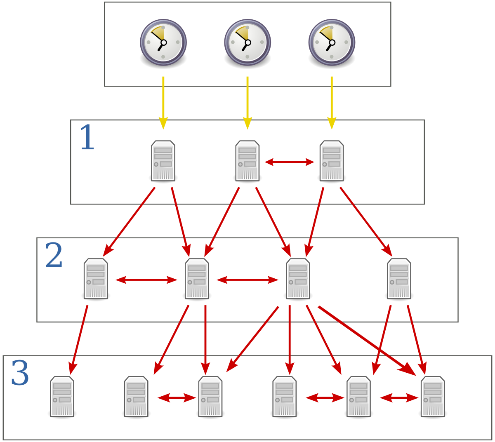
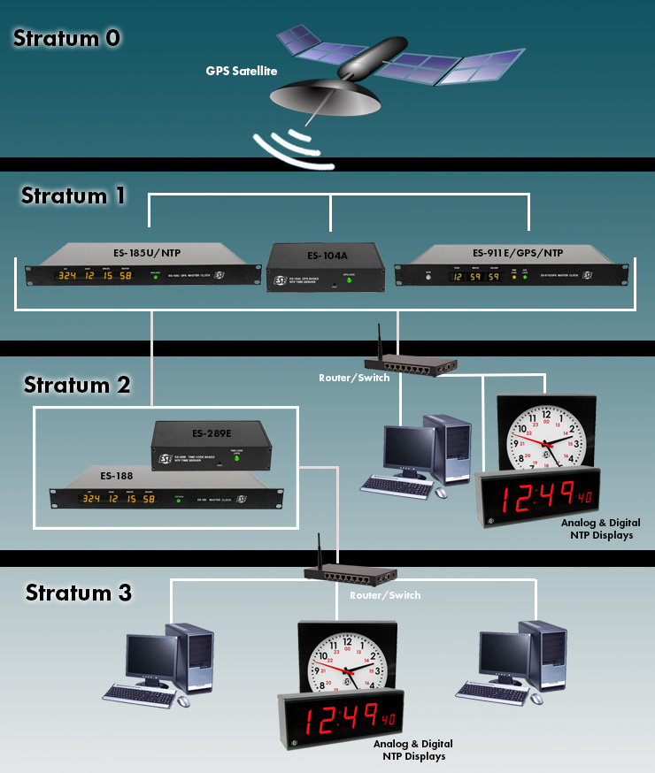

[Phần 2 - Tổng quan về kiến trúc Linux](https://github.com/volehuy1998/network-onboard/blob/master/README.md)

- [2.1 - Linux Kernel ( :arrow_up: UPDATED 21/01/2024)](https://github.com/volehuy1998/network-onboard/blob/master/linux-onboard/2.1%20-%20linux-arch-onboard.md#linux_kernel)
  - 2.1.1 - Vai trò của Linux Kernel ( :arrow_up: UPDATED 21/01/2024)
  - 2.1.2 - Tổng quan về Interrupt - Ngắt (UPDATED 05/09/2023)
- [2.2 - Quản lý người dùng và nhóm (UPDATED 17/09/2023)](https://github.com/volehuy1998/network-onboard/blob/master/linux-onboard/2.2%20-%20linux-user-management.md#user_and_group)
  - 2.2.1 - Khái niệm `User` (UPDATED 17/09/2023)
  - 2.2.2 - Khái niệm về nhóm, chính và phụ (UPDATED 12/09/2023)
  - 2.2.3 - Thay đổi tài khoản người dùng (UPDATED 13/09/2023)
  - 2.2.4 - Các thao tác quản lý trên người dùng và nhóm(UPDATED 11/09/2023)
  - 2.2.5 - Hạn chế quyền truy cập người dùng (UPDATED 13/09/2023)
  - 2.2.6 - Cấp quyền `sudo` tự do (UPDATED 11/09/2023)
  - 2.2.7 - Cấp quyền `sudo` với lệnh cụ thể (UPDATED 11/09/2023)
- [2.3 - Hệ thống tệp tin ( :arrow_up: UPDATED 07/01/2024)](https://github.com/volehuy1998/network-onboard/blob/master/linux-onboard/2.3%20-%20linux-file-system-overview.md#fs)
  - 2.3.1 - Phân cấp hệ thống tệp tin (UPDATED 26/08/2023)
  - 2.3.2 - RPM Package và phân loại (UPDATED 24/08/2023)
  - 2.3.3 - Kernel RPM Package (UPDATED 24/08/2023)
  - 2.3.4 - Tổng quan về quyền trên tệp tin ( :arrow_up: UPDATED 07/01/2024)
    - 2.3.4.1 - Quản lý quyền tệp tin (UPDATED 13/09/2023)
    - 2.3.4.2 - Quyền đặc biệt dành cho chủ sở hữu (SUID) và lỗ hổng leo thang đặc quyền (UPDATED 10/09/2023)
    - 2.3.4.3 - Quyền đặc biệt dành cho nhóm (UPDATED 10/09/2023)
    - 2.3.4.4 - Quyền đặc biệt Sticky bit (UPDATED 04/09/2023)
  - 2.3.5 - Xác định hệ thống tệp tin và thiết bị (UPDATED 07/11/2023)
- [2.4 - Tổng quan tiến trình Linux (UPDATED 04/10/2023)](https://github.com/volehuy1998/network-onboard/blob/master/linux-onboard/2.4%20-%20linux-process-overview.md#linux_process)
  - 2.4.1 - Trạng thái của tiến trình Linux (UPDATED 17/09/2023)
  - 2.4.2 - Kiểm soát các `Job` (UPDATED 04/10/2023)
  - 2.4.3 - Kết thúc tiến trình (UPDATED 18/09/2023)
  - 2.4.4 - Dịch vụ hạ tầng (UPDATED 21/09/2023)
  - 2.4.5 - Tổng quan về `systemd` (UPDATED 30/09/2023)
  - 2.4.6 - Kiểm soát dịch vụ hệ thống (UPDATED 04/10/2023)
  - 2.4.7 - Mẫu `unit` với ký hiệu `@` (UPDATED 04/10/2023)
  - 2.4.8 - Chi tiết tệp `unit` (UPDATED 04/10/2023)
    - 2.4.8.1 - Loại `unit` phổ biến `*.service` (UPDATED 03/10/2023)
    - 2.4.8.2 - Loại `unit` về `*.socket` (UPDATED 30/09/2023)
    - 2.4.8.3 - Loại `unit` về `*.path` (UPDATED 30/09/2023)
- [2.5 - Điều khiển an toàn từ xa (UPDATED 31/12/2023)](https://github.com/volehuy1998/network-onboard/blob/master/linux-onboard/2.5%20-%20linux-secure-remote-overview.md#remote_connection)
  - 2.5.1 - Tổng quan về kiến trúc giao thức `SSH` (UPDATED 31/12/2023)
    - 2.5.1.1 - Kiến trúc giao thức `SSH` (UPDATED 22/10/2023)
    - 2.5.1.2 - Những xem xét bảo mật về khía cạnh truyền dẫn (UPDATED 19/10/2023)
    - 2.5.1.3 - Những xem xét bảo mật về khía cạnh xác thực (UPDATED 19/10/2023)
    - 2.5.1.4 - Giao thức `SSH-1`, `SSH-2` và sự cải tiến (UPDATED 22/10/2023)
  - 2.5.2 - Cài đặt `OpenSSH`, kết nối và cấu hình (UPDATED 23/10/2023)
    - 2.5.2.1 - Sử dụng công cụ cơ bản (UPDATED 19/10/2023)
    - 2.5.2.2 - Thông tin về `finger print` tại máy khách và máy chủ (UPDATED 19/10/2023)
    - 2.5.2.3 - Hành vi xử lý chuẩn kết nối đến máy chủ (UPDATED 19/10/2023)
    - 2.5.2.4 - Cấu hình `ssh client` (UPDATED 21/10/2023)
    - 2.5.2.5 - Sử dụng `X11 Forwarding` và `Port Forwarding` (UPDATED 23/10/2023)
- [2.6 - Tổng quan về quản lý mạng (UPDATED 05/11/2023)](https://github.com/volehuy1998/network-onboard/blob/master/linux-onboard/2.6%20-%20linux-network-overview.md#network_manage)
  - 2.6.1 - Mô hình `TCP/IP` (UPDATED 25/10/2023)
  - 2.6.2 - Mô tả về `Network Interface` (UPDATED 01/11/2023)
  - 2.6.3 - Địa chỉ `v4` (UPDATED 25/10/2023)
  - 2.6.4 - Địa chỉ `v6` (UPDATED 25/10/2023)
  - 2.6.5 - Thông tin về `network interface`(UPDATED 25/10/2023)
  - 2.6.6 - Công cụ quản lý `nmcli`(UPDATED 05/11/2023)
  - 2.6.7 - Cấu hình và quản lý `hostname`(UPDATED 05/11/2023)
- [2.7 - Kiến trúc nhật ký hệ thống (UPDATED 17/12/2023)](#sys_log_arch)
  - [2.7.1 - Tổng quan (UPDATED 03/12/2023)](#log_overview)
  - [2.7.2 - Cách sử dụng `rsyslog` (UPDATED 06/12/2023)](#rsyslog)
  - [2.7.3 - Cách sử dụng `systemd-journald` (UPDATED 10/12/2023)](#journald)
  - [2.7.4 - Đồng bộ thời gian (UPDATED 17/12/2023)](#clock_time)
    - [2.7.4.1 - Tổng quan `Network Time Protocol` (UPDATED 17/12/2023)](#ntp)
    - [2.7.4.2 - Công cụ `datetimectl` (UPDATED 10/12/2023)](#datetimectl)
    - [2.7.4.3 - Cấu hình `NTP` sử dụng `chrony` (UPDATED 17/12/2023)](#chronyd)
    - [2.7.4.4 - Cấu hình `NTP` sử dụng `ntpd` (UPDATED 10/12/2023)](#ntpd)
- [2.8 - Lập lịch chạy cho tác vụ tương lai (UPDATED 01/01/2024)](https://github.com/volehuy1998/network-onboard/blob/master/linux-onboard/2.8%20-%20linux-job-scheduler.md#schedule_job)
  - 2.8.1 - Tổng quan (UPDATED 24/12/2023)
  - 2.8.2 - Cách sử dụng công cụ `at` (UPDATED 24/12/2023)
  - 2.8.3 - Cách sử dụng công cụ `cron` (UPDATED 24/12/2023)
  - 2.8.4 - Ứng dụng `systemd timer` (UPDATED 01/01/2024)
    - 2.8.4.1 - Cách sử dụng công cụ `systemd timer` (UPDATED 01/01/2024)
    - 2.8.4.2 - Quản lý loại tệp tạm thời (UPDATED 01/01/2024)
      - 2.8.4.2.1 - Cách sử dụng `systemd-tmpfiles --create` (UPDATED 01/01/2024)
      - 2.8.4.2.2 - Cách sử dụng `systemd-tmpfiles --clean` (UPDATED 01/01/2024)
      - 2.8.4.2.3 - Cách sử dụng `systemd-tmpfiles --remove` (UPDATED 01/01/2024)
- [2.9 - Quản lý tệp đóng gói và nén với công cụ `tar` ( :arrow_up: UPDATED 09/02/2024)](https://github.com/volehuy1998/network-onboard/blob/master/linux-onboard/2.9%20-%20linux-manage-compressed-tar-archives.md#manage_compress_tar_archive)
    - 2.9.1 - Tạo và quản lý tệp đóng gói ( :arrow_up: UPDATED 09/02/2024)
    - 2.9.2 - Tạo và quản lý tệp nén đóng gói ( :arrow_up: UPDATED 15/01/2024)
    - 2.9.3 - Quản lý tệp sao lưu gia tăng `incremental backup` ( :arrow_up: UPDATED 15/01/2024)
    - 2.9.4 - Chuyển tệp giữa các hệ thống một cách an toàn ( :arrow_up: UPDATED 15/01/2024)
    - 2.9.5 - Đồng bộ giữa các hệ thống một cách an toàn ( :arrow_up: UPDATED 15/01/2024)
- [2.10 - Quản lý `SELinux` ( :arrow_up: UPDATED 28/01/2024)](https://github.com/volehuy1998/network-onboard/blob/master/linux-onboard/2.10%20-%20linux-se-mode.md#selinux_manage)
    - 2.10.1 - Kiến trúc `SELinux` ( :arrow_up: UPDATED 27/01/2024)
    - 2.10.2 - Sử dụng `SELinux` cơ bản với chính sách `targeted` ( :arrow_up: UPDATED 28/01/2024)
      - 2.10.2.1 - Xem nhãn, kích hoạt và vô hiệu hóa `SELinux` ( :arrow_up: UPDATED 28/01/2024)
      - 2.10.2.2 - Xem định nghĩa chính sách `SELinux` ( :heavy_plus_sign: UPDATED 27/01/2024)
      - 2.10.2.3 - Auditing hành vi hệ thống ( :heavy_plus_sign: UPDATED 28/01/2024)
      - 2.10.2.4 - Kiểm soát `fcontext` với nhãn sẵn có ( :arrow_up: UPDATED 27/01/2024)
      - 2.10.2.5 - Kiểm soát `port` với nhãn sẵn có ( :arrow_up: UPDATED 27/01/2024)
      - 2.10.2.6 - Kiểm soát chính sách với  `boolean` ( :arrow_up: UPDATED 27/01/2024)
- [2.11 - Quản lý lưu trữ cơ bản ( :arrow_up: UPDATED 07/02/2024)](https://github.com/volehuy1998/network-onboard/blob/master/linux-onboard/2.11%20-%20linux-manage-basic-storage.md#manage_basic_storage)
    - 2.11.1 - Khái niệm phân vùng ổ cứng ( :heavy_plus_sign: UPDATED 05/01/2024)
    - 2.11.2 - Quản lý phân vùng theo định dạng ( :heavy_plus_sign: UPDATED 05/01/2024)
      - 2.11.2.1 - Quản lý phân vùng định dạng MBR ( :arrow_up: UPDATED 07/02/2024)
      - 2.11.2.2 - Quản lý phân vùng định dạng GPT ( :heavy_plus_sign: UPDATED 05/01/2024)
    - 2.10.3 - Tạo tệp hệ thống ( :heavy_plus_sign: UPDATED 05/01/2024)
    - 2.10.4 - Mount tệp hệ thống ( :heavy_plus_sign: UPDATED 05/01/2024)
      - 2.10.4.1 - Mount thủ công tệp hệ thống ( :heavy_plus_sign: UPDATED 05/01/2024)
      - 2.10.4.2 - Mount tự vĩnh viễn tệp hệ thống ( :heavy_plus_sign: UPDATED 05/01/2024)
    - 2.10.5 - Quản lý không gian `Swap` ( :heavy_plus_sign: UPDATED 05/01/2024)
      - 2.10.5.1 - Khái niệm không gian `Swap` ( :heavy_plus_sign: UPDATED 05/01/2024)
      - 2.10.5.2 - Tạo phân vùng `swap` ( :heavy_plus_sign: UPDATED 05/01/2024)
          
## <a name="sys_log_arch"></a>Kiến trúc nhật ký hệ thống
### <a name="log_overview"></a>Tổng quan 
Nhân hệ điều hành và các tiến trình khác đều ghi nhận lại nhật ký sự kiện xảy ra khi hệ thống đang chạy. Những nhật ký này được sử dụng để kiểm tra và khắc phục sự cố, người dùng có thể sử dụng công cụ `less` hoặc `tail` để kiểm tra nhật ký.

`systemd` là nền tảng để xây dựng nên `journald`. Dịch vụ `journald` kiến trúc thông điệp thành một định dạng tiêu chuẩn và viết nó một cách có cấu trúc, đánh chỉ mục,... và đưa vào kho dữ liệu để người dùng có thể truy vấn thông tin một cách tiện lợi thông qua `journalctl` va du lieu nay khong the doc bang cac chuong trinh thong thuong. Mặc định nhật ký sẽ được xóa mỗi khi khởi động lại.

```shell
[root@huyvl-linux-training ~]# systemctl status systemd-journald
* systemd-journald.service - Journal Service
   Loaded: loaded (/usr/lib/systemd/system/systemd-journald.service; static; vendor preset: disabled)
   Active: active (running) since Sat 2023-12-02 19:30:36 +07; 1min 18s ago
     Docs: man:systemd-journald.service(8)
           man:journald.conf(5)
 Main PID: 362 (systemd-journal)
   Status: "Processing requests..."
   CGroup: /system.slice/systemd-journald.service
           `-362 /usr/lib/systemd/systemd-journald

Dec 02 19:30:36 localhost.localdomain systemd-journal[362]: Runtime journal is using 8.0M (max allowed 91.8M, trying to leave 137.8M free of 902.7M avai…it 91.8M).
Dec 02 19:30:36 localhost.localdomain systemd-journal[362]: Journal started
Hint: Some lines were ellipsized, use -l to show in full.
[root@huyvl-linux-training ~]#
```

`rsyslog` có một chút khác biệt với `journald` bởi vì nó gửi dữ liệu tới các tệp nhật ký truyền thống như `/var/log`. `rsyslog` sắp xếp, chỉ định tệp nhật ký cụ thể theo loại chương trình và xem xét mức độ ưu tiên của từng thông tin. Ngoài các tệp tin nhất ký hệ thống, thư mục `/var/log` còn chứa các tệp nhật ký từ những dịch vụ khác trên hệ thống.

```shell
[root@huyvl-linux-training ~]# systemctl status rsyslog
* rsyslog.service - System Logging Service
   Loaded: loaded (/usr/lib/systemd/system/rsyslog.service; enabled; vendor preset: enabled)
   Active: active (running) since Sat 2023-12-02 19:31:21 +07; 59s ago
     Docs: man:rsyslogd(8)
           http://www.rsyslog.com/doc/
 Main PID: 1148 (rsyslogd)
   CGroup: /system.slice/rsyslog.service
           `-1148 /usr/sbin/rsyslogd -n

Dec 02 19:31:21 huyvl-linux-training.novalocal systemd[1]: Starting System Logging Service...
Dec 02 19:31:21 huyvl-linux-training.novalocal rsyslogd[1148]:  [origin software="rsyslogd" swVersion="8.24.0-57.el7_9.3" x-pid="1148" x-info="http://www...] start
Dec 02 19:31:21 huyvl-linux-training.novalocal systemd[1]: Started System Logging Service.
Hint: Some lines were ellipsized, use -l to show in full.
[root@huyvl-linux-training ~]#
```

### <a name="rsyslog"></a>Cách sử dụng `rsyslog`

| Tệp nhật ký | Loại tin nhắn được lưu trữ |
| --- | --- |
| `/var/log/messages` | Hầu hết các thông tin nhật ký hệ thống đều được lưu trữ tại đây. Ngoại trừ các thông tin về xác thực, xử lý thư điện tử, `job` được lập lịch, thông tin liên quan đến `debug`. |
| `/var/log/secure` | Lưu giữ các thông tin nhật ký hệ thống về sự kiện bảo mật, xác thực. |
| `/var/log/maillog` | Thông tin nhật ký về máy chủ thư điện tử. |
| `/var/log/cron` | Thông tin nhật ký về `job` lập lịch. |
| `/var/log/boot.log` | Liên quan đến khởi động hệ thống. | 

Một số dịch vụ không sử dụng dịch vụ `syslog` để quản lý nhật ký. Ví dụ như `Apache Web Server` lưu giữ nhật ký vào tệp con trong thư mục `/var/log`.

Mỗi sự kiện, mỗi tin nhắn đều thông báo đến hệ thống, tổng quát bao gồm 2 thành phần được cấu hình trước: 

- Hệ thống tạo tin nhắn: chịu tránh nhiệm tạo ra tin nhắn, thông báo. Ví dụ các từ khóa: `auth`, `authpriv`, `cron`, `daemon`, `kern`, `lpr`, `mail`, `mark`, `news`,  `syslog`,  `user`,  `uucp`  và từ `local0` đến `local7`. Hệ thống cho phép người dùng tự tạo ra các tin nhắn thông qua `localX`.
- Độ ưu tiên: mô tả về độ cứu bách của tin nhắn, thông báo. Ví dụ các từ khóa: `debug`, `info`, `notice`, `warning`, `err`,  `crit`, `alert`, `emerg`. Trong đó `info` bao gồm `notice`, `warning` nhưng ngoại trừ `debug`. Độ ưu tiên `error` bao gồm `crit`, `alert`, `emerg` nhưng ngaoị trừ `debug` và `info`.

, cấu hình được chứa tại `/etc/rsyslog.conf` như sau:
```shell
[root@huyvl-linux-training ~]# cat /etc/rsyslog.conf
$ModLoad imuxsock # provides support for local system logging (e.g. via logger command)
$ModLoad imjournal # provides access to the systemd journal
$RepeatedMsgReduction on
$WorkDirectory /var/lib/rsyslog
$ActionFileDefaultTemplate RSYSLOG_TraditionalFileFormat
$IncludeConfig /etc/rsyslog.d/*.conf
$OmitLocalLogging on
$IMJournalStateFile imjournal.state
*.info;mail.none;authpriv.none;cron.none                /var/log/messages
authpriv.*                                              /var/log/secure
mail.*                                                  -/var/log/maillog
cron.*                                                  /var/log/cron
*.emerg                                                 :omusrmsg:*
uucp,news.crit                                          /var/log/spooler
local7.*                                                /var/log/boot.log
[root@huyvl-linux-training ~]#
```

Chú thích:

- `*.info;mail.none;authpriv.none;cron.none                /var/log/messages`: tất cả tin nhắn mang độ ưu tiên `info` đều được lưu trữ tại `/var/log/messages` ngoại trừ các thông tin của `mail.none`, `authpriv.none` và `cron.none` và chúng sẽ được gửi vào nơi khác.
- Tất cả thông tin xác thực hoặc liên quan đến bảo mật với tất cả các cấp độ ưu tiên `authpriv.*` đều được lưu tại `/var/log/secure`. Ví dụ: đăng nhập, thực hiện `su` hoặc `pam`, ...
- Tất cả thông tin thư điện tử với tất cả các cấp độ ưu tiên `mail.*` được lưu tại `/var/log/maillog`. Dấu trừ (`-`) mô tả dữ liệu sẽ được viết một cách bất đồng bộ.
- Tất cả thông tin về việc chạy bằng lập lịch với tất cả cấp độ `cron.*` được lưu tại `/var/log/cron`. 
- `$IncludeConfig /etc/rsyslog.d/*.conf`: mô đun hóa tất cả các cấu hình bằng `Drop-In` như [ví dụ tiến trình hệ thống](https://github.com/volehuy1998/network-onboard/blob/master/linux-onboard/linux-arch-onboard.md#ctl_sys_svc), tất cả tệp cấu hình `*.conf` nằm trong thư mục `/etc/rsyslog.d`.

Ví dụ sử dụng hệ thống tạo tin nhắn `localX` để tùy biến tin nhấn `sshd` như sau:
```shell
[root@huyvl-linux-training ~]# grep -i syslog /etc/ssh/sshd_config 
#SyslogFacility AUTH
SyslogFacility AUTHPRIV 
[root@huyvl-linux-training ~]# mkdir -v /etc/systemd/system/sshd.service.d/
mkdir: created directory '/etc/systemd/system/sshd.service.d/'
[root@huyvl-linux-training ~]# vi /etc/systemd/system/sshd.service.d/00-logging.conf
[root@huyvl-linux-training ~]# systemctl daemon-reload
[root@huyvl-linux-training ~]# systemctl status sshd
* sshd.service - OpenSSH server daemon
   Loaded: loaded (/usr/lib/systemd/system/sshd.service; enabled; vendor preset: enabled)
  Drop-In: /etc/systemd/system/sshd.service.d
           `-00-logging.conf
   Active: active (running) since Sat 2023-12-02 20:20:22 +07; 7min ago
     Docs: man:sshd(8)
           man:sshd_config(5)
 Main PID: 32742 (sshd)
   CGroup: /system.slice/sshd.service
           `-32742 /usr/sbin/sshd -D

Dec 02 20:23:38 huyvl-linux-training.novalocal sshd[32742]: Received SIGHUP; restarting.
Dec 02 20:23:38 huyvl-linux-training.novalocal sshd[32742]: Server listening on 0.0.0.0 port 22.
Dec 02 20:23:38 huyvl-linux-training.novalocal systemd[1]: Reloaded OpenSSH server daemon.
Dec 02 20:23:46 huyvl-linux-training.novalocal systemd[1]: [/etc/systemd/system/sshd.service.d/0-logging.conf:1] Assignment outside of section...noring.
Dec 02 20:23:48 huyvl-linux-training.novalocal systemd[1]: Reloading OpenSSH server daemon.
Dec 02 20:23:48 huyvl-linux-training.novalocal sshd[32742]: Received SIGHUP; restarting.
Dec 02 20:23:48 huyvl-linux-training.novalocal systemd[1]: Reloaded OpenSSH server daemon.
Dec 02 20:23:48 huyvl-linux-training.novalocal sshd[32742]: Server listening on 0.0.0.0 port 22.
Dec 02 20:25:33 huyvl-linux-training.novalocal systemd[1]: [/etc/systemd/system/sshd.service.d/00-logging.conf:1] Assignment outside of sectio...noring.
Dec 02 20:27:24 huyvl-linux-training.novalocal systemd[1]: [/etc/systemd/system/sshd.service.d/00-logging.conf:1] Assignment outside of sectio...noring.
Hint: Some lines were ellipsized, use -l to show in full.
[root@huyvl-linux-training ~]#
[root@huyvl-linux-training ~]# vi /etc/rsyslog.d/00-sshd.conf
[root@huyvl-linux-training ~]# cat /etc/rsyslog.d/00-sshd.conf
local5.*        /var/log/sshd.log
[root@huyvl-linux-training ~]# systemctl daemon-reload
[root@huyvl-linux-training ~]#
[root@huyvl-linux-training ~]# date && logger -p local5.info "Sending info from local5"
Sat Dec  2 20:38:54 +07 2023
[root@huyvl-linux-training ~]# date && logger -p local5.warning "Sending warning from local5"
Sat Dec  2 20:39:04 +07 2023
[root@huyvl-linux-training ~]# tail /var/log/sshd.log 
Dec  2 20:38:54 huyvl-linux-training root: Sending info from local5
Dec  2 20:39:04 huyvl-linux-training root: Sending warning from local5
[root@huyvl-linux-training ~]# 
```

### <a name="journald"></a>Cách sử dụng `systemd-journald`
Dịch vụ `systemd-journald` lưu trữ dữ liệu nhật ký có tổ chức. Dữ liệu đã bao gồm những thông tin bổ sung về sự kiện. Ví dụ các sự kiện nhật ký hệ thống, thông tin này bao gồm độ ưu tiên và hệ thống tạo tin nhắn. Để nhìn thấy nhật ký tin nhắn cần lệnh `journalctl`, người dùng có thể sử dụng lệnh này lọc và tìm kiếm có chủ đích về sự kiện dựa trên các tùy chọn. Nếu người dùng đang chạy lệnh với `root` sẽ có toàn quyền truy cập nhật ký hệ thống, mặc dù người dùng thông thường có thể sử dụng `journalctl` nhưng hệ thống sẽ hạn chế một số tin nhắn nhất định.

`systemd-journald` không lưu trữ lâu dài, tệp tin sẽ được tái tạo sau mỗi lần khởi động hệ thống:

```shell
[root@huyvl-linux-training ~]# ls -l /var/log/journal/
ls: cannot access /var/log/journal/: No such file or directory
[root@huyvl-linux-training ~]# 
[root@huyvl-linux-training ~]# ls -l /run/log/journal/
total 0
drwxr-s---+ 2 root systemd-journal 60 Dec  3 11:25 4627877ac600a902ac91b27042bbed2e
drwxr-x---  2 root root            60 Dec  3 11:25 eaf7942043e04b54a10d3d7d7b613fab
[root@huyvl-linux-training ~]# 
```

Lệnh `journalctl` sẽ làm nổi bật những tin nhắn quan trọng:

- Đối với độ ưu tiên `notice` hoặc `warning` sẽ in đậm.
- Đối với độ ưu tiên `error` hoặc nghiêm trọng hơn sẽ có màu đỏ.

Chia khóa để sử dụng `journalctl` hữu ích là sử dụng để tìm kiếm những tin nhắn hữu ích cho việc xử lý sự cố hoặc xác minh một thông tin. Về mặc định, lệnh `journalctl -n` sẽ hiển thị `10` dòng tin nhắn, người dùng có thể điều chỉnh số lượng phù hợp bằng cách chỉ định con số cụ thể:

```shell
[root@huyvl-linux-training ~]# journalctl -n
-- Logs begin at Sun 2023-12-03 11:25:18 +07, end at Wed 2023-12-06 02:33:39 +07. --
Dec 06 02:31:20 huyvl-linux-training.novalocal sshd[20336]: lastlog_openseek: Couldnt stat /var/log/lastlog: No such file or director
Dec 06 02:31:20 huyvl-linux-training.novalocal root[20355]: [171.252.154.38] # 04/12/23 22:03:36 ssh-add -L
Dec 06 02:31:37 huyvl-linux-training.novalocal root[20363]: [171.252.154.38] # 06/12/23 02:31:37 tail /var/log/journald
Dec 06 02:31:41 huyvl-linux-training.novalocal root[20371]: [171.252.154.38] # 06/12/23 02:31:41 tail /run/log/journald
Dec 06 02:31:52 huyvl-linux-training.novalocal root[20379]: [171.252.154.38] # 06/12/23 02:31:52 ls -l /run/log/journal/
Dec 06 02:31:54 huyvl-linux-training.novalocal root[20387]: [171.252.154.38] # 06/12/23 02:31:52 ls -l /run/log/journal/
Dec 06 02:31:59 huyvl-linux-training.novalocal root[20395]: [171.252.154.38] # 06/12/23 02:31:59 ls -l /var/log/journal/
Dec 06 02:32:00 huyvl-linux-training.novalocal root[20402]: [171.252.154.38] # 06/12/23 02:31:59 ls -l /var/log/journal/
Dec 06 02:32:03 huyvl-linux-training.novalocal root[20410]: [171.252.154.38] # 06/12/23 02:32:03 ls -l /run/log/journal/
Dec 06 02:33:39 huyvl-linux-training.novalocal root[20419]: [171.252.154.38] # 06/12/23 02:33:24 journalctl
[root@huyvl-linux-training ~]# 
[root@huyvl-linux-training ~]# 
[root@huyvl-linux-training ~]# journalctl -n 3
-- Logs begin at Sun 2023-12-03 11:25:18 +07, end at Wed 2023-12-06 02:39:29 +07. --
Dec 06 02:38:35 huyvl-linux-training.novalocal root[20428]: [171.252.154.38] # 06/12/23 02:38:22 journalctl -n
Dec 06 02:39:29 huyvl-linux-training.novalocal root[20435]: [171.252.154.38] # 06/12/23 02:38:22 journalctl -n
Dec 06 02:39:29 huyvl-linux-training.novalocal root[20442]: [171.252.154.38] # 06/12/23 02:38:22 journalctl -n
[root@huyvl-linux-training ~]# 
```

Sử dụng tùy chọn `journalctl -f` để hiện thị `10` dòng cuối cùng và tiếp tục theo dõi:

```shell
[root@huyvl-linux-training ~]# journalctl -f
-- Logs begin at Sun 2023-12-03 11:25:18 +07. --
Dec 06 02:31:59 huyvl-linux-training.novalocal root[20395]: [171.252.154.38] # 06/12/23 02:31:59 ls -l /var/log/journal/
Dec 06 02:32:00 huyvl-linux-training.novalocal root[20402]: [171.252.154.38] # 06/12/23 02:31:59 ls -l /var/log/journal/
Dec 06 02:32:03 huyvl-linux-training.novalocal root[20410]: [171.252.154.38] # 06/12/23 02:32:03 ls -l /run/log/journal/
Dec 06 02:33:39 huyvl-linux-training.novalocal root[20419]: [171.252.154.38] # 06/12/23 02:33:24 journalctl
Dec 06 02:38:35 huyvl-linux-training.novalocal root[20428]: [171.252.154.38] # 06/12/23 02:38:22 journalctl -n
Dec 06 02:39:29 huyvl-linux-training.novalocal root[20435]: [171.252.154.38] # 06/12/23 02:38:22 journalctl -n
Dec 06 02:39:29 huyvl-linux-training.novalocal root[20442]: [171.252.154.38] # 06/12/23 02:38:22 journalctl -n
Dec 06 02:39:30 huyvl-linux-training.novalocal root[20451]: [171.252.154.38] # 06/12/23 02:39:30 journalctl -n 3
Dec 06 02:40:19 huyvl-linux-training.novalocal root[20460]: [171.252.154.38] # 06/12/23 02:40:04 journalctl
Dec 06 02:41:56 huyvl-linux-training.novalocal root[20469]: [171.252.154.38] # 06/12/23 02:41:48 journalctl -r

^C
[root@huyvl-linux-training ~]# 
```

Sử dụng tùy chọn `journalctl -p` dể lọc tin nhắn dựa trên mức độ ưu tiên, có thể bằng tên  hoặc số:

```shell
[root@huyvl-linux-training ~]# journalctl -p err -f
-- Logs begin at Sun 2023-12-03 11:25:18 +07. --
Dec 03 19:49:47 huyvl-linux-training.novalocal sshd[18490]: pam_lastlog(sshd:session): unable to open /var/log/lastlog: No such file or directory
Dec 03 19:49:53 huyvl-linux-training.novalocal sshd[18490]: pam_systemd(sshd:session): Failed to release session: Interrupted system call
Dec 03 19:51:10 huyvl-linux-training.novalocal sshd[18531]: pam_lastlog(sshd:session): unable to open /var/log/lastlog: No such file or directory
Dec 03 19:52:32 huyvl-linux-training.novalocal sshd[18564]: pam_lastlog(sshd:session): unable to open /var/log/lastlog: No such file or directory
Dec 03 19:53:30 huyvl-linux-training.novalocal sshd[18598]: pam_lastlog(sshd:session): unable to open /var/log/lastlog: No such file or directory
Dec 03 20:06:47 huyvl-linux-training.novalocal sshd[18598]: pam_systemd(sshd:session): Failed to release session: Interrupted system call
Dec 04 22:03:11 huyvl-linux-training.novalocal sshd[19816]: pam_lastlog(sshd:session): unable to open /var/log/lastlog: No such file or directory
Dec 04 22:03:23 huyvl-linux-training.novalocal sshd[19855]: pam_lastlog(sshd:session): unable to open /var/log/lastlog: No such file or directory
Dec 04 22:03:36 huyvl-linux-training.novalocal sshd[19900]: pam_lastlog(sshd:session): unable to open /var/log/lastlog: No such file or directory
Dec 06 02:31:19 huyvl-linux-training.novalocal sshd[20334]: pam_lastlog(sshd:session): unable to open /var/log/lastlog: No such file or directory

^C
[root@huyvl-linux-training ~]# 
```

Sử dụng tùy chọn `journalctl -u` để chỉ lọc ra những tin nhắn của `system unit`:
```shell
[root@huyvl-linux-training ~]# journalctl -f -u postfix.service
-- Logs begin at Sun 2023-12-03 11:25:18 +07. --
Dec 03 11:26:03 huyvl-linux-training.novalocal systemd[1]: Starting Postfix Mail Transport Agent...
Dec 03 11:26:03 huyvl-linux-training.novalocal postfix/postfix-script[1019]: starting the Postfix mail system
Dec 03 11:26:03 huyvl-linux-training.novalocal postfix/master[1042]: daemon started -- version 2.10.1, configuration /etc/postfix
Dec 03 11:26:03 huyvl-linux-training.novalocal systemd[1]: Started Postfix Mail Transport Agent.

^C
[root@huyvl-linux-training ~]# 
```

Sử dụng tùy chọn `--since` để giới hạn khung giờ:

```shell
[root@huyvl-linux-training ~]# journalctl --since today -p err
-- Logs begin at Sun 2023-12-03 11:25:18 +07, end at Wed 2023-12-06 02:55:39 +07. --
Dec 06 02:31:19 huyvl-linux-training.novalocal sshd[20334]: pam_lastlog(sshd:session): unable to open /var/log/lastlog: No such file or directory
[root@huyvl-linux-training ~]#                                
[root@huyvl-linux-training ~]# 
[root@huyvl-linux-training ~]# journalctl --since today -p warning
-- Logs begin at Sun 2023-12-03 11:25:18 +07, end at Wed 2023-12-06 02:55:45 +07. --
Dec 06 02:31:19 huyvl-linux-training.novalocal sshd[20334]: pam_lastlog(sshd:session): unable to open /var/log/lastlog: No such file or directory
[root@huyvl-linux-training ~]# 
```

, cụ thể hóa với `YYYY-MM-Đ hh:mm:ss` và kết hợp với `--until` như sau:

```shell
[root@huyvl-linux-training ~]# journalctl -p debug --since "2023-12-05 13:00:00" --until "2023-12-05 17:00:00"
-- Logs begin at Sun 2023-12-03 11:25:18 +07, end at Wed 2023-12-06 02:55:47 +07. --
Dec 05 13:01:01 huyvl-linux-training.novalocal systemd[1]: Started Session 89 of user root.
Dec 05 13:01:01 huyvl-linux-training.novalocal CROND[20153]: (root) CMD (run-parts /etc/cron.hourly)
Dec 05 13:01:01 huyvl-linux-training.novalocal run-parts(/etc/cron.hourly)[20156]: starting 0anacron
Dec 05 13:01:01 huyvl-linux-training.novalocal run-parts(/etc/cron.hourly)[20162]: finished 0anacron
Dec 05 14:01:01 huyvl-linux-training.novalocal systemd[1]: Started Session 90 of user root.
Dec 05 14:01:01 huyvl-linux-training.novalocal CROND[20166]: (root) CMD (run-parts /etc/cron.hourly)
Dec 05 14:01:01 huyvl-linux-training.novalocal run-parts(/etc/cron.hourly)[20169]: starting 0anacron
Dec 05 14:01:01 huyvl-linux-training.novalocal run-parts(/etc/cron.hourly)[20175]: finished 0anacron
Dec 05 15:01:01 huyvl-linux-training.novalocal systemd[1]: Started Session 91 of user root.
Dec 05 15:01:01 huyvl-linux-training.novalocal CROND[20178]: (root) CMD (run-parts /etc/cron.hourly)
Dec 05 15:01:01 huyvl-linux-training.novalocal run-parts(/etc/cron.hourly)[20181]: starting 0anacron
Dec 05 15:01:01 huyvl-linux-training.novalocal run-parts(/etc/cron.hourly)[20187]: finished 0anacron
Dec 05 16:01:01 huyvl-linux-training.novalocal systemd[1]: Started Session 92 of user root.
Dec 05 16:01:01 huyvl-linux-training.novalocal CROND[20191]: (root) CMD (run-parts /etc/cron.hourly)
Dec 05 16:01:01 huyvl-linux-training.novalocal run-parts(/etc/cron.hourly)[20194]: starting 0anacron
Dec 05 16:01:01 huyvl-linux-training.novalocal run-parts(/etc/cron.hourly)[20200]: finished 0anacron
[root@huyvl-linux-training ~]# 
```

Xem nhật ký trong thời gian `1` tiếng gần đây nhất, kết hợp với `-r` để thay đổi cách sắp xếp:

```shell
[root@huyvl-linux-training ~]# journalctl --since "-1 hour" -n 5
-- Logs begin at Sun 2023-12-03 11:25:18 +07, end at Wed 2023-12-06 03:03:02 +07. --
Dec 06 02:31:19 huyvl-linux-training.novalocal sshd[20334]: Address 171.252.154.38 maps to dynamic-adsl.viettel.vn, but this does not map back to t
Dec 06 02:31:19 huyvl-linux-training.novalocal sshd[20334]: Accepted publickey for root from 171.252.154.38 port 19191 ssh2: RSA SHA256:hWEFgtn6kuk
Dec 06 02:31:19 huyvl-linux-training.novalocal systemd-logind[500]: New session 103 of user root.
Dec 06 02:31:19 huyvl-linux-training.novalocal systemd[1]: Started Session 103 of user root.
Dec 06 02:31:19 huyvl-linux-training.novalocal sshd[20334]: pam_unix(sshd:session): session opened for user root by (uid=0)
[root@huyvl-linux-training ~]# 
[root@huyvl-linux-training ~]# 
[root@huyvl-linux-training ~]# journalctl --since "-1 hour" -n 5 -r
-- Logs begin at Sun 2023-12-03 11:25:18 +07, end at Wed 2023-12-06 03:03:08 +07. --
Dec 06 03:03:00 huyvl-linux-training.novalocal root[21171]: [171.252.154.38] # 06/12/23 03:02:58 journalctl --since "-1 hour"
Dec 06 03:02:34 huyvl-linux-training.novalocal root[21162]: [171.252.154.38] # 06/12/23 03:02:33 journalctl -n 10 --since "-1 hour"
Dec 06 03:02:34 huyvl-linux-training.novalocal root[21155]: [171.252.154.38] # 06/12/23 03:02:33 journalctl -n 10 --since "-1 hour"
Dec 06 03:02:28 huyvl-linux-training.novalocal root[21146]: [171.252.154.38] # 06/12/23 03:02:28 journalctl --since "-1 hour"
Dec 06 03:02:20 huyvl-linux-training.novalocal root[21137]: [171.252.154.38] # 06/12/23 03:02:20 journalctl -n 5 --since "-2 hour"
[root@huyvl-linux-training ~]# 
```

Phân tích cụ thể bên trong tin nhắn thông qua tùy chọn `-o verbose` như sau:

```shell
[root@huyvl-linux-training ~]# journalctl -n 1 
-- Logs begin at Sun 2023-12-03 11:25:18 +07, end at Wed 2023-12-06 03:05:13 +07. --
Dec 06 03:05:13 huyvl-linux-training.novalocal root[21257]: [171.252.154.38] # 06/12/23 03:05:13 journalctl -n 1
[root@huyvl-linux-training ~]# 
[root@huyvl-linux-training ~]# 
[root@huyvl-linux-training ~]# journalctl -n 1 -o verbose
-- Logs begin at Sun 2023-12-03 11:25:18 +07, end at Wed 2023-12-06 03:05:23 +07. --
Wed 2023-12-06 03:05:23.230505 +07 [s=9facfe363e594c8888f92b6293dca704;i=6d3;b=8b4c9b1c96324764972716cbf181a492;m=355db32878;t=60bc8c136ec02;x=533d
    _UID=0
    _GID=0
    _BOOT_ID=8b4c9b1c96324764972716cbf181a492
    _MACHINE_ID=4627877ac600a902ac91b27042bbed2e
    PRIORITY=7
    _CAP_EFFECTIVE=1fffffffff
    _SYSTEMD_CGROUP=/
    _TRANSPORT=syslog
    _HOSTNAME=huyvl-linux-training.novalocal
    _COMM=logger
    _AUDIT_LOGINUID=0
    SYSLOG_FACILITY=22
    SYSLOG_IDENTIFIER=root
    _AUDIT_SESSION=104
    MESSAGE=[171.252.154.38] # 06/12/23 03:05:13 journalctl -n 1
    _PID=21280
    _SOURCE_REALTIME_TIMESTAMP=1701806723230505
lines 1-19/19 (END)
```

Theo dõi thông qua mã định danh của tiến trình:

```shell
[root@huyvl-linux-training ~]# ps aux | grep pts
root     20735  0.0  0.3 156868  5696 ?        Ss   02:58   0:00 sshd: root@pts/0
root     20737  0.0  0.1 115644  2164 pts/0    Ss   02:58   0:00 -bash
root     21347  0.0  0.0  51732  1732 pts/0    R+   03:07   0:00 ps aux
root     21348  0.0  0.0   9092   680 pts/0    S+   03:07   0:00 grep --color=auto pts
[root@huyvl-linux-training ~]# journalctl _PID=20735
-- Logs begin at Sun 2023-12-03 11:25:18 +07, end at Wed 2023-12-06 03:07:50 +07. --
Dec 06 02:58:11 huyvl-linux-training.novalocal sshd[20735]: Address 171.252.154.38 maps to dynamic-ip-adsl.viettel.vn, but this does not map back t
Dec 06 02:58:12 huyvl-linux-training.novalocal sshd[20735]: Accepted publickey for root from 171.252.154.38 port 28545 ssh2: RSA SHA256:hWEFgtn6kuk
Dec 06 02:58:12 huyvl-linux-training.novalocal sshd[20735]: pam_unix(sshd:session): session opened for user root by (uid=0)
Dec 06 02:58:12 huyvl-linux-training.novalocal sshd[20735]: pam_lastlog(sshd:session): unable to open /var/log/lastlog: No such file or directory
lines 1-5/5 (END)
```

Mặc định `systemd-journald` được cấu hình để không phải lưu giữ tin nhắn lâu dài với tùy chọn  `Storage=volatile` như sau:

```shell
[root@huyvl-linux-training ~]# man journald.conf | grep Storage= -A5 
       Storage=
           Controls where to store journal data. One of "volatile", "persistent", "auto" and "none". If "volatile", journal log
           data will be stored only in memory, i.e. below the /run/log/journal hierarchy (which is created if needed). If
           "persistent", data will be stored preferably on disk, i.e. below the /var/log/journal hierarchy (which is created if
           needed), with a fallback to /run/log/journal (which is created if needed), during early boot and if the disk is not
           writable.  "auto" is similar to "persistent" but the directory /var/log/journal is not created if needed, so that its
--
       are stored in a journal file at all. So it will not work if Storage=none is set. It should be noted that usually the second
       method is used by syslog daemons, so the Storage= option, and not the ForwardToSyslog= option, is relevant for them.

SEE ALSO
       systemd(1), systemd-journald.service(8), journalctl(1), systemd.journal-fields(7), systemd-system.conf(5)

NOTES
[root@huyvl-linux-training ~]# 
[root@huyvl-linux-training ~]# 
[root@huyvl-linux-training ~]# ls /run/log/journal/
4627877ac600a902ac91b27042bbed2e  eaf7942043e04b54a10d3d7d7b613fab
[root@huyvl-linux-training ~]# 
[root@huyvl-linux-training ~]# ls /var/log/journal/
ls: cannot access /var/log/journal/: No such file or directory
[root@huyvl-linux-training ~]# 
[root@huyvl-linux-training ~]# grep Storage= /etc/systemd/journald.conf 
#Storage=auto
[root@huyvl-linux-training ~]# 
```

Chú thích:

- `volatile`: lưu trữ nhật ký vào thư mục `/run/log/journal`, bởi vì thư mục `/run` chỉ tồn tại trên bộ nhớ nên sẽ mất khi khởi động máy.
- `persistent`: lưu trữ nhật ký vào thư mục `/var/log/journal`, thư mục này nằm trên ổ cứng nên sẽ không bị mất khi khởi động máy. Nếu thư mục `/var/log/journal` không tồn tại thì `systemd-journald` sẽ tự động tạo.
- `auto`: nếu thư mục `/var/log/journal` tồn tại nó sẽ hoạt động theo cách `persistent`, ngược lại sẽ hoạt động theo `volatile`.
- `none`: hệ thống sẽ xóa tất cả nhật ký.

Sử dụng tùy chọn `Storage=persistent` để có thể lưu giữ tin nhắn lâu dài bằng cách viết chúng vào ổ cứng:

```shell
[root@huyvl-linux-training ~]# vi /etc/systemd/journald.conf 
[root@huyvl-linux-training ~]# grep ^Storage= /etc/systemd/journald.conf 
Storage=persistent
[root@huyvl-linux-training ~]# systemctl restart systemd-journald.service
[root@huyvl-linux-training ~]# 
[root@huyvl-linux-training ~]# ls -al /var/log/journal/
total 12
drwxr-xr-x  3 root root 4096 Dec  9 19:37 .
drwxr-xr-x. 9 root root 4096 Dec  9 19:37 ..
drwxr-xr-x  2 root root 4096 Dec  9 19:37 4627877ac600a902ac91b27042bbed2e
[root@huyvl-linux-training ~]# 
```

Tùy chọn `Storage=none` sẽ dừng việc ghi nhật ký thậm chí `systemd-journald` vẫn hoạt động:

```shell
[root@huyvl-linux-training ~]# grep ^Storage= /etc/systemd/journald.conf 
Storage=none
[root@huyvl-linux-training ~]# systemctl restart systemd-journald.service
[root@huyvl-linux-training ~]# systemctl status systemd-journald.service
* systemd-journald.service - Journal Service
   Loaded: loaded (/usr/lib/systemd/system/systemd-journald.service; static; vendor preset: disabled)
   Active: active (running) since Sat 2023-12-09 19:47:41 +07; 4s ago
     Docs: man:systemd-journald.service(8)
           man:journald.conf(5)
 Main PID: 24188 (systemd-journal)
   Status: "Processing requests..."
   CGroup: /system.slice/systemd-journald.service
           -24188 /usr/lib/systemd/systemd-journald
[root@huyvl-linux-training ~]# 
[root@huyvl-linux-training ~]# 
[root@huyvl-linux-training ~]# journalctl -n 1 -r
-- Logs begin at Sun 2023-12-03 11:25:18 +07, end at Sat 2023-12-09 19:47:22 +07. --
Dec 09 19:47:22 huyvl-linux-training.novalocal systemd-journal[24123]: Journal stopped
[root@huyvl-linux-training ~]# 
```

</u>Lưu ý</u>: tùy chọn `--boot (-b)` và `--list-boots` sẽ rất hữu dụng khi xem xét nguyên nhân gây ra lỗi hệ thống.

### <a name="clock_time"></a>Đồng bộ thời gian

#### <a name="ntp"></a>Tổng quan `Network Time Protocol`

Đồng bộ thời gian được sử dụng bên trong mô hình mạng để duy trì sử đồng bộ giữa các thiết bị để đảm bảo việc phân tích diễn ra tốt và đơn giản hóa việc khắc phục sự cố. Nếu không có sử đồng bộ này thì việc phân tích nhật ký giữa các thiết bị sẽ rất khó khăn. Mặc dù giao thức `PTP (Precision Time Protocol)` đang được chấp nhận và đã được áp dụng các một số cơ sở hạ tầng mạng nhưng `NTP (Network Time Protocol)` vẫn là giao thức được sử dụng phổ biến và triển khai rộng rãi nhất cho đến nay. Mô hình `NTP` triển khai theo phân cấp tầng, kể từ khi phát triển đến nay `NTP` đã phát hành nhiều phiên ban khác nhau và thời điểm hiện tại là `NTPv4`. Một thuật ngữ phổ biến để chỉ sự chính xác giữa của đồng hồ là hệ thống phân cấp `Stratum`. Liên tưởng đến hệ thống này là cấu trúc dữ liệu dạng cây, nút trên cùng của cây có độ chính xác cao nhất và nút ở dưới có độ chính xác kém nhất. 

<div style="text-align:center"></div>

Đồng hồ chính xác nhất hay còn gọi là `Reference clock` hoặc `Stratum 0`. Thiết bị có độ chính xác `Stratum 0` rất đắt tiền chỉ tồn tại ở một số địa điểm nhất định trên thế giới, được sử dụng truyền tín hiệu vệ tinh. `Stratum 0` chỉ kết nối trực tiếp đến `Stratum 1`, các `Stratum` đồng cấp còn lại có thể nhận thời gian lẫn nhau. Mỗi khi có tín hiệu được truyền xuống thì giá trị `Stratum` sẽ tăng lên `1` tương đương việc giảm độ chính xác. Ví dụ nếu một máy tính nhận tín hiệu từ `Stratum 1` thí bản thân nó là `Stratum 2`. Mực độ tối đa là `Stratum 15`. Thông thường không có thiêt bị nào thấp hơn `Stratum 3`. Một máy tính khi mới khởi động sẽ có mức độ `Stratum 16` cho đến khi đồng bộ được đồng hồ từ máy chủ `NTP`.

<div style="text-align:center"></div>

Giao thức `NTP` sử dụng thuật toán Marzullo. Máy chủ `NTP` sẽ không gửi trực tiếp thời gian chuẩn cho máy khách mà thông qua sự xê dịch (bao gồm: độ trễ, quảng đường, ...) để máy khách tự ước lượng một khoảng thời gian để thực hiện phép toán `+` hoặc `-`. 

Ví dụ bối cảnh như sau:

<div style="text-align:center"></div>

- <u>Bước 1</u>: Máy khách sử dụng thời điểm cục bộ, ví dụ `A1=13:00(PM)` và gửi nó đến máy chủ `NTP`.
- <u>Bước 2</u>: Máy chủ `NTP` nhận được yêu cầu tại thời điểm cục bộ ví dụ `B1=14:00(PM)` nhưng có rất nhiều yêu cầu nên vào thời điểm `B2=14:01(PM)` thì mới gửi về máy khách.
- <u>Bước 3</u>: Bởi vì đường truyền có vấn đề nên nhận được thông tin vào lúc `A2=13:05(PM)`.
- <u>Bước 4</u>: Máy khách tự xác định thời điểm thông qua 2 quy tắc, loại bỏ thời gian trì hoãn tại máy chủ và chỉ lấy khoảng thời gian trên đoạn đường 1 chiều. 
  - Phép toán chính: tính toán độ sai lệch `A2-A1-(B2-B1) = 4(minutes)`.
  - Phép toán phụ: chỉ lấy 1 chiều, tạm tính bằng trung bình cộng `2(minutes)`.
  - Phép toán phụ: lấy thời điểm thật `B2+2(minutes) = 14:03(PM)`.
  - Phép toán phụ: đồng hồ tại máy khách cần "xoay" kim `+58(minutes)` để có được thời điểm `14:03(PM)` của máy chủ "vừa trải qua". 
- <u>Bước 5</u>: giá trị cần xem xét là `4(minutes)`, đây là con số không thể được chấp nhận vì nó sai lệch quá lớn, gây ra hậu quả nghiêm trọng trong dây chuyền công nghiệp. Vì thế cần tiếp tục cập nhật `A1=14:03(PM)` và quay lại `Bước 1` cho đến khi `A2-A1-(B2-B1)` tiến đến gần `0` hoặc độ sai lệch có thể chấp nhận được.

Giao thức `NTP` được triển khai trong không gian ứng dụng của người dùng và chạy nền. Có `2` sự lựa chọn là `ntpd` và `chrony`, chúng có một số [sự khác biệt](https://chrony-project.org/comparison.html) như sau:

- `chrony` có khả năng đồng bộ nhanh hơn và độ chính xác cao hơn `ntpd`.
- `chrony` tiêu thụ ít tài nguyên bộ nhớ và CPU hơn `ntpd`.
- `chrony` về mặt khắc khe có thể thích nghi tốt khi tốc độ đồng hồ thay đổi đột ngột vì bị ảnh hưởng bởi nhiệt độ.
- `chrony` phù hợp để triển khai trên môi trường ảo hóa.
- `chrony` được phát triển để có thể hoạt động trong trường hợp mạng bị cô lập.
- `ntpd` hỗ trợ giao thức `Autokey`.
- `ntpd` hỗ trợ nhiều chế độ vận hành như `multicast, broadcast`, `manycast`, ...

#### <a name="datetimectl"></a>Cách sử dụng `datetimectl`

Lệnh `timedatectl` hiển thị tổng quan về thời gian hiện tại của hệ thống:

```shell
[root@huyvl-linux-training ~]# timedatectl
      Local time: Sun 2023-12-10 14:24:11 +07
  Universal time: Sun 2023-12-10 07:24:11 UTC
        RTC time: Sun 2023-12-10 07:24:14
       Time zone: Asia/Ho_Chi_Minh (+07, +0700)
     NTP enabled: n/a
NTP synchronized: no
 RTC in local TZ: no
      DST active: n/a
[root@huyvl-linux-training ~]# 
```

Liệt kê cơ sở dữ liệu về múi giờ như sau:

```shell
[root@huyvl-linux-training ~]# timedatectl list-timezones | head
Africa/Abidjan
Africa/Accra
Africa/Addis_Ababa
Africa/Algiers
Africa/Asmara
Africa/Bamako
Africa/Bangui
Africa/Banjul
Africa/Bissau
Africa/Blantyre
[root@huyvl-linux-training ~]# 
```

`Internet Assigned Numbers Authority (IANA)` là nhà cung cấp cơ sở dữ liệu múi giờ và `timedatectl` sẽ dựa trên tên múi giờ trong cở sở dữ liệu. Tên múi giờ được hình thành dựa trên châu lục, đại dương hoặc cụ thể hơn là tên thành phố trong khu vực, quốc gia. Ví dụ thành phố `Asia/Ho_Chi_Minh`, ... Sử dụng công cụ `tzselect` để chọn tên múi giờ như sau:

```shell
[root@huyvl-linux-training ~]# tzselect                                         
Please identify a location so that time zone rules can be set correctly.        
Please select a continent or ocean.                                             
 1) Africa                                                                      
 2) Americas                                                                    
 3) Antarctica                                                                  
 4) Arctic Ocean                                                                
 5) Asia                                                                        
 6) Atlantic Ocean                                                              
 7) Australia                                                                   
 8) Europe                                                                      
 9) Indian Ocean                                                                
10) Pacific Ocean                                                               
11) none - I want to specify the time zone using the Posix TZ format.           
#? 5                                                                            
Please select a country.                                                        
 1) Afghanistan           18) Israel                35) Palestine               
 2) Armenia               19) Japan                 36) Philippines             
 3) Azerbaijan            20) Jordan                37) Qatar                   
 4) Bahrain               21) Kazakhstan            38) Russia                  
 5) Bangladesh            22) Korea (North)         39) Saudi Arabia            
 6) Bhutan                23) Korea (South)         40) Singapore               
 7) Brunei                24) Kuwait                41) Sri Lanka               
 8) Cambodia              25) Kyrgyzstan            42) Syria                   
 9) China                 26) Laos                  43) Taiwan                  
10) Cyprus                27) Lebanon               44) Tajikistan              
11) East Timor            28) Macau                 45) Thailand                
12) Georgia               29) Malaysia              46) Turkmenistan            
13) Hong Kong             30) Mongolia              47) United Arab Emirates    
14) India                 31) Myanmar (Burma)       48) Uzbekistan              
15) Indonesia             32) Nepal                 49) Vietnam                 
16) Iran                  33) Oman                  50) Yemen                   
17) Iraq                  34) Pakistan                                          
#? 49

The following information has been given:

        Vietnam

Therefore TZ='Asia/Ho_Chi_Minh' will be used.
Local time is now:      Sun Dec 10 14:31:05 +07 2023.
Universal Time is now:  Sun Dec 10 07:31:05 UTC 2023.
Is the above information OK?
1) Yes
2) No
#? 1

You can make this change permanent for yourself by appending the line
        TZ='Asia/Ho_Chi_Minh'; export TZ 
to the file '.profile' in your home directory; then log out and log in again.

Here is that TZ value again, this time on standard output so that you
can use the /usr/bin/tzselect command in shell scripts:
Asia/Ho_Chi_Minh
[root@huyvl-linux-training ~]# 
```

Tài khoản `root` có thể sử dụng để thay đổi thời gian hệ thống với tùy chọn `set-timezone` như sau:

```shell
[root@huyvl-linux-training ~]# timedatectl 
      Local time: Sun 2023-12-10 14:34:53 +07
  Universal time: Sun 2023-12-10 07:34:53 UTC
        RTC time: Sun 2023-12-10 07:34:57
       Time zone: Asia/Ho_Chi_Minh (+07, +0700)
     NTP enabled: n/a
NTP synchronized: no
 RTC in local TZ: no
      DST active: n/a
[root@huyvl-linux-training ~]# timedatectl list-timezones | grep -i ber
Atlantic/Bermuda
Europe/Berlin
[root@huyvl-linux-training ~]# timedatectl set-timezone Europe/Berlin
[root@huyvl-linux-training ~]# timedatectl
      Local time: Sun 2023-12-10 08:36:49 CET
  Universal time: Sun 2023-12-10 07:36:49 UTC
        RTC time: Sun 2023-12-10 07:36:53
       Time zone: Europe/Berlin (CET, +0100)
     NTP enabled: n/a
NTP synchronized: no
 RTC in local TZ: no
      DST active: no
 Last DST change: DST ended at
                  Sun 2023-10-29 02:59:59 CEST
                  Sun 2023-10-29 02:00:00 CET
 Next DST change: DST begins (the clock jumps one hour forward) at
                  Sun 2024-03-31 01:59:59 CET
                  Sun 2024-03-31 03:00:00 CEST
[root@huyvl-linux-training ~]#
```

Tùy chọn `set-time` để thay đổi giờ của hệ thống hiện tại như sau:

```shell
[root@huyvl-linux-training ~]# timedatectl 
      Local time: Sun 2023-12-10 14:38:17 +07
  Universal time: Sun 2023-12-10 07:38:17 UTC
        RTC time: Sun 2023-12-10 07:38:21
       Time zone: Asia/Ho_Chi_Minh (+07, +0700)
     NTP enabled: n/a
NTP synchronized: no
 RTC in local TZ: no
      DST active: n/a
[root@huyvl-linux-training ~]# timedatectl set-time 9:00
[root@huyvl-linux-training ~]# timedatectl 
      Local time: Sun 2023-12-10 09:00:00 +07
  Universal time: Sun 2023-12-10 02:00:00 UTC
        RTC time: Sun 2023-12-10 02:00:01
       Time zone: Asia/Ho_Chi_Minh (+07, +0700)
     NTP enabled: n/a
NTP synchronized: no
 RTC in local TZ: no
      DST active: n/a
[root@huyvl-linux-training ~]# 
```

Đồng bộ lại thời gian bằng cách kích hoạt lại `ntp` như sau:

```shell
[root@huyvl-linux-training ~]# timedatectl
      Local time: Sat 2023-12-16 21:30:37 +07
  Universal time: Sat 2023-12-16 14:30:37 UTC
        RTC time: Sat 2023-12-16 02:04:22
       Time zone: Asia/Ho_Chi_Minh (+07, +0700)
     NTP enabled: yes
NTP synchronized: yes
 RTC in local TZ: no
      DST active: n/a
[root@huyvl-linux-training ~]# 
[root@huyvl-linux-training ~]# timedatectl set-ntp false
[root@huyvl-linux-training ~]# timedatectl set-time 9:00
[root@huyvl-linux-training ~]# date
Sat Dec 16 09:00:02 +07 2023
[root@huyvl-linux-training ~]# date
Sat Dec 16 09:00:03 +07 2023
[root@huyvl-linux-training ~]# timedatectl set-ntp true
[root@huyvl-linux-training ~]# date
Sat Dec 16 09:00:10 +07 2023
[root@huyvl-linux-training ~]# date
Sat Dec 16 21:31:08 +07 2023
[root@huyvl-linux-training ~]#
```

#### <a name="chronyd"></a>Cấu hình `NTP` sử dụng `chrony`

`chronyd` là dự án mã nguồn mở cung cấp dịch vụ đồng bộ thời gian được triển khai dựa vào giao thức `Network Time Protocol (NTP)`. Mặc định `chronyd` sử dụng máy chủ từ `Pool NTP Project` để đồng bộ hóa thời gian mà không cần yêu cầu cấu hình. Nếu không được cung cấp truy cập mạng toàn cầu thì quản trị viên cần thay đổi địa chỉ máy chủ `NTP`. Từ các phiên bản `CentOS 6` trở về trước sử dụng `ntpd` nhưng các phiên bản sau đã thay thế bằng `chronyd`. Mạng xã hội `Facebook` đã đăng [bài viết](https://engineering.fb.com/2020/03/18/production-engineering/ntp-service/) nêu lý do vì sao triển khai `NTP` với `Chrony`: "Facebook cần đồng bộ hóa các máy chủ ở nhiều trung tâm dữ liệu khác nhau với độ chính xác thấp hơn một phần nghìn giây. Trong quá trình thử nghiệm chúng tôi nhận thấy rằng `chrony` có độ chính xác cao hơn và khả năng mở rộng tốt hơn `ntpd`, điều này khiến chúng tôi dễ dàng đưa ra quyết định thay thế `ntpd` trong cơ sở hạ tầng.". `Chrony` có 2 chương trình:

- `chronyd`: chạy nền được cài đặt mặc định sẽ khởi động cùng với máy.
- `chronyc`: giúp giám sát `chronyd` và thay đổi cách thức vận hành khi `chronyd` đang chạy.

```shell
[root@huyvl-linux-training etc]# systemctl status chronyd -l
* chronyd.service - NTP client/server
   Loaded: loaded (/usr/lib/systemd/system/chronyd.service; enabled; vendor preset: enabled)
   Active: active (running) since Sun 2023-12-10 11:00:24 +07; 5h 39min ago
     Docs: man:chronyd(8)
           man:chrony.conf(5)
  Process: 28093 ExecStartPost=/usr/libexec/chrony-helper update-daemon (code=exited, status=0/SUCCESS)
  Process: 28089 ExecStart=/usr/sbin/chronyd $OPTIONS (code=exited, status=0/SUCCESS)
 Main PID: 28091 (chronyd)
   CGroup: /system.slice/chronyd.service
           `-28091 /usr/sbin/chronyd

Dec 10 11:00:24 huyvl-linux-training.novalocal systemd[1]: Starting NTP client/server...
Dec 10 11:00:24 huyvl-linux-training.novalocal chronyd[28091]: chronyd version 3.4 starting (+CMDMON +NTP +REFCLOCK +RTC +PRIVDROP +SCFILTER +SIGND +ASYNCDNS +SECHASH +IPV6 +DEBUG)
Dec 10 11:00:24 huyvl-linux-training.novalocal systemd[1]: Started NTP client/server.
Dec 10 11:00:30 huyvl-linux-training.novalocal chronyd[28091]: Selected source 103.130.217.41
Dec 10 11:00:30 huyvl-linux-training.novalocal chronyd[28091]: System clock wrong by 20309.070467 seconds, adjustment started
Dec 10 16:38:59 huyvl-linux-training.novalocal chronyd[28091]: System clock was stepped by 20309.070467 seconds
Dec 10 16:39:10 huyvl-linux-training.novalocal chronyd[28091]: Source 2400:6180:0:d1::745:6001 replaced with 2403:2c80::1:20
[root@huyvl-linux-training etc]# 
```

Cấu hình mặc định sau khi cài đặt `chronyd` tại `/etc/chrony.conf` như sau:

```shell
[root@huyvl-linux-training ~]# grep ^[^#] /etc/chrony.conf 
server 0.centos.pool.ntp.org iburst
server 1.centos.pool.ntp.org iburst
server 2.centos.pool.ntp.org iburst
server 3.centos.pool.ntp.org iburst
driftfile /var/lib/chrony/drift
makestep 1.0 3
rtcsync
logdir /var/log/chrony
[root@huyvl-linux-training ~]# 
```

Chú thích:
   - Có thể chứa nhiều thông tin máy chủ `NTP` cho mỗi dòng.
   - `iburst` là một tùy chọn có thể khai báo hoặc không, tùy chọn này giúp tăng tốc đồng bộ. Ngay khi không thấy tín hiệu phản hồi thì sẽ gửi `8` gói tin thay vì `1` như mặc định.
   - `driftfile` chứa thông tin về độ lệch để biết rằng đồng hồ cục bộ nhanh hơn hay chậm hơn đồng hồ máy chủ. Sau mỗi chu kỳ hoặc khởi động `chronyd` thì dữ liệu sẽ được làm mới.
   - `makestep`: trong một số tình huống đồng hồ hệ thống bị lệch quá xa nên cần phải "xoay" tiến/lùi, quá trình này mất rất nhiều thời gian. Tùy chọn này sẽ bỏ qua `3` bản cập nhật đầu tiên nếu độ lệch vượt quá `1(s)`, bản cập nhật đầu tiên được tính mốc từ khi khởi động dịch vụ `chronyd`.
   - `rtcsync`: một số hệ điều hành chỉ đồng bộ khi khởi động máy, khai báo tùy chọn này để liên tục đồng bộ theo chu kỳ.
   - `logdir`: nhật ký hệ thống tại `/var/log/chrony`.

Thay đổi máy chủ `NTP` như sau:

```shell
[root@huyvl-linux-training ~]# vi /etc/chrony.conf 
[root@huyvl-linux-training ~]# grep server /etc/chrony.conf 
# Use public servers from the pool.ntp.org project.
server 0.asia.pool.ntp.org      iburst
server ntp-b.nist.gov           iburst
server ntp-wwv.nist.gov         iburst
[root@huyvl-linux-training ~]# chronyc sources -v
210 Number of sources = 3

  .-- Source mode  '^' = server, '=' = peer, '#' = local clock.
 / .- Source state '*' = current synced, '+' = combined , '-' = not combined,
| /   '?' = unreachable, 'x' = time may be in error, '~' = time too variable.
||                                                 .- xxxx [ yyyy ] +/- zzzz
||      Reachability register (octal) -.           |  xxxx = adjusted offset,
||      Log2(Polling interval) --.      |          |  yyyy = measured offset,
||                                \     |          |  zzzz = estimated error.
||                                 |    |           \
MS Name/IP address         Stratum Poll Reach LastRx Last sample               
===============================================================================
^* ntp-a2.nict.go.jp             1   6    37     3    -17us[-4229us] +/-   37ms
^? ntp-b.nist.gov                0   7     0     -     +0ns[   +0ns] +/-    0ns
^? ntp-wwv.nist.gov              0   7     0     -     +0ns[   +0ns] +/-    0ns
[root@huyvl-linux-training ~]# 
```

Chú thích:

- Có tổng cộng `3` máy chủ `NTP`.
- `^` đang tham chiếu đến máy chủ `NTP` ngoài mạng toàn cầu. Nếu `#` là máy chủ `NTP` cục bộ, ngược lại `=` là đồng bộ từ thiết bị ngang cấp `stratum`.
- Dấu `*` báo hiệu sự đồng bộ thực hiện qua máy chủ `ntp-a2.nict.go.jp` có `stratum 1`.
- Việc bầu chọn `Poll` được thực hiện sau mỗi `2^6=64(s)`.
- `LastRx` cho biết mẫu tín hiệu cuối cùng nhận được cách đây `3(s)` và có thể hiển thị phút `m`, giờ `h`, ngày `d` hoặc năm `y`.
- `Last sample` có 3 giá trị để hiển thị độ lệch của phép đo cuối cùng. Giá trị ước tính `-17us`, sai số thực tế là `-4229us` và giá trị ở lần đo ban đầu `37ms`.
- Chú ý: [hai máy chủ cuối](https://tf.nist.gov/tf-cgi/servers.cgi) có dữ liệu mặc định, không hiển thị dữ liệu đúng. Nguyên nhân là vì chúng đã được cấu hình xác thực nên máy tính đã kết nối không thành công, thêm vào đó quy tắc của `stratum 0` là chỉ kết nối trực tiếp với các `stratum 1`, chỉ có những người dùng đăng ký với `NIST` mới có thể sử dụng.

Xem xét độ sai lệch đồng hồ hiện tại so với máy chủ `NTP` như sau:
```shell
[root@huyvl-linux-training ~]# cat /var/lib/chrony/drift
           -6.569927             0.335519
[root@huyvl-linux-training ~]# 
```

Chú thích:

- Nếu con số đầu tiên dương thì máy tính cục bộ đang chạy nhanh hơn đồng hồ máy chủ `NTP` và ngược lại. 
- Đơn vị thời gian: `6.569927(ppm)`.
- Một ngày có `86400(s)` nên có `0.0864(ppm)`.
- Đồng hộ hiện tại đang chạy chậm hơn `0.0864 x 6.569927 = 0.567(ms)`. Cần trừ `0.567(ms)` để bằng thời gian của đồng hồ tham chiếu. Việc đồng bộ sẽ tiếp tục diễn ra để tăng độ chính xác của `0.567(ms)` tiến đến gần `0`.
- Dữ liệu tệp sẽ được thay mới mỗi khi dịch vụ được khởi động hoặc mỗi giờ.

Kiểm tra để chắc chắn máy đã được đồng bộ:

```shell
[root@huyvl-linux-training ~]# chronyc tracking
Reference ID    : 6782D929 (ntp1.tino.org)
Stratum         : 3
Ref time (UTC)  : Sun Dec 10 16:35:58 2023
System time     : 0.002438819 seconds fast of NTP time
Last offset     : +0.000589738 seconds
RMS offset      : 0.000713935 seconds
Frequency       : 6.409 ppm slow
Residual freq   : +0.000 ppm
Skew            : 0.049 ppm
Root delay      : 0.098213755 seconds
Root dispersion : 0.048287742 seconds
Update interval : 257.3 seconds
Leap status     : Normal
[root@huyvl-linux-training ~]# 
```

Chú thích:

- Máy chủ `NTP` có `stratum 3`.
- Đồng hồ hiện tại đang nhanh hơn `2(ms)`.

Người dùng có thể sử dụng `chronyc makestep` để sử dụng chức năng "bấm" thời điểm thay vì "xoay" kim đồng hồ hệ thống nếu độ lệch quá lớn:

```shell
[root@huyvl-linux-training ~]# chronyc tracking | grep System
System time     : 0.000042565 seconds fast of NTP time
[root@huyvl-linux-training ~]# chronyc tracking | grep System
System time     : 0.000042563 seconds fast of NTP time
[root@huyvl-linux-training ~]# chronyc tracking | grep System
System time     : 0.000042561 seconds fast of NTP time
[root@huyvl-linux-training ~]# chronyc makestep
200 OK
[root@huyvl-linux-training ~]# chronyc tracking | grep System
System time     : 0.000000000 seconds slow of NTP time                                                   
[root@huyvl-linux-training ~]#                                            
```


#### <a name="ntpd"></a>Cấu hình `NTP` sử dụng `ntpd`