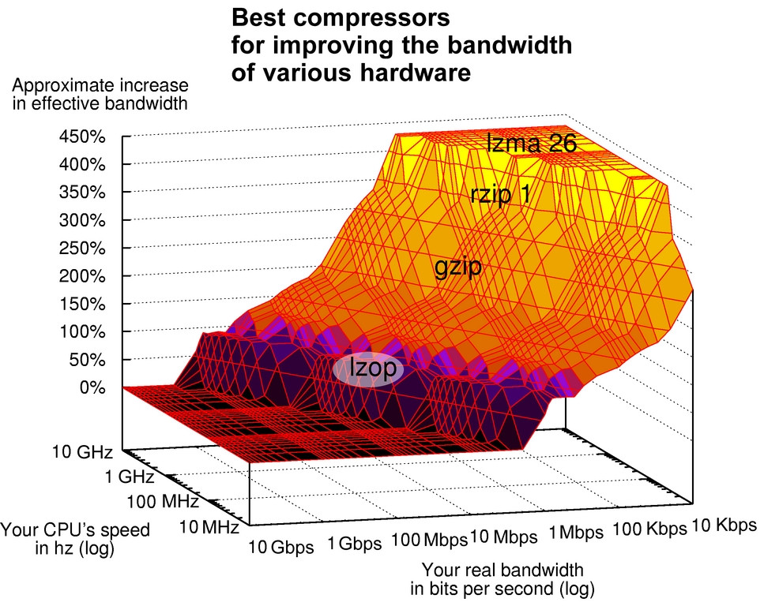
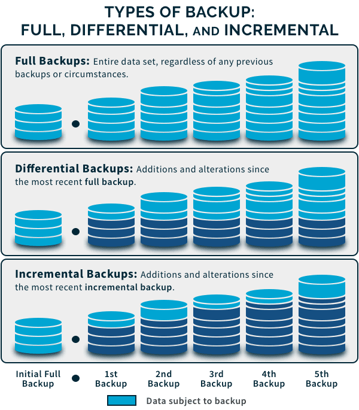

[Phần 2 - Tổng quan về kiến trúc Linux](https://github.com/volehuy1998/network-onboard/blob/master/README.md)

- [2.1 - Linux Kernel (UPDATED 21/01/2024)](https://github.com/volehuy1998/network-onboard/blob/master/linux-onboard/2.1%20-%20linux-arch-onboard.md#linux_kernel)
  - 2.1.1 - Vai trò của Linux Kernel (UPDATED 21/01/2024)
  - 2.1.2 - Tổng quan về Interrupt - Ngắt (UPDATED 05/09/2023)
- [2.2 - Quản lý người dùng và nhóm (UPDATED 17/09/2023)](https://github.com/volehuy1998/network-onboard/blob/master/linux-onboard/2.2%20-%20linux-user-management.md#user_and_group)
  - 2.2.1 - Khái niệm `User` (UPDATED 17/09/2023)
  - 2.2.2 - Khái niệm về nhóm, chính và phụ (UPDATED 12/09/2023)
  - 2.2.3 - Thay đổi tài khoản người dùng (UPDATED 13/09/2023)
  - 2.2.4 - Các thao tác quản lý trên người dùng và nhóm(UPDATED 11/09/2023)
  - 2.2.5 - Hạn chế quyền truy cập người dùng (UPDATED 13/09/2023)
  - 2.2.6 - Cấp quyền `sudo` tự do (UPDATED 11/09/2023)
  - 2.2.7 - Cấp quyền `sudo` với lệnh cụ thể (UPDATED 11/09/2023)
- [2.3 - Hệ thống tệp tin (UPDATED 07/01/2024)](https://github.com/volehuy1998/network-onboard/blob/master/linux-onboard/2.3%20-%20linux-file-system-overview.md#fs)
  - 2.3.1 - Phân cấp hệ thống tệp tin (UPDATED 26/08/2023)
  - 2.3.2 - RPM Package và phân loại (UPDATED 24/08/2023)
  - 2.3.3 - Kernel RPM Package (UPDATED 24/08/2023)
  - 2.3.4 - Tổng quan về quyền trên tệp tin (UPDATED 07/01/2024)
    - 2.3.4.1 - Quản lý quyền tệp tin (UPDATED 13/09/2023)
    - 2.3.4.2 - Quyền đặc biệt dành cho chủ sở hữu (SUID) và lỗ hổng leo thang đặc quyền (UPDATED 10/09/2023)
    - 2.3.4.3 - Quyền đặc biệt dành cho nhóm (UPDATED 10/09/2023)
    - 2.3.4.4 - Quyền đặc biệt Sticky bit (UPDATED 04/09/2023)
  - 2.3.5 - Xác định hệ thống tệp tin và thiết bị (UPDATED 07/11/2023)
- [2.4 - Tổng quan tiến trình Linux (UPDATED 04/10/2023)](https://github.com/volehuy1998/network-onboard/blob/master/linux-onboard/2.4%20-%20linux-process-overview.md#linux_process)
  - 2.4.1 - Trạng thái của tiến trình Linux (UPDATED 17/09/2023)
  - 2.4.2 - Kiểm soát các `Job` (UPDATED 04/10/2023)
  - 2.4.3 - Kết thúc tiến trình (UPDATED 18/09/2023)
  - 2.4.4 - Dịch vụ hạ tầng (UPDATED 21/09/2023)
  - 2.4.5 - Tổng quan về `systemd` (UPDATED 30/09/2023)
  - 2.4.6 - Kiểm soát dịch vụ hệ thống (UPDATED 04/10/2023)
  - 2.4.7 - Mẫu `unit` với ký hiệu `@` (UPDATED 04/10/2023)
  - 2.4.8 - Chi tiết tệp `unit` (UPDATED 04/10/2023)
    - 2.4.8.1 - Loại `unit` phổ biến `*.service` (UPDATED 03/10/2023)
    - 2.4.8.2 - Loại `unit` về `*.socket` (UPDATED 30/09/2023)
    - 2.4.8.3 - Loại `unit` về `*.path` (UPDATED 30/09/2023)
- [2.5 - Điều khiển an toàn từ xa (UPDATED 31/12/2023)](https://github.com/volehuy1998/network-onboard/blob/master/linux-onboard/2.5%20-%20linux-secure-remote-overview.md#remote_connection)
  - 2.5.1 - Tổng quan về kiến trúc giao thức `SSH` (UPDATED 31/12/2023)
    - 2.5.1.1 - Kiến trúc giao thức `SSH` (UPDATED 22/10/2023)
    - 2.5.1.2 - Những xem xét bảo mật về khía cạnh truyền dẫn (UPDATED 19/10/2023)
    - 2.5.1.3 - Những xem xét bảo mật về khía cạnh xác thực (UPDATED 19/10/2023)
    - 2.5.1.4 - Giao thức `SSH-1`, `SSH-2` và sự cải tiến (UPDATED 22/10/2023)
  - 2.5.2 - Cài đặt `OpenSSH`, kết nối và cấu hình (UPDATED 23/10/2023)
    - 2.5.2.1 - Sử dụng công cụ cơ bản (UPDATED 19/10/2023)
    - 2.5.2.2 - Thông tin về `finger print` tại máy khách và máy chủ (UPDATED 19/10/2023)
    - 2.5.2.3 - Hành vi xử lý chuẩn kết nối đến máy chủ (UPDATED 19/10/2023)
    - 2.5.2.4 - Cấu hình `ssh client` (UPDATED 21/10/2023)
    - 2.5.2.5 - Sử dụng `X11 Forwarding` và `Port Forwarding` (UPDATED 23/10/2023)
- [2.6 - Tổng quan về quản lý mạng (UPDATED 05/11/2023)](https://github.com/volehuy1998/network-onboard/blob/master/linux-onboard/2.6%20-%20linux-network-overview.md#network_manage)
  - 2.6.1 - Mô hình `TCP/IP` (UPDATED 25/10/2023)
  - 2.6.2 - Mô tả về `Network Interface` (UPDATED 01/11/2023)
  - 2.6.3 - Địa chỉ `v4` (UPDATED 25/10/2023)
  - 2.6.4 - Địa chỉ `v6` (UPDATED 25/10/2023)
  - 2.6.5 - Thông tin về `network interface`(UPDATED 25/10/2023)
  - 2.6.6 - Công cụ quản lý `nmcli`(UPDATED 05/11/2023)
  - 2.6.7 - Cấu hình và quản lý `hostname`(UPDATED 05/11/2023)
- [2.7 - Kiến trúc nhật ký hệ thống (UPDATED 17/12/2023)](https://github.com/volehuy1998/network-onboard/blob/master/linux-onboard/2.7%20-%20linux-system-log-architecture-overview.md#sys_log_arch)
  - 2.7.1 - Tổng quan (UPDATED 03/12/2023)
  - 2.7.2 - Cách sử dụng `rsyslog` (UPDATED 06/12/2023)
  - 2.7.3 - Cách sử dụng `systemd-journald` (UPDATED 10/12/2023)
  - 2.7.4 - Đồng bộ thời gian (UPDATED 17/12/2023)
    - 2.7.4.1 - Tổng quan `Network Time Protocol` (UPDATED 17/12/2023)
    - 2.7.4.2 - Công cụ `datetimectl` (UPDATED 10/12/2023)
    - 2.7.4.3 - Cấu hình `NTP` sử dụng `chrony` (UPDATED 17/12/2023)
    - 2.7.4.4 - Cấu hình `NTP` sử dụng `ntpd` (UPDATED 10/12/2023)
- [2.8 - Lập lịch chạy cho tác vụ tương lai (UPDATED 01/01/2024)](https://github.com/volehuy1998/network-onboard/blob/master/linux-onboard/2.8%20-%20linux-job-scheduler.md#schedule_job)
  - 2.8.1 - Tổng quan (UPDATED 24/12/2023)
  - 2.8.2 - Cách sử dụng công cụ `at` (UPDATED 24/12/2023)
  - 2.8.3 - Cách sử dụng công cụ `cron` (UPDATED 24/12/2023)
  - 2.8.4 - Ứng dụng `systemd timer` (UPDATED 01/01/2024)
    - 2.8.4.1 - Cách sử dụng công cụ `systemd timer` (UPDATED 01/01/2024)
    - 2.8.4.2 - Quản lý loại tệp tạm thời (UPDATED 01/01/2024)
      - 2.8.4.2.1 - Cách sử dụng `systemd-tmpfiles --create` (UPDATED 01/01/2024)
      - 2.8.4.2.2 - Cách sử dụng `systemd-tmpfiles --clean` (UPDATED 01/01/2024)
      - 2.8.4.2.3 - Cách sử dụng `systemd-tmpfiles --remove` (UPDATED 01/01/2024)
- [2.9 - Quản lý tệp sao lưu và nén với công cụ `tar` ( :arrow_up: UPDATED 15/01/2024)](#manage_compress_tar_archive)
    - [2.9.1 - Tạo và quản lý tệp đóng gói (UPDATED 09/02/2024)](#manage_archived_file)
    - [2.9.2 - Tạo và quản lý tệp nén sao lưu ( :arrow_up: UPDATED 15/01/2024)](#manage_compressed_file)
    - [2.9.3 - Quản lý tệp sao lưu gia tăng `incremental backup` (UPDATED 15/01/2024)](#inc_backup)
    - [2.9.4 - Chuyển tệp giữa các hệ thống một cách an toàn (UPDATED 15/01/2024)](#transfer_file)
    - [2.9.5 - Đồng bộ giữa các hệ thống một cách an toàn (UPDATED 15/01/2024)](#synchronize_file)
- [2.10 - Quản lý `SELinux` (UPDATED 28/01/2024)](https://github.com/volehuy1998/network-onboard/blob/master/linux-onboard/2.10%20-%20linux-se-mode.md#selinux_manage)
    - 2.10.1 - Kiến trúc `SELinux` (UPDATED 27/01/2024)
    - 2.10.2 - Sử dụng `SELinux` cơ bản với chính sách `targeted` (UPDATED 28/01/2024)
      - 2.10.2.1 - Xem nhãn, kích hoạt và vô hiệu hóa `SELinux` (UPDATED 28/01/2024)
      - 2.10.2.2 - Xem định nghĩa chính sách `SELinux` (UPDATED 27/01/2024)
      - 2.10.2.3 - Auditing hành vi hệ thống (UPDATED 28/01/2024)
      - 2.10.2.4 - Kiểm soát `fcontext` với nhãn sẵn có (UPDATED 27/01/2024)
      - 2.10.2.5 - Kiểm soát `port` với nhãn sẵn có (UPDATED 27/01/2024)
      - 2.10.2.6 - Kiểm soát chính sách với  `boolean` (UPDATED 27/01/2024)
- [2.11 - Quản lý lưu trữ cơ bản ( :arrow_up: UPDATED 07/02/2024)](https://github.com/volehuy1998/network-onboard/blob/master/linux-onboard/2.11%20-%20linux-manage-basic-storage.md#manage_basic_storage)
    - 2.11.1 - Khái niệm phân vùng ổ cứng ( :heavy_plus_sign: UPDATED 05/01/2024)
    - 2.11.2 - Quản lý phân vùng theo định dạng ( :heavy_plus_sign: UPDATED 05/01/2024)
      - 2.11.2.1 - Quản lý phân vùng định dạng MBR ( :arrow_up: UPDATED 07/02/2024)
      - 2.11.2.2 - Quản lý phân vùng định dạng GPT ( :heavy_plus_sign: UPDATED 05/01/2024)
    - 2.10.3 - Tạo tệp hệ thống ( :heavy_plus_sign: UPDATED 05/01/2024)
    - 2.10.4 - Mount tệp hệ thống ( :heavy_plus_sign: UPDATED 05/01/2024)
      - 2.10.4.1 - Mount thủ công tệp hệ thống ( :heavy_plus_sign: UPDATED 05/01/2024)
      - 2.10.4.2 - Mount tự vĩnh viễn tệp hệ thống ( :heavy_plus_sign: UPDATED 05/01/2024)
    - 2.10.5 - Quản lý không gian `Swap` ( :heavy_plus_sign: UPDATED 05/01/2024)
      - 2.10.5.1 - Khái niệm không gian `Swap` ( :heavy_plus_sign: UPDATED 05/01/2024)
      - 2.10.5.2 - Tạo phân vùng `swap` ( :heavy_plus_sign: UPDATED 05/01/2024)
- [2.12 - Quản lý lưu trữ nâng cao ( :heavy_plus_sign: UPDATED 09/02/2024)](https://github.com/volehuy1998/network-onboard/blob/master/linux-onboard/2.12%20-%20linux-manage-advance-storage.md#manage_advance_storage)
  - 2.12.1 - Tổng quan Logical Volume Manager (LVM) ( :heavy_plus_sign: UPDATED 09/02/2024)
  - 2.12.2 - Xây dựng hệ thống lưu trữ LVM ( :heavy_plus_sign: UPDATED 09/02/2024)
  - 2.12.3 - Tạo Logical Volume tính năng nén và chống trùng lặp ( :heavy_plus_sign: UPDATED 09/02/2024)
      
## <a name="manage_compress_tar_archive">Quản lý tệp sao lưu và nén với công cụ `tar`</a>

Một kho lưu trữ là tệp tin thông thường hoặc là một thiết bị mà nó chứa nhiều tệp con bên trong. Thiết bị có thể là:

- USB.
- Đĩa mềm.
- Đĩa quang DVD.
- Thẻ nhớ.
- Băng từ.

Khi đóng gói thì tương tự như việc sử dụng công cụ `zip` hoặc một số biến thể trên các hệ điều hành khác. Về nguồn gốc, các công cụ đóng gói tệp ban đầu sử dụng thuật toán phổ biến `PKZIP (Phil Katz's ZIP)` cho hệ thống `MSDOS`, sau đó nó được phát triển để chạy được trên `RHEL` với lệnh `zip` và `unzip`. Nhiều thuật toán nén khác phát triển từ khi `zip` được giới thiệu và mỗi cái trong số chúng đều có ưu điểm riêng. Để đạt được mục đích sử dụng chung thì tất cả thuật toán nén có trong công cụ `tar` đều được hỗ trợ bởi các công cụ khác.

Tệp sao lưu được sử dụng để tạo ra các bản sao lưu cá nhân hoặc đơn giản là chuyển nó sang hệ thống khác thông qua mạng máy tính với các phương pháp như `rsync`. Việc đóng gói có thể kết hợp với nén để giảm kích thước.

Trên `Linux` lệnh `tar` được sử dụng để tạo, trích xuất và quản lý tệp sao lưu. Sử dụng lệnh `tar` để đóng gói nhiều tệp thành một tệp duy nhất. Tệp sao lưu được tổ chức với dữ liệu được đánh chỉ mục để người dùng có thể trích xuất từng tệp riêng lẻ. Lệnh `tar` có thể liệt kê nội dung đóng gói mà không cần trích xuất. Các tùy chọn của lệnh `tar` như:

- Những hành động bắt buộc khi sử dụng lệnh `tar`:
    - `-c` hoặc `--create` để tạo tệp sao lưu.
    - `-t` hoặc `--list` để liệt kê nội dung đóng gói.
    - `-x` hoặc `--extract` để trích xuất nội dung đóng gói.
    - `-u` hoặc `--update` để cập nhật nếu dữ liệu mới hơn bản sao trong tệp sao lưu.
    - `--delete` để xóa dữ liệu trong tệp sao lưu.
    - Xem thêm tại `man tar`.
- Các tùy chọn thông thường sau:
    - `-v` hoặc `--verbose`: hiển thị chi tiết quá trình, hữu ích cho việc phân tích.
    - `-f` hoặc `--file`: theo sau là tên của tệp sao lưu.
    - `-p` hoặc `--preserve-permissions` hoặc `--same-permissions`: giữ nguyên quyền truy cập gốc khi giải nén. Trái ngược là `--no-same-permissions` áp dụng quyền truy cập `umask` của người dùng hiện hành.
    - `--same-owner` hoặc `--no-same-owner`: giữ quyền sở hữu gốc hoặc không.
    - `--xattrs`: kích hoạt hỗ trợ thuộc tính mở rộng.
    - `--selinux`: kích hoạt hỗ trợ `SELinux`.
    - Xem thêm tại `man tar`.
- Các tùy chọn thuật toán sau:
    - `-a` hoặc `--auto-compress`: dựa trên hậu tố của khai báo tệp sao lưu mà chọn thuật toán.
    - `-z` hoặc `--gzip`: sử dụng thuật toán nén `gzip` với hậu tố `.tar.gz`.
    - `-j` hoặc `--bzip2`: sử dụng thuật toán nén `bzip2` với hậu tố `.tar.bz2`.
    - `-J` hoặc `--xz`: sử dụng thuật toán `xz` với hậu tố `.tar.xz`.

### <a name="manage_archived_file">Tạo và quản lý tệp sao lưu</a>

Trong mục này sử dụng theo hướng sao lưu toàn bộ hay còn gọi là `full backup`. Lệnh sau sẽ tạo ra tệp sao lưu `mybackup.tar` chứa các tệp nhật ký `*.log`. Nếu tệp sao lưu đã có thì sẽ bị ghi đè.

```shell
[sysad@huyvl-linux-training ~]$ ll
total 0
-rw-rw-r-- 1 sysad sysad 0 Jan  7 19:21 boot.log
-rw-rw-r-- 1 sysad sysad 0 Jan  7 19:21 sshd.log
[sysad@huyvl-linux-training ~]$ tar -cvf mybackup.tar boot.log sshd.log 
boot.log
sshd.log
[sysad@huyvl-linux-training ~]$ ls mybackup.tar 
mybackup.tar
[sysad@huyvl-linux-training ~]$ tar -tf mybackup.tar 
boot.log
sshd.log
[sysad@huyvl-linux-training ~]$ 
```

Việc đóng gói thường sẽ không tiêu tốn nhiều thời gian và tài nguyên `CPU` nhưng nhược điểm là tệp sao lưu gần như giữ nguyên kích thước. Điều này làm tăng thời gian truyền tải đến hệ thống khác thông qua mạng gây chiếm băng thông.

```shell
[root@huyvl-linux-training ~]# du -sh /etc
39M	/etc
[root@huyvl-linux-training ~]# tar -cf etc_backup.tar /etc
tar: Removing leading '/' from member names
[root@huyvl-linux-training ~]# ll -h etc_backup.tar 
-rw-r--r-- 1 root root 34M Jan  7 19:56 etc_backup.tar
[root@huyvl-linux-training ~]# 
```

Lệnh `tar` hỗ trợ cả đường dẫn tương đối và tuyệt đối. Mặc định, `tar` sẽ loại bỏ dấu `/` đầu tiên (nếu có) do đó các tệp được đóng gói ở dạng tương đối. Với tính năng này sẽ tạo ra sự an toàn cho hệ thống bởi vì việc giải nén nếu có dấu `/` ở đầu sẽ được hiểu là đường dẫn tuyệt đối và có khả năng ghi đè tệp quan trọng, nhạy cảm như `/etc/shadow`, ... Với đường dẫn tương đối thì khi được giải nén các tệp tin sẽ nằm trong thư mục tạo mới. Để tạo được tệp sao lưu thì người dùng cần quyền đọc ở nguồn được chỉ định. Ví dụ ở `/etc` yêu cầu quyền `root`, tệp sao lưu sẽ không bao gồm các tệp và thư mục không có quyền đọc và thực thi (lệnh `cd`).

```shell
[sysad@huyvl-linux-training ~]$ ll /etc/ssh | grep config
-rw-r--r--. 1 root root       2276 Nov 24  2021 ssh_config
-rw-------. 1 root root       3904 Dec  3 11:26 sshd_config
[sysad@huyvl-linux-training ~]$ tar -cvf mybackup.tar /etc/ssh/ssh_config /etc/ssh/sshd_config
tar: Removing leading '/' from member names
/etc/ssh/ssh_config
tar: /etc/ssh/sshd_config: Cannot open: Permission denied
tar: Exiting with failure status due to previous errors
[sysad@huyvl-linux-training ~]$ 
[sysad@huyvl-linux-training ~]$ 
[sysad@huyvl-linux-training ~]$ tar -tf mybackup.tar 
etc/ssh/ssh_config
[sysad@huyvl-linux-training ~]$
[sysad@huyvl-linux-training ~]$ ll
total 16
drwxrwxr-x 3 sysad sysad  4096 Jan  7 19:34 etc
-rw-rw-r-- 1 sysad sysad 10240 Jan  7 19:31 mybackup.tar
[sysad@huyvl-linux-training ~]$ 
[sysad@huyvl-linux-training ~]$ tar -xvf mybackup.tar 
etc/ssh/ssh_config
[sysad@huyvl-linux-training ~]$ tree etc/
etc/
`-- ssh
    `-- ssh_config

1 directory, 1 file
[sysad@huyvl-linux-training ~]$ 
```

Chỉ định `-P` hoặc `--absolute-names` để chỉ định đường dẫn tuyệt đối trong việc đóng gói và trích xuất:

```shell
[root@huyvl-linux-training ~]# mkdir -pv /data/log
mkdir: created directory '/data'
mkdir: created directory '/data/log'
[root@huyvl-linux-training ~]# touch /data/log/boot.log
[root@huyvl-linux-training ~]# tar --absolute-names -cf full_path_backup.tar /data/log/boot.log 
[root@huyvl-linux-training ~]# tar -tvf full_path_backup.tar 
tar: Removing leading '/' from member names
-rw-r--r-- root/root         0 2024-01-08 10:20 /data/log/boot.log
[root@huyvl-linux-training ~]# echo new data >> /data/log/boot.log
[root@huyvl-linux-training ~]# ll /data/log/boot.log
-rw-r--r--. 1 root root 9 Jan  8 10:21 /data/log/boot.log
[root@huyvl-linux-training ~]# tar --absolute-names -xvf full_path_backup.tar 
/data/log/boot.log
[root@huyvl-linux-training ~]# ll /data/log/boot.log 
-rw-r--r--. 1 root root 0 Jan  8 10:20 /data/log/boot.log
[root@huyvl-linux-training ~]# 
```

Chỉ định nơi giải nén thông qua tùy chọn `-C` như sau:

```shell
[root@huyvl-linux-training ~]# ll
total 0
[root@huyvl-linux-training ~]# touch data.txt
[root@huyvl-linux-training ~]# tar -cvf backup.tar data.txt 
data.txt
[root@huyvl-linux-training ~]# mkdir -v restore
mkdir: created directory 'restore'
[root@huyvl-linux-training ~]# tar -xvf backup.tar -C restore/
data.txt
[root@huyvl-linux-training ~]# ll restore/
total 0
-rw-r--r--. 1 root root 0 Jan  7 13:06 data.txt
[root@huyvl-linux-training ~]# 
```

Xóa tệp với tùy chọn `--delete` như sau:

```shell
[root@huyvl-linux-training ~]# tar -tvf backup.tar 
-rw-r--r-- root/root         0 2024-01-07 12:37 sshd.log
-rw-r--r-- root/root         0 2024-01-07 12:37 boot.log
[root@huyvl-linux-training ~]# tar --delete -vf backup.tar sshd.log
[root@huyvl-linux-training ~]# tar -tvf backup.tar 
-rw-r--r-- root/root         0 2024-01-07 12:37 boot.log
[root@huyvl-linux-training ~]# tar --delete -vf backup.tar boot.log 
[root@huyvl-linux-training ~]# tar -tvf backup.tar 
[root@huyvl-linux-training ~]# 
```

Khi giải nén tùy chọn `--keep-old-files` sẽ thông báo lỗi không cho phép ghi đè dữ liệu đã tồn tại:

```shell
[root@huyvl-linux-training ~]# ls -l restore/
total 4
-rw-r--r--. 1 root root 21 Jan  7 13:40 data.txt
-rw-r--r--. 1 root root  0 Jan  7 13:08 data2.txt
[root@huyvl-linux-training ~]# tar -tvf backup.tar 
-rw-r--r-- root/root         6 2024-01-07 13:16 data.txt
-rw-r--r-- root/root         0 2024-01-07 13:08 data2.txt
[root@huyvl-linux-training ~]# tar --keep-old-files -xf backup.tar -C restore/
tar: data.txt: Cannot open: File exists
tar: data2.txt: Cannot open: File exists
tar: Exiting with failure status due to previous errors
[root@huyvl-linux-training ~]# tar --skip-old-files -xf backup.tar -C restore/
[root@huyvl-linux-training ~]# ls -l restore/
total 4
-rw-r--r--. 1 root root 21 Jan  7 13:40 data.txt
-rw-r--r--. 1 root root  0 Jan  7 13:08 data2.txt
[root@huyvl-linux-training ~]#
```

Cập nhật khi dữ liệu mới hơn hoặc được tạo mới với tùy chọn `-u` hoặc `--update`, tùy chọn này khác với `--append` ở chỗ sẽ căn cứ vào dấu thời gian mới hơn sẽ được cập nhật vào tệp sao lưu, ngược lại sẽ không có chuyện gì xảy ra.

```shell
[root@huyvl-linux-training ~]# touch a
[root@huyvl-linux-training ~]# tar -cvf backup.tar a
a
[root@huyvl-linux-training ~]# echo 'hello' > a
[root@huyvl-linux-training ~]# tar --append -vvf backup.tar a
-rw-r--r-- root/root         6 2024-02-09 07:44 a
[root@huyvl-linux-training ~]# tar -tvf backup.tar 
-rw-r--r-- root/root         0 2024-02-09 07:44 a
-rw-r--r-- root/root         6 2024-02-09 07:44 a
[root@huyvl-linux-training ~]# tar --append -vvf backup.tar a
-rw-r--r-- root/root         6 2024-02-09 07:44 a
[root@huyvl-linux-training ~]# tar --append -vvf backup.tar a
-rw-r--r-- root/root         6 2024-02-09 07:44 a
[root@huyvl-linux-training ~]# tar --update -vvf backup.tar a
[root@huyvl-linux-training ~]#
```

Sau khi sử dụng `--update` hoặc `--append` sẽ đánh dấu phiên bản dữ liệu, mặc định khi giải nén dữ liệu thì `tar` sẽ lấy phiên bản mới nhất tương đương với giá trị `--occurrence` lớn nhất. Người dùng có thể chỉ định phiên bản dữ liệu, `tar` sẽ báo lỗi nếu tìm không có. Ngoài ra tùy chọn này cũng có thể sử dụng với các hành động như `--delete`, `--list`, `--diff`.

```shell
[root@huyvl-linux-training ~]# ll
total 0
[root@huyvl-linux-training ~]# touch data.txt data2.txt
[root@huyvl-linux-training ~]# tar -cvf backup.tar data.txt data2.txt 
data.txt
data2.txt
[root@huyvl-linux-training ~]# tar -tvf backup.tar
-rw-r--r-- root/root         0 2024-01-07 14:06 data.txt
-rw-r--r-- root/root         0 2024-01-07 14:06 data2.txt
[root@huyvl-linux-training ~]# echo hello >> data.txt 
[root@huyvl-linux-training ~]# tar --update -vf backup.tar data.txt 
data.txt
[root@huyvl-linux-training ~]# tar -tvf backup.tar
-rw-r--r-- root/root         0 2024-01-07 14:06 data.txt
-rw-r--r-- root/root         0 2024-01-07 14:06 data2.txt
-rw-r--r-- root/root         6 2024-01-07 14:06 data.txt
[root@huyvl-linux-training ~]# mkdir -v restore && cd restore
mkdir: created directory 'restore'
[root@huyvl-linux-training restore]# tar -xvf ../backup.tar --occurrence=1 data.txt 
data.txt
[root@huyvl-linux-training restore]# ll           
total 0
-rw-r--r--. 1 root root 0 Jan  7 14:06 data.txt
[root@huyvl-linux-training restore]# cat data.txt 
[root@huyvl-linux-training restore]# tar -xvf ../backup.tar --occurrence=2 data.txt 
data.txt
[root@huyvl-linux-training restore]# ll
total 4
-rw-r--r--. 1 root root 6 Jan  7 14:06 data.txt
[root@huyvl-linux-training restore]# cat data.txt 
hello
[root@huyvl-linux-training restore]# tar -xvf ../backup.tar --occurrence=3 data.txt 
tar: data.txt: Required occurrence not found in archive
tar: Exiting with failure status due to previous errors
[root@huyvl-linux-training restore]#
```

Trích xuất tệp sử dụng tùy chọn `-p` viết tắt của `--same-permissions`, để mô tả rằng các tệp được trích xuất sẽ tuân thủ theo quyền vốn có của chủ sở hữu tạo ra. Ví dụ quản trị viên `hn` có `umask 0010` và quản trị viên `hcm` có `umask 0022`, tệp `backup.tar` chứa các tệp sao lưu được tạo ra từ quản trị viên `hn` còn quản trị viên `hcm` sẽ giải nén, tùy thuộc vào sự hiện diện của `-p` thì tệp `data/log/boot.log` sẽ có quyền khác nhau dựa trên `umask` của hai quản trị. Mặc định tùy chọn `--same-permissions` và `--same-owner` sẽ được áp dụng cho quyền `root`, ngược lại `--no-same-permissions` và `--no-same-owner` sẽ mặc định áp dụng cho người dùng thường.

```shell
[hn@huyvl-linux-training ~]$ id
uid=1002(hn) gid=1001(operator) groups=1001(operator) context=unconfined_u:unconfined_r:unconfined_t:s0-s0:c0.c1023
[hn@huyvl-linux-training ~]$ tail -1 .bashrc 
umask 0010
[hn@huyvl-linux-training ~]$ umask
0010
[hn@huyvl-linux-training ~]$ 
[hn@huyvl-linux-training ~]$ mkdir -pv data/log
mkdir: created directory ‘data’
mkdir: created directory ‘data/log’
[hn@huyvl-linux-training ~]$ touch data/log/boot.log
[hn@huyvl-linux-training ~]$ ll
total 0
drwxrw-rwx. 3 hn operator 16 Jan  7 09:34 data
[hn@huyvl-linux-training ~]$ ll data/log/
total 0
-rw-rw-rw-. 1 hn operator 0 Jan  7 09:34 boot.log
[hn@huyvl-linux-training ~]$ tar -cf backup.tar data/
[hn@huyvl-linux-training ~]$ ll
total 12
-rw-rw-rw-. 1 hn operator 10240 Jan  7 09:34 backup.tar
drwxrw-rwx. 3 hn operator    16 Jan  7 09:34 data
[hn@huyvl-linux-training ~]$ exit
logout
[root@huyvl-linux-training ~]# cp /home/hn/backup.tar /home/hcm/
[root@huyvl-linux-training ~]# ll /home/hcm/
total 12
-rw-r--r--. 1 root root 10240 Jan  7 09:35 backup.tar
[root@huyvl-linux-training ~]# chown hcm:operator /home/hcm/backup.tar 
[root@huyvl-linux-training ~]# su - hcm
Last login: Sun Jan  7 09:30:46 EST 2024 on pts/0
[hcm@huyvl-linux-training ~]$ id
uid=1001(hcm) gid=1001(operator) groups=1001(operator) context=unconfined_u:unconfined_r:unconfined_t:s0-s0:c0.c1023
[hcm@huyvl-linux-training ~]$ umask
0022
[hcm@huyvl-linux-training ~]$ ll
total 12
-rw-r--r--. 1 hcm operator 10240 Jan  7 09:35 backup.tar
[hcm@huyvl-linux-training ~]$ tar -xvf backup.tar 
data/
data/log/
data/log/boot.log
[hcm@huyvl-linux-training ~]$ ll
total 12
-rw-r--r--. 1 hcm operator 10240 Jan  7 09:35 backup.tar
drwxr--r-x. 3 hcm operator    16 Jan  7 09:34 data
[hcm@huyvl-linux-training ~]$ ll data/log/boot.log 
-rw-r--r--. 1 hcm operator 0 Jan  7 09:34 data/log/boot.log
[hcm@huyvl-linux-training ~]$ tar -xpvf backup.tar 
data/
data/log/
data/log/boot.log
[hcm@huyvl-linux-training ~]$ ll -d data
drwxrw-rwx. 3 hcm operator 16 Jan  7 09:34 data
[hcm@huyvl-linux-training ~]$ ll data/log/boot.log 
-rw-rw-rw-. 1 hcm operator 0 Jan  7 09:34 data/log/boot.log
[hcm@huyvl-linux-training ~]$ 
```

Trích xuất tệp và sử dụng cùng lúc 2 tùy chọn `--no-same-owner --no-same-permissions` để chuyển tất cả quyền sở hữu và quyền truy cập về người dùng hiện hành.

```shell
[root@huyvl-linux-training ~]# tar -xvf backup.tar 
data/
data/log/
data/log/boot.log
[root@huyvl-linux-training ~]# ll -d data
drwxrw-rwx. 3 hn operator 16 Jan  7 09:34 data
[root@huyvl-linux-training ~]# ll data/log/boot.log 
-rw-rw-rw-. 1 hn operator 0 Jan  7 09:34 data/log/boot.log
[root@huyvl-linux-training ~]# 
[root@huyvl-linux-training ~]# rm -rf data
[root@huyvl-linux-training ~]# tar --no-same-owner --no-same-permissions -xvf backup.tar 
data/
data/log/
data/log/boot.log
[root@huyvl-linux-training ~]# ll -d data
drwxr--r-x. 3 root root 16 Jan  7 09:34 data
[root@huyvl-linux-training ~]# ll data/log/boot.log 
-rw-r--r--. 1 root root 0 Jan  7 09:34 data/log/boot.log
[root@huyvl-linux-training ~]# 
```

Mặc định tùy chọn `--wildcards` đã được áp dụng nên người dùng có thể chỉ định tên để giải nén hoặc sử dụng các ký hiệu để tăng khả năng nhận diện như sau:

```shell
[root@huyvl-linux-training ~]# ll
total 12
-rw-r--r--. 1 root root 10240 Jan 13 02:49 backup.tar
[root@huyvl-linux-training ~]# tar -tvf backup.tar 
-rw-r--r-- root/root         0 2024-01-13 02:49 boot.log
-rw-r--r-- root/root         0 2024-01-13 02:49 sshd.log
[root@huyvl-linux-training ~]# tar -xf backup.tar sshd.log
[root@huyvl-linux-training ~]# ll
total 12
-rw-r--r--. 1 root root 10240 Jan 13 02:49 backup.tar
-rw-r--r--. 1 root root     0 Jan 13 02:49 sshd.log
[root@huyvl-linux-training ~]# 
[root@huyvl-linux-training ~]# rm -rf *.log
[root@huyvl-linux-training ~]# ll
total 12
-rw-r--r--. 1 root root 10240 Jan 13 02:49 backup.tar
[root@huyvl-linux-training ~]# tar -xf backup.tar sshd.log boot.log
[root@huyvl-linux-training ~]# ll
total 12
-rw-r--r--. 1 root root 10240 Jan 13 02:49 backup.tar
-rw-r--r--. 1 root root     0 Jan 13 02:49 boot.log
-rw-r--r--. 1 root root     0 Jan 13 02:49 sshd.log
[root@huyvl-linux-training ~]# 
[root@huyvl-linux-training ~]# rm -f *.log
[root@huyvl-linux-training ~]# tar -xf backup.tar "boot.*"
[root@huyvl-linux-training ~]# ll
total 12
-rw-r--r--. 1 root root 10240 Jan 13 02:55 backup.tar
-rw-r--r--. 1 root root     0 Jan 13 02:49 boot.log
[root@huyvl-linux-training ~]# 
```

Mặc định tùy chọn `--recursive` sẽ đóng gói toàn bộ nội dung, ngược lại `--no-recursion` sẽ không bao gồm dữ liệu ở cấp xâu hơn:

```shell
[root@huyvl-linux-training ~]# mkdir -pv parent/child/    
mkdir: created directory 'parent'
mkdir: created directory 'parent/child/'
[root@huyvl-linux-training ~]# touch parent/data.log parent/child/data2.log
[root@huyvl-linux-training ~]# tar -cf backup.tar parent/
[root@huyvl-linux-training ~]# tar -tvf backup.tar 
drwxr-xr-x root/root         0 2024-01-13 04:03 parent/
drwxr-xr-x root/root         0 2024-01-13 04:03 parent/child/
-rw-r--r-- root/root         0 2024-01-13 04:03 parent/child/data2.log
-rw-r--r-- root/root         0 2024-01-13 04:03 parent/data.log
[root@huyvl-linux-training ~]# 
[root@huyvl-linux-training ~]# rm -rf backup.tar 
[root@huyvl-linux-training ~]# tar --no-recursion -cf backup.tar parent/*
[root@huyvl-linux-training ~]# tar -tvf backup.tar
drwxr-xr-x root/root         0 2024-01-13 04:03 parent/child/
-rw-r--r-- root/root         0 2024-01-13 04:03 parent/data.log
[root@huyvl-linux-training ~]# 
```

Sử dụng tùy chọn `--exclude` để loại trừ tất cả dữ liệu có tên như chỉ định. Có thể sử dụng độc lập hoặc kết hợp với tùy chọn `--anchor` như sau:

```shell
[root@huyvl-linux-training ~]# mkdir -v data            
mkdir: created directory 'data'
[root@huyvl-linux-training ~]# touch data/upgrade.sql
[root@huyvl-linux-training ~]# mkdir -pv parent/data/child 
mkdir: created directory 'parent'
mkdir: created directory 'parent/data'
mkdir: created directory 'parent/data/child'
[root@huyvl-linux-training ~]# touch parent/data/child/upgrade.sql
[root@huyvl-linux-training ~]# 
[root@huyvl-linux-training ~]# tar -cf backup.tar *
[root@huyvl-linux-training ~]# tar -tvf backup.tar
drwxr-xr-x root/root         0 2024-01-13 04:29 data/
-rw-r--r-- root/root         0 2024-01-13 04:29 data/upgrade.sql
drwxr-xr-x root/root         0 2024-01-13 04:29 parent/
drwxr-xr-x root/root         0 2024-01-13 04:29 parent/data/
drwxr-xr-x root/root         0 2024-01-13 04:30 parent/data/child/
-rw-r--r-- root/root         0 2024-01-13 04:30 parent/data/child/upgrade.sql
[root@huyvl-linux-training ~]# 
[root@huyvl-linux-training ~]# 
[root@huyvl-linux-training ~]# rm -rf backup.tar 
[root@huyvl-linux-training ~]# tar -cf backup.tar --exclude=data *
[root@huyvl-linux-training ~]# tar -tvf backup.tar
drwxr-xr-x root/root         0 2024-01-13 04:29 parent/
[root@huyvl-linux-training ~]# 
[root@huyvl-linux-training ~]# rm -rf backup.tar 
[root@huyvl-linux-training ~]# tar -cf backup.tar --anchored --exclude=data *
[root@huyvl-linux-training ~]# tar -tvf backup.tar
drwxr-xr-x root/root         0 2024-01-13 04:29 parent/
drwxr-xr-x root/root         0 2024-01-13 04:29 parent/data/
drwxr-xr-x root/root         0 2024-01-13 04:30 parent/data/child/
-rw-r--r-- root/root         0 2024-01-13 04:30 parent/data/child/upgrade.sql
[root@huyvl-linux-training ~]# 
```

Sử dụng tùy chọn `--concatenate` để nối nội dung tệp sao lưu như sau:

```shell
[root@huyvl-linux-training ~]# tar -tf backup1.tar 
data1.txt
[root@huyvl-linux-training ~]# tar -tf backup2.tar 
data2.txt
[root@huyvl-linux-training ~]# tar --concatenate -vf backup1.tar backup2.tar 
[root@huyvl-linux-training ~]# tar -tf backup1.tar 
data1.txt
data2.txt
[root@huyvl-linux-training ~]# 
```

Để tối ưu thời gian và tài nguyên phần cứng thì việc xử lý một lượng dữ liệu có nhiều `bit=0` hay còn gọi là tệp `sparse` thì sử dụng tùy chọn `-S` hoặc `--sparse` để đóng gói. Ví dụ sau tạo một tệp kích thước `1G` nhưng chứa toàn bộ `bit=0`. Công cụ `time` đầu lệnh sẽ cho biết thời gian đã sử dụng để đóng gói `tar`.

```shell
[root@huyvl-linux-training ~]# truncate -s 1G bigdata
[root@huyvl-linux-training ~]# time tar -cf bighole_backup_none_sparse.tar bigdata 

real	0m2.094s
user	0m0.024s
sys	0m0.914s
[root@huyvl-linux-training ~]# time tar --sparse -cf bighole_backup_sparse.tar bigdata 

real	0m0.011s
user	0m0.000s
sys	0m0.003s
[root@huyvl-linux-training ~]# ll
total 1048592
-rw-r--r--. 1 root root 1073741824 Jan  9 22:49 bigdata
-rw-r--r--. 1 root root 1073745920 Jan  9 22:49 bighole_backup_none_sparse.tar
-rw-r--r--. 1 root root      10240 Jan  9 22:49 bighole_backup_sparse.tar
[root@huyvl-linux-training ~]# ls -lsk bigdata 
0 -rw-r--r--. 1 root root 1073741824 Jan  9 22:49 bigdata
[root@huyvl-linux-training ~]# tar -tvf bighole_backup_none_sparse.tar 
-rw-r--r-- root/root 1073741824 2024-01-09 22:49 bigdata
[root@huyvl-linux-training ~]# tar -tvf bighole_backup_sparse.tar      
-rw-r--r-- root/root 1073741824 2024-01-09 22:49 bigdata
[root@huyvl-linux-training ~]#
[root@huyvl-linux-training ~]# mkdir none_spare_restore -v
mkdir: created directory 'none_spare_restore'
[root@huyvl-linux-training ~]# mkdir spare_restore -v
mkdir: created directory 'spare_restore'
[root@huyvl-linux-training ~]# time tar -xf bighole_backup_none_sparse.tar -C none_spare_restore/

real	0m3.017s
user	0m0.019s
sys	0m0.827s
[root@huyvl-linux-training ~]# time tar -xf bighole_backup_sparse.tar -C spare_restore/

real	0m0.012s
user	0m0.000s
sys	0m0.002s
[root@huyvl-linux-training ~]# ll none_spare_restore/
```

### <a name="manage_compressed_file">Tạo và quản lý tệp nén sao lưu</a>

Tùy chọn nén sẽ hữu ích khi cần tối ưu kích thước lưu trữ hoặc dễ dàng di chuyển tệp sao lưu sang hệ thống khác qua mạng máy tính. Và vì nén là một tùy chọn nên nó luôn luôn đi kèm hành động tạo hoặc mở tệp đóng gói. 

<div style="text-align:center"></div>

Có 3 thuật toán nén sẵn trong hệ thống là:

- `-z` hoặc `--gzip`: nén tối ưu kích thước kém nhất nhưng ít tốn thời gian và tài nguyên vi xử lý.
- `-j` hoặc `--bzip2`: nén tối ưu trung bình.
- `-J` hoặc `--xz`: nén tối ưu kích thước tốt nhất nhưng nhưng cần nhiều thời gian và tài nguyên vi xử lý.
- `-a` hoặc `--auto-compress`: tự động nhận dạng thuật toán nén dựa trên hậu tố tệp đóng gói.
- Ngoài ra còn có `lzip`, `lzma`, ... nhưng cần cài đặt thêm. Sử dụng `man tar` để biết thêm chi tiết.

```shell
[root@huyvl-linux-training ~]# du -sh /etc
21M     /etc
[root@huyvl-linux-training ~]# tar -cf etc.tar /etc/
tar: Removing leading '/' from member names
[root@huyvl-linux-training ~]# ll -h
total 19M
-rw-r--r--. 1 root root 19M Jan 13 02:36 etc.tar
[root@huyvl-linux-training ~]# tar --gzip -cf etc.tar.gzip /etc/
tar: Removing leading '/' from member names
[root@huyvl-linux-training ~]# ll -h
total 26M
-rw-r--r--. 1 root root  19M Jan 13 02:36 etc.tar
-rw-r--r--. 1 root root 6.5M Jan 13 02:36 etc.tar.gzip
[root@huyvl-linux-training ~]# tar -j -cf etc.tar.bzip2 /etc/
tar: Removing leading '/' from member names
[root@huyvl-linux-training ~]# ll -h
total 31M
-rw-r--r--. 1 root root  19M Jan 13 02:36 etc.tar
-rw-r--r--. 1 root root 5.7M Jan 13 02:36 etc.tar.bzip2
-rw-r--r--. 1 root root 6.5M Jan 13 02:36 etc.tar.gzip
[root@huyvl-linux-training ~]# tar -J -cf etc.tar.xz /etc/
tar: Removing leading '/' from member names
[root@huyvl-linux-training ~]# ll -h
total 36M
-rw-r--r--. 1 root root  19M Jan 13 02:36 etc.tar
-rw-r--r--. 1 root root 5.7M Jan 13 02:36 etc.tar.bzip2
-rw-r--r--. 1 root root 6.5M Jan 13 02:36 etc.tar.gzip
-rw-r--r--. 1 root root 4.7M Jan 13 02:36 etc.tar.xz
[root@huyvl-linux-training ~]# 
[root@huyvl-linux-training ~]# tar --auto-compress -cf new_etc.tar.xz /etc/
tar: Removing leading '/' from member names
[root@huyvl-linux-training ~]# ll -h new_etc.tar.xz 
-rw-r--r--. 1 root root 4.7M Jan 13 03:52 new_etc.tar.xz
[root@huyvl-linux-training ~]# 
```

### <a name="inc_backup">Quản lý tệp sao lưu gia tăng `incremental backup`</a>

<div style="text-align:center"></div>

Tệp sao lưu gia tăng hay `incremental backup` là loại sao lưu được sử dụng phổ biến vì nó dựa trên nhu cầu thực tế và tối ưu tài nguyên hơn là sao lưu toàn bộ. Cơ chế chính của `incremental backup` là so sánh với kết quả `backup` liền kề trước và đây chính là đặc điểm khác biệt với `differential backup` vì nó chỉ so sánh ở lần `full backup` đầu tiên. Để thực hiện được người dùng cần sử dụng thêm tùy chọn `-g` (đối với định dạng `GNU` mới hoặc `-G` với định dạng `GNU` cũ) hoặc `--listed-incremental` để hệ thống tạo ra tệp `snapshot`. Bản sao lưu đầu tiên được tính là `level 0`, bản sau là `level 1`, ... Căn cứ vào tệp `snapshot` thì hệ thống sẽ quyết định cập nhật những dữ liệu trong tệp sao lưu dựa trên thay đổi của dữ liệu nguồn.

```shell
[root@huyvl-linux-training ~]# mkdir -v data
mkdir: created directory 'data'
[root@huyvl-linux-training ~]# 
[root@huyvl-linux-training ~]# touch data/create_db.sql data/drop_db.sql
[root@huyvl-linux-training ~]# tar -cvvf db.tar data
drwxr-xr-x root/root         0 2024-01-13 07:46 data/          
-rw-r--r-- root/root         0 2024-01-13 07:46 data/create_db.sql
-rw-r--r-- root/root         0 2024-01-13 07:46 data/drop_db.sql
[root@huyvl-linux-training ~]# tar -cvvf db.tar data                                                                                
drwxr-xr-x root/root         0 2024-01-13 07:46 data/
-rw-r--r-- root/root         0 2024-01-13 07:46 data/create_db.sql
-rw-r--r-- root/root         0 2024-01-13 07:46 data/drop_db.sql
[root@huyvl-linux-training ~]# tar --listed-incremental=mydb.snar -cvvf monday.tar data
tar: data: Directory is new
drwxr-xr-x root/root         0 2024-01-13 07:46 data/
-rw-r--r-- root/root         0 2024-01-13 07:46 data/create_db.sql
-rw-r--r-- root/root         0 2024-01-13 07:46 data/drop_db.sql
[root@huyvl-linux-training ~]# tar --listed-incremental=mydb.snar -cvvf tuesday.tar data
drwxr-xr-x root/root         0 2024-01-13 07:46 data/
[root@huyvl-linux-training ~]# echo "DROP project" >> data/drop_db.sql
[root@huyvl-linux-training ~]# tar --listed-incremental=mydb.snar -cvvf wednesday.tar data
drwxr-xr-x root/root         0 2024-01-13 07:46 data/
-rw-r--r-- root/root        13 2024-01-13 07:47 data/drop_db.sql
[root@huyvl-linux-training ~]# touch data/insert_data.sql
[root@huyvl-linux-training ~]# tar --listed-incremental=mydb.snar -cvvf thursday.tar data
drwxr-xr-x root/root         0 2024-01-13 07:47 data/
-rw-r--r-- root/root         0 2024-01-13 07:47 data/insert_data.sql
[root@huyvl-linux-training ~]# 
[root@huyvl-linux-training ~]# rm data/insert_data.sql
rm: remove regular empty file 'data/insert_data.sql'? y
[root@huyvl-linux-training ~]# tar --listed-incremental=mydb.snar -cvvf friday.tar data
drwxr-xr-x root/root         0 2024-01-13 07:49 data/
[root@huyvl-linux-training ~]#
```

, chủ động hủy hoại dữ liệu để giả lập tình huống sự cố. Vì là `incremental backup` nên khi phục hồi dữ liệu thì người dùng cần phục hồi tất cả những mảnh sao lưu nhỏ lẻ trước đó, các bước phục hồi phải thực hiện từ bản sao lưu cũ nhất `level 0`. Đặc điểm khi khôi phục cần phải khai báo cho công cụ `tar` rằng đây không phải là hành động đang giải nén thông thường mà là giải nén gia tăng cho nên cần khai báo theo các cách sau:

- `--incremental`: ví dụ sau sử dụng cách này.
- Không đối số `--listed-incremental=/dev/null`.
- Ngắn gọn `-g /dev/null`.

```shell 
[root@huyvl-linux-training ~]# rm -rf data/
[root@huyvl-linux-training ~]# tar --incremental -xvvf monday.tar 
drwxr-xr-x root/root        29 2024-01-13 07:46 data/
-rw-r--r-- root/root         0 2024-01-13 07:46 data/create_db.sql
-rw-r--r-- root/root         0 2024-01-13 07:46 data/drop_db.sql
[root@huyvl-linux-training ~]# tar --incremental -xvvf tuesday.tar 
drwxr-xr-x root/root        29 2024-01-13 07:46 data/
[root@huyvl-linux-training ~]# tar --incremental -xvvf wednesday.tar 
drwxr-xr-x root/root        29 2024-01-13 07:46 data/
-rw-r--r-- root/root        13 2024-01-13 07:47 data/drop_db.sql
[root@huyvl-linux-training ~]# tar --incremental -xvvf thursday.tar 
drwxr-xr-x root/root        46 2024-01-13 07:47 data/
-rw-r--r-- root/root         0 2024-01-13 07:47 data/insert_data.sql
[root@huyvl-linux-training ~]# tar --incremental -xvvf friday.tar 
drwxr-xr-x root/root        29 2024-01-13 07:49 data/
tar: Deleting 'data/insert_data.sql'
[root@huyvl-linux-training ~]# ll data/
total 4
-rw-r--r--. 1 root root  0 Jan 13 07:46 create_db.sql
-rw-r--r--. 1 root root 13 Jan 13 07:47 drop_db.sql
[root@huyvl-linux-training ~]# 
```

### <a name="transfer_file">Chuyển tệp giữa các hệ thống một cách an toàn</a>

Trong lịch sử `Red Hat Enterprise Linux` và một số bản phân phối khác sử dụng `scp`, đây là công cụ nằm trong gói `OpenSSH client` được khuyến nghị không nên sử dụng vì nó được xây dựng dựa trên giao thức `rcp` nên cũng thừa hưởng tính kém an toàn, `scp` đã quá lỗi thời và [nhiều nguy hiểm](https://access.redhat.com/security/cve/cve-2020-15778). Kẻ tấn công có thể thực hiện lệnh trên máy chủ điều khiển bằng cách ẩn nấp trong tên tệp tin. Việc sửa lỗi công cụ `scp` đầy lỗ hổng là sự không cần thiết, thay vào đó `RedHat` khuyến nghị sử dụng công cụ khác bảo mật hơn gọi là `rsync`, `sftp`, ... 

Sử dụng `Secure File Transfer Program (SFTP)` để tải dữ liệu từ máy chủ. Chương trình này là một phần của `OpenSSH`. Mỗi phiên `sftp` đều sử dụng cơ chế xác thực bảo mật và mã hóa dữ liệu trong đường truyền.

```shell
[client@huyvl-linux-training ~]$ sftp admin@server
Connected to server.
sftp> help
Available commands:
bye                                Quit sftp
cd path                            Change remote directory to 'path'
chgrp grp path                     Change group of file 'path' to 'grp'
chmod mode path                    Change permissions of file 'path' to 'mode'
chown own path                     Change owner of file 'path' to 'own'
df [-hi] [path]                    Display statistics for current directory or
                                   filesystem containing 'path'
exit                               Quit sftp
get [-Ppr] remote [local]          Download file
reget remote [local]            Resume download file
help                               Display this help text
lcd path                           Change local directory to 'path'
lls [ls-options [path]]            Display local directory listing
lmkdir path                        Create local directory
ln [-s] oldpath newpath            Link remote file (-s for symlink)
lpwd                               Print local working directory
ls [-1afhlnrSt] [path]             Display remote directory listing
lumask umask                       Set local umask to 'umask'
mkdir path                         Create remote directory
progress                           Toggle display of progress meter
put [-Ppr] local [remote]          Upload file
pwd                                Display remote working directory
quit                               Quit sftp
rename oldpath newpath             Rename remote file
rm path                            Delete remote file
rmdir path                         Remove remote directory
symlink oldpath newpath            Symlink remote file
version                            Show SFTP version
!command                           Execute 'command' in local shell
!                                  Escape to local shell
?                                  Synonym for help
sftp> 
```

Trong phiên `sftp` người dùng có thể thực thi lệnh ở hệ thống cục bộ, thông thường với những lệnh để mô tả hệ thống cục bộ cần thêm chữ cái `l` đại diện cho `local`.

```shell
[client@huyvl-linux-training ~]$ sftp admin@server
Connected to server.
sftp> pwd
Remote working directory: /home/admin
sftp> lpwd
Local working directory: /home/client
sftp>
```

Mặc định các lệnh sẽ được thực thi tại máy chủ. Lệnh `put` sẽ tải lên dữ liệu, sử dụng kèm tùy chọn `-r` để đẩy tất cả dữ liệu trong thư mục con. Dùng lệnh `get` để tải dữ liệu về:

```shell
[root@huyvl-linux-training ~]# sftp server
Connected to server.
sftp> mkdir etcbackup
sftp> cd etcbackup/
sftp> put /etc/hosts
Uploading /etc/hosts to /root/etcbackup/hosts
/etc/hosts                                                       100%  178     0.2KB/s   00:00    
sftp> put -r /etc/host*
Uploading /etc/host.conf to /root/etcbackup/host.conf
/etc/host.conf                                                   100%    9     0.0KB/s   00:00    
Uploading /etc/hostname to /root/etcbackup/hostname
/etc/hostname                                                    100%   31     0.0KB/s   00:00    
Uploading /etc/hosts to /root/etcbackup/hosts
/etc/hosts                                                       100%  178     0.2KB/s   00:00    
Uploading /etc/hosts.allow to /root/etcbackup/hosts.allow
/etc/hosts.allow                                                 100%  370     0.4KB/s   00:00    
Uploading /etc/hosts.deny to /root/etcbackup/hosts.deny
/etc/hosts.deny                                                  100%  460     0.5KB/s   00:00    
sftp> 
sftp> get /etc/hosts
Fetching /etc/hosts to hosts
/etc/hosts                                                       100%  159     0.2KB/s   00:00    
sftp> 
```

Có thể dùng lệnh trực tiếp sau để tải về dữ liệu

```shell
[client@huyvl-linux-training ~]$ sftp admin@server:/etc/hosts
Connected to server.
Fetching /etc/hosts to hosts
/etc/hosts                                                       100%  159     0.2KB/s   00:00    
[client@huyvl-linux-training ~]$ 
```

Tương tự như `put`, lệnh `get` cũng có thể sử dụng tùy chọn `-r`:

```shell
[root@huyvl-linux-training ~]# sftp server                                                                          
Connected to server.                                                                                                
sftp> lpwd                   
Local working directory: /root                                                                                      
sftp> lcd /tmp               
sftp> lpwd                                                                                                          
Local working directory: /tmp                             
sftp> cd /etc/systemd                                                                                               
sftp> get -r .               
Fetching /etc/systemd/./ to .                                                                                       
Retrieving /etc/systemd                                                                                             
/etc/systemd/bootchart.conf      100%  529     0.5KB/s   00:00                                                      
/etc/systemd/journald.conf       100%  770     0.8KB/s   00:00                                                      
/etc/systemd/logind.conf         100%  720     0.7KB/s   00:00                                                      
Retrieving /etc/systemd/system                                                                                      
Retrieving /etc/systemd/system/getty.target.wants                                                                   
/etc/systemd/system/getty.target.wants/getty@tty1.service: not a regular file                                                                              
Retrieving /etc/systemd/system/multi-user.target.wants                                                              
/etc/systemd/system/multi-user.target.wants/remote-fs.target: not a regular file                                    
/etc/systemd/system/multi-user.target.wants/crond.service: not a regular file                                       
/etc/systemd/system/multi-user.target.wants/avahi-daemon.service: not a regular file                                
/etc/systemd/system/multi-user.target.wants/rpcbind.service: not a regular file                                     
/etc/systemd/system/multi-user.target.wants/tuned.service: not a regular file                                       
/etc/systemd/system/multi-user.target.wants/rsyslog.service: not a regular file                                     
/etc/systemd/system/multi-user.target.wants/NetworkManager.service: not a regular file                              
/etc/systemd/system/multi-user.target.wants/nfs.target: not a regular file                                          
/etc/systemd/system/multi-user.target.wants/cloud-config.service: not a regular file                                
/etc/systemd/system/multi-user.target.wants/cloud-final.service: not a regular file                                 
/etc/systemd/system/multi-user.target.wants/cloud-init.service: not a regular file                                  
/etc/systemd/system/multi-user.target.wants/cloud-init-local.service: not a regular file
/etc/systemd/system/multi-user.target.wants/ovirt-guest-agent.service: not a regular file
/etc/systemd/system/multi-user.target.wants/auditd.service: not a regular file
/etc/systemd/system/multi-user.target.wants/postfix.service: not a regular file
/etc/systemd/system/multi-user.target.wants/sshd.service: not a regular file
/etc/systemd/system/multi-user.target.wants/irqbalance.service: not a regular file
/etc/systemd/system/multi-user.target.wants/chronyd.service: not a regular file
Retrieving /etc/systemd/system/default.target.wants
/etc/systemd/system/default.target.wants/systemd-readahead-replay.service: not a regular file
/etc/systemd/system/default.target.wants/systemd-readahead-collect.service: not a regular file
Retrieving /etc/systemd/system/system-update.target.wants
/etc/systemd/system/system-update.target.wants/systemd-readahead-drop.service: not a regular file
Retrieving /etc/systemd/system/sockets.target.wants
/etc/systemd/system/sockets.target.wants/avahi-daemon.socket: not a regular file
/etc/systemd/system/sockets.target.wants/rpcbind.socket: not a regular file
/etc/systemd/system/dbus-org.freedesktop.Avahi.service: not a regular file
/etc/systemd/system/dbus-org.freedesktop.NetworkManager.service: not a regular file
/etc/systemd/system/dbus-org.freedesktop.nm-dispatcher.service: not a regular file
Retrieving /etc/systemd/system/nfs.target.wants
/etc/systemd/system/nfs.target.wants/nfs-lock.service: not a regular file
Retrieving /etc/systemd/system/basic.target.wants
/etc/systemd/system/basic.target.wants/microcode.service: not a regular file
/etc/systemd/system/default.target: not a regular file
/etc/systemd/system/tmp.mount: not a regular file
/etc/systemd/system.conf         100% 1170     1.1KB/s   00:00    
Retrieving /etc/systemd/user
/etc/systemd/user.conf           100%  605     0.6KB/s   00:00    
sftp> bye
[root@huyvl-linux-training ~]# cd /tmp/
[root@huyvl-linux-training tmp]# ll
total 24
-rw-r--r--. 1 root root  529 Jan 14 07:30 bootchart.conf
-rw-r--r--. 1 root root  770 Jan 14 07:30 journald.conf
-rw-r--r--. 1 root root  720 Jan 14 07:30 logind.conf
drwxr-xr-x. 9 root root 4096 Jan 14 07:30 system
-rw-r--r--. 1 root root 1170 Jan 14 07:30 system.conf
drwxr-xr-x. 2 root root    6 Jan 14 07:30 user
-rw-r--r--. 1 root root  605 Jan 14 07:30 user.conf
[root@huyvl-linux-training tmp]# 
```

### <a name="synchronize_file">Đồng bộ giữa các hệ thống một cách an toàn</a>

Hãy hình dung rằng chúng ta có hai tệp tin riêng biệt A và B khá giống nhau nằm trên hai hệ thống khác nhau được kết nối thông qua đường truyền tốc độ chậm, người dùng muốn tệp B có dữ liệu như tệp A bằng phương pháp sao chép nhưng nếu kích thước A lớn thì việc sao chép sẽ rất chậm. Để tiến hộ nhanh hơn thì cần nén tệp A trước khi gửi đi nhưng thuật toán nén chỉ giúp một phần nhất định. Người dùng sẽ tối ưu thời gian bằng cách chỉ đồng bộ những khác biệt và sau đó sử dụng hướng dẫn để tái xây dựng lại dữ liệu. Về mặt cơ bản có thể hình dung bằng ví dụ này, người dùng `Onedrive` sau lần đầu tiên đồng bộ lên máy chủ `Microsoft` thì có một chút sự thay đổi ở phía người dùng, lúc này người dùng thực hiện lệnh đồng bộ thì máy chủ `Microsoft` sẽ chia nhỏ khối dữ liệu theo kích thước dựa vào `block-size` được chỉ định tham số ở phía người dùng, sử dụng thuật toán băm áp dụng vào từng khối dữ liệu và gửi về  phía người dùng để so sánh tìm ra khối dữ liệu khác biệt, một khi giá trị băm khác nhau thì dữ liệu cần đồng bộ chính là khối dữ liệu `blocksize` đó.

Công cụ [rsync](https://rsync.samba.org/tech_report/) được phát minh bởi lập trình viên `Andrew Tridgell` và `Paul Mackerras` người Úc, ông cũng là một trong những tác giả của nền tảng chia sẻ dữ liệu `Samba`,  là một trong những cách khuyên dùng để sao chép dữ liệu từ hệ thống này sang hệ thống khác. Ưu điểm của `rsync` là được thiết kế để sao chép dữ liệu an toàn và hiệu quả giữa các hệ thống cục bộ hoặc từ xa. Ở lần đàu tiên đồng bộ thì `rsync` sao chép dữ liệu không khác `sftp` nhưng sẽ nhanh hơn ở những lần đồng bộ tiếp theo vì chúng chỉ sao chép những dữ liệu khác biệt, là một sự lựa chọn tốt cho việc cập nhật dữ liệu. 

Một trong số các điểm cần lưu ý khi sử dụng `rsync` là dấu `:`, ký hiệu này để phân biệt giữa tên hệ thống và tệp/thư mục dữ liệu, khi không có đường dẫn phía sau ký hiệu `:` thì mặc định là thư mục `home`. Nếu không có ký hiệu `:` thì việc đồng bộ được thực hiện ở tệp cục bộ.

```shell
[root@huyvl-linux-training ~]# rsync -vv data.sql server
delta-transmission disabled for local transfer or --whole-file
data.sql
total: matches=0  hash_hits=0  false_alarms=0 data=0

sent 68 bytes  received 31 bytes  198.00 bytes/sec
total size is 0  speedup is 0.00
[root@huyvl-linux-training ~]# rsync -vv data.sql server:
opening connection using: ssh server rsync --server -vve.Lsf .  
delta-transmission enabled
data.sql
total: matches=0  hash_hits=0  false_alarms=0 data=0

sent 68 bytes  received 31 bytes  198.00 bytes/sec
total size is 0  speedup is 0.00
[root@huyvl-linux-training ~]# 
```

Có nhiều tùy chọn trong lệnh `rsync` như:

- `-v` hay `--verbose`: cung cấp thêm thông tin dữ liệu để xử lý lỗi hoặc xem tiến độ.
- `--progress`: kiểm tra tiến độ thời gian thực.
- `-n` hoặc `--dry-run`: chạy thử.
- `-h` hoặc `--human-readable`: định dạng đơn vị `GB`, `MB`, ...
- `-z` hoặc `--compress`: nén trước khi gửi và nơi nhận sẽ giải nén, tùy chọn này chỉ giúp tối ưu băng thông trên đường truyền. Ngoài ra không giúp giảm thời gian quá trình đồng bộ.
- `-a` hoặc `--archive`: kích hoạt chế độ sao lưu, rất nhiều tùy chọn hữu ích sau giúp cho những đặc tính của tệp.
  - `-r` hoặc `--recursive`: đồng bộ dữ liệu nằm trong thư mục con.
  - `-p` hoặc `--perms`: giữ nguyên quyền truy cập gốc.
  - `-o` hoặc `--owner`: giữ nguyên quyền sở hữu gốc.
  - Xem thêm tại `man rsync`.

Công cụ `rsync` hoạt động giống như `tar` ở chế độ `incremental backup`. Sử dụng tùy chọn `-r` hoặc `--recursive` để mô tả đồng bộ các tệp ở thư mục con.

```shell
[root@huyvl-linux-training tmp]# mkdir -pv parent/child
mkdir: created directory 'parent'
mkdir: created directory 'parent/child'
[root@huyvl-linux-training tmp]# touch parent/create_db.sql
[root@huyvl-linux-training tmp]# touch parent/child/insert_data.sql
[root@huyvl-linux-training tmp]# rsync -rav parent root@server:/tmp
sending incremental file list
parent/
parent/create_db.sql
parent/child/
parent/child/insert_data.sql

sent 227 bytes  received 58 bytes  570.00 bytes/sec
total size is 24  speedup is 0.08
[root@huyvl-linux-training tmp]# echo "CREATE databse projectA" >> parent/create_db.sql 
[root@huyvl-linux-training tmp]# rsync -rav parent root@server:/tmp
sending incremental file list
parent/create_db.sql

sent 186 bytes  received 39 bytes  450.00 bytes/sec
total size is 48  speedup is 0.21
[root@huyvl-linux-training tmp]# 
```

Sử dụng chế độ chạy thử `-n` hoặc `--dry-run` để kiểm tra trước khi quyết định thực hiện đồng bộ, vì thế ở nơi nhận sẽ không thấy dữ liệu đồng bộ.

```shell
[root@huyvl-linux-training ~]# rsync --dry-run -rav /etc/ssh root@server:/tmp
sending incremental file list
ssh/
ssh/moduli
ssh/ssh_config
ssh/ssh_host_ecdsa_key
ssh/ssh_host_ecdsa_key.pub
ssh/ssh_host_rsa_key
ssh/ssh_host_rsa_key.pub
ssh/sshd_config

sent 216 bytes  received 37 bytes  506.00 bytes/sec
total size is 251160  speedup is 992.73 (DRY RUN)
[root@huyvl-linux-training ~]# 
[root@huyvl-linux-training ~]# 
[root@huyvl-linux-training ~]# ssh server ls -l /tmp
total 0
[root@huyvl-linux-training ~]# 
```

Sử dụng tùy chọn `--progress` để hiển thị tiến độ thời gian thực.

```shell
[root@huyvl-linux-training ~]# truncate -s 5G sparse_file
[root@huyvl-linux-training ~]# rsync --progress -hav sparse_file root@server:/tmp
sending incremental file list
sparse_file
       5.37G 100%  140.66MB/s    0:00:36 (xfer#1, to-check=0/1)

sent 5.37G bytes  received 31 bytes  147.11M bytes/sec
total size is 5.37G  speedup is 1.00
[root@huyvl-linux-training ~]# rsync --progress -hav sparse_file root@server:/tmp
sending incremental file list

sent 38 bytes  received 12 bytes  33.33 bytes/sec
total size is 5.37G  speedup is 107374182.40
[root@huyvl-linux-training ~]# 
```

Tùy chọn `--min-size` và `--max-size` để lọc kích thước tệp sẽ được đồng bộ:

```shell
[root@huyvl-linux-training ~]# truncate -s 100MB sparse_100MB_file
[root@huyvl-linux-training ~]# truncate -s 200MB sparse_200MB_file
[root@huyvl-linux-training ~]# truncate -s 300MB sparse_300MB_file
[root@huyvl-linux-training ~]# truncate -s 400MB sparse_400MB_file
[root@huyvl-linux-training ~]# ll -h
total 0
-rw-r--r--. 1 root root  96M Jan 14 11:14 sparse_100MB_file
-rw-r--r--. 1 root root 191M Jan 14 11:14 sparse_200MB_file
-rw-r--r--. 1 root root 287M Jan 14 11:14 sparse_300MB_file
-rw-r--r--. 1 root root 382M Jan 14 11:14 sparse_400MB_file
[root@huyvl-linux-training ~]# rsync --progress --min-size=250MB --max-size=390MB -hav ./ root@server:/tmp
sending incremental file list
./
sparse_300MB_file
     300.00M 100%  147.54MB/s    0:00:01 (xfer#1, to-check=6/17)

sent 300.04M bytes  received 35 bytes  120.01M bytes/sec
total size is 1.00G  speedup is 3.33
[root@huyvl-linux-training ~]# 
```

Tùy chọn `--exclude` để lọc dữ liệu đồng bộ dựa trên tên tệp hoặc thư mục:

```shell
[root@huyvl-linux-training ~]# ll
total 0
-rw-r--r--. 1 root root         0 Jan 14 11:18 data.sql
-rw-r--r--. 1 root root 100000000 Jan 14 11:14 sparse_100MB_file
-rw-r--r--. 1 root root 200000000 Jan 14 11:14 sparse_200MB_file
-rw-r--r--. 1 root root 300000000 Jan 14 11:14 sparse_300MB_file
-rw-r--r--. 1 root root 400000000 Jan 14 11:14 sparse_400MB_file
-rw-r--r--. 1 root root         0 Jan 14 11:18 sshd.log
[root@huyvl-linux-training ~]# rsync --exclude="*.log" --exclude="*MB*" -hav ./ root@server:/tmp
sending incremental file list
./
data.sql

sent 318 bytes  received 35 bytes  706.00 bytes/sec
total size is 4.29K  speedup is 12.16
[root@huyvl-linux-training ~]# 
```

Giống như lệnh `tar` thì tài khoản cần có quyền `root` để giữ quyền sở hữu gốc.

```shell
[root@huyvl-linux-training tmp]# ll
total 4
-rw-r--r--. 1 tester2 tester2 6 Jan 14 09:11 update.sql
[root@huyvl-linux-training tmp]# rsync --owner -av update.sql root@server:/tmp
sending incremental file list
update.sql

sent 103 bytes  received 31 bytes  268.00 bytes/sec
total size is 6  speedup is 0.04
[root@huyvl-linux-training tmp]# ssh server ls -l /tmp
total 4
-rw-r--r--. 1 1002 1002 6 Jan 14 09:11 update.sql
[root@huyvl-linux-training tmp]# chown tester:tester update.sql 
[root@huyvl-linux-training tmp]# ll
total 4
-rw-r--r--. 1 tester tester 6 Jan 14 09:11 update.sql
[root@huyvl-linux-training tmp]# rsync --owner -av update.sql root@server:/tmp
sending incremental file list

sent 55 bytes  received 15 bytes  140.00 bytes/sec
total size is 6  speedup is 0.09
[root@huyvl-linux-training tmp]# ssh server ls -l /tmp
total 4
-rw-r--r--. 1 1001 1001 6 Jan 14 09:11 update.sql
[root@huyvl-linux-training tmp]# 
[root@huyvl-linux-training tmp]# ssh server groupadd admin -g 1001
[root@huyvl-linux-training tmp]# ssh server useradd hcmoperator -u 1001 -g 1001
[root@huyvl-linux-training tmp]# ssh server ls -l /tmp
total 4
-rw-r--r--. 1 hcmoperator admin 6 Jan 14 09:11 update.sql
[root@huyvl-linux-training tmp]# 
```

Tùy chọn `--ignore-existing` nhằm mục đích chỉ đồng bộ những tệp bị thiếu mặc dù có sự cập nhật dữ liệu xảy ra.

```shell
[root@huyvl-linux-training ~]# ls -R data/
data/:
a  b  c  d
[root@huyvl-linux-training ~]# rsync -rv data server:
sending incremental file list
data/
data/a
data/b
data/c
data/d

sent 263 bytes  received 92 bytes  710.00 bytes/sec
total size is 24  speedup is 0.07
[root@huyvl-linux-training ~]# touch data/e
[root@huyvl-linux-training ~]# echo hello > data/d 
[root@huyvl-linux-training ~]# rsync --ignore-existing -rv data server:
sending incremental file list
data/e

sent 130 bytes  received 32 bytes  324.00 bytes/sec
total size is 30  speedup is 0.19
[root@huyvl-linux-training ~]# 
```

Tùy chọn `-u` hoặc `--update` chỉ đồng bộ dữ liệu mới dựa trên dấu thời gian, nếu dữ liệu ở phía nguồn cũ hơn thì sẽ bỏ qua. Ví dụ sau sử dụng `touch` để làm mới dấu thời gian, mặc dù có sự thay đổi ở phía nguồn nhưng dấu thời gian cũ hơn nên sẽ không được cập nhật.

```shell
[root@huyvl-linux-training ~]# ls -l data/
total 0
-rw-r--r--. 1 root root 0 Jan 14 13:46 a
-rw-r--r--. 1 root root 0 Jan 14 13:44 b
-rw-r--r--. 1 root root 0 Jan 14 13:44 c
[root@huyvl-linux-training ~]# rsync -rav data server:
sending incremental file list
data/
data/a
data/b
data/c

sent 191 bytes  received 73 bytes  528.00 bytes/sec
total size is 0  speedup is 0.00
[root@huyvl-linux-training ~]# echo hello > data/a 
[root@huyvl-linux-training ~]# ls -l data/a 
-rw-r--r--. 1 root root 6 Jan 14 13:50 data/a
[root@huyvl-linux-training ~]# ssh server ls -l data/a
-rw-r--r--. 1 root root 0 Jan 14 13:46 data/a
[root@huyvl-linux-training ~]# ssh server touch data/a 
[root@huyvl-linux-training ~]# ssh server ls -l data/a
-rw-r--r--. 1 root root 0 Jan 14 13:51 data/a
[root@huyvl-linux-training ~]# rsync --update -rav data server:
sending incremental file list

sent 71 bytes  received 13 bytes  168.00 bytes/sec
total size is 6  speedup is 0.07
[root@huyvl-linux-training ~]# 
```