# File Descriptor: Từ cơ bản đến chuyên sâu trên Linux

Môi trường thực hành: Ubuntu 20.04+ (hoặc bất kỳ Linux distribution nào với kernel >= 2.6). Tham khảo chính: *The Linux Programming Interface* (Michael Kerrisk, No Starch Press, 2010), [Linux kernel documentation — File management](https://docs.kernel.org/filesystems/files.html), [epoll(7) man page](https://man7.org/linux/man-pages/man7/epoll.7.html).

Sau khi hoàn thành phần này, bạn có thể:

1. Giải thích (Understand) cơ chế hoạt động của file descriptor từ user space đến kernel space, bao gồm mô hình 3 bảng của kernel
2. Phân biệt (Analyze) tại sao socket là file descriptor và ý nghĩa của triết lý "everything is a file" đối với lập trình mạng
3. So sánh (Evaluate) hiệu suất và cơ chế hoạt động của select(), poll(), và epoll khi giám sát hàng nghìn kết nối đồng thời
4. Thực hành (Apply) quan sát và thao tác file descriptor trên máy thật bằng các lệnh /proc, lsof, ss, strace
5. Liên hệ (Analyze) vai trò của file descriptor và epoll trong kiến trúc event-driven của HAProxy và các network server hiện đại

Kiến thức tiên quyết:

- Khái niệm process trong Linux (PID, fork, exec)
- Cơ bản về TCP/IP và socket (IP address, port, TCP 3-way handshake)
- Thao tác cơ bản với shell Linux (cd, cat, echo, pipe)

---

## 1.1 - Bối cảnh và vấn đề: tại sao cần file descriptor?

Hãy tưởng tượng bạn đang ngồi trong thư viện. Trước mặt bạn là hàng trăm kệ sách — mỗi kệ chứa hàng nghìn cuốn. Khi bạn muốn đọc một cuốn sách cụ thể, bạn không ôm cả kệ sách về bàn. Thay vào đó, bạn ghi lại một phiếu mượn sách (borrowing slip) ghi số hiệu kệ và vị trí cuốn sách. Mỗi lần cần đọc, bạn chỉ việc nhìn vào phiếu mượn để biết cuốn sách đang ở đâu.

File descriptor trong Linux hoạt động chính xác theo nguyên tắc này. Khi một process muốn tương tác với bất kỳ tài nguyên I/O nào — dù là file trên đĩa, một kết nối mạng, một pipe giao tiếp giữa hai process, hay thiết bị phần cứng — nó không trực tiếp nắm giữ tài nguyên đó. Thay vào đó, kernel cấp cho process một số nguyên không âm (nonnegative integer) đại diện cho tài nguyên. Số nguyên này chính là **file descriptor** (viết tắt: FD).

Tại sao kernel không để process trực tiếp truy cập tài nguyên? Có hai lý do cơ bản.

Thứ nhất, bảo mật và cách ly. Nếu process A có thể trực tiếp đọc vùng nhớ của file mà process B đang sử dụng, sẽ không có bất kỳ cơ chế bảo vệ nào ngăn process A đọc dữ liệu nhạy cảm của process B. Kernel đóng vai trò trung gian — nó kiểm tra quyền truy cập mỗi lần process yêu cầu thao tác I/O thông qua file descriptor.

Thứ hai, trừu tượng hóa (abstraction). Một regular file trên đĩa, một TCP socket kết nối đến server ở xa, một pipe giữa hai process — ba thứ này có cơ chế vật lý hoàn toàn khác nhau. Nhưng từ góc nhìn của process, cả ba đều được thao tác bằng cùng một bộ system call: `open()` (hoặc `socket()`, `pipe()`), `read()`, `write()`, `close()`. Đây chính là triết lý **Universal I/O Model** của UNIX — và file descriptor là chìa khóa để triết lý này hoạt động.

> **Key Topic:** File descriptor là một số nguyên không âm, do kernel cấp cho mỗi process, đại diện cho một tài nguyên I/O đang mở (regular file, socket, pipe, FIFO, terminal, device). Process không bao giờ trực tiếp tương tác với tài nguyên — mọi thao tác đều thông qua kernel bằng file descriptor.

---

## 1.2 - Ba file descriptor đặc biệt: stdin, stdout, stderr

Khi một process được tạo ra (qua `fork()` + `exec()`), kernel tự động mở sẵn ba file descriptor với số hiệu cố định:

*Table 1-1: Ba file descriptor tiêu chuẩn*

| FD | Tên | Hằng số POSIX | Mục đích |
|---|---|---|---|
| 0 | Standard Input (stdin) | `STDIN_FILENO` | Đọc dữ liệu đầu vào (mặc định: bàn phím terminal) |
| 1 | Standard Output (stdout) | `STDOUT_FILENO` | Ghi dữ liệu đầu ra (mặc định: màn hình terminal) |
| 2 | Standard Error (stderr) | `STDERR_FILENO` | Ghi thông báo lỗi (mặc định: màn hình terminal) |

Ba FD này tồn tại trước khi process chạy bất kỳ dòng code nào. Đây là lý do khi bạn gõ `echo "hello"` trong shell, kết quả hiện trên màn hình mà không cần bất kỳ cấu hình nào — shell đã thiết lập FD 1 trỏ đến terminal trước khi chạy lệnh `echo`.

Điều đáng chú ý là shell sử dụng chính cơ chế file descriptor để thực hiện I/O redirection. Khi bạn viết `command > output.txt`, shell thực hiện các bước sau trước khi gọi `exec()` để chạy command: đóng FD 1 (stdout hiện tại), mở file `output.txt` và gán cho FD 1. Kết quả: command vẫn ghi vào FD 1 như bình thường, nhưng FD 1 bây giờ trỏ đến file thay vì terminal. Command không hề biết sự thay đổi này — nó chỉ biết "ghi vào FD 1". Đây là sức mạnh của abstraction.

Tương tự, ký hiệu `2>&1` trong shell có nghĩa: sao chép (duplicate) FD 1 và gán cho FD 2 — để stderr trỏ đến cùng đích với stdout. Kernel thực hiện điều này bằng system call `dup2(1, 2)`.

### ▶ Guided Exercise 1: Quan sát ba file descriptor tiêu chuẩn

Trong bài thực hành này, bạn xác minh rằng mọi process đều có sẵn ba file descriptor 0, 1, 2.

**Before You Begin:**
Bạn cần một terminal Linux. Bài thực hành này hoạt động với cả quyền user thường lẫn root — tuy nhiên, nếu chạy với user thường, bạn chỉ xem được `/proc/<PID>/fd/` của process do chính mình tạo. Đảm bảo `/proc` filesystem đã mount (mặc định trên mọi Linux distribution).

**Outcomes:**
- Thấy được ba FD tiêu chuẩn trong `/proc/<PID>/fd/`
- Hiểu được symbolic link từ FD đến tài nguyên thực tế

**Instructions:**

**1.** Mở terminal, chạy lệnh `sleep` ở background để tạo một process có thể quan sát:

    root@huyvl-lab-fd:~# sleep 300 &
    [1] 35567

**2.** Liệt kê các file descriptor của process vừa tạo:

    root@huyvl-lab-fd:~# ls -al /proc/35567/fd/
    total 0
    dr-x------ 2 root root  0 Apr  2 20:26 .
    dr-xr-xr-x 9 root root  0 Apr  2 20:26 ..
    lrwx------ 1 root root 64 Apr  2 20:26 0 -> /dev/pts/2
    lrwx------ 1 root root 64 Apr  2 20:26 1 -> /dev/pts/2
    lrwx------ 1 root root 64 Apr  2 20:26 2 -> /dev/pts/2

FD 0, 1, 2 đều là symbolic link trỏ đến `/dev/pts/2` — pseudo-terminal của session hiện tại. Permission `lrwx------` cho thấy kernel cho phép đọc và ghi trên cả ba FD. Thư mục `/proc/35567/fd/` có permission `dr-x------`, nghĩa là chỉ owner (root, vì process chạy quyền root) mới liệt kê được nội dung.

**3.** Bây giờ thử redirect stdout của một process khác vào file:

    root@huyvl-lab-fd:~# sleep 300 > /tmp/test_output.txt &
    [2] 35571
    root@huyvl-lab-fd:~# ls -al /proc/35571/fd/
    total 0
    dr-x------ 2 root root  0 Apr  2 20:28 .
    dr-xr-xr-x 9 root root  0 Apr  2 20:28 ..
    lrwx------ 1 root root 64 Apr  2 20:28 0 -> /dev/pts/2
    l-wx------ 1 root root 64 Apr  2 20:28 1 -> /tmp/test_output.txt
    lrwx------ 1 root root 64 Apr  2 20:28 2 -> /dev/pts/2

FD 1 bây giờ trỏ đến `/tmp/test_output.txt` thay vì terminal — đây chính xác là điều shell thực hiện khi gặp toán tử `>`. Permission thay đổi từ `lrwx------` sang `l-wx------` (chỉ ghi) vì shell mở file đích bằng `open()` với cờ `O_WRONLY|O_CREAT|O_TRUNC`. FD 0 và FD 2 vẫn trỏ đến terminal `/dev/pts/2` — chỉ stdout bị redirect, stdin và stderr không bị ảnh hưởng.

**Finish:**
Dọn dẹp bằng `kill %1 %2` để tắt cả hai process sleep.

---

## 1.3 - Mô hình 3 bảng của kernel: cơ chế thực sự đằng sau file descriptor

Cho đến đây, bạn đã biết file descriptor là "số hiệu" mà process dùng để tham chiếu tài nguyên. Nhưng câu hỏi quan trọng hơn là: kernel tổ chức nội bộ như thế nào để ánh xạ từ số nguyên này đến tài nguyên thực tế?

Michael Kerrisk trong *The Linux Programming Interface* (Section 5.4) mô tả cơ chế này bằng mô hình ba bảng (three-table model) — và đây là kiến thức cốt lõi để hiểu toàn bộ hệ thống I/O của Linux.

### Bảng thứ nhất: Per-process file descriptor table

Mỗi process có một bảng riêng, được lưu trong cấu trúc `struct files_struct` của kernel. Bảng này chứa một mảng (array), trong đó chỉ số chính là số file descriptor (0, 1, 2, 3, ...). Mỗi entry trong mảng chứa hai thông tin:

- Cờ (flags) điều khiển hành vi của FD đó — hiện tại chỉ có một cờ duy nhất là **close-on-exec** (FD_CLOEXEC). Khi cờ này được bật, FD sẽ tự động đóng khi process gọi `exec()` để chạy chương trình mới.
- Một con trỏ (pointer) đến entry tương ứng trong bảng thứ hai — bảng open file descriptions.

Điều quan trọng là: bảng này là *riêng tư* của mỗi process. Process A và Process B đều có thể có FD mang số 3, nhưng đó là hai entry nằm trong hai bảng riêng biệt — FD 3 của Process A và FD 3 của Process B có thể trỏ đến hai tài nguyên hoàn toàn khác nhau trong bảng hệ thống.

### Bảng thứ hai: System-wide open file descriptions table (Open File Table)

Đây là bảng chung cho toàn hệ thống (system-wide), được quản lý bởi kernel. Mỗi entry trong bảng này — gọi là **open file description** (hay còn gọi là *open file handle*) — chứa tất cả thông tin liên quan đến một phiên làm việc với file:

- **File offset** (vị trí đọc/ghi hiện tại) — được cập nhật mỗi khi `read()`, `write()`, hoặc `lseek()` được gọi
- **Access mode** — quyền truy cập file: read-only (O_RDONLY), write-only (O_WRONLY), hay read-write (O_RDWR). Được set tại thời điểm `open()` và không thể thay đổi sau đó — `fcntl(F_SETFL)` bỏ qua access mode hoàn toàn
- **File status flags** — các cờ ảnh hưởng đến hành vi I/O sau khi file đã mở (ví dụ: O_APPEND, O_NONBLOCK, O_ASYNC, O_DIRECT). Khác với access mode, status flags có thể thay đổi sau khi `open()` bằng `fcntl(F_SETFL)`
- Thiết lập liên quan đến signal-driven I/O (Section 63.3)
- Một con trỏ đến **i-node** của file trong bảng thứ ba

Điểm then chốt: nhiều file descriptor (từ cùng process hoặc khác process) có thể trỏ đến *cùng một* open file description. Điều này xảy ra khi process gọi `dup()` hoặc `dup2()` để sao chép FD (ví dụ: shell redirect `2>&1`), hoặc khi process gọi `fork()` — child process thừa kế toàn bộ FD của parent, và các FD này trỏ đến cùng các open file descriptions.

> **Key Topic:** Khi hai FD trỏ đến cùng một open file description, chúng chia sẻ file offset. Điều này có nghĩa: nếu process A đọc 100 bytes thông qua FD 3, thì file offset tăng lên 100, và process B đọc tiếp thông qua FD của mình (cùng trỏ đến entry đó) sẽ bắt đầu từ byte thứ 101 — không phải từ đầu file.

### Bảng thứ ba: File system i-node table

Mỗi file system duy trì một bảng i-node cho tất cả file trên đó. Mỗi i-node chứa metadata vĩnh viễn của file: loại file (regular file, directory, socket, FIFO, device, ...), quyền truy cập (permissions), kích thước file, timestamps (atime, mtime, ctime), con trỏ đến các data block trên đĩa (đối với regular file), và danh sách file lock đang hoạt động.

Điểm quan trọng: hai open file descriptions có thể trỏ đến *cùng một* i-node. Điều này xảy ra khi hai process độc lập gọi `open()` trên cùng một file. Mỗi `open()` tạo một entry mới trong open file table (với file offset riêng), nhưng cả hai đều trỏ đến cùng i-node vì đó là cùng một file trên đĩa.

### Tổng quan trực quan: mô hình 3 bảng

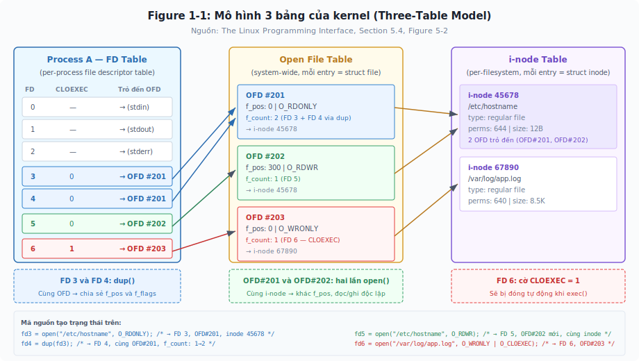

*Figure 1-1: Mô hình 3 bảng (Three-Table Model) theo TLPI Section 5.4, Figure 5-2. Process A giữ 4 FD thực sự (FD 3–6): FD 3 và FD 4 cùng trỏ đến OFD #201 (tạo bởi `dup()` — chia sẻ file offset và flags, f_count = 2). FD 5 trỏ đến OFD #202 — cùng file `/etc/hostname` nhưng thông qua lần `open()` riêng biệt, nên có file offset độc lập (f_pos = 300 vs f_pos = 0). FD 6 trỏ đến OFD #203 (`/var/log/app.log`) với cờ CLOEXEC = 1 — FD này sẽ tự động bị đóng khi process gọi exec(). OFD #201 và OFD #202 cùng trỏ đến i-node 45678 (`/etc/hostname`); OFD #203 trỏ đến i-node 67890 (`/var/log/app.log`). Mã nguồn tạo trạng thái này nằm ở thanh dưới cùng của hình.*

### Kết hợp lại: dòng chảy từ FD đến dữ liệu

Khi process gọi `read(fd, buf, 100)`, kernel thực hiện chuỗi tra cứu sau:

1. Tra bảng per-process FD table của process -> lấy con trỏ đến open file description
2. Từ open file description -> đọc file offset hiện tại (ví dụ: byte 500)
3. Từ open file description -> lấy con trỏ đến i-node
4. Từ i-node -> xác định data block trên đĩa chứa byte 500-599
5. Đọc 100 bytes từ buffer cache (hoặc từ đĩa nếu chưa có trong cache) vào `buf`
6. Tăng file offset trong open file description lên 600

Toàn bộ chuỗi này diễn ra trong kernel space — process chỉ biết "gọi read() với FD số 3 và nhận được 100 bytes".

> **Hiểu sai:** "Mỗi file descriptor tương ứng một-một với một file trên đĩa."
>
> **Thực tế:** Mối quan hệ là nhiều-nhiều. Nhiều FD có thể trỏ đến cùng open file description (qua dup/fork). Nhiều open file descriptions có thể trỏ đến cùng i-node (qua nhiều lần open() độc lập). Hiểu nhầm điều này dẫn đến bug nghiêm trọng khi lập trình multi-process — ví dụ hai process cùng ghi vào một file nhưng ghi đè lên nhau vì chia sẻ file offset mà không biết.

Mô hình ba bảng ở trên mô tả *kiến trúc* — ba tầng tra cứu từ FD đến dữ liệu trên đĩa, cùng các tính chất chia sẻ OFD thông qua `dup()`/`fork()` và tính độc lập OFD thông qua `open()`. Bốn bài thực hành tiếp theo sẽ *chứng minh* từng tính chất đó trực tiếp trên terminal — từ offset (read, write) đến status flags và lseek — bằng phép thử phản chứng: nếu tính chất không đúng, ta phải quan sát kết quả khác với dự đoán của mô hình, nhưng kết quả thực tế luôn khớp chính xác với những gì mô hình mô tả.

### ▶ Guided Exercise 2: So sánh trực tiếp open(), dup() và fork() trên cùng một file

Bài thực hành này chạy trong **một session duy nhất**, sử dụng **một file duy nhất**, xuyên suốt cả ba cơ chế tạo FD. Trạng thái offset được giữ nguyên từ bước trước sang bước sau — nên sự khác biệt giữa `open()`, `dup()`, và `fork()` hiện ra ngay tại chỗ, không cần bảng so sánh riêng. File `/proc/<pid>/fdinfo/<fd>` xuất ba trường quan trọng: `pos` (file offset nằm trong open file description), `flags` (status flags), và `mnt_id` (mount point chứa file) — đây là cửa sổ duy nhất để quan sát trạng thái bên trong kernel mà không cần debugger.

**Outcomes:**
- Chứng minh `dup()` chia sẻ OFD: đọc thông qua FD mới làm thay đổi offset của FD gốc
- Chứng minh `open()` tạo OFD riêng: mở lại cùng file nhưng offset bắt đầu từ 0, không bị ảnh hưởng bởi FD trước
- Chứng minh `fork()` chia sẻ OFD xuyên process: child đọc thì offset phía parent thay đổi — nhưng chỉ trên FD chia sẻ OFD, FD từ `open()` độc lập vẫn không bị ảnh hưởng
- Liên hệ với cơ chế shell redirect `2>&1` (dup) và cơ chế fork()+exec() trong HAProxy

**Before You Begin:**
Một terminal duy nhất, quyền root hoặc user thường. Bài thực hành sử dụng subshell `( ... )` cho bước fork — đây là `fork()` thuần túy, không `exec()`. Khi gọi `fork()`, kernel tạo bản sao của process hiện tại: process gốc gọi là **parent process**, bản sao gọi là **child process**. Child process là bản sao chính xác của parent tại thời điểm fork.

**Instructions:**

**1.** Tạo file test và mở FD 3 để đọc:

    root@huyvl-lab-fd:~# echo "0123456789ABCDEFGHIJKLMNOP" > /tmp/fdcompare.txt
    root@huyvl-lab-fd:~# exec 3< /tmp/fdcompare.txt

**2.** Đọc 5 bytes thông qua FD 3, rồi kiểm tra offset:

    root@huyvl-lab-fd:~# read -n 5 -u 3 data && echo "$data"
    01234
    root@huyvl-lab-fd:~# cat /proc/$$/fdinfo/3
    pos:    5
    flags:  0100000
    mnt_id: 31

`pos` nhảy từ 0 lên 5 — kernel ghi nhận 5 bytes đã được đọc. Giá trị `pos` nằm trong open file description (bảng 2), không phải trong per-process FD table (bảng 1). `flags: 0100000` tương ứng O_RDONLY + O_LARGEFILE (kernel tự thêm O_LARGEFILE trên hệ thống 64-bit).

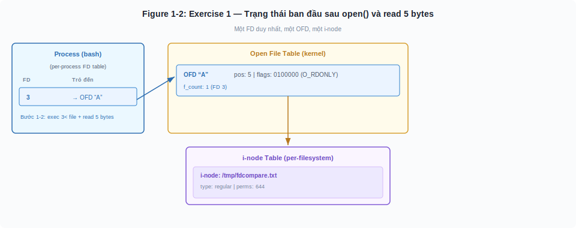

*Figure 1-2: Shell process mở file `/tmp/fdcompare.txt` bằng `open()`, nhận FD 3 trỏ đến OFD duy nhất với pos=5 sau khi đọc 5 bytes. Đây là baseline trước khi thực hiện `dup()` hoặc `open()` thêm.*

**Phần A — dup(): FD mới trỏ đến cùng OFD**

**3.** Tạo FD 4 bằng `dup()` từ FD 3, rồi kiểm tra offset:

    root@huyvl-lab-fd:~# exec 4>&3
    root@huyvl-lab-fd:~# cat /proc/$$/fdinfo/4
    pos:    5
    flags:  0100000
    mnt_id: 31

FD 4 cho `pos: 5` ngay lập tức — cùng giá trị với FD 3. Lệnh `exec 4>&3` gọi `dup2(3, 4)`: kernel tạo entry mới tại vị trí FD 4 trong bảng thứ nhất, trỏ đến cùng OFD mà FD 3 đang dùng, và tăng `f_count` (reference count) trong OFD từ 1 lên 2. Tuy nhiên, chỉ riêng `pos: 5` chưa đủ kết luận — giá trị này có thể do kernel copy offset sang OFD mới thay vì chia sẻ OFD. Bước tiếp theo sẽ phân biệt hai khả năng.

**4.** Đọc 3 bytes thông qua FD 4, rồi kiểm tra FD 3 (FD mà bạn không hề đụng vào):

    root@huyvl-lab-fd:~# read -n 3 -u 4 more && echo "$more"
    567
    root@huyvl-lab-fd:~# cat /proc/$$/fdinfo/3
    pos:    8
    flags:  0100000
    mnt_id: 31
    root@huyvl-lab-fd:~# cat /proc/$$/fdinfo/4
    pos:    8
    flags:  0100000
    mnt_id: 31

Bạn chỉ đọc thông qua FD 4, nhưng `pos` của FD 3 cũng nhảy từ 5 lên 8. Nếu `dup2()` tạo OFD riêng (copy offset sang entry mới trong bảng thứ hai), thì thao tác đọc thông qua FD 4 không thể làm thay đổi `pos` của FD 3 — vì hai OFD là hai vùng nhớ độc lập trong kernel. Kết quả `pos: 8` trên cả hai FD chỉ giải thích được khi cả hai cùng trỏ đến một OFD duy nhất — chính xác là tính chất "chia sẻ file offset" mà mục 1.3 đã mô tả. Đây cũng là cơ chế đằng sau shell redirect `2>&1`: FD 2 (stderr) được `dup()` để trỏ cùng OFD với FD 1 (stdout), nên mọi output lỗi đi cùng đích với output thường.

Ghi nhận trạng thái hiện tại: **FD 3 và FD 4 cùng trỏ đến OFD "A", pos = 8.**

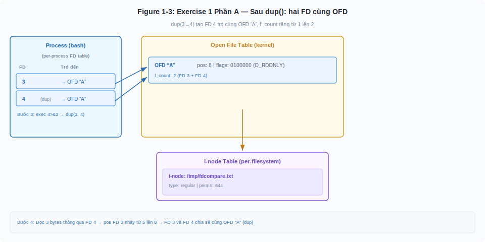

*Figure 1-3: Sau `exec 4>&3` (dup2), FD 4 trỏ đến cùng OFD "A" với FD 3. f_count tăng từ 1 lên 2. Đọc 3 bytes qua FD 4 khiến pos tiến từ 5 lên 8 trên cả hai FD — chứng minh shared OFD.*

**Phần B — open() độc lập: OFD riêng, offset riêng**

**5.** Mở lại **cùng file đó** bằng `open()` mới, gán cho FD 5:

    root@huyvl-lab-fd:~# exec 5< /tmp/fdcompare.txt
    root@huyvl-lab-fd:~# cat /proc/$$/fdinfo/5
    pos:    0
    flags:  0100000
    mnt_id: 31
    root@huyvl-lab-fd:~# cat /proc/$$/fdinfo/3
    pos:    8
    flags:  0100000
    mnt_id: 31

FD 5 cho `pos: 0` — **không phải** `pos: 8`. Nếu `open()` trỏ FD mới đến OFD đã có (giống cơ chế `dup()`), FD 5 phải cho `pos: 8` vì OFD "A" đang ở vị trí đó. Kết quả `pos: 0` chứng minh `open()` tạo OFD hoàn toàn mới (gọi là OFD "B") trong bảng thứ hai, với offset riêng, dù cùng file `/tmp/fdcompare.txt` và cùng i-node trên đĩa. Đây chính là kịch bản "f_pos = 300 vs f_pos = 0" trong Figure 1-1: hai OFD tách biệt, hai offset độc lập, nhưng cùng trỏ đến một i-node trong bảng thứ ba.

Ghi nhận trạng thái: **FD 3, FD 4 -> OFD "A" (pos=8). FD 5 -> OFD "B" (pos=0).**

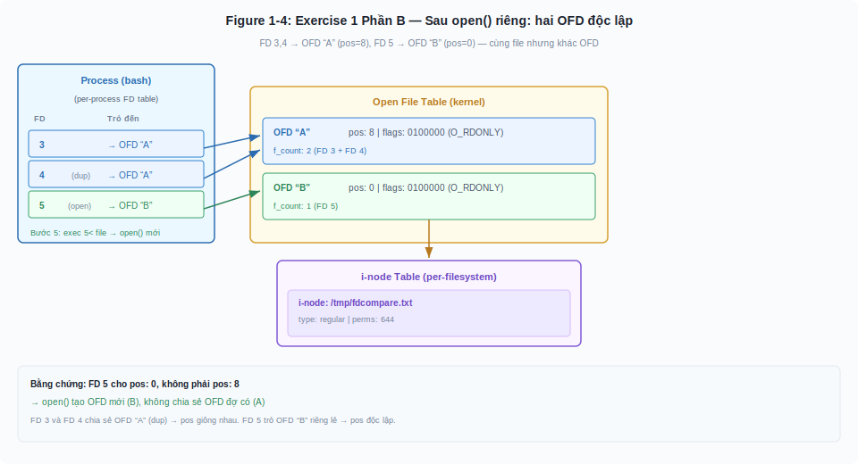

*Figure 1-4: `exec 5< /tmp/fdcompare.txt` tạo OFD "B" hoàn toàn mới với pos=0, dù cùng file. FD 3 và FD 4 vẫn trỏ OFD "A" (pos=8). Hai OFD là hai vùng nhớ độc lập trong kernel — offset không ảnh hưởng lẫn nhau.*

**Phần C — fork(): child process thừa kế toàn bộ bảng FD — khác biệt cốt lõi với dup()**

Tại thời điểm này, process đang giữ 3 FD: FD 3 và FD 4 cùng trỏ OFD "A" (pos=8), FD 5 trỏ OFD "B" (pos=0). Phần A đã chứng minh `dup()` chia sẻ OFD trên một FD cụ thể (FD 3→4). Câu hỏi tiếp theo: `fork()` chia sẻ OFD trên **tất cả** FD hay chỉ trên FD được chỉ định? Phần này sử dụng kỹ thuật **background child + /proc inspection** — child chạy nền rồi sleep, parent kiểm tra `/proc/$CHILD/fdinfo/N` ngay từ terminal hiện tại — cho phép quan sát đồng thời trạng thái kernel của cả hai process.

**6.** Fork child đọc 2 bytes qua FD 3 và 3 bytes qua FD 5, rồi sleep chờ inspection:

    root@huyvl-lab-fd:~# (
    >   read -n 2 -u 3 x
    >   echo "$x" > /tmp/child_read_fd3.txt
    >   read -n 3 -u 5 y
    >   echo "$y" > /tmp/child_read_fd5.txt
    >   sleep 300
    > ) &
    [1] 578
    root@huyvl-lab-fd:~# CHILD=$!; sleep 1
    root@huyvl-lab-fd:~# echo "Child PID: $CHILD"
    Child PID: 578

Lệnh `( ... ) &` gọi `fork()` tạo child process chạy nền. Child kế thừa toàn bộ FD table của parent (man fork(2): "child inherits copies of parent's open file descriptors"). `$!` trả về PID của background subshell (man bash(1): "process ID of the job most recently placed into background") — không phải PID của `sleep` bên trong. `sleep 300` giữ child tồn tại đủ lâu để parent inspect `/proc/$CHILD/fdinfo/N` từ cùng terminal. Child ghi kết quả đọc vào temp file thay vì stdout — tránh interleave với prompt của parent.

**7.** Kiểm tra kết quả đọc của child:

    root@huyvl-lab-fd:~# cat /tmp/child_read_fd3.txt
    89
    root@huyvl-lab-fd:~# cat /tmp/child_read_fd5.txt
    012

Child đọc `89` từ FD 3 (2 bytes tiếp theo sau pos=8 của OFD "A") và `012` từ FD 5 (3 bytes đầu tiên của OFD "B", pos bắt đầu từ 0).

**8.** Inspect **đồng thời** parent và child — bằng chứng shared OFD:

Nếu `fork()` tạo OFD riêng cho child (copy offset sang entry mới trong bảng thứ hai), thì thao tác đọc của child không thể ảnh hưởng đến offset phía parent — vì hai OFD là hai vùng nhớ độc lập trong kernel. Cụ thể: FD 3 phía parent phải giữ nguyên `pos: 8`, FD 5 phía parent phải giữ nguyên `pos: 0`.

    root@huyvl-lab-fd:~# echo "=== OFD A — FD 3 (parent vs child) ==="
    === OFD A — FD 3 (parent vs child) ===
    root@huyvl-lab-fd:~# cat /proc/$$/fdinfo/3
    pos:    10
    flags:  0100000
    mnt_id: 31
    root@huyvl-lab-fd:~# cat /proc/$CHILD/fdinfo/3
    pos:    10
    flags:  0100000
    mnt_id: 31
    root@huyvl-lab-fd:~# echo "=== OFD B — FD 5 (parent vs child) ==="
    === OFD B — FD 5 (parent vs child) ===
    root@huyvl-lab-fd:~# cat /proc/$$/fdinfo/5
    pos:    3
    flags:  0100000
    mnt_id: 31
    root@huyvl-lab-fd:~# cat /proc/$CHILD/fdinfo/5
    pos:    3
    flags:  0100000
    mnt_id: 31

Parent FD 3 nhảy từ 8 lên 10 (child đọc 2 bytes), parent FD 5 nhảy từ 0 lên 3 (child đọc 3 bytes) — dù parent không hề gọi `read()`. Cả hai OFD đều cho cùng `pos` trên parent và child — bạn đang nhìn thấy cùng một vùng nhớ kernel từ hai process khác nhau. Kết quả này mâu thuẫn hoàn toàn với giả thuyết "fork() tạo OFD riêng": nếu OFD riêng biệt, parent phải giữ pos=8 (FD 3) và pos=0 (FD 5). Kết quả pos=10 và pos=3 chỉ giải thích được khi parent và child cùng trỏ đến cùng OFD, trên **tất cả** FD đang mở.

Đây chính là sự khác biệt cốt lõi với `dup()`: `dup(3→4)` chỉ nhân bản **một FD cụ thể** mà bạn chỉ định — FD 3 sang FD 4, cả hai trỏ đến OFD "A", nhưng không ảnh hưởng đến FD 5 hay bất kỳ FD nào khác. Còn `fork()` nhân bản **toàn bộ** per-process FD table — child process thừa kế cả FD 3, FD 4 (OFD "A") lẫn FD 5 (OFD "B"), và chia sẻ offset trên tất cả. Nói cách khác, `dup()` là selective (chọn lọc), `fork()` là wholesale (toàn bộ).

Hệ quả production: child process nhận mọi FD của parent — bao gồm socket lắng nghe, file nhạy cảm, pipe — bất kể parent có muốn hay không. Đây là lý do cờ CLOEXEC tồn tại (xem mục 1.10): cho phép parent đánh dấu "FD này không được thừa kế khi exec()" để ngăn FD leak sang child process.

**Trạng thái cuối cùng — ba OFD mapping trong một session:**

    FD 3  ──┐
            ├──→  OFD "A"  (pos = 10)   ← dup() + fork() chia sẻ
    FD 4  ──┘
    FD 5  ─────→  OFD "B"  (pos = 3)    ← fork() cũng chia sẻ — dup() không đụng đến

**Phần D — Ranh giới kernel space vs user space thông qua fork()**

**9.** fork() chia sẻ OFD (kernel space) nhưng cách ly biến (user space):

    root@huyvl-lab-fd:~# x="PARENT"
    root@huyvl-lab-fd:~# ( x="CHILD"; echo "$x" > /tmp/child_var.txt; sleep 300 ) &
    [2] 587
    root@huyvl-lab-fd:~# CHILD2=$!; sleep 1
    root@huyvl-lab-fd:~# echo "parent x=$x"
    parent x=PARENT
    root@huyvl-lab-fd:~# cat /tmp/child_var.txt
    CHILD

Child process sửa biến `x` thành `CHILD` và ghi ra temp file, nhưng parent vẫn giữ `PARENT`. Sự khác biệt này phản ánh ranh giới kiến trúc: OFD nằm trong kernel space (parent và child cùng trỏ đến một OFD — nên offset thay đổi xuyên process như bước 8 đã chứng minh), còn biến nằm trong user space (copy-on-write sau fork — nên mỗi process có bản sao riêng, thay đổi ở child không lan sang parent).

**10.** Dọn dẹp:

    root@huyvl-lab-fd:~# kill $CHILD $CHILD2 2>/dev/null; wait $CHILD $CHILD2 2>/dev/null
    root@huyvl-lab-fd:~# exec 3<&- ; exec 4<&- ; exec 5<&-
    root@huyvl-lab-fd:~# rm /tmp/fdcompare.txt /tmp/child_read_fd3.txt /tmp/child_read_fd5.txt /tmp/child_var.txt

Ký hiệu `3<&-` đóng FD 3. Kernel giảm reference count (`f_count`) của OFD mỗi lần đóng một FD. Khi FD 3 đóng, `f_count` của OFD "A" giảm từ 2 về 1 (FD 4 vẫn giữ). Khi FD 4 đóng, `f_count` về 0 và kernel giải phóng OFD "A". OFD "B" cũng được giải phóng khi FD 5 đóng.

**Finish:**

Ba cơ chế tạo FD khác nhau ở mức OFD: `open()` luôn tạo OFD mới (bước 5: pos bắt đầu từ 0 dù cùng file), `dup()` chia sẻ OFD nhưng chỉ trên FD được chỉ định (bước 4: FD 3 và FD 4 cùng offset, trong khi FD 5 không bị ảnh hưởng), còn `fork()` nhân bản toàn bộ bảng FD nên child process chia sẻ OFD với parent trên mọi FD đang mở (bước 8: parent và child cho cùng pos trên cả OFD "A" lẫn OFD "B" — chứng minh fork() là wholesale, không selective như dup()).

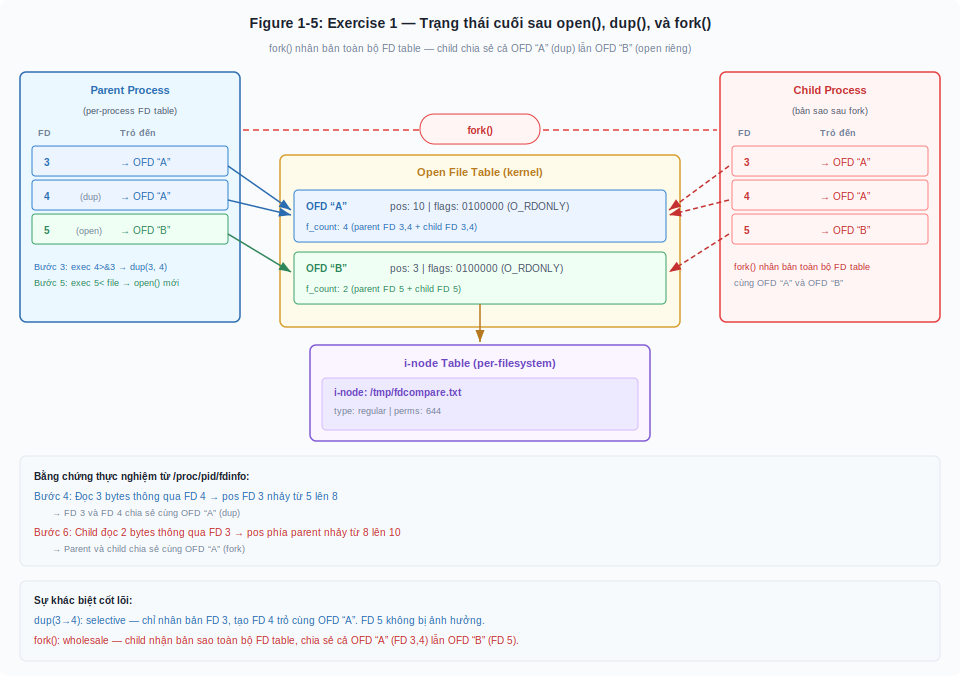

*Figure 1-5: Parent process có FD 3, FD 4 (dup → cùng OFD "A", pos=10) và FD 5 (open riêng → OFD "B", pos=3). Sau fork(), child process nhận bản sao toàn bộ FD table — cả ba FD trỏ đến cùng OFD với parent. Đường nét đứt (child) trỏ đến cùng OFD với đường nét liền (parent), chứng minh fork() chia sẻ OFD xuyên process.*

> **Key Topic:** `dup()` và `dup2()` tạo FD mới trỏ đến cùng open file description — nghĩa là chia sẻ file offset, status flags, và signal-driven I/O settings. Tuy nhiên, FD flags (cụ thể là close-on-exec) là riêng biệt — mỗi FD có cờ CLOEXEC độc lập dù trỏ cùng OFD (man dup(2), man7.org). `fork()` khiến child process thừa kế bản sao toàn bộ FD table — nhưng các FD trỏ đến **cùng** open file descriptions với parent (man fork(2), man7.org). Đây là lý do HAProxy và các network server cẩn thận đặt cờ CLOEXEC trên listening socket FDs — để khi fork()+exec() health check script, child process không vô tình thừa kế và giữ tham chiếu đến socket lắng nghe.

---

### ▶ Guided Exercise 3: Write-side proof — khi OFD sharing quyết định dữ liệu sống hay chết

Exercise trước chứng minh OFD sharing thông qua **read** — quan sát offset thay đổi nhưng file không bị sửa. Exercise này chứng minh thông qua **write** — hệ quả hiện ra trực tiếp trong nội dung file: dữ liệu nối tiếp (shared OFD) hay bị đè (independent OFD).

**Outcomes:**
- Chứng minh `dup()` chia sẻ OFD trên write: hai FD ghi tuần tự, không đè lẫn nhau
- Chứng minh `open()` tạo OFD riêng trên write: ghi từ offset 0, đè dữ liệu hiện có
- Chứng minh `fork()` chia sẻ OFD trên write xuyên process: child ghi làm offset phía parent tiến
- Liên hệ với data corruption trong production: hai process ghi cùng log file không có `O_APPEND`

**Before You Begin:**
Cùng terminal, quyền root. Bài này mở file ở chế độ read-write (`exec 3<> file` → O_RDWR) thay vì read-only (`exec 3< file` → O_RDONLY) như Guided Exercise 2. Sự khác biệt sẽ phản ánh trong trường `flags` của `fdinfo`.

**Instructions:**

**1.** Tạo file 10 ký tự (không có newline cuối) và mở FD 3 read-write:

    root@huyvl-lab-fd:~# echo -n "0123456789" > /tmp/fdwrite.txt
    root@huyvl-lab-fd:~# exec 3<> /tmp/fdwrite.txt
    root@huyvl-lab-fd:~# cat /proc/$$/fdinfo/3
    pos:    0
    flags:  0100002
    mnt_id: 31

`flags: 0100002` = O_RDWR (02) + O_LARGEFILE (0100000). So sánh với Guided Exercise 2: FD 3 mở bằng `exec 3< file` cho `flags: 0100000` (O_RDONLY = 00). Bit cuối (02 vs 00) phản ánh access mode được lưu trong OFD.

**Phần E — dup() write: hai FD cùng OFD → dữ liệu nối tiếp**

**2.** Tạo FD 4 bằng dup(), ghi `AAA` thông qua FD 3, rồi ghi `BBB` thông qua FD 4:

    root@huyvl-lab-fd:~# exec 4>&3
    root@huyvl-lab-fd:~# echo -n "AAA" >&3
    root@huyvl-lab-fd:~# cat /proc/$$/fdinfo/3
    pos:    3
    flags:  0100002
    mnt_id: 31
    root@huyvl-lab-fd:~# echo -n "BBB" >&4
    root@huyvl-lab-fd:~# cat /proc/$$/fdinfo/3
    pos:    6
    flags:  0100002
    mnt_id: 31
    root@huyvl-lab-fd:~# cat /tmp/fdwrite.txt
    AAABBB6789root@huyvl-lab-fd:~#

`echo -n "AAA" >&3` ghi 3 bytes tại pos 0, offset tiến lên 3. Sau đó `echo -n "BBB" >&4` ghi 3 bytes — nhưng tại pos 3 (không phải pos 0), vì FD 4 chia sẻ cùng OFD với FD 3. Offset tiến lên 6, file chứa `AAABBB6789` — hai chuỗi **nối tiếp nhau**. Nếu `dup()` tạo OFD riêng (copy offset = 0 tại thời điểm dup), lệnh `echo >&4` sẽ ghi `BBB` tại pos 0, đè `AAA` — file sẽ là `BBB3456789`. Kết quả `AAABBB6789` chỉ giải thích được khi cả hai FD chia sẻ cùng offset trong cùng OFD — mỗi lần write, offset tiến, và lần write sau tiếp tục từ vị trí đó. Đây là cơ chế cho phép `>>log 2>&1` ghi stdout và stderr tuần tự vào cùng file mà không đè lẫn nhau.

Ghi nhận trạng thái: **FD 3 và FD 4 cùng trỏ đến OFD "W", pos = 6. File: `AAABBB6789`.**

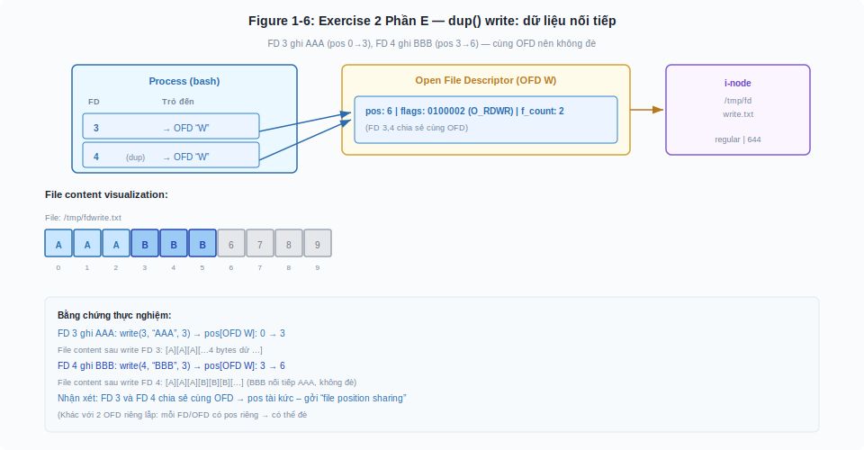

*Figure 1-6: FD 3 ghi `AAA` tại pos 0-2, FD 4 (dup → cùng OFD) ghi `BBB` tại pos 3-5 — dữ liệu nối tiếp nhau vì shared offset. File: `AAABBB6789`.*

**Phần F — open() write: OFD riêng → đè dữ liệu**

**3.** Mở lại **cùng file đó** bằng `open()` mới, ghi `XXX` thông qua FD 5:

    root@huyvl-lab-fd:~# exec 5<> /tmp/fdwrite.txt
    root@huyvl-lab-fd:~# cat /proc/$$/fdinfo/5
    pos:    0
    flags:  0100002
    mnt_id: 31
    root@huyvl-lab-fd:~# echo -n "XXX" >&5
    root@huyvl-lab-fd:~# cat /tmp/fdwrite.txt
    XXXBBB6789root@huyvl-lab-fd:~#
    root@huyvl-lab-fd:~# cat /proc/$$/fdinfo/3
    pos:    6
    flags:  0100002
    mnt_id: 31

FD 5 bắt đầu tại `pos: 0` — OFD mới, offset riêng. Ghi `XXX` tại vị trí 0-2, **đè** `AAA` thành `XXX`. File: `XXXBBB6789`. Trong khi đó, FD 3 vẫn `pos: 6` — hoàn toàn không bị ảnh hưởng. Nếu `open()` trỏ FD 5 đến OFD đang có (pos = 6), `XXX` sẽ ghi tại vị trí 6-8 → file `AAABBBXXX9`. Kết quả `XXX` nằm ở đầu file (vị trí 0) chứng minh OFD độc lập.

Đây chính là kịch bản **data corruption** kinh điển: hai process mở cùng log file bằng `open()` riêng biệt (không `O_APPEND`), cả hai bắt đầu ghi từ offset 0 → process sau đè dữ liệu của process trước. Giải pháp production: dùng `O_APPEND` — kernel di chuyển offset về cuối file **trước mỗi lần write**, atomic, bất kể OFD nào.

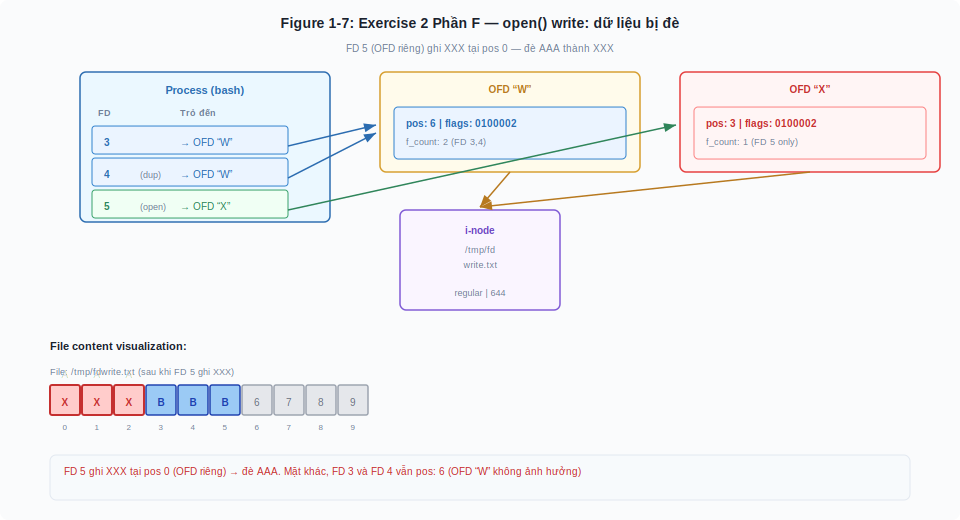

*Figure 1-7: FD 5 (open riêng → OFD mới, pos=0) ghi `XXX` tại vị trí 0-2, đè `AAA` thành `XXX`. File: `XXXBBB6789`. FD 3/4 vẫn pos=6 — OFD độc lập, không bị ảnh hưởng.*

**Phần G — fork() write xuyên process**

**4.** Fork child ghi 2 bytes `DD` thông qua FD 3, rồi inspect đồng thời parent và child:

    root@huyvl-lab-fd:~# cat /proc/$$/fdinfo/3
    pos:    6
    flags:  0100002
    mnt_id: 31

Trước fork, parent đang ở `pos: 6`. Nếu `fork()` tạo OFD riêng cho child (copy offset sang entry mới), child sẽ ghi `DD` tại pos 6 của OFD riêng và OFD phía parent vẫn giữ nguyên `pos: 6`, vì hai OFD là hai vùng nhớ độc lập.

    root@huyvl-lab-fd:~# ( echo -n "DD" >&3; sleep 300 ) &
    [1] 558
    root@huyvl-lab-fd:~# CHILD=$!; sleep 1
    root@huyvl-lab-fd:~# cat /proc/$$/fdinfo/3
    pos:    8
    flags:  0100002
    mnt_id: 31
    root@huyvl-lab-fd:~# cat /proc/$CHILD/fdinfo/3
    pos:    8
    flags:  0100002
    mnt_id: 31
    root@huyvl-lab-fd:~# cat /tmp/fdwrite.txt
    XXXBBBDD89root@huyvl-lab-fd:~#

Parent và child đều cho `pos: 8` — child ghi 2 bytes `DD` tại pos 6, offset tiến lên 8, và parent cũng nhìn thấy pos=8 dù không hề ghi. File: `XXXBBBDD89` — ký tự `67` tại vị trí 6-7 bị thay bằng `DD`. Kết quả `pos: 8` trên cả hai process mâu thuẫn với giả thuyết "OFD riêng" — chứng minh shared OFD trên write path, xuyên process boundary, giống hệt kết luận từ Guided Exercise 2 (read path), nhưng lần này hệ quả là **dữ liệu file thực sự bị thay đổi** bởi child.

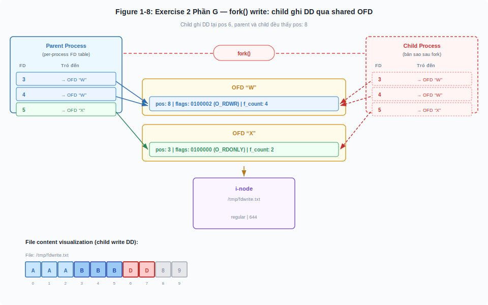

*Figure 1-8: Child (fork) ghi `DD` qua FD 3 tại pos 6, offset tiến lên 8. Parent cũng nhìn thấy pos=8 dù không hề ghi — chứng minh shared OFD xuyên process trên write path. File: `XXXBBBDD89`.*

**5.** Dọn dẹp:

    root@huyvl-lab-fd:~# kill $CHILD 2>/dev/null; wait $CHILD 2>/dev/null
    root@huyvl-lab-fd:~# exec 3<&- ; exec 4<&- ; exec 5<&-
    root@huyvl-lab-fd:~# rm /tmp/fdwrite.txt

**Finish:**

Exercise trước chứng minh OFD sharing thông qua read (offset thay đổi khi FD khác hoặc process khác đọc). Exercise này chứng minh cùng tính chất thông qua write — với hệ quả nghiêm trọng hơn: khi hai FD chia sẻ OFD (`dup()` hoặc `fork()`), writes nối tiếp nhau (bước 2: `AAABBB`); khi hai FD trỏ OFD riêng (`open()`), writes đè lẫn nhau (bước 3: `XXX` đè `AAA`). Đây là lý do HAProxy mở log file với `O_APPEND`, và là lý do các network daemon cẩn thận quản lý FD inheritance trước `fork()`.

---

### ▶ Guided Exercise 4: Status flags cũng chia sẻ thông qua OFD — không chỉ offset

Guided Exercise 2 và 3 chứng minh OFD sharing thông qua **offset** (pos thay đổi khi FD khác đọc/ghi). Nhưng OFD không chỉ chứa offset — nó còn chứa **status flags** (O_APPEND, O_NONBLOCK, O_ASYNC, ...). Exercise này chứng minh status flags cũng chia sẻ theo cùng quy luật: `dup()` chia sẻ, `open()` tách biệt.

**Outcomes:**
- Chứng minh thay đổi status flags thông qua FD này ảnh hưởng FD kia (khi cùng OFD thông qua `dup()`)
- Chứng minh thay đổi status flags trên OFD riêng (`open()`) không ảnh hưởng OFD khác
- Giải thích ý nghĩa octal của `flags` trong `/proc/pid/fdinfo`

**Before You Begin:**
Cùng terminal, quyền root. Exercise này dùng `python3` để gọi `fcntl(F_SETFL)` — system call thay đổi status flags trên OFD — vì bash không có lệnh trực tiếp cho thao tác này.

**Instructions:**

**1.** Tạo 3 FD: FD 3 (open), FD 4 (dup từ FD 3 → cùng OFD), FD 5 (open riêng → OFD riêng):

    root@huyvl-lab-fd:~# echo -n "0123456789" > /tmp/fdflags.txt
    root@huyvl-lab-fd:~# exec 3<> /tmp/fdflags.txt
    root@huyvl-lab-fd:~# exec 4>&3
    root@huyvl-lab-fd:~# exec 5<> /tmp/fdflags.txt
    root@huyvl-lab-fd:~# cat /proc/$$/fdinfo/3
    pos:    0
    flags:  0100002
    mnt_id: 31
    root@huyvl-lab-fd:~#
    root@huyvl-lab-fd:~# cat /proc/$$/fdinfo/4
    pos:    0
    flags:  0100002
    mnt_id: 31
    root@huyvl-lab-fd:~# cat /proc/$$/fdinfo/5
    pos:    0
    flags:  0100002
    mnt_id: 31

Ba FD đều cho `flags: 0100002` — O_RDWR (02) + O_LARGEFILE (0100000). Tại thời điểm này, hai OFD (một cho FD 3/4, một cho FD 5) có flags giống nhau. Bước tiếp theo sẽ phá vỡ sự đối xứng đó.

**2.** Thêm `O_APPEND` thông qua FD 4 (dup), rồi kiểm tra cả 3 FD:

    root@huyvl-lab-fd:~# python3 -c "import fcntl, os; fcntl.fcntl(4, fcntl.F_SETFL, fcntl.fcntl(4, fcntl.F_GETFL) | os.O_APPEND)"
    root@huyvl-lab-fd:~# cat /proc/$$/fdinfo/3
    pos:    0
    flags:  0102002
    mnt_id: 31
    root@huyvl-lab-fd:~# cat /proc/$$/fdinfo/4
    pos:    0
    flags:  0102002
    mnt_id: 31
    root@huyvl-lab-fd:~# cat /proc/$$/fdinfo/5
    pos:    0
    flags:  0100002
    mnt_id: 31

Lệnh `python3` gọi `fcntl(4, F_SETFL, flags | O_APPEND)` — thêm cờ O_APPEND (octal 02000) vào OFD mà FD 4 trỏ đến. Kết quả: FD 3 cũng nhảy từ `0100002` lên `0102002`, dù lệnh python3 chỉ thao tác trên FD 4. Nếu `dup()` tạo OFD riêng, thay đổi flags trên FD 4 không thể ảnh hưởng FD 3 — vì `F_SETFL` ghi vào OFD, và hai OFD riêng biệt là hai vùng nhớ độc lập trong kernel. Kết quả `0102002` trên cả FD 3 lẫn FD 4 chỉ giải thích được khi cả hai cùng trỏ đến một OFD duy nhất — cùng kết luận từ Guided Exercise 2 (offset) và Guided Exercise 3 (write), nhưng lần này chứng minh trên một thuộc tính khác hoàn toàn.

Trong khi đó, FD 5 vẫn `0100002` — không có O_APPEND. `open()` tạo OFD riêng, nên thay đổi flags trên OFD của FD 3/4 không lan sang OFD của FD 5.

Phân tích giá trị octal: `0102002` = O_RDWR (02) + O_APPEND (02000) + O_LARGEFILE (0100000). So sánh trực quan:

    0100002  →  O_LARGEFILE | O_RDWR
    0102002  →  O_LARGEFILE | O_APPEND | O_RDWR
         ^
         bit O_APPEND (02000) được bật

**3.** Dọn dẹp:

    root@huyvl-lab-fd:~# exec 3<&- ; exec 4<&- ; exec 5<&-
    root@huyvl-lab-fd:~# rm /tmp/fdflags.txt

**Finish:**

OFD chia sẻ không chỉ offset (Guided Exercise 2, 3) mà cả status flags (exercise này). Điều này có ý nghĩa production: khi HAProxy gọi `fcntl(fd, F_SETFL, O_NONBLOCK)` để chuyển socket sang non-blocking mode, mọi FD trỏ đến cùng OFD (qua `dup()` hoặc sau `fork()`) đều trở thành non-blocking — dù không gọi `fcntl()` trên từng FD riêng lẻ.

*Figure 1-9: Guided Exercise 4 — Status flags chia sẻ theo cùng quy luật OFD. fcntl(FD 4, F_SETFL, O_APPEND) thay đổi flags trên OFD "A" từ 0100002 lên 0102002 — ảnh hưởng cả FD 3 (cùng OFD) nhưng không ảnh hưởng FD 5 (OFD riêng). Bao gồm phân tích giá trị octal và so sánh fdinfo ba FD.*

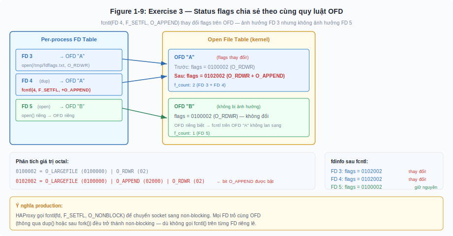

---

### ▶ Guided Exercise 5: lseek xuyên process — child "tua lại" file cho parent

Guided Exercise 2, 3, và 4 chứng minh OFD sharing thông qua read, write, và status flags. Exercise này chứng minh khía cạnh cuối cùng: **lseek** — thao tác di chuyển offset trực tiếp — cũng xuyên process thông qua shared OFD.

**Outcomes:**
- Chứng minh child process gọi `lseek()` thay đổi offset mà parent nhìn thấy
- Chứng minh parent có thể đọc lại dữ liệu từ đầu file sau khi child "tua lại"
- Nhận diện rủi ro: child process có thể vô tình phá hỏng vị trí đọc/ghi của parent

**Before You Begin:**
Cùng terminal, quyền root. Dùng `python3` để gọi `os.lseek()` vì bash không có lệnh lseek trực tiếp.

**Instructions:**

**1.** Tạo file, mở FD 3, đọc 5 bytes:

    root@huyvl-lab-fd:~# echo -n "0123456789" > /tmp/fdseek.txt
    root@huyvl-lab-fd:~# exec 3< /tmp/fdseek.txt
    root@huyvl-lab-fd:~# read -n 5 -u 3 data && echo "$data"
    01234
    root@huyvl-lab-fd:~# cat /proc/$$/fdinfo/3
    pos:    5
    flags:  0100000
    mnt_id: 31

Parent đã đọc `01234`, offset ở vị trí 5. Lần đọc tiếp theo sẽ bắt đầu từ ký tự `5`.

**2.** Fork child gọi `lseek(3, 0, SEEK_SET)` — tua offset về đầu file — rồi sleep chờ inspection:

    root@huyvl-lab-fd:~# ( python3 -c "import os; os.lseek(3, 0, os.SEEK_SET)"; sleep 300 ) &
    [1] 566
    root@huyvl-lab-fd:~# CHILD=$!; sleep 1

Nếu `fork()` tạo OFD riêng cho child, `lseek()` của child chỉ thay đổi offset trong OFD riêng — OFD phía parent giữ nguyên `pos: 5`.

**3.** Inspect đồng thời — child đã "tua lại" offset cho parent:

    root@huyvl-lab-fd:~# cat /proc/$$/fdinfo/3
    pos:    0
    flags:  0100000
    mnt_id: 31
    root@huyvl-lab-fd:~# cat /proc/$CHILD/fdinfo/3
    pos:    0
    flags:  0100000
    mnt_id: 31

Cả parent lẫn child đều cho `pos: 0`. Child đã "tua lại" offset về đầu file, và parent nhìn thấy sự thay đổi đó dù không hề gọi `lseek()`. Kết quả `pos: 0` (thay vì `pos: 5` nếu OFD riêng biệt) chứng minh parent và child chia sẻ cùng OFD, và `lseek()` cũng hoạt động xuyên process giống hệt `read()` (Guided Exercise 2) và `write()` (Guided Exercise 3).

**4.** Đọc lại để xác nhận — parent thực sự đọc từ đầu file:

    root@huyvl-lab-fd:~# read -n 3 -u 3 data2 && echo "$data2"
    012
    root@huyvl-lab-fd:~# cat /proc/$$/fdinfo/3
    pos:    3
    flags:  0100000
    mnt_id: 31
    root@huyvl-lab-fd:~# cat /proc/$CHILD/fdinfo/3
    pos:    3
    flags:  0100000
    mnt_id: 31

Parent đọc `012` — ba ký tự đầu tiên — **không phải** `567` (vị trí mà parent đang đọc dở trước khi child lseek). Cả parent và child lại cho cùng `pos: 3` sau khi parent đọc — xác nhận lần nữa rằng mọi thao tác trên OFD đều xuyên suốt hai process. Trong production, đây là lỗi khó debug: parent đang xử lý file tuần tự, child vô tình gọi lseek → parent đọc lại dữ liệu đã xử lý hoặc bỏ qua dữ liệu chưa xử lý, gây duplicate processing hoặc data loss mà không có error nào được raise.

**5.** Dọn dẹp:

    root@huyvl-lab-fd:~# kill $CHILD 2>/dev/null; wait $CHILD 2>/dev/null
    root@huyvl-lab-fd:~# exec 3<&-
    root@huyvl-lab-fd:~# rm /tmp/fdseek.txt

**Finish:**

Bốn exercise đã chứng minh OFD sharing trên bốn chiều khác nhau: read offset (Guided Exercise 2), write + nội dung file (Guided Exercise 3), status flags (Guided Exercise 4), và lseek (Guided Exercise 5). Tất cả đều tuân theo cùng một quy luật: `dup()` và `fork()` chia sẻ OFD, `open()` tạo OFD riêng. Mọi thao tác trên OFD — dù là đọc, ghi, thay đổi flags, hay di chuyển offset — đều lan truyền thông qua tất cả FD cùng trỏ đến OFD đó, kể cả FD ở process khác.

*Figure 1-10: Guided Exercise 5 — lseek xuyên process: child "tua lại" file cho parent. Panel trái: sau khi parent đọc 5 bytes, pos = 5. Panel phải: child gọi lseek(FD 3, 0, SEEK_SET) reset pos về 0, parent đọc lại "012" thay vì "567" — chứng minh lseek cũng xuyên process boundary thông qua shared OFD.*

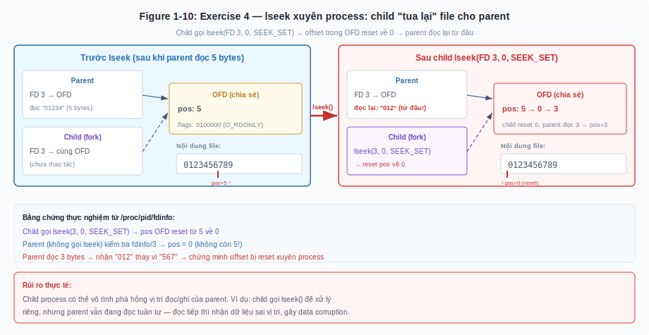

---

## 1.4 - Socket là file descriptor: cầu nối với mạng máy tính

Kiến thức về file descriptor ở các mục trên có vẻ học thuật và xa với công việc hàng ngày của một network engineer. Nhưng từ điểm này trở đi, mọi thứ thay đổi — vì **socket chính là file descriptor**.

Khi một ứng dụng mạng (ví dụ: HAProxy, Nginx, hay bất kỳ TCP server nào) gọi system call `socket()`, kernel thực hiện chính xác những gì nó làm khi mở một regular file: tạo một entry trong open file table, tạo một entry mới trong per-process FD table, và trả về một số nguyên — file descriptor. Trích dẫn trực tiếp từ `socket(2)` man page: *"On success, a file descriptor for the new socket is returned."*

Điều này có ý nghĩa sâu sắc. Sau khi có socket FD, ứng dụng có thể gọi `read()` và `write()` trên nó — chính xác như đọc ghi file thông thường. Kernel biết FD này trỏ đến một socket (không phải regular file) thông qua trường file type trong i-node, và chuyển hướng thao tác đến TCP/IP stack thay vì file system.

Đây chính là Universal I/O Model hoạt động trong thực tế: cùng một system call `read()`, khi FD là regular file thì kernel đọc từ đĩa, khi FD là socket thì kernel đọc từ buffer nhận TCP. Process không cần biết — và không nên biết — sự khác biệt.

Vòng đời của một socket FD trong TCP server diễn ra như sau:

```c
fd = socket(AF_INET, SOCK_STREAM, 0);   // Tạo socket, nhận FD (ví dụ: 3)
bind(fd, &addr, sizeof(addr));           // Gán địa chỉ (IP:port) cho socket
listen(fd, backlog);                     // Chuyển socket sang trạng thái lắng nghe
new_fd = accept(fd, &client, &len);      // Chấp nhận kết nối mới, nhận FD MỚI (ví dụ: 4)
read(new_fd, buf, sizeof(buf));          // Đọc dữ liệu từ client thông qua FD 4
write(new_fd, response, len);            // Gửi dữ liệu về client thông qua FD 4
close(new_fd);                           // Đóng kết nối, giải phóng FD 4
```

Điểm quan trọng cần chú ý: `accept()` trả về một file descriptor MỚI cho mỗi kết nối client. Socket gốc (fd = 3) vẫn tiếp tục lắng nghe kết nối mới. Điều này có nghĩa: một TCP server với 10,000 client đồng thời sẽ có 10,001 file descriptor đang mở — 1 listening socket + 10,000 connection sockets.

> **Key Topic:** Mỗi kết nối TCP trên Linux được đại diện bằng một file descriptor riêng biệt. Số lượng kết nối đồng thời mà một process có thể xử lý bị giới hạn trực tiếp bởi giới hạn file descriptor của process đó (có thể kiểm tra bằng `ulimit -n`, mặc định thường là 1024 trên nhiều hệ thống).

### ▶ Guided Exercise 6: Quan sát socket là file descriptor

Trong bài thực hành này, bạn xác minh rằng `socket()` trả về file descriptor và mỗi kết nối TCP mới tạo thêm một FD riêng.

**Before You Begin:**
Bạn cần Python 3 đã cài đặt, hai terminal, và `ss` command (có sẵn trong package `iproute2` trên mọi distro).

**Outcomes:**
- Xác minh socket() trả về file descriptor
- Thấy được mỗi kết nối TCP là một FD riêng

**Instructions:**

**1.** Đảm bảo shell chỉ có FD tiêu chuẩn trước khi bắt đầu — tránh FD còn sót từ bài thực hành trước ảnh hưởng kết quả:

    root@huyvl-lab-fd:~# ls /proc/$$/fd/
    0  1  2  255

FD 0-2 là stdin/stdout/stderr, FD 255 là FD nội bộ của bash dùng giữ script input — bình thường. Không có FD nào khác chen giữa.

**2.** Khởi động một web server đơn giản bằng Python:

    root@huyvl-lab-fd:~# python3 -m http.server 8080 &
    [1] 558
    root@huyvl-lab-fd:~# Serving HTTP on 0.0.0.0 port 8080 (http://0.0.0.0:8080/) ...

**3.** Kiểm tra file descriptor của process này:

    root@huyvl-lab-fd:~# ls -la /proc/558/fd/
    total 0
    dr-x------ 2 root root  0 Apr  3 18:42 .
    dr-xr-xr-x 9 root root  0 Apr  3 18:42 ..
    lrwx------ 1 root root 64 Apr  3 18:42 0 -> /dev/pts/0
    lrwx------ 1 root root 64 Apr  3 18:42 1 -> /dev/pts/0
    lrwx------ 1 root root 64 Apr  3 18:42 2 -> /dev/pts/0
    lrwx------ 1 root root 64 Apr  3 18:42 3 -> 'socket:[20882]'

FD 0-2 là stdin/stdout/stderr thông qua terminal `/dev/pts/0`. FD 3 là listening socket — kernel hiển thị dạng `socket:[inode_number]`, trong đó 20882 là i-node number của socket trong sockfs (pseudo-filesystem quản lý socket). Vì parent process chỉ có FD 0-2 (đã kiểm tra ở bước 1), Python server nhận FD 3 cho listening socket — đúng quy tắc **lowest available number**.

**4.** Dùng strace để quan sát syscall `accept4()` khi client kết nối. Attach strace vào process Python, chỉ theo dõi `accept4` và `close`:

    root@huyvl-lab-fd:~# strace -e trace=accept4,close -p 558 2>&1 &
    [2] 560
    root@huyvl-lab-fd:~# strace: Process 558 attached

**5.** Từ cùng terminal (hoặc terminal khác), gửi request:

    root@huyvl-lab-fd:~# curl -s http://localhost:8080/ > /dev/null
    accept4(3, {sa_family=AF_INET, sin_port=htons(45528), sin_addr=inet_addr("127.0.0.1")}, [16], SOCK_CLOEXEC) = 4
    127.0.0.1 - - [03/Apr/2026 18:42:32] "GET / HTTP/1.1" 200 -
    root@huyvl-lab-fd:~#

`accept4(3, ...) = 4` cho biết: kernel nhận kết nối mới trên listening socket FD 3, tạo connection socket mới FD 4 cho client (port nguồn 45528). Cờ `SOCK_CLOEXEC` trong `accept4()` cho thấy Python 3 tự động đặt close-on-exec nguyên tử ngay khi tạo connection socket — đây là best practice mà mục 1.10 giải thích chi tiết: nếu process gọi `fork()+exec()` sau đó, connection socket FD 4 sẽ tự động bị đóng, ngăn FD leak.

**6.** Gửi thêm request để quan sát kernel tái sử dụng FD:

    root@huyvl-lab-fd:~# curl -s http://localhost:8080/ > /dev/null
    accept4(3, ..., SOCK_CLOEXEC) = 4

Request thứ hai cũng nhận FD 4. Lý do: sau khi phục vụ xong request đầu, Python gọi `close(4)` giải phóng connection socket. Request tiếp theo, `accept4()` lại trả FD 4 vì đó là số nhỏ nhất còn trống (FD 0-3 đều đang dùng). Đây là bằng chứng trực tiếp cho quy tắc lowest available number — kernel không "nhớ" FD cũ mà luôn cấp số nhỏ nhất khả dụng.

**Finish:**
`kill %1` để tắt Python server. `kill %2` để tắt strace.

---

## 1.5 - Vấn đề C10K: khi file descriptor gặp giới hạn của mô hình cũ

Vào cuối những năm 1990, Dan Kegel đặt ra câu hỏi nổi tiếng: làm thế nào để một server đơn lẻ xử lý 10,000 kết nối đồng thời (C10K problem)? Vào thời điểm đó, mô hình phổ biến nhất là **thread-per-connection** — mỗi kết nối TCP được gán cho một thread riêng.

Mô hình này có một vấn đề cơ bản: mỗi thread tiêu tốn bộ nhớ cho stack (mặc định 8 MB trên Linux 64-bit). Với 10,000 kết nối, chỉ riêng stack memory đã chiếm 80 GB — vượt xa RAM của bất kỳ server nào thời đó.

Nhưng kể cả khi giải quyết vấn đề bộ nhớ (bằng cách giảm stack size), vấn đề thứ hai còn trầm trọng hơn: **context switching**. Khi kernel chuyển đổi giữa các thread, nó phải lưu toàn bộ trạng thái của thread hiện tại (registers, stack pointer, instruction pointer) và nạp trạng thái của thread mới. Với 10,000 threads, kernel dành phần lớn thời gian để chuyển đổi thay vì xử lý dữ liệu thật sự.

Giải pháp là thay đổi cách tiếp cận hoàn toàn: thay vì gán một thread cho mỗi kết nối, sử dụng **một** (hoặc vài) thread để theo dõi *tất cả* các kết nối đồng thời. Khi một kết nối có dữ liệu sẵn sàng đọc, thread xử lý nó; còn lại, thread không làm gì (hoặc xử lý kết nối khác). Đây là mô hình **event-driven** (điều khiển sự kiện), và nó yêu cầu một cơ chế để một thread có thể "hỏi" kernel: "trong 10,000 file descriptor này, cái nào đang sẵn sàng đọc/ghi?"

Cơ chế đó chính là **I/O multiplexing** — và Linux cung cấp ba API cho việc này: `select()`, `poll()`, và `epoll`.

---

## 1.6 - select() và poll(): thế hệ đầu của I/O multiplexing

### select(): API đầu tiên (4.2BSD, 1983)

`select()` cho phép process giám sát nhiều file descriptor đồng thời để xem cái nào sẵn sàng đọc, ghi, hoặc có điều kiện bất thường (exceptional condition — ví dụ: out-of-band data trên TCP socket).

```c
#include <sys/select.h>

int select(int nfds, fd_set *readfds, fd_set *writefds,
           fd_set *exceptfds, struct timeval *timeout);
```

Process tạo ba tập hợp (fd_set): một cho FD cần đọc, một cho FD cần ghi, một cho điều kiện bất thường. Sau đó gọi `select()`, kernel kiểm tra từng FD trong các tập hợp này và trả về các FD đã sẵn sàng.

Vấn đề của `select()` nằm ở hai điểm.

Thứ nhất, giới hạn kích thước: `fd_set` là một bitmap có kích thước cố định `FD_SETSIZE`, mặc định là 1024 trên hầu hết hệ thống. Điều này có nghĩa `select()` không thể giám sát FD có số hiệu lớn hơn 1023 — một giới hạn nghiêm trọng khi server có hàng nghìn kết nối.

Thứ hai, hiệu suất O(N): mỗi lần gọi `select()`, kernel phải quét toàn bộ tập hợp FD để kiểm tra từng cái — kể cả những FD không có dữ liệu. Với N = 10,000, kernel phải kiểm tra 10,000 FD mỗi lần, dù chỉ có 5 FD thật sự sẵn sàng. Ngoài ra, process phải khởi tạo lại fd_set trước mỗi lần gọi vì `select()` sửa đổi trực tiếp cấu trúc dữ liệu truyền vào.

### poll(): cải tiến giao diện, không cải tiến hiệu suất

`poll()` (System V) giải quyết vấn đề giới hạn FD_SETSIZE bằng cách sử dụng một mảng `struct pollfd` thay vì bitmap:

```c
#include <poll.h>

int poll(struct pollfd *fds, nfds_t nfds, int timeout);

struct pollfd {
    int   fd;         // file descriptor
    short events;     // events cần giám sát (input)
    short revents;    // events đã xảy ra (output)
};
```

`poll()` có thể giám sát bất kỳ số lượng FD nào (không bị giới hạn bởi FD_SETSIZE) và tách biệt input (events) và output (revents) — không cần khởi tạo lại mỗi lần gọi.

Tuy nhiên, vấn đề hiệu suất O(N) vẫn không được giải quyết. Mỗi lần gọi `poll()`, process phải truyền toàn bộ mảng FD cho kernel, kernel phải quét toàn bộ mảng để kiểm tra, và process phải duyệt lại toàn bộ mảng để tìm FD sẵn sàng. Với 10,000 FD, ba lần quét này tiêu tốn đáng kể CPU.

> **Key Topic:** Cả `select()` và `poll()` đều có hiệu suất tỷ lệ thuận với tổng số FD được giám sát (O(N)), không phải số FD sẵn sàng. Đây là vấn đề cơ bản khiến chúng không phù hợp cho server xử lý hàng nghìn kết nối đồng thời.

---

## 1.7 - epoll: giải pháp của Linux cho vấn đề C10K

`epoll` được giới thiệu lần đầu trong Linux kernel 2.5.44 (2002) và trở thành stable API trong Linux 2.6.0 (tháng 12/2003), với một triết lý thiết kế khác hoàn toàn: thay vì process phải nói cho kernel toàn bộ danh sách FD cần giám sát mỗi lần hỏi, process đăng ký FD một lần và kernel tự duy trì danh sách đó vĩnh viễn.

### Ba system call của epoll

**epoll_create()** — tạo một epoll instance mới và trả về một file descriptor tham chiếu đến instance đó. Đúng vậy — bản thân epoll instance cũng là một file descriptor.

```c
int epfd = epoll_create(1);
// epfd = 5 (ví dụ)
```

Kernel tạo hai cấu trúc dữ liệu nội bộ cho instance này: **interest list** (danh sách FD đang được giám sát) và **ready list** (danh sách FD đã sẵn sàng).

**epoll_ctl()** — thêm, xóa, hoặc sửa đổi FD trong interest list:

```c
struct epoll_event ev;
ev.events = EPOLLIN;     // Giám sát sự kiện đọc (data available)
ev.data.fd = client_fd;  // Lưu lại FD để biết FD nào sẵn sàng

epoll_ctl(epfd, EPOLL_CTL_ADD, client_fd, &ev);  // Thêm vào interest list
```

Đây là bước đăng ký — chỉ thực hiện MỘT LẦN cho mỗi FD. Kernel lưu thông tin này và tự động cập nhật ready list khi có I/O event.

**epoll_wait()** — chờ đợi và trả về các FD đã sẵn sàng:

```c
struct epoll_event evlist[MAX_EVENTS];
int ready = epoll_wait(epfd, evlist, MAX_EVENTS, timeout_ms);

for (int i = 0; i < ready; i++) {
    int fd = evlist[i].data.fd;
    // Xử lý FD này — đọc hoặc ghi dữ liệu
}
```

`epoll_wait()` block cho đến khi có ít nhất một FD sẵn sàng (hoặc timeout). Điểm then chốt: nó chỉ trả về các FD ĐÃ SẴN SÀNG — không phải toàn bộ danh sách. Nếu đang giám sát 10,000 FD nhưng chỉ 5 cái có dữ liệu, `epoll_wait()` trả về 5 entries. Process không cần quét qua 9,995 FD còn lại.

### Tổng quan trực quan: kiến trúc epoll

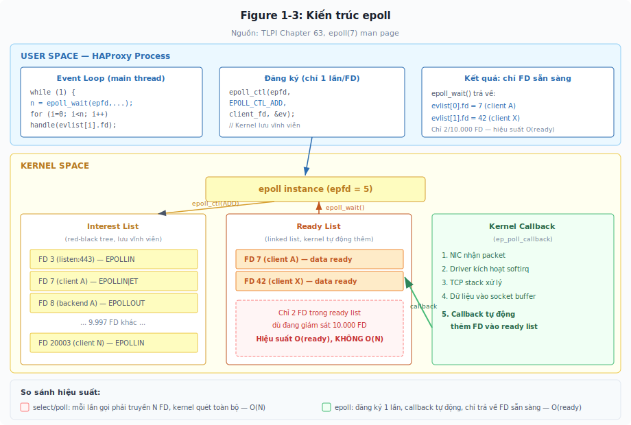

*Figure 1-11: HAProxy đăng ký FD vào interest list một lần duy nhất thông qua epoll_ctl(). Khi dữ liệu đến trên socket, kernel callback tự động thêm FD vào ready list. epoll_wait() chỉ trả về các FD đã sẵn sàng — không cần quét toàn bộ danh sách.*

### Tại sao epoll nhanh hơn: cơ chế callback trong kernel

Sự khác biệt cốt lõi giữa epoll và select/poll không chỉ là API — mà là cơ chế bên trong kernel.

Với `select()` và `poll()`, mỗi lần gọi, kernel phải: (1) nhận toàn bộ danh sách FD từ user space, (2) quét từng FD để kiểm tra trạng thái, (3) trả kết quả về user space. Ba bước này lặp lại mỗi lần — ngay cả khi danh sách FD không đổi.

Với `epoll`, kernel duy trì interest list vĩnh viễn trong kernel space. Khi process gọi `epoll_ctl(EPOLL_CTL_ADD)`, kernel đăng ký một **callback** vào mỗi open file description được giám sát. Khi một I/O event xảy ra (ví dụ: dữ liệu đến trên socket), kernel tự động gọi callback này, và callback thêm FD vào ready list. Khi process gọi `epoll_wait()`, kernel đơn giản trả về nội dung của ready list — không cần quét bất kỳ FD nào.

Kết quả là hiệu suất của `epoll_wait()` tỷ lệ thuận với số FD sẵn sàng (O(ready)), không phải tổng số FD đang giám sát. Đây là sự khác biệt mang tính cách mạng khi số lượng kết nối lớn.

### So sánh trực quan: select/poll vs epoll

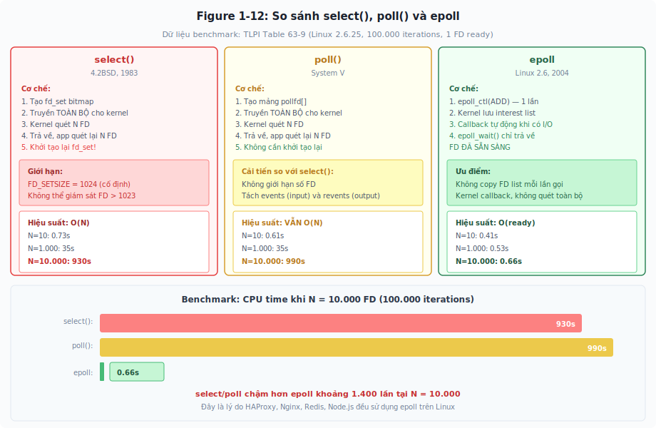

*Figure 1-12: Tại N = 10,000 FD, select/poll mất gần 1,000 giây CPU trong khi epoll chỉ mất 0.66 giây — chênh lệch khoảng 1,400 lần. Sự khác biệt đến từ cơ chế: select/poll quét toàn bộ N FD mỗi lần gọi (O(N)), còn epoll chỉ trả về FD sẵn sàng nhờ kernel callback (O(ready)).*

### Dữ liệu thực tế từ benchmark

Michael Kerrisk đo benchmark trên Linux 2.6.25, giám sát N file descriptor, mỗi lần chỉ 1 FD sẵn sàng, lặp 100,000 lần (Table 63-9, *The Linux Programming Interface*):

*Table 1-2: Thời gian CPU cho 100,000 lần giám sát (seconds)*

| Số FD giám sát (N) | poll() | select() | epoll |
|---|---|---|---|
| 10 | 0.61 | 0.73 | 0.41 |
| 100 | 2.9 | 3.0 | 0.42 |
| 1,000 | 35 | 35 | 0.53 |
| 10,000 | 990 | 930 | 0.66 |

*Khi N tăng từ 10 lên 10,000, poll/select chậm đi 1,500 lần trong khi epoll chỉ chậm đi 1.6 lần.*

Tại N = 10,000: poll mất 990 giây, select mất 930 giây, nhưng epoll chỉ mất 0.66 giây. Đây là minh chứng rõ ràng nhất cho thấy tại sao mọi network server hiện đại trên Linux (HAProxy, Nginx, Redis, Node.js) đều sử dụng epoll.

> **Key Topic:** `epoll` đạt hiệu suất O(ready) thay vì O(N) nhờ cơ chế callback trong kernel — FD được tự động thêm vào ready list khi có I/O event, thay vì kernel phải quét toàn bộ danh sách mỗi lần. Đây là cơ chế cho phép một single-thread server xử lý hàng trăm nghìn kết nối đồng thời.

### Level-triggered vs Edge-triggered

`epoll` hỗ trợ hai chế độ thông báo:

**Level-triggered** (mặc định): `epoll_wait()` thông báo FD sẵn sàng mỗi khi có dữ liệu chưa xử lý. Nếu bạn đọc một phần dữ liệu rồi gọi `epoll_wait()` lại, nó vẫn thông báo FD đó vẫn sẵn sàng. Hành vi này giống với `select()` và `poll()`.

**Edge-triggered** (EPOLLET): `epoll_wait()` chỉ thông báo MỘT LẦN khi có dữ liệu mới đến. Nếu bạn chưa đọc hết dữ liệu, `epoll_wait()` sẽ KHÔNG thông báo lại — dù dữ liệu vẫn còn trong buffer. Điều này yêu cầu process đọc hết dữ liệu cho đến khi nhận lỗi EAGAIN (buffer trống), nếu không dữ liệu sẽ bị "mất".

HAProxy sử dụng cơ chế hybrid: source code (`src/ev_epoll.c`) kiểm tra cờ `FD_ET_POSSIBLE` trên mỗi FD — nếu FD hỗ trợ edge-triggered (ví dụ: connected socket), HAProxy đăng ký với cờ `EPOLLET` (edge-triggered); nếu không, sử dụng level-triggered mặc định. Cách tiếp cận này kết hợp hiệu suất của edge-triggered trên các socket thông thường với sự an toàn của level-triggered trên các FD đặc biệt (listening socket, pipe). Ngoài ra, HAProxy cung cấp tùy chọn thực nghiệm `tune.fd.edge-triggered on` trong `global` section để ép buộc edge-triggered trên tất cả socket, nhưng tính năng này được đánh dấu experimental trong source code (`KWF_EXPERIMENTAL`) và chưa phải mặc định.

---

## 1.8 - Liên hệ thực tế: FD và epoll trong kiến trúc HAProxy

Tại sao một network engineer cần hiểu file descriptor và epoll? Vì đây chính là cơ chế bên trong của HAProxy — công cụ mà bạn sử dụng hàng ngày.

HAProxy là một event-driven, non-blocking daemon. Tài liệu chính thức của HAProxy (Management Guide) mô tả: *"haproxy uses event multiplexing to schedule all of its activities instead of relying on the system to schedule between multiple activities."* Và event multiplexer mặc định trên Linux là epoll: *"epoll() is a much more scalable mechanism relying on callbacks in the kernel that guarantee a constant wake up time regardless of the number of registered monitored file descriptors."*

Khi HAProxy khởi động, nó thực hiện chuỗi thao tác sau với file descriptor:

Đầu tiên, đặt giới hạn file descriptor của process (thông qua `setrlimit()`) — mặc định HAProxy tính toán: mỗi kết nối client cần 2 FD (1 cho client-side socket, 1 cho server-side socket), cộng thêm FD cho listening sockets, log sockets, health check sockets, và Runtime API socket.

Tiếp theo, tạo epoll instance bằng `epoll_create()`. Với mỗi listening socket (frontend), đăng ký vào epoll bằng `epoll_ctl(EPOLL_CTL_ADD)` với event EPOLLIN (sẵn sàng nhận kết nối mới).

Sau đó, chạy event loop: gọi `epoll_wait()` — khi có kết nối mới, gọi `accept()` để nhận FD mới cho kết nối client, sau đó tạo kết nối đến backend (thêm một FD nữa), đăng ký cả hai FD vào epoll, và tiếp tục vòng lặp.

Directive `maxconn` trong HAProxy trực tiếp liên quan đến file descriptor: `maxconn 10000` có nghĩa HAProxy cho phép tối đa 10,000 kết nối đồng thời, tương đương khoảng 20,000+ FD (mỗi kết nối cần 2 FD cộng FD phụ trợ). HAProxy tự động tính toán và thiết lập `ulimit -n` phù hợp khi khởi động.

> **Lưu ý kỹ thuật:** Nếu bạn thấy lỗi "Too many open files" trong log của HAProxy, đó là dấu hiệu FD limit của process bị vượt quá. Kiểm tra bằng `cat /proc/<haproxy_pid>/limits | grep "Max open files"` và điều chỉnh `maxconn` hoặc `ulimit` cho phù hợp.

---

## 1.9 - Thực hành tổng hợp

### ▶ Guided Exercise 7: Theo dõi file descriptor của một TCP server bằng strace

Trong bài thực hành này, bạn dùng `strace` để quan sát trực tiếp các system call liên quan đến file descriptor khi một server nhận kết nối.

**Before You Begin:**
Bạn cần `strace` đã cài đặt (`apt install strace`), Python 3, và `curl`. Trên một số distro, `strace` yêu cầu quyền `CAP_SYS_PTRACE` — chạy với quyền user thường trên process của chính mình là đủ.

**Outcomes:**
- Thấy được socket(), bind(), listen(), accept() trả về file descriptor
- Xác minh mỗi kết nối mới tạo một FD riêng

**Instructions:**

**1.** Khởi động Python HTTP server với strace — theo dõi toàn bộ syscall liên quan vòng đời socket:

    root@huyvl-lab-fd:~# strace -e trace=socket,bind,listen,accept4,close -f python3 -m http.server 8080 2>/tmp/strace_output.txt &

**2.** Từ terminal khác (hoặc cùng terminal), gửi request:

    root@huyvl-lab-fd:~# curl -s http://localhost:8080/ > /dev/null

**3.** Đọc strace output:

    root@huyvl-lab-fd:~# grep -E 'socket|bind|listen|accept' /tmp/strace_output.txt

Output kỳ vọng (FD number có thể khác tùy hệ thống):

    socket(AF_INET, SOCK_STREAM|SOCK_CLOEXEC, IPPROTO_TCP) = 4
    bind(4, {sa_family=AF_INET, sin_port=htons(8080), sin_addr=inet_addr("0.0.0.0")}, 16) = 0
    listen(4, 5) = 0
    accept4(4, {sa_family=AF_INET, sin_port=htons(47968), sin_addr=inet_addr("127.0.0.1")}, [16], SOCK_CLOEXEC) = 5

Chuỗi syscall thể hiện rõ vòng đời của socket: `socket(SOCK_STREAM|SOCK_CLOEXEC)` tạo listening socket với close-on-exec nguyên tử, `bind()` gán địa chỉ 0.0.0.0:8080, `listen(4, 5)` chuyển sang trạng thái LISTEN với backlog = 5. Khi client kết nối, `accept4(4, ..., SOCK_CLOEXEC) = 5` tạo connection socket FD 5 — cũng với `SOCK_CLOEXEC`. Cờ này đảm bảo cả listening socket lẫn connection socket đều tự động đóng nếu process gọi `exec()`, ngăn FD leak (mục 1.10).

**4.** Gửi thêm vài kết nối và quan sát: FD 5 được tái sử dụng mỗi lần (vì Python close FD 5 sau mỗi request, kernel cấp lại FD 5 theo quy tắc lowest available number).

**Finish:**
Tắt server và xóa file tạm: `kill %1 && rm /tmp/strace_output.txt`

---

### ▶ Lab 8: Xác định giới hạn file descriptor và ảnh hưởng đến số kết nối tối đa

Trong bài lab này, bạn tự xác định giới hạn FD của một process và chứng minh rằng giới hạn này ảnh hưởng trực tiếp đến số kết nối TCP tối đa.

**Outcomes:**
- Xác định được soft limit và hard limit của file descriptor
- Chứng minh được server không thể nhận kết nối mới khi hết FD

**Instructions:**

**1.** Xác định giới hạn FD hiện tại của shell (soft limit và hard limit).

**2.** Giảm soft limit xuống còn 20 FD.

**3.** Khởi động một TCP server (Python http.server) trong shell có giới hạn thấp này.

**4.** Từ một terminal khác, gửi nhiều kết nối đồng thời (dùng bash loop hoặc ab/wrk) và quan sát khi nào server bắt đầu trả lời "Too many open files".

**5.** Tính toán: với 20 FD, trừ đi 3 FD tiêu chuẩn (stdin/stdout/stderr) và 1 listening socket, server có thể chấp nhận tối đa bao nhiêu kết nối đồng thời?

Gợi ý: `ulimit -Sn`, `ulimit -Hn`, `ulimit -n 20`, theo dõi `/proc/<PID>/fd/` để đếm FD.

**Evaluation:**
So sánh số kết nối tối đa thực tế với con số tính toán ở bước 5. Hai con số phải gần khớp (sai số 1-2 FD vì Python server có thể mở thêm file log hoặc module).

**Finish:**
Mở terminal mới để lấy lại giới hạn FD mặc định — `ulimit` chỉ ảnh hưởng shell hiện tại.

---

## 1.10 - Close-on-exec: ngăn FD rò rỉ thông qua exec()

### Bối cảnh: FD sống sót thông qua exec() và hậu quả

Mục 1.3 đã trình bày rằng per-process FD table có một cờ duy nhất cho mỗi entry: **close-on-exec** (FD_CLOEXEC). Đến đây, bạn đã có đủ nền tảng để hiểu tại sao cờ này tồn tại và nó giải quyết vấn đề gì.

Trước hết, nhắc lại hai sự kiện quan trọng trong vòng đời process. Khi process gọi `fork()`, child process nhận bản sao toàn bộ FD table của parent — mỗi FD trong parent được sao chép sang child, và cả hai cùng trỏ đến chung open file description trong kernel (mục 1.3). Khi process gọi `exec()`, kernel thay thế toàn bộ chương trình đang chạy bằng chương trình mới — nhưng theo mặc định, **tất cả FD vẫn mở** và chương trình mới có thể sử dụng chúng (*The Linux Programming Interface*, Section 27.4).

Hành vi "FD sống sót thông qua exec()" có mục đích hữu ích: shell dựa vào nó để thực hiện I/O redirection. Khi bạn gõ `ls /tmp > dir.txt`, shell `fork()` tạo child, child mở `dir.txt` trên FD 1 (stdout), rồi `exec("ls")`. Chương trình `ls` ghi output vào FD 1 mà không cần biết FD 1 là file hay terminal — vì FD 1 đã được shell chuẩn bị sẵn trước `exec()`.

Tuy nhiên, hành vi mặc định này tạo ra một vấn đề nghiêm trọng khi process mở nhiều FD rồi `fork()+exec()` một chương trình bên ngoài. Các FD mà chương trình mới không cần — và không nên thấy — vẫn tồn tại trong bảng FD của nó. Đây gọi là **FD leak** (rò rỉ file descriptor).

### "FD rò rỉ" cụ thể nghĩa là gì?

Thuật ngữ "rò rỉ" ở đây không mang nghĩa trừu tượng. Nó có nghĩa rất cụ thể: sau khi `exec()` thành công, chương trình mới đang giữ một FD mở mà nó không hề biết, không hề yêu cầu, và không hề cần. FD đó vẫn trỏ đến tài nguyên gốc (file, socket, pipe) thông qua cùng open file description trong kernel.

Để hình dung, lấy ví dụ HAProxy đang giữ FD 5 trỏ đến file `/etc/ssl/private/server.key` (private key TLS). HAProxy cần `fork()+exec()` một script health check bên ngoài. Sau `exec()`, script `check_backend.sh` kế thừa FD 5 — dù script này không biết FD 5 tồn tại, nó vẫn có thể gọi `read(5, buf, 4096)` và đọc được toàn bộ nội dung private key.

Điều này dẫn đến hai lớp hậu quả: bảo mật và tài nguyên.

### Hậu quả bảo mật: khai thác FD rò rỉ

Khi một chương trình có đặc quyền cao (chạy với quyền root) `fork()+exec()` một chương trình có đặc quyền thấp hơn mà quên đóng FD nhạy cảm, chương trình mới thừa hưởng khả năng truy cập vào tài nguyên mà lẽ ra nó không được phép chạm tới. Kernel không kiểm tra quyền lại khi `read()`/`write()` trên FD đã mở — quyền chỉ được kiểm tra một lần tại thời điểm `open()`.

Kịch bản khai thác cụ thể: giả sử một daemon chạy với quyền root mở file `/etc/shadow` (chứa password hash) trên FD 7, sau đó `fork()+exec()` một plugin do bên thứ ba viết. Plugin này chạy với quyền user thường (thông qua `setuid()` sau `fork()` nhưng trước `exec()`). Nếu FD 7 không bị đóng trước `exec()`, plugin có thể thực hiện:

```c
char buf[4096];
int n = read(7, buf, sizeof(buf));  // Đọc /etc/shadow thông qua FD 7
write(1, buf, n);                    // In ra stdout
```

Trong điều kiện bình thường, plugin với quyền user thường gọi `open("/etc/shadow", O_RDONLY)` sẽ bị kernel từ chối với lỗi `EACCES` — vì file có permission `640` và thuộc root. Nhưng FD 7 đã được mở bởi parent (root) trước `exec()`, nên nó vẫn hợp lệ. Đây là lỗ hổng **privilege escalation thông qua FD leak** — chương trình đặc quyền thấp truy cập tài nguyên đặc quyền cao thông qua FD được kế thừa.

> **Key Topic:** Kernel chỉ kiểm tra quyền truy cập file tại thời điểm `open()`. Sau khi FD được tạo, mọi thao tác `read()`/`write()` trên FD đó không bị kiểm tra quyền lại — kể cả khi process đã thay đổi effective UID thông qua `setuid()` hoặc đã `exec()` một chương trình khác. Đây là lý do FD leak là vấn đề bảo mật nghiêm trọng.

### Hậu quả tài nguyên: "ma" FD giữ port

Hậu quả thứ hai liên quan trực tiếp đến network engineering. Kernel quản lý tài nguyên I/O bằng reference counting — socket chỉ thực sự được giải phóng khi tất cả FD trỏ đến nó đều bị đóng (reference count về 0).

Kịch bản: HAProxy tạo listening socket trên port 443 (FD 3), sau đó `fork()+exec()` script health check. Child process kế thừa FD 3 (reference count tăng từ 1 lên 2). Sau `exec()`, script không biết FD 3 tồn tại nhưng vẫn giữ nó mở. Khi quản trị viên restart HAProxy, parent thoát và đóng FD 3 — nhưng reference count chỉ giảm từ 2 xuống 1, kernel chưa giải phóng socket. HAProxy mới khởi động, cố bind port 443, và nhận lỗi `bind(): Address already in use` — vì port 443 vẫn bị "ma" FD trong script health check chiếm.

Lúc này chạy `ss -tlnp | grep 443` sẽ thấy port 443 thuộc về `check_backend.sh` thay vì HAProxy — một kết quả gây bối rối nếu không hiểu cơ chế FD inheritance thông qua `fork()+exec()`.

> **Hiểu sai:** "Lỗi `Address already in use` khi restart service luôn là do process cũ chưa tắt hẳn hoặc do thiếu `SO_REUSEADDR`."
>
> **Thực tế:** Một nguyên nhân ẩn khác là child process (được spawn bằng `fork()+exec()`) vô tình kế thừa listening socket FD. Dù parent đã thoát, child vẫn giữ reference đến socket, khiến kernel không giải phóng port. Nguyên nhân này khó debug vì `ss` sẽ hiển thị port thuộc về child process — một chương trình không liên quan đến service đang restart.

### Tổng quan trực quan: FD leak thông qua fork()+exec()

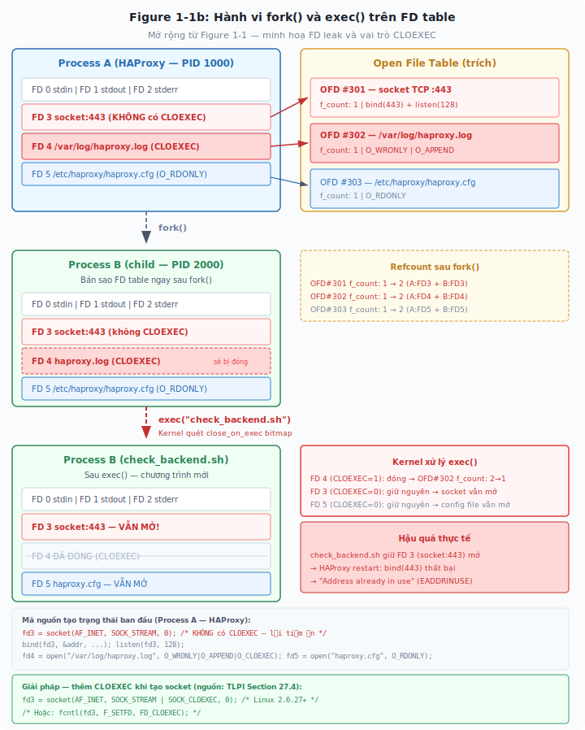

*Figure 1-13: Mở rộng từ Figure 1-1 — minh hoạ FD leak và vai trò CLOEXEC trong kịch bản HAProxy thực tế (nguồn: TLPI Section 5.4 + Section 27.4). Phase 1: Process A (HAProxy) giữ FD 3 (socket:443 → OFD#301, KHÔNG có CLOEXEC), FD 4 (`/var/log/haproxy.log` → OFD#302, có CLOEXEC), FD 5 (`/etc/haproxy/haproxy.cfg` → OFD#303). Phase 2: Sau fork(), child (PID 2000) nhận bản sao toàn bộ FD table — kernel tăng f_count trên mỗi OFD (1→2). Phase 3: Sau exec("check_backend.sh"), kernel quét close_on_exec bitmap — FD 4 bị đóng (CLOEXEC=1, f_count 2→1), nhưng FD 3 và FD 5 vẫn mở (CLOEXEC=0). Hậu quả: check_backend.sh giữ socket:443, HAProxy restart gặp EADDRINUSE. Mã nguồn tạo trạng thái và giải pháp (SOCK_CLOEXEC) nằm ở cuối hình.*

### Tổng kết trực quan: so sánh có và không có CLOEXEC

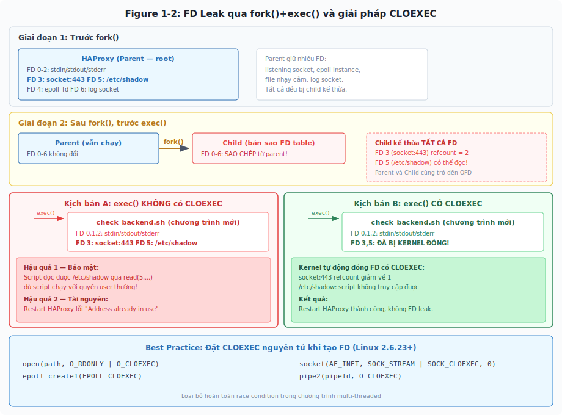

*Figure 1-14: Kịch bản A (trái): exec() không có CLOEXEC — child kế thừa FD nhạy cảm (socket:443, /etc/shadow), dẫn đến privilege escalation và "Address already in use". Kịch bản B (phải): exec() có CLOEXEC — kernel tự động đóng các FD đã đánh dấu, child chỉ giữ stdin/stdout/stderr.*

### Giải pháp: cờ FD_CLOEXEC (close-on-exec)

Kernel cung cấp cờ `FD_CLOEXEC` trên mỗi entry trong per-process FD table. Khi cờ này được bật, kernel tự động đóng FD đó ngay khi `exec()` thành công — nhưng giữ nguyên FD nếu `exec()` thất bại (để process có thể retry hoặc fallback).

Có hai cách đặt cờ. Cách truyền thống dùng `fcntl()` sau khi đã mở FD:

```c
int flags = fcntl(fd, F_GETFD);
flags |= FD_CLOEXEC;
fcntl(fd, F_SETFD, flags);
```

Cách này có một nhược điểm nghiêm trọng trong chương trình multi-threaded. Giữa lúc `open()` trả về FD và lúc `fcntl()` đặt cờ, nếu thread khác trong cùng process gọi `fork()+exec()`, FD mới vẫn bị rò rỉ vì cờ chưa được đặt. Đây là race condition — khoảng thời gian giữa hai system call tạo ra cửa sổ để FD rò rỉ.

Từ Linux 2.6.23, kernel bắt đầu bổ sung cờ nguyên tử (atomic) cho các system call tạo FD — đặt `CLOEXEC` ngay tại thời điểm FD được tạo, không có khoảng trống. Quá trình bổ sung diễn ra thông qua nhiều phiên bản kernel:

```c
// Linux 2.6.23: O_CLOEXEC cho open()
int fd = open("/etc/ssl/private/server.key", O_RDONLY | O_CLOEXEC);

// Linux 2.6.27: SOCK_CLOEXEC cho socket(), EPOLL_CLOEXEC cho epoll_create1()
int sockfd = socket(AF_INET, SOCK_STREAM | SOCK_CLOEXEC, 0);
int epfd = epoll_create1(EPOLL_CLOEXEC);

// Linux 2.6.27: O_CLOEXEC cho pipe2()
int pipefd[2];
pipe2(pipefd, O_CLOEXEC);
```

> **Key Topic:** `O_CLOEXEC`, `SOCK_CLOEXEC`, `EPOLL_CLOEXEC` đặt cờ close-on-exec nguyên tử ngay khi FD được tạo — loại bỏ hoàn toàn race condition trong chương trình multi-threaded. Đây là best practice bắt buộc trong mọi network server hiện đại.

### Vấn đề FD ẩn từ library function

Khi lập trình, không phải chỉ `open()` và `socket()` mới tạo FD. Nhiều hàm thư viện mà bạn gọi — bên trong chúng âm thầm mở FD mà bạn không thấy trong code.

Hàm `openlog()` (gửi syslog) bên trong glibc gọi `socket(AF_UNIX, SOCK_DGRAM, 0)` để kết nối đến `/dev/log`. Hàm `dlopen()` (load shared library) gọi `open()` trên file `.so`. Hàm `getaddrinfo()` (phân giải DNS) có thể mở `/etc/resolv.conf` hoặc tạo socket UDP đến DNS server. Tất cả đều tạo FD tạm thời bên trong quá trình thực thi.

Trong chương trình single-threaded, điều này không gây vấn đề — các hàm thư viện mở FD, làm việc, rồi đóng FD trước khi trả về. Nhưng trong chương trình multi-threaded (nhiều thread chia sẻ chung một FD table), race condition xuất hiện: Thread A đang thực thi `getaddrinfo()` (FD tạm thời đang mở), đúng lúc đó Thread B gọi `fork()+exec()` — child process kế thừa FD tạm thời mà Thread A chưa kịp đóng.

Đây là lý do `O_CLOEXEC` không chỉ dành cho code ứng dụng mà còn cho code thư viện. Từ glibc 2.10+ trở đi, các hàm thư viện nội bộ dần chuyển sang dùng `O_CLOEXEC` khi mở FD tạm thời (thông qua các wrapper mới như `pipe2()`, `dup3()`, `accept4()`). Tuy nhiên, library của bên thứ ba có thể chưa tuân thủ — đây là nguồn FD leak tiềm ẩn mà lập trình viên cần lưu ý.

### Liên hệ thực tế: close-on-exec trong HAProxy và network server

HAProxy source code áp dụng close-on-exec một cách có hệ thống: hàm `accept4()` trong `src/sock.c` truyền cờ `SOCK_CLOEXEC` khi chấp nhận kết nối mới trên master process, và sử dụng `fcntl(fd, F_SETFD, FD_CLOEXEC)` làm fallback trên các kernel hoặc code path chưa hỗ trợ cờ nguyên tử. Nginx cũng áp dụng chiến lược tương tự. Đây là defensive programming — ngay cả khi phiên bản hiện tại không `fork()+exec()` chương trình bên ngoài, phiên bản tương lai hoặc plugin/module có thể làm điều đó. Đặt `CLOEXEC` từ đầu ngăn ngừa rò rỉ trước khi nó có cơ hội xảy ra.

Trên OpenStack, khi Neutron agent hoặc Nova compute `fork()+exec()` các helper process (ví dụ: `dnsmasq`, `haproxy`, `ip netns exec`), FD leak là nguồn bug thực tế. Bug [LP#1130735](https://bugs.launchpad.net/neutron/+bug/1130735) trong Neutron ghi nhận tình huống file descriptor không được đóng khi agent spawn sub-process (ví dụ lệnh `ip`), khiến FD từ parent agent rò rỉ vào child process và gây lỗi SELinux cùng lãng phí tài nguyên. Giải pháp: Python 3.4+ mặc định đặt `CLOEXEC` trên tất cả FD mới tạo (PEP 446), và Neutron đã chuyển sang sử dụng `subprocess` module với `close_fds=True`.

> **Lưu ý kỹ thuật:** Trên Python 3.4+, mọi FD mới tạo bởi `open()`, `socket.socket()`, `os.pipe()` đều tự động có cờ `CLOEXEC` (PEP 446). Trên Python 2, FD mặc định KHÔNG có cờ này — đây là lý do nhiều bug FD leak xuất hiện trong các dự án OpenStack thời Python 2.

### ▶ Guided Exercise 9: Chứng minh FD leak thông qua exec() và CLOEXEC ngăn chặn

Bài thực hành gồm hai phần đối lập: phần A chứng minh FD **rò rỉ** thông qua `exec()` khi không có `CLOEXEC`, phần B chứng minh kernel **tự động đóng** FD khi có `CLOEXEC`. Kết hợp cả hai, bạn thấy rõ vai trò của cờ close-on-exec trong thực tế.

**Before You Begin:**
Đảm bảo môi trường sạch — chỉ có FD 0, 1, 2 tiêu chuẩn. Nếu tồn tại FD thừa từ thí nghiệm trước, đóng bằng `exec N>&-` (N là số FD). Bài học từ thí nghiệm 5: FD thừa từ session trước sẽ bị child process kế thừa và làm sai lệch kết quả.

**Outcomes:**
- Thấy được FD rò rỉ sang chương trình mới sau `exec()` khi không có `CLOEXEC`
- Xác minh FD bị kernel tự động đóng khi có cờ `CLOEXEC`
- Hiểu tại sao network server hiện đại (HAProxy, Nginx, Python 3) luôn đặt `CLOEXEC` trên mọi FD

**Instructions:**

**Phần A — Chứng minh FD leak khi KHÔNG có CLOEXEC:**

**1.** Kiểm tra môi trường sạch:

```bash
root@huyvl-lab-fd:~# ls -l /proc/$$/fd/
total 0
lrwx------ 1 root root 64 Apr  3 18:41 0 -> /dev/pts/0
lrwx------ 1 root root 64 Apr  3 18:41 1 -> /dev/pts/0
lrwx------ 1 root root 64 Apr  3 18:41 2 -> /dev/pts/0
lrwx------ 1 root root 64 Apr  3 18:41 255 -> /dev/pts/0
```

Chỉ có FD 0, 1, 2 (stdin/stdout/stderr) và FD 255 (bash internal) — môi trường sạch, sẵn sàng thí nghiệm.

**2.** Mở FD 3 trỏ tới file (KHÔNG có cờ CLOEXEC):

```bash
root@huyvl-lab-fd:~# exec 3>/tmp/cloexec-test.txt
```

**3.** Xác nhận FD 3 tồn tại trong shell hiện tại:

```bash
root@huyvl-lab-fd:~# ls -l /proc/$$/fd/3
l-wx------ 1 root root 64 Apr  3 18:41 /proc/527/fd/3 -> /tmp/cloexec-test.txt
root@huyvl-lab-fd:~#
root@huyvl-lab-fd:~#
```

Shell (PID 527) đang giữ FD 3 trỏ tới `/tmp/cloexec-test.txt` ở chế độ write-only (`l-wx`).

**4.** Thực hiện `fork()+exec()` thông qua `bash -c` — kiểm tra FD 3 có rò rỉ sang process mới không:

```bash
root@huyvl-lab-fd:~# bash -c 'ls -l /proc/$$/fd/3 2>/dev/null && echo "FD 3 LEAKED — still open after exec()" || echo "FD 3 closed — no leak"'
l-wx------ 1 root root 64 Apr  3 18:50 /proc/577/fd/3 -> /tmp/cloexec-test.txt
FD 3 LEAKED — still open after exec()
root@huyvl-lab-fd:~#
root@huyvl-lab-fd:~#
```

Khi shell thực hiện `bash -c`, kernel gọi `fork()` tạo child process (PID 577), sau đó `exec("/bin/bash")` thay thế child bằng chương trình bash mới. Vì FD 3 **không có flag CLOEXEC**, kernel giữ nguyên nó thông qua `exec()`. Process mới (PID 577) — một instance bash hoàn toàn mới — vẫn thấy FD 3 trỏ tới `/tmp/cloexec-test.txt` mặc dù nó không hề mở file đó. Đây chính là **FD leak** — cùng hiện tượng đã gây lỗi `Address already in use` trong kịch bản HAProxy ở phần lý thuyết.

**Phần B — Chứng minh CLOEXEC ngăn chặn leak:**

**5.** Đóng FD 3 cũ và xác nhận môi trường sạch trở lại:

```bash
root@huyvl-lab-fd:~# exec 3>&-
root@huyvl-lab-fd:~# ls -l /proc/$$/fd/
total 0
lrwx------ 1 root root 64 Apr  3 18:41 0 -> /dev/pts/0
lrwx------ 1 root root 64 Apr  3 18:41 1 -> /dev/pts/0
lrwx------ 1 root root 64 Apr  3 18:41 2 -> /dev/pts/0
lrwx------ 1 root root 64 Apr  3 18:41 255 -> /dev/pts/0
```

FD 3 đã biến mất — môi trường sạch, sẵn sàng cho phần B.

**6.** Dùng Python mở FD 3 với cờ `FD_CLOEXEC`, sau đó gọi `exec()` để kiểm tra:

```bash
root@huyvl-lab-fd:~# python3 -c "
> import os, fcntl
>
> fd = os.open('/tmp/cloexec-test.txt', os.O_WRONLY | os.O_CREAT, 0o644)
> print(f'os.open() returned FD: {fd}')
>
> # Chi dup2 + close khi fd KHAC 3
> if fd != 3:
>     os.dup2(fd, 3)
>     os.close(fd)
>
> # Set CLOEXEC on FD 3
> flags = fcntl.fcntl(3, fcntl.F_GETFD)
> fcntl.fcntl(3, fcntl.F_SETFD, flags | fcntl.FD_CLOEXEC)
> print('FD 3 flags before exec: FD_CLOEXEC =', bool(fcntl.fcntl(3, fcntl.F_GETFD) & fcntl.FD_CLOEXEC))
>
> os.execlp('bash', 'bash', '-c', 'ls -l /proc/\$\$/fd/3 2>/dev/null && echo \"FD 3 LEAKED\" || echo \"FD 3 closed by CLOEXEC — no leak\"')
> "
os.open() returned FD: 3
FD 3 flags before exec: FD_CLOEXEC = True
FD 3 closed by CLOEXEC — no leak
root@huyvl-lab-fd:~#
```

Phân tích kết quả: `os.open()` trả về FD 3 (lowest available — quy tắc đã chứng minh ở mục 1.3). Vì `fd` đã là 3, đoạn `if fd != 3` bỏ qua `dup2()`/`close()` — tránh lỗi đóng nhầm FD vừa mở (nếu `dup2(3, 3)` thì là no-op theo POSIX, nhưng `os.close(3)` ngay sau sẽ đóng FD ta cần). Sau khi `fcntl()` đặt `FD_CLOEXEC = True`, Python gọi `os.execlp()` — kernel quét close-on-exec bitmap, thấy FD 3 có cờ CLOEXEC → **tự động đóng FD 3** trước khi chương trình mới (`bash -c`) bắt đầu thực thi. Kết quả: process mới không thấy FD 3, in ra "FD 3 closed by CLOEXEC — no leak".

> **Key Topic:** Đây chính là cơ chế mà Python 3 sử dụng khi gọi `socket(AF_INET, SOCK_STREAM | SOCK_CLOEXEC, 0)` — bạn đã thấy nó trong strace ở mục 1.4 khi quan sát `accept4()` với flag `SOCK_CLOEXEC`. Cờ này được đặt **nguyên tử** ngay khi FD được tạo (không thông qua hai bước `open()` rồi `fcntl()` như bài thực hành này), loại bỏ race condition trong chương trình multi-threaded.

**Evaluation:**
So sánh hai kết quả: phần A — FD 3 vẫn tồn tại sau `exec()` (FD leak), phần B — FD 3 bị kernel đóng trước `exec()` (no leak). Sự khác biệt duy nhất là cờ `FD_CLOEXEC` trên FD 3.

**Finish:**
Xóa file tạm: `rm /tmp/cloexec-test.txt`. Đóng FD 3 nếu còn mở: `exec 3>&-`.

---

## Exam Preparation Tasks

### Review All Key Topics

*Table 1-3: Key Topics trong phần này*

| Key Topic Element | Mô tả | Mục |
|---|---|---|
| Paragraph | Định nghĩa file descriptor và vai trò trung gian của kernel | 1.1 |
| Table 1-1 | Ba file descriptor tiêu chuẩn (0, 1, 2) | 1.2 |
| Figure 1-1 | Mô hình 3 bảng: per-process FD table, open file table, i-node table (TLPI 5.4) | 1.3 |
| Figure 1-2 | Guided Exercise 2 baseline: sau open() và read() 5 bytes — 1 FD, 1 OFD, pos=5 | 1.3 |
| Figure 1-3 | Guided Exercise 2 sau dup(): FD 3 và FD 4 cùng trỏ OFD "A", pos=8 | 1.3 |
| Figure 1-4 | Guided Exercise 2 sau open() độc lập: hai OFD tách biệt, offset riêng | 1.3 |
| Figure 1-5 | Trạng thái cuối sau open(), dup(), và fork() — 3-table model snapshot | 1.3 |
| Figure 1-6 | Guided Exercise 3 Phần E: dup() write — dữ liệu nối tiếp (AAABBB) | 1.3 |
| Figure 1-7 | Guided Exercise 3 Phần F: open() write — đè dữ liệu (XXX đè AAA) | 1.3 |
| Figure 1-8 | Guided Exercise 3 Phần G: fork() write xuyên process (DD nối tiếp) | 1.3 |
| Figure 1-9 | Status flags chia sẻ theo cùng quy luật OFD — fcntl trên FD 4 ảnh hưởng FD 3 | 1.3 |
| Figure 1-10 | lseek xuyên process: child tua lại offset cho parent | 1.3 |
| Paragraph | Khi hai FD trỏ đến cùng open file description, chúng chia sẻ file offset | 1.3 |
| Paragraph | Mỗi kết nối TCP trên Linux là một file descriptor riêng biệt | 1.4 |
| Paragraph | select() và poll() có hiệu suất O(N) | 1.6 |
| Figure 1-11 | Kiến trúc epoll: interest list, ready list, kernel callback | 1.7 |
| Figure 1-12 | So sánh benchmark select/poll vs epoll tại N = 10,000 | 1.7 |
| Table 1-2 | Benchmark so sánh poll/select/epoll | 1.7 |
| Paragraph | epoll đạt hiệu suất O(ready) nhờ cơ chế callback | 1.7 |
| Figure 1-13 | Hành vi fork()+exec() trên FD table — FD leak và vai trò CLOEXEC | 1.10 |
| Figure 1-14 | FD leak thông qua fork()+exec() và giải pháp CLOEXEC | 1.10 |
| Paragraph | Kernel chỉ kiểm tra quyền tại thời điểm open(), không kiểm tra lại khi read()/write() | 1.10 |
| Paragraph | O_CLOEXEC, SOCK_CLOEXEC, EPOLL_CLOEXEC đặt cờ nguyên tử khi tạo FD | 1.10 |

### Define Key Terms

Định nghĩa các thuật ngữ sau và kiểm tra lại trong nội dung bài:

file descriptor, Universal I/O Model, open file description, i-node, per-process FD table, stdin/stdout/stderr, dup2, socket, I/O multiplexing, select, poll, epoll, epoll_create, epoll_ctl, epoll_wait, interest list, ready list, level-triggered, edge-triggered, C10K problem, event-driven model, callback, maxconn, close-on-exec, FD_CLOEXEC, O_CLOEXEC, SOCK_CLOEXEC, FD leak, reference counting, race condition, privilege escalation

### Command Reference

*Table 1-4: Các lệnh và system call quan trọng*

| Task | Command / System Call |
|---|---|
| Liệt kê FD của process | `ls -la /proc/`*PID*`/fd/` |
| Kiểm tra giới hạn FD | `cat /proc/`*PID*`/limits \| grep "Max open files"` |
| Liệt kê file đang mở của process | **lsof** `-p` *PID* |
| Liệt kê file đang mở theo tên | **lsof** *filename* |
| Kiểm tra socket đang listen | **ss** `-tlnp` |
| Kiểm tra kết nối TCP hiện tại | **ss** `-tnp` |
| Theo dõi system call của process | **strace** `-e trace=`*syscall_list* `-p` *PID* |
| Đặt giới hạn FD (soft limit) | **ulimit** `-Sn` *number* |
| Xem giới hạn FD hiện tại | **ulimit** `-n` |
| Kiểm tra cờ FD flags (close-on-exec) | **fcntl**(*fd*, `F_GETFD`) |
| Đặt cờ close-on-exec trên FD | **fcntl**(*fd*, `F_SETFD`, `FD_CLOEXEC`) |
| Mở file với cờ close-on-exec | **open**(*path*, `O_RDONLY \| O_CLOEXEC`) |
| Tạo socket với cờ close-on-exec | **socket**(`AF_INET`, `SOCK_STREAM \| SOCK_CLOEXEC`, `0`) |

---

## Tài liệu tham khảo

1. [The Linux Programming Interface — Michael Kerrisk (No Starch Press, 2010)](https://man7.org/tlpi/) — Chapter 4 (File I/O), Section 5.4 (Relationship Between FDs and Open Files), Chapter 56 (Sockets), Chapter 63 (Alternative I/O Models)
2. [File management in the Linux kernel — kernel.org](https://docs.kernel.org/filesystems/files.html) — Cấu trúc struct fdtable, struct files_struct, cơ chế RCU
3. [epoll(7) — Linux man page](https://man7.org/linux/man-pages/man7/epoll.7.html) — API reference, level-triggered vs edge-triggered, max_user_watches
4. [socket(2) — Linux man page](https://man7.org/linux/man-pages/man2/socket.2.html) — socket() trả về file descriptor
5. [epoll_create(2) — Linux man page](https://man7.org/linux/man-pages/man2/epoll_create.2.html) — epoll instance là file descriptor
6. [HAProxy Management Guide — docs.haproxy.org](https://docs.haproxy.org/2.4/management.html) — Event-driven architecture, epoll usage, file descriptor limits
7. [Comparing and Evaluating epoll, select, and poll — kernel.org OLS 2004](https://www.kernel.org/doc/ols/2004/ols2004v1-pages-215-226.pdf) — Phân tích hiệu suất
8. [io_submit: The epoll alternative you've never heard about — Cloudflare](https://blog.cloudflare.com/io_submit-the-epoll-alternative-youve-never-heard-about/) — Góc nhìn production về epoll và các giải pháp thay thế
9. [The Linux Programming Interface — Section 27.4: File Descriptors and exec()](https://man7.org/tlpi/) — Close-on-exec flag, FD inheritance across exec()
10. [open(2) — Linux man page, O_CLOEXEC flag](https://man7.org/linux/man-pages/man2/open.2.html) — Atomic close-on-exec since Linux 2.6.23
11. [PEP 446 — Make newly created file descriptors non-inheritable (Python 3.4)](https://peps.python.org/pep-0446/) — Python mặc định đặt CLOEXEC trên mọi FD mới
