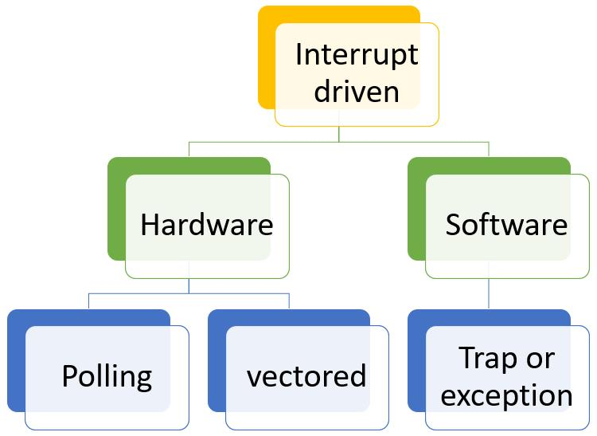
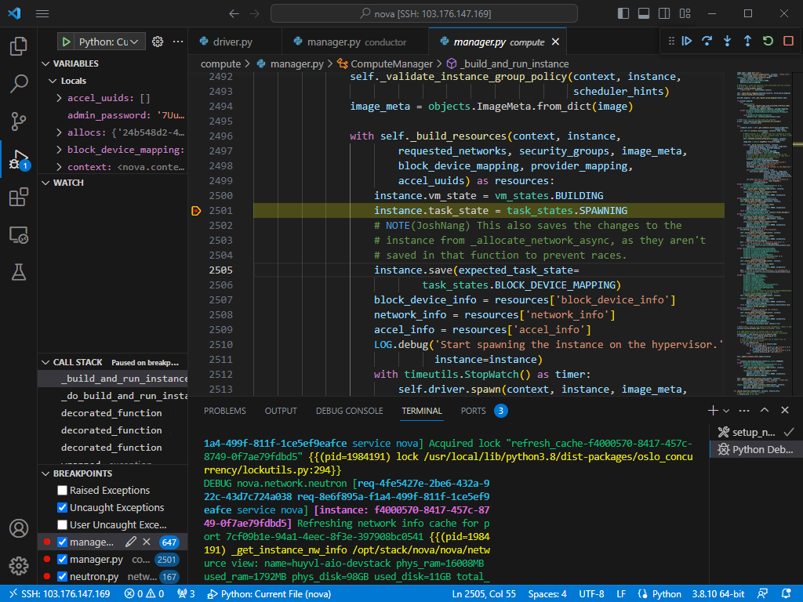
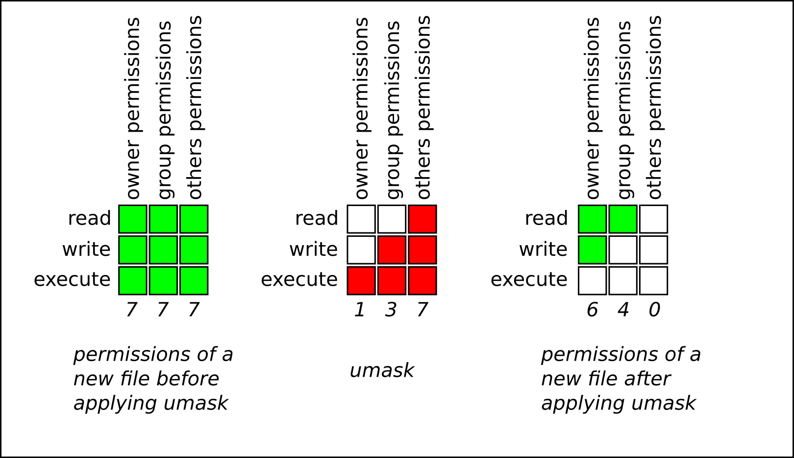

[Phần 2 - Tổng quan về kiến trúc Linux](#linux_arch)

- [2.1 - Linux Kernel (UPDATED 27/08/2023)](#linux_kernel)
- [2.2 - Vai trò của Linux Kernel (UPDATED 24/08/2023)](#linux_kernel_job)
- [2.3 - Tổng quan về Interrupt - Ngắt (UPDATED 05/09/2023)](#interrupt)
- [2.4 - Quản lý người dùng và nhóm (UPDATED 17/09/2023)](#user_and_group)
    - [2.4.1 - Khái niệm `User` (UPDATED 17/09/2023)](#user)
    - [2.4.2 - Khái niệm về nhóm, chính và phụ (UPDATED 12/09/2023)](#group)
    - [2.4.3 - Thay đổi tài khoản người dùng (UPDATED 13/09/2023)](#switch_user)
    - [2.4.4 - Các thao tác quản lý trên người dùng và nhóm(UPDATED 11/09/2023)](#user_and_group_control)
    - [2.4.5 - Hạn chế quyền truy cập người dùng (UPDATED 13/09/2023)](#user_restrict_access)
    - [2.4.6 - Cấp quyền `sudo` tự do (UPDATED 11/09/2023)](#grant_free_sudo)
    - [2.4.7 - Cấp quyền `sudo` với lệnh cụ thể (UPDATED 11/09/2023)](#grant_command_sudo)
- [2.5 - Hệ thống tệp tin (UPDATED 15/09/2023)](#fs)
    - [2.5.1 - Phân cấp hệ thống tệp tin (UPDATED 26/08/2023)](#fhs)
    - [2.5.2 - RPM Package và phân loại (UPDATED 24/08/2023)](#rpm_package)
    - [2.5.3 - Kernel RPM Package (UPDATED 24/08/2023)](#kernel_rpm_package)
    - [2.5.4 - Tổng quan về quyền trên tệp tin (UPDATED 15/09/2023)](#file_permission)
        - [2.5.4.1 - Quản lý quyền tệp tin (UPDATED 13/09/2023)](#file_permission_management)
        - [2.5.4.2 - Quyền đặc biệt dành cho chủ sở hữu (SUID) và lỗ hổng leo thang đặc quyền (UPDATED 10/09/2023)](#suid_permission)
        - [2.5.4.3 - Quyền đặc biệt dành cho nhóm(UPDATED 10/09/2023)](#sgid_permission)
        - [2.5.4.4 - Quyền đặc biệt Sticky bit(UPDATED 13/09/2023)](#sticky_bit_permission)
- [2.6 - Tổng quan tiến trình Linux (:arrow_up:UPDATED 21/09/2023)](#linux_process)
    - [2.6.1 - Trạng thái của tiến trình Linux (:arrow_up:UPDATED 17/09/2023)](#process_states)
    - [2.6.2 - Kiểm soát các `Job` (:heavy_plus_sign:UPDATED 17/09/2023)](#control_job)
    - [2.6.3 - Kết thúc tiến trình (:heavy_plus_sign:UPDATED 18/09/2023)](#kill_process)
    - [2.6.4 - Dịch vụ hạ tầng (:heavy_plus_sign:UPDATED 21/09/2023)](#infra_service)
    - [2.6.5 - Tổng quan về `systemd` (:heavy_plus_sign:UPDATED 19/09/2023)](#systemd)
    - [2.6.6 - Tiến trình hệ thống tự khởi chạy (:heavy_plus_sign:UPDATED 21/09/2023)](#automatically_run_process)

# <a name="linux_arch"></a>Tổng quan về kiến trúc Linux
## <a name="linux_kernel"></a>Tổng quan `Linux kernel`
`Linux kernel` được đánh giá là mã nguồn mở lớn nhất thế giới với hàng ngàn lập trình viên đang đóng góp và hàng triệu dòng code thay đổi cho mỗi lần phát hành phiên bản mới. `Linux kernel` được phát hành với giấy phép `GPL v2`, cụ thế giấy phép này yêu cầu mọi sự sửa đổi/cập nhật sẽ được chuyển đến cho khách hàng. Lịch trình hiện tại của các bản phát hành thường sẽ rơi vào tháng 3 hoặc 4. `Linux kernel` là thành phần chính của hệ điều hành `Linux`, thành phần cốt lõi giữa phần cứng máy tính và các tiến trình bên trong nó. Nó giao tiếp giữa 2 thực thể , quản lý tài nguyên một cách tốt nhất. Đặt tên là `kernel` vì nó được coi là hát gióng nằm bên trong lớp vỏ - nó tồn tại ở ngay bên trong `OS` và điều khiển các chức năng của phần cứng.

<div style="text-align:center"></div>

## <a name="linux_kernel_job"></a>Vai trò `Linux kernel`
`Kernel` gồm có 4 công việc:

- `Memory management` -quản lý bộ nhớ: liên tục theo dõi lượng tài nguyên nơi bộ nhớ đã được sử dụng, bao gồm cả việc nó lưu trữ những gì và nơi nó được lưu trữ.
- `Process management` - quản lý tiến trình: xác định được những tiến trình nào có thể sử dụng CPU, khi nào và bao lâu.
- `Device drivers`: đóng vai trò trung gian trong việc liên lạc giữa phần cứng và tiến trình.
- `System Calls and Security`: nhận những yêu cầu từ `service` và `process`.

Khi `kernel` được triển khai đúng cách thì nó phải nằm trong trạng thái `invisible` với người dùng thông thường, nó chỉ làm việc bên trong không gian `kernel space`, nơi nó phân bổ bộ nhớ và theo dõi nơi mọi thứ được lưu giữ. Giống như người dùng sử dụng truy cập `web` thì trình duyệt là không gian của người dùng hay `user space`. Các ứng dụng tương tác với `kernel` thông qua `System Call Interface(SCI)`.

`Red Hat` ví dụ về `kernel` như một trợ lý bận rộn của một nhà điều hành quyền lực `hardware`. Công việc của trợ lý là chuyển tiếp các tin nhắn và yêu cầu của các tiến trình `processes` từ nhân viên `users` tới nhà điều hành. Ghi nhớ vị trí của chúng vào tủ hồ sơ `memory` và xác định ai là người có quyền truy cập.

- `Hardware`: máy tính vât lý nhìn theo hướng logic nó nằm ở đáy hệ thống, tạo nên bộ nhớ `memory`, `CPU` tính toán đọc ghi vào bộ nhớ, ...
- `Linux kernel`: lõi của `OS`, nằm ở giữa phần cứng và tiến trình về mặt `logic`, đương nhiên `kernel` vẫn là phần mềm với vai trò sẽ cho `CPU` biết phải làm gì.
- `User processes`: trên đây có những chương trình đang chạy được quản lý bởi `kernel`. Các tiến trình của `user` tạo nên `user space`. Các tiến trình này được biết đến đơn thuần là `process`. `Kernel` sẽ cho phép các tiến trình này và phần cứng giao tiếp lẫn nhau, cái mà được gọi là `Inter-process communication(IPC)`.

Đoạn mã được thực thi trên hệ thống chạy trên `CPU` ở `1` trong `2` chế độ: `kernel` hoặc `user`. Đoạn mã chạy trong `kernel mode` không bị hạn chế quyền truy cập tới phần cứng trong khi ngược lại với `user mode`, ... Những chi tiết nhỏ này góp phần tạo nên cơ sở phân tách lớp bảo mật, xây dựng nên những thứ phức tạp như `container`, `Virtual Machine`.

Điều này cũng đồng nghĩa rằng nếu tiến trình chạy ở `user mode` có thiệt hại hạn chế hơn, ngược lại với `kernel mode` khi có sự cố sẽ làm sập hệ thống. Vì `user mode` có sẵn các biện pháp bảo vệ và chỉ các quyền cần thiết nên sự cố thường không thể gây ra quá nhiều vấn đề.

Ví dụ: khi người dùng `Windows` mở một tệp bất kỳ trên ứng dụng `File Explorer` - dĩ nhiên đây là ứng dụng nằm ở phía `user mode`, ứng dụng này sẽ gửi một yêu cầu `I/O` đến ứng dụng loại `File System Filter Driver` được chạy ở phía `kernel mode`, tại đây `File System Filter Driver` sẽ là một bộ lọc cho phép `File Explorer` lấy dữ liệu từ ổ cứng, ngược lại cũng có quyền từ chối nếu như nội dung hoặc một phần nhỏ trong nội dung nằm trong danh sách không thỏa được bị lập trình viên `driver` thiết kế. Đây là một chức năng nằm trong sản phẩm `File Defender` của tập đoàn chuyên làm phần mềm bảo mật `Plott Ltd` Nhật Bản.

<i>Tham khỏa thêm tại https://access.redhat.com/documentation/en-us/red_hat_enterprise_linux/8/html-single/managing_monitoring_and_updating_the_kernel/index#what-the-kernel-is_assembly_the-linux-kernel</i>
## <a name="interrupt"></a>Tổng quan về Interrupt - Ngắt
`Interrupt` là một sự kiện nhìn về ở phía vi xử lý thì nó có độ ưu tiên rất cao, nó xảy ra để thay đổi luồng thực thi của chương trình và nó có thể được tạo ra từ thiết bị phần cứng hoặc phần mềm nói chung, từ chính CPU của nó nói riêng. Khi `interrupt` xảy ra thì mã thực thi hiện tại bị dừng lại nhường chỗ cho việc xử lý `interrupt` bởi một chương trình tên `interrupt handler` được biết với tên khác là `interrupt service routine (ISR)`, tức với một `interrupt vector` trong <a href="https://en.wikipedia.org/wiki/Interrupt_vector_table">`interrupt vector table (IVT)`</a> sẽ có tương ứng một `handler` đảm nhận xử lý, ví dụ như `trap hanlder` hay `page fault handler`, ... luồng thực thi hiện tại sẽ tái khởi động từ trạng thái cũ khi `interrupt` hoàn tất xử lý. Các loại ngắt được nhóm thành 2 thể loại chính dựa trên nguồn khởi tạo của nó: khả năng trì hoãn hoặc vô hiệu tóa tạm thời:

- `synchronous`: đồng bộ, được tạo từ việc thực thi `instruction`.
- `asynchronous`: bất đồng bộ, được tạo ra từ `external event`.
- `maskable`: ngắt này có thể bỏ qua, được báo hiệu qua chân `INT`.
- `non-maskable`: ngắt thuộc loại này không thể bị bỏ qua, được báo hiệu qua chân `NMI`.

<div style="text-align:center"></div>

`Interrupt` được tạo nên bởi 2 thực thể là phần cứng và phần mềm:

-  `Hardware interrupt` hay ngắt cứng được báo hiệu từ thiết bị ngoại vi, ví dụ như một phím được nhấn hoặc di chuyển chuột sẽ tạo ra các ngắt cứng khiến vi xử lý chú ý và xử lý dữ liệu. Các ngắt cứng có thể đến một cách không đồng bộ `asynchronous` hoặc bất kỳ lúc nào trong quá trình thực hiện lệnh của vi xử lý, do đó tất cả tín hiệu ngắt cứng đều phải được đồng bộ hóa với đồng hồ của bộ vi xử lý. Trong hầu hết các hệ thống, mỗi tín hiệu <a href="https://en.wikipedia.org/wiki/Interrupt_request">`interrupt request (IRQ)`</a> đều được gắn mác với một thiết bị cụ thể vì điều này hữu ích trong việc nhanh chóng xác định thiết bị phần cứng nào đang yêu cầu dịch vụ. Về mặt lịch sử thì `interrupt handler` chính là `hardware interrupt handler`, ngắt cứng phát sinh từ các tín hiệu điện hoặc một số các cách thức cấp thấp, các tín hiệu này được chuyển đi sau khi được chuyển đổi thành mã số trong `interrupt vector table`. Tóm lại các ngắt cứng được sử dụng ở mức ưu tiên cao vì yêu cầu dừng việc thực thi hiện tại.
- Về mặt lịch sử sau khi nhận thấy rằng sẽ thuận tiện hơn nếu phần mềm cũng có thể tạo ra các ngắt tương tự như phần cứng. `Software interrupt` hay ngắt mềm thuộc loại đồng bộ `synchronous` gây ra bởi chính vi xử lý hoặc phần mềm, trường hợp này gọi tắt là `trap` hoặc `exception` như bên dưới mô tả. Số lượng tín hiệu được tạo ra bởi ngắt mềm gần như là vô hạn vì kỹ thuật của nó không phụ thuộc vào số lượng thanh ghi `register` nói riêng hay phần cứng nói chung.

<div style="text-align:center"></div>

`Interrupt` và `signal` đều đóng vai trò là một tín hiệu nhưng khác nhau ở ngữ cảnh sử dụng. `Interrupt` là một phương tiện trung chuyển giữa vi xử lý và `kernel` trong khi `signal` được sử dụng giữa `kernel`  và tiến trình người dùng. Khởi nguồn của `interrupt` đến từ vi xử lý hoặc nội tại của vi xử lý đó như phần trên `software interrupt` đã đề cập, đối với `signal` thí nó được khởi tạo từ `kernel` của hệ điều hành.

<div style="text-align:center"></div>

Ngắt `sync` thường xuyên được nhắc đến qua từ `exception`, nó được vi xử lý phát hiện ngay trong chính quá trình thực thi. Ví dụ phép toán chia cho `x:0` sẽ tạo ra một `exception`. Ngược lại, ngắt `async` được tạo ra từ các thiết bị `I/O`, ví dụ `NIC` tạo ra một ngắt để báo hiệu rằng gói tin được gửi đến, bàn phím gửi tín hiệu đến vi xử lý để tạo ra ngắt `INT 21H` khi người dùng gõ phím. Hầu hết các loại ngắt đều là `maskable`, tức là hoàn toàn có khả năng tạm thời vô hiệu hóa hoặc trì hoãn nó, tuy nhiên có một số ngắt không thể vô hiệu hóa hoặc trì hoãn.

Có 2 nguồn dẫn đến `exception` là được vi xử lý phát hiện hoặc được lập trình sẵn như sau:

- `faults` là một ngoại lệ được báo trước khi việc thực thi của vi xử lý, ví dụ như phép toán chia cho mẫu số giá trị `0`. `Extended Instruction Pointer(EIP)` lưu địa chỉ lệnh gây lỗi và sau khi xử lý, chương trình có thể thực hiện lại, ví dụ như khi chương trình sử dụng nhiều bộ nhớ hơn bộ nhớ vật lý `RAM` thì `page fault hanlder` sẽ thực hiện việc chuyển đổi giữa `RAM` và `DISK` để giúp hệ thống hoạt động ổn định. Về cái nhìn khắc khe có thể coi `fault` không hoàn toàn là một lỗi.
- `traps` là một loại ngoại lệ diễn ra ở tiến trình người dùng, việc xử lý `traps` có độ ưu tiên rất cao và mã có thể tiếp tục chạy sau khi `traps` được xử lý xong, tức là cần đồng bộ giữa 2 luồng thực thi. Hầu hết `traps` được xem là một kỳ vọng xảy ra đối với trường hợp nào đó. `traps` được báo sau khi việc thực thi của lệnh `instruction`; ví dụ người dùng đầu tiên tạo một lệnh ngắt `INT 3` tương đương với đặt một `breakpoint` vào trong mã nguồn, sau đó `kernel` gửi một tín hiệu `SIGTRAP` đến chương trình `debug` để thực hiện kích hoạt dòng code đã đặt `breakpoint`.
- `aborts` được sử dụng để dừng luồng thực thi, trong đa số các trường hợp thì nó được xem xét là một lỗi thực sự ví dụ như lỗi phần cứng, ... Tín hiệu ngắt được gửi tới `Control Unit(CU)` là tín hiệu khẩn cấp để điều hướng sang `abort exception handler`, đối với loại `handler` này được thiết kế một hành động duy nhất là buộc chấm dứt tiến trình.

Có một ngoại lệ dành cho phần mềm là `kernel`, nó không được phép gây ra `traps`, `faults`. Nếu `kernel` gây ra lỗi thì tình hình như vậy được xem xét là nghiêm trọng đối với hệ thống, `trap handler` gọi trường hợp này là `panic`, tên gọi cho việc dừng hệ thống một cách bất ngờ và không mong muốn.

Ví dụ về `software interrupt` thực hiện nhiệm vụ đặt `trap` với `interrupt 3` hay viết tắt là `INT 3` thông qua phần mềm `Visual Studio Code` chạy ở phía người dùng, phần mềm đang cố gắng theo đuổi chi tiết chức năng tạo máy ảo của `nova-compute` nói riêng và `Openstack` nói chung dựa trên mã nguồn mở. Ngoài ra đối với trường hợp sử dụng `docker container` thông qua `Kolla` thì người dùng cũng có thể đặt `breakpoint` dựa trên `console` theo hướng dẫn sau: https://docs.openstack.org/kolla-ansible/latest/contributor/kolla-for-openstack-development.html (lưu ý rằng thay thế `socat` trong hướng dẫn bằng chương trình `netcat` cụ thể là `"nc <ip>:<port>"`)

<div style="text-align:center"></div>

Giải thích:

- Một `breakpoint` màu đỏ đã được đặt tại dòng `2501` trước khi sử dụng chức năng tạo máy ảo.
- Ngay khi bấm tạo máy ảo, dòng `2501` đã được kích hoạt bằng màu vàng và dừng luồng thực thi lại, chờ đợi lệnh tiếp đến: đi đến dòng kế tiếp; thực thi hết các đoạn mã trong hàm này và dừng lại ở hàm đã gọi nó; ...
- Dòng `2501` thực hiện gán giá trị `SPAWNING` để mô tả giai đoạn công việc đang thực hiện trên máy ảo này.

Đặt `breakpoint` giúp lập trình viên theo dõi chi tiết cách thức hoạt động của một chức năng, sẽ dễ dàng hơn nếu đối tượng của họ là mã đã có sẵn, ngược lại sẽ rất khó khăn nếu đối tượng là một chương trình đã được đóng gói lúc này họ sẽ được gọi là kiểm thử viên hộp đen hoặc kỹ sư dịch ngược `reverse engineer`. Câu hỏi đặt ra rằng:

- Khi không có mã sẵn thì làm thế nào để đặt `breakpoint` tương tự như ví dụ trên?
- Tầm quan trọng về `INT 3` có lợi như thế nào đối với người viết ra chương trình và người dịch ngược mã nguồn của chương trình đó?
- Đối tượng chương trình là gì hoặc chứa nội dung quan trọng gì mà cần kỹ sư dịch ngược phẫu thuật chúng?

Kỹ sư dịch ngược sử dụng phần mềm `OllyDbg` để đặt `breakpoint` vào chương trình, đồng nghĩa với việc cho chạy chúng với chế độ `debug`, phần mềm `OllyDbg` sẽ tự động triển khai một `software breakpoint` vào mã `assembly` bằng cách ghi đè `0xCC` vào byte đầu tiên của lệnh vi xử lý. Một khi lệnh `0xCC` được thực thi, hệ điều hành sẽ tạo ra một `exception` loại `trap` và trả quyền điều khiển về cho chương trình `debugger` được tích hợp trong phần mềm `OllyDbg`. Về mặt lịch sử, đại diện cho chương trình được phân tích là mã độc, việc nghiên cứu lẫn nhau giữa người viết mã độc và kỹ sư dịch ngược là chuyện xảy ra thường xuyên, để chống lại việc này thì người viết mã độc sẽ dựa vào thói quan sử dụng `software execution breakpoint` của các kỹ sư để vô hiệu hóa cuộc phẩu thuật, ngăn chặn việc mã độc rơi vào trạng thái bị nghiên cứu và phanh phui các hành vi. Ngay khi khởi chạy chương trình thì người viết mã độc có một số cách để phát hiện ra chương trình của mình đang bị phẩu thuật:

- Quét thanh ghi `EDI` để kiểm tra sự tồn tại của byte `0xCC`, nếu có lập tức dừng chương trình.
- Tính `checksum` vì trong lúc phần mềm `OllyDbg` chỉnh sửa nội dung bởi `0xCC` nên nếu tính toán lại `checksum` trong lúc chạy và trước lúc phát hành mã độc sẽ có sự sai lệch. Cách này không thông dụng như `INT Scanning` trên nhưng cũng là một lựa chọn mang lại hiệu quả tương đương.
- Tất cả chúng ta đều biết rằng khoảng cách thời gian giữa 2 câu lệnh mà chính chúng ta viết ra đều có giá trị tối thiểu và tối đa. Sẽ thật vô lý nếu thời gian thực thi câu lệnh lâu hơn bình thường, khả năng cao rằng trước đó câu lệnh đang `stop` bởi hành vi `debug` và `resume` trở lại khi ai đó vừa dành thời gian nghiên cứu xong. Đánh dấu thời gian cũng là một cách để phát hiện hoặc `anti-debug` mặc dù không mang lại chính xác tuyệt đối.

`Debug` là một kỹ thuật để phân tích hành vi mã độc, ngoài kỹ thuật này ra còn có `disassembly` tức đọc và hiểu dưới dạng `assembly` thông qua phần mềm `IDA Pro`; chạy chương trình trong môi trường ảo hóa `virtualization`. Tương đương với các kỹ thuật phân tích này thì người viết chương trình sẽ có các kỹ thuật chống lại được gọi là `anti-disassembly` và `anti-virtual machine`. Tất có kỹ thuật đều được mô tả chi tiết trong cuốn `Practical Malware Analysis`.

<div style="text-align:center"></div>

## <a name="user_and_group"></a>Quản lý người dùng và nhóm
Việc kiểm soát người dùng và nhóm là một trong những thành phần cốt lõi của quản trị hệ thống `Linux`. Người dùng tạo tệp tin là người sở hữu của tệp đó, tệp tin sẽ được gán mác các quyền đọc, ghi và thực thi cho chủ sở hữu, nhóm và những người ngoài khác. Chỉ có thể thay đổi chủ sở hữu tệp tin bởi người dùng `root`, quyền truy cập vào tệp tin chỉ có thể thay đổi bởi người dùng `root` hoặc chủ sở hữu, người dùng có thể thay đổi quyền sở hữu nhóm đối với tệp mà họ sở hữu thành một trong những nhóm mà họ là thành viên.
### <a name="user"></a>Khái niệm về `User`
Tài khoản người dùng cung cấp một ranh giới về quyền hạn của người dùng đó và chương trình có thể chạy. Tài khoản người dùng là nền tảng cho bảo mật hệ thống, mỗi tiến trình trên hệ thống đều chạy dựa trên tư cách một người dùng cụ thể, mỗi tệp tin đều có người dùng cụ thể đại diện cho chủ sở hữu. Với quyền sở hữu tệp, hệ thống sẽ thực thi quyền kiểm soát truy cập đối với người dùng tệp tin. Người dùng được liên kết với tiến trình để xác định các tệp và thư mục có thể được truy cập bởi tiến trình đó. Tài khoản gồm có các loại chính: `superuser`, `system user`, `regular user`.

- Tài khoản `superuser`: hầu hết các hệ điều hành đều có một tài khoản `superuser` có toàn quyền đối với hệ thống. Đối với `CentOS`, `Ubuntu`, `RHEL`, ... tên nó là `root` và có `UID` là `0`. Tài khoản này có quyền ghi đè lên các đặc quyền đã được định nghĩa. Đặc quyền của nó đi kèm với trách nhiệm rất lớn, người dùng `root` có đặc quyền vô hạn đến mức có thể làm hỏng hệ thống như: thêm `user`, cài `backdoor`, ... Người dùng chỉ nâng cấp lên đặc quyền `root` tạm thời khi cần, ngoài ra nên sử dụng tài khoản thông thường `regular user`. Tài khoản `root` tương tự như `Administrator` bên `Microsoft Windows`.
- Tài khoản `system user` được sử dụng bởi các tiến trình cung cấp `services` hỗ trợ. Những tiến trình thường hoặc `deamon` có thể không nhất thiết chạy với `superuser`, chúng được gắn bởi các tài khoản phi đặc quyền để bảo vệ các tệp tin và với những người dùng thông thường `regular user` trên hệ thống. Người dùng thường không đăng nhập bằng tài khoản `system user`.
- Hầu hét các `user` là người dùng thường cho công việc hằng ngày của họ, cũng giống với `system user`, người dùng thường có quyền truy cập hạn chế vào hệ thống.

Để hiển thị thông tin về người dùng đang đăng nhập cần lệnh:
```shell
[root@huyvl-linux-training ~]# id
uid=0(root) gid=0(root) groups=0(root)
[root@huyvl-linux-training ~]# id sysad
uid=1000(sysad) gid=1000(sysad) groups=1000(sysad)
[root@huyvl-linux-training ~]# su - sysad
Last login: Tue Sep 12 10:17:52 +07 2023 on pts/0
[sysad@huyvl-linux-training ~]$ id
uid=1000(sysad) gid=1000(sysad) groups=1000(sysad)
[sysad@huyvl-linux-training ~]$
```
Liệt kê chi tiết thông tin người dùng có trong hệ thống: đăng nhập khi nào, thông qua cách thức gì, ...
```shell
[root@huyvl-linux-training ~]# w
 21:58:31 up 5 days, 11:44,  2 users,  load average: 0.00, 0.06, 0.06
USER     TTY      FROM             LOGIN@   IDLE   JCPU   PCPU WHAT
root     pts/0    171.252.188.216  17:36    7.00s  0.40s  0.01s  -2 attach -t 1
hcmopera pts/1    171.252.188.216  21:58   22.00s  0.00s  0.00s -bash
[root@huyvl-linux-training ~]#
```
Mỗi người dùng được liên kết với một mã định danh duy nhất được gọi là `UID (User ID)`, tương tự đối với mỗi nhóm sẽ là `GID (Group ID)`. Những người dùng trong một nhóm sẽ chia sẻ với nhau về các quyền đọc, ghi và thực thi đối với tệp tin sở hữu. `Linux` dự trữ phạm vi `ID` từ `[0-1000]` dành cho người dùng và nhóm hệ thống, để liệt kê người dùng và nhóm trong phạm vi này cần lệnh:
```shell
[root@huyvl-linux-training ~]# cat /usr/share/doc/setup*/uidgid
NAME    UID     GID     HOME            SHELL   PACKAGES
root    0       0       /root           /bin/bash       setup
bin     1       1       /bin            /sbin/nologin   setup
daemon  2       2       /sbin           /sbin/nologin   setup
sys     -       3       -               -       setup
adm     3       4       /var/adm                /bin/bash       setup
tty     -       5       -               -       setup
disk    -       6       -               -       setup
lp      4       7       /var/spool/lpd          /sbin/nologin   setup
mem     -       8       -               -       setup
kmem    -       9       -               -       setup
wheel   -       10      -               -       setup
cdrom   -       11      -               -       setup
sync    5       (0)     /sbin           /bin/sync       setup
shutdown        6       (0)     /sbin           /sbin/shutdown  setup
halt    7       (0)     /sbin           /sbin/halt      setup
mail    8       12      /var/spool/mail         /sbin/nologin   setup
news    9       13      /var/spool/news         /sbin/nologin   setup
uucp    10      14      /var/spool/uucp         /sbin/nologin   uucp
operator        11      (0)     /root           /sbin/nologin   setup
games   12      (100)   /usr/games              /sbin/nologin   setup
gopher  13      30      /var/gopher             /sbin/nologin   -(not created by default)
ftp     14      50      /var/ftp                /sbin/nologin   setup
man     -       15      -               -       setup
oprofile        16      16      /var/lib/oprofile               /sbin/nologin   oprofile
pkiuser 17      17      /usr/share/pki          /sbin/nologin   pki-ca,rhpki-ca
dialout -       18      -               -       setup
floppy  -       19      -               -       setup
games   -       20      -               -       setup
slocate -       21      -               -       slocate
utmp    -       22      -               -       initscripts,libutempter
squid   23      23      /var/spool/squid                /dev/null       squid
pvm     24      24      /usr/share/pvm3         /bin/bash       pvm
named   25      25      /var/named              /bin/false      bind
postgres        26      26      /var/lib/pgsql          /bin/bash       postgresql-server
mysql   27      27      /var/lib/mysql          /bin/bash       mysql
nscd    28      28      /               /bin/false      nscd
rpcuser 29      29      /var/lib/nfs            /bin/false      nfs-utils
console -       31      -               -       dev
rpc     32      32      /               /bin/false      portmap
amandabackup    33      (6)     /var/lib/amanda         /bin/false      amanda
tape    -       33      -               -       setup
netdump 34      34      /var/crash              /bin/bash       netdump-client, netdump-server
utempter        -       35      -               -       libutempter
vdsm    36      -       /               /bin/bash       kvm, vdsm
kvm     -       36      -               -       kvm, vdsm, libvirt
rpm     37      37      /var/lib/rpm            /bin/bash       rpm
ntp     38      38      /etc/ntp                /sbin/nologin   ntp
video   -       39      -               -       setup
dip     -       40      -               -       ppp
mailman 41      41      /var/mailman            /bin/false      mailman
gdm     42      42      /var/gdm                /bin/bash       gdm
xfs     43      43      /etc/X11/fs             /bin/false      XFree86-xfs
exim    93      93      /var/spool/exim         /sbin/nologin   exim                                                                                                                                                            [0/850]
distcache       94      94      /               /sbin/nologin   distcache
radiusd 95      95      /               /bin/false      freeradius
hsqldb  96      96      /var/lib/hsqldb         /sbin/nologin   hsqldb
dovecot 97      97      /usr/libexec/dovecot            /sbin/nologin   dovecot
ident   98      98      /               /sbin/nologin   ident
nobody  99      99      /               /sbin/nologin   setup
users   -       100     -               -       setup
qemu    107     107     /               /sbin/nologin   libvirt
ovirt   108     108     /               /sbin/nologin   libvirt
rhevm   109     109     /home/rhevm             /sbin/nologin   vdsm-reg
jetty   110     110     /usr/share/jetty                /sbin/nologin   jetty
saned   111     111     /               /sbin/nologin   sane-backends
vhostmd 112     112     /usr/share/vhostmd              /sbin/nologin   vhostmd
usbmuxd 113     113     /               /sbin/nologin   usbmuxd
bacula  133     133     /var/spool/bacula               /sbin/nologin   bacula
cimsrvr 134     134     /               /sbin/nologin   tog-pegasus-libs
mock    -       135     /               -       mock
ricci   140     140     /var/lib/ricci          /sbin/nologin   ricci
luci    141     141     /var/lib/luci           /sbin/nologin   luci
activemq        142     142     /usr/share/activemq             /sbin/nologin   activemq
stap-server     155     155     /var/lib/stap-server            /sbin/nologin   systemtap
stapusr -       156     /               -       systemtap-runtime
stapsys -       157     /               -       systemtap-runtime
stapdev -       158     /               -       systemtap-runtime
swift   160     160     /var/lib/swift          /sbin/nologin   openstack-swift
glance  161     161     /var/lib/glance         /sbin/nologin   openstack-glance
nova    162     162     /var/lib/nova           /sbin/nologin   openstack-nova
keystone        163     163     /var/lib/keystone               /sbin/nologin   openstack-keystone
quantum 164     164     /var/lib/quantum                /sbin/nologin   openstack-quantum
cinder  165     165     /var/lib/cinder         /sbin/nologin   openstack-cinder
ceilometer      166     166     /var/lib/ceilometer             /sbin/nologin   openstack-ceilometer
ceph    167     167     /var/lib/ceph           /sbin/nologin   ceph-common
avahi-autoipd   170     170     /var/lib/avahi-autoipd          /sbin/nologin   avahi
pulse   171     171     /var/run/pulse          /sbin/nologin   pulseaudio
rtkit   172     172     /proc           /sbin/nologin   rtkit
abrt    173     173     /etc/abrt               /sbin/nologin   abrt
retrace 174     174     /usr/share/retrace-server               /sbin/nologin   retrace-server
ovirtagent      175     175     /               /sbin/nologin   ovirt-guest-agent
ats     176     176     /               /sbin/nologin   trafficserver
dhcpd   177     177     /               /sbin/nologin   dhcp
myproxy 178     178     /var/lib/myproxy                /sbin/nologin   myproxy-server
sanlock 179     179     /var/run/sanlock                /sbin/nologin   sanlock
aeolus  180     180     /var/aeolus             /sbin/nologin   aeolus-configure
wallaby 181     181     /var/lib/wallaby                /sbin/nologin   wallaby
katello 182     182     /usr/share/katello              /sbin/nologin   katello-common
elasticsearch   183     183     /usr/share/java/elasticsearch           /sbin/nologin   elasticsearch
mongodb 184     184     /var/lib/mongodb                /sbin/nologin   mongodb
jboss   185     185     /var/lib/jbossas                /sbin/nologin   jbossas-core    #was jboss-as and wildfly
jbosson-agent   186     -       /               /sbin/nologin   jboss-on-agent
jbosson -       186     -               -       jboss-on-agent
heat    187     187     /var/lib/heat           /sbin/nologin   heat
haproxy 188     188     /var/lib/haproxy                /sbin/nologin   haproxy
hacluster       189     -       /               /sbin/nologin   pacemaker
haclient        -       189     -               -       pacemaker
systemd-journal -       190     -               -       systemd
systemd-journal-gateway 191     191     /               /sbin/nologin   systemd
#systemd-journal-gateway dynamic on new systems (may have different uid/gid)
systemd-network 192     192     /               /sbin/nologin   systemd
systemd-resolve 193     193     /               /sbin/nologin   systemd
gnats   ?       ?       ?               ?       gnats, gnats-db
listar  ?       ?       ?               ?       listar
nfsnobody       65534   65534   /var/lib/nfs            /sbin/nologin   nfs-utils
[root@huyvl-linux-training ~]#
```
Và hệ thống sẽ thiết lập người dùng, nhóm mới mặc định bắt đầu với `ID` giá trị `1000`, để thay đổi cài đặt này cần chỉnh sửa `/etc/login.defs` như sau, lưu việc cập nhật sau chỉnh sửa sẽ được hệ thống tự động hóa:
```shell
[root@huyvl-linux-training ~]# cat /etc/login.defs | grep -i ^uid_min
UID_MIN                  2000
[root@huyvl-linux-training ~]# cat /etc/login.defs | grep -i ^gid_min
GID_MIN                  2000
[root@huyvl-linux-training ~]# groupadd intern
[root@huyvl-linux-training ~]# useradd -g intern -m intern1
[root@huyvl-linux-training ~]# id intern1
uid=2000(intern1) gid=2000(intern) groups=2000(intern)
[root@huyvl-linux-training ~]#
```
Liệt kê tất cả các tiến trình `-a` kèm theo tên `-u` của người dùng liên kết với nó như sau:
```shell
[sysad@huyvl-linux-training ~]$ ps -au
USER       PID %CPU %MEM    VSZ   RSS TTY      STAT START   TIME COMMAND
root      1245  0.0  0.0 110204   860 tty1     Ss+  10:14   0:00 /sbin/agetty --noclear tty1 linux
root      1246  0.0  0.0 110204   868 ttyS0    Ss+  10:14   0:00 /sbin/agetty --keep-baud 115200,38400,9600 ttyS0 vt220
root      1522  0.0  0.1 115544  2040 pts/0    Ss   10:15   0:00 -bash
root      2512  0.0  0.1 191876  2348 pts/0    S    10:17   0:00 su - sysad
sysad     2513  0.0  0.1 115544  2056 pts/0    S    10:17   0:00 -bash
root      5826  0.0  0.1 191984  2416 pts/0    S    10:26   0:00 su
root      5845  0.0  0.1 115544  2064 pts/0    S    10:27   0:00 bash
root     29060  0.0  0.1 191880  2360 pts/0    S    11:31   0:00 su - sysad
sysad    29061  0.0  0.1 115544  2052 pts/0    S    11:31   0:00 -bash
sysad    30290  0.0  0.0 155448  1860 pts/0    R+   11:34   0:00 ps -au
[sysad@huyvl-linux-training ~]$
```
, nội dung hiển thị người dùng theo tên nhưng bên trong hệ điều hành sử dụng `UID` để theo dõi, việc ánh xạ tên người dùng thành `UID` được định nghĩa trong cơ sở dữ liệu thông tin tài khoản. Mặc định thì hệ thống sử dụng tệp `/etc/passwd` để lưu trữ thông tin. Mỗi một dòng trong `/etc/passwd` chứa thông tin `1` người dùng như sau:
```shell
[sysad@huyvl-linux-training ~]$ grep sysad /etc/passwd
sysad:x:1000:1000::/home/sysad:/bin/bash
[sysad@huyvl-linux-training ~]$
```
Chú thích các thành phần được phân tách bởi dấu hai chấm `:` như sau:

- `sysad`: là tên người dùng.
- `x`: về mặt lịch sử thì mật khẩu được mã hóa tại đây, nhưng hiện tại nó đã được thay bằng dấu `x`.
- `1000`: định danh `UID`.
- `1000`: định danh nhóm `GID` theo `primary group`.
- `:<khoảng trống>:` không có mô tả nào về tài khoản.
- `/home/sysad`: thư mục khởi tạo mặc định của người dùng khi `shell` đăng nhập.
- `/bin/bash`: chương trình `shell` mặc định cho người dùng khi đăng nhập. Một số tài khoản sử dụng `shell` khác như `/sbin/nologin` để không cho phép đăng nhập tương tác bằng tài khoản đó (trường hợp này sẽ có ví dụ).
### <a name="group"></a>Khái niệm về nhóm, chính và phụ
`Group` là một tập người dùng có thể chia sẻ các tệp hoặc tài nguyên hệ thống với nhau. `Group` có thể cấp quyền lên tệp để áp dụng cho tập các người dùng thay vì đơn lẻ. Cũng giống với `user` thì nó cũng có tên để nhận biết, hệ thống phân biệt các nhóm dựa trên `GID`. Việc ánh xạ tên nhóm với định danh thì mặc định hệ thống sử dụng `/etc/group` để lưu trữ:
```shell
[root@huyvl-linux-training ~]# grep sysad /etc/group
sysad:x:1000:
[root@huyvl-linux-training ~]#
```
Chú thích:

- `sysad`: tên nhóm
- `x`: mật khẩu tuy nhiên đã lỗi thời ở thời điểm hiện tại và đã được thay thế bằng ký tự `x`.
- `1000`: định danh của nhóm `sysad`.

Mỗi một `user` đều chỉ thuộc duy nhất một nhóm chính hay `primary group`. Khi tệp được tạo thì `primary group` sẽ được gắn vào. Khi `regular user` được tạo thì một `group` cũng được tạo cùng tên. Những `user` cũng có những nhóm phụ hay `supplementary group`. Người dùng được cấp quyền truy cập tệp dựa trên những nhóm mà họ thuộc về mà không phân biệt nhóm chính hay phụ.

```shell
[root@huyvl-linux-training ~]# id sysad
uid=1000(sysad) gid=1000(sysad) groups=1000(sysad),1001(intern)
```
### <a name="switch_user"></a>Thay đổi tài khoản người dùng
Sử dụng lệnh `su` để thay đổi sang người dùng khác. Từ một `regular user` thay đổi sang một tài khoản người dùng khác cần cung cấp mật khẩu, ngược lại khi đang sử dụng `root` có thể thay đổi sang người dùng khác mà không cần cung cấp mật khẩu của tài khoản đó.
```shell
[sysad2@huyvl-linux-training ~]$ su - sysad
Password:
[sysad2@huyvl-linux-training ~]$
```
, sử dụng `su -` để chuyển sang `root`:
```shell
[sysad@huyvl-linux-training ~]$ su -
Password:
Last login: Tue Sep 12 10:27:02 +07 2023 on pts/0
[root@huyvl-linux-training ~]#
```
Trong khi lệnh `su` sẽ khởi chạy con `shell` loại `non-login`, thì `su -` khởi chạy con `shell` loại `login`. Sự khác biết chính là `su -` sẽ cài đặt môi trường như thể nó đăng nhập với tư cách người dùng đó, trong khi `su` vẫn giữ nguyên cài đặt môi trường của người dùng trước khi chuyển.
```shell
[sysad@huyvl-linux-training ~]$ export some_thing="sysad defined"
[sysad@huyvl-linux-training ~]$ echo $some_thing
sysad defined
[sysad@huyvl-linux-training ~]$ su sysad2
Password:
[sysad2@huyvl-linux-training sysad]$ echo $some_thing
sysad defined
[sysad2@huyvl-linux-training sysad]$ exit
exit
[sysad@huyvl-linux-training ~]$ su
Password:
[root@huyvl-linux-training sysad]# echo $some_thing
sysad defined
[root@huyvl-linux-training sysad]#
```
Vì lý do bảo mật, một số trường hợp quản trị viên cấu hình tài khoản `root` không có mật khẩu hợp lệ, điều này ngăn cản người dùng đăng nhập vào `root`. Không giống như `su`, lệnh `sudo` thường yêu cầu nhập mật khẩu của chính người yêu cầu để xác thực, tức là người dùng sử dụng `sudo` để chạy lệnh với quyền `root` mà không cần đăng nhập vào `root`. Nhưng không vì vậy mà không thể kiểm soát được gọi `sudo` từ người dùng, tất cả lệnh gọi `sudo` đều sẽ được ghi nhận lại:
```shell
[sysad@huyvl-linux-training ~]$ sudo reboot
[sudo] password for sysad:
sysad is not in the sudoers file.  This incident will be reported.
[sysad@huyvl-linux-training ~]$ exit
logout
[root@huyvl-linux-training ~]# tail -f /var/log/secure
...
...
Sep 12 17:44:27 huyvl-linux-training sudo:   sysad : user NOT in sudoers ; TTY=pts/1 ; PWD=/home/sysad ; USER=root ; COMMAND=/sbin/reboot
Sep 12 17:44:31 huyvl-linux-training su: pam_unix(su-l:session): session closed for user sysad
```
Tệp `/etc/sudoers` là tệp cấu hình chính của lệnh `sudo`. Để tránh các vấn đề khi nhiều quản trị viên chỉnh sửa tệp cùng lúc thì có thể sử dụng `visudo`, ngoài ra `visudo` còn có chức năng kiểm tra cú pháp của tệp.
```
[root@huyvl-linux-training ~]# grep wheel /etc/sudoers
## Allows people in group wheel to run all commands
%wheel  ALL=(ALL)       ALL
```
Chú thích:

- `%wheel` là người dùng hoặc nhóm sẽ được áp dụng `rule`. Ký tự `%` để chỉ định đối tượng là nhóm.
- `ALL` đầu tiên có thể thực hiện trên bất kỳ máy chủ nào tùy thích, `ALL` thứ hai là người dùng trong nhóm `wheel` có thể chạy lệnh với bất kỳ người dùng khác.
- `ALL` cuối cùng rằng người dùng nhóm `wheel` có thể áp dụng `sudo` với bất kỳ lệnh nào tùy thích.

Để xác định được tài khoản hiện đang sử dụng là con shell `login` hay `non-login` cần lệnh:
```shell
[sysad@huyvl-linux-training ~]$ sudo su
[sudo] password for sysad:
[root@huyvl-linux-training sysad]# echo $0
bash
[root@huyvl-linux-training sysad]# # this is non-login shell
[root@huyvl-linux-training sysad]# exit
exit
[sysad@huyvl-linux-training ~]$ sudo su -
Last login: Wed Sep 13 10:41:46 +07 2023 on pts/0
[root@huyvl-linux-training ~]# echo $0
-bash
[root@huyvl-linux-training ~]# # this is login shell
[root@huyvl-linux-training ~]#
```
### <a name="user_and_group_control"></a>Các thao tác quản lý trên người dùng và nhóm
Để chỉ định `ID` khi tạo người dùng cần thêm tùy chọn `-u` như sau:
```shell
[root@huyvl-linux-training ~]# useradd -u 2005 intern2
[root@huyvl-linux-training ~]# id intern2
uid=2005(intern2) gid=2005(intern2) groups=2005(intern2)
[root@huyvl-linux-training ~]#
```
, tương tự đối với nhóm cần thêm tùy chọn `-g` như sau:
```shell
[root@huyvl-linux-training ~]# groupadd -g 2010 sale
[root@huyvl-linux-training ~]# cat /etc/group | grep sale
sale:x:2010:
[root@huyvl-linux-training ~]#
```
Tạo nhóm khu vực hệ thống cần tùy chọn `-r` như sau:
```shell
[root@huyvl-linux-training ~]# groupadd -r sysgroup
[root@huyvl-linux-training ~]# grep sysgroup /etc/group
sysgroup:x:993:
```
Thay đổi tên nhóm với tùy chọn `-n` như sau:
```shell
[root@huyvl-linux-training ~]# groupmod -n systemgroup sysgroup
[root@huyvl-linux-training ~]# grep systemgroup /etc/group
systemgroup:x:993:
```
Hủy nhóm cần chắc chắn rằng không có người dùng nào thuộc nhóm chính đó:
```shell
[root@huyvl-linux-training ~]# id hcmoperator
uid=1003(hcmoperator) gid=1007(hcmsysad) groups=1007(hcmsysad),1006(sysad)
[root@huyvl-linux-training ~]# groupdel hcmsysad
groupdel: cannot remove the primary group of user 'hcmoperator'
[root@huyvl-linux-training ~]# userdel -r hcmoperator
[root@huyvl-linux-training ~]# groupdel hcmsysad
```
Để thêm người dùng vào nhóm mới ngoài nhóm chính `primary group` thì được gọi là `secondary group` hoặc `supplementary group` như sau:
```shell
[root@huyvl-linux-training ~]# id dev
uid=1001(dev) gid=1001(dev) groups=1001(dev)
[root@huyvl-linux-training ~]# usermod -a -G intern dev
[root@huyvl-linux-training ~]# id dev
uid=1001(dev) gid=1001(dev) groups=1001(dev),2000(intern)
[root@huyvl-linux-training ~]# groups dev
dev : dev intern
[root@huyvl-linux-training ~]#
```
Thay đổi `primary group` của người dùng như sau:
```shell
[root@huyvl-linux-training ~]# groups dev
dev : dev intern
[root@huyvl-linux-training ~]# usermod -g sysad dev
[root@huyvl-linux-training ~]# groups dev
dev : sysad intern
[root@huyvl-linux-training ~]#
```
Xóa người dùng khỏi nhóm phụ như sau:
```shell
[root@huyvl-linux-training ~]# gpasswd -d dev intern
Removing user dev from group intern
[root@huyvl-linux-training ~]# groups dev
dev : sysad
[root@huyvl-linux-training ~]#
```
Thay mới toàn bộ dánh sách nhóm phụ của người dùng như sau:
```shell
[root@huyvl-linux-training ~]# groups dev
dev : sysad intern
[root@huyvl-linux-training ~]# usermod -G wheel,dev dev
[root@huyvl-linux-training ~]# groups dev
dev : sysad wheel dev
[root@huyvl-linux-training ~]#
```
Thủ tục xóa người dùng khỏi hệ thống trước tiên phải ngắt kết nối để ngăn con `shell` của họ tiếp tục sử dụng:
```shell
[root@huyvl-linux-training ~]# loginctl terminate-user intern1
[root@huyvl-linux-training ~]#
```
```shell
[intern2@huyvl-linux-training ~]$
Session terminated, killing shell... ...killed.
[root@huyvl-linux-training ~]#
```
, xóa người dùng khỏi hệ thống như sau:
```shell
[root@huyvl-linux-training ~]# id intern2
uid=2005(intern2) gid=2005(intern2) groups=2005(intern2)
[root@huyvl-linux-training ~]# userdel -r intern2
[root@huyvl-linux-training ~]# id intern2
id: intern2: no such user
[root@huyvl-linux-training ~]#
```
Đặt mật khẩu cho người dùng qua lệnh `passwd` và kiểm tra tính hình mật khẩu như sau:
```shell
[root@huyvl-linux-training ~]# passwd -S hcmoperator
hcmoperator LK 2023-09-13 0 99999 7 -1 (Password locked.)
[root@huyvl-linux-training ~]# grep hcmoperator /etc/shadow
hcmoperator:!!:19613:0:99999:7:::
[root@huyvl-linux-training ~]# passwd hcmoperator
Changing password for user hcmoperator.
New password:
Retype new password:
passwd: all authentication tokens updated successfully.
[root@huyvl-linux-training ~]# passwd -S hcmoperator
hcmoperator PS 2023-09-13 0 99999 7 -1 (Password set, MD5 crypt.)
[root@huyvl-linux-training ~]# grep hcmoperator /etc/shadow
hcmoperator:$1$aI3nOxva$88mPNNN2vzq7MpsYwGgGH0:19613:0:99999:7:::
[root@huyvl-linux-training ~]#
```
Quy định về thời hạn mật khẩu được biểu diễn như sau:
<div style="text-align:center"></div>

Thay đổi thời hạn vô hiệu hóa mật khẩu thành `30 ngày` cho tài khoản như sau:
```shell
[root@huyvl-linux-training ~]# chage -l hcmoperator
Last password change                                    : Sep 13, 2023
Password expires                                        : never
Password inactive                                       : never
Account expires                                         : never
Minimum number of days between password change          : 0
Maximum number of days between password change          : 99999
Number of days of warning before password expires       : 7
[root@huyvl-linux-training ~]# chage -E $(date -d "+30 days" +%F) hcmoperator
[root@huyvl-linux-training ~]# chage -l hcmoperator
Last password change                                    : Sep 13, 2023
Password expires                                        : never
Password inactive                                       : never
Account expires                                         : Oct 13, 2023
Minimum number of days between password change          : 0
Maximum number of days between password change          : 99999
Number of days of warning before password expires       : 7
[root@huyvl-linux-training ~]# grep hcmoperator /etc/shadow
hcmoperator:$1$aI3nOxva$88mPNNN2vzq7MpsYwGgGH0:19613:0:99999:7::19643:
[root@huyvl-linux-training ~]#
```
Câu lệnh sau buộc người dùng phải thay đổi mật khẩu ở lần đăng nhập kế tiếp:
```shell
[root@huyvl-linux-training ~]# chage -d 0 hcmoperator
[root@huyvl-linux-training ~]# chage -l hcmoperator
Last password change                                    : password must be changed
Password expires                                        : password must be changed
Password inactive                                       : password must be changed
Account expires                                         : Oct 13, 2023
Minimum number of days between password change          : 0
Maximum number of days between password change          : 99999
Number of days of warning before password expires       : 7
[root@huyvl-linux-training ~]#
```
### <a name="user_restrict_access"></a>Hạn chế truy cập người dùng
Khóa và mở khóa tài khoản người dùng như sau:
```shell
[root@huyvl-linux-training ~]# passwd -S hcmoperator
hcmoperator PS 2023-09-13 0 99999 7 -1 (Password set, MD5 crypt.)
[root@huyvl-linux-training ~]# usermod -L hcmoperator
[root@huyvl-linux-training ~]# passwd -S hcmoperator
hcmoperator LK 2023-09-13 0 99999 7 -1 (Password locked.)
[root@huyvl-linux-training ~]#
```
Con shell `nologin` có những quyền như con shell `login` được thay thế nhưng sẽ không cung cấp phương thức đăng nhập. Đây là một phương pháp bảo mật tốt khi tài khoản đó không có nhu cầu đăng nhập. Ví dụ như một máy chủ `Mail` cần tạo tài khoản để người dùng xác thực qua ứng dụng khách như `Thunderbird`, `Outlook`, ... để truy xuất thư điện tử mà họ không cần đăng nhập trực tiếp vào máy chủ `Mail`. Giải pháp cho tình huống này là cài đặt con `shell` của tài khoản người dùng là `/sbin/nologin`.
```shell
[root@huyvl-linux-training ~]# su - sale
Last login: Wed Sep 13 11:42:31 +07 2023 on pts/0
[sale@huyvl-linux-training ~]$ exit
logout
[root@huyvl-linux-training ~]# usermod -s /sbin/nologin sale
[root@huyvl-linux-training ~]# su - sale
Last login: Wed Sep 13 14:19:03 +07 2023 on pts/0
This account is currently not available.
[root@huyvl-linux-training ~]#
```
### <a name="grant_free_sudo"></a>Cấp quyền `sudo` tự do
Quản trị viên có thể cấp quyền truy cập `sudo` để cho phép người dùng ngoài `root` có thể thực thi những lệnh tương đương với quản trị viên, những thứ mà được dành riêng cho người dùng `root`. Do đó những người dùng `non-root` có thể gọi lệnh quản trị mà không cần phải đăng nhập vào tài khoản `root`. Tệp `/etc/sudoers` chỉ định người dùng nào có thể sử dụng lệnh `sudo`, những luật trong đây có thể áp dụng lên những tài khoản riêng lẻ hoặc nhóm người dùng. Quản trị viên cũng có thể sử dụng bí danh `aliases` để có thể đơn giản hóa việc định nghĩa cho các nhóm thuộc `hosts`, lệnh cụ thể hoặc thậm chí nhiều tài khoản. Những bí danh mặc định được định nghĩa trong ở phần đầu tiên của `/etc/sudoers`.

Khi người dùng sử dụng đặc quyền `sudo` để chạy lệnh cái mà nó không được phép hoặc không được định nghĩa trong tệp `/etc/sudoers` sẽ nhận thông báo lỗi như sau:
```shell
[dev@huyvl-linux-training ~]$ sudo cat /etc/hosts
[sudo] password for dev:
dev is not in the sudoers file.  This incident will be reported.
[dev@huyvl-linux-training ~]$
```
, mặc định tệp `/etc/sudoers` sẽ cung cấp thông tin và các ví dụ về ủy quyền `authorization`. Quản trị viên có thể kích hoạt những `rule` bằng cách xóa bỏ ký tự `# (comment)`. Định dạng sau mô tả tổng quan về ủy quyền:
```shell
$ username hostname=path/to/command
```
Hệ thống sẽ đọc tệp `/etc/sudoers` theo thứ tự từ trên xuống dưới, vì vậy nếu có nhiều dòng ủy quyền dành cho cùng một người dùng thì nó sẽ lấy theo thứ tự, trong những trường hợp gặp xung đột về giá trị ủy quyền thì hệ thống sẽ lấy lần hợp lệ gần nhất. Cách thức được khuyến nghị nhất khi thêm `rule` vào `sudoers` là tạo một tệp mới nằm trong thư mục `/etc/sudoers.d/` thay vì định nghĩa trực tiếp vào tệp `/etc/sudoers`. Bởi vì cách thức này sẽ giữ nguyên nội dung khi quản trị cập nhật hệ thống, thêm vào đó mô-đun hóa là cách dễ dành truy và sửa lỗi với các tệp tách biệt trong `/etc/sudoers.d/` thay vì tệp tập trung để tránh vô tình ảnh hưởng tới các `rule` không liên quan. Để kích hoạt `/etc/sudoers.d/` hoặc hệ thống đọc được nội dung trong đó thì quản trị viên cần định nghĩa nội dung như sau trong tệp `/etc/sudoers`:
```shell
[root@huyvl-linux-training ~]# cat /etc/sudoers | grep ^#include
#includedir /etc/sudoers.d
[root@huyvl-linux-training ~]#
```
, lưu ý rằng ký tự `#` là cú pháp bắt buộc, các tệp nằm trong `/etc/sudoers.d/` không được chứa dấu `"."`.

Với cấu hình mặc định nói rằng mọi người dùng nằm trong nhóm `wheel` sẽ được cho phép sử dụng `sudo` với bất kỳ lệnh nào, bất kể `hosts` đó là gì.
```shell
[root@huyvl-linux-training ~]# cat /etc/sudoers | grep ^\%wheel
%wheel  ALL=(ALL)       ALL
[root@huyvl-linux-training ~]#
```
, ví dụ thêm tài khoản `dev` vào nhóm `wheel` như sau:
```shell
[dev@huyvl-linux-training ~]$ cat /etc/shadow
cat: /etc/shadow: Permission denied
[dev@huyvl-linux-training ~]$ sudo cat /etc/shadow
[sudo] password for dev:
dev is not in the sudoers file.  This incident will be reported.
[dev@huyvl-linux-training ~]$
...
...
[root@huyvl-linux-training ~]# usermod --append -G wheel dev
[root@huyvl-linux-training ~]# groups dev
dev : sysad wheel dev
...
...
[dev@huyvl-linux-training ~]$ sudo cat /etc/shadow
[sudo] password for dev:
root:$1$WIK4jiKy$zduQomlM7t93yBZ8gWLO5.:19610:0:99999:7:::
bin:*:18353:0:99999:7:::
daemon:*:18353:0:99999:7:::
adm:*:18353:0:99999:7:::
lp:*:18353:0:99999:7:::
sync:*:18353:0:99999:7:::
shutdown:*:18353:0:99999:7:::
halt:*:18353:0:99999:7:::
mail:*:18353:0:99999:7:::
operator:*:18353:0:99999:7:::
games:*:18353:0:99999:7:::
ftp:*:18353:0:99999:7:::
nobody:*:18353:0:99999:7:::
systemd-network:!!:18760::::::
dbus:!!:18760::::::
polkitd:!!:18760::::::
sshd:!!:18760::::::
postfix:!!:18760::::::
chrony:!!:18760::::::
gluster:!!:18760::::::
dev:$6$MSPq8owf$DPCLXYW1kZrA7Bnf6/cJe2FclE1VWBp4uak4ienAOU0cK3dF.nKX9mRnwqlLx4Di/AwU8cqWuKJUBewLV1Ty0.:19610:0:99999:7:::
sysad:!!:19610:0:99999:7:::
sysad2:!!:19610:0:99999:7:::
intern_sysad:$1$SqZgOZ2H$mo2UzyEF1hMiyTsg4juT80:19610:0:99999:7:::
[dev@huyvl-linux-training ~]$
```
### <a name="grant_command_sudo"></a>Cấp quyền `sudo` cụ thể
Quản trị viên có thể cấp quyền cho phép người dùng không có đặc quyền thực thi một lệnh có đặc quyền bằng cách mô-đun hóa và cấu hình chính sách trong thư mục `/etc/sudoers.d/`. Ví dụ quản trị viên có thể cho phép người dùng `dev` sử dụng lệnh `cat` trên máy chủ cụ thể `hosts` với đặc quyền `sudo`.
```shell
[dev@huyvl-linux-training ~]$ sudo reboot
Sorry, user dev is not allowed to execute '/sbin/reboot' as root on huyvl-linux-training.novalocal.
[dev@huyvl-linux-training ~]$ cat /etc/shadow
cat: /etc/shadow: Permission denied
[dev@huyvl-linux-training ~]$
```
```shell
[root@huyvl-linux-training ~]# visudo -f /etc/sudoers.d/dev
[root@huyvl-linux-training ~]# cat /etc/sudoers.d/dev
dev huyvl-linux-training = /usr/bin/cat
Defaults    mail_always
Defaults    mailto="huyvl3@fpt.com"
[root@huyvl-linux-training ~]#
```
```shell
[dev@huyvl-linux-training ~]$ cat /etc/shadow
...
...
```
, nhật ký ghi nhận thư điện tử đã được gửi tới `huyvl3@fpt.com`:
```shell
[root@huyvl-linux-training ~]# tail -f /var/log/maillog
Sep 11 03:30:57 huyvl-linux-training postfix/pickup[1383]: 5BBB918C6: uid=0 from=<root>
Sep 11 03:30:57 huyvl-linux-training postfix/cleanup[4375]: 5BBB918C6: message-id=<20230910203057.5BBB918C6@huyvl-linux-training.novalocal>
Sep 11 03:30:57 huyvl-linux-training postfix/qmgr[1116]: 5BBB918C6: from=<root@huyvl-linux-training.novalocal>, size=539, nrcpt=1 (queue active)
Sep 11 03:30:58 huyvl-linux-training postfix/smtp[4377]: 5BBB918C6: to=<huyvl3@fpt.com>, relay=fpt-com.mail.protection.outlook.com[52.101.132.28]:25, delay=1.3, delays=0.01/0/0.24/1.1, dsn=2.6.0, status=sent (250 2.6.0 <20230910203057.5BBB918C6@huyvl-linux-training.novalocal> [InternalId=38521561683110, Hostname=TYZPR06MB6239.apcprd06.prod.outlook.com] 8547 bytes in 0.132, 63.086 KB/sec Queued mail for delivery)
Sep 11 03:30:58 huyvl-linux-training postfix/qmgr[1116]: 5BBB918C6: removed
```
## <a name="fs"></a>Hệ thống tệp tin
### <a name="fhs"></a>Phân cấp hệ thống tệp tin
Cấu trúc của hệ thống tệp tin `File System Hierarchy Standard(FHS)` được định nghĩa tên, nơi chốn và các quyền cho tất cả các loại tệp, thư mục. Tài liệu `FHS` là tài liệu chính thức cho bất kỳ hệ thống tệp tin nào tuân thủ `FHS` nhưng cấu trúc này để lại nhiều mảng không thể định nghĩa hoặc mở rộng.

Hai điểm quan trọng nhất để đảm bảo rằng hệ thống tuân thủ `FHS` như sau:

- Khả năng tương thích giữa các hệ thống tuân thủ `FHS`.
- Phân vùng `/usr` chỉ ở dạng `readonly`, điều này rất quan trọng vì `/usr` chứa các tệp thực thi phổ biến và người dùng không nên thay đổi. Ngoài ra vì `/usr` ở quyền `readonly` nên nó có thể được `mount` từ `CD-ROM` hoặc từ một máy khác thông qua `NFS`.

Tiêu chuẩn này yêu cầu rằng tất cả hệ thống tuân thủ `FHS` đều hỗ trợ tính năng bảo mật cơ bản tương tự được tìm thấy hầu hết các ở `UNIX`. Có thể phân biệt sự khác biệt giữa các tệp:

- Có thể chia sẻ `shareable` / không thể chia sẻ `unshareable`.
- Có thể biến đổi `variable` / không biến đổi `static`.

Ý nghĩa khai sinh của `shareable` chỉ định những tệp có thể được lưu trữ trên máy chủ và được sử dụng trên các máy chủ khác, ngược lại các tệp `unshareable` là những tệp đó không thể chia sẻ với máy chủ khác. Cụ thể hơn, các tệp trong thư mục của người dùng có thể chia sẻ trong khi thiết bị chứa tệp đó thì không. Đối với các tệp `static` bao gồm tệp `binary`, `lib`, tài liệu, ... không `"thay đổi"` nếu không có sự can thiệp của quản trị viên hệ thống, ngược lại sẽ là `variable`.

Lý do: thông thường không phải tất cả các tệp trong hệ thống phân cấp đều chia sẻ được và do đó mỗi hệ thống có nơi chứa cục bộ, các tệp không thể chia sẻ của nó. Phát sinh từ nhu cầu sẽ thuận tiện nếu tất cả tệp mà hệ thống người dùng yêu cầu được lưu trữ trên máy chủ quốc tế, từ đó người dùng có thể được cung cấp bằng cách `mount` một vài thư mục từ máy chủ quốc tế đó.

<div style="text-align:center"></div>

Về lịch sử, cũng giống như hệ thống phân cấp `UNIX` đều chứa cả tệp `static` và `variable` trong cả `/usr` và `/etc`. Để nhận ra được những lợi ích đề cập ở trên thì `/var` được tạo ra và tất cả các tệp `variable` được thay đổi nơi ở, tức chuyển từ `/usr` sang `/var`, do đó hiện giờ  `/usr` chỉ ở chế độ `readonly`. Đối với những tệp `variable` trong `/etc` thì được chuyển sang `/var` sau một thời gian dài chờ đợi công nghệ kỹ thuật phát triển. Sau đây là ví dụ về một hệ thống tuân thủ `FHS`.
| 			| shareable 		| unshareable|
| ----------| ---- 				| ---- 		 |
| static	| /usr 				| /etc		 |
| static    | /opt 				| /boot		 |
| variable	| /var/mail 		| /var/run	 |
| variable  | /var/spool/news 	| /var/lock  |

Hệ thống tệp tin `Linux` được xây dựng theo kiến trúc phân nhánh, khởi đầu và khuynh hướng luôn là `/` - còn được gọi là `forward slash`, cái mà ngược lại với `\` hay `back slash` của `Microsoft Windows`. Sau đây mô hình sơ lược về hệ thống phân cấp.

<div style="text-align:center"></div>

Chi tiết về `root filesystem` như sau:

- `boot` - để khởi động hệ thống thì cần đủ các phần mềm và dữ liệu nằm trên phân vùng `root` để có thể liên kết với hệ thống tệp tin. Tại đây bao gồm các công cụ tiện ích, cấu hình, ...
- `recovery` - để kích hoạt khôi phục về trạng thái ở thời điểm nào đó.
- `restore` - khi hệ thống bị lỗi cần khôi phục từ hệ thống dự phòng. 
- Các yêu cầu tối thiểu cho `/` phải càng nhỏ càng tốt vì một vài lý do: 
    - Đôi khi nó được `mount` từ các thiết bị rất nhỏ.
    - Nó chứa các cấu hình như `kernel`, ... vì thế nó thuộc vào loại tệp không thể chia sẻ nên nó sẽ nhưỡng khoảng trống dung lượng cho những loại `shareable`.
    - Lỗi trên `/` là một vấn đề lớn hơn bất kỳ lỗi nào trên phân vùng khác, nếu nó nhỏ càng giảm thiểu rủi ro cho toàn bộ hệ thống.

Tổng quan các thư mục sau hoặc các `symbolic` đều được yêu cầu trong `root filesystem` :
| Thư mục 	| Mô tả |
| ----      | ---- 		 |
| /bin      | Các chương trình cơ bản cho tất cả người dùng          |
| /boot     | Các tệp tĩnh dành cho `boot loader` hoặc `linux kernel`       |
| /dev      | Các tệp về thiết bị: chuột, bàn phím...           |
| /etc      | Các tệp dành riêng cho cấu hình hệ thống  |
| /lib      | Các thư viện và `kernel module`       	|
| /mnt      | Dành để `mount` thủ công bởi quản trị, nội dung này là cục bộ và không ảnh hưởng đến cách thức vận hành của bất kỳ chương trình nào |
| /media    | Dành cho các thiết bị di động để `mount` tự động như: đĩa mềm `floppy` hoặc CD-ROM, ... hoặc những thứ mà quản trị viên thực sự không muốn nó `mount` vào `root filesystem`. Trong lịch sử đã có một số vị trí `mount` như `/mnt`, `/cdrom` hoặc `/mnt/cdrom` điều nay vô tình là hành vi bổ sung vào `/`.  |
| /opt      | Được dành riêng nếu bổ sung các gói cài đặt, phần mềm dành cho quản trị viên sử dụng |
| /run      | Dữ liệu của phần mềm trong lúc hoạt động. Ví dụ: để kiểm tra các tài khoản đang hoạt động `ls -al /run/user` thông qua `ID` hoặc `DNS` của hệ thống đang dùng `ls -al /run/NetworkManager/resolv.conf`, ...	 |
| /sbin  	| Chương trình của hệ thống sử dụng, hầu hết liên quan đến `root`  |
| /srv      | Dữ liệu của dịch vụ được cung cấp bởi hệ thống  |
| /tmp      | Tệp tạm thời, sẽ mất sau khi khởi động.  |
| /usr      | Đây là phần chính sau `root filesystem` và có thể chia sẻ được nhưng `read only` giữa các máy chủ.  |
| /var      | Chứa những loại dữ liệu động, nó chứa các thành phần có thể chia sẻ như `/var/mail`, ... nhưng cũng có phần không thể chia sẻ `/var/log`, ... |

Chi tiết về `/bin`: các tệp nhị phân được sử dụng bởi tất cả người dùng. Các chương trình nằm trong `/bin` bao gồm:

- `cat`: công cụ hiển thị nội dung tệp.
- `cp`: công cụ sao chép tệp và thư mục.
- `ps`: công cụ báo cáo trạng thái tiến trình.
- `ls`: công cụ liệt kê nội dung thư mục.
- Và một số chương trình khác: `pwd`, `mkdir`, `chmod`, `chown`, `sed`, ... kể cả ký tự `[` hoặc `test`.

Chi tiết về `/boot`: chứa tất cả các yêu cầu cho quá trình `boot` ngoại trừ tệp cấu hình không cần thiết trong lúc khởi động, `/boot` chứa dữ liệu được sử dụng trước khi `kernel` thực hiện chuyển đổi sang `user-mode`. Các chương trình cần thiết để sắp xếp cho `boot loader` có thể khởi động phải được đặt trong `/sbin`, ngược lại các tệp cấu hình không bắt buộc sẽ đặt ở `/etc`. `Kernel` hệ điều hành được đặt ở `/` hoặc `/boot`.

Chi tiết về `/dev`: nơi vị trí của cấc tệp đặc biệt hoặc thiết bị. Khi cần thiết thì các thiết bị trong `/dev` có thể được tạo một cách thủ công, `/dev` chứa chương trình `MAKEDEV` dùng để phục vụ chuyện đó.

Chi tiết về `/etc`: các tệp cấu hình được chứa trong đây, chúng được sử dụng để điều khiển cách thức vận hành của chương trình, chúng bắt buộc là một tệp tĩnh và không thể thực thi. Một số tệp ví dụ như:

- `hosts`: thông tin về ánh xạ tên máy chủ.
- `hosts.allow`: danh sách được cho phép truy cập dựa trên `TCP`.
- `hosts.deny`: danh sách từ chối truy cập dựa trên `TCP`.
- `hosts.equiv`: danh sách các máy chủ và người dùng được tin tưởng hoặc từ chối khi sử dụng `r-command` như `rlogin`, `rsh` hoặc `rcp`... truy cập vào hệ thống mà không cần cung cấp mật khẩu - cơ chế xác thực người dùng cơ bản.
### <a name="file_permission"></a>Tổng quan về quyền trên tệp tin
Là khả năng về việc kiểm soát quyền hạn của trên tệp tin hoặc thư mục của người dùng hoặc nhóm các người dùng như:

- `View` - xem nội dung.
- `Modify` - chỉnh sửa nội dung.
- `Execute` - thực thi nội dung.
- `Access` - truy cập.

Mỗi tệp hoặc thư mục đều tồn tại 3 cấp độ sở hữu như:

- Người sở hữu - `u` (user).
- Nhóm người sở hữu - `g` (group).
- Ngoài ra những người còn lại - `o` (other).

Mỗi cấp độ sở hữu đều có khả năng gán 3 quyền như sau:

- Đọc dữ liệu - `r` (read).
- Ghi dữ liệu - `w` (write).
- Thực thi - `x` (execuate).

Khi một tệp hoặc thư mục được tạo thì một tập hợp các quyền mặc định sẽ tự động được gán vào chúng, lưu ý rằng quyền `x` dành cho tệp tin sẽ cho phép thực thi hay `run` tệp đó, ngược lại với thư mục chỉ cho phép truy cập vào nội dung của thư mục.

Ví dụ phân biệt giữa quyền `read` và `execute` trên thư mục:
```shell
[dev@huyvl-linux-training tmp]$ ll -d r_x_dir/
drwxrwxr-- 3 sysad sysad 4096 Sep 10 22:36 r_x_dir/
[dev@huyvl-linux-training tmp]$ ll r_x_dir/
ls: cannot access r_x_dir/abc: Permission denied
ls: cannot access r_x_dir/doc: Permission denied
total 0
d????????? ? ? ? ?            ? abc
-????????? ? ? ? ?            ? doc
[dev@huyvl-linux-training tmp]$
```
, ngược lại khi mất quyền `read` sẽ không thể tìm thấy nội dung trong thư mục:
```shell
[dev@huyvl-linux-training tmp]$ ll -d r_x_dir/
drwxrwx--- 3 sysad sysad 4096 Sep 10 22:36 r_x_dir/
[dev@huyvl-linux-training tmp]$ ll r_x_dir/
ls: cannot open directory r_x_dir/: Permission denied
[dev@huyvl-linux-training tmp]$
```
, khi có đầy đủ quyền `read` và `execute` trên thư mục:
```shell
[dev@huyvl-linux-training tmp]$ ll -d r_x_dir/
drwxrwxr-x 3 sysad sysad 4096 Sep 10 22:36 r_x_dir/
[dev@huyvl-linux-training tmp]$ ll r_x_dir/
total 4
drwxrwxr-x 2 sysad sysad 4096 Sep 10 22:36 abc
-rw-rw-r-- 1 sysad sysad    0 Sep 10 22:36 doc
```
Thông tin về các quyền cơ bản được thể hiện ở dạng `symbolic` hoặc giá trị hệ 8 `octal`.
| Quyền hạn | Giá trị `symbolic` | Giá trị hệ 8 |
| ---- | ---- | ---- |
| Không quyền      | --- | 0 |
| Chỉ thực thi     | --x | 1 |
| Chỉ viết         | -w- | 2 |
| Thực thi và viết | -wx | 3 |
| Chỉ đọc          | r-- | 4 |
| Đọc và thực thi  | r-x | 5 |
| Đọc và viết      | rw- | 6 |
| Đầy đủ quyền     | rwx | 7 |

Với quyền `777` dành cho thư mục có nghĩa là chủ sở hữu, nhóm và những người khác đều có thể xem nội dung bên trong thư mục, tạo, xóa, truy cập vào và chỉnh sửa các thư mục con ở bên trong nó. Lưu ý rằng các tệp tin trong thư mục có thể được cài đặt quyền riêng, điều này có thể ngăn chặn chỉnh sửa nội dung mặc dù trên thư mục chứa nó đang cho phép mọi quyền truy cập `unrestricted`.

Đối với chế độ `umask (user file-creation mode mask)` sẽ lật tất cả các `bit` sao cho ngược lại với chế độ `mask`. Nó được ứng dụng tự động hóa loại bỏ các quyền mặc định để tăng khả năng bảo mật cho hệ thống tệp tin `Linux`.

| Quyền hạn | Giá trị `symbolic` | Giá trị hệ 8 |
| ---- | ---- | ---- |
| Đầy đủ quyền     | rwx | 0 |
| Đọc và viết      | rw- | 1 |
| Đọc và thực thi  | r-x | 2 |
| Chỉ đọc          | r-- | 3 |
| Thực thi và viết | -wx | 4 |
| Chỉ viết         | -w- | 5 |
| Chỉ thực thi     | --x | 6 |
| Không quyền      | --- | 7 |

<div style="text-align:center"></div>

Quyền hạn cơ bản của thư mục được tạo bởi người dùng thường hay `standard user`.

| Loại quyền | Giá trị `symbolic` | Giá trị hệ 8 |
| ---- | ---- | ---- |
| Quyền mặc định       | rw-rw-r-- | 664 |
| `umask` của mặc định | rwxrwxr-x | 002 |
| Quyền cơ bản         | rw-rw-rw- | 666 |

Ví dụ như sau:
```shell
[sysad@huyvl-linux-training ~]$ ll
total 4
drwxrwxr-x 2 sysad sysad 4096 Sep  9 18:46 new-directory
-rw-rw-r-- 1 sysad sysad    0 Sep  9 18:46 new-file
[sysad@huyvl-linux-training ~]$
```
Chú thích:
- Ký tự `d` thể hiện đối tượng là thư mục.
- `rw-` trên thư mục cho phép người sở hữu có mọi quyền trên đó
- `rw-` chỉ cho phép đọc và thực thi của các tài khoản nằm trong nhóm `sysad`
- những người còn lại chỉ có quyền đọc `r--`.
- Tương tự đối với tệp `new-file`.

Quyền hạn cơ bản của thư mục được tạo bởi người dùng `root`.

| Loại quyền | Giá trị `symbolic` | Giá trị hệ 8 |
| ---- | ---- | ---- |
| Quyền mặc định       | rwxr-xr-x | 755 |
| `umask` của mặc định | rwxr-xr-x | 022 |
| Quyền cơ bản         | rwxrwxrwx | 777 |

Ví dụ như sau:
```shell
[root@huyvl-linux-training ~]# ll
total 4
drwxr-xr-x 2 root root 4096 Sep  9 17:47 new-directory
-rw-r--r-- 1 root root    0 Sep  9 17:47 new-file
[root@huyvl-linux-training ~]#
```
Đối với tệp tin có các quyền cơ bản sẽ giống nhau với cả người dùng thường lẫn `root`.
| Loại quyền | Giá trị `symbolic` | Giá trị hệ 8 |
| ---- | ---- | ---- |
| Quyền mặc định       | rw-r--​r-- | 644 |
| `umask` của mặc định | rwxr-xr-x | 022 |
| Quyền cơ bản         | rw-rw-rw- | 666 |
### <a name="file_permission_management"></a>Quản lý quyền truy cập tệp tin
Người dùng có thể sử dụng công cụ `chmod` với `octal` hoặc các `symbolic` kèm phép toán sau để thay đổi quyền:

- `+`: thêm quyền dựa trên các quyền hiện hành.
- `-`: loại bỏ quyền từ các quyền hiện hành.
- `=`: loại bỏ tất cả quyền hiện tại và định nghĩa lại theo yêu cầu.

Để thay đổi quyền người dùng có thể sử dụng lệnh:
```shell
$ chmod <ownership><operation><permission> object-name
$ chmod <octal-value> object-name
```
Để có thể cài đặt quyền đồng thời cho 3 mức sở hữu thay vì từng lệnh, người dùng có thể sử dụng tùy chọn `a` như sau:
```shell
[root@huyvl-linux-training ~]# ll -d data/
drwxr-xr-x 2 root root 4096 Sep 13 15:42 data/
[root@huyvl-linux-training ~]# chmod a+w data/
[root@huyvl-linux-training ~]# ll -d data/
drwxrwxrwx 2 root root 4096 Sep 13 15:42 data/
[root@huyvl-linux-training ~]#
```
Để tránh khỏi việc tùy chọn đệ quy `-R` áp dụng quyền thực thi `x(execute)` lên những tệp tin một cách không mong muốn, người dùng có thể quy ước `X` như sau:
```shell
[root@huyvl-linux-training ~]# ll -d data/
d--------- 3 root root 4096 Sep 13 15:46 data/
[root@huyvl-linux-training ~]# ll data/
total 4
d--------- 2 root root 4096 Sep 13 15:46 data1
---------- 1 root root    0 Sep 13 15:42 regular_file
[root@huyvl-linux-training ~]# chmod -R a=rX data/
[root@huyvl-linux-training ~]# ll -d data
dr-xr-xr-x 3 root root 4096 Sep 13 15:46 data
[root@huyvl-linux-training ~]# ll data
total 4
dr-xr-xr-x 2 root root 4096 Sep 13 15:46 data1
-r--r--r-- 1 root root    0 Sep 13 15:42 regular_file
[root@huyvl-linux-training ~]#
```
Người dùng có thể sử dụng lệnh `umask` để hiển thị, cài đặt hoặc thay đổi giá trị hiện tại. Để hiện thị `umask` có thể gọi lệnh như sau với tùy chọn `-S` để hiện thị với dạng `symbolic`:
```shell
[root@huyvl-linux-training ~]# umask
0022
[root@huyvl-linux-training ~]# umask -S
u=rwx,g=rx,o=rx
[root@huyvl-linux-training ~]# su - sysad
Last login: Sat Sep  9 18:35:15 +07 2023 on pts/0
[sysad@huyvl-linux-training ~]$ umask
0002
[sysad@huyvl-linux-training ~]$ umask -S
u=rwx,g=rwx,o=rx
[sysad@huyvl-linux-training ~]$
```
<div style="text-align:center"></div>

Một loại quyền đặc biệt được mô tả người dùng khi hiển thị `umask`, loại đặc biệt này sẽ là quyền truy cập thứ `4` được thêm vào ngoài những thứ đã có sẵn `owner/user`, `group` và `other`. Giá trị `bit` đầu tiên thể hiện cho `sticky bit`, `SUID` hoặc `SGID`, khi giá trị `bit` là `0` tức chưa được kích hoạt chức năng này. Thay đổi `umask` với người dùng cụ thể và quy định chính sách bảo mật như sau:
```shell
[dev@huyvl-linux-training ~]$ mkdir my_dir
[dev@huyvl-linux-training ~]$ touch my_file
[dev@huyvl-linux-training ~]$ ll
total 4
drwxrwxr-x 2 dev dev 4096 Sep 11 03:49 my_dir
-rw-rw-r-- 1 dev dev    0 Sep 11 03:49 my_file
[dev@huyvl-linux-training ~]$
```
```shell
[root@huyvl-linux-training ~]# echo 'umask 022' >> /home/dev/.bashrc
```
, kiểm tra lại `umask` trên tài khoản `dev` như sau:
```shell
[dev@huyvl-linux-training ~]$ exit
logout
[root@huyvl-linux-training ~]# su - dev
Last login: Mon Sep 11 03:49:40 +07 2023 on pts/1
[dev@huyvl-linux-training ~]$ mkdir my_dir2
[dev@huyvl-linux-training ~]$ touch my_file2
[dev@huyvl-linux-training ~]$ ll
total 8
drwxrwxr-x 2 dev dev 4096 Sep 11 03:49 my_dir
drwxr-xr-x 2 dev dev 4096 Sep 11 03:50 my_dir2
-rw-rw-r-- 1 dev dev    0 Sep 11 03:49 my_file
-rw-r--r-- 1 dev dev    0 Sep 11 03:50 my_file2
[dev@huyvl-linux-training ~]$
```
Hoặc quản trị viên áp dụng chính sách bảo mật thông qua `umask` với tất cả người dùng bằng cách chỉnh sửa nội dung đã có sẵn trong tệp `/etc/profile` với `333` như sau:
```shell
[root@huyvl-linux-training ~]# vi /etc/profile
...
if [ $UID -gt 199 ] && [ "`/usr/bin/id -gn`" = "`/usr/bin/id -un`" ]; then
    umask 002
else
    umask 333
fi
...
[root@huyvl-linux-training ~]# su - dev2
[dev2@huyvl-linux-training ~]$ touch example
[dev2@huyvl-linux-training ~]$ ll
total 0
-r--r--r-- 1 dev2 dev 0 Sep 11 03:56 example
[dev2@huyvl-linux-training ~]$
```
, lưu ý rằng sửa đổi trên chỉ áp dụng với login-shell `-bash`, kiểm tra qua `"$ echo $0"`.

Thay đổi tạm thời ở tài khoản cục bộ như sau:
```shell
[hcmoperator@huyvl-linux-training ~]$ umask
0022
[hcmoperator@huyvl-linux-training ~]$ umask 0777
[hcmoperator@huyvl-linux-training ~]$ umask
0777
[hcmoperator@huyvl-linux-training ~]$ exit
logout
[root@huyvl-linux-training ~]# su - hcmoperator
Last login: Thu Sep 14 09:22:59 +07 2023 on pts/0
[hcmoperator@huyvl-linux-training ~]$ umask
0022
[hcmoperator@huyvl-linux-training ~]$
```
Thay đổi ở cục bộ tài khoản như sau:
```shell
[hcmoperator@huyvl-linux-training ~]$ umask
0022
[hcmoperator@huyvl-linux-training ~]$ echo "umask 0777" >> ~/.bashrc
[hcmoperator@huyvl-linux-training ~]$ umask
0022
[hcmoperator@huyvl-linux-training ~]$ exit
logout
[root@huyvl-linux-training ~]# su - hcmoperator
Last login: Thu Sep 14 09:23:09 +07 2023 on pts/0
[hcmoperator@huyvl-linux-training ~]$ umask
0777
[hcmoperator@huyvl-linux-training ~]$
```
Đối tượng hoạt động của `3` quyền đặc biệt nói trên là tệp tin và thư mục được phân chia như sau
| Quyền | Có thể áp dụng lên tệp tin | Có thể áp dụng lên thư mục
| --- | --- | --- |
| SUID | Có | Không |
| SGID | Có | Có |
| Sticky Bit | Không | Có |
#### <a name="suid_permission"></a>Quyền đặc biệt dành cho chủ sở hữu (SUID) và lỗ hổng leo thang đặc quyền
<div style="text-align:center"></div>

Mức truy cập `user+s(pecial)` gọi tắt là `SUID (Set User ID)` thường được ứng dụng cho các tệp `binary`, quyền này mô tả tệp sẽ chỉ được thực thi với quyền của chủ sở hữu tệp. Một ví dụ về lợi ích của áp dụng quyền `SUID` lên tệp `/usr/bin/passwd` một cách mặc định sẽ thấy quyền `x(execute)` bị thay thế bởi `s(pecial)` cho nên chương trình sẽ thực thi bởi `root` như sau:
```shell
[root@huyvl-linux-training ~]# ls -l /usr/bin/passwd
-rwsr-xr-x. 1 root root 27856 Apr  1  2020 /usr/bin/passwd
[root@huyvl-linux-training ~]#
```
, có thể chứng minh được chương trình `passwd` này chỉ có thể được sử dụng bởi `root` bằng cách tạo tài khoản `dev` khởi chạy chương trình `passwd` như sau:
```shell
[dev@huyvl-linux-training ~]$ passwd
Changing password for user dev.
Changing password for dev.
(current) UNIX password:
```
, kiểm tra thấy `bash shell` chạy tiến trình `passwd` với tài khoản `root` như sau:
```shell
[root@huyvl-linux-training ~]# ps auf
USER       PID %CPU %MEM    VSZ   RSS TTY      STAT START   TIME COMMAND
root     27864  0.0  0.2 115544  2048 pts/3    Ss   14:24   0:00 /bin/bash
root     28076  0.0  0.2 191880  2364 pts/3    S    14:24   0:00  \_ su - dev
dev      28077  0.0  0.2 115544  2080 pts/3    S    14:24   0:00      \_ -bash
root     20930  0.0  0.1 160400  1908 pts/3    S+   14:58   0:00          \_ passwd
...
...
```
, việc thay đổi diễn ra thành công tại tài khoản `dev` như sau:
```shell
[dev@huyvl-linux-training ~]$ passwd
Changing password for user dev.
Changing password for dev.
(current) UNIX password:
Enter new UNIX password:
Retype new UNIX password:
passwd: all authentication tokens updated successfully.
[dev@huyvl-linux-training ~]$
```
, kiểm tra nhật ký tại `root` như sau:
```shell
[root@huyvl-linux-training ~]# tail -f /var/log/secure
...
...
Sep 10 15:05:40 huyvl-linux-training passwd: pam_unix(passwd:chauthtok): password changed for dev
```
, loại bỏ quyền `SUID` và kiểm tra lại hoạt động của `passwd` tại người dùng `dev` như sau:
```shell
[root@huyvl-linux-training ~]# chmod u-s /usr/bin/passwd
```
, tại tài khoản `dev` nhận thấy không thể thay đổi mật khẩu:
```shell
[dev@huyvl-linux-training ~]$ passwd
Changing password for user dev.
Changing password for dev.
(current) UNIX password:
Enter new UNIX password:
Retype new UNIX password:
Enter new UNIX password:
Retype new UNIX password:
Enter new UNIX password:
Retype new UNIX password:
passwd: Authentication token manipulation error
[dev@huyvl-linux-training ~]$
```
, tại `root` thấy chương trình `passwd` đã được chuyển sang khởi chạy với chính người dùng `dev`, khác với trước khi chỉnh sửa quyền như sau:
```shell
[root@huyvl-linux-training ~]# ps auf
USER       PID %CPU %MEM    VSZ   RSS TTY      STAT START   TIME COMMAND
root     27864  0.0  0.2 115544  2048 pts/3    Ss   14:24   0:00 /bin/bash
root     28076  0.0  0.2 191880  2364 pts/3    S    14:24   0:00  \_ su - dev
dev      28077  0.0  0.2 115544  2080 pts/3    S    14:24   0:00      \_ -bash
dev      29300  0.0  0.1 160400  1888 pts/3    S+   15:09   0:00          \_ passwd
...
...
[root@huyvl-linux-training ~]# tail -f /var/log/secure
...
...
Sep 10 15:07:00 huyvl-linux-training passwd: pam_unix(passwd:chauthtok): can't open /etc/security/opasswd file to check old passwords
Sep 10 15:07:04 huyvl-linux-training passwd: pam_unix(passwd:chauthtok): can't open /etc/security/opasswd file to check old passwords
Sep 10 15:08:08 huyvl-linux-training passwd: pam_unix(passwd:chauthtok): can't open /etc/security/opasswd file to check old passwords
Sep 10 15:08:08 huyvl-linux-training passwd: pam_unix(passwd:chauthtok): new password not acceptable
Sep 10 15:08:51 huyvl-linux-training unix_chkpwd[28509]: password check failed for user (dev)
Sep 10 15:08:51 huyvl-linux-training passwd: pam_unix(passwd:chauthtok): authentication failure; logname= uid=1001 euid=1001 tty=pts/3 ruser= rhost=  user=dev
Sep 10 15:08:57 huyvl-linux-training passwd: pam_unix(passwd:chauthtok): can't open /etc/security/opasswd file to check old passwords
Sep 10 15:08:58 huyvl-linux-training passwd: pam_unix(passwd:chauthtok): can't open /etc/security/opasswd file to check old passwords
Sep 10 15:08:58 huyvl-linux-training passwd: pam_unix(passwd:chauthtok): can't open /etc/security/opasswd file to check old passwords
Sep 10 15:08:58 huyvl-linux-training passwd: pam_unix(passwd:chauthtok): new password not acceptable
...
...
[root@huyvl-linux-training ~]# ls -l /etc/security/opasswd
-rw------- 1 root root 94 Sep 10 15:16 /etc/security/opasswd
[root@huyvl-linux-training ~]#
```
Chương trình `/usr/bin/id` mô tả chính xác về thông của một tài khoản nhưng cũng có thể là một trong những ví dụ điển hình về cấp nhầm `SUID` dẫn tới một lỗ hổng tiềm tàng như sau:
```shell
[dev@huyvl-linux-training ~]$ id
uid=1001(dev) gid=1001(dev) groups=1001(dev)
[dev@huyvl-linux-training ~]$ ls -l /usr/bin/id
-rwxr-xr-x. 1 root root 37400 Nov 17  2020 /usr/bin/id
[dev@huyvl-linux-training ~]$
```
, giả lập thao tác trao nhầm quyền `SUID` bởi quản trị viên vào chương trình `/usr/bin/id`, sau đó tại tài khoản `dev` đã có được một đặc quyền `root` như sau:
```shell
[root@huyvl-linux-training ~]# cp /usr/bin/id /home/dev/
[root@huyvl-linux-training ~]# chmod u+s /home/dev/id
...
...
[dev@huyvl-linux-training ~]$ ./id
uid=1001(dev) gid=1001(dev) euid=0(root) groups=1001(dev)
[dev@huyvl-linux-training ~]$
```
, tương tự đối với chương trình `/usr/bin/cat` hoặc thậm chí với các công cụ `gparted`, `nano`, ... như sau:
```shell
[dev@huyvl-linux-training ~]$ cat /etc/shadow
cat: /etc/shadow: Permission denied
[dev@huyvl-linux-training ~]$
```
```shell
[root@huyvl-linux-training ~]# cp /usr/bin/cat /home/dev/
[root@huyvl-linux-training ~]# chmod u+s /home/dev/cat
```
, tài khoản `dev` đã có quyền để thể thấy được tất mật khẩu `root`, `sysad`, ... với dạng băm như sau:
```shell
[dev@huyvl-linux-training ~]$ ./cat /etc/shadow
root:$1$WIK4jiKy$zduQomlM7t93yBZ8gWLO5.:19610:0:99999:7:::
bin:*:18353:0:99999:7:::
daemon:*:18353:0:99999:7:::
adm:*:18353:0:99999:7:::
lp:*:18353:0:99999:7:::
sync:*:18353:0:99999:7:::
shutdown:*:18353:0:99999:7:::
halt:*:18353:0:99999:7:::
mail:*:18353:0:99999:7:::
operator:*:18353:0:99999:7:::
games:*:18353:0:99999:7:::
ftp:*:18353:0:99999:7:::
nobody:*:18353:0:99999:7:::
systemd-network:!!:18760::::::
dbus:!!:18760::::::
polkitd:!!:18760::::::
sshd:!!:18760::::::
postfix:!!:18760::::::
chrony:!!:18760::::::
gluster:!!:18760::::::
sysad:$6$5wkk19C0$HQHc9eCGwyE1cXcgsPnUXKZHp9.OLy9gWr95Sno8y1B8VrZut1NSjuMYTojEQ.AiQPgBidqp8u9qJtmB9Mszk.:19610:0:99999:7:::
dev:$6$MSPq8owf$DPCLXYW1kZrA7Bnf6/cJe2FclE1VWBp4uak4ienAOU0cK3dF.nKX9mRnwqlLx4Di/AwU8cqWuKJUBewLV1Ty0.:19610:0:99999:7:::
[dev@huyvl-linux-training ~]$
```
#### <a name="sgid_permission"></a>Quyền đặc biệt dành cho nhóm (SGID)
<div style="text-align:center"></div>

Quyền truy cập mức `group+s(pecial)` hay gọi là `SGID (Set Group ID)` mô tả về trường hợp khi một tệp được tạo trong thư mục được cài đặt quyền này thì nhóm sở hữu tệp đó sẽ là nhóm của tác giả tạo thư mục, bất kể người tạo tệp đang thuộc nhóm nào hay cụ thể là `primary group` nào. Quyền này đặc biệt hữu ích khi sử dụng trong trường hợp chia sẻ nội dung.
```shell
[root@huyvl-linux-training ~]# ll -d /run/log/journal
drwxr-sr-x 3 root systemd-journal 60 Sep 12 10:14 /run/log/journal
[root@huyvl-linux-training ~]# ll -d /usr/bin/ssh-agent
---x--s--x. 1 root nobody 382216 Aug  9  2019 /usr/bin/ssh-agent
[root@huyvl-linux-training ~]# find / -perm /2000 2>/dev/null
/run/log/journal
/run/log/journal/02703c0eb0f445a990d32af13a6d0e61
/usr/libexec/utempter/utempter
/usr/libexec/openssh/ssh-keysign
/usr/sbin/postdrop
/usr/sbin/postqueue
/usr/sbin/netreport
/usr/bin/wall
/usr/bin/ssh-agent
/usr/bin/write
[root@huyvl-linux-training ~]#
```
Ví dụ tài khoản `root` tạo thư mục dùng chung `/groupfolder` như sau:
```shell
[root@huyvl-linux-training ~]# mkdir /groupFolder
[root@huyvl-linux-training ~]# chown :dev /groupFolder/
[root@huyvl-linux-training ~]# ll -d /groupFolder/
drwxr-xr-x 2 root dev 4096 Sep 10 21:19 /groupFolder/
[root@huyvl-linux-training ~]# chmod g+w /groupFolder/
[root@huyvl-linux-training ~]# ll -d /groupFolder/
drwxrwxr-x 2 root dev 4096 Sep 10 22:05 /groupFolder/
[root@huyvl-linux-training ~]#
```
, tài khoản `dev` và `sysad` đều thuộc nhóm `dev` (tất nhiên là `secondary-group` với `sysad`):
```shell
[sysad@huyvl-linux-training groupFolder]$ id
uid=1003(sysad) gid=1000(sysad) groups=1000(sysad),1001(dev)
[sysad@huyvl-linux-training groupFolder]$
```
```shell
[dev@huyvl-linux-training groupFolder]$ id
uid=1001(dev) gid=1001(dev) groups=1001(dev)
[dev@huyvl-linux-training groupFolder]$
```
```shell
[sysad@huyvl-linux-training groupFolder]$ touch sysad_doc
[sysad@huyvl-linux-training groupFolder]$ ll
total 0
-rw-rw-r-- 1 dev   dev   0 Sep 10 21:20 dev_document
-rw-rw-r-- 1 sysad sysad 0 Sep 10 22:05 sysad_doc
```
, áp dụng `SGUI` vào thư mục `/groupFolder` bằng `symbolic` hoặc `octal`:
```shell
[root@huyvl-linux-training ~]# chmod g+s /groupFolder/
[root@huyvl-linux-training ~]# ll -d /groupFolder/
drwxrwsr-x 2 root dev 4096 Sep 10 22:05 /groupFolder/
[root@huyvl-linux-training ~]#
```
, tạo mới một tệp và thấy rằng tên nhóm `dev` như `chown` vừa cài đặt:
```shell
[sysad@huyvl-linux-training groupFolder]$ touch sysad_doc2
[sysad@huyvl-linux-training groupFolder]$ ll
total 0
-rw-rw-r-- 1 dev   dev   0 Sep 10 21:20 dev_document
-rw-rw-r-- 1 sysad sysad 0 Sep 10 22:05 sysad_doc
-rw-rw-r-- 1 sysad dev   0 Sep 10 22:10 sysad_doc2
[sysad@huyvl-linux-training groupFolder]$
```
#### <a name="sticky_bit_permission"></a>Quyền đặc biệt Sticky Bit
<div style="text-align:center"></div>

Quyền truy cập mức `other+t(sticky)` hay `Sticky Bit` mô tả về đặc quyền hữu dụng trên thư mục, ngược lại không gây ra ảnh hưởng nếu áp dụng nhầm lên tệp tin. Loại quyền này chỉ cho phép xóa nội dung bởi chủ sở hữu hoặc `root`, tức ngay cả khi một tài khoản có cùng nhóm với chủ sở hữu cũng không thể xóa nội dung.
Ví dụ:
```shell
[root@huyvl-linux-training ~]# id hcmoperator
uid=1003(hcmoperator) gid=1007(hcmsysad) groups=1007(hcmsysad),1006(sysad)
[root@huyvl-linux-training ~]# id hnoperator
uid=1004(hnoperator) gid=1005(hnsysad) groups=1005(hnsysad),1006(sysad)
[root@huyvl-linux-training ~]# ll -d data
drwxrwx--- 3 root root 4096 Sep 13 15:46 data
[root@huyvl-linux-training ~]# ll /data
total 0
-rw-r--r-- 1 hcmoperator hcmsysad 0 Sep 13 16:35 hcm
[root@huyvl-linux-training ~]#
```
, trước khi áp dụng `sticky bit` thì tài khoản `hnoperator` xóa tệp thành công hay nói cách khác `hcmoperator` và `hnoperator` đều xóa tệp chéo nhau được:
```shell
[hnoperator@huyvl-linux-training ~]$ cd /data
[hnoperator@huyvl-linux-training data]$ ll
total 0
-rw-r--r-- 1 hcmoperator hcmsysad 0 Sep 13 16:35 hcm
[hnoperator@huyvl-linux-training data]$ rm hcm
rm: remove write-protected regular empty file ‘hcm’? y
[hnoperator@huyvl-linux-training data]$ ll
total 0
[hnoperator@huyvl-linux-training data]$ touch hn
[hnoperator@huyvl-linux-training data]$ ll
total 0
-rw-r--r-- 1 hnoperator hnsysad 0 Sep 13 16:43 hn
[hnoperator@huyvl-linux-training data]$
```
, áp dụng `sticky bit` vào:
```shell
[root@huyvl-linux-training ~]# ll -d /data
drwxrwx--- 2 root sysad 4096 Sep 13 16:43 /data
[root@huyvl-linux-training ~]# chmod o+t /data
[root@huyvl-linux-training ~]# ll -d /data
drwxrwx--T 2 root sysad 4096 Sep 13 16:43 /data
[root@huyvl-linux-training ~]#
```
, xóa tệp không thành công ngay cả khi chung nhóm `sysad`:
```shell
[hcmoperator@huyvl-linux-training ~]$ cd /data
[hcmoperator@huyvl-linux-training data]$ ll
total 0
-rw-r--r-- 1 hnoperator hnsysad 0 Sep 13 16:43 hn
[hcmoperator@huyvl-linux-training data]$ rm hn
rm: remove write-protected regular empty file ‘hn’? y
rm: cannot remove ‘hn’: Operation not permitted
[hcmoperator@huyvl-linux-training data]$
```
Ký tự `T` lớn cho thấy `sticky bit` đã được kích hoạt và kèm theo những tài khoản ngoài chủ sở hữu và ngoài nhóm lớn `sysad` đều không có quyền truy cập vào thư mục này. Ngược lại khi ký tự là `t` nhỏ tức là `sticky bit` đã được kích hoạt và cho phép những tất cả các tài khoản nằm ngoài vùng phủ sóng có thể truy cấp, dùng lệnh `cd` đến được.
```shell
[sale@huyvl-linux-training ~]$ ll -d /data
drwxrwx--T 2 root sysad 4096 Sep 13 16:49 /data
[sale@huyvl-linux-training ~]$ cd /data
-bash: cd: /data: Permission denied
[sale@huyvl-linux-training ~]$ cd /data
-bash: cd: /data: Permission denied
[sale@huyvl-linux-training ~]$ exit
logout
[root@huyvl-linux-training ~]# chmod o+x /data
[root@huyvl-linux-training ~]# id sale
uid=1002(sale) gid=1003(sale) groups=1003(sale)
[root@huyvl-linux-training ~]# su - sale
Last login: Wed Sep 13 16:55:41 +07 2023 on pts/0
[sale@huyvl-linux-training ~]$ cd /data
[sale@huyvl-linux-training data]$
```
### <a name="rpm_package"></a>RPM package và phân loại
`RPM package` là một tệp chứa nhiều tệp con và `metadata` của chúng(thông tin về các tệp kéo theo/cần thiết bởi hệ thống). Cụ thể thì mỗi gói `RPM` đã bao gồm tệp nén `cpio`, trong tệp nén này chứa:

- Những tệp tin.
- Tiêu đề `RPM` hay `RPM header`, `metadata` của gói chứa tại đây.
- Người quản lý gói `RPM` sử dụng `metadata` để xác định những thành phần phụ thuộc, nơi chứa các tệp cài đặt và các thông tin khác.

Có 2 loại `RPM package`, tất cả chúng đều chia sẻ định dạng và công cụ nhưng có những nội dung khác nhau để phục vụ các mục đích khác nhau:

- Nguồn của `RPM package` viết tắt `SRPM`, thông tin này chứa mã nguồn và cấu hình tệp nơi mà mô tả làm thế nào để xây dựng được gói `RPM binary`. Thêm vào đó `SRPM` có thông tin các bản vá lỗi cho đoạn mã được bao gồm.
- Tệp `RPM binary` chứa tệp `binary` được xây dựng từ mã nguồn.
### <a name="kernel_rpm_package"></a>Tổng quan về `RPM package` của `Linux kernel`
`Kernel RPM` là loại `RPM` đặc biệt, nó không chứa bất kỳ tệp nào nhưng nó bắt buộc các gói phụ thuộc phải được cài đặt đúng cách. `Kernel core` chứa các mẫu `binary` hay `binary image` của `kernel`, tất cả các đối tượng liên quan đến `initramfs` khởi động cùng hệ thống, số lượng `kernel-module` tối thiểu để đảm bảo chức năng cốt lõi. `Kernel modules` chứa những `kernel modules` còn lại không nằm trong `kernel core`.

Một nhóm nhỏ các gói phụ thuộc của `kernel` bên trên nhằm mục đích cung cấp công cụ, môi trường để quản trị viên bảo trì, đặc biệt trong môi trường ảo hóa. Các `kernel package` được tùy chọn thêm gồm có:

- `kernel-modules-extra` chứa các `kernel module` dành cho các loại phần cứng đặc biệt, hiếm gặp hoặc các `module` bị vô hiệu hóa theo mặc định.
- `kernel-debug` chứa các chức năng `debug` được kích hoạt để chuẩn đoán lỗi nhưng điều này làm giảm hiệu suất.
- `kernel-tools` chứa các công cụ để thao tác với `Linux kernel` và hỗ trợ tài liệu.
- `kernel-devel` chứa các `kernel header` và `makefiles` dành cho các lập trình viên phát triển xây dựng `module` dựa trên `kernel package`.
- `kernel-abi-stablelists` chứa các thông tin liên quan đến `ABI kernel` dành riêng cho `RHEL`.
- `kernel-headers` chứa các `header` của ngôn ngữ C mô tả cách thức giao tiếp giữa `Linux kernel` và thư viện dành cho `user space`. Các tệp `header` này đã được định nghĩa nhiều cấu trúc `struct` và các hằng số `const` cần thiết để lập trình viên phát triển các ứng dụng.

Cài đặt `vim` để liệt kê các `rpm` phụ thuộc như sau:
```shell
[root@huyvl-linux-training ~]# yum install --downloadonly --downloaddir=/tmp/vim-rpm/ vim
Loaded plugins: fastestmirror
Loading mirror speeds from cached hostfile
 * base: mirror.bizflycloud.vn
 * extras: mirror.bizflycloud.vn
 * updates: mirror.bizflycloud.vn
Resolving Dependencies
--> Running transaction check
---> Package vim-enhanced.x86_64 2:7.4.629-8.el7_9 will be installed
...
...
(28/31): vim-enhanced-7.4.629-8.el7_9.x86_64.rpm    | 1.1 MB  00:00:00
(29/31): vim-filesystem-7.4.629-8.el7_9.x86_64.rpm  |  11 kB  00:00:00
(30/31): vim-common-7.4.629-8.el7_9.x86_64.rpm      | 5.9 MB  00:00:00
(31/31): perl-Carp-1.26-244.el7.noarch.rpm          |  19 kB  00:00:01
----------------------------------------------------------------------
Total                                       16 MB/s |  18 MB  00:00:01
exiting because "Download Only" specified
[root@huyvl-linux-training ~]#
[root@huyvl-linux-training ~]#
[root@huyvl-linux-training ~]#
[root@huyvl-linux-training ~]# ls -al /tmp/vim-rpm/
total 19036
drwxr-xr-x  2 root root    4096 Aug 23 10:29 .
drwxrwxrwt. 9 root root    4096 Aug 23 10:29 ..
-rw-r--r--  1 root root   33120 Aug 23  2019 gpm-libs-1.20.7-6.el7.x86_64.rpm
-rw-r--r--  1 root root 8360316 Feb  3  2021 perl-5.16.3-299.el7_9.x86_64.rpm
-rw-r--r--  1 root root   19672 Jul  4  2014 perl-Carp-1.26-244.el7.noarch.rpm
-rw-r--r--  1 root root   19244 Jul  4  2014 perl-constant-1.27-2.el7.noarch.rpm
-rw-r--r--  1 root root 1545440 Jul  4  2014 perl-Encode-2.51-7.el7.x86_64.rpm
-rw-r--r--  1 root root   29092 Jul  4  2014 perl-Exporter-5.68-3.el7.noarch.rpm
...
...
```
Tiến hành phân tích tệp `rpm` đã được tải về của `vim` như sau:
```shell
[root@huyvl-linux-training vim-rpm]# rpm -qlp gpm-libs-1.20.7-6.el7.x86_64.rpm
/usr/lib64/libgpm.so.2
/usr/lib64/libgpm.so.2.1.0
[root@huyvl-linux-training vim-rpm]#
```
Thường thì lệnh `update` sẽ cập nhật những `kernel` như sau:
```shell
[root@huyvl-linux-training ~]# yum update --downloadonly --downloaddir=/tmp/update/
Loaded plugins: fastestmirror
Loading mirror speeds from cached hostfile
 * base: mirror.bizflycloud.vn
 * extras: mirror.bizflycloud.vn
 * updates: mirror.bizflycloud.vn
Resolving Dependencies
--> Running transaction check
...
...
```
Phân tích `kernel rpm` thấy được như sau:
```shell
[root@huyvl-linux-training ~]# cd /tmp/update/
[root@huyvl-linux-training update]# ls -al | grep kernel
-rw-r--r--   1 root root 54180012 Jul 28 21:53 kernel-3.10.0-1160.95.1.el7.x86_64.rpm
-rw-r--r--   1 root root  8579092 Jul 28 21:54 kernel-tools-3.10.0-1160.95.1.el7.x86_64.rpm
-rw-r--r--   1 root root  8469692 Jul 28 21:54 kernel-tools-libs-3.10.0-1160.95.1.el7.x86_64.rpm
[root@huyvl-linux-training update]# rpm -qlp kernel-3.10.0-1160.95.1.el7.x86_64.rpm
/boot/.vmlinuz-3.10.0-1160.95.1.el7.x86_64.hmac
/boot/System.map-3.10.0-1160.95.1.el7.x86_64
/boot/config-3.10.0-1160.95.1.el7.x86_64
/boot/initramfs-3.10.0-1160.95.1.el7.x86_64.img
/boot/symvers-3.10.0-1160.95.1.el7.x86_64.gz
/boot/vmlinuz-3.10.0-1160.95.1.el7.x86_64
/etc/ld.so.conf.d/kernel-3.10.0-1160.95.1.el7.x86_64.conf
/etc/modprobe.d/dccp-blacklist.conf
/lib/modules/3.10.0-1160.95.1.el7.x86_64
/lib/modules/3.10.0-1160.95.1.el7.x86_64/build
/lib/modules/3.10.0-1160.95.1.el7.x86_64/extra
/lib/modules/3.10.0-1160.95.1.el7.x86_64/kernel
/lib/modules/3.10.0-1160.95.1.el7.x86_64/kernel/arch
/lib/modules/3.10.0-1160.95.1.el7.x86_64/kernel/arch/x86
/lib/modules/3.10.0-1160.95.1.el7.x86_64/kernel/arch/x86/crypto
/lib/modules/3.10.0-1160.95.1.el7.x86_64/kernel/arch/x86/crypto/ablk_helper.ko.xz
/lib/modules/3.10.0-1160.95.1.el7.x86_64/kernel/arch/x86/crypto/aesni-intel.ko.xz
/lib/modules/3.10.0-1160.95.1.el7.x86_64/kernel/arch/x86/crypto/blowfish-x86_64.ko.xz
/lib/modules/3.10.0-1160.95.1.el7.x86_64/kernel/arch/x86/crypto/camellia-aesni-avx-x86_64.ko.xz
/lib/modules/3.10.0-1160.95.1.el7.x86_64/kernel/arch/x86/crypto/camellia-aesni-avx2.ko.xz
/lib/modules/3.10.0-1160.95.1.el7.x86_64/kernel/arch/x86/crypto/camellia-x86_64.ko.xz
...
...
```
## <a name="linux_process"></a>Tổng quan về tiến trình
Tiến trình là tên gọi đại diện cho sự trừu tượng hóa hay nhóm các tài nguyên sau:

- `address space`: không gian địa chỉ của bộ nhớ đã phân bổ.
- Các thuộc tính bảo mật bao gồm cả xác thực quyền sở hữu và phạm vi của quyền hạn. 
- `thread`: một hoặc nhiều luồng được thực thi trong mã nguồn chương trình.
- `timers`: đồng hồ.
- `socket`.
- `shared memory region`: khu vực bộ nhớ xài chung.
- ...

, trong mã `Linux` nó được gọi với tên nguyên bản là `task_struct` với nội dung hơn 800 dòng tại https://github.com/torvalds/linux/blob/master/include/linux/sched.h#L743-L1554.

<div style="text-align:center"></div>

Mọi tiến trình đều có thể tạo tiến trình con của riêng nó, tất cả tiến trình đều có chung một tiến trình cha đầu tiên là `systemd`. Tiến trình cha sao chép không gian địa chỉ bộ nhớ, hành động này được gọi là `fork` để tạo ra tiến trình con. Thông qua `fork`, tiến trình con kế thừa những đặc tính bảo mật, đặc quyền truy cập tài nguyên, biến môi trường, ... nhưng không kế thừa `lock`, `alarm` của tiến trình cha. Thông thường thì tiến trình cha sẽ rơi vào trạng thái ngủ đông `sleep` trong khi tiến trình con hoạt động và đặt một yêu cầu `wait` để chờ tiến trình con hoàn thành.

```shell
[root@huyvl-linux-training ~]# ps aux
USER       PID %CPU %MEM    VSZ   RSS TTY      STAT START   TIME COMMAND
root         1  0.0  0.2 190920  3852 ?        Ss   Sep12   1:46 /usr/lib/systemd/systemd --switched-root --system --deserialize 22
root         2  0.0  0.0      0     0 ?        S    Sep12   0:00 [kthreadd]
root         4  0.0  0.0      0     0 ?        S<   Sep12   0:00 [kworker/0:0H]
root         5  0.0  0.0      0     0 ?        S    Sep12   0:00 [kworker/u4:0]
root         6  0.0  0.0      0     0 ?        S    Sep12   0:00 [ksoftirqd/0]
root         7  0.0  0.0      0     0 ?        S    Sep12   0:04 [migration/0]
root         8  0.0  0.0      0     0 ?        S    Sep12   0:00 [rcu_bh]
root         9  0.0  0.0      0     0 ?        S    Sep12   0:31 [rcu_sched]
root        10  0.0  0.0      0     0 ?        S<   Sep12   0:00 [lru-add-drain]
root        11  0.0  0.0      0     0 ?        S    Sep12   0:04 [watchdog/0]
root        12  0.0  0.0      0     0 ?        S    Sep12   0:03 [watchdog/1]
...
...
```

Chú thích sơ lược

- Mọi tiến trình bên dưới đều là con của tiến trình đầu tiên `systemd` có định danh `PID` là 1.
- Các tiến trình được đóng trong ngoặc vuông là của `kernel`.

Lệnh `ps` của `Linux` hỗ trợ nhiều tùy chọn định dạng:

- `UNIX(POSIX)` có phong cách nhóm các tùy chọn lại với dấu trừ `- (dash)` thay vì rời rạc.
- `BSD` ngược lại với `UNIX(POSIX)` rằng cho phép nhóm các tùy chọn mà không cần `- (dash)`.
- `GNU` dài dòng hơn khi sử dụng tới 2 dấu `-- (dash dash)`.

Sử dụng tùy chọn `--forest` theo định dạng `GNU` để hiển thị danh sách tiến trình dạng cây hay mỗi liên hệ giữa các tiến trình con và tiến trình cha như sau:
```shell
[root@huyvl-linux-training ~]# ps --forest ax
...
...
18926 ?        Ss     0:00  \_ sshd: root@pts/0
18930 pts/0    Ss+    0:00  |   \_ -bash
18928 ?        Ss     0:00  \_ sshd: root@notty
18948 ?        Ss     0:00  |   \_ /usr/libexec/openssh/sftp-server
20881 ?        Ss     0:00  \_ sshd: root@pts/1
20885 pts/1    Ss     0:00  |   \_ -bash
22557 pts/1    S+     0:00  |       \_ tmux -2 -f /usr/share/byobu/profiles/tmuxrc new-session -n - /usr/bin/byobu-shell
20883 ?        Ss     0:00  \_ sshd: root@notty
20903 ?        Ss     0:00      \_ /usr/libexec/openssh/sftp-server
22603 ?        Ss     0:02 tmux -2 -f /usr/share/byobu/profiles/tmuxrc new-session -n - /usr/bin/byobu-shell
22605 pts/3    Ss     0:00  \_ /bin/bash
25961 pts/3    R+     0:00  |   \_ ps --forest ax
22689 pts/2    Ss     0:00  \_ /bin/bash
22812 pts/2    S+     0:00      \_ top
[root@huyvl-linux-training ~]#
[root@huyvl-linux-training ~]# ps fax
...
...
 1292 ?        Ss     0:05 /usr/sbin/sshd -D
 8887 ?        Ss     0:00  \_ sshd: root@pts/0
 8892 pts/0    Ss     0:00  |   \_ -bash
 9020 pts/0    R+     0:00  |       \_ ps fax
 8890 ?        Ss     0:00  \_ sshd: root@notty
 8910 ?        Ss     0:00      \_ /usr/libexec/openssh/sftp-server
22603 ?        Ss     0:59 tmux -2 -f /usr/share/byobu/profiles/tmuxrc new-session -n - /usr/bin/byobu-shell
22605 pts/3    Ss     0:00  \_ /bin/bash
29044 pts/3    S+     0:00  |   \_ man ps
29053 pts/3    S+     0:00  |       \_ less -s
22689 pts/2    Ss     0:00  \_ /bin/bash
22812 pts/2    S+     1:03      \_ top
[root@huyvl-linux-training ~]#
```
### <a name="process_states"></a>Các trạng thái của tiến trình `Linux`

<div style="text-align:center"></div>

Gồm có 5 trạng thái:

- Đạng chạy `Running` hoặc có thể chạy `Runnable`.
- `Uninterruptible Sleep`: không thể gián đoạn việc ngủ đông, nó sẽ chỉ `wake up` khi tài nguyên yêu cầu được cấp phát hoặc hêt thời gian `timeout` nếu được chỉ định. Trạng thái này chủ yếu được sử dụng bởi `device drivers` chờ `I/O` từ `disk` hoặc `network`. Từ `interrupt` được sử dụng rất nhiều trong các môn học về vi xử lý, lập trình với phần cứng, ví dụ như khi người dùng gõ phím thì một lệnh ngắt `interrupt` mã `hexa` là `21h` được gửi tới hệ thống, tương tự đối với tệp tin, ... Trạng thái này còn được biết đến như `D-State`, ký hiệu `D` bắt nguồn từ lịch sử `UNIX` khi định nghĩa nó là từ `Disk Wait` nhưng hiện tại như `lock` của `network` được tách ra khỏi `Disk IO` vì nó có thể rơi vào trạng thái chờ không giới hạn.
- `Interruptable Sleep`: có thể gián đoạn việc ngủ đông, trạng thái này nói rằng nó đang chờ một khoảng thời gian cụ thể hoặc một sự kiện `signal` xảy ra để `wake up` nó.
- `Stopped` hay `Terminated`: tiến trình có thể kết thúc vòng đời khi chúng gọi `exit` hoặc nhận được một `SIGTERM` - termination signal. Khi tiến trình gọi `exit`, nó sẽ giải phóng tất cả `data struct` trong ngôn ngữ `C` cụ thể là `task_struct`, ... mà nó đang sử dụng, nhưng nó không bị mất khỏi bảng tiến trình vì đây là trách nhiệm của `parent process`, lý do cho điều này là vì vị trí trong bảng tiến trình được sử dụng làm `ID` để kết thúc tiến trình và chúng được thiết kế để tiến trình cha kiểm tra được nó có thực sự hiện những gì nó phải làm hay không hoặc liệu nó có đang gặp sự cố. Tiến trình con sẽ gửi một tín hiệu là `SIGCHLD` đến tiến trình cha, trong khoảng thời gian chờ nó kết thúc thì nó được gắn mác trạng thái `ZOMBIE` và không nhận `signal`, mọi chuyện sẽ ổn nếu như tiến trình cha không chết trước khi giải phóng nó và khi đó, nó sẽ trở thành `ZOMBIE` mãi mãi chỉ có thể kết thúc nó bằng cách khởi động lại hệ thống.

<div style="text-align:center"></div>

Một số quy tắc gửi tín hiệu đến tiến trình thông qua tổ hợp phím để có được trạng thái mong muốn như sau:

- `Ctrl C`: gửi tín hiệu và kết thúc tiến trình.
- `Ctrl Z`: gửi tín hiệu `SIGTSTP` sẽ đưa tiến trình vào trạng thái ngủ đông `sleep`.

Trong thực tế hệ thống thì các chữ cái ký hiệu trạng thái của tiến trình được biểu diễn như sau:

<div style="text-align:center"></div>

| Cờ | Tên | Mô tả |
| --- | --- | --- |
| R | Running | TASK_RUNNING: trạng thái đang chạy |
| S | Sleeping | TASK_INTERRUPTIBLE: tiến trình đang ngủ đông chờ một điều kiện thỏa mãn để có thể chạy tiếp, ví dụ như yêu cầu từ phần cứng hoặc một tín hiệu `SIGN` ...
| D | Sleeping| TASK_UNINTERRUPTIBLE: tiến trình đang ngủ nhưng khác với trạng thái `S` rằng nó không nhận tín hiệu.
| K | Sleeping | TASK_KILLABLE: khác với trạng thái `D` rằng nó cho phép phản hồi tín hiệu khi được yêu cầu kết thúc tiến trình, một số công cụ hiển thị các tiến trình `killable` là trạng thái `D`.
| I | Sleeping | TASK_REPORT_IDLE: trạng thái này chỉ được sử dụng cho các tiến trình chạy ở `kernel mode`. Là một trường hợp lai giữa trạng thái `D` và `K`.
| T | Stopped | TASK_STOPPED: dừng hoặc tạm hoãn, thường được gây ra bởi người dùng hoặc một tiến trình khác. Nó có thể tiếp tục hoạt động trở lại.
| T | Stopped | TASK_TRACED: tiến trình đang bị tác động bởi `debugger`, sử dụng chung cờ `T`.
| Z | Zombie | EXIT_ZOMBIE: tiến trình con thông báo với tiến trình cha rằng nó bị kết thúc trở thành một `Zombie`.
| Z | X | EXIT_DEAD: khi tiến trình cha giải phóng toàn bộ các tài nguyên của tiến trình con, trạng thái này sẽ không được hiển thị bởi các công cụ liệt kê tiến trình.

Lời khuyên khi làm việc với tiến trình rằng nên nghiên cứu về cách thức làm thế nào để liên hệ giữa `kernel` với tiến trình, làm thế nào để tiến trình này liên lạc với các tiến trình khác. Về mặt lịch sử hệ thống chỉ có một tiến trình duy nhất tại một thời điểm, ngày nay với sự phát triển của khoa học máy tính thì hệ thống có thể chạy tuần tự hoặc song song cùng lúc nhiều tiến trình. Một tiến trình được thiết kế có thể `catch` tín hiệu từ `kernel`, những tiến trình khác, ... 

### <a name="control_job"></a>Kiểm soát các `Job`
Việc kiểm soát `job` để quản lý nhiều tiến trình khi chúng đã khởi chạy trên một phiên `terminal` nào đó. Tiến trình chạy nền `background` không thể nhận `input` hay nhận các ngắt `interrupt` được tạo ra từ bàn phím, nếu tiến trình chạy nền được thiết kế để đọc dữ liệu từ `terminal` thì nó sẽ tự động bị `stop` như sau:
```shell
[root@huyvl-linux-training ~]# cat read_from_keyboard.sh
echo -n "Enter something: "
read something
echo "You just put: $something"
[root@huyvl-linux-training ~]# jobs
[root@huyvl-linux-training ~]# ./read_from_keyboard.sh &
[1] 17964
[root@huyvl-linux-training ~]# Enter something:

[1]+  Stopped                 ./read_from_keyboard.sh
[root@huyvl-linux-training ~]# jobs
[1]+  Stopped                 ./read_from_keyboard.sh
[root@huyvl-linux-training ~]#
```
. Mặc định khi khởi chạy một chương trình nó sẽ sử dụng chế độ `foreground`, người dùng có thể chuyển trạng thái giữa `foreground` sang `background`. Lệnh `fg` tức `foreground` sẽ chiếm quyền kiểm soát của `terminal`, ngược lại với lệnh `bg` tức `background` sẽ tách `job` ra khỏi `terminal` để tránh việc kiểm soát toàn bộ `terminal`. Lệnh `jobs` sẽ liệt kê ra tất cả các `job` hiện có, dấu `+` mô tả rằng `job` này sẽ được gọi nếu lệnh `fg` hoặc `bg` không chỉ định cụ thể định danh `%<number>`, ngược lại dấu `-` sẽ mô tả rằng `job` này sắp tới sẽ chuyển thành `+`.

Khi chạy lệnh `top` thì một `job` sẽ được sinh ra và chạy ở chế độ `foreground`. Sử dụng tổ hợp phím `Ctrl-Z` để đưa tiến trình đang chạy vào trạng thái `stopped` như sau:
```shell
[root@huyvl-linux-training ~]# top
%Cpu(s):  3.2 us,  0.0 sy,  0.0 ni, 96.8 id,  0.0 wa,  0.0 hi,  0.0 si,  0.0 st
KiB Mem :  1881832 total,   952836 free,   167840 used,   761156 buff/cache
KiB Swap:        0 total,        0 free,        0 used.  1508828 avail Mem

  PID USER      PR  NI    VIRT    RES    SHR S  %CPU %MEM     TIME+ COMMAND
11785 sshd      20   0  112940   2232   1168 S   6.7  0.1   0:00.01 sshd
11786 root      20   0  162104   2204   1540 R   6.7  0.1   0:00.01 top
    1 root      20   0  190920   3852   2596 S   0.0  0.2   2:04.82 systemd
    2 root      20   0       0      0      0 S   0.0  0.0   0:00.00 kthreadd
    4 root       0 -20       0      0      0 S   0.0  0.0   0:00.00 kworker/0:0H
    5 root      20   0       0      0      0 S   0.0  0.0   0:00.88 kworker/u4:0
    6 root      20   0       0      0      0 S   0.0  0.0   0:01.15 ksoftirqd/0
...
...
[2]+  Stopped                 top
```
, sau khi `Ctrl-Z` thì `ID` của `job` trả về là `2`, liệt kê các tiến trình hiện có để kiểm tra trạng thái của tiến trình `top` vừa được `stopped` với ký hiệu `T` như sau:
```shell
[root@huyvl-linux-training ~]# ps aux | grep top
root     10724  0.0  0.1 162104  2240 pts/0    T    10:35   0:00 top
root     11786  0.0  0.1 162104  2240 pts/0    T    10:49   0:00 top
root     11882  0.0  0.0 112808   968 pts/0    S+   10:50   0:00 grep --color=auto top
root     22812  0.1  0.1 162100  2296 pts/2    S+   Sep16   1:07 top
[root@huyvl-linux-training ~]# jobs
[1]-  Stopped                 top
[2]+  Stopped                 top
[root@huyvl-linux-training ~]#
```
, quay trở lại với chương trình `top` cần `foreground` giá trị `2` như sau:
```shell
[root@huyvl-linux-training ~]# fg %2
...
...
top - 12:25:58 up 5 days,  2:11,  1 user,  load average: 0.00, 0.01, 0.05
Tasks:  85 total,   3 running,  81 sleeping,   1 stopped,   0 zombie
%Cpu(s):  0.1 us,  0.1 sy,  0.0 ni, 99.7 id,  0.0 wa,  0.0 hi,  0.0 si,  0.0 st
KiB Mem :  1881832 total,   955244 free,   163424 used,   763164 buff/cache
KiB Swap:        0 total,        0 free,        0 used.  1513248 avail Mem

  PID USER      PR  NI    VIRT    RES    SHR S  %CPU %MEM     TIME+ COMMAND
22812 root      20   0  162100   2296   1608 S   0.2  0.1   1:15.95 top
  419 root      20   0       0      0      0 S   0.1  0.0   0:01.42 hwrng
16666 root      20   0  161968   2232   1604 R   0.1  0.1   0:00.02 top
    1 root      20   0  190920   3852   2596 S   0.0  0.2   2:07.06 systemd
    2 root      20   0       0      0      0 S   0.0  0.0   0:00.00 kthreadd
    4 root       0 -20       0      0      0 S   0.0  0.0   0:00.00 kworker/0:0H
```
Chạy tiến trình ở chế độ `background` bằng cách thêm ký tự `&` vào cuối lệnh:
```shell
[root@huyvl-linux-training ~]# sleep 5 &
[3] 16809
[root@huyvl-linux-training ~]# jobs
[1]-  Stopped                 top
[2]+  Stopped                 top
[3]   Running                 sleep 5 &
[root@huyvl-linux-training ~]# jobs
[1]-  Stopped                 top
[2]+  Stopped                 top
[3]   Done                    sleep 5
[root@huyvl-linux-training ~]#
```
Chuyển tiến trình đang chạy ở chế độ `backgound` sang `foreground` và ngược lại:
```shell
[root@huyvl-linux-training ~]# sleep 1000 &
[3] 16861
[root@huyvl-linux-training ~]# jobs
[1]-  Stopped                 top
[2]+  Stopped                 top
[3]   Running                 sleep 1000 &
[root@huyvl-linux-training ~]# fg %3
sleep 1000
^Z
[3]+  Stopped                 sleep 1000
[root@huyvl-linux-training ~]# jobs
[1]   Stopped                 top
[2]-  Stopped                 top
[3]+  Stopped                 sleep 1000
[root@huyvl-linux-training ~]# bg %3
[3]+ sleep 1000 &
[root@huyvl-linux-training ~]# jobs
[1]-  Stopped                 top
[2]+  Stopped                 top
[3]   Running                 sleep 1000 &
[root@huyvl-linux-training ~]#
```
Để kiểm tra thông tin `job` cần lệnh `ps j` như sau:
```shell
[root@huyvl-linux-training ~]# sleep 100 &
[1] 18621
[root@huyvl-linux-training ~]# ps j
 PPID   PID  PGID   SID TTY      TPGID STAT   UID   TIME COMMAND
    1  1245  1245  1245 tty1      1245 Ss+      0   0:00 /sbin/agetty --noclear tty1 linux
    1  1246  1246  1246 ttyS0     1246 Ss+      0   0:00 /sbin/agetty --keep-baud 115200,38400,9600 ttyS0 vt220
18270 18274 18274 18274 pts/0    18623 Ss       0   0:00 -bash
18274 18621 18621 18274 pts/0    18623 S        0   0:00 sleep 100
18274 18623 18623 18274 pts/0    18623 R+       0   0:00 ps j
...
...
[root@huyvl-linux-training ~]#
```
Liệt kê chính xác các tiến trình theo lệnh cụ thể thông qua lệnh `pidof` như sau:
```shell
[root@huyvl-linux-training ~]# watch -n 1 -e ls
[1]+  Stopped                 watch -n 1 -e ls
[root@huyvl-linux-training ~]# ps aux | grep watch
root        11  0.0  0.0      0     0 ?        S    Sep12   0:05 [watchdog/0]
root        12  0.0  0.0      0     0 ?        S    Sep12   0:03 [watchdog/1]
root        29  0.0  0.0      0     0 ?        S<   Sep12   0:00 [watchdogd]
root     19600  0.1  0.1 157604  2480 pts/3    T    19:49   0:00 watch -n 1 -e ls
root     19763  0.0  0.0 112812   972 pts/3    S+   19:49   0:00 grep --color=auto watch
[root@huyvl-linux-training ~]# pgrep watch
11
12
29
19600
[root@huyvl-linux-training ~]# pidof watch
19600
[root@huyvl-linux-training ~]#
```
Kiểm tra trung bình tải thông qua lệnh `uptime` như sau:
```shell
[root@huyvl-linux-training ~]# uptime
 19:52:20 up 5 days,  9:38,  1 user,  load average: 0.63, 0.21, 0.12
[root@huyvl-linux-training ~]# lscpu -p
# The following is the parsable format, which can be fed to other
# programs. Each different item in every column has an unique ID
# starting from zero.
# CPU,Core,Socket,Node,,L1d,L1i,L2,L3
0,0,0,0,,0,0,0,0
1,1,1,0,,1,1,1,1
[root@huyvl-linux-training ~]#
```
Chú thích:

- Lệnh `lscpu -p` hiển thị `2` dòng đồng nghĩa với số lượng `2` CPU hiện có, cột đầu tiên sẽ định danh cho CPU.
- Lệnh `uptime` cho thấy giờ hiện tại khi chạy lệnh là `7:52:20 PM`, hệ thống đã khởi động được `5` ngày, có `1` người dùng hiện tại đang đăng nhập hệ thống, tải trung bình `0.63/2(CPU)=31.5(%)` vào phút gần đây nhất, tải trung bình `0.21/2(CPU)=10.5(%)` vào 5 phút gần đây nhất, tải trung bình `0.12/2(CPU)=6(%)` vào 15 phút gần nhất. Việc tính toán trung bình tải dựa trên các tiến trình đang chạy với trạng thái `R (Running)` và những tiến trình trạng thái `D (Uninterruptible)` đang chờ tài nguyên. Một số hệ thống `UNIX` lạc hậu chỉ xem xét đến tài nguyên `CPU` sử dụng hoặc hàng đợi để biểu diễn tải hệ thống, nhưng với `Linux` bao gồm thêm tài nguyên ổ cứng, mạng bởi vì chúng sẽ ảnh hưởng đến hiệu suất của hệ thống. Vì vậy khi mức tải trung bình cao nhưng riêng tải `CPU` thấp thì hãy xem xét đến vấn đề ở ổ cứng và mạng.

Sơ đồ sử dụng chương trình `top` như sau:
```shell
[root@huyvl-linux-training ~]# top
Tasks:  84 total,   1 running,  83 sleeping,   0 stopped,   0 zombie
%Cpu(s):  2.0 us,  1.3 sy,  0.0 ni, 96.7 id,  0.0 wa,  0.0 hi,  0.0 si,  0.0 st
KiB Mem :  1881832 total,   152328 free,   167192 used,  1562312 buff/cache
KiB Swap:        0 total,        0 free,        0 used.  1493776 avail Mem

  PID USER      PR  NI    VIRT    RES    SHR S  %CPU %MEM     TIME+ COMMAND
22603 root      20   0   25044   4588   1332 S   0.7  0.2   2:16.21 tmux
    1 root      20   0  190920   3896   2620 S   0.0  0.2   2:18.60 systemd
...
...
```
, gõ phím `h` để nhận sự trợ giúp, các chữ cái mô tả sự hỗ trợ như sau:
```shell
Help for Interactive Commands - procps-ng version 3.3.10
Window 1:Def: Cumulative mode Off.  System: Delay 3.0 secs; Secure mode Off.

  Z,B,E,e   Global: 'Z' colors; 'B' bold; 'E'/'e' summary/task memory scale
  l,t,m     Toggle Summary: 'l' load avg; 't' task/cpu stats; 'm' memory info
  0,1,2,3,I Toggle: '0' zeros; '1/2/3' cpus or numa node views; 'I' Irix mode
  f,F,X     Fields: 'f'/'F' add/remove/order/sort; 'X' increase fixed-width

  L,&,<,> . Locate: 'L'/'&' find/again; Move sort column: '<'/'>' left/right
  R,H,V,J . Toggle: 'R' Sort; 'H' Threads; 'V' Forest view; 'J' Num justify
  c,i,S,j . Toggle: 'c' Cmd name/line; 'i' Idle; 'S' Time; 'j' Str justify
  x,y     . Toggle highlights: 'x' sort field; 'y' running tasks
  z,b     . Toggle: 'z' color/mono; 'b' bold/reverse (only if 'x' or 'y')
  u,U,o,O . Filter by: 'u'/'U' effective/any user; 'o'/'O' other criteria
  n,#,^O  . Set: 'n'/'#' max tasks displayed; Show: Ctrl+'O' other filter(s)
  C,...   . Toggle scroll coordinates msg for: up,down,left,right,home,end

  k,r       Manipulate tasks: 'k' kill; 'r' renice
  d or s    Set update interval
  W,Y       Write configuration file 'W'; Inspect other output 'Y'
  q         Quit
          ( commands shown with '.' require a visible task display window )
Press 'h' or '?' for help with Windows,
Type 'q' or <Esc> to continue

```
, gõ `O` lớn hiển thị tùy chọn tìm kiếm tiến trình bằng tên thông qua cột `COMMAND` như sau:
```shell
top - 20:48:39 up 5 days, 10:34,  1 user,  load average: 0.00, 0.06, 0.08
Tasks:  85 total,   1 running,  84 sleeping,   0 stopped,   0 zombie
%Cpu(s):  1.8 us,  1.7 sy,  0.0 ni, 96.5 id,  0.0 wa,  0.0 hi,  0.0 si,  0.0 st
KiB Mem :  1881832 total,   151960 free,   167540 used,  1562332 buff/cache
KiB Swap:        0 total,        0 free,        0 used.  1493428 avail Mem
add filter #2 (case sensitive) as: [!]FLD?VAL COMMAND=sleep
...
...
...
...
top - 20:49:28 up 5 days, 10:35,  1 user,  load average: 0.00, 0.05, 0.08
Tasks:  85 total,   1 running,  84 sleeping,   0 stopped,   0 zombie
%Cpu(s):  1.7 us,  1.0 sy,  0.0 ni, 97.3 id,  0.0 wa,  0.0 hi,  0.0 si,  0.0 st
KiB Mem :  1881832 total,   151980 free,   167512 used,  1562340 buff/cache
KiB Swap:        0 total,        0 free,        0 used.  1493456 avail Mem

  PID USER      PR  NI    VIRT    RES    SHR S  %CPU %MEM     TIME+ COMMAND
27630 root      20   0  108052    356    280 S   0.0  0.0   0:00.00 sleep
```
Liệt kê tất cả các tiến trình được chạy bởi người dùng cụ thể thông qua lệnh `pgrep` với tùy chọn `-u` để phân giải những `UID` thành tên và lọc theo người dùng `hcmoperator`:
```shell
[hcmoperator@huyvl-linux-training ~]$ vi &
[1] 5933
[hcmoperator@huyvl-linux-training ~]$

[1]+  Stopped                 vim
[hcmoperator@huyvl-linux-training ~]$ sleep 10000 &
[2] 5972
[hcmoperator@huyvl-linux-training ~]$
```
```shell
[root@huyvl-linux-training ~]# pgrep -l -u hcmoperator
5874 bash
5933 vim
5972 sleep
[root@huyvl-linux-training ~]#
```

### <a name="kill_process"></a>Kết thúc tiến trình
Kiểm soát tiến trình với `signal`, `signal` là một loại ngắt mềm `software interrupt` được chuyển đến tiến trình. 

| Số | Tên | Mô tả |
| --- | --- | --- |
| 1 | HUP | Tên đầy đủ là `hangup`, gửi tín hiệu kết thúc đến chương trình, về mặt lịch sử thì thường gây ra bởi người dùng ngắt kết nối thiết bị đầu cuối ví dụ như điện thoại bàn. Tín hiệu này cũng yêu cầu tiến trình tái khởi tạo để làm mới cấu hình mà không phải khởi động lại tiến trình với một `PID` khác.
| 2 | INT | `keyboard interrupt` sẽ làm cho chương trình kết thúc thông qua tổ hợp phím `Ctrl-C`, tín hiệu này có thể bị bắt và xử lý theo hướng khác. |
| 3 | QUIT | giống như `INT` nhưng được sử dụng khi người dùng phát hiện chương trình bị lỗi, có thể tạo bẳng tổ hợp phím `Ctr-\`. |
| 9 | KILL | giống như `INT` nhưng tín hiệu này một khi gửi đi thì không thể bị bắt, chặn và điều hướng xử lý. Tức kết thúc chương trình ngay lập tức. |
| 15 | TERM (default) | `terminate`: kết thúc chương trình nhưng khác với `KILL`, đây là cách tốt nhất để kết thúc chương trình vì nó cho phép dọn dẹp tài nguyên trước đó. |
| 18 | CONT | `continue`: gửi tín hiệu đến tiến trình đang bị tạm dừng để yêu cầu nó tiếp tục công việc. |
| 19 | STOP | `stop` hay `suspend` để tạm dừng chương trình, tín hiệu này có thể bị bắt, chặn và điều hướng xử lý. |
| 20 | TSTP | giống như `STOP` nhưng không thể bị bắt, chặn và điều hướng xử lý. Tín hiệu này được tạo bởi tổ hợp phím `Ctrl-Z`. |

Thường thói quen sử dụng `signal` đối với tiến trình `foreground` sẽ thông qua tổ hợp phím như `Ctrl-C`, `Ctrl-Z` hay `Ctrl-\`, ngược lại đối với các tiến trình chạy ở `background` sẽ sử dụng lệnh. Đối với tiến trình của người dùng khác yêu cầu cần quyền để có thể kết thúc, kiểm tra quyền sẽ thấy chương trình `kill` không được cài đặt đặc quyền [`SUID`](#suid_permission):
```shell
[root@huyvl-linux-training ~]# ll /usr/bin/kill
-rwxr-xr-x. 1 root root 33608 Feb  2  2021 /usr/bin/kill
[root@huyvl-linux-training ~]#
```
Liệt kê các tùy chọn của lệnh `kill`, không phải tất cả các tùy chọn sau đều dùng để kết thúc tiến trình, chúng có thể dùng để làm việc khác:
```shell
[root@huyvl-linux-training ~]# kill -l
 1) SIGHUP       2) SIGINT       3) SIGQUIT      4) SIGILL       5) SIGTRAP
 6) SIGABRT      7) SIGBUS       8) SIGFPE       9) SIGKILL     10) SIGUSR1
11) SIGSEGV     12) SIGUSR2     13) SIGPIPE     14) SIGALRM     15) SIGTERM
16) SIGSTKFLT   17) SIGCHLD     18) SIGCONT     19) SIGSTOP     20) SIGTSTP
21) SIGTTIN     22) SIGTTOU     23) SIGURG      24) SIGXCPU     25) SIGXFSZ
26) SIGVTALRM   27) SIGPROF     28) SIGWINCH    29) SIGIO       30) SIGPWR
31) SIGSYS      34) SIGRTMIN    35) SIGRTMIN+1  36) SIGRTMIN+2  37) SIGRTMIN+3
38) SIGRTMIN+4  39) SIGRTMIN+5  40) SIGRTMIN+6  41) SIGRTMIN+7  42) SIGRTMIN+8
43) SIGRTMIN+9  44) SIGRTMIN+10 45) SIGRTMIN+11 46) SIGRTMIN+12 47) SIGRTMIN+13
48) SIGRTMIN+14 49) SIGRTMIN+15 50) SIGRTMAX-14 51) SIGRTMAX-13 52) SIGRTMAX-12
53) SIGRTMAX-11 54) SIGRTMAX-10 55) SIGRTMAX-9  56) SIGRTMAX-8  57) SIGRTMAX-7
58) SIGRTMAX-6  59) SIGRTMAX-5  60) SIGRTMAX-4  61) SIGRTMAX-3  62) SIGRTMAX-2
63) SIGRTMAX-1  64) SIGRTMAX
[root@huyvl-linux-training ~]#
```
Lệnh `kill` cho phép người dùng chỉ định gửi tín hiệu bằng số hoặc tên:
```shell
[root@huyvl-linux-training ~]# sleep 100 &
[1] 4479
[root@huyvl-linux-training ~]# kill -9 4479
[root@huyvl-linux-training ~]# jobs
[1]+  Killed                  sleep 100
[root@huyvl-linux-training ~]#
[root@huyvl-linux-training ~]# sleep 1000 &
[1] 4698
[root@huyvl-linux-training ~]# kill -TERM 4698
[1]+  Terminated              sleep 1000
```
Tải lại cấu hình `sshd`, thay vì mặc định có thể điều khiển thông qua tất cả các `ethX` thì chỉ cho phép điều khiển thông qua `eth0` để gia tăng bảo mật. Sau khi sử dụng tín hiệu `SIGHUP` thì sẽ bị từ chối khi kiểm tra kết nối đến `eth1` như sau:
```shell
[root@huyvl-linux-training ~]# ip -4 a
1: lo: <LOOPBACK,UP,LOWER_UP> mtu 65536 qdisc noqueue state UNKNOWN group default qlen 1000
    inet 127.0.0.1/8 scope host lo
2: eth0: <BROADCAST,MULTICAST,UP,LOWER_UP> mtu 1500 qdisc pfifo_fast state UP group default qlen 1000
    inet 10.10.1.119/16 brd 10.10.255.255 scope global noprefixroute dynamic eth0
       valid_lft 399557sec preferred_lft 399557sec
3: eth1: <BROADCAST,MULTICAST,UP,LOWER_UP> mtu 1500 qdisc pfifo_fast state UP group default qlen 1000
    inet 192.168.30.174/24 brd 192.168.30.255 scope global noprefixroute dynamic eth1
       valid_lft 604607sec preferred_lft 604607sec
[root@huyvl-linux-training ~]# telnet 192.168.30.174 22
Trying 192.168.30.174...
Connected to 192.168.30.174.
Escape character is '^]'.
SSH-2.0-OpenSSH_7.4
^]
telnet> quit
Connection closed.
[root@huyvl-linux-training ~]# telnet 10.10.1.119 22
Trying 10.10.1.119...
Connected to 10.10.1.119.
Escape character is '^]'.
SSH-2.0-OpenSSH_7.4
^]
telnet> quit
Connection closed.
[root@huyvl-linux-training ~]# vi /etc/ssh/sshd_config
[root@huyvl-linux-training ~]# cat /etc/ssh/sshd_config | grep ^Listen
ListenAddress 10.10.1.119
[root@huyvl-linux-training ~]# pidof sshd
1292 389
[root@huyvl-linux-training ~]# kill -HUP 1292
[root@huyvl-linux-training ~]# pidof sshd
1292 389
[root@huyvl-linux-training ~]# telnet 192.168.30.174 22
Trying 192.168.30.174...
telnet: connect to address 192.168.30.174: Connection refused
[root@huyvl-linux-training ~]# telnet 10.10.1.119 22
Trying 10.10.1.119...
Connected to 10.10.1.119.
Escape character is '^]'.
SSH-2.0-OpenSSH_7.4
^]
[root@huyvl-linux-training ~]#
```
Sử dụng chương trình `top` để gửi tín hiệu, chọn `k` để chỉ định tiến trình như sau:
```shell
top - 20:53:08 up 5 days, 10:39,  1 user,  load average: 0.00, 0.03, 0.05
Tasks:  85 total,   2 running,  83 sleeping,   0 stopped,   0 zombie
%Cpu(s):  1.9 us,  1.3 sy,  0.0 ni, 96.9 id,  0.0 wa,  0.0 hi,  0.0 si,  0.0 st
KiB Mem :  1881832 total,   151956 free,   167472 used,  1562404 buff/cache
KiB Swap:        0 total,        0 free,        0 used.  1493496 avail Mem
PID to signal/kill [default pid = 22603] 30164
  PID USER      PR  NI    VIRT    RES    SHR S  %CPU %MEM     TIME+ COMMAND
30164 root      20   0  108052    352    280 S   0.0  0.0   0:00.00 sleep
```
, nhấn phím `enter` và chỉ định số tín hiệu để tắt tiến trình, mặc định sẽ là `SIGTERM=15` như sau:
```shell
top - 20:53:08 up 5 days, 10:39,  1 user,  load average: 0.00, 0.03, 0.05
Tasks:  85 total,   2 running,  83 sleeping,   0 stopped,   0 zombie
%Cpu(s):  1.9 us,  1.3 sy,  0.0 ni, 96.9 id,  0.0 wa,  0.0 hi,  0.0 si,  0.0 st
KiB Mem :  1881832 total,   151956 free,   167472 used,  1562404 buff/cache
KiB Swap:        0 total,        0 free,        0 used.  1493496 avail Mem
Send pid 30164 signal [15/sigterm] 15
  PID USER      PR  NI    VIRT    RES    SHR S  %CPU %MEM     TIME+ COMMAND
30164 root      20   0  108052    352    280 S   0.0  0.0   0:00.00 sleep
```
Sử dụng lệnh mới `pkill` hoặc `killall` để tìm và kết thúc tất cả các chương trình có tên theo chỉ định:
```shell
[root@huyvl-linux-training ~]# sleep 100 &
[1] 2020
[root@huyvl-linux-training ~]# sleep 1000 &
[2] 2043
[root@huyvl-linux-training ~]# pidof sleep
2043 2020
[root@huyvl-linux-training ~]# pkill sleep
[1]-  Terminated              sleep 100
[2]+  Terminated              sleep 1000
[root@huyvl-linux-training ~]# pidof sleep
[root@huyvl-linux-training ~]# 
```
Đăng xuất và kết thúc tất cả chương trình của người dùng `hcmoperator` như sau:
```shell
[root@huyvl-linux-training ~]# pgrep -l -u hcmoperator
5874 bash
5933 vim
5972 sleep
10565 sshd
10568 sshd
10569 sftp-server
10593 bash
[root@huyvl-linux-training ~]# pkill -SIGKILL -u hcmoperator
[root@huyvl-linux-training ~]#
```
```shell
[hcmoperator@huyvl-linux-training ~]$ Killed
```
Đăng xuất chỉ định phiên đăng nhập khi tài khoản người dùng mở nhiều phiên đăng nhập cùng lúc thông qua nhiều thiết bị hoặc một `tab` khác:
```shell
[root@huyvl-linux-training ~]# w -u hcmoperator
 22:09:16 up 5 days, 11:55,  3 users,  load average: 0.06, 0.16, 0.12
USER     TTY      FROM             LOGIN@   IDLE   JCPU   PCPU WHAT
hcmopera pts/1    171.252.188.216  22:06    2:59   0.00s  0.00s -bash
hcmopera pts/4    171.252.188.216  22:06    2:58   0.00s  0.00s -bash
[root@huyvl-linux-training ~]# pkill -t pts/4 -SIGKILL
[root@huyvl-linux-training ~]# w -u hcmoperator
 22:10:42 up 5 days, 11:56,  2 users,  load average: 0.01, 0.12, 0.11
USER     TTY      FROM             LOGIN@   IDLE   JCPU   PCPU WHAT
hcmopera pts/1    171.252.188.216  22:06   50.00s  0.01s  0.01s -bash
[root@huyvl-linux-training ~]#
```
Kết thúc `job` đang chạy `background` như sau:
```shell
[root@huyvl-linux-training ~]# sleep 100 &
[1] 27276
[root@huyvl-linux-training ~]# sleep 1000 &
[2] 27304
[root@huyvl-linux-training ~]# jobs
[1]-  Running                 sleep 100 &
[2]+  Running                 sleep 1000 &
[root@huyvl-linux-training ~]# kill -TERM %2
[root@huyvl-linux-training ~]# jobs
[1]-  Running                 sleep 100 &
[2]+  Terminated              sleep 1000
[root@huyvl-linux-training ~]# jobs
[1]+  Running                 sleep 100 &
[root@huyvl-linux-training ~]#
```
## <a name="infra_service"></a>Dịch vụ hạ tầng
Một trong những thành phần quan trọng nhất của bất kỳ hệ diều hành nào kế thừa `UNIX` là tiến trình khởi tạo hệ thống. Đối với `Linux` nó được khởi chạy bên trong `kernel` và cũng là tiến trình được khởi tạo đầu tiên. Trong lịch sử phát triển `UNIX` và `Linux` có rất nhiều hệ thống khởi tạo được phát minh, chúng sau đó được nhanh chóng phổ biến và không may bị lụi tàn. Cụ thể để khởi chạy quá trình `Init` đã được nêu rất rõ trong mã nguồn của `Linux kernel`, trong những tệp thực thi mà `Linux kernel` yêu cầu gồm có:
```c
  // https://github.com/torvalds/linux/blob/master/init/main.c#L1493-L1500
  ...
	if (!try_to_run_init_process("/sbin/init") ||
	    !try_to_run_init_process("/etc/init") ||
	    !try_to_run_init_process("/bin/init") ||
	    !try_to_run_init_process("/bin/sh"))
		return 0;

	panic("No working init found.  Try passing init= option to kernel. "
	      "See Linux Documentation/admin-guide/init.rst for guidance.");
```
, nếu không khởi tạo thành công nhờ vào `1` trong `4` tệp thì sẽ quyết định hành động `kernel panic`. Tiến trình khởi tạo luôn có định danh `PID` là `1`. Tất cả tiến trình nằm trong `user mode` đều được `fork` từ tiến trình này.

Có rất nhiều sơ đồ về hệ điều hành được phát minh từ `UNIX` theo các mốc thời gian, trong số đó sơ đồ `Init` quan trọng nhất có tác động mang tính lịch sử, ảnh hướng mạnh mẻ đến các bản phân phối `Linux` sau này là sơ đồ khởi tạo `RC` được sử dụng trong `BSD 4.4` và sơ đồ `SysV (System V)` trong `SunOS` và `Solaris`. Hệ thống khởi tạo của `BSD 4.4` thuộc dạng sơ khai nhất với cấu trúc nguyên khối `monolithic` không mô-đun hóa, khi khởi động thì `kernel` sẽ chạy `/sbin/init` với kịch bản chứa trong tệp `/etc/rc`, đây một kịch bản gồm các tập lệnh đầu tiên sẽ kiểm tra tính toàn vẹn của phần cứng, nếu không phát hiện hỏng hóc sẽ tiến hành `mount`, thiết lập mạng, ... một danh sách các tập lệnh đơn lẻ xen kẻ nhau mặc dù các thành phần của chúng không liên quan đến nhau được chứa trong cùng một tệp tin khiến nó trở nên cồng kềnh và phức tạp. Dù sau đó đã có một số nổ lực phân tách phần quan trọng trong `/etc/rc`, ví dụ như `/etc/netstart`. Hiện nay các hệ điều hành kế thừa hệ thống khởi tạo `RC` gồm có `Free BSD`, `Net BSD` và `Slackware`. Còn lại các bản phân phối `Linux` khác đều sử dụng sơ đồ khởi tạo `SysV` đã được áp dụng vào `AT&T Unix`.

Có `3` sơ đồ chính triển khai khởi tạo hệ thống khởi tạo của `Linux`:

- Sơ đồ `System V Init (SysV)` là một tiến trình khởi tạo hệ thống vào những năm `1980` dành cho `UNIX`. Sau một số thay đổi nó đã được tích hợp vào `Linux`. Quy trình này hoạt động rất tốt trong nhiều năm đến mức phiên bản `RHEL5` đã đưa nó vào sử dụng. Nhược điểm của nó là không thể giải quyết trường hợp `hot-plug` các thiết bị, ví dụ khi hệ thống đang chạy, người dùng cắm thiết bị `USB` vào thì hệ thống không thể nhận biết được và hành xử với thiết bị này như thế nào. Thêm vào đó nó khởi chạy một cách tuần tự, điều này sẽ gây ra vấn đề nếu như kịch bản khởi tạo bị kẹt trong lúc thực thi thì tất cả những thành phần không liên quan sẽ phải chờ cho đến khi nó quá thời gian thực thi, điều này làm cho hệ thống bị chậm lại rất nhiều. Sử dụng `6` định mức để cung cấp việc kiểm soát. Trước `RHEL6` thì `SysV` được chọn bởi vì nó dễ sử dụng và có tính linh hoạt cao hơn sơ đồ khởi tạo truyền thống của `BSD`. Ví dụ khi quản trị viên cần vận hành hệ thống ở cấp độ thấp để thực hiện chuẩn đoán sửa lỗi ổ cứng thì cần khởi chạy với mức `1`; sử dụng mức `7` để khởi tạo giao diện thân thiện với người dùng.
- Sơ đồ `Upstart` được phát triển bởi tập đoàn `Canonical` vào những năm `2009`. Phiên bản `RHEL6` thì `SysV` đã được thay thế bởi `Upstart`. Sơ đồ khởi tạo hệ thống này tân tiến hơn so với `SysV` ở chỗ nó chia thành các tác vụ khác nhau thay vì tuần tự, ví dụ như cho phép khởi chạy các dịch vụ một cách bất đồng bộ, tự động khởi động lại các dịch vụ bị hư hỏng.
- Sơ đồ `systemd` là chương trình khởi tạo hệ thống hiện đại và ưu việt nhất tính đến thời điểm bây giờ. Các phiên bản `CentOS 7` và `RHEL7` trở đi đều sử dụng `systemd` làm mặc định. `systemd` kế thừa `upstart` và phát triển thêm một số công cụ để quản lý dịch vụ, thiết bị, ... hay cụ thể hơn là:
  - `*.service`: kiểm soát, các dịch vụ hệ thống. Người dùng thường biết đến loại này thông qua máy chủ web, `ssh`, ...
  - `*.target`: nhóm các đối tượng `unit` mà đã được định nghĩa trong hệ thống.
  - `*.device`: quản lý thiết bị.
  - `*.mount`: xử lý việc `mount`.
  - `*.timer`: lập lịch các tác vụ theo thời gian cụ thể.
  - `*.path`: theo dõi sự thay đổi của các tệp tin trong thư mục và đưa ra hướng xử lý.
  - `*.socket`: bất kể khi nào kết nối vào `socket` trên máy thì `systemd` sẽ truyền kết nối đó vào `unit`. Người dùng có thể trì hoãn hoặc xử lý khi có một kết nối được thiết lập đến `socket`.

Nhận biết tiến trình khởi tạo hệ thống `systemd` ở `CentOS 7`:
```shell
[root@huyvl-linux-training ~]# ls -l /sbin/init
lrwxrwxrwx. 1 root root 22 May 13  2021 /sbin/init -> ../lib/systemd/systemd
[root@huyvl-linux-training ~]# stat /proc/1/exe
  File: ‘/proc/1/exe’ -> ‘/usr/lib/systemd/systemd’
  Size: 0               Blocks: 0          IO Block: 1024   symbolic link
Device: 3h/3d   Inode: 1184979     Links: 1
Access: (0777/lrwxrwxrwx)  Uid: (    0/    root)   Gid: (    0/    root)
Access: 2023-09-18 20:01:01.616108121 +0700
Modify: 2023-09-17 19:01:01.208020104 +0700
Change: 2023-09-17 19:01:01.208020104 +0700
 Birth: -
[root@huyvl-linux-training ~]#
```

Nhận biết tiến trình khởi tạo hệ thống `SysV` ở `CentOS 6` và mức `3` mặc định khi khởi động và mức đang sử dụng:
```shell
[root@huyvl-centos6 ~]# stat /proc/1/exe
  File: `/proc/1/exe' -> `/sbin/init'
  Size: 0               Blocks: 0          IO Block: 1024   symbolic link
Device: 3h/3d   Inode: 6862        Links: 1
Access: (0777/lrwxrwxrwx)  Uid: (    0/    root)   Gid: (    0/    root)
Access: 2023-09-19 10:40:04.166999964 +0700
Modify: 2023-09-19 10:40:04.025999965 +0700
Change: 2023-09-19 10:40:04.025999965 +0700
[root@huyvl-centos6 ~]# cat /etc/inittab | grep ^id
id:3:initdefault:
[root@huyvl-centos6 ~]# runlevel
N 3
[root@huyvl-centos6 ~]# who -r
         run-level 3  2023-09-19 03:40
[root@huyvl-centos6 ~]#
```

Nhận biết tiến trình khởi tạo hệ thống `systemd` ở `Ubuntu 16`:
```shell
root@huyvl-ubuntu-16:~# stat /proc/1/exe
  File: '/proc/1/exe' -> '/lib/systemd/systemd'
  Size: 0               Blocks: 0          IO Block: 1024   symbolic link
Device: 4h/4d   Inode: 9627        Links: 1
Access: (0777/lrwxrwxrwx)  Uid: (    0/    root)   Gid: (    0/    root)
Access: 2023-09-19 10:42:21.908000000 +0700
Modify: 2023-09-19 10:42:21.888000000 +0700
Change: 2023-09-19 10:42:21.888000000 +0700
 Birth: -
root@huyvl-ubuntu-16:~#
```

### <a name="systemd"></a>Tổng quan về `systemd`
`systemd` giới thiệu các khái niệm liên quan đến `systemd units`. Những `unit` được đại diện bởi các tệp cấu hình nằm trong các thư mục:

- Thư mục `/usr/lib/systemd/system/` chứa các `systemd unit` được tạo cùng với các gói `RPM` đã được cài đặt.
- Thư mục `/run/systemd/system` chứa các `systemd unit` được sinh ra ngay trong lúc chạy, thư mục này có độ ưu tiên cao hơn `/usr/lib/systemd/system/`.
- Thư mục `/etc/systemd/system` hỗ trợ mở rộng thêm dịch vụ từ nhu cầu của người dùng, thư mục này được ưu tiên hơn `/run/systemd/system`.

`systemd unit` là một khái niệm trừu tượng để xác định các đối tượng mà hệ thống nhận biết và quản lý nó. Các `unit` đại diện bằng các tệp cấu hình, nó gói gọn thông tin về dịch vụ và các đối tượng liên quan khác cho hệ thống `systemd`. `systemd` quản lý nhiều loại `unit` khác nhau. Cấu hình mặc định của `systemd` được định nghĩa trong `/etc/systemd/system.conf`. Chỉnh sửa cấu hình tại đây sẽ ảnh hưởng toàn cục hệ thống ví dụ như:
```shell
[root@huyvl-linux-training system]# cat /etc/systemd/system.conf | grep -i timeout
#DefaultTimeoutStartSec=90s
#DefaultTimeoutStopSec=90s
[root@huyvl-linux-training system]#
```
Liệt kê các `unit` thuộc loại `service` với tùy chọn `-a` để hiển thị bất kể trạng thái của cột `LOAD` như sau:
```shell
[root@huyvl-linux-training ~]# systemctl list-units -t service -a
  UNIT                                                  LOAD      ACTIVE   SUB     DESCRIPTION
  acpid.service                                         loaded    active   running ACPI Event Daemon
  auditd.service                                        loaded    active   running Security Auditing Service
  cloud-config.service                                  loaded    active   exited  Apply the settings specified in cloud-config
  cloud-final.service                                   loaded    active   exited  Execute cloud user/final scripts
  cloud-init-local.service                              loaded    active   exited  Initial cloud-init job (pre-networking)
  cloud-init.service                                    loaded    active   exited  Initial cloud-init job (metadata service crawler)
  cpupower.service                                      loaded    inactive dead    Configure CPU power related settings
  crond.service                                         loaded    active   running Command Scheduler
  dbus.service                                          loaded    active   running D-Bus System Message Bus
* display-manager.service                               not-found inactive dead    display-manager.service
  dracut-cmdline.service                                loaded    inactive dead    dracut cmdline hook
  dracut-initqueue.service                              loaded    inactive dead    dracut initqueue hook
  dracut-mount.service                                  loaded    inactive dead    dracut mount hook
  dracut-pre-mount.service                              loaded    inactive dead    dracut pre-mount hook
  dracut-pre-pivot.service                              loaded    inactive dead    dracut pre-pivot and cleanup hook
  dracut-pre-trigger.service                            loaded    inactive dead    dracut pre-trigger hook
  dracut-pre-udev.service                               loaded    inactive dead    dracut pre-udev hook
  dracut-shutdown.service                               loaded    inactive dead    Restore /run/initramfs
  emergency.service                                     loaded    inactive dead    Emergency Shell
* exim.service                                          not-found inactive dead    exim.service
  getty@tty1.service                                    loaded    active   running Getty on tty1
  initrd-cleanup.service                                loaded    inactive dead    Cleaning Up and Shutting Down Daemons
  initrd-parse-etc.service                              loaded    inactive dead    Reload Configuration from the Real Root
  initrd-switch-root.service                            loaded    inactive dead    Switch Root
  initrd-udevadm-cleanup-db.service                     loaded    inactive dead    Cleanup udevd DB
* ip6tables.service                                     not-found inactive dead    ip6tables.service
* iptables.service                                      not-found inactive dead    iptables.service
  irqbalance.service                                    loaded    active   running irqbalance daemon
  kdump.service                                         loaded    active   exited  Crash recovery kernel arming
  ...
  ...
```

Chú thích: `systemd` không nhận biết được sự hiện diện của `display-manager.service` bởi vì tệp `unit` có mở rộng `*.service` không thể tìm thấy bởi `systemd`, nguyên nhân sâu xa hơn nữa là gói phần mềm `display-manager` không được cài đặt. Nếu như một phần mềm được cài đặt vào đúng cách thì nó sẽ đưa `unit` vào `systemd`. Tương tự như `iptables.service` thì nó được sử dụng từ `CentOS 6` trở về trước nhưng đến `CentOS 7` về sau thì nó bị thay thế bởi `firewalld`.

Người dùng có thể sử dụng công cụ `systemctl` để quản lý các dịch vụ của hệ thống. Công cụ cho phép khởi chạy, dừng, tái khởi động, kích hoạt hoặc vô hiệu hóa ở lần khởi động kế tiếp, liệt kê các dịch vụ hiện có và hiển thị trạng thái dịch vụ. Liệt kê các `unit` ở trạng thái `ACTIVE` với loại là `socket` như sau:
```shell
[root@huyvl-linux-training ~]# systemctl list-units -t socket
UNIT                         LOAD   ACTIVE SUB       DESCRIPTION
dbus.socket                  loaded active running   D-Bus System Message Bus Socket
greet.socket                 loaded active listening Welcome to port 5555
systemd-initctl.socket       loaded active listening /dev/initctl Compatibility Named Pipe
systemd-journald.socket      loaded active running   Journal Socket
systemd-shutdownd.socket     loaded active listening Delayed Shutdown Socket
systemd-udevd-control.socket loaded active running   udev Control Socket
systemd-udevd-kernel.socket  loaded active running   udev Kernel Socket

LOAD   = Reflects whether the unit definition was properly loaded.
ACTIVE = The high-level unit activation state, i.e. generalization of SUB.
SUB    = The low-level unit activation state, values depend on unit type.

7 loaded units listed. Pass --all to see loaded but inactive units, too.
To show all installed unit files use 'systemctl list-unit-files'.
[root@huyvl-linux-training ~]#
```
Liệt kê các `unit` bất kể trạng thái có phải là `active` hay không:
```shell
[root@huyvl-linux-training ~]# systemctl list-units --type socket --all
  UNIT                         LOAD      ACTIVE   SUB       DESCRIPTION
  dbus.socket                  loaded    active   running   D-Bus System Message Bus Socket
* echo.socket                  not-found inactive dead      echo.socket
  greet.socket                 loaded    active   listening Welcome to port 5555
  sshd.socket                  loaded    inactive dead      OpenSSH Server Socket
  syslog.socket                loaded    inactive dead      Syslog Socket
  systemd-initctl.socket       loaded    active   listening /dev/initctl Compatibility Named Pipe
  systemd-journald.socket      loaded    active   running   Journal Socket
  systemd-shutdownd.socket     loaded    active   listening Delayed Shutdown Socket
  systemd-udevd-control.socket loaded    active   running   udev Control Socket
  systemd-udevd-kernel.socket  loaded    active   running   udev Kernel Socket

LOAD   = Reflects whether the unit definition was properly loaded.
ACTIVE = The high-level unit activation state, i.e. generalization of SUB.
SUB    = The low-level unit activation state, values depend on unit type.

10 loaded units listed.
To show all installed unit files use 'systemctl list-unit-files'.
[root@huyvl-linux-training ~]#
```
Nếu chỉ sử dụng `systemctl` mà không có bất kỳ đối số nào kèm theo thì hệ thống sẽ liệt kê các `unit` thỏa mãn vừa `loaded` vừa `active` như sau:
```shell
[root@huyvl-linux-training ~]# systemctl
UNIT                                                                        LOAD   ACTIVE SUB       DESCRIPTION
proc-sys-fs-binfmt_misc.automount                                           loaded active waiting   Arbitrary Executable File Formats File System Automount Point
sys-devices-pci0000:00-0000:00:03.0-virtio1-net-eth0.device                 loaded active plugged   Virtio network device
sys-devices-pci0000:00-0000:00:04.0-virtio2-virtio\x2dports-vport2p1.device loaded active plugged   /sys/devices/pci0000:00/0000:00:04.0/virtio2/virtio-ports/vport2p1
sys-devices-pci0000:00-0000:00:05.0-virtio3-block-vda-vda1.device           loaded active plugged   /sys/devices/pci0000:00/0000:00:05.0/virtio3/block/vda/vda1
sys-devices-pci0000:00-0000:00:05.0-virtio3-block-vda.device                loaded active plugged   /sys/devices/pci0000:00/0000:00:05.0/virtio3/block/vda
sys-devices-platform-serial8250-tty-ttyS1.device                            loaded active plugged   /sys/devices/platform/serial8250/tty/ttyS1
sys-devices-platform-serial8250-tty-ttyS2.device                            loaded active plugged   /sys/devices/platform/serial8250/tty/ttyS2
sys-devices-platform-serial8250-tty-ttyS3.device                            loaded active plugged   /sys/devices/platform/serial8250/tty/ttyS3
sys-devices-pnp0-00:04-tty-ttyS0.device                                     loaded active plugged   /sys/devices/pnp0/00:04/tty/ttyS0
sys-module-configfs.device                                                  loaded active plugged   /sys/module/configfs
sys-subsystem-net-devices-eth0.device                                       loaded active plugged   Virtio network device
-.mount                                                                     loaded active mounted   /
dev-hugepages.mount                                                         loaded active mounted   Huge Pages File System
dev-mqueue.mount                                                            loaded active mounted   POSIX Message Queue File System
run-user-0.mount                                                            loaded active mounted   /run/user/0
sys-kernel-config.mount                                                     loaded active mounted   Configuration File System
sys-kernel-debug.mount                                                      loaded active mounted   Debug File System
systemd-ask-password-plymouth.path                                          loaded active waiting   Forward Password Requests to Plymouth Directory Watch
systemd-ask-password-wall.path                                              loaded active waiting   Forward Password Requests to Wall Directory Watch
session-1.scope                                                             loaded active running   Session 1 of user root
session-2.scope                                                             loaded active running   Session 2 of user root
acpid.service                                                               loaded active running   ACPI Event Daemon
auditd.service                                                              loaded active running   Security Auditing Service
cloud-config.service                                                        loaded active exited    Apply the settings specified in cloud-config
cloud-final.service                                                         loaded active exited    Execute cloud user/final scripts
cloud-init-local.service                                                    loaded active exited    Initial cloud-init job (pre-networking)
cloud-init.service                                                          loaded active exited    Initial cloud-init job (metadata service crawler)
crond.service                                                               loaded active running   Command Scheduler
dbus.service                                                                loaded active running   D-Bus System Message Bus
getty@tty1.service                                                          loaded active running   Getty on tty1
irqbalance.service                                                          loaded active running   irqbalance daemon
kdump.service                                                               loaded active exited    Crash recovery kernel arming
kmod-static-nodes.service                                                   loaded active exited    Create list of required static device nodes for the current kernel
network.service                                                             loaded active exited    LSB: Bring up/down networking
NetworkManager-wait-online.service                                          loaded active exited    Network Manager Wait Online
NetworkManager.service                                                      loaded active running   Network Manager
polkit.service                                                              loaded active running   Authorization Manager
postfix.service                                                             loaded active running   Postfix Mail Transport Agent
qemu-guest-agent.service                                                    loaded active running   QEMU Guest Agent
rc-local.service                                                            loaded active exited    /etc/rc.d/rc.local Compatibility
rhel-dmesg.service                                                          loaded active exited    Dump dmesg to /var/log/dmesg
rhel-domainname.service                                                     loaded active exited    Read and set NIS domainname from /etc/sysconfig/network
rhel-import-state.service                                                   loaded active exited    Import network configuration from initramfs
rhel-readonly.service                                                       loaded active exited    Configure read-only root support
rsyslog.service                                                             loaded active running   System Logging Service
serial-getty@ttyS0.service                                                  loaded active running   Serial Getty on ttyS0
sshd.service                                                                loaded active running   OpenSSH server daemon
systemd-fsck-root.service                                                   loaded active exited    File System Check on Root Device
systemd-journal-flush.service                                               loaded active exited    Flush Journal to Persistent Storage
systemd-journald.service                                                    loaded active running   Journal Service
systemd-logind.service                                                      loaded active running   Login Service
systemd-random-seed.service                                                 loaded active exited    Load/Save Random Seed
systemd-remount-fs.service                                                  loaded active exited    Remount Root and Kernel File Systems
systemd-sysctl.service                                                      loaded active exited    Apply Kernel Variables
systemd-tmpfiles-setup-dev.service                                          loaded active exited    Create Static Device Nodes in /dev
lines 1-56
```
Đối số `list-units` không hiển thị những dịch vụ đã được cài đặt nhưng chưa kích hoạt. Thay vào đó sử dụng `list-unit-files` để thấy được tất cả các tệp `unit` đã được cài đặt trong `/usr/lib/systemd/system/` bất kể đã kích hoạt hay không:
```shell
[root@huyvl-linux-training ~]# systemctl list-unit-files --type=socket
UNIT FILE                    STATE
dbus.socket                  static
greet.socket                 enabled
rsyncd.socket                disabled
sshd.socket                  disabled
syslog.socket                static
systemd-initctl.socket       static
systemd-journald.socket      static
systemd-shutdownd.socket     static
systemd-udevd-control.socket static
systemd-udevd-kernel.socket  static

10 unit files listed.
[root@huyvl-linux-training ~]#
```
### <a name="automatically_run_process"></a>Tiến trình hệ thống tự khởi chạy
Ví dụ thực hiện một công việc được định nghĩa trong `*.service` được điều phối lệnh từ `*.socket` khi có một kết nối đi được thiết lập đến:
```shell
[root@huyvl-linux-training ~]# cat hello.sh
echo -n "Do you still want to connect? [Y/N] "
read anwser
echo "Welcome to socket unit!"
[root@huyvl-linux-training ~]#
[root@huyvl-linux-training ~]# cat /etc/systemd/system/greet.socket
[Unit]
Description=Welcome to port 5555

[Socket]
ListenStream=5555
Accept=Yes

[Install]
WantedBy=sockets.target
[root@huyvl-linux-training ~]# cat /etc/systemd/system/greet@0.service
[Unit]
Description=Welcome to connect service

[Service]
ExecStart=/bin/bash /root/hello.sh
StandardInput=socket
[root@huyvl-linux-training ~]#
[root@huyvl-linux-training ~]# netstat -ntlp | grep 5555
tcp6       0      0 :::5555                 :::*                    LISTEN      1/systemd
[root@huyvl-linux-training ~]#
[root@huyvl-linux-training ~]# socat - TCP6:localhost:5555
Do you still want to connect? [Y/N] y
Welcome to socket unit!
[root@huyvl-linux-training ~]#
```

Liệt kê các `unit` loại `path` như sau:
```shell
[root@huyvl-linux-training ~]# systemctl list-units -t path
UNIT                               LOAD   ACTIVE SUB     DESCRIPTION
systemd-ask-password-plymouth.path loaded active waiting Forward Password Requests to Plymouth Directory Watch
systemd-ask-password-wall.path     loaded active waiting Forward Password Requests to Wall Directory Watch

LOAD   = Reflects whether the unit definition was properly loaded.
ACTIVE = The high-level unit activation state, i.e. generalization of SUB.
SUB    = The low-level unit activation state, values depend on unit type.

2 loaded units listed. Pass --all to see loaded but inactive units, too.
To show all installed unit files use 'systemctl list-unit-files'.
[root@huyvl-linux-training ~]#
```

Công dụng: có thể sử dụng để giám sát bất kể sự thay đổi nào của đường dẫn mà người dùng muốn. Giống với ví dụ về `socket`, khi bất kỳ sự thay đổi nào hướng đến đường dẫn mà người dùng đã định nghĩa trong `*.path` thì nó này sẽ kích hoạt `*.service` tương ứng để phản hồi. Ví dụ máy chủ `postfix` tạo tài khoản để nhận thư điện tử tại `/home/hcmoperator/MailDir/new/`, khi có bất cứ tệp thư nào được viết vào thì nó sẽ kích hoạt kịch bản gửi tín hiệu đến chương trình nào đó trên màn hình để thông báo. Ví dụ sau đây dùng để mô tả giám sát tệp `/etc/passwd`:

```shell
[root@huyvl-linux-training system]# cat passwd-mon.path
[Unit]
Description="Monitor the /etc/passwd file for anychanges"

[Path]
PathModified=/etc/passwd
Unit=passwd-mon.service

[Install]
WantedBy=multi-user.target
[root@huyvl-linux-training system]# cat passwd-mon.service
[Unit]
Description="Run script to send email alert"

[Service]
ExecStart=/bin/bash /root/email-alert.sh
[root@huyvl-linux-training ~]# cat email-alert.sh
mail -S sendwait -s "/etc/passwd has been changed on $(hostname)" huyvl3@fpt.com < /etc/passwd
[root@huyvl-linux-training ~]#
[root@huyvl-linux-training system]# tail -n 3 /etc/passwd
postfix:x:89:89::/var/spool/postfix:/sbin/nologin
gluster:x:998:996:GlusterFS daemons:/run/gluster:/sbin/nologin
test
[root@huyvl-linux-training system]#
[root@huyvl-linux-training system]# tail -f /var/log/maillog
Sep 21 10:47:10 huyvl-linux-training postfix/cleanup[2060]: 4052180E38: message-id=<20230921034710.4052180E38@huyvl-linux-training.novalocal>
Sep 21 10:47:10 huyvl-linux-training postfix/qmgr[1053]: 4052180E38: from=<root@huyvl-linux-training.novalocal>, size=1400, nrcpt=1 (queue active)
Sep 21 10:47:11 huyvl-linux-training postfix/smtp[2063]: 4052180E38: to=<huyvl3@fpt.com>, relay=fpt-com.mail.protection.outlook.com[52.101.132.30]:25, delay=1.7, delays=0.02/0.01/0.21/1.4, dsn=2.6.0, status=sent (250 2.6.0 <20230921034710.4052180E38@huyvl-linux-training.novalocal> [InternalId=9161165263317, Hostname=TYSPR06MB6541.apcprd06.prod.outlook.com] 9458 bytes in 0.192, 47.977 KB/sec Queued mail for delivery)
Sep 21 10:47:11 huyvl-linux-training postfix/qmgr[1053]: 4052180E38: removed
```

<div style="text-align:center"></div>

Liệt kê các `unit` loại `target` như sau:
```shell
[root@huyvl-linux-training ~]# systemctl list-units -t target
UNIT                  LOAD   ACTIVE SUB    DESCRIPTION
basic.target          loaded active active Basic System
cloud-config.target   loaded active active Cloud-config availability
cloud-init.target     loaded active active Cloud-init target
cryptsetup.target     loaded active active Local Encrypted Volumes
getty.target          loaded active active Login Prompts
graphical.target      loaded active active Graphical Interface
local-fs-pre.target   loaded active active Local File Systems (Pre)
local-fs.target       loaded active active Local File Systems
multi-user.target     loaded active active Multi-User System
network-online.target loaded active active Network is Online
network-pre.target    loaded active active Network (Pre)
network.target        loaded active active Network
paths.target          loaded active active Paths
remote-fs.target      loaded active active Remote File Systems
slices.target         loaded active active Slices
sockets.target        loaded active active Sockets
swap.target           loaded active active Swap
sysinit.target        loaded active active System Initialization
timers.target         loaded active active Timers

LOAD   = Reflects whether the unit definition was properly loaded.
ACTIVE = The high-level unit activation state, i.e. generalization of SUB.
SUB    = The low-level unit activation state, values depend on unit type.

19 loaded units listed. Pass --all to see loaded but inactive units, too.
To show all installed unit files use 'systemctl list-unit-files'.
[root@huyvl-linux-training ~]#
```

Chú thích: 

  - Loại `target` này sử dụng để nhóm các loại `unit` khác.
  - `multi-user.target` được kế thừa từ tiến trình khởi tạo tiền nhiệm `SysV`, đây là `1` trong `6` chế độ `runlevel` đã mô tả ở trên. Trong quá khứ dùng để chỉ khi khởi tạo hệ thống thì có thể cho phép nhiều người sử dụng, có thể là `multi-user` chế độ chỉ `console` hoặc `multi-user` chế độ giao diện đồ họa.

Xem trạng thái của dịch vụ `ssh` với tùy chọn `status` như sau:
```shell
[root@huyvl-linux-training ~]# systemctl status sshd.service
* sshd.service - OpenSSH server daemon
   Loaded: loaded (/usr/lib/systemd/system/sshd.service; enabled; vendor preset: enabled)
   Active: active (running) since Thu 2023-09-21 10:45:28 +07; 4h 16min ago
     Docs: man:sshd(8)
           man:sshd_config(5)
 Main PID: 1093 (sshd)
   CGroup: /system.slice/sshd.service
           |-1093 /usr/sbin/sshd -D
           |-8881 sshd: [accepted]
           |-9041 sshd: [accepted]
           |-9042 sshd: [net]
           |-9206 sshd: [accepted]
           |-9207 sshd: [net]
           |-9215 sshd: root [priv]
           |-9217 sshd: root [net]
           |-9268 sshd: [accepted]
           |-9290 sshd: [net]
           |-9378 sshd: [accepted]
           |-9379 sshd: [net]
           |-9396 sshd: [accepted]
           |-9397 sshd: [net]
           |-9405 sshd: [accepted]
           `-9406 sshd: [net]

Sep 21 15:01:37 huyvl-linux-training.novalocal sshd[9512]: Connection closed by 221.229.103.87 port 56162 [preauth]
Sep 21 15:01:38 huyvl-linux-training.novalocal sshd[9619]: Connection closed by 221.229.103.87 port 37104 [preauth]
Sep 21 15:01:38 huyvl-linux-training.novalocal sshd[9739]: Failed password for root from 223.113.53.139 port 41890 ssh2
Sep 21 15:01:38 huyvl-linux-training.novalocal sshd[9739]: Received disconnect from 223.113.53.139 port 41890:11: Bye Bye [preauth]
Sep 21 15:01:38 huyvl-linux-training.novalocal sshd[9739]: Disconnected from 223.113.53.139 port 41890 [preauth]
Sep 21 15:01:39 huyvl-linux-training.novalocal sshd[9471]: Connection reset by 221.229.103.87 port 56556 [preauth]
Sep 21 15:01:40 huyvl-linux-training.novalocal sshd[9024]: Connection closed by 221.229.103.87 port 43742 [preauth]
Sep 21 15:01:41 huyvl-linux-training.novalocal sshd[9022]: Connection closed by 221.229.103.87 port 43174 [preauth]
Sep 21 15:01:43 huyvl-linux-training.novalocal sshd[9215]: pam_unix(sshd:auth): authentication failure; logname= uid=0 euid=0 tty=ssh ruser= rhost=221.229.103.87  user=root
Sep 21 15:01:43 huyvl-linux-training.novalocal sshd[9215]: pam_succeed_if(sshd:auth): requirement "uid >= 1000" not met by user "root"
[root@huyvl-linux-training ~]#
```
<div style="text-align:center"></div>

Chú thích:

- Dấu sao `*` màu xanh thể hiện rằng dịch vụ `sshd.service` có mô tả `OpenSSH server daemon` được chạy `active (running)`.
- Dịch vụ này đã được tải lên bộ nhớ `loaded`, `unit` được đặt ở tệp `/usr/lib/systemd/system/sshd.service`. Hiện tại dịch vụ này đánh dấu `enable` tức là sẽ được khởi chạy cùng với hệ thống, mô tả `vendor preset: enabled` chỉ ra rằng mặc định tác giả đã cài đặt `enabled` ngay khi người dùng cài đặt gói.
- Dịch vụ đang chạy `active (running)` từ ngày `21/09/2023 10:45:28 AM` tức `4h16m` trước.
- Người dùng có thể đọc hướng dẫn sử dụng thông qua công cụ `man` trang `sshd` với mục `8`, tương tự với `sshd_config` mục `5`.
- Tiến trình chính được gắn với `PID` là `1093`, trong tệp `unit` sử dụng `PID` này để gửi tín hiệu `hang-up` tải lại cấu hình.
- `CGroup` hay `control group` dùng để quản lý, nó cho phép người dùng chỉ định giới hạn tài nguyên cho các tiến trình. Ví dụ như trình duyệt trên `Windows` và `Mac` đang trong tình trạng tiêu thụ rất nhiều bộ nhớ, `CGroup` có thể ứng dụng giới hạn chỉ cho phép tối đa `x(GB)` mà trình duyệt có thể sử dụng, khi người dùng sử dụng quá `x(GB)` thì nhận sẽ được thông báo lỗi mặc dù tài nguyên còn lại của họ cho phép.
- Phần nhật ký dưới cùng ghi nhận những hành động mà nó đã gặp trong lịch sử, nếu nhật ký quá nhiều so với màn hình hiển thị thì sử dụng tùy chọn `-l` để giải quyết.

Hiển thị cụ thể tệp `unit` của `sshd` như sau:
```shell
[root@huyvl-linux-training ~]# cat /usr/lib/systemd/system/sshd.service
[Unit]
Description=OpenSSH server daemon
Documentation=man:sshd(8) man:sshd_config(5)
After=network.target sshd-keygen.service
Wants=sshd-keygen.service

[Service]
Type=notify
EnvironmentFile=/etc/sysconfig/sshd
ExecStart=/usr/sbin/sshd -D $OPTIONS
ExecReload=/bin/kill -HUP $MAINPID
KillMode=process
Restart=on-failure
RestartSec=42s

[Install]
WantedBy=multi-user.target
[root@huyvl-linux-training ~]#
```

Chú thích:

- Tệp `unit` nằm trong `/usr/lib/systemd/system` được đưa vào khi cài đặt gói phần mềm, vì thế nó thuộc về hệ thống, khuyến cáo không nên chỉnh sửa tại nơi này. Vì hệ thống sở hữu `sshd.service` và nó là một phần của gói phần mềm `OpenSSH`, nên khi gói cập nhật thì sẽ có sự thay đổi bên trong tệp `unit`, dẫn tới việc nội dung tự chỉnh sửa sẽ không còn ý nghĩa vì chúng bị thay thế.
- Định dạng ngoặc vuông `[tên]` và sau đó là cặp `key=value` cũng được sử dụng rất nhiều ở `Microsoft Windows` với tên mở rộng là `*.ini`. Trên `Windows` định dạng này được nhắc đến rất nhiều ở các cấu hình trò chơi `Red Alert 2`, ... hoặc các lập trình viên viết `driver` ở `kernel mode`.
- Các cặp khóa `After` và `Want` là mô tả những thành phần phụ thuộc.
- Khu vực `[Service]` dùng để mô tả cách thức mà nó khởi chạy với `ExecStart`. Khi chỉnh sửa cấu hình chỉ cần gửi tín hiệu `hang-up (HUP)` đến `Main PID` mà không cần phải tái khởi động hoàn toàn dịch vụ `sshd`, điều này được định nghĩa ở `ExecReload` được bao bọc trong hành động `systemctl reload sshd.service`.
- `WantedBy=multi-user.target` mô tả dịch vụ này thuộc quyền quản lý hay nhóm bởi `multi-user.target`.

Tìm gói phần mềm `nginx` dựa vào tệp `unit` như sau:
```shell
[root@huyvl-linux-training ~]# systemctl status nginx.service
Unit nginx.service could not be found.
[root@huyvl-linux-training ~]# yum provides /usr/lib/systemd/system/nginx.service
Loaded plugins: fastestmirror
Loading mirror speeds from cached hostfile
 * base: mirror.bizflycloud.vn
 * epel: mirror.01link.hk
 * extras: mirror.bizflycloud.vn
 * updates: mirror.bizflycloud.vn
1:nginx-1.20.1-10.el7.x86_64 : A high performance web server and reverse proxy server
Repo        : epel
Matched from:
Filename    : /usr/lib/systemd/system/nginx.service

[root@huyvl-linux-training ~]# yum install -y nginx &>/dev/null
[root@huyvl-linux-training ~]# systemctl status nginx.service
* nginx.service - The nginx HTTP and reverse proxy server
   Loaded: loaded (/usr/lib/systemd/system/nginx.service; disabled; vendor preset: disabled)
   Active: inactive (dead)
[root@huyvl-linux-training ~]# systemctl is-enabled nginx.service
disabled
[root@huyvl-linux-training ~]#
```
Kích hoạt dịch vụ `nginx` đồng thời khởi động dịch vụ:
```shell
[root@huyvl-linux-training ~]# systemctl enable --now nginx.service
Created symlink from /etc/systemd/system/multi-user.target.wants/nginx.service to /usr/lib/systemd/system/nginx.service.
[root@huyvl-linux-training ~]# systemctl status nginx.service
* nginx.service - The nginx HTTP and reverse proxy server
   Loaded: loaded (/usr/lib/systemd/system/nginx.service; enabled; vendor preset: disabled)
   Active: active (running) since Thu 2023-09-21 16:47:02 +07; 4s ago
  Process: 1342 ExecStart=/usr/sbin/nginx (code=exited, status=0/SUCCESS)
  Process: 1339 ExecStartPre=/usr/sbin/nginx -t (code=exited, status=0/SUCCESS)
  Process: 1337 ExecStartPre=/usr/bin/rm -f /run/nginx.pid (code=exited, status=0/SUCCESS)
 Main PID: 1344 (nginx)
   CGroup: /system.slice/nginx.service
           |-1344 nginx: master process /usr/sbin/nginx
           |-1345 nginx: worker process
           `-1347 nginx: worker process

Sep 21 16:47:02 huyvl-linux-training.novalocal systemd[1]: Starting The nginx HTTP and reverse proxy server...
Sep 21 16:47:02 huyvl-linux-training.novalocal nginx[1339]: nginx: the configuration file /etc/nginx/nginx.conf syntax is ok
Sep 21 16:47:02 huyvl-linux-training.novalocal nginx[1339]: nginx: configuration file /etc/nginx/nginx.conf test is successful
Sep 21 16:47:02 huyvl-linux-training.novalocal systemd[1]: Started The nginx HTTP and reverse proxy server.
[root@huyvl-linux-training ~]#
```
Thay vì chỉnh sửa trực tiếp vào `/usr/lib/systemd/system/nginx.service` sẽ bị rủi ro việc mất cấu hình tùy chỉnh khi cập nhật gói `nginx`. Người dùng được cho phép ghi đè cấu hình "chỉ" với các nội dung được định nghĩa, việc thay đổi sau nhắm tới `mô tả dịch vụ (Description)`:
```shell
[root@huyvl-linux-training ~]# ll -d /etc/systemd/system/nginx.service.d/
drwxr-xr-x 2 root root 4096 Sep 21 16:56 /etc/systemd/system/nginx.service.d/
[root@huyvl-linux-training ~]# vi /etc/systemd/system/nginx.service.d/01-custom.conf
[root@huyvl-linux-training ~]# cat /etc/systemd/system/nginx.service.d/01-custom.conf
[Unit]
Description=
[root@huyvl-linux-training ~]# systemctl daemon-reload
[root@huyvl-linux-training ~]# systemctl status nginx.service
* nginx.service
   Loaded: loaded (/usr/lib/systemd/system/nginx.service; enabled; vendor preset: disabled)
  Drop-In: /etc/systemd/system/nginx.service.d
           `-01-custom.conf
   Active: active (running) since Thu 2023-09-21 16:47:02 +07; 10min ago
 Main PID: 1344 (nginx)
   CGroup: /system.slice/nginx.service
           |-1344 nginx: master process /usr/sbin/nginx
           |-1345 nginx: worker process
           `-1347 nginx: worker process

Sep 21 16:47:02 huyvl-linux-training.novalocal systemd[1]: Starting The nginx HTTP and reverse proxy server...
Sep 21 16:47:02 huyvl-linux-training.novalocal nginx[1339]: nginx: the configuration file /etc/nginx/nginx.conf syntax is ok
Sep 21 16:47:02 huyvl-linux-training.novalocal nginx[1339]: nginx: configuration file /etc/nginx/nginx.conf test is successful
Sep 21 16:47:02 huyvl-linux-training.novalocal systemd[1]: Started The nginx HTTP and reverse proxy server.
[root@huyvl-linux-training ~]#
```
, số càng lớn (ví dụ `02-custom.conf`) sẽ ghi đè số nhỏ (ví dụ `01-custom.conf`), người dùng có thể kiểm tra sự thay đổi này thông qua mô tả `Drop-In` khi kiểm tra trạng thái dịch vụ như sau:
```shell
[root@huyvl-linux-training nginx.service.d]# cp 01-custom.conf 02-custom.conf
[root@huyvl-linux-training nginx.service.d]# ll
total 8
-rw-r--r-- 1 root root 20 Sep 21 16:56 01-custom.conf
-rw-r--r-- 1 root root 83 Sep 21 16:59 02-custom.conf
[root@huyvl-linux-training nginx.service.d]# vi 02-custom.conf
[root@huyvl-linux-training nginx.service.d]# cat 02-custom.conf
[Unit]
Description=FCI override /etc/systemd/system/nginx.service.d/01-custom.conf
[root@huyvl-linux-training nginx.service.d]#
[root@huyvl-linux-training nginx.service.d]# systemctl daemon-reload
[root@huyvl-linux-training nginx.service.d]# systemctl status nginx.service
* nginx.service - FCI override /etc/systemd/system/nginx.service.d/01-custom.conf
   Loaded: loaded (/usr/lib/systemd/system/nginx.service; enabled; vendor preset: disabled)
  Drop-In: /etc/systemd/system/nginx.service.d
           `-01-custom.conf, 02-custom.conf
   Active: active (running) since Thu 2023-09-21 16:47:02 +07; 12min ago
 Main PID: 1344 (nginx)
   CGroup: /system.slice/nginx.service
           |-1344 nginx: master process /usr/sbin/nginx
           |-1345 nginx: worker process
           `-1347 nginx: worker process

Sep 21 16:47:02 huyvl-linux-training.novalocal systemd[1]: Starting The nginx HTTP and reverse proxy server...
Sep 21 16:47:02 huyvl-linux-training.novalocal nginx[1339]: nginx: the configuration file /etc/nginx/nginx.conf syntax is ok
Sep 21 16:47:02 huyvl-linux-training.novalocal nginx[1339]: nginx: configuration file /etc/nginx/nginx.conf test is successful
Sep 21 16:47:02 huyvl-linux-training.novalocal systemd[1]: Started The nginx HTTP and reverse proxy server.
[root@huyvl-linux-training ~]#
```