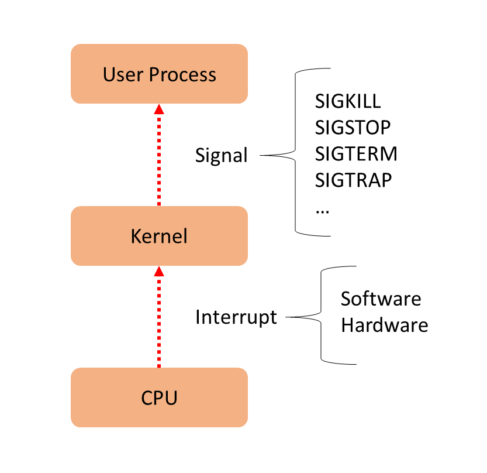
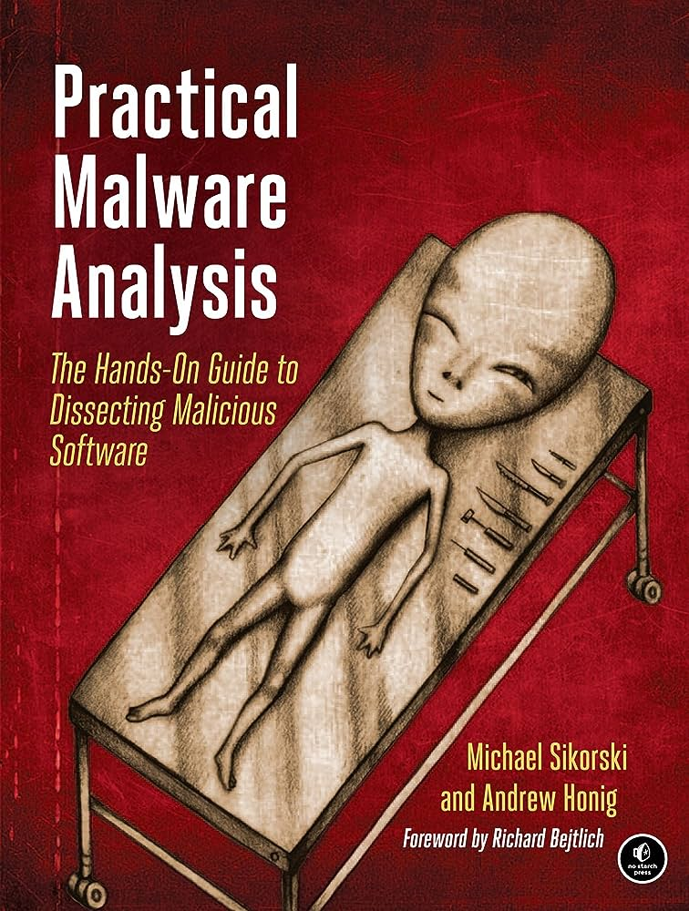

[2 - Tổng quan về kiến trúc Linux](#linux_arch)

- [2.1 - Linux Kernel (UPDATED 27/08/2023)](#linux_kernel)
- [2.2 - Vai trò của Linux Kernel (UPDATED 24/08/2023)](#linux_kernel_job)
- [2.3 - Hệ thống tệp tin (UPDATED 09/09/2023)](#fs)
    - [2.3.1 - Phân cấp hệ thống tệp tin (UPDATED 26/08/2023)](#fhs)
    - [2.3.2 - Tổng quan về quyền trên tệp tin (:arrow_up:UPDATED 09/09/2023)](#file_permission)
    - [2.3.3 - Quản lý quyền tệp tin (:arrow_up:UPDATED 09/09/2023)](#file_permission_management)
        - [2.3.3.1 - Quyền đặc biệt dành cho chủ sở hữu (SUID) và lỗ hổng leo thang đặc quyền (:heavy_plus_sign:UPDATED 10/09/2023)](#suid_permission)
        - [2.3.3.2 - Quyền đặc biệt dành cho nhóm(:heavy_plus_sign:UPDATED 10/09/2023)](#guid_permission)
        - [2.3.3.3 - Quyền đặc biệt Sticky bit(:heavy_plus_sign:UPDATED 10/09/2023)](#sticky_bit_permission)
    - [2.3.4 - RPM Package và phân loại (UPDATED 24/08/2023)](#rpm_package)
    - [2.3.5 - Kernel RPM Package (UPDATED 24/08/2023)](#kernel_rpm_package)
- [2.4 - Tổng quan tiến trình Linux (UPDATED 05/09/2023)](#linux_process)
    - [2.4.1 - Trạng thái của tiến trình Linux (UPDATED 05/09/2023)](#process_states)
- [2.5 - Tổng quan về Interrupt - Ngắt (UPDATED 05/09/2023)](#interrupt)

# <a name="linux_arch"></a>Tổng quan về kiến trúc Linux
## <a name="linux_kernel"></a>Tổng quan `Linux kernel`
`Linux kernel` được đánh giá là mã nguồn mở lớn nhất thế giới với hàng ngàn lập trình viên đang đóng góp và hàng triệu dòng code thay đổi cho mỗi lần phát hành phiên bản mới. `Linux kernel` được phát hành với giấy phép `GPL v2`, cụ thế giấy phép này yêu cầu mọi sự sửa đổi/cập nhật sẽ được chuyển đến cho khách hàng. Lịch trình hiện tại của các bản phát hành thường sẽ rơi vào tháng 3 hoặc 4. `Linux kernel` là thành phần chính của hệ điều hành `Linux`, thành phần cốt lõi giữa phần cứng máy tính và các tiến trình bên trong nó. Nó giao tiếp giữa 2 thực thể , quản lý tài nguyên một cách tốt nhất. Đặt tên là `kernel` vì nó được coi là hát gióng nằm bên trong lớp vỏ - nó tồn tại ở ngay bên trong `OS` và điều khiển các chức năng của phần cứng.

<div style="text-align:center"></div>

## <a name="linux_kernel_job"></a>Vai trò `Linux kernel`
`Kernel` gồm có 4 công việc:

- `Memory management` -quản lý bộ nhớ: liên tục theo dõi lượng tài nguyên nơi bộ nhớ đã được sử dụng, bao gồm cả việc nó lưu trữ những gì và nơi nó được lưu trữ.
- `Process management` - quản lý tiến trình: xác định được những tiến trình nào có thể sử dụng CPU, khi nào và bao lâu.
- `Device drivers`: đóng vai trò trung gian trong việc liên lạc giữa phần cứng và tiến trình.
- `System Calls and Security`: nhận những yêu cầu từ `service` và `process`.

Khi `kernel` được triển khai đúng cách thì nó phải nằm trong trạng thái `invisible` với người dùng thông thường, nó chỉ làm việc bên trong không gian `kernel space`, nơi nó phân bổ bộ nhớ và theo dõi nơi mọi thứ được lưu giữ. Giống như người dùng sử dụng truy cập `web` thì trình duyệt là không gian của người dùng hay `user space`. Các ứng dụng tương tác với `kernel` thông qua `System Call Interface(SCI)`.

`Red Hat` ví dụ về `kernel` như một trợ lý bận rộn của một nhà điều hành quyền lực `hardware`. Công việc của trợ lý là chuyển tiếp các tin nhắn và yêu cầu của các tiến trình `processes` từ nhân viên `users` tới nhà điều hành. Ghi nhớ vị trí của chúng vào tủ hồ sơ `memory` và xác định ai là người có quyền truy cập.

- `Hardware`: máy tính vât lý nhìn theo hướng logic nó nằm ở đáy hệ thống, tạo nên bộ nhớ `memory`, `CPU` tính toán đọc ghi vào bộ nhớ, ...
- `Linux kernel`: lõi của `OS`, nằm ở giữa phần cứng và tiến trình về mặt `logic`, đương nhiên `kernel` vẫn là phần mềm với vai trò sẽ cho `CPU` biết phải làm gì.
- `User processes`: trên đây có những chương trình đang chạy được quản lý bởi `kernel`. Các tiến trình của `user` tạo nên `user space`. Các tiến trình này được biết đến đơn thuần là `process`. `Kernel` sẽ cho phép các tiến trình này và phần cứng giao tiếp lẫn nhau, cái mà được gọi là `Inter-process communication(IPC)`.

Đoạn mã được thực thi trên hệ thống chạy trên `CPU` ở `1` trong `2` chế độ: `kernel` hoặc `user`. Đoạn mã chạy trong `kernel mode` không bị hạn chế quyền truy cập tới phần cứng trong khi ngược lại với `user mode`, ... Những chi tiết nhỏ này góp phần tạo nên cơ sở phân tách lớp bảo mật, xây dựng nên những thứ phức tạp như `container`, `Virtual Machine`.

Điều này cũng đồng nghĩa rằng nếu tiến trình chạy ở `user mode` có thiệt hại hạn chế hơn, ngược lại với `kernel mode` khi có sự cố sẽ làm sập hệ thống. Vì `user mode` có sẵn các biện pháp bảo vệ và chỉ các quyền cần thiết nên sự cố thường không thể gây ra quá nhiều vấn đề.

Ví dụ: khi người dùng `Windows` mở một tệp bất kỳ trên ứng dụng `File Explorer` - dĩ nhiên đây là ứng dụng nằm ở phía `user mode`, ứng dụng này sẽ gửi một yêu cầu `I/O` đến ứng dụng loại `File System Filter Driver` được chạy ở phía `kernel mode`, tại đây `File System Filter Driver` sẽ là một bộ lọc cho phép `File Explorer` lấy dữ liệu từ ổ cứng, ngược lại cũng có quyền từ chối nếu như nội dung hoặc một phần nhỏ trong nội dung nằm trong danh sách không thỏa được bị lập trình viên `driver` thiết kế. Đây là một chức năng nằm trong sản phẩm `File Defender` của tập đoàn chuyên làm phần mềm bảo mật `Plott Ltd` Nhật Bản.

<i>Tham khỏa thêm tại https://access.redhat.com/documentation/en-us/red_hat_enterprise_linux/8/html-single/managing_monitoring_and_updating_the_kernel/index#what-the-kernel-is_assembly_the-linux-kernel</i>
## <a name="fs"></a>Hệ thống tệp tin
### <a name="fhs"></a>Phân cấp hệ thống tệp tin
Cấu trúc của hệ thống tệp tin `File System Hierarchy Standard(FHS)` được định nghĩa tên, nơi chốn và các quyền cho tất cả các loại tệp, thư mục. Tài liệu `FHS` là tài liệu chính thức cho bất kỳ hệ thống tệp tin nào tuân thủ `FHS` nhưng cấu trúc này để lại nhiều mảng không thể định nghĩa hoặc mở rộng.

Hai điểm quan trọng nhất để đảm bảo rằng hệ thống tuân thủ `FHS` như sau:

- Khả năng tương thích giữa các hệ thống tuân thủ `FHS`.
- Phân vùng `/usr` chỉ ở dạng `readonly`, điều này rất quan trọng vì `/usr` chứa các tệp thực thi phổ biến và người dùng không nên thay đổi. Ngoài ra vì `/usr` ở quyền `readonly` nên nó có thể được `mount` từ `CD-ROM` hoặc từ một máy khác thông qua `NFS`.

Tiêu chuẩn này yêu cầu rằng tất cả hệ thống tuân thủ `FHS` đều hỗ trợ tính năng bảo mật cơ bản tương tự được tìm thấy hầu hết các ở `UNIX`. Có thể phân biệt sự khác biệt giữa các tệp:

- Có thể chia sẻ `shareable` / không thể chia sẻ `unshareable`.
- Có thể biến đổi `variable` / không biến đổi `static`.

Ý nghĩa khai sinh của `shareable` chỉ định những tệp có thể được lưu trữ trên máy chủ và được sử dụng trên các máy chủ khác, ngược lại các tệp `unshareable` là những tệp đó không thể chia sẻ với máy chủ khác. Cụ thể hơn, các tệp trong thư mục của người dùng có thể chia sẻ trong khi thiết bị chứa tệp đó thì không. Đối với các tệp `static` bao gồm tệp `binary`, `lib`, tài liệu, ... không `"thay đổi"` nếu không có sự can thiệp của quản trị viên hệ thống, ngược lại sẽ là `variable`.

Lý do: thông thường không phải tất cả các tệp trong hệ thống phân cấp đều chia sẻ được và do đó mỗi hệ thống có nơi chứa cục bộ, các tệp không thể chia sẻ của nó. Phát sinh từ nhu cầu sẽ thuận tiện nếu tất cả tệp mà hệ thống người dùng yêu cầu được lưu trữ trên máy chủ quốc tế, từ đó người dùng có thể được cung cấp bằng cách `mount` một vài thư mục từ máy chủ quốc tế đó.

<div style="text-align:center"></div>

Về lịch sử, cũng giống như hệ thống phân cấp `UNIX` đều chứa cả tệp `static` và `variable` trong cả `/usr` và `/etc`. Để nhận ra được những lợi ích đề cập ở trên thì `/var` được tạo ra và tất cả các tệp `variable` được thay đổi nơi ở, tức chuyển từ `/usr` sang `/var`, do đó hiện giờ  `/usr` chỉ ở chế độ `readonly`. Đối với những tệp `variable` trong `/etc` thì được chuyển sang `/var` sau một thời gian dài chờ đợi công nghệ kỹ thuật phát triển. Sau đây là ví dụ về một hệ thống tuân thủ `FHS`.
| 			| shareable 		| unshareable|
| ----------| ---- 				| ---- 		 |
| static	| /usr 				| /etc		 |
| static    | /opt 				| /boot		 |
| variable	| /var/mail 		| /var/run	 |
| variable  | /var/spool/news 	| /var/lock  |

Hệ thống tệp tin `Linux` được xây dựng theo kiến trúc phân nhánh, khởi đầu và khuynh hướng luôn là `/` - còn được gọi là `forward slash`, cái mà ngược lại với `\` hay `back slash` của `Microsoft Windows`. Sau đây mô hình sơ lược về hệ thống phân cấp.

<div style="text-align:center"></div>

Chi tiết về `root filesystem` như sau:

- `boot` - để khởi động hệ thống thì cần đủ các phần mềm và dữ liệu nằm trên phân vùng `root` để có thể liên kết với hệ thống tệp tin. Tại đây bao gồm các công cụ tiện ích, cấu hình, ...
- `recovery` - để kích hoạt khôi phục về trạng thái ở thời điểm nào đó.
- `restore` - khi hệ thống bị lỗi cần khôi phục từ hệ thống dự phòng. 
- Các yêu cầu tối thiểu cho `/` phải càng nhỏ càng tốt vì một vài lý do: 
    - Đôi khi nó được `mount` từ các thiết bị rất nhỏ.
    - Nó chứa các cấu hình như `kernel`, ... vì thế nó thuộc vào loại tệp không thể chia sẻ nên nó sẽ nhưỡng khoảng trống dung lượng cho những loại `shareable`.
    - Lỗi trên `/` là một vấn đề lớn hơn bất kỳ lỗi nào trên phân vùng khác, nếu nó nhỏ càng giảm thiểu rủi ro cho toàn bộ hệ thống.

Tổng quan các thư mục sau hoặc các `symbolic` đều được yêu cầu trong `root filesystem` :
| Thư mục 	| Mô tả |
| ----      | ---- 		 |
| /bin      | Các chương trình cơ bản cho tất cả người dùng          |
| /boot     | Các tệp tĩnh dành cho `boot loader` hoặc `linux kernel`       |
| /dev      | Các tệp về thiết bị: chuột, bàn phím...           |
| /etc      | Các tệp dành riêng cho cấu hình hệ thống  |
| /lib      | Các thư viện và `kernel module`       	|
| /mnt      | Dành để `mount` thủ công bởi quản trị, nội dung này là cục bộ và không ảnh hưởng đến cách thức vận hành của bất kỳ chương trình nào |
| /media    | Dành cho các thiết bị di động để `mount` tự động như: đĩa mềm `floppy` hoặc CD-ROM, ... hoặc những thứ mà quản trị viên thực sự không muốn nó `mount` vào `root filesystem`. Trong lịch sử đã có một số vị trí `mount` như `/mnt`, `/cdrom` hoặc `/mnt/cdrom` điều nay vô tình là hành vi bổ sung vào `/`.  |
| /opt      | Được dành riêng nếu bổ sung các gói cài đặt, phần mềm dành cho quản trị viên sử dụng |
| /run      | Dữ liệu của phần mềm trong lúc hoạt động. Ví dụ: để kiểm tra các tài khoản đang hoạt động `ls -al /run/user` thông qua `ID` hoặc `DNS` của hệ thống đang dùng `ls -al /run/NetworkManager/resolv.conf`, ...	 |
| /sbin  	| Chương trình của hệ thống sử dụng, hầu hết liên quan đến `root`  |
| /srv      | Dữ liệu của dịch vụ được cung cấp bởi hệ thống  |
| /tmp      | Tệp tạm thời, sẽ mất sau khi khởi động.  |
| /usr      | Đây là phần chính sau `root filesystem` và có thể chia sẻ được nhưng `read only` giữa các máy chủ.  |
| /var      | Chứa những loại dữ liệu động, nó chứa các thành phần có thể chia sẻ như /`/var/mail`, ... nhưng cũng có phần không thể chia sẻ `/var/log`, ... |

Chi tiết về `/bin`: các tệp nhị phân được sử dụng bởi tất cả người dùng. Các chương trình nằm trong `/bin` bao gồm:

- `cat`: công cụ hiển thị nội dung tệp.
- `cp`: công cụ sao chép tệp và thư mục.
- `ps`: công cụ báo cáo trạng thái tiến trình.
- `ls`: công cụ liệt kê nội dung thư mục.
- Và một số chương trình khác: `pwd`, `mkdir`, `chmod`, `chown`, `sed`, ... kể cả ký tự `[` hoặc `test`.

Chi tiết về `/boot`: chứa tất cả các yêu cầu cho quá trình `boot` ngoại trừ tệp cấu hình không cần thiết trong lúc khởi động, `/boot` chứa dữ liệu được sử dụng trước khi `kernel` thực hiện chuyển đổi sang `user-mode`. Các chương trình cần thiết để sắp xếp cho `boot loader` có thể khởi động phải được đặt trong `/sbin`, ngược lại các tệp cấu hình không bắt buộc sẽ đặt ở `/etc`. `Kernel` hệ điều hành được đặt ở `/` hoặc `/boot`.

Chi tiết về `/dev`: nơi vị trí của cấc tệp đặc biệt hoặc thiết bị. Khi cần thiết thì các thiết bị trong `/dev` có thể được tạo một cách thủ công, `/dev` chứa chương trình `MAKEDEV` dùng để phục vụ chuyện đó.

Chi tiết về `/etc`: các tệp cấu hình được chứa trong đây, chúng được sử dụng để điều khiển cách thức vận hành của chương trình, chúng bắt buộc là một tệp tĩnh và không thể thực thi. Một số tệp ví dụ như:

- `hosts`: thông tin về ánh xạ tên máy chủ.
- `hosts.allow`: danh sách được cho phép truy cập dựa trên `TCP`.
- `hosts.deny`: danh sách từ chối truy cập dựa trên `TCP`.
- `hosts.equiv`: danh sách các máy chủ và người dùng được tin tưởng hoặc từ chối khi sử dụng `r-command` như `rlogin`, `rsh` hoặc `rcp`... truy cập vào hệ thống mà không cần cung cấp mật khẩu - cơ chế xác thực người dùng cơ bản.
### <a name="file_permission"></a>Tổng quan về quyền trên tệp tin
Là khả năng về việc kiểm soát quyền hạn của trên tệp tin hoặc thư mục của người dùng hoặc nhóm các người dùng như:

- `View` - xem nội dung.
- `Modify` - chỉnh sửa nội dung.
- `Execute` - thực thi nội dung.
- `Access` - truy cập.

Mỗi tệp hoặc thư mục đều tồn tại 3 cấp độ sở hữu như:

- Người sở hữu - `u` (user).
- Nhóm người sở hữu - `g` (group).
- Ngoài ra những người còn lại - `o` (other).

Mỗi cấp độ sở hữu đều có khả năng gán 3 quyền như sau:

- Đọc dữ liệu - `r` (read).
- Ghi dữ liệu - `w` (write).
- Thực thi - `x` (execuate).

Khi một tệp hoặc thư mục được tạo thì một tập hợp các quyền mặc định sẽ tự động được gán vào chúng, lưu ý rằng quyền `x` dành cho tệp tin sẽ cho phép thực thi hay `run` tệp đó, ngược lại với thư mục chỉ cho phép truy cập vào nội dung của thư mục.
Thông tin về các quyền cơ bản được thể hiện ở dạng `symbolic` hoặc giá trị hệ 8 `octal`.
| Quyền hạn | Giá trị `symbolic` | Giá trị hệ 8 |
| ---- | ---- | ---- |
| Không quyền      | --- | 0 |
| Chỉ thực thi     | --x | 1 |
| Chỉ viết         | -w- | 2 |
| Thực thi và viết | -wx | 3 |
| Chỉ đọc          | r-- | 4 |
| Đọc và thực thi  | r-x | 5 |
| Đọc và viết      | rw- | 6 |
| Đầy đủ quyền     | rwx | 7 |

Với quyền `777` dành cho thư mục có nghĩa là chủ sở hữu, nhóm và những người khác đều có thể xem nội dung bên trong thư mục, tạo, xóa, truy cập vào và chỉnh sửa các thư mục con ở bên trong nó. Lưu ý rằng các tệp tin trong thư mục có thể được cài đặt quyền riêng, điều này có thể ngăn chặn chỉnh sửa nội dung mặc dù trên thư mục chứa nó đang cho phép mọi quyền truy cập `unrestricted`.

Đối với chế độ `umask (user file-creation mode mask)` sẽ lật tất cả các `bit` sao cho ngược lại với chế độ `mask`. Nó được ứng dụng tự động hóa loại bỏ các quyền mặc định để tăng khả năng bảo mật cho hệ thống tệp tin `Linux`.

| Quyền hạn | Giá trị `symbolic` | Giá trị hệ 8 |
| ---- | ---- | ---- |
| Đầy đủ quyền     | rwx | 0 |
| Đọc và viết      | rw- | 1 |
| Đọc và thực thi  | r-x | 2 |
| Chỉ đọc          | r-- | 3 |
| Thực thi và viết | -wx | 4 |
| Chỉ viết         | -w- | 5 |
| Chỉ thực thi     | --x | 6 |
| Không quyền      | --- | 7 |

<div style="text-align:center"></div>

Quyền hạn cơ bản của thư mục được tạo bởi người dùng thường hay `standard user`.

| Loại quyền | Giá trị `symbolic` | Giá trị hệ 8 |
| ---- | ---- | ---- |
| Quyền mặc định       | rw-rw-r-- | 664 |
| `umask` của mặc định | rwxrwxr-x | 002 |
| Quyền cơ bản         | rw-rw-rw- | 666 |

Ví dụ như sau:
```shell
[sysad@huyvl-linux-training ~]$ ll
total 4
drwxrwxr-x 2 sysad sysad 4096 Sep  9 18:46 new-directory
-rw-rw-r-- 1 sysad sysad    0 Sep  9 18:46 new-file
[sysad@huyvl-linux-training ~]$
```
Chú thích:
- Ký tự `d` thể hiện đối tượng là thư mục.
- `rw-` trên thư mục cho phép người sở hữu có mọi quyền trên đó
- `rw-` chỉ cho phép đọc và thực thi của các tài khoản nằm trong nhóm `sysad`
- những người còn lại chỉ có quyền đọc `r--`.
- Tương tự đối với tệp `new-file`.

Quyền hạn cơ bản của thư mục được tạo bởi người dùng `root`.

| Loại quyền | Giá trị `symbolic` | Giá trị hệ 8 |
| ---- | ---- | ---- |
| Quyền mặc định       | rwxr-xr-x | 755 |
| `umask` của mặc định | rwxr-xr-x | 022 |
| Quyền cơ bản         | rwxrwxrwx | 777 |

Ví dụ như sau:
```shell
[root@huyvl-linux-training ~]# ll
total 4
drwxr-xr-x 2 root root 4096 Sep  9 17:47 new-directory
-rw-r--r-- 1 root root    0 Sep  9 17:47 new-file
[root@huyvl-linux-training ~]#
```
Đối với tệp tin có các quyền cơ bản sẽ giống nhau với cả người dùng thường lẫn `root`.
| Loại quyền | Giá trị `symbolic` | Giá trị hệ 8 |
| ---- | ---- | ---- |
| Quyền mặc định       | rw-r--​r-- | 644 |
| `umask` của mặc định | rwxr-xr-x | 022 |
| Quyền cơ bản         | rw-rw-rw- | 666 |
### <a name="file_permission_management"></a>Quản lý quyền truy cập tệp tin
Người dùng có thể sử dụng công cụ `chmod` với `octal` hoặc các `symbolic` kèm phép toán sau để thay đổi quyền:

- `+`: thêm quyền dựa trên các quyền hiện hành.
- `-`: loại bỏ quyền từ các quyền hiện hành.
- `=`: loại bỏ tất cả quyền hiện tại và định nghĩa lại theo yêu cầu.

Để thay đổi quyền người dùng có thể sử dụng lệnh:
```shell
$ chmod <ownership><operation><permission> object-name
$ chmod <octal-value> object-name
```
Người dùng có thể sử dụng tiện tích `umask` để hiển thị, cài đặt hoặc thay đổi giá trị hiện tại. Để hiện thị `umask` có thể gọi lệnh như sau với tùy chọn `-S` để hiện thị với dạng `symbolic`:
```shell
[root@huyvl-linux-training ~]# umask
0022
[root@huyvl-linux-training ~]# umask -S
u=rwx,g=rx,o=rx
[root@huyvl-linux-training ~]# su - sysad
Last login: Sat Sep  9 18:35:15 +07 2023 on pts/0
[sysad@huyvl-linux-training ~]$ umask
0002
[sysad@huyvl-linux-training ~]$ umask -S
u=rwx,g=rwx,o=rx
[sysad@huyvl-linux-training ~]$
```
Một loại quyền đặc biệt được mô tả người dùng khi hiển thị `umask`, loại đặc biệt này sẽ là quyền truy cập thứ `4` được thêm vào ngoài những thứ đã có sẵn `owner/user`, `group` và `other`. Giá trị `bit` đầu tiên thể hiện cho `sticky bit`, `SUID` hoặc `SGID`, khi giá trị `bit` là `0` tức chưa được kích hoạt chức năng này.
#### <a name="suid_permission"></a>Quyền đặc biệt dành cho chủ sở hữu (SUID) và lỗ hổng leo thang đặc quyền
Mức truy cập `user+s(pecial)` gọi tắt là `SUID (Set User ID)` thường được ứng dụng cho các tệp `binary`, quyền này mô tả tệp sẽ chỉ được thực thi với quyền của chủ sở hữu tệp. Một ví dụ về lợi ích của mặc định áp dụng quyền `SUID` lên tệp `/usr/bin/passwd` sẽ thấy quyền `x(execute)` bị thay thế bởi `s(pecial)` cho nên chương trình sẽ thực thi bởi `root` như sau:
```shell
[root@huyvl-linux-training ~]# ls -l /usr/bin/passwd
-rwsr-xr-x. 1 root root 27856 Apr  1  2020 /usr/bin/passwd
[root@huyvl-linux-training ~]#
```
, có thể chứng minh được chương trình `passwd` này chỉ có thể được sử dụng bởi `root` bằng cách tạo tài khoản `dev` khởi chạy chương trình `passwd` như sau:
```shell
[dev@huyvl-linux-training ~]$ passwd
Changing password for user dev.
Changing password for dev.
(current) UNIX password:
```
, kiểm tra thấy `bash shell` chạy tiến trình `passwd` với tài khoản `root` như sau:
```shell
[root@huyvl-linux-training ~]# ps auf
USER       PID %CPU %MEM    VSZ   RSS TTY      STAT START   TIME COMMAND
root     27864  0.0  0.2 115544  2048 pts/3    Ss   14:24   0:00 /bin/bash
root     28076  0.0  0.2 191880  2364 pts/3    S    14:24   0:00  \_ su - dev
dev      28077  0.0  0.2 115544  2080 pts/3    S    14:24   0:00      \_ -bash
root     20930  0.0  0.1 160400  1908 pts/3    S+   14:58   0:00          \_ passwd
...
...
```
, việc thay đổi diễn ra thành công tại tài khoản `dev` như sau:
```shell
[dev@huyvl-linux-training ~]$ passwd
Changing password for user dev.
Changing password for dev.
(current) UNIX password:
Enter new UNIX password:
Retype new UNIX password:
passwd: all authentication tokens updated successfully.
[dev@huyvl-linux-training ~]$
```
, kiểm tra nhật ký tại `root` như sau:
```shell
[root@huyvl-linux-training ~]# tail -f /var/log/secure
...
...
Sep 10 15:05:40 huyvl-linux-training passwd: pam_unix(passwd:chauthtok): password changed for dev
```
, loại bỏ quyền `SUID` và kiểm tra lại hoạt động của `passwd` tại `dev` như sau:
```shell
[root@huyvl-linux-training ~]# chmod u-s /usr/bin/passwd
```
, tại tài khoản `dev` nhận thấy không thể thay đổi mật khẩu:
```shell
[dev@huyvl-linux-training ~]$ passwd
Changing password for user dev.
Changing password for dev.
(current) UNIX password:
Enter new UNIX password:
Retype new UNIX password:
Enter new UNIX password:
Retype new UNIX password:
Enter new UNIX password:
Retype new UNIX password:
passwd: Authentication token manipulation error
[dev@huyvl-linux-training ~]$
```
, tại `root` thấy chương trình `passwd` đã được chuyển sang khởi chạy với chính `dev`, khác với trước khi chỉnh sửa quyền như sau:
```shell
[root@huyvl-linux-training ~]# ps auf
USER       PID %CPU %MEM    VSZ   RSS TTY      STAT START   TIME COMMAND
root     27864  0.0  0.2 115544  2048 pts/3    Ss   14:24   0:00 /bin/bash
root     28076  0.0  0.2 191880  2364 pts/3    S    14:24   0:00  \_ su - dev
dev      28077  0.0  0.2 115544  2080 pts/3    S    14:24   0:00      \_ -bash
dev      29300  0.0  0.1 160400  1888 pts/3    S+   15:09   0:00          \_ passwd
...
...
[root@huyvl-linux-training ~]# tail -f /var/log/secure
...
...
Sep 10 15:07:00 huyvl-linux-training passwd: pam_unix(passwd:chauthtok): can't open /etc/security/opasswd file to check old passwords
Sep 10 15:07:04 huyvl-linux-training passwd: pam_unix(passwd:chauthtok): can't open /etc/security/opasswd file to check old passwords
Sep 10 15:08:08 huyvl-linux-training passwd: pam_unix(passwd:chauthtok): can't open /etc/security/opasswd file to check old passwords
Sep 10 15:08:08 huyvl-linux-training passwd: pam_unix(passwd:chauthtok): new password not acceptable
Sep 10 15:08:51 huyvl-linux-training unix_chkpwd[28509]: password check failed for user (dev)
Sep 10 15:08:51 huyvl-linux-training passwd: pam_unix(passwd:chauthtok): authentication failure; logname= uid=1001 euid=1001 tty=pts/3 ruser= rhost=  user=dev
Sep 10 15:08:57 huyvl-linux-training passwd: pam_unix(passwd:chauthtok): can't open /etc/security/opasswd file to check old passwords
Sep 10 15:08:58 huyvl-linux-training passwd: pam_unix(passwd:chauthtok): can't open /etc/security/opasswd file to check old passwords
Sep 10 15:08:58 huyvl-linux-training passwd: pam_unix(passwd:chauthtok): can't open /etc/security/opasswd file to check old passwords
Sep 10 15:08:58 huyvl-linux-training passwd: pam_unix(passwd:chauthtok): new password not acceptable
...
...
[root@huyvl-linux-training ~]# ls -l /etc/security/opasswd
-rw------- 1 root root 94 Sep 10 15:16 /etc/security/opasswd
[root@huyvl-linux-training ~]#
```
Chương trình `/usr/bin/id` mô tả chính xác về thông của một tài khoản nhưng cũng có thể là một trong những ví dụ điển hình về cấp nhầm `SUID` dẫn tới một lỗ hổng tiềm tàng như sau:
```shell
[dev@huyvl-linux-training ~]$ id
uid=1001(dev) gid=1001(dev) groups=1001(dev)
[dev@huyvl-linux-training ~]$ ls -l /usr/bin/id
-rwxr-xr-x. 1 root root 37400 Nov 17  2020 /usr/bin/id
[dev@huyvl-linux-training ~]$
...
...
[dev@huyvl-linux-training ~]$ id
uid=1001(dev) gid=1001(dev) groups=1001(dev)
[dev@huyvl-linux-training ~]$
```
, giả lập thao tác trao quyền nhầm quyền `SUID` bởi quản trị viên vào chương trình `/usr/bin/id`, sau đó tại tài khoản `dev` đã có được một đặc quyền `root` như sau:
```shell
[root@huyvl-linux-training ~]# cp /usr/bin/id /home/dev/
[root@huyvl-linux-training ~]# chmod u+s /home/dev/id
...
...
[dev@huyvl-linux-training ~]$ ./id
uid=1001(dev) gid=1001(dev) euid=0(root) groups=1001(dev)
[dev@huyvl-linux-training ~]$
```
, tương tự đối với chương trình `/usr/bin/cat` hoặc thậm chí với các công cụ `gparted`, `nano`, ... như sau:
```shell
[dev@huyvl-linux-training ~]$ cat /etc/shadow
cat: /etc/shadow: Permission denied
[dev@huyvl-linux-training ~]$
```
```shell
[root@huyvl-linux-training ~]# cp /usr/bin/cat /home/dev/
[root@huyvl-linux-training ~]# chmod u+s /home/dev/cat
```
, tài khoản `dev` đã có quyền để thể thấy được tất mật khẩu `root`, `sysad`, ... với dạng băm như sau:
```shell
[dev@huyvl-linux-training ~]$ ./cat /etc/shadow
root:$1$WIK4jiKy$zduQomlM7t93yBZ8gWLO5.:19610:0:99999:7:::
bin:*:18353:0:99999:7:::
daemon:*:18353:0:99999:7:::
adm:*:18353:0:99999:7:::
lp:*:18353:0:99999:7:::
sync:*:18353:0:99999:7:::
shutdown:*:18353:0:99999:7:::
halt:*:18353:0:99999:7:::
mail:*:18353:0:99999:7:::
operator:*:18353:0:99999:7:::
games:*:18353:0:99999:7:::
ftp:*:18353:0:99999:7:::
nobody:*:18353:0:99999:7:::
systemd-network:!!:18760::::::
dbus:!!:18760::::::
polkitd:!!:18760::::::
sshd:!!:18760::::::
postfix:!!:18760::::::
chrony:!!:18760::::::
gluster:!!:18760::::::
sysad:$6$5wkk19C0$HQHc9eCGwyE1cXcgsPnUXKZHp9.OLy9gWr95Sno8y1B8VrZut1NSjuMYTojEQ.AiQPgBidqp8u9qJtmB9Mszk.:19610:0:99999:7:::
dev:$6$MSPq8owf$DPCLXYW1kZrA7Bnf6/cJe2FclE1VWBp4uak4ienAOU0cK3dF.nKX9mRnwqlLx4Di/AwU8cqWuKJUBewLV1Ty0.:19610:0:99999:7:::
[dev@huyvl-linux-training ~]$
```
#### <a name="guid_permission"></a>Quyền đặc biệt dành cho nhóm (GUID)
#### <a name="sticky_bit_permission"></a>Quyền đặc biệt Sticky Bit
### <a name="rpm_package"></a>RPM package và phân loại
`RPM package` là một tệp chứa nhiều tệp con và `metadata` của chúng(thông tin về các tệp kéo theo/cần thiết bởi hệ thống). Cụ thể thì mỗi gói `RPM` đã bao gồm tệp nén `cpio`, trong tệp nén này chứa:

- Những tệp tin.
- Tiêu đề `RPM` hay `RPM header`, `metadata` của gói chứa tại đây.
- Người quản lý gói `RPM` sử dụng `metadata` để xác định những thành phần phụ thuộc, nơi chứa các tệp cài đặt và các thông tin khác.

Có 2 loại `RPM package`, tất cả chúng đều chia sẻ định dạng và công cụ nhưng có những nội dung khác nhau để phục vụ các mục đích khác nhau:

- Nguồn của `RPM package` viết tắt `SRPM`, thông tin này chứa mã nguồn và cấu hình tệp nơi mà mô tả làm thế nào để xây dựng được gói `RPM binary`. Thêm vào đó `SRPM` có thông tin các bản vá lỗi cho đoạn mã được bao gồm.
- Tệp `RPM binary` chứa tệp `binary` được xây dựng từ mã nguồn.
### <a name="kernel_rpm_package"></a>Tổng quan về `RPM package` của `Linux kernel`
`Kernel RPM` là loại `RPM` đặc biệt, nó không chứa bất kỳ tệp nào nhưng nó bắt buộc các gói phụ thuộc phải được cài đặt đúng cách. `Kernel core` chứa các mẫu `binary` hay `binary image` của `kernel`, tất cả các đối tượng liên quan đến `initramfs` khởi động cùng hệ thống, số lượng `kernel-module` tối thiểu để đảm bảo chức năng cốt lõi. `Kernel modules` chứa những `kernel modules` còn lại không nằm trong `kernel core`.

Một nhóm nhỏ các gói phụ thuộc của `kernel` bên trên nhằm mục đích cung cấp công cụ, môi trường để quản trị viên bảo trì, đặc biệt trong môi trường ảo hóa. Các `kernel package` được tùy chọn thêm gồm có:

- `kernel-modules-extra` chứa các `kernel module` dành cho các loại phần cứng đặc biệt, hiếm gặp hoặc các `module` bị vô hiệu hóa theo mặc định.
- `kernel-debug` chứa các chức năng `debug` được kích hoạt để chuẩn đoán lỗi nhưng điều này làm giảm hiệu suất.
- `kernel-tools` chứa các công cụ để thao tác với `Linux kernel` và hỗ trợ tài liệu.
- `kernel-devel` chứa các `kernel header` và `makefiles` dành cho các lập trình viên phát triển xây dựng `module` dựa trên `kernel package`.
- `kernel-abi-stablelists` chứa các thông tin liên quan đến `ABI kernel` dành riêng cho `RHEL`.
- `kernel-headers` chứa các `header` của ngôn ngữ C mô tả cách thức giao tiếp giữa `Linux kernel` và thư viện dành cho `user space`. Các tệp `header` này đã được định nghĩa nhiều cấu trúc `struct` và các hằng số `const` cần thiết để lập trình viên phát triển các ứng dụng.

Cài đặt `vim` để liệt kê các `rpm` phụ thuộc như sau:
```shell
[root@huyvl-linux-training ~]# yum install --downloadonly --downloaddir=/tmp/vim-rpm/ vim
Loaded plugins: fastestmirror
Loading mirror speeds from cached hostfile
 * base: mirror.bizflycloud.vn
 * extras: mirror.bizflycloud.vn
 * updates: mirror.bizflycloud.vn
Resolving Dependencies
--> Running transaction check
---> Package vim-enhanced.x86_64 2:7.4.629-8.el7_9 will be installed
...
...
(28/31): vim-enhanced-7.4.629-8.el7_9.x86_64.rpm    | 1.1 MB  00:00:00
(29/31): vim-filesystem-7.4.629-8.el7_9.x86_64.rpm  |  11 kB  00:00:00
(30/31): vim-common-7.4.629-8.el7_9.x86_64.rpm      | 5.9 MB  00:00:00
(31/31): perl-Carp-1.26-244.el7.noarch.rpm          |  19 kB  00:00:01
----------------------------------------------------------------------
Total                                       16 MB/s |  18 MB  00:00:01
exiting because "Download Only" specified
[root@huyvl-linux-training ~]#
[root@huyvl-linux-training ~]#
[root@huyvl-linux-training ~]#
[root@huyvl-linux-training ~]# ls -al /tmp/vim-rpm/
total 19036
drwxr-xr-x  2 root root    4096 Aug 23 10:29 .
drwxrwxrwt. 9 root root    4096 Aug 23 10:29 ..
-rw-r--r--  1 root root   33120 Aug 23  2019 gpm-libs-1.20.7-6.el7.x86_64.rpm
-rw-r--r--  1 root root 8360316 Feb  3  2021 perl-5.16.3-299.el7_9.x86_64.rpm
-rw-r--r--  1 root root   19672 Jul  4  2014 perl-Carp-1.26-244.el7.noarch.rpm
-rw-r--r--  1 root root   19244 Jul  4  2014 perl-constant-1.27-2.el7.noarch.rpm
-rw-r--r--  1 root root 1545440 Jul  4  2014 perl-Encode-2.51-7.el7.x86_64.rpm
-rw-r--r--  1 root root   29092 Jul  4  2014 perl-Exporter-5.68-3.el7.noarch.rpm
...
...
```
Tiến hành phân tích tệp `rpm` đã được tải về của `vim` như sau:
```shell
[root@huyvl-linux-training vim-rpm]# rpm -qlp gpm-libs-1.20.7-6.el7.x86_64.rpm
/usr/lib64/libgpm.so.2
/usr/lib64/libgpm.so.2.1.0
[root@huyvl-linux-training vim-rpm]#
```
Thường thì lệnh `update` sẽ cập nhật những `kernel` như sau:
```shell
[root@huyvl-linux-training ~]# yum update --downloadonly --downloaddir=/tmp/update/
Loaded plugins: fastestmirror
Loading mirror speeds from cached hostfile
 * base: mirror.bizflycloud.vn
 * extras: mirror.bizflycloud.vn
 * updates: mirror.bizflycloud.vn
Resolving Dependencies
--> Running transaction check
...
...
```
Phân tích `kernel rpm` thấy được như sau:
```shell
[root@huyvl-linux-training ~]# cd /tmp/update/
[root@huyvl-linux-training update]# ls -al | grep kernel
-rw-r--r--   1 root root 54180012 Jul 28 21:53 kernel-3.10.0-1160.95.1.el7.x86_64.rpm
-rw-r--r--   1 root root  8579092 Jul 28 21:54 kernel-tools-3.10.0-1160.95.1.el7.x86_64.rpm
-rw-r--r--   1 root root  8469692 Jul 28 21:54 kernel-tools-libs-3.10.0-1160.95.1.el7.x86_64.rpm
[root@huyvl-linux-training update]# rpm -qlp kernel-3.10.0-1160.95.1.el7.x86_64.rpm
/boot/.vmlinuz-3.10.0-1160.95.1.el7.x86_64.hmac
/boot/System.map-3.10.0-1160.95.1.el7.x86_64
/boot/config-3.10.0-1160.95.1.el7.x86_64
/boot/initramfs-3.10.0-1160.95.1.el7.x86_64.img
/boot/symvers-3.10.0-1160.95.1.el7.x86_64.gz
/boot/vmlinuz-3.10.0-1160.95.1.el7.x86_64
/etc/ld.so.conf.d/kernel-3.10.0-1160.95.1.el7.x86_64.conf
/etc/modprobe.d/dccp-blacklist.conf
/lib/modules/3.10.0-1160.95.1.el7.x86_64
/lib/modules/3.10.0-1160.95.1.el7.x86_64/build
/lib/modules/3.10.0-1160.95.1.el7.x86_64/extra
/lib/modules/3.10.0-1160.95.1.el7.x86_64/kernel
/lib/modules/3.10.0-1160.95.1.el7.x86_64/kernel/arch
/lib/modules/3.10.0-1160.95.1.el7.x86_64/kernel/arch/x86
/lib/modules/3.10.0-1160.95.1.el7.x86_64/kernel/arch/x86/crypto
/lib/modules/3.10.0-1160.95.1.el7.x86_64/kernel/arch/x86/crypto/ablk_helper.ko.xz
/lib/modules/3.10.0-1160.95.1.el7.x86_64/kernel/arch/x86/crypto/aesni-intel.ko.xz
/lib/modules/3.10.0-1160.95.1.el7.x86_64/kernel/arch/x86/crypto/blowfish-x86_64.ko.xz
/lib/modules/3.10.0-1160.95.1.el7.x86_64/kernel/arch/x86/crypto/camellia-aesni-avx-x86_64.ko.xz
/lib/modules/3.10.0-1160.95.1.el7.x86_64/kernel/arch/x86/crypto/camellia-aesni-avx2.ko.xz
/lib/modules/3.10.0-1160.95.1.el7.x86_64/kernel/arch/x86/crypto/camellia-x86_64.ko.xz
...
...
```
## <a name="linux_process"></a>Tổng quan về tiến trình
Tiến trình là tên gọi đại diện cho sự trừu tượng hóa hay nhóm các tài nguyên sau:

- `address space`: không gian địa chỉ.
- `thread`: một hoặc nhiều luồng.
- `timers`: đồng hồ.
- `socket`.
- `shared memory region`: khu vực bộ nhớ xài chung.
- ...

, trong mã `Linux` nó được gọi với tên nguyên bản là `task_struct` với nội dung hơn 800 dòng tại https://github.com/torvalds/linux/blob/master/include/linux/sched.h#L743-L1554.
### <a name="process_states"></a>Các trạng thái của tiến trình `Linux`

<div style="text-align:center"></div>

Gồm có 5 trạng thái:

- Đạng chạy `Running` hoặc có thể chạy `Runnable`.
- `Uninterruptible Sleep`: không thể gián đoạn việc ngủ đông, nó sẽ chỉ `wake up` khi tài nguyên yêu cầu được cấp phát hoặc hêt thời gian `timeout` nếu được chỉ định. Trạng thái này chủ yếu được sử dụng bởi `device drivers` chờ `I/O` từ `disk` hoặc `network`. Từ `interrupt` được sử dụng rất nhiều trong các môn học về vi xử lý, lập trình với phần cứng, ví dụ như khi người dùng gõ phím thì một lệnh ngắt `interrupt` mã `hexa` là `21h` được gửi tới hệ thống, tương tự đối với tệp tin, ... Trạng thái này còn được biết đến như `D-State`, ký hiệu `D` bắt nguồn từ lịch sử `UNIX` khi định nghĩa nó là từ `Disk Wait` nhưng hiện tại như `lock` của `network` được tách ra khỏi `Disk IO` vì nó có thể rơi vào trạng thái chờ không giới hạn.
- `Interruptable Sleep`: có thể gián đoạn việc ngủ đông, trạng thái này nói rằng nó đang chờ một khoảng thời gian cụ thể hoặc một sự kiện `signal` xảy ra để `wake up` nó.
- `Stopped` hay `Terminated`: tiến trình có thể kết thúc vòng đời khi chúng gọi `exit` hoặc nhận được một `SIGTERM` - termination signal. Khi tiến trình gọi `exit`, nó sẽ giải phóng tất cả `data struct` trong ngôn ngữ `C` cụ thể là `task_struct`, ... mà nó đang sử dụng, nhưng nó không bị mất khỏi bảng tiến trình vì đây là trách nhiệm của `parent process`, lý do cho điều này là vì vị trí trong bảng tiến trình được sử dụng làm `ID` để kết thúc tiến trình và chúng được thiết kế để tiến trình cha kiểm tra được nó có thực sự hiện những gì nó phải làm hay không hoặc liệu nó có đang gặp sự cố. Tiến trình con sẽ gửi một tín hiệu là `SIGCHLD` đến tiến trình cha, trong khoảng thời gian chờ nó kết thúc thì nó được gắn mác trạng thái `ZOMBIE` và không nhận `signal`, mọi chuyện sẽ ổn nếu như tiến trình cha không chết trước khi giải phóng nó và khi đó, nó sẽ trở thành `ZOMBIE` mãi mãi chỉ có thể kết thúc nó bằng cách khởi động lại hệ thống.

<div style="text-align:center"></div>

Một số quy tắc gửi tín hiệu đến tiến trình thông qua tổ hợp phím để có được trạng thái mong muốn như sau:

- `Ctrl C`: gửi tín hiệu và kết thúc tiến trình.
- `Ctrl Z`: gửi tín hiệu `SIGTSTP` sẽ đưa tiến trình vào trạng thái ngủ đông `sleep`.
## <a name="interrupt"></a>Tổng quan về Interrupt - Ngắt
`Interrupt` là một sự kiện nhìn về ở phía vi xử lý thì nó có độ ưu tiên rất cao, nó xảy ra để thay đổi luồng thực thi của chương trình và nó có thể được tạo ra từ thiết bị phần cứng hoặc phần mềm nói chung, từ chính CPU của nó nói riêng. Khi `interrupt` xảy ra thì mã thực thi hiện tại bị dừng lại nhường chỗ cho việc xử lý `interrupt` bởi một chương trình tên `interrupt handler` được biết với tên khác là `interrupt service routine (ISR)`, tức với một `interrupt vector` trong <a href="https://en.wikipedia.org/wiki/Interrupt_vector_table">`interrupt vector table (IVT)`</a> sẽ có tương ứng một `handler` đảm nhận xử lý, ví dụ như `trap hanlder` hay `page fault handler`, ... luồng thực thi hiện tại sẽ tái khởi động từ trạng thái cũ khi `interrupt` hoàn tất xử lý. Các loại ngắt được nhóm thành 2 thể loại chính dựa trên nguồn khởi tạo của nó: khả năng trì hoãn hoặc vô hiệu tóa tạm thời:

- `synchronous`: đồng bộ, được tạo từ việc thực thi `instruction`.
- `asynchronous`: bất đồng bộ, được tạo ra từ `external event`.
- `maskable`: ngắt này có thể bỏ qua, được báo hiệu qua chân `INT`.
- `non-maskable`: ngắt thuộc loại này không thể bị bỏ qua, được báo hiệu qua chân `NMI`.

<div style="text-align:center"></div>

`Interrupt` được tạo nên bởi 2 thực thể là phần cứng và phần mềm:

-  `Hardware interrupt` hay ngắt cứng được báo hiệu từ thiết bị ngoại vi, ví dụ như một phím được nhấn hoặc di chuyển chuột sẽ tạo ra các ngắt cứng khiến vi xử lý chú ý và xử lý dữ liệu. Các ngắt cứng có thể đến một cách không đồng bộ `asynchronous` hoặc bất kỳ lúc nào trong quá trình thực hiện lệnh của vi xử lý, do đó tất cả tín hiệu ngắt cứng đều phải được đồng bộ hóa với đồng hồ của bộ vi xử lý. Trong hầu hết các hệ thống, mỗi tín hiệu <a href="https://en.wikipedia.org/wiki/Interrupt_request">`interrupt request (IRQ)`</a> đều được gắn mác với một thiết bị cụ thể vì điều này hữu ích trong việc nhanh chóng xác định thiết bị phần cứng nào đang yêu cầu dịch vụ. Về mặt lịch sử thì `interrupt handler` chính là `hardware interrupt handler`, ngắt cứng phát sinh từ các tín hiệu điện hoặc một số các cách thức cấp thấp, các tín hiệu này được chuyển đi sau khi được chuyển đổi thành mã số trong `interrupt vector table`. Tóm lại các ngắt cứng được sử dụng ở mức ưu tiên cao vì yêu cầu dừng việc thực thi hiện tại.
- Về mặt lịch sử sau khi nhận thấy rằng sẽ thuận tiện hơn nếu phần mềm cũng có thể tạo ra các ngắt tương tự như phần cứng. `Software interrupt` hay ngắt mềm thuộc loại đồng bộ `synchronous` gây ra bởi chính vi xử lý hoặc phần mềm, trường hợp này gọi tắt là `trap` hoặc `exception` như bên dưới mô tả. Số lượng tín hiệu được tạo ra bởi ngắt mềm gần như là vô hạn vì kỹ thuật của nó không phụ thuộc vào số lượng thanh ghi `register` nói riêng hay phần cứng nói chung.

<div style="text-align:center"></div>

`Interrupt` và `signal` đều đóng vai trò là một tín hiệu nhưng khác nhau ở ngữ cảnh sử dụng. `Interrupt` là một phương tiện trung chuyển giữa vi xử lý và `kernel` trong khi `signal` được sử dụng giữa `kernel`  và tiến trình người dùng. Khởi nguồn của `interrupt` đến từ vi xử lý hoặc nội tại của vi xử lý đó như phần trên `software interrupt` đã đề cập, đối với `signal` thí nó được khởi tạo từ `kernel` của hệ điều hành.

<div style="text-align:center"></div>

Ngắt `sync` thường xuyên được nhắc đến qua từ `exception`, nó được vi xử lý phát hiện ngay trong chính quá trình thực thi. Ví dụ phép toán chia cho `x:0` sẽ tạo ra một `exception`. Ngược lại, ngắt `async` được tạo ra từ các thiết bị `I/O`, ví dụ `NIC` tạo ra một ngắt để báo hiệu rằng gói tin được gửi đến, bàn phím gửi tín hiệu đến vi xử lý để tạo ra ngắt `INT 21H` khi người dùng gõ phím. Hầu hết các loại ngắt đều là `maskable`, tức là hoàn toàn có khả năng tạm thời vô hiệu hóa hoặc trì hoãn nó, tuy nhiên có một số ngắt không thể vô hiệu hóa hoặc trì hoãn.

Có 2 nguồn dẫn đến `exception` là được vi xử lý phát hiện hoặc được lập trình sẵn như sau:

- `faults` là một ngoại lệ được báo trước khi việc thực thi của vi xử lý, ví dụ như phép toán chia cho mẫu số giá trị `0`. `Extended Instruction Pointer(EIP)` lưu địa chỉ lệnh gây lỗi và sau khi xử lý, chương trình có thể thực hiện lại, ví dụ như khi chương trình sử dụng nhiều bộ nhớ hơn bộ nhớ vật lý `RAM` thì `page fault hanlder` sẽ thực hiện việc chuyển đổi giữa `RAM` và `DISK` để giúp hệ thống hoạt động ổn định. Về cái nhìn khắc khe có thể coi `fault` không hoàn toàn là một lỗi.
- `traps` là một loại ngoại lệ diễn ra ở tiến trình người dùng, việc xử lý `traps` có độ ưu tiên rất cao và mã có thể tiếp tục chạy sau khi `traps` được xử lý xong, tức là cần đồng bộ giữa 2 luồng thực thi. Hầu hết `traps` được xem là một kỳ vọng xảy ra đối với trường hợp nào đó. `traps` được báo sau khi việc thực thi của lệnh `instruction`; ví dụ người dùng đầu tiên tạo một lệnh ngắt `INT 3` tương đương với đặt một `breakpoint` vào trong mã nguồn, sau đó `kernel` gửi một tín hiệu `SIGTRAP` đến chương trình `debug` để thực hiện kích hoạt dòng code đã đặt `breakpoint`.
- `aborts` được sử dụng để dừng luồng thực thi, trong đa số các trường hợp thì nó được xem xét là một lỗi thực sự ví dụ như lỗi phần cứng, ... Tín hiệu ngắt được gửi tới `Control Unit(CU)` là tín hiệu khẩn cấp để điều hướng sang `abort exception handler`, đối với loại `handler` này được thiết kế một hành động duy nhất là buộc chấm dứt tiến trình.

Có một ngoại lệ dành cho phần mềm là `kernel`, nó không được phép gây ra `traps`, `faults`. Nếu `kernel` gây ra lỗi thì tình hình như vậy được xem xét là nghiêm trọng đối với hệ thống, `trap handler` gọi trường hợp này là `panic`, tên gọi cho việc dừng hệ thống một cách bất ngờ và không mong muốn.

Ví dụ về `software interrupt` thực hiện nhiệm vụ đặt `trap` với `interrupt 3` hay viết tắt là `INT 3` thông qua phần mềm `Visual Studio Code` chạy ở phía người dùng, phần mềm đang cố gắng theo đuổi chi tiết chức năng tạo máy ảo của `nova-compute` nói riêng và `Openstack` nói chung dựa trên mã nguồn mở. Ngoài ra đối với trường hợp sử dụng `docker container` thông qua `Kolla` thì người dùng cũng có thể đặt `breakpoint` dựa trên `console` theo hướng dẫn sau: https://docs.openstack.org/kolla-ansible/latest/contributor/kolla-for-openstack-development.html (lưu ý rằng thay thế `socat` trong hướng dẫn bằng chương trình `netcat` cụ thể là `"nc <ip>:<port>"`)

<div style="text-align:center"></div>

Giải thích:

- Một `breakpoint` màu đỏ đã được đặt tại dòng `2501` trước khi sử dụng chức năng tạo máy ảo.
- Ngay khi bấm tạo máy ảo, dòng `2501` đã được kích hoạt bằng màu vàng và dừng luồng thực thi lại, chờ đợi lệnh tiếp đến: đi đến dòng kế tiếp; thực thi hết các đoạn mã trong hàm này và dừng lại ở hàm đã gọi nó; ...
- Dòng `2501` thực hiện gán giá trị `SPAWNING` để mô tả giai đoạn công việc đang thực hiện trên máy ảo này.

Đặt `breakpoint` giúp lập trình viên theo dõi chi tiết cách thức hoạt động của một chức năng, sẽ dễ dàng hơn nếu đối tượng của họ là mã đã có sẵn, ngược lại sẽ rất khó khăn nếu đối tượng là một chương trình đã được đóng gói lúc này họ sẽ được gọi là kiểm thử viên hộp đen hoặc kỹ sư dịch ngược `reverse engineer`. Câu hỏi đặt ra rằng:

- Khi không có mã sẵn thì làm thế nào để đặt `breakpoint` tương tự như ví dụ trên?
- Tầm quan trọng về `INT 3` có lợi như thế nào đối với người viết ra chương trình và người dịch ngược mã nguồn của chương trình đó?
- Đối tượng chương trình là gì hoặc chứa nội dung quan trọng gì mà cần kỹ sư dịch ngược phẫu thuật chúng?

Kỹ sư dịch ngược sử dụng phần mềm `OllyDbg` để đặt `breakpoint` vào chương trình, đồng nghĩa với việc cho chạy chúng với chế độ `debug`, phần mềm `OllyDbg` sẽ tự động triển khai một `software breakpoint` vào mã `assembly` bằng cách ghi đè `0xCC` vào byte đầu tiên của lệnh vi xử lý. Một khi lệnh `0xCC` được thực thi, hệ điều hành sẽ tạo ra một `exception` loại `trap` và trả quyền điều khiển về cho chương trình `debugger` được tích hợp trong phần mềm `OllyDbg`. Về mặt lịch sử, đại diện cho chương trình được phân tích là mã độc, việc nghiên cứu lẫn nhau giữa người viết mã độc và kỹ sư dịch ngược là chuyện xảy ra thường xuyên, để chống lại việc này thì người viết mã độc sẽ dựa vào thói quan sử dụng `software execution breakpoint` của các kỹ sư để vô hiệu hóa cuộc phẩu thuật, ngăn chặn việc mã độc rơi vào trạng thái bị nghiên cứu và phanh phui các hành vi. Ngay khi khởi chạy chương trình thì người viết mã độc có một số cách để phát hiện ra chương trình của mình đang bị phẩu thuật:

- Quét thanh ghi `EDI` để kiểm tra sự tồn tại của byte `0xCC`, nếu có lập tức dừng chương trình.
- Tính `checksum` vì trong lúc phần mềm `OllyDbg` chỉnh sửa nội dung bởi `0xCC` nên nếu tính toán lại `checksum` trong lúc chạy và trước lúc phát hành mã độc sẽ có sự sai lệch. Cách này không thông dụng như `INT Scanning` trên nhưng cũng là một lựa chọn mang lại hiệu quả tương đương.
- Tất cả chúng ta đều biết rằng khoảng cách thời gian giữa 2 câu lệnh mà chính chúng ta viết ra đều có giá trị tối thiểu và tối đa. Sẽ thật vô lý nếu thời gian thực thi câu lệnh lâu hơn bình thường, khả năng cao rằng trước đó câu lệnh đang `stop` bởi hành vi `debug` và `resume` trở lại khi ai đó vừa dành thời gian nghiên cứu xong. Đánh dấu thời gian cũng là một cách để phát hiện hoặc `anti-debug` mặc dù không mang lại chính xác tuyệt đối.

`Debug` là một kỹ thuật để phân tích hành vi mã độc, ngoài kỹ thuật này ra còn có `disassembly` tức đọc và hiểu dưới dạng `assembly` thông qua phần mềm `IDA Pro`; chạy chương trình trong môi trường ảo hóa `virtualization`. Tương đương với các kỹ thuật phân tích này thì người viết chương trình sẽ có các kỹ thuật chống lại được gọi là `anti-disassembly` và `anti-virtual machine`. Tất có kỹ thuật đều được mô tả chi tiết trong cuốn `Practical Malware Analysis`.

<div style="text-align:center"></div>