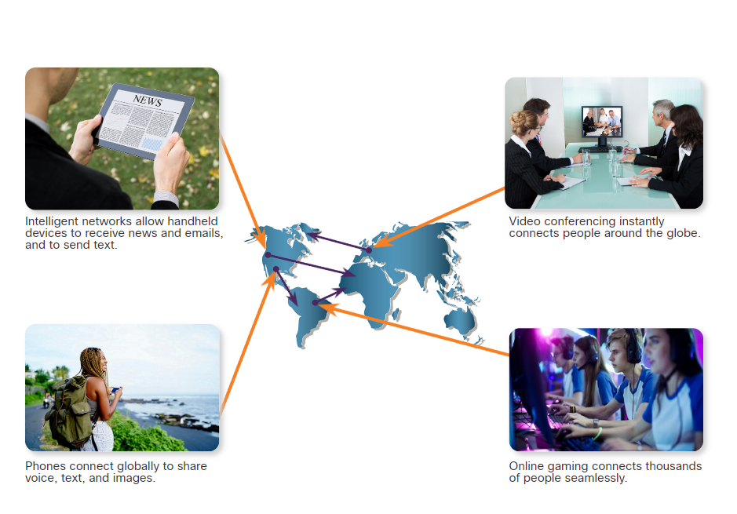

[Cisco Module 1 - Mạng cơ bản, thông tin liên lạc trong thế giới kết nối lẫn nhau](#module1_intro)

- [1.0 - Loại mạng (:heavy_plus_sign: UPDATED 25/03/2024)](#network_types)
    - [1.0.1 - Mọi thứ đều trực tuyến (:heavy_plus_sign: UPDATED 25/03/2024)](#online_intro)
    - [1.0.2 - Ai sở hữu Internet? (:heavy_plus_sign: UPDATED 25/03/2024)](#internet_owner)
    - [1.0.3 - Mạng cục bộ (:heavy_plus_sign: UPDATED 25/03/2024)](#local_network)
    - [1.0.4 - Thiết bị di dộng (:heavy_plus_sign: UPDATED 25/03/2024)](#mobile_device)
    - [1.0.5 - Các kết nối trong thiết bị gia đình (:heavy_plus_sign: UPDATED 25/03/2024)](#connected_home_dev)
    - [1.0.6 - Các thiết bị kết nối khác (:heavy_plus_sign: UPDATED 25/03/2024)](#other_connected_dev)
- [1.1 - Truyền dữ liệu (:heavy_plus_sign: UPDATED 25/03/2024)](#data_transmition)
    - [1.1.1 - Các loại dữ liệu cá nhân (:heavy_plus_sign: UPDATED 25/03/2024)](#types_persional_data)
    - [1.1.2 - Bit (:heavy_plus_sign: UPDATED 25/03/2024)](#the_bit)
    - [1.1.3 - Phương pháp phổ biến truyền tải dữ liệu (:heavy_plus_sign: UPDATED 25/03/2024)](#common_method_data_transmission)
- [1.2 - Băng thông và thông lượng (:heavy_plus_sign: UPDATED 25/03/2024)](#bw_tp)
    - [1.2.1 - Băng thông (:heavy_plus_sign: UPDATED 25/03/2024)](#bandwidth)
    - [1.2.2 - Thông lượng (:heavy_plus_sign: UPDATED 25/03/2024)](#throughput)
- [1.3 - Thông tin liên lạc trong thế giới kết nối lẫn nhau (:heavy_plus_sign: UPDATED 25/03/2024)](#intro_summary)

# Cisco Module 1 - Mạng cơ bản, thông tin liên lạc trong thế giới kết nối lẫn nhau

## Loại mạng

### Mọi thứ đều trực tuyến

Có bao nhiêu người trong chúng ta băn khoăn về việc liệu bản thân có đang trong trạng thái trực tuyến? Chúng ta kỳ vọng mọi thiết bị như điện thoại, máy tính bảng, máy tính xách tay luôn được kết nối tới mạng toàn cầu. Mọi người sử dụng mạng để tương tác với bạn bè, cửa hàng, chia sẻ hình ảnh, kiến thức và kinh nghiệm. `Internet` trở thành một phần cuộc sống hằng ngày đến mức chúng ta xem nó là điều hiển nhiên. Thông thường khi mọi người sử dụng thuật ngữ `Internet`, họ không đề cập đến các kết nối vật lý trong thế giới thực. Thay vào đó, mọi người có xu hướng nghĩ nó là một kết nổi ảo không có hình dạng, cái nơi mà mọi người đến để tìm kiếm và chia sẻ thông tin.

### Ai sở hữu Internet?

`Internet` không thuộc sở hữu của cá nhân hay tổ chức nào. `Internet` là một tập hợp các mạng được kết nối với nhau trên toàn thế giới, nó được viết tắt của `Internetwork`, chúng hợp tác với nhau để chia sẻ thông tin bằng cách sử dụng một tiêu chuẩn chung. Người dùng internet có thể trao đổi thông tin với nhiều hình thức khác nhau hay còn gọi là môi trường truyền dẫn, ví dụ như: cáp quang, dây điện thoại, đường truyền không dây hoặc thông qua vệ tinh.

### Mạng cục bộ

Mạng cục bộ đề cập đến nhiều yếu tổ, không hẳn thuộc về kích thước vì nó có thể được triển khai ở mọi hình dạng. Mô hình đơn giản có thể liên tưởng từ 2 máy tính hoặc lớn hơn là mạng kết nối hàng trăm thiết bị. Mạng cục bộ được thiết lập ở văn phòng và nhà riêng, chúng được gọi là `SOHO (Small Office/Home Office)`. Mạng SOHO cho phép bạn chia sẻ tài nguyên như máy in, tài liệu, hình ảnh, nhạc giữa các người dùng cục bộ.

Trong kinh doanh thường sử dụng những mạng lưới lớn để phục vụ quảng cáo, bán sản phẩm, cung cấp giải pháp và liên lạc với khách hàng. Giao tiếp qua mạng hiệu quả và ít tốn kém hơn so với giao tiếp truyền thống ví dụ như gọi thoại hoặc gửi thư điện tử thay vì bay đến quốc gia người nhận để trao đổi. Lợi thế của mạng là tốc độ, bạn có thể gửi thư điện tử hoặc tin nhắn một cách tức thì. Đồng thời nó cũng cung cấp sự hợp nhất, phân quyền truy cập vào thông tin được lưu trữ trên máy chủ.

### Thiết bị di dộng

Internet thường kết nối đến thiết bị có khả năng tính toán tốt nhiều hơn là máy tính xách tay hoặc máy tính để bàn. Thay vào đó để kết nối internet người dùng có nhiều lựa chọn như:

- `Smart phone`: điện thoại thông minh có thể kết nối đến internet ở bất kỳ nơi nào. Là một thiết bị tích hợp nhiều chức năng khác nhau như bộ thu GPS, gọi thoại, máy ảnh, màn hình cảm ứng.
- `Tablet`: máy tính bảng cũng có những chức năng tương tự như `smart phone`. Đây là thiết bị lý tưởng để đọc báo hoặc xem video.
- `Smart watch`: đồng hồ thông minh có thể kết nối đến `smart phone`, cung cấp cho người dùng các tin nhắn, cảnh báo. Tích hợp các chức năng theo dõi về sức khỏe như giám sát nhịp tim, ...

### Các kết nối trong thiết bị gia đình

Nhiều thiết bị trong nhà cũng có thể được kết nối với internet để có thể giám sát và cấu hình chúng từ xa.

- `Security System`: hệ thống an ninh như camera.
- `Appliances`: thiết bị gia dụng như tủ lạnh, máy rửa chén, lò nướng, máy lạnh, ... đều có thể kết nối internet để cho phép người dùng điều khiển từ xa.
- `Smart TV`: có thể kết nối internet để truy cập nội dung mà không cần có các thiết bị của nhà cung cấp truyền hình.

### Các thiết bị kết nối khác

Ngoài ra còn có các thiết bị kết nối khác sử dụng bên ngoài nhà như:

- `Smart Car`: có rất nhiều xe hơi tân thời có thể kết nối internet và truy cập bản đồ toàn cầu. Thậm chí nó còn có các chức năng gửi thư điện tử, gửi tin nhắn và gọi hỗ trợ trong trường hợp gặp tai nạn.
- `RFID Tag`: viết tắt của `Radio frequence indentication (RFIDs)` - thẻ định danh tần số vô tuyến. Nhờ vào khả năng đọc xuyên qua nhiều vật liệu hoặc điều kiện môi trường đặc biệt như bê tông, băng đá, tuyết, ... nên chúng được sử dụng để tìm kiếm, theo dõi hoặc xác minh.
- `Sensor`: cảm biến cung cấp dữ liệu về nhiệt độ, độ ẩm, tốc độ của gió, áp suất khí quyển, ... Thường kết hợp với `actuator` để kích hoạt hành động khi đạt ngưỡng quy định. Ví dụ: theo dõi độ ẩm của đất để thực hiện tưới nước hoặc ngừng tưới nước.
- `Medical Devices`: thiết bị y tế như máy tạo nhịp tim và những thiết bị khác liên quan đến cảnh báo dấu hiệu sinh tồn.

## Truyền dữ liệu

### Các loại dữ liệu cá nhân

Chúng ta nghe về từ khóa `data` rất nhiều, cụ thể hơn là trong môi trường mạng máy tính. Chúng ta nghe về sự di chuyển của `data`, `data` được truy cập, `data` được lưu trữ và thậm chí chúng ta nghe về `big data` là cái được lưu trữ ở đâu đó trên cloud. Vậy chính xác `data` là gì? 

`Data` là dữ liệu thể hiện ở dạng thô, chung chung. Ngược lại, `information` là dữ liệu được mô tả cụ thể trong bối cảnh nào đó. Có những dạng `data` khác nhau như:

- `Volunteer data`: dữ liệu mà người dùng tự nguyện cung cấp. Dữ liệu được thu thập từ người dùng và chính họ đồng ý chia sẻ hoặc lưu trữ ở nơi nào đó trong mạng.
- `Inferred data`: loại dữ liệu được thu thập từ chính người dùng nhưng nhưng thông thường người dùng không nhận ra, nó được tạo ra từ những hoạt động của người dùng. Ví dụ như thẻ tín dụng, mọi nơi mà bạn sử dụng như cửa hàng ăn uống hoặc trung tâm mua sắm đều sẽ được lưu lại. Cụ thể hơn, hôm nay bạn ở Ba Lan và sử dụng máy ATM, sau đó bạn di chuyển sang Phần Lan vì vậy hiện giờ ngân hàng đã có dữ liệu cho thấy sự di chuyển của bạn, dữ liệu này được lưu trữ tại ngân hàng và công ty xử lý thẻ tín dụng. Dữ liệu này tồn tại, được cung cấp thậm chỉ ngay cả khi người dùng không tình nguyện.
- `Observed data`: ví dụ như điện thoại luôn cung cấp về vị trí của người dùng nếu họ kích hoạt dịch vụ.

### Bit

Rất khó để tưởng tượng rằng tất cả dữ liệu được lưu trữ và truyền tải dưới dạng chuỗi `bit`. Mỗi `bit` đều chỉ có một trong hai trạng thái: `0` hoặc `1`. Thuật ngữ `bit` viết tắt cho `binary digit` - chữ số nhị phân, và cung ám chỉ loại đơn vị và phần dữ liệu nhỏ nhất.

`Bit` được lưu trữ hoặc truyền tải với một trong hai trạng thái một cách rời rạc. Mỗi thiết bị đầu vào (bàn phím, chuột, đầu thu âm thanh) sẽ được truyền tải thành mã nhị phân để CPU có thể xử lý và lưu trữ. Ngược lại, mỗi thiết bị đầu ra (máy in, loa, màn hình) sẽ lấy dữ liệu nhị phân và dịch nó sang dạng con người có thể hiểu. Mỗi nhóm 8 bit được gọi là `byte`.

### Phương pháp phổ biến truyền tải dữ liệu

Sau khi dữ liệu được biến đổi thành chuỗi bit, nó phải được `convert` dạng tín hiệu có thể truyền đi được đến nơi nhận tùy thuộc môi trường truyền dẫn: cáp quang, dây đồng và sóng điện từ trong không khí. Các mẫu đại diện cho `bit` được truyền đi có thể là xung ánh sáng, xung điện hoặc sóng vô tuyến. Vì có thể có nhiều thiết bị trung gian xử lý trong mối trường truyền dẫn nên tín hiệu có thể được `convert` nhiều lần.

- `Electrical signals`: biểu diễn dữ liệu dưới dạng xung điện trên dây đồng.
- `Optical signals`: biểu diễn dữ liệu ở dạng xung ánh sáng trong cáp quang.
- `Wireless signals`: biểu diện ở dạng sóng hồng ngoại, vi sóng hoặc sóng vô tuyến.

## Băng thông và thông lượng

### Băng thông

Để hộ trợ cho các trường hợp cần băng thông cao như khi xem phim trực tuyến hoặc tựa game nhiều người chơi thì yêu cầu thời gian thực, kết nối nhanh vì vậy mạng phải có khả năng truyền và nhận bit ở tốc độ cao. Các môi trường truyền dẫn khác nhau hỗ trợ truyền bit ở tốc độ khác nhau. Tốc độ truyền dữ liệu đề cập đến cả băng thông và thông lượng.

Băng thông mô tả khả năng tối đa của phương tiện truyền tải dữ liệu. Băng thông là đơn vị kỹ thuật số đo lường dữ liệu có thể truyền từ nguồn tới nơi nhận trong một khoảng thời gian nhất định. Mặc định băng thông được đo bằng `bit` như: `Kbps`, `Mbps`, `Gbps`. Các đặc tính của phương tiện vật lý, công nghệ và các định luật vật lý đều góp phần xác định băng thông.

### Thông lượng

Giống như băng thông, thông lượng là thước đo việc truyền bit qua phương tiện trong một khoảng thời gian nhất định. Tuy nhiên do một số yếu tố nên thông lượng sẽ thấp hơn băng thông như:

- Sự cản trở của loại phương tiện truyền dẫn. Ví dụ thắt cổ chai, cổng mạng có băng thông khả năng đạt đến 1Mbps nhưng phương tiện trung gian chỉ đáp ứng được 2Kbps.
- Độ trì hoãn và thời gian phản hồi. Ví dụ có 2 người cần sử dụng máy in với thời gian xử lý mỗi lần là `10s`, người đầu tiên có thời gian trì hoãn là `0s` và thời gian nhận kết quả là `10s`, người sau bị trì hoãn là `10s` và mất thêm `10s` để máy in xử lý. Như vậy người cuối phải cần `20s` để nhận được kết quả/phản hồi.