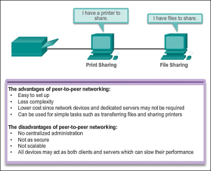

[Cisco Module 2 - Các thành phần trong mạng, loại của chúng và các kết nối ( :heavy_plus_sign: UPDATED 25/03/2024)](#module2_intro)

- [2.0 - Vai trò máy khách và máy chủ ( :heavy_plus_sign: UPDATED 25/03/2024)](#server_client_role)
    - [2.0.1 - Giới thiệu ( :heavy_plus_sign: UPDATED 25/03/2024)](#server_client_intro)
    - [2.0.2 - Mạng P2P ( :heavy_plus_sign: UPDATED 25/03/2024)](#p2p_network)
    - [2.0.3 - Ứng dụng P2P ( :heavy_plus_sign: UPDATED 25/03/2024)](#p2p_app)
    - [2.0.4 - Các vai trò trong mạng ( :heavy_plus_sign: UPDATED 25/03/2024)](#multi_role)
- [2.1 - Các thành phần trong mạng ( :heavy_plus_sign: UPDATED 25/03/2024)](#network_component)
    - [2.1.1 - Hạ tầng mạng ( :heavy_plus_sign: UPDATED 25/03/2024)](#network_infra)
    - [2.1.2 - Thiết bị cuối ( :heavy_plus_sign: UPDATED 25/03/2024)](#end_dev)
    - [2.1.3 - Thiết bị trung gian ( :heavy_plus_sign: UPDATED 25/03/2024)](#intermediary_net_dev)
- [2.2 - LAN và WAN ( :heavy_plus_sign: UPDATED 25/03/2024)](#lan_wan)
- [2.3 - Internet ( :heavy_plus_sign: UPDATED 25/03/2024)](#internet)
- [2.4 - ISP ( :heavy_plus_sign: UPDATED 25/03/2024)](#isp)
    - [2.4.1 - Dịch vụ ISP ( :heavy_plus_sign: UPDATED 25/03/2024)](#isp_service)
    - [2.4.2 - Kết nối ISP ( :heavy_plus_sign: UPDATED 25/03/2024)](#isp_connection)
    - [2.4.3 - Công nghệ truy cập Internet ( :heavy_plus_sign: UPDATED 25/03/2024)](#internet_access_technologies)
    - [2.4.3 - Kết nối bổ sung ( :heavy_plus_sign: UPDATED 25/03/2024)](#add_connection)

# Các thành phần trong mạng, loại của chúng và các kết nối

## Vai trò máy khách và máy chủ

### Giới thiệu

Tất cả máy tính được kết nối trong mạng sẽ tham gia trực tiếp vào việc giao tiếp mạng, chúng được gọi là `host`. Các `host` đều có thể gửi và nhận thông tin trên mạng. Trong các mô hình mạng hiện nay thì `host` có thể là máy khách hoặc máy chủ hoặc đảm nhiệm cả hai. Dựa vào phần mềm được cài đặt trên `host` chúng ta có thể phân biệt nó là máy chủ hay máy khách.

Máy chủ là `host` mà có phần mềm được cài đặt để kích hoạt cung cấp thông tin (thư điện tử, nội dung web) tới một `host` khác trong mạng. Mỗi dịch vụ đều yêu cầu phần mềm máy chủ riêng. Ví dụ một máy chủ web yêu cầu cài đặt phần mềm dịch vụ web như apache, nginx, IIS (Windows). Mỗi một trang web trực tuyến mà bạn truy cập đều được cung cấp bởi máy chủ được đặt ở đâu đó trong mạng có kết nối Internet.

Máy khác là `host` cài đặt phần mềm để yêu cầu và hiển thị thông tin từ máy chủ. Ví dụ như phần mềm máy khách là trình duyệt như Internet Explorer, Safari, Chrome, Firefox, ... 

### Mạng P2P

Phần mềm máy khách và máy chủ thường chạy tách biệt ở mức `host`, nhưng nó cũng có thể được cài đặt và chạy chung `host` một cách đồng thời. Loại mạng này được gọi là `peer-to-peer (P2P)`.

Mạng P2P đơn giản nhất sẽ chỉ bao gồm 2 máy tính kết nối trực tiếp với nhau có dây hoặc không dây. Nhiều máy tính cá nhân (PCs) đều có thể kết nối với nhau để tạo ra mạng P2P lớn nhưng có thể sẽ yêu cầu thiết bị chuyển mạch như switch để kết nối các máy tính.

Vấn đề lớn nhất của môi trường P2P là hiệu suất của một `host` có thể bị chậm lại nếu nó hoạt động trên cả hai nhiệm vụ khách và chủ cùng một thời điểm. Đối với doanh nghiệp lớn, bởi vì sẽ có lúc xảy ra tình huống lưu lượng mạng bị dâng cao nên thường sẽ triển khai máy chủ chuyên dụng để hỗ trợ các yêu cầu chuyển tới.

Ưu điểm của P2P:

- Dễ dàng thiết lặp.
- Chi phí thấp bởi vì các thiết bị chuyển mạch hoặc máy chủ chuyên dụng có thể sẽ không bị yêu cầu.

Nhược điểm:

- Không quản trị tập trung.
- Kém bảo mật.
- Không thể mở rộng.
- Hiệu suất khả năng cao sẽ thấp bởi vì một PC mang cả 2 vai trò máy khách lẫn máy chủ.

### Ứng dụng P2P

Ứng dụng P2P cho phép một thiết bị tương tác như thể nó vừa là máy khách vừa là máy chủ. Ứng dụng P2P được cài đặt trên PC sẽ có giao diện vai trò máy khách lẫn dịch vụ chạy nền. Một số ứng dụng P2P chạy ở dạng lai với mô hình Client-Server, tức là nó vẫn theo nguyên tắc không tập trung tài nguyên tại một PC nào đó nhưng vẫn có chỉ mục được lưu trữ tập trung - mỗi khi cần PC sẽ truy cập vào chỉ mục đó để lấy ra vị trí tài nguyên được lưu trữ ở PC khác.

### Các vai trò trong mạng

Một máy tính có thể chạy nhiều phần mềm máy chủ. Trường hợp ở các doanh nghiệp nhỏ để tiết kiệm chi phí thì thường sẽ tích hợp nhiều dịch vụ khác nhau trên cùng một máy chủ như: File Server, Web Server, Mail Server, ...

Trường hợp phổ biến, một máy tính có thể chạy nhiều phần mềm máy khách. Với nhiều phần mềm được cài đặt như vậy thì máy tính này có thể kết nối nhiều máy chủ cùng lúc. Ví dụ bạn có thể đọc mail song song với việc lướt web trong khi đang nhắn tin, nghe nhạc trực tuyến.

## Các thành phần trong mạng

### Hạ tầng mạng

Con đường để thông tin lấy từ nguồn đến nơi nhận có thể kết nối đơn giản bằng một sợi cáp giữa máy tính với bên còn lại. Hạ tầng mạng là nền tảng để hiểu về mạng máy tính. Nó cung cấp sự ổn định và quy tắc chặt chẽ đáng tin cậy để sự thông liên lạc của chúng ta diễn ra mượt mà.

Hạ tầng mạng chứa 3 loại thành phần phần cứng:

- `End device`: thiết bị cuối.
- `Intermediate device`: thiết bị trung gian.
- `Network media`: phương tiện truyền dẫn, môi trường truyền dẫn.

Các thiết bị và phương tiện đều là các yếu tố vật lý trong mạng. Phần cứng thường là các thành phần có thể thấy được như máy tính xách tay, PC, switch, router hoặc cáp mạng để kết nối. Thi thoảng sẽ có một số thành phần không nhìn thấy được như môi trường truyền dẫn không dây, các thông tin được truyền tải thông qua không khí sử dụng tần số vô tuyến hoặc sóng hồng ngoại.

### Thiết bị cuối

Các thiết bị mạng mà người dùng quen thuộc được gọi là `device` hoặc `host`. Những thiết bị này cung cấp giao diện tương tác giữa người dùng và mạng. Một số ví dụ về thiết bị cuối như sau:

- Máy trạm, máy tính xách tay, máy chủ web.
- Máy in.
- Điện thoại bàn.
- Camera.
- Thiết bị di động như điện thoại thông minh, máy tính bảng, thẻ tín dụng.

Thiết bị cuối có thể là nơi phát sinh hoặc nhận thông tin trong mạng. Sử dụng địa chỉ để nhận dạng các thiết bị. Khi một `host` khởi tạo một kênh liên lạc, nó cần có địa chỉ của `host` nhận để chỉ định cho thông tin biết nó cần gửi tới đâu.

### Thiết bị trung gian

Được dùng để kết nối các thiết bị cuối. Ví dụ các thiết bị trung gian có thể được sử dụng để kết nối các máy chủ riêng lẻ và kết nối nhiều mạng riêng lẻ tạo tạo thành mạng lưới lớn hơn. Một số ví dụ về thiết bị trung gian:

- `Network access`: truy cập mạng, ví dụ: switch (có dây) hoặc access point (không dây).
- `Security`: bảo mật, ví dụ: tường lửa.
- `Internetworking`: để kết nối các mạng khác nhau, ví dụ: router hay còn gọi là thiết bị định tuyến.

Quản lý dữ liệu khi nó truyền thông qua mạng cũng là vai trò của thiết bị trung gian. Các thiết bị trung gian điều khiển đường dẫn của dữ liệu nhưng không tạo ra hay thay đổi nội dung dữ liệu. Các thiết bị này sử dụng địa chỉ của máy nhận, cùng với thông tin về kết nối mạng để xác định đường dẫn mà các dữ liệu sẽ đi qua. Các quy trình chạy trên thiết bị trung gian thực hiện các chức năng sau:

- Tái tạo và truyền lại tín hiệu dữ liệu.
- Duy trì thông tin về những đường dẫn tồn tại trong mạng và liên mạng.
- Thông báo cho các thiết bị khác về lỗi giao tiếp.
- Truyền dữ liệu theo các đường thay thế khi có lỗi liên kết.
- Phân loại và gửi dữ liệu trực tiếp dựa trên QoS.
- Cho phép hoặc từ chối luồng dữ liệu dựa trên cấu hình.

## LAN và WAN

Cơ sở hạ tầng mạng khác nhau rất nhiều về:

- Quy mô phủ sóng.
- Số lượng người dùng kết nối.
- Số lượng và loại dịch vụ cung cấp.

`Local-area network (LAN)`: loại hạ tầng mạng cung cấp truy cập cho người dùng và thiết bị cuối ở trong khu vực địa lý. Mạng `LAN` kết nối trong một khu vực giới hạn như nhà riêng, trường học, tòa nhà văn phòng hoặc khuôn viên trường học, nó được quản lý bởi tổ chức nhỏ hoặc cá nhân. Ngoài ra `LAN` cung cấp băng thông tốc độ cao cho các thiết bị nội bộ. Trong khi đó `Wide-area network (WAN)` cung cấp truy cấp đến những mạng nằm bên ngoài khu vực, được quản lý bởi nhiều IS (nhà cung cấp dịch vụ) hoặc ISP (nhà cung cấp dịch vụ internet). Các tính năng cụ thể của `WAN` bao gồm kết nối các mạng `LAN` thành khu vực phủ sóng rộng lớn. Về tốc độ thì `WAN` chậm  hơn `LAN` rất nhiều. Các loại không phổ biến khác như:

- `Metropolitan-area network (MAN)`: trải rộng trên một khu vực địa lý lớn hơn mạng `LAN` nhưng nhỏ hơn `WAN`, ví dụ như thành phố. `MAN` thường được kiểm soát bởi các tổ chức lớn.
- `Wireless LAN (WLAN)`: tương tự như `LAN` nhưng kết nối không dây giữa người dùng và thiết bị cuối.
- `Storage-are network (SAN)`: cơ sở hạ tầng mạng được thiết kế để hỗ trợ các máy chủ tệp tin, cung cấp khả năng lưu trữ, truy xuất và sao chép dữ liệu. Nó liên quan đến các máy chủ cao cấp, sử dụng nhiều ổ cứng và công nghệ kết nối tốc độ cao như quang.

## Internet

Thông qua các lợi ích của việc sử dụng LAN và WAN, hầu hết các cá nhân cần liên lạc với các tài nguyên ở một mạng khác, nằm ngoài mạng cục bộ ví dụ như nhà riêng, tổ chức. Khái niệm `Internet` ra đời, nó là một tập các mạng lưới kết nối với nhau trên toàn thế giới, trao đổi với nhau tuân thủ theo tiêu chuẩn chung. Thông qua tất cả phương tiện truyền dẫn như cáp quang, đường truyền không dây, ... người dùng internet có thể trao đổi thông tin dưới nhiều hình thức khác nhau như dạy học, xem video, chơi game, nghiên cứu, nghe nhạc.

`Internet` là một tập các mạng và không thuộc sở hữu của bất kỳ cá nhân hay tổ chức nào. Việc đảm bảo truyền tải hiệu quả và ổn định trên sự đa dạng về cơ sở hạ tầng đòi hỏi phải áp dụng các công nghệ, tuân thủ nghiêm ngặt tiêu chuẩn nhất quán và được công nhận rộng rãi. Các tổ chức được thành lập có chuyên môn duy trì cấu trúc, tiêu chuẩn hóa các giao thức, quy trình và cải thiện. Những tổ chức lớn được đề cập như [IETF](#https://www.ietf.org/), [ICANN](#https://www.icann.org/), [IAB](#https://www.iab.com/).

<i>Lưu ý: thuật ngữ `internet` (chữ i) chỉ đơn giản là mô tả nhiều mạng kết nối với nhau. Khi đề đến sự toàn cầu hóa của các mạng máy tính được kết nối với nhau, ví dụ sử dụng WWW thì thuật ngữ `Internet` (chữ I) được sử dụng.</i>

Có hai loại thuật ngữ khác tương tự với `Internet` như

- `Intranet` thường được sử dụng để đề cập đến kết nối riêng tư của mạng LAN và WAN thuộc về một tổ chức, cái mà chỉ được truy cập bởi các thành viên trong tổ chức hoặc những người khác nếu được ủy quyền. `Intranet` cơ bản là một mạng internet được sử dụng truy cập ở bên trong tổ chức. Các tổ chức xuát bản các trang web trên intranet về những sự kiện nội bộ, ví dụ như chính sách sức khỏe và an toàn, bản tin nhân viên và danh bạ điện thoại liên lạc của họ. Trường học cũng có thể có intranet bao gồm thông tin lịch học, chương trình giảng dạy, diễn đàn thảo luận và thông tin về giảng viên. Khi nhân viên làm việc ngoài vẫn có thể truy cập vào mạng nội bộ bằng cách sử dụng các kết nối an toàn.
- `Extranet` tương tự như `intranet`, thuật ngữ này trở nên phổ biến vào những năm 2000 khi một số tổ chức sử dụng nó để mô tả kho lưu trữ được chia sẻ mà chỉ các thành viên của tổ chức khác được ủy quyền mới có thể truy cập một cách an toàn và bảo mật. Ví dụ khác như ứng dụng trong việc duy trì liên lạc giữa nhà cung cấp và nhà phân phối, hợp tác chéo giữa các cơ quan chính phủ khác nhau.

## ISP

### Dịch vụ ISP

Nhà cung cấp dịch vụ Internet - Internet Service Provider cung cấp một kết nối giữa mạng nhà và internet. Rất nhiều ISP còn cung cấp thêm một số dịch vụ khác như email, web, backup, bảo mật. ISP rất quan trọng trong việc làm cầu nối liên lạc đến internet toàn cầu. Mỗi ISP sẽ liên kết với các ISP khác để tạo thành một mạng lưới kết nối người dùng toàn cầu. Để đảm bảo lưu lượng được di chuyển trên con đường ngắn nhất từ nguồn đến nơi nhận thì ISP được kết nối với nhau theo mô hình phân cấp.

Trục internet giống một xa lộ thông tin khổng lộ cung cấp các liên kết dữ liệu tốc độ cao để kết giữa các mạng lưới ISP khác nhau. Phương tiện chính của trục internet là cáp quang. Cáp này thường được lắp đặt dưới lòng đất để kết nối các thành phố, quốc gia và châu lục.

### Kết nối ISP

Sự kết nối của các ISP khác nhau tạo thành xương sống của internet là một mạng lưới cáp quang vô cùng phức tạo với các thiết bị chuyển mạch/định tuyến đắt tiền để kiểm soát luồng thông giữa các máy chủ. Thường thì người dùng cá nhân sẽ không quan tấm đến cơ sở hạ tầng bên ngoài. Đối với các hộ gia đình thì việc kết nối với ISP là một quá trình đơn giản.

Phần trên cùng của hình hiển thị kết nối ISP đơn giản nhất. Chỉ bao gồm `modem` kết nối trực tiếp giữa máy tính và ISP. Tuy nhiên tùy chọn này không nên được sử dụng vì máy tính không được bảo vệ trên internet. Phần phía dưới hành có `router` (bộ định tuyến) để kết nối máy tính với ISP một cách an toàn. Đây là tùy chọn kết nối phổ biến nhất. `router` bao gồm `switch` để kết nối các `host` có dây trong hộ gia đình và được tích hợp `Access Point` hỗ trợ cho các `host` có nhu cầu kết nối không dây.

### Công nghệ truy cập Internet

DSL và cáp đồng trục là hai phương pháp kết nối đến ISP mà không cần sử dụng các dịch vụ chuyên dụng đắt tiền như Frac-T1/T1. Cả hai đều đạt được kết quả tương đương nhau, chúng có một số sự khác biệt.

`DSL - Digital Subscriber Line` là công nghệ modem sử dụng đường dây điện thoại kết cấu dây đồng xoắn đôi để mang lại băng thông ứng dụng tốc độ cao như xem trực tuyến video hoặc chơi game thời gian thực. Thuật ngữ `xDSL` bao gồm một số công nghệ `DSL` chẳng hạn như:

- `ADSL (Asymmetrical Digital Subscriber Line)`: bất đối xứng băng thông giữa tải về và tải lên từ phía người dùng. Giá thành rẻ và phổ biến hơn `SDSL`.
- `SDSL (Symmetrical Digital Subscriber Line)`: một phiên bản khác của `HDSL`, băng thông bằng nhau giữa tải về và tải lên từ phía người dùng.
- `Hi-Speed Digital Subscriber Line (HDSL)`: được phát triển bởi [Belcore](#https://bellcore.com.au/), công nghệ tốc độ cao T1/E1 được chuẩn hóa [ANSI](#https://www.ansi.org/) của Hoa kỳ và [ETSI](#https://www.etsi.org/) của Âu Châu.
- `ISDN Digital Subscriber Line (IDSL)`.
- `Very-High-Data-Rate Digital Subscriber Line (VDSL)`: chủ yếu truyền băng thông cao trong phạm vi ngắn, 

Dịch vụ `xDSL` được triển khai giữa nhà cung cấp dịch vụ mạng và địa điểm của bạn, chúng cũng có thể được triển khai trong khuôn viên trường học hoặc nội bộ tòa nhà văn phòng. `xDSL` cung cấp hai lợi ích chính so với `Dial-Up Telephone`:

- `Dial-Up` bị giới hạn ở băng thông 53.3 Kbps, được đánh giá là rất thấp so với thời điểm hiện tại mặc dù nó phổ biến nhất trong những thập niên 1990.
- `Dial-Up` khởi tạo kết nối theo yêu cầu của khách hàng, tức là bạn phải gọi đến số của ISP để nhận được sự cho phép kết nối internet. Thay vào đó `xDSL` luôn luôn sẵn sàng cho việc kết nối internet.

`ADSL` thường được triển khai trong môi trường `SOHO` và là dịch vụ truyền thống khi triển khai tại khu dân cư. Sự bất xứng được nhắc đến trong `ADSL` nhắm tới việc môi trường này có phần nhỏ băng thông `upstream` được sử dụng bởi các yêu cầu truy cập internet, ví dụ như duyệt web. Ngược lại, nhu cầu `downstream` rất lớn ví dụ như tải về rất nhiều gói tin. Công nghệ này tạo ra nhiều băng thông cho `downstream` hơn là `upstream`, cái mà ngược lại với công nghệ `SDSL`. Giải pháp này là một sự lựa chọn tốt để lướt web, mạng nội bộ, xem video trực tuyến hoặc truy cập từ xa bởi vì người dùng các ứng dụng có nhu cầu tải xuống nhiều hơn tải lên.

Đường dây này có ba kênh dữ liệu:

- Kênh `downstream` tốc độ cao: phạm vi từ 1.5 đến 9 Mbps.
- Kênh `upstream` tốc độ thấp: phạm vi từ 16 đến 640 Kbps.
- Kênh thoại cơ bản: vì được tách ra khỏi kênh truyền internet nên sẽ không bị gián đoạn khi sử dụng đồng thời gọi thoại và truy cập internet.

Giải pháp phổ biến khác là cáp đồng trục hay còn gọi là `Cable`. Truyền hình cáp (CATV) là phương tiện một chiều mang các kênh video tín hiệu analog phát sóng đến nhiều khách hàng nhất có thể với chi phí thấp nhất. Kể từ khi CATV được giới thiệu vào hơn 50 năm trước, cho đến nay không được ghi nhận những cải tiến vượt bậc. Vào những năm 1990, CATV đã nhận thức được ưu điểm vượt bậc của DSL khi vừa được giới thiệu. CATV đã định hướng cải tiến để duy trì hiệu quả kinh tế bằng cách khai thác mọi công nghệ để cho ra sản phẩm có khả năng cung cấp dịch vụ dựa trên cơ sở hạ tầng CATV sẵn có. Để giải quyết vấn đề này, công ty `Multimedia Cable Network Parters, Ltd (MCNS)` được thành lập, họ có nhiệm vụ xác định chương trình xây dựng và nâng cấp để cung cấp chức năng hai chiều cho khách hàng qua cơ sở CATV.

### Kết nối bổ sung

Một số tùy chọn kết nối ISP khác dành cho hộ gia đình như:

- `Dial-up Telephone`: công nghệ cũ được sử dụng phổ biến vào những năm 1990. Để kết nối đến ISP bạn cần gọi đến ISP. Tốc độ rất chậm chỉ tầm 56(Kbps) và thậm chí chúng sử dụng chung kênh truyền thoại và internet, hậu quả là bạn không thể đồng thời sử dụng điện thoại và internet. Cho tới ngày nay vẫn còn một số người sử dụng loại hình này.
- `Cellular`: sử dụng mạng di động để kết nối. Bất cứ nơi nào bạn có thể nhận được tín hiệu di động thì đều có thể truy cập internet. Hiệu suất phụ thuộc vào điện thoại và tháp phát tín hiệu mà nó kết nối. Lợi ích của dịch vụ này dành cho những khu vực không thể kéo mạng đến được hoặc thường xuyên di chuyển. Nhược điểm là nhà mạng đo mức sử dụng để tính phí.
- `Satellite`: một tùy chọn tốt thay thế cho DSL hoặc cáp đồng trục. Yêu cầu môi trường ít bị cản trở bởi cây cối hoặc những nơi có vật cản trên cao. Chi phí lắp đặt khá cao nhưng giống như kết nối `cellular` nó mang lại lợi ích đặc biệt của truy cập không dây.

Ở các khu vực đô thị, nhiều căn hộ và văn phòng được kết nối trực tiếp bằng cáp quang. Điều này cho phép ISP cung cấp tốc độ cao hơn, hỗ trợ dịch vụ tốt hơn và cung cấp nhiều dịch vụ hơn. Việc lựa chọn kết nối tùy thuộc vào vị trí địa lý và tính khả dụng của nhà cung cấp dịch vụ.