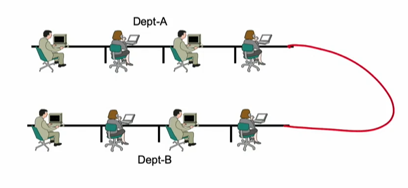
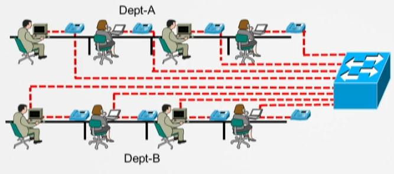
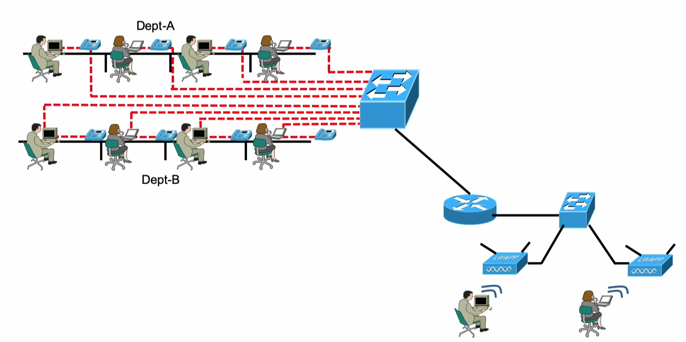
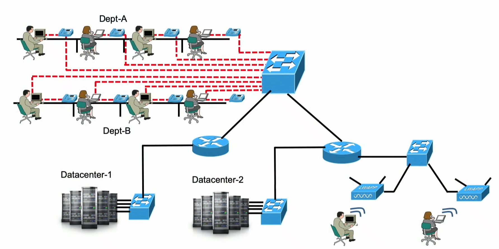
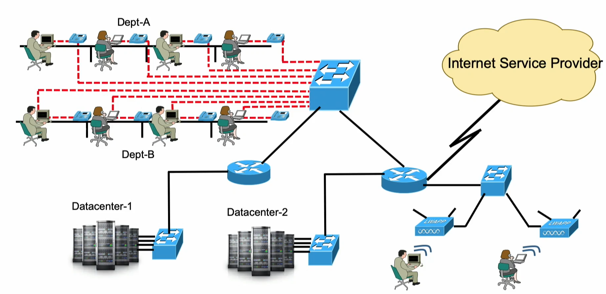

[INE - 1. Mạng máy tính là gì?](#ine_1_what_is_computer_network)

:pushpin: Nên đọc 2 module cisco trước phần này vì một số khái niệm bị lược bỏ để tránh trùng lặp như: LAN, WAN, internet, Internet.

# 1. Mạng máy tính là gì?

Vào hơn 50 năm trước khi mọi người đều có máy tính bàn, xách tay của riêng mình và mọi thứ đều lưu trữ cục bộ. Hay nói cách khác là không có mạng. Mọi thứ mà người dùng có thể làm là đánh máy, đặt hẹn, ... làm tất cả mọi thứ trên máy tính cá nhân. Và nếu như có nhu cầu trao đổi dữ liệu với một máy tính khác thì cần sử dụng cái mà gọi là [sneakernet](https://en.wikipedia.org/wiki/Sneakernet). Về mặt cơ bản thì `sneakernet` là sử dụng một ở cứng rời gọi là `floppy disk`, sao chép dữ liệu vào đó từ máy tính cá nhân và cầm chúng mang đến máy tính cần dữ liệu. Mạng máy tính thường được mọi người nghĩ đến là một thứ phức tạp nhưng về mặt kỹ thuật thực sự chúng không có gì khác ngoài kết nối giữa 2 hoặc nhiều máy tính với nhau thông qua môi trường truyền dẫn. Ngày nay hầu hết mô hình mạng lớn hơn rất nhiều nhưng nó vẫn được cấu tạo từ phần cứng như dây, mô-đun mạng, thiết bị chuyển mạch, phần mềm để trao đổi thông tin giữa các máy chủ, máy tính cá nhân, điện thoại. Vào thời điểm đó người dân có điện thoại bàn, chúng liên kết với nhau tạo thành một thể loại mạng của riêng mình. Điện thoại bàn kết nối với công ty viễn thông, nhưng xét về định nghĩa về mạng máy tính thì đây chưa phải là dữ liệu mạng vì chúng chỉ cho phép gọi thoại. Vào thời điểm đó, các nhà khoa học bắt đầu suy nghĩ về việc tận dụng tất cả những lợi thế của điện thoại bàn để mang dữ liệu mạng máy tính như duyệt web, xem lịch.

Phân biệt một số từ khóa thông dụng cơ bản:

- Host: diễn tả một thiết bị có dữ liệu, nó có thể chuyển hoặc nhận dữ liệu. Ngắn gọn là thiết bị cuối như máy tính cá nhân, điện thoại.
- Node: Về mặt kỹ thuật `node` là bất cứ thứ gì kết nối đến mạng máy tính, bao gồm luôn cả khái niệm về `host`. Nó không chỉ là thiết bị cuối giống như máy tính hay điện thoại mà còn là switch, router, tường lửa. Nhưng đặc biệt switch, router, tường lửa không được gọi là `host`.
- Remote resource: ví dụ khi người dùng truy cập vào một trang web thì máy chủ lấy dữ liệu của mình gửi về. Mạng máy tính được thiết kế để cho phép mọi người truy cập dữ liệu từ xa.

`Sneakernet` tỏ ra không thực sự hiệu quả với nhu cầu và tốc độ phát triển mạng nhanh chóng. Các nhà khoa học ban đầu kết nối các thiết bị cá nhân của người dùng thông qua dây dẫn truyền tín hiệu điện. Hình trên mô tả 2 phòng dự án tách rời mạng với nhau, tái sử dụng giải pháp dây dẫn để kết nối cả 2 phòng và họ có thể trao đổi thông tin với nhau. Đây là phương pháp mạng đầu tiên ra đời sử dụng chia sẻ dây dẫn, tức là tại một thời điểm chỉ có một người được đáp ứng. Giống với tình hình có rất nhiều người trong buổi họp, nếu như mọi người đều nói thì người nghe rất khó theo dõi nội dung mà họ muốn vì thế chỉ có một người được nói và những người còn lại sẽ giữ im lặng. Vấn đề sẽ phát sinh khi có nhiều người có nhu cầu, tưởng tượng khi bạn đang muốn nói một điều gì đó nhưng bị cắt ngang bởi một người khác thì đây gọi là xung đột (collision).

Thay vì mọi người sử dụng chung dây dẫn duy nhất thì giờ đây mỗi người sẽ có mỗi dây dẫn và cùng kết nối vào thiết bị chuyển mạch gọi là `bridge`, ngày nay thường được gọi là `switch`. Ý tưởng này rõ ràng mang lại kết quả vượt trội hơn. Mọi người đều có thể nói bất cứ khi nào họ muốn mà không bị gián đoạn. Thậm chí `switch` còn thông minh hơn ở điểm nó có thể nhận biết được thông tin đến từ đâu và muốn đến nơi nào, điều này đã tạo ra tính riêng tư cho mỗi cuộc trò chuyện.

Hình ảnh trên mô tả 2 người đang kết nối không dây thông qua thiết bị `Access Point (AP)` và họ muốn trao đổi thông tin với nhóm người phía trên. Vẫn sử dụng phương pháp cũ kết nối giữa hai `switch` là điều hoàn toàn có thể làm được nhưng lúc này quản trị viên phát sinh thêm nhu cầu, họ nhận thức được quy mô và cần giải pháp nào đó để phân chia một cách lô ríc cho dễ quản lý. Ví dụ thiết bị của một người nào đó được kết nối vào mạng thì không chỉ có thông tin nó được kết nối bằng có dây hoặc không dây, mà còn mô tả nó nằm trong phần nào của mạng, bộ phận hoặc phòng ban nào trong công ty. Ví dụ: phòng kế toán có thể trao đổi thông tin với phòng nhân sự nhưng không thể trao đổi với bộ phận khác. Để làm được như vậy thiết bị đó gọi là `router`.

Quay trở lại với câu chuyện `sneakernet`, khi có yêu cầu lấy tệp dữ liệu từ một người nào đó với mô hình hàng ngàn nhân viên thì điều này trở nên phức tạp. Ta cần biết được người đó hôm nay có làm việc hay không, máy tính của họ có đang hoạt động không vì đây chính là điều kiện tiên quyết để lấy dữ liệu nhưng lại bị phụ thuộc vào một cá nhân không chịu trách nhiệm về việc đó. Kết hợp với tính năng việc phân nhóm và bảo mật của `router`, các kỹ sư nghĩ ra giải pháp tập trung và lưu dữ liệu vào một chỗ gọi là `datacenter`. Nơi đây chứa những máy tính luôn trong tình trạng hoạt động ngày đêm, có thể đáp ứng được nhiều yêu cầu hơn một chiếc laptop, dữ liệu được bảo đảm toàn vẹn dựa trên an ninh vật lý. Mọi người trong công ty có thể gửi dữ liệu vào đây hoặc tải dữ liệu về.

Mô hình ảnh trên gọi là `Local Area Network (LAN)`. Có một thứ hay hơn để giúp cho nhân viên đang làm ở một quốc gia khác có thể truy cập dữ liệu gọi là `internet`, chú ý chữ `i` viết thường được nhắc ở 2 module cisco. `internet` còn có cái tên khác là `interconnect of network`, tức là kết nối nhiều mạng lại với nhau. Mạng trong nhà chúng ta được kết nối hoặc là một phần của `internet`. Mạng trong công ty là một mạng khác cũng được kết nối vào `internet`. Có rất nhiều người gọi sử dụng từ `World Wide Web (WWW)` để mô tả một mạng nhện khổng lồ kết nối rất nhiều mạng lại với nhau nhưng thường kỹ sư mạng không dùng từ này, chỉ đơn giản gọi nó là `internet`. Mạng ở nhà chúng ta cũng cần kết nối vào đó nên chúng cần kết nối đến công ty cung cấp dịch vụ là `Internet Service Provider (ISP)`, ở Mỹ có các công ty phổ biến như `AT&T`, `Time Warner Cable` còn ở Việt Nam thì có `SCTV`, `VNPT`.

Phân biệt một số từ khóa thông dụng cơ bản:

- `Local Area Network (LAN)`: hạn chế về mặt địa lý. Tài nguyên nằm trong mạng LAN thường sẽ có khoảng cách gần, có thể tính bằng vài trăm mét hoặc vài ki-lô mét. Có một số đặc tính loại mạng này là nếu như bạn là quản trị viên thì bạn là người chịu tất cả trách nhiệm từ việc cấu hình, bảo trì cho đến sửa chữa. Điểm mạnh là băng thông trong loại mạng này rất cao.

- `Wide-area network (WAN)`: khi muốn kết nối hai mạng với nhau ở khoảng cách xa mà kinh phí hoặc luật pháp không cho phép thì lúc này chúng ta cần `WAN`. Ví dụ một văn phòng ở Bắc Kinh muốn kết nối đến văn phòng ở Thượng Hải cách xa hàng ngàn ki-lô mét, cho dù công ty có kinh phí để làm cũng sẽ bị từ chối bởi chính phủ. Các công ty `ISP` sẽ chịu trách nhiệm triển khai việc này bao gồm cấu hình, lắp đặt, bảo trì và sửa chữa.