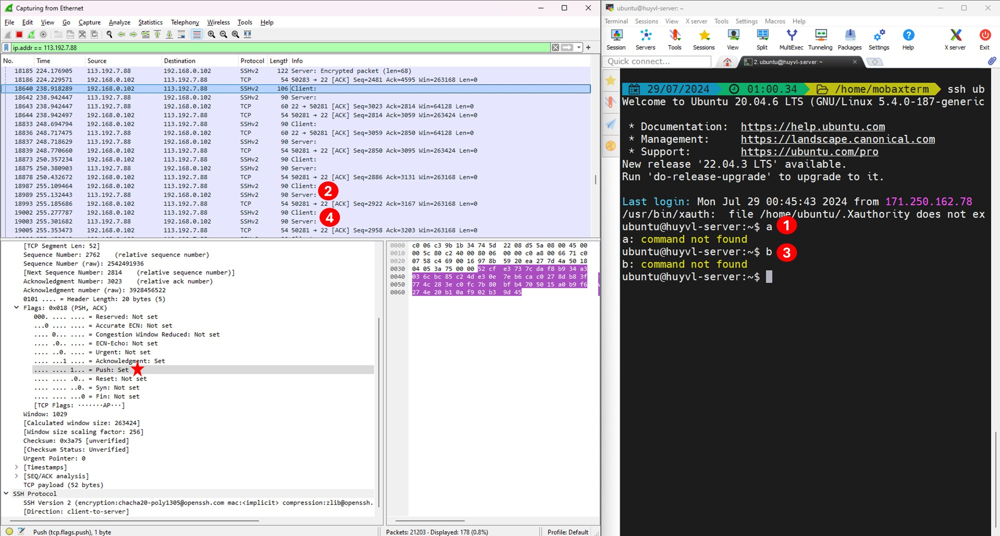
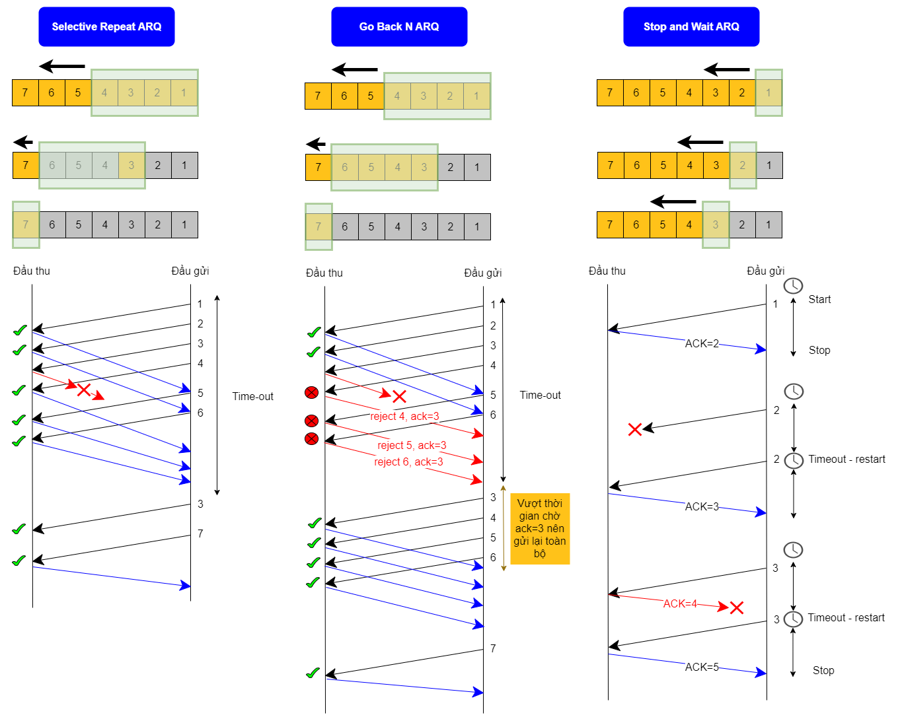

INE - 10. Tổng quan TCP ( :heavy_plus_sign: UPDATED 06/08/2024)

- [10.1 - Giới thiệu TCP ( :heavy_plus_sign: UPDATED 06/08/2024)](#ine_10_intro_tcp)
- [10.2 - Khái niệm giao thức hướng kết nối ( :heavy_plus_sign: UPDATED 06/08/2024)](#ine_10_connection_oriented)
- [10.3 - Tổng quan về cờ PSH và URG ( :heavy_plus_sign: UPDATED 06/08/2024)](#ine_10_psh_n_urg)
- [10.4 - Tổng quan kỹ thuật kiểm soát luồng ( :heavy_plus_sign: UPDATED 06/08/2024)](#ine_10_flow_control_protocols)
    - [10.4.1 - Tổng quan về Window Size vs Maximum Segment Size (MSS) ( :heavy_plus_sign: UPDATED 06/08/2024)](#ine_10_window_size_n_mss)
    - [10.4.2 - Phân biệt các loại kỹ thuật kiểm soát luồng ( :heavy_plus_sign: UPDATED 06/08/2024)](#ine_10_distinguish_types_of_flow_control)
- [10.5 - Tổng quan bắt tay 3 bước ( :heavy_plus_sign: UPDATED 06/08/2024)](#ine_10_tcp_handshake)
- [10.6 - Tổng quan kỹ thuật kiểm soát nghẽn ( :construction: UPDATED 06/08/2024)](#ine_10_congestion_control)

# 10.1 - Giới thiệu TCP

Hiện nay thế giới mạng máy tính sử dụng một mô hình mạng gọi là TCP/IP. Tuy nhiên trong quá khứ không phải đơn giản như vậy. Trong thời kỳ đen tối nhất chưa một giao thức mạng nào tồn tại bao gồm cả TCP/IP. Các hãng đã tạo ra những giao thức mạng đầu tiên và những giao thức này chỉ có thể chạy trên máy tính của họ. Ví dụ, IBM là công ty máy tính có thị trường lớn nhất ở nhiều lĩnh vực trong những năm 1970 và 1980, công ty này đã phát hành mô hình mạng `Systems Network Architecture (SNA)` vào năm 1974. Nhà cung cấp khác cũng tạo ra các mô hình mạng độc quyền của riêng họ. Kết quả là nếu như doanh nghiệp của chúng ta mua 3 máy tính từ 3 hãng khác nhau thì chúng ta sẽ có 3 mạng khác nhau dựa trên mô hình mạng của 3 hãng cung cấp, các kỹ sư mạng bằng cách nào đó kết nối chúng lại và khiến chúng trở nên phức tạp và đây chính là thời kỳ đen tối của mạng máy tính. Mặc dù mô hình mạng của hãng cung cấp hoạt động rất tốt nhưng nếu chúng ta có một mô hình mạng mở sẽ giúp giảm sự phức tạp đi nhiều. Tổ chức Tiêu chuẩn hóa Quốc tế ([The International Organization for Standardization](https://www.iso.org/)) đã đảm nhận nhiệm vụ tạo ra một mô hình như vậy bắt đầu từ cuối những năm 1970, sau đó họ tạo ra mô hình mạng [Open Systems Interconnection (OSI)](https://aws.amazon.com/what-is/osi-model/?nc1=h_ls). ISO kỳ vọng mô hình OSI cho phép giao tiếp giữa tất cả máy tính trên toàn hành tinh.

Một nổ lực khác ít chính thức hơn nảy sinh từ hợp đồng của Bộ Quốc phòng Hoa Kỳ ([U.S. Department of Defense](https://www.defense.gov/)). Vào những thập niên 1970, với tư cách là trợ lý giáo sư tại Đại học Standford ở Vương Quốc Anh, [Vint Cerf](https://engineering.stanford.edu/about/heroes/2011-heroes/vint-cerf) cộng tác với các sinh viên ưu tú nhất của mình và kỹ sư người Mỹ tên [Robert Kahn](https://www.internethalloffame.org/inductee/robert-kahn/) (hay Bob Kahn) trực thuộc Cơ quan Chỉ đạo Các Dự án Nghiên cứu Quốc phòng Tiên tiến ([Defense Advanced Research Projects Agency](https://www.darpa.mil/)) của Bộ Quốc phòng Hoa Kỳ cùng nhau tạo ra một chương trình có thể kiểm soát đường truyền Internet hay còn gọi là `Internet Transmission Control Program (TCP)`, đây là cách để xác định làm thế nào gói tin di chuyển trong Internet mà ngày nay trong trường học gọi là Bộ giao thức Internet. Trong những phiên bản đầu tiên của công nghệ này không hề có tên gọi hiện đại như ngày nay `Transmission Control Protocol` và được ghi lại ở tài liệu số [RFC 675](https://datatracker.ietf.org/doc/html/rfc675). Về mặt lịch sử `Transmission Control Protocol` hiện đại và `Internet Protocol` là đều có chung một nguồn gốc hay một phần trong tiêu chuẩn TCP, vào thời điểm đó các nhà khoa học không cố gắng phân biệt hay tách biệt chúng ra khỏi nhau. Ít lâu sau một thành phần trong chương trình này đã được tách ra và đặt tên là `Transmission Control Protocol` được định nghĩa ở tài liệu [RFC 793](https://datatracker.ietf.org/doc/html/rfc793), cái mà trường đại học phổ cập cho chúng ta ngày nay.

Kể từ giờ trở đi khi nhắc đến `TCP` chúng ta không cần nhớ đến `Internet Transmission Control Program` nữa mà thay vào đó là tập trung vào `Transmission Control Protocol`. Trong `TCP/IP` sẽ có hai phần chính, `Transmission Control Protocol` là thành phần thu thập và tập hợp các gói dữ liệu thì `Internet Protocol` chịu trách nhiệm mô tả đích đến của gói tin. Vậy thì TCP và UDP khác nhau ở điểm nào? Gói tin UDP có thể bị rớt nhưng nó không có cơ chế thông báo và phát lại gói tin. Ví dụ trường hợp rớt gói như định tuyến quá phức tạp, gói vô tình bị hủy bởi tường lửa, gói bị loại bỏ do tắc nghẽn ở gateway. Thêm vào đó nếu kích thước gói quá lớn thì sẽ cần phân mảnh, chính vì điều sẽ tăng xác suất gói tin nguyên bản không thể được nhận bởi đầu thu. Ngược lại, TCP cung cấp cơ chế để đảm bảo người nhận thực sự nhận được gói tin nên có độ tin cậy cao hơn.

Trong những năm 1990 các công ty bắt đầu sử dụng cả hai mô hình OSI và TCP/IP nhưng cuối thập niên đó thì mô hình TCP/IP đã trở thành lựa chọn phổ biến còn OSI bị nhanh chóng đi vào quên lãng. Ở thế kỷ 21, mô hình TCP/IP chiếm ưu thế nhưng một số mô hình mạng độc quyền vẫn tồn tại. Với mô hình OSI, sự phát triển bị ảnh hưởng một phần bởi kim chỉ nam "chuẩn hóa trước rồi lập trình sau", cái mà ngược lại với TCP/IP nên họ đã tiêu tốn nhiều thời gian và rồi không thành công trong cuộc đua chiếm lĩnh thị trường. Trong bài này chúng ta sẽ đọc một số kiến thức cơ bản của TCP/IP bởi vì không một ai trong chúng ta đang sử dụng máy tính triển khai dựa trên mô hình OSI cả, tuy nhiên chúng ta thường sẽ sử dụng các thuật ngữ liên quan đến OSI.

# 10.2 - Khái niệm giao thức hướng kết nối

Giao thức hưởng két nối có nghĩa là gì?
- Đầu tiên TCP xác minh sự tồn tại đích đến bạn muốn kết nối để trao đổi dữ liệu.
- Thực hiện đàm phán một số các tiêu chí để kiểm soát luồng dữ liệu trong lúc trao đổi.
- TCP là giao thức đáng tin cậy vì nó bảo đảm không mất gói tin nhờ vào cách thức đánh số thứ tự và xác minh đối tác đã nhận được dữ liệu (ack), nếu đối tác không nhận được sẽ truyền lại.
- TCP có phương pháp ngắt kết nối rất lịch sự, bài bản và dễ hiểu. Đối tác sẽ không bị bối rối trong tình huống rằng họ nên chấm dứt kết nối hay nên tiếp tục chờ để nhận thêm gói tin.

Chú thích:
- 2 trường port đầu tiên như đã giải thích ở bài trước.
- `Sequence number`: đánh số ngẫu nhiên 32 bit vào gói tin để đảm bảo dữ liệu được phân phối theo đúng thứ tự, thông báo mất mát và tránh trùng lặp. Gói kế tiếp bằng số ban đầu `+1`.
- `Acknownledgement number`: ví dụ đầu phát gửi gói tin đầu tiên có kích thước dữ liệu 200 bytes, gói tin phản hồi có giá trị ack là 201.
- `Data Offset` hay `Header length`: kích thước của gói TCP header.
- `Reserved`: dự phòng sử dụng cho tương lai.
- `Flags`: gồm 6 bit mỗi bit dùng để mô tả tính chất gói tin. Ví dụ đây là gói phản hồi ACK từ đầu nhận hay là gói của đầu phát, hoặc gói mang tín hiệu ngắt hoàn tất FIN (finish) để ngắt kết nối phiên TCP.
- `Window size`: đây là trường dùng để kiểm soát tải của luồng thông tin. Trước hết chúng ta phải biết quy tắc TCP không hoạt động theo cách đầu phát gửi 1 TCP segment thì đầu thu ack 1 TCP segment, mà TCP sẽ hoạt động theo cách đầu phát sẽ gửi nhiều TCP segment cùng lúc đến đầu thu. Chúng ta cũng có thể hiểu theo cách khác, nếu gửi 1 segment và ack 1 segment thì thời gian tiêu hao rất lớn và rồi sau đó `Window Size` được sinh ra để cải thiện hiệu suất. Ví dụ ban đầu chúng ta chỉ sử dụng ứng dụng Youtube và máy chủ Youtube sẽ gửi luồng dữ liệu đến thiết bị của chúng ta một cách đều đặn theo theo gian nhưng không lâu sau chúng ta sử dụng thêm các ứng dụng khác tương tự như iQiyi hoặc Netflix hoặc thậm chí đọc mail, tất cả dữ liệu sẽ đổ dồn về thiết bị chúng ta như một con lũ và khiến cho nó trì trệ do xử lý lượng tải quá cao. Hãy quay lại thời gian trước khi máy chủ Youtube đẩy luồng dữ liệu, thiết bị sẽ đàm phán với máy chủ Youtube về `window size` giả sư như 15 trước khi phiên TCP bắt đầu. Sau đó 15 TCP segment gửi về máy chúng ta cùng lúc như đã thỏa thuận nhưng một thời gian sau chúng ta mở song song thêm Netflix như kịch bản sắp đặt, lúc này thiết bị sẽ nói với máy chủ Youtube rằng nó đang quá tải hãy thu nhỏ `window size` xuống 5 hoặc 6 chẳng hạn và rồi một lúc nào đó thiết bị chúng ta nhàn rỗi thì nó có thể đàm phán tăng `window size` lên giả sử như 20.
- `TCP checksum`: dữ liệu được băm để bảo đảm không có sự thay đổi, nếu đầu thu băm ra kết quả khác với checksum thì có thể kết luận dữ liệu đã bị can thiệp và hủy gói tin.
- `Urgent pointer`: mô tả gói tin cần được ưu tiên xử lý. Giả sử chúng ta đang gõ chữ trên bàn phím rồi đột nhiên có vấn đề xuất hiện và chúng ta nhanh tay nhấn tổ hợp `Ctrl C` hoặc đại loại gì đó tương tự, tín hiệu đó sẽ gửi đến máy tính để ngắt tiến trình ngay lập tức nếu không xử lý thì các vấn đề lớn sẽ ùn ùn kéo theo sau ngay lập tức.

# 10.3 - Tổng quan về cờ PSH và URG

Lấy ví dụ khi chúng ta gõ phím trên ứng dụng notepad của máy tính thì ký tự sẽ xuất hiện gần như là ngay lập tức nhưng khi gõ phím trên cửa sổ ứng dụng ssh (mobaxterm hoặc putty) thì ký tự sẽ xuất hiện chậm hơn nhưng không đáng kể vì bằng mắt thường sẽ khó nhận ra. Để giả lập được trường hợp này có lẻ cần môi trường thực tế, trong công ty cloud mà tôi đang làm có lần gặp trường hợp máy chủ Compute (chứa VM) gặp trục trặc, trong đây chứa vài VM chạy dịch vụ AI chiếm quá nhiều tài nguyên CPU dẫn đến giá trị biểu đồ của [CPU Steal Time](https://docs.redhat.com/en/documentation/red_hat_enterprise_linux/7/html/virtualization_deployment_and_administration_guide/sect-kvm_guest_timing_management-steal_time_accounting) cao lên ngất ngưỡng tính bằng 70-80% (bình thường luôn <0.5%) dẫn đến việc gõ phím trong phiên ssh của những VM khác cũng vô cùng chậm chạp, sự trì hoãn thấy rõ ràng. Đối với người lần đầu tiên gặp sẽ nghĩ là do mạng có vấn đề nhưng thực ra là do CPU không còn thời gian xử lý cho VM khác. Như vậy cụ thể là việc này liên quan như thế nào đến việc gõ phím trên notepad và ssh? Bởi vì khi chúng ta gõ một phím trong ssh thì nó sẽ gửi TCP segment đến ssh server và trả ngược về ssh client, kết thúc hành trình này thì ký tự mới hiện diện trên màn hình ssh. Cờ `PSH` chỉ thị cho máy tính không cần phải đưa vào bộ đệm cho đến khi tích lũy đủ `Maximum Segment Size` rồi đẩy đi mà yêu cầu hãy đẩy đi ngay lập tức, vì vậy cờ `PSH` trong phiên SSH chỉ được sử dụng sau khi thiết lập thành công kết nối TCP (quá trình bắt tay ba bước).

Ảnh dưới ví dụ trước khi thiết lập kết nối TCP, gói tin vẫn chưa cài đặt cờ PSH.

Ảnh dưới ví dụ sau khi lập kết nối TCP, gói tin đã cài đặt cờ PSH.

Ảnh dưới ví dụ gõ ký tự trên bàn phím, mỗi một phím được nhấn sẽ bắt được 3 gói tin Client, Server và ACK.

# 10.4 - Tổng quan kỹ thuật kiểm soát luồng

## 10.4.1 - Tổng quan về Window Size vs Maximum Segment Size (MSS)

Để giải quyết những vấn đề phát sinh như tốc độ đầu thu quá chậm so với đầu phát thì sẽ có 2 cách để buộc cho đầu phát chậm lại khi đầu thu không thể theo kịp nhịp độ. Ví dụ một sinh viên tham gia vào lớp học và sinh viên đó chậm nắm bắt những khái niệm trong khi giảng viên dạy rất nhanh mà không cần xác minh rằng sinh viên của mình đã hiểu đến đoạn nào, vì vậy giảng viên cần biết về số lượng thông tin khái niệm mà sinh viên có thể xử lý cùng lúc và tốc độ buổi học có thể điều tiết nhanh hoặc chậm nếu sinh viên có thắc mắc. Kỹ thuật này được gọi là `flow-control` (kiểm soát luồng) và sẽ sử dụng một trong hai cách sau đây. Cách đầu tiên được gọi là `rate-based flow control` (kiểm soát luồng dựa trên tốc độ), cung cấp cho người gửi mức tốc độ nhất định và đảm bảo rằng dữ liệu không bao giờ được phép vượt mức. Loại kiểm soát này phù hợp cho các ứng dụng mang tính streaming. Hình thức kiểm soát phổ biến khác là dựa trên `sliding window` (cửa sổ trượt), trong phương pháp này kích thước cửa sổ không cố định như rate-based mà có thể thay đổi, giá trị này gọi là `Window Size` phản ánh năng lực hiện tại mà đầu thu có thể đảm nhận. Kỹ thuật cửa sổ trượt đòi hỏi đầu thu phải gửi tín hiệu cho đầu phát biết kích thước cửa sổ và cập nhật nó.

Xét ví dụ sự biến đổi của `Window Size` hay còn gọi là `Window Scaling`, giả sử laptop truy cập vào trình duyệt và yêu cầu truy cập https://facebook.com, lưu ý ví dụ sau chưa đề cập đến kỹ thuật `sliding window`:
- Khả năng của laptop có thể nhận được 5000 (bytes), nó gửi thông tin này đến máy chủ để thông báo khả năng chịu tải ở thời điểm hiện tại. Hình dưới mô tả đợt trao đổi dữ liệu thứ 2, laptop trống nhiều tài nguyên và thông báo đến máy chủ cập nhật mức độ chịu tải của nó lên 6000 (bytes).
- `MSS` chính là MTU, giả sử trong trường lý tưởng của máy chủ và laptop đều là 1000 (bytes).
- Lưu ý hình vẽ sau số seq chỉ mang hình thức minh họa vì như đã nhắc ở trên thì seq là số ngẫu nhiên ở lần phát đầu và các gói sau đó đơn vị +1.

Kích thước của `Window Size` là 16 bit tương đương giá trị lớn nhất có thể đạt được là 65535 (bytes) nhưng với thời buổi hiện nay năng lực phần cứng đã được hoàn thiện chúng ta có thể thấy được giá trị lớn hơn 65535 bằng cách cài đặt phép nhân giữa 2 giá trị.

## 10.4.2 - Phân biệt các loại kỹ thuật kiểm soát luồng

Kỹ thuật cửa sổ trượt (sliding window) gồm có 3 loại:
- `Stop and Wait ARQ` gửi một và nhận một ack, nếu không nhận được ack sẽ gửi lại. Đây là trường hợp WS=1 nên hiệu suất rất kém.
- `Go Back N ARQ` là trường hợp WS > 1 nhưng về cơ bản gửi lại toàn bộ bắt đầu từ TCP Segment không nhận được ack. Đối với kỹ thuật này có thể nhìn nhận theo hướng khác tức là phía đầu thu chỉ nhận gói tin theo thứ tự.
- `Selective Repeat ARQ` cũng là trường hợp WS > 1 nhưng khác phục được nhược điểm của Go Back N ARQ vì có sự chọn lọc, tức là chỉ gửi lại TCP Segment nào không nhận được ack.
- Ba kỹ thuật trên được nằm trong khuôn khổ truyền tin một chiều vì nó mô tả dữ liệu chỉ truyền đi từ A sang B trong khi thực tế có thể từ máy B sang A. Ngày nay chúng ta không sử dụng 3 kỹ thuật trên nữa mà chuyển sang kỹ thuật `High Level Data Link Control (HDLC)`, kỹ thuật này cũng triển khai dựa trên cơ chế ARQ chạy ở dạng 2 chế độ `Normal response mode (NRM)` và `Asynchronous balanced mode (ABM)`. ABM chính là mode mà ngày nay chúng ta đang sử dụng.

# 10.5 - Tổng quan bắt tay 3 bước

[Three-way handshake](https://datatracker.ietf.org/doc/html/rfc793#autoid-19) (bắt tay 3 bước) là việc thiết lập kết nối TCP diễn ra trước khi sử dụng bất kỳ dịch vụ nào, điều này rất có ý nghĩa khi chứng minh được đích đến là khả thi - tức đối tác tồn tại và sẵn sàng đáp ứng dịch vụ. Ví dụ HTTP và SSH đều dựa trên TCP vì thế trước khi có thể sử dụng dịch vụ web hoặc SSH thì tiên quyết phải trải qua thiết lập kết nối TCP. Trong quy trình thiết lập gồm có 2 cờ tham gia là SYN và ACK, ngược lại khi ngắt kết nối sẽ là 2 cờ ACK và FIN.

Quy trình ngắt kết nối TCP có sự tham gia của 2 cờ ACK và FIN.

# 10.6 - Tổng quan kỹ thuật kiểm soát nghẽn
 
(Sẽ sớm cập nhật!)