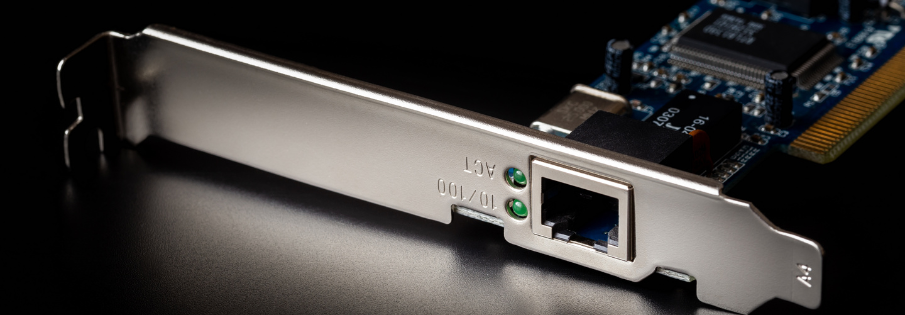
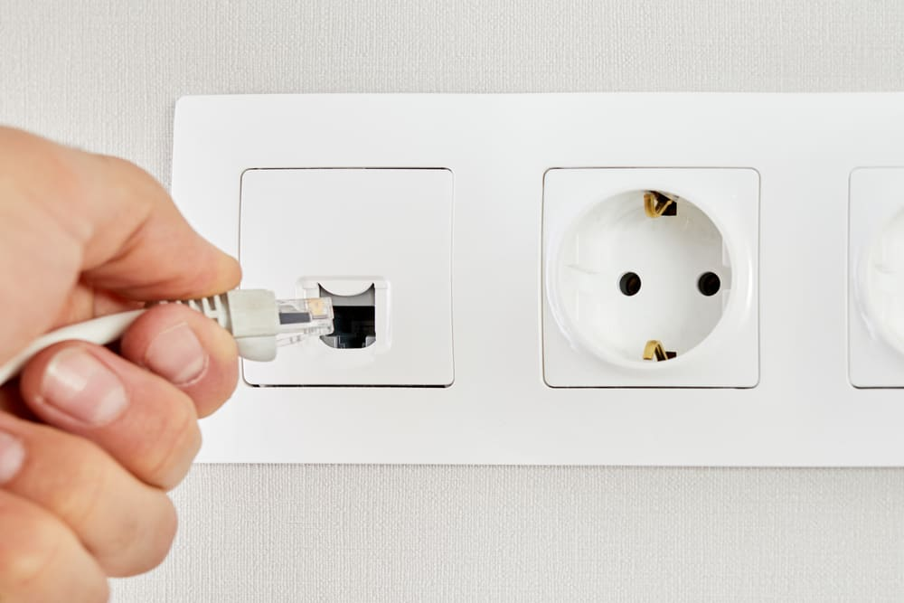
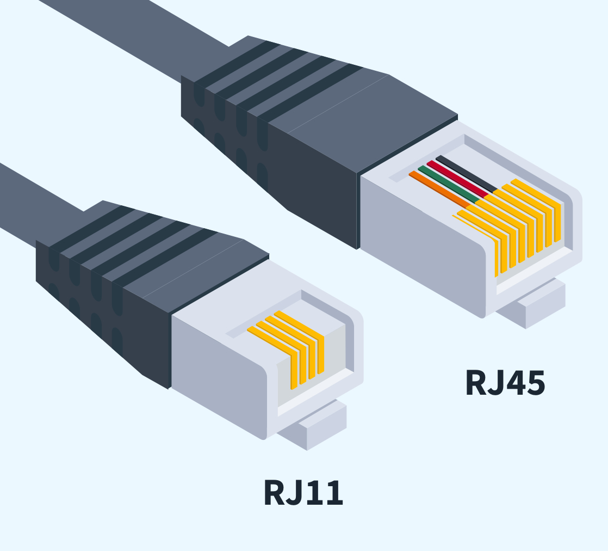
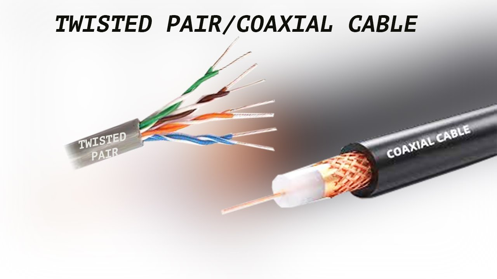
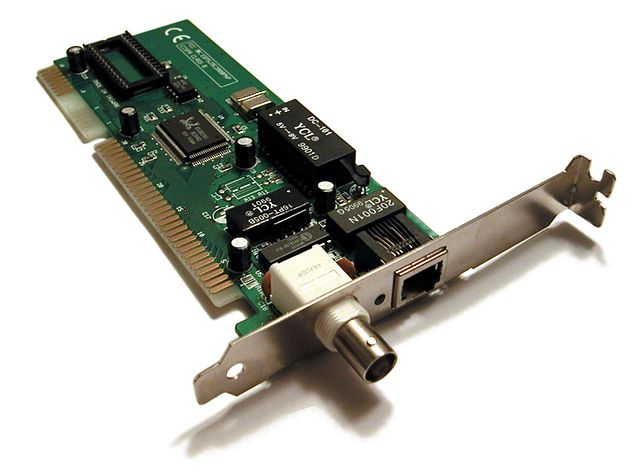
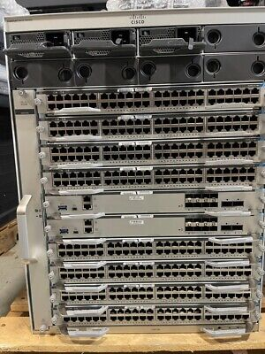
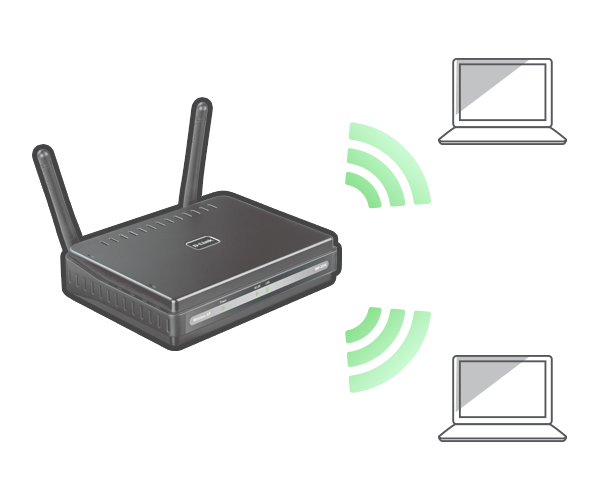
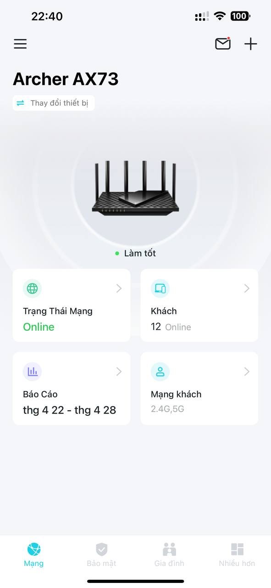

[INE - 2. Các thành phần trong mạng máy tính? ( :heavy_plus_sign: UPDATED 30/04/2024)](#ine_2_components_of_computer_networks)

:pushpin: nên đọc 2 module cisco trước phần này vì một số khái niệm bị lược bỏ để tránh trùng lặp như: máy khách, máy chủ, cáp đồng trục, dây DSL.

- [2.1 - Máy khách và máy chủ ( :heavy_plus_sign: UPDATED 30/04/2024)](#ine_2_1_client_server)
- [2.2 - Tài nguyên cục bộ và từ xa ( :heavy_plus_sign: UPDATED 30/04/2024)](#ine_2_2_local_n_remote_resource)
- [2.3 - Network Interface Card (NIC) ( :heavy_plus_sign: UPDATED 30/04/2024)](#ine_2_3_nic)
- [2.4 - Switch ( :heavy_plus_sign: UPDATED 30/04/2024)](#ine_2_4_switch)
- [2.5 - Router ( :heavy_plus_sign: UPDATED 30/04/2024)](#ine_2_5_router)
- [2.6 - Tường lửa và thiết bị chống xâm nhập ( :heavy_plus_sign: UPDATED 30/04/2024)](#ine_2_6_firewall_n_ips)
- [2.7 - Wifi Access Point ( :heavy_plus_sign: UPDATED 30/04/2024)](#ine_2_7_wifi_ap)

# 2.1 - Máy khách và máy chủ

(đã được mô tả trong phần trên `cisco module 2`)

# 2.2 - Tài nguyên cục bộ và từ xa

Ví dụ những tài nguyên cục bộ:

- Ổ cứng: HDD, SSD.
- Bộ nhớ.
- Bàn phím.

Ví dụ những tài nguyên từ xa:

- Kết nối HDD từ xa: NFS.
- Máy in.

# 2.3 - Network Interface Card (NIC)

Card mạng là thiết có thể nhìn thấy được, sờ được. Nó xuất hiện trên máy tính cá nhân, máy chủ hoặc thậm chí là ở dạng riêng lẻ trong tình cảnh quảng cáo, thay thế, sửa chữa. Dây DSL được sử dụng để kết nối hai card mạng với nhau. Có nhiều hình dạng tiếp xúc như `Register Jack 45 (RJ45)`, `RJ11`, và `Coax`. Coaxial NIC là cổng dành cho cáp đồng trục, về mặt lịch sử thì ban đầu phục vụ cho truyền hình mãi sau mới phát triển thêm kênh để truyền dữ liệu mạng. Đối với điện thoại, máy tính bảng thì mô-đun này đã được thu nhỏ lại và truyền nhận tín hiệu trong không khí.

# 2.4 - Switch

Đây là nơi chứa NIC còn lại trong kết nối giữa switch và máy tính cá nhân, máy chủ. Switch có rất nhiều hình dạng khác nhau tùy theo chức năng và giá thành. Có những cái dạng nhỏ chỉ từ 8 cổng thường được thấy ở nhà, đối với doanh nghiệp lớn thì sử dụng switch có hàng trăm cổng. Đây gọi là mô hình mạng dựa trên switch hay `network based switch`.

Hầu hết các switch đều sử dụng cổng RJ45 nhưng quản trị viên có nhu cầu sử dụng loại cổng khác nói riêng hoặc những tính năng mà switch không có nói chung. Ví dụ như: cổng cáp đồng trục, tính năng chia và quản lý các phân đoạn, bảo mật. Thông thường rất khó tìm được switch có nhiều loại cổng khác nhau, một giải pháp khác là sử dụng bộ định tuyến (router).

# 2.5 - Router

Trông một số tình huống thì router nhìn trông giống như `switch`. Mỗi cổng trên `router` có hình dáng `RJ45`, mặc dù có một số khác biệt giữa chúng nhưng nếu để phân biệt được `router` và `switch` dựa trên hình hài thì có thể gặp rất nhiều khó khăn. Sự khác biệt nằm trong chức năng của router, router có những chức năng của switch có nhưng ngược lại có những thứ mà switch không bao giờ có như tối ưu hóa mạng, tăng tính ưu tiên một số lưu lượng mạng cụ thể và nhiều chức năng khác. Các cổng RJ45 của router có khả năng thay thế, thậm chí có thể tháo ra và lắp mô-đun có dạng cổng khác vào như cổng cáp đồng trục, wifi hoặc các loại cổng khác.

# 2.6 - Tường lửa và thiết bị chống xâm nhập

Trong môi trường cục bộ giả sử gồm có máy tính cá nhân kết nối với máy chủ để lấy dữ liệu thông qua switch hoặc router thì đây là môi trường hoàn toàn tin cậy được bởi vì toàn bộ nằm trong tầm kiểm soát. Vấn đề sẽ nảy sinh khi nhu cầu truy cập từ bên trong ra ngoài Internet và từ bên ngoài Internet có thể khởi tạo một kết nối ngược trở về bên trong. Điều này được xem xét rất nghiêm túc bởi vì bên ngoài kia có hàng tỉ thiết bị mà chúng ta không thể kiểm soát, các thiết bị được sử dụng bởi những người không có đạo đức muốn gửi mã độc gây hại hệ thống hoặc đánh cắp thông tin. Chúng ta cần một lá chắn gọi là `firewall` đứng ở giữa, bên trong nội bộ thường được gọi là inside, inbound, ingress và ngược lại outside, outbound, egress. Tường lửa có thể cho phép khởi tạo kết nối từ bên trong ra bên ngoài và phản hồi từ ngoài vào trong, nhưng nếu có một thiết bị bên ngoài cố gắng khởi tạo một kết nối vào bên trong thì sẽ bị từ chối và không thể nhận phản hồi từ phía bên trong. Đó là nguyên tắc cơ bản của tường lửa, kiểm soát chiều thông tin làm tăng tính an toàn cho mạng nội bộ. 

`Traditional Firewalls`: tường lửa truyền thống cho phép chuyển tiếp gói tin hoặc chặn dựa trên kết quả phân tích địa chỉ và cổng dịch vụ. Tuy nhiên `Cisco` và một số công ty khác như `Checkpoint` đã phát triển chúng thành các tường lửa thế hệ mới (Next-Generation Firewalls):
- Ngoài việc phân tích địa chỉ và số cổng, nó còn có khả năng phân tích rất sâu vào bên trong gói tin, ví dụ như loại dữ liệu mà gói tin đó đang mang, khả năng đi bao xa. Phân tích sâu ở đây có nghĩa là tường lửa có thể phân tích bất cứ thứ gì từ tín hiệu điện đầu tiên cho đến tín hiệu điện cuối cùng, cố gắng đối chiếu với cơ sở dữ liệu được chuẩn bị sẵn và sau đó đưa ra quyết định.
- Quyết định chuyển tiếp hoặc chặn dựa trên ứng dụng. Ví dụ: khi gói tin đến cổng mạng, nó phân tích và cho phép đi qua nếu nhu cầu là truy cập youtube hoặc zalo, chặn nếu là các trang cờ bạc hoặc trò chơi điện tử.
- Tra cứu dịch vụ bên ngoài để ngăn chặn các cuộc tấn công. Ví dụ: sản phẩm của Cisco đã được cài sẵn gói dịch vụ cung cấp liên tục cho tường lửa dữ liệu về các cuộc tấn công mới nhất để đối chiếu với luồng dữ liệu đang di chuyển.

Trong lịch sử thì hệ thống chống xâm nhập (IPS) và tường lửa truyền thống là những thiết bị tách biệt nhau. Điều này có nghĩa là dữ liệu được chuyển tiếp bởi tường lửa truyền thống sẽ đi đến IPS, nếu đó là cuộc tấn công thì IPS sẽ hủy gói tin và thông báo qua đến quản trị viên bằng SMS hoặc email. Ngày nay thì tường lửa thế hệ mới là sự kết hợp của cả 2 thiết bị.

# 2.7 - Wifi Access Point

Ngày nay điện thoại thông minh, máy tính xách tay và máy tính bảng không được kết nối với bất kỳ dây dẫn vật lý nào nhưng bằng công nghệ sóng vô tuyến chúng ta vẫn có thể truy cập vào mạng. Trên thiết bị cá nhân đã được tích hợp sẵn mô-đun ăng ten để gửi và nhận sóng, phía bên kia là thiết bị `Wifi Access Point (AP)` cũng có ăng ten tương tự để giao tiếp. Khi thiết bị của chúng ta kích hoạt wifi thì nó sẽ luôn trong tình trạng rà soát xung quanh để liệt kê ra các mạng wifi có thể truy cập. `AP` cho phép người dùng đăng nhập và thao tác thông qua trình duyệt, thường thì sẽ cấu hình cơ bản tên và mật khẩu wifi, với một số trường hợp đặc biệt sẽ cấu hình chuyên sâu.

Với hộ gia đình thường chỉ có 1 đến 2 `AP` nhưng với một doanh nghiệp lớn thì số lượng có thể lên đến hàng trăm, họ thường có xu hướng mỗi một phòng họp sẽ bố trí 1 `AP`. Sẽ không có gì đáng nói nếu mọi việc cấu hình `AP` diễn ra tốt đẹp ngay từ ban đầu nhưng vấn đề sẽ xảy ra tại một thời điểm nào đó trong tương lai khi quản trị viên cần thao tác trên tất cả `AP`, ví dụ như có yêu cầu cấu hình mới hoặc cập nhật phần mềm từ hãng. Để giải quyết tình trạng này thì có một loại thiết bị tên `Wifi Controller` dùng để kiểm soát tất cả `AP`, đăng nhập và thực hiện cấu hình tất cả `AP` tự động theo kịch bản. Trong khi `AP` cần truy cập thông qua IP nội bộ thì `Wifi Controller` có thể được truy cập thông qua Internet. Nói một cách khác `Wifi Controller` giúp cho việc quản lý, thu nhỏ/mở rộng mô hình diễn ra nhanh chóng, chính xác. Ảnh sau mô tả hãng `TP Link` đã đưa phần mềm quản lý lên cloud.

Thiết bị `DNA Center` là một loại mở rộng của `Wifi Controller`, thay vì chỉ quản lý các thiết bị liên quan đến `AP` thì `DNA Center` quản lý cả `switch`, `router` hoặc thậm chí là máy chủ.