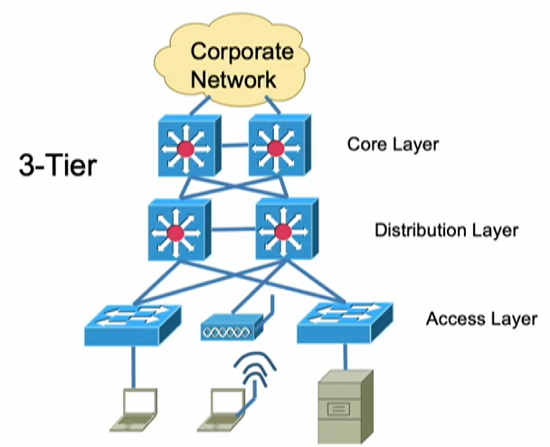
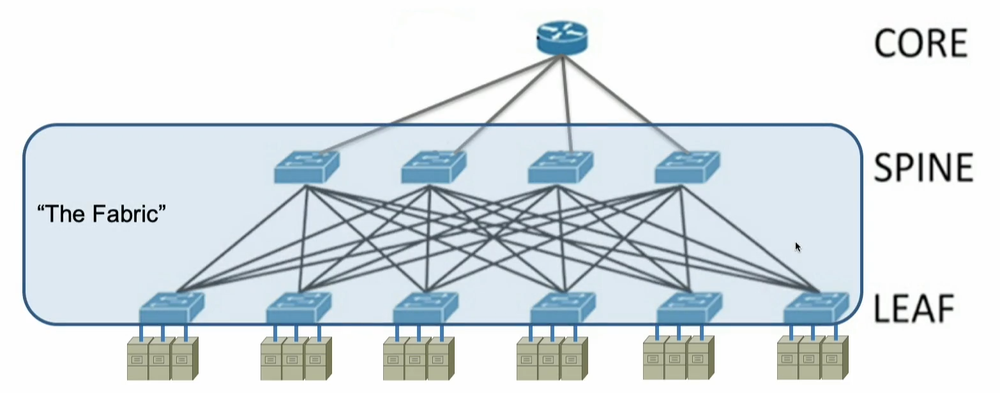
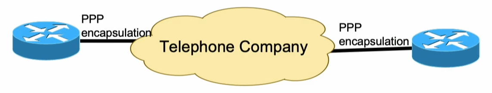
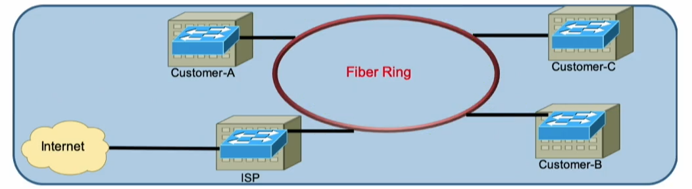
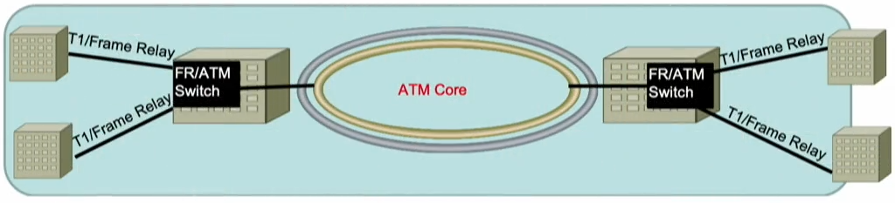
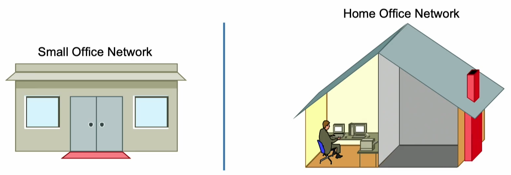
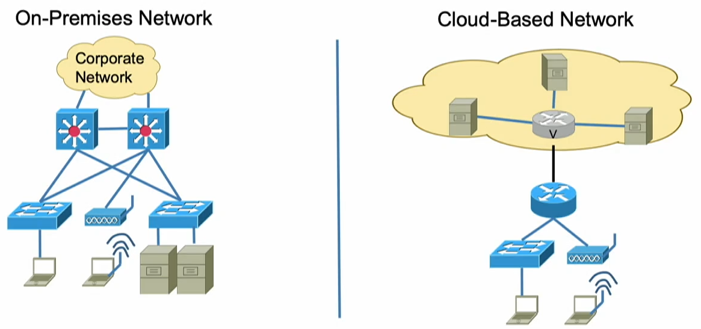

[INE - 4. Kiến trúc topo ( :heavy_plus_sign: UPDATED 02/05/2024)](#ine_4_network_topo_architectures)

- [4.1 - Tổng quan kiến trúc mạng ( :heavy_plus_sign: UPDATED 02/05/2024)](#ine_4_network_topo_architecture)
- [4.2 - Kiến trúc 2-Tier và 3-Tier ( :heavy_plus_sign: UPDATED 02/05/2024)](#ine_4_tier_arch)
- [4.3 - Kiến trúc Spine-Leaf ( :heavy_plus_sign: UPDATED 02/05/2024)](#ine_4_spine_leaf_arch)
- [4.4 - Kiến trúc WAN ( :heavy_plus_sign: UPDATED 02/05/2024)](#ine_4_wan_arch)
- [4.5 - Kiến trúc SOHO ( :heavy_plus_sign: UPDATED 02/05/2024)](#ine_4_soho_arch)
- [4.6 - Kiến trúc On-Premise và Cloud-Based ( :heavy_plus_sign: UPDATED 02/05/2024)](#ine_4_on_premise_arch)

# 4.1 - Tổng quan kiến trúc mạng

Mạng máy tính có thể được thiết kế theo những cách khác nhau, không chỉ cho phép lựa chọn các thiết bị trong mạng như `switch`, `router`, `AP`, `controller`, ... mà còn chọn cách mà chúng kết nối với nhau, những thiết bị đó sẽ được lắp đặt ở nơi nào trong trong công ty. Tất cả những điều này sẽ xác định loại kiến trúc mạng được sử dụng:

- Loại thiết bị, dây dẫn nào cần sử dụng? Dây dài bao nhiêu?
- Tuyến đường lưu thông của dữ liệu. Khi một máy tính của nhân viên muốn kết nối đến máy chủ thì đường đi sẽ như thế nào?
- Dự phòng: nếu đường đi của dữ liệu gặp sự cố thì sẽ có đường khác thay thế.
- Có thể sử dụng dịch vụ của nhà cung cấp để triển khai kiến trúc.

# 4.2 - Kiến trúc 2-Tier và 3-Tier

Hai loại kiến trúc này thường được xây dựng ngay bên trong công ty, tòa nhà. Đây là loại kiến trúc được triển khai dựa trên khái niệm `LAN`.

`3-tier` là phương pháp thiết kế đầu tiên dựa trên `LAN`. Mô hình mạng được chia thành 3 tầng, mỗi tầng có tên riêng biệt và chịu trách nhiệm khác nhau. Đây là kiến trúc được `Cisco` khuyến nghị xây dựng vào 20 năm trước

- `Access Layer`: tầng thấp nhất trong mô hình. Ở tầng này các `node` sẽ là `switch` hoặc `AP` (network based switch). Nhiệm vụ chuyên môn là triển khai xác thực và cung cấp truy cập mạng cho bất kỳ `host` nào có nhu cầu kết nối như máy tính cá nhân, máy chủ.
- `Distribution Layer`: sử dụng `router` hoặc `switch` có chức năng định tuyến. Ý tưởng xuất phát từ việc dùng `access layer` nhóm các thiết bị của nhân viên có vai trò khác nhau như: phòng ban nhân sự, phòng ban tiếp thị. Tầng này chịu trách nhiệm điều khiển luồng dữ liệu.
- `Core Layer`: chứa những thiết bị có đặc điểm chuyển giao dữ liệu một cách nhanh nhất có thể ví dụ trong trường hợp truyền dữ liệu giữa hai tòa nhà.

Một số doanh nghiệp không muốn chịu chi phí lớn cho các thiết bị đắc tiền ở `core layer` nên `2-tier` được sinh ra.

# 4.3 - Kiến trúc Spine-Leaf

Thường các nhân viên sẽ làm việc trong khuôn viên nơi mà họ trao đổi dữ liệu với nhau, nhưng hầu hết thời gian còn lại là truy cập vào dữ liệu của máy chủ. Tất cả máy chủ được bố trí ở nơi được bảo vệ nghiêm ngặt, nơi này gọi là `datacenter (DC)` lưu trữ rất nhiều dữ liệu quan trọng. Datacenter không cần thiết sử dụng kiến trúc `2-tier` và `3-tier` mà nó cần một loại kiến trúc khác gọi là `Spine Leaf`.

Kỳ vọng của loại kiến trúc này mong muốn dịch vụ luôn trong trạng thái hoạt động, không một phần nào trong mạng xảy ra gián đoạn hay trì hoãn. Để đạt được mục đích này doanh nghiệp cần phải trả một chi phí lớn vì được đề cao khả năng phục hồi và dự phòng: bộ nguồn hiện đại nhất, công suất cao nhất với những linh kiện chất lượng nhất; những con switch này không giống như những switch người dùng kết nối mà nó mắc tiền hơn rất nhiều.

Thuật ngữ `fabric` thường xuất hiện trong kiến trúc Spine Leaf dùng để mô tả tất cả switch có giá thành rất cao, chạy rất nhanh, chúng kết nối chéo nhau một cách chằng chịt.

# 4.4 - Kiến trúc WAN

Hai kiến trúc trên chứa những thiết bị mà chúng được bố trí ngay trong công ty, nếu muốn chuyển dữ liệu sang một thành phố hay quốc gia khác là điều không thể. Lúc này chúng ta cần sử dụng kiến trúc WAN.

WAN có nhiều phương thức kết nối khác nhau và về cơ bản chúng được chia thành 3 loại kiến trúc khác nhau:

`Point to point`: gợi ý cho chúng ta về lựa chọn điểm kết nối. Ví dụ điểm A ở Hà Nội chọn kết nối đến điểm B ở Đà Nẵng, khi dữ liệu được chuyển ra khỏi điểm A thì chúng chỉ có một nơi để đến là điểm B và ngược lại. Nếu điểm A cần lựa chọn thêm điểm đến khác ví dụ như điểm C thì cần phải có 2 cổng mạng. Đây cũng chính là nhược điểm của loại kiến trúc này.

`Broadcast based WAN`: khắc phục được nhược điểm của kiến trúc point-to-point. Một ví dụ điển hình triển khai của kiến trúc này là [Metro Ethernet](https://www.juniper.net/us/en/research-topics/what-is-metro-ethernet.html). Khi người A gửi dữ liệu ra ngoài Internet thông qua ISP thì lần lượt tất cả những người còn lại trong vòng metro đều thấy dù người A có muốn hay không vì đây là đặc tính. Khi người nhận dữ liệu không phải là điểm C,B như trong hình thì switch sẽ tự động chuyển tiếp chúng đến nơi khác. Để sử dụng kiến trúc này thì quản lý tòa nhà sẽ đến ISP và yêu cầu kết nối vào Metro Ethernet. Về khía cạnh riêng tư thì khách hàng có thể an tâm vì toàn bộ switch trong hình trên được sở hữu bởi ISP, khách hàng chỉ việc mua switch riêng và kết nối chúng vào switch của ISP. 

`Non-broadcast multi-access`: loại kiến trúc này tân tiến hơn, loại bỏ những lo ngại của khách hàng khi sử `broadcast based WAN`. Khi dữ liệu của khách hàng được gửi đến `ATM Switch` thì ISP có một công nghệ bí mật giúp cho dữ liệu đến đúng nơi cần đến vì thế dữ liệu không phải chạy trong vòng metro để bất kỳ ai cũng nhìn thấy.

# 4.5 - Kiến trúc SOHO

Được viết tắt của `Small Office Home Office`, là một loại kiến trúc nhỏ phục vụ cho ít người nên chi phí triển khai sẽ ít tốn kém:

- Ít nhu cầu về thiết bị hơn, có thể chỉ cần 1 switch, router.
- Không đề cao triển khai nghiêm ngặt về tính bảo mật.

Nhược điểm của loại hình này là khó quản lý và thực thi áp dụng chính sách từ công ty.

# 4.6 - Kiến trúc On-Premise và Cloud-Based

`On-Premise` đơn giản là tất cả mạng; thiết bị như dây dẫn, switch, router, máy chủ; mọi tài nguyên sẽ nằm ngay bên trong công ty mà chúng ta có thể nhìn thấy nó, chạm vào nó và toàn quyền kiếm soát. Ví dụ công ty có nhu cầu triển khai các loại dịch vụ thì cần mua đủ số lượng máy chủ vật lý theo yêu cầu, sắp xếp đặt chúng ở nơi thích hợp, đấu dây và cấu hình thiết bị.

Trái ngược với On-Premise, nhiều công ty xây dựng Public Cloud như `Azure (Microsoft)`, `AWS (Amazon)` họ đã xây dựng sẵn máy chủ và chuẩn bị đầy đủ mọi thứ, gọi là `Cloud`. Chúng ta chỉ cần kết nối Internet, thiết lập các thủ tục là có thể thuê tài nguyên từ họ. Lúc này chúng ta không cần lo lắng chịu trách nhiệm việc sửa chữa, bảo trì hoặc nâng cấp. Là loại hình bù vào những nhược điểm của kiến trúc SOHO và on-Premise.