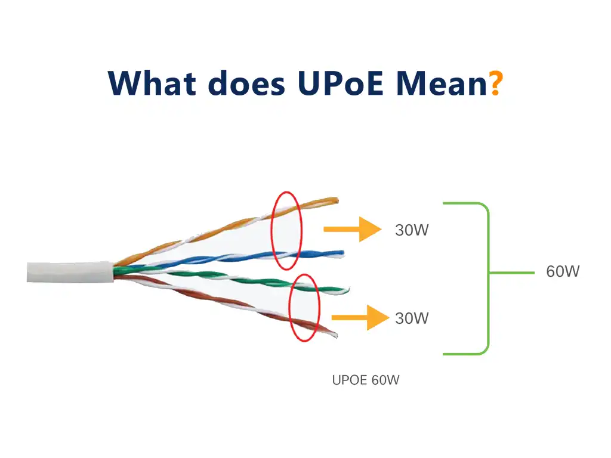

[INE - 5. Power Over Ethernet ( :heavy_plus_sign: UPDATED 12/05/2024)](#ine_5_poe)

- [5.1 - Khái niệm PoE ( :heavy_plus_sign: UPDATED 12/05/2024)](#ine_5_what_is_poe)
- [5.2 - Lợi ích của việc sử dụng PoE ( :heavy_plus_sign: UPDATED 12/05/2024)](#ine_5_benefits_of_poe)
- [5.3 - PSE và PD ( :heavy_plus_sign: UPDATED 12/05/2024)](#ine_5_pse_pd)

# 5.1 - Khái niệm PoE

Thông thường cáp Ethernet sẽ chỉ mang dữ liệu. Bất kể thiết bị đó là máy tính xách tay, máy tính cá nhân, máy in, thiết bị IoT, điện thoại bàn thì chúng đều có riêng cổng nguồn AC. Nhưng đôi khi rất khó khăn để tìm kiếm ổ cắm ở gần cho thiết bị. Ý tượng của `PoE` là thay thế đầu cắm nguồn AC và sử dụng chung cáp Ethernet.

Các chuẩn PoE gồm có các chuẩn sau:

| Chuẩn PoE | Loại | Công suất |
| --- | --- | --- |
| IEEE 802.3af | 1 | 15.4W |
| IEEE 802.3at / PoE+ | 2 | 30.8W |
| 802.3bt / Cisco UPoE | 3 | 60W |
| IEEE 802.3bt / UPoE+ | 4 | 90-95W |

Dây ethernet được cấu tạo gồm 8 dây được xoắn đôi thành cặp (4 cặp). Tiêu chuẩn truyền thống `802.3af` và `802.3at` ban đầu phân hoạch rõ ràng giữa dây mang năng lượng các dây còn lại sẽ mang dữ liệu. Sau đó Cisco đã ra mắt hai chuẩn mới là `UPoE` và `UPoE+` cho phép tất cả 8 dây được đồng thời mang năng lượng và dữ liệu.

# 5.2 - Lợi ích của việc sử dụng PoE

Có thể thấy ngay lập tức lợi ích:

- Tiết kiệm chi phí khi gộp dây nguồn vào dây Ethnet nên chúng ta không cần phải mua bộ chuyển đổi DC-AC.
- An toàn cho người dùng và thiết bị.
- Sự tương thích cao. Ví dụ khi sử dụng bộ chuyển đổi cần phải xem xét sự tương thích chân cắm của hạ tầng lưới điện quốc gia sở tại, vì ở Mỹ hoặc Trung Quốc thì chuẩn chân cắm sẽ khác với Việt Nam.

# 5.3 - PSE và PD

Trong thiết lập PoE gồm có 2 loại thiết bị:

- `Power Sourcing Equipment (PSE)`: thiết bị cung cấp nguồn, ví dụ như `poe switch` hoặc `poe injector`.
- `Powered Device (PD)`: thiết bị được cấp nguồn ví dụ như AP, điện thoại bàn, camera.

Khi có một thứ gì đó cắm vào ethernet switch có hỗ trợ PoE thì switch sẽ trải qua một số bước để nhận biết thứ đó cần được cấp nguồn hoặc ngược lại. Ví dụ một máy tính xách tay cắm vào switch và vì nó đã có thiết kế AC riêng nên không cần cấp nguồn từ switch thông qua dây ethernet. Quá trình bao gồm:

- Xác định thiết bị cần cấp nguồn từ PSE là PD: PSE sẽ phát ra một lượng năng lượng nhỏ để kiểm tra đối phương có điện trở hay không bởi vì nếu không phải là thiết bị PD ví dụ như laptop thì năng lượng vừa phát đó sẽ quay ngược trở lại đồng thời với năng lượng nhỏ như vậy hoàn toàn không thể phá hủy cổng mạng của laptop. Ngược lại, nếu năng lượng phát ra đó không quay trở về hoặc có nhưng ở ngưỡng rất nhỏ so với nguồn phát thì tức là nó đã bị tiêu thụ, kết luận thiết bị đối phương là PD cần được cấp nguồn.
- Xác định công suất cần truyền tải: sau khi xác nhận đối phương là PD, PSE sẽ phát thêm một chút năng lượng vừa đủ giống cho việc khởi đầu, sau đó gia tăng và lặp đi lặp lại việc này để cảm nhận được lực cản và xác định ngưỡng công suất. Đối với thiết bị Cisco còn được triển khai thêm giao thức `CDP` cho biết thêm rất nhiều thông tin ví dụ như phạm vi công suất nguồn, chi tiết thông tin thiết bị.

Ví dụ trên cho biết thiết bị PD là điện thoại bàn, khuyến nghị mức năng lượng vận hành ở mức 10.25W nhưng cũng có thể vận hành ở mức 6.3W với việc giảm độ sáng màn hình.