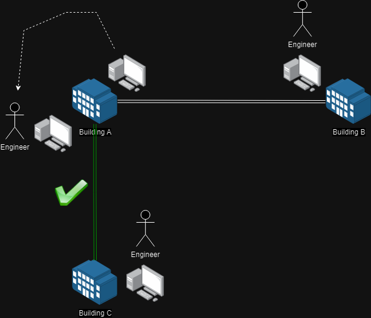

[INE - 6. Lịch sử và mục đích của Internet Protocol](#ine_6_history_n_purpose_of_ip)

- [6.1 - Lịch sử phát triển chuyển mạch gói tin](#ine_6_history_of_packet_switching)
- [6.2 - Khái niệm chuyển mạch gói](#ine_6_concept_of_packet_switching)
- [6.3 - Tổng quan về Internet Protocol](#ine_6_overview_of_internet_protocol)

# 6.1 - Lịch sử phát triển chuyển mạch gói tin

Năm 1885, nhà khoa học [Alexander Graham Bell](https://vi.wikipedia.org/wiki/Alexander_Graham_Bell) đã phát minh ra mạng điện thoại bàn, mọi người bắt đầu sâu chuỗi chúng thành một mạng lưới đa quốc gia. Ban đầu, những đường dây này được sử dụng để truyền tín hiệu điện nhưng chỉ mang dữ liệu giọng nói. Khi chúng ta nói, không khí phát ra từ giọng nói sẽ làm rung động nam châm và tạo ra dòng điện và dựa vào giọng nói và ở bên đầu thu dòng điện được chuyển đến sẽ làm rung động nam châm để đẩy không khí ra ngoài, đó chính là giọng nói của chúng ta. Giọng nói của chúng ta là dạng sóng nhưng kỹ thuật số số nó tức lấy mẫu sẽ làm mất đi tính toàn vẹn so với ban đầu nhưng đó là sai số có thể chấp nhận được. Cuối những năm 1950, mọi người có ý tưởng sử dụng cùng công nghệ dây dẫn nhưng sẽ truyền dữ liệu đa đạng hơn.

Những thời kỳ đầu việc chuyển mạch hoàn toàn được thực hiện thủ công bởi con người. Ví dụ như hình trên, kỹ sư sử dụng một máy tính ở tòa nhà A kết nối với một máy tính ở tòa nhà B, khi kỹ sư muốn chuyển hướng giao tiếp sang tòa nhà C bắt buộc phải đến một máy tính khác (có thể nằm ở phòng khác, vị trí khác). Sẽ tốt hơn nếu có thể ngồi tại một máy tính và khi dữ liệu đi ra ngoài nó sẽ biết đi về hướng nào, chúng ta cần một thiết bị mạng chuyên dụng để làm được việc đó. Khi máy tính được kết nối đến thiết bị mạng và chúng ta cần gửi dữ liệu ra ngoài, dữ liệu này có thông tin vị trí cần đến và vì vậy thiết bị mạng sẽ lựa chọn ra tuyến đường để gửi nó đi. Vào đầu những năm 1960, khái niệm `Distributed Adaptive Message Block Switching` được phát triển bởi nhà khoa học máy tính người Mỹ tên là [Paul Baran](https://lemelson.mit.edu/resources/paul-baran). Thay vì nhận một lượng dữ liệu lớn và gửi chúng đi thì Paul Baran có ý tưởng cắt chúng thành những `block` nhỏ mà ngày nay gọi là `package` (gói tin), mỗi khối đều có địa chỉ nguồn gửi và nơi nhận. Ngày nay chúng ta gọi phương pháp của Paul Baran là `packet switching` (chuyển mạch gói tin).

# 6.2 - Khái niệm chuyển mạch gói

Phương pháp chuyển mạch gói tin gồm có 3 thành phần chính:

- Chạy trên mạng lưới phi tập trung được tạo thành bởi nhiều đường kết nối giữa 2 điểm bất kỳ.
- Chia nhỏ dữ liệu thành các khối.
- Gửi dữ liệu dựa trên nguyên tắc `store-and-forward switching`.

Để hiểu hơn về `store-and-forward switching` hãy tưởng tượng switch sơ khai được hoạt động theo ý tưởng sau. Ví dụ, khi switch nhận được một dòng dữ liệu của người dùng chuyển thì địa chỉ nằm ở nơi bắt đầu của dòng, switch chỉ cần lưu trữ đích đến và dựa vào đó nó chuyển tiếp tất cả các gói sau. Nhưng giải pháp ban đầu này gặp nhiều vấn đề khi một khối dữ liệu bị hư hỏng do nhiều cách khác nhau hoặc khối dữ liệu chứa địa chỉ đích đến bị hỏng thì việc chuyển tiếp luồng dữ liệu khả năng cao sẽ bị lỗi. Giải pháp khác được đề xuất là switch cần tạo một vùng nhớ tạm để chứa toàn bộ dữ liệu từ bắt đầu cho đến kết thúc sau đó chuyển tiếp toàn bộ. Cho đến thời điểm hiện tại hầu hết các switch đều sử dụng phương pháp này.

Khi lý thuyết chuyển mạch gói của Tiến sĩ Paul Baran ra đời và một số dự án đã được triển khai nhưng chúng hoạt động tách biệt nhau, không đồng nhất và chắc chắn chúng không thể kết nối lẫn nhau. Một vài năm sau đó, năm 1973, [U.S Defense Advanced Research Projects Agency (DARPA)](https://www.darpa.mil/) là Cơ quan Chỉ đạo các Dự án Nghiên cứu Quốc phòng Tân Tiến sau khi kết thúc một số nhiệm vụ liên quan đến vũ trụ và phòng không, họ bắt đầu chuyển trọng tâm. Họ muốn các mạng được liên kết với nhau bởi vì họ đưa ra tình huống rằng có một radar (được thiết kế bởi công ty A) phát hiện tên lửa tấn công đang lao tới nhưng nó không hoạt động hoặc bị hủy hoại, vậy thì sẽ rất phức tạp để phát tín hiệu cho các radar xung quanh (được thiết kế bởi công ty B) nếu không ứng dụng lý thuyết chuyển mạch gói. Vào thời điểm này chính phủ Hoa Kỳ chủ trì thúc đẩy xây dựng, đổ một số tiền khổng lồ và ra yêu cầu cho các công ty cần chuẩn hóa để giải quyết vấn đề và kết quả `TCP/IP` được phát minh.

# 6.3 - Tổng quan về Internet Protocol

Ban đầu không có sự phân biệt giữa `TCP/IP`, nó là một thực thể không tách rời nhưng sau đó nó được phân biệt thành `TCP` và `IP` với những chức năng khác nhau. `Internet Protocol` chính là đáp án cho yêu cầu của `DARPA`. Phiên bản IP mới nhất hiện tại là IPv6 nhưng phiên bản IPv4 vẫn chiếm ưu thế hơn, trong lịch sử có rất nhiều câu chuyện về IPv1, IPv2, IPv3,... nhưng chúng ta sẽ không tìm thấy bất kỳ thiết bị nào sử dụng chúng.

Internet Protol hoạt động ở `Network Layer` (lớp 3) trong mô hình OSI. Giao thức TCP là dạng giao thức hướng kết nối, công việc của TCP là nhận dữ liệu và gửi đến đích hay nói cách khác nó sẵn sàng xử lý dữ liệu và đảm bảo rằng dữ liệu thực sự đã đến nơi nhận. Trái ngược với điều này, IP là giao thức không hướng kết nối (connectionless) vì vậy bản thân IP không có độ tin cậy, nó không thực hiện xác minh hay đảm bảo dữ liệu được gửi đến đích. Tất cả những gì IP là nhận dữ liệu từ tầng ứng dụng và chèn thêm tiêu đề như dữ liệu này đến từ đâu, nơi đến ở đâu, ... Vì vậy đối với Internet Protocol, nếu cần những loại thông tin đảm bảo dữ liệu đã đến nơi nhận thì hãy điều tra ở giao thức TCP.

- Mối quan hệ của Internet Protocol với dữ liệu được gửi giữa 2 thiết bị? IP cung cấp phương pháp đóng gói cho dữ liệu giữa 2 node.
- Đặc tính của mạng chuyển mạch gói? Thông tin được chia thành các khối nhỏ và sử dụng mạng phi tập trung có nhiều đường liên kết giữa 2 điểm.
- Ban đầu Internet Protocol được thiết kế dành cho loại mạng nào? Chuyển mạch gói.