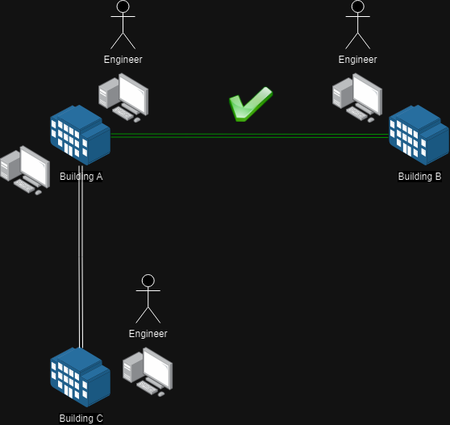
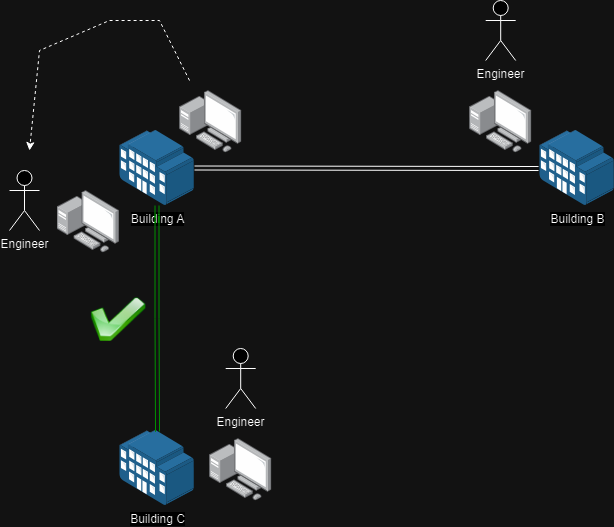

[INE - 6. Lịch sử và mục đích của Internet Protocol ( :heavy_plus_sign: UPDATED 20/05/2024)](#ine_6_history_n_purpose_of_ip)

- [6.1 - Lịch sử phát triển chuyển mạch gói tin ( :heavy_plus_sign: UPDATED 20/05/2024)](#ine_6_history_of_packet_switching)

# 6.1 - Lịch sử phát triển chuyển mạch gói tin

Năm 1885, nhà khoa học [Alexander Graham Bell](https://vi.wikipedia.org/wiki/Alexander_Graham_Bell) đã phát minh ra mạng điện thoại bàn, mọi người bắt đầu sâu chuỗi chúng thành một mạng lưới đa quốc gia. Ban đầu, những đường dây này được sử dụng để truyền tín hiệu điện nhưng chỉ mang dữ liệu giọng nói. Khi chúng ta nói, không khí phát ra từ giọng nói sẽ làm rung động nam châm và tạo ra dòng điện và dựa vào giọng nói và ở bên đầu thu dòng điện được chuyển đến sẽ làm rung động nam châm để đẩy không khí ra ngoài, đó chính là giọng nói của chúng ta. Giọng nói của chúng ta là dạng sóng nhưng kỹ thuật số số nó tức lấy mẫu sẽ làm mất đi tính toàn vẹn so với ban đầu nhưng đó là sai số có thể chấp nhận được. Cuối những năm 1950, mọi người có ý tưởng sử dụng cùng công nghệ dây dẫn nhưng sẽ truyền dữ liệu đa đạng hơn.

Những thời kỳ đầu việc chuyển mạch hoàn toàn được thực hiện thủ công bởi con người. Ví dụ như hình trên, kỹ sư sử dụng một máy tính ở tòa nhà A kết nối với một máy tính ở tòa nhà B, khi kỹ sư muốn chuyển hướng giao tiếp sang tòa nhà C bắt buộc phải đến một máy tính khác (có thể nằm ở phòng khác, vị trí khác).