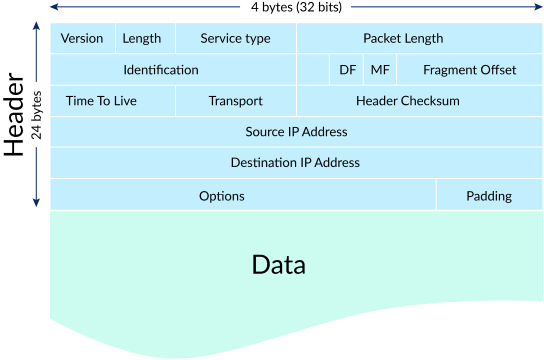
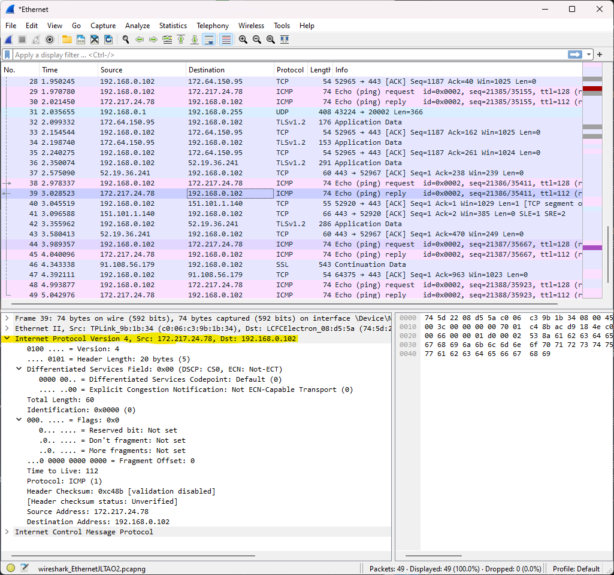
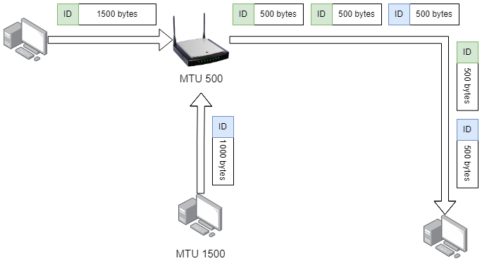

[INE - 7. Các trường trong tiêu đề IPv4 ( :heavy_plus_sign: UPDATED 27/05/2024)](#ine_7_ipv4_header_fields)

Trong phần này chúng ta tập trung vào việc tìm hiểu sơ lược các trường trong cấu trúc/tiêu đề của IPv4 và mục đích sử dụng của chúng.

Trong mô hình OSI, bất kể loại dữ liệu của nó là TCP hay UDP thì đều truyền xuống `Network Layer`. IPv4 sẽ nhận tất cả mọi thứ được truyền xuống và thêm một tiêu đề mang tính không trùng lặp vào phần đầu của dữ liệu, phần tiêu đề này đã biến toàn bộ thành cái mà chúng ta gọi là `IP Packet` (gói tin IP). Tiêu đề này chứa trường địa chỉ cũng như nhiều thứ khác để cho phép router định tuyến.

- `Version`: mô tả gói tin phiên bản 4 hoặc 6. Một byte được tách đôi thành 4 bits được sử dụng cho hai chức năng riêng biệt.
- `Header Length`: nơi kết thúc của tiêu đề IP và là nơi bắt đầu cửa dữ liệu. Nó không thực sự có ý nghĩa đối với người đọc thay vào đó được ứng dụng trong lập trình, thiết bị thu. Mặc dù kích thước không phải là giá trị tĩnh nhưng hầu hết (ví dụ như trong ảnh wireshark) thì đều mang giá trị `20 bytes` (32 bits x 5) là ít nhất. Nếu trường `Option` có tồn tại thì giá trị sẽ lớn hơn.
- `Differentiated Services` hoặc `Type of Service (TOS)`: giá trị càng lớn thì gói có độ ưu tiên càng cao, ví dụ trong ảnh toàn bộ giá trị `0` mô tả gói tin có độ ưu tiên thấp nhất hoặc nếu là gói IP Phone thì độ ưu tiên luôn luôn cao. Giá trị này bị thay đổi bởi chức năng `Quality of Service`.
- `Total Length`: tổng kích thước của gói tin bao gồm IP header và IP Payload (data), như hình trên gói ICMP có kích thước 60 (bytes).
- `Identification`: định danh gói tin được sinh một cách ngẫu nhiên. Trường này không có ý nghĩa nhiều trừ khi điều tra phân mảnh gói tin.
- `Fragment Offset`: vị trí của fragment sau khi phân mảnh.
- `Time to live (TTL)`: mô tả vòng đời của gói tin. Chỉ có ý nghĩa và được kiểm soát bởi router, mỗi khi đi qua một router thì giá trị sẽ giảm đi một đơn vị cho đến khi nó bị hủy khi về 0. Ví dụ ảnh trên thì gói tin ICMP có thể đi qua 112 router. Giá trị này hữu ích khi chống lại rủi ro nằm trong vòng lặp vô tận.
- `Protocol`: tên giao thức, con số cạnh bên gắn liền với giao thức đó. Ví dụ ICMP (1), IGMP (2) và UDP (17), ...
- `Header checksum`: khi một gói tin được tạo ra thì thiết bị sẽ sử dụng tham số là tất cả các trường của IP Header để tính toán và cho ra kết quả này. Điều này để đảm bảo rằng nội dung gói tin không bị thay đổi và tất nhiên mỗi trường này sẽ được tính toán lại mỗi khi thay đổi TTL hoặc thứ gì đó liên quan đến quy trình chuyển mạch. Ví dụ nếu thiết bị nhận gói tin trực tiếp thì nó sẽ có cùng checksum với thiết bị gửi, nếu gói tin cần chuyển tiếp thì thiết bị nhận sẽ tính toán lại checksum trước khi gửi.
- `Source` và `Destination`: thiết bị gửi và thiết bị nhận.

`Flags`: giả sử khi dữ liệu được truyền trong network và kích thước của nó rất lớn thì lúc này nó cần phải có điểm dừng, thuật ngữ gọi là `Maximum Transmission Unit (MTU)`. Hầu hết các mạng mà chúng ta đang kết nối đều có MTU mặc định là 1500 (bytes), số còn lại đều có giá trị của riêng mình để sao cho tối ưu hệ thống. Ví dụ khi đi đến một router có MTU=500 (bytes) thì nó thực hiện phân mảnh 1500 bytes thành 3 fragment, các mảnh nhỏ này đều mang giá trị định danh của gói tin ban đầu, đôi khi vì một số lý do phát lại gói tin cho nên việc đầu thu nhận được trùng lặp gói là điều không thể tránh khỏi vì thế thông tin trong `Flags` rất hữu ích để xử lý việc này. Nơi nhận sẽ đảm nhiệm tái tạo lại gói tin ban đầu dựa trên nhiều yếu tố.

- `Reserved bit`: (chưa xác định rõ).
- `Don't fragment`: giá trị 1 yêu cầu thiết bị kế tiếp không phân mảnh và hủy gói tin đó đi nếu lớn hơn MTU. Lợi ích của việc này là tránh sử dụng tài nguyên CPU để phân mảnh và tái tạo lại gói tin, tối ưu thông lượng cho những dịch vụ khác. Thông thường chức năng này được sử dụng để xác định thông số MTU card mạng thông qua công cụ ping.
- `More fragments`: nếu mảnh không phải cuối cùng thì giá trị bằng 0.

