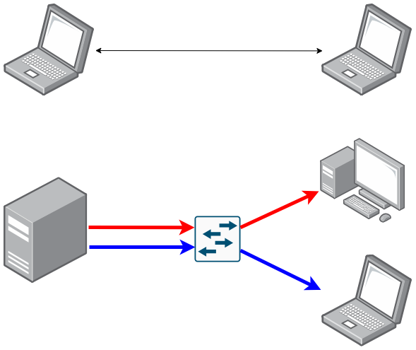
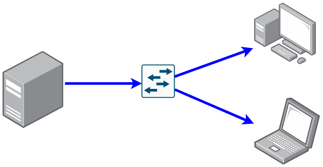
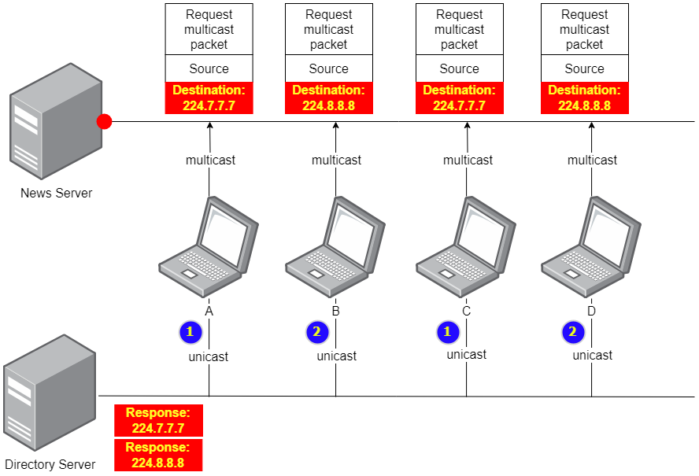

INE - 8. Xác định các bit thuộc phần Network ( :heavy_plus_sign: UPDATED 15/07/2024)

- [8.1 - Các lớp địa chỉ IPv4 ( :heavy_plus_sign: UPDATED 07/07/2024)](#ine_8_ipv4_address_classes)
- [8.2 - Khái niệm về `subnet mask` ( :heavy_plus_sign: UPDATED 07/07/2024)](#ine_8_subnet_mask)
- [8.3 - Các loại địa chỉ IPv4 ( :heavy_plus_sign: UPDATED 07/07/2024)](#ine_8_ipv4_address_types)
    - [8.3.1 - Unicast ( :heavy_plus_sign: UPDATED 13/07/2024)](#ine_8_unicast)
    - [8.3.2 - Multicast ( :heavy_plus_sign: UPDATED 14/07/2024)](#ine_8_multicast)
    - [8.3.3 - Broadcast ( :heavy_plus_sign: UPDATED 15/07/2024)](#ine_8_broadcast)

# 8.1 - Các lớp địa chỉ IPv4

Trong bài viết này sẽ dồn trọng tâm vào các lớp mạng, xác định lớp mạng từ địa chỉ, khái niệm `subnet mask` của IPv4. Khi nghiên cứu về IPv4 thì ta dễ dàng để nhận ra rằng thành phần quan trọng nhất là địa chỉ, ví dụ khi một thiết bị như laptop hay tablet tạo ra một gói tin nó sẽ đặt một địa chỉ riêng của nó vào phần thông tin nguồn và địa chỉ đích đến để mô tả về nơi nhận. Nhưng trước khi gửi gói tin đi nó sẽ so sánh giữa địa chỉ nguồn và đích vì kết quả có hay không việc đích đến nằm trong cùng mạng với nguồn gửi sẽ ảnh hưởng trực tiếp đến cách truyền gói tin hay cách thức thiết bị của chúng ta làm việc.

Giả sử rằng có 32 bits ngẫu nhiên với sự phân tách sau `1000110|00011110000`, bằng một cách nào đó máy tính được cài đặt để hiểu rằng `1000110` là một mẫu rất đặc biệt đại diện cho tất cả thiết bị của phòng kế toán. Vì vậy nếu laptop của ta tạo ra một gói có đích đến khớp với mẫu `1000110` thì ta biết rằng đích đến nằm trong phòng kế toán, ngược lại biết được đích đến không nằm trong phòng kế toán và để cho thiết bị định tuyến quyết định nơi mà nó sẽ đến.

Chúng ta sẽ tìm câu trả lời nếu có một số 32 bits thì làm sao để nhận biết lằn ranh giới giữa của bit mạng và phần còn lại. Hãy bắt đầu với cách mà những nhà khoa học đời đầu thực hiện (giải pháp `classful`), sau đó chúng ta sẽ đi sâu vào cách mà chúng ta đã làm trong vài thập kỷ qua.

Trong những năm đầu 1980 khi IPv4 lần đầu được đệ trình phát minh tại [RFC 791](https://datatracker.ietf.org/doc/html/rfc791), các nhà phát triển của IPv4 họ nói rằng IPv4 sẽ có địa chỉ giống như định danh vị trí ngôi nhà trên con đường. Địa chỉ này được chia thành hai phần có trình tự từ trái sang là `network` (đại diện con đường) và `host` (đại diện nhà), để giúp cho thiết bị phân biệt được giữa hai phần này thì nhà phát triển chia chúng thành các lớp khác nhau. Khi gán địa chỉ IP cho các `host` như laptop, table, server hay thiết bị định tuyến, ... tất cả địa chỉ có thể gán sẽ nằm trong 3 phạm vi dưới đây.

- Lớp A với 8 bit đầu: `0xxxxxxx | xxxxxxxx xxxxxxxx xxxxxxxx`.
- Lớp B với 16 bit đầu: `10xxxxxx xxxxxxxx | xxxxxxxx xxxxxxxx`.
- Lớp C với 24 bit đầu: `110xxxxx xxxxxxxx xxxxxxxx | xxxxxxxx`.

Hai lớp tiếp theo không được sử dụng để gán cho thiết bị. Lớp D được dành riêng cho `multicast`, bất cứ khi nào ứng dụng phát gói `multicast` thì đích đến sẽ là một nhóm hay nhiều thiết bị và đặc biệt địa chỉ này luôn được mô tả cho nơi nhận, không bao giờ được mô tả cho nơi gửi. Lớp E chưa bao giờ được triển khai hay sử dụng, nếu như người dùng cố gắng đặt địa chỉ IP của lớp này hoặc lớp D vào thiết bị thì hệ điều hành sẽ báo lỗi.

- Lớp D: `1110xxxx xxxxxxxx xxxxxxxx xxxxxxxx`.
- Lớp E: `11110xxx xxxxxxxx xxxxxxxx xxxxxxxx`.
    
# 8.2 - Khái niệm về `subnet mask`

Phương pháp `classful` trên thực sự hiệu quả trong vài năm đầu tiên của IPv4 nhưng các nhà phát triển đã sớm nhận thấy rằng hậu quả của việc thiếu sót trong phương pháp sẽ lan truyền như cháy rừng vì mạng lưới mọc lên khắp nơi một cách điên cuồng. Với sự phân chia lớp đơn giản thì nó sẽ không thể hoạt động lâu hơn nữa vì số lượng mạng hữu hạn nhất định có sẵn trong không gian của lớp A,B và C đang dần cạn kiệt. Các nhà phát triển cần phải nhanh chóng nghĩ ra cách khác để thiết lập phần bit ở `network` một cách tùy ý (ví dụ như 9,12,21 bit đầu tiên) và cuối cùng khái niệm về `subnet mask` đã được ra đời vào năm 1985 được đệ trình tại [RFC 950](https://datatracker.ietf.org/doc/html/rfc950).

Năm 1993, khái niệm về `classless` hay còn được gọi là `CIDR` được giới thiệu. Đây là thời điểm mà khái niệm `classful` chính thức không còn được sử dụng nữa, mọi người đều chuyển sang sử dụng `subnet mask`. Vậy thì khái niệm `subnet mask` là gì và nó đã thay thế `classful` như thế nào?

Ví dụ:

- Địa chỉ IP ngẫu nhiên `00110000000000010000000100000011`.
- Với việc nó bắt đầu bằng bit `0` nên dễ dàng nhận ra nó nó thuộc vào lớp A nhưng chúng ta sẽ không xem xét nó ở khía cạnh `classful` nữa. Tất thiết bị khi được cấp IP tự động hoặc gán thủ công thì điều tiên quyết phải kèm theo chỉ định `subnet mask`, giả sử ta cung cấp dãy bit `11111111|11110000|00000000|00000000` và căn cứ vào số lượng bit `1` có thể dễ dàng tìm ra được địa chỉ mạng nơi mà địa chỉ thiết bị thuộc về: `001100000000xxxxxxxxxxxxxxxxxxxx` .

# 8.3 - Các loại địa chỉ IPv4

## 8.3.1 - Unicast

Được sử dụng để:
- Liên lạc giữa one-to-one. Ví dụ như liên lạc giữa 1 máy khách và 1 máy chủ.
- Sử dụng không gian địa chỉ trong lớp A,B và C. Có nhiều người cho rằng kể từ khi ra đời khái niệm subnet mask, CIDR nói riêng hoặc `classless` nói chung thì chúng ta nên vứt bỏ khái niệm về các lớp A, B, C nhưng điều này là sai vì trong hệ điều hành không cho phép đặt địa chỉ IP ngoài 3 lớp kể trên ra. Ví dụ như cố gắng điền địa chỉ của lớp D là `255.7.7.10` hoặc tương tự vào thiết bị thì hệ điều hành sẽ không chấp nhận và hiển thị thông báo lỗi ngay lập tức, như vậy sự bổ túc kiến thức về lịch sử sẽ giúp chúng ta tránh được những cấu hình không được cho phép.

Một điều đặc biệt khi chúng ta bước chân vào thế giới kỹ thuật định tuyến hay còn gọi là cách mà thiết bị định tuyến hoạt động thì sẽ được học về thứ gọi là tóm tắt tuyến (route summarization). Kỹ thuật này sẽ được mổ xẻ kỹ ở bài sau nhưng giải thích ngắn gọn trong phần Unicast cũng là một điều cần thiết. Không phải tất cả các giao thức định nhưng hầu hết trong số chúng đều có 2 cách để hỗ trợ việc này là tự động và thủ công. Việc tóm tắt tuyến này sẽ giúp giảm số lượng cần ghi nhớ trong bảng định tuyến của router. Ví dụ ta có nhiều lớp mạng 10.10.10.5.32/21 và 10.10.10.100/24 đều kết nối vào router A, bằng kỹ thuật phân tích nhanh chọn ra lớp mạng đại diện `10.10.0.0/16` đủ để bao gồm 2 lớp mạng trên để gửi cho router B với ngụ ý rằng bất kể khi nào nó nhận được gói tin có đích đến nằm trong lớp mạng `10.10.0.0/16` thì hãy gửi cho router A để điều phối tiếp vì nó biết ai là người phù hợp sẽ nhận gói tin.

## 8.3.2 - Multicast

Được sử dụng để liên lạc giữa one-to-many và khác với unicast thì multicast sử dụng không gian địa chỉ lớp D.

Ví dụ chúng ta có một máy chủ đặc thù của nhà nước dùng để phát tin tức liên tục 24/7 và một số máy tính cá nhân, dĩ nhiên tất cả chúng đều được đặt IP nằm trong các dải A,B và C (chúng ta không xét cụ thể địa chỉ IP vì có là gì cũng không quan trọng). Nhu cầu đầu tiên phát sinh khi máy tính A và C muốn nhận được bản tin thời sự khi chỉ có công nghệ Unicast? Chúng ta sẽ điều phối luồng dữ liệu đến máy A và tạo ra một bản sao lưu luồng dữ liệu đó đến máy C, điều này thực sự dễ đoán nhưng nếu mở rộng quy mô toàn quốc thì luồng dữ liệu được nhân lên với số lượng tương ứng và hậu quả gây ra là trì trệ ở phía khách hàng do băng thông không đủ đáp ứng ở phía máy chủ, tiêu tốn nhiều tài nguyên khác. Unicast không được sinh ra để giải quyết nhu cầu này. Trước khi multicast được phát minh bởi [Steve Deering](https://en.wikipedia.org/wiki/Steve_Deering) vào năm 1988 thì phương thức truyền tin broadcast đã có trước bởi [Guglielmo Marconi](https://www.bbc.com/news/uk-england-somerset-61327062), đặc tính của broadcast là truyền dữ liệu đến toàn bộ người nhận dù họ có muốn hay không. Vậy nếu áp dụng broadcast thì tất cả máy tính không muốn nhận dữ liệu sẽ bị gián đoạn công việc của nó. Lúc này ta sử dụng multicast, trong gói tin địa chỉ đích sẽ thuộc lớp D nằm trong dải từ `224.0.0.1` đến `239.255.255.255`. Khi máy A và C muốn xem tin tức thì thiết bị sẽ phát gói tin unicast đến `Directory Server` để mô tả nhu cầu. Thay vì phân phối dữ liệu đến tận nhà thì `Directory Server` sẽ cho địa chỉ mà tin tức đó đang được phát, lúc này thiết bị chỉ cần gửi gói tin multicast có đích nhận đã được hướng dẫn.

## 8.3.3 - Broadcast

Truyền tin broadcast có tính chất người nhận sẽ nhận được cho dù có muốn hay không. Chúng ta có 2 cách:
- Broadcast truyền thống (general broadcast): sử dụng 255.255.255.255 để mô tả lớp mạng 0.0.0.0/0, dĩ nhiên bất kỳ mạng nào thuộc mạng này đều sẽ nhận được gói tin.
- Broadcast theo chỉ định (directed broadcast): ví dụ 1.1.255.255 vậy thì giờ đây lớp mạng nào thược 1.1.0.0/16 sẽ nhận được dữ liệu.