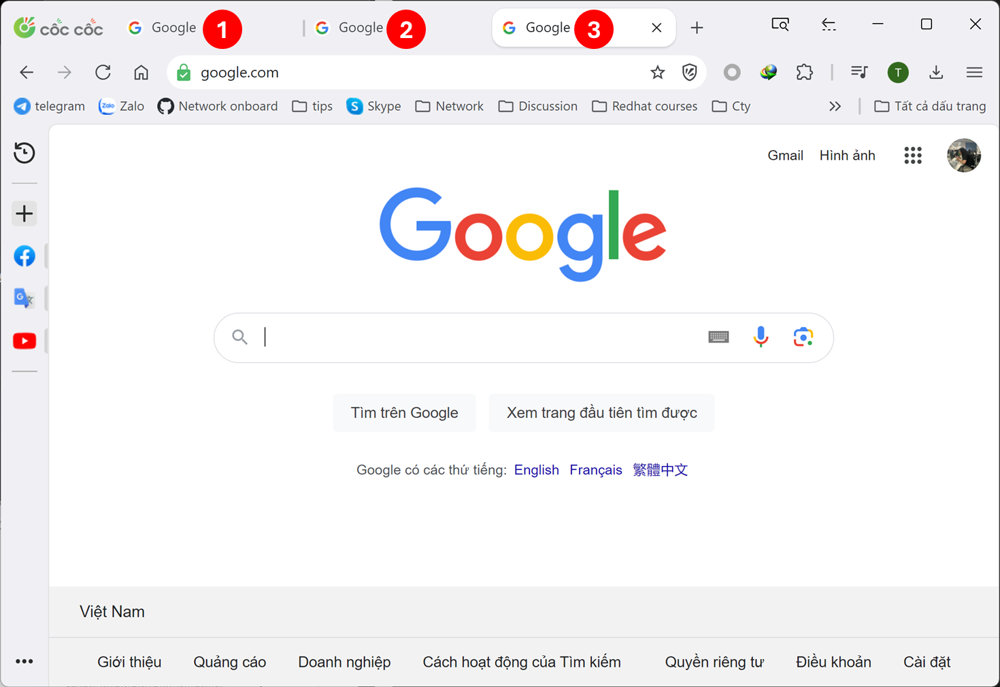
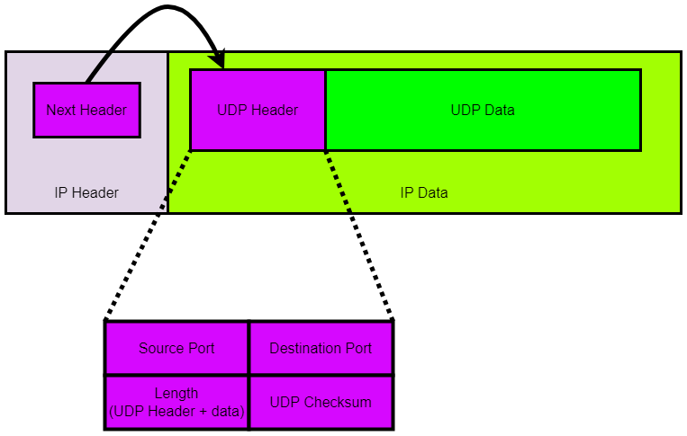
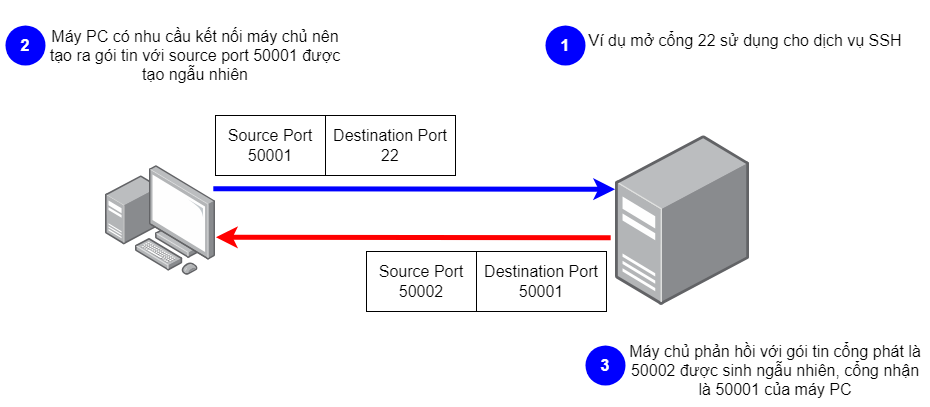

[INE - 9. Tổng quan UDP ( :heavy_plus_sign: UPDATED 18/07/2024)](#ine_9_overview_udp)
- [9.1 - Giới thiệu UDP ( :heavy_plus_sign: UPDATED 18/07/2024)](#ine_9_intro_udp)
- [9.2 - Các cổng ở tầng transport ( :heavy_plus_sign: UPDATED 18/07/2024)](#ine_9_transport_layer_port_numbers)

# 9.1 - Giới thiệu UDP

Trước khi tìm hiểu về UDP ta cần có một số lý do để biết vì sao nó tồn tại. Ví dụ sau thể hiện rất rành mạch và cũng ít được nêu, trong trình duyệt chrome của chúng ta gồm có 3 tab đều đã được truy cập sẵn https://google.com, với những bài giới thiệu trước chúng ta đã biết sơ lược về địa chỉ IP và các lớp nhưng trong bài viết này chúng ta sẽ chỉ tập trung vào IP (Internet Protocol). Giả sử 3 tab trên đều có địa chỉ `8.8.8.8`, địa chỉ này được mô tả ở nơi nhận và thông tin giao thức là `HTTP`, nơi phát là thiết bị có nhu cầu với địa chỉ `50.1.1.1`, ... tất cả thứ này nằm trong tiêu đề gói tin IP. Trong tab đầu tiên tìm kiếm từ khóa "xe hơi" thì ngay lập tức gói tin phản hồi sẽ có địa chỉ nhận là thiết bị của chúng ta `50.1.1.1`, giá trị trường giao thức vẫn như cũ nhưng vấn đề là trình duyệt chrome sẽ hiển thị nội dung ở tab nào? Tất cả những trường tồn tại trong tiêu đề IP đều không đáp ứng được yêu cầu này vì thế chúng ta cần bổ sung thêm TCP/UDP header để hỗ trợ. TCP/UDP header có trường `port` có thể xem như định danh giúp hiển thị chính xác nội dung yêu cầu của mỗi tab.

UDP là viết tắt của User Datagram Protocol, về mặt cơ bản UDP cho chúng ta tiêu đề chứa thông tin cổng nguồn và cổng nhận. Đơn vị dữ liệu ([UDP](https://datatracker.ietf.org/doc/html/rfc768)) trong giao thức UDP được gọi là `Datagram` và tài liệu về UDP được biên soạn ở [RFC 768](https://datatracker.ietf.org/doc/html/rfc768). UDP và IP có một điểm chung là khi ta sử dụng dịch vụ của các giao thức đó thì nó không bảo đảm đích đến có nhận được dữ liệu hay không. Công việc của UDP rất đơn giản, nhận dữ liệu và gắn tiêu đề UDP vào và gửi nó đi và UDP không có trách nhiệm đảm bảo người nhận thực sự có nhận được dữ liệu hay không.

# 9.2 - Các cổng ở tầng transport

Cổng trên TCP và UDP:
- Là những thực thể lô ríc, không phải phần cứng. Ví dụ chúng ta mở một tab chrome như trên để duyệt web, thì hệ thống sẽ gán cho tab đó 1 cổng và ngược lại khi ta tắt tab đó thì cổng liên kết với tab cũng sẽ được trả về cho hệ thống và tái sử dụng.
- Được sử dụng bởi ứng dụng, cụ thể để gán vào các phiên làm việc của ứng dụng.

Mỗi TCP segment hoặc UDP datagram đều có cổng phát và cổng nhận. Theo [Internet Assigned Numbers Authority](https://www.iana.org/assignments/service-names-port-numbers/service-names-port-numbers.xhtml) (cơ quan cấp phát số hiệu Internet) thì chia chúng ra thành ba phạm vị riêng biệt. Sự thật là không gì có thể ngăn cản nếu chúng ta cố tính chiếm lấy bất kỳ cổng nào trong 3 phạm vi sau:
- `Well Known Ports`: cổng từ 0 đến 1023 dùng cho các dịch vụ phổ biến hoặc hệ thống, ví dụ như SSH, SMTP, HTTP, HTTPS. 
- `Registed Ports`: cổng từ 1024 đến 49.151 dành cho phần mềm khác để tránh xung đột với các cổng Well Known vì vốn dĩ phạm vi của chúng đã quá ít.
- `Dynamic Ports`: còn lại đến cổng 65.535. Ví dụ khi duyệt web cổng nguồn được lấy một cách ngẫu nhiên từ phạm vi này và cổng đích sẽ là HTTP hoặc HTTPS.

Ví dụ sau mô tả cơ bản cách thức mà cổng hoạt động:

