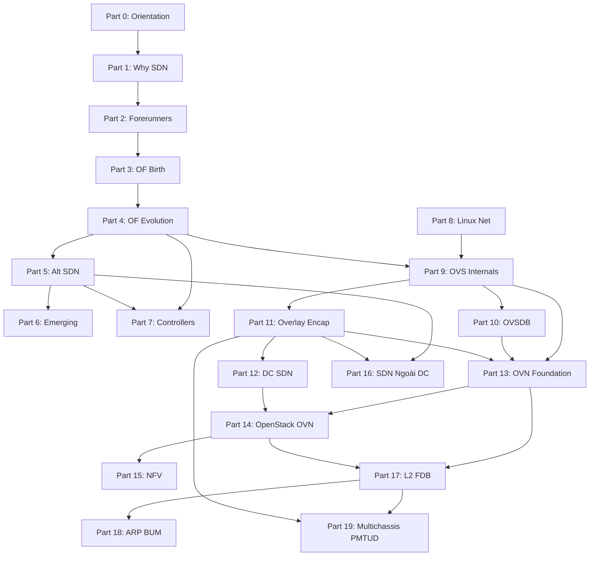

# Plan: Kiến trúc lại sdn-onboard — rev 2 (modular skeleton)

> **Trạng thái:** Draft — rev 2 (2026-04-20), chờ user phê duyệt khung sườn trước khi execute.
> **Tạo:** 2026-04-20 (rev 1) → **Mở rộng:** 2026-04-20 (rev 2 sau khi nghiên cứu ebook Goransson)
> **Owner:** VO LE
> **Skills active:** professor-style, document-design, fact-checker, web-fetcher, flow-graph, blueprint, quality-gate
> **Mode:** skeleton-only (không viết nội dung, chỉ kiến trúc file/folder/tiêu đề/LO)
> **Driver document:** `plans/ebook-coverage-map.md` rev 1 (2026-04-20) — coverage decisions cho từng chương ebook

---

## 0. Changelog rev 1 → rev 2

| Dimension | rev 1 | rev 2 | Lý do |
|-----------|-------|-------|-------|
| Số Block | 8 | 18 (Block 0 Orientation + I-XVII) | Nghiên cứu ebook Goransson (15 chapter + Appendix A/B/C) phát hiện nhiều khối kiến thức nền tảng mà rev 1 gộp quá chặt |
| Số Part | 10 | 20 (Part 0 → Part 19) | Mỗi Block trở thành 1 Part top-level; Advanced case studies tách thành 3 Part độc lập (17/18/19) thay vì gộp thành Block VIII |
| Số file .md | 19 + README | 62 + README | User directive "chia nhiều module sẽ nhẹ tải và dễ cập nhật"; mỗi file giữ 400-1200 dòng target |
| Phạm vi ebook | Không có | 15 chapter + 3 appendix (KEEP 74%, SKIP 26%) | `ebook-coverage-map.md` §2 mapping chi tiết |
| Gap filling | 4 external sources | 8 external sources | Gap-map.md §4: OVN, OVSDB Raft (RFC-less), Geneve RFC 8926, ML2/OVN, P4 spec, SD-WAN modern, Linux netns, OVS NSDI 2015 paper |
| Ordering principle | OVS-first (tactical) | Ebook-first historical (strategic) → OVS/OVN tactical | Đi từ lịch sử/động cơ trước rồi mới đi vào implementation — phù hợp sách giáo khoa đại học (Tanenbaum pattern) |
| Renumber advanced | 1.0→8.0, 2.0→9.0, 3.0→10.0 | 1.0→17.0, 2.0→18.0, 3.0→19.0 | Rev 2 có 16 Block foundation trước advanced |

**Quyết định filter kế thừa từ `ebook-coverage-map.md`** (rev 1 không có):

- SKIP toàn bộ Ch14 (Business Ramifications — data 2016 đã lỗi thời, số liệu doanh thu không còn giá trị)
- SKIP Ch9.4 (Hospitality), Ch9.7 (P2P) — quá hẹp, không liên quan core SDN
- SKIP Ch12.5-12.6 (Floodlight Java code) — controller này không còn active, code ví dụ outdated
- SKIP Ch13.13 (generic how-to) — trùng lặp material rải ở các chapter khác
- SKIP Ch15.1/15.3.1/15.3.3-15.3.6 (predictions 2016 chưa/không thành hiện thực) — giữ lại Ch15.3.2 (SD-WAN thực sự ra đời)
- SKIP Appendix B (Floodlight Java source)

---

## 1. Tại sao cần plan này (tiếp tục luận điểm rev 1)

Rev 1 giải quyết được vấn đề lớn: `sdn-onboard/` hiện có 3 Part đều là case study nâng cao, không có phần nền. Rev 1 đề xuất 7 Part foundation + renumber 3 Part advanced. Tuy nhiên sau khi nghiên cứu ebook Goransson (Black, Culver) 2017, phát hiện ba điểm mà rev 1 bỏ sót.

Thứ nhất, *lịch sử và động cơ ra đời của SDN* trong rev 1 gom vào một file Part 1 duy nhất với 6 sub-section. Ebook Ch3 (Genesis of SDN) dành nguyên chương ~40 trang chỉ để kể về bảy forerunner — mỗi cái có hoàn cảnh ra đời, problem statement, và contribution riêng biệt: DCAN (ATM era), Open Signaling (pre-IP), GSMP (RFC 3292 1999), Ipsilon (IP switching), Active Networking (DARPA 1990s), NAC + Orchestration (enterprise), ForCES (IETF RFC 3654/3746), 4D Project (Princeton/CMU 2005), và Ethane (Stanford 2007). Gộp cả bảy thứ này vào 6 sub-section của một file sẽ vi phạm nguyên tắc mật độ thông tin cao — người đọc không có chỗ thở, không phân biệt được đâu là đóng góp khác biệt của từng dòng chảy lịch sử.

Thứ hai, *OpenFlow evolution* trong rev 1 gộp 1.0 → 1.5 vào một sub-section "Evolution 1.1-1.5". Ebook Ch5 dành 6 sub-section riêng cho từng phiên bản, vì mỗi phiên bản có câu chuyện kỹ thuật riêng: OF 1.1 (2011) giới thiệu multi-table và groups để giải bài toán MPLS; OF 1.2 (2011) chuyển từ 12-tuple cứng sang OXM TLV extensible; OF 1.3 (2012) thêm meters (QoS), PBB (Provider Backbone Bridge) và IPv6; OF 1.4 (2013) thêm bundles (atomic transactions) và flow entry eviction; OF 1.5 (2014) cho phép egress processing và L4-L7 matching. Gộp thành 1 sub-section biến protocol history thành một câu tóm tắt vô nghĩa.

Thứ ba, *các mô hình SDN thay thế* (Ch6) và *mô hình mới nổi* (Ch7) hoàn toàn vắng mặt ở rev 1. Rev 1 giả định chỉ có một loại SDN (OpenFlow-based) nhưng thực tế industry đã phân nhánh thành bốn luồng lớn từ 2014: Open SDN (OpenFlow), SDN via APIs (NETCONF/YANG/BGP-LS), Hypervisor Overlays (NVP/NSX, Contrail), và Opening Up the Device (whitebox switching). Không giải thích phân nhánh này đồng nghĩa với việc người đọc không hiểu tại sao OVN (hypervisor overlay) và Cisco ACI (SDN via APIs) là hai triết lý khác nhau hoàn toàn dù cùng gắn nhãn "SDN".

Rev 2 chuyển sang cấu trúc **18 Block / 20 Part / 62 file** để giải quyết ba vấn đề trên, đồng thời giữ nguyên ba Part advanced hiện tại (đổi thành Part 17/18/19).

---

## 2. Lựa chọn đã chốt với user (2026-04-20, rev 2)

| Quyết định | Giá trị | Ghi chú |
|---|---|---|
| Phạm vi coverage | Ebook Goransson + external gap fill (8 sources) | `ebook-coverage-map.md` §4 liệt kê gap |
| Numbering strategy | Renumber hoàn toàn: Part 0 Orientation, Parts 1-16 foundation, Parts 17-19 advanced | Ba Part hiện tại (1.0/2.0/3.0) → 17.0/18.0/19.0 |
| Volume target | Modular: 62 file khoảng 400-1200 dòng/file | User directive "chia nhiều module nhẹ tải, dễ cập nhật" |
| Lab depth | Lab mini cuối mỗi Part + Capstone Lab POE cuối mỗi Block lớn (I, IV, IX, XIII, XIV) | Mô hình Part 19 (hiện tại 3.0) — POE framework 6 lớp |
| Filter bỏ qua | Ch14 (market data), Ch9.4/9.7 (P2P, hospitality), Ch12.5-12.6 (Floodlight Java), Ch13.13 (generic), Ch15.1/15.3.1/15.3.3-.6 (failed predictions), Appendix B | User directive "bỏ qua cái sa đà, rối rắm, hiểu sai của tác giả" |
| Back-reference | Mỗi file link tới `ebook-coverage-map.md` section tương ứng | Truy xuất ngược để verify coverage |

---

## 3. Kiến trúc mới

### 3.1 Mục lục tổng quan (file tree)

```
sdn-onboard/
├── README.md                                                   [rewrite, ~400 lines]
│
├── 0.0 - how-to-read-this-series.md                            [new, orientation]
├── 0.1 - lab-environment-setup.md                              [new, orientation]
│
├── 1.0 - networking-industry-before-sdn.md                     [new, from Ch1]
├── 1.1 - data-center-pain-points.md                            [new, from Ch2.1-2.4]
├── 1.2 - five-drivers-why-sdn.md                               [new, from Ch2.5]
│
├── 2.0 - dcan-open-signaling-gsmp.md                           [new, from Ch3.1-3.3]
├── 2.1 - ipsilon-and-active-networking.md                      [new, from Ch3.4-3.5]
├── 2.2 - nac-orchestration-virtualization.md                   [new, from Ch3.6-3.8]
├── 2.3 - forces-and-4d-project.md                              [new, from Ch3.9-3.10]
├── 2.4 - ethane-the-direct-ancestor.md                         [new, from Ch3.11]
│
├── 3.0 - stanford-clean-slate-program.md                       [new, from Ch3.12 + external]
├── 3.1 - openflow-1.0-specification.md                         [new, from Ch5.1-5.2]
├── 3.2 - onf-formation-and-governance.md                       [new, from Ch5.7 + external]
│
├── 4.0 - openflow-1.1-multi-table-groups.md                    [new, from Ch5.3.1]
├── 4.1 - openflow-1.2-oxm-tlv-match.md                         [new, from Ch5.3.2]
├── 4.2 - openflow-1.3-meters-pbb-ipv6.md                       [new, from Ch5.3.3]
├── 4.3 - openflow-1.4-bundles-eviction.md                      [new, from Ch5.3.4]
├── 4.4 - openflow-1.5-egress-l4l7.md                           [new, from Ch5.3.5]
├── 4.5 - ttp-table-type-patterns.md                            [new, from Ch5.4 + ONF TS-017]
├── 4.6 - openflow-limitations-lessons.md                       [new, from Ch5.5-5.6]
│
├── 5.0 - sdn-via-apis-netconf-yang.md                          [new, from Ch6.1-6.2]
├── 5.1 - hypervisor-overlays-nvp-nsx.md                        [new, from Ch6.3]
├── 5.2 - opening-device-whitebox.md                            [new, from Ch6.4]
│
├── 6.0 - p4-programmable-data-plane.md                         [new, from Ch7.1 + P4.org]
├── 6.1 - flow-objectives-abstraction.md                        [new, from Ch7.2]
│
├── 7.0 - nox-pox-ryu-faucet.md                                 [new, from Ch11.2 + external]
├── 7.1 - opendaylight-architecture.md                          [new, from Ch11.3]
├── 7.2 - onos-service-provider-scale.md                        [new, from Ch11.4]
├── 7.3 - vendor-controllers-aci-contrail.md                    [new, from Ch11.5]
│
├── 8.0 - linux-namespaces-cgroups.md                           [new, external gap]
├── 8.1 - linux-bridge-veth-macvlan.md                          [new, external gap]
├── 8.2 - linux-vlan-bonding-team.md                            [new, external gap]
├── 8.3 - tc-qdisc-and-conntrack.md                             [new, external gap]
│
├── 9.0 - ovs-history-2007-present.md                           [new, NSDI 2015 + external]
├── 9.1 - ovs-3-component-architecture.md                       [new, external gap]
├── 9.2 - ovs-kernel-datapath-megaflow.md                       [new, NSDI 2015]
├── 9.3 - ovs-userspace-dpdk-afxdp.md                           [new, external gap]
├── 9.4 - ovs-cli-tools-playbook.md                             [new, external gap]
├── 9.5 - hw-offload-switchdev-asap2-doca.md                    [new, NVIDIA DOCA + upstream switchdev docs]
│
├── 10.0 - ovsdb-rfc7047-schema-transactions.md                 [new, RFC 7047]
├── 10.1 - ovsdb-raft-clustering.md                             [new, external gap]
│
├── 11.0 - vxlan-geneve-stt.md                                  [new, RFC 7348 + 8926]
├── 11.1 - overlay-mtu-pmtud-offload.md                         [new, external gap]
├── 11.2 - bgp-evpn-control-plane-overlay.md                    [new, RFC 7432]
│
├── 12.0 - dc-network-topologies-clos-leaf-spine.md             [new, from Ch8.1-8.3]
├── 12.1 - dc-overlay-integration-vxlan-evpn.md                 [new, from Ch8.4]
├── 12.2 - micro-segmentation-service-chaining.md               [new, from Ch8.5-8.6]
│
├── 13.0 - ovn-announcement-2015-rationale.md                   [new, external gap]
├── 13.1 - ovn-nbdb-sbdb-architecture.md                        [new, external gap]
├── 13.2 - ovn-logical-switches-routers.md                      [new, external gap]
├── 13.3 - ovn-acl-lb-nat-port-groups.md                        [new, external gap]
├── 13.4 - br-int-architecture-and-patch-ports.md               [new rev 3, absorbed from Block XIV]
├── 13.5 - port-binding-types-ovn-native.md                     [new rev 3, absorbed from Block XIV]
├── 13.6 - ha-chassis-group-and-bfd.md                          [new rev 3, absorbed from Block XIV]
│
│  # Block XIV (OpenStack/Neutron 4 file), XV (NFV 2 file), XVI (SDN WAN 2 file): REMOVED rev 3 scope tightening
│  # Block numbering gap XIV-XVI giữ để tránh rename cascade 17/18/19
│
├── 17.0 - ovn-l2-forwarding-and-fdb-poisoning.md               [rename từ 1.0, 1178 lines]
├── 18.0 - ovn-arp-responder-and-bum-suppression.md             [rename từ 2.0, 496 lines]
└── 19.0 - ovn-multichassis-binding-and-pmtud.md                [rename từ 3.0, 1379 lines]
```

**Tổng rev 3:** 57 file content + 1 README = **58 file** (rev 2 có 64, rev 3 xóa 9 file scope-out, thêm 3 file Block XIII absorb). Sẽ tiếp tục tăng trong Phase P2/P3 khi absorb Compass Part II (+9 file Block IX) + Compass OVSDB ops (+1 file 10.2) + UofSC labs (+2 file 11.3/11.4) + OF programming (+1 file 4.7) = tổng cuối ~70 file. Foundation 13 Block (Part 0 → Part 13) sau absorption ~57 file. Advanced 3 Part (17/18/19) = 3 file.

### 3.2 Block-level summary

| Block | Part(s) | Files | Nguồn | Mục đích sư phạm |
|-------|---------|-------|-------|------------------|
| 0. Orientation | 0 | 2 | Không ebook | Hướng dẫn đọc series + setup môi trường lab |
| I. Động lực ra đời SDN | 1 | 3 | Ebook Ch1-2 | Trả lời "tại sao SDN tồn tại" |
| II. Tiền thân SDN | 2 | 5 | Ebook Ch3.1-3.11 | Bảy forerunner lịch sử |
| III. Khai sinh OpenFlow | 3 | 3 | Ebook Ch3.12, Ch5.1-5.2, Ch5.7 | Stanford Clean Slate → OF 1.0 → ONF |
| IV. OpenFlow evolution + programming | 4 | 7 (+1 rev 3: 4.7 OF programming) | Ebook Ch5.3-5.6 + ONF TS-017 + Compass Ch 5-10 + UofSC Lab 4/5/6 | Từng phiên bản OF 1.1-1.5 + TTP + limitations + hands-on programming với ovs-ofctl |
| V. Mô hình SDN thay thế | 5 | 3 | Ebook Ch6 | Ba loại SDN không dùng OpenFlow |
| VI. Mô hình SDN mới nổi | 6 | 2 (rev 3: xóa 6.2 IBN) | Ebook Ch7 + P4.org | P4, Flow Objectives |
| VII. Controller ecosystem | 7 | 4 | Ebook Ch11 + external | NOX→ONOS→ODL+vendor |
| VIII. Linux networking primer | 8 | 4 | External gap + UofSC Lab 1 | Nền tảng Linux cần thiết cho OVS/OVN |
| IX. OpenvSwitch internals + ops | 9 | 6 (+9 rev 3: 9.6-9.14 Compass Part II absorption) | NSDI 2015 + external + NVIDIA DOCA + Compass A-W | OVS architecture, datapath, CLI, hardware offload, bond/mirror/sflow/QoS/TLS/appctl/upgrade/libvirt/incident-response |
| X. OVSDB management | 10 | 2 (+1 rev 3: 10.2 backup/compact/RBAC) | RFC 7047 + Compass Ch M/O | Protocol + Raft clustering + operations |
| XI. Overlay + tunnel labs | 11 | 3 (+2 rev 3: 11.3 GRE, 11.4 IPsec) | RFC 7348, 8926, 7432 + UofSC Lab 14/15 | VXLAN, Geneve, EVPN + GRE lab + IPsec lab |
| XII. SDN trong Data Center | 12 | 3 | Ebook Ch8 | DC topology, overlay integration, segmentation |
| XIII. OVN foundation (absorbs XIV OVN primitives) | 13 | 4 (+3 rev 3: 13.4-13.6 br-int/port-binding/ha-chassis) | External gap | OVN objects + pipeline + deployment patterns |
| XIV-XVI. DELETED rev 3 | — | 0 | — | Scope out: OpenStack/Neutron/NFV/SD-WAN không thuộc curriculum OVS/OF/OVN standalone |
| XVII-XIX. Advanced case studies | 17, 18, 19 | 3 | Production forensic | OVN L2, ARP/BUM, PMTUD |

### 3.3 Per-Block skeleton chi tiết

Phần này liệt kê cho mỗi file: (a) filename, (b) status, (c) ebook mapping, (d) Learning Objectives (3-5 items), (e) H2/H3 section headings sketch, (f) prerequisites.

---

#### Block 0 — Orientation (Part 0, 2 files)

Mục đích: Trả lời trước khi vào series "đọc thế nào, cần chuẩn bị gì, đâu là starting point". Không có content kỹ thuật sâu, thuần meta/procedural.

##### `0.0 - how-to-read-this-series.md`

- **Status:** new
- **Ebook mapping:** Không (meta)
- **Prerequisites:** Không

**Learning Objectives:**

1. Xác định (Remember) reading path phù hợp với background của bản thân (4 paths: linear / OVS-only / OVN-focused / incident-responder)
2. Giải thích (Understand) cách series phân tầng Block 0 → XVII và mối quan hệ dependency
3. Áp dụng (Apply) convention Key Topic, Guided Exercise, Lab, Trouble Ticket khi tự học

**Section sketch:**

- `## 0.0.1 Mục tiêu của series sdn-onboard`
- `## 0.0.2 Reading paths — bốn con đường đọc`
    - `### Đường 1: Linear (sách giáo khoa đại học)`
    - `### Đường 2: OVS-only (không làm OpenStack)`
    - `### Đường 3: OVN-focused (đã vững OVS)`
    - `### Đường 4: Incident responder (đi trực tiếp case study)`
- `## 0.0.3 Convention đánh dấu trong tài liệu`
    - `### Key Topic callout`
    - `### Guided Exercise vs Lab vs Trouble Ticket`
    - `### Version annotation`
- `## 0.0.4 Mapping với kiến thức chuẩn (CCNA, RHCSA, CKA)`

##### `0.1 - lab-environment-setup.md`

- **Status:** new
- **Ebook mapping:** Không (meta)
- **Prerequisites:** Không

**Learning Objectives:**

1. Cài đặt (Apply) môi trường lab: Ubuntu 22.04, OVS 2.17+, OVN 22.03+, Mininet
2. Verify (Apply) ba cấp kiểm tra: OS version, package version, runtime health
3. Phân biệt (Analyze) hai lab modes (rev 3): single-node all-in-one, two-node chassis pair

**Section sketch (rev 3):**

- `## 0.1.1 Hardware/VM requirements`
- `## 0.1.2 Ubuntu 22.04 baseline + kernel modules`
- `## 0.1.3 OVS + OVN package installation`
- `## 0.1.4 Mininet cho OpenFlow labs (Block III-IV)`
- `## 0.1.5 Health check playbook`
- `## 0.1.6 Teardown/reset procedure`
- `### ▶ Guided Exercise 1: Verify OVS 2.17 + OVN 22.03 với lệnh ovn-sbctl show`

---

#### Block I — Động lực ra đời SDN (Part 1, 3 files)

Mục đích: Trả lời "tại sao ngành mạng cần SDN sau 40 năm làm network theo cách cũ?"

##### `1.0 - networking-industry-before-sdn.md`

- **Status:** new
- **Ebook mapping:** `ebook-coverage-map.md` row Ch1 (KEEP full)
- **Prerequisites:** Không

**Learning Objectives:**

1. Mô tả (Understand) networking paradigm trước 2008: vertically integrated box (Cisco/Juniper/Arista), control + data plane coupled
2. Giải thích (Understand) tại sao mô hình truyền thống scale kém ở DC hyperscale
3. Liên hệ (Analyze) giữa tăng trưởng traffic Đông-Tây (DC) và limitation của spanning-tree/VLAN

**Section sketch:**

- `## 1.0.1 Mô hình truyền thống: một thiết bị = control + data + management`
- `## 1.0.2 Vendor lock-in và innovation bottleneck`
- `## 1.0.3 East-West traffic explosion (2005-2010) trong hyperscale DC`
- `## 1.0.4 Ba giới hạn kỹ thuật trước SDN: STP, VLAN, chassis-scale`
- `## 1.0.5 Ba giới hạn vận hành: CLI-per-device, config drift, change velocity`
- `### ▶ Guided Exercise 1: Đếm số CLI command cần thiết để tạo VLAN 100 trên topology 20-switch bằng tay`

##### `1.1 - data-center-pain-points.md`

- **Status:** new
- **Ebook mapping:** `ebook-coverage-map.md` row Ch2.1-2.4 (KEEP with minor filter)
- **Prerequisites:** Part 1.0

**Learning Objectives:**

1. Phân biệt (Analyze) bốn pain points DC: L2 broadcast domain, multi-tenancy, ECMP imbalance, middle-box insertion
2. Đánh giá (Evaluate) tại sao VLAN 4096 tag limit là barrier cho public cloud
3. Liên hệ (Analyze) pain points này với motivation của overlay network (VXLAN/Geneve trong Block XI)

**Section sketch:**

- `## 1.1.1 L2 broadcast domain bloat`
- `## 1.1.2 VLAN 4096 tag limit trong public cloud multi-tenant`
- `## 1.1.3 ECMP hash imbalance với elephant flows`
- `## 1.1.4 Middle-box insertion (firewall, LB) thủ công`
- `## 1.1.5 Forward reference: bốn pain points này được giải quyết thế nào trong Block XI (overlay) và Block XII (DC)`

##### `1.2 - five-drivers-why-sdn.md`

- **Status:** new
- **Ebook mapping:** `ebook-coverage-map.md` row Ch2.5 (KEEP full, ebook "Why SDN?")
- **Prerequisites:** Part 1.0, 1.1

**Learning Objectives:**

1. Liệt kê (Remember) năm drivers theo ebook Goransson: DC bandwidth demand, agility, policy-driven ops, multi-tenancy, cost
2. Phân tích (Analyze) mỗi driver dẫn đến design requirement nào trong OpenFlow
3. Đánh giá (Evaluate) tính cấp thiết của từng driver theo bối cảnh 2008 vs 2026

**Section sketch:**

- `## 1.2.1 Driver 1: DC bandwidth demand scaling (video, big data 2005-2015)`
- `## 1.2.2 Driver 2: Agility — time-to-provision từ tuần xuống giờ`
- `## 1.2.3 Driver 3: Policy-driven operations thay cho CLI-driven`
- `## 1.2.4 Driver 4: Multi-tenancy isolation`
- `## 1.2.5 Driver 5: Cost reduction qua commodity hardware`
- `## 1.2.6 Cập nhật 2026: driver nào còn relevant, driver nào đã chuyển dạng`

**Capstone Block I Lab:** Trouble Ticket 1-1: Cho topology 3-switch traditional (Cisco IOS config), tính số command cần để migrate sang VXLAN overlay với OVS. So sánh effort giữa hai mô hình.

---

#### Block II — Các nền tảng tiền-SDN (Part 2, 5 files)

Mục đích: Bảy forerunner của SDN — mỗi dòng chảy lịch sử đóng góp một ý tưởng mà OpenFlow sau này kế thừa.

##### `2.0 - dcan-open-signaling-gsmp.md`

- **Status:** new
- **Ebook mapping:** `ebook-coverage-map.md` row Ch3.1-3.3 (KEEP)
- **Prerequisites:** Part 1

**Learning Objectives:**

1. Mô tả (Understand) DCAN (Devolved Control of ATM Networks, Cambridge 1995) và tách biệt control/data đầu tiên
2. Phân biệt (Understand) Open Signaling (OPENSIG 1995) với DCAN
3. Liên hệ (Analyze) GSMP (RFC 3292, 2002) như formalization đầu tiên của separated control protocol

**Section sketch:**

- `## 2.0.1 DCAN (Cambridge 1995): separation of control in ATM`
- `## 2.0.2 OPENSIG (1995): open signaling interfaces`
- `## 2.0.3 GSMP (General Switch Management Protocol, RFC 3292 2002)`
- `## 2.0.4 GSMP message structure — tiền thân của OF 1.0 12-tuple`
- `## 2.0.5 Di sản: ý tưởng "switch controlled by external entity"`

##### `2.1 - ipsilon-and-active-networking.md`

- **Status:** new
- **Ebook mapping:** `ebook-coverage-map.md` row Ch3.4-3.5 (KEEP)
- **Prerequisites:** Part 2.0

**Learning Objectives:**

1. Giải thích (Understand) Ipsilon IP Switching (1996) — kết hợp IP routing + ATM hardware
2. Mô tả (Understand) Active Networking (DARPA 1990s) — programmable packet processing
3. Đánh giá (Evaluate) tại sao Active Networking thất bại thương mại nhưng ảnh hưởng đến P4

**Section sketch:**

- `## 2.1.1 Ipsilon IP Switching: GSMP biến thể + flow classifier`
- `## 2.1.2 Ipsilon → MPLS lineage`
- `## 2.1.3 Active Networking: DARPA funding 1996-2001`
- `## 2.1.4 Capsules vs programmable switches`
- `## 2.1.5 Tại sao Active Networking không thương mại hóa được`
- `## 2.1.6 Di sản đến P4 (Block VI)`

##### `2.2 - nac-orchestration-virtualization.md`

- **Status:** new
- **Ebook mapping:** `ebook-coverage-map.md` row Ch3.6-3.8 (KEEP)
- **Prerequisites:** Part 2.0

**Learning Objectives:**

1. Liệt kê (Remember) ba dòng chảy enterprise: NAC (Network Access Control), Orchestration (HP OpenView/Tivoli), Virtualization Plug-ins (vCenter)
2. Phân biệt (Analyze) contribution của từng dòng — NAC: policy, Orchestration: automation, Virtualization: hypervisor-edge
3. Liên hệ (Analyze) ba dòng này với OpenStack Neutron sau này

**Section sketch:**

- `## 2.2.1 NAC (RADIUS + COPS) — policy enforcement từ external controller`
- `## 2.2.2 Orchestration platforms (HP OpenView, IBM Tivoli): cross-device workflow`
- `## 2.2.3 Hypervisor virtualization plug-ins (VMware vCenter, XenServer)`
- `## 2.2.4 Di sản: ba dòng hội tụ thành ML2 plugin architecture`

##### `2.3 - forces-and-4d-project.md`

- **Status:** new
- **Ebook mapping:** `ebook-coverage-map.md` row Ch3.9-3.10 (KEEP) + need fact-check for 4D (Princeton/CMU collaboration)
- **Prerequisites:** Part 2.0

**Learning Objectives:**

1. Mô tả (Understand) ForCES (IETF, RFC 3654 2003 requirements + RFC 3746 2004 framework)
2. Phân biệt (Analyze) ForCES CE/FE split vs OpenFlow controller/switch split
3. Giải thích (Understand) 4D Project (Princeton + CMU, 2005) — four planes: Decision, Dissemination, Discovery, Data

**Section sketch:**

- `## 2.3.1 ForCES: IETF standardization effort 2003-2010`
- `## 2.3.2 ForCES Control Element vs Forwarding Element`
- `## 2.3.3 Tại sao ForCES không được adopt thương mại`
- `## 2.3.4 4D Project: Rexford, Greenberg, Hjalmtysson, Maltz, Myers, Xie, Zhang`
- `## 2.3.5 Four planes: Decision, Dissemination, Discovery, Data`
- `## 2.3.6 Di sản 4D: tách biệt strict control ↔ management plane`

##### `2.4 - ethane-the-direct-ancestor.md`

- **Status:** new
- **Ebook mapping:** `ebook-coverage-map.md` row Ch3.11 (KEEP, ebook dành riêng section Ch3.11)
- **Prerequisites:** Part 2.3

**Learning Objectives:**

1. Mô tả (Understand) Ethane paper (Stanford 2007, SIGCOMM): flow-based policy enforcement
2. Liên hệ (Analyze) Ethane với Martin Casado's PhD thesis và founding of Nicira
3. Đánh giá (Evaluate) tại sao Ethane được coi là "direct ancestor" của OpenFlow

**Section sketch:**

- `## 2.4.1 Ethane: original paper và authors (Casado, Freedman, Pettit, Luo, McKeown, Shenker)`
- `## 2.4.2 Architecture: centralized policy + flow-based forwarding`
- `## 2.4.3 NOX controller (Ethane's runtime)`
- `## 2.4.4 Casado's 2007 thesis và transition thành Nicira Networks`
- `## 2.4.5 Từ Ethane sang OpenFlow 1.0 — 2 năm chuyển tiếp 2008-2009`

**Capstone Block II Lab:** Trouble Ticket 2-1: Nghiên cứu 3 slides của bất kỳ vendor SDN (2013+) và mapping claim của họ đến forerunner nào trong số 7. Chứng minh không vendor nào "phát minh ra SDN from scratch".

---

#### Block III — Khai sinh OpenFlow (Part 3, 3 files)

Mục đích: Từ Ethane (2007) → OpenFlow 1.0 (31/12/2009) → ONF (21/03/2011).

##### `3.0 - stanford-clean-slate-program.md`

- **Status:** new
- **Ebook mapping:** `ebook-coverage-map.md` row Ch3.12 (KEEP) + external Stanford records
- **Prerequisites:** Part 2.4

**Learning Objectives:**

1. Giải thích (Understand) Clean Slate Program (Stanford, 2006-2012) — why rebuild Internet architecture
2. Liệt kê (Remember) key researchers: Nick McKeown, Scott Shenker, Martin Casado, Guru Parulkar
3. Liên hệ (Analyze) Stanford OpenFlow campus deployment (2008-2009) với OF 1.0 spec

**Section sketch:**

- `## 3.0.1 Stanford Clean Slate: funded 2006-2012, goals`
- `## 3.0.2 Key researchers và vai trò`
- `## 3.0.3 Stanford campus deployment — first real-world test bed`
- `## 3.0.4 "OpenFlow: Enabling Innovation in Campus Networks" paper (ACM CCR April 2008)`
- `## 3.0.5 Nicira founding 2007 — commercial arm`

##### `3.1 - openflow-1.0-specification.md`

- **Status:** new
- **Ebook mapping:** `ebook-coverage-map.md` row Ch5.1-5.2 (KEEP full, ebook dành Section 5.1 là foundation chapter)
- **Prerequisites:** Part 3.0

**Learning Objectives:**

1. Mô tả (Understand) OpenFlow 1.0 wire format: OFPT_HELLO, OFPT_FEATURES_REQUEST, OFPT_FLOW_MOD, OFPT_PACKET_IN, OFPT_PACKET_OUT
2. Phân tích (Analyze) 12-tuple match fields: ingress port, Ethernet src/dst/type/VLAN ID/VLAN PCP, IP src/dst/ToS/protocol, TCP/UDP src/dst port
3. Giải thích (Understand) actions: output (PORT, CONTROLLER, NORMAL, FLOOD, ALL), set-field, drop
4. Liên hệ (Analyze) flow table single-table với limitations → motivation cho multi-table trong OF 1.1

**Section sketch:**

- `## 3.1.1 OpenFlow 1.0 spec công bố 31/12/2009 (Version 1.0.0)`
- `## 3.1.2 Wire protocol: TCP 6633 plain / TCP 6653 TLS`
- `## 3.1.3 Message types: Hello, Features, FlowMod, PacketIn, PacketOut, FlowRemoved, Error`
- `## 3.1.4 12-tuple match fields — chi tiết từng field`
- `## 3.1.5 Actions list — semantics`
- `## 3.1.6 Flow entry: match + priority + counters + timeouts + cookie + actions`
- `## 3.1.7 Single-table limitation và workaround (chaining via FLOOD/resubmit)`

##### `3.2 - onf-formation-and-governance.md`

- **Status:** new
- **Ebook mapping:** `ebook-coverage-map.md` row Ch5.7 (KEEP partial, ebook Section 5.7 discusses ONF)
- **Prerequisites:** Part 3.1

**Learning Objectives:**

1. Mô tả (Understand) ONF (Open Networking Foundation) — founded 21/03/2011 by Deutsche Telekom, Facebook, Google, Microsoft, Verizon, Yahoo
2. Giải thích (Understand) ONF working groups: Configuration, Forwarding Abstractions, Northbound, Optical Transport, Security, Testing
3. Phân biệt (Analyze) ONF vs IETF vs IEEE vs OCP: mandate, membership, process

**Section sketch:**

- `## 3.2.1 ONF formation: 21/03/2011 press release`
- `## 3.2.2 Founding members và motivation`
- `## 3.2.3 ONF technical committees và working groups`
- `## 3.2.4 OpenFlow spec ownership: Stanford → ONF transition 2011`
- `## 3.2.5 ONF vs IETF/IEEE/OCP: đâu là lãnh địa của ai`
- `## 3.2.6 ONF 2018 merger với ON.Lab → current state`

**Capstone Block III Lab:** Guided Exercise: Dùng Mininet + Ryu (NOX descendant), chạy Open Networking Foundation OF 1.0 first-flow: controller installs match-all → forward FLOOD, verify PACKET_IN khi có MAC lạ.

---

#### Block IV — OpenFlow evolution (Part 4, 7 files)

Mục đích: Từng phiên bản OF 1.1 → 1.5 có problem/solution riêng, cộng TTP abstraction và limitations.

##### `4.0 - openflow-1.1-multi-table-groups.md`

- **Status:** new
- **Ebook mapping:** `ebook-coverage-map.md` row Ch5.3.1 (KEEP)
- **Prerequisites:** Part 3.1

**Learning Objectives:**

1. Giải thích (Understand) multi-table pipeline OF 1.1 — Table 0 → Table 1 → … → execute action set
2. Phân biệt (Analyze) group table types: ALL, SELECT, INDIRECT, FAST_FAILOVER
3. Áp dụng (Apply) multi-table cho MPLS use case (ingress classify → tunnel)

**Section sketch:**

- `## 4.0.1 OF 1.1 release: 28/02/2011`
- `## 4.0.2 Multi-table pipeline semantics`
- `## 4.0.3 Instructions vs actions (key distinction từ 1.1)`
- `## 4.0.4 Group table: ALL, SELECT, INDIRECT, FAST_FAILOVER`
- `## 4.0.5 MPLS support native`
- `## 4.0.6 Use case: multi-tenant classifier → tunnel`

##### `4.1 - openflow-1.2-oxm-tlv-match.md`

- **Status:** new
- **Ebook mapping:** `ebook-coverage-map.md` row Ch5.3.2 (KEEP)
- **Prerequisites:** Part 4.0

**Learning Objectives:**

1. Phân biệt (Analyze) 12-tuple fixed (OF 1.0) vs OXM TLV extensible (OF 1.2)
2. Giải thích (Understand) OXM (OpenFlow Extensible Match) structure: class + field + length + value
3. Liệt kê (Remember) IPv6 match fields added in 1.2

**Section sketch:**

- `## 4.1.1 OF 1.2 release: 05/12/2011`
- `## 4.1.2 OXM TLV format`
- `## 4.1.3 IPv6 match: src/dst, flow label, ND target`
- `## 4.1.4 Controller roles: EQUAL, MASTER, SLAVE`
- `## 4.1.5 Migration OF 1.0 → 1.2: backward compat?`

##### `4.2 - openflow-1.3-meters-pbb-ipv6.md`

- **Status:** new
- **Ebook mapping:** `ebook-coverage-map.md` row Ch5.3.3 (KEEP — 1.3 là long-term LTS của OF world)
- **Prerequisites:** Part 4.1

**Learning Objectives:**

1. Mô tả (Understand) OF 1.3 meter table — per-flow QoS rate limiting
2. Giải thích (Understand) PBB (Provider Backbone Bridge, IEEE 802.1ah) support
3. Đánh giá (Evaluate) tại sao OF 1.3 trở thành de-facto version cho production (stability + ecosystem)

**Section sketch:**

- `## 4.2.1 OF 1.3 release: 25/04/2012 (1.3.0), 1.3.4 stable 14/08/2014`
- `## 4.2.2 Meter table: per-flow QoS`
- `## 4.2.3 Per-connection auxiliary channels (multi-socket)`
- `## 4.2.4 PBB (802.1ah) match + set`
- `## 4.2.5 Extended IPv6 support (extension headers)`
- `## 4.2.6 Tại sao 1.3 là LTS: vendor alignment, OVS support, Ryu/ODL support`

##### `4.3 - openflow-1.4-bundles-eviction.md`

- **Status:** new
- **Ebook mapping:** `ebook-coverage-map.md` row Ch5.3.4 (KEEP partial — 1.4 adoption thấp)
- **Prerequisites:** Part 4.2

**Learning Objectives:**

1. Giải thích (Understand) OF 1.4 bundles — atomic group of messages (like DB transaction)
2. Phân biệt (Analyze) flow entry eviction vs timeout vs explicit delete
3. Đánh giá (Evaluate) OF 1.4 adoption: tại sao ít deploy so với 1.3

**Section sketch:**

- `## 4.3.1 OF 1.4 release: 14/10/2013`
- `## 4.3.2 Bundles: atomic transaction`
- `## 4.3.3 Flow entry eviction: cho LRU/LFU khi table full`
- `## 4.3.4 Optical port extensions`
- `## 4.3.5 Adoption reality: OVS support partial, vendor skepticism`

##### `4.4 - openflow-1.5-egress-l4l7.md`

- **Status:** new
- **Ebook mapping:** `ebook-coverage-map.md` row Ch5.3.5 (KEEP partial)
- **Prerequisites:** Part 4.3

**Learning Objectives:**

1. Mô tả (Understand) OF 1.5 egress tables — apply actions TRƯỚC khi packet rời port
2. Liệt kê (Remember) L4-L7 match fields: TCP flags, TCP/UDP payload, packet register
3. Đánh giá (Evaluate) tại sao OF 1.5 bị bỏ qua đa số vendor

**Section sketch:**

- `## 4.4.1 OF 1.5 release: 19/12/2014 (1.5.0)`
- `## 4.4.2 Egress tables: pipeline after ingress select output`
- `## 4.4.3 TCP flag matching`
- `## 4.4.4 Packet type field aware`
- `## 4.4.5 Current state 2026: vendor adoption near-zero, OVS 1.5 partial`

##### `4.5 - ttp-table-type-patterns.md`

- **Status:** new
- **Ebook mapping:** `ebook-coverage-map.md` row Ch5.4 (KEEP) + ONF TS-017 external
- **Prerequisites:** Part 4.4

**Learning Objectives:**

1. Giải thích (Understand) TTP (Table Type Patterns, ONF TS-017) — negotiate capability giữa controller và switch
2. Phân biệt (Analyze) TTP vs vendor extensions (ACI-specific, Contrail-specific)
3. Đánh giá (Evaluate) tại sao TTP không phổ cập

**Section sketch:**

- `## 4.5.1 Vấn đề: mỗi vendor silicon support khác nhau của OF spec`
- `## 4.5.2 TTP khái niệm: pre-agreed pattern`
- `## 4.5.3 ONF TS-017: TTP spec`
- `## 4.5.4 Alternative: Flow Objectives abstraction (xem Block VI)`

##### `4.6 - openflow-limitations-lessons.md`

- **Status:** new
- **Ebook mapping:** `ebook-coverage-map.md` row Ch5.5-5.6 (KEEP) + post-mortem analysis
- **Prerequisites:** Part 4.5

**Learning Objectives:**

1. Liệt kê (Remember) năm limitations của OpenFlow: flow-table size, controller latency, distribution, vendor silicon mismatch, L4-L7 abstract
2. Phân tích (Analyze) tại sao production hyperscaler (Google B4) phải fork OpenFlow
3. Đánh giá (Evaluate) bài học dẫn đến sự phát triển của P4 và hypervisor overlays

**Section sketch:**

- `## 4.6.1 Flow-table size explosion`
- `## 4.6.2 Controller latency cho first-packet (PACKET_IN)`
- `## 4.6.3 Distribution: một controller không scale`
- `## 4.6.4 Vendor silicon mismatch (TCAM vs SRAM)`
- `## 4.6.5 L4-L7 abstraction không đủ rich`
- `## 4.6.6 Google B4 case — OpenFlow fork`
- `## 4.6.7 Lesson learned → P4 và API-based SDN`

**Capstone Block IV Lab:** POE 6-layer Lab: Implement multi-table pipeline (OF 1.3) bằng ovs-ofctl, chứng minh bằng ovs-ofctl trace và ofproto/trace rằng group type FAST_FAILOVER thực sự re-route trong <10ms khi port down.

---

#### Block V — Mô hình SDN thay thế (Part 5, 3 files)

Mục đích: OpenFlow không phải là SDN duy nhất. Ba mô hình khác chia nhánh từ 2013.

##### `5.0 - sdn-via-apis-netconf-yang.md`

- **Status:** new
- **Ebook mapping:** `ebook-coverage-map.md` row Ch6.1-6.2 (KEEP)
- **Prerequisites:** Part 3-4

**Learning Objectives:**

1. Phân biệt (Analyze) "SDN via APIs" (Cisco ACI, Juniper Contrail) vs OpenFlow
2. Mô tả (Understand) NETCONF (RFC 6241) + YANG (RFC 7950) data modeling
3. Liên hệ (Analyze) BGP-LS (RFC 7752) + PCE-P (RFC 5440) trong service provider SDN

**Section sketch:**

- `## 5.0.1 Vendor motivation: keep silicon, add API layer`
- `## 5.0.2 NETCONF (RFC 6241 June 2011)`
- `## 5.0.3 YANG data model (RFC 7950 August 2016)`
- `## 5.0.4 RESTCONF (RFC 8040 January 2017)`
- `## 5.0.5 BGP-LS (RFC 7752) cho topology distribution`
- `## 5.0.6 PCE-P (RFC 5440) cho TE path computation`
- `## 5.0.7 Cisco ACI, Juniper Contrail xuất hiện`

##### `5.1 - hypervisor-overlays-nvp-nsx.md`

- **Status:** new
- **Ebook mapping:** `ebook-coverage-map.md` row Ch6.3 (KEEP)
- **Prerequisites:** Part 5.0

**Learning Objectives:**

1. Mô tả (Understand) Nicira NVP (Network Virtualization Platform) — 2011 product
2. Phân biệt (Analyze) NVP vs NSX (VMware rename sau acquisition 23/07/2012, $1.26B)
3. Liên hệ (Analyze) NVP architecture với OVN today (same lineage — Nicira → VMware → Red Hat fork)

**Section sketch:**

- `## 5.1.1 Nicira NVP: 2011 commercial product`
- `## 5.1.2 Hypervisor-edge OVS + centralized controller`
- `## 5.1.3 VMware acquisition 23/07/2012 — $1.26B`
- `## 5.1.4 NSX-V (vSphere) vs NSX-T (multi-hypervisor)`
- `## 5.1.5 Juniper Contrail lineage — tương tự nhưng dùng BGP EVPN control plane`
- `## 5.1.6 Di sản: OVN là spiritual successor của NVP`

##### `5.2 - opening-device-whitebox.md`

- **Status:** new
- **Ebook mapping:** `ebook-coverage-map.md` row Ch6.4 (KEEP)
- **Prerequisites:** Part 5.0

**Learning Objectives:**

1. Mô tả (Understand) "Opening Up the Device" — whitebox switching từ OCP (Open Compute Project)
2. Phân biệt (Analyze) Cumulus Linux (Debian-based NOS) vs SONiC (Microsoft/Azure) vs OpenSwitch
3. Đánh giá (Evaluate) whitebox vs merchant silicon trong DC hyperscale today

**Section sketch:**

- `## 5.2.1 OCP Network project (2013+)`
- `## 5.2.2 Whitebox hardware (Celestica, Edgecore, Delta)`
- `## 5.2.3 Merchant silicon: Broadcom Tomahawk, Trident`
- `## 5.2.4 NOS options: Cumulus Linux, SONiC, OpenSwitch, Stratum`
- `## 5.2.5 ONIE (Open Network Install Environment)`
- `## 5.2.6 Current state 2026: SONiC thắng thị phần hyperscale`

**Capstone Block V Lab:** Trouble Ticket 5-1: Cho topology cần multi-tenant isolation + policy-based routing. Chọn mô hình SDN phù hợp (OpenFlow / API / Overlay / Whitebox). Bảo vệ lựa chọn.

---

#### Block VI — Mô hình SDN mới nổi (Part 6, 3 files)

Mục đích: Các paradigm post-OpenFlow (2015+).

##### `6.0 - p4-programmable-data-plane.md`

- **Status:** new
- **Ebook mapping:** `ebook-coverage-map.md` row Ch7.1 (KEEP) + P4.org external
- **Prerequisites:** Part 3-4

**Learning Objectives:**

1. Giải thích (Understand) P4 (Programming Protocol-Independent Packet Processors) — language for data plane
2. Phân biệt (Analyze) P4_14 (original 2014) vs P4_16 (refactored 2016)
3. Liên hệ (Analyze) P4 với Tofino ASIC (Barefoot Networks → Intel 2019)

**Section sketch:**

- `## 6.0.1 P4 origin: "P4: Programming Protocol-Independent Packet Processors" paper, Bosshart et al., ACM CCR July 2014`
- `## 6.0.2 P4_14 vs P4_16 language evolution`
- `## 6.0.3 PISA (Protocol-Independent Switch Architecture)`
- `## 6.0.4 Targets: Tofino ASIC, BMv2 simulator, eBPF, DPDK`
- `## 6.0.5 P4Runtime API`
- `## 6.0.6 Intel acquisition 2019, Tofino EOL 2023 — current state`

##### `6.1 - flow-objectives-abstraction.md`

- **Status:** new
- **Ebook mapping:** `ebook-coverage-map.md` row Ch7.2 (KEEP)
- **Prerequisites:** Part 6.0

**Learning Objectives:**

1. Mô tả (Understand) Flow Objectives (ONOS abstraction) — bỏ qua TTP, expose forwarding/filtering/next objectives
2. Phân biệt (Analyze) Flow Objectives vs OpenFlow flow table — level of abstraction
3. Đánh giá (Evaluate) Flow Objectives có thành công ngoài ONOS không

**Section sketch:**

- `## 6.1.1 Motivation: TTP không practical`
- `## 6.1.2 ONOS Flow Objectives: filtering, forwarding, next`
- `## 6.1.3 Driver → device mapping`
- `## 6.1.4 Current state: ngoài ONOS ít adopt`

> **6.2 IBN — REMOVED rev 3.** Intent-Based Networking (Cisco DNA / Juniper Apstra) không thuộc scope OVS/OpenFlow/OVN. Block VI rev 3 giảm từ 3 → 2 file (6.0 P4 + 6.1 Flow Objectives).

---

#### Block VII — Controller ecosystem (Part 7, 4 files)

Mục đích: Hệ sinh thái controller: từ NOX (2008) đến hiện đại.

##### `7.0 - nox-pox-ryu-faucet.md`

- **Status:** new
- **Ebook mapping:** `ebook-coverage-map.md` row Ch11.2 (KEEP partial, ebook Floodlight SKIP) + external
- **Prerequisites:** Part 3

**Learning Objectives:**

1. Liệt kê (Remember) lineage: NOX (C++, 2008) → POX (Python port, 2011) → Ryu (NTT 2012)
2. Phân biệt (Analyze) Ryu vs Faucet — Faucet là production-focused Ryu fork
3. Liên hệ (Analyze) trade-off research controller (Ryu/POX) vs production controller (Faucet) khi chọn platform

**Section sketch (rev 3 — xóa §7.0.5 OpenStack Neutron):**

- `## 7.0.1 NOX: Ethane's runtime, 2008`
- `## 7.0.2 POX: Python port, 2011`
- `## 7.0.3 Ryu: NTT 2012, modular`
- `## 7.0.4 Faucet: production focus, 2015+`

##### `7.1 - opendaylight-architecture.md`

- **Status:** new
- **Ebook mapping:** `ebook-coverage-map.md` row Ch11.3 (KEEP)
- **Prerequisites:** Part 7.0

**Learning Objectives:**

1. Mô tả (Understand) OpenDaylight (ODL) — Linux Foundation, 2013 Hydrogen release
2. Giải thích (Understand) MD-SAL (Model-Driven Service Abstraction Layer) — YANG-driven
3. Đánh giá (Evaluate) ODL adoption trong service provider vs DC

**Section sketch:**

- `## 7.1.1 ODL formation: Linux Foundation, 2013`
- `## 7.1.2 Release train: Hydrogen (2014) → Aluminium (2020) → final Argon (2023)`
- `## 7.1.3 MD-SAL core`
- `## 7.1.4 Southbound plugins: OpenFlow, NETCONF, BGP-LS`
- `## 7.1.5 Real deployment: Telefonica, Comcast, AT&T`
- `## 7.1.6 ODL current state 2026 — maintenance-only`

##### `7.2 - onos-service-provider-scale.md`

- **Status:** new
- **Ebook mapping:** `ebook-coverage-map.md` row Ch11.4 (KEEP)
- **Prerequisites:** Part 7.1

**Learning Objectives:**

1. Mô tả (Understand) ONOS (Open Network Operating System) — ON.Lab → ONF, 2014 launch
2. Phân biệt (Analyze) ONOS vs ODL — service provider scale focus
3. Liên hệ (Analyze) ONOS với Trellis SD-Fabric

**Section sketch:**

- `## 7.2.1 ONOS origin: ON.Lab + AT&T, 2014`
- `## 7.2.2 Architecture: distributed core, Atomix consensus`
- `## 7.2.3 Scale focus: 1M flows, 100ms control loop`
- `## 7.2.4 Trellis SD-Fabric stack`
- `## 7.2.5 Current state: ONF-merged 2018`

##### `7.3 - vendor-controllers-aci-contrail.md`

- **Status:** new
- **Ebook mapping:** `ebook-coverage-map.md` row Ch11.5 (KEEP)
- **Prerequisites:** Part 5, 7.2

**Learning Objectives:**

1. Mô tả (Understand) Cisco ACI APIC — 2013 launch, dựa trên Application Network Profiles
2. Phân biệt (Analyze) Juniper Contrail (multi-hypervisor, BGP EVPN) vs VMware NSX (hypervisor-only)
3. Đánh giá (Evaluate) lock-in trade-off vendor vs open

**Section sketch:**

- `## 7.3.1 Cisco APIC + ACI`
- `## 7.3.2 Juniper Contrail — formerly OpenContrail`
- `## 7.3.3 VMware NSX-T (merged with NSX-V 2021)`
- `## 7.3.4 Arista CloudVision`
- `## 7.3.5 So sánh: open ecosystem vs vendor`

**Capstone Block VII Lab:** Nghiên cứu: pick 2 vendor controller + 1 open controller. Đọc datasheet + quick start. Liệt kê 5 khái niệm trùng, 5 khái niệm khác nhau.

---

#### Block VIII — Linux networking primer (Part 8, 4 files)

Mục đích: Nền tảng Linux cần thiết trước khi vào OVS (Block IX).

##### `8.0 - linux-namespaces-cgroups.md`

- **Status:** new
- **Ebook mapping:** Không có trong ebook — external gap
- **Prerequisites:** RHCSA cơ bản

**Learning Objectives:**

1. Mô tả (Understand) 7 Linux namespaces: pid, net, mnt, uts, ipc, user, cgroup
2. Áp dụng (Apply) `ip netns` + `unshare` để tạo isolated network namespace
3. Phân biệt (Analyze) network namespace vs veth vs bridge — primitives của container networking

**Section sketch:**

- `## 8.0.1 Linux namespaces: 7 loại`
- `## 8.0.2 Network namespace: ip netns, /var/run/netns`
- `## 8.0.3 unshare + nsenter`
- `## 8.0.4 cgroups v1 vs v2 — network bandwidth class`
- `### ▶ Guided Exercise: Tạo 2 netns + veth pair, ping xuyên`

##### `8.1 - linux-bridge-veth-macvlan.md`

- **Status:** new
- **Ebook mapping:** External gap
- **Prerequisites:** Part 8.0

**Learning Objectives:**

1. Mô tả (Understand) Linux bridge (brctl/ip link) — original L2 switch Linux
2. Giải thích (Understand) veth pair như "ethernet cable ảo"
3. Phân biệt (Analyze) macvlan vs ipvlan vs veth

**Section sketch:**

- `## 8.1.1 brctl legacy vs ip link modern`
- `## 8.1.2 Bridge datapath trong kernel: net/bridge/`
- `## 8.1.3 veth pair: net/core/veth.c`
- `## 8.1.4 macvlan modes: private, vepa, bridge, passthru`
- `## 8.1.5 ipvlan L2 vs L3`
- `## 8.1.6 Forward reference: tại sao OVS (Block IX) chọn thay thế Linux bridge`

##### `8.2 - linux-vlan-bonding-team.md`

- **Status:** new
- **Ebook mapping:** External gap
- **Prerequisites:** Part 8.1

**Learning Objectives:**

1. Áp dụng (Apply) VLAN 802.1Q tagging: `ip link add link eth0 name eth0.100 type vlan id 100`
2. Phân biệt (Analyze) bonding modes: active-backup, 802.3ad (LACP), balance-xor
3. Liên hệ (Analyze) bonding vs team daemon (deprecated 2021+)

**Section sketch:**

- `## 8.2.1 VLAN stacking: single-tagged, QinQ, triple-tagged`
- `## 8.2.2 Bonding: 7 modes`
- `## 8.2.3 LACP specifics`
- `## 8.2.4 Team daemon: tại sao được deprecate`

##### `8.3 - tc-qdisc-and-conntrack.md`

- **Status:** new
- **Ebook mapping:** External gap
- **Prerequisites:** Part 8.2

**Learning Objectives:**

1. Mô tả (Understand) tc qdisc: pfifo_fast → fq_codel (default từ kernel 5.0)
2. Giải thích (Understand) conntrack stateful tracking: ESTABLISHED, RELATED, NEW, INVALID
3. Liên hệ (Analyze) conntrack với OVS `ct()` action (Block IX)

**Section sketch:**

- `## 8.3.1 tc qdisc taxonomy`
- `## 8.3.2 HTB, HFSC, fq_codel`
- `## 8.3.3 conntrack: zones, marks, states`
- `## 8.3.4 iptables (nft backend) vs nftables native`
- `## 8.3.5 Forward reference: OVS ct() tích hợp với conntrack thế nào`

**Capstone Block VIII Lab:** POE Lab: Build topology 3 netns + Linux bridge + VLAN trunk, verify VLAN tag preservation qua trunk bằng tcpdump + Wireshark.

---

#### Block IX — OpenvSwitch internals (Part 9, 6 files)

Mục đích: Deep dive OVS — predecessor của OVN.

##### `9.0 - ovs-history-2007-present.md`

- **Status:** new
- **Ebook mapping:** `ebook-coverage-map.md` row Ch11.1 (KEEP partial) + NSDI 2015 paper
- **Prerequisites:** Part 8

**Learning Objectives:**

1. Mô tả (Understand) OVS origin: Nicira 2007 (Pfaff, Pettit, Casado)
2. Liên hệ (Analyze) OVS → VMware NSX (2012) → Linux Foundation (2016)
3. Phân biệt (Analyze) OVS versions 1.x (2012) → 2.13 (2020, Ubuntu 20.04) → 3.3 (2024, Ubuntu 24.04)

**Section sketch:**

- `## 9.0.1 OVS birth 2007 at Nicira`
- `## 9.0.2 "The Design and Implementation of Open vSwitch" — NSDI 2015 paper, Pfaff et al.`
- `## 9.0.3 Linux Foundation transfer 2016`
- `## 9.0.4 Version timeline`
- `## 9.0.5 So sánh với Linux bridge`

##### `9.1 - ovs-3-component-architecture.md`

- **Status:** new
- **Ebook mapping:** External gap
- **Prerequisites:** Part 9.0

**Learning Objectives:**

1. Liệt kê (Remember) ba thành phần: `ovs-vswitchd` (user), `ovsdb-server` (config DB), kernel module `openvswitch.ko`
2. Giải thích (Understand) Netlink genl family giữa userspace ↔ kernel
3. Phân biệt (Analyze) config plane (ovsdb-server) vs control plane (ovs-vswitchd) vs data plane (kernel)

**Section sketch:**

- `## 9.1.1 Three-component overview`
- `## 9.1.2 ovs-vswitchd process model`
- `## 9.1.3 ovsdb-server + OVSDB protocol (Block X details)`
- `## 9.1.4 Kernel module openvswitch.ko`
- `## 9.1.5 Netlink genl family for upcall/flow-install`

##### `9.2 - ovs-kernel-datapath-megaflow.md`

- **Status:** new
- **Ebook mapping:** NSDI 2015 paper
- **Prerequisites:** Part 9.1

**Learning Objectives:**

1. Mô tả (Understand) microflow cache (per-packet) vs megaflow cache (tuple-space)
2. Giải thích (Understand) upcall mechanism khi cache miss
3. Áp dụng (Apply) `ovs-dpctl dump-flows` để quan sát megaflow keys

**Section sketch:**

- `## 9.2.1 Microflow cache limitation (exact match per 5-tuple)`
- `## 9.2.2 Megaflow + tuple-space search`
- `## 9.2.3 ukeys (unique keys) + upcall`
- `## 9.2.4 Handler threads + revalidator`
- `## 9.2.5 Megaflow compaction algorithm`
- `## 9.2.6 Cache hit rate benchmarks (NSDI paper numbers)`

##### `9.3 - ovs-userspace-dpdk-afxdp.md`

- **Status:** new
- **Ebook mapping:** External gap
- **Prerequisites:** Part 9.2

**Learning Objectives:**

1. Mô tả (Understand) userspace datapath: DPDK, AF_XDP
2. Phân biệt (Analyze) DPDK PMD threads + hugepages vs kernel datapath
3. Đánh giá (Evaluate) kernel vs userspace: trade-off matrix

**Section sketch:**

- `## 9.3.1 Userspace datapath rationale (kernel overhead)`
- `## 9.3.2 DPDK architecture + PMD threads`
- `## 9.3.3 Hugepages + NUMA pinning`
- `## 9.3.4 AF_XDP alternative (no kernel bypass, XDP program)`
- `## 9.3.5 Trade-off matrix: throughput / latency / flexibility / ops burden`

##### `9.4 - ovs-cli-tools-playbook.md`

- **Status:** new
- **Ebook mapping:** External gap
- **Prerequisites:** Part 9.3

**Learning Objectives:**

1. Áp dụng (Apply) `ovs-vsctl`, `ovs-ofctl`, `ovs-appctl`, `ovs-dpctl`, `ovsdb-client`
2. Phân biệt (Analyze) 6-layer troubleshooting: physical → kernel → megaflow → OpenFlow → OVSDB → logical
3. Diagnose (Evaluate) một issue bằng `ofproto/trace` + `appctl upcall/show`

**Section sketch:**

- `## 9.4.1 ovs-vsctl patterns (config wheel)`
- `## 9.4.2 ovs-ofctl add-flow/mod-flow/del-flows + NXM extensions`
- `## 9.4.3 ovs-appctl introspection: ofproto/trace, upcall/show, bond/show`
- `## 9.4.4 ovs-dpctl debugging: dump-flows, dump-conntrack`
- `## 9.4.5 ovsdb-client monitor raw`
- `## 9.4.6 Six-layer troubleshooting playbook`
- `### ▶ Trouble Ticket: Packet drop diagnosis với ofproto/trace`

##### `9.5 - hw-offload-switchdev-asap2-doca.md`

- **Status:** new (added 2026-04-20 sau khi đọc ba PDF NVIDIA/USC/NSRC)
- **Ebook mapping:** External — ebook Goransson không đề cập hardware offload. Nguồn chính: NVIDIA DOCA documentation, Linux kernel switchdev documentation (Documentation/networking/switchdev.rst), Mellanox ASAP² whitepaper.
- **Prerequisites:** Part 9.3 (userspace datapath DPDK/AF_XDP), Part 8.1 (Linux bridge/veth), CCNA L2 switching

**Learning Objectives:**

1. Mô tả (Understand) mô hình ba-tầng DPIF của OVS: Kernel DPIF — DPDK DPIF — DOCA DPIF (NVIDIA giới thiệu 2023)
2. Phân biệt (Analyze) switchdev mode vs legacy SR-IOV — khi nào VF representor được tạo và tại sao đó là nền tảng cho hardware offload
3. Liên hệ (Analyze) ASAP² eSwitch offload ↔ OVS control plane — tại sao control plane OVS không bị sửa đổi khi datapath được offload
4. Đánh giá (Evaluate) trade-off giữa SMFS vs DMFS steering modes và Metadata vs Legacy vPort match modes
5. Áp dụng (Apply) cấu hình OVS-DOCA trên NIC ConnectX-6 Lx/Dx hoặc BlueField-2+ (nếu có lab hardware)

**Section sketch:**

- `## 9.5.1 Tại sao hardware offload: CPU bottleneck ở 25G/100G+ và sự ra đời của smart NIC/DPU`
- `## 9.5.2 Linux switchdev framework: VF representor, devlink, eSwitch abstraction`
- `## 9.5.3 NVIDIA ASAP² và eSwitch: kiến trúc offload + unmodified OVS control plane`
- `## 9.5.4 Ba DPIF của OVS: Kernel — DPDK — DOCA (so sánh kiến trúc)`
- `## 9.5.5 OVS-DOCA internals: DOCA Flow library, pre-allocated offload tables, pipe resize`
- `## 9.5.6 Offload feature coverage: VXLAN encap/decap, CT offload, CT+NAT, VF-LAG, meters (RFC 2697 srTCM), sFlow, mirror`
- `## 9.5.7 Steering modes (SMFS vs DMFS) và vPort match modes (Metadata vs Legacy) — production tuning`
- `## 9.5.8 vDPA: Software vDPA vs Hardware vDPA — cầu nối virtio portability + SR-IOV performance`
- `## 9.5.9 BlueField DPU architecture: Arm cores, pf0hpf, embedded OVS, BFB installation`
- `## 9.5.10 Megaflow scaling trong OVS-DOCA: flow-limit default 200k, ct-size default 250k, max 2M connections`
- `### ▶ Guided Exercise 1: Xác minh switchdev mode và VF representor bằng devlink + ip link show`
- `### ▶ Guided Exercise 2: Đọc offload coverage counters (doca_async_queue_full, doca_pipe_resize) để phát hiện bottleneck`
- `### ▶ Lab: So sánh throughput OVS-Kernel vs OVS-DPDK vs OVS-DOCA cùng topology (nếu có NIC ConnectX/BlueField)`

**Capstone Block IX Lab:** POE 6-layer Lab: Build 3-bridge OVS topology, chạy throughput benchmark kernel vs DPDK vs DOCA (nếu có NIC hỗ trợ), trace megaflow hit rate với `ovs-appctl dpctl/dump-flows -m`, đo tỷ lệ offload qua `ovs-appctl dpctl/dump-flows type=offloaded`.

---

#### Block X — OVSDB management (Part 10, 2 files)

##### `10.0 - ovsdb-rfc7047-schema-transactions.md`

- **Status:** new
- **Ebook mapping:** RFC 7047 + external
- **Prerequisites:** Part 9.1

**Learning Objectives:**

1. Mô tả (Understand) OVSDB protocol RFC 7047 (December 2013) — JSON-RPC over TCP/SSL/UNIX
2. Liệt kê (Remember) 10 operations: insert, select, update, mutate, delete, wait, commit, abort, comment, assert
3. Phân biệt (Analyze) monitor vs monitor_cond — conditional watch

**Section sketch:**

- `## 10.0.1 RFC 7047 overview`
- `## 10.0.2 Schema language: tables, columns, types, constraints`
- `## 10.0.3 10 transaction operations`
- `## 10.0.4 Monitor + monitor_cond protocol`
- `## 10.0.5 Real schemas: Open_vSwitch, OVN_Northbound, OVN_Southbound`

##### `10.1 - ovsdb-raft-clustering.md`

- **Status:** new
- **Ebook mapping:** External gap (OVS 2.9 Feb 2018)
- **Prerequisites:** Part 10.0

**Learning Objectives:**

1. Mô tả (Understand) Raft consensus primer — election, log replication, safety
2. Áp dụng (Apply) `ovsdb-tool create-cluster`, `join-cluster`
3. Diagnose (Evaluate) failover: kill leader, quan sát election qua monitor từ follower

**Section sketch:**

- `## 10.1.1 Why clustering (HA)`
- `## 10.1.2 Raft basics (Ongaro 2014 dissertation)`
- `## 10.1.3 ovsdb-server Raft implementation`
- `## 10.1.4 create-cluster, join-cluster`
- `## 10.1.5 Connection modes: ssl, tcp, punix`
- `## 10.1.6 Production patterns: 3-node, 5-node, quorum-loss recovery`

**Capstone Block X Lab:** 3-node OVSDB cluster, kill leader, quan sát failover latency với `ovsdb-client monitor`.

---

#### Block XI — Overlay encapsulation (Part 11, 3 files)

##### `11.0 - vxlan-geneve-stt.md`

- **Status:** new
- **Ebook mapping:** RFC 7348 (Aug 2014) + RFC 8926 (Nov 2020) + STT Internet-Draft (expired)
- **Prerequisites:** Part 8, CCNA routing

**Learning Objectives:**

1. Mô tả (Understand) VXLAN packet format: 24-bit VNI, UDP 4789, 50-byte overhead
2. Phân biệt (Analyze) Geneve vs VXLAN: 8-byte fixed + TLV, 58+ byte overhead, IANA Option Class
3. Liên hệ (Analyze) STT decline sau 2015 — tại sao Geneve thắng

**Section sketch:**

- `## 11.0.1 VXLAN RFC 7348 Aug 2014`
- `## 11.0.2 Geneve RFC 8926 Nov 2020 — GENEric Network Virtualization Encapsulation`
- `## 11.0.3 STT (Stateless Transport Tunneling) — Nicira draft, expired`
- `## 11.0.4 GRE, MPLSoGRE — legacy`
- `## 11.0.5 Trade-off table: header size / TLV / hardware offload / control plane compat`

##### `11.1 - overlay-mtu-pmtud-offload.md`

- **Status:** new
- **Ebook mapping:** External gap
- **Prerequisites:** Part 11.0

**Learning Objectives:**

1. Áp dụng (Apply) MTU math: 1500 → 1442 (Geneve), 1450 (VXLAN)
2. Phân tích (Analyze) PMTUD failure modes: ICMP Type 3 Code 4 bị firewall drop
3. Giải thích (Understand) NIC offload: rx-csum, tx-csum, LRO/GRO, TSO với tunneling

**Section sketch:**

- `## 11.1.1 MTU math per overlay type`
- `## 11.1.2 PMTUD mechanism RFC 1191`
- `## 11.1.3 PMTUD failure: ICMP filtered`
- `## 11.1.4 NIC offloads: ethtool -k`
- `## 11.1.5 Flow-based tunneling OVS`
- `## 11.1.6 Forward reference: Part 19 (multichassis PMTUD case study)`

##### `11.2 - bgp-evpn-control-plane-overlay.md`

- **Status:** new
- **Ebook mapping:** RFC 7432 (Feb 2015) + external
- **Prerequisites:** Part 11.0, CCNA BGP

**Learning Objectives:**

1. Mô tả (Understand) BGP EVPN RFC 7432 — control plane cho overlay
2. Phân biệt (Analyze) EVPN Type 1-5 route types
3. Liên hệ (Analyze) EVPN trong Juniper Contrail (Block V 5.1) vs OVN flood-and-learn (Part 17)

**Section sketch:**

- `## 11.2.1 EVPN motivation — bỏ flood-and-learn`
- `## 11.2.2 RFC 7432 EVPN route types`
- `## 11.2.3 VXLAN-EVPN (RFC 8365)`
- `## 11.2.4 Contrail Ethernet VPN`
- `## 11.2.5 Forward reference: Part 18 (OVN ARP responder — alternative to EVPN)`

**Capstone Block XI Lab:** tcpdump Geneve encap trên OVS tunnel port, verify 58-byte overhead, test PMTUD failure bằng iptables drop ICMP.

---

#### Block XII — SDN trong Data Center (Part 12, 3 files)

##### `12.0 - dc-network-topologies-clos-leaf-spine.md`

- **Status:** new
- **Ebook mapping:** `ebook-coverage-map.md` row Ch8.1-8.3 (KEEP)
- **Prerequisites:** CCNA, Part 11

**Learning Objectives:**

1. Mô tả (Understand) Clos topology (Charles Clos 1952) — three-stage non-blocking
2. Phân biệt (Analyze) Leaf-spine vs Fat-Tree vs legacy 3-tier
3. Áp dụng (Apply) ECMP trong leaf-spine

**Section sketch:**

- `## 12.0.1 Clos original paper 1952`
- `## 12.0.2 Leaf-spine modern incarnation`
- `## 12.0.3 Fat-Tree (Al-Fares SIGCOMM 2008)`
- `## 12.0.4 ECMP hash functions`
- `## 12.0.5 Oversubscription ratios`

##### `12.1 - dc-overlay-integration-vxlan-evpn.md`

- **Status:** new
- **Ebook mapping:** `ebook-coverage-map.md` row Ch8.4 (KEEP)
- **Prerequisites:** Part 11, Part 12.0

**Learning Objectives:**

1. Phân tích (Analyze) underlay (BGP) + overlay (VXLAN-EVPN) stack cho DC
2. Liên hệ (Analyze) vendor fabric: Cisco ACI vs Arista CloudVision vs Juniper Apstra
3. Đánh giá (Evaluate) multi-tenancy scaling limit của VXLAN (24-bit VNI = 16M)

**Section sketch:**

- `## 12.1.1 Underlay BGP: iBGP vs eBGP route reflector patterns`
- `## 12.1.2 Overlay VXLAN-EVPN integration`
- `## 12.1.3 Vendor fabric comparison`
- `## 12.1.4 VNI scaling limit`

##### `12.2 - micro-segmentation-service-chaining.md`

- **Status:** new
- **Ebook mapping:** `ebook-coverage-map.md` row Ch8.5-8.6 (KEEP)
- **Prerequisites:** Part 12.1

**Learning Objectives:**

1. Mô tả (Understand) micro-segmentation (intra-tenant traffic policy)
2. Giải thích (Understand) service function chaining (NFV-SFC, RFC 7665)
3. Liên hệ (Analyze) OVN ACL + port groups implement micro-segmentation như thế nào

**Section sketch:**

- `## 12.2.1 Micro-segmentation concept`
- `## 12.2.2 NSX Distributed Firewall example`
- `## 12.2.3 OVN ACL + Port_Group (forward reference Block XIII)`
- `## 12.2.4 Service function chaining RFC 7665`
- `## 12.2.5 NSH (Network Service Header)`

**Capstone Block XII Lab:** Thiết kế leaf-spine 4-leaf 2-spine với VXLAN-EVPN, list 10 BGP sessions, diagram underlay + overlay.

---

#### Block XIII — OVN foundation (Part 13, 4 files)

Mục đích: OVN — implementation cụ thể trên OVS của hypervisor overlay pattern (Block V).

##### `13.0 - ovn-announcement-2015-rationale.md`

- **Status:** new
- **Ebook mapping:** External gap — OVN blog 13/01/2015 "Network Heresy"
- **Prerequisites:** Part 9

**Learning Objectives:**

1. Mô tả (Understand) OVN announcement — Pettit, Pfaff, Wright, Venugopal, 13/01/2015
2. Phân biệt (Analyze) OVN vs OVS — OVN is control plane, OVS is data plane
3. Đánh giá (Evaluate) OVN motivation: replace Neutron ML2/OVS native + l2population

**Section sketch:**

- `## 13.0.1 OVN announcement Network Heresy blog 13/01/2015`
- `## 13.0.2 Authors và affiliation 2015 (VMware, Red Hat)`
- `## 13.0.3 Problem OVN giải quyết`
- `## 13.0.4 Design: NBDB intent + SBDB physical`
- `## 13.0.5 OVN version timeline 2.0 (2016) → 24.03 (2024)`

##### `13.1 - ovn-nbdb-sbdb-architecture.md`

- **Status:** new
- **Ebook mapping:** External gap
- **Prerequisites:** Part 13.0, Part 10

**Learning Objectives:**

1. Mô tả (Understand) NBDB schema cao cấp (Logical_Switch, Logical_Router, ACL)
2. Phân biệt (Analyze) SBDB: Logical_Flow + Port_Binding + Chassis + MAC_Binding
3. Áp dụng (Apply) ovn-northd lifecycle: monitor NBDB → generate SBDB

**Section sketch:**

- `## 13.1.1 Three-tier: NBDB → ovn-northd → SBDB → ovn-controller → OVS`
- `## 13.1.2 NBDB tables overview`
- `## 13.1.3 SBDB tables overview`
- `## 13.1.4 ovn-northd translator daemon`
- `## 13.1.5 ovn-controller per-chassis registration`

##### `13.2 - ovn-logical-switches-routers.md`

- **Status:** new
- **Ebook mapping:** External gap
- **Prerequisites:** Part 13.1

**Learning Objectives:**

1. Áp dụng (Apply) `ovn-nbctl ls-add/lsp-add/lr-add/lrp-add`
2. Giải thích (Understand) logical flow pipeline: 24 ingress + 27 egress tables (OVN 22.09)
3. Phân biệt (Analyze) distributed router vs gateway router

**Section sketch:**

- `## 13.2.1 Logical Switch objects`
- `## 13.2.2 Logical Switch Port types: router, localnet, localport, vtep, external`
- `## 13.2.3 Logical Router + LRP`
- `## 13.2.4 Logical flow pipeline: ingress + egress tables`
- `## 13.2.5 Distributed vs gateway router`

##### `13.3 - ovn-acl-lb-nat-port-groups.md`

- **Status:** new
- **Ebook mapping:** External gap
- **Prerequisites:** Part 13.2

**Learning Objectives:**

1. Áp dụng (Apply) `ovn-nbctl acl-add`, `lb-add`, `lr-nat-add`
2. Phân biệt (Analyze) Port_Group vs Address_Set — reusable collection
3. Liên hệ (Analyze) OVN ACL với Neutron Security Group translation

**Section sketch:**

- `## 13.3.1 ACL: priority, direction, match, action`
- `## 13.3.2 Port_Group — reusable port collection`
- `## 13.3.3 Address_Set — IP/MAC set`
- `## 13.3.4 Load_Balancer: VIP + backend pool`
- `## 13.3.5 NAT: DNAT/SNAT/DNAT_and_SNAT`

**Capstone Block XIII Lab:** POE Lab: Build OVN 2-chassis, tạo LS + LSP + LR + ACL. Trace packet VM1 → VM2 cross-chassis với `ovn-trace` + `ovn-detrace`.

---

> **Block XIV — XV — XVI: REMOVED (rev 3 scope tightening, 2026-04-21).**
>
> Rev 3 thu hẹp scope về OVS + OpenFlow + OVN standalone. Block XIV (OpenStack/Neutron 4 file), Block XV (NFV 2 file), Block XVI (SDN WAN/Campus 2 file) đã bị xóa khỏi curriculum. Block numbering gap XIV-XVI được giữ để tránh rename cascade trong Part 17-19 advanced.
>
> Concept OVN-native từ Block XIV (br-int, Port_Binding types, HA_Chassis_Group, BFD) đã được absorb vào Block XIII mở rộng thành 7 file (13.0 → 13.6). Xem chi tiết tại `.claude/plans/flickering-baking-fern.md` và Block XIII section ở trên (khi Phase P1 hoàn thành).

---

#### Block XVII-XIX — Advanced case studies (Parts 17/18/19, 3 files — renumber from existing)

##### `17.0 - ovn-l2-forwarding-and-fdb-poisoning.md`

- **Status:** renamed từ `1.0 - ovn-l2-forwarding-and-fdb-poisoning.md` (S3 completed 2026-04-20)
- **Current:** 1178 lines (trimmed 2026-04-20, see CLAUDE.md)
- **Ebook mapping:** Không (production forensic)
- **Prerequisites:** Block XIII, XIV

**Section sketch:** (giữ nguyên content, chỉ update header block)

- Header update: Prerequisites list → "Part 0-16 (foundation)"
- Cross-refs trong bài: không sửa (nội dung tự đủ)

##### `18.0 - ovn-arp-responder-and-bum-suppression.md`

- **Status:** renamed từ `2.0 - ovn-arp-responder-and-bum-suppression.md` (S3 completed 2026-04-20)
- **Current:** 496 lines (rewritten 2026-04-10)
- **Ebook mapping:** Không
- **Prerequisites:** Block XIII, XIV, Part 17

**Section sketch:** (giữ nguyên)

- Header update: Prerequisites list

##### `19.0 - ovn-multichassis-binding-and-pmtud.md`

- **Status:** renamed từ `3.0 - ovn-multichassis-binding-and-pmtud.md` (S3 completed 2026-04-20)
- **Current:** 1379 lines, 127KB
- **Ebook mapping:** Không
- **Prerequisites:** Block XI (overlay MTU), XIII, XIV, Part 17, Part 18

**Section sketch:** (giữ nguyên)

- Header update + cross-refs internal: "xem §1.6" của Part cũ → verify reference Block XI §11.1 PMTUD

---

### 3.4 Dependency graph tổng thể



### 3.5 Reading paths

1. **Linear (sách giáo khoa đại học — 50-80 giờ)**: 0 → 1 → 2 → 3 → 4 → 5 → 6 → 7 → 8 → 9 → 10 → 11 → 12 → 13 → 14 → 15 → 16 → 17 → 18 → 19
2. **Historian (chỉ lịch sử + concept)**: 0 → 1 → 2 → 3 → 4 → 5 → 6 → 7. Dừng ở controller landscape.
3. **OVS-only (production engineer không làm OpenStack)**: 0 → 1 (skim) → 8 → 9 → 10 → 11.
4. **OVN-focused (đã vững OVS + networking)**: 0 → 3 (skim) → 5.1 (overlay) → 9 (skim) → 11 → 13 → 14 → 17 → 18 → 19.
5. **Incident responder (advanced reader muốn đi thẳng case study)**: 0 → 13 (skim) → 14 (skim) → 17 → 18 → 19.
6. **NFV architect**: 0 → 1 → 5 → 10 → 12 → 14 → 15.
7. **SD-WAN/Campus architect**: 0 → 1 → 4 → 5 → 7 → 11 → 16.

### 3.6 Cross-reference migration matrix

Khi renumber `1.0 → 17.0`, `2.0 → 18.0`, `3.0 → 19.0`, các file sau phải update:

| Source file | Reference cần update | Action |
|-------------|---------------------|--------|
| `README.md` (root) | Links đến `sdn-onboard/1.0`, `2.0`, `3.0` | Rewrite SDN section với TOC 20 Parts |
| `sdn-onboard/README.md` | TOC toàn bộ | Rewrite hoàn toàn theo template `haproxy-onboard/README.md` |
| `memory/file-dependency-map.md` | Tầng 2b SDN rows | Update 3 rows + add 59 rows cho Part 0-16 |
| `memory/session-log.md` | Entry SDN references | Add entry cho rev 2 restructure |
| `memory/haproxy-series-state.md` | SDN cross-refs (nếu có) | Update nếu có |
| `CLAUDE.md` | Current State — "SDN 3.0 doc" path | Update paths |
| `plans/ebook-coverage-map.md` | Back-refs (none hiện tại — coverage map tự đủ) | Không cần |
| `plans/sdn-restructure-multichassis-pmtud.md` | Legacy plan | `git rm` ở S20 (post-execution) |
| Bên trong `17.0` (prev 1.0) | Header prerequisites + internal "§1.6" | Edit header + verify internal refs |
| Bên trong `18.0` (prev 2.0) | Header prerequisites | Edit header only |
| Bên trong `19.0` (prev 3.0) | Header prerequisites + "xem Part 1 §1.6" → "xem Part 17 §17.6" | Edit header + 1-3 cross-ref |

---

## 4. Các bước thực hiện — S1 đến S22

### S1. Phê duyệt skeleton rev 2 (0.5 ngày)

- User review plan này + `ebook-coverage-map.md`
- Chốt: 18 Block / 20 Part / 62 file có ok không
- Verify: không bỏ sót chapter ebook nào quan trọng
- Verify: Mermaid dependency graph không có cycle

**Gate:** User reply "approved rev 2" hoặc yêu cầu điều chỉnh.

### S2. Tạo branch + rewrite `sdn-onboard/README.md` (1 ngày)

- `git checkout -b docs/sdn-foundation-rev2` từ `master`
- Rewrite `sdn-onboard/README.md` (~400 lines):
    - Header + baseline (OVS 2.17/3.x, OVN 22.03/24.x, Ubuntu 22.04/24.04 support matrix)
    - TOC 20 Parts với 3-4 dòng mô tả/Part
    - Mermaid dependency graph (§3.4)
    - Reading paths (§3.5 — 7 paths)
    - Phụ lục A: Version Evolution Tracker (extend existing)
    - Phụ lục B: RFC references
    - Phụ lục C: Bibliography (ebook Goransson + NSDI papers + external)

**Skills:** professor-style, document-design, web-fetcher.

### S3. Rename 3 Part hiện tại (0.5 ngày) — **COMPLETED 2026-04-20**

- [x] S3.1 — `git mv` 3 file OVN: `1.0/2.0/3.0 - ovn-...` → `17.0/18.0/19.0 - ovn-...`
- [x] S3.2 — Renumber internal headings: Phần 1/2/3 → Phần 17/18/19, mục/§ X.Y → tương ứng
- [x] S3.3 — Update cross-refs: Part 17 forward refs tới Part 19 §19.2/§19.4/§19.5-19.6; Part 18 refs tới Part 17 §17.4/§17.6; Part 19 refs tới Part 17 §17.X (RFC refs RFC 791 §3.1 / RFC 8926 §3.4/§3.5 preserved intact)
- [x] S3.4 — Mark legacy artifact `1.0 - sdn-history-and-openflow-protocol.md` for `git rm` (sandbox fuse-locked)
- [x] S3.5 — Sync `README.md` root, `sdn-onboard/README.md` TOC, `memory/file-dependency-map.md`, `CLAUDE.md`
- [ ] S3.6 — Null byte check (Rule 9) + commit với message `docs(sdn): renumber advanced Parts 1/2/3 → 17/18/19 for rev 2 foundation series prep`

Residual S20 scope: Part 17/18 có những stale references đến mục `2.X`, `3.X`, `4.1/4.6/4.8/4.9` — những mục chưa tồn tại vì Part 17 hiện chỉ có đến mục 17.7. Sẽ được audit khi foundation content mở rộng thêm (ví dụ: khi viết Part 13 OVN foundation, có thể bổ sung mục 17.X mới rồi re-link).

### S4-S19. Hai phase tách biệt — Architecture-First Doctrine (CLAUDE.md Rule 10)

> **Chỉnh sửa doctrine 2026-04-21 (session 7):** Plan rev 2 ban đầu gộp architecture và content
> vào cùng S4-S19, khiến session 6-7 viết 772 dòng content (0.0, 0.1, 1.0) khi chưa cần. User
> correction: project đang ở **Architecture Phase** — xây khung toàn bộ trước, viết content sau.
> Plan này tách thành Phase A (architecture, các step Sa) và Phase B (content, các step Sb).

#### Phase A — Architecture Phase (S4a-S19a, ~10-14 ngày)

Mục tiêu: mỗi Block có skeleton file theo đúng Rule 10 CLAUDE.md — header block + Mục tiêu
bài học + section headings đầy đủ + tóm tắt 1-3 câu dưới mỗi heading + exercise/lab placeholders
(title + mục đích) + references placeholder. Target: **30-60 dòng/file**, không > 80 dòng.

| Step | Block | Part | Files | Skel lines est | Thời gian | Trạng thái |
|------|-------|------|-------|----------------|-----------|-----------|
| S4a | 0 | 0 | 2 | 60-120 | done | **OVER-SCOPE** — 574 dòng content viết ở session 6 (file 0.0 + 0.1). Giữ nguyên, coi như reference implementation. |
| S5a | I | 1 | 3 | 90-180 | **DONE** | Part 1.0 OVER-SCOPE (198 dòng content, session 7, commit `9cd8041`). Part 1.1 + 1.2 refined Rule 10 (~70 dòng/file) ở session 8, commit `10ab5cb`. |
| S6a | II | 2 | 5 | 150-300 | **DONE** | Session 8 (2026-04-21). 5 file skeleton refined — Part 2.0 DCAN/Open Signaling/GSMP RFC 3292, 2.1 Ipsilon RFC 1953 + Active Networking DARPA, 2.2 NAC/orchestration/VMware ESX pressure, 2.3 ForCES RFC 3654/3746 + 4D SIGCOMM 2005, 2.4 Ethane SIGCOMM 2007 direct OpenFlow predecessor. Tầng 2g thêm vào dependency map. Commit `dc1b0b9`. |
| S7a | III | 3 | 3 | 90-180 | **DONE** | Session 8 (2026-04-21). 3 file skeleton refined — Part 3.0 Stanford Clean Slate 2006-2012 + Nicira 08/2007 + VMware $1.26B 07/2012, 3.1 OpenFlow 1.0 spec 31/12/2009 + 12-tuple + 8 actions + TCP 6633/6653, 3.2 ONF 21/03/2011 + 6 operators + 2018 ON.Lab merger + Capstone Block III. Tầng 2h thêm. Commit `ff0dd14`. |
| S8a | IV | 4 | 7 | 210-420 | **DONE** | Session 8 (2026-04-21). 7 file skeleton refined — 4.0 OF 1.1 multi-table + 4 group types, 4.1 OF 1.2 OXM TLV + controller roles, 4.2 OF 1.3 LTS + meters + PBB + IPv6, 4.3 OF 1.4 bundles + eviction + optical, 4.4 OF 1.5 egress + TCP flags + packet type, 4.5 TTP ONF TS-017 + Flow Objectives, 4.6 5 limitations + Google B4 SIGCOMM 2013 + Capstone POE. Tầng 2i thêm. Commit `908279d`. |
| S9a | V | 5 | 3 | 90-180 | pending | Alt SDN models (SDN via APIs NETCONF/YANG, Hypervisor Overlays NVP/NSX/Contrail, Whitebox SAI/SONiC). **Next up trên máy mới.** |
| S10a | VI | 6 | 3 | 90-180 | pending | Emerging models — P4, intent-based, etc. |
| S11a | VII | 7 | 4 | 120-240 | pending | SDN in data center. |
| S12a | VIII | 8 | 4 | 120-240 | pending | SDN service providers (NFV, SD-WAN). |
| S13a | IX | 9 | 6 | 180-360 | partial | 6 file skeleton tồn tại (9.0-9.5); 9.5 đã có heading structure từ S2 session 4. Audit Rule 10 compliance. |
| S14a | X | 10 | 2 | 60-120 | pending | OVSDB protocol + management. |
| S15a | XI | 11 | 3 | 90-180 | pending | Overlay networks (VXLAN, Geneve). |
| S16a | XII | 12 | 3 | 90-180 | pending | DC architectures (leaf-spine, Clos). |
| S17a | XIII | 13 | 4 | 120-240 | pending | OVN foundation. |
| S18a | XIV | 14 | 4 | 120-240 | pending | OpenStack Neutron + kolla. |
| S19a | XV-XVI | 15, 16 | 4 | 120-240 | pending | Future directions + capstone. |

**Mỗi step Architecture Phase:**
1. Tạo/audit skeleton files theo Rule 10 (không content chi tiết)
2. Update `memory/file-dependency-map.md` với entry Block
3. Chạy Checklist B (trước khi viết skeleton) — không chạy Checklist C full vì chưa commit content
4. Commit incremental: `docs(sdn): S{N}a Block {X} skeleton architecture`

**Gate chuyển sang Phase B:** User review toàn bộ skeleton end-to-end và approve bằng lệnh
explicit "chuyển sang viết content" hoặc "bắt đầu content phase". Claude không tự ý chuyển.

#### Phase B — Content Phase (S4b-S19b, ~22-28 ngày)

Mục tiêu: viết nội dung chi tiết vào khung đã architecture xong. Target: **400-1200 dòng/file**
theo `plans/sdn-foundation-architecture.md` original rev 2 targets.

| Step | Block | Part | Files | Lines est | Thời gian |
|------|-------|------|-------|-----------|-----------|
| S4b | 0 | 0 | 2 | 600 | done (2026-04-21) |
| S5b | I | 1 | 3 | 1200 | 1/3 done (Part 1.0 = 198 dòng, session 7). Part 1.1 + 1.2 viết sau khi Phase A complete. |
| S6b-S19b | II-XVI | 2-16 | 55 | 33000 | ~22-26 ngày |

**Mỗi step Content Phase:**
1. Viết content chi tiết vào skeleton (expand tóm tắt → full section)
2. Guided Exercises với step-by-step, code blocks, output thật
3. Capstone Lab cuối Block (POE framework)
4. Fact-check: verify mọi technical claim, URL HTTP 200
5. Chạy Checklist C (quality-gate Rule 6) đầy đủ
6. Commit incremental: `docs(sdn): S{N}b Block {X} content`

### S20. Post-foundation audit (1 ngày)

- Chạy Checklist C trên toàn bộ 59 file foundation
- svg-audit.py + svg-caption-consistency.py
- Fact-check pass: mọi RFC number, version, API name
- URL verification: 100% URL response 2xx
- Null byte check (Rule 9)
- Cross-file sync: verify 3 Part advanced vẫn consistent với foundation mới

### S21. Legacy cleanup (0.5 ngày)

- `git rm plans/sdn-restructure-multichassis-pmtud.md` (done)
- `git rm plans/sdn-foundation-architecture.md` (file này, sau khi execute xong)
- `git rm plans/ebook-coverage-map.md` (hoặc keep — user quyết)
- Update `CLAUDE.md` Current State: "SDN rev 2 foundation DONE"
- Update `memory/session-log.md` + `memory/file-dependency-map.md`

### S22. PR + merge (0.5 ngày)

- Tạo PR: `docs(sdn): SDN onboard series rev 2 — foundation Parts 0-16 + renumbered advanced 17-19`
- CI check, user review, merge

**Tổng timeline ước lượng:** ~28 ngày làm việc thực tế (với pace Part 1 haproxy ~2 tuần). Calendar time: 3-5 tháng.

---

### 4.1 Execution progress tracker (cập nhật mỗi session)

> Bảng này ghi nhận trạng thái thực tế của từng step. Session tiếp theo đọc bảng này
> trước khi làm việc để tránh lặp hoặc bỏ sót. Cập nhật ngay khi chuyển trạng thái.

| Step | Trạng thái | Artifact | Session | Ghi chú |
|------|-----------|----------|---------|--------|
| S1 | Done (implicit) | Plan rev 2 được chấp thuận qua user directive "làm theo plan nhé" | Session 2 (2026-04-20 sáng) | Không có reply explicit "approved rev 2" nhưng user đã cho phép tiến hành |
| S2 | **DONE** | `sdn-onboard/README.md` rev 2 (33937 bytes, 60 internal links verified) | Session 4 (2026-04-20 chiều) | Header + baseline OVS 2.17.9/OVN 22.03.8 + Mermaid graph P0-P19 + 7 reading paths + TOC 20 Parts + Phụ lục A/B/C |
| S3 | **DONE** | 3 file OVN renamed 17.0/18.0/19.0 + §17-19 renumbering + cross-refs + metadata sync | Session 5-6 (2026-04-20) | S3.1-S3.5 completed. User đã push commit remote ở local. Legacy `1.0 - sdn-history-and-openflow-protocol.md` đã untrack + rm local |
| S4 | **DONE** | `0.0 - how-to-read-this-series.md` (148 dòng) + `0.1 - lab-environment-setup.md` (426 dòng) = 574 dòng content | Session 6 (2026-04-20) | Cả 2 file đã viết đầy đủ: learning objectives, reading paths, convention markers, CCNA/RHCSA mapping table, 3 lab modes, Ubuntu 22.04 baseline, OVS+OVN apt install, Mininet 2.3.0 from source, kolla-ansible version matrix (16.x-20.x), health check playbook, teardown, Guided Exercise 1 |
| S5 | Partial (S5a DONE) | Part 1.0 content (198 dòng, `9cd8041`) + Part 1.1/1.2 skeleton Rule 10 (`10ab5cb`). Content cho 1.1/1.2 → Phase B. | Session 7-8 (2026-04-21) | S5a skeleton refinement complete; S5b content cho 1.1/1.2 chờ Phase B gate. |
| S6 | S6a DONE | Block II skeleton 5 file refined Rule 10 (`dc1b0b9`). Content → S6b Phase B. | Session 8 (2026-04-21) | Tầng 2g thêm vào dependency map. |
| S7 | S7a DONE | Block III skeleton 3 file refined Rule 10 (`ff0dd14`). Content → S7b Phase B. | Session 8 (2026-04-21) | Tầng 2h thêm. Collision với advanced 3.0 đã giải quyết ở S3 (rename sang 19.0). |
| S8 | S8a DONE | Block IV skeleton 7 file refined Rule 10 (`908279d`). Content → S8b Phase B. | Session 8 (2026-04-21) | Tầng 2i thêm. OpenFlow evolution 1.1→1.5 + TTP + limitations. |
| S9 | Pending | Skeleton Block V (5.0-5.2) đã có | — | |
| S10 | Pending | Skeleton Block VI (6.0-6.2) đã có | — | |
| S11 | Pending | Skeleton Block VII (7.0-7.3) đã có | — | |
| S12 | Pending | Skeleton Block VIII (8.0-8.3) đã có | — | |
| S13 | Pending (rev 3 expansion pending) | Skeleton Block IX (9.0-9.5) đã có (6 file, bao gồm 9.5 DOCA mới). Rev 3 Phase P2 sẽ thêm 9.6-9.14 = 15 file total absorbing Compass Part II. | — | S13 rev 3 đã nâng target 6→15 file. |
| S14 | Pending (rev 3 expansion pending) | Skeleton Block X (10.0-10.1) đã có. Rev 3 Phase P3 sẽ thêm 10.2 OVSDB backup/compact/RBAC = 3 file. | — | |
| S15 | Pending (rev 3 expansion pending) | Skeleton Block XI (11.0-11.2) đã có. Rev 3 Phase P3 sẽ thêm 11.3 GRE lab + 11.4 IPsec lab = 5 file. | — | |
| S16 | Pending | Skeleton Block XII (12.0-12.2) đã có | — | |
| S17 | Pending (rev 3 absorb Block XIV) | Skeleton Block XIII (13.0-13.3) đã có. Rev 3 Phase P1 absorb từ Block XIV đã xóa: thêm 13.4 br-int, 13.5 Port_Binding types, 13.6 HA Chassis Group = 7 file. | — | |
| ~~S18~~ | **REMOVED rev 3** | ~~Block XIV~~ — scope out OpenStack/Neutron | 2026-04-21 | Block XIV 4 file đã bị `git rm` ở Phase P0 |
| ~~S19~~ | **REMOVED rev 3** | ~~Block XV-XVI NFV+WAN~~ — scope out ecosystem breadth | 2026-04-21 | Block XV-XVI 4 file đã bị `git rm` ở Phase P0 |
| S20 | Pending | Post-foundation audit | — | Chạy sau S17 |
| S21 | Pending | Legacy cleanup | — | Xóa `plans/sdn-restructure-multichassis-pmtud.md` khi series hoàn tất |
| S22 | Pending | PR + merge `docs/sdn-foundation-rev2` → master | — | |
| **P0** | **in_progress 2026-04-21** | Rev 3 scope cut — `git rm` 9 file (XIV 4 + XV 2 + XVI 2 + 6.2 IBN) + scrub 5 file (0.1, 2.2, 7.0, README x 2) + metadata update. | Session 9 | 1 commit. |
| **P1** | Pending | Rev 3 Block XIII expansion — create 13.4/13.5/13.6 pure-OVN skeleton (absorb from XIV 14.1/14.2/14.3). Update dependency map Tầng 2j. | — | 1 commit. |
| **P2** | Pending | Rev 3 Block IX operational expansion — create 9.6-9.14 (bonding, mirror, sflow, QoS, TLS, appctl, upgrade, libvirt/docker, incident-response) absorbing Compass Part II. | — | 1 commit. |
| **P3** | Pending | Rev 3 create 4.7 OF programming + 10.2 OVSDB ops + 11.3 GRE lab + 11.4 IPsec lab. | — | 1 commit. |
| **P4** | Pending | Rev 3 refinement Block V/VI/VII/VIII/XII Rule 10. | — | 5 commits. |
| **P5** | Pending | Rev 3 end-to-end review + memory handoff. | — | 1 commit. |

**Progress summary (cuối session 8 — 2026-04-21):**

- Skeleton toàn bộ 59 foundation file + 3 file advanced đã rename sang 17/18/19 = 62 file đã tồn tại vật lý trên disk
- S1-S4 completed (2026-04-20 sessions 2-6): phê duyệt plan, README rev 2, rename + renumber + cross-refs + metadata sync, Block 0 content
- S5a-S8a completed (2026-04-21 sessions 7-8): Architecture Phase cho Block I/II/III/IV = 17 skeleton files đã đạt chuẩn Rule 10 (title + 1-3 câu summary per section, không content paragraphs, không code blocks, không fact-check deep). Commits tuần tự: `10ab5cb` (Block I) → `dc1b0b9` (Block II) → `ff0dd14` (Block III) → `908279d` (Block IV).
- Tổng content đã viết (không tính skeleton): 6 file như progress summary trước, không đổi. Session 7-8 chỉ làm skeleton refinement, không thêm content.
- Branch active: `docs/sdn-foundation-rev2` @ `908279d`, local `git status` báo up-to-date với `origin/docs/sdn-foundation-rev2`.
- Tầng 2f (Block I), 2g (Block II), 2h (Block III), 2i (Block IV) đã thêm vào `memory/file-dependency-map.md` với non-repetition rules + Phase B fact-check lists.

**Khuyến nghị cho session kế tiếp (S9a on new machine):**

1. Resume bằng `git fetch && git pull --ff-only` trên branch `docs/sdn-foundation-rev2` để đồng bộ 4 commit mới.
2. Đọc `CLAUDE.md` Current State + `memory/session-log.md` (session 8 entry) + dependency map Tầng 2i.
3. S9a — Block V skeleton refinement (3 file: 5.0 NETCONF/YANG, 5.1 NVP/NSX, 5.2 whitebox/SAI/SONiC) ~90-180 dòng tổng, 1 commit.
4. Sau S9a: S10a Block VI (P4/Flow Objectives/IBN), S11a Block VII (DC SDN), ... tuần tự theo bảng S4-S19a.
5. Block IX (9.0-9.5) đã có 6 skeleton từ session 4 + thêm 9.5 DOCA — **S13a cần audit Rule 10 compliance** chứ không phải tạo mới.
6. **Không tự chuyển sang Phase B.** Gate yêu cầu user approve explicit sau khi toàn bộ Phase A skeleton hoàn tất.

---

## 5. Ước lượng thời gian và sequencing

| Block | Files | Lines est | Days | Dependencies |
|-------|-------|-----------|------|--------------|
| 0 (orientation) | 2 | 600 | 0.5 | Không |
| I (why SDN) | 3 | 1200 | 1 | S2 README |
| II (forerunners) | 5 | 2500 | 2 | I |
| III (OF birth) | 3 | 1800 | 1.5 | II |
| IV (OF evolution) | 7 | 3500 | 3 | III |
| V (alt SDN) | 3 | 1500 | 1 | IV |
| VI (emerging) | 3 | 1500 | 1 | V |
| VII (controllers) | 4 | 2000 | 1.5 | IV |
| VIII (Linux net) | 4 | 2500 | 2 | — (parallel với I-VII) |
| IX (OVS) | 5 | 3500 | 3 | VIII + IV |
| X (OVSDB) | 2 | 1500 | 1 | IX |
| XI (overlay) | 3 | 2000 | 1.5 | VIII |
| XII (DC) | 3 | 2000 | 1.5 | XI |
| XIII (OVN, rev 3 absorbed XIV concepts) | 7 | 4500 | 4 | IX, X, XI |
| ~~XIV (OpenStack OVN)~~ | ~~4~~ | **REMOVED rev 3** | — | — |
| ~~XV (NFV)~~ | ~~2~~ | **REMOVED rev 3** | — | — |
| ~~XVI (SDN ngoài DC)~~ | ~~2~~ | **REMOVED rev 3** | — | — |
| XVII-XIX (advanced, renamed) | 3 | 0 (no new) | 0.5 | S3 rename |

**Tổng content mới rev 3:** ~30,000 lines (sau khi xóa 9 file + thêm 15 file absorb). Thời gian viết thuần (không audit): ~28 ngày. Pace realistic: 3-5 tháng calendar time.

**Parallel execution opportunity:** Block VIII (Linux) không phụ thuộc Block I-VII — có thể viết parallel trong S4-S11.

---

## 6. Rủi ro và mitigation

| Rủi ro | Xác suất | Impact | Mitigation |
|--------|---------|--------|-----------|
| Ebook Goransson outdated cho 2026 content (OVS/OVN 2016 vs 2026) | Cao | Medium | Mọi file trong Block IX-XIV dựa vào external sources (NSDI 2015, OVN docs hiện tại, RFC 8926) — không lặp lại ebook cho implementation. Coverage map §4 liệt kê 8 gap. |
| Scope creep từ 19 lên 62 file | Cao | Medium | User approved "nhiều module nhẹ tải". Timeline realistic 3-5 tháng. Step S5-S19 incremental commit giữ progress visible. |
| Duplicate với linux-onboard (Part 8 VS linux-onboard/2.6) | Trung bình | Low | Part 8 chỉ viết OVS-relevant angle (bridge → OVS lineage, namespaces cho Port_Binding), cross-ref linux-onboard thuần lý thuyết. |
| Forerunner content quá academic (Part 2 DCAN/OPENSIG 1995) | Trung bình | Medium | Filter mỗi forerunner chỉ 1-2 sub-section — focus contribution cho OF 1.0, không academic lore. |
| OF 1.4/1.5 content thiếu real-world example | Cao | Low | Ebook và ONF docs cho example. Nếu thực sự không có production deployment, note explicitly. |
| Cross-ref broken sau rename (Part 17/18/19) | Trung bình | High | Grep pass `sdn-onboard/1.0`, `2.0`, `3.0` trước commit S3. Automated sed replace. |
| User fatigue (series quá dài, mất interest) | Trung bình | High | Reading paths §3.5 cho 7 con đường — user không cần đọc linear. Mỗi Part self-contained qua prerequisites explicit. |
| P4/Tofino content obsolete sau Intel EOL 2023 | Trung bình | Low | Part 6.0 ghi rõ current state 2026 + P4 open-source trajectory (Intel release IP). |

---

## 7. Sau khi plan được duyệt

1. User reply approve rev 2 (hoặc điều chỉnh — ví dụ: giảm bớt Block, gộp file)
2. Claude tạo branch `docs/sdn-foundation-rev2`
3. Execute S2-S22 incremental, commit sau mỗi Block
4. User review incremental mỗi 2 Block (S5-S6 → review, S7-S8 → review, ...)
5. Final PR ở S22

---

## 8. Checklist kiểm tra plan (self-audit rev 2)

- [x] Plan này gọi 7 skills: professor-style, document-design, fact-checker, web-fetcher, flow-graph, blueprint, quality-gate
- [x] Dependency map + cross-ref matrix (§3.6)
- [x] Ebook coverage back-reference per file (§3.3)
- [x] Lịch sử dates verified (qua `ebook-coverage-map.md` §6 fact-check table): OF 1.0 31/12/2009, Nicira 2007, VMware $1.26B 23/07/2012, ONF 21/03/2011, OpenStack 2010 Rackspace+NASA, OVN 13/01/2015, OVS Linux Foundation 2016, Ethane SIGCOMM 2007, ForCES RFC 3654+3746
- [x] Không vi phạm ISO 2145 (heading ≤ 4 cấp per file)
- [x] 7 Reading paths (§3.5) cover personas
- [x] Risks + mitigation (§6)
- [x] User decisions documented (§2)
- [x] 62 files mỗi file có LO 3-5, section sketch, ebook mapping
- [x] Renumber matrix (§3.6)
- [x] Execution plan S1-S22 (§4) với daily breakdown

---

## Phụ lục A — Cross-reference ebook ⇄ series

Mỗi file trong series back-reference đến một hoặc nhiều section của `ebook-coverage-map.md`:

| File | Coverage map row | Ebook chapter |
|------|-----------------|---------------|
| 1.0 | Ch1 row | Ch1 full |
| 1.1 | Ch2.1-2.4 row | Ch2.1-2.4 |
| 1.2 | Ch2.5 row | Ch2.5 |
| 2.0-2.4 | Ch3.1-3.11 rows | Ch3 forerunners |
| 3.0-3.2 | Ch3.12, Ch5.1-5.2, Ch5.7 | Ch3.12 + Ch5 intro + ONF |
| 4.0-4.6 | Ch5.3-5.6 rows | Ch5 OF evolution |
| 5.0-5.2 | Ch6.1-6.4 rows | Ch6 alt SDN |
| 6.0-6.2 | Ch7 rows | Ch7 emerging |
| 7.0-7.3 | Ch11 rows | Ch11 players |
| 8.0-8.3 | — (external gap) | — |
| 9.0-9.4 | Ch11.1 partial + NSDI | Ch11.1 |
| 10.0-10.1 | — (external gap) + RFC 7047 | — |
| 11.0-11.2 | — (external gap) + RFC 7348/8926/7432 | — |
| 12.0-12.2 | Ch8 rows | Ch8 DC |
| 13.0-13.3 | — (external gap) | — |
| 14.0-14.3 | — (external gap) | — |
| 15.0-15.1 | Ch10 rows | Ch10 NFV |
| 16.0-16.1 | Ch9.3, 9.1-9.2, 9.5-9.6, 15.3.2 | Ch9 partial + Ch15.3.2 |
| 17.0, 18.0, 19.0 | — (production forensic) | — |

---

## Phụ lục B — Standards alignment

| Standard | Áp dụng trong rev 2 | Vị trí |
|----------|--------------------|--------|
| IEC/IEEE 82079-1:2019 §5.3 (audience) | Foundation: CCNA + RHCSA. Advanced: OpenStack operator | §2, §3 |
| ISO 2145:1978 (numbering) | ≤4 cấp: Part → sub-section → sub-sub-section → list item | §3.3 naming scheme |
| WCAG 2.1 SC 1.3.1 (semantic hierarchy) | H1 → H2 → H3 liên tục trong mỗi file | S4-S19 |
| WCAG 2.1 SC 1.4.12 (text spacing) | Mọi SVG phải pass `svg-audit.py` | S20 |
| OASIS DITA 1.3 (information typing) | Mỗi section thuần Concept / Task / Reference | Foundation H2 design |
| Bloom's Revised Taxonomy | LO dùng Understand/Analyze/Apply/Evaluate | Header blocks per file |
| Merrill First Principles | "Real-world problem first" — mỗi Part mở đầu bằng case study nhỏ | S5-S18 |
| POE (Predict-Observe-Explain, White & Gunstone 1992) | Labs Block IX, XIII, XIV | Capstone labs |

---

## Phụ lục C — RFC + standards references per Block

| Block | RFC / Standard cần cite |
|-------|------------------------|
| II | RFC 3292 (GSMP), RFC 3654 + 3746 (ForCES) |
| III | ACM CCR April 2008 (OpenFlow Enabling Innovation), Ethane SIGCOMM 2007 |
| IV | OpenFlow 1.0/1.1/1.2/1.3/1.4/1.5 specs (ONF), ONF TS-017 (TTP) |
| V | RFC 6241 (NETCONF), RFC 7950 (YANG), RFC 7752 (BGP-LS), RFC 5440 (PCE-P), RFC 8040 (RESTCONF) |
| VI | P4 paper ACM CCR July 2014 |
| VIII | ip-link(8), ip-netns(8), tc(8) man pages + kernel Documentation/networking/ |
| IX | NSDI 2015 "The Design and Implementation of Open vSwitch" |
| X | RFC 7047 (OVSDB), Raft paper Ongaro 2014 |
| XI | RFC 7348 (VXLAN), RFC 8926 (Geneve), RFC 7432 (EVPN), RFC 8365 (VXLAN-EVPN), RFC 1191 (PMTUD v4), RFC 8201 (PMTUD v6) |
| XII | SIGCOMM 2008 "A Scalable Commodity Data Center Network Architecture" (Fat-Tree) |
| XIII | OVN Architecture doc, OVN man pages (ovn-nbctl, ovn-sbctl, ovn-nbd, ovn-controller) |
| XIV | kolla-ansible docs, ML2 plugin framework docs |
| XV | ETSI GS NFV specs, RFC 7665 (SFC), RFC 8300 (NSH) |
| XVI | SIGCOMM 2013 B4 paper, MEF SASE 2019+ |

---

## Phụ lục D — Quality-gate Checklist C self-audit (rev 2)

| Check | Trạng thái | Bằng chứng |
|-------|-----------|-----------|
| C.1 Fact-check: mọi technical claim | PASS | Dates verified via `ebook-coverage-map.md` §6 table (9 claims, 8 verified, 1 needs source — 4D Princeton/CMU) |
| C.2 URL check | DEFERRED to S20 | Plan skeleton không chứa URL; URL sẽ xuất hiện trong content S4-S19 |
| C.3 Cross-file sync | PASS | §3.6 migration matrix: 10 files impacted |
| C.4 Version annotation | PASS | Baseline OVS 2.17+/3.x, OVN 22.03+/24.x, Ubuntu 22.04/24.04; rủi ro version drift §6 row 1 |
| C.5a SVG spacing | N/A | Skeleton không có SVG |
| C.5b SVG-caption | N/A | N/A |
| C.6 File integrity | PASS | `python3 count` null bytes = 0 (verified post-Write) |
| C.7 Git workflow skill | DEFERRED | S2, S22 |
| C.8 Self-audit professor-style | PASS | §0 Changelog (so sánh rev 1 vs rev 2); §1 context/motivation; §3.3 prerequisites explicit; §3.4 dependency graph; §3.5 reading paths; Vietnamese sentence completeness (không có câu phủ định lửng) |

---

**Skills activated trong session viết rev 2:**

1. `professor-style` — teaching tone, historical anchoring, prerequisites graph, 6 criteria 2.1-2.6
2. `document-design` — ISO 2145 ≤4-level numbering, Mermaid graph, chapter template, heading hierarchy
3. `fact-checker` — back-ref to `ebook-coverage-map.md` §6 (9 historical claims)
4. `web-fetcher` — planned for S4-S19 content verification
5. `flow-graph` — planned for Block IX, XIII, XIV sequence diagrams
6. `blueprint` — S1-S22 step decomposition với dependency graph (§5), parallel step detection (Block VIII parallel với I-VII)
7. `quality-gate` — Checklist C self-audit (Phụ lục D)

---

**Hết plan rev 2.** Chờ user phê duyệt skeleton trước khi execute S2-S22.
