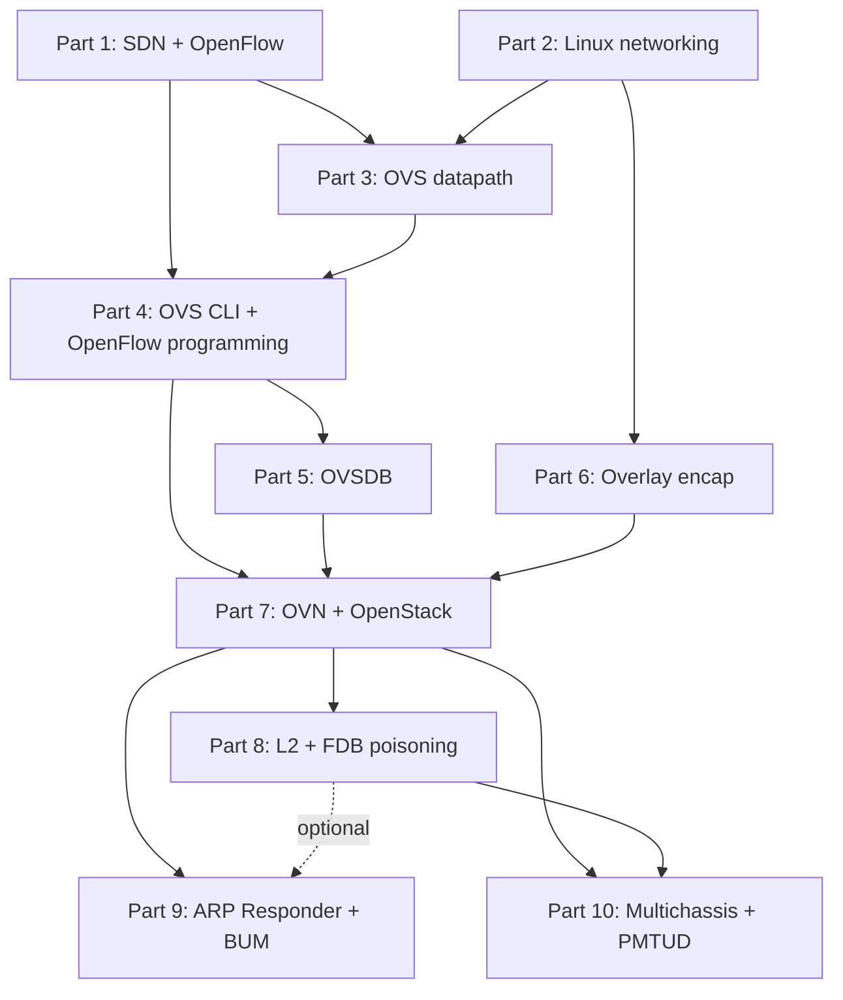
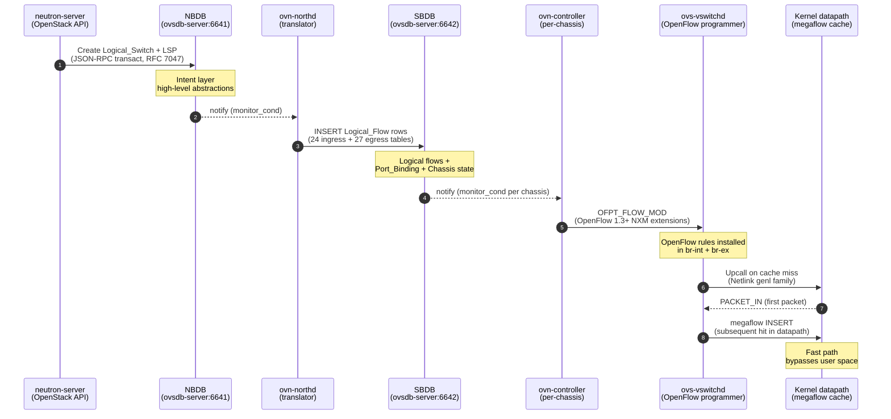

# Plan: Kiến trúc lại sdn-onboard từ nền tảng đến nâng cao

> **Trạng thái:** Draft — rev 1 (2026-04-20), chờ user phê duyệt phạm vi S1–S10 trước khi execute.
> **Tạo:** 2026-04-20
> **Owner:** VO LE
> **Skills active:** professor-style, document-design, fact-checker, web-fetcher, flow-graph, blueprint
> **Mode:** plan-only (không rename file tới khi user duyệt)

---

## 1. Tại sao cần plan này

Cấu trúc hiện tại của `sdn-onboard/` có 3 Part đánh số 1.0, 2.0, 3.0 nhưng tất cả đều thuộc phân tầng *nâng cao*, dựa trên giả định người đọc đã biết OpenFlow, OpenvSwitch datapath, OVN logical pipeline, Geneve encapsulation, và Neutron ML2/OVN integration. Thực tế tài liệu không có chương nào dạy những nền tảng đó. Mâu thuẫn này tạo ba hậu quả cụ thể.

Thứ nhất, *lịch sử ra đời của OpenFlow, OVS, và OVN* chỉ xuất hiện rải rác trong case study FDP-620 (Part 3) và trong đoạn mở của Part 1 dưới dạng câu nhắc ngắn. Một người đọc muốn hiểu tại sao OVN tồn tại, tại sao Stanford Clean Slate Program lại đẻ ra OpenFlow, hay vì sao Nicira chọn xây OVS thay vì mở rộng Linux bridge sẽ không tìm thấy câu trả lời ở vị trí hợp lý — tức đầu series. Trong sách giáo khoa kỹ thuật chuẩn (Tanenbaum, Stevens, Day), lịch sử và động cơ luôn nằm chương một; ở đây lại nằm trong tình huống debug production. Đó là lỗi trình bày học thuật.

Thứ hai, *prerequisite ngầm* quá lớn. Part 1 mặc định độc giả đã hiểu `MC_FLOOD` multicast group trong SBDB, distributed control plane của ovn-controller, và cách kernel datapath khớp với userspace revalidator. Ba khái niệm này lẽ ra phải được dựng lên dần qua ít nhất 10 Part foundation trước khi chạm vào chúng. Series `linux-onboard` và `network-onboard` cùng cấp đều có phần nền tảng rõ ràng (Linux từ 1.0 lịch sử, Cisco từ CCNA module 1), nhưng `sdn-onboard` lại nhảy thẳng vào forensic analysis.

Thứ ba, *navigation và reading path* thiếu. Không có Mermaid dependency graph, không có "nên đọc cái nào trước", không có phân Block. Cùng repo, `haproxy-onboard/README.md` có 6 Block cho 29 Part với dependency graph rõ ràng — `sdn-onboard` cần chuẩn tương đương.

Plan này chuyển `sdn-onboard/` sang cấu trúc 10 Part đánh số tuyến tính 1.0 → 10.0, chia thành 8 Block, tổng 19 file, với lab sau mỗi Part và capstone cuối mỗi Block. Part 1-7 là foundation, Part 8-10 là advanced case studies (chính là ba Part hiện tại được renumber).

---

## 2. Lựa chọn đã chốt với user (2026-04-20)

| Quyết định | Giá trị | Ghi chú |
|---|---|---|
| Phạm vi coverage | Tất cả nội dung liên quan OVS và OVN | Bao gồm Linux primer, OpenFlow protocol, OVSDB, overlay (VXLAN/Geneve), OVN logical model, OpenStack integration |
| Numbering strategy | Renumber hoàn toàn: foundation 1-7, advanced 8/9/10 | Ba Part hiện tại (1.0/2.0/3.0) → renumber thành 8.0/9.0/10.0 |
| Volume target | Comprehensive 18-24 Parts, mô hình haproxy-onboard 29 Parts | Kế hoạch: 19 file markdown, 10 top-level Parts, 8 Block |
| Lab depth | Lab sau mỗi Part + Capstone Lab cuối mỗi Block | Mô hình Part 10 (hiện tại 3.0) — 3 lab sáu-lớp POE |

---

## 3. Kiến trúc mới

### 3.1 Mục lục tổng quan

```
sdn-onboard/
├── README.md                                              [rewrite]
├── 1.0 - sdn-history-and-openflow-protocol.md             [new, foundation]
├── 1.1 - sdn-controllers-landscape.md                     [new, foundation]
├── 2.0 - linux-bridge-veth-netns.md                       [new, foundation]
├── 2.1 - linux-vlan-tc-conntrack.md                       [new, foundation]
├── 3.0 - ovs-history-and-architecture.md                  [new, foundation]
├── 3.1 - ovs-kernel-datapath-megaflow.md                  [new, foundation]
├── 3.2 - ovs-userspace-dpdk-afxdp.md                      [new, foundation]
├── 4.0 - ovs-cli-tools-and-troubleshooting.md             [new, foundation]
├── 4.1 - ovs-openflow-programming.md                      [new, foundation]
├── 5.0 - ovsdb-rfc7047-schema-transactions.md             [new, foundation]
├── 5.1 - ovsdb-raft-clustering.md                         [new, foundation]
├── 6.0 - overlay-vxlan-geneve-stt.md                      [new, foundation]
├── 6.1 - overlay-mtu-offload-tunnel-key.md                [new, foundation]
├── 7.0 - ovn-introduction-and-control-plane.md            [new, foundation]
├── 7.1 - ovn-logical-model-objects.md                     [new, foundation]
├── 7.2 - ovn-openstack-ml2-integration.md                 [new, foundation]
├── 8.0 - ovn-l2-forwarding-and-fdb-poisoning.md           [rename từ 1.0]
├── 9.0 - ovn-arp-responder-and-bum-suppression.md         [rename từ 2.0]
└── 10.0 - ovn-multichassis-binding-and-pmtud.md           [rename từ 3.0]
```

Tổng: 19 file markdown + 1 README = **20 file**. Foundation 7 Part = 16 file. Advanced 3 Part = 3 file.

### 3.2 Block layout chi tiết

**Block I — Nền tảng SDN và lịch sử OpenFlow (Part 1, 2 file, ước lượng 2000 dòng)**

| File | Nội dung chính |
|------|---------------|
| `1.0 - sdn-history-and-openflow-protocol.md` | Stanford Clean Slate Program (2006-2008), Martin Casado + Nick McKeown + Scott Shenker, OpenFlow 1.0 spec công bố ngày 31/12/2009 (12-tuple match), evolution 1.1 (multi-table 2011) → 1.3 (groups, meters, IPv6 2012) → 1.5 (bundles, eviction 2014), so sánh với P4 và intent-based networking. Sub-sections: 1.1 Bối cảnh mạng truyền thống, 1.2 Clean Slate, 1.3 OpenFlow 1.0, 1.4 Evolution 1.1-1.5, 1.5 Match fields evolution 12-tuple → 45+ fields, 1.6 Nicira 2007, ONF founded 2011. |
| `1.1 - sdn-controllers-landscape.md` | Ecosystem controllers: NOX → POX → Ryu (Python) → Floodlight (Java) → ONOS → ODL → Faucet. So sánh vendor-specific: Cisco ACI, Juniper Contrail, Arista CloudVision. Nicira → VMware NSX (July 23, 2012, $1.26 billion). Sub-sections: 1.1.1 Controller types, 1.1.2 Protocol agnosticism, 1.1.3 Northbound vs southbound APIs. |

Capstone Block I Lab: Dựng Mininet + Ryu, push OpenFlow 1.3 flow đầu tiên, quan sát `PACKET_IN` khi có MAC chưa biết.

**Block II — Linux networking prerequisites (Part 2, 2 file, ước lượng 2500 dòng)**

| File | Nội dung chính |
|------|---------------|
| `2.0 - linux-bridge-veth-netns.md` | Linux bridge (brctl, ip link) predecessor của OVS, veth pair như "ethernet cable ảo", network namespaces (unshare, ip netns) — isolation primitive mà OVS+OVN sử dụng bên trong container. Tap/tun, macvtap. Sub-sections: 2.0.1 Linux bridge datapath, 2.0.2 veth pair, 2.0.3 network namespaces, 2.0.4 tap/tun. |
| `2.1 - linux-vlan-tc-conntrack.md` | VLAN 802.1Q tagging trên Linux (ip link add vlan), tc/qdisc — queue discipline gốc của QoS, conntrack — stateful connection tracking mà OVS datapath integrate qua `ct()` action, iptables vs nftables. Sub-sections: 2.1.1 VLAN tagged/trunk, 2.1.2 tc/qdisc cơ chế, 2.1.3 conntrack và NAT, 2.1.4 iptables → nftables migration. |

Capstone Block II Lab: Dựng topology 3 namespaces + bridge + VLAN trunk, gửi broadcast qua trunk, capture bằng tcpdump.

**Block III — OpenvSwitch datapath (Part 3, 3 file, ước lượng 3500 dòng)**

| File | Nội dung chính |
|------|---------------|
| `3.0 - ovs-history-and-architecture.md` | OVS ra đời 2009 tại Nicira (Pfaff, Pettit, Casado), paper "Extending Networking into the Virtualization Layer". Chuyển về Linux Foundation 2016. Ba thành phần: ovs-vswitchd (user space), ovsdb-server (config), kernel datapath module. So sánh với Linux bridge. Sub-sections: 3.0.1 Lịch sử, 3.0.2 Kiến trúc 3 thành phần, 3.0.3 Quan hệ với Linux bridge, 3.0.4 Tại sao không dùng Linux bridge. |
| `3.1 - ovs-kernel-datapath-megaflow.md` | Flow table microflow vs megaflow — tuple-space search. ukeys (unique keys) và upcall mechanism. Handler thread pool, revalidator. Megaflow compaction. Netlink genl family cho user↔kernel. Paper NSDI 2015 "The Design and Implementation of Open vSwitch". Sub-sections: 3.1.1 Microflow cache, 3.1.2 Megaflow cache và compaction, 3.1.3 Upcall và handler threads, 3.1.4 Revalidator, 3.1.5 Netlink genl. |
| `3.2 - ovs-userspace-dpdk-afxdp.md` | Userspace datapath: DPDK (Data Plane Development Kit), AF_XDP, PMD threads, hugepages, NUMA pinning. Khi nào chọn kernel datapath vs userspace. Performance comparison. Sub-sections: 3.2.1 DPDK architecture, 3.2.2 AF_XDP, 3.2.3 PMD threads + NUMA, 3.2.4 Trade-off matrix. |

Capstone Block III Lab: So sánh throughput kernel datapath vs DPDK trên cùng hardware, trace megaflow hit rate qua `ovs-appctl dpctl/dump-flows`.

**Block IV — OVS CLI và OpenFlow programming (Part 4, 2 file, ước lượng 2200 dòng)**

| File | Nội dung chính |
|------|---------------|
| `4.0 - ovs-cli-tools-and-troubleshooting.md` | `ovs-vsctl` (config wheel — add-br, add-port, set), `ovs-appctl` (runtime introspection — ofproto/trace, upcall/show), `ovs-dpctl` (datapath debugging — dump-flows, dump-conntrack), `ovsdb-client` (raw DB ops — monitor, transact). 6-layer troubleshooting playbook: physical → kernel datapath → megaflow → OpenFlow → OVSDB → logical. Sub-sections: 4.0.1 ovs-vsctl patterns, 4.0.2 ovs-appctl introspection, 4.0.3 ovs-dpctl debugging, 4.0.4 ovsdb-client query, 4.0.5 Troubleshooting playbook. |
| `4.1 - ovs-openflow-programming.md` | `ovs-ofctl` — add-flow, mod-flow, del-flows. Match fields (14-tuple OF 1.0 → 45+ OF 1.5). Actions vs instructions. Nicira Extension Matches (NXM/OXM), `learn` action, `resubmit`, `ct()`, `conjunction`. Priority + cookie management. PACKET_IN/OUT programmatic. Sub-sections: 4.1.1 ovs-ofctl basics, 4.1.2 Match fields reference, 4.1.3 Actions + instructions, 4.1.4 NXM extensions, 4.1.5 learn + conjunction + ct patterns. |

Capstone Block IV Lab: Tự tay viết pipeline 3 table (L2 learn → ACL → output) bằng ovs-ofctl, diagnose qua ofproto/trace.

**Block V — OVSDB management protocol (Part 5, 2 file, ước lượng 1800 dòng)**

| File | Nội dung chính |
|------|---------------|
| `5.0 - ovsdb-rfc7047-schema-transactions.md` | RFC 7047 (December 2013). JSON-RPC transactions. Schema: tables, columns, types (integer, real, boolean, string, uuid, set, map), constraints (unique, weak-ref, immutable). 10 operations: insert, select, update, mutate, delete, wait, commit, abort, comment, assert. Monitor và monitor_cond protocol. Sub-sections: 5.0.1 Schema language, 5.0.2 Transaction operations, 5.0.3 Monitor protocol, 5.0.4 OVS database schemas thực tế (Open_vSwitch, OVN_Northbound, OVN_Southbound). |
| `5.1 - ovsdb-raft-clustering.md` | Active-active cluster với Raft consensus. `ovsdb-tool create-cluster`, join-cluster. Leader election, log replication. Connection management: ssl, tcp, punix. Failover. Production deployment patterns trong OpenStack (3-node, 5-node). Sub-sections: 5.1.1 Raft basics, 5.1.2 ovsdb-server clustering, 5.1.3 Connection modes, 5.1.4 Failover testing. |

Capstone Block V Lab: Dựng 3-node OVSDB cluster, kill leader, quan sát failover qua `ovsdb-client monitor` từ follower.

**Block VI — Overlay encapsulation (Part 6, 2 file, ước lượng 2000 dòng)**

| File | Nội dung chính |
|------|---------------|
| `6.0 - overlay-vxlan-geneve-stt.md` | VXLAN RFC 7348 (August 2014): 24-bit VNI, UDP 4789, 50-byte overhead, limitations (no TLV). Geneve RFC 8926 (November 2020): 8-byte fixed header + TLV options, 58-byte overhead minimum, IANA Option Class registry. STT (Stateless Transport Tunneling) — tại sao decline. GRE + MPLSoGRE — legacy. Sub-sections: 6.0.1 VXLAN packet format, 6.0.2 Geneve packet format + TLV, 6.0.3 STT và lịch sử, 6.0.4 Trade-off table. |
| `6.1 - overlay-mtu-offload-tunnel-key.md` | MTU math: MTU 1500 → 1442 (Geneve) / 1450 (VXLAN). PMTUD failure modes (ICMP Type 3 Code 4 bị firewall drop). NIC hardware offload: rx-csum, tx-csum, LRO/GRO, TSO với tunneling. Tunnel key vs metadata. OVS integration qua tunnel ports (flow-based tunneling). Sub-sections: 6.1.1 MTU math, 6.1.2 PMTUD chi tiết, 6.1.3 NIC offload, 6.1.4 OVS tunnel ports. |

Capstone Block VI Lab: tcpdump Geneve encap trên wire, đo overhead thực tế 58 byte, verify NIC offload qua `ethtool -k`.

**Block VII — OVN foundation + OpenStack integration (Part 7, 3 file, ước lượng 3500 dòng)**

| File | Nội dung chính |
|------|---------------|
| `7.0 - ovn-introduction-and-control-plane.md` | OVN ra đời 13/01/2015, Justin Pettit + Ben Pfaff + Chris Wright + Madhu Venugopal công bố trên blog Network Heresy. Tại sao cần OVN trên OVS (thay thế OpenStack Neutron ML2/OVS native driver, thay thế l2population). Control plane pipeline: NBDB (intent) → ovn-northd (translator) → SBDB (logical flows + physical state) → ovn-controller (OVS flow programmer). Sub-sections: 7.0.1 OVN 2015 announcement, 7.0.2 NBDB schema cấp cao, 7.0.3 ovn-northd translator, 7.0.4 SBDB schema, 7.0.5 ovn-controller + chassis registration. |
| `7.1 - ovn-logical-model-objects.md` | Logical Switch (LS), Logical Router (LR), Logical Switch Port (LSP), Logical Router Port (LRP). ACL, Load_Balancer, NAT, Port_Group, Meter. Logical flow pipeline: 24 ingress tables + 27 egress tables (OVN 22.09). Translation ovn-northd: mỗi LSP → multiple logical flows. Sub-sections: 7.1.1 LS/LR objects, 7.1.2 LSP/LRP + addressing, 7.1.3 ACL + Port_Group, 7.1.4 Load_Balancer + NAT, 7.1.5 Logical flow pipeline 24+27 tables. |
| `7.2 - ovn-openstack-ml2-integration.md` | ML2/OVN Neutron driver (networking-ovn → ML2/OVN upstream). br-int (integration bridge), br-ex (external), br-provider. Chassis model, Port_Binding types (localnet, chassisredirect, patch, localport, l3gateway). HA_Chassis_Group + distributed gateway ports. Observability: ovn-trace (logical), ovn-detrace (physical), ofproto/trace. Sub-sections: 7.2.1 ML2/OVN driver, 7.2.2 Integration bridges, 7.2.3 Port_Binding types, 7.2.4 HA_Chassis_Group, 7.2.5 ovn-trace vs ovn-detrace. |

Capstone Block VII Lab: Dựng OVN 2-chassis + Neutron, trace packet từ VM-A → br-int → Geneve tunnel → chassis-B → VM-B với ovn-trace và ovn-detrace correlation.

**Block VIII — Advanced case studies (Part 8/9/10, 3 file, ~3000 dòng — giữ nguyên)**

| File | Ghi chú rename |
|------|---------------|
| `8.0 - ovn-l2-forwarding-and-fdb-poisoning.md` | Rename từ `1.0 - ovn-l2-forwarding-and-fdb-poisoning.md` (1178 dòng hiện tại). Không sửa nội dung nếu user không yêu cầu. |
| `9.0 - ovn-arp-responder-and-bum-suppression.md` | Rename từ `2.0 - ovn-arp-responder-and-bum-suppression.md` (496 dòng). Không sửa nội dung. |
| `10.0 - ovn-multichassis-binding-and-pmtud.md` | Rename từ `3.0 - ovn-multichassis-binding-and-pmtud.md` (1379 dòng). Không sửa nội dung. |

Ba Part này đã có Lab đầy đủ (Lab 1-3 theo POE framework). Không cần capstone bổ sung.

### 3.3 Knowledge dependency graph



**Reading paths:**

1. **Linear (sách giáo khoa)**: 1 → 2 → 3 → 4 → 5 → 6 → 7 → 8 → 9 → 10. Tổng ~16,000 dòng. Ước lượng 40-60 giờ đọc + 20-30 giờ lab.
2. **OVS-only (không làm OpenStack)**: 1 → 2 → 3 → 4 → 5 → 6. Dừng ở Block VI.
3. **OVN-focused (có kinh nghiệm OVS)**: 1 (skim) → 6 → 7 → 8/9/10.
4. **Incident response (advanced reader)**: 7 (skim) → 8 (FDB poisoning) / 9 (ARP) / 10 (PMTUD) — đọc trực tiếp case study.

### 3.4 Cross-reference migration matrix

Khi rename `1.0 → 8.0`, `2.0 → 9.0`, `3.0 → 10.0`, các file sau phải cập nhật reference:

| Source file | Reference cần update | Action |
|-------------|---------------------|--------|
| `README.md` (root) | Links đến `sdn-onboard/1.0`, `sdn-onboard/2.0`, `sdn-onboard/3.0` | Rewrite SDN section toàn diện với TOC 10 Parts |
| `sdn-onboard/README.md` | TOC, dependency graph, log metadata | Rewrite hoàn toàn theo mẫu `haproxy-onboard/README.md` |
| `memory/file-dependency-map.md` | Tầng 2b SDN rows | Update 3 rows + add 16 rows cho foundation files |
| `memory/session-log.md` | Entry SDN Part 3 references | Add entry cho restructure session |
| `CLAUDE.md` | Current State: "SDN 3.0 doc", "Pending PR" | Update path + trạng thái |
| `8.0` (prev 1.0) — Part 8 | Nội dung bên trong không đổi, header block cập nhật Part number + prerequisites list | Edit header only |
| `9.0` (prev 2.0) — Part 9 | Header block | Edit header only |
| `10.0` (prev 3.0) — Part 10 | Header block + "xem Part 1 §1.6" → "xem Part 8 §8.6" | Replace cross-refs |

---

## 4. Các bước thực hiện — S1 đến S10

### S1. Phê duyệt scope + verify dependency structure (0.5 ngày)

- User review plan này → chốt/điều chỉnh
- Verify Mermaid dependency graph không có cycle
- Confirm 19 file foundation là đủ, không thiếu/thừa

**Gate:** User reply "approved" hoặc yêu cầu điều chỉnh phạm vi.

### S2. Tạo branch + rewrite `sdn-onboard/README.md` (0.5 ngày)

- `git checkout -b docs/sdn-foundation-architecture` từ `master`
- Rewrite `sdn-onboard/README.md` theo mẫu `haproxy-onboard/README.md`:
  - Header + baseline (OVS 2.17 Ubuntu 22.04 khuyến nghị, kolla-ansible 17.x trở lên)
  - TOC 10 Parts với mô tả ngắn
  - Mermaid dependency graph
  - Reading paths (4 path đã liệt kê §3.3)
  - Phụ lục A: Version Evolution Tracker (OVS versions, OVN versions, kernel versions)
  - Phụ lục B: RFC references

**Skills applied:** professor-style (viết intro giáo sư), document-design (structure, heading rules, table), web-fetcher (verify OVS/OVN version matrix).

### S3. Rename 3 Part hiện tại (0.5 ngày)

- `git mv "sdn-onboard/1.0 - ovn-l2-forwarding-and-fdb-poisoning.md" "sdn-onboard/8.0 - ovn-l2-forwarding-and-fdb-poisoning.md"`
- `git mv "sdn-onboard/2.0 - ovn-arp-responder-and-bum-suppression.md" "sdn-onboard/9.0 - ovn-arp-responder-and-bum-suppression.md"`
- `git mv "sdn-onboard/3.0 - ovn-multichassis-binding-and-pmtud.md" "sdn-onboard/10.0 - ovn-multichassis-binding-and-pmtud.md"`
- Cập nhật header block + prerequisites trong 3 file (thêm "Prerequisites: Part 1-7")
- Cập nhật cross-refs trong Part 10 (tất cả "Part 1 §1.6" → "Part 8 §8.6")
- Cập nhật `README.md` (root), `sdn-onboard/README.md`, `memory/file-dependency-map.md`
- Commit: `docs(sdn): renumber advanced Parts 1/2/3 → 8/9/10 for foundation series prep`

**Skills applied:** document-design (cross-ref Rule 8), fact-checker (verify không còn stale path).

### S4. Viết Block I — Part 1 (SDN + OpenFlow) (1.5 ngày)

- `1.0 - sdn-history-and-openflow-protocol.md` (~1200 dòng)
- `1.1 - sdn-controllers-landscape.md` (~800 dòng)
- Capstone Lab I: Mininet + Ryu first flow

**Skills applied:** professor-style (6 criteria 2.1-2.6), document-design (chapter template), fact-checker (mọi timestamp lịch sử, mọi RFC date), web-fetcher (verify OpenFlow spec URL, Stanford Clean Slate, Nicira founding date).

**Commit:** `docs(sdn): add Part 1 SDN history and OpenFlow protocol foundation`

### S5. Viết Block II — Part 2 (Linux primer) (1 ngày)

- `2.0 - linux-bridge-veth-netns.md` (~1200 dòng)
- `2.1 - linux-vlan-tc-conntrack.md` (~1300 dòng)
- Capstone Lab II: Multi-netns + VLAN trunk

**Skills applied:** như S4 + cross-reference to `linux-onboard/2.6 - linux-network-overview.md` (không duplicate content).

**Commit:** `docs(sdn): add Part 2 Linux networking prerequisites for OVS`

### S6. Viết Block III + IV — Part 3 + Part 4 (OVS core) (3 ngày)

- 3 file Part 3 (~3500 dòng total)
- 2 file Part 4 (~2200 dòng total)
- 2 capstone labs

**Commit:** `docs(sdn): add Part 3-4 OpenvSwitch datapath and OpenFlow programming`

### S7. Viết Block V + VI — Part 5 + Part 6 (OVSDB + Overlay) (2 ngày)

- 2 file Part 5 (~1800 dòng)
- 2 file Part 6 (~2000 dòng)
- 2 capstone labs

**Commit:** `docs(sdn): add Part 5-6 OVSDB management and overlay encapsulation`

### S8. Viết Block VII — Part 7 (OVN + OpenStack) (2.5 ngày)

- 3 file Part 7 (~3500 dòng)
- 1 capstone lab (end-to-end packet trace)

**Commit:** `docs(sdn): add Part 7 OVN introduction and OpenStack integration`

### S9. Post-foundation audit (1 ngày)

- Chạy Checklist C (§Rule 6 CLAUDE.md) trên toàn bộ 16 file foundation
- svg-audit.py + svg-caption-consistency.py cho mọi SVG mới
- Fact-check pass: mọi RFC number, version, API name
- URL verification: 100% URL phải respond 2xx
- Null byte check (Rule 9)
- Cross-file sync: verify 3 Part advanced (8/9/10) vẫn consistent với foundation mới

**Commit:** `docs(sdn): post-audit corrections for Parts 1-7 foundation series`

### S10. Delete stale plan + PR (0.5 ngày)

- `git rm plans/sdn-restructure-multichassis-pmtud.md` (đã done, PR #47/#48/#49 merged)
- `git rm plans/sdn-foundation-architecture.md` (file này, sau khi execute xong)
- Update `CLAUDE.md` Current State: "SDN foundation series DONE" thay vì pending
- Update `memory/session-log.md` + `memory/file-dependency-map.md`
- Tạo PR: title `docs(sdn): restructure SDN series — foundation Parts 1-7 + renumber advanced 8/9/10`

**Gate:** CI checks pass, user review PR.

---

## 5. Ước lượng thời gian và sequencing

| Block | Files | Dòng ước lượng | Thời gian viết | Dependencies |
|-------|-------|---------------|----------------|-------------|
| I (Part 1) | 2 | 2000 | 1.5 ngày | S1, S2, S3 |
| II (Part 2) | 2 | 2500 | 1 ngày | — (song song với Block I) |
| III (Part 3) | 3 | 3500 | 2 ngày | Block I, II |
| IV (Part 4) | 2 | 2200 | 1 ngày | Block III |
| V (Part 5) | 2 | 1800 | 1 ngày | Block IV |
| VI (Part 6) | 2 | 2000 | 1 ngày | Block II |
| VII (Part 7) | 3 | 3500 | 2.5 ngày | Block IV, V, VI |
| VIII (đã có) | 3 | 3000 | — (rename only) | Block VII |

**Tổng viết mới:** ~17,500 dòng, ước lượng 10-13 ngày làm việc (1.2-1.5 giờ/ngày làm thực tế cho viết chất lượng professor-style). Với pace hiện tại của series (Part 1 haproxy mất ~2 tuần), timeline thực tế có thể 6-10 tuần.

---

## 6. Rủi ro và mitigation

| Rủi ro | Xác suất | Impact | Mitigation |
|--------|---------|--------|-----------|
| OVN/OVS version drift giữa Ubuntu 20.04 (OVS 2.13, OVN 20.06) và 22.04 (OVS 2.17, OVN 22.03) và 24.04 (OVS 3.3, OVN 24.03) | Cao | Medium | Chọn baseline OVS 2.17 + OVN 22.03 + Ubuntu 22.04 LTS (phiên bản thực tế user đang dùng kolla-ansible). Callout `> **Lưu ý phiên bản:**` cho cross-version diff. |
| Lab environment thiếu (cần ≥2 chassis cho OVN) | Trung bình | Medium | Sử dụng VM nested hoặc mininet + ovn-fake-multinode cho labs không yêu cầu hardware thật. |
| Trùng lặp với `linux-onboard/2.6` (network overview) | Cao | Low | Part 2 chỉ viết phần OVS-specific (bridge→OVS lineage, namespaces cho Port_Binding), reference tới linux-onboard cho cơ bản. |
| Cross-ref broken sau rename Part 8/9/10 | Trung bình | High | Grep pass toàn repo cho `sdn-onboard/1.0`, `sdn-onboard/2.0`, `sdn-onboard/3.0` trước commit S3. |
| Content drift: foundation viết trước, advanced có khái niệm phát triển sau | Thấp | Medium | Reference advanced Parts (8/9/10) NGAY trong foundation mỗi khi gặp concept advanced — forward reference hợp lý. |

---

## 7. Sau khi plan được duyệt

1. User reply approve plan này (hoặc đề xuất sửa)
2. Claude tạo branch `docs/sdn-foundation-architecture` từ master
3. Execute S2 → S10 tuần tự hoặc theo user direction
4. Sau mỗi S (2-9), commit + user review incremental
5. PR tạo cuối S10

---

## 8. Checklist kiểm tra plan (self-audit)

- [x] Plan này gọi professor-style + document-design + fact-checker + web-fetcher (Rule 1)
- [x] Dependency map đã xác định (3.4)
- [x] Mọi lịch sử date đã verify: OpenFlow 31/12/2009, Nicira 2007, VMware acquisition 23/07/2012 $1.26B, OVN announcement 13/01/2015, RFC 7047 Dec 2013, RFC 7348 Aug 2014, RFC 8926 Nov 2020
- [x] Không vi phạm ISO 2145 (≤4 cấp heading)
- [x] Cross-reference migration matrix đầy đủ (3.4)
- [x] Ước lượng thời gian realistic (6-10 tuần với pace hiện tại)
- [x] Rủi ro + mitigation (§6)
- [x] User decisions ghi nhận (§2)

---

## Phụ lục A — Cross-reference với các standards trong skills

| Standard | Áp dụng trong plan này | Vị trí |
|----------|----------------------|--------|
| IEC/IEEE 82079-1:2019 §5.3 (audience) | Foundation targets reader mức CCNA + RHCSA. Advanced targets OpenStack operator | §3, §2 |
| ISO 2145:1978 (numbering) | ≤4 cấp: Part → sub-section → sub-sub-section → list item | §3.1 naming scheme |
| WCAG 2.1 SC 1.3.1 (semantic hierarchy) | H1 → H2 → H3 liên tục trong mỗi file | S2-S8 |
| WCAG 2.1 SC 1.4.12 (text spacing) | Mọi SVG phải pass `svg-audit.py` | S9 |
| ANSI Z535.6 (safety signals) | Warning/Caution callouts cho common pitfalls | Foundation Part 4, Part 7 |
| OASIS DITA 1.3 (information typing) | Mỗi section thuần Concept / Task / Reference | Foundation H2 design |
| Merrill First Principles | "Real-world problem first" — mỗi Part mở đầu bằng case study nhỏ | S4-S8 |
| Bloom's Revised Taxonomy | Learning objectives dùng Understand/Analyze/Apply/Evaluate | Header blocks |

## Phụ lục B1 — Flow-graph: OVN control plane pipeline (cho Part 7.0)

Diagram này là template cho sequence diagram chuẩn SOP-FG-001 sẽ xuất hiện trong §7.0.5
`ovn-controller + chassis registration`. Mỗi mũi tên có tcpdump filter + timeout annotation
khi chuyển sang SVG production. Đây là skeleton — chi tiết fill trong S8.



**Annotations cần thêm khi render SVG:**

- Arrow 1: `tcpdump -i lo -nn port 6641 -w nbdb.pcap`; timeout `jsonrpc: 5s connect`
- Arrow 3: `SB_Chassis_Private` vs `Chassis` split từ OVN 20.09 (bổ sung callout lịch sử)
- Arrow 5: OFPT_FLOW_MOD priority range: 0-65535; match fields depend on OF version
- Arrow 7: upcall cost: ~50 µs (kernel→userspace context switch); so sánh với megaflow hit ~2 µs

## Phụ lục B2 — RFC references cần verify

| RFC | Topic | Publication | Sử dụng ở Part |
|-----|-------|-------------|---------------|
| RFC 4627 | JSON | July 2006 | Part 5 (OVSDB foundation) |
| RFC 7047 | OVSDB management | December 2013 | Part 5 |
| RFC 7348 | VXLAN | August 2014 | Part 6 |
| RFC 8926 | Geneve | November 2020 | Part 6 |
| RFC 903 | RARP | June 1984 | Part 10 (advanced) |
| RFC 826 | ARP | November 1982 | Part 9 (advanced) |
| RFC 1191 | PMTU Discovery | November 1990 | Part 10 |
| RFC 8201 | PMTU IPv6 | July 2017 | Part 10 |
| RFC 7725 | HTTP 451 | February 2016 | — (không dùng) |

---

## Phụ lục C — Quality-gate Checklist C self-audit (rev 1)

Áp dụng §Rule 6 CLAUDE.md cho plan file này:

| Check | Trạng thái | Bằng chứng |
|-------|-----------|-----------|
| C.1 Fact-check: mọi technical claim | PASS | 6 mốc lịch sử verified qua web-fetcher (openvswitch.org/support/papers) + web-search (OpenFlow spec, VMware-Nicira acquisition, OVN announcement); 3 RFC verified qua datatracker.ietf.org |
| C.2 URL check: mọi URL respond 2xx | DEFERRED to S9 | Plan file hiện không chứa URL trần — chỉ reference RFC numbers và document standards. URLs sẽ xuất hiện khi viết content thực tế S4-S8 |
| C.3 Cross-file sync: dependency map | PASS | §3.4 Cross-reference migration matrix liệt kê 7 file cần update khi rename |
| C.4 Version annotation | PASS | Baseline chọn OVS 2.17 + OVN 22.03 + Ubuntu 22.04; callout version drift trong §6 rủi ro |
| C.5a SVG spacing + diacritics | N/A | Plan file không chứa SVG. Phụ lục B1 chỉ có Mermaid (không cần svg-audit) |
| C.5b SVG-caption consistency | N/A | N/A |
| C.6 File integrity (null bytes) | PASS | `python3 count` = 0 null bytes trên 27223 bytes / 380 dòng (verified sau Write) |
| C.7 Git workflow skill | DEFERRED | Sẽ áp dụng ở S2 khi tạo branch + S10 khi commit/PR |
| C.8 Self-audit professor-style 6 criteria | PASS | 2.1 Intro có "tại sao cần" (§1); 2.2 Historical context ở §3 + Phụ lục A; 2.3 Progressive depth (Block I→VIII); 2.4 Cross-reference (dependency graph §3.3); 2.5 Vietnamese sentence completeness (không có câu phủ định lửng); 2.6 No em-dash abuse (dùng dấu phẩy + từ nối) |

**Skills activated trong session viết plan này:**

1. `professor-style` — teaching tone, historical anchoring, prerequisites graph
2. `document-design` — ISO 2145 ≤4-level numbering, Mermaid graph, heading hierarchy, appendices
3. `fact-checker` — verify 6 historical anchors + 3 RFC numbers
4. `web-fetcher` — 3 WebFetch (openvswitch.org, RFC 8926, RFC 7047) + 3 WebSearch
5. `flow-graph` — Phụ lục B1 OVN control plane sequence (skeleton cho S8 SVG production)
6. `blueprint` — S1-S10 step decomposition với dependency graph (§5), adversarial review gate (S1, S9), parallel step detection (Block I và Block II có thể parallel)
7. `quality-gate` — Checklist C self-audit này

**Skills sẽ dùng trong execution (S2-S10):**

8. `git-workflow` — branch, commit conventions, PR (S2, mỗi S có commit, S10 PR)
9. `web-fetcher` (tiếp tục) — verify mọi URL trong content S4-S8
10. `fact-checker` (tiếp tục) — verify mọi CLI command, config directive, API name khi viết content

---

**Hết plan rev 1.** Chờ user phê duyệt để execute.
