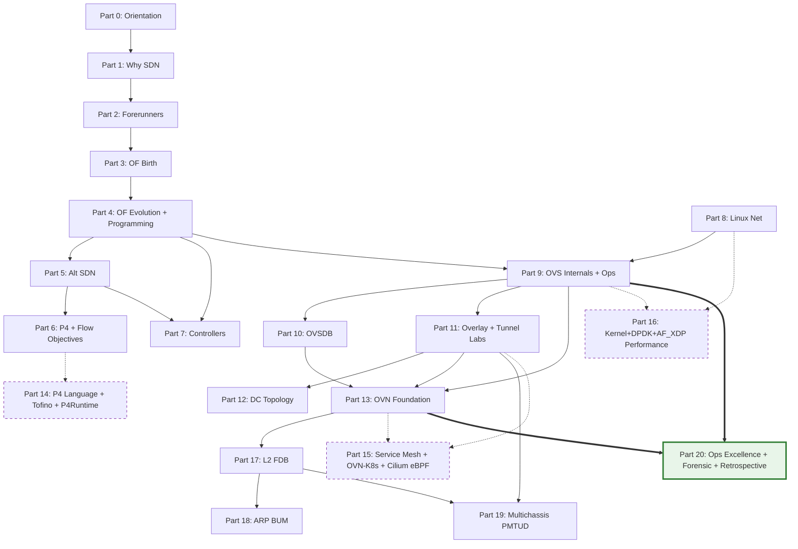

# SDN Onboard: From foundations to operating OVN / OpenvSwitch / OpenFlow

**Release tag:** `v3.1-OperatorMaster` (2026-04-24). 116 files, about 52,600 lines. Operator mastery release closed. See [`../CHANGELOG.md`](../CHANGELOG.md) for change details.

> **Language status:** English (full migration complete, 2026-04-29).

This series is designed to take system and network engineers (CCNA or RHCSA background) through software defined networking to international academic standards. The content spans from the early days of the Stanford Clean Slate Program (2006), through the OpenFlow 1.0 milestone (2009), the rise of Nicira (acquired by VMware in 2012 for 1.26 billion US dollars), all the way to deep forensic analysis techniques inside a 2026 OVN multichassis environment. The teaching pathway is built on OpenvSwitch 2.17.9 and OVN 22.03.8 (Ubuntu 22.04 LTS) and tracks the latest changes in OVS 3.3 and OVN 24.03 (Ubuntu 24.04 Noble) to prepare the reader for an upgrade.

> **Scope.** Focused purely on OVS plus OpenFlow plus OVN standalone. The series does not include OpenStack, Neutron, or kolla-ansible. OVN concepts (Logical_Switch, Port_Binding, HA_Chassis_Group, Logical_Flow) are presented from the standard OVN architecture viewpoint, with the flexibility to integrate with orchestrators such as OVN-Kubernetes or with bare-metal environments.

Primary lab environment: Ubuntu Server 22.04 LTS, OVS 2.17.9 plus OVN 22.03.8 installed with `apt install openvswitch-switch ovn-central ovn-host`. Authoritative references include [OVS Documentation](https://docs.openvswitch.org/en/latest/), [OVN Architecture Manual](https://man7.org/linux/man-pages/man7/ovn-architecture.7.html), [OpenFlow Switch Specification 1.0](https://opennetworking.org/wp-content/uploads/2013/04/openflow-spec-v1.0.0.pdf) through [1.5.1](https://opennetworking.org/wp-content/uploads/2014/10/openflow-switch-v1.5.1.pdf), RFC 7047 (OVSDB, December 2013), RFC 7348 (VXLAN, August 2014), RFC 8926 (Geneve, November 2020), and the NVIDIA DOCA OVS documentation set for hardware offload (Block IX Part 9.5).

> **Version note.** Ubuntu 20.04 ships OVS 2.13 and does not include the `ovn-central` package in main repo (must be backported via the Ubuntu Cloud Archive). Ubuntu 22.04 ships OVS 2.17.9 plus OVN 22.03.8, the baseline for this series. Ubuntu 24.04 ships OVS 3.3 plus OVN 24.03.6 with the new `activation-strategy=rarp` feature and thread groups. Part 19 goes deep on the comparison between original OVN 22.09 multichassis and the RARP-based activation-strategy in OVN 24.03.

## Prerequisite knowledge for the entire series

Before starting, the reader needs three groups of foundational knowledge. First is basic Linux networking at the level of `ip`, `bridge`, `tc`, and network namespaces; this material is covered in linux-onboard Part 2.6. Second is the TCP/IP model, Ethernet frame, ARP, and VLAN 802.1Q at CCNA level; see network-onboard, INE 1-10, and Cisco modules 1 and 2. Third is Linux processes and systemd at linux-onboard Part 2.4, required to understand the lifecycle of the `ovs-vswitchd`, `ovsdb-server`, and `ovn-controller` daemons.

Part 0.0 (how-to-read-this-series) and Part 0.1 (lab-environment-setup) are designed to close any of these gaps. A reader who has not yet set up the lab environment should start at Part 0.1.

---

## Knowledge Dependency Map

The diagram below shows the dependency relationship between the major Parts of the series (Part 0 through Part 20, with the Expert Extension Parts 14 to 16 added in rev 4). An arrow `A -> B` means knowledge from Part A is a direct prerequisite for Part B. Block VIII (Linux networking primer) has no arrow incoming from Blocks I to VII, so it can be read in parallel with the OpenFlow branch when the reader wants to optimise time. Blocks XIV to XVI (Expert Extension, drawn with a dashed border) form an optional track and do not block the foundation path 0 to XIII then 17 to 19. Block XX (Operations, drawn with a thick border) is a cross-cutting operations layer that builds on Block IX and Block XIII to deliver the daily runbook, forensic case studies, and retrospective.

---

## Reading paths, seven routes through the series

This series is designed to serve seven different reader personas; nobody is forced to read it sequentially from beginning to end. Each Part is self-contained via explicit prerequisites stated in the header block, so the reader can jump in at any point once the prerequisites are confirmed.

1. **Linear foundation (university textbook reading, 50 to 80 hours)**: 0 -> 1 -> 2 -> 3 -> 4 -> 5 -> 6 -> 7 -> 8 -> 9 -> 10 -> 11 -> 12 -> 13 -> 17 -> 18 -> 19. Suited to engineers new to OVS or OVN who want full historical and theoretical grounding before touching production.
2. **Historian (history and concepts only)**: 0 -> 1 -> 2 -> 3 -> 4 -> 5 -> 6 -> 7. Stops at the controller landscape. The goal is to understand why SDN exists and the various evolution branches, without going into implementation detail.
3. **OVS-only (production engineer concerned only with the OVS data plane)**: 0 -> 1 (skim) -> 4 -> 8 -> 9 -> 10 -> 11 -> 20.4 (OVS daily operator playbook). Focuses on OVS as a programmable switch plus OpenFlow programming, OVSDB, overlay tunnels, and daily operations. Skips OVN entirely.
4. **OVN-focused (already strong on OVS plus networking, building an OVN deployment)**: 0 -> 3 (skim) -> 5.1 -> 9 (skim) -> 11 -> 13 -> 17 -> 18 -> 19 -> 20.3 (OVN daily operator playbook). The main route for an engineer rolling out OVN standalone.
5. **Incident responder (advanced reader who wants to jump straight to case studies)**: 0 -> 13 (skim) -> 17 -> 18 -> 19 -> 9.26 plus 20.5 (forensic case studies). For an on-call engineer dealing with urgent incidents who already has an OVN background.
6. **Expert Extension track (rev 4, optional)**: after finishing the foundation, three parallel sub-tracks are available:
   - **P4 programmable silicon** (15 to 25 hours): 6 (skim) -> 14.0 -> 14.1 -> 14.2. For a researcher or a Pensando or BlueField DPU engineer.
   - **Service mesh and Kubernetes CNI** (20 to 30 hours): 13 -> 15.0 -> 15.1 -> 15.2. For a platform engineering engineer or a CKAD or CKS candidate.
   - **Performance tuning deep dive** (15 to 20 hours): 8 -> 9.2 -> 9.3 -> 16.0 -> 16.1 -> 16.2. For a hyperscale operator or an HPC or 5G deployment. A real hardware lab is required for the Capstone 16.0-Lab3 (40 Gbps tuning).
7. **Operator daily runbook (rev 5, expansion 2026-04, 30 to 50 hours)**: 0 -> 9 (skim 9.1 plus 9.4) -> 13 (skim 13.1 to 13.3) -> **20.0** (systematic debugging) -> **20.1** (security hardening and audit trail) -> **20.2** (OVN troubleshooting deep-dive) -> **20.3** (OVN daily playbook) -> **20.4** (OVS daily playbook) -> **9.14** (incident decision tree) -> **9.25** (ofproto/trace) -> **9.26** (revalidator storm forensic) -> **9.27** (packet journey end-to-end) -> **20.5** (OVN forensic case studies) -> **20.6** (retrospective 2007 to 2024). For an on-call engineer or SRE who needs to master daily operations, incident response, and forensic debugging on production OVS or OVN. Best suited to a reader who already has the architectural foundation and wants to build muscle memory and playbook reflexes.

---

## Table of contents (13 foundation blocks plus 3 Expert Extension blocks plus 1 Operational Excellence block plus 3 advanced parts, 20 blocks total)

### Block 0, Orientation (4 files after J.2 v3.5)

This block has no deep technical content, only meta and procedural material. The goal is to answer the question, before entering the series, of "how do I read this, what do I need to prepare, where is the starting point?".

- Part 0.0, [How to read this series](0.0%20-%20how-to-read-this-series.md) *(skeleton)*: four reading paths; the conventions for Key Topic, Guided Exercise, Lab, and Trouble Ticket; mapping to CCNA, RHCSA, and CKA.
- Part 0.1, [Lab environment setup](0.1%20-%20lab-environment-setup.md) *(skeleton)*: Ubuntu 22.04 baseline, OVS 2.17 and later plus OVN 22.03 and later install, Mininet for OpenFlow labs, two lab topologies (single-node, two-node chassis pair), health check playbook.
- Part 0.2, [End-to-end packet journey](0.2%20-%20end-to-end-packet-journey.md) *(content, cross-cutting synthesis)*: the journey of a packet through the full OVS plus Geneve plus OVN stack from pod A to pod B, the anchor for every topic in the series.
- Part 0.3, [Master Keyword Index](0.3%20-%20master-keyword-index.md) *(new in v3.5, 1,153 lines)*: a Vietnamese deep adaptation of REF, a lookup spine for 320 plus keywords (five-axis classification, status code DEEP, BREADTH, or SHALLOW, plus cross-links to curriculum Parts that teach the full anatomy). Section I OVS (80 keywords), II OpenFlow (110), III OVN (120 plus), IV banned (10), V cross-link map (50 plus).

### Block I, Why SDN was born (Part 1, 3 files)

This block answers the question "why did the networking industry need SDN after 40 years of doing networks the old way?". It is a hard prerequisite for every later block; without understanding the motivation, the reader cannot understand why OpenFlow was designed the way it was.

- Part 1.0, [Networking industry before SDN](1.0%20-%20networking-industry-before-sdn.md) *(skeleton, Ebook Ch1)*: the vertically integrated model, the East-West traffic explosion of 2005 to 2010, three technical limits in STP, VLAN, and chassis scale.
- Part 1.1, [Data center pain points](1.1%20-%20data-center-pain-points.md) *(skeleton, Ebook Ch2.1 to 2.4)*: L2 broadcast bloat, the 4,096 VLAN limit, ECMP hash imbalance, middle-box insertion.
- Part 1.2, [Five drivers why SDN](1.2%20-%20five-drivers-why-sdn.md) *(skeleton, Ebook Ch2.5 to 2.7)*: server virtualization, East-West traffic, big data, cloud scale, operational cost.

### Block II, SDN forerunners (Part 2, 5 files)

This block introduces seven historical forerunners that led to OpenFlow: DCAN 1995, OPENSIG, NAC, ForCES, 4D, and Ethane. Each movement contributed a piece of the OpenFlow 1.0 architecture. Without this block, OpenFlow looks like a sudden invention.

- Part 2.0, [DCAN, Open Signaling, GSMP](2.0%20-%20dcan-open-signaling-gsmp.md) *(skeleton)*: DCAN Cambridge 1995, GSMP RFC 3292.
- Part 2.1, [Ipsilon and Active Networking](2.1%20-%20ipsilon-and-active-networking.md) *(skeleton)*: Ipsilon GSMP 1996, Active Networking DARPA 1994 to 2000.
- Part 2.2, [NAC, Orchestration, Virtualization](2.2%20-%20nac-orchestration-virtualization.md) *(skeleton)*: network access control, pre-SDN orchestration tooling.
- Part 2.3, [ForCES and the 4D project](2.3%20-%20forces-and-4d-project.md) *(skeleton)*: ForCES IETF RFC 3746, 4D project CMU 2004.
- Part 2.4, [Ethane, the direct ancestor of OpenFlow](2.4%20-%20ethane-the-direct-ancestor.md) *(skeleton)*: Ethane SIGCOMM 2007, Casado plus McKeown plus Shenker.

### Block III, Birth of OpenFlow (Part 3, 5 files after v3.5)

This block tells the concrete story of the Stanford Clean Slate Program 2006 to 2008, OpenFlow 1.0 on 2009-12-31, and the founding of the Open Networking Foundation (ONF) in 2011.

- Part 3.0, [Stanford Clean Slate Program](3.0%20-%20stanford-clean-slate-program.md) *(skeleton)*: Clean Slate Program 2006, McKeown plus Casado plus Shenker.
- Part 3.1, [OpenFlow 1.0 specification](3.1%20-%20openflow-1.0-specification.md) *(skeleton)*: OF 1.0 published 2009-12-31, 12-tuple match, secure channel, fail-open versus fail-closed.
- Part 3.2, [ONF formation and governance](3.2%20-%20onf-formation-and-governance.md) *(skeleton)*: ONF 2011, board members, standardization process.
- Part 3.3, [OpenFlow protocol messages and state machine](3.3%20-%20openflow-protocol-messages-state-machine.md) *(new in v3.5, 553 lines)*: 16 OFPT_* messages divided into four groups, plus the four-stage state machine (HELLO -> FEATURES -> Steady -> AUX), plus auxiliary connections in OF 1.3 and later, plus bundle in OF 1.4 and later. Verified against ONF spec 1.3.5, 1.4, and 1.5.1.
- Part 3.4, [OpenFlow version differences 1.0, 1.3, 1.5](3.4%20-%20openflow-version-differences-1.0-1.3-1.5.md) *(new in v3.5, 426 lines)*: eight cross-version features (single-table to multi-table, NXM to OXM, group, meter, bundle, egress, copy_field, packet_type) plus migration matrix plus decision tree.

### Block IV, OpenFlow evolution (Part 4, 10 files)

The longest block of the historical section, walking through each OpenFlow version from 1.1 to 1.5, the Table Type Patterns (TTP), and the reasons OpenFlow gradually gave way to OVSDB-centric control.

- Part 4.0, [OpenFlow 1.1 multi-table and groups](4.0%20-%20openflow-1.1-multi-table-groups.md) *(skeleton)*: multi-table pipeline, the Group table (all, select, indirect, ff).
- Part 4.1, [OpenFlow 1.2, OXM TLV match](4.1%20-%20openflow-1.2-oxm-tlv-match.md) *(skeleton)*: OXM TLV extensible match, controller roles EQUAL, MASTER, SLAVE.
- Part 4.2, [OpenFlow 1.3, meters, PBB, LTS](4.2%20-%20openflow-1.3-meters-pbb-lts.md) *(skeleton)*: meters per RFC 2697 srTCM, PBB, auxiliary channels, the long-term stable version.
- Part 4.3, [OpenFlow 1.4, bundles, eviction](4.3%20-%20openflow-1.4-bundles-eviction.md) *(skeleton)*: atomic bundle commit, eviction policy, monitoring.
- Part 4.4, [OpenFlow 1.5, egress tables, L4 to L7](4.4%20-%20openflow-1.5-egress-l4l7.md) *(skeleton)*: egress pipeline, packet-type aware, TCP flags match.
- Part 4.5, [TTP, Table Type Patterns](4.5%20-%20ttp-table-type-patterns.md) *(skeleton, ONF TS-017)*: Negotiable Data Plane Model, TTP JSON schema.
- Part 4.6, [OpenFlow limitations and lessons](4.6%20-%20openflow-limitations-lessons.md) *(skeleton)*: vendor chipset fragmentation, rule explosion, operator complexity.
- Part 4.7, [OpenFlow programming with ovs-ofctl](4.7%20-%20openflow-programming-with-ovs.md) *(content, cross-cutting from OpenFlow to OVS)*: multi-table pipeline practice, conntrack integration, flow hygiene playbook. Bridges the theory of Block IV to the practice of Block IX.
- Part 4.8, [OpenFlow and OVS match field catalog](4.8%20-%20openflow-match-field-catalog.md) *(content)*: a reference of 60 plus match fields organised into 12 groups (Metadata, Register, Tunnel, L2, ARP, IPv4, IPv6, L4, ICMP, MPLS, Conntrack, packet_type) with a nine-attribute Template B anatomy per field. Includes a prerequisite chain table and an experimental lazy wildcarding link to Part 9.2.
- Part 4.9, [OpenFlow and OVS action catalog](4.9%20-%20openflow-action-catalog.md) *(content, full coverage, 1,544 lines)*: a reference of 40 plus actions organised into seven categories with an eight-attribute Template C anatomy per action. Full coverage: Category 1 Output (9 actions) plus the four group types, Category 2 encap and decap (VLAN, MPLS, PBB, NSH), Category 3 field modification (set_field, mod_*, dec_ttl, copy_ttl, move, load), Category 4 metadata (write_metadata, set_tunnel), Category 5 firewall and CT (ct(), ct_clear, check_pkt_larger), Category 6 control (resubmit, clone, note, learn, conjunction, multipath, bundle), Category 7 QoS (set_queue, enqueue, meter), the 12-priority Action Set order, and a Guided Exercise full-pipeline stateful ACL.

### Block V, Alternative SDN models (Part 5, 3 files)

Not every SDN deployment uses OpenFlow. This block introduces three alternative approaches: API-based (NETCONF, YANG, gNMI), hypervisor overlays (NVP, NSX), and whitebox device opening.

- Part 5.0, [SDN via APIs, NETCONF, YANG, gNMI](5.0%20-%20sdn-via-apis-netconf-yang.md) *(skeleton)*: NETCONF RFC 6241, YANG RFC 6020, gNMI.
- Part 5.1, [Hypervisor overlays, NVP, NSX](5.1%20-%20hypervisor-overlays-nvp-nsx.md) *(skeleton)*: Nicira NVP 2011, VMware NSX-V and NSX-T.
- Part 5.2, [Opening the device, whitebox](5.2%20-%20opening-device-whitebox.md) *(skeleton)*: ONIE, SONiC, Cumulus Linux.

### Block VI, Emerging SDN models (Part 6, 2 files)

This block looks toward the future with the P4 programmable data plane and the Flow Objectives abstraction (ONOS).

- Part 6.0, [P4 programmable data plane](6.0%20-%20p4-programmable-data-plane.md) *(skeleton, p4.org)*: P4_16 language, PSA, Tofino architecture, Intel EOL in 2023.
- Part 6.1, [Flow Objectives abstraction](6.1%20-%20flow-objectives-abstraction.md) *(skeleton)*: ONOS Flow Objective API, forwarding objectives, filtering objectives, next objectives.

### Block VII, Controller ecosystem (Part 7, 6 files)

This block surveys the controller landscape, from first-generation projects (NOX, POX, Ryu, Faucet) through enterprise-grade controllers (OpenDaylight, ONOS) to vendor-specific solutions (Cisco ACI, Juniper Contrail). Parts 7.4 and 7.5 go deep on practice: the Faucet pipeline plus Gauge monitoring, and writing a Ryu application with a REST API.

- **Part 7.0**, [NOX, POX, Ryu, Faucet](7.0%20-%20nox-pox-ryu-faucet.md) *(content)*: NOX C++ 2008, POX Python for teaching, Ryu NTT full OpenFlow 1.5, Faucet REANNZ production YAML.
- **Part 7.1**, [OpenDaylight architecture](7.1%20-%20opendaylight-architecture.md) *(content)*: MD-SAL, OSGi Karaf, YANG models, release cadence.
- **Part 7.2**, [ONOS service provider scale](7.2%20-%20onos-service-provider-scale.md) *(content)*: ONF ONOS 2014, distributed core, AT&T plus NTT deployments.
- **Part 7.3**, [Vendor controllers, ACI, Contrail](7.3%20-%20vendor-controllers-aci-contrail.md) *(content)*: Cisco APIC plus ACI fabric, Juniper Contrail, Nokia Nuage.
- **Part 7.4**, [Faucet pipeline and operations](7.4%20-%20faucet-pipeline-and-operations.md) *(content)*: four canonical tables (VLAN, ETH_SRC, ETH_DST, FLOOD), stateless ACL in YAML, Gauge plus Prometheus monitoring, PromQL alert rule.
- **Part 7.5**, [Ryu, writing a flow management application](7.5%20-%20ryu-flow-management.md) *(content)*: single-threaded event system, `OFPFlowMod` with OFPFC_ADD or OFPFC_DELETE, table-miss entry, REST API with `WSGIApplication`, traffic statistics polling.

### Block VIII, Linux networking primer (Part 8, 4 files)

This block fills the foundational gap that Block IX (OVS) silently assumes. A reader already comfortable with `bridge`, `veth`, and `ip netns` may skim this; a reader without a Linux network background should read it carefully.

- Part 8.0, [Linux namespaces and cgroups](8.0%20-%20linux-namespaces-cgroups.md) *(skeleton)*: network, PID, mount, and user namespaces, cgroup v1 versus v2.
- Part 8.1, [Linux bridge, veth, macvlan](8.1%20-%20linux-bridge-veth-macvlan.md) *(skeleton)*: `brctl` and `ip link`, veth pair, macvlan modes.
- Part 8.2, [VLAN, bonding, team](8.2%20-%20linux-vlan-bonding-team.md) *(skeleton)*: 802.1Q trunk, bonding mode 4 (LACP), teamd.
- Part 8.3, [tc, qdisc, conntrack](8.3%20-%20tc-qdisc-and-conntrack.md) *(skeleton)*: tc and qdisc (fq_codel default in kernel 3.12 and later), conntrack table, nf_conntrack tuning.

### Block IX, OpenvSwitch internals (Part 9, 32 files after v3.5)

The pivotal block that opens the OVS black box to reveal the internal mechanism: three components (`ovs-vswitchd`, `ovsdb-server`, `openvswitch.ko`) and three datapath flavours (kernel, userspace DPDK, hardware offload via OVS-DOCA). This block is decisive for low-level troubleshooting.

**Core foundation (9.0 to 9.5):**
- Part 9.0, [OVS history 2007 to present](9.0%20-%20ovs-history-2007-present.md) *(content, NSDI 2015)*: OVS birth in 2007 at Nicira, "Design and Implementation of OVS" by Pfaff et al., Linux Foundation transfer in 2016.
- Part 9.1, [OVS three-component architecture](9.1%20-%20ovs-3-component-architecture.md) *(content)*: ovs-vswitchd plus ovsdb-server plus openvswitch.ko, Netlink genl family upcall.
- Part 9.2, [Kernel datapath and megaflow](9.2%20-%20ovs-kernel-datapath-megaflow.md) *(content plus expansion 2026-04, NSDI 2015 plus Lab 11 Crichigno)*: microflow to megaflow to ukeys, handler and revalidator threads, NSDI 2015 numbers, §9.2.6 supplementary lab steps (Lab 11 topology, `ovs-dpctl show` and `dump-flows`, refutation of "kernel flow equals OpenFlow flow", `dpif/show-dp-features`, `upcall/show` capacity planning, Guided Exercise 14 measuring cache hit rate with iperf3).
- Part 9.3, [Userspace datapath, DPDK and AF_XDP](9.3%20-%20ovs-userspace-dpdk-afxdp.md) *(content)*: DPDK PMD plus hugepages plus NUMA pinning, AF_XDP alternative, trade-off matrix.
- Part 9.4, [OVS CLI tools and the six-layer playbook](9.4%20-%20ovs-cli-tools-playbook.md) *(content)*: `ovs-vsctl`, `ovs-ofctl`, `ovs-appctl`, `ovs-dpctl`, six-layer troubleshooting playbook, Block IX Capstone Lab 2.
- Part 9.5, [Hardware offload, switchdev, ASAP², OVS-DOCA](9.5%20-%20hw-offload-switchdev-asap2-doca.md) *(content, NVIDIA DOCA 2023)*: Linux switchdev, NVIDIA ASAP² eSwitch, three DPIF flavours (Kernel, DPDK, DOCA), vDPA, BlueField DPU, megaflow scaling 200,000 to 2,000,000.

**Operations playbook (9.6 to 9.14):**
- Part 9.6, [OVS bonding and LACP](9.6%20-%20bonding-and-lacp.md) *(content)*: active-backup versus balance-slb versus balance-tcp, LACP negotiation, failover timing, bond-detect-mode.
- Part 9.7, [Port mirroring and packet capture](9.7%20-%20port-mirroring-and-packet-capture.md) *(content)*: SPAN and RSPAN concepts, mirror-to-port versus mirror-to-vlan, capturing with tcpdump on a mirror port.
- Part 9.8, [Flow monitoring: sFlow, NetFlow, IPFIX](9.8%20-%20flow-monitoring-sflow-netflow-ipfix.md) *(content)*: comparison of three sampled telemetry protocols, OVS export configuration, collector receiver.
- Part 9.9, [OVS QoS: policing, shaping, metering](9.9%20-%20qos-policing-shaping-metering.md) *(content plus expansion 2026-04, Lab 9 Crichigno of USC plus compass Ch I)*: the OpenStack 5G VoLTE jitter incident of 2023, four QoS objectives (bandwidth, latency, jitter, loss), HTB tree borrow and ceil mechanism, ingress policing versus egress shaping (refutation case 500 Mbps to 79 Mbps), three-color metering RFC 2697 srTCM plus RFC 2698 trTCM with CIR and PIR, Lab 9 four-host competing topology, Guided Exercise 11 policing 10 versus 500 Mbps plus Guided Exercise 12 HTB work-conserving, comparison with OVN QoS LSP `qos_max_rate` and `qos_min_rate`.
- Part 9.10, [TLS hardening and ovs-pki](9.10%20-%20tls-pki-hardening.md) *(content)*: internal CA, certificate rotation, standard ciphersuite, certificate-based controller authentication.
- Part 9.11, [ovs-appctl reference playbook](9.11%20-%20ovs-appctl-reference-playbook.md) *(content)*: 30 plus `ovs-appctl` commands grouped by use case: bond/show, lacp/show, fdb/flush, tnl/arp/show, upcall/show.
- Part 9.12, [Upgrade choreography, rolling restart](9.12%20-%20upgrade-and-rolling-restart.md) *(content)*: upgrading OVS without disrupting the data plane, systemd unit ordering, ovs-vsctl --no-wait, revalidator resync.
- Part 9.13, [Libvirt and Docker integration](9.13%20-%20libvirt-docker-integration.md) *(content)*: OVS with libvirt via `<interface type='bridge'>`, Docker via the ovs-docker helper, iface-id for OVN binding.
- Part 9.14, [Incident response decision tree](9.14%20-%20incident-response-decision-tree.md) *(content)*: an OVS incident investigation playbook organised as a decision tree from kernel miss to userspace lookup to OpenFlow flow to controller.

**Deep internals (9.15 to 9.17):**
- Part 9.15, [ofproto classifier plus tuple space search](9.15%20-%20ofproto-classifier-tuple-space-search.md) *(content)*: priority-based matching, the TSS algorithm, tuple space indexing.
- Part 9.16, [Connection manager plus controller failover](9.16%20-%20ovs-connection-manager-controller-failover.md) *(content)*: master and slave roles, fail-mode, echo request timeouts.
- Part 9.17, [Performance benchmark methodology](9.17%20-%20ovs-performance-benchmark-methodology.md) *(content)*: pktgen-dpdk, cbench, real bandwidth metrics, capacity planning.

**Applied technique (9.18 to 9.20):**
- Part 9.18, [OVS native L3 routing](9.18%20-%20ovs-native-l3-routing.md) *(content, Lab 7 Crichigno of USC)*: routing between subnets using a flow table alone with no OVN, via `mod_dl_src` and `mod_dl_dst` plus `dec_ttl` plus `output`. Demonstrates that `ip_forward=0` still routes, and compares with the OVN Logical Router.
- Part 9.19, [OVS flow table granularity L1 to L4 plus priority](9.19%20-%20ovs-flow-table-granularity.md) *(content, Lab 4 Crichigno of USC)*: four levels of field matching (port, MAC, IP, TCP), priority resolution with first-match tiebreaker, the `idle_timeout`, `hard_timeout`, and `cookie` lifecycle, demonstration that OVS does not auto-learn MAC when the action `NORMAL` is missing.
- Part 9.20, [OVS VLAN access and trunk plus the 802.1Q frame](9.20%20-%20ovs-vlan-access-trunk.md) *(content, Lab 6 Crichigno of USC, IEEE 802.1Q-2018)*: access port (`tag=N`) versus trunk port (`trunks=N,M`), the 802.1Q frame TPID, PCP, DEI, and 12-bit VID, four-host two-switch topology, verification of isolation plus cross-switch same-VLAN forwarding, comparison of the 4,094 VLAN limit with the OVN 24-bit tunnel_key.

**Firewall foundation (9.22 to 9.24):**
- Part 9.22, [OVS multi-table pipeline: `goto_table`, `resubmit`, action set](9.22%20-%20ovs-multi-table-pipeline.md) *(content, Lab 6 Crichigno of USC)*: why OpenFlow 1.1 replaced the single-table model 14 months after 1.0, four hard rules of multi-table pipelines, `goto_table` (standard) versus `resubmit` (OVS extension), three-table Lab 6 pipeline (Classifier, L3, L2) on a two-subnet topology, scaling to a five-table production pipeline, metadata plus register, comparison with OVN's auto-generated 50 plus tables.
- Part 9.23, [OVS stateless ACL firewall: priority plus first-match](9.23%20-%20ovs-stateless-acl-firewall.md) *(content, Lab 7 Crichigno of USC, Spamhaus DDoS 2013 case study)*: the ACE first-match concept, distinction between Cisco line-number and OVS priority, two-table three-flow Lab 7 pipeline, the limits of stateless rules (asymmetric rules break bidirectional traffic, replies are not auto-allowed), comparison of OVN `allow` versus `allow-related` with the performance and hardware-offload trade-off.
- Part 9.24, [OVS conntrack and the stateful firewall with the `ct()` action](9.24%20-%20ovs-conntrack-stateful-firewall.md) *(content, Lab 8 Crichigno of USC)*: semantics of the `ct()` action (commit, zone, nat, table), the `ct_state` bitfield (`+trk`, `+new`, `+est`, `+rel`, `+inv`, `+rpl`), the seven-flow stateful firewall template, multi-tenant isolation via `ct_zone`, three Predict-Observe-Explain Guided Exercises (TCP reply, TCP lifecycle, UDP pseudo-state), comparison showing that OVN `allow-related`, Load Balancer, and SNAT are all macros over `ct(commit)`.

**Debugging toolbox (9.25):**
- Part 9.25, [OVS flow debugging: `ofproto/trace`, `dpif/show`, hygiene](9.25%20-%20ovs-flow-debugging-ofproto-trace.md) *(content, NSRC OpenVSwitch slide plus compass Ch 10, L, Q, R)*: why reading 2,000 lines of `dump-flows` is the wrong move, how `ofproto/trace` simulates a packet through the pipeline, the flow-spec syntax, how to read the four output blocks (`Flow`, `bridge`, `Final flow`, `Datapath actions`), the three different dump commands (`ovs-ofctl` versus `ovs-dpctl` versus `ovs-appctl bridge/dump-flows`), datapath health via `dpif/show`, production hygiene (`monitor`, `diff-flows`, `replace-flows`), three NSRC four-rule firewall examples, comparison with `ovn-trace` for logical flow.

**OVS pure-datapath forensic case study (9.26):**
- Part 9.26, [OVS Revalidator Storm: when a datapath cache leak becomes a SEV-2 forensic incident](9.26%20-%20ovs-revalidator-storm-forensic.md) *(content, Rule 14 verified via MCP GitHub)*: a real 2024 case study based on commit `180ab2fd635e` "ofproto-dpif-upcall: Avoid stale ukeys leaks" by Han Zhou, Roi Dayan, and Eelco Chaudron, the output "keys 3612" versus "flow current 7" in `ovs-appctl upcall/show`, five diagnostic commands (`upcall/show`, `coverage/show`, `dpctl/dump-flows`, `dpif/show-dp-features`, `upcall/dump-ukeys`), three Predict-Observe-Explain hypotheses (rule explosion, memory leak, stale ukey leak), deep dive into the `missed_dumps` counter fix mechanism, four-tier remediation (immediate, short, medium, long term), comparison with whether OVN has the same vulnerability. The OVS layer counterpart to Parts 17, 18, and 19 (the OVN forensic layer).

**End-to-end debug playbook (9.27):**
- Part 9.27, [OVS plus OVN end-to-end debug playbook: three-tier parallel view, Geneve TLV, MTU forensic](9.27%20-%20ovs-ovn-packet-journey-end-to-end.md) *(content, expansion 2026-04, supplement to the Part 0.2 tour)*: a three-tier diagnostic framework (logical `ovn-trace`, OpenFlow `ofproto/trace`, datapath `dpif/dump-flows`), Geneve TLV deep dive (class `0x0102` types `0x80` and `0x81` carrying logical ingress and egress port per RFC 8926), MTU forensics with exact arithmetic (66-byte default OVN overhead, maximum overlay MTU 1,434 over 1,500-byte underlay), a catalog of 10 production cross-host fault patterns, two Guided Exercises (fault-inject five bugs and diagnose with the three-tier framework, parse a Geneve TLV from pcap with `tshark`), plus a Capstone Predict-Observe-Explain (stage-by-stage benchmark same-host versus cross-host versus raw underlay).

**CLI mastery utilities (9.28 to 9.31):**
- Part 9.28, [`ovs-pcap` plus `ovs-tcpundump` utility](9.28%20-%20ovs-pcap-tcpundump-utility.md) *(new in v3.5, 269 lines)*: pure pcap reformatter for the `ofproto/trace` workflow. Convert pcap binary to a hex single line, and tcpdump-xx text to a hex single line. Includes anatomy plus a Guided Exercise replaying an ICMP packet through trace. Anti-pattern: `tcpdump -x` lacks the Ethernet header.
- Part 9.29, [`vtep-ctl` plus VTEP schema](9.29%20-%20vtep-ctl-vtep-schema.md) *(new in v3.5, 347 lines)*: hardware VXLAN gateway integration for bare metal. Seven command groups (Physical_Switch and Physical_Port, Logical_Switch and Logical_Router, MAC binding local and remote, Manager, Database). The `bind-ls PSWITCH PORT VLAN LSWITCH` command is the core integration step. Synthetic lab uses the `ovs-vtep` simulator.
- Part 9.30, [`ovs-pki` PKI helper](9.30%20-%20ovs-pki-pki-helper.md) *(new in v3.5, 293 lines)*: SSL or TLS bootstrap for mTLS between chassis and SB DB. Seven commands (init, req, sign, req+sign, verify, fingerprint, self-sign). Two-CA hierarchy (controllerca plus switchca). Anti-pattern: using `req+sign` on a production chassis.
- Part 9.31, [`ovsdb-tool` offline utility](9.31%20-%20ovsdb-tool-offline-utility.md) *(new in v3.5, 378 lines)*: 15 commands grouped into five categories (creation, schema management, integrity, inspection, cluster lifecycle). Anatomy of bootstrapping a three-node OVN_Southbound Raft cluster from scratch. Anti-pattern: using `compact` or `transact` on a database that is currently serving.

**Lab tooling foundation (9.21):**
- Part 9.21, [Mininet for OVS labs: CLI, Python Topo API, MiniEdit GUI](9.21%20-%20mininet-for-ovs-labs.md) *(content, Lab 2 Crichigno of USC plus mininet.org docs)*: the history of Mininet at the Stanford Clean Slate Program in 2010 (Lantz, Heller, McKeown), the architecture of network namespace plus veth as host and wire, basic CLI (`sudo mn`, `help`, `nodes`, `net`, `pingall`, `mn -c`), custom Python `Topo` class with `addHost`, `addSwitch`, and `addLink`, the MiniEdit GUI workflow plus X11 forwarding over SSH, router emulation via the sysctl `ip_forward`, OVS integration via `--switch ovsk`, comparison with manual namespace setup, Guided Exercise reconstructing the Lab 5 topology.

### Block X, OVSDB management (Part 10, 8 files)

This block separates the OVSDB protocol because it is the operational backbone of both OVS and OVN; every configuration change from `ovs-vsctl` or `ovn-nbctl` flows through OVSDB. The Raft clustering material in Part 10.1 is the basis for HA deployment of the OVN Northbound and Southbound databases in production.

**Core (10.0 to 10.2), three foundation files:**
- Part 10.0, [OVSDB, RFC 7047 schema and transactions](10.0%20-%20ovsdb-rfc7047-schema-transactions.md) *(content)*: JSON-RPC, the schema language, ten operations, the monitor_cond protocol.
- Part 10.1, [OVSDB Raft clustering](10.1%20-%20ovsdb-raft-clustering.md) *(content)*: active-active cluster with Raft consensus, leader election, three-node and five-node production environments.
- Part 10.2, [OVSDB backup, restore, compact, RBAC](10.2%20-%20ovsdb-backup-restore-compact-rbac.md) *(content)*: append-only file, compact, schema upgrade, basic RBAC.

**Extended (10.3 to 10.6), four files for added depth:**
- Part 10.3, [OVSDB transactions, ACID semantics](10.3%20-%20ovsdb-transaction-acid-semantics.md) *(content)*: the four ACID properties, prerequisites (wait, assert, nb_cfg), mutate conflict resolution, retry pattern.
- Part 10.4, [OVSDB IDL plus monitor_cond client](10.4%20-%20ovsdb-idl-monitor-cond-client.md) *(content)*: python-ovs IDL, conditional replication, runtime cond_change, reconnect plus resync.
- Part 10.5, [OVSDB performance plus benchmarking](10.5%20-%20ovsdb-performance-benchmarking.md) *(content)*: TPS characteristics, ovn-scale-test, perf flamegraph, tuning of Raft snapshot plus compact.
- Part 10.6, [OVSDB security, mTLS plus advanced RBAC](10.6%20-%20ovsdb-security-mtls-rbac-advanced.md) *(content)*: mTLS cluster, certificate rotation without downtime, multi-tenant RBAC, threat model.

**Tools mastery (10.7):**
- Part 10.7, [`ovsdb-client` deep playbook](10.7%20-%20ovsdb-client-deep-playbook.md) *(content)*: a low-level RFC 7047 JSON-RPC tool, seven functional groups (schema introspection, query and dump, transaction, monitoring with `--timestamp` for forensic use, coordination via wait and lock, backup and restore, schema convert), five anatomy walkthroughs, one Guided Exercise on a Port_Binding race, and one Capstone Predict-Observe-Explain on choosing the right tool.

### Block XI, Overlay encapsulation (Part 11, 5 files)

A deep block on the encapsulation layer that OVN uses to interconnect chassis. The MTU arithmetic in Part 11.1 is a direct prerequisite for the FDP-620 bug analysed in Part 19.

- Part 11.0, [VXLAN, Geneve, STT](11.0%20-%20vxlan-geneve-stt.md) *(skeleton, RFC 7348 plus RFC 8926)*: VXLAN 24-bit VNI UDP 4789 with 50-byte overhead, Geneve RFC 8926 TLV options with 58-byte overhead, the decline of STT.
- Part 11.1, [Overlay MTU, PMTUD, hardware offload](11.1%20-%20overlay-mtu-pmtud-offload.md) *(skeleton)*: MTU arithmetic, PMTUD failure modes, NIC hardware offload (rx-csum, tx-csum, LRO, GRO, TSO) with tunnelling.
- Part 11.2, [BGP EVPN, control-plane overlay](11.2%20-%20bgp-evpn-control-plane-overlay.md) *(skeleton, RFC 7432)*: EVPN route types 1 to 5, Type 2 MAC and IP, Type 3 inclusive multicast.
- Part 11.3, [GRE tunnel lab: OSPF underlay, Docker, Wireshark verification](11.3%20-%20gre-tunnel-lab.md) *(content plus expansion 2026-04, Lab 14 Crichigno of USC)*: the 2024 Vietnamese bank GRE-over-IPsec legacy interop incident, RFC 2784 and RFC 2890 24-byte header byte by byte, three-FRR-router two-Docker four-Mininet-host topology, OSPF area 0 plus GRE port configuration, Wireshark dissector proof of three-layer encap, the "GRE encrypts" Predict-Observe-Explain refuted by HTTP plaintext, Guided Exercise 11 full Lab 14 walkthrough plus Guided Exercise 12 Wireshark POE, the standard site-to-site VPN pattern of GRE inside IPsec.
- Part 11.4, [IPsec tunnel lab: IKE phase 1 plus 2, ESP verification, OVS-monitor-ipsec](11.4%20-%20ipsec-tunnel-lab.md) *(content plus expansion 2026-04, Lab 15 Crichigno of USC)*: from GRE plaintext to IPsec encrypted, AH versus ESP (RFC 4302 and RFC 4303) and why ESP won, IKE phase 1 Diffie-Hellman (DH14, DH19, DH20) plus ISAKMP, phase 2 IPsec SA plus ESP header (SPI, sequence, ICV), Lab 15 GRE-over-IPsec end-to-end topology, Wireshark dissector filtering ISAKMP plus ESP showing ciphertext is opaque, Guided Exercise 13 full Lab 15 verification plus Guided Exercise 14 POE on AES-NI 10 to 25 percent performance overhead, OVN cluster full-mesh IPsec via `ovn-nbctl set NB_Global ipsec=true`.

### Block XII, SDN in the data centre (Part 12, 3 files)

- Part 12.0, [Data centre network topologies, Clos leaf-spine](12.0%20-%20dc-network-topologies-clos-leaf-spine.md) *(skeleton, Ebook Ch8.1 to 8.3)*: Clos 1953, Facebook F4 and F16, Google Jupiter.
- Part 12.1, [Data centre overlay integration, VXLAN plus EVPN](12.1%20-%20dc-overlay-integration-vxlan-evpn.md) *(skeleton)*: VXLAN data plane plus EVPN control plane, anycast gateway.
- Part 12.2, [Micro-segmentation and service chaining](12.2%20-%20micro-segmentation-service-chaining.md) *(skeleton)*: ACL-based micro-segmentation with OVN ACL and Port_Group, the Network Service Header (NSH, RFC 8300) for service function chaining.

### Block XIII, OVN foundation (Part 13, 18 files after v3.5)

The second pivotal block, the OVN logical model. OVN was announced on 2015-01-13 on the Network Heresy blog by Justin Pettit, Ben Pfaff, Chris Wright, and Madhu Venugopal.

**Core (13.0 to 13.6), seven foundation files:**
- Part 13.0, [OVN announcement 2015 and rationale](13.0%20-%20ovn-announcement-2015-rationale.md) *(content)*: OVN 2015-01-13, the rationale for designing a portable SDN controller built on the OVS data plane plus the OVSDB control plane.
- Part 13.1, [NBDB and SBDB architecture](13.1%20-%20ovn-nbdb-sbdb-architecture.md) *(content)*: Northbound configuration intent through the ovn-northd translator into Southbound flow plus chassis state.
- Part 13.2, [Logical switches and routers](13.2%20-%20ovn-logical-switches-routers.md) *(content)*: Logical Switch, Logical Router, Logical Switch Port, Logical Router Port, 24 plus 27 tables in OVN 22.03.
- Part 13.3, [ACL, LB, NAT, port groups](13.3%20-%20ovn-acl-lb-nat-port-groups.md) *(content)*: stateful ACL, Load_Balancer health checks, SNAT and DNAT, Port_Group aggregation.
- Part 13.4, [br-int architecture and patch ports](13.4%20-%20br-int-architecture-and-patch-ports.md) *(content)*: br-int architecture, the role of patch ports linking Logical Switches.
- Part 13.5, [Port binding types](13.5%20-%20port-binding-types-ovn-native.md) *(content)*: seven port types (vif, localnet, l2gateway, chassisredirect, patch, router, l3gateway).
- Part 13.6, [HA chassis group and BFD](13.6%20-%20ha-chassis-group-and-bfd.md) *(content)*: gateway chassis failover via BFD probe plus priority.

**Extended (13.7 to 13.12), six files for additional breadth:**
- Part 13.7, [ovn-controller internals](13.7%20-%20ovn-controller-internals.md) *(content)*: the SB-to-OpenFlow algorithm, the I-P engine, Chassis registration, debugging.
- Part 13.8, [ovn-northd translation](13.8%20-%20ovn-northd-translation.md) *(content)*: the NB-to-SB compile pipeline, 24 plus 10 LS tables and 30 plus 15 LR tables, HA leader election.
- Part 13.9, [OVN Load Balancer internals](13.9%20-%20ovn-load-balancer-internals.md) *(content)*: consistent five-tuple hash, SNAT handling, DSR, hairpin, session affinity, distributed health check.
- Part 13.10, [OVN DHCP and DNS native](13.10%20-%20ovn-dhcp-dns-native.md) *(content)*: DHCPv4, DHCPv6, SLAAC, the `put_dhcp_opts` and `dns_lookup` actions in the datapath.
- Part 13.11, [Distributed Gateway Router](13.11%20-%20ovn-gateway-router-distributed.md) *(content)*: DR versus GR, the chassisredirect port, centralised SNAT, integration with BGP and FRR.
- Part 13.12, [Native IPAM](13.12%20-%20ovn-ipam-native-dynamic-static.md) *(content)*: dynamic and static allocation, exclude_ips, mac_prefix, IPv6 prefix delegation, ND Proxy.

**Migration guide (13.13):**
- Part 13.13, [OVS-to-OVN migration guide](13.13%20-%20ovs-to-ovn-migration-guide.md) *(content, cross-cutting migration)*: the procedure for moving from ML2 over OVS to ML2 over OVN in OpenStack Neutron, feature parity matrix, non-disruptive data-plane cutover, rollback playbook.

**Tools mastery (13.14):**
- Part 13.14, [`ovn-nbctl` plus `ovn-sbctl` reference playbook](13.14%20-%20ovn-nbctl-sbctl-reference-playbook.md) *(content, 997 lines)*: sister to Part 9.11 on ovs-appctl. 97 ovn-nbctl commands grouped into 12 categories plus 15 ovn-sbctl commands. Daemon mode, tracing options, 10 Anatomy Template A walkthroughs, an 11-row decision matrix, a multi-tier tenant Guided Exercise plus a Capstone POE on the five Rule pillars. Section 13.14.9 backfill: exhaustive 30 plus ovn-nbctl options grouped into 8 categories, ovn-trace microflow expression syntax (24 fields), ovn-detrace cookie-to-Logical_Flow mapping, and a five-step debug workflow anatomy.

**Foundation depth (13.15 to 13.17):**
- Part 13.15, [OVN Inter-Connect federated multi-region](13.15%20-%20ovn-interconnect-multi-region.md) *(new in v3.5, 618 lines)*: federated four-database architecture (NB plus SB local plus IC_NB plus IC_SB central), `ovn-ic` and `ovn-ic-northd` daemons, Transit Switch plus Transit Router plus AvailabilityZone, two-region synthetic lab, three-region capstone POE design.
- Part 13.16, [OVN logical pipeline: a complete table-ID map for every stage on br-int](13.16%20-%20ovn-logical-pipeline-table-id-map.md) *(new in v3.5, 579 lines, critical gap closure)*: 26 LS_IN plus 10 LS_OUT plus 20 LR_IN plus 7 LR_OUT, totalling 63 actual stages (verified against `northd/northd.c` PIPELINE_STAGES on branch-22.03). The `controller/lflow.h` OFTABLE_* constants. Logical-to-OpenFlow table mapping formula (8 plus stage for ingress, 40 plus stage for egress). 3 anatomy walkthroughs plus 2 Guided Exercises plus 1 Capstone POE.
- Part 13.17, [OVN register conventions, REGBIT and MLF flags](13.17%20-%20ovn-register-conventions-regbit-mlf.md) *(new in v3.5, 516 lines)*: the foundation for the 13.16 pipeline IDs. Verified against `include/ovn/logical-fields.h` (MFF_LOG_DATAPATH, MFF_LOG_FLAGS, MFF_LOG_INPORT, MFF_LOG_OUTPORT, 13 MLF flags, ct_label bits) and `northd/northd.c` (15 REGBIT reg0 plus 5 REGBIT reg9). Geneve TLV class 0x0102.

> **Blocks XIV to XVI were re-introduced in rev 4 (2026-04-22)** as the **Expert Extension track** and are not part of the foundation path. Their scope differs from the original rev 2 (OpenStack and Neutron removed); they now focus on **advanced technologies adjacent to OVS and OVN**: P4 programmable data plane, service mesh and Kubernetes CNI integration, kernel and DPDK performance tuning. The reader can skip the Expert Extension if only the OVS and OVN foundation plus advanced case studies are needed.

### Block XIV, P4 Programmable Pipeline (Part 14, 3 files, Expert Extension)

The first block of the Expert Extension track. P4 is the post-OpenFlow evolution: data-plane programmability through a domain-specific language. The Tofino ASIC (Intel EOL 2023-01) was the main commercial P4 silicon; after EOL, the P4 ecosystem is sustained by software targets (BMv2, eBPF, DPDK) plus AMD Pensando DPU and NVIDIA BlueField DOCA Pipeline.

- Part 14.0, [P4 Language Fundamentals](14.0%20-%20p4-language-fundamentals.md) *(skeleton sections plus full Exercise specs)*: P4_16 syntax, PSA architecture, PISA abstract model, BMv2 reference compiler. Two exercises: BMv2 L2 forwarding plus L3 LPM router.
- Part 14.1, [Tofino ASIC plus PISA silicon architecture](14.1%20-%20tofino-pisa-silicon.md) *(skeleton sections plus Exercise spec)*: Tofino 1, 2, and 3 generations, stage resources, Intel acquisition in 2019 leading to EOL in 2023. One exercise: p4c-tofino resource report analysis (hardware or BMv2 alternative).
- Part 14.2, [P4Runtime plus gNMI southbound integration](14.2%20-%20p4runtime-gnmi-integration.md) *(skeleton sections plus full Exercise specs)*: P4Runtime gRPC API, schema-driven runtime, ONOS plus Stratum. Two exercises: p4runtime-shell Python client plus ONOS plus Stratum plus BMv2 full stack.

### Block XV, Service Mesh plus Kubernetes CNI (Part 15, 3 files, Expert Extension)

The second block. Connects OVN and Linux networking with the Kubernetes ecosystem. Compares three approaches: Istio sidecar-based (Envoy per pod), Linkerd (lighter Rust proxy), and Cilium eBPF-based (sidecar-less). OVN-Kubernetes is the CNI that brings OVN into Kubernetes.

- Part 15.0, [Service Mesh Integration](15.0%20-%20service-mesh-integration.md) *(skeleton sections plus full Exercise specs)*: Istio xDS, Linkerd proxy, Cilium service mesh, OVN-K8s. Two exercises: Istio plus Envoy bookinfo plus three-cluster benchmark.
- Part 15.1, [OVN-Kubernetes CNI deep dive](15.1%20-%20ovn-kubernetes-cni-deep-dive.md) *(skeleton sections plus full Exercise specs)*: ovnkube-master and ovnkube-node, NetworkPolicy translation to OVN ACL. Two exercises: kind deploy plus ovn-trace debug.
- Part 15.2, [Cilium eBPF internals](15.2%20-%20cilium-ebpf-internals.md) *(skeleton sections plus full Exercise specs)*: eBPF datapath, sidecar-less mesh, Hubble observability. Two exercises: bpftool inspect plus benchmark referencing 15.0.

### Block XVI, Kernel plus DPDK Performance Deep Dive (Part 16, 3 files, Expert Extension)

The third block. Goes deep on network-stack performance tuning: kernel tuning knobs, DPDK userspace bypass, AF_XDP hybrid. Essential for hyperscale deployments.

- Part 16.0, [Kernel plus DPDK plus AF_XDP performance tuning overview](16.0%20-%20dpdk-afxdp-kernel-tuning.md) *(skeleton sections plus full Exercise specs)*: datapath comparison, DPDK EAL plus PMD, AF_XDP zero-copy, kernel tuning knobs. Three exercises: OVS kernel versus DPDK benchmark plus AF_XDP filter plus Capstone 10 to 40 Gbps tuning.
- Part 16.1, [DPDK advanced: PMD plus mempool plus NUMA](16.1%20-%20dpdk-advanced-pmd-memory.md) *(skeleton sections plus full Exercise specs)*: 1 GB hugepages, NUMA pinning, cache line alignment, RSS multi-queue. Two exercises.
- Part 16.2, [AF_XDP plus XDP programs](16.2%20-%20afxdp-xdp-programs.md) *(skeleton sections plus full Exercise specs)*: AF_XDP four-ring architecture, libbpf plus libxdp, XDP actions. Two exercises: XDP_PASS attach plus TCP filter with AF_XDP redirect.

### Blocks XVII to XIX, OVN advanced case studies (Parts 17, 18, 19, three files)

These three advanced Parts are forensic analyses on production OVN multichassis environments, moving from observed phenomena (blackhole, FDB poisoning, migration failure) to root cause in OVN source code. Reading these blocks requires completion of Blocks I through XIII.

- **Part 17**, [OVN L2 Forwarding and FDB Poisoning](17.0%20-%20ovn-l2-forwarding-and-fdb-poisoning.md) *(1,178 lines)*: distributed control plane, MC_FLOOD multicast group, localnet port, FDB dynamic MAC learning, FDB poisoning case study on VLAN 3808 with a three-daemon-log forensic timeline.
- **Part 18**, [OVN ARP Responder and BUM Suppression](18.0%20-%20ovn-arp-responder-and-bum-suppression.md) *(496 lines)*: ARP Responder ingress table 26, port_security gate, four ARP suppression architectures and arp_proxy.
- **Part 19**, [OVN Multichassis Binding, PMTUD, and activation-strategy](19.0%20-%20ovn-multichassis-binding-and-pmtud.md) *(1,379 lines)*: three eras of OVN live migration, multichassis port binding lifecycle, FDP-620 bug root cause, activation-strategy=rarp in OVN 24.03.

### Block XX, Operational Excellence (Part 20, 8 files)

This block focuses on real-world operations and diagnostic skills as a complement to the architectural foundation in Blocks IX through XIII. Read after completing Block IX, Block XIII, and Part 0.2.

- **Part 20.0**, [Systematic OVS and OVN debugging methodology](20.0%20-%20ovs-ovn-systematic-debugging.md) *(content)*: isolation-first methodology, a five-layer inspection model, the simulation tools `ovn-trace`, `ofproto/trace`, and `ovn-detrace`, eight common failure scenarios with diagnostic command sequences.
- **Part 20.1**, [OVN security: port_security, ACL, and audit](20.1%20-%20ovs-ovn-security-hardening.md) *(content)*: three layers of defense-in-depth (control plane, management plane, data plane), `port_security` defending against ARP poisoning and MAC spoofing, default-deny ACL with `allow-related` stateful conntrack, audit logging via the `name=` field, a 10-point security posture checklist.
- **Part 20.2**, [OVN troubleshooting deep dive](20.2%20-%20ovn-troubleshooting-deep-dive.md) *(content, expansion 2026-04)*: three layers of OVN debug (NB configuration intent, SB Logical_Flow, OpenFlow on `br-int`), `ovn-trace` with 11 options plus 4 output modes plus 5 microflow classes, the `ofproto/trace | ovn-detrace` chain mapping cookie to Logical_Flow to NB object, eight Port_Binding type forensic patterns covering 10 failure patterns, 11 `ovn-appctl -t ovn-controller` commands plus 10 `ovn-appctl -t ovn-northd` commands (Anatomy Template A for 7 key commands), stateful triage of MAC_Binding, FDB, and Service_Monitor, a 16-symptom diagnostic matrix, three Guided Exercises plus one Capstone POE.
- **Part 20.3**, [OVN daily operator playbook](20.3%20-%20ovn-daily-operator-playbook.md) *(content, expansion 2026-04)*: 10 scenario-driven task categories for the daily OVN workflow (health check, inventory, port lifecycle, ACL with Port_Group, LB and NAT, DHCP and DNS, gateway and HA, conntrack, performance, backup and maintenance). **Two end-to-end workflows**: new tenant provisioning plus tenant teardown script. **Three Guided Exercises** plus **one Capstone POE** ("Is adding 500 ACLs safe for production?" refuted with a Port_Group recommendation). Anatomy Template A for 10 plus command outputs.
- **Part 20.4**, [OVS daily operator playbook](20.4%20-%20ovs-daily-operator-playbook.md) *(content, expansion 2026-04)*: sister playbook to 20.3 but for OVS pure-datapath, with 10 operator-workflow task categories: (1) health check in five commands under 10 seconds with Anatomy on `ovs-vsctl show`, `ovs-dpctl show`, and `upcall/show`; (2) inventory of bridges, ports, Controller, Manager, and QoS; (3) bridge plus port lifecycle (add-br, add-port across the 8 types internal, patch, geneve, vxlan, gre, dpdk, dpdkvhostuser, physical); (4) OpenFlow flow management via atomic `add-flow`, `dump-flows`, and `replace-flows`; (5) tunnel management (Geneve, VXLAN, GRE); (6) QoS ingress policing plus egress HTB shaping plus mirror SPAN and RSPAN; (7) conntrack via the OpenFlow `ct()` action plus dpctl dump and flush; (8) performance (dpif/show plus coverage/show plus PMD stats for DPDK); (9) OVSDB operations (ovsdb-client plus ovsdb-tool compact, backup, cluster); (10) backup plus rolling upgrade plus emergency reset. **Two end-to-end workflows**: new-bridge.sh (tunnel plus QoS plus controller) plus bridge-decommission.sh. **Three Guided Exercises** plus **one Capstone POE** "Migrate br-int kernel to DPDK live: is it safe?" refuted with the parallel-bridge or maintenance-window correct approaches. Anatomy Template A for 8 command outputs. Distinguishes the four CLI layers: `ovs-vsctl` (OVSDB configuration) versus `ovs-ofctl` (OpenFlow) versus `ovs-dpctl` (datapath) versus `ovs-appctl` (RPC).
- **Part 20.5**, [OVN forensic case studies](20.5%20-%20ovn-forensic-case-studies.md) *(content, expansion 2026-04)*: sister forensic study to Part 9.26 but for the OVN distributed control plane. **Case 1**: Port_Binding migration race (dual-bind transient cross-chassis window 3 to 18 seconds, ovsdb-client monitor timeline, requested_chassis pattern in 22.06 and later). **Case 2**: northd bulk tenant deletion memory cascade (5,000 LSP in one transaction balloons to 2.4 GB, triggers OOM, 4 minutes 40 seconds cluster stuck; Anatomy Template A for `memory/show`, `inc-engine/show`, and `stopwatch/show`; fix via batching plus MemoryMax plus parallel-build). **Case 3**: MAC_Binding table explosion (ARP scan exploit by a tenant, 67,000 rows, 35 percent CPU on 60 chassis; fix via age_threshold in 24.03 and later plus ACL rate-limit plus trust zoning). **Section 20.5.5** lists three design lessons (claim protocol idempotence, I-P memory budget, age-bounded distributed state). **Two Guided Exercises** plus **one Capstone POE** "Should we set mac_binding_age_threshold=60 on every LR to fix the exploit?" refuted with per-tenant classification plus per-class policy plus a rolling deployment approach.
- **Part 20.6**, [The OVS, OpenFlow, and OVN journey 2007 to 2024: retrospective plus 10 meta-lessons](20.6%20-%20ovs-openflow-ovn-retrospective-2007-2024.md) *(content, expansion 2026-04)*: a reflective synthesis Part looking back on 17 years across **five eras** (early days 2007 to 2011 OpenFlow dream, reality bite 2011 to 2014 OpenFlow 1.1 to 1.5 plus Google B4 plus TTP, hypervisor overlays winning 2013 to 2017 NSX plus Neutron-OVS, OVN era 2015 to 2020 NBDB plus SBDB plus northd declarative intent, production hardening 2020 to 2024 I-P engine plus Raft plus forensic curriculum). **Section 20.6.7** lists 10 universal meta-lessons applicable to any distributed system (right problem wrong abstraction, structural scalability, declarative beats imperative, eventually consistent beats synchronous, observability as a first-class concern, protocol purity is not the goal, open governance beats lock-in, incident-driven hardening is natural, upgrade path is mandatory, long-term training matters). **Section 20.6.8** lists six 2024-to-2030 trends with technical foundations (OVN 1,000-chassis scale, hardware conntrack offload, native security compliance, OVSDB template, observability standardisation, formalised forensic curriculum) plus three hype cycles that warrant skepticism (AI-driven control, serverless networking, userspace datapath as default). **Section 20.6.9** is a reflective Capstone "Were OVS, OpenFlow, and OVN successful?" distinguishing the failure of the OpenFlow protocol vis-a-vis its original vision from the success of the OpenFlow idea via the embedded OVS and OVN route. Appendix timeline 2007 to 2024 with 40 plus milestones.
- **Part 20.7**, [Packet flow tracing tutorial, gradient L1 to L5](20.7%20-%20packet-flow-tracing-tutorial-gradient.md) *(content)*: a pedagogical gradient from hello-world to production forensic. **L1**: ovn-trace on a single LS with two LSPs. **L2**: ovn-trace --detailed across multi-table with stateful ACL (interplay between ls_in_pre_acl, acl_hint, and acl with two-pass ct_next). **L3**: cross-subnet across three datapaths (LS-A to LR to LS-B) with routing plus dec_ttl plus arp_resolve. **L4**: combining the ovn-trace logical view with the ofproto/trace physical view across a cross-chassis Geneve tunnel (cross-link to Part 13.7.8 put_encapsulation). **L5**: ovn-detrace chained with ofproto/trace --names for a production incident, injecting NBDB row UUID and Logical_Flow context. **Capstone POE**: students design their own trace scenario, demonstrate selecting the right level, and grade against five criteria. Includes an ASCII decision-tree workflow for selecting a level (three questions: same LS, same chassis, production?). Five anatomy walkthroughs plus five exercises.

---

## Labs, Capstones, and POE framework

Every foundation Part (Parts 0 to 13) has at least one Guided Exercise of 15 to 30 minutes that verifies the knowledge just covered, written in the style of Red Hat Student Guide plus the UofSC Mininet lab, with Outcomes, Before You Begin, Instructions sub-steps, and Finish. At the end of each major block (Block I, IV, IX, XI, XIII) a Capstone Lab of 2 to 4 hours combines several Parts. For example, the Block XIII Capstone is an end-to-end packet trace from a workload port through br-int across the Geneve tunnel to the destination chassis with ovn-trace and ovn-detrace correlation. Parts 17, 18, and 19 retain the existing six-layer Predict-Observe-Explain Lab format for forensic analysis.

---

## State migration: rev 1 to rev 2 to rev 3 to rev 4

This series is being restructured under the plan in `plans/sdn-foundation-architecture.md`.

**Rev 4 (2026-04-22).** The Expert Extension track was added after the previous restructuring round closed: Block XIV (P4 Programmable Pipeline), Block XV (Service Mesh plus K8s CNI), and Block XVI (Kernel plus DPDK Performance Deep Dive). Nine skeleton files plus 18 full exercise lab specs (Purpose, Setup, Lab Topology, Steps, Expected Output, Lessons Learned, Cleanup). The scope differs from the Blocks XIV to XVI removed in rev 3 (OpenStack and NFV); the new scope is technology adjacent to OVS and OVN (programmable silicon, service mesh, performance tuning). The foundation path 0 to XIII plus advanced 17 to 19 is unchanged; the Expert Extension is an optional track.

**Rev 3 (2026-04-21).** Scope narrowed to OVS plus OpenFlow plus OVN standalone. Nine skeleton files were removed (the four Block XIV OpenStack and Neutron files, two Block XV NFV files, two Block XVI SDN WAN and Campus files, Part 6.2 Intent-Based Networking). Block numbering kept the XIV to XVI gap to avoid a rename cascade across the advanced Parts 17 to 19; the gap was later filled in rev 4 with a different scope.

**Absorbed from two upstream sources:**
- *Compass Anthropic curriculum* (20 upstream-grounded chapters, `sdn-onboard/doc/compass_artifact*.md`): Part II A through W absorbed into the expanded Block IX (9.6 bonding, 9.7 mirror, 9.8 sFlow plus NetFlow plus IPFIX, 9.9 QoS, 9.10 TLS, 9.11 appctl reference, 9.12 upgrade, 9.13 libvirt and docker, 9.14 incident response); Chapters M and O absorbed into 10.2 OVSDB backup and RBAC; Chapters 5 to 10 absorbed into 4.7 OpenFlow programming.
- *University of South Carolina, Dr. Jorge Crichigno, NSF Award 1829698* (15 Mininet labs, `sdn-onboard/doc/ovs/`): Lab 14 GRE plus Lab 15 IPsec absorbed into 11.3 and 11.4; every foundation Part receives one Guided Exercise Mininet step-by-step.

**Rev 2 (2026-04-20).** Round S3 renamed the three OVN advanced files 1.0, 2.0, 3.0 to 17.0, 18.0, 19.0 and renumbered internally. Round S4 closed Block 0 content (two files). Rounds S5 to S8 closed skeleton refinement for Blocks I to IV under Rule 10 Architecture-First Doctrine.

---

## Notation conventions used in the series

The entire series uses the following conventions in code blocks and examples:

| Notation | Meaning |
|---|---|
| `[compute01]$` | Command run as a regular user on a compute node running ovn-controller and ovs-vswitchd |
| `[compute01]#` | Command run as root on a compute node |
| `[network01]#` | Command run as root on a network node (the host with chassisredirect and NAT) |
| `[controller01]#` | Command run on a controller node (the host with ovsdb-server NBDB and SBDB and ovn-northd) |
| `[client]$` | Command run on a client host outside the OVN cluster (sending or receiving test traffic) |
| `[vm-a]$` | Command run inside guest VM A (test topology) |
| **Boldface** in command syntax | A command or keyword to be typed verbatim |
| *Italic* in command syntax | A parameter to be replaced with an actual value |
| `[x]` in command syntax | An optional component |
| `{x}` in command syntax | A required component |
| `--` in a log timeline | An annotation added by the author (distinguishing from original log lines, per Rule 7a) |

---

## Appendix A, OVS and OVN version evolution tracker

A central reference table that records every behaviour change between OVS and OVN versions on Ubuntu LTS. Whenever a Part is written and a version-specific behaviour is discovered, the information is recorded here with a back-reference to the Part that introduced it.

| Ubuntu LTS | OVS (Canonical repo) | OVN (Canonical repo) | State |
|---|---|---|---|
| 20.04 Focal | 2.13.x | No `ovn-central` in main (backport via Ubuntu Cloud Archive) | Legacy, not recommended for new production |
| 22.04 Jammy | 2.17.9-0ubuntu0.22.04.1 | 22.03.8-0ubuntu0.22.04.1 | **Baseline** of the series |
| 24.04 Noble | 3.3.x | 24.03.6-0ubuntu0.24.04.1 | Upgrade target, includes `activation-strategy=rarp` |

Convention: `NEW` denotes a new feature, `CHANGED` denotes a default-behaviour change, `DEPRECATED` denotes scheduled for removal, `REMOVED` denotes already removed, `IMPROVED` denotes a performance gain or expansion.

### A.1, OVS datapath and flow caching

| Change | 2.13 (20.04) | 2.17 (22.04) | 3.3 (24.04) | Source Part |
|---|---|---|---|---|
| Megaflow cache | Available | IMPROVED (conjunctive match) | IMPROVED (SIMD tuple match) | Part 9.2 |
| AF_XDP datapath | Experimental | IMPROVED | Stable | Part 9.3 |
| DPDK PMD thread | Available | IMPROVED (NUMA auto-pinning) | IMPROVED | Part 9.3 |
| Userspace conntrack | Available | IMPROVED | IMPROVED | Part 9.3 |
| Hardware offload (switchdev plus DOCA) | Experimental | IMPROVED (tc flower offload) | NEW (DOCA DPIF primary, Kernel and DPDK maintained for backward compatibility) | Part 9.5 |

### A.2, OpenFlow and OVS flow programming

| Change | 2.13 (20.04) | 2.17 (22.04) | 3.3 (24.04) | Source Part |
|---|---|---|---|---|
| OpenFlow 1.5 support | Available | Available | Available | Part 4.4 |
| NXM and OXM learn action | Available | Available | Available | Part 9.4 |
| `conjunction` action | Available | Available | IMPROVED (matching engine) | Part 9.4 |

### A.3, OVN logical model and pipeline

| Change | OVN 20.06 | OVN 22.03 (22.04) | OVN 24.03 (24.04) | Source Part |
|---|---|---|---|---|
| Logical flow pipeline | 20 ingress plus 25 egress tables | 24 ingress plus 27 egress tables | 24 ingress plus 28 egress tables (output_large_pkt_detect) | Parts 13.2, 19 |
| Load_Balancer health check | Not available | NEW | IMPROVED | Part 13.3 |
| ACL `label` field | Available | Available | IMPROVED | Part 13.3 |

### A.4, OVN multichassis and live migration

| Change | OVN pre-22.09 | OVN 22.09 | OVN 24.03 | Source Part |
|---|---|---|---|---|
| Multichassis port binding | Not available (blackhole 13.25 percent loss) | NEW (CAN_BIND_AS_MAIN and CAN_BIND_AS_ADDITIONAL) | IMPROVED | Part 19 |
| Duplicate forwarding | Not available | NEW (default ON) | CHANGED (opt-in) | Part 19 |
| activation-strategy | Not available | Not available | NEW (`rarp` option) | Part 19 |
| `enforce_tunneling_for_multichassis_ports()` | Not available | NEW | Available | Part 19 |

### A.5, OVN ARP Responder and FDB

| Change | OVN 20.06 | OVN 22.03 | OVN 24.03 | Source Part |
|---|---|---|---|---|
| ARP Responder ingress table | Table 13 | Table 26 | Table 26 | Part 18 |
| Port_Group aggregation | Available | IMPROVED | IMPROVED | Parts 13.3, 18 |
| FDB table (dynamic MAC) | Available | Available | Available | Part 17 |
| MAC_Binding aging | Fixed | CHANGED (configurable timeout) | IMPROVED | Part 17 |

### A.6, OVSDB and clustering

| Change | OVS 2.13 | OVS 2.17 | OVS 3.3 | Source Part |
|---|---|---|---|---|
| OVSDB Raft cluster | Available | IMPROVED (storage compaction) | IMPROVED | Part 10.1 |
| Active connection over SSL | Available | Available | Available | Part 10.1 |
| monitor_cond_since | Available | Available | Available | Part 10.0 |

### A.7, Overlay encapsulation

| Change | OVS 2.13 | OVS 2.17 | OVS 3.3 | Source Part |
|---|---|---|---|---|
| Geneve encapsulation | Available (RFC 8926 compliant) | Available | Available | Part 11.0 |
| VXLAN encapsulation | Available (RFC 7348) | Available | Available | Part 11.0 |
| STT encapsulation | Available | DEPRECATED | REMOVED | Part 11.0 |
| Geneve TLV metadata | Basic | NEW (extensible) | IMPROVED | Part 11.0 |

### Aggregate statistics

| Metric | Expected value (after series completion) |
|---|---|
| Total recorded changes | About 50 |
| Contributing Parts | Parts 4, 9, 10, 11, 13, 17, 18, 19 |
| Baseline reference | OVS 2.17 plus OVN 22.03 on Ubuntu 22.04 |

---

## Appendix B, referenced RFCs and specifications

| RFC or Spec | Topic | Publication date | Used in Part |
|---|---|---|---|
| RFC 826 | ARP | November 1982 | Part 18 |
| RFC 903 | RARP | June 1984 | Part 19 |
| RFC 1191 | PMTUD for IPv4 | November 1990 | Parts 11.1, 19 |
| RFC 2697 | srTCM (meter) | September 1999 | Parts 4.2, 9.5 |
| RFC 3292 | GSMP | June 2002 | Part 2.0 |
| RFC 3746 | ForCES framework | April 2004 | Part 2.3 |
| RFC 4627 | JSON | July 2006 | Part 10.0 |
| RFC 6020 | YANG | October 2010 | Part 5.0 |
| RFC 6241 | NETCONF | June 2011 | Part 5.0 |
| RFC 7047 | OVSDB Management Protocol | December 2013 | Part 10.0 |
| RFC 7348 | VXLAN | August 2014 | Part 11.0 |
| RFC 7432 | BGP EVPN | February 2015 | Part 11.2 |
| RFC 8926 | Geneve | November 2020 | Part 11.0 |
| OpenFlow 1.0 Spec | OpenFlow baseline | 2009-12-31 | Part 3.1 |
| OpenFlow 1.3 Spec | Multi-table, groups, meters | April 2012 | Part 4.2 |
| OpenFlow 1.5 Spec | Bundles, eviction, metadata | December 2014 | Part 4.4 |
| ONF TS-017 (TTP) | Table Type Patterns | August 2014 | Part 4.5 |

---

## Appendix C, Bibliography

### Textbooks

1. Paul Göransson, Chuck Black, Timothy Culver. *Software Defined Networks: A Comprehensive Approach* (2nd edition), Morgan Kaufmann, 2017. The source ebook for Blocks I to VII and XII. Detailed mapping in `plans/ebook-coverage-map.md`.
2. Andrew S. Tanenbaum, David J. Wetherall. *Computer Networks* (5th edition), Pearson, 2011. Foundation for TCP/IP, Ethernet, and routing.
3. Michael Kerrisk. *The Linux Programming Interface* (TLPI), No Starch Press, 2010. Foundation for file descriptors and namespaces, referenced from Block VIII.
4. Jorge Crichigno et al. *Open Virtual Switch Lab Series* (Book version 2021-09-30), University of South Carolina, NSF Award 1829698. 15 Mininet labs plus 5 step-by-step exercises. Source for Guided Exercises in Blocks VIII to XI and the Capstone Lab in Blocks IX and XI. Local copy: `sdn-onboard/doc/ovs/OVS.pdf`.
5. Anthropic. *Open vSwitch, A Senior Engineer's Training Curriculum* (compass artifact), 2026. A 20-chapter plus 4-appendix upstream-grounded textbook. Source for the Block IX operational expansion (Part II A through W) and 4.7 OpenFlow programming (Part III Ch 5 to 10). Local copy: `sdn-onboard/doc/compass_artifact_wf-*.md`.

### Papers

1. Ben Pfaff et al. [The Design and Implementation of Open vSwitch](https://www.usenix.org/system/files/conference/nsdi15/nsdi15-paper-pfaff.pdf). NSDI 2015, best paper award. Primary source for Block IX (Parts 9.0 to 9.4).
2. Martin Casado et al. [Ethane: Taking Control of the Enterprise](http://yuba.stanford.edu/~casado/ethane-sigcomm07.pdf). SIGCOMM 2007. Primary source for Part 2.4.
3. Nick McKeown et al. [OpenFlow: Enabling Innovation in Campus Networks](https://dl.acm.org/doi/10.1145/1355734.1355746). ACM SIGCOMM CCR, April 2008. Primary source for Part 3.0.

### Vendor documentation

1. [NVIDIA DOCA OVS Documentation](https://docs.nvidia.com/doca/sdk/), primary source for Part 9.5 (NVIDIA ASAP², OVS-DOCA DPIF, BlueField DPU, vDPA).
2. [Linux kernel switchdev documentation](https://docs.kernel.org/networking/switchdev.html), Part 9.5.
3. [Juniper Contrail architecture](https://www.juniper.net/documentation/us/en/software/contrail23/contrail-architecture/index.html), Part 7.3.

### Blog posts and announcements

1. Justin Pettit, Ben Pfaff, Chris Wright, Madhu Venugopal. [OVN, Bringing Native Virtual Networking to OVS](https://networkheresy.wordpress.com/2015/01/13/ovn-bringing-native-virtual-networking-to-ovs/). Network Heresy blog, 2015-01-13. Primary source for Part 13.0.
2. Martin Casado. [The Ideal SDN Architecture](https://networkheresy.wordpress.com/2013/06/06/the-ideal-sdn-architecture/). Network Heresy, June 2013. Background for Part 5.1.

### Upstream project documentation

1. [OVS Documentation](https://docs.openvswitch.org/en/latest/), official documentation for the OpenvSwitch project.
2. [OVN Architecture Manual](https://man7.org/linux/man-pages/man7/ovn-architecture.7.html), the `ovn-architecture(7)` manpage.
3. [OpenFlow Switch Specification 1.0 to 1.5](https://opennetworking.org/software-defined-standards/specifications/), Blocks III and IV.
4. [p4lang/p4-spec (P4 specifications)](https://github.com/p4lang/p4-spec), Part 6.0.
5. [OVSDB Schema Reference, ovs-vswitchd.conf.db(5)](https://docs.openvswitch.org/en/latest/ref/ovs-vswitchd.conf.db.5/), Blocks IX and X.
6. [ovs-actions(7), ovs-fields(7)](https://docs.openvswitch.org/en/latest/ref/), Part 4.7 OpenFlow programming.

### IETF, IEEE, and ISO standards

Listed in detail in Appendix B (RFCs); additional standards include:

- IEEE 802.1Q (VLAN tagging)
- IEEE 802.3ad (LACP)
- IEC/IEEE 82079-1:2019 (documentation standards, document-design skill)
- ISO 2145:1978 (numbering of divisions, document-design skill)
- WCAG 2.1 SC 1.3.1 (semantic hierarchy, document-design skill)
- OASIS DITA 1.3 (procedural documentation model, document-design skill)
