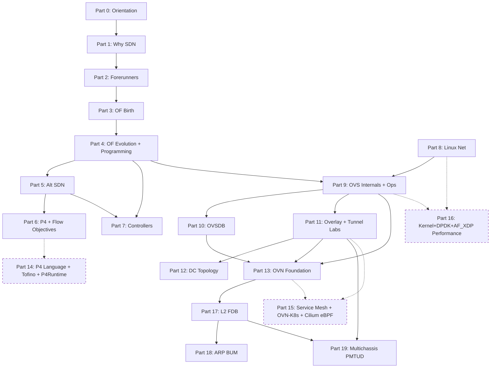

# SDN Onboard, OVN / OpenvSwitch / OpenFlow từ nền tảng đến production

Chuỗi tài liệu này dẫn dắt một kỹ sư mạng đã có CCNA và RHCSA đi qua trọn vẹn hành trình Software Defined Networking theo mô hình học thuật quốc tế, bắt đầu từ năm 2006 với Stanford Clean Slate Program, qua mốc OpenFlow 1.0 ngày 31/12/2009, Nicira thành lập 2007 và được VMware mua lại ngày 23/07/2012 với giá 1,26 tỷ USD, cho đến các production incident forensic trong môi trường OVN multichassis năm 2026. Lộ trình giảng dạy xây dựng trên baseline OpenvSwitch 2.17.9 và OVN 22.03.8 trên Ubuntu Server 22.04 LTS (Canonical official repository), phiên bản phổ biến trong sản xuất, đồng thời ghi nhận những thay đổi ở OVS 3.3 + OVN 24.03 trên Ubuntu 24.04 Noble cho lộ trình upgrade.

> **Scope:** Curriculum thuần OVS + OpenFlow + OVN standalone. Không dạy OpenStack / Neutron / kolla-ansible. Các khái niệm OVN (Logical_Switch, Port_Binding, HA_Chassis_Group, Logical_Flow) được trình bày dưới góc nhìn upstream OVN portable, dùng được với bất kỳ orchestrator nào (OVN-Kubernetes, bare-metal OVN, OVN standalone, v.v.).

Môi trường thực hành chính: Ubuntu Server 22.04 LTS, OVS 2.17.9 + OVN 22.03.8 cài qua `apt install openvswitch-switch ovn-central ovn-host`. Tài liệu tham khảo chính thống bao gồm [OVS Documentation](https://docs.openvswitch.org/en/latest/), [OVN Architecture Manual](https://man7.org/linux/man-pages/man7/ovn-architecture.7.html), [OpenFlow Switch Specification 1.0](https://opennetworking.org/wp-content/uploads/2013/04/openflow-spec-v1.0.0.pdf) đến [1.5.1](https://opennetworking.org/wp-content/uploads/2014/10/openflow-switch-v1.5.1.pdf), RFC 7047 (OVSDB, December 2013), RFC 7348 (VXLAN, August 2014), RFC 8926 (Geneve, November 2020), và bộ tài liệu NVIDIA DOCA OVS cho phần hardware offload (Block IX Part 9.5).

> **Lưu ý về phiên bản:** Ubuntu 20.04 cung cấp OVS 2.13 và không có package `ovn-central` trong main repo (phải backport qua Ubuntu Cloud Archive). Ubuntu 22.04 cung cấp OVS 2.17.9 + OVN 22.03.8, baseline của series. Ubuntu 24.04 cung cấp OVS 3.3 + OVN 24.03.6 với feature mới `activation-strategy=rarp`, thread groups. Phần 19 đi sâu vào so sánh OVN 22.09 multichassis gốc với OVN 24.03 RARP-based activation-strategy.

## Kiến thức tiên quyết cho toàn bộ series

Trước khi bắt đầu, người đọc cần có ba nhóm kiến thức nền tảng. Thứ nhất là Linux networking cơ bản ở mức `ip`, `bridge`, `tc`, network namespaces, nội dung này đã được trình bày ở linux-onboard phần 2.6. Thứ hai là TCP/IP model, Ethernet frame, ARP, VLAN 802.1Q ở mức CCNA, xem network-onboard, INE 1-10 và Cisco module 1-2. Thứ ba là Linux process và systemd ở linux-onboard phần 2.4, cần thiết để hiểu lifecycle của daemon `ovs-vswitchd`, `ovsdb-server`, `ovn-controller`.

Part 0.0 (how-to-read-this-series) và Part 0.1 (lab-environment-setup) được thiết kế để thu hẹp những khoảng trống này nếu có. Ai chưa cài môi trường lab nên bắt đầu từ Part 0.1 trước tiên.

---

## Sơ đồ phụ thuộc kiến thức (Knowledge Dependency Map)

Sơ đồ dưới đây thể hiện mối quan hệ phụ thuộc giữa các Part chính của series (Part 0 → Part 19, với Expert Extension Part 14-16 ở rev 4). Mũi tên `A → B` có nghĩa kiến thức Part A là tiên quyết trực tiếp cho Part B. Block VIII (Linux networking primer) không có mũi tên đến từ Block I-VII nên có thể đọc song song với nhánh OpenFlow nếu người đọc muốn tối ưu thời gian. Block XIV-XVI (Expert Extension, styled dashed border) là optional track, không block foundation path 0-XIII → 17-19.

---

## Reading paths, sáu con đường đọc

Series này được kiến trúc để phục vụ sáu persona khác nhau, không ép buộc mọi người phải đọc tuần tự từ đầu đến cuối. Mỗi Part self-contained qua prerequisites explicit ở header block, vì vậy người đọc có thể nhảy vào bất kỳ điểm nào sau khi xác nhận đã nắm prerequisites.

1. **Linear foundation (sách giáo khoa đại học, 50-80 giờ đọc)**, 0 → 1 → 2 → 3 → 4 → 5 → 6 → 7 → 8 → 9 → 10 → 11 → 12 → 13 → 17 → 18 → 19. Phù hợp cho kỹ sư mới vào OVS/OVN cần nền tảng lịch sử và lý thuyết đầy đủ trước khi chạm production.
2. **Historian (chỉ lịch sử + concept)**, 0 → 1 → 2 → 3 → 4 → 5 → 6 → 7. Dừng ở controller landscape. Mục tiêu: hiểu tại sao SDN tồn tại và các nhánh evolution, không đi vào implementation chi tiết.
3. **OVS-only (production engineer chỉ quan tâm OVS data plane)**, 0 → 1 (skim) → 4 → 8 → 9 → 10 → 11. Tập trung OVS như switch lập trình được + OpenFlow programming + OVSDB + overlay tunnel. Bỏ qua OVN hoàn toàn.
4. **OVN-focused (đã vững OVS + networking, đang build OVN deployment)**, 0 → 3 (skim) → 5.1 → 9 (skim) → 11 → 13 → 17 → 18 → 19. Path chính cho kỹ sư triển khai OVN standalone.
5. **Incident responder (advanced reader muốn đi thẳng case study)**, 0 → 13 (skim) → 17 → 18 → 19. Dành cho on-call engineer xử lý sự cố khẩn cấp, đã có nền OVN.
6. **Expert Extension track (rev 4, optional)**, after hoàn thành foundation — three parallel tracks:
   - **P4 programmable silicon** (15-25 giờ): 6 (skim) → 14.0 → 14.1 → 14.2. Dành cho researcher hoặc kỹ sư Pensando/BlueField DPU.
   - **Service mesh + K8s CNI** (20-30 giờ): 13 → 15.0 → 15.1 → 15.2. Dành cho kỹ sư platform engineering, CKAD/CKS candidates.
   - **Performance tuning deep dive** (15-20 giờ): 8 → 9.2 → 9.3 → 16.0 → 16.1 → 16.2. Dành cho hyperscale operator, HPC/5G deployment. Yêu cầu hardware lab thật cho Capstone 16.0-Lab3 (40 Gbps tuning).

---

## Mục lục (13 Block foundation + 3 Block Expert Extension + 3 Part advanced)

### Block 0, Orientation (3 file)

Khối này không có content kỹ thuật sâu, thuần meta/procedural. Mục đích: trả lời trước khi vào series "đọc thế nào, cần chuẩn bị gì, đâu là starting point".

- Part 0.0, [How to read this series](0.0%20-%20how-to-read-this-series.md) *(skeleton)*, bốn reading path; convention Key Topic, Guided Exercise, Lab, Trouble Ticket; mapping với CCNA/RHCSA/CKA.
- Part 0.1, [Lab environment setup](0.1%20-%20lab-environment-setup.md) *(skeleton)*, Ubuntu 22.04 baseline, OVS 2.17+ và OVN 22.03+ cài đặt, Mininet cho OpenFlow labs, hai cấu hình lab (single-node, two-node chassis pair), health check playbook.
- Part 0.2, [End-to-end packet journey](0.2%20-%20end-to-end-packet-journey.md) *(content, cross-cutting synthesis)*, hành trình một packet qua toàn bộ stack OVS+Geneve+OVN từ pod A đến pod B, anchor cho mọi topic trong series.

### Block I, Động lực ra đời SDN (Part 1, 3 file)

Khối này trả lời câu hỏi "tại sao ngành mạng cần SDN sau 40 năm làm network theo cách cũ?" Đây là điều kiện bắt buộc cho mọi Block phía sau, không hiểu động lực thì không hiểu được tại sao OpenFlow được thiết kế như nó là.

- Part 1.0, [Networking industry before SDN](1.0%20-%20networking-industry-before-sdn.md) *(skeleton, Ebook Ch1)*, mô hình vertically integrated, East-West traffic explosion 2005-2010, ba giới hạn kỹ thuật STP/VLAN/chassis-scale.
- Part 1.1, [Data center pain points](1.1%20-%20data-center-pain-points.md) *(skeleton, Ebook Ch2.1-2.4)*, L2 broadcast bloat, VLAN 4096 limit, ECMP hash imbalance, middle-box insertion.
- Part 1.2, [Five drivers why SDN](1.2%20-%20five-drivers-why-sdn.md) *(skeleton, Ebook Ch2.5-2.7)*, server virtualization, East-West traffic, big data, cloud scale, chi phí vận hành.

### Block II, Tiền thân SDN (Part 2, 5 file)

Khối này giới thiệu bảy forerunner lịch sử dẫn đến OpenFlow. DCAN 1995, OPENSIG, NAC, ForCES, 4D, Ethane, mỗi phong trào đóng góp một phần cho kiến trúc OpenFlow 1.0. Không có khối này, OpenFlow sẽ trông như một phát kiến đột ngột.

- Part 2.0, [DCAN, Open Signaling, GSMP](2.0%20-%20dcan-open-signaling-gsmp.md) *(skeleton)*, DCAN Cambridge 1995, GSMP RFC 3292.
- Part 2.1, [Ipsilon và Active Networking](2.1%20-%20ipsilon-and-active-networking.md) *(skeleton)*, Ipsilon GSMP 1996, Active Networking DARPA 1994-2000.
- Part 2.2, [NAC, Orchestration, Virtualization](2.2%20-%20nac-orchestration-virtualization.md) *(skeleton)*, network access control, pre-SDN orchestration tooling.
- Part 2.3, [ForCES và 4D project](2.3%20-%20forces-and-4d-project.md) *(skeleton)*, ForCES IETF RFC 3746, 4D project CMU 2004.
- Part 2.4, [Ethane, ancestor trực tiếp của OpenFlow](2.4%20-%20ethane-the-direct-ancestor.md) *(skeleton)*, Ethane SIGCOMM 2007, Casado + McKeown + Shenker.

### Block III, Khai sinh OpenFlow (Part 3, 3 file)

Khối này là câu chuyện cụ thể của Stanford Clean Slate Program 2006-2008, OpenFlow 1.0 ngày 31/12/2009, và Open Networking Foundation (ONF) thành lập 2011.

- Part 3.0, [Stanford Clean Slate Program](3.0%20-%20stanford-clean-slate-program.md) *(skeleton)*, Clean Slate Program 2006, McKeown + Casado + Shenker.
- Part 3.1, [OpenFlow 1.0 specification](3.1%20-%20openflow-1.0-specification.md) *(skeleton)*, OF 1.0 31/12/2009, 12-tuple match, secure channel, fail-open vs fail-closed.
- Part 3.2, [ONF formation và governance](3.2%20-%20onf-formation-and-governance.md) *(skeleton)*, ONF 2011, board members, standardization process.

### Block IV, OpenFlow evolution (Part 4, 8 file)

Khối dài nhất của phần lịch sử, đi qua từng phiên bản OpenFlow từ 1.1 đến 1.5, Table Type Patterns (TTP), và lý do OpenFlow dần nhường chỗ cho OVSDB-centric control.

- Part 4.0, [OpenFlow 1.1 multi-table và groups](4.0%20-%20openflow-1.1-multi-table-groups.md) *(skeleton)*, pipeline multi-table, Group table (all/select/indirect/ff).
- Part 4.1, [OpenFlow 1.2, OXM TLV match](4.1%20-%20openflow-1.2-oxm-tlv-match.md) *(skeleton)*, OXM TLV extensible match, controller roles EQUAL/MASTER/SLAVE.
- Part 4.2, [OpenFlow 1.3, meters, PBB, LTS](4.2%20-%20openflow-1.3-meters-pbb-lts.md) *(skeleton)*, meters per RFC 2697 srTCM, PBB, auxiliary channels, phiên bản long-term stable.
- Part 4.3, [OpenFlow 1.4, bundles, eviction](4.3%20-%20openflow-1.4-bundles-eviction.md) *(skeleton)*, atomic bundle commit, eviction policy, monitoring.
- Part 4.4, [OpenFlow 1.5, egress tables, L4-L7](4.4%20-%20openflow-1.5-egress-l4l7.md) *(skeleton)*, egress pipeline, packet type aware, TCP flags match.
- Part 4.5, [TTP, Table Type Patterns](4.5%20-%20ttp-table-type-patterns.md) *(skeleton, ONF TS-017)*, Negotiable Data Plane Model, TTP JSON schema.
- Part 4.6, [OpenFlow limitations và bài học](4.6%20-%20openflow-limitations-lessons.md) *(skeleton)*, vendor chipset fragmentation, rule explosion, operator complexity.
- Part 4.7, [OpenFlow programming với ovs-ofctl](4.7%20-%20openflow-programming-with-ovs.md) *(content, cross-cutting OpenFlow → OVS)*, multi-table pipeline hands-on, conntrack integration, flow hygiene playbook, cầu nối Block IV lý thuyết sang Block IX thực hành.

### Block V, Mô hình SDN thay thế (Part 5, 3 file)

Không phải SDN nào cũng dùng OpenFlow. Khối này giới thiệu ba loại SDN thay thế: API-based (NETCONF/YANG/gNMI), hypervisor overlays (NVP/NSX), và whitebox device opening.

- Part 5.0, [SDN via APIs, NETCONF, YANG, gNMI](5.0%20-%20sdn-via-apis-netconf-yang.md) *(skeleton)*, NETCONF RFC 6241, YANG RFC 6020, gNMI.
- Part 5.1, [Hypervisor overlays, NVP, NSX](5.1%20-%20hypervisor-overlays-nvp-nsx.md) *(skeleton)*, Nicira NVP 2011, VMware NSX-V và NSX-T.
- Part 5.2, [Opening the device, whitebox](5.2%20-%20opening-device-whitebox.md) *(skeleton)*, ONIE, SONiC, Cumulus Linux.

### Block VI, Mô hình SDN mới nổi (Part 6, 2 file)

Khối này nhìn về tương lai với P4 programmable data plane và Flow Objectives abstraction (ONOS).

- Part 6.0, [P4 programmable data plane](6.0%20-%20p4-programmable-data-plane.md) *(skeleton, p4.org)*, P4_16 language, PSA, Tofino architecture, Intel EOL 2023.
- Part 6.1, [Flow Objectives abstraction](6.1%20-%20flow-objectives-abstraction.md) *(skeleton)*, ONOS Flow Objective API, forwarding/filtering/next objectives.

### Block VII, Controller ecosystem (Part 7, 6 file)

Khối này khảo sát toàn cảnh controller, từ thế hệ đầu (NOX, POX, Ryu, Faucet), đến enterprise-grade (OpenDaylight, ONOS), và vendor-specific (Cisco ACI, Juniper Contrail). Part 7.4-7.5 đi sâu vào thực hành: Faucet pipeline + Gauge monitoring, và viết ứng dụng Ryu với REST API.

- **Part 7.0**, [NOX, POX, Ryu, Faucet](7.0%20-%20nox-pox-ryu-faucet.md) *(content)*, NOX C++ 2008, POX Python dạy học, Ryu NTT full OpenFlow 1.5, Faucet REANNZ production YAML.
- **Part 7.1**, [OpenDaylight architecture](7.1%20-%20opendaylight-architecture.md) *(content)*, MD-SAL, OSGi Karaf, YANG models, release cadence.
- **Part 7.2**, [ONOS service provider scale](7.2%20-%20onos-service-provider-scale.md) *(content)*, ONF ONOS 2014, distributed core, AT&T + NTT deployments.
- **Part 7.3**, [Vendor controllers, ACI, Contrail](7.3%20-%20vendor-controllers-aci-contrail.md) *(content)*, Cisco APIC + ACI fabric, Juniper Contrail, Nokia Nuage.
- **Part 7.4**, [Faucet pipeline và vận hành](7.4%20-%20faucet-pipeline-and-operations.md) *(content)*, bốn bảng canonical (VLAN/ETH_SRC/ETH_DST/FLOOD), ACL stateless trong YAML, Gauge + Prometheus monitoring, PromQL alert rule.
- **Part 7.5**, [Ryu: viết ứng dụng quản lý flow](7.5%20-%20ryu-flow-management.md) *(content)*, event system single-threaded, `OFPFlowMod` OFPFC_ADD/DELETE, table-miss entry, REST API với `WSGIApplication`, traffic statistics polling.

### Block VIII, Linux networking primer (Part 8, 4 file)

Khối này khỏa lấp khoảng trống kiến thức nền mà Block IX (OVS) ngầm giả định. Người đọc đã quen `bridge`, `veth`, `ip netns` có thể lướt qua; người chưa có nền Linux network cần đọc kỹ.

- Part 8.0, [Linux namespaces và cgroups](8.0%20-%20linux-namespaces-cgroups.md) *(skeleton)*, network/PID/mount/user namespace, cgroup v1 vs v2.
- Part 8.1, [Linux bridge, veth, macvlan](8.1%20-%20linux-bridge-veth-macvlan.md) *(skeleton)*, `brctl`/`ip link`, veth pair, macvlan modes.
- Part 8.2, [VLAN, bonding, team](8.2%20-%20linux-vlan-bonding-team.md) *(skeleton)*, 802.1Q trunk, bonding mode 4 (LACP), teamd.
- Part 8.3, [tc, qdisc, conntrack](8.3%20-%20tc-qdisc-and-conntrack.md) *(skeleton)*, tc/qdisc (fq_codel default kernel 3.12+), conntrack table, nf_conntrack tuning.

### Block IX, OpenvSwitch internals (Part 9, 27 file)

Khối then chốt mở hộp đen OVS để thấy cơ chế bên trong: ba thành phần (`ovs-vswitchd`, `ovsdb-server`, `openvswitch.ko`), ba kiểu datapath (kernel, userspace DPDK, hardware offload qua OVS-DOCA). Đây là khối quyết định cho troubleshooting ở cấp thấp.

**Core foundation (9.0-9.5):**
- Part 9.0, [OVS history 2007-present](9.0%20-%20ovs-history-2007-present.md) *(content, NSDI 2015)*, OVS birth 2007 Nicira, "Design and Implementation of OVS" Pfaff et al., Linux Foundation transfer 2016.
- Part 9.1, [OVS three-component architecture](9.1%20-%20ovs-3-component-architecture.md) *(content)*, ovs-vswitchd + ovsdb-server + openvswitch.ko, Netlink genl family upcall.
- Part 9.2, [Kernel datapath và megaflow](9.2%20-%20ovs-kernel-datapath-megaflow.md) *(content + expansion session 27 Phase D, NSDI 2015 + Lab 11 Crichigno)*, microflow → megaflow → ukeys, handler/revalidator threads, NSDI 2015 numbers, §9.2.6 lab steps bổ sung (topology Lab 11, `ovs-dpctl show/dump-flows`, POE "kernel flow = OpenFlow flow" bác bỏ, `dpif/show-dp-features`, `upcall/show` capacity planning, Guided Exercise 14 đo cache hit rate với iperf3).
- Part 9.3, [Userspace datapath, DPDK và AF_XDP](9.3%20-%20ovs-userspace-dpdk-afxdp.md) *(content)*, DPDK PMD + hugepages + NUMA pinning, AF_XDP alternative, trade-off matrix.
- Part 9.4, [OVS CLI tools và playbook 6 lớp](9.4%20-%20ovs-cli-tools-playbook.md) *(content)*, `ovs-vsctl`/`ofctl`/`appctl`/`dpctl`, six-layer troubleshooting playbook, Capstone Block IX Lab 2.
- Part 9.5, [Hardware offload, switchdev, ASAP², OVS-DOCA](9.5%20-%20hw-offload-switchdev-asap2-doca.md) *(content, NVIDIA DOCA 2023)*, Linux switchdev, NVIDIA ASAP² eSwitch, ba DPIF flavors (Kernel/DPDK/DOCA), vDPA, BlueField DPU, megaflow scaling 200k-2M.

**Operations playbook (9.6-9.14) — session 14:**
- Part 9.6, [OVS bonding và LACP](9.6%20-%20bonding-and-lacp.md) *(content)*, active-backup vs balance-slb vs balance-tcp, LACP negotiation, failover timing, bond-detect-mode.
- Part 9.7, [Port mirroring và packet capture](9.7%20-%20port-mirroring-and-packet-capture.md) *(content)*, SPAN/RSPAN concept, mirror-to-port vs mirror-to-vlan, capture với tcpdump trên mirror port.
- Part 9.8, [Flow monitoring: sFlow, NetFlow, IPFIX](9.8%20-%20flow-monitoring-sflow-netflow-ipfix.md) *(content)*, so sánh 3 giao thức sampled telemetry, config OVS export, collector receiver.
- Part 9.9, [OVS QoS: policing, shaping, metering](9.9%20-%20qos-policing-shaping-metering.md) *(content + expansion session 25 Phase D, Lab 9 Crichigno/USC + compass Ch I)*, drama OpenStack 5G VoLTE jitter 2023, 4 mục tiêu QoS (bandwidth/latency/jitter/loss), HTB tree cơ chế borrow/ceil, ingress policing vs egress shaping (POE 500 Mbps → 79 Mbps), 3-color metering RFC 2697 srTCM + RFC 2698 trTCM với CIR/PIR, topology Lab 9 4-host competing, Guided Exercise 11 policing 10 vs 500 Mbps + Guided Exercise 12 HTB work-conserving, so sánh OVN QoS LSP `qos_max_rate`/`qos_min_rate`.
- Part 9.10, [TLS hardening và ovs-pki](9.10%20-%20tls-pki-hardening.md) *(content)*, CA internal, certificate rotation, ciphersuite chuẩn, cert-based controller auth.
- Part 9.11, [ovs-appctl reference playbook](9.11%20-%20ovs-appctl-reference-playbook.md) *(content)*, 30+ lệnh `ovs-appctl` gom theo use case: bond/show, lacp/show, fdb/flush, tnl/arp/show, upcall/show.
- Part 9.12, [Upgrade choreography, rolling restart](9.12%20-%20upgrade-and-rolling-restart.md) *(content)*, upgrade OVS không gián đoạn data plane, order systemd unit, ovs-vsctl --no-wait, revalidator resync.
- Part 9.13, [Libvirt và Docker integration](9.13%20-%20libvirt-docker-integration.md) *(content)*, OVS với libvirt qua `<interface type='bridge'>`, Docker qua ovs-docker helper, iface-id cho OVN binding.
- Part 9.14, [Incident response decision tree](9.14%20-%20incident-response-decision-tree.md) *(content)*, playbook điều tra sự cố OVS theo decision tree: kernel miss → userspace lookup → OpenFlow flow → controller.

**Deep internals (9.15-9.17) — session 17 C9:**
- Part 9.15, [ofproto classifier + tuple space search](9.15%20-%20ofproto-classifier-tuple-space-search.md) *(content)*, priority-based matching, TSS algorithm, tuple space indexing.
- Part 9.16, [Connection manager + controller failover](9.16%20-%20ovs-connection-manager-controller-failover.md) *(content)*, master/slave, fail-mode, echo request timeouts.
- Part 9.17, [Performance benchmark methodology](9.17%20-%20ovs-performance-benchmark-methodology.md) *(content)*, pktgen-dpdk, cbench, throughput metrics, capacity planning.

**Applied technique (9.18-9.20) — session 19+20:**
- Part 9.18, [OVS native L3 routing](9.18%20-%20ovs-native-l3-routing.md) *(content, Lab 7 Crichigno/USC)*, route giữa subnet bằng flow table thuần không cần OVN — `mod_dl_src/dst + dec_ttl + output`, chứng minh `ip_forward=0` vẫn route được, đối chiếu với OVN Logical Router.
- Part 9.19, [OVS flow table granularity L1→L4 + priority](9.19%20-%20ovs-flow-table-granularity.md) *(content, Lab 4 Crichigno/USC)*, bốn cấp match field (port → MAC → IP → TCP), priority resolution với first-match tiebreaker, `idle_timeout`/`hard_timeout`/`cookie` lifecycle, chứng minh OVS không auto-learn MAC khi thiếu action `NORMAL`.
- Part 9.20, [OVS VLAN access/trunk + 802.1Q frame](9.20%20-%20ovs-vlan-access-trunk.md) *(content, Lab 6 Crichigno/USC, IEEE 802.1Q-2018)*, access port (`tag=N`) vs trunk port (`trunks=N,M`), 802.1Q frame TPID/PCP/DEI/VID 12-bit, topology 4-host 2-switch, verify isolation + cross-switch same-VLAN, đối chiếu VLAN 4094 limit vs OVN tunnel_key 24-bit.

**Firewall foundation (9.22-9.24) — session 22+23 Phase D:**
- Part 9.22, [OVS multi-table pipeline — `goto_table`, `resubmit`, action set](9.22%20-%20ovs-multi-table-pipeline.md) *(content, Lab 6 Crichigno/USC)*, lý do OpenFlow 1.1 thay single-table 14 tháng sau 1.0, 4 quy tắc cứng multi-table, `goto_table` (standard) vs `resubmit` (OVS extension), pipeline 3-table Lab 6 Classifier/L3/L2 topology 2 subnet, mở rộng 5-table production, metadata + register, đối chiếu OVN 50+ table tự sinh.
- Part 9.23, [OVS stateless ACL firewall — priority + first-match](9.23%20-%20ovs-stateless-acl-firewall.md) *(content, Lab 7 Crichigno/USC, Spamhaus DDoS 2013 case)*, khái niệm ACE first-match, phân biệt Cisco line-number vs OVS priority, pipeline 2-table 3-flow Lab 7, giới hạn stateless (asymmetric rule phá bidirectional, reply không auto-allow), đối chiếu OVN `allow` vs `allow-related` với trade-off performance + hardware offload.
- Part 9.24, [OVS conntrack và stateful firewall với `ct()` action](9.24%20-%20ovs-conntrack-stateful-firewall.md) *(content, Lab 8 Crichigno/USC)*, semantic action `ct()` (commit/zone/nat/table), bitfield `ct_state` (`+trk`/`+new`/`+est`/`+rel`/`+inv`/`+rpl`), template 7-flow stateful firewall, `ct_zone` multi-tenant isolation, 3 Guided Exercise POE (TCP reply, TCP lifecycle, UDP pseudo-state), đối chiếu OVN `allow-related` + Load Balancer + SNAT đều là macro của `ct(commit)`.

**Debugging toolbox (9.25) — session 24 Phase D:**
- Part 9.25, [OVS flow debugging — `ofproto/trace`, `dpif/show`, hygiene](9.25%20-%20ovs-flow-debugging-ofproto-trace.md) *(content, NSRC OpenVSwitch slide + compass Ch 10/L/Q/R)*, vì sao đọc `dump-flows` 2000 dòng là hạ sách, `ofproto/trace` giả lập gói tin qua pipeline, cú pháp flow-spec, đọc 4 khối kết quả (`Flow`/`bridge`/`Final flow`/`Datapath actions`), ba lệnh dump khác nhau (`ovs-ofctl` vs `ovs-dpctl` vs `ovs-appctl bridge/dump-flows`), sức khoẻ datapath qua `dpif/show`, hygiene production (`monitor`/`diff-flows`/`replace-flows`), ba ví dụ NSRC firewall 4-rule, so sánh với `ovn-trace` cho logical flow.

**Forensic case study OVS pure-datapath (9.26) — session 34 Phase E:**
- Part 9.26, [OVS Revalidator Storm — Khi datapath cache leak biến thành SEV-2 forensic](9.26%20-%20ovs-revalidator-storm-forensic.md) *(content, verified Rule 14 compliant qua MCP GitHub)*, case study real 2024 từ commit `180ab2fd635e` "ofproto-dpif-upcall: Avoid stale ukeys leaks" (Han Zhou + Roi Dayan + Eelco Chaudron), output "keys 3612" vs "flows current 7" trong `ovs-appctl upcall/show`, 5 lệnh chẩn đoán `upcall/show`+`coverage/show`+`dpctl/dump-flows`+`dpif/show-dp-features`+`upcall/dump-ukeys`, 3 hypothesis POE (rule explosion, memory leak, stale ukey leak), mechanism deep-dive `missed_dumps` counter fix, remediation 4 tầng immediate→short→medium→long term, so sánh OVN có cùng vulnerability không. Part đối xứng OVS layer với Part 17/18/19 (OVN forensic layer).

**Debug playbook end-to-end (9.27) — session 37b Phase G.1.2:**
- Part 9.27, [OVS + OVN Debug playbook end-to-end — 3-tier parallel view + Geneve TLV + MTU forensic](9.27%20-%20ovs-ovn-packet-journey-end-to-end.md) *(content, Phase G session 37b, bổ sung cho Part 0.2 tour)*, framework 3-tier diagnostic (logical `ovn-trace` + OpenFlow `ofproto/trace` + datapath `dpif/dump-flows`), Geneve TLV deep-dive (class `0x0102` type `0x80/0x81` mang logical ingress/egress port qua RFC 8926), MTU forensic với math chính xác (overhead 66 byte default OVN, max overlay MTU 1434 với underlay 1500), catalog 10 fault pattern cross-host phổ biến production, 2 Guided Exercise (fault-inject 5 bug + diagnose bằng 3-tier framework, parse Geneve TLV từ pcap `tshark`) + Capstone POE (benchmark stage-by-stage same-host vs cross-host vs raw underlay).

**Lab tooling foundation (9.21) — session 24 Phase D:**
- Part 9.21, [Mininet cho OVS labs — CLI, Python Topo API, MiniEdit GUI](9.21%20-%20mininet-for-ovs-labs.md) *(content, Lab 2 Crichigno/USC + mininet.org docs)*, lịch sử Mininet Stanford Clean Slate 2010 Lantz/Heller/McKeown, kiến trúc network namespace + veth làm host/dây, CLI cơ bản (`sudo mn`/`help`/`nodes`/`net`/`pingall`/`mn -c`), custom Python `Topo` class với `addHost`/`addSwitch`/`addLink`, MiniEdit GUI workflow + X11 forwarding SSH, router emulation qua sysctl `ip_forward`, tích hợp OVS qua `--switch ovsk`, so sánh với namespace thủ công, Guided Exercise tái dựng topology Lab 5.

### Block X, OVSDB management (Part 10, 7 file sau C8)

Khối này tách riêng giao thức OVSDB vì đây là backbone vận hành của cả OVS và OVN, mọi config change từ `ovs-vsctl` hay `ovn-nbctl` đều đi qua OVSDB. Raft clustering ở Part 10.1 là cơ sở cho HA deployment trong OVN Northbound/Southbound DB production.

**Core (10.0-10.2) — 3 file foundation ban đầu:**
- Part 10.0, [OVSDB, RFC 7047 schema và transactions](10.0%20-%20ovsdb-rfc7047-schema-transactions.md) *(content)*, JSON-RPC, schema language, mười operations, monitor_cond protocol.
- Part 10.1, [OVSDB Raft clustering](10.1%20-%20ovsdb-raft-clustering.md) *(content)*, cụm active-active với Raft consensus, bầu leader, môi trường production 3-node và 5-node.
- Part 10.2, [OVSDB backup/restore/compact/RBAC](10.2%20-%20ovsdb-backup-restore-compact-rbac.md) *(content)*, append-only file, compact, schema upgrade, RBAC cơ bản.

**Extended (10.3-10.6) — 4 file bổ sung bề sâu C8 session 17:**
- Part 10.3, [OVSDB transactions — ACID semantics](10.3%20-%20ovsdb-transaction-acid-semantics.md) *(content)*, 4 tính chất ACID, prerequisites (wait/assert/nb_cfg), mutate conflict resolution, retry pattern.
- Part 10.4, [OVSDB IDL + monitor_cond client](10.4%20-%20ovsdb-idl-monitor-cond-client.md) *(content)*, python-ovs IDL, conditional replication, cond_change runtime, reconnect + resync.
- Part 10.5, [OVSDB performance + benchmarking](10.5%20-%20ovsdb-performance-benchmarking.md) *(content)*, TPS characteristics, ovn-scale-test, perf flamegraph, tuning Raft snapshot + compact.
- Part 10.6, [OVSDB security — mTLS + RBAC advanced](10.6%20-%20ovsdb-security-mtls-rbac-advanced.md) *(content)*, mTLS cluster, cert rotation không downtime, RBAC multi-tenant, threat model.

### Block XI, Overlay encapsulation (Part 11, 5 file)

Khối chuyên sâu về encapsulation layer mà OVN dùng để nối các chassis. MTU math ở Part 11.1 là kiến thức tiên quyết trực tiếp cho bug FDP-620 phân tích trong Part 19.

- Part 11.0, [VXLAN, Geneve, STT](11.0%20-%20vxlan-geneve-stt.md) *(skeleton, RFC 7348 + RFC 8926)*, VXLAN 24-bit VNI UDP 4789 overhead 50 byte, Geneve RFC 8926 TLV options overhead 58 byte, STT decline.
- Part 11.1, [Overlay MTU, PMTUD, hardware offload](11.1%20-%20overlay-mtu-pmtud-offload.md) *(skeleton)*, MTU math, PMTUD failure modes, NIC hardware offload rx-csum/tx-csum/LRO/GRO/TSO với tunneling.
- Part 11.2, [BGP EVPN, control plane overlay](11.2%20-%20bgp-evpn-control-plane-overlay.md) *(skeleton, RFC 7432)*, EVPN route types 1-5, Type 2 MAC/IP, Type 3 inclusive multicast.
- Part 11.3, [GRE tunnel lab — OSPF underlay, Docker, Wireshark verify](11.3%20-%20gre-tunnel-lab.md) *(content + expansion session 26 Phase D, Lab 14 Crichigno/USC)*, drama ngân hàng Việt Nam 2024 GRE over IPsec legacy interop, header RFC 2784/2890 bytewise 24B, topology 3-FRR-router 2-Docker 4-Mininet-host, cấu hình OSPF area 0 + GRE port, Wireshark dissector chứng minh encap 3-tầng, POE *"GRE encrypt"* bác bỏ bằng HTTP plaintext, Guided Exercise 11 Lab 14 full walkthrough + Guided Exercise 12 Wireshark POE, pattern chuẩn site-to-site VPN GRE inside IPsec.
- Part 11.4, [IPsec tunnel lab — IKE phase 1+2, ESP verify, OVS-monitor-ipsec](11.4%20-%20ipsec-tunnel-lab.md) *(content + expansion session 27 Phase D, Lab 15 Crichigno/USC)*, từ GRE plaintext đến IPsec encrypted, AH vs ESP (RFC 4302/4303) và lý do ESP thắng, IKE phase 1 Diffie-Hellman (DH14/19/20) + ISAKMP, phase 2 IPsec SA + ESP header (SPI/sequence/ICV), Lab 15 topology GRE over IPsec end-to-end, Wireshark dissector filter ISAKMP + ESP chứng minh ciphertext opaque, Guided Exercise 13 Lab 15 full verify + Guided Exercise 14 POE hiệu năng AES-NI 10-25% overhead, OVN cluster full-mesh IPsec qua `ovn-nbctl set NB_Global ipsec=true`.

### Block XII, SDN trong Data Center (Part 12, 3 file)

- Part 12.0, [DC network topologies, Clos leaf-spine](12.0%20-%20dc-network-topologies-clos-leaf-spine.md) *(skeleton, Ebook Ch8.1-8.3)*, Clos 1953, Facebook F4/F16, Google Jupiter.
- Part 12.1, [DC overlay integration, VXLAN + EVPN](12.1%20-%20dc-overlay-integration-vxlan-evpn.md) *(skeleton)*, VXLAN data plane + EVPN control plane, anycast gateway.
- Part 12.2, [Micro-segmentation và service chaining](12.2%20-%20micro-segmentation-service-chaining.md) *(skeleton)*, ACL-based micro-seg với OVN ACL/Port_Group, NSH (Network Service Header) RFC 8300 cho service function chaining.

### Block XIII, OVN foundation (Part 13, 14 file)

Khối then chốt thứ hai, OVN logical model. OVN công bố ngày 13/01/2015 trên blog Network Heresy bởi Justin Pettit, Ben Pfaff, Chris Wright, Madhu Venugopal.

**Core (13.0-13.6) — 7 file foundation ban đầu:**
- Part 13.0, [OVN announcement 2015 và rationale](13.0%20-%20ovn-announcement-2015-rationale.md) *(content)*, OVN 2015-01-13, lý do thiết kế SDN controller portable dựa trên OVS data plane + OVSDB control plane.
- Part 13.1, [NBDB, SBDB architecture](13.1%20-%20ovn-nbdb-sbdb-architecture.md) *(content)*, Northbound intent → ovn-northd translator → Southbound flows + chassis state.
- Part 13.2, [Logical switches và routers](13.2%20-%20ovn-logical-switches-routers.md) *(content)*, Logical Switch, Logical Router, Logical Switch Port, Logical Router Port, 24+27 tables trong OVN 22.03.
- Part 13.3, [ACL, LB, NAT, port groups](13.3%20-%20ovn-acl-lb-nat-port-groups.md) *(content)*, ACL stateful, Load_Balancer health checks, SNAT/DNAT, Port_Group aggregation.
- Part 13.4, [br-int architecture và patch ports](13.4%20-%20br-int-architecture-and-patch-ports.md) *(content)*, kiến trúc br-int, role của patch ports nối Logical Switch.
- Part 13.5, [Port binding types](13.5%20-%20port-binding-types-ovn-native.md) *(content)*, 7 port types: vif/localnet/l2gateway/chassisredirect/patch/router/l3gateway.
- Part 13.6, [HA chassis group và BFD](13.6%20-%20ha-chassis-group-and-bfd.md) *(content)*, failover cho gateway chassis qua BFD probe + priority.

**Extended (13.7-13.12) — 6 file bổ sung bề rộng C7 session 17:**
- Part 13.7, [ovn-controller internals](13.7%20-%20ovn-controller-internals.md) *(content)*, algorithm SB→OpenFlow, I-P engine, Chassis registration, debugging.
- Part 13.8, [ovn-northd translation](13.8%20-%20ovn-northd-translation.md) *(content)*, NB→SB compile pipeline, 24+10 LS bảng + 30+15 LR bảng, HA leader election.
- Part 13.9, [OVN Load Balancer internals](13.9%20-%20ovn-load-balancer-internals.md) *(content)*, hash 5-tuple consistent, SNAT handling, DSR, hairpin, session affinity, distributed health check.
- Part 13.10, [OVN DHCP/DNS native](13.10%20-%20ovn-dhcp-dns-native.md) *(content)*, DHCPv4/DHCPv6/SLAAC, action `put_dhcp_opts`/`dns_lookup` trong datapath.
- Part 13.11, [Gateway Router distributed](13.11%20-%20ovn-gateway-router-distributed.md) *(content)*, DR vs GR, chassisredirect port, SNAT tập trung, tích hợp BGP/FRR.
- Part 13.12, [IPAM native](13.12%20-%20ovn-ipam-native-dynamic-static.md) *(content)*, cấp phát động/tĩnh, exclude_ips, mac_prefix, IPv6 prefix delegation, ND Proxy.

**Migration guide (13.13):**
- Part 13.13, [OVS-to-OVN migration guide](13.13%20-%20ovs-to-ovn-migration-guide.md) *(content, cross-cutting migration)*, quy trình chuyển từ ML2/OVS sang ML2/OVN ở OpenStack Neutron, feature parity matrix, data plane cutover không gián đoạn, rollback playbook.

> **Block XIV-XVI re-introduced ở rev 4 (2026-04-22)** như **Expert Extension track**, không thuộc foundation path. Scope khác với rev 2 cũ (OpenStack/Neutron removed) — nay tập trung **advanced technology adjacent to OVS/OVN**: P4 programmable data plane, service mesh + Kubernetes CNI integration, kernel+DPDK performance tuning. User có thể skip Expert Extension nếu chỉ cần OVS/OVN foundation + advanced case studies.

### Block XIV, P4 Programmable Pipeline (Part 14, 3 file, Expert Extension)

Khối đầu tiên của Expert Extension track. P4 là paradigm evolution beyond OpenFlow — data plane programmability qua domain-specific language. Tofino ASIC (Intel EOL 01/2023) là commercial P4 silicon chính; post-EOL, P4 ecosystem sustain qua software targets (BMv2, eBPF, DPDK) và AMD Pensando DPU + NVIDIA BlueField DOCA Pipelines.

- Part 14.0, [P4 Language Fundamentals](14.0%20-%20p4-language-fundamentals.md) *(skeleton sections + full Exercise specs)*, P4_16 syntax, PSA architecture, PISA abstract model, BMv2 reference compiler. 2 exercises: BMv2 L2 fwd + L3 LPM router.
- Part 14.1, [Tofino ASIC + PISA silicon architecture](14.1%20-%20tofino-pisa-silicon.md) *(skeleton sections + Exercise spec)*, Tofino 1/2/3 generations, stage resources, Intel acquisition 2019 → EOL 2023. 1 exercise: p4c-tofino resource report analysis (hardware hoặc BMv2 alternative).
- Part 14.2, [P4Runtime + gNMI southbound integration](14.2%20-%20p4runtime-gnmi-integration.md) *(skeleton sections + full Exercise specs)*, P4Runtime gRPC API, schema-driven runtime, ONOS+Stratum. 2 exercises: p4runtime-shell Python client + ONOS+Stratum+BMv2 full stack.

### Block XV, Service Mesh + Kubernetes CNI (Part 15, 3 file, Expert Extension)

Khối thứ hai. Liên hệ OVN + Linux networking với Kubernetes ecosystem. So sánh 3 approaches: Istio sidecar-based (Envoy per-pod), Linkerd (lighter Rust proxy), Cilium eBPF-based (sidecar-less). OVN-Kubernetes là CNI mang OVN into K8s.

- Part 15.0, [Service Mesh Integration](15.0%20-%20service-mesh-integration.md) *(skeleton sections + full Exercise specs)*, Istio xDS, Linkerd proxy, Cilium SM, OVN-K8s. 2 exercises: Istio+Envoy bookinfo + 3-cluster benchmark.
- Part 15.1, [OVN-Kubernetes CNI deep dive](15.1%20-%20ovn-kubernetes-cni-deep-dive.md) *(skeleton sections + full Exercise specs)*, ovnkube-master/node, NetworkPolicy → OVN ACL translation. 2 exercises: kind deploy + ovn-trace debug.
- Part 15.2, [Cilium eBPF internals](15.2%20-%20cilium-ebpf-internals.md) *(skeleton sections + full Exercise specs)*, eBPF datapath, sidecar-less mesh, Hubble observability. 2 exercises: bpftool inspect + benchmark ref 15.0.

### Block XVI, Kernel + DPDK Performance Deep Dive (Part 16, 3 file, Expert Extension)

Khối thứ ba. Đi sâu vào performance tuning network stack: kernel tuning knobs, DPDK userspace bypass, AF_XDP hybrid. Essential cho hyperscale deployment.

- Part 16.0, [Kernel+DPDK+AF_XDP Performance Tuning overview](16.0%20-%20dpdk-afxdp-kernel-tuning.md) *(skeleton sections + full Exercise specs)*, datapath comparison, DPDK EAL+PMD, AF_XDP zero-copy, kernel tuning knobs. 3 exercises: OVS kernel vs DPDK benchmark + AF_XDP filter + Capstone 10→40 Gbps tuning.
- Part 16.1, [DPDK Advanced — PMD + mempool + NUMA](16.1%20-%20dpdk-advanced-pmd-memory.md) *(skeleton sections + full Exercise specs)*, 1GB hugepages, NUMA pinning, cache line alignment, RSS multi-queue. 2 exercises.
- Part 16.2, [AF_XDP + XDP programs](16.2%20-%20afxdp-xdp-programs.md) *(skeleton sections + full Exercise specs)*, AF_XDP 4 rings architecture, libbpf+libxdp, XDP actions. 2 exercises: XDP_PASS attach + TCP filter with AF_XDP redirect.

### Block XVII-XIX, OVN Advanced case studies (Part 17, 18, 19, 3 file)

Ba Part advanced là forensic analysis trên production OVN multichassis environment, đi từ hiện tượng quan sát được (blackhole, FDB poisoning, migration failure) đến root cause trong source code OVN. Đọc Khối này yêu cầu đã hoàn thành Block I đến XIII.

- **Part 17**, [OVN L2 Forwarding và FDB Poisoning](17.0%20-%20ovn-l2-forwarding-and-fdb-poisoning.md) *(1178 dòng)*, distributed control plane, MC_FLOOD multicast group, localnet port, FDB dynamic MAC learning, case study FDB poisoning VLAN 3808 với forensic timeline ba daemon logs.
- **Part 18**, [OVN ARP Responder và BUM Suppression](18.0%20-%20ovn-arp-responder-and-bum-suppression.md) *(496 dòng)*, ARP Responder ingress table 26, port_security gate, bốn kiến trúc ARP suppression và arp_proxy.
- **Part 19**, [OVN Multichassis Binding, PMTUD và activation-strategy](19.0%20-%20ovn-multichassis-binding-and-pmtud.md) *(1379 dòng)*, ba thời kỳ live migration OVN, multichassis port binding lifecycle, bug FDP-620 root cause, activation-strategy=rarp OVN 24.03.

### Block XX, Operational Excellence (Part 20, 2 file)

Block này tập trung kỹ năng vận hành và chẩn đoán thực chiến — bổ sung cho nền tảng kiến trúc của Block IX-XIII. Đọc sau khi hoàn thành Block IX, XIII và Part 0.2.

- **Part 20.0**, [Phương pháp chẩn đoán hệ thống OVS/OVN](20.0%20-%20ovs-ovn-systematic-debugging.md) *(content)*, isolation-first methodology, mô hình 5 lớp kiểm tra, `ovn-trace`/`ofproto/trace`/`ovn-detrace` simulation tools, 8 kịch bản lỗi phổ biến với chuỗi lệnh chẩn đoán.
- **Part 20.1**, [Bảo mật OVN: port_security, ACL và kiểm toán](20.1%20-%20ovs-ovn-security-hardening.md) *(content)*, ba lớp bảo mật defense-in-depth (control/management/data plane), `port_security` chống ARP poisoning và MAC spoofing, ACL default-deny với `allow-related` stateful conntrack, audit logging với `name=` field, 10-point security posture checklist.

---

## Labs, Capstones và POE framework

Mỗi Part foundation (Parts 0 đến 13) có ít nhất một Guided Exercise 15-30 phút để kiểm chứng kiến thức vừa học, viết theo mô hình Red Hat Student Guide + UofSC Mininet lab với Outcomes / Before You Begin / Instructions sub-steps / Finish. Cuối mỗi Block lớn (Block I, IV, IX, XI, XIII) có Capstone Lab 2-4 giờ kết hợp nhiều Part, ví dụ Capstone Block XIII là end-to-end packet trace từ workload port qua br-int qua Geneve tunnel tới chassis đích với ovn-trace và ovn-detrace correlation. Part 17, 18, 19 giữ nguyên Lab POE (Predict-Observe-Explain) sáu-lớp hiện có cho forensic analysis.

---

## Trạng thái migration rev 1 → rev 2 → rev 3 → rev 4

Series này đang trong quá trình tái cấu trúc theo plan `plans/sdn-foundation-architecture.md`.

**Rev 4 (2026-04-22):** Expert Extension track thêm vào sau Phase B complete. Block XIV (P4 Programmable Pipeline), Block XV (Service Mesh + K8s CNI), Block XVI (Kernel+DPDK Performance Deep Dive). 9 files skeleton + 18 exercises đầy đủ lab specs (Mục đích / Chuẩn bị / Mô hình lab / Bước thực hiện / Output mong muốn / Bài học học được / Cleanup). Scope khác Block XIV-XVI bị remove ở rev 3 (OpenStack/NFV) — nay technology adjacent to OVS/OVN (programmable silicon, service mesh, performance tuning). Foundation path 0-XIII + advanced 17-19 không đổi; Expert Extension là optional track.

**Rev 3 (2026-04-21):** Scope thu hẹp về OVS + OpenFlow + OVN standalone. Xóa 9 file skeleton (Block XIV OpenStack/Neutron 4 file, Block XV NFV 2 file, Block XVI SDN WAN/Campus 2 file, Part 6.2 Intent-Based Networking). Block numbering giữ nguyên gap XIV-XVI để tránh rename cascade cho Part 17-19 advanced — gap sau đó được fill ở rev 4 với scope khác.

**Absorb từ hai nguồn chính quy:**
- *Compass Anthropic curriculum* (20 chapter upstream-grounded, `sdn-onboard/doc/compass_artifact*.md`): absorb Part II A-W vào Block IX mở rộng (9.6 bonding, 9.7 mirror, 9.8 sFlow/NetFlow/IPFIX, 9.9 QoS, 9.10 TLS, 9.11 appctl reference, 9.12 upgrade, 9.13 libvirt/docker, 9.14 incident response), absorb Ch M/O vào 10.2 OVSDB backup/RBAC, absorb Ch 5-10 vào 4.7 OF programming.
- *University of South Carolina Dr. Jorge Crichigno NSF Award 1829698* (15 lab Mininet, `sdn-onboard/doc/ovs/`): absorb Lab 14 GRE + Lab 15 IPsec vào 11.3/11.4, mỗi Part foundation có 1 Guided Exercise Mininet step-by-step.

**Rev 2 (2026-04-20):** S3 rename 3 file OVN advanced 1.0/2.0/3.0 → 17.0/18.0/19.0 + renumber nội bộ. S4 hoàn tất content Block 0 (2 file). S5-S8 hoàn tất skeleton refinement Block I-IV theo Rule 10 Architecture-First Doctrine.

---

## Quy ước ký hiệu trong series

Toàn bộ series sử dụng các quy ước sau trong code blocks và ví dụ:

| Ký hiệu | Ý nghĩa |
|---|---|
| `[compute01]$` | Lệnh chạy với quyền user trên compute node chạy ovn-controller và ovs-vswitchd |
| `[compute01]#` | Lệnh chạy với quyền root trên compute node |
| `[network01]#` | Lệnh chạy với quyền root trên network node (nơi có chassisredirect, NAT) |
| `[controller01]#` | Lệnh chạy trên controller node (nơi có ovsdb-server NBDB/SBDB và ovn-northd) |
| `[client]$` | Lệnh chạy trên máy client ngoài cluster OVN (gửi/nhận traffic test) |
| `[vm-a]$` | Lệnh chạy trong VM guest A (test topology) |
| **Boldface** trong command syntax | Lệnh hoặc keyword gõ nguyên văn |
| *Italic* trong command syntax | Tham số thay thế bằng giá trị thực tế |
| `[x]` trong command syntax | Thành phần tùy chọn |
| `{x}` trong command syntax | Thành phần bắt buộc |
| `──` trong log timeline | Annotation do tác giả thêm (phân biệt với dòng log gốc, theo Rule 7a) |

---

## Phụ lục A, Bảng theo dõi tiến hóa phiên bản OVS và OVN

Bảng tham chiếu trung tâm ghi nhận mọi thay đổi giữa các phiên bản OVS và OVN trên Ubuntu LTS. Mỗi khi viết một Part và phát hiện behavior khác nhau giữa phiên bản, thông tin được ghi vào đây với back-reference đến Part đã nhắc.

| Ubuntu LTS | OVS (Canonical repo) | OVN (Canonical repo) | Trạng thái |
|---|---|---|---|
| 20.04 Focal | 2.13.x | Không có `ovn-central` trong main (backport qua Ubuntu Cloud Archive) | Legacy, không khuyến nghị cho production mới |
| 22.04 Jammy | 2.17.9-0ubuntu0.22.04.1 | 22.03.8-0ubuntu0.22.04.1 | **Baseline** của series |
| 24.04 Noble | 3.3.x | 24.03.6-0ubuntu0.24.04.1 | Lộ trình upgrade, có `activation-strategy=rarp` |

Quy ước: `NEW` là tính năng mới, `CHANGED` là hành vi mặc định thay đổi, `DEPRECATED` là sẽ bị loại bỏ, `REMOVED` là đã loại bỏ, `IMPROVED` là cải thiện hiệu năng hoặc mở rộng.

### A.1, OVS Datapath và Flow Caching

| Thay đổi | 2.13 (20.04) | 2.17 (22.04) | 3.3 (24.04) | Nguồn Part |
|---|---|---|---|---|
| Megaflow cache | Có | IMPROVED (conjunctive match) | IMPROVED (SIMD tuple match) | Part 9.2 |
| AF_XDP datapath | Experimental | IMPROVED | Stable | Part 9.3 |
| DPDK PMD thread | Có | IMPROVED (NUMA auto-pinning) | IMPROVED | Part 9.3 |
| Userspace conntrack | Có | IMPROVED | IMPROVED | Part 9.3 |
| Hardware offload (switchdev + DOCA) | Experimental | IMPROVED (tc flower offload) | NEW (DOCA DPIF primary, Kernel/DPDK maintained for backward compat) | Part 9.5 |

### A.2, OpenFlow và OVS Flow Programming

| Thay đổi | 2.13 (20.04) | 2.17 (22.04) | 3.3 (24.04) | Nguồn Part |
|---|---|---|---|---|
| OpenFlow 1.5 support | Có | Có | Có | Part 4.4 |
| NXM/OXM learn action | Có | Có | Có | Part 9.4 |
| `conjunction` action | Có | Có | IMPROVED (matching engine) | Part 9.4 |

### A.3, OVN Logical Model và Pipeline

| Thay đổi | OVN 20.06 | OVN 22.03 (22.04) | OVN 24.03 (24.04) | Nguồn Part |
|---|---|---|---|---|
| Logical flow pipeline | 20 ingress + 25 egress tables | 24 ingress + 27 egress tables | 24 ingress + 28 egress tables (output_large_pkt_detect) | Part 13.2, 19 |
| Load_Balancer health check | Không | NEW | IMPROVED | Part 13.3 |
| ACL `label` field | Có | Có | IMPROVED | Part 13.3 |

### A.4, OVN Multichassis và Live Migration

| Thay đổi | OVN pre-22.09 | OVN 22.09 | OVN 24.03 | Nguồn Part |
|---|---|---|---|---|
| Multichassis port binding | Không (blackhole 13.25% loss) | NEW (CAN_BIND_AS_MAIN/ADDITIONAL) | IMPROVED | Part 19 |
| Duplicate forwarding | Không | NEW (default ON) | CHANGED (opt-in) | Part 19 |
| activation-strategy | Không | Không | NEW (`rarp` option) | Part 19 |
| `enforce_tunneling_for_multichassis_ports()` | Không | NEW | Có | Part 19 |

### A.5, OVN ARP Responder và FDB

| Thay đổi | OVN 20.06 | OVN 22.03 | OVN 24.03 | Nguồn Part |
|---|---|---|---|---|
| ARP Responder ingress table | Table 13 | Table 26 | Table 26 | Part 18 |
| Port_Group aggregation | Có | IMPROVED | IMPROVED | Part 13.3, 18 |
| FDB table (dynamic MAC) | Có | Có | Có | Part 17 |
| MAC_Binding aging | Fixed | CHANGED (configurable timeout) | IMPROVED | Part 17 |

### A.6, OVSDB và Clustering

| Thay đổi | OVS 2.13 | OVS 2.17 | OVS 3.3 | Nguồn Part |
|---|---|---|---|---|
| OVSDB Raft cluster | Có | IMPROVED (storage compaction) | IMPROVED | Part 10.1 |
| Active connection via SSL | Có | Có | Có | Part 10.1 |
| monitor_cond_since | Có | Có | Có | Part 10.0 |

### A.7, Overlay Encapsulation

| Thay đổi | OVS 2.13 | OVS 2.17 | OVS 3.3 | Nguồn Part |
|---|---|---|---|---|
| Geneve encapsulation | Có (RFC 8926 compliant) | Có | Có | Part 11.0 |
| VXLAN encapsulation | Có (RFC 7348) | Có | Có | Part 11.0 |
| STT encapsulation | Có | DEPRECATED | REMOVED | Part 11.0 |
| Geneve TLV metadata | Basic | NEW (extensible) | IMPROVED | Part 11.0 |

### Thống kê tổng hợp

| Metric | Giá trị dự kiến (sau khi hoàn thành series) |
|---|---|
| Tổng số thay đổi sẽ ghi nhận | ~50 |
| Parts sẽ đóng góp dữ liệu | Parts 4, 9, 10, 11, 13, 17, 18, 19 |
| Baseline reference | OVS 2.17 + OVN 22.03 trên Ubuntu 22.04 |

---

## Phụ lục B, RFC và specifications tham chiếu

| RFC / Spec | Chủ đề | Ngày công bố | Sử dụng ở Part |
|---|---|---|---|
| RFC 826 | ARP | November 1982 | Part 18 |
| RFC 903 | RARP | June 1984 | Part 19 |
| RFC 1191 | PMTUD cho IPv4 | November 1990 | Part 11.1, Part 19 |
| RFC 2697 | srTCM (meter) | September 1999 | Part 4.2, Part 9.5 |
| RFC 3292 | GSMP | June 2002 | Part 2.0 |
| RFC 3746 | ForCES framework | April 2004 | Part 2.3 |
| RFC 4627 | JSON | July 2006 | Part 10.0 |
| RFC 6020 | YANG | October 2010 | Part 5.0 |
| RFC 6241 | NETCONF | June 2011 | Part 5.0 |
| RFC 7047 | OVSDB Management Protocol | December 2013 | Part 10.0 |
| RFC 7348 | VXLAN | August 2014 | Part 11.0 |
| RFC 7432 | BGP EVPN | February 2015 | Part 11.2 |
| RFC 8926 | Geneve | November 2020 | Part 11.0 |
| OpenFlow 1.0 Spec | OpenFlow baseline | 31 December 2009 | Part 3.1 |
| OpenFlow 1.3 Spec | Multi-table, groups, meters | April 2012 | Part 4.2 |
| OpenFlow 1.5 Spec | Bundles, eviction, metadata | December 2014 | Part 4.4 |
| ONF TS-017 (TTP) | Table Type Patterns | August 2014 | Part 4.5 |

---

## Phụ lục C, Bibliography

### Sách giáo khoa

1. Paul Göransson, Chuck Black, Timothy Culver. *Software Defined Networks: A Comprehensive Approach* (2nd edition), Morgan Kaufmann, 2017. Ebook gốc cho Blocks I-VII, XII. Mapping chi tiết trong `plans/ebook-coverage-map.md`.
2. Andrew S. Tanenbaum, David J. Wetherall. *Computer Networks* (5th edition), Pearson, 2011. Nền tảng TCP/IP, Ethernet, routing.
3. Michael Kerrisk. *The Linux Programming Interface* (TLPI), No Starch Press, 2010. Nền tảng file descriptor, namespace, tham chiếu từ Block VIII.
4. Jorge Crichigno et al. *Open Virtual Switch Lab Series* (Book version 09-30-2021), University of South Carolina, NSF Award 1829698. 15 lab Mininet + 5 exercise step-by-step. Nguồn cho Guided Exercise ở Block VIII-XI và Capstone Lab Block IX/XI. Local: `sdn-onboard/doc/ovs/OVS.pdf`.
5. Anthropic. *Open vSwitch, A Senior Engineer's Training Curriculum* (compass artifact), 2026. 20 chapter + 4 appendix upstream-grounded textbook. Nguồn cho Block IX operational expansion (Part II A-W) và 4.7 OF programming (Part III Ch 5-10). Local: `sdn-onboard/doc/compass_artifact_wf-*.md`.

### Papers

1. Ben Pfaff et al. [The Design and Implementation of Open vSwitch](https://www.usenix.org/system/files/conference/nsdi15/nsdi15-paper-pfaff.pdf). NSDI 2015, best paper award. Nguồn chính cho Block IX (Parts 9.0 → 9.4).
2. Martin Casado et al. [Ethane: Taking Control of the Enterprise](https://web.stanford.edu/class/cs244/papers/casado-ethane-sigcomm07.pdf). SIGCOMM 2007. Nguồn chính cho Part 2.4.
3. Nick McKeown et al. [OpenFlow: Enabling Innovation in Campus Networks](https://dl.acm.org/doi/10.1145/1355734.1355746). ACM SIGCOMM CCR, April 2008. Nguồn chính cho Part 3.0.

### Vendor documentation

1. [NVIDIA DOCA OVS Documentation](https://docs.nvidia.com/doca/sdk/), nguồn chính cho Part 9.5 (NVIDIA ASAP², OVS-DOCA DPIF, BlueField DPU, vDPA).
2. [Linux kernel switchdev documentation](https://docs.kernel.org/networking/switchdev.html), Part 9.5.
3. [Juniper Contrail architecture](https://www.juniper.net/documentation/us/en/software/contrail23/contrail-architecture/index.html), Part 7.3.

### Blog posts / Announcements

1. Justin Pettit, Ben Pfaff, Chris Wright, Madhu Venugopal. [OVN, Bringing Native Virtual Networking to OVS](https://networkheresy.com/2015/01/13/ovn-bringing-native-virtual-networking-to-ovs/). Network Heresy blog, 13 January 2015. Nguồn chính cho Part 13.0.
2. Martin Casado. [The Ideal SDN Architecture](https://networkheresy.com/2013/06/06/the-ideal-sdn-architecture/). Network Heresy, June 2013. Bối cảnh cho Part 5.1.

### Upstream project documentation

1. [OVS Documentation](https://docs.openvswitch.org/en/latest/), documentation chính thức project OpenvSwitch.
2. [OVN Architecture Manual](https://man7.org/linux/man-pages/man7/ovn-architecture.7.html), `ovn-architecture(7)` manpage.
3. [OpenFlow Switch Specification 1.0 → 1.5](https://opennetworking.org/software-defined-standards/specifications/), Block III-IV.
4. [p4.org specifications](https://p4.org/specs/), Part 6.0.
5. [OVSDB Schema Reference, ovs-vswitchd.conf.db(5)](https://docs.openvswitch.org/en/latest/ref/ovs-vswitchd.conf.db.5/), Block IX, X.
6. [ovs-actions(7), ovs-fields(7)](https://docs.openvswitch.org/en/latest/ref/), Part 4.7 OpenFlow programming.

### IETF / IEEE / ISO standards

Được liệt kê chi tiết trong Phụ lục B (RFC) và ngoài ra:

- IEEE 802.1Q (VLAN tagging)
- IEEE 802.3ad (LACP)
- IEC/IEEE 82079-1:2019 (Documentation standards, document-design skill)
- ISO 2145:1978 (Numbering of divisions, document-design skill)
- WCAG 2.1 SC 1.3.1 (Semantic hierarchy, document-design skill)
- OASIS DITA 1.3 (Procedural documentation model, document-design skill)
