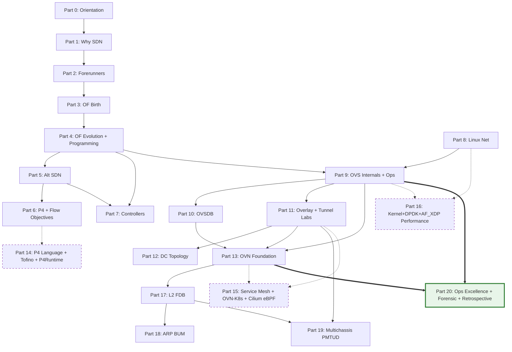

# SDN Onboard: Từ nền tảng đến thực thi OVN / OpenvSwitch / OpenFlow

**Release tag:** `v3.1-OperatorMaster` (24/04/2026). 116 file, ~52.6K dòng. Hoàn tất Giai đoạn G: Làm chủ vận hành (Operator Mastery). Xem [`../CHANGELOG.md`](../CHANGELOG.md) để biết chi tiết thay đổi.

Tập tài liệu này được thiết kế để dẫn dắt các kỹ sư hệ thống và mạng (CCNA/RHCSA) làm chủ lộ trình Software Defined Networking theo tiêu chuẩn học thuật quốc tế. Nội dung trải dài từ những ngày đầu của Stanford Clean Slate Program (2006), lịch sử mốc OpenFlow 1.0 (2009), sự trỗi dậy của Nicira (do VMware mua lại năm 2012 với giá 1,26 tỷ USD), cho đến các kỹ thuật phân tích sự cố (Forensics) chuyên sâu trong môi trường OVN Multichassis hiện đại năm 2026. Lộ trình giảng dạy được xây dựng trên nền tảng OpenvSwitch 2.17.9 và OVN 22.03.8 (Ubuntu 22.04 LTS), đồng thời cập nhật các thay đổi mới nhất trên OVS 3.3 và OVN 24.03 (Ubuntu 24.04 Noble) để chuẩn bị cho lộ trình nâng cấp hệ thống.

> **Phạm vi (Scope):** Tập trung thuần túy vào OVS + OpenFlow + OVN standalone. Tài liệu không bao gồm OpenStack / Neutron / kolla-ansible. Các khái niệm OVN (Logical_Switch, Port_Binding, HA_Chassis_Group, Logical_Flow) được trình bày dưới góc nhìn kiến trúc OVN chuẩn, có khả năng tích hợp linh hoạt với các trình điều phối như OVN-Kubernetes hoặc môi trường bare-metal.

Môi trường thực hành chính: Ubuntu Server 22.04 LTS, OVS 2.17.9 + OVN 22.03.8 cài qua `apt install openvswitch-switch ovn-central ovn-host`. Tài liệu tham khảo chính thống bao gồm [OVS Documentation](https://docs.openvswitch.org/en/latest/), [OVN Architecture Manual](https://man7.org/linux/man-pages/man7/ovn-architecture.7.html), [OpenFlow Switch Specification 1.0](https://opennetworking.org/wp-content/uploads/2013/04/openflow-spec-v1.0.0.pdf) đến [1.5.1](https://opennetworking.org/wp-content/uploads/2014/10/openflow-switch-v1.5.1.pdf), RFC 7047 (OVSDB, December 2013), RFC 7348 (VXLAN, August 2014), RFC 8926 (Geneve, November 2020), và bộ tài liệu NVIDIA DOCA OVS cho phần hardware offload (Khối IX Phần 9.5).

> **Lưu ý về phiên bản:** Ubuntu 20.04 cung cấp OVS 2.13 và không có package `ovn-central` trong main repo (phải backport qua Ubuntu Cloud Archive). Ubuntu 22.04 cung cấp OVS 2.17.9 + OVN 22.03.8, baseline của series. Ubuntu 24.04 cung cấp OVS 3.3 + OVN 24.03.6 với feature mới `activation-strategy=rarp`, thread groups. Phần 19 đi sâu vào so sánh OVN 22.09 multichassis gốc với OVN 24.03 RARP-based activation-strategy.

## Kiến thức tiên quyết cho toàn bộ series

Trước khi bắt đầu, người đọc cần có ba nhóm kiến thức nền tảng. Thứ nhất là Linux networking cơ bản ở mức `ip`, `bridge`, `tc`, network namespaces, nội dung này đã được trình bày ở linux-onboard phần 2.6. Thứ hai là TCP/IP model, Ethernet frame, ARP, VLAN 802.1Q ở mức CCNA, xem network-onboard, INE 1-10 và Cisco module 1-2. Thứ ba là Linux process và systemd ở linux-onboard phần 2.4, cần thiết để hiểu lifecycle của daemon `ovs-vswitchd`, `ovsdb-server`, `ovn-controller`.

Phần 0.0 (how-to-read-this-series) và Phần 0.1 (lab-environment-setup) được thiết kế để thu hẹp những khoảng trống này nếu có. Ai chưa cài môi trường lab nên bắt đầu từ Phần 0.1 trước tiên.

---

## Sơ đồ phụ thuộc kiến thức (Knowledge Dependency Map)

Sơ đồ dưới đây thể hiện mối quan hệ phụ thuộc giữa các Phần chính của series (Phần 0 → Phần 20, với Expert Extension Phần 14-16 ở rev 4). Mũi tên `A → B` có nghĩa kiến thức Phần A là tiên quyết trực tiếp cho Phần B. Khối VIII (Linux networking primer) không có mũi tên đến từ Khối I-VII nên có thể đọc song song với nhánh OpenFlow nếu người đọc muốn tối ưu thời gian. Khối XIV-XVI (Expert Extension, styled dashed border) là optional track, không block foundation path 0-XIII → 17-19. Khối XX (Operations, styled thick border) là cross-cutting operations layer, build trên Khối IX + XIII để deliver daily runbook + forensic + retrospective.

---

## Reading paths, bảy con đường đọc

Series này được kiến trúc để phục vụ bảy persona khác nhau, không ép buộc mọi người phải đọc tuần tự từ đầu đến cuối. Mỗi Phần self-contained qua prerequisites explicit ở header block, vì vậy người đọc có thể nhảy vào bất kỳ điểm nào sau khi xác nhận đã nắm prerequisites.

1. **Linear foundation (sách giáo khoa đại học, 50-80 giờ đọc)**, 0 → 1 → 2 → 3 → 4 → 5 → 6 → 7 → 8 → 9 → 10 → 11 → 12 → 13 → 17 → 18 → 19. Phù hợp cho kỹ sư mới vào OVS/OVN cần nền tảng lịch sử và lý thuyết đầy đủ trước khi chạm production.
2. **Historian (chỉ lịch sử + concept)**, 0 → 1 → 2 → 3 → 4 → 5 → 6 → 7. Dừng ở controller landscape. Mục tiêu: hiểu tại sao SDN tồn tại và các nhánh evolution, không đi vào implementation chi tiết.
3. **OVS-only (production engineer chỉ quan tâm OVS data plane)**, 0 → 1 (skim) → 4 → 8 → 9 → 10 → 11 → 20.4 (OVS daily operator playbook). Tập trung OVS như switch lập trình được + OpenFlow programming + OVSDB + overlay tunnel + daily ops. Bỏ qua OVN hoàn toàn.
4. **OVN-focused (đã vững OVS + networking, đang build OVN deployment)**, 0 → 3 (skim) → 5.1 → 9 (skim) → 11 → 13 → 17 → 18 → 19 → 20.3 (OVN daily operator playbook). Path chính cho kỹ sư triển khai OVN standalone.
5. **Incident responder (advanced reader muốn đi thẳng case study)**, 0 → 13 (skim) → 17 → 18 → 19 → 9.26 + 20.5 (forensic case study). Dành cho on-call engineer xử lý sự cố khẩn cấp, đã có nền OVN.
6. **Expert Extension track (rev 4, optional)**, after hoàn thành foundation — three parallel tracks:
   - **P4 programmable silicon** (15-25 giờ): 6 (skim) → 14.0 → 14.1 → 14.2. Dành cho researcher hoặc kỹ sư Pensando/BlueField DPU.
   - **Service mesh + K8s CNI** (20-30 giờ): 13 → 15.0 → 15.1 → 15.2. Dành cho kỹ sư platform engineering, CKAD/CKS candidates.
   - **Performance tuning deep dive** (15-20 giờ): 8 → 9.2 → 9.3 → 16.0 → 16.1 → 16.2. Dành cho hyperscale operator, HPC/5G deployment. Yêu cầu hardware lab thật cho Capstone 16.0-Lab3 (40 Gbps tuning).
7. **Operator daily runbook (rev 5, expansion 2026-04, 30-50 giờ)**, 0 → 9 (skim 9.1 + 9.4) → 13 (skim 13.1-13.3) → **20.0** (systematic debugging) → **20.1** (security hardening + audit trail) → **20.2** (OVN troubleshooting deep-dive) → **20.3** (OVN daily playbook) → **20.4** (OVS daily playbook) → **9.14** (incident decision tree) → **9.25** (ofproto/trace) → **9.26** (revalidator storm forensic) → **9.27** (packet journey end-to-end) → **20.5** (OVN forensic case study) → **20.6** (retrospective 2007-2024). Dành cho on-call engineer + SRE cần thành thạo daily ops + incident response + forensic debug OVS/OVN production. Ưu tiên cho người đã có kiến trúc foundation nhưng muốn build muscle memory + playbook reflex.

---

## Mục lục (13 Khối foundation + 3 Khối Expert Extension + 1 Khối Operational Excellence + 3 Phần advanced — tổng 20 block)

### Khối 0, Orientation (4 file sau J.2 v3.5)

Khối này không có content kỹ thuật sâu, thuần meta/procedural. Mục tiêu: trả lời trước khi vào series "đọc thế nào, cần chuẩn bị gì, đâu là starting point".

- Phần 0.0, [How to read this series](0.0%20-%20how-to-read-this-series.md) *(skeleton)*, bốn reading path; quy ước Key Topic, Guided Exercise, Lab, Trouble Ticket; mapping với CCNA/RHCSA/CKA.
- Phần 0.1, [Lab environment setup](0.1%20-%20lab-environment-setup.md) *(skeleton)*, Ubuntu 22.04 baseline, OVS 2.17+ và OVN 22.03+ cài đặt, Mininet cho OpenFlow labs, hai cấu hình lab (single-node, two-node chassis pair), health check playbook.
- Phần 0.2, [End-to-end packet journey](0.2%20-%20end-to-end-packet-journey.md) *(content, cross-cutting synthesis)*, hành trình một packet qua toàn bộ stack OVS+Geneve+OVN từ pod A đến pod B, anchor cho mọi topic trong series.
- Phần 0.3, [Master Keyword Index](0.3%20-%20master-keyword-index.md) *(NEW Phase J.2 v3.5, 1153 dòng)*, Vietnamese DEEP adaptation của REF, lookup spine cho 320+ keyword (5-axis classification + status code DEEP/BREADTH/SHALLOW + cross-link tới Phần curriculum dạy chi tiết Anatomy). Phần I OVS (80) + II OpenFlow (110) + III OVN (120+) + IV BANNED (10) + V cross-link map (50+).

### Khối I, Động lực ra đời SDN (Phần 1, 3 file)

Khối này trả lời câu hỏi "tại sao ngành mạng cần SDN sau 40 năm làm network theo cách cũ?" Đây là điều kiện bắt buộc cho mọi Khối phía sau, không hiểu động lực thì không hiểu được tại sao OpenFlow được thiết kế như nó là.

- Phần 1.0, [Networking industry before SDN](1.0%20-%20networking-industry-before-sdn.md) *(skeleton, Ebook Ch1)*, mô hình vertically integrated, East-West traffic explosion 2005-2010, ba giới hạn kỹ thuật STP/VLAN/chassis-scale.
- Phần 1.1, [Data center pain points](1.1%20-%20data-center-pain-points.md) *(skeleton, Ebook Ch2.1-2.4)*, L2 broadcast bloat, VLAN 4096 limit, ECMP hash imbalance, middle-box insertion.
- Phần 1.2, [Five drivers why SDN](1.2%20-%20five-drivers-why-sdn.md) *(skeleton, Ebook Ch2.5-2.7)*, server virtualization, East-West traffic, big data, cloud scale, chi phí vận hành.

### Khối II, Tiền thân SDN (Phần 2, 5 file)

Khối này giới thiệu bảy forerunner lịch sử dẫn đến OpenFlow. DCAN 1995, OPENSIG, NAC, ForCES, 4D, Ethane, mỗi phong trào đóng góp một phần cho kiến trúc OpenFlow 1.0. Không có khối này, OpenFlow sẽ trông như một phát kiến đột ngột.

- Phần 2.0, [DCAN, Open Signaling, GSMP](2.0%20-%20dcan-open-signaling-gsmp.md) *(skeleton)*, DCAN Cambridge 1995, GSMP RFC 3292.
- Phần 2.1, [Ipsilon và Active Networking](2.1%20-%20ipsilon-and-active-networking.md) *(skeleton)*, Ipsilon GSMP 1996, Active Networking DARPA 1994-2000.
- Phần 2.2, [NAC, Orchestration, Virtualization](2.2%20-%20nac-orchestration-virtualization.md) *(skeleton)*, network access control, pre-SDN orchestration tooling.
- Phần 2.3, [ForCES và 4D project](2.3%20-%20forces-and-4d-project.md) *(skeleton)*, ForCES IETF RFC 3746, 4D project CMU 2004.
- Phần 2.4, [Ethane, ancestor trực tiếp của OpenFlow](2.4%20-%20ethane-the-direct-ancestor.md) *(skeleton)*, Ethane SIGCOMM 2007, Casado + McKeown + Shenker.

### Khối III, Khai sinh OpenFlow (Phần 3, 5 file sau Phase J.4.c v3.5)

Khối này là câu chuyện cụ thể của Stanford Clean Slate Program 2006-2008, OpenFlow 1.0 ngày 31/12/2009, và Open Networking Foundation (ONF) thành lập 2011.

- Phần 3.0, [Stanford Clean Slate Program](3.0%20-%20stanford-clean-slate-program.md) *(skeleton)*, Clean Slate Program 2006, McKeown + Casado + Shenker.
- Phần 3.1, [OpenFlow 1.0 specification](3.1%20-%20openflow-1.0-specification.md) *(skeleton)*, OF 1.0 31/12/2009, 12-tuple match, secure channel, fail-open vs fail-closed.
- Phần 3.2, [ONF formation và governance](3.2%20-%20onf-formation-and-governance.md) *(skeleton)*, ONF 2011, board members, standardization process.
- Phần 3.3, [OpenFlow protocol messages + state machine](3.3%20-%20openflow-protocol-messages-state-machine.md) *(NEW Phase J.4.c v3.5, 553 dòng)*, 16 OFPT_* messages chia 4 nhóm + state machine 4-stage (HELLO → FEATURES → Steady → AUX) + auxiliary connections OF 1.3+ + bundle OF 1.4+. Verify ONF spec 1.3.5/1.4/1.5.1.
- Phần 3.4, [OpenFlow version differences 1.0/1.3/1.5](3.4%20-%20openflow-version-differences-1.0-1.3-1.5.md) *(NEW Phase J.4.c v3.5, 426 dòng)*, 8 version diff features (single→multi-table, NXM→OXM, group, meter, bundle, egress, copy_field, packet_type) + migration matrix + decision tree.

### Khối IV, OpenFlow evolution (Phần 4, 10 file)

Khối dài nhất của phần lịch sử, đi qua từng phiên bản OpenFlow từ 1.1 đến 1.5, Table Type Patterns (TTP), và lý do OpenFlow dần nhường chỗ cho OVSDB-centric control.

- Phần 4.0, [OpenFlow 1.1 multi-table và groups](4.0%20-%20openflow-1.1-multi-table-groups.md) *(skeleton)*, pipeline multi-table, Group table (all/select/indirect/ff).
- Phần 4.1, [OpenFlow 1.2, OXM TLV match](4.1%20-%20openflow-1.2-oxm-tlv-match.md) *(skeleton)*, OXM TLV extensible match, controller roles EQUAL/MASTER/SLAVE.
- Phần 4.2, [OpenFlow 1.3, meters, PBB, LTS](4.2%20-%20openflow-1.3-meters-pbb-lts.md) *(skeleton)*, meters per RFC 2697 srTCM, PBB, auxiliary channels, phiên bản long-term stable.
- Phần 4.3, [OpenFlow 1.4, bundles, eviction](4.3%20-%20openflow-1.4-bundles-eviction.md) *(skeleton)*, atomic bundle commit, eviction policy, monitoring.
- Phần 4.4, [OpenFlow 1.5, egress tables, L4-L7](4.4%20-%20openflow-1.5-egress-l4l7.md) *(skeleton)*, egress pipeline, packet type aware, TCP flags match.
- Phần 4.5, [TTP, Table Type Patterns](4.5%20-%20ttp-table-type-patterns.md) *(skeleton, ONF TS-017)*, Negotiable Data Plane Model, TTP JSON schema.
- Phần 4.6, [OpenFlow limitations và bài học](4.6%20-%20openflow-limitations-lessons.md) *(skeleton)*, vendor chipset fragmentation, rule explosion, operator complexity.
- Phần 4.7, [OpenFlow programming với ovs-ofctl](4.7%20-%20openflow-programming-with-ovs.md) *(content, cross-cutting OpenFlow → OVS)*, multi-table pipeline thực hành, conntrack integration, flow hygiene playbook, cầu nối Khối IV lý thuyết sang Khối IX thực hành.
- Phần 4.8, [OpenFlow + OVS match field catalog](4.8%20-%20openflow-match-field-catalog.md) *(content, Phase H session S41)*, reference 60+ match field theo 12 nhóm (Metadata, Register, Tunnel, L2, ARP, IPv4, IPv6, L4, ICMP, MPLS, Conntrack, packet_type) với Template B 9-attribute anatomy per field. Prerequisite chain table + lazy wildcarding thực nghiệm nối Phần 9.2.
- Phần 4.9, [OpenFlow + OVS action catalog](4.9%20-%20openflow-action-catalog.md) *(content tier 1+2+3 full, Phase H session S42+S43+S44, 1544 dòng)*, reference 40+ action theo 7 category với Template C 8-attribute anatomy per action. Full coverage: Category 1 Output (9 action) + group 4-type + Category 2 encap/decap (VLAN/MPLS/PBB/NSH) + Category 3 field mod (set_field + mod_* + dec_ttl + copy_ttl + move + load) + Category 4 metadata (write_metadata/set_tunnel) + Category 5 firewall/CT (ct(), ct_clear, check_pkt_larger) + Category 6 control (resubmit/clone/note/learn/conjunction/multipath/bundle) + Category 7 QoS (set_queue/enqueue/meter) + Action Set 12-priority order + Guided Exercise full-pipeline stateful ACL.

### Khối V, Mô hình SDN thay thế (Phần 5, 3 file)

Không phải SDN nào cũng dùng OpenFlow. Khối này giới thiệu ba loại SDN thay thế: API-based (NETCONF/YANG/gNMI), hypervisor overlays (NVP/NSX), và whitebox device opening.

- Phần 5.0, [SDN via APIs, NETCONF, YANG, gNMI](5.0%20-%20sdn-via-apis-netconf-yang.md) *(skeleton)*, NETCONF RFC 6241, YANG RFC 6020, gNMI.
- Phần 5.1, [Hypervisor overlays, NVP, NSX](5.1%20-%20hypervisor-overlays-nvp-nsx.md) *(skeleton)*, Nicira NVP 2011, VMware NSX-V và NSX-T.
- Phần 5.2, [Opening the device, whitebox](5.2%20-%20opening-device-whitebox.md) *(skeleton)*, ONIE, SONiC, Cumulus Linux.

### Khối VI, Mô hình SDN mới nổi (Phần 6, 2 file)

Khối này nhìn về tương lai với P4 programmable data plane và Flow Objectives abstraction (ONOS).

- Phần 6.0, [P4 programmable data plane](6.0%20-%20p4-programmable-data-plane.md) *(skeleton, p4.org)*, P4_16 language, PSA, Tofino architecture, Intel EOL 2023.
- Phần 6.1, [Flow Objectives abstraction](6.1%20-%20flow-objectives-abstraction.md) *(skeleton)*, ONOS Flow Objective API, chuyển tiếp/filtering/next objectives.

### Khối VII, Controller ecosystem (Phần 7, 6 file)

Khối này khảo sát toàn cảnh controller, từ thế hệ đầu (NOX, POX, Ryu, Faucet), đến enterprise-grade (OpenDaylight, ONOS), và vendor-specific (Cisco ACI, Juniper Contrail). Phần 7.4-7.5 đi sâu vào thực hành: Faucet pipeline + Gauge monitoring, và viết ứng dụng Ryu với REST API.

- **Phần 7.0**, [NOX, POX, Ryu, Faucet](7.0%20-%20nox-pox-ryu-faucet.md) *(content)*, NOX C++ 2008, POX Python dạy học, Ryu NTT full OpenFlow 1.5, Faucet REANNZ production YAML.
- **Phần 7.1**, [OpenDaylight architecture](7.1%20-%20opendaylight-architecture.md) *(content)*, MD-SAL, OSGi Karaf, YANG models, release cadence.
- **Phần 7.2**, [ONOS service provider scale](7.2%20-%20onos-service-provider-scale.md) *(content)*, ONF ONOS 2014, distributed core, AT&T + NTT deployments.
- **Phần 7.3**, [Vendor controllers, ACI, Contrail](7.3%20-%20vendor-controllers-aci-contrail.md) *(content)*, Cisco APIC + ACI fabric, Juniper Contrail, Nokia Nuage.
- **Phần 7.4**, [Faucet pipeline và vận hành](7.4%20-%20faucet-pipeline-and-operations.md) *(content)*, bốn table canonical (VLAN/ETH_SRC/ETH_DST/FLOOD), ACL stateless trong YAML, Gauge + Prometheus monitoring, PromQL alert rule.
- **Phần 7.5**, [Ryu: viết ứng dụng quản lý flow](7.5%20-%20ryu-flow-management.md) *(content)*, event system single-threaded, `OFPFlowMod` OFPFC_ADD/DELETE, table-miss entry, REST API với `WSGIApplication`, traffic statistics polling.

### Khối VIII, Linux networking primer (Phần 8, 4 file)

Khối này khỏa lấp khoảng trống kiến thức nền mà Khối IX (OVS) ngầm giả định. Người đọc đã quen `bridge`, `veth`, `ip netns` có thể lướt qua; người chưa có nền Linux network cần đọc kỹ.

- Phần 8.0, [Linux namespaces và cgroups](8.0%20-%20linux-namespaces-cgroups.md) *(skeleton)*, network/PID/mount/user namespace, cgroup v1 vs v2.
- Phần 8.1, [Linux bridge, veth, macvlan](8.1%20-%20linux-bridge-veth-macvlan.md) *(skeleton)*, `brctl`/`ip link`, veth pair, macvlan modes.
- Phần 8.2, [VLAN, bonding, team](8.2%20-%20linux-vlan-bonding-team.md) *(skeleton)*, 802.1Q trunk, bonding mode 4 (LACP), teamd.
- Phần 8.3, [tc, qdisc, conntrack](8.3%20-%20tc-qdisc-and-conntrack.md) *(skeleton)*, tc/qdisc (fq_codel default kernel 3.12+), conntrack table, nf_conntrack tuning.

### Khối IX, OpenvSwitch internals (Phần 9, 32 file sau Phase J.3 v3.5)

Khối then chốt mở hộp đen OVS để thấy cơ chế bên trong: ba thành phần (`ovs-vswitchd`, `ovsdb-server`, `openvswitch.ko`), ba kiểu datapath (kernel, userspace DPDK, hardware offload qua OVS-DOCA). Đây là khối quyết định cho troubleshooting ở cấp thấp.

**Core foundation (9.0-9.5):**
- Phần 9.0, [OVS history 2007-present](9.0%20-%20ovs-history-2007-present.md) *(content, NSDI 2015)*, OVS birth 2007 Nicira, "Design and Implementation of OVS" Pfaff et al., Linux Foundation transfer 2016.
- Phần 9.1, [OVS three-component architecture](9.1%20-%20ovs-3-component-architecture.md) *(content)*, ovs-vswitchd + ovsdb-server + openvswitch.ko, Netlink genl family upcall.
- Phần 9.2, [Kernel datapath và megaflow](9.2%20-%20ovs-kernel-datapath-megaflow.md) *(content + expansion session 27 Phase D, NSDI 2015 + Lab 11 Crichigno)*, microflow → megaflow → ukeys, handler/revalidator threads, NSDI 2015 numbers, §9.2.6 lab steps bổ sung (topology Lab 11, `ovs-dpctl show/dump-flows`, POE "kernel flow = OpenFlow flow" bác bỏ, `dpif/show-dp-features`, `upcall/show` capacity planning, Guided Exercise 14 đo cache hit rate với iperf3).
- Phần 9.3, [Userspace datapath, DPDK và AF_XDP](9.3%20-%20ovs-userspace-dpdk-afxdp.md) *(content)*, DPDK PMD + hugepages + NUMA pinning, AF_XDP alternative, trade-off matrix.
- Phần 9.4, [OVS CLI tools và playbook 6 lớp](9.4%20-%20ovs-cli-tools-playbook.md) *(content)*, `ovs-vsctl`/`ofctl`/`appctl`/`dpctl`, six-layer troubleshooting playbook, Capstone Khối IX Lab 2.
- Phần 9.5, [Hardware offload, switchdev, ASAP², OVS-DOCA](9.5%20-%20hw-offload-switchdev-asap2-doca.md) *(content, NVIDIA DOCA 2023)*, Linux switchdev, NVIDIA ASAP² eSwitch, ba DPIF flavors (Kernel/DPDK/DOCA), vDPA, BlueField DPU, megaflow scaling 200k-2M.

**Operations playbook (9.6-9.14) — session 14:**
- Phần 9.6, [OVS bonding và LACP](9.6%20-%20bonding-and-lacp.md) *(content)*, active-backup vs balance-slb vs balance-tcp, LACP negotiation, failover timing, bond-detect-mode.
- Phần 9.7, [Port mirroring và packet capture](9.7%20-%20port-mirroring-and-packet-capture.md) *(content)*, SPAN/RSPAN concept, mirror-to-port vs mirror-to-vlan, capture với tcpdump trên mirror port.
- Phần 9.8, [Flow monitoring: sFlow, NetFlow, IPFIX](9.8%20-%20flow-monitoring-sflow-netflow-ipfix.md) *(content)*, so sánh 3 giao thức sampled telemetry, config OVS export, collector receiver.
- Phần 9.9, [OVS QoS: policing, shaping, metering](9.9%20-%20qos-policing-shaping-metering.md) *(content + expansion session 25 Phase D, Lab 9 Crichigno/USC + compass Ch I)*, drama OpenStack 5G VoLTE jitter 2023, 4 mục tiêu QoS (bandwidth/độ trễ/jitter/loss), HTB tree cơ chế borrow/ceil, ingress policing vs egress shaping (POE 500 Mbps → 79 Mbps), 3-color metering RFC 2697 srTCM + RFC 2698 trTCM với CIR/PIR, topology Lab 9 4-host competing, Guided Exercise 11 policing 10 vs 500 Mbps + Guided Exercise 12 HTB work-conserving, so sánh OVN QoS LSP `qos_max_rate`/`qos_min_rate`.
- Phần 9.10, [TLS hardening và ovs-pki](9.10%20-%20tls-pki-hardening.md) *(content)*, CA internal, certificate rotation, ciphersuite chuẩn, cert-based controller auth.
- Phần 9.11, [ovs-appctl reference playbook](9.11%20-%20ovs-appctl-reference-playbook.md) *(content)*, 30+ lệnh `ovs-appctl` gom theo use case: bond/show, lacp/show, fdb/flush, tnl/arp/show, upcall/show.
- Phần 9.12, [Upgrade choreography, rolling restart](9.12%20-%20upgrade-and-rolling-restart.md) *(content)*, upgrade OVS không gián đoạn data plane, order systemd unit, ovs-vsctl --no-wait, revalidator resync.
- Phần 9.13, [Libvirt và Docker integration](9.13%20-%20libvirt-docker-integration.md) *(content)*, OVS với libvirt qua `<interface type='bridge'>`, Docker qua ovs-docker helper, iface-id cho OVN binding.
- Phần 9.14, [Incident response decision tree](9.14%20-%20incident-response-decision-tree.md) *(content)*, playbook điều tra sự cố OVS theo decision tree: kernel miss → userspace lookup → OpenFlow flow → controller.

**Deep internals (9.15-9.17) — session 17 C9:**
- Phần 9.15, [ofproto classifier + tuple space search](9.15%20-%20ofproto-classifier-tuple-space-search.md) *(content)*, priority-based matching, TSS algorithm, tuple space indexing.
- Phần 9.16, [Connection manager + controller failover](9.16%20-%20ovs-connection-manager-controller-failover.md) *(content)*, master/slave, fail-mode, echo request timeouts.
- Phần 9.17, [Performance benchmark methodology](9.17%20-%20ovs-performance-benchmark-methodology.md) *(content)*, pktgen-dpdk, cbench, băng thông thực tế metrics, capacity planning.

**Applied technique (9.18-9.20) — session 19+20:**
- Phần 9.18, [OVS native L3 routing](9.18%20-%20ovs-native-l3-routing.md) *(content, Lab 7 Crichigno/USC)*, route giữa subnet bằng flow table thuần không cần OVN — `mod_dl_src/dst + dec_ttl + output`, chứng minh `ip_forward=0` vẫn route được, đối chiếu với OVN Logical Router.
- Phần 9.19, [OVS flow table granularity L1→L4 + priority](9.19%20-%20ovs-flow-table-granularity.md) *(content, Lab 4 Crichigno/USC)*, bốn cấp khớp với field (port → MAC → IP → TCP), priority resolution với first-match tiebreaker, `idle_timeout`/`hard_timeout`/`cookie` lifecycle, chứng minh OVS không auto-learn MAC khi thiếu action `NORMAL`.
- Phần 9.20, [OVS VLAN access/trunk + 802.1Q frame](9.20%20-%20ovs-vlan-access-trunk.md) *(content, Lab 6 Crichigno/USC, IEEE 802.1Q-2018)*, access port (`tag=N`) vs trunk port (`trunks=N,M`), 802.1Q frame TPID/PCP/DEI/VID 12-bit, topology 4-host 2-switch, kiểm chứng isolation + cross-switch same-VLAN, đối chiếu VLAN 4094 limit vs OVN tunnel_key 24-bit.

**Firewall foundation (9.22-9.24) — session 22+23 Phase D:**
- Phần 9.22, [OVS multi-table pipeline — `goto_table`, `resubmit`, action set](9.22%20-%20ovs-multi-table-pipeline.md) *(content, Lab 6 Crichigno/USC)*, lý do OpenFlow 1.1 thay single-table 14 tháng sau 1.0, 4 quy tắc cứng multi-table, `goto_table` (standard) vs `resubmit` (OVS extension), pipeline 3-table Lab 6 Classifier/L3/L2 topology 2 subnet, mở rộng 5-table production, metadata + register, đối chiếu OVN 50+ table tự sinh.
- Phần 9.23, [OVS stateless ACL firewall — priority + first-match](9.23%20-%20ovs-stateless-acl-firewall.md) *(content, Lab 7 Crichigno/USC, Spamhaus DDoS 2013 case)*, khái niệm ACE first-match, phân biệt Cisco line-number vs OVS priority, pipeline 2-table 3-flow Lab 7, giới hạn stateless (asymmetric rule phá bidirectional, reply không auto-allow), đối chiếu OVN `allow` vs `allow-related` với trade-off performance + hardware offload.
- Phần 9.24, [OVS conntrack và stateful firewall với `ct()` action](9.24%20-%20ovs-conntrack-stateful-firewall.md) *(content, Lab 8 Crichigno/USC)*, semantic action `ct()` (commit/zone/nat/table), bitfield `ct_state` (`+trk`/`+new`/`+est`/`+rel`/`+inv`/`+rpl`), template 7-flow stateful firewall, `ct_zone` multi-tenant isolation, 3 Guided Exercise POE (TCP reply, TCP lifecycle, UDP pseudo-state), đối chiếu OVN `allow-related` + Load Balancer + SNAT đều là macro của `ct(commit)`.

**Debugging toolbox (9.25) — session 24 Phase D:**
- Phần 9.25, [OVS flow debugging — `ofproto/trace`, `dpif/show`, hygiene](9.25%20-%20ovs-flow-debugging-ofproto-trace.md) *(content, NSRC OpenVSwitch slide + compass Ch 10/L/Q/R)*, vì sao đọc `dump-flows` 2000 dòng là hạ sách, `ofproto/trace` giả lập packet qua pipeline, cú pháp flow-spec, đọc 4 khối kết quả (`Flow`/`bridge`/`Final flow`/`Datapath actions`), ba lệnh dump khác nhau (`ovs-ofctl` vs `ovs-dpctl` vs `ovs-appctl bridge/dump-flows`), sức khoẻ datapath qua `dpif/show`, hygiene production (`monitor`/`diff-flows`/`replace-flows`), ba ví dụ NSRC firewall 4-rule, so sánh với `ovn-trace` cho logical flow.

**Forensic case study OVS pure-datapath (9.26) — session 34 Phase E:**
- Phần 9.26, [OVS Revalidator Storm — Khi datapath cache leak biến thành SEV-2 forensic](9.26%20-%20ovs-revalidator-storm-forensic.md) *(content, verified Rule 14 compliant qua MCP GitHub)*, case study real 2024 từ commit `180ab2fd635e` "ofproto-dpif-upcall: Avoid stale ukeys leaks" (Han Zhou + Roi Dayan + Eelco Chaudron), output "keys 3612" vs "flow current 7" trong `ovs-appctl upcall/show`, 5 lệnh chẩn đoán `upcall/show`+`coverage/show`+`dpctl/dump-flows`+`dpif/show-dp-features`+`upcall/dump-ukeys`, 3 hypothesis POE (rule explosion, memory leak, stale ukey leak), mechanism deep-dive `missed_dumps` counter fix, remediation 4 tầng immediate→short→medium→long term, so sánh OVN có cùng vulnerability không. Phần đối xứng OVS layer với Phần 17/18/19 (OVN forensic layer).

**Debug playbook end-to-end (9.27) — session 37b:**
- Phần 9.27, [OVS + OVN Debug playbook end-to-end — 3-tier parallel view + Geneve TLV + MTU forensic](9.27%20-%20ovs-ovn-packet-journey-end-to-end.md) *(content, expansion 2026-04, bổ sung cho Phần 0.2 tour)*, framework 3-tier diagnostic (logical `ovn-trace` + OpenFlow `ofproto/trace` + datapath `dpif/dump-flows`), Geneve TLV deep-dive (class `0x0102` type `0x80/0x81` mang logical ingress/egress port qua RFC 8926), MTU forensic với math chính xác (overhead 66 byte default OVN, max overlay MTU 1434 với underlay 1500), catalog 10 fault pattern cross-host phổ biến production, 2 Guided Exercise (fault-inject 5 bug + diagnose bằng 3-tier framework, parse Geneve TLV từ pcap `tshark`) + Capstone POE (benchmark stage-by-stage same-host vs cross-host vs raw underlay).

**CLI mastery utilities (9.28-9.31, Phase J.3 v3.5):**
- Phần 9.28, [`ovs-pcap` + `ovs-tcpundump` utility](9.28%20-%20ovs-pcap-tcpundump-utility.md) *(NEW Phase J.3, 269 dòng)*, pure pcap reformatter cho `ofproto/trace` workflow. Convert pcap binary → hex single-line + tcpdump-xx text → hex single-line. Anatomy + GE replay packet ICMP qua trace. Anti-pattern `tcpdump -x` thiếu Ethernet header.
- Phần 9.29, [`vtep-ctl` + VTEP schema](9.29%20-%20vtep-ctl-vtep-schema.md) *(NEW Phase J.3, 347 dòng)*, HW VXLAN gateway integration cho bare metal. 7 nhóm command (Physical_Switch/Port, Logical_Switch/Router, MAC binding local/remote, Manager, Database). `bind-ls PSWITCH PORT VLAN LSWITCH` core integration step. Lab synthetic dùng `ovs-vtep` simulator.
- Phần 9.30, [`ovs-pki` PKI helper](9.30%20-%20ovs-pki-pki-helper.md) *(NEW Phase J.3, 293 dòng)*, SSL/TLS bootstrap cho mTLS giữa chassis ↔ SB DB. 7 commands (init/req/sign/req+sign/verify/fingerprint/self-sign). Two-CA hierarchy (controllerca + switchca). Anti-pattern `req+sign` trên production chassis.
- Phần 9.31, [`ovsdb-tool` offline utility](9.31%20-%20ovsdb-tool-offline-utility.md) *(NEW Phase J.3, 378 dòng)*, 15 commands chia 5 nhóm (creation, schema management, integrity, inspection, cluster lifecycle). Anatomy bootstrap 3-node OVN_Southbound Raft cluster from scratch. Anti-pattern `compact/transact` trên DB đang serve.

**Lab tooling foundation (9.21) — session 24 Phase D:**
- Phần 9.21, [Mininet cho OVS labs — CLI, Python Topo API, MiniEdit GUI](9.21%20-%20mininet-for-ovs-labs.md) *(content, Lab 2 Crichigno/USC + mininet.org docs)*, lịch sử Mininet Stanford Clean Slate 2010 Lantz/Heller/McKeown, kiến trúc network namespace + veth làm host/dây, CLI cơ bản (`sudo mn`/`help`/`nodes`/`net`/`pingall`/`mn -c`), custom Python `Topo` class với `addHost`/`addSwitch`/`addLink`, MiniEdit GUI workflow + X11 chuyển tiếp SSH, router emulation qua sysctl `ip_forward`, tích hợp OVS qua `--switch ovsk`, so sánh với namespace thủ công, Guided Exercise tái dựng topology Lab 5.

### Khối X, OVSDB management (Phần 10, 8 file sau Phase I.B2)

Khối này tách riêng giao thức OVSDB vì đây là backbone vận hành của cả OVS và OVN, mọi config change từ `ovs-vsctl` hay `ovn-nbctl` đều đi qua OVSDB. Raft clustering ở Phần 10.1 là cơ sở cho HA deployment trong OVN Northbound/Southbound DB production.

**Core (10.0-10.2) — 3 file foundation ban đầu:**
- Phần 10.0, [OVSDB, RFC 7047 schema và transactions](10.0%20-%20ovsdb-rfc7047-schema-transactions.md) *(content)*, JSON-RPC, schema language, mười operations, monitor_cond protocol.
- Phần 10.1, [OVSDB Raft clustering](10.1%20-%20ovsdb-raft-clustering.md) *(content)*, cụm active-active với Raft consensus, bầu leader, môi trường production 3-node và 5-node.
- Phần 10.2, [OVSDB backup/restore/compact/RBAC](10.2%20-%20ovsdb-backup-restore-compact-rbac.md) *(content)*, append-only file, compact, schema upgrade, RBAC cơ bản.

**Extended (10.3-10.6) — 4 file bổ sung bề sâu C8 session 17:**
- Phần 10.3, [OVSDB transactions — ACID semantics](10.3%20-%20ovsdb-transaction-acid-semantics.md) *(content)*, 4 tính chất ACID, prerequisites (wait/assert/nb_cfg), mutate conflict resolution, retry pattern.
- Phần 10.4, [OVSDB IDL + monitor_cond client](10.4%20-%20ovsdb-idl-monitor-cond-client.md) *(content)*, python-ovs IDL, conditional replication, cond_change runtime, reconnect + resync.
- Phần 10.5, [OVSDB performance + benchmarking](10.5%20-%20ovsdb-performance-benchmarking.md) *(content)*, TPS characteristics, ovn-scale-test, perf flamegraph, tuning Raft snapshot + compact.
- Phần 10.6, [OVSDB security — mTLS + RBAC advanced](10.6%20-%20ovsdb-security-mtls-rbac-advanced.md) *(content)*, mTLS cluster, cert rotation không downtime, RBAC multi-tenant, threat model.

**Tools mastery (10.7) — Phase I.B2 session S68':**
- Phần 10.7, [`ovsdb-client` deep playbook](10.7%20-%20ovsdb-client-deep-playbook.md) *(content + Phase I.B2)*, low-level RFC 7047 JSON-RPC tool, 7 nhóm chức năng (schema introspection, query+dump, transaction, monitoring với --timestamp forensic, coordination wait+lock, backup+restore, schema convert), 5 Anatomy + 1 GE Port_Binding race + 1 Capstone POE chọn tool đúng.

### Khối XI, Overlay encapsulation (Phần 11, 5 file)

Khối chuyên sâu về encapsulation layer mà OVN dùng để nối các chassis. MTU math ở Phần 11.1 là kiến thức tiên quyết trực tiếp cho bug FDP-620 phân tích trong Phần 19.

- Phần 11.0, [VXLAN, Geneve, STT](11.0%20-%20vxlan-geneve-stt.md) *(skeleton, RFC 7348 + RFC 8926)*, VXLAN 24-bit VNI UDP 4789 overhead 50 byte, Geneve RFC 8926 TLV options overhead 58 byte, STT decline.
- Phần 11.1, [Overlay MTU, PMTUD, hardware offload](11.1%20-%20overlay-mtu-pmtud-offload.md) *(skeleton)*, MTU math, PMTUD failure modes, NIC hardware offload rx-csum/tx-csum/LRO/GRO/TSO với tunneling.
- Phần 11.2, [BGP EVPN, control plane overlay](11.2%20-%20bgp-evpn-control-plane-overlay.md) *(skeleton, RFC 7432)*, EVPN route types 1-5, Type 2 MAC/IP, Type 3 inclusive multicast.
- Phần 11.3, [GRE tunnel lab — OSPF underlay, Docker, Wireshark kiểm chứng](11.3%20-%20gre-tunnel-lab.md) *(content + expansion session 26 Phase D, Lab 14 Crichigno/USC)*, drama ngân hàng Việt Nam 2024 GRE over IPsec legacy interop, header RFC 2784/2890 bytewise 24B, topology 3-FRR-router 2-Docker 4-Mininet-host, cấu hình OSPF area 0 + GRE port, Wireshark dissector chứng minh encap 3-tầng, POE *"GRE encrypt"* bác bỏ bằng HTTP plaintext, Guided Exercise 11 Lab 14 full walkthrough + Guided Exercise 12 Wireshark POE, pattern chuẩn site-to-site VPN GRE inside IPsec.
- Phần 11.4, [IPsec tunnel lab — IKE phase 1+2, ESP kiểm chứng, OVS-monitor-ipsec](11.4%20-%20ipsec-tunnel-lab.md) *(content + expansion session 27 Phase D, Lab 15 Crichigno/USC)*, từ GRE plaintext đến IPsec encrypted, AH vs ESP (RFC 4302/4303) và lý do ESP thắng, IKE phase 1 Diffie-Hellman (DH14/19/20) + ISAKMP, phase 2 IPsec SA + ESP header (SPI/sequence/ICV), Lab 15 topology GRE over IPsec end-to-end, Wireshark dissector filter ISAKMP + ESP chứng minh ciphertext opaque, Guided Exercise 13 Lab 15 full verify + Guided Exercise 14 POE hiệu năng AES-NI 10-25% overhead, OVN cluster full-mesh IPsec qua `ovn-nbctl set NB_Global ipsec=true`.

### Khối XII, SDN trong Data Center (Phần 12, 3 file)

- Phần 12.0, [DC network topologies, Clos leaf-spine](12.0%20-%20dc-network-topologies-clos-leaf-spine.md) *(skeleton, Ebook Ch8.1-8.3)*, Clos 1953, Facebook F4/F16, Google Jupiter.
- Phần 12.1, [DC overlay integration, VXLAN + EVPN](12.1%20-%20dc-overlay-integration-vxlan-evpn.md) *(skeleton)*, VXLAN data plane + EVPN control plane, anycast gateway.
- Phần 12.2, [Micro-segmentation và service chaining](12.2%20-%20micro-segmentation-service-chaining.md) *(skeleton)*, ACL-based micro-seg với OVN ACL/Port_Group, NSH (Network Service Header) RFC 8300 cho service function chaining.

### Khối XIII, OVN foundation (Phần 13, 18 file sau Phase J.5 v3.5)

Khối then chốt thứ hai, OVN logical model. OVN công bố ngày 13/01/2015 trên blog Network Heresy bởi Justin Pettit, Ben Pfaff, Chris Wright, Madhu Venugopal.

**Core (13.0-13.6) — 7 file foundation ban đầu:**
- Phần 13.0, [OVN announcement 2015 và rationale](13.0%20-%20ovn-announcement-2015-rationale.md) *(content)*, OVN 2015-01-13, lý do thiết kế SDN controller portable dựa trên OVS data plane + OVSDB control plane.
- Phần 13.1, [NBDB, SBDB architecture](13.1%20-%20ovn-nbdb-sbdb-architecture.md) *(content)*, Northbound ý đồ cấu hình → ovn-northd translator → Southbound flow + chassis state.
- Phần 13.2, [Logical switches và routers](13.2%20-%20ovn-logical-switches-routers.md) *(content)*, Logical Switch, Logical Router, Logical Switch Port, Logical Router Port, 24+27 tables trong OVN 22.03.
- Phần 13.3, [ACL, LB, NAT, port groups](13.3%20-%20ovn-acl-lb-nat-port-groups.md) *(content)*, ACL stateful, Load_Balancer health checks, SNAT/DNAT, Port_Group aggregation.
- Phần 13.4, [br-int architecture và patch ports](13.4%20-%20br-int-architecture-and-patch-ports.md) *(content)*, kiến trúc br-int, role của patch ports nối Logical Switch.
- Phần 13.5, [Port binding types](13.5%20-%20port-binding-types-ovn-native.md) *(content)*, 7 port types: vif/localnet/l2gateway/chassisredirect/patch/router/l3gateway.
- Phần 13.6, [HA chassis group và BFD](13.6%20-%20ha-chassis-group-and-bfd.md) *(content)*, failover cho gateway chassis qua BFD probe + priority.

**Extended (13.7-13.12) — 6 file bổ sung bề rộng C7 session 17:**
- Phần 13.7, [ovn-controller internals](13.7%20-%20ovn-controller-internals.md) *(content)*, algorithm SB→OpenFlow, I-P engine, Nút mạng (Chassis) registration, debugging.
- Phần 13.8, [ovn-northd translation](13.8%20-%20ovn-northd-translation.md) *(content)*, NB→SB compile pipeline, 24+10 LS table + 30+15 LR table, HA leader election.
- Phần 13.9, [OVN Load Balancer internals](13.9%20-%20ovn-load-balancer-internals.md) *(content)*, hash 5-tuple consistent, SNAT handling, DSR, hairpin, session affinity, distributed health check.
- Phần 13.10, [OVN DHCP/DNS native](13.10%20-%20ovn-dhcp-dns-native.md) *(content)*, DHCPv4/DHCPv6/SLAAC, action `put_dhcp_opts`/`dns_lookup` trong datapath.
- Phần 13.11, [Gateway Router distributed](13.11%20-%20ovn-gateway-router-distributed.md) *(content)*, DR vs GR, chassisredirect port, SNAT tập trung, tích hợp BGP/FRR.
- Phần 13.12, [IPAM native](13.12%20-%20ovn-ipam-native-dynamic-static.md) *(content)*, cấp phát động/tĩnh, exclude_ips, mac_prefix, IPv6 prefix delegation, ND Proxy.

**Migration guide (13.13):**
- Phần 13.13, [OVS-to-OVN migration guide](13.13%20-%20ovs-to-ovn-migration-guide.md) *(content, cross-cutting migration)*, quy trình chuyển từ ML2/OVS sang ML2/OVN ở OpenStack Neutron, feature parity matrix, data plane cutover không gián đoạn, rollback playbook.

**Tools mastery (13.14) — Phase I.B1 session S67' + J.5.d v3.5:**
- Phần 13.14, [`ovn-nbctl` + `ovn-sbctl` reference playbook](13.14%20-%20ovn-nbctl-sbctl-reference-playbook.md) *(content + Phase I.B1 + J.5.d v3.5, 997 dòng)*, sister cho 9.11 ovs-appctl. 97 lệnh ovn-nbctl chia 12 nhóm + 15 lệnh ovn-sbctl. Daemon mode, tracing options, 10 Anatomy Template A, decision matrix 11 row, GE multi-tier tenant + Capstone POE Rule 5 trụ cột. + section 13.14.9 J.5.d backfill: exhaustive 30+ ovn-nbctl options chia 8 nhóm + ovn-trace microflow expression syntax (24 field) + ovn-detrace cookie→Logical_Flow mapping + 5-step debug workflow Anatomy.

**Foundation depth (13.15-13.17, Phase J.5.a/c v3.5-KeywordBackbone):**
- Phần 13.15, [OVN Inter-Connect federated multi-region](13.15%20-%20ovn-interconnect-multi-region.md) *(NEW Phase J.5.a v3.5, 618 dòng)*, federated 4-database architecture (NB+SB local + IC_NB+IC_SB central), `ovn-ic` + `ovn-ic-northd` daemon, Transit Switch + Transit Router + AvailabilityZone, 2-region lab synthetic, 3-region capstone POE design.
- Phần 13.16, [OVN logical pipeline — bản đồ table ID toàn bộ stage trên br-int](13.16%20-%20ovn-logical-pipeline-table-id-map.md) *(NEW Phase J.5.c.ii v3.5, 579 dòng, **CRITICAL gap closure**)*, 26 LS_IN + 10 LS_OUT + 20 LR_IN + 7 LR_OUT = 63 stage thực (verified `northd/northd.c` PIPELINE_STAGES branch-22.03). `controller/lflow.h` OFTABLE_* constant. Công thức ánh xạ logical → OF table (8 + stage cho ingress, 40 + stage cho egress). 3 Anatomy + 2 GE + 1 Capstone POE.
- Phần 13.17, [OVN register conventions, REGBIT và MLF flags](13.17%20-%20ovn-register-conventions-regbit-mlf.md) *(NEW Phase J.5.c.i v3.5, 516 dòng)*, foundation cho 13.16 pipeline IDs. Verify `include/ovn/logical-fields.h` (MFF_LOG_DATAPATH/FLAGS/INPORT/OUTPORT, 13 MLF flag, ct_label bit) + `northd/northd.c` (15 REGBIT reg0 + 5 REGBIT reg9). Geneve TLV class 0x0102.

> **Khối XIV-XVI re-introduced ở rev 4 (2026-04-22)** như **Expert Extension track**, không thuộc foundation path. Scope khác với rev 2 cũ (OpenStack/Neutron removed) — nay tập trung **advanced technology adjacent to OVS/OVN**: P4 programmable data plane, service mesh + Kubernetes CNI integration, kernel+DPDK performance tuning. User có thể skip Expert Extension nếu chỉ cần OVS/OVN foundation + advanced case studies.

### Khối XIV, P4 Programmable Pipeline (Phần 14, 3 file, Expert Extension)

Khối đầu tiên của Expert Extension track. P4 là mô hình tiến hoá beyond OpenFlow — data plane programmability qua domain-specific language. Tofino ASIC (Intel EOL 01/2023) là commercial P4 silicon chính; post-EOL, P4 ecosystem sustain qua software targets (BMv2, eBPF, DPDK) và AMD Pensando DPU + NVIDIA BlueField DOCA Pipeline.

- Phần 14.0, [P4 Language Fundamentals](14.0%20-%20p4-language-fundamentals.md) *(skeleton sections + full Exercise specs)*, P4_16 syntax, PSA architecture, PISA abstract model, BMv2 reference compiler. 2 exercises: BMv2 L2 fwd + L3 LPM router.
- Phần 14.1, [Tofino ASIC + PISA silicon architecture](14.1%20-%20tofino-pisa-silicon.md) *(skeleton sections + Exercise spec)*, Tofino 1/2/3 generations, stage resources, Intel acquisition 2019 → EOL 2023. 1 exercise: p4c-tofino resource report analysis (hardware hoặc BMv2 alternative).
- Phần 14.2, [P4Runtime + gNMI southbound integration](14.2%20-%20p4runtime-gnmi-integration.md) *(skeleton sections + full Exercise specs)*, P4Runtime gRPC API, schema-driven runtime, ONOS+Stratum. 2 exercises: p4runtime-shell Python client + ONOS+Stratum+BMv2 full stack.

### Khối XV, Service Mesh + Kubernetes CNI (Phần 15, 3 file, Expert Extension)

Khối thứ hai. Liên hệ OVN + Linux networking với Kubernetes ecosystem. So sánh 3 approaches: Istio sidecar-based (Envoy per-pod), Linkerd (lighter Rust proxy), Cilium eBPF-based (sidecar-less). OVN-Kubernetes là CNI mang OVN into K8s.

- Phần 15.0, [Service Mesh Integration](15.0%20-%20service-mesh-integration.md) *(skeleton sections + full Exercise specs)*, Istio xDS, Linkerd proxy, Cilium SM, OVN-K8s. 2 exercises: Istio+Envoy bookinfo + 3-cluster benchmark.
- Phần 15.1, [OVN-Kubernetes CNI deep dive](15.1%20-%20ovn-kubernetes-cni-deep-dive.md) *(skeleton sections + full Exercise specs)*, ovnkube-master/node, NetworkPolicy → OVN ACL translation. 2 exercises: kind deploy + ovn-trace debug.
- Phần 15.2, [Cilium eBPF internals](15.2%20-%20cilium-ebpf-internals.md) *(skeleton sections + full Exercise specs)*, eBPF datapath, sidecar-less mesh, Hubble observability. 2 exercises: bpftool inspect + benchmark ref 15.0.

### Khối XVI, Kernel + DPDK Performance Deep Dive (Phần 16, 3 file, Expert Extension)

Khối thứ ba. Đi sâu vào performance tuning network stack: kernel tuning knobs, DPDK userspace bypass, AF_XDP hybrid. Essential cho hyperscale deployment.

- Phần 16.0, [Kernel+DPDK+AF_XDP Performance Tuning overview](16.0%20-%20dpdk-afxdp-kernel-tuning.md) *(skeleton sections + full Exercise specs)*, datapath comparison, DPDK EAL+PMD, AF_XDP zero-copy, kernel tuning knobs. 3 exercises: OVS kernel vs DPDK benchmark + AF_XDP filter + Capstone 10→40 Gbps tuning.
- Phần 16.1, [DPDK Advanced — PMD + mempool + NUMA](16.1%20-%20dpdk-advanced-pmd-memory.md) *(skeleton sections + full Exercise specs)*, 1GB hugepages, NUMA pinning, cache line alignment, RSS multi-queue. 2 exercises.
- Phần 16.2, [AF_XDP + XDP programs](16.2%20-%20afxdp-xdp-programs.md) *(skeleton sections + full Exercise specs)*, AF_XDP 4 rings architecture, libbpf+libxdp, XDP actions. 2 exercises: XDP_PASS attach + TCP filter with AF_XDP redirect.

### Khối XVII-XIX, OVN Advanced case studies (Phần 17, 18, 19, 3 file)

Ba Phần advanced là forensic analysis trên production OVN multichassis environment, đi từ hiện tượng quan sát được (blackhole, FDB poisoning, migration failure) đến root cause trong source code OVN. Đọc Khối này yêu cầu đã hoàn thành Khối I đến XIII.

- **Phần 17**, [OVN L2 Forwarding và FDB Poisoning](17.0%20-%20ovn-l2-forwarding-and-fdb-poisoning.md) *(1178 dòng)*, distributed control plane, MC_FLOOD multicast group, localnet port, FDB dynamic MAC learning, case study FDB poisoning VLAN 3808 với forensic timeline ba daemon logs.
- **Phần 18**, [OVN ARP Responder và BUM Suppression](18.0%20-%20ovn-arp-responder-and-bum-suppression.md) *(496 dòng)*, ARP Responder ingress table 26, port_security gate, bốn kiến trúc ARP suppression và arp_proxy.
- **Phần 19**, [OVN Multichassis Binding, PMTUD và activation-strategy](19.0%20-%20ovn-multichassis-binding-and-pmtud.md) *(1379 dòng)*, ba thời kỳ live migration OVN, multichassis port binding lifecycle, bug FDP-620 root cause, activation-strategy=rarp OVN 24.03.

### Khối XX, Operational Excellence (Phần 20, 8 file sau Phase I.B3)

Khối này tập trung kỹ năng vận hành và chẩn đoán thực chiến — bổ sung cho nền tảng kiến trúc của Khối IX-XIII. Đọc sau khi hoàn thành Khối IX, XIII và Phần 0.2.

- **Phần 20.0**, [Phương pháp chẩn đoán hệ thống OVS/OVN](20.0%20-%20ovs-ovn-systematic-debugging.md) *(content)*, isolation-first methodology, mô hình 5 lớp kiểm tra, `ovn-trace`/`ofproto/trace`/`ovn-detrace` simulation tools, 8 kịch bản lỗi phổ biến với chuỗi lệnh chẩn đoán.
- **Phần 20.1**, [Bảo mật OVN: port_security, ACL và kiểm toán](20.1%20-%20ovs-ovn-security-hardening.md) *(content)*, ba lớp bảo mật defense-in-depth (control/management/data plane), `port_security` chống ARP poisoning và MAC spoofing, ACL default-deny với `allow-related` stateful conntrack, audit logging với `name=` field, 10-point security posture checklist.
- **Phần 20.2**, [OVN troubleshooting deep-dive](20.2%20-%20ovn-troubleshooting-deep-dive.md) *(content, expansion 2026-04)*, 3 lớp debug OVN (NB ý đồ cấu hình → SB Logical_Flow → OpenFlow `br-int`), `ovn-trace` 11 option + 4 output mode + 5 class microflow, chain `ofproto/trace | ovn-detrace` map cookie → Logical_Flow → NB object, Port_Binding 8 type forensic 10 failure pattern, `ovn-appctl -t ovn-controller` 11 command + `ovn-appctl -t ovn-northd` 10 command (Anatomy Template A cho 7 command key), MAC_Binding + FDB + Service_Monitor stateful triage, 16-symptom diagnostic matrix, 3 Guided Exercise + 1 Capstone POE.
- **Phần 20.3**, [OVN daily operator playbook](20.3%20-%20ovn-daily-operator-playbook.md) *(content, expansion 2026-04)*, 10 task category scenario-driven cho daily OVN workflow: health check / inventory / port lifecycle / ACL với Port_Group / LB+NAT / DHCP+DNS / gateway+HA / conntrack / performance / backup+maintenance. **2 workflow end-to-end**: new tenant provisioning + tenant teardown script. **3 Guided Exercise** + **1 Capstone POE** ("Add 500 ACL safe for prod?" refute với Port_Group recommendation). Anatomy Template A cho 10+ command output.
- **Phần 20.4**, [OVS daily operator playbook](20.4%20-%20ovs-daily-operator-playbook.md) *(content, expansion 2026-04)*, sister playbook cho 20.3 nhưng cho OVS pure-datapath: 10 task category operator workflow cho (1) health check 5 lệnh < 10 giây với Anatomy `ovs-vsctl show` / `ovs-dpctl show` / `upcall/show`, (2) inventory bridges/ports/Controller/Manager/QoS, (3) bridge + port lifecycle (add-br/add-port với 8 type internal/patch/geneve/vxlan/gre/dpdk/dpdkvhostuser/physical), (4) OpenFlow flow management với `add-flow`/`dump-flows`/`replace-flows` atomic, (5) tunnel management (Geneve/VXLAN/GRE), (6) QoS ingress policing + egress HTB shaping + mirror SPAN/RSPAN, (7) conntrack OpenFlow `ct()` action + dpctl dump/flush, (8) performance (dpif/show + coverage/show + PMD stats DPDK), (9) OVSDB operations (ovsdb-client + ovsdb-tool compact/backup/cluster), (10) backup + rolling upgrade + emergency reset. **2 workflow end-to-end**: new-bridge.sh (tunnel + QoS + controller) + bridge-decommission.sh. **3 Guided Exercise** + **1 Capstone POE** "Migrate br-int kernel → DPDK live: safe?" refute với parallel-bridge hoặc maintenance window cách tiếp cận đúng. Anatomy Template A cho 8 command output. Phân biệt 4 CLI layer: `ovs-vsctl` (OVSDB config) vs `ovs-ofctl` (OpenFlow) vs `ovs-dpctl` (datapath) vs `ovs-appctl` (RPC).
- **Part 20.5**, [OVN forensic case studies](20.5%20-%20ovn-forensic-case-studies.md) *(content, expansion 2026-04)*, sister forensic cho Part 9.26 nhưng OVN distributed control plane. **Case 1** Port_Binding migration race (dual-bind transient cross-chassis window 3-18s, ovsdb-client monitor timeline, requested_chassis pattern 22.06+). **Case 2** northd bulk tenant deletion memory cascade (5000 LSP 1-txn → 2.4GB balloon → OOM → 4m40s cluster stuck, Anatomy Template A cho `memory/show` + `inc-engine/show` + `stopwatch/show`, batch + MemoryMax + parallel-build fix). **Case 3** MAC_Binding table explosion (ARP scan exploit tenant, 67K row, CPU 35% on 60 chassis, age_threshold 24.03+ fix + ACL rate-limit + trust zoning). **§20.5.5** 3 design lesson (claim protocol idempotence / I-P memory budget / age-bounded distributed state). **2 Guided Exercise** + **1 Capstone POE** "Set mac_binding_age_threshold=60 cho mọi LR fix exploit?" refute với per-tenant classification + per-class policy + cách tiếp cận rolling deployment.
- **Part 20.6**, [Hành trình OVS/OpenFlow/OVN 2007-2024, retrospective + 10 meta-lesson](20.6%20-%20ovs-openflow-ovn-retrospective-2007-2024.md) *(content, expansion 2026-04)*, Part reflective synthesis nhìn lại 17 năm: **5 thời kỳ** (sơ khai 2007-2011 OpenFlow dream / reality đối mặt 2011-2014 OpenFlow 1.1-1.5 + Google B4 + TTP / hypervisor overlays thắng 2013-2017 NSX + Neutron-OVS / OVN era 2015-2020 NBDB+SBDB+northd declarative intent / production hardening 2020-2024 I-P engine + Raft + forensic curriculum). **§20.6.7** 10 meta-lesson universal áp dụng mọi distributed system (right problem wrong abstraction / scalability cấu trúc / declarative > imperative / eventually consistent > synchronous / observability first-class / protocol purity không phải goal / open governance thắng lock-in / incident-driven hardening tự nhiên / upgrade path mandatory / training dài hạn). **§20.6.8** 6 trend 2024-2030 có cơ sở kỹ thuật (OVN 1000-chassis scale, HW conntrack offload, security compliance native, OVSDB template, observability standardization, forensic curriculum formal) + 3 hype cycle cần skepticism (AI-driven control, serverless networking, userspace datapath default). **§20.6.9** Capstone reflective "OVS/OpenFlow/OVN có thành công không?" phân biệt OpenFlow protocol không thắng như vision nhưng OpenFlow idea thắng qua route OVS/OVN embedded. Phụ lục timeline 2007-2024 với 40+ milestone.
- **Part 20.7**, [Packet flow tracing tutorial gradient L1-L5](20.7%20-%20packet-flow-tracing-tutorial-gradient.md) *(content, Phase I.B3 session S69', đóng Phase I 6/6 COMPLETE)*, sư phạm gradient từ hello-world tới production forensic. **L1** ovn-trace 1 LS đơn 2 LSP. **L2** ovn-trace --detailed multi-table với ACL stateful (interplay ls_in_pre_acl + acl_hint + acl với ct_next 2-pass). **L3** cross-subnet xuyên 3 datapath (LS-A → LR → LS-B) với routing + dec_ttl + arp_resolve. **L4** combine ovn-trace logical view với ofproto/trace physical view trên cross-chassis Geneve tunnel (cross-link Phần 13.7.8 put_encapsulation). **L5** ovn-detrace chain với ofproto/trace --names cho production incident, inject NBDB row UUID + Logical_Flow context. **Capstone POE Phase I.B3** sinh viên tự design trace scenario, demo chọn level đúng + 5 criteria chấm. ASCII decision tree workflow chọn level (3 câu hỏi: cùng LS / cùng chassis / production?). 5 Anatomy + 5 Exercise.

---

## Labs, Capstones và POE framework

Mỗi Phần foundation (Parts 0 đến 13) có ít nhất một Guided Exercise 15-30 phút để kiểm chứng kiến thức vừa học, viết theo mô hình Red Hat Student Guide + UofSC Mininet lab với Outcomes / Before You Begin / Instructions sub-steps / Finish. Cuối mỗi Khối lớn (Khối I, IV, IX, XI, XIII) có Capstone Lab 2-4 giờ kết hợp nhiều Phần, ví dụ Capstone Khối XIII là end-to-end packet theo dõi từ workload port qua br-int qua Geneve tunnel tới chassis đích với ovn-trace và ovn-detrace correlation. Phần 17, 18, 19 giữ nguyên Lab POE (Predict-Observe-Explain) sáu-lớp hiện có cho forensic analysis.

---

## State migration rev 1 → rev 2 → rev 3 → rev 4

Series này đang trong quá trình tái cấu trúc theo plan `plans/sdn-foundation-architecture.md`.

**Rev 4 (2026-04-22):** Expert Extension track thêm vào sau Phase B complete. Khối XIV (P4 Programmable Pipeline), Khối XV (Service Mesh + K8s CNI), Khối XVI (Kernel+DPDK Performance Deep Dive). 9 files skeleton + 18 exercises đầy đủ lab specs (Mục đích / Chuẩn bị / Mô hình lab / Bước thực hiện / Output mong muốn / Bài học học được / Cleanup). Scope khác Khối XIV-XVI bị remove ở rev 3 (OpenStack/NFV) — nay technology adjacent to OVS/OVN (programmable silicon, service mesh, performance tuning). Foundation path 0-XIII + advanced 17-19 không đổi; Expert Extension là optional track.

**Rev 3 (2026-04-21):** Scope thu hẹp về OVS + OpenFlow + OVN standalone. Xóa 9 file skeleton (Khối XIV OpenStack/Neutron 4 file, Khối XV NFV 2 file, Khối XVI SDN WAN/Campus 2 file, Phần 6.2 Ý đồ cấu hình-Based Networking). Khối numbering giữ nguyên gap XIV-XVI để tránh rename cascade cho Phần 17-19 advanced — gap sau đó được fill ở rev 4 với scope khác.

**Absorb từ hai nguồn chính quy:**
- *Compass Anthropic curriculum* (20 chapter upstream-grounded, `sdn-onboard/doc/compass_artifact*.md`): absorb Phần II A-W vào Khối IX mở rộng (9.6 bonding, 9.7 mirror, 9.8 sFlow/NetFlow/IPFIX, 9.9 QoS, 9.10 TLS, 9.11 appctl reference, 9.12 upgrade, 9.13 libvirt/docker, 9.14 incident response), absorb Ch M/O vào 10.2 OVSDB backup/RBAC, absorb Ch 5-10 vào 4.7 OF programming.
- *University of South Carolina Dr. Jorge Crichigno NSF Award 1829698* (15 lab Mininet, `sdn-onboard/doc/ovs/`): absorb Lab 14 GRE + Lab 15 IPsec vào 11.3/11.4, mỗi Phần foundation có 1 Guided Exercise Mininet step-by-step.

**Rev 2 (2026-04-20):** S3 rename 3 file OVN advanced 1.0/2.0/3.0 → 17.0/18.0/19.0 + renumber nội bộ. S4 hoàn tất content Khối 0 (2 file). S5-S8 hoàn tất skeleton refinement Khối I-IV theo Rule 10 Architecture-First Doctrine.

---

## Quy ước ký hiệu trong series

Toàn bộ series sử dụng các quy ước sau trong code blocks và ví dụ:

| Ký hiệu | Ý nghĩa |
|---|---|
| `[compute01]$` | Lệnh chạy với quyền user trên compute node chạy ovn-controller và ovs-vswitchd |
| `[compute01]#` | Lệnh chạy với quyền root trên compute node |
| `[network01]#` | Lệnh chạy với quyền root trên network node (nơi có chassisredirect, NAT) |
| `[controller01]#` | Lệnh chạy trên controller node (nơi có ovsdb-server NBDB/SBDB và ovn-northd) |
| `[client]$` | Lệnh chạy trên máy client ngoài cluster OVN (gửi/nhận traffic test) |
| `[vm-a]$` | Lệnh chạy trong VM guest A (test topology) |
| **Boldface** trong command syntax | Lệnh hoặc keyword gõ nguyên văn |
| *Italic* trong command syntax | Tham số thay thế bằng giá trị thực tế |
| `[x]` trong command syntax | Thành phần tùy chọn |
| `{x}` trong command syntax | Thành phần bắt buộc |
| `──` trong log timeline | Annotation do tác giả thêm (phân biệt với dòng log gốc, theo Rule 7a) |

---

## Phụ lục A, Table theo dõi tiến hóa phiên bản OVS và OVN

Table tham chiếu trung tâm ghi nhận mọi thay đổi giữa các phiên bản OVS và OVN trên Ubuntu LTS. Mỗi khi viết một Phần và phát hiện behavior khác nhau giữa phiên bản, thông tin được ghi vào đây với back-reference đến Phần đã nhắc.

| Ubuntu LTS | OVS (Canonical repo) | OVN (Canonical repo) | State |
|---|---|---|---|
| 20.04 Focal | 2.13.x | Không có `ovn-central` trong main (backport qua Ubuntu Cloud Archive) | Legacy, không khuyến nghị cho production mới |
| 22.04 Jammy | 2.17.9-0ubuntu0.22.04.1 | 22.03.8-0ubuntu0.22.04.1 | **Baseline** của series |
| 24.04 Noble | 3.3.x | 24.03.6-0ubuntu0.24.04.1 | Lộ trình upgrade, có `activation-strategy=rarp` |

Quy ước: `NEW` là tính năng mới, `CHANGED` là hành vi mặc định thay đổi, `DEPRECATED` là sẽ bị loại bỏ, `REMOVED` là đã loại bỏ, `IMPROVED` là cải thiện hiệu năng hoặc mở rộng.

### A.1, OVS Datapath và Flow Caching

| Thay đổi | 2.13 (20.04) | 2.17 (22.04) | 3.3 (24.04) | Nguồn Phần |
|---|---|---|---|---|
| Megaflow cache | Có | IMPROVED (conjunctive match) | IMPROVED (SIMD tuple match) | Phần 9.2 |
| AF_XDP datapath | Experimental | IMPROVED | Stable | Phần 9.3 |
| DPDK PMD thread | Có | IMPROVED (NUMA auto-pinning) | IMPROVED | Phần 9.3 |
| Userspace conntrack | Có | IMPROVED | IMPROVED | Phần 9.3 |
| Hardware offload (switchdev + DOCA) | Experimental | IMPROVED (tc flower offload) | NEW (DOCA DPIF primary, Kernel/DPDK maintained for backward compat) | Phần 9.5 |

### A.2, OpenFlow và OVS Flow Programming

| Thay đổi | 2.13 (20.04) | 2.17 (22.04) | 3.3 (24.04) | Nguồn Phần |
|---|---|---|---|---|
| Hỗ trợ OpenFlow 1.5 | Có | Có | Có | Phần 4.4 |
| NXM/OXM learn action | Có | Có | Có | Phần 9.4 |
| `conjunction` action | Có | Có | IMPROVED (matching engine) | Phần 9.4 |

### A.3, OVN Logical Model và Pipeline

| Thay đổi | OVN 20.06 | OVN 22.03 (22.04) | OVN 24.03 (24.04) | Nguồn Phần |
|---|---|---|---|---|
| Logical flow pipeline | 20 ingress + 25 egress tables | 24 ingress + 27 egress tables | 24 ingress + 28 egress tables (output_large_pkt_detect) | Phần 13.2, 19 |
| Load_Balancer health check | Không | NEW | IMPROVED | Phần 13.3 |
| ACL `label` field | Có | Có | IMPROVED | Phần 13.3 |

### A.4, OVN Multichassis và Live Migration

| Thay đổi | OVN pre-22.09 | OVN 22.09 | OVN 24.03 | Nguồn Phần |
|---|---|---|---|---|
| Multichassis port binding | Không (blackhole 13.25% loss) | NEW (CAN_BIND_AS_MAIN/ADDITIONAL) | IMPROVED | Phần 19 |
| Duplicate chuyển tiếp | Không | NEW (default ON) | CHANGED (opt-in) | Phần 19 |
| activation-strategy | Không | Không | NEW (`rarp` option) | Phần 19 |
| `enforce_tunneling_for_multichassis_ports()` | Không | NEW | Có | Phần 19 |

### A.5, OVN ARP Responder và FDB

| Thay đổi | OVN 20.06 | OVN 22.03 | OVN 24.03 | Nguồn Phần |
|---|---|---|---|---|
| ARP Responder ingress table | Table 13 | Table 26 | Table 26 | Phần 18 |
| Port_Group aggregation | Có | IMPROVED | IMPROVED | Phần 13.3, 18 |
| FDB table (dynamic MAC) | Có | Có | Có | Phần 17 |
| MAC_Binding aging | Fixed | CHANGED (configurable timeout) | IMPROVED | Phần 17 |

### A.6, OVSDB và Clustering

| Thay đổi | OVS 2.13 | OVS 2.17 | OVS 3.3 | Nguồn Phần |
|---|---|---|---|---|
| OVSDB Raft cluster | Có | IMPROVED (storage compaction) | IMPROVED | Phần 10.1 |
| Active connection via SSL | Có | Có | Có | Phần 10.1 |
| monitor_cond_since | Có | Có | Có | Phần 10.0 |

### A.7, Overlay Encapsulation

| Thay đổi | OVS 2.13 | OVS 2.17 | OVS 3.3 | Nguồn Phần |
|---|---|---|---|---|
| Geneve encapsulation | Có (RFC 8926 compliant) | Có | Có | Phần 11.0 |
| VXLAN encapsulation | Có (RFC 7348) | Có | Có | Phần 11.0 |
| STT encapsulation | Có | DEPRECATED | REMOVED | Phần 11.0 |
| Geneve TLV metadata | Basic | NEW (extensible) | IMPROVED | Phần 11.0 |

### Thống kê tổng hợp

| Metric | Giá trị dự kiến (sau khi hoàn thành series) |
|---|---|
| Tổng số thay đổi sẽ ghi nhận | ~50 |
| Parts sẽ đóng góp dữ liệu | Parts 4, 9, 10, 11, 13, 17, 18, 19 |
| Baseline reference | OVS 2.17 + OVN 22.03 trên Ubuntu 22.04 |

---

## Phụ lục B, RFC và specifications tham chiếu

| RFC / Spec | Chủ đề | Ngày công bố | Sử dụng ở Phần |
|---|---|---|---|
| RFC 826 | ARP | November 1982 | Phần 18 |
| RFC 903 | RARP | June 1984 | Phần 19 |
| RFC 1191 | PMTUD cho IPv4 | November 1990 | Phần 11.1, Phần 19 |
| RFC 2697 | srTCM (meter) | September 1999 | Phần 4.2, Phần 9.5 |
| RFC 3292 | GSMP | June 2002 | Phần 2.0 |
| RFC 3746 | ForCES framework | April 2004 | Phần 2.3 |
| RFC 4627 | JSON | July 2006 | Phần 10.0 |
| RFC 6020 | YANG | October 2010 | Phần 5.0 |
| RFC 6241 | NETCONF | June 2011 | Phần 5.0 |
| RFC 7047 | OVSDB Management Protocol | December 2013 | Phần 10.0 |
| RFC 7348 | VXLAN | August 2014 | Phần 11.0 |
| RFC 7432 | BGP EVPN | February 2015 | Phần 11.2 |
| RFC 8926 | Geneve | November 2020 | Phần 11.0 |
| OpenFlow 1.0 Spec | OpenFlow baseline | 31 December 2009 | Phần 3.1 |
| OpenFlow 1.3 Spec | Multi-table, groups, meters | April 2012 | Phần 4.2 |
| OpenFlow 1.5 Spec | Bundles, eviction, metadata | December 2014 | Phần 4.4 |
| ONF TS-017 (TTP) | Table Type Patterns | August 2014 | Phần 4.5 |

---

## Phụ lục C, Bibliography

### Sách giáo khoa

1. Paul Göransson, Chuck Black, Timothy Culver. *Software Defined Networks: A Comprehensive Approach* (2nd edition), Morgan Kaufmann, 2017. Ebook gốc cho Blocks I-VII, XII. Mapping chi tiết trong `plans/ebook-coverage-map.md`.
2. Andrew S. Tanenbaum, David J. Wetherall. *Computer Networks* (5th edition), Pearson, 2011. Nền tảng TCP/IP, Ethernet, routing.
3. Michael Kerrisk. *The Linux Programming Interface* (TLPI), No Starch Press, 2010. Nền tảng file descriptor, namespace, tham chiếu từ Khối VIII.
4. Jorge Crichigno et al. *Open Virtual Switch Lab Series* (Book version 09-30-2021), University of South Carolina, NSF Award 1829698. 15 lab Mininet + 5 exercise step-by-step. Nguồn cho Guided Exercise ở Khối VIII-XI và Capstone Lab Khối IX/XI. Local: `sdn-onboard/doc/ovs/OVS.pdf`.
5. Anthropic. *Open vSwitch, A Senior Engineer's Training Curriculum* (compass artifact), 2026. 20 chapter + 4 appendix upstream-grounded textbook. Nguồn cho Khối IX operational expansion (Phần II A-W) và 4.7 OF programming (Phần III Ch 5-10). Local: `sdn-onboard/doc/compass_artifact_wf-*.md`.

### Papers

1. Ben Pfaff et al. [The Design and Implementation of Open vSwitch](https://www.usenix.org/system/files/conference/nsdi15/nsdi15-paper-pfaff.pdf). NSDI 2015, best paper award. Nguồn chính cho Khối IX (Parts 9.0 → 9.4).
2. Martin Casado et al. [Ethane: Taking Control of the Enterprise](http://yuba.stanford.edu/~casado/ethane-sigcomm07.pdf). SIGCOMM 2007. Nguồn chính cho Phần 2.4.
3. Nick McKeown et al. [OpenFlow: Enabling Innovation in Campus Networks](https://dl.acm.org/doi/10.1145/1355734.1355746). ACM SIGCOMM CCR, April 2008. Nguồn chính cho Phần 3.0.

### Vendor documentation

1. [NVIDIA DOCA OVS Documentation](https://docs.nvidia.com/doca/sdk/), nguồn chính cho Phần 9.5 (NVIDIA ASAP², OVS-DOCA DPIF, BlueField DPU, vDPA).
2. [Linux kernel switchdev documentation](https://docs.kernel.org/networking/switchdev.html), Phần 9.5.
3. [Juniper Contrail architecture](https://www.juniper.net/documentation/us/en/software/contrail23/contrail-architecture/index.html), Phần 7.3.

### Blog posts / Announcements

1. Justin Pettit, Ben Pfaff, Chris Wright, Madhu Venugopal. [OVN, Bringing Native Virtual Networking to OVS](https://networkheresy.wordpress.com/2015/01/13/ovn-bringing-native-virtual-networking-to-ovs/). Network Heresy blog, 13 January 2015. Nguồn chính cho Phần 13.0.
2. Martin Casado. [The Ideal SDN Architecture](https://networkheresy.wordpress.com/2013/06/06/the-ideal-sdn-architecture/). Network Heresy, June 2013. Bối cảnh cho Phần 5.1.

### Upstream project documentation

1. [OVS Documentation](https://docs.openvswitch.org/en/latest/), documentation chính thức project OpenvSwitch.
2. [OVN Architecture Manual](https://man7.org/linux/man-pages/man7/ovn-architecture.7.html), `ovn-architecture(7)` manpage.
3. [OpenFlow Switch Specification 1.0 → 1.5](https://opennetworking.org/software-defined-standards/specifications/), Khối III-IV.
4. [p4lang/p4-spec (P4 specifications)](https://github.com/p4lang/p4-spec), Phần 6.0.
5. [OVSDB Schema Reference, ovs-vswitchd.conf.db(5)](https://docs.openvswitch.org/en/latest/ref/ovs-vswitchd.conf.db.5/), Khối IX, X.
6. [ovs-actions(7), ovs-fields(7)](https://docs.openvswitch.org/en/latest/ref/), Phần 4.7 OpenFlow programming.

### IETF / IEEE / ISO standards

Được liệt kê chi tiết trong Phụ lục B (RFC) và ngoài ra:

- IEEE 802.1Q (VLAN tagging)
- IEEE 802.3ad (LACP)
- IEC/IEEE 82079-1:2019 (Documentation standards, document-design skill)
- ISO 2145:1978 (Numbering of divisions, document-design skill)
- WCAG 2.1 SC 1.3.1 (Semantic hierarchy, document-design skill)
- OASIS DITA 1.3 (Procedural documentation model, document-design skill)
